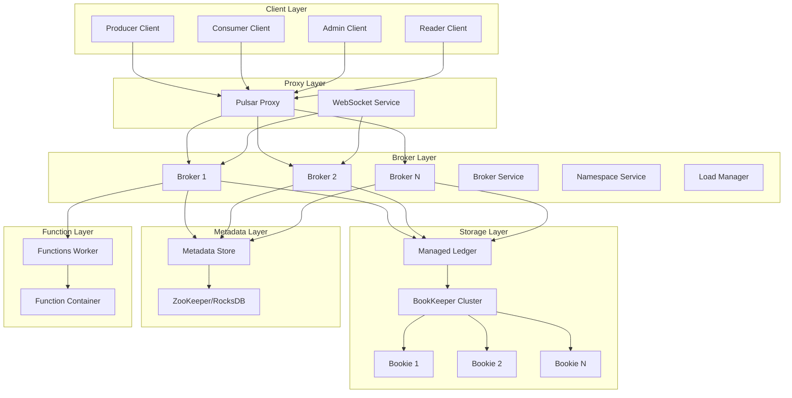
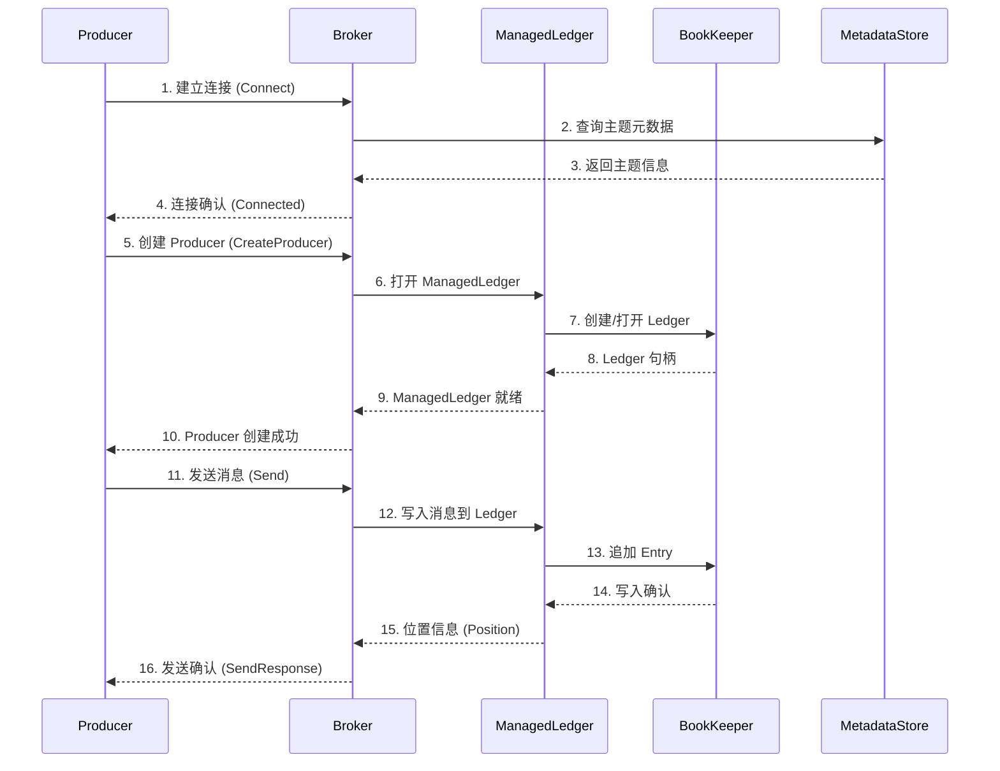
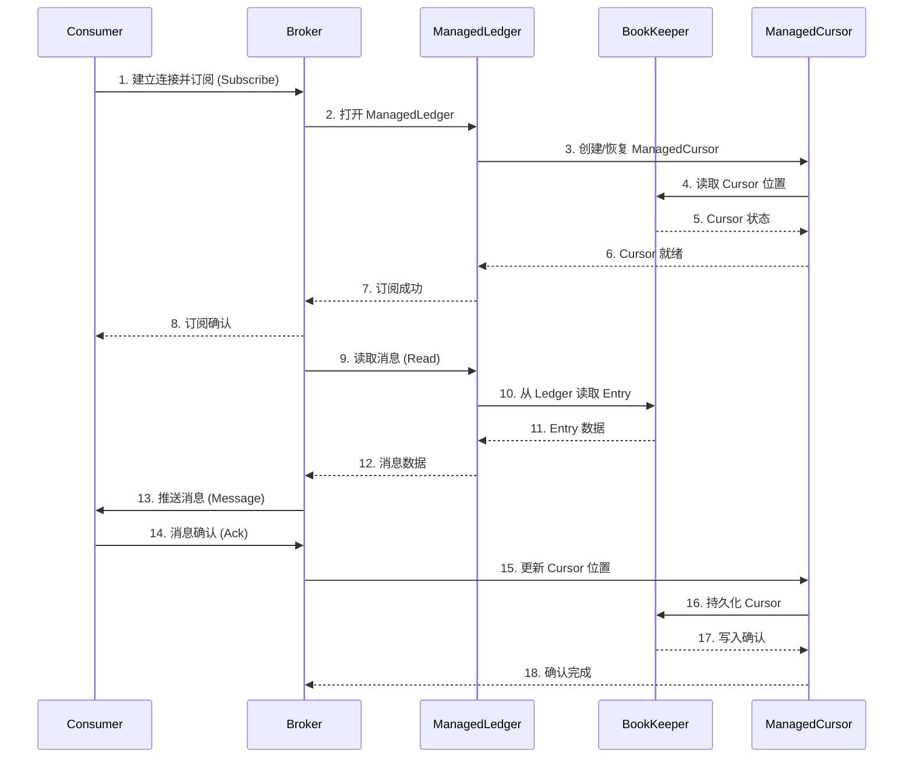
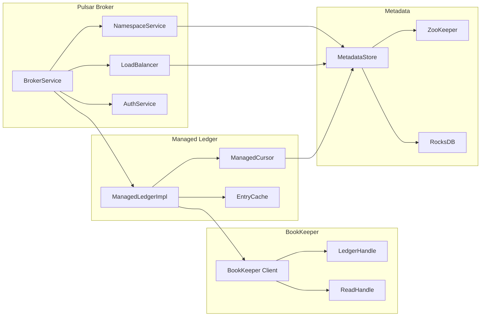
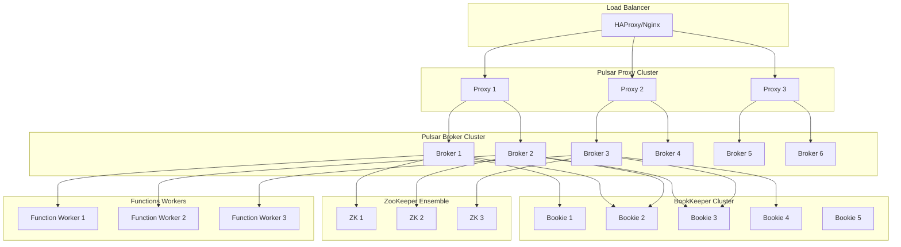

# Apache Pulsar 源码剖析：整体架构分析

## 1. 项目概述

Apache Pulsar 是一个分布式发布-订阅消息系统，具有灵活的消息模型和直观的客户端 API。它专为云原生环境而设计，支持多租户、水平扩展、强一致性保证和低延迟持久存储。

### 1.1 核心特性

- **水平可扩展性**：支持数百万独立主题和每秒数百万消息
- **强一致性保证**：提供消息顺序和数据一致性保障
- **低延迟持久存储**：基于 Apache BookKeeper 的分层存储架构
- **多租户支持**：内置认证、授权、配额管理
- **地理复制**：跨区域数据复制和灾难恢复
- **函数计算**：内置 Serverless 计算框架

## 2. 整体架构设计

### 2.1 核心组件架构图



### 2.2 分层架构说明

#### 2.2.1 客户端层 (Client Layer)
- **Producer**：消息生产者，负责发送消息到指定主题
- **Consumer**：消息消费者，从订阅中接收消息
- **Reader**：消息阅读器，从指定位置读取消息
- **Admin Client**：管理客户端，用于集群管理和配置

#### 2.2.2 代理层 (Proxy Layer)
- **Pulsar Proxy**：协议代理，处理客户端连接和负载均衡
- **WebSocket Service**：WebSocket 协议支持

#### 2.2.3 服务层 (Broker Layer)
- **Broker Service**：核心消息服务，处理生产和消费请求
- **Namespace Service**：命名空间管理，主题分配和负载均衡
- **Load Manager**：负载管理器，监控集群负载并决策分配

#### 2.2.4 存储层 (Storage Layer)
- **Managed Ledger**：管理账本抽象层，提供统一的存储接口
- **BookKeeper**：分布式日志存储系统，提供持久化保障

#### 2.2.5 元数据层 (Metadata Layer)
- **Metadata Store**：元数据存储，支持 ZooKeeper 和 RocksDB
- **Configuration Store**：全局配置存储

#### 2.2.6 函数计算层 (Function Layer)
- **Functions Worker**：函数工作节点，管理函数生命周期
- **Function Container**：函数执行容器

## 3. 消息流转时序图

### 3.1 消息发送时序图



### 3.2 消息消费时序图



## 4. 核心模块交互图



## 5. 关键数据结构概览

### 5.1 消息相关数据结构

```java
/**
 * 消息元数据结构
 * 包含消息的所有元信息，如消息ID、生产时间、属性等
 */
public class MessageMetadata {
    // 生产者名称
    private String producerName;
    // 消息序列号
    private long sequenceId;
    // 发布时间
    private long publishTime;
    // 消息属性
    private Map<String, String> properties;
    // 批量消息数量
    private int numMessagesInBatch;
    // 消息键
    private String partitionKey;
    // 消息压缩类型
    private CompressionType compressionType;
}

/**
 * 消息ID结构
 * 用于唯一标识一条消息的位置
 */
public class MessageIdImpl implements MessageId {
    // Ledger ID
    private final long ledgerId;
    // Entry ID
    private final long entryId;
    // 分区索引
    private final int partitionIndex;
    // 批量消息索引
    private final int batchIndex;
}
```

### 5.2 存储相关数据结构

```java
/**
 * 管理账本配置
 * 定义了 ManagedLedger 的行为和性能参数
 */
public class ManagedLedgerConfig {
    // 最大 Entry 大小
    private int maxEntrySize = 5 * 1024 * 1024;
    // Ledger 滚动时间
    private long retentionTimeMillis;
    // Ledger 滚动大小
    private long retentionSizeInMB;
    // 缓存大小
    private long entryCacheSizeMB = 256;
    // 数字签名类型
    private BookKeeper.DigestType digestType = BookKeeper.DigestType.CRC32;
}

/**
 * 位置信息
 * 表示消息在存储中的具体位置
 */
public class PositionImpl implements Position {
    // Ledger ID
    private final long ledgerId;
    // Entry ID  
    private final long entryId;
    
    // 比较位置大小
    public int compareTo(Position other) {
        PositionImpl otherPosition = (PositionImpl) other;
        if (ledgerId != otherPosition.ledgerId) {
            return Long.compare(ledgerId, otherPosition.ledgerId);
        }
        return Long.compare(entryId, otherPosition.entryId);
    }
}
```

### 5.3 消费者状态数据结构

```java
/**
 * 管理游标配置
 * 控制消费者的行为和性能
 */
public class ManagedCursorConfig {
    // 游标持久化间隔
    private long cursorUpdateTimeIntervalSeconds = 60;
    // 最大未确认消息数
    private int maxUnackedMessages = 10000;
    // 消费者优先级
    private int consumerPriority = 0;
    // 订阅类型
    private SubscriptionType subscriptionType;
}

/**
 * 游标信息
 * 维护消费者的消费位置和状态
 */
public class ManagedCursorInfo {
    // 当前游标位置
    private PositionInfo cursorsLedgerId;
    // 未确认消息范围
    private List<MessageRange> individualDeletedMessages;
    // 游标属性
    private Map<String, String> properties;
}
```

## 6. 配置管理

### 6.1 Broker 配置示例

```properties
# 基本配置
clusterName=pulsar-cluster
zookeeperServers=localhost:2181
configurationStoreServers=localhost:2181

# 网络配置
brokerServicePort=6650
brokerServicePortTls=6651
webServicePort=8080
webServicePortTls=8443

# 存储配置
managedLedgerDefaultEnsembleSize=3
managedLedgerDefaultWriteQuorum=3
managedLedgerDefaultAckQuorum=2
managedLedgerMaxEntriesPerLedger=50000

# 负载均衡配置
loadBalancerEnabled=true
loadBalancerPlacementStrategy=weightedRandomSelection
loadBalancerReportUpdateThresholdPercentage=10

# 认证授权配置
authenticationEnabled=false
authorizationEnabled=false
superUserRoles=admin,superuser
```

### 6.2 客户端配置示例

```java
// Producer 配置
PulsarClient client = PulsarClient.builder()
    .serviceUrl("pulsar://localhost:6650")
    .build();

Producer<String> producer = client.newProducer(Schema.STRING)
    .topic("my-topic")
    .producerName("my-producer")
    .sendTimeout(10, TimeUnit.SECONDS)
    .maxPendingMessages(1000)
    .batchingMaxMessages(100)
    .batchingMaxPublishDelay(100, TimeUnit.MILLISECONDS)
    .compressionType(CompressionType.LZ4)
    .create();

// Consumer 配置
Consumer<String> consumer = client.newConsumer(Schema.STRING)
    .topic("my-topic")
    .subscriptionName("my-subscription")
    .subscriptionType(SubscriptionType.Shared)
    .receiverQueueSize(1000)
    .maxUnackedMessages(1000)
    .ackTimeout(60, TimeUnit.SECONDS)
    .subscribe();
```

## 7. 部署架构

### 7.1 生产环境部署架构



## 8. 性能优化要点

### 8.1 生产者优化

- **批量发送**：启用消息批量发送以提高吞吐量
- **异步发送**：使用异步 API 避免阻塞
- **压缩算法**：选择合适的压缩算法平衡CPU和网络
- **连接池**：复用客户端连接减少建连开销

### 8.2 消费者优化

- **接收队列**：合理设置 receiverQueueSize
- **批量接收**：使用 batchReceive API
- **并行消费**：使用多个 Consumer 实例
- **确认策略**：选择合适的确认模式

### 8.3 Broker 优化

- **缓存配置**：合理设置 Entry Cache 大小
- **IO 线程**：根据负载调整 IO 线程数
- **JVM 参数**：优化 GC 配置和堆内存
- **磁盘IO**：使用 SSD 和合理的文件系统

### 8.4 BookKeeper 优化

- **Ensemble 配置**：合理设置副本数量
- **Journal 磁盘**：独立的 Journal 磁盘
- **内存配置**：足够的 DirectMemory
- **批量写入**：启用批量写入优化

## 9. 监控和运维

### 9.1 关键监控指标

- **吞吐量指标**：messages/s, MB/s
- **延迟指标**：publish latency, consume latency  
- **存储指标**：storage size, backlog size
- **连接指标**：active connections, failed connections
- **JVM 指标**：heap usage, GC metrics

### 9.2 故障排查

- **日志分析**：结合 broker、bookie 日志
- **元数据检查**：验证 ZooKeeper 数据一致性
- **网络诊断**：检查网络连通性和延迟
- **资源监控**：CPU、内存、磁盘、网络使用率

这个整体架构分析为深入理解 Apache Pulsar 奠定了基础。接下来我们将深入分析各个核心模块的实现细节。
