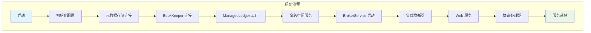
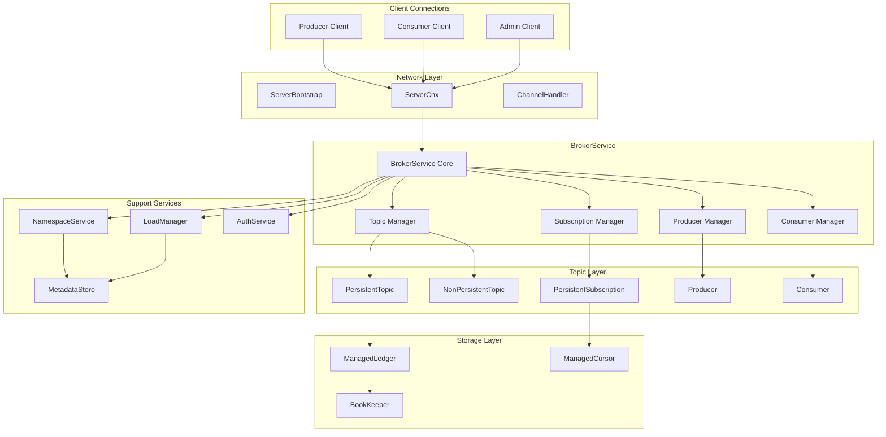
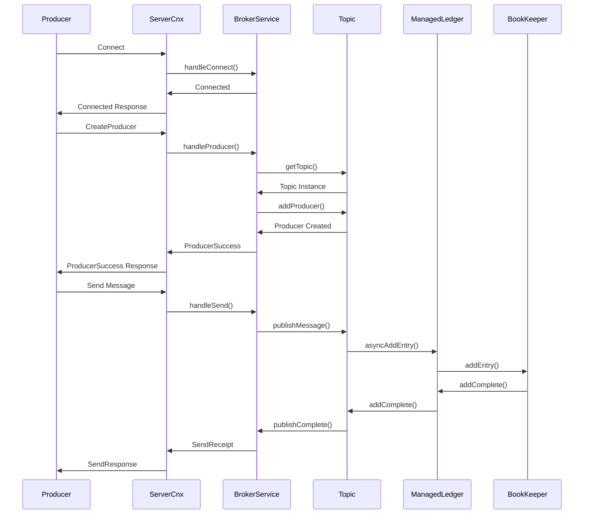
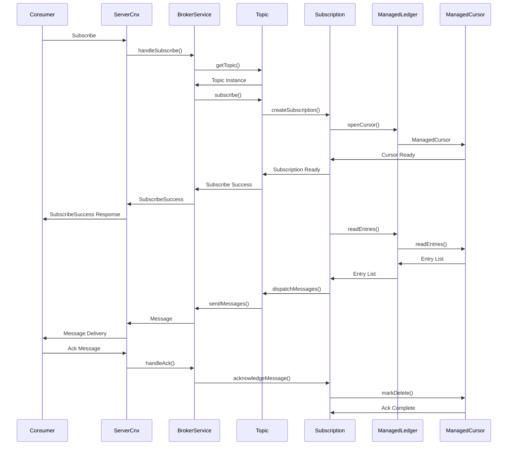
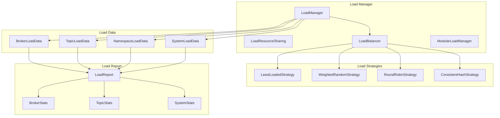
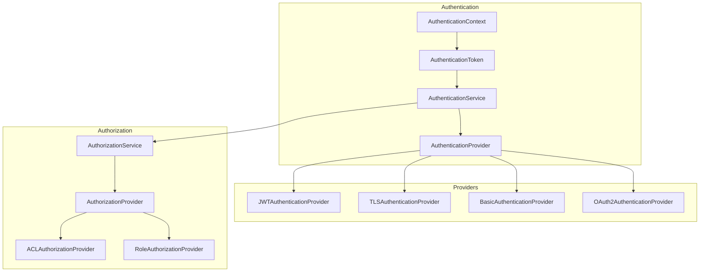

# Apache Pulsar Broker 模块深度分析

## 1. Broker 模块概述

Broker 是 Apache Pulsar 的核心服务组件，负责处理客户端的消息发布和订阅请求、主题管理、负载均衡、认证授权等核心功能。本文档将深入分析 Broker 模块的架构设计和关键实现。

### 1.1 模块结构

```
pulsar-broker/
├── src/main/java/org/apache/pulsar/
│   ├── PulsarBrokerStarter.java         # Broker 启动器
│   ├── PulsarService.java               # 核心服务类
│   └── broker/
│       ├── service/                     # 服务层
│       │   ├── BrokerService.java       # Broker 服务核心
│       │   ├── ServerCnx.java           # 客户端连接处理
│       │   ├── Topic.java               # 主题接口
│       │   ├── persistent/              # 持久化主题实现
│       │   └── nonpersistent/           # 非持久化主题实现
│       ├── admin/                       # 管理接口
│       ├── loadbalance/                 # 负载均衡
│       ├── namespace/                   # 命名空间管理
│       ├── stats/                       # 统计监控
│       └── web/                         # Web 服务
```

## 2. 核心架构设计

### 2.1 Broker 服务启动架构



### 2.2 Broker 服务架构图



## 3. 关键类详细分析

### 3.1 PulsarService - 核心服务类

```java
/**
 * PulsarService 是 Pulsar Broker 的核心服务类
 * 负责协调和管理所有子服务的生命周期
 */
public class PulsarService implements Closeable {
    // 服务配置
    private final ServiceConfiguration config;
    
    // 核心服务组件
    private BrokerService brokerService;           // Broker 服务
    private NamespaceService nsService;            // 命名空间服务  
    private LoadManager loadManager;               // 负载管理器
    private BookKeeperClientFactory bkClientFactory; // BookKeeper 客户端工厂
    private ManagedLedgerStorage managedLedgerStorage; // 存储层
    
    // 元数据存储
    private MetadataStoreExtended localMetadataStore;        // 本地元数据存储
    private MetadataStoreExtended configurationMetadataStore; // 配置元数据存储
    private PulsarResources pulsarResources;                 // Pulsar 资源管理
    
    // 网络和安全
    private AuthenticationService authenticationService;     // 认证服务
    private AuthorizationService authorizationService;      // 授权服务
    private WebService webService;                          // Web 服务
    
    // 扩展功能
    private WorkerService functionsWorkerService;           // 函数工作服务
    private TransactionMetadataStoreService transactionMetadataStoreService; // 事务元数据服务
    
    /**
     * 启动 Pulsar 服务
     * 按照依赖关系顺序启动各个子服务
     */
    public void start() throws PulsarServerException {
        LOG.info("Starting Pulsar Broker service; version: '{}'", brokerVersion);
        
        mutex.lock();
        try {
            // 1. 验证配置
            validateConfiguration();
            
            // 2. 初始化元数据存储
            initializeMetadataStore();
            
            // 3. 初始化 BookKeeper 客户端工厂
            this.bkClientFactory = newBookKeeperClientFactory();
            
            // 4. 初始化存储层
            managedLedgerStorage = newManagedLedgerStorage();
            
            // 5. 创建 BrokerService
            this.brokerService = newBrokerService(this);
            
            // 6. 启动负载管理服务
            startLoadManagementService();
            
            // 7. 启动命名空间服务
            startNamespaceService();
            
            // 8. 启动认证和授权服务
            startAuthenticationService();
            
            // 9. 启动 Web 服务
            startWebService();
            
            // 10. 启动 BrokerService
            brokerService.start();
            
            // 11. 启动协议处理器
            startProtocolHandlers();
            
            // 12. 启动函数工作服务
            startWorkerService();
            
            state = State.Started;
            LOG.info("messaging service is ready, cluster={}", config.getClusterName());
            
        } catch (Exception e) {
            LOG.error("Failed to start Pulsar service: {}", e.getMessage(), e);
            throw PulsarServerException.from(e);
        } finally {
            mutex.unlock();
        }
    }
    
    /**
     * 验证配置参数
     */
    private void validateConfiguration() {
        if (config.getWebServicePort().isEmpty() && config.getWebServicePortTls().isEmpty()) {
            throw new IllegalArgumentException("webServicePort/webServicePortTls must be present");
        }
        
        if (config.isAuthorizationEnabled() && !config.isAuthenticationEnabled()) {
            throw new IllegalStateException("Authentication must be enabled when authorization is enabled");
        }
        
        // 验证存储配额配置
        if (config.getDefaultRetentionSizeInMB() > 0 
            && config.getBacklogQuotaDefaultLimitBytes() > 0
            && config.getBacklogQuotaDefaultLimitBytes() >= (config.getDefaultRetentionSizeInMB() * 1024L * 1024L)) {
            throw new IllegalArgumentException("Retention size must be greater than backlog quota limit");
        }
    }
    
    /**
     * 初始化元数据存储
     */
    private void initializeMetadataStore() throws Exception {
        // 创建本地元数据存储
        localMetadataStore = createLocalMetadataStore(openTelemetry.getOpenTelemetryService().getOpenTelemetry());
        localMetadataStore.registerSessionListener(this::handleMetadataSessionEvent);
        
        // 创建配置元数据存储
        if (config.isConfigurationStoreSeparated()) {
            configurationMetadataStore = createConfigurationMetadataStore(
                configMetadataSynchronizer, openTelemetry.getOpenTelemetryService().getOpenTelemetry());
        } else {
            configurationMetadataStore = localMetadataStore;
        }
        
        // 初始化 Pulsar 资源管理器
        pulsarResources = newPulsarResources();
        
        // 初始化协调服务
        coordinationService = new CoordinationServiceImpl(localMetadataStore);
    }
}
```

### 3.2 BrokerService - Broker 服务核心

```java
/**
 * BrokerService 是处理客户端请求的核心服务
 * 负责主题管理、生产者/消费者连接管理、消息路由等
 */
@Getter(AccessLevel.PUBLIC)
@Setter(AccessLevel.PROTECTED)
public class BrokerService implements Closeable {
    private static final Logger log = LoggerFactory.getLogger(BrokerService.class);
    
    // 核心组件
    private final PulsarService pulsar;                    // Pulsar 服务引用
    private final ManagedLedgerStorage managedLedgerStorage; // 存储层
    
    // 主题管理
    private final Map<String, CompletableFuture<Optional<Topic>>> topics = new ConcurrentHashMap<>();
    private final Map<String, Map<String, Map<String, Topic>>> multiLayerTopicsMap = new ConcurrentHashMap<>();
    private final Map<String, Set<Integer>> owningTopics = new ConcurrentHashMap<>();
    
    // 网络层
    private final EventLoopGroup acceptorGroup;           // 接收器线程组
    private final EventLoopGroup workerGroup;             // 工作线程组
    private final OrderedExecutor topicOrderedExecutor;   // 主题有序执行器
    
    // 缓存和统计
    private final ConcurrentLongHashMap<PartitionedTopicMetadata> partitionedTopicMetadataCache;
    private final PulsarStats pulsarStats;
    
    // 速率限制
    private final PublishRateLimiter brokerPublishRateLimiter;
    private final DispatchRateLimiterFactory dispatchRateLimiterFactory;
    
    // 认证授权
    private AuthenticationService authenticationService;
    private AuthorizationService authorizationService;
    
    public BrokerService(PulsarService pulsar, EventLoopGroup eventLoopGroup) throws Exception {
        this.pulsar = pulsar;
        this.clock = pulsar.getClock();
        this.managedLedgerStorage = pulsar.getManagedLedgerStorage();
        
        // 初始化执行器
        this.topicOrderedExecutor = OrderedExecutor.newBuilder()
                .numThreads(pulsar.getConfiguration().getTopicOrderedExecutorThreadNum())
                .name("broker-topic-workers")
                .build();
        
        // 初始化网络组件
        this.acceptorGroup = EventLoopUtil.newEventLoopGroup(
                pulsar.getConfiguration().getNumAcceptorThreads(), 
                false, 
                new ExtendedThreadFactory("pulsar-acceptor"));
        this.workerGroup = eventLoopGroup;
        
        // 初始化速率限制器
        this.brokerPublishRateLimiter = new PublishRateLimiterImpl(pulsar.getMonotonicClock());
        this.dispatchRateLimiterFactory = createDispatchRateLimiterFactory(pulsar.getConfig());
        
        // 初始化统计组件
        this.pulsarStats = new PulsarStats(pulsar);
        
        // 初始化认证授权服务
        this.authenticationService = new AuthenticationService(
                pulsar.getConfiguration(), pulsar.getPulsarResources());
        this.authorizationService = new AuthorizationService(
                pulsar.getConfiguration(), pulsar.getPulsarResources());
    }
    
    /**
     * 启动 Broker 服务
     */
    public void start() throws PulsarServerException {
        try {
            // 1. 启动认证服务
            this.authenticationService.initialize(pulsar);
            
            // 2. 启动网络服务
            startNetworkService();
            
            // 3. 启动统计服务
            startStatsUpdater();
            
            // 4. 启动清理任务
            startInactivityMonitor();
            startMessageExpiryMonitor();
            
            // 5. 启动背压检查
            startBacklogQuotaChecker();
            
        } catch (Exception e) {
            LOG.error("Failed to start broker service", e);
            throw new PulsarServerException(e);
        }
    }
    
    /**
     * 启动网络服务
     */
    private void startNetworkService() throws Exception {
        ServiceConfiguration config = pulsar.getConfiguration();
        
        // 创建服务器启动配置
        ServerBootstrap bootstrap = new ServerBootstrap()
                .group(acceptorGroup, workerGroup)
                .channel(EventLoopUtil.getServerSocketChannelClass(workerGroup))
                .childOption(ChannelOption.TCP_NODELAY, true)
                .childOption(ChannelOption.RCVBUF_ALLOCATOR,
                        new AdaptiveRecvByteBufAllocator(1024, 16 * 1024, 1 * 1024 * 1024))
                .childHandler(new ServiceChannelInitializer(this, config, false));
        
        // 绑定端口
        if (config.getBrokerServicePort().isPresent()) {
            listenChannel = bootstrap.bind(config.getBrokerServicePort().get()).sync().channel();
            LOG.info("Started Pulsar Broker service on port {}", config.getBrokerServicePort().get());
        }
        
        // 绑定 TLS 端口
        if (config.getBrokerServicePortTls().isPresent()) {
            ServerBootstrap tlsBootstrap = bootstrap.clone()
                    .childHandler(new ServiceChannelInitializer(this, config, true));
            listenChannelTls = tlsBootstrap.bind(config.getBrokerServicePortTls().get()).sync().channel();
            LOG.info("Started Pulsar Broker TLS service on port {}", config.getBrokerServicePortTls().get());
        }
    }
    
    /**
     * 获取或创建主题
     * 这是 Broker 处理主题请求的核心方法
     */
    public CompletableFuture<Optional<Topic>> getOrCreateTopic(final String topic) {
        return getTopic(topic, true /* createIfMissing */, null);
    }
    
    /**
     * 获取主题（内部实现）
     */
    public CompletableFuture<Optional<Topic>> getTopic(final String topic, boolean createIfMissing,
                                                       Map<String, String> properties) {
        try {
            CompletableFuture<Optional<Topic>> topicFuture = topics.get(topic);
            if (topicFuture != null) {
                // 主题已存在或正在创建中
                if (topicFuture.isCompletedExceptionally() || 
                    (topicFuture.isDone() && !topicFuture.get().isPresent())) {
                    // 之前的创建失败，移除并重试
                    topics.remove(topic, topicFuture);
                } else {
                    // 返回现有的 Future
                    return topicFuture;
                }
            }
            
            // 验证主题名称
            final TopicName topicName = TopicName.get(topic);
            validateTopicName(topicName);
            
            if (!createIfMissing) {
                return CompletableFuture.completedFuture(Optional.empty());
            }
            
            // 创建新的主题 Future
            final CompletableFuture<Optional<Topic>> topicCreateFuture = new CompletableFuture<>();
            final CompletableFuture<Optional<Topic>> existingFuture = 
                    topics.putIfAbsent(topic, topicCreateFuture);
            
            if (existingFuture != null) {
                // 其他线程已经在创建，返回现有的 Future
                return existingFuture;
            }
            
            // 异步创建主题
            createTopicIfDoesNotExist(topicName, properties)
                    .thenAccept(createdTopic -> {
                        if (createdTopic.isPresent()) {
                            // 添加到多层映射中
                            addTopicToMultiLayerTopicsMap(topic, createdTopic.get());
                        }
                        topicCreateFuture.complete(createdTopic);
                    })
                    .exceptionally(ex -> {
                        LOG.warn("Failed to create topic {}", topic, ex);
                        topics.remove(topic, topicCreateFuture);
                        topicCreateFuture.completeExceptionally(ex);
                        return null;
                    });
            
            return topicCreateFuture;
            
        } catch (Exception e) {
            LOG.warn("Failed to get topic {}", topic, e);
            return FutureUtil.failedFuture(e);
        }
    }
    
    /**
     * 创建主题（如果不存在）
     */
    private CompletableFuture<Optional<Topic>> createTopicIfDoesNotExist(TopicName topicName, 
                                                                        Map<String, String> properties) {
        return checkTopicNsOwnership(topicName.getNamespaceObject())
                .thenCompose(__ -> pulsar.getNamespaceService().checkTopicOwnership(topicName))
                .thenCompose(__ -> {
                    // 检查是否为分区主题
                    return fetchPartitionedTopicMetadataAsync(topicName)
                            .thenCompose(metadata -> {
                                if (metadata.partitions > 0) {
                                    // 分区主题不能直接创建
                                    return CompletableFuture.completedFuture(Optional.<Topic>empty());
                                } else {
                                    // 创建常规主题
                                    return createNonPartitionedTopicAsync(topicName, properties);
                                }
                            });
                });
    }
    
    /**
     * 创建非分区主题
     */
    private CompletableFuture<Optional<Topic>> createNonPartitionedTopicAsync(TopicName topicName, 
                                                                             Map<String, String> properties) {
        final String topicNameStr = topicName.toString();
        
        return CompletableFuture.supplyAsync(() -> {
            try {
                // 获取主题配置
                ManagedLedgerConfig managedLedgerConfig = getManagedLedgerConfig(topicName, properties);
                
                // 创建主题实例
                if (topicName.getDomain() == TopicDomain.persistent) {
                    return createPersistentTopic(topicNameStr, managedLedgerConfig);
                } else {
                    return createNonPersistentTopic(topicNameStr);
                }
            } catch (Exception e) {
                throw new RuntimeException("Failed to create topic " + topicNameStr, e);
            }
        }, topicOrderedExecutor.chooseThread(topicNameStr))
        .thenApply(Optional::of);
    }
    
    /**
     * 创建持久化主题
     */
    private Topic createPersistentTopic(String topicName, ManagedLedgerConfig config) throws Exception {
        return new PersistentTopic(topicName, 
                managedLedgerStorage.getManagedLedgerFactory().open(topicName, config), 
                this);
    }
    
    /**
     * 创建非持久化主题
     */
    private Topic createNonPersistentTopic(String topicName) {
        return new NonPersistentTopic(topicName, this);
    }
}
```

## 4. 消息处理流程

### 4.1 生产者连接和发送消息时序图



### 4.2 消费者连接和消费消息时序图



## 5. 核心数据结构

### 5.1 Topic 主题接口设计

```java
/**
 * Topic 是 Pulsar 中主题的抽象接口
 * 定义了主题的核心操作方法
 */
public interface Topic {
    
    /**
     * 添加生产者到主题
     * @param producer 生产者实例
     * @param producerQueuedFuture 生产者创建的 Future
     */
    void addProducer(Producer producer, CompletableFuture<Void> producerQueuedFuture);
    
    /**
     * 移除生产者
     * @param producer 生产者实例
     */
    void removeProducer(Producer producer);
    
    /**
     * 创建订阅
     * @param subscriptionName 订阅名称
     * @param consumer 消费者实例
     * @param replicated 是否为复制订阅
     * @return 创建订阅的 Future
     */
    CompletableFuture<Consumer> subscribe(String subscriptionName, Consumer consumer, boolean replicated);
    
    /**
     * 取消订阅
     * @param consumer 消费者实例
     */
    CompletableFuture<Void> unsubscribe(Consumer consumer);
    
    /**
     * 发布消息
     * @param headersAndPayload 消息头和负载
     * @param callback 发布回调
     */
    void publishMessage(ByteBuf headersAndPayload, PublishCallback callback);
    
    /**
     * 获取主题统计信息
     * @param getPreciseBacklog 是否获取精确的积压统计
     * @param includePublishers 是否包含生产者信息
     * @param includeConsumers 是否包含消费者信息
     * @return 主题统计信息
     */
    CompletableFuture<TopicStatsImpl> getStats(boolean getPreciseBacklog, 
                                              boolean includePublishers, 
                                              boolean includeConsumers);
    
    /**
     * 检查主题是否活跃
     * @return true 如果主题活跃
     */
    boolean isActive();
    
    /**
     * 关闭主题
     * @return 关闭操作的 Future
     */
    CompletableFuture<Void> close();
}
```

### 5.2 PersistentTopic 持久化主题实现

```java
/**
 * PersistentTopic 是持久化主题的实现类
 * 基于 ManagedLedger 提供持久化存储
 */
public class PersistentTopic extends AbstractTopic implements Topic, AddEntryCallback {
    
    // 管理账本，提供持久化存储
    protected final ManagedLedger ledger;
    
    // 订阅映射：订阅名 -> 持久化订阅
    private final Map<String, PersistentSubscription> subscriptions = new ConcurrentHashMap<>();
    
    // 复制器映射：远程集群 -> 复制器
    private final Map<String, Replicator> replicators = new ConcurrentHashMap<>();
    
    // 影子主题复制器
    private final Map<String, Replicator> shadowReplicators = new ConcurrentHashMap<>();
    
    // 去重游标名称
    public static final String DEDUPLICATION_CURSOR_NAME = "pulsar.dedup";
    
    // 消息过期阈值
    private static final double MESSAGE_EXPIRY_THRESHOLD = 1.5;
    
    // 分发速率限制器
    private Optional<DispatchRateLimiter> dispatchRateLimiter = Optional.empty();
    
    // 订阅速率限制器
    private Optional<SubscribeRateLimiter> subscribeRateLimiter = Optional.empty();
    
    public PersistentTopic(String topic, ManagedLedger ledger, BrokerService brokerService) {
        super(topic, brokerService);
        this.ledger = ledger;
        this.shadowSourceTopic = getShadowSourceTopic(TopicName.get(topic));
        
        // 初始化主题策略
        initializeTopicPolicies();
        
        // 启动消息过期检查
        startMessageExpiryCheckIfNeeded();
        
        // 启动压缩检查
        scheduleCompactionIfNeeded();
    }
    
    /**
     * 发布消息到主题
     */
    @Override
    public void publishMessage(ByteBuf headersAndPayload, PublishCallback callback) {
        // 检查主题是否被围栏
        if (isFenced) {
            callback.completed(new TopicFencedException("Topic is fenced"), -1, -1);
            return;
        }
        
        // 检查发布速率限制
        if (!checkPublishRate()) {
            callback.completed(new NotAllowedException("Publish rate exceeded"), -1, -1);
            return;
        }
        
        MessageDeduplication.MessageDupStatus status = messageDeduplication.isDuplicate(publishContext, callback);
        if (status != MessageDeduplication.MessageDupStatus.NotDup) {
            return;
        }
        
        // 添加到管理账本
        ledger.asyncAddEntry(headersAndPayload, callback, this);
    }
    
    /**
     * 添加条目完成回调（实现 AddEntryCallback 接口）
     */
    @Override
    public void addComplete(Position position, ByteBuf entryData, Object ctx) {
        PublishCallback callback = (PublishCallback) ctx;
        
        try {
            // 更新统计信息
            PUBLISH_CALLBACK_COMPLETE_LATENCY.observe(System.nanoTime() - callback.getStartTime(), TimeUnit.NANOSECONDS);
            
            // 通知生产者发送成功
            callback.completed(null, ((PositionImpl) position).getLedgerId(), ((PositionImpl) position).getEntryId());
            
            // 触发消息分发
            dispatchMessagesToSubscriptions(position, entryData);
            
        } catch (Exception e) {
            LOG.error("[{}] Failed to complete message publish", topic, e);
            callback.completed(e, -1, -1);
        }
    }
    
    /**
     * 添加条目失败回调
     */
    @Override
    public void addFailed(ManagedLedgerException exception, Object ctx) {
        PublishCallback callback = (PublishCallback) ctx;
        
        // 更新失败统计
        incrementPublishFailed();
        
        // 处理特定异常类型
        if (exception instanceof ManagedLedgerFencedException) {
            callback.completed(new TopicFencedException(exception), -1, -1);
        } else if (exception instanceof ManagedLedgerTerminatedException) {
            callback.completed(new TopicTerminatedException(exception), -1, -1);  
        } else {
            callback.completed(new PersistenceException(exception), -1, -1);
        }
    }
    
    /**
     * 创建订阅
     */
    @Override
    public CompletableFuture<Consumer> subscribe(String subscriptionName, Consumer consumer, boolean replicated) {
        return CompletableFuture.supplyAsync(() -> {
            try {
                PersistentSubscription subscription = subscriptions.get(subscriptionName);
                
                if (subscription == null) {
                    // 创建新订阅
                    subscription = createSubscription(subscriptionName, consumer.getSubscriptionType(), 
                                                    consumer.getStartMessageId(), replicated);
                    subscriptions.put(subscriptionName, subscription);
                }
                
                // 添加消费者到订阅
                subscription.addConsumer(consumer);
                return consumer;
                
            } catch (Exception e) {
                throw new RuntimeException("Failed to subscribe to " + subscriptionName, e);
            }
        }, brokerService.getTopicOrderedExecutor().chooseThread(topic));
    }
    
    /**
     * 创建持久化订阅
     */
    private PersistentSubscription createSubscription(String subscriptionName, 
                                                     SubscriptionType subscriptionType,
                                                     MessageId startMessageId, 
                                                     boolean replicated) throws Exception {
        
        // 打开管理游标
        ManagedCursor cursor = ledger.openCursor(subscriptionName, 
                CommandSubscribe.InitialPosition.Latest, 
                createManagedCursorConfig(subscriptionType));
        
        // 创建订阅实例
        PersistentSubscription subscription = new PersistentSubscription(this, subscriptionName, cursor, replicated);
        
        // 设置起始位置
        if (startMessageId != null && startMessageId != MessageId.latest) {
            Position position = MessageIdUtils.getPosition(startMessageId);
            cursor.seek(position);
        }
        
        return subscription;
    }
    
    /**
     * 分发消息到所有订阅
     */
    private void dispatchMessagesToSubscriptions(Position position, ByteBuf entryData) {
        // 解析消息元数据
        MessageMetadata msgMetadata;
        try {
            msgMetadata = Commands.parseMessageMetadata(entryData);
        } catch (Throwable t) {
            LOG.error("[{}] Failed to parse message metadata at position {}", topic, position, t);
            return;
        }
        
        // 分发到所有活跃订阅
        subscriptions.values().forEach(subscription -> {
            try {
                subscription.acknowledgeMessage(Collections.singletonList(position), 
                                              AckType.Individual, Collections.emptyMap());
            } catch (Exception e) {
                LOG.warn("[{}] Failed to dispatch message to subscription {}", topic, subscription.getName(), e);
            }
        });
        
        // 分发到复制器
        replicators.values().forEach(replicator -> {
            replicator.sendMessage(position, msgMetadata, entryData);
        });
    }
    
    /**
     * 获取主题统计信息
     */
    @Override
    public CompletableFuture<TopicStatsImpl> getStats(boolean getPreciseBacklog, 
                                                     boolean includePublishers, 
                                                     boolean includeConsumers) {
        return CompletableFuture.supplyAsync(() -> {
            TopicStatsImpl stats = new TopicStatsImpl();
            
            // 基础统计
            stats.msgInCounter = msgInCounter.longValue();
            stats.bytesInCounter = bytesInCounter.longValue();
            stats.msgOutCounter = msgOutCounter.longValue();
            stats.bytesOutCounter = bytesOutCounter.longValue();
            
            // 存储统计
            ManagedLedgerMXBean ledgerMXBean = ledger.getStats();
            stats.storageSize = ledgerMXBean.getStoredMessagesSize();
            stats.backlogSize = getPreciseBacklog ? calculatePreciseBacklogSize() : estimateBacklogSize();
            
            // 生产者统计
            if (includePublishers) {
                stats.publishers = new ArrayList<>();
                producers.values().forEach(producer -> {
                    PublisherStatsImpl publisherStats = new PublisherStatsImpl();
                    publisherStats.producerName = producer.getProducerName();
                    publisherStats.msgRateIn = producer.getStats().msgRateIn;
                    publisherStats.msgThroughputIn = producer.getStats().msgThroughputIn;
                    stats.publishers.add(publisherStats);
                });
            }
            
            // 订阅统计
            if (includeConsumers) {
                stats.subscriptions = new HashMap<>();
                subscriptions.forEach((subName, subscription) -> {
                    SubscriptionStatsImpl subStats = subscription.getStats(getPreciseBacklog);
                    stats.subscriptions.put(subName, subStats);
                });
            }
            
            return stats;
        }, brokerService.getTopicOrderedExecutor().chooseThread(topic));
    }
}
```

## 6. 负载均衡机制

### 6.1 负载均衡架构



### 6.2 负载均衡策略

```java
/**
 * 负载均衡策略接口
 */
public interface LoadBalancingStrategy {
    
    /**
     * 选择最佳的 Broker 来处理新的主题
     * @param candidates 候选 Broker 列表
     * @param bundleToAssign 要分配的 Bundle
     * @param loadData 负载数据
     * @return 选中的 Broker
     */
    Optional<String> selectBroker(Set<String> candidates, BundleData bundleToAssign, LoadData loadData);
}

/**
 * 最少负载策略实现
 */
public class LeastLoadedStrategy implements LoadBalancingStrategy {
    
    @Override
    public Optional<String> selectBroker(Set<String> candidates, BundleData bundleToAssign, LoadData loadData) {
        String bestBroker = null;
        double bestScore = Double.MAX_VALUE;
        
        for (String candidate : candidates) {
            BrokerData brokerData = loadData.getBrokerData().get(candidate);
            if (brokerData == null) {
                continue;
            }
            
            // 计算负载评分
            double score = calculateLoadScore(brokerData);
            
            if (score < bestScore) {
                bestScore = score;
                bestBroker = candidate;
            }
        }
        
        return Optional.ofNullable(bestBroker);
    }
    
    /**
     * 计算 Broker 负载评分
     */
    private double calculateLoadScore(BrokerData brokerData) {
        // 综合考虑 CPU、内存、网络和磁盘使用率
        double cpuWeight = 0.3;
        double memoryWeight = 0.3;
        double networkWeight = 0.2;
        double diskWeight = 0.2;
        
        return brokerData.getCpuUsage() * cpuWeight +
               brokerData.getMemoryUsage() * memoryWeight +
               brokerData.getNetworkUsage() * networkWeight +
               brokerData.getDiskUsage() * diskWeight;
    }
}
```

## 7. 认证授权机制

### 7.1 认证服务架构



### 7.2 认证实现

```java
/**
 * 认证服务实现
 */
public class AuthenticationService implements Closeable {
    
    private final Map<String, AuthenticationProvider> providers = new HashMap<>();
    private final ServiceConfiguration config;
    private final PulsarResources pulsarResources;
    
    public AuthenticationService(ServiceConfiguration config, PulsarResources pulsarResources) {
        this.config = config;
        this.pulsarResources = pulsarResources;
    }
    
    /**
     * 初始化认证服务
     */
    public void initialize(PulsarService pulsar) throws Exception {
        if (!config.isAuthenticationEnabled()) {
            return;
        }
        
        // 加载认证提供者
        Set<String> providerClassNames = config.getAuthenticationProviders();
        for (String className : providerClassNames) {
            @SuppressWarnings("unchecked")
            Class<AuthenticationProvider> providerClass = 
                    (Class<AuthenticationProvider>) Class.forName(className);
            
            AuthenticationProvider provider = providerClass.getDeclaredConstructor().newInstance();
            provider.initialize(config);
            
            providers.put(provider.getAuthMethodName(), provider);
            LOG.info("Loaded authentication provider: {}", className);
        }
    }
    
    /**
     * 认证客户端连接
     */
    public AuthenticationDataSource authenticate(AuthenticationDataSource authData, String authMethodName) 
            throws AuthenticationException {
        
        AuthenticationProvider provider = providers.get(authMethodName);
        if (provider == null) {
            throw new AuthenticationException("Authentication provider not found: " + authMethodName);
        }
        
        // 执行认证
        String authRole = provider.authenticate(authData);
        
        // 创建认证上下文
        AuthenticationDataSource authDataSource = new AuthenticationDataSource() {
            @Override
            public String getCommandData() {
                return authRole;
            }
            
            @Override
            public String getPrincipal() {
                return authRole;
            }
        };
        
        return authDataSource;
    }
}

/**
 * JWT 认证提供者
 */
public class AuthenticationProviderJwt implements AuthenticationProvider {
    
    private JwtParser jwtParser;
    private String[] superUserRoles;
    
    @Override
    public void initialize(ServiceConfiguration config) throws IOException {
        // 初始化 JWT 解析器
        String secretKey = config.getProperty("tokenSecretKey");
        if (secretKey != null) {
            jwtParser = Jwts.parserBuilder()
                    .setSigningKey(secretKey.getBytes())
                    .build();
        }
        
        // 获取超级用户角色列表
        superUserRoles = config.getSuperUserRoles().toArray(new String[0]);
    }
    
    @Override
    public String authenticate(AuthenticationDataSource authData) throws AuthenticationException {
        try {
            String token = authData.getCommandData();
            if (token == null || token.isEmpty()) {
                throw new AuthenticationException("JWT token is missing");
            }
            
            // 解析 JWT Token
            Claims claims = jwtParser.parseClaimsJws(token).getBody();
            String subject = claims.getSubject();
            
            if (subject == null || subject.isEmpty()) {
                throw new AuthenticationException("JWT subject is missing");
            }
            
            return subject;
            
        } catch (JwtException e) {
            throw new AuthenticationException("Invalid JWT token: " + e.getMessage());
        }
    }
    
    @Override
    public String getAuthMethodName() {
        return "token";
    }
}
```

## 8. 监控和统计

### 8.1 统计数据收集

```java
/**
 * Pulsar 统计收集器
 */
public class PulsarStats {
    
    // 主题级别统计
    private final Map<String, TopicStatsImpl> topicStats = new ConcurrentHashMap<>();
    
    // 命名空间级别统计  
    private final Map<String, NamespaceStatsImpl> namespaceStats = new ConcurrentHashMap<>();
    
    // Broker 级别统计
    private final BrokerStatsImpl brokerStats = new BrokerStatsImpl();
    
    // JVM 统计
    private final JvmStatsImpl jvmStats = new JvmStatsImpl();
    
    public PulsarStats(PulsarService pulsar) {
        this.pulsar = pulsar;
        
        // 启动统计收集定时任务
        ScheduledExecutorService executor = pulsar.getExecutor();
        executor.scheduleAtFixedRate(this::updateStats, 60, 60, TimeUnit.SECONDS);
    }
    
    /**
     * 更新统计信息
     */
    private void updateStats() {
        try {
            updateBrokerStats();
            updateTopicStats();
            updateNamespaceStats();
            updateJvmStats();
        } catch (Exception e) {
            LOG.error("Failed to update stats", e);
        }
    }
    
    /**
     * 更新 Broker 统计
     */
    private void updateBrokerStats() {
        BrokerService brokerService = pulsar.getBrokerService();
        
        // 连接统计
        brokerStats.connections = brokerService.getCurrentConnectionCount();
        brokerStats.producers = brokerService.getNumberOfProducers();
        brokerStats.consumers = brokerService.getNumberOfConsumers();
        brokerStats.subscriptions = brokerService.getNumberOfSubscriptions();
        
        // 吞吐量统计
        brokerStats.msgRateIn = calculateMessageRateIn();
        brokerStats.msgRateOut = calculateMessageRateOut();
        brokerStats.msgThroughputIn = calculateThroughputIn();
        brokerStats.msgThroughputOut = calculateThroughputOut();
        
        // 存储统计
        ManagedLedgerFactoryMXBean mlFactory = pulsar.getManagedLedgerStorage()
                .getManagedLedgerFactory().getStats();
        brokerStats.storageSize = mlFactory.getTotalStoredMessagesSize();
        brokerStats.backlogSize = calculateTotalBacklogSize();
    }
    
    /**
     * 更新主题统计
     */
    private void updateTopicStats() {
        Map<String, CompletableFuture<Optional<Topic>>> topics = pulsar.getBrokerService().getTopics();
        
        topics.forEach((topicName, topicFuture) -> {
            if (topicFuture.isDone() && !topicFuture.isCompletedExceptionally()) {
                try {
                    Optional<Topic> topicOptional = topicFuture.get();
                    if (topicOptional.isPresent()) {
                        Topic topic = topicOptional.get();
                        
                        // 异步获取主题统计
                        topic.getStats(false, true, true)
                              .thenAccept(stats -> topicStats.put(topicName, stats))
                              .exceptionally(ex -> {
                                  LOG.warn("Failed to get stats for topic {}", topicName, ex);
                                  return null;
                              });
                    }
                } catch (Exception e) {
                    LOG.warn("Failed to update stats for topic {}", topicName, e);
                }
            }
        });
    }
    
    /**
     * 获取统计报告
     */
    public PulsarStatsReport getStatsReport() {
        PulsarStatsReport report = new PulsarStatsReport();
        
        report.brokerStats = brokerStats;
        report.topicStats = new HashMap<>(topicStats);
        report.namespaceStats = new HashMap<>(namespaceStats);
        report.jvmStats = jvmStats;
        report.timestamp = System.currentTimeMillis();
        
        return report;
    }
}
```

## 9. 性能优化要点

### 9.1 网络优化
- **连接池管理**：复用客户端连接，减少建连开销
- **批量处理**：支持消息批量发送和接收
- **零拷贝**：使用 Netty 的零拷贝机制减少内存复制
- **背压控制**：实现流量控制防止内存溢出

### 9.2 存储优化
- **预读缓存**：ManagedLedger 的 Entry Cache 机制
- **批量写入**：BookKeeper 批量写入优化
- **压缩**：支持 LZ4、ZSTD 等压缩算法
- **分层存储**：冷数据自动归档到对象存储

### 9.3 内存优化
- **对象池化**：重用频繁创建的对象
- **DirectMemory**：使用堆外内存减少 GC 压力
- **缓存管理**：智能缓存淘汰策略
- **内存预分配**：避免频繁的内存分配

### 9.4 并发优化
- **有序执行器**：保证主题操作的顺序性
- **线程池隔离**：不同类型任务使用独立线程池
- **无锁数据结构**：使用 ConcurrentHashMap 等无锁结构
- **异步处理**：全面采用异步编程模型

## 10. 监控指标

### 10.1 关键性能指标

| 指标类别 | 指标名称 | 描述 | 单位 |
|---------|----------|------|------|
| 吞吐量 | `pulsar_in_messages_per_second` | 每秒接收消息数 | msg/s |
| 吞吐量 | `pulsar_in_bytes_per_second` | 每秒接收字节数 | bytes/s |
| 吞吐量 | `pulsar_out_messages_per_second` | 每秒发送消息数 | msg/s |
| 吞吐量 | `pulsar_out_bytes_per_second` | 每秒发送字节数 | bytes/s |
| 延迟 | `pulsar_publish_latency` | 发布延迟分布 | ms |
| 延迟 | `pulsar_dispatch_latency` | 分发延迟分布 | ms |
| 连接 | `pulsar_active_connections` | 活跃连接数 | count |
| 连接 | `pulsar_producers_count` | 生产者数量 | count |
| 连接 | `pulsar_consumers_count` | 消费者数量 | count |
| 存储 | `pulsar_storage_size` | 存储数据大小 | bytes |
| 存储 | `pulsar_backlog_size` | 积压数据大小 | bytes |

### 10.2 告警规则示例

```yaml
# Prometheus 告警规则示例
groups:
- name: pulsar-broker
  rules:
  # 高 CPU 使用率告警
  - alert: PulsarBrokerHighCPU
    expr: cpu_usage_active > 80
    for: 5m
    labels:
      severity: warning
    annotations:
      summary: "Pulsar broker CPU usage is high"
      description: "Broker {{ $labels.broker }} CPU usage is {{ $value }}%"
  
  # 高内存使用率告警  
  - alert: PulsarBrokerHighMemory
    expr: jvm_heap_used_bytes / jvm_heap_max_bytes * 100 > 85
    for: 5m
    labels:
      severity: warning
    annotations:
      summary: "Pulsar broker memory usage is high"
      description: "Broker {{ $labels.broker }} memory usage is {{ $value }}%"
      
  # 积压数据告警
  - alert: PulsarHighBacklog
    expr: pulsar_subscription_back_log > 10000
    for: 10m
    labels:
      severity: warning
    annotations:
      summary: "High backlog in Pulsar subscription"
      description: "Subscription {{ $labels.subscription }} has {{ $value }} messages in backlog"
```

Broker 模块是 Pulsar 的核心，承载着消息路由、存储管理、负载均衡等关键功能。通过深入理解其架构设计和实现细节，可以更好地优化性能、排查问题和扩展功能。
