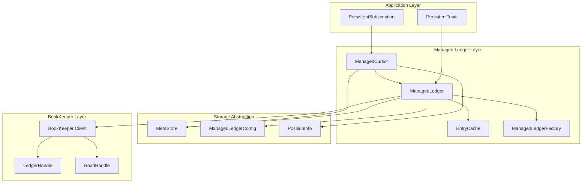
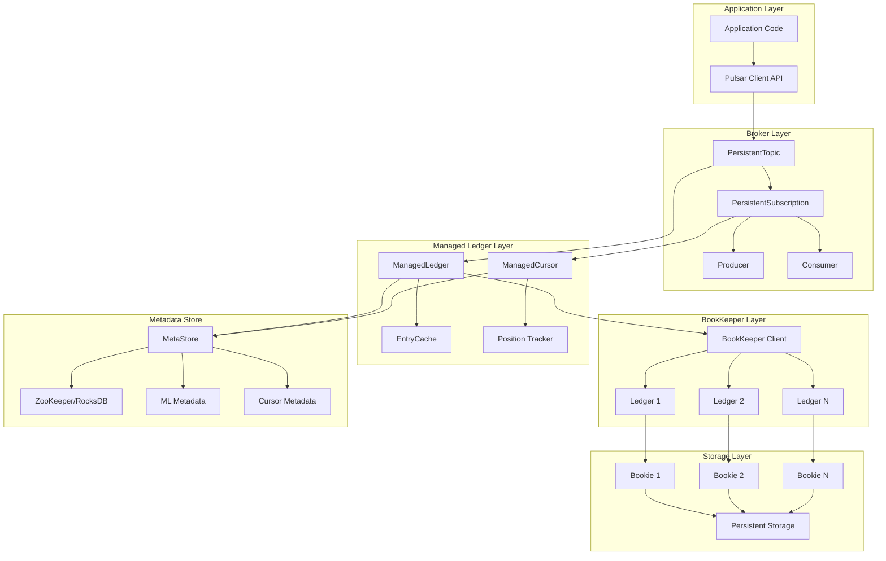
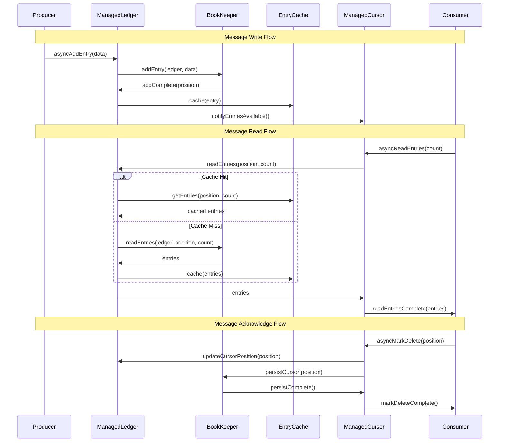

# Apache Pulsar Managed Ledger 模块深度分析

## 1. Managed Ledger 模块概述

Managed Ledger 是 Apache Pulsar 存储层的核心抽象，位于 Pulsar Broker 和 Apache BookKeeper 之间，提供了更高级的存储语义。它将多个 BookKeeper Ledger 抽象为一个连续的日志流，并支持多个持久化游标（Consumer）追踪消费进度。

### 1.1 核心概念

- **ManagedLedger**: 管理账本，由多个 BookKeeper Ledger 组成的逻辑日志
- **ManagedCursor**: 管理游标，持久化的消费位置追踪器
- **Position**: 位置信息，唯一标识日志中的一个条目
- **Entry**: 日志条目，存储在 BookKeeper 中的数据块
- **EntryCache**: 条目缓存，提高读取性能的内存缓存层

### 1.2 模块架构



## 2. 核心类详细分析

### 2.1 ManagedLedger 接口设计

```java
/**
 * ManagedLedger 是对 BookKeeper Ledger 概念的超集
 * 它模拟了一个追加日志的概念，具有以下特性：
 * 1. 具有唯一名称，可以创建/打开/删除
 * 2. 始终可写：即使写入进程崩溃，新的写入者也可以重新打开并继续写入
 * 3. 支持多个持久化消费者（ManagedCursor），每个都有关联的位置
 * 4. 当所有消费者都处理完 BookKeeper ledger 中的所有条目时，该 ledger 将被删除
 */
@InterfaceAudience.LimitedPrivate
@InterfaceStability.Stable
public interface ManagedLedger {
    
    /**
     * 获取 ManagedLedger 的名称
     * @return ManagedLedger 名称
     */
    String getName();
    
    /**
     * 异步添加条目到 ManagedLedger
     * @param data 要写入的数据
     * @param callback 完成回调
     * @param ctx 回调上下文
     */
    void asyncAddEntry(ByteBuf data, AddEntryCallback callback, Object ctx);
    
    /**
     * 异步添加条目到 ManagedLedger（带超时）
     * @param data 要写入的数据
     * @param callback 完成回调  
     * @param ctx 回调上下文
     * @param timeout 超时时间
     * @param unit 时间单位
     */
    void asyncAddEntry(ByteBuf data, AddEntryCallback callback, Object ctx, long timeout, TimeUnit unit);
    
    /**
     * 打开游标用于读取
     * @param name 游标名称
     * @param callback 完成回调
     * @param ctx 回调上下文
     */
    void asyncOpenCursor(String name, OpenCursorCallback callback, Object ctx);
    
    /**
     * 打开游标（指定起始位置）
     * @param name 游标名称
     * @param initialPosition 初始位置
     * @param callback 完成回调
     * @param ctx 回调上下文
     */  
    void asyncOpenCursor(String name, InitialPosition initialPosition, 
                        OpenCursorCallback callback, Object ctx);
    
    /**
     * 删除游标
     * @param name 游标名称
     * @param callback 完成回调
     * @param ctx 回调上下文
     */
    void asyncDeleteCursor(String name, DeleteCursorCallback callback, Object ctx);
    
    /**
     * 获取所有游标
     * @return 游标列表
     */
    List<ManagedCursor> getCursors();
    
    /**
     * 获取慢消费者游标
     * @return 慢消费者游标列表  
     */
    List<ManagedCursor> getSlowestConsumers();
    
    /**
     * 获取统计信息
     * @return ManagedLedger 内部统计
     */
    ManagedLedgerInternalStats.ManagedLedgerInfo getManagedLedgerInternalStats(boolean includeLedgerMetadata);
    
    /**
     * 获取估算的积压大小
     * @return 积压条目数
     */
    long getEstimatedBacklogSize();
    
    /**
     * 关闭 ManagedLedger
     * @return 关闭操作的 Future
     */
    CompletableFuture<Void> closeAsync();
    
    /**
     * 删除 ManagedLedger
     * @return 删除操作的 Future
     */
    CompletableFuture<Void> deleteAsync();
    
    /**
     * 终止 ManagedLedger（禁止写入新条目）
     * @return 终止操作的 Future
     */
    CompletableFuture<Position> terminateAsync();
    
    /**
     * 检查 ManagedLedger 是否已终止
     * @return true 如果已终止
     */
    boolean isTerminated();
    
    /**
     * 获取最后确认的条目位置
     * @return 最后确认的位置
     */
    Position getLastConfirmedEntry();
}
```

### 2.2 ManagedLedgerImpl 核心实现

```java
/**
 * ManagedLedger 的默认实现
 * 管理多个 BookKeeper Ledger，提供统一的日志视图
 */
public class ManagedLedgerImpl implements ManagedLedger, CreateCallback {
    private static final Logger log = LoggerFactory.getLogger(ManagedLedgerImpl.class);
    
    // 核心组件
    protected final BookKeeper bookKeeper;              // BookKeeper 客户端
    protected final String name;                        // ManagedLedger 名称
    protected final MetaStore store;                    // 元数据存储
    protected final ManagedLedgerConfig config;         // 配置信息
    
    // Ledger 管理
    protected final NavigableMap<Long, LedgerInfo> ledgers = new ConcurrentSkipListMap<>();
    protected volatile LedgerHandle currentLedger;      // 当前写入的 Ledger
    protected volatile Position lastConfirmedEntry;     // 最后确认的条目位置
    
    // 游标管理  
    private final ManagedCursorContainer cursors = new ManagedCursorContainerImpl();
    private final ActiveManagedCursorContainer activeCursors; // 活跃游标容器
    
    // 缓存和状态
    private final EntryCache entryCache;                // 条目缓存
    private final ConcurrentLongHashMap<CompletableFuture<ReadHandle>> ledgerCache; // Ledger 缓存
    private volatile State state = State.None;          // 当前状态
    
    // 统计和监控
    private final ManagedLedgerMBeanImpl mbean;         // JMX 监控
    private final Clock clock;                          // 时钟服务
    
    /**
     * 构造函数
     */
    public ManagedLedgerImpl(ManagedLedgerFactoryImpl factory, BookKeeper bookKeeper, 
                           MetaStore store, ManagedLedgerConfig config, 
                           OrderedScheduler scheduledExecutor, String name) {
        this.factory = factory;
        this.bookKeeper = bookKeeper;
        this.config = config;
        this.store = store;
        this.name = name;
        this.clock = factory.getClock();
        
        // 初始化缓存配置
        if (config.isCacheEvictionByExpectedReadCount()) {
            activeCursors = new ActiveManagedCursorContainerImpl(
                config.getContinueCachingAddedEntriesAfterLastActiveCursorLeavesMillis());
        } else {
            activeCursors = new ManagedCursorContainerImpl();
        }
        
        // 初始化 Entry Cache
        this.entryCache = factory.getEntryCacheManager().getEntryCache(this);
        
        // 初始化状态计数器
        TOTAL_SIZE_UPDATER.set(this, 0);
        NUMBER_OF_ENTRIES_UPDATER.set(this, 0);
        ENTRIES_ADDED_COUNTER_UPDATER.set(this, 0);
        STATE_UPDATER.set(this, State.None);
        
        // 初始化监控
        this.mbean = new ManagedLedgerMBeanImpl(this);
    }
    
    /**
     * 初始化 ManagedLedger
     * 从元数据存储加载 Ledger 列表和游标信息
     */
    synchronized void initialize(final ManagedLedgerInitializeLedgerCallback callback, final Object ctx) {
        log.info("Opening managed ledger {}", name);
        
        // 从元数据存储获取 ManagedLedger 信息
        store.getManagedLedgerInfo(name, config.isCreateIfMissing(), config.getProperties(),
                new MetaStoreCallback<ManagedLedgerInfo>() {
                    @Override
                    public void operationComplete(ManagedLedgerInfo mlInfo, Stat stat) {
                        ledgersStat = stat;
                        
                        // 检查是否已终止
                        if (mlInfo.hasTerminatedPosition()) {
                            state = State.Terminated;
                            NestedPositionInfo terminatedPosition = mlInfo.getTerminatedPosition();
                            lastConfirmedEntry = PositionFactory.create(
                                terminatedPosition.getLedgerId(), terminatedPosition.getEntryId());
                            log.info("[{}] Recovering managed ledger terminated at {}", name, lastConfirmedEntry);
                        }
                        
                        // 加载 Ledger 信息
                        for (LedgerInfo ls : mlInfo.getLedgerInfoList()) {
                            ledgers.put(ls.getLedgerId(), ls);
                        }
                        
                        // 加载属性
                        if (mlInfo.getPropertiesCount() > 0) {
                            propertiesMap = new HashMap<>();
                            for (int i = 0; i < mlInfo.getPropertiesCount(); i++) {
                                MLDataFormats.KeyValue property = mlInfo.getProperties(i);
                                propertiesMap.put(property.getKey(), property.getValue());
                            }
                        }
                        
                        // 初始化 BookKeeper
                        initializeBookKeeper(callback);
                    }
                    
                    @Override
                    public void operationFailed(MetaStoreException e) {
                        if (e instanceof MetadataNotFoundException) {
                            callback.initializeFailed(new ManagedLedgerNotFoundException(e));
                        } else {
                            callback.initializeFailed(new ManagedLedgerException(e));
                        }
                    }
                });
    }
    
    /**
     * 异步添加条目
     */
    @Override
    public void asyncAddEntry(ByteBuf data, AddEntryCallback callback, Object ctx) {
        if (state == State.Fenced) {
            callback.addFailed(new ManagedLedgerFencedException(), ctx);
            return;
        }
        
        if (state == State.Terminated) {
            callback.addFailed(new ManagedLedgerTerminatedException("Managed ledger was already terminated"), ctx);
            return;
        }
        
        // 检查写入速率限制
        if (!hasSpaceInBacklog() && !isExceededThreshold()) {
            callback.addFailed(new ManagedLedgerException("Backlog quota exceeded"), ctx);
            return;
        }
        
        // 检查当前 Ledger 是否需要滚动
        LedgerHandle ledger = currentLedger;
        if (ledger == null || ledger.getLength() > config.getMaxEntriesPerLedger() * BYTE_PER_MESSAGE_ESTIMATED
            || ledger.getLastAddConfirmed() >= config.getMaxEntriesPerLedger() - 1
            || hasReachedMaxLedgerTimeLimit(ledger)) {
            // 需要创建新的 Ledger
            asyncCreateLedger(data, callback, ctx);
            return;
        }
        
        // 添加到当前 Ledger
        long entryId = ledger.addEntry(data);
        ledger.asyncAddEntry(data, new AddCallback() {
            @Override
            public void addComplete(int rc, LedgerHandle lh, long entryId, Object ctx) {
                if (rc == BKException.Code.OK) {
                    // 更新统计信息
                    ENTRIES_ADDED_COUNTER_UPDATER.incrementAndGet(ManagedLedgerImpl.this);
                    TOTAL_SIZE_UPDATER.addAndGet(ManagedLedgerImpl.this, data.readableBytes());
                    
                    // 更新最后确认位置
                    Position position = PositionFactory.create(lh.getId(), entryId);
                    lastConfirmedEntry = position;
                    
                    // 通知缓存和游标
                    entryCache.insert(new EntryImpl(lh.getId(), entryId, data));
                    notifyCursorsOfNewEntries(position);
                    
                    callback.addComplete(position, entryId, ctx);
                } else {
                    // 处理写入失败
                    ManagedLedgerException exception = createManagedLedgerException(rc);
                    callback.addFailed(exception, ctx);
                }
            }
        }, ctx);
    }
    
    /**
     * 创建新的 Ledger
     */
    private void asyncCreateLedger(ByteBuf data, AddEntryCallback callback, Object ctx) {
        // 设置 Ledger 配置
        Map<String, byte[]> metadata = LedgerMetadataUtils.buildAdditionalMetadataForLedger(name);
        
        bookKeeper.asyncCreateLedger(
            config.getEnsembleSize(), 
            config.getWriteQuorumSize(),
            config.getAckQuorumSize(),
            config.getDigestType(),
            config.getPassword(),
            new CreateCallback() {
                @Override
                public void createComplete(int rc, LedgerHandle lh, Object ctx) {
                    if (rc == BKException.Code.OK) {
                        // 设置新的当前 Ledger
                        currentLedger = lh;
                        
                        // 更新 Ledger 列表
                        LedgerInfo ledgerInfo = LedgerInfo.newBuilder()
                            .setLedgerId(lh.getId())
                            .setEntries(0)
                            .setSize(0)
                            .setTimestamp(clock.millis())
                            .build();
                        ledgers.put(lh.getId(), ledgerInfo);
                        
                        // 继续添加条目
                        asyncAddEntry(data, callback, ctx);
                        
                        // 持久化元数据
                        updateLedgersList();
                    } else {
                        callback.addFailed(createManagedLedgerException(rc), ctx);
                    }
                }
            }, ctx);
    }
    
    /**
     * 异步打开游标
     */
    @Override
    public void asyncOpenCursor(String cursorName, InitialPosition initialPosition,
                               OpenCursorCallback callback, Object ctx) {
        try {
            checkManagedLedgerIsOpen();
            checkFenced();
        } catch (ManagedLedgerException e) {
            callback.openCursorFailed(e, ctx);
            return;
        }
        
        if (cursors.get(cursorName) != null) {
            callback.openCursorFailed(
                new ManagedLedgerException("Cursor already exists"), ctx);
            return;
        }
        
        // 创建新游标
        ManagedCursorImpl cursor = new ManagedCursorImpl(bookKeeper, config, this, cursorName);
        
        // 初始化游标
        cursor.initializeCursor(initialPosition, new VoidCallback() {
            @Override
            public void operationComplete() {
                cursor.setAlwaysInactive(false);
                cursors.add(cursor);
                callback.openCursorComplete(cursor, ctx);
            }
            
            @Override
            public void operationFailed(ManagedLedgerException exception) {
                callback.openCursorFailed(exception, ctx);
            }
        });
    }
    
    /**
     * 通知游标有新条目可读
     */
    private void notifyCursorsOfNewEntries(Position position) {
        cursors.forEach(cursor -> {
            if (cursor.hasMoreEntries()) {
                cursor.notifyEntriesAvailable();
            }
        });
    }
    
    /**
     * 更新 Ledger 列表到元数据存储
     */
    private void updateLedgersList() {
        if (state == State.Closed) {
            return;
        }
        
        ManagedLedgerInfo.Builder mlInfoBuilder = ManagedLedgerInfo.newBuilder();
        
        // 添加所有 Ledger 信息
        ledgers.values().forEach(ledgerInfo -> mlInfoBuilder.addLedgerInfo(ledgerInfo));
        
        // 添加属性
        if (propertiesMap != null) {
            propertiesMap.forEach((key, value) -> 
                mlInfoBuilder.addProperties(
                    MLDataFormats.KeyValue.newBuilder().setKey(key).setValue(value).build()));
        }
        
        // 如果已终止，添加终止位置
        if (state == State.Terminated) {
            PositionImpl lastPosition = (PositionImpl) lastConfirmedEntry;
            mlInfoBuilder.setTerminatedPosition(
                NestedPositionInfo.newBuilder()
                    .setLedgerId(lastPosition.getLedgerId())
                    .setEntryId(lastPosition.getEntryId())
                    .build());
        }
        
        // 持久化到元数据存储
        store.updateManagedLedgerInfo(name, mlInfoBuilder.build(), ledgersStat,
            new MetaStoreCallback<Void>() {
                @Override
                public void operationComplete(Void result, Stat stat) {
                    ledgersStat = stat;
                    log.debug("[{}] Updated managed ledger metadata", name);
                }
                
                @Override
                public void operationFailed(MetaStoreException e) {
                    log.warn("[{}] Failed to update managed ledger metadata", name, e);
                }
            });
    }
    
    /**
     * 获取统计信息
     */
    @Override
    public ManagedLedgerInternalStats.ManagedLedgerInfo getManagedLedgerInternalStats(
            boolean includeLedgerMetadata) {
        
        ManagedLedgerInternalStats.ManagedLedgerInfo.Builder mlStatsBuilder =
            ManagedLedgerInternalStats.ManagedLedgerInfo.newBuilder()
                .setName(name)
                .setState(state.toString())
                .setEntriesAddedCounter(ENTRIES_ADDED_COUNTER_UPDATER.get(this))
                .setNumberOfEntries(NUMBER_OF_ENTRIES_UPDATER.get(this))
                .setTotalSize(TOTAL_SIZE_UPDATER.get(this))
                .setCurrentLedgerEntries(currentLedger != null ? currentLedger.getLastAddConfirmed() + 1 : 0)
                .setCurrentLedgerSize(currentLedger != null ? currentLedger.getLength() : 0);
        
        if (includeLedgerMetadata) {
            ledgers.values().forEach(ledgerInfo -> 
                mlStatsBuilder.addLedgers(
                    ManagedLedgerInternalStats.LedgerInfo.newBuilder()
                        .setLedgerId(ledgerInfo.getLedgerId())
                        .setEntries(ledgerInfo.getEntries())
                        .setSize(ledgerInfo.getSize())
                        .setOffloaded(ledgerInfo.hasOffloadContext())
                        .build()));
        }
        
        return mlStatsBuilder.build();
    }
}
```

### 2.3 ManagedCursor 游标实现

```java
/**
 * ManagedCursor 接口定义了持久化游标的行为
 * 用于跟踪消费者在 ManagedLedger 中的读取位置
 */
public interface ManagedCursor {
    
    /**
     * 获取游标名称
     * @return 游标名称
     */
    String getName();
    
    /**
     * 读取条目
     * @param numberOfEntriesToRead 要读取的条目数
     * @return 条目列表
     * @throws InterruptedException 中断异常
     * @throws ManagedLedgerException ManagedLedger 异常
     */
    List<Entry> readEntries(int numberOfEntriesToRead) 
            throws InterruptedException, ManagedLedgerException;
    
    /**
     * 异步读取条目
     * @param numberOfEntriesToRead 要读取的条目数
     * @param callback 读取回调
     * @param ctx 回调上下文
     * @param maxPosition 最大读取位置
     */
    void asyncReadEntries(int numberOfEntriesToRead, ReadEntriesCallback callback, 
                         Object ctx, Position maxPosition);
    
    /**
     * 标记删除位置（确认消息）
     * @param position 要确认的位置
     * @param callback 确认回调
     * @param ctx 回调上下文
     */
    void asyncMarkDelete(Position position, MarkDeleteCallback callback, Object ctx);
    
    /**
     * 删除个别消息
     * @param positions 要删除的位置列表
     * @param callback 删除回调
     * @param ctx 回调上下文
     */
    void asyncDelete(List<Position> positions, DeleteCallback callback, Object ctx);
    
    /**
     * 跳转到指定位置
     * @param newReadPosition 新的读取位置
     * @param force 是否强制跳转
     */
    void seek(Position newReadPosition, boolean force);
    
    /**
     * 重置到标记删除位置
     */
    void rewind();
    
    /**
     * 获取当前读取位置
     * @return 当前读取位置
     */
    Position getReadPosition();
    
    /**
     * 获取标记删除位置
     * @return 标记删除位置
     */
    Position getMarkDeletedPosition();
    
    /**
     * 检查是否有更多条目可读
     * @return true 如果有更多条目
     */
    boolean hasMoreEntries();
    
    /**
     * 获取游标的积压条目数
     * @return 积压条目数
     */
    long getNumberOfEntries();
    
    /**
     * 获取游标的积压大小
     * @return 积压大小（字节）
     */
    long getTotalSize();
}

/**
 * ManagedCursor 的默认实现
 */
public class ManagedCursorImpl implements ManagedCursor {
    private static final Logger log = LoggerFactory.getLogger(ManagedCursorImpl.class);
    
    // 核心组件
    protected final BookKeeper bookkeeper;
    protected final ManagedLedgerImpl ledger;
    private final String name;
    
    // 位置信息
    protected volatile Position markDeletePosition;        // 标记删除位置
    protected volatile Position persistentMarkDeletePosition; // 持久化的标记删除位置
    protected volatile Position readPosition;              // 当前读取位置
    
    // 游标状态
    private final ReadWriteLock lock = new ReentrantReadWriteLock();
    private volatile State state = State.Uninitialized;
    private volatile long lastActive = System.currentTimeMillis();
    
    // 个别删除消息跟踪
    private final LongPairRangeSet<Position> individualDeletedMessages = new LongPairRangeSet<>();
    private final LongPairRangeSet<Position> batchDeletedIndexes = new LongPairRangeSet<>();
    
    // 游标属性和配置
    private volatile Map<String, String> cursorProperties = Collections.emptyMap();
    private final ManagedCursorConfig config;
    
    // 统计信息
    private long messagesConsumedCounter = 0;
    private volatile long lastReadEntriesSize = 0;
    
    public ManagedCursorImpl(BookKeeper bookkeeper, ManagedLedgerConfig config,
                           ManagedLedgerImpl ledger, String cursorName) {
        this.bookkeeper = bookkeeper;
        this.ledger = ledger;
        this.name = cursorName;
        this.config = new ManagedCursorConfig(config);
        
        // 初始化位置
        this.markDeletePosition = PositionImpl.EARLIEST;
        this.persistentMarkDeletePosition = PositionImpl.EARLIEST;
        this.readPosition = PositionImpl.EARLIEST;
        
        STATE_UPDATER.set(this, State.Uninitialized);
    }
    
    /**
     * 初始化游标
     */
    void initializeCursor(InitialPosition initialPosition, VoidCallback callback) {
        // 从元数据存储恢复游标信息
        ledger.getStore().getCursorInfo(ledger.getName(), name, 
            new MetaStoreCallback<ManagedCursorInfo>() {
                @Override
                public void operationComplete(ManagedCursorInfo info, Stat stat) {
                    Position recoveredPosition = null;
                    Map<String, Long> recoveredProperties = null;
                    Map<String, String> recoveredCursorProperties = null;
                    
                    if (info != null) {
                        // 恢复位置信息
                        PositionInfo positionInfo = info.getMarkDelete();
                        recoveredPosition = new PositionImpl(positionInfo.getLedgerId(), positionInfo.getEntryId());
                        
                        // 恢复属性
                        if (info.getPropertiesCount() > 0) {
                            recoveredProperties = new HashMap<>();
                            for (LongProperty property : info.getPropertiesList()) {
                                recoveredProperties.put(property.getName(), property.getValue());
                            }
                        }
                        
                        // 恢复游标属性
                        if (info.getCursorPropertiesCount() > 0) {
                            recoveredCursorProperties = new HashMap<>();
                            for (StringProperty property : info.getCursorPropertiesList()) {
                                recoveredCursorProperties.put(property.getName(), property.getValue());
                            }
                        }
                        
                        // 恢复个别删除的消息
                        for (MessageRange range : positionInfo.getIndividualDeletedMessagesList()) {
                            Position startPosition = new PositionImpl(
                                range.getLowerEndpoint().getLedgerId(), 
                                range.getLowerEndpoint().getEntryId());
                            Position endPosition = new PositionImpl(
                                range.getUpperEndpoint().getLedgerId(), 
                                range.getUpperEndpoint().getEntryId());
                            individualDeletedMessages.addOpenClosed(startPosition.getLedgerId(),
                                startPosition.getEntryId(), endPosition.getLedgerId(), endPosition.getEntryId());
                        }
                    } else {
                        // 新游标，设置初始位置
                        if (initialPosition == InitialPosition.Earliest) {
                            recoveredPosition = ledger.getFirstPosition();
                        } else {
                            recoveredPosition = ledger.getLastPosition();
                        }
                    }
                    
                    // 设置游标状态
                    recoveredCursor(recoveredPosition, recoveredProperties, recoveredCursorProperties, info);
                    callback.operationComplete();
                }
                
                @Override
                public void operationFailed(MetaStoreException e) {
                    callback.operationFailed(new ManagedLedgerException(e));
                }
            });
    }
    
    /**
     * 异步读取条目
     */
    @Override
    public void asyncReadEntries(int numberOfEntriesToRead, ReadEntriesCallback callback, 
                               Object ctx, Position maxPosition) {
        checkArgument(numberOfEntriesToRead > 0);
        
        if (isClosed()) {
            callback.readEntriesFailed(new ManagedLedgerException("Cursor was already closed"), ctx);
            return;
        }
        
        OpReadEntry opReadEntry = OpReadEntry.create(this, readPosition, numberOfEntriesToRead, callback, ctx, maxPosition);
        
        // 更新活跃时间
        updateLastActive();
        
        // 从缓存或 BookKeeper 读取条目
        ledger.asyncReadEntries(opReadEntry);
    }
    
    /**
     * 读取条目（同步版本）
     */
    @Override
    public List<Entry> readEntries(int numberOfEntriesToRead) 
            throws InterruptedException, ManagedLedgerException {
        
        final CountDownLatch counter = new CountDownLatch(1);
        class Result {
            ManagedLedgerException exception = null;
            List<Entry> entries = null;
        }
        
        final Result result = new Result();
        
        asyncReadEntries(numberOfEntriesToRead, new ReadEntriesCallback() {
            @Override
            public void readEntriesComplete(List<Entry> entries, Object ctx) {
                result.entries = entries;
                counter.countDown();
            }
            
            @Override
            public void readEntriesFailed(ManagedLedgerException exception, Object ctx) {
                result.exception = exception;
                counter.countDown();
            }
        }, null, PositionImpl.LATEST);
        
        counter.await();
        
        if (result.exception != null) {
            throw result.exception;
        }
        
        return result.entries;
    }
    
    /**
     * 异步标记删除
     */
    @Override
    public void asyncMarkDelete(Position position, MarkDeleteCallback callback, Object ctx) {
        checkArgument(position != null);
        
        if (isClosed()) {
            callback.markDeleteFailed(new ManagedLedgerException("Cursor was already closed"), ctx);
            return;
        }
        
        if (log.isDebugEnabled()) {
            log.debug("[{}-{}] Mark delete position {}", ledger.getName(), name, position);
        }
        
        PositionImpl newMarkDeletePosition = (PositionImpl) position;
        
        if (newMarkDeletePosition.compareTo(markDeletePosition) < 0) {
            if (log.isDebugEnabled()) {
                log.debug("[{}-{}] Failed mark delete due to invalid position {} < {}", 
                         ledger.getName(), name, newMarkDeletePosition, markDeletePosition);
            }
            callback.markDeleteFailed(new ManagedLedgerException("Invalid mark delete position"), ctx);
            return;
        }
        
        lock.readLock().lock();
        try {
            newMarkDeletePosition = setAcknowledgedPosition(newMarkDeletePosition);
        } finally {
            lock.readLock().unlock();
        }
        
        // 持久化新的标记删除位置
        persistPositionToMetaStore(newMarkDeletePosition, callback, ctx);
    }
    
    /**
     * 持久化位置到元数据存储
     */
    private void persistPositionToMetaStore(PositionImpl newMarkDeletePosition, 
                                          MarkDeleteCallback callback, Object ctx) {
        
        ManagedCursorInfo.Builder cursorInfoBuilder = ManagedCursorInfo.newBuilder();
        
        // 设置标记删除位置
        PositionInfo.Builder positionBuilder = PositionInfo.newBuilder()
            .setLedgerId(newMarkDeletePosition.getLedgerId())
            .setEntryId(newMarkDeletePosition.getEntryId());
        
        // 添加个别删除的消息范围
        individualDeletedMessages.forEach(new RangeBoundConsumer<Position>() {
            @Override
            public void accept(Position startPosition, Position endPosition) {
                MessageRange.Builder rangeBuilder = MessageRange.newBuilder()
                    .setLowerEndpoint(NestedPositionInfo.newBuilder()
                        .setLedgerId(startPosition.getLedgerId())
                        .setEntryId(startPosition.getEntryId()))
                    .setUpperEndpoint(NestedPositionInfo.newBuilder()
                        .setLedgerId(endPosition.getLedgerId())
                        .setEntryId(endPosition.getEntryId()));
                positionBuilder.addIndividualDeletedMessages(rangeBuilder.build());
            }
        });
        
        cursorInfoBuilder.setMarkDelete(positionBuilder.build());
        
        // 添加游标属性
        if (!cursorProperties.isEmpty()) {
            cursorProperties.forEach((key, value) ->
                cursorInfoBuilder.addCursorProperties(StringProperty.newBuilder()
                    .setName(key).setValue(value).build()));
        }
        
        // 持久化到元数据存储
        ledger.getStore().updateCursorInfo(ledger.getName(), name, cursorInfoBuilder.build(),
            new MetaStoreCallback<Void>() {
                @Override
                public void operationComplete(Void result, Stat stat) {
                    // 更新内存中的位置
                    markDeletePosition = newMarkDeletePosition;
                    persistentMarkDeletePosition = newMarkDeletePosition;
                    
                    // 清理已确认的个别删除消息
                    cleanupIndividuallyDeletedMessages();
                    
                    if (callback != null) {
                        callback.markDeleteComplete(ctx);
                    }
                }
                
                @Override
                public void operationFailed(MetaStoreException e) {
                    if (callback != null) {
                        callback.markDeleteFailed(new ManagedLedgerException(e), ctx);
                    }
                }
            });
    }
    
    /**
     * 设置已确认位置
     */
    private PositionImpl setAcknowledgedPosition(PositionImpl newMarkDeletePosition) {
        if (newMarkDeletePosition.compareTo(markDeletePosition) <= 0) {
            return (PositionImpl) markDeletePosition;
        }
        
        PositionImpl oldMarkDeletePosition = (PositionImpl) markDeletePosition;
        
        // 更新消费统计
        long entriesInBetween = ledger.getNumberOfEntries(
            Range.openClosed(oldMarkDeletePosition, newMarkDeletePosition));
        messagesConsumedCounter += entriesInBetween;
        
        return newMarkDeletePosition;
    }
    
    /**
     * 跳转到指定位置
     */
    @Override
    public void seek(Position newReadPosition, boolean force) {
        checkArgument(newReadPosition instanceof PositionImpl);
        
        lock.writeLock().lock();
        try {
            PositionImpl newPosition = (PositionImpl) newReadPosition;
            
            if (!force && newPosition.compareTo(markDeletePosition) <= 0) {
                // 如果新位置在已确认位置之前，移动到下一个有效位置
                newPosition = ledger.getNextValidPosition(markDeletePosition);
            }
            
            log.info("[{}-{}] Seek from {} to {}", ledger.getName(), name, readPosition, newPosition);
            
            readPosition = newPosition;
            ledger.onCursorReadPositionUpdated(this, newPosition);
            
        } finally {
            lock.writeLock().unlock();
        }
    }
    
    /**
     * 重置到标记删除位置
     */
    @Override
    public void rewind() {
        rewind(false);
    }
    
    /**
     * 重置到标记删除位置
     * @param readCompacted 是否读取压缩数据
     */
    public void rewind(boolean readCompacted) {
        lock.writeLock().lock();
        try {
            Position newReadPosition = readCompacted ? 
                markDeletePosition.getNext() : 
                ledger.getNextValidPosition(markDeletePosition);
            Position oldReadPosition = readPosition;
            
            log.info("[{}-{}] Rewind from {} to {}", ledger.getName(), name, oldReadPosition, newReadPosition);
            
            readPosition = newReadPosition;
            ledger.onCursorReadPositionUpdated(this, newReadPosition);
        } finally {
            lock.writeLock().unlock();
        }
    }
    
    /**
     * 检查是否有更多条目可读
     */
    @Override
    public boolean hasMoreEntries() {
        return readPosition.compareTo(ledger.getLastConfirmedEntry()) <= 0;
    }
    
    /**
     * 获取积压条目数
     */
    @Override
    public long getNumberOfEntries() {
        return ledger.getNumberOfEntries(Range.openClosed(markDeletePosition, ledger.getLastConfirmedEntry()));
    }
    
    /**
     * 获取积压大小
     */
    @Override
    public long getTotalSize() {
        return ledger.getTotalSize(Range.openClosed(markDeletePosition, ledger.getLastConfirmedEntry()));
    }
}
```

## 3. 存储架构设计

### 3.1 多层存储架构图



### 3.2 数据流转时序图



## 4. Entry Cache 缓存机制

### 4.1 缓存架构设计

```java
/**
 * Entry Cache 用于缓存最近添加和读取的条目
 * 提高读取性能，减少对 BookKeeper 的访问
 */
public interface EntryCache {
    
    /**
     * 插入条目到缓存
     * @param entry 要缓存的条目
     */
    void insert(EntryImpl entry);
    
    /**
     * 从缓存获取条目
     * @param position 条目位置
     * @return 缓存的条目，如果不存在返回 null
     */
    Entry getEntry(Position position);
    
    /**
     * 批量获取条目
     * @param startPosition 起始位置
     * @param count 条目数量
     * @param maxPosition 最大位置
     * @return 条目列表和缓存命中状态
     */
    Pair<List<Entry>, Boolean> getEntries(Position startPosition, int count, Position maxPosition);
    
    /**
     * 清理过期条目
     * @param maxTimestamp 最大时间戳
     * @return 清理的条目数
     */
    long clearExpiredEntries(long maxTimestamp);
    
    /**
     * 获取缓存大小
     * @return 缓存大小（字节）
     */
    long getSize();
    
    /**
     * 获取缓存条目数
     * @return 缓存条目数
     */
    int getNumberOfEntries();
    
    /**
     * 关闭缓存
     */
    void close();
}

/**
 * Entry Cache 的内存实现
 */
public class EntryCacheImpl implements EntryCache {
    private static final Logger log = LoggerFactory.getLogger(EntryCacheImpl.class);
    
    // 缓存存储：LedgerId -> EntryId -> Entry
    private final ConcurrentLongHashMap<ConcurrentLongHashMap<EntryImpl>> entries = 
            ConcurrentLongHashMap.<ConcurrentLongHashMap<EntryImpl>>newBuilder().build();
    
    private final ManagedLedgerImpl ml;
    private final RangeEntryCacheManagerImpl manager;
    
    // 缓存统计
    private static final AtomicLongFieldUpdater<EntryCacheImpl> SIZE_UPDATER =
            AtomicLongFieldUpdater.newUpdater(EntryCacheImpl.class, "size");
    private volatile long size = 0;
    
    private static final AtomicLongFieldUpdater<EntryCacheImpl> ENTRIES_COUNT_UPDATER =
            AtomicLongFieldUpdater.newUpdater(EntryCacheImpl.class, "entriesCount");
    private volatile long entriesCount = 0;
    
    // 缓存策略配置
    private final long maxSize;
    private final double evictionTriggerThreshold;
    private final double cacheEvictionWatermark;
    
    public EntryCacheImpl(ManagedLedgerImpl ml, RangeEntryCacheManagerImpl manager) {
        this.ml = ml;
        this.manager = manager;
        this.maxSize = ml.getConfig().getMaxCacheSize();
        this.evictionTriggerThreshold = 0.98; // 98% 触发淘汰
        this.cacheEvictionWatermark = 0.85;   // 淘汰到 85%
    }
    
    @Override
    public void insert(EntryImpl entry) {
        if (!manager.hasSpaceInCache()) {
            // 缓存空间不足，直接丢弃
            entry.release();
            return;
        }
        
        long ledgerId = entry.getLedgerId();
        long entryId = entry.getEntryId();
        int entrySize = entry.getLength();
        
        // 获取或创建 Ledger 级别的映射
        ConcurrentLongHashMap<EntryImpl> ledgerEntries = entries.computeIfAbsent(ledgerId, 
            k -> ConcurrentLongHashMap.<EntryImpl>newBuilder().build());
        
        // 插入条目
        EntryImpl existingEntry = ledgerEntries.putIfAbsent(entryId, entry);
        if (existingEntry != null) {
            // 条目已存在，释放新条目
            entry.release();
        } else {
            // 更新缓存统计
            SIZE_UPDATER.addAndGet(this, entrySize);
            ENTRIES_COUNT_UPDATER.incrementAndGet(this);
            
            // 检查是否需要触发淘汰
            if (size > maxSize * evictionTriggerThreshold) {
                triggerEviction();
            }
        }
    }
    
    @Override
    public Entry getEntry(Position position) {
        PositionImpl pos = (PositionImpl) position;
        long ledgerId = pos.getLedgerId();
        long entryId = pos.getEntryId();
        
        ConcurrentLongHashMap<EntryImpl> ledgerEntries = entries.get(ledgerId);
        if (ledgerEntries == null) {
            return null;
        }
        
        EntryImpl entry = ledgerEntries.get(entryId);
        if (entry != null) {
            // 返回条目的副本，避免并发修改
            return EntryImpl.create(entry);
        }
        
        return null;
    }
    
    @Override
    public Pair<List<Entry>, Boolean> getEntries(Position startPosition, int count, Position maxPosition) {
        PositionImpl startPos = (PositionImpl) startPosition;
        PositionImpl maxPos = (PositionImpl) maxPosition;
        
        List<Entry> cachedEntries = new ArrayList<>();
        boolean allCached = true;
        
        long currentLedgerId = startPos.getLedgerId();
        long currentEntryId = startPos.getEntryId();
        
        for (int i = 0; i < count && startPos.compareTo(maxPos) <= 0; i++) {
            Entry entry = getEntry(PositionImpl.get(currentLedgerId, currentEntryId));
            
            if (entry != null) {
                cachedEntries.add(entry);
            } else {
                allCached = false;
                break;
            }
            
            // 移动到下一个位置
            if (currentEntryId == ml.getLedgerInfo(currentLedgerId).getEntries() - 1) {
                // 当前 Ledger 的最后一个条目，移动到下一个 Ledger
                currentLedgerId = ml.getNextLedgerId(currentLedgerId);
                currentEntryId = 0;
            } else {
                currentEntryId++;
            }
        }
        
        return Pair.of(cachedEntries, allCached);
    }
    
    /**
     * 触发缓存淘汰
     */
    private void triggerEviction() {
        long targetSize = (long) (maxSize * cacheEvictionWatermark);
        long currentSize = size;
        
        if (currentSize <= targetSize) {
            return;
        }
        
        log.info("[{}] Triggering cache eviction. current-size: {} target-size: {}", 
                ml.getName(), currentSize, targetSize);
        
        // 按照 LRU 策略淘汰条目
        manager.evictLeastRecentlyUsed(currentSize - targetSize);
    }
    
    /**
     * 清理指定 Ledger 的条目
     */
    public long clearLedger(long ledgerId) {
        ConcurrentLongHashMap<EntryImpl> ledgerEntries = entries.remove(ledgerId);
        if (ledgerEntries == null) {
            return 0;
        }
        
        long removedSize = 0;
        long removedCount = 0;
        
        for (EntryImpl entry : ledgerEntries.values()) {
            removedSize += entry.getLength();
            removedCount++;
            entry.release();
        }
        
        // 更新统计
        SIZE_UPDATER.addAndGet(this, -removedSize);
        ENTRIES_COUNT_UPDATER.addAndGet(this, -removedCount);
        
        return removedCount;
    }
    
    @Override
    public void close() {
        // 释放所有缓存的条目
        entries.forEach((ledgerId, ledgerEntries) -> {
            ledgerEntries.forEach((entryId, entry) -> entry.release());
        });
        entries.clear();
        
        SIZE_UPDATER.set(this, 0);
        ENTRIES_COUNT_UPDATER.set(this, 0);
    }
    
    @Override
    public long getSize() {
        return size;
    }
    
    @Override
    public int getNumberOfEntries() {
        return (int) entriesCount;
    }
}
```

## 5. 元数据管理

### 5.1 元数据存储结构

```protobuf
// ManagedLedger 元数据定义
message ManagedLedgerInfo {
    // Ledger 信息列表
    repeated LedgerInfo ledgerInfo = 1;
    
    // 如果存在，表示 ManagedLedger 已被终止
    // 这是最后提交条目的位置，不能再写入更多条目
    optional NestedPositionInfo terminatedPosition = 2;
    
    // 自定义属性
    repeated KeyValue properties = 3;
    
    message LedgerInfo {
        required int64 ledgerId = 1;      // Ledger ID
        optional int64 entries = 2;       // 条目数
        optional int64 size = 3;          // 大小（字节）
        optional int64 timestamp = 4;     // 创建时间戳
        optional OffloadContext offloadContext = 5; // 分层存储上下文
        repeated KeyValue properties = 6;  // 自定义属性
    }
}

// 游标位置信息
message PositionInfo {
    required int64 ledgerId = 1;          // Ledger ID
    required int64 entryId = 2;           // Entry ID
    
    // 个别删除的消息范围
    repeated MessageRange individualDeletedMessages = 3;
    
    // 与当前游标位置关联的附加自定义属性
    repeated LongProperty properties = 4;
    
    // 存储批量消息中被删除的索引
    repeated BatchedEntryDeletionIndexInfo batchedEntryDeletionIndexInfo = 5;
    
    // 个别删除消息的范围映射（优化存储）
    repeated LongListMap individualDeletedMessageRanges = 6;
}

// 游标信息
message ManagedCursorInfo {
    // 游标位置
    optional PositionInfo markDelete = 1;
    
    // 游标属性
    repeated LongProperty properties = 2;
    
    // 游标自定义属性
    repeated StringProperty cursorProperties = 3;
    
    // 最后活跃时间
    optional int64 lastActive = 4;
    
    // 游标统计信息
    optional ManagedCursorStats stats = 5;
}

// 消息范围
message MessageRange {
    required NestedPositionInfo lowerEndpoint = 1; // 起始位置
    required NestedPositionInfo upperEndpoint = 2;  // 结束位置
}

// 嵌套位置信息
message NestedPositionInfo {
    required int64 ledgerId = 1;
    required int64 entryId = 2;
}
```

### 5.2 MetaStore 实现

```java
/**
 * 元数据存储抽象接口
 */
public interface MetaStore {
    
    /**
     * 获取 ManagedLedger 信息
     * @param name ManagedLedger 名称
     * @param createIfMissing 如果不存在是否创建
     * @param properties 初始属性
     * @param callback 回调函数
     */
    void getManagedLedgerInfo(String name, boolean createIfMissing, 
                             Map<String, String> properties,
                             MetaStoreCallback<ManagedLedgerInfo> callback);
    
    /**
     * 更新 ManagedLedger 信息
     * @param name ManagedLedger 名称
     * @param info 更新的信息
     * @param stat 元数据版本信息
     * @param callback 回调函数
     */
    void updateManagedLedgerInfo(String name, ManagedLedgerInfo info, Stat stat,
                                MetaStoreCallback<Void> callback);
    
    /**
     * 获取游标信息
     * @param ledgerName ManagedLedger 名称
     * @param cursorName 游标名称
     * @param callback 回调函数
     */
    void getCursorInfo(String ledgerName, String cursorName, 
                      MetaStoreCallback<ManagedCursorInfo> callback);
    
    /**
     * 更新游标信息
     * @param ledgerName ManagedLedger 名称
     * @param cursorName 游标名称
     * @param info 游标信息
     * @param callback 回调函数
     */
    void updateCursorInfo(String ledgerName, String cursorName, ManagedCursorInfo info,
                         MetaStoreCallback<Void> callback);
    
    /**
     * 删除游标
     * @param ledgerName ManagedLedger 名称
     * @param cursorName 游标名称
     * @param callback 回调函数
     */
    void removeCursor(String ledgerName, String cursorName, MetaStoreCallback<Void> callback);
    
    /**
     * 删除 ManagedLedger
     * @param name ManagedLedger 名称
     * @param callback 回调函数
     */
    void removeManagedLedger(String name, MetaStoreCallback<Void> callback);
}

/**
 * 基于 MetadataStore 的实现
 */
public class MetaStoreImpl implements MetaStore {
    private static final Logger log = LoggerFactory.getLogger(MetaStoreImpl.class);
    
    private static final String MANAGED_LEDGER_PATH_PREFIX = "/managed-ledgers";
    private static final String CURSOR_PATH_PREFIX = "/cursors";
    
    private final MetadataStore store;
    private final Executor executor;
    
    public MetaStoreImpl(MetadataStore store, Executor executor) {
        this.store = store;
        this.executor = executor;
    }
    
    @Override
    public void getManagedLedgerInfo(String name, boolean createIfMissing, 
                                   Map<String, String> properties,
                                   MetaStoreCallback<ManagedLedgerInfo> callback) {
        
        String path = MANAGED_LEDGER_PATH_PREFIX + "/" + name;
        
        store.get(path).thenAcceptAsync(optional -> {
            if (optional.isPresent()) {
                try {
                    // 解析现有的 ManagedLedger 信息
                    ManagedLedgerInfo info = ManagedLedgerInfo.parseFrom(optional.get().getValue());
                    callback.operationComplete(info, optional.get().getStat());
                } catch (Exception e) {
                    callback.operationFailed(new MetaStoreException(e));
                }
            } else if (createIfMissing) {
                // 创建新的 ManagedLedger
                ManagedLedgerInfo.Builder builder = ManagedLedgerInfo.newBuilder();
                
                // 添加初始属性
                if (properties != null) {
                    properties.forEach((key, value) -> 
                        builder.addProperties(MLDataFormats.KeyValue.newBuilder()
                            .setKey(key).setValue(value).build()));
                }
                
                ManagedLedgerInfo newInfo = builder.build();
                
                store.put(path, newInfo.toByteArray(), Optional.empty())
                    .thenAcceptAsync(stat -> {
                        callback.operationComplete(newInfo, stat);
                    }, executor)
                    .exceptionally(ex -> {
                        callback.operationFailed(new MetaStoreException(ex));
                        return null;
                    });
            } else {
                callback.operationFailed(new MetadataNotFoundException("ManagedLedger not found: " + name));
            }
        }, executor).exceptionally(ex -> {
            callback.operationFailed(new MetaStoreException(ex));
            return null;
        });
    }
    
    @Override
    public void updateManagedLedgerInfo(String name, ManagedLedgerInfo info, Stat stat,
                                      MetaStoreCallback<Void> callback) {
        
        String path = MANAGED_LEDGER_PATH_PREFIX + "/" + name;
        
        store.put(path, info.toByteArray(), Optional.of(stat.getVersion()))
            .thenAcceptAsync(newStat -> {
                callback.operationComplete(null, newStat);
            }, executor)
            .exceptionally(ex -> {
                if (ex.getCause() instanceof BadVersionException) {
                    callback.operationFailed(new BadVersionException(ex.getCause()));
                } else {
                    callback.operationFailed(new MetaStoreException(ex));
                }
                return null;
            });
    }
    
    @Override
    public void getCursorInfo(String ledgerName, String cursorName, 
                            MetaStoreCallback<ManagedCursorInfo> callback) {
        
        String path = MANAGED_LEDGER_PATH_PREFIX + "/" + ledgerName + CURSOR_PATH_PREFIX + "/" + cursorName;
        
        store.get(path).thenAcceptAsync(optional -> {
            if (optional.isPresent()) {
                try {
                    ManagedCursorInfo info = ManagedCursorInfo.parseFrom(optional.get().getValue());
                    callback.operationComplete(info, optional.get().getStat());
                } catch (Exception e) {
                    callback.operationFailed(new MetaStoreException(e));
                }
            } else {
                callback.operationComplete(null, null);
            }
        }, executor).exceptionally(ex -> {
            callback.operationFailed(new MetaStoreException(ex));
            return null;
        });
    }
    
    @Override
    public void updateCursorInfo(String ledgerName, String cursorName, ManagedCursorInfo info,
                               MetaStoreCallback<Void> callback) {
        
        String path = MANAGED_LEDGER_PATH_PREFIX + "/" + ledgerName + CURSOR_PATH_PREFIX + "/" + cursorName;
        
        store.put(path, info.toByteArray(), Optional.empty())
            .thenAcceptAsync(stat -> {
                callback.operationComplete(null, stat);
            }, executor)
            .exceptionally(ex -> {
                callback.operationFailed(new MetaStoreException(ex));
                return null;
            });
    }
}
```

## 6. 性能优化机制

### 6.1 Ledger 滚动策略

```java
/**
 * Ledger 滚动策略决定何时创建新的 Ledger
 */
public class LedgerRolloverPolicy {
    
    private final ManagedLedgerConfig config;
    private final Clock clock;
    
    public LedgerRolloverPolicy(ManagedLedgerConfig config, Clock clock) {
        this.config = config;
        this.clock = clock;
    }
    
    /**
     * 检查是否需要滚动 Ledger
     * @param currentLedger 当前 Ledger
     * @return true 如果需要滚动
     */
    public boolean shouldRollover(LedgerHandle currentLedger) {
        if (currentLedger == null) {
            return true;
        }
        
        // 检查条目数限制
        if (currentLedger.getLastAddConfirmed() >= config.getMaxEntriesPerLedger() - 1) {
            return true;
        }
        
        // 检查大小限制
        if (currentLedger.getLength() > config.getMaxSizePerLedgerMB() * 1024 * 1024) {
            return true;
        }
        
        // 检查时间限制
        long createdTime = getLedgerCreatedTime(currentLedger);
        long maxAge = config.getMaxTimeBetweenLedgerRolloverMs();
        if (maxAge > 0 && (clock.millis() - createdTime) > maxAge) {
            return true;
        }
        
        // 检查非活跃时间限制
        long inactiveTime = config.getInactiveLedgerRollOverTimeMs();
        if (inactiveTime > 0 && (clock.millis() - getLastAddTime(currentLedger)) > inactiveTime) {
            return true;
        }
        
        return false;
    }
    
    private long getLedgerCreatedTime(LedgerHandle ledger) {
        // 从 Ledger 元数据获取创建时间
        return ledger.getLedgerMetadata().getCreationTime();
    }
    
    private long getLastAddTime(LedgerHandle ledger) {
        // 获取最后添加时间（可以从统计信息中获取）
        return System.currentTimeMillis(); // 简化实现
    }
}
```

### 6.2 缓存淘汰策略

```java
/**
 * 缓存淘汰策略管理器
 */
public class CacheEvictionPolicy {
    
    private final ManagedLedgerImpl managedLedger;
    private final EntryCacheImpl entryCache;
    
    public CacheEvictionPolicy(ManagedLedgerImpl managedLedger, EntryCacheImpl entryCache) {
        this.managedLedger = managedLedger;
        this.entryCache = entryCache;
    }
    
    /**
     * 执行缓存淘汰
     * @param bytesToEvict 需要淘汰的字节数
     * @return 实际淘汰的字节数
     */
    public long evictEntries(long bytesToEvict) {
        long evictedSize = 0;
        
        // 获取所有游标的位置信息
        List<ManagedCursor> cursors = managedLedger.getCursors();
        Position minReadPosition = getMinimumReadPosition(cursors);
        
        // 按照 LRU 策略淘汰条目
        // 1. 首先淘汰所有游标都已经消费过的条目
        evictedSize += evictConsumedEntries(minReadPosition, bytesToEvict - evictedSize);
        
        if (evictedSize >= bytesToEvict) {
            return evictedSize;
        }
        
        // 2. 如果还不够，淘汰最旧的未消费条目
        evictedSize += evictOldestEntries(bytesToEvict - evictedSize);
        
        return evictedSize;
    }
    
    /**
     * 获取所有游标中最小的读取位置
     */
    private Position getMinimumReadPosition(List<ManagedCursor> cursors) {
        Position minPosition = PositionImpl.LATEST;
        
        for (ManagedCursor cursor : cursors) {
            Position readPosition = cursor.getReadPosition();
            if (readPosition.compareTo(minPosition) < 0) {
                minPosition = readPosition;
            }
        }
        
        return minPosition;
    }
    
    /**
     * 淘汰已消费的条目
     */
    private long evictConsumedEntries(Position minReadPosition, long targetBytes) {
        long evictedSize = 0;
        
        // 遍历缓存中的条目，淘汰位置小于 minReadPosition 的条目
        for (Long ledgerId : entryCache.getCachedLedgers()) {
            if (evictedSize >= targetBytes) {
                break;
            }
            
            evictedSize += entryCache.evictLedgerEntries(ledgerId, minReadPosition, targetBytes - evictedSize);
        }
        
        return evictedSize;
    }
    
    /**
     * 淘汰最旧的条目
     */
    private long evictOldestEntries(long targetBytes) {
        long evictedSize = 0;
        
        // 按照 Ledger ID 顺序淘汰（较小的 Ledger ID 表示较旧的数据）
        List<Long> ledgerIds = new ArrayList<>(entryCache.getCachedLedgers());
        Collections.sort(ledgerIds);
        
        for (Long ledgerId : ledgerIds) {
            if (evictedSize >= targetBytes) {
                break;
            }
            
            evictedSize += entryCache.evictLedgerPartially(ledgerId, targetBytes - evictedSize);
        }
        
        return evictedSize;
    }
}
```

## 7. 监控和统计

### 7.1 关键性能指标

| 指标分类 | 指标名称 | 描述 | 单位 |
|---------|----------|------|------|
| 写入性能 | `ml_add_entry_rate` | 条目添加速率 | entries/s |
| 写入性能 | `ml_add_entry_latency` | 条目添加延迟分布 | ms |
| 写入性能 | `ml_ledger_write_rate` | Ledger 写入速率 | bytes/s |
| 读取性能 | `ml_read_entry_rate` | 条目读取速率 | entries/s |
| 读取性能 | `ml_read_entry_latency` | 条目读取延迟分布 | ms |
| 读取性能 | `ml_cache_hit_rate` | 缓存命中率 | % |
| 存储容量 | `ml_storage_size` | 存储总大小 | bytes |
| 存储容量 | `ml_storage_logical_size` | 逻辑数据大小 | bytes |
| 存储容量 | `ml_backlog_size` | 积压数据大小 | bytes |
| 游标状态 | `ml_cursor_lag` | 游标延迟 | entries |
| 游标状态 | `ml_cursor_read_rate` | 游标读取速率 | entries/s |
| 缓存状态 | `ml_cache_size` | 缓存大小 | bytes |
| 缓存状态 | `ml_cache_eviction_rate` | 缓存淘汰速率 | entries/s |

### 7.2 监控实现

```java
/**
 * ManagedLedger 统计收集器
 */
public class ManagedLedgerStatsCollector {
    
    private final ManagedLedgerImpl managedLedger;
    private final EntryCacheImpl entryCache;
    
    // 性能计数器
    private final Counter addEntryCounter = Counter.build()
        .name("ml_add_entry_total")
        .help("Total number of entries added")
        .register();
    
    private final Histogram addEntryLatency = Histogram.build()
        .name("ml_add_entry_duration_seconds")
        .help("Add entry latency")
        .buckets(0.001, 0.005, 0.01, 0.05, 0.1, 0.5, 1.0)
        .register();
    
    private final Gauge storageSize = Gauge.build()
        .name("ml_storage_size_bytes")
        .help("Total storage size")
        .register();
    
    private final Gauge cacheSize = Gauge.build()
        .name("ml_cache_size_bytes")
        .help("Cache size")
        .register();
    
    private final Counter cacheHitCounter = Counter.build()
        .name("ml_cache_hit_total")
        .help("Cache hit count")
        .register();
    
    private final Counter cacheMissCounter = Counter.build()
        .name("ml_cache_miss_total")
        .help("Cache miss count")
        .register();
    
    /**
     * 记录添加条目操作
     */
    public void recordAddEntry(long latencyNanos) {
        addEntryCounter.inc();
        addEntryLatency.observe(latencyNanos / 1_000_000_000.0);
    }
    
    /**
     * 记录缓存命中
     */
    public void recordCacheHit() {
        cacheHitCounter.inc();
    }
    
    /**
     * 记录缓存未命中
     */
    public void recordCacheMiss() {
        cacheMissCounter.inc();
    }
    
    /**
     * 更新统计指标
     */
    public void updateStats() {
        // 更新存储大小
        long totalSize = 0;
        for (LedgerInfo ledgerInfo : managedLedger.getLedgers().values()) {
            totalSize += ledgerInfo.getSize();
        }
        storageSize.set(totalSize);
        
        // 更新缓存大小
        cacheSize.set(entryCache.getSize());
    }
    
    /**
     * 获取缓存命中率
     */
    public double getCacheHitRate() {
        long hits = (long) cacheHitCounter.get();
        long misses = (long) cacheMissCounter.get();
        long total = hits + misses;
        
        if (total == 0) {
            return 0.0;
        }
        
        return (double) hits / total;
    }
    
    /**
     * 获取游标统计信息
     */
    public List<CursorStats> getCursorStats() {
        List<CursorStats> cursorStatsList = new ArrayList<>();
        
        for (ManagedCursor cursor : managedLedger.getCursors()) {
            CursorStats stats = new CursorStats();
            stats.cursorName = cursor.getName();
            stats.readPosition = cursor.getReadPosition().toString();
            stats.markDeletePosition = cursor.getMarkDeletedPosition().toString();
            stats.numberOfEntries = cursor.getNumberOfEntries();
            stats.totalSize = cursor.getTotalSize();
            stats.lastActive = cursor.getLastActive();
            
            cursorStatsList.add(stats);
        }
        
        return cursorStatsList;
    }
    
    public static class CursorStats {
        public String cursorName;
        public String readPosition;
        public String markDeletePosition;
        public long numberOfEntries;
        public long totalSize;
        public long lastActive;
    }
}
```

## 8. 故障恢复和一致性

### 8.1 故障恢复机制

```java
/**
 * ManagedLedger 故障恢复处理器
 */
public class ManagedLedgerRecoveryHandler {
    
    private final ManagedLedgerImpl managedLedger;
    private final MetaStore metaStore;
    private final BookKeeper bookKeeper;
    
    /**
     * 恢复 ManagedLedger 状态
     */
    public CompletableFuture<Void> recoverManagedLedger() {
        CompletableFuture<Void> future = new CompletableFuture<>();
        
        // 1. 恢复 Ledger 列表
        recoverLedgersList()
            .thenCompose(v -> {
                // 2. 验证 Ledger 一致性
                return validateLedgersConsistency();
            })
            .thenCompose(v -> {
                // 3. 恢复游标状态
                return recoverCursors();
            })
            .thenCompose(v -> {
                // 4. 清理损坏的 Ledger
                return cleanupCorruptedLedgers();
            })
            .thenAccept(v -> {
                future.complete(null);
            })
            .exceptionally(ex -> {
                future.completeExceptionally(ex);
                return null;
            });
        
        return future;
    }
    
    /**
     * 恢复 Ledger 列表
     */
    private CompletableFuture<Void> recoverLedgersList() {
        return CompletableFuture.supplyAsync(() -> {
            try {
                // 从元数据存储读取 ManagedLedger 信息
                ManagedLedgerInfo mlInfo = getManagedLedgerInfo();
                
                // 验证每个 Ledger 的有效性
                for (LedgerInfo ledgerInfo : mlInfo.getLedgerInfoList()) {
                    long ledgerId = ledgerInfo.getLedgerId();
                    
                    try {
                        // 尝试打开 Ledger 验证其存在性
                        LedgerHandle ledger = bookKeeper.openLedger(ledgerId, 
                            BookKeeper.DigestType.CRC32, new byte[]{});
                        
                        // 更新 Ledger 信息（可能不准确）
                        LedgerInfo updatedInfo = LedgerInfo.newBuilder(ledgerInfo)
                            .setEntries(ledger.getLastAddConfirmed() + 1)
                            .setSize(ledger.getLength())
                            .build();
                        
                        managedLedger.getLedgers().put(ledgerId, updatedInfo);
                        ledger.close();
                        
                    } catch (BKException.BKNoSuchLedgerExistsException e) {
                        log.warn("[{}] Ledger {} does not exist, removing from metadata", 
                                managedLedger.getName(), ledgerId);
                        // 从元数据中移除不存在的 Ledger
                        removeLedgerFromMetadata(ledgerId);
                        
                    } catch (Exception e) {
                        log.error("[{}] Failed to open ledger {}", managedLedger.getName(), ledgerId, e);
                        throw new RuntimeException(e);
                    }
                }
                
                return null;
                
            } catch (Exception e) {
                throw new RuntimeException("Failed to recover ledgers list", e);
            }
        });
    }
    
    /**
     * 验证 Ledger 一致性
     */
    private CompletableFuture<Void> validateLedgersConsistency() {
        return CompletableFuture.supplyAsync(() -> {
            NavigableMap<Long, LedgerInfo> ledgers = managedLedger.getLedgers();
            
            if (ledgers.isEmpty()) {
                return null;
            }
            
            // 验证 Ledger 序列的连续性
            Long previousLedgerId = null;
            for (Long ledgerId : ledgers.keySet()) {
                if (previousLedgerId != null && ledgerId != previousLedgerId + 1) {
                    log.warn("[{}] Found gap in ledger sequence: {} -> {}", 
                            managedLedger.getName(), previousLedgerId, ledgerId);
                }
                previousLedgerId = ledgerId;
            }
            
            // 验证最后一个 Ledger 的状态
            Long lastLedgerId = ledgers.lastKey();
            try {
                LedgerHandle lastLedger = bookKeeper.openLedger(lastLedgerId,
                    BookKeeper.DigestType.CRC32, new byte[]{});
                
                if (lastLedger.isClosed()) {
                    // 最后一个 Ledger 已关闭，需要创建新的 Ledger
                    managedLedger.setCurrentLedger(null);
                } else {
                    // 最后一个 Ledger 仍然打开，可以继续写入
                    managedLedger.setCurrentLedger(lastLedger);
                }
                
            } catch (Exception e) {
                log.error("[{}] Failed to validate last ledger {}", managedLedger.getName(), lastLedgerId, e);
                throw new RuntimeException(e);
            }
            
            return null;
        });
    }
    
    /**
     * 恢复游标状态
     */
    private CompletableFuture<Void> recoverCursors() {
        return CompletableFuture.supplyAsync(() -> {
            try {
                // 获取所有游标列表
                List<String> cursorNames = getCursorNames();
                
                for (String cursorName : cursorNames) {
                    recoverSingleCursor(cursorName);
                }
                
                return null;
                
            } catch (Exception e) {
                throw new RuntimeException("Failed to recover cursors", e);
            }
        });
    }
    
    /**
     * 恢复单个游标
     */
    private void recoverSingleCursor(String cursorName) {
        try {
            // 从元数据存储读取游标信息
            ManagedCursorInfo cursorInfo = getCursorInfo(cursorName);
            
            if (cursorInfo == null) {
                log.warn("[{}] Cursor {} metadata not found", managedLedger.getName(), cursorName);
                return;
            }
            
            // 验证游标位置的有效性
            PositionInfo positionInfo = cursorInfo.getMarkDelete();
            Position markDeletePosition = new PositionImpl(positionInfo.getLedgerId(), positionInfo.getEntryId());
            
            if (!isValidPosition(markDeletePosition)) {
                log.warn("[{}] Cursor {} has invalid mark delete position {}, resetting to earliest", 
                        managedLedger.getName(), cursorName, markDeletePosition);
                markDeletePosition = managedLedger.getFirstPosition();
            }
            
            // 创建并初始化游标
            ManagedCursorImpl cursor = new ManagedCursorImpl(bookKeeper, 
                managedLedger.getConfig(), managedLedger, cursorName);
            
            Map<String, Long> properties = extractProperties(cursorInfo);
            Map<String, String> cursorProperties = extractCursorProperties(cursorInfo);
            
            cursor.recoveredCursor(markDeletePosition, properties, cursorProperties, cursorInfo);
            
            managedLedger.getCursors().add(cursor);
            
        } catch (Exception e) {
            log.error("[{}] Failed to recover cursor {}", managedLedger.getName(), cursorName, e);
        }
    }
    
    /**
     * 验证位置是否有效
     */
    private boolean isValidPosition(Position position) {
        PositionImpl pos = (PositionImpl) position;
        
        // 检查 Ledger 是否存在
        LedgerInfo ledgerInfo = managedLedger.getLedgers().get(pos.getLedgerId());
        if (ledgerInfo == null) {
            return false;
        }
        
        // 检查 Entry ID 是否在有效范围内
        return pos.getEntryId() >= 0 && pos.getEntryId() < ledgerInfo.getEntries();
    }
    
    /**
     * 清理损坏的 Ledger
     */
    private CompletableFuture<Void> cleanupCorruptedLedgers() {
        return CompletableFuture.supplyAsync(() -> {
            // 检查并删除无法访问的 Ledger
            List<Long> corruptedLedgers = new ArrayList<>();
            
            for (Map.Entry<Long, LedgerInfo> entry : managedLedger.getLedgers().entrySet()) {
                Long ledgerId = entry.getKey();
                try {
                    // 尝试读取 Ledger 的第一个条目以验证其完整性
                    LedgerHandle ledger = bookKeeper.openLedgerNoRecovery(ledgerId,
                        BookKeeper.DigestType.CRC32, new byte[]{});
                    
                    if (ledger.getLastAddConfirmed() >= 0) {
                        ledger.readEntries(0, 0);
                    }
                    
                    ledger.close();
                    
                } catch (Exception e) {
                    log.warn("[{}] Ledger {} appears to be corrupted, marking for cleanup", 
                            managedLedger.getName(), ledgerId, e);
                    corruptedLedgers.add(ledgerId);
                }
            }
            
            // 删除损坏的 Ledger
            for (Long corruptedLedgerId : corruptedLedgers) {
                try {
                    bookKeeper.deleteLedger(corruptedLedgerId);
                    managedLedger.getLedgers().remove(corruptedLedgerId);
                    log.info("[{}] Deleted corrupted ledger {}", managedLedger.getName(), corruptedLedgerId);
                } catch (Exception e) {
                    log.error("[{}] Failed to delete corrupted ledger {}", 
                             managedLedger.getName(), corruptedLedgerId, e);
                }
            }
            
            return null;
        });
    }
}
```

Managed Ledger 模块是 Pulsar 存储架构的核心，它在 BookKeeper 之上提供了更高级的抽象和丰富的功能。通过深入理解其设计原理和实现细节，可以更好地优化存储性能、调试存储问题和扩展存储功能。
