## 1. 概述

本文档深入分析 Apache Pulsar 中的关键数据结构，通过 UML 类图和详细说明帮助读者理解各个组件之间的关系和设计模式。

## 2. 消息相关数据结构

### 2.1 Message 消息体系 UML 图

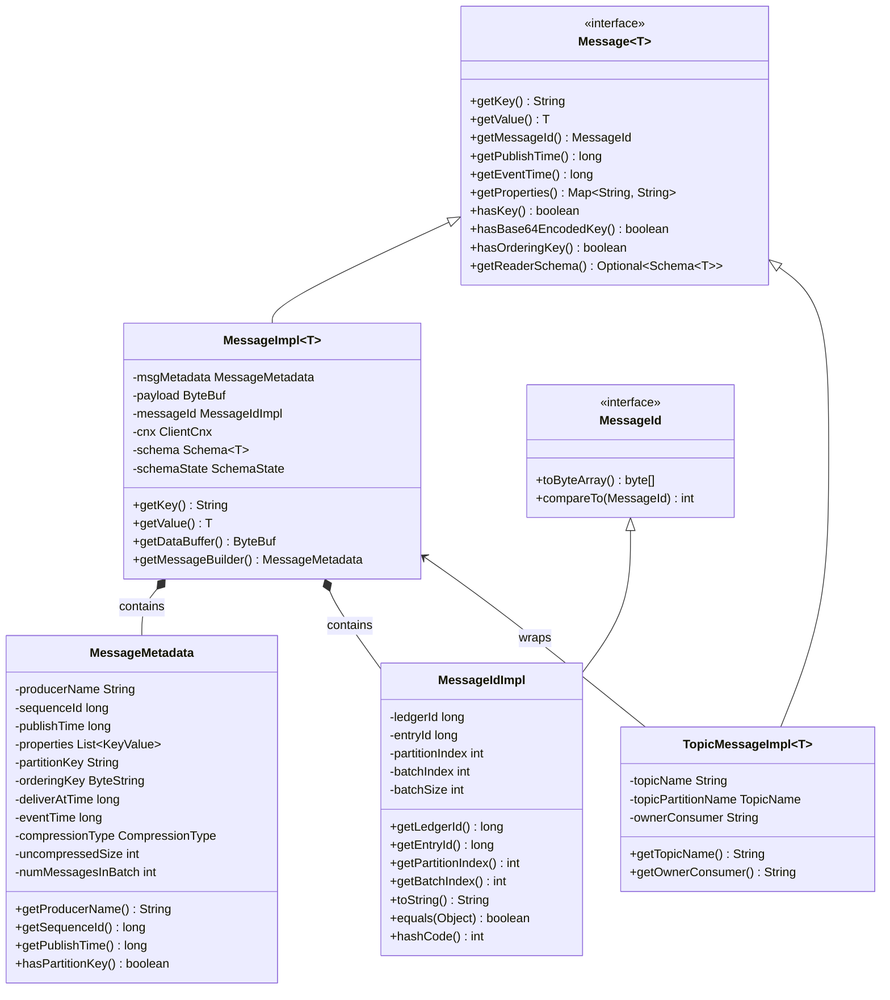

### 2.2 Position 位置体系 UML 图

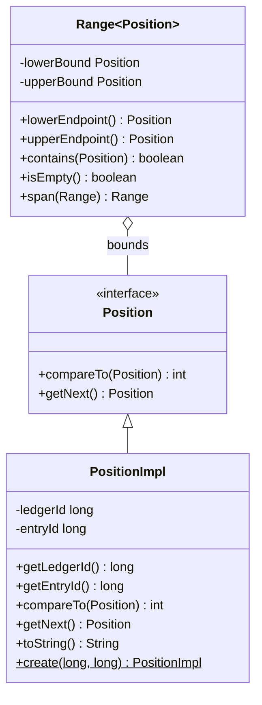

## 3. 客户端核心数据结构

### 3.1 Producer 生产者体系 UML 图

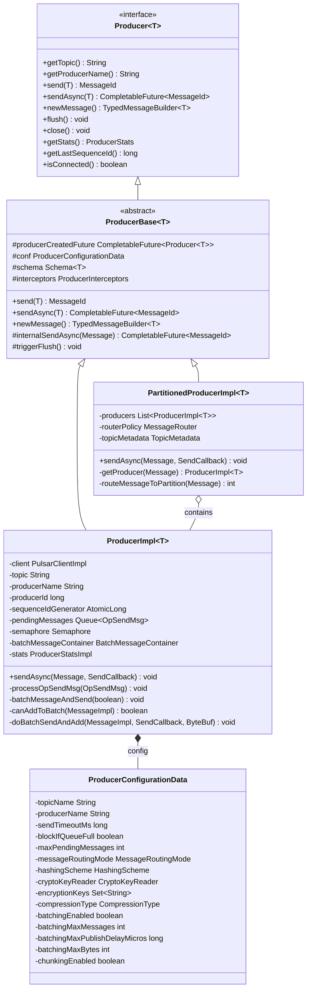

### 3.2 Consumer 消费者体系 UML 图

```mermaid
classDiagram
    class Consumer~T~ {
        <<interface>>
        +getTopic() String
        +getSubscription() String
        +receive() Message~T~
        +receiveAsync() CompletableFuture~Message~T~~
        +batchReceive() Messages~T~
        +acknowledge(Message) void
        +acknowledgeAsync(Message) CompletableFuture~Void~
        +acknowledgeCumulative(Message) void
        +negativeAcknowledge(Message) void
        +close() void
        +seek(MessageId) void
        +getStats() ConsumerStats
        +isConnected() boolean
    }
    
    class ConsumerBase~T~ {
        <<abstract>>
        #client PulsarClientImpl
        #subscription String
        #conf ConsumerConfigurationData
        #schema Schema~T~
        #interceptors ConsumerInterceptors
        #unAckedMessageTracker UnAckedMessageTracker
        #acknowledgementsGroupingTracker AcknowledgmentsGroupingTracker
        +receive(long, TimeUnit) Message~T~
        +acknowledge(Message) void
        +negativeAcknowledge(Message) void
        #internalReceive(long, TimeUnit) Message~T~
        #internalReceiveAsync() CompletableFuture~Message~T~~
        #beforeConsume(Message) Message~T~
        #processMessage(Message) void
    }
    
    class ConsumerImpl~T~ {
        -consumerId long
        -consumerName String
        -incomingMessages BlockingQueue~Message~T~~
        -pendingReceives ConcurrentLinkedQueue~CompletableFuture~Message~T~~~
        -availablePermits AtomicInteger
        -subscription Subscription
        -startMessageId MessageId
        -lastDequeuedMessageId MessageId
        -lastMessageIdInBroker MessageId
        -duringSeek AtomicBoolean
        -seekMessageId MessageId
        -startMessageRollbackDurationInSec int
        +internalReceive(long, TimeUnit) Message~T~
        +internalReceiveAsync() CompletableFuture~Message~T~~
        +increaseAvailablePermits(int) void
        +messageReceived(CommandMessage, ByteBuf, ClientCnx) void
    }
    
    class MultiTopicsConsumerImpl~T~ {
        -consumers ConcurrentHashMap~String, ConsumerImpl~T~~
        -topicsPattern Pattern
        -topics List~String~
        -allTopicPartitionsNumber AtomicInteger
        -pausedConsumers AtomicInteger
        -sharedQueueResumeThreshold int
        -maxReceiverQueueSize int
        +subscribe(String) CompletableFuture~Void~
        +unsubscribeAsync(String) CompletableFuture~Void~
        -messageReceived(ConsumerImpl, Message) void
        -receiveMessageFromConsumer(ConsumerImpl, boolean) void
    }
    
    class ConsumerConfigurationData {
        -topics Set~String~
        -topicsPattern Pattern
        -subscriptionName String
        -subscriptionType SubscriptionType
        -subscriptionInitialPosition SubscriptionInitialPosition
        -messageListener MessageListener~T~
        -consumerEventListener ConsumerEventListener
        -receiverQueueSize int
        -acknowledgementsGroupTimeMicros long
        -maxAcknowledgmentGroupSize int
        -negativeAckRedeliveryDelayMicros long
        -maxTotalReceiverQueueSizeAcrossPartitions int
        -consumerName String
        -ackTimeoutMillis long
        -tickDurationMillis long
        -priorityLevel int
        -maxPendingChuckedMessage int
        -cryptoKeyReader CryptoKeyReader
        -readCompacted boolean
        -subscriptionProperties Map~String, String~
        -patternAutoDiscoveryPeriod int
        -regexSubscriptionMode RegexSubscriptionMode
        -deadLetterPolicy DeadLetterPolicy
        -retryEnable boolean
        -batchReceivePolicy BatchReceivePolicy
    }

    Consumer~T~ <|-- ConsumerBase~T~
    ConsumerBase~T~ <|-- ConsumerImpl~T~
    ConsumerBase~T~ <|-- MultiTopicsConsumerImpl~T~
    ConsumerImpl~T~ *-- ConsumerConfigurationData : config
    MultiTopicsConsumerImpl~T~ o-- ConsumerImpl~T~ : contains
```

## 4. Broker 核心数据结构

### 4.1 Topic 主题体系 UML 图

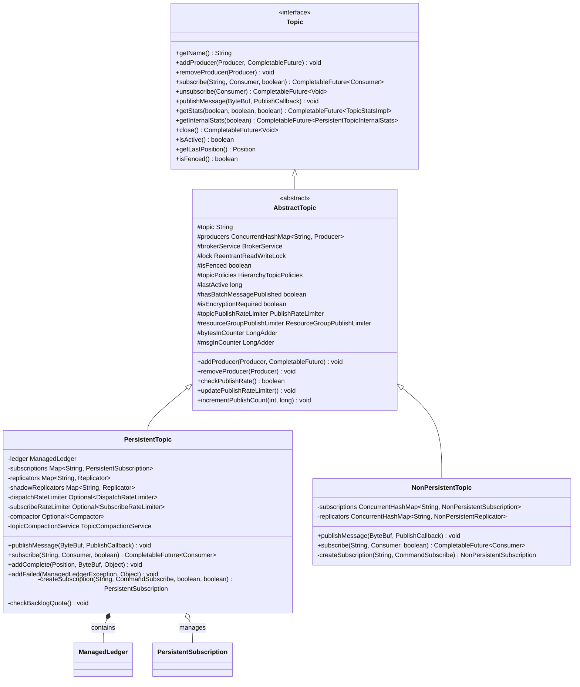

### 4.2 Subscription 订阅体系 UML 图

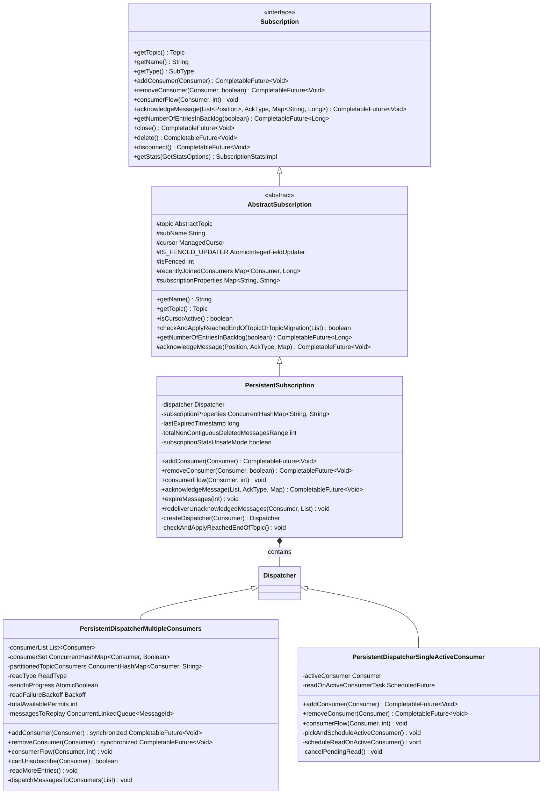

## 5. 存储相关数据结构

### 5.1 ManagedLedger 存储体系 UML 图

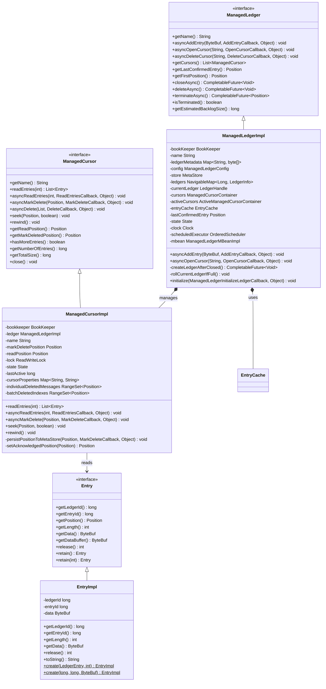

## 6. 网络通信数据结构

### 6.1 网络连接体系 UML 图

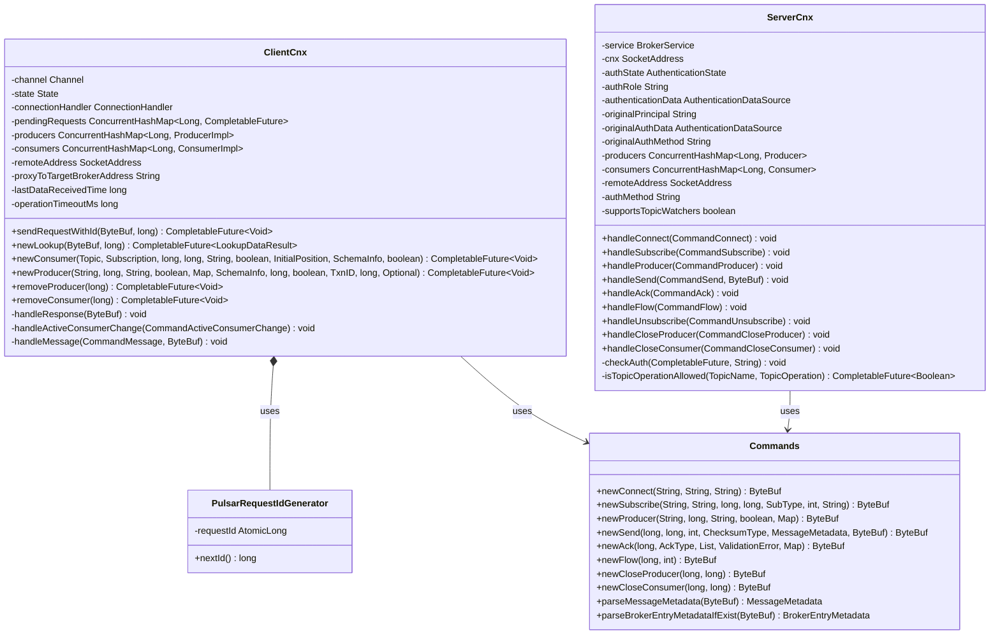

## 7. 配置数据结构

### 7.1 配置体系 UML 图

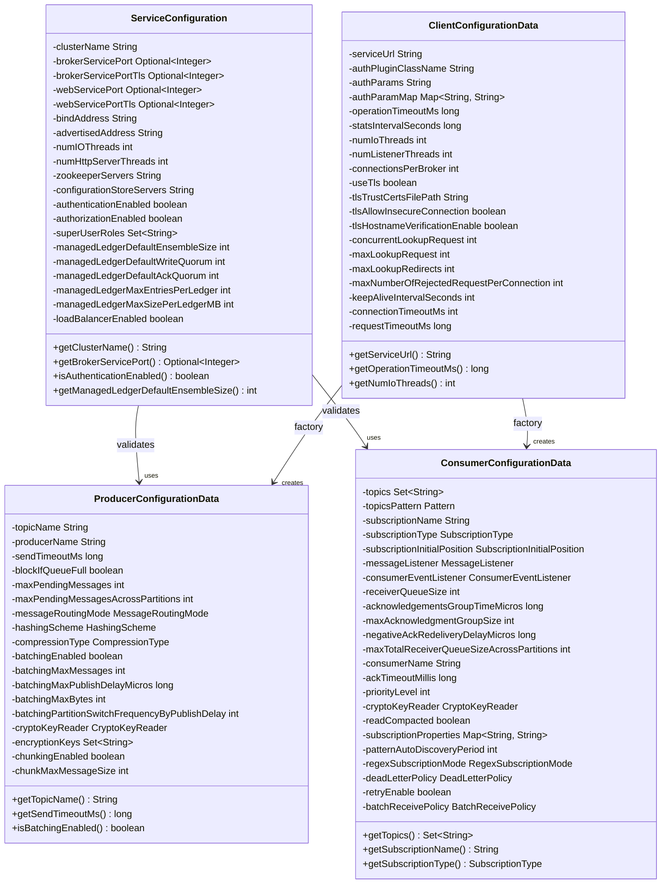

## 8. 统计监控数据结构

### 8.1 统计体系 UML 图

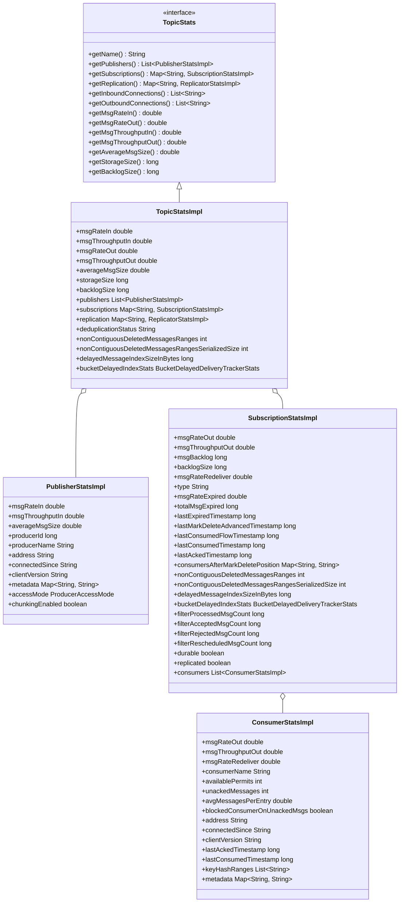

## 9. Schema 数据结构

### 9.1 Schema 体系 UML 图

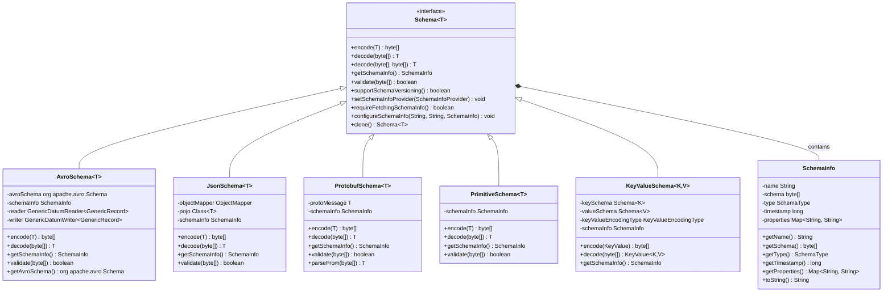

## 10. 总结

本文档通过详细的 UML 类图展示了 Apache Pulsar 中的关键数据结构和它们之间的关系。这些数据结构构成了 Pulsar 的核心架构，理解它们的设计和关系对于：

1. **系统设计**：帮助理解 Pulsar 的整体架构设计思路
2. **性能优化**：识别性能瓶颈和优化点  
3. **功能扩展**：基于现有结构进行功能扩展和定制
4. **问题排查**：深入理解系统行为，快速定位问题
5. **代码贡献**：为 Pulsar 社区贡献代码和功能

每个数据结构都有其特定的职责和设计考虑，它们通过清晰的接口和继承关系协同工作，构建了一个高性能、可扩展的分布式消息系统。
