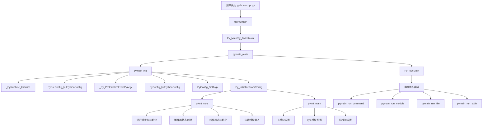
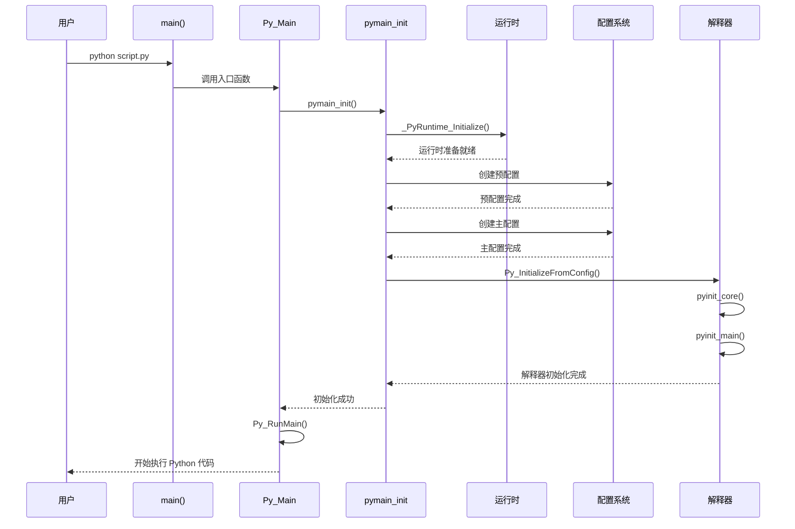
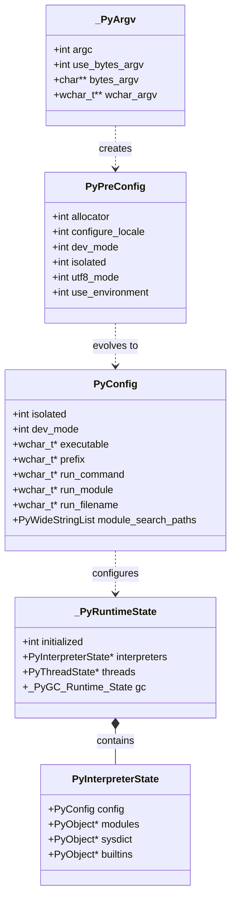

## 概述

CPython 的启动流程是理解整个解释器工作原理的关键入口。本章将详细分析从用户执行 `python` 命令开始，到解释器准备就绪执行 Python 代码的完整过程。

## 1. 主程序入口点

### 1.1 Programs/python.c - 最小化主程序

```c
/* Programs/python.c - 最小化主程序，所有功能都从库中加载 */

#include "Python.h"

#ifdef MS_WINDOWS
int wmain(int argc, wchar_t **argv)
{
    return Py_Main(argc, argv);  // Windows 平台使用宽字符
}
#else
int main(int argc, char **argv)
{
    return Py_BytesMain(argc, argv);  // Unix/Linux 平台使用字节字符
}
#endif
```

**功能说明**:
- 这是 CPython 的最小化入口点
- 根据平台选择字符编码处理方式
- 所有实际功能都委托给库函数实现

**参数说明**:
- `argc`: 命令行参数数量
- `argv`: 命令行参数数组 (Windows 为 wchar_t，Unix 为 char)

**返回值**: 程序退出码

## 2. 主函数调用链

### 2.1 Modules/main.c - 核心启动逻辑

```c
/* Py_Main 和 Py_BytesMain 的实现 */

int Py_Main(int argc, wchar_t **argv)
{
    _PyArgv args = {
        .argc = argc,
        .use_bytes_argv = 0,          // 使用宽字符参数
        .bytes_argv = NULL,
        .wchar_argv = argv
    };
    return pymain_main(&args);
}

int Py_BytesMain(int argc, char **argv)
{
    _PyArgv args = {
        .argc = argc,
        .use_bytes_argv = 1,          // 使用字节字符参数
        .bytes_argv = argv,
        .wchar_argv = NULL
    };
    return pymain_main(&args);
}
```

**数据结构说明**:
```c
typedef struct {
    int argc;              // 参数数量
    int use_bytes_argv;    // 是否使用字节字符串参数
    char **bytes_argv;     // 字节字符串参数数组
    wchar_t **wchar_argv;  // 宽字符串参数数组
} _PyArgv;
```

### 2.2 pymain_main - 主要启动函数

```c
static int pymain_main(_PyArgv *args)
{
    // 第一阶段：初始化 Python 运行时
    PyStatus status = pymain_init(args);
    if (_PyStatus_IS_EXIT(status)) {
        pymain_free();
        return status.exitcode;
    }
    if (_PyStatus_EXCEPTION(status)) {
        pymain_exit_error(status);
    }

    // 第二阶段：运行主程序
    return Py_RunMain();
}
```

## 3. 初始化流程详细分析

### 3.1 pymain_init - 运行时初始化

```c
static PyStatus pymain_init(const _PyArgv *args)
{
    PyStatus status;

    // 步骤1：初始化运行时状态
    status = _PyRuntime_Initialize();
    if (_PyStatus_EXCEPTION(status)) {
        return status;
    }

    // 步骤2：预配置初始化
    PyPreConfig preconfig;
    PyPreConfig_InitPythonConfig(&preconfig);

    status = _Py_PreInitializeFromPyArgv(&preconfig, args);
    if (_PyStatus_EXCEPTION(status)) {
        return status;
    }

    // 步骤3：主配置初始化
    PyConfig config;
    PyConfig_InitPythonConfig(&config);

    // 设置命令行参数
    if (args->use_bytes_argv) {
        status = PyConfig_SetBytesArgv(&config, args->argc, args->bytes_argv);
    }
    else {
        status = PyConfig_SetArgv(&config, args->argc, args->wchar_argv);
    }
    if (_PyStatus_EXCEPTION(status)) {
        goto done;
    }

    // 步骤4：从配置初始化 Python
    status = Py_InitializeFromConfig(&config);
    if (_PyStatus_EXCEPTION(status)) {
        goto done;
    }
    status = _PyStatus_OK();

done:
    PyConfig_Clear(&config);
    return status;
}
```

### 3.2 配置结构体详解

#### PyPreConfig - 预配置结构

```c
typedef struct {
    int allocator;           // 内存分配器选择
    int configure_locale;    // 是否配置本地化设置
    int coerce_c_locale;    // 是否强制 C 本地化
    int coerce_c_locale_warn; // 本地化警告
    int dev_mode;           // 开发模式
    int isolated;           // 隔离模式
    int legacy_windows_fs_encoding; // Windows 文件系统编码
    int parse_argv;         // 是否解析 argv
    int use_environment;    // 是否使用环境变量
    int utf8_mode;          // UTF-8 模式
} PyPreConfig;
```

#### PyConfig - 主配置结构

```c
typedef struct {
    // 核心配置
    int isolated;           // 隔离模式
    int use_environment;    // 使用环境变量
    int dev_mode;          // 开发模式
    int install_signal_handlers; // 安装信号处理器
    int use_hash_seed;     // 使用哈希种子
    unsigned long hash_seed; // 哈希种子值
    
    // 路径配置
    wchar_t *executable;   // Python 可执行文件路径
    wchar_t *base_executable; // 基础可执行文件路径
    wchar_t *prefix;       // 安装前缀
    wchar_t *base_prefix;  // 基础前缀
    
    // 模块搜索路径
    int module_search_paths_set;
    PyWideStringList module_search_paths;
    
    // 运行配置
    wchar_t *run_command;  // -c 选项的命令
    wchar_t *run_module;   // -m 选项的模块
    wchar_t *run_filename; // 要运行的文件名
    
    // 其他配置...
} PyConfig;
```

## 4. 运行时初始化深度分析

### 4.1 Py_InitializeFromConfig 详细流程

```c
PyStatus Py_InitializeFromConfig(const PyConfig *config)
{
    if (config == NULL) {
        return _PyStatus_ERR("initialization config is NULL");
    }

    PyStatus status;

    // 确保运行时已初始化
    status = _PyRuntime_Initialize();
    if (_PyStatus_EXCEPTION(status)) {
        return status;
    }
    _PyRuntimeState *runtime = &_PyRuntime;

    PyThreadState *tstate = NULL;
    
    // 核心初始化
    status = pyinit_core(runtime, config, &tstate);
    if (_PyStatus_EXCEPTION(status)) {
        return status;
    }
    config = _PyInterpreterState_GetConfig(tstate->interp);

    // 主模块初始化
    if (config->_init_main) {
        status = pyinit_main(tstate);
        if (_PyStatus_EXCEPTION(status)) {
            return status;
        }
    }

    return _PyStatus_OK();
}
```

### 4.2 pyinit_core - 核心初始化

核心初始化包括以下关键步骤：

1. **运行时状态初始化**
2. **解释器状态创建**
3. **线程状态初始化**
4. **内建模块导入**
5. **系统模块设置**

## 5. 启动流程架构图



## 6. 初始化时序图



## 7. 关键数据结构 UML 图



## 8. 错误处理机制

### 8.1 PyStatus 结构

```c
typedef struct {
    enum {
        _PyStatus_TYPE_OK = 0,
        _PyStatus_TYPE_ERROR = 1,
        _PyStatus_TYPE_EXIT = 2
    } _type;
    const char *func;      // 出错的函数名
    const char *err_msg;   // 错误消息
    int exitcode;          // 退出码
} PyStatus;
```

### 8.2 错误处理宏

```c
#define _PyStatus_OK() \
    (PyStatus){._type = _PyStatus_TYPE_OK, .func = NULL, .err_msg = NULL}

#define _PyStatus_ERR(err_msg) \
    (PyStatus){._type = _PyStatus_TYPE_ERROR, .func = __func__, .err_msg = (err_msg)}

#define _PyStatus_EXIT(exitcode) \
    (PyStatus){._type = _PyStatus_TYPE_EXIT, .exitcode = (exitcode)}

#define _PyStatus_EXCEPTION(status) \
    ((status)._type == _PyStatus_TYPE_ERROR)

#define _PyStatus_IS_EXIT(status) \
    ((status)._type == _PyStatus_TYPE_EXIT)
```

## 9. 启动性能优化

### 9.1 延迟初始化策略

CPython 采用多阶段初始化策略来优化启动性能：

1. **最小化核心初始化** - 只初始化必要的运行时组件
2. **按需模块加载** - 标准库模块按需导入
3. **缓存机制** - 重要数据结构预分配和缓存

### 9.2 内存预分配

```c
// 对象内存池预分配
static void init_object_pools(void) {
    // 预分配常用大小的内存块
    // 减少后续分配开销
}

// 常用对象预创建
static void init_common_objects(void) {
    // 创建小整数缓存 (-5 到 256)
    // 创建空字符串、空元组等常用对象
}
```

## 10. 实战案例

### 10.1 自定义启动流程

```c
// 示例：嵌入 CPython 到 C 应用程序
#include <Python.h>

int main() {
    // 1. 创建配置
    PyStatus status;
    PyConfig config;
    PyConfig_InitPythonConfig(&config);
    
    // 2. 自定义配置
    status = PyConfig_SetBytesString(&config, &config.program_name, "MyApp");
    if (PyStatus_Exception(status)) {
        goto fail;
    }
    
    // 3. 初始化 Python
    status = Py_InitializeFromConfig(&config);
    if (PyStatus_Exception(status)) {
        goto fail;
    }
    
    // 4. 执行 Python 代码
    PyRun_SimpleString("print('Hello from embedded Python!')");
    
    // 5. 清理
    Py_Finalize();
    PyConfig_Clear(&config);
    return 0;

fail:
    PyConfig_Clear(&config);
    Py_ExitStatusException(status);
}
```

### 10.2 启动时间测量

```c
// 启动性能测量示例
#include <time.h>

int main(int argc, char **argv) {
    clock_t start = clock();
    
    // 标准启动流程
    int result = Py_BytesMain(argc, argv);
    
    clock_t end = clock();
    double startup_time = ((double)(end - start)) / CLOCKS_PER_SEC;
    
    fprintf(stderr, "Python startup time: %.3f seconds\n", startup_time);
    return result;
}
```

## 11. 最佳实践

### 11.1 嵌入式应用建议

1. **最小化配置** - 只启用必要的功能
2. **模块白名单** - 限制可导入的模块
3. **内存限制** - 设置内存使用上限
4. **安全考虑** - 禁用危险的内置函数

### 11.2 性能优化建议

1. **预编译字节码** - 使用 .pyc 文件减少编译开销
2. **模块缓存** - 启用导入缓存机制
3. **启动脚本优化** - 减少启动时的模块导入

## 12. 总结

CPython 的启动流程设计体现了以下关键思想：

1. **模块化设计** - 清晰分离配置、初始化和执行阶段
2. **错误处理** - 完善的状态管理和错误报告机制
3. **可配置性** - 丰富的配置选项支持多种使用场景
4. **性能优化** - 多阶段初始化和延迟加载策略

理解启动流程是深入 CPython 内部机制的第一步，为后续分析虚拟机执行、对象系统等模块打下基础。
