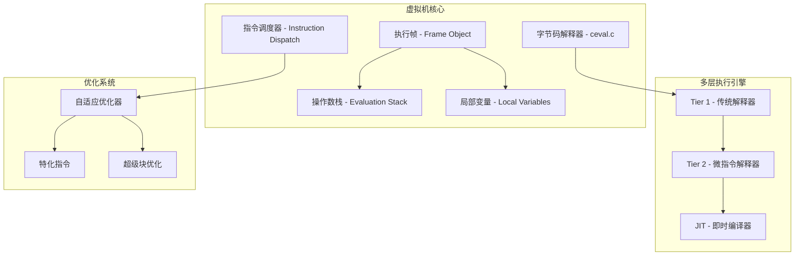
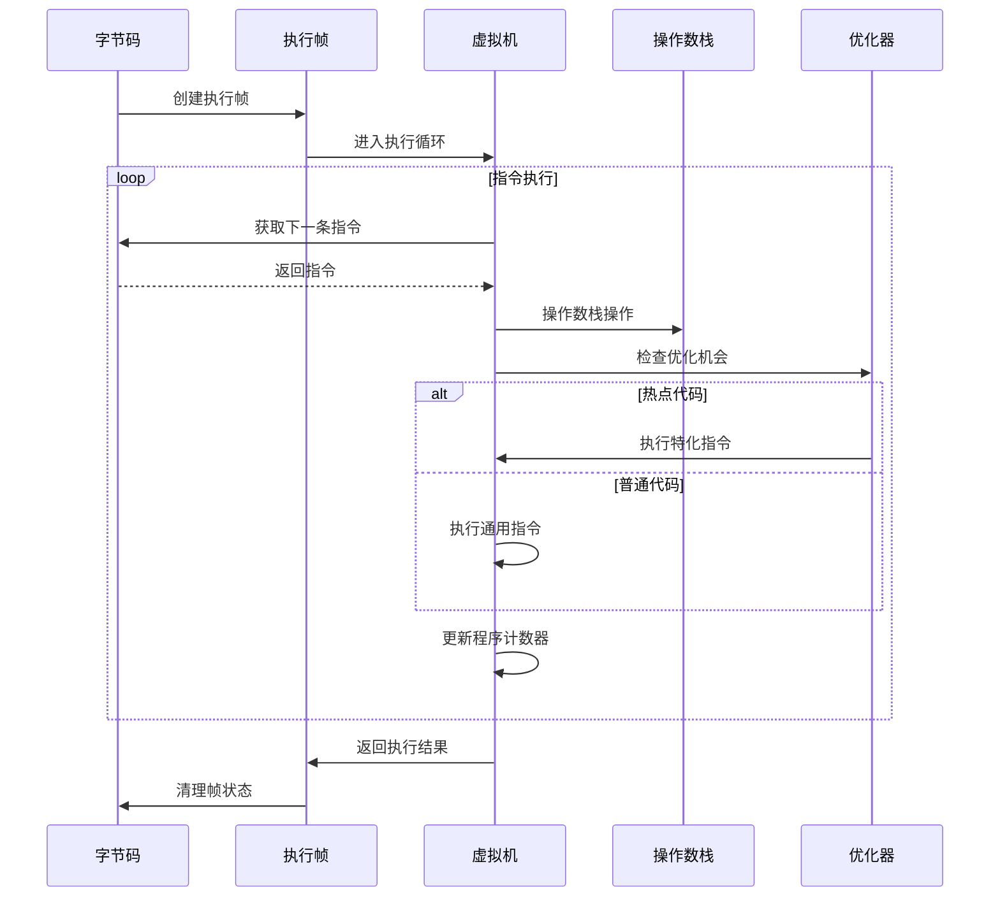
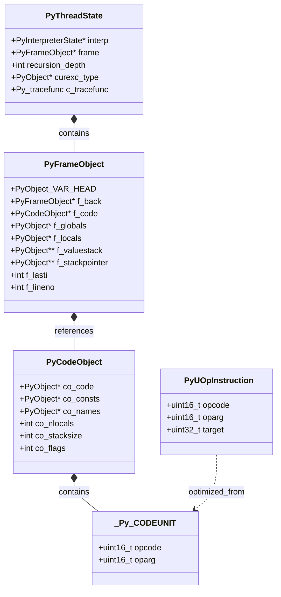

## 概述

CPython 虚拟机是 Python 代码执行的核心引擎，负责解释执行 Python 字节码。本章深入分析虚拟机的架构、执行流程、指令系统和优化机制。

## 1. 虚拟机架构总览

### 1.1 核心组件



### 1.2 关键文件说明

- **Python/ceval.c** - 主要的字节码解释器实现
- **Python/bytecodes.c** - 字节码指令的具体实现
- **Python/optimizer.c** - 代码优化器
- **Python/tier2_engine.md** - Tier 2 执行引擎文档
- **Objects/frameobject.c** - 执行帧对象实现

## 2. 执行帧结构详解

### 2.1 PyFrameObject 结构

```c
/* Objects/frameobject.h - 执行帧结构定义 */
typedef struct _PyFrameObject {
    PyObject_VAR_HEAD           // Python 对象头
    
    struct _PyFrameObject *f_back;  // 指向调用者帧的指针
    PyCodeObject *f_code;           // 代码对象
    PyObject *f_builtins;          // 内置命名空间
    PyObject *f_globals;           // 全局命名空间
    PyObject *f_locals;            // 局部命名空间
    
    PyObject **f_valuestack;       // 操作数栈底部指针
    PyObject **f_stackbase;        // 栈基址
    PyObject **f_stackpointer;     // 栈顶指针
    
    PyObject *f_trace;             // 跟踪函数
    PyObject *f_exc_type;          // 异常类型
    PyObject *f_exc_value;         // 异常值
    PyObject *f_exc_traceback;     // 异常回溯
    
    PyThreadState *f_tstate;       // 线程状态
    int f_lasti;                   // 最后执行的指令索引
    int f_lineno;                  // 当前行号
    
    char f_trace_lines;            // 是否跟踪行
    char f_trace_opcodes;          // 是否跟踪操作码
} PyFrameObject;
```

### 2.2 帧状态管理

```c
// 创建新的执行帧
PyFrameObject* PyFrame_New(
    PyThreadState *tstate,     // 线程状态
    PyCodeObject *code,        // 代码对象
    PyObject *globals,         // 全局命名空间
    PyObject *locals           // 局部命名空间
) {
    // 分配帧内存
    PyFrameObject *f = (PyFrameObject*)PyObject_GC_NewVar(
        PyFrameObject, &PyFrame_Type,
        code->co_nlocals + code->co_stacksize
    );
    
    if (f == NULL) return NULL;
    
    // 初始化帧结构
    f->f_code = code;
    Py_INCREF(code);
    
    f->f_globals = globals;
    Py_INCREF(globals);
    
    f->f_locals = locals;
    Py_XINCREF(locals);
    
    // 设置操作数栈
    f->f_valuestack = f->f_localsplus + code->co_nlocals;
    f->f_stackbase = f->f_valuestack;
    f->f_stackpointer = f->f_valuestack;
    
    // 初始化其他字段
    f->f_back = NULL;
    f->f_lasti = -1;
    f->f_lineno = code->co_firstlineno;
    
    return f;
}
```

## 3. 字节码解释器主循环

### 3.1 核心执行循环 - _PyEval_EvalFrameDefault

```c
/* Python/ceval.c - 主执行循环 */
PyObject* _PyEval_EvalFrameDefault(PyThreadState *tstate, PyFrameObject *frame)
{
    PyObject **stack_pointer = frame->f_stackpointer;
    const _Py_CODEUNIT *next_instr = frame->f_code->co_code + frame->f_lasti + 1;
    
    // 主解释循环
    for (;;) {
        // 获取当前指令
        _Py_CODEUNIT word = *next_instr++;
        opcode opcode = _Py_OPCODE(word);
        oparg oparg = _Py_OPARG(word);
        
        // 调度执行指令
        switch (opcode) {
            case NOP: {
                break;  // 空操作
            }
            
            case LOAD_CONST: {
                // 加载常量到栈顶
                PyObject *value = GETITEM(frame->f_code->co_consts, oparg);
                Py_INCREF(value);
                PUSH(value);
                break;
            }
            
            case LOAD_FAST: {
                // 加载局部变量到栈顶
                PyObject *value = GETLOCAL(oparg);
                if (value == NULL) {
                    format_exc_unbound(tstate, frame->f_code, oparg);
                    goto error;
                }
                Py_INCREF(value);
                PUSH(value);
                break;
            }
            
            case STORE_FAST: {
                // 存储栈顶值到局部变量
                PyObject *value = POP();
                SETLOCAL(oparg, value);
                break;
            }
            
            case BINARY_ADD: {
                // 二元加法运算
                PyObject *right = POP();
                PyObject *left = TOP();
                PyObject *sum = PyNumber_Add(left, right);
                Py_DECREF(left);
                Py_DECREF(right);
                SET_TOP(sum);
                if (sum == NULL) goto error;
                break;
            }
            
            case RETURN_VALUE: {
                // 函数返回
                PyObject *retval = POP();
                frame->f_stackpointer = stack_pointer;
                return retval;
            }
            
            // 更多指令处理...
        }
        
        // 检查中断和信号
        if (_Py_atomic_load_relaxed(&tstate->interp->eval_frame) != NULL) {
            // 处理线程切换、信号等
        }
    }

error:
    // 错误处理
    return NULL;
}
```

### 3.2 栈操作宏定义

```c
/* 操作数栈操作宏 */
#define STACK_LEVEL()     ((int)(stack_pointer - f->f_valuestack))
#define EMPTY()           (STACK_LEVEL() == 0)
#define TOP()             (stack_pointer[-1])          // 栈顶元素
#define SECOND()          (stack_pointer[-2])          // 次顶元素
#define THIRD()           (stack_pointer[-3])          // 第三个元素
#define FOURTH()          (stack_pointer[-4])          // 第四个元素

#define SET_TOP(v)        (stack_pointer[-1] = (v))    // 设置栈顶
#define SET_SECOND(v)     (stack_pointer[-2] = (v))    // 设置次顶

#define PUSH(v)           (*stack_pointer++ = (v))     // 入栈
#define POP()             (*--stack_pointer)           // 出栈
#define PUSHX(v)          (*stack_pointer++ = (v))     // 入栈（不检查）
#define POPX()            (*--stack_pointer)           // 出栈（不检查）

// 局部变量操作
#define GETLOCAL(i)       (fastlocals[i])              // 获取局部变量
#define SETLOCAL(i, v)    do { \
    PyObject *tmp = GETLOCAL(i); \
    GETLOCAL(i) = (v); \
    Py_XDECREF(tmp); \
} while (0)
```

## 4. 字节码指令系统

### 4.1 指令格式

```c
/* 指令格式定义 */
typedef uint16_t _Py_CODEUNIT;  // 16位指令单元

// 指令解码宏
#define _Py_OPCODE(word) ((word) >> 8)        // 获取操作码（高8位）
#define _Py_OPARG(word) ((word) & 255)        // 获取操作数（低8位）

// 指令编码宏  
#define _Py_MAKECODEUNIT(opcode, oparg) \
    (((_Py_CODEUNIT)(opcode) << 8) | ((_Py_CODEUNIT)(oparg) & 255))
```

### 4.2 指令分类

#### 4.2.1 数据操作指令

```c
// 常量和变量操作
case LOAD_CONST:        // 加载常量
case LOAD_FAST:         // 加载局部变量
case STORE_FAST:        // 存储局部变量  
case LOAD_GLOBAL:       // 加载全局变量
case STORE_GLOBAL:      // 存储全局变量
case LOAD_NAME:         // 按名称加载
case STORE_NAME:        // 按名称存储

// 属性操作
case LOAD_ATTR:         // 加载属性
case STORE_ATTR:        // 存储属性
case DELETE_ATTR:       // 删除属性
```

#### 4.2.2 运算指令

```c
// 一元运算
case UNARY_POSITIVE:    // +x
case UNARY_NEGATIVE:    // -x  
case UNARY_NOT:         // not x
case UNARY_INVERT:      // ~x

// 二元运算
case BINARY_ADD:        // x + y
case BINARY_SUBTRACT:   // x - y
case BINARY_MULTIPLY:   // x * y
case BINARY_DIVIDE:     // x / y
case BINARY_MODULO:     // x % y
case BINARY_POWER:      // x ** y

// 比较运算
case COMPARE_OP:        // x op y (==, !=, <, <=, >, >=, in, not in, is, is not)
```

#### 4.2.3 控制流指令

```c
// 跳转指令
case JUMP_FORWARD:      // 无条件前向跳转
case JUMP_BACKWARD:     // 无条件后向跳转  
case POP_JUMP_IF_TRUE:  // 条件跳转（真）
case POP_JUMP_IF_FALSE: // 条件跳转（假）

// 循环指令
case FOR_ITER:          // for 循环迭代
case BREAK_LOOP:        // break 语句
case CONTINUE_LOOP:     // continue 语句

// 异常处理
case SETUP_EXCEPT:      // 设置异常处理
case POP_EXCEPT:        // 弹出异常处理
case RAISE_VARARGS:     // raise 语句
```

#### 4.2.4 函数调用指令

```c
// 函数调用
case CALL_FUNCTION:         // 调用函数
case CALL_FUNCTION_KW:      // 关键字参数调用
case CALL_FUNCTION_VAR:     // 可变参数调用
case CALL_FUNCTION_VAR_KW:  // 可变关键字参数调用

// 方法调用优化
case LOAD_METHOD:           // 加载方法
case CALL_METHOD:           // 调用方法

// 函数定义
case MAKE_FUNCTION:         // 创建函数对象
case LOAD_CLOSURE:          // 加载闭包变量
case LOAD_DEREF:            // 加载单元格变量
case STORE_DEREF:           // 存储单元格变量
```

## 5. 自适应优化系统 (PEP 659)

### 5.1 特化机制

CPython 3.11+ 引入了自适应字节码优化，能够根据运行时类型信息特化指令：

```c
/* 自适应指令示例 */
typedef struct {
    _Py_CODEUNIT original;      // 原始指令
    uint16_t counter;           // 执行计数器
    uint16_t type_version;      // 类型版本
    uint16_t func_version;      // 函数版本
} _PyAdaptiveEntry;

// LOAD_ATTR 指令的特化版本
case LOAD_ATTR_INSTANCE_VALUE: {
    // 针对实例属性访问的优化版本
    PyObject *owner = TOP();
    PyObject *res = quick_get_instance_attribute(owner, oparg);
    if (res == NULL) {
        // 退化到通用版本
        goto deopt_load_attr;
    }
    SET_TOP(res);
    Py_DECREF(owner);
    break;
}
```

### 5.2 计数器和反优化

```c
// 指令执行计数和优化决策
static inline void
adaptive_counter_warmup(_Py_CODEUNIT *instr, int threshold) {
    uint16_t counter = (*instr) & 255;
    if (counter < threshold) {
        counter++;
        *instr = (*instr & 0xFF00) | counter;
    } else {
        // 达到阈值，尝试特化
        specialize_instruction(instr);
    }
}

// 反优化机制
static void
deoptimize_instruction(_Py_CODEUNIT *instr) {
    // 恢复到原始指令
    *instr = (_Py_CODEUNIT)((*instr >> 8) << 8) | 0;
}
```

## 6. Tier 2 优化引擎

### 6.1 微指令系统

Tier 2 使用更细粒度的微指令来提高执行效率：

```c
/* 微指令示例 */
typedef struct {
    uint16_t opcode;    // 微指令操作码
    uint16_t oparg;     // 微指令操作数
    uint32_t target;    // 目标地址（用于跳转）
} _PyUOpInstruction;

// 微指令执行示例
case _LOAD_FAST: {
    PyObject *value = GETLOCAL(oparg);
    if (value == NULL) {
        UOP_STAT_INC(uopcode, miss);
        goto deopt;
    }
    Py_INCREF(value);
    stack_pointer[0] = value;
    stack_pointer++;
    break;
}
```

### 6.2 超级块构建

```c
// 超级块：连续执行的微指令序列
typedef struct {
    _PyUOpInstruction *instructions;  // 微指令数组
    uint16_t length;                  // 指令数量
    uint16_t entry_count;            // 入口计数
    uint16_t exit_count;             // 出口计数
} _PySuperBlock;

// 超级块优化器
static int
optimize_superblock(_PySuperBlock *block) {
    // 常量折叠
    fold_constants(block);
    
    // 死代码消除
    eliminate_dead_code(block);
    
    // 寄存器分配
    allocate_registers(block);
    
    return 0;
}
```

## 7. 虚拟机状态管理

### 7.1 线程状态结构

```c
/* Include/pystate.h - 线程状态定义 */
typedef struct _PyThreadState {
    struct _PyThreadState *prev;     // 前一个线程状态
    struct _PyThreadState *next;     // 后一个线程状态
    
    PyInterpreterState *interp;      // 解释器状态
    PyFrameObject *frame;            // 当前执行帧
    
    int recursion_depth;             // 递归深度
    int recursion_limit;             // 递归限制
    
    PyObject *curexc_type;           // 当前异常类型
    PyObject *curexc_value;          // 当前异常值
    PyObject *curexc_traceback;      // 当前异常回溯
    
    PyObject *dict;                  // 线程字典
    
    long thread_id;                  // 线程ID
    int use_tracing;                 // 是否使用跟踪
    
    Py_tracefunc c_tracefunc;        // C 跟踪函数
    PyObject *c_traceobj;            // 跟踪对象
} PyThreadState;
```

### 7.2 解释器状态

```c
/* 解释器状态结构 */
typedef struct _PyInterpreterState {
    struct _PyInterpreterState *next; // 下一个解释器
    
    PyThreadState *tstate_head;       // 线程状态链表头
    
    PyObject *modules;                // 模块字典
    PyObject *sysdict;               // sys 模块字典
    PyObject *builtins;              // 内置模块字典
    
    PyCodeObject *eval_frame;        // 求值帧
    
    _PyGC_Generation gc;             // 垃圾收集器状态
    
    long id;                         // 解释器ID
} PyInterpreterState;
```

## 8. 异常处理机制

### 8.1 异常传播

```c
// 异常处理块结构
typedef struct {
    int b_type;         // 块类型 (SETUP_EXCEPT, SETUP_FINALLY, etc.)
    int b_handler;      // 处理器地址
    int b_level;        // 栈层次
} PyTryBlock;

// 异常传播处理
static PyObject *
do_raise(PyThreadState *tstate, PyObject *exc, PyObject *cause) {
    // 设置异常状态
    PyErr_SetExcInfo(tstate, exc, NULL, NULL);
    
    // 查找异常处理器
    PyFrameObject *f = tstate->frame;
    while (f != NULL) {
        if (f->f_iblock > 0) {
            // 找到异常处理块
            PyTryBlock *b = &f->f_blockstack[f->f_iblock - 1];
            if (b->b_type == SETUP_EXCEPT) {
                // 跳转到异常处理器
                f->f_lasti = b->b_handler;
                return NULL;  // 继续执行
            }
        }
        f = f->f_back;  // 向上查找调用栈
    }
    
    // 未处理异常，终止程序
    return NULL;
}
```

### 8.2 异常处理指令

```c
case SETUP_EXCEPT: {
    // 设置异常处理块
    PyTryBlock *b = PyFrame_BlockSetup(frame, SETUP_EXCEPT,
                                       INSTR_OFFSET() + oparg,
                                       STACK_LEVEL());
    break;
}

case POP_EXCEPT: {
    // 弹出异常处理块
    PyTryBlock *b = PyFrame_BlockPop(frame);
    if (b->b_type != SETUP_EXCEPT) {
        PyErr_SetString(PyExc_SystemError,
                       "popped block is not an except block");
        goto error;
    }
    break;
}
```

## 9. 性能监控和调试

### 9.1 执行统计

```c
// 指令执行统计
typedef struct {
    uint64_t count;          // 执行次数
    uint64_t hit;           // 命中次数
    uint64_t miss;          // 失败次数
    uint64_t deferred;      // 延迟次数
} _PyUOpStats;

// 全局统计信息
extern _PyUOpStats _Py_uop_stats[256];

#define UOP_STAT_INC(opname, field) \
    _Py_uop_stats[opname].field++
```

### 9.2 跟踪和调试

```c
// 设置跟踪函数
int
PyEval_SetTrace(Py_tracefunc func, PyObject *arg) {
    PyThreadState *tstate = _PyThreadState_GET();
    
    // 设置 C 跟踪函数
    tstate->c_tracefunc = func;
    tstate->c_traceobj = arg;
    Py_XINCREF(arg);
    
    // 启用跟踪
    tstate->use_tracing = (func != NULL);
    
    return 0;
}

// 跟踪回调
static int
call_trace_protected(Py_tracefunc func, PyObject *obj,
                     PyThreadState *tstate, PyFrameObject *frame,
                     int what, PyObject *arg) {
    PyObject *result;
    
    // 调用跟踪函数
    result = func(obj, frame, what, arg);
    
    if (result == NULL) {
        // 跟踪函数发生异常
        PyErr_Clear();
        return -1;
    }
    
    Py_DECREF(result);
    return 0;
}
```

## 10. 虚拟机执行时序图



## 11. 关键数据结构 UML 图



## 12. 实战案例

### 12.1 自定义字节码指令

```c
// 添加自定义指令示例
case MY_CUSTOM_OP: {
    // 获取操作数
    PyObject *left = SECOND();
    PyObject *right = TOP();
    
    // 执行自定义操作
    PyObject *result = my_custom_operation(left, right);
    if (result == NULL) {
        goto error;
    }
    
    // 更新栈状态
    Py_DECREF(left);
    Py_DECREF(right);
    SET_SECOND(result);
    STACK_SHRINK(1);
    
    break;
}
```

### 12.2 性能分析工具

```python
# Python 层面的性能分析
import sys
import time

class VMProfiler:
    def __init__(self):
        self.call_counts = {}
        self.total_time = 0
    
    def trace_calls(self, frame, event, arg):
        if event == 'call':
            func_name = frame.f_code.co_name
            self.call_counts[func_name] = self.call_counts.get(func_name, 0) + 1
            
        return self.trace_calls
    
    def start_profiling(self):
        sys.settrace(self.trace_calls)
        self.start_time = time.time()
    
    def stop_profiling(self):
        sys.settrace(None)
        self.total_time = time.time() - self.start_time
        return self.call_counts

# 使用示例
profiler = VMProfiler()
profiler.start_profiling()

# 执行被分析的代码
def fibonacci(n):
    if n <= 1:
        return n
    return fibonacci(n-1) + fibonacci(n-2)

result = fibonacci(10)

stats = profiler.stop_profiling()
print(f"函数调用统计: {stats}")
print(f"总执行时间: {profiler.total_time:.3f}s")
```

## 13. 优化建议和最佳实践

### 13.1 代码优化技巧

1. **减少函数调用开销** - 使用内联操作
2. **利用局部变量缓存** - 减少全局变量访问
3. **避免不必要的对象创建** - 重用对象
4. **使用适当的数据结构** - 根据访问模式选择

### 13.2 虚拟机调优

```python
# 调整递归限制
import sys
sys.setrecursionlimit(10000)

# 启用优化标志
# python -O 脚本.py

# 使用字节码编译
import py_compile
py_compile.compile('源文件.py', '字节码文件.pyc')
```

## 14. 总结

CPython 虚拟机的设计体现了以下核心思想：

1. **基于栈的架构** - 简化指令设计和实现
2. **自适应优化** - 根据运行时信息动态优化
3. **分层执行** - Tier 1/2 多层优化策略  
4. **异常安全** - 完善的异常处理和传播机制
5. **可观测性** - 丰富的调试和性能监控功能

虚拟机是 CPython 的执行核心，其高效的字节码解释和优化机制为 Python 程序提供了良好的运行性能。理解虚拟机的工作原理对于 Python 性能调优和深入学习解释器技术具有重要意义。
