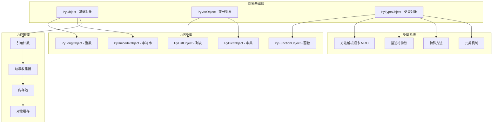
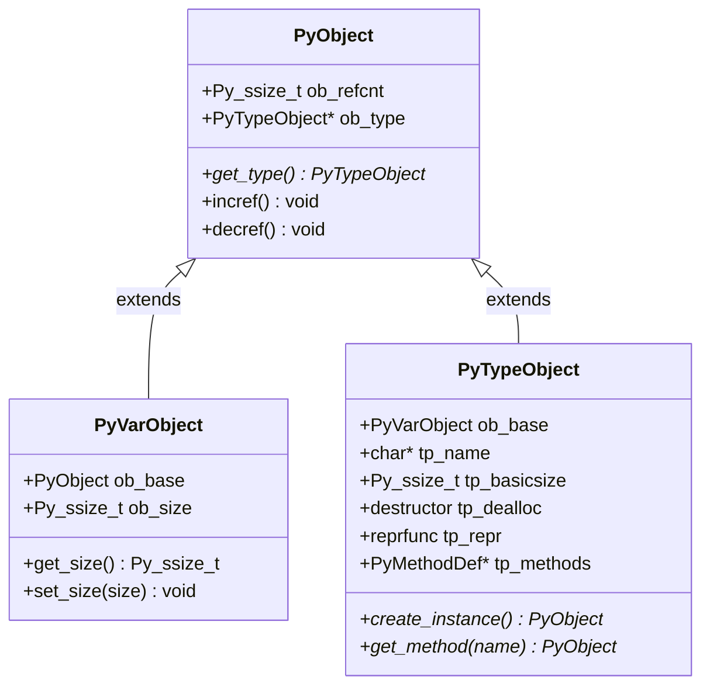
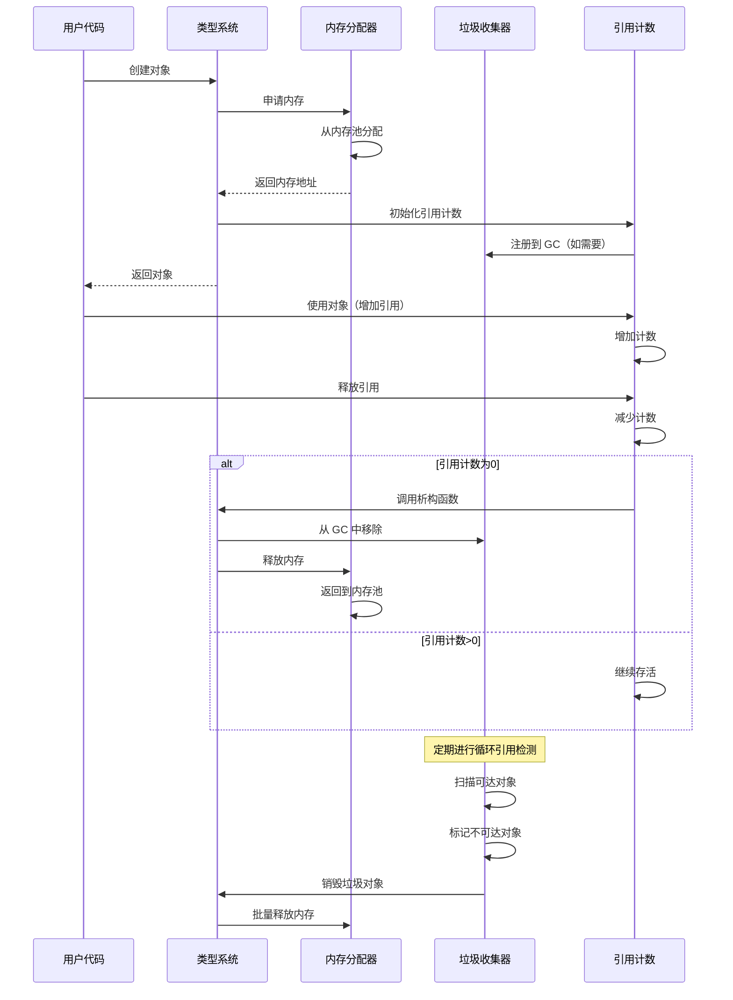

# CPython 对象系统深度分析

## 概述

CPython 的对象系统是 Python 语言的核心基础，实现了 Python 的面向对象特性。本章深入分析对象模型、类型系统、内存管理和垃圾收集机制。

## 1. Python 对象模型架构

### 1.1 对象系统架构图



### 1.2 核心文件结构

- **Objects/object.c** - 基础对象系统实现
- **Objects/typeobject.c** - 类型系统实现
- **Objects/obmalloc.c** - 内存分配器
- **Objects/gcmodule.c** - 垃圾收集器
- **Include/object.h** - 对象系统头文件定义

## 2. 基础对象结构

### 2.1 PyObject - 万物之基

```c
/* Include/object.h - Python 对象基础结构 */
typedef struct _object {
    _PyObject_HEAD_EXTRA        // 调试时额外的字段
    Py_ssize_t ob_refcnt;      // 引用计数
    PyTypeObject *ob_type;     // 对象类型指针
} PyObject;

/* 基础对象头宏定义 */
#define PyObject_HEAD PyObject ob_base;

#ifdef Py_TRACE_REFS
/* 调试模式下的额外字段 */
#define _PyObject_HEAD_EXTRA \
    struct _object *_ob_next; \
    struct _object *_ob_prev;
#else
#define _PyObject_HEAD_EXTRA
#endif
```

### 2.2 PyVarObject - 变长对象

```c
/* 变长对象结构 - 用于列表、字符串等 */
typedef struct {
    PyObject ob_base;          // 基础对象头
    Py_ssize_t ob_size;       // 对象大小（元素个数）
} PyVarObject;

/* 变长对象头宏定义 */
#define PyObject_VAR_HEAD PyVarObject ob_base;

/* 获取变长对象大小的宏 */
#define Py_SIZE(obj) (((PyVarObject*)(obj))->ob_size)
```

### 2.3 对象内存布局



## 3. 类型系统详解

### 3.1 PyTypeObject - 类型对象结构

```c
/* Objects/typeobject.h - 类型对象完整定义 */
typedef struct _typeobject {
    PyObject_VAR_HEAD           // 变长对象头

    const char *tp_name;        // 类型名称 "int", "str", "list" etc.
    Py_ssize_t tp_basicsize;    // 基本大小
    Py_ssize_t tp_itemsize;     // 元素大小（变长对象）

    /* 方法槽位 */
    destructor tp_dealloc;      // 析构函数
    Py_ssize_t tp_vectorcall_offset; // 向量调用偏移
    getattrfunc tp_getattr;     // 获取属性函数
    setattrfunc tp_setattr;     // 设置属性函数
    PyAsyncMethods *tp_as_async; // 异步方法
    reprfunc tp_repr;           // repr 函数

    /* 数值方法套件 */
    PyNumberMethods *tp_as_number;   // 数值操作方法
    PySequenceMethods *tp_as_sequence; // 序列操作方法
    PyMappingMethods *tp_as_mapping;   // 映射操作方法

    /* 哈希和比较 */
    hashfunc tp_hash;           // 哈希函数
    ternaryfunc tp_call;        // 调用函数
    reprfunc tp_str;            // str 函数

    getattrofunc tp_getattro;   // 获取属性对象
    setattrofunc tp_setattro;   // 设置属性对象

    /* 缓冲区协议 */
    PyBufferProcs *tp_as_buffer; // 缓冲区方法

    /* 标志位 */
    unsigned long tp_flags;     // 类型标志

    const char *tp_doc;         // 文档字符串

    /* 垃圾收集支持 */
    traverseproc tp_traverse;   // 遍历函数
    inquiry tp_clear;           // 清理函数

    /* 富比较 */
    richcmpfunc tp_richcompare; // 富比较函数

    /* 弱引用支持 */
    Py_ssize_t tp_weaklistoffset; // 弱引用列表偏移

    /* 迭代器协议 */
    getiterfunc tp_iter;        // 获取迭代器
    iternextfunc tp_iternext;   // 迭代下一个

    /* 方法定义 */
    PyMethodDef *tp_methods;    // 方法定义表
    PyMemberDef *tp_members;    // 成员定义表
    PyGetSetDef *tp_getset;     // getter/setter 定义

    /* 继承 */
    struct _typeobject *tp_base; // 基类
    PyObject *tp_dict;          // 类字典
    descrgetfunc tp_descr_get;  // 描述符获取
    descrsetfunc tp_descr_set;  // 描述符设置

    Py_ssize_t tp_dictoffset;   // 实例字典偏移
    initproc tp_init;           // 初始化函数
    allocfunc tp_alloc;         // 分配函数
    newfunc tp_new;             // 创建函数
    freefunc tp_free;           // 释放函数

    inquiry tp_is_gc;           // 是否支持垃圾收集
    PyObject *tp_bases;         // 基类元组
    PyObject *tp_mro;           // 方法解析顺序
    PyObject *tp_cache;         // 方法缓存
    PyObject *tp_subclasses;    // 子类弱引用集合

    /* 版本标签 */
    unsigned int tp_version_tag; // 版本标签（用于优化）

    destructor tp_finalize;     // 终结器
    vectorcallfunc tp_vectorcall; // 向量调用函数
} PyTypeObject;
```

### 3.2 类型初始化

```c
/* 类型对象初始化示例 - 以整数类型为例 */
PyTypeObject PyLong_Type = {
    PyVarObject_HEAD_INIT(&PyType_Type, 0)  // 初始化头部
    "int",                                   // tp_name
    offsetof(PyLongObject, ob_digit),       // tp_basicsize
    sizeof(digit),                          // tp_itemsize

    long_dealloc,                           // tp_dealloc
    0,                                      // tp_vectorcall_offset
    0,                                      // tp_getattr
    0,                                      // tp_setattr
    0,                                      // tp_as_async
    long_to_decimal_string,                 // tp_repr

    &long_as_number,                        // tp_as_number
    0,                                      // tp_as_sequence
    0,                                      // tp_as_mapping

    (hashfunc)long_hash,                    // tp_hash
    0,                                      // tp_call
    long_to_decimal_string,                 // tp_str

    PyObject_GenericGetAttr,                // tp_getattro
    0,                                      // tp_setattro
    0,                                      // tp_as_buffer

    Py_TPFLAGS_DEFAULT | Py_TPFLAGS_BASETYPE, // tp_flags
    long_doc,                               // tp_doc

    0,                                      // tp_traverse
    0,                                      // tp_clear
    long_richcompare,                       // tp_richcompare

    0,                                      // tp_weaklistoffset
    0,                                      // tp_iter
    0,                                      // tp_iternext

    long_methods,                           // tp_methods
    0,                                      // tp_members
    long_getset,                            // tp_getset

    0,                                      // tp_base
    0,                                      // tp_dict
    0,                                      // tp_descr_get
    0,                                      // tp_descr_set
    0,                                      // tp_dictoffset
    0,                                      // tp_init
    0,                                      // tp_alloc
    long_new,                               // tp_new
};
```

## 4. 内存管理系统

### 4.1 引用计数机制

```c
/* 引用计数操作宏 */
#define Py_INCREF(op) (                         \
    _Py_INC_REFTOTAL  _Py_REF_DEBUG_COMMA       \
    ((PyObject *)(op))->ob_refcnt++)

#define Py_DECREF(op)                           \
    do {                                        \
        PyObject *_py_decref_tmp = (PyObject *)(op); \
        if (_Py_DEC_REFTOTAL  _Py_REF_DEBUG_COMMA   \
        --(_py_decref_tmp)->ob_refcnt != 0)         \
            _Py_CHECK_REFCNT(_py_decref_tmp)        \
        else                                        \
            _Py_Dealloc(_py_decref_tmp);           \
    } while (0)

/* 安全的引用计数操作 */
#define Py_XINCREF(op)                          \
    do {                                        \
        PyObject *_py_xincref_tmp = (PyObject *)(op); \
        if (_py_xincref_tmp != NULL)            \
            Py_INCREF(_py_xincref_tmp);         \
    } while (0)

#define Py_XDECREF(op)                          \
    do {                                        \
        PyObject *_py_xdecref_tmp = (PyObject *)(op); \
        if (_py_xdecref_tmp != NULL)            \
            Py_DECREF(_py_xdecref_tmp);         \
    } while (0)
```

### 4.2 对象分配和释放

```c
/* Objects/object.c - 对象分配 */
PyObject *
_PyObject_New(PyTypeObject *tp)
{
    PyObject *op;

    // 分配内存
    op = (PyObject *) PyObject_Malloc(_PyObject_SIZE(tp));
    if (op == NULL)
        return PyErr_NoMemory();

    // 初始化对象
    _PyObject_Init(op, tp);
    return op;
}

/* 变长对象分配 */
PyVarObject *
_PyObject_NewVar(PyTypeObject *tp, Py_ssize_t nitems)
{
    PyVarObject *op;
    const size_t size = _PyObject_VAR_SIZE(tp, nitems);

    op = (PyVarObject *) PyObject_Malloc(size);
    if (op == NULL)
        return (PyVarObject *)PyErr_NoMemory();

    _PyObject_InitVar(op, tp, nitems);
    return op;
}

/* 对象初始化 */
void
_PyObject_Init(PyObject *op, PyTypeObject *tp)
{
    Py_TYPE(op) = tp;
    if (PyType_GetFlags(tp) & Py_TPFLAGS_HEAPTYPE)
        Py_INCREF(tp);
    _Py_NewReference(op);
}

/* 新引用初始化 */
void
_Py_NewReference(PyObject *op)
{
    _Py_INC_REFTOTAL;
    op->ob_refcnt = 1;
#ifdef Py_TRACE_REFS
    _Py_AddToAllObjects(op, 1);
#endif
}
```

### 4.3 对象销毁流程

```c
/* Objects/object.c - 对象销毁 */
void
_Py_Dealloc(PyObject *op)
{
    PyTypeObject *type = Py_TYPE(op);
    destructor dealloc = type->tp_dealloc;

    // 检查递归限制，避免栈溢出
    PyThreadState *tstate = _PyThreadState_GET();
    if (_Py_GetRecursionLimit(tstate) - tstate->recursion_depth < 2) {
        // 将对象加入延迟销毁队列
        _PyTrash_thread_deposit_object(tstate, op);
        return;
    }

    /* 执行终结器 */
    if (type->tp_finalize) {
        PyObject_CallFinalizer(op);
    }

    // 从跟踪中移除
#ifdef Py_TRACE_REFS
    _Py_ForgetReference(op);
#endif

    // 调用析构函数
    (*dealloc)(op);
}

/* 延迟销毁处理 */
void
_PyTrash_destroy_chain(void)
{
    PyThreadState *tstate = _PyThreadState_GET();

    while (tstate->trash_delete_later) {
        PyObject *op = tstate->trash_delete_later;
        tstate->trash_delete_later = (PyObject *) op->ob_type;

        PyTypeObject *type = Py_TYPE(op);
        (*type->tp_dealloc)(op);
    }
}
```

## 5. 垃圾收集系统

### 5.1 分代垃圾收集

```c
/* Modules/gcmodule.c - 垃圾收集器实现 */
#define NUM_GENERATIONS 3  // 三代垃圾收集

/* GC 统计信息 */
typedef struct _gc_runtime_state {
    /* 每代的链表头 */
    struct gc_generation generations[NUM_GENERATIONS];

    /* 各代收集阈值 */
    int generation_threshold[NUM_GENERATIONS];

    /* 收集统计 */
    int collection_counts[NUM_GENERATIONS];

    /* 未收集对象计数 */
    Py_ssize_t uncollectable;

    /* 垃圾回调列表 */
    PyObject *garbage;
    PyObject *callbacks;

    /* 收集标志 */
    int enabled;
    int debug;
} _PyGC_RuntimeState;

/* 代结构 */
struct gc_generation {
    PyGC_Head head;         // 链表头
    int threshold;          // 收集阈值
    int count;              // 当前计数
};

/* GC 头结构 */
typedef union _gc_head {
    struct {
        union _gc_head *gc_next;  // 下一个对象
        union _gc_head *gc_prev;  // 前一个对象
        Py_ssize_t gc_refs;       // GC 引用计数
    } gc;
    double dummy;  // 对齐
} PyGC_Head;
```

### 5.2 循环引用检测算法

```c
/* 垃圾收集主函数 */
static Py_ssize_t
collect(PyThreadState *tstate, int generation,
        Py_ssize_t *n_collected, Py_ssize_t *n_uncollectable,
        int nofail)
{
    _PyGC_RuntimeState *gcstate = &tstate->interp->gc;

    PyGC_Head *young = GEN_HEAD(gcstate, generation);
    PyGC_Head *old = GEN_HEAD(gcstate, generation + 1);

    /* 第一阶段：扫描所有对象，计算引用计数 */
    update_refs(young);
    subtract_refs(young);

    /* 第二阶段：标记可达对象 */
    PyGC_Head reachable;
    gc_list_init(&reachable);
    move_unreachable(young, &reachable);

    /* 第三阶段：处理终结器 */
    PyGC_Head finalizers;
    gc_list_init(&finalizers);
    move_legacy_finalizers(&reachable, &finalizers);

    /* 第四阶段：删除不可达对象 */
    Py_ssize_t m = 0;
    if (gcstate->debug & DEBUG_SAVEALL) {
        // 调试模式：保存所有不可达对象
        debug_cycle(gcstate, &reachable);
    } else {
        // 正常模式：删除不可达对象
        m = delete_garbage(tstate, gcstate, &reachable, old);
    }

    return m;
}

/* 更新 GC 引用计数 */
static void
update_refs(PyGC_Head *containers)
{
    PyGC_Head *gc = GC_NEXT(containers);
    for (; gc != containers; gc = GC_NEXT(gc)) {
        gc_reset_refs(gc, Py_REFCNT(FROM_GC(gc)));
        // 对象 GC 引用计数 = 对象引用计数
        assert(gc_get_refs(gc) != 0);
    }
}

/* 减去内部引用 */
static void
subtract_refs(PyGC_Head *containers)
{
    traverseproc traverse;
    PyGC_Head *gc = GC_NEXT(containers);

    for (; gc != containers; gc = GC_NEXT(gc)) {
        PyObject *op = FROM_GC(gc);
        traverse = Py_TYPE(op)->tp_traverse;
        if (traverse)
            (void) traverse(op, (visitproc)visit_decref, NULL);
    }
}

/* 访问函数：减少引用计数 */
static int
visit_decref(PyObject *op, void *arg)
{
    if (PyObject_IS_GC(op) && _PyObject_GC_IS_TRACKED(op)) {
        gc_decref(_PyObject_GC_GetHead(op));
    }
    return 0;
}
```

### 5.3 内存池管理

```c
/* Objects/obmalloc.c - 内存池实现 */

/* 内存池结构 */
typedef struct pool_header {
    union { struct pool_header *nextpool; } freepool;
    union { struct pool_header *nextpool; } prevpool;
    uint arenaindex;        // 所属内存区域索引
    uint szidx;            // 大小索引
    uint nextoffset;       // 下一个可用块偏移
    uint maxnextoffset;    // 最大偏移
} poolheader;

/* 内存区域结构 */
typedef struct arena_object {
    char *address;              // 区域地址
    struct pool_header *freepools; // 空闲池链表
    struct arena_object *nextarena; // 下一个区域
    struct arena_object *prevarena; // 前一个区域
    uint nfreepools;           // 空闲池数量
    uint ntotalpools;          // 总池数量
} arena_object;

/* 小块内存分配 */
void *
PyObject_Malloc(size_t size)
{
    if (size == 0) return DEADBYTE_PTR;

    if (size <= SMALL_REQUEST_THRESHOLD) {
        // 小对象使用内存池
        uint pool_idx = size_to_pool_idx(size);
        return pymalloc_alloc(pool_idx, size);
    }

    // 大对象直接分配
    return malloc(size);
}

/* 小块内存释放 */
void
PyObject_Free(void *ptr)
{
    if (ptr == NULL) return;

    if (is_pymalloc_ptr(ptr)) {
        // 内存池中的对象
        pymalloc_free(ptr);
    } else {
        // 直接分配的对象
        free(ptr);
    }
}
```

## 6. 常用内置类型实现

### 6.1 整数对象 (PyLongObject)

```c
/* Objects/longobject.c - 长整数实现 */
struct _longobject {
    PyObject_VAR_HEAD
    digit ob_digit[1];      // 数字数组（变长）
};

typedef struct _longobject PyLongObject;

/* 小整数缓存 */
#define NSMALLNEGINTS   5
#define NSMALLPOSINTS   257

static PyLongObject small_ints[NSMALLNEGINTS + NSMALLPOSINTS];

/* 创建长整数 */
PyObject *
PyLong_FromLong(long ival)
{
    PyLongObject *v;

    // 使用小整数缓存
    if (-NSMALLNEGINTS <= ival && ival < NSMALLPOSINTS) {
        v = small_ints + ival + NSMALLNEGINTS;
        Py_INCREF(v);
        return (PyObject*)v;
    }

    // 计算所需位数
    unsigned long abs_ival = (unsigned long)ival;
    int ndigits = 0;
    while (abs_ival) {
        ++ndigits;
        abs_ival >>= PyLong_SHIFT;
    }

    // 分配对象
    v = _PyLong_New(ndigits);
    if (v != NULL) {
        // 填充数字
        digit *p = v->ob_digit;
        abs_ival = (unsigned long)ival;
        while (abs_ival) {
            *p++ = (digit)(abs_ival & PyLong_MASK);
            abs_ival >>= PyLong_SHIFT;
        }
        Py_SIZE(v) = ival < 0 ? -ndigits : ndigits;
    }

    return (PyObject*)v;
}
```

### 6.2 字符串对象 (PyUnicodeObject)

```c
/* Objects/unicodeobject.c - Unicode 字符串实现 */
typedef struct {
    PyObject_HEAD
    Py_ssize_t length;          // 字符串长度
    Py_hash_t hash;            // 哈希值缓存
    struct {
        unsigned int interned:2;    // 内部化标志
        unsigned int kind:3;        // 字符宽度类型
        unsigned int compact:1;     // 紧凑型标志
        unsigned int ascii:1;       // ASCII 标志
        unsigned int ready:1;       // 就绪标志
    } state;
    wchar_t *wstr;             // 宽字符表示
} PyASCIIObject;

/* 紧凑型 Unicode 对象 */
typedef struct {
    PyASCIIObject _base;
    Py_ssize_t utf8_length;    // UTF-8 长度
    char *utf8;                // UTF-8 表示
    wchar_t *wstr;            // 宽字符表示
} PyCompactUnicodeObject;

/* 创建字符串 */
PyObject *
PyUnicode_FromString(const char *str)
{
    size_t size = strlen(str);
    if (size > PY_SSIZE_T_MAX) {
        PyErr_SetString(PyExc_OverflowError,
                       "string is too long for Python string");
        return NULL;
    }

    return PyUnicode_FromStringAndSize(str, (Py_ssize_t)size);
}
```

### 6.3 列表对象 (PyListObject)

```c
/* Objects/listobject.c - 列表实现 */
typedef struct {
    PyObject_VAR_HEAD
    PyObject **ob_item;     // 元素指针数组
    Py_ssize_t allocated;   // 已分配空间大小
} PyListObject;

/* 列表增长策略 */
static int
list_resize(PyListObject *self, Py_ssize_t newsize)
{
    Py_ssize_t new_allocated, target_bytes;
    size_t num_allocated_bytes;
    PyObject **items;

    // 计算新的分配大小（包含增长余量）
    new_allocated = (size_t)newsize + (newsize >> 3) + (newsize < 9 ? 3 : 6);

    // 防止溢出
    if (new_allocated > (size_t)PY_SSIZE_T_MAX / sizeof(PyObject *)) {
        PyErr_NoMemory();
        return -1;
    }

    // 重新分配内存
    if (newsize == 0) {
        PyMem_FREE(self->ob_item);
        self->ob_item = NULL;
        Py_SIZE(self) = 0;
        self->allocated = 0;
        return 0;
    }

    target_bytes = new_allocated * sizeof(PyObject *);
    items = (PyObject **)PyMem_Realloc(self->ob_item, target_bytes);
    if (items == NULL) {
        PyErr_NoMemory();
        return -1;
    }

    self->ob_item = items;
    Py_SIZE(self) = newsize;
    self->allocated = new_allocated;
    return 0;
}
```

### 6.4 字典对象 (PyDictObject)

```c
/* Objects/dictobject.c - 字典实现 */
typedef struct {
    PyObject_HEAD
    Py_ssize_t ma_used;         // 已使用槽位数
    PyDictKeysObject *ma_keys;  // 键对象
    PyObject **ma_values;       // 值数组（分离存储）
} PyDictObject;

/* 字典键对象 */
typedef struct {
    Py_ssize_t dk_refcnt;       // 引用计数
    Py_ssize_t dk_size;         // 哈希表大小
    Py_ssize_t dk_usable;       // 可用槽位数
    Py_ssize_t dk_nentries;     // 已用条目数
    char dk_indices[];          // 索引数组（变长）
    /* 后面跟随 PyDictKeyEntry dk_entries[]; */
} PyDictKeysObject;

/* 字典条目 */
typedef struct {
    Py_hash_t me_hash;          // 键的哈希值
    PyObject *me_key;           // 键对象
    PyObject *me_value;         // 值对象
} PyDictKeyEntry;

/* 字典查找算法 - 开放寻址法 */
static Py_ssize_t
lookdict(PyDictObject *mp, PyObject *key, Py_hash_t hash, PyObject **value_addr)
{
    size_t mask = DK_MASK(mp->ma_keys);
    size_t perturb = hash;
    size_t i = (size_t)hash & mask;

    for (;;) {
        Py_ssize_t ix = dk_get_index(mp->ma_keys, i);
        if (ix == DKIX_EMPTY) {
            *value_addr = NULL;
            return ix;
        }

        if (ix >= 0) {
            PyDictKeyEntry *ep = &DK_ENTRIES(mp->ma_keys)[ix];
            assert(ep->me_key != NULL);

            if (ep->me_hash == hash) {
                PyObject *startkey = ep->me_key;
                Py_INCREF(startkey);

                int cmp = PyObject_RichCompareBool(startkey, key, Py_EQ);
                Py_DECREF(startkey);

                if (cmp > 0) {
                    *value_addr = ep->me_value;
                    return ix;
                }
                if (cmp < 0) {
                    *value_addr = NULL;
                    return DKIX_ERROR;
                }
            }
        }

        perturb >>= PERTURB_SHIFT;
        i = (i*5 + 1 + perturb) & mask;
    }
}
```

## 7. 描述符协议

### 7.1 描述符接口

```c
/* 描述符获取函数类型 */
typedef PyObject *(*descrgetfunc)(PyObject *, PyObject *, PyObject *);

/* 描述符设置函数类型 */
typedef int (*descrsetfunc)(PyObject *, PyObject *, PyObject *);

/* 描述符检查宏 */
#define PyDescr_IsData(d) (Py_TYPE(d)->tp_descr_set != NULL)

/* 属性查找中的描述符处理 */
PyObject *
PyObject_GenericGetAttr(PyObject *obj, PyObject *name)
{
    PyTypeObject *tp = Py_TYPE(obj);
    PyObject *descr = NULL;
    PyObject *res = NULL;
    descrgetfunc f;
    Py_ssize_t dictoffset;
    PyObject **dictptr;

    if (!PyUnicode_Check(name)) {
        PyErr_Format(PyExc_TypeError,
                    "attribute name must be string, not '%.200s'",
                    Py_TYPE(name)->tp_name);
        return NULL;
    }

    Py_INCREF(name);

    /* 1. 从类型的 MRO 中查找描述符 */
    if (tp->tp_dict != NULL) {
        descr = _PyType_Lookup(tp, name);
        if (descr != NULL) {
            Py_INCREF(descr);
            f = Py_TYPE(descr)->tp_descr_get;
            if (f != NULL && PyDescr_IsData(descr)) {
                /* 数据描述符优先级最高 */
                res = f(descr, obj, (PyObject *)tp);
                goto done;
            }
        }
    }

    /* 2. 从实例字典中查找 */
    dictoffset = tp->tp_dictoffset;
    if (dictoffset != 0) {
        PyObject *dict;
        dictptr = (PyObject **) ((char *)obj + dictoffset);
        dict = *dictptr;
        if (dict != NULL) {
            Py_INCREF(dict);
            res = PyDict_GetItem(dict, name);
            if (res != NULL) {
                Py_INCREF(res);
                Py_DECREF(dict);
                goto done;
            }
            Py_DECREF(dict);
        }
    }

    /* 3. 使用非数据描述符 */
    if (f != NULL) {
        res = f(descr, obj, (PyObject *)tp);
        goto done;
    }

    /* 4. 直接返回描述符对象 */
    if (descr != NULL) {
        res = descr;
        descr = NULL;
        goto done;
    }

    /* 5. 属性未找到 */
    PyErr_Format(PyExc_AttributeError,
                "'%.50s' object has no attribute '%U'",
                tp->tp_name, name);

done:
    Py_XDECREF(descr);
    Py_DECREF(name);
    return res;
}
```

## 8. 方法解析顺序 (MRO)

### 8.1 C3 线性化算法

```c
/* Objects/typeobject.c - MRO 计算 */
static int
mro_implementation(PyTypeObject *type)
{
    int i, n;
    int ok;
    PyObject *bases, *result;
    PyObject *to_merge, *bases_aslist;

    if (type->tp_dict == NULL) {
        if (PyType_Ready(type) < 0)
            return -1;
    }

    /* 获取基类 */
    bases = type->tp_bases;
    assert(PyTuple_Check(bases));
    n = PyTuple_GET_SIZE(bases);

    /* 构建待合并的 MRO 列表 */
    to_merge = PyList_New(n + 1);
    if (to_merge == NULL)
        return -1;

    /* 添加各基类的 MRO */
    for (i = 0; i < n; i++) {
        PyObject *base = PyTuple_GET_ITEM(bases, i);
        PyObject *parentMRO;

        parentMRO = PySequence_List(((PyTypeObject *)base)->tp_mro);
        if (parentMRO == NULL) {
            Py_DECREF(to_merge);
            return -1;
        }

        PyList_SET_ITEM(to_merge, i, parentMRO);
    }

    /* 添加基类列表 */
    bases_aslist = PySequence_List(bases);
    if (bases_aslist == NULL) {
        Py_DECREF(to_merge);
        return -1;
    }
    PyList_SET_ITEM(to_merge, n, bases_aslist);

    /* 执行 C3 合并算法 */
    result = _Py_mro_implementation(type, to_merge);
    Py_DECREF(to_merge);

    if (result == NULL)
        return -1;

    type->tp_mro = result;

    /* 确保 MRO 以 type 开头，以 object 结尾 */
    assert(PyTuple_GET_SIZE(result) >= 1);
    assert(PyTuple_GET_ITEM(result, 0) == (PyObject *)type);
    assert(PyTuple_GET_ITEM(result, PyTuple_GET_SIZE(result) - 1) ==
           (PyObject *)&PyBaseObject_Type);

    return 0;
}
```

## 9. 对象系统时序图



## 10. 实战案例

### 10.1 自定义类型实现

```c
/* 自定义点类型示例 */
typedef struct {
    PyObject_HEAD
    double x, y;
} PointObject;

/* 类型对象声明 */
static PyTypeObject PointType;

/* 创建函数 */
static PyObject *
Point_new(PyTypeObject *type, PyObject *args, PyObject *kwds)
{
    PointObject *self;
    double x = 0.0, y = 0.0;

    /* 解析参数 */
    if (!PyArg_ParseTuple(args, "|dd", &x, &y))
        return NULL;

    /* 分配对象 */
    self = (PointObject *)type->tp_alloc(type, 0);
    if (self != NULL) {
        self->x = x;
        self->y = y;
    }

    return (PyObject *)self;
}

/* 析构函数 */
static void
Point_dealloc(PointObject *self)
{
    Py_TYPE(self)->tp_free((PyObject *)self);
}

/* 字符串表示 */
static PyObject *
Point_repr(PointObject *self)
{
    return PyUnicode_FromFormat("Point(%.1f, %.1f)", self->x, self->y);
}

/* 方法定义 */
static PyObject *
Point_distance(PointObject *self, PyObject *other)
{
    if (!PyObject_TypeCheck(other, &PointType)) {
        PyErr_SetString(PyExc_TypeError, "Expected Point object");
        return NULL;
    }

    PointObject *p = (PointObject *)other;
    double dx = self->x - p->x;
    double dy = self->y - p->y;
    double dist = sqrt(dx*dx + dy*dy);

    return PyFloat_FromDouble(dist);
}

/* 方法表 */
static PyMethodDef Point_methods[] = {
    {"distance", (PyCFunction)Point_distance, METH_O,
     "Calculate distance to another point"},
    {NULL}  /* Sentinel */
};

/* 成员定义 */
static PyMemberDef Point_members[] = {
    {"x", T_DOUBLE, offsetof(PointObject, x), 0, "x coordinate"},
    {"y", T_DOUBLE, offsetof(PointObject, y), 0, "y coordinate"},
    {NULL}  /* Sentinel */
};

/* 类型定义 */
static PyTypeObject PointType = {
    PyVarObject_HEAD_INIT(NULL, 0)
    "mymodule.Point",           /* tp_name */
    sizeof(PointObject),        /* tp_basicsize */
    0,                          /* tp_itemsize */
    (destructor)Point_dealloc,  /* tp_dealloc */
    0,                          /* tp_vectorcall_offset */
    0,                          /* tp_getattr */
    0,                          /* tp_setattr */
    0,                          /* tp_as_async */
    (reprfunc)Point_repr,       /* tp_repr */
    0,                          /* tp_as_number */
    0,                          /* tp_as_sequence */
    0,                          /* tp_as_mapping */
    0,                          /* tp_hash  */
    0,                          /* tp_call */
    0,                          /* tp_str */
    0,                          /* tp_getattro */
    0,                          /* tp_setattro */
    0,                          /* tp_as_buffer */
    Py_TPFLAGS_DEFAULT |
        Py_TPFLAGS_BASETYPE,    /* tp_flags */
    "Point objects",            /* tp_doc */
    0,                          /* tp_traverse */
    0,                          /* tp_clear */
    0,                          /* tp_richcompare */
    0,                          /* tp_weaklistoffset */
    0,                          /* tp_iter */
    0,                          /* tp_iternext */
    Point_methods,              /* tp_methods */
    Point_members,              /* tp_members */
    0,                          /* tp_getset */
    0,                          /* tp_base */
    0,                          /* tp_dict */
    0,                          /* tp_descr_get */
    0,                          /* tp_descr_set */
    0,                          /* tp_dictoffset */
    0,                          /* tp_init */
    0,                          /* tp_alloc */
    Point_new,                  /* tp_new */
};
```

### 10.2 内存使用分析工具

```python
# Python 层面的内存分析工具
import gc
import sys
from collections import defaultdict

class MemoryAnalyzer:
    """CPython 内存使用分析器"""

    def __init__(self):
        self.snapshots = []

    def take_snapshot(self, label=""):
        """拍摄内存快照"""
        # 强制垃圾收集
        collected = gc.collect()

        # 统计对象类型
        type_counts = defaultdict(int)
        type_sizes = defaultdict(int)

        for obj in gc.get_objects():
            obj_type = type(obj).__name__
            type_counts[obj_type] += 1
            type_sizes[obj_type] += sys.getsizeof(obj)

        snapshot = {
            'label': label,
            'collected': collected,
            'type_counts': dict(type_counts),
            'type_sizes': dict(type_sizes),
            'total_objects': len(gc.get_objects()),
            'referrers': len(gc.get_referrers(*gc.get_objects()[:100])),  # 采样
        }

        self.snapshots.append(snapshot)
        return snapshot

    def compare_snapshots(self, idx1, idx2):
        """比较两个快照的差异"""
        snap1 = self.snapshots[idx1]
        snap2 = self.snapshots[idx2]

        print(f"比较快照: {snap1['label']} -> {snap2['label']}")
        print(f"对象总数变化: {snap1['total_objects']} -> {snap2['total_objects']}")
        print(f"垃圾收集: {snap2['collected']} 个对象被回收")

        # 分析类型变化
        all_types = set(snap1['type_counts'].keys()) | set(snap2['type_counts'].keys())

        print("\n类型统计变化:")
        for obj_type in sorted(all_types):
            count1 = snap1['type_counts'].get(obj_type, 0)
            count2 = snap2['type_counts'].get(obj_type, 0)
            size1 = snap1['type_sizes'].get(obj_type, 0)
            size2 = snap2['type_sizes'].get(obj_type, 0)

            if count1 != count2 or size1 != size2:
                print(f"  {obj_type}: {count1}->  {count2} 个 "
                      f"({size1}->{size2} 字节)")

# 使用示例
analyzer = MemoryAnalyzer()

analyzer.take_snapshot("程序开始")

# 创建一些对象
data = [i**2 for i in range(10000)]
cache = {str(i): i for i in range(1000)}

analyzer.take_snapshot("创建数据后")

# 删除对象
del data
del cache

analyzer.take_snapshot("删除数据后")

# 分析内存变化
analyzer.compare_snapshots(0, 1)
analyzer.compare_snapshots(1, 2)
```

## 11. 最佳实践

### 11.1 C 扩展开发建议

1. **正确管理引用计数** - 使用 `Py_INCREF` 和 `Py_DECREF`
2. **异常安全** - 确保异常情况下正确清理资源
3. **GIL 管理** - 长时间 CPU 操作时释放 GIL
4. **内存对齐** - 注意结构体内存对齐要求

### 11.2 内存优化技巧

1. **对象重用** - 缓存常用对象
2. **懒初始化** - 延迟创建昂贵对象
3. **弱引用** - 避免循环引用
4. **及时清理** - 主动断开引用链

## 12. 总结

CPython 对象系统的设计体现了以下核心思想：

1. **统一对象模型** - 所有 Python 值都是对象
2. **引用计数 + 循环检测** - 高效的内存管理
3. **分层类型系统** - 支持复杂的继承关系
4. **描述符协议** - 强大的属性访问控制
5. **内存池优化** - 减少内存分配开销

对象系统是 Python 语言特性的基础，理解其实现原理对于编写高效的 Python 程序和 C 扩展具有重要意义。
