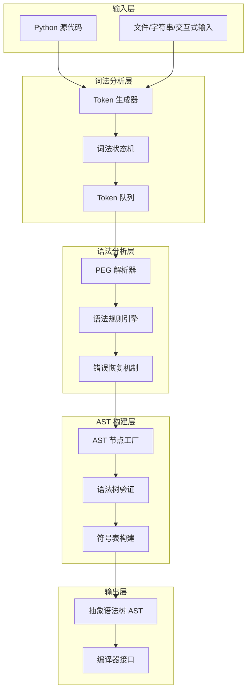
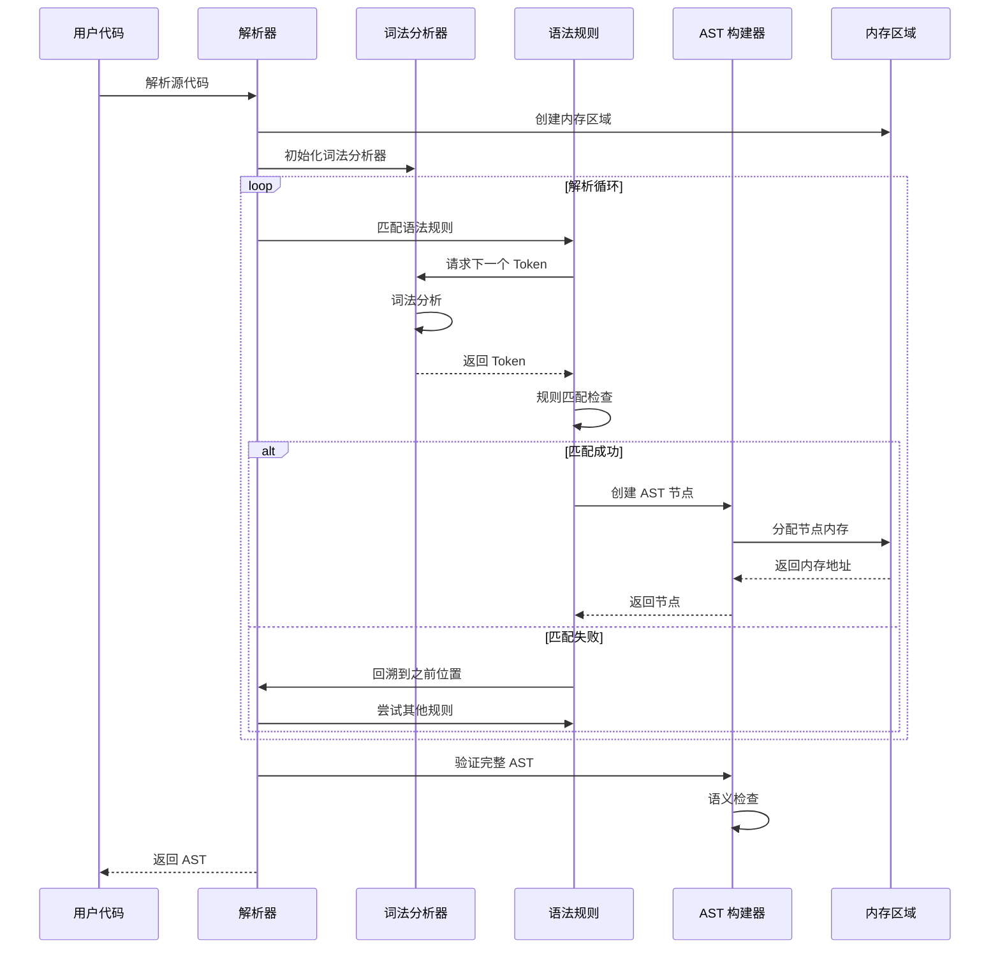

## 概述

CPython 解析器负责将 Python 源代码转换为抽象语法树（AST），是编译过程的第一个关键阶段。本章深入分析解析器的架构、词法分析、语法分析和 AST 构建过程。

## 1. 解析器架构总览

### 1.1 解析流程架构图



### 1.2 核心组件文件

- **Parser/tokenizer/** - 词法分析器实现
- **Parser/pegen.c** - PEG 解析器核心
- **Parser/Python.asdl** - AST 节点定义
- **Parser/asdl.py** - ASDL 编译器
- **Python/ast.c** - AST 节点实现

## 2. 词法分析器实现

### 2.1 Token 结构定义

```c
/* Parser/pegen.h - Token 结构定义 */
typedef struct {
    int type;                   // Token 类型
    PyObject *bytes;           // Token 字节内容
    int level;                 // 缩进级别
    int lineno;                // 行号
    int col_offset;            // 列偏移
    int end_lineno;            // 结束行号
    int end_col_offset;        // 结束列偏移
    Memo *memo;                // 记忆化缓存
    PyObject *metadata;        // 元数据
} Token;

/* Token 类型枚举 */
typedef enum {
    ENDMARKER = 0,
    NAME = 1,
    NUMBER = 2,
    STRING = 3,
    NEWLINE = 4,
    INDENT = 5,
    DEDENT = 6,
    LPAR = 7,          // (
    RPAR = 8,          // )
    LSQB = 9,          // [
    RSQB = 10,         // ]
    COLON = 11,        // :
    COMMA = 12,        // ,
    SEMI = 13,         // ;
    PLUS = 14,         // +
    MINUS = 15,        // -
    STAR = 16,         // *
    SLASH = 17,        // /
    VBAR = 18,         // |
    AMPER = 19,        // &
    LESS = 20,         // <
    GREATER = 21,      // >
    EQUAL = 22,        // =
    DOT = 23,          // .
    PERCENT = 24,      // %
    LBRACE = 25,       // {
    RBRACE = 26,       // }
    EQEQUAL = 27,      // ==
    NOTEQUAL = 28,     // !=
    LESSEQUAL = 29,    // <=
    GREATEREQUAL = 30, // >=
    TILDE = 31,        // ~
    CIRCUMFLEX = 32,   // ^
    LEFTSHIFT = 33,    // <<
    RIGHTSHIFT = 34,   // >>
    DOUBLESTAR = 35,   // **
    PLUSEQUAL = 36,    // +=
    MINEQUAL = 37,     // -=
    STAREQUAL = 38,    // *=
    SLASHEQUAL = 39,   // /=
    PERCENTEQUAL = 40, // %=
    // ... 更多 Token 类型
} TokenType;
```

### 2.2 词法分析器状态机

```c
/* Parser/tokenizer/tokenizer.c - 词法分析器核心 */
struct tok_state {
    /* 输入缓冲区 */
    char *buf;              // 当前缓冲区
    char *cur;              // 当前位置指针
    char *inp;              // 输入结束位置
    char *end;              // 缓冲区结束位置
    char *start;            // Token 开始位置
    
    /* 行信息 */
    int lineno;             // 当前行号
    int level;              // 缩进级别
    int altlevel;           // 替代缩进级别
    int decoding_erred;     // 解码错误标志
    int decoding_readline;  // 解码行读取标志
    
    /* 缩进栈 */
    int indstack[MAXINDENT]; // 缩进栈
    int indent;              // 当前缩进索引
    
    /* 待处理 Token */
    int pendin;              // 待处理缩进数量
    
    /* 文件信息 */
    PyObject *filename;      // 文件名
    PyObject *decoding_buffer; // 解码缓冲区
    
    /* 交互式输入 */
    int interactive;         // 交互式标志
    int done;               // 完成标志
    
    /* 编码信息 */
    const char *encoding;    // 源文件编码
    int decoding_state;     // 解码状态
    
    /* 错误处理 */
    char *error_ret;        // 错误返回信息
    PyObject *decoding_erred; // 解码错误对象
};

/* 主要的 Token 获取函数 */
int
PyTokenizer_Get(struct tok_state *tok, const char **p_start, const char **p_end)
{
    int c;
    int blankline, nonascii;
    
nextline:
    tok->start = NULL;
    blankline = 0;
    
    /* 获取下一行 */
    if (tok->decoding_erred) {
        return ERRORTOKEN;
    }
    
    /* 处理缩进 */
    if (tok->atbol) {
        int col = 0;
        int altcol = 0;
        tok->atbol = 0;
        
        /* 跳过空白和注释 */
        for (;;) {
            c = tok_nextc(tok);
            if (c == ' ') {
                col++, altcol++;
            }
            else if (c == '\t') {
                col = (col / tok->tabsize + 1) * tok->tabsize;
                altcol = (altcol / ALTTABSIZE + 1) * ALTTABSIZE;
            }
            else if (c == '\014')  /* Control-L (formfeed) */
                col = altcol = 0; /* For Emacs users */
            else
                break;
        }
        
        tok_backup(tok, c);
        
        if (c == '#' || c == '\n' || c == '\\') {
            /* 注释或空行 */
            if (c == '#') {
                /* 跳过注释 */
                do {
                    c = tok_nextc(tok);
                } while (c != EOF && c != '\n');
                tok_backup(tok, c);
            }
            if (c == '\n') {
                tok->atbol = 1;
                if (blankline || tok->level > 0) {
                    goto nextline;
                }
                *p_start = tok->cur - 1;
                *p_end = tok->cur;
                return NEWLINE;
            }
        }
        
        /* 处理缩进变化 */
        if (col != tok->indstack[tok->indent]) {
            if (col > tok->indstack[tok->indent]) {
                /* 增加缩进 */
                if (tok->indent+1 >= MAXINDENT) {
                    tok->done = E_TOODEEP;
                    tok->cur = tok->inp;
                    return ERRORTOKEN;
                }
                tok->indstack[++tok->indent] = col;
                return INDENT;
            }
            else {
                /* 减少缩进 */
                while (tok->indent > 0 &&
                       col < tok->indstack[tok->indent]) {
                    tok->pendin--;
                    tok->indent--;
                }
                if (col != tok->indstack[tok->indent]) {
                    tok->done = E_DEDENT;
                    tok->cur = tok->inp;
                    return ERRORTOKEN;
                }
                if (tok->pendin < 0) {
                    tok->pendin++;
                    return DEDENT;
                }
            }
        }
    }
    
    /* 处理待处理的 DEDENT */
    if (tok->pendin != 0) {
        if (tok->pendin < 0) {
            tok->pendin++;
            return DEDENT;
        }
        else {
            tok->pendin--;
            return INDENT;
        }
    }
    
    /* 开始新的 Token */
again:
    tok->start = tok->cur;
    c = tok_nextc(tok);
    
    /* 处理各种 Token 类型 */
    switch (c) {
    case EOF:
        return ENDMARKER;
        
    case '\n':
        tok->atbol = 1;
        if (blankline || tok->level > 0) {
            goto nextline;
        }
        *p_start = tok->start;
        *p_end = tok->cur - 1; /* Leave '\n' out of the string */
        return NEWLINE;
        
    case '#':
        /* 注释 */
        while (c != EOF && c != '\n') {
            c = tok_nextc(tok);
        }
        tok_backup(tok, c);
        goto again;
        
    case ' ':
    case '\t':
    case '\014': /* Form feed */
        goto again;
        
    case '\\':
        /* 行连接 */
        c = tok_nextc(tok);
        if (c != '\n') {
            tok->done = E_LINECONT;
            return ERRORTOKEN;
        }
        c = tok_nextc(tok);
        if (c == EOF) {
            tok->done = E_EOF;
            return ERRORTOKEN;
        }
        goto again;
        
    /* 单字符 Token */
    case '(':
        return LPAR;
    case ')':
        return RPAR;
    case '[':
        return LSQB;
    case ']':
        return RSQB;
    case ':':
        return COLON;
    case ',':
        return COMMA;
    case ';':
        return SEMI;
        
    /* 多字符操作符 */
    case '+':
        c = tok_nextc(tok);
        if (c == '=') {
            return PLUSEQUAL;
        }
        tok_backup(tok, c);
        return PLUS;
        
    case '-':
        c = tok_nextc(tok);
        if (c == '=') {
            return MINEQUAL;
        } else if (c == '>') {
            return RARROW;
        }
        tok_backup(tok, c);
        return MINUS;
        
    case '*':
        c = tok_nextc(tok);
        if (c == '*') {
            return DOUBLESTAR;
        } else if (c == '=') {
            return STAREQUAL;
        }
        tok_backup(tok, c);
        return STAR;
        
    /* 字符串字面量 */
    case '\'':
    case '"':
        return tok_get_str(tok, c);
        
    /* 数字字面量 */
    case '0': case '1': case '2': case '3': case '4':
    case '5': case '6': case '7': case '8': case '9':
        return tok_get_number(tok, c);
        
    /* 标识符和关键字 */
    default:
        if (Py_UNICODE_ISALPHA(c) || c == '_') {
            return tok_get_name(tok, c);
        }
        
        /* 未知字符 */
        return ERRORTOKEN;
    }
}
```

### 2.3 字符串和数字解析

```c
/* 字符串字面量解析 */
static int
tok_get_str(struct tok_state *tok, int quote)
{
    int c;
    int triple = 0;     // 三引号标志
    int end_quote = quote;
    
    c = tok_nextc(tok);
    if (c == quote) {
        c = tok_nextc(tok);
        if (c == quote) {
            /* 三引号字符串 */
            triple = 1;
        } else {
            /* 空字符串 */
            tok_backup(tok, c);
            *p_start = tok->start;
            *p_end = tok->cur;
            return STRING;
        }
    }
    
    /* 读取字符串内容 */
    for (;;) {
        c = tok_nextc(tok);
        if (c == EOF) {
            if (triple) {
                tok->done = E_EOFS;
            } else {
                tok->done = E_EOLS;
            }
            return ERRORTOKEN;
        }
        
        if (c == end_quote) {
            if (triple) {
                /* 检查三引号结束 */
                c = tok_nextc(tok);
                if (c != end_quote) {
                    tok_backup(tok, c);
                    continue;
                }
                c = tok_nextc(tok);
                if (c != end_quote) {
                    tok_backup(tok, c);
                    tok_backup(tok, end_quote);
                    continue;
                }
            }
            break;  /* 字符串结束 */
        }
        
        if (c == '\\') {
            /* 转义序列 */
            c = tok_nextc(tok);
            if (c == EOF) {
                tok->done = E_EOLS;
                return ERRORTOKEN;
            }
        }
        
        if (!triple && (c == '\n' || c == '\r')) {
            tok->done = E_EOLS;
            return ERRORTOKEN;
        }
    }
    
    *p_start = tok->start;
    *p_end = tok->cur;
    return STRING;
}

/* 数字字面量解析 */
static int
tok_get_number(struct tok_state *tok, int c)
{
    int nonzero_digits = 0;
    int digits = 0;
    
    /* 整数部分 */
    if (c == '0') {
        /* 可能是八进制、十六进制或二进制 */
        c = tok_nextc(tok);
        if (c == 'x' || c == 'X') {
            /* 十六进制 */
            return tok_get_hex_number(tok);
        }
        if (c == 'o' || c == 'O') {
            /* 八进制 */
            return tok_get_oct_number(tok);
        }
        if (c == 'b' || c == 'B') {
            /* 二进制 */
            return tok_get_bin_number(tok);
        }
        tok_backup(tok, c);
        nonzero_digits = 1;
    }
    
    /* 读取十进制数字 */
    while (Py_UNICODE_ISDIGIT(c)) {
        if (c != '0') {
            nonzero_digits = 1;
        }
        digits++;
        c = tok_nextc(tok);
    }
    
    /* 小数点 */
    if (c == '.') {
        c = tok_nextc(tok);
        while (Py_UNICODE_ISDIGIT(c)) {
            c = tok_nextc(tok);
        }
    }
    
    /* 科学计数法 */
    if (c == 'e' || c == 'E') {
        c = tok_nextc(tok);
        if (c == '+' || c == '-') {
            c = tok_nextc(tok);
        }
        if (!Py_UNICODE_ISDIGIT(c)) {
            tok->done = E_TOKEN;
            return ERRORTOKEN;
        }
        while (Py_UNICODE_ISDIGIT(c)) {
            c = tok_nextc(tok);
        }
    }
    
    /* 复数后缀 */
    if (c == 'j' || c == 'J') {
        c = tok_nextc(tok);
    }
    
    tok_backup(tok, c);
    *p_start = tok->start;
    *p_end = tok->cur;
    return NUMBER;
}
```

## 3. PEG 解析器实现

### 3.1 PEG 解析器核心结构

```c
/* Parser/pegen.h - 解析器状态结构 */
typedef struct {
    struct tok_state *tok;      // 词法分析器状态
    Token **tokens;             // Token 数组
    int mark;                   // 当前解析位置
    int fill, size;             // Token 缓冲区信息
    
    PyArena *arena;             // 内存区域
    KeywordToken **keywords;    // 关键字表
    char **soft_keywords;       // 软关键字表
    int n_keyword_lists;        // 关键字列表数量
    
    int start_rule;             // 起始规则
    int *errcode;               // 错误码
    int parsing_started;        // 解析开始标志
    
    PyObject* normalize;        // 规范化函数
    int starting_lineno;        // 起始行号
    int starting_col_offset;    // 起始列偏移
    
    int error_indicator;        // 错误指示器
    int flags;                  // 解析标志
    int feature_version;        // 特性版本
    
    growable_comment_array type_ignore_comments; // 类型忽略注释
    Token *known_err_token;     // 已知错误 Token
    int level;                  // 嵌套级别
    int call_invalid_rules;     // 调用无效规则标志
    int debug;                  // 调试标志
} Parser;

/* 记忆化结构 */
typedef struct _memo {
    int type;                   // 规则类型
    void *node;                 // AST 节点
    int mark;                   // 位置标记
    struct _memo *next;         // 下一个记忆
} Memo;
```

### 3.2 核心解析函数

```c
/* Parser/pegen.c - 主要解析函数 */
mod_ty
_PyPegen_run_parser_from_string(const char *str, int start_rule, 
                                PyObject *filename, PyCompilerFlags *flags,
                                PyArena *arena)
{
    struct tok_state *tok;
    Parser *p;
    mod_ty result = NULL;
    
    /* 创建词法分析器 */
    tok = PyTokenizer_FromString(str, 1);
    if (tok == NULL) {
        if (PyErr_Occurred()) {
            return NULL;
        }
        return NULL;
    }
    
    /* 设置词法分析器参数 */
    tok->filename = filename;
    Py_INCREF(filename);
    
    /* 创建解析器 */
    p = _PyPegen_Parser_New(tok, start_rule, flags, NULL, arena);
    if (p == NULL) {
        PyTokenizer_Free(tok);
        return NULL;
    }
    
    /* 执行解析 */
    result = _PyPegen_run_parser(p);
    
    /* 清理资源 */
    _PyPegen_Parser_Free(p);
    PyTokenizer_Free(tok);
    
    return result;
}

/* 运行解析器主循环 */
mod_ty
_PyPegen_run_parser(Parser *p)
{
    mod_ty res = NULL;
    int errcode = 0;
    p->errcode = &errcode;
    
    /* 根据起始规则选择解析函数 */
    switch (p->start_rule) {
        case Py_file_input:
            res = file_rule(p);
            break;
        case Py_single_input:
            res = interactive_rule(p);
            break;
        case Py_eval_input:
            res = eval_rule(p);
            break;
        case Py_func_type_input:
            res = func_type_rule(p);
            break;
        default:
            PyErr_Format(PyExc_SystemError,
                        "invalid start rule %d", p->start_rule);
            return NULL;
    }
    
    return res;
}

/* Token 获取和管理 */
static Token *
_PyPegen_get_token(Parser *p, int type)
{
    Token *new_token;
    
    /* 确保有足够的 Token 缓冲区 */
    if (p->fill == p->size) {
        int newsize = p->size * 2;
        Token **new_tokens = PyMem_Resize(p->tokens, Token *, newsize);
        if (new_tokens == NULL) {
            p->error_indicator = 1;
            return NULL;
        }
        p->tokens = new_tokens;
        p->size = newsize;
    }
    
    /* 获取下一个 Token */
    new_token = PyMem_Malloc(sizeof(Token));
    if (new_token == NULL) {
        p->error_indicator = 1;
        return NULL;
    }
    
    /* 从词法分析器获取 Token */
    if (PyTokenizer_Get(p->tok, &(new_token->start), &(new_token->end)) < 0) {
        p->error_indicator = 1;
        PyMem_Free(new_token);
        return NULL;
    }
    
    new_token->type = p->tok->type;
    new_token->bytes = PyBytes_FromStringAndSize(
        new_token->start, 
        new_token->end - new_token->start
    );
    new_token->level = p->tok->level;
    new_token->lineno = p->tok->lineno;
    new_token->col_offset = p->tok->col_offset;
    new_token->end_lineno = p->tok->end_lineno;
    new_token->end_col_offset = p->tok->end_col_offset;
    
    p->tokens[p->fill] = new_token;
    p->fill++;
    
    if (type != -1 && new_token->type != type) {
        return NULL;
    }
    
    return new_token;
}

/* 回溯和位置管理 */
#define _PyPegen_mark(p) ((p)->mark)

static void
_PyPegen_reset(Parser *p, int mark)
{
    p->mark = mark;
}

static Token *
_PyPegen_peek_token(Parser *p, int n)
{
    if (p->mark + n >= p->fill) {
        /* 需要更多 Token */
        for (int i = p->fill; i <= p->mark + n; i++) {
            if (_PyPegen_get_token(p, -1) == NULL) {
                return NULL;
            }
        }
    }
    return p->tokens[p->mark + n];
}
```

## 4. 语法规则定义

### 4.1 Python.asdl - AST 定义

```asdl
-- ASDL's 4 builtin types are:
-- identifier, int, string, constant

module Python
{
    -- 顶层模块类型
    mod = Module(stmt* body, type_ignore* type_ignores)
        | Interactive(stmt* body)
        | Expression(expr body)
        | FunctionType(expr* argtypes, expr returns)

    -- 语句类型
    stmt = FunctionDef(identifier name, arguments args,
                       stmt* body, expr* decorator_list, expr? returns,
                       string? type_comment, type_param* type_params)
          | AsyncFunctionDef(identifier name, arguments args,
                             stmt* body, expr* decorator_list, expr? returns,
                             string? type_comment, type_param* type_params)
          | ClassDef(identifier name,
             expr* bases,
             keyword* keywords,
             stmt* body,
             expr* decorator_list,
             type_param* type_params)
          | Return(expr? value)
          | Delete(expr* targets)
          | Assign(expr* targets, expr value, string? type_comment)
          | AnnAssign(expr target, expr annotation, expr? value, int simple)
          | AugAssign(expr target, operator op, expr value)
          | For(expr target, expr iter, stmt* body, stmt* orelse,
                string? type_comment)
          | AsyncFor(expr target, expr iter, stmt* body, stmt* orelse,
                     string? type_comment)
          | While(expr test, stmt* body, stmt* orelse)
          | If(expr test, stmt* body, stmt* orelse)
          | With(withitem* items, stmt* body, string? type_comment)
          | AsyncWith(withitem* items, stmt* body, string? type_comment)
          | Raise(expr? exc, expr? cause)
          | Try(stmt* body, excepthandler* handlers, stmt* orelse,
                stmt* finalbody)
          | Assert(expr test, expr? msg)
          | Import(alias* names)
          | ImportFrom(identifier? module, alias* names, int? level)
          | Global(identifier* names)
          | Nonlocal(identifier* names)
          | Expr(expr value)
          | Pass | Break | Continue

    -- 表达式类型
    expr = BoolOp(boolop op, expr* values)
         | NamedExpr(expr target, expr value)
         | BinOp(expr left, operator op, expr right)
         | UnaryOp(unaryop op, expr operand)
         | Lambda(arguments args, expr body)
         | IfExp(expr test, expr body, expr orelse)
         | Dict(expr* keys, expr* values)
         | Set(expr* elts)
         | ListComp(expr elt, comprehension* generators)
         | SetComp(expr elt, comprehension* generators)
         | DictComp(expr key, expr value, comprehension* generators)
         | GeneratorExp(expr elt, comprehension* generators)
         | Await(expr value)
         | Yield(expr? value)
         | YieldFrom(expr value)
         | Compare(expr left, cmpop* ops, expr* comparators)
         | Call(expr func, expr* args, keyword* keywords)
         | FormattedValue(expr value, int? conversion, expr? format_spec)
         | JoinedStr(expr* values)
         | Constant(constant value, string? kind)
         | Attribute(expr value, identifier attr, expr_context ctx)
         | Subscript(expr value, expr slice, expr_context ctx)
         | Starred(expr value, expr_context ctx)
         | Name(identifier id, expr_context ctx)
         | List(expr* elts, expr_context ctx)
         | Tuple(expr* elts, expr_context ctx)
         | Slice(expr? lower, expr? upper, expr? step)

    -- 更多语法结构定义...
}
```

### 4.2 语法规则生成

```c
/* 根据 Grammar/python.gram 生成的解析规则 */

// file: file_input
static mod_ty
file_rule(Parser *p)
{
    D(fprintf(stderr, "Enter file_rule\n"));
    
    if (p->level++ == MAXSTACK) {
        p->error_indicator = 1;
        PyErr_SetString(PyExc_MemoryError, "too much recursion");
    }
    if (p->error_indicator) {
        D(fprintf(stderr, "Leave file_rule (error indicator set)\n"));
        return NULL;
    }
    
    mod_ty res = NULL;
    int mark = p->mark;
    
    { // statements ENDMARKER
        if (p->error_indicator) {
            D(fprintf(stderr, "Alternative failed\n"));
            p->level--;
            return NULL;
        }
        D(fprintf(stderr, "Trying file: statements ENDMARKER\n"));
        
        asdl_stmt_seq* a;
        Token* endmarker;
        
        if (
            (a = statements_rule(p))  // statements
            &&
            (endmarker = _PyPegen_expect_token(p, ENDMARKER))  // token='ENDMARKER'
        )
        {
            D(fprintf(stderr, "Matched file: statements ENDMARKER\n"));
            res = _Py_Module(a, NULL, p->arena);
            if (res == NULL && PyErr_Occurred()) {
                p->error_indicator = 1;
                D(fprintf(stderr, "Leave file_rule (error indicator set)\n"));
                return NULL;
            }
            goto done;
        }
        p->mark = mark;
        D(fprintf(stderr, "Failed\n"));
    }
    
    res = NULL;
    
done:
    p->level--;
    return res;
}

// 表达式解析规则
static expr_ty
expression_rule(Parser *p)
{
    D(fprintf(stderr, "Enter expression_rule\n"));
    
    if (p->level++ == MAXSTACK) {
        p->error_indicator = 1;
        PyErr_SetString(PyExc_MemoryError, "too much recursion");
    }
    if (p->error_indicator) {
        D(fprintf(stderr, "Leave expression_rule (error indicator set)\n"));
        return NULL;
    }
    
    expr_ty res = NULL;
    int mark = p->mark;
    
    { // disjunction 'if' disjunction 'else' expression
        if (p->error_indicator) {
            D(fprintf(stderr, "Alternative failed\n"));
            p->level--;
            return NULL;
        }
        D(fprintf(stderr, "Trying expression: disjunction 'if' disjunction 'else' expression\n"));
        
        expr_ty a;
        Token* if_token;
        expr_ty b;
        Token* else_token;
        expr_ty c;
        
        if (
            (a = disjunction_rule(p))  // disjunction
            &&
            (if_token = _PyPegen_expect_token(p, NAME)) && (strcmp(PyBytes_AsString(if_token->bytes), "if") == 0)
            &&
            (b = disjunction_rule(p))  // disjunction
            &&
            (else_token = _PyPegen_expect_token(p, NAME)) && (strcmp(PyBytes_AsString(else_token->bytes), "else") == 0)
            &&
            (c = expression_rule(p))  // expression
        )
        {
            D(fprintf(stderr, "Matched expression: disjunction 'if' disjunction 'else' expression\n"));
            Token *token = _PyPegen_get_last_nonnwhitespace_token(p);
            if (token == NULL) {
                D(fprintf(stderr, "Leave expression_rule (error indicator set)\n"));
                return NULL;
            }
            int end_lineno = token->end_lineno;
            int end_col_offset = token->end_col_offset;
            res = _Py_IfExp(b, a, c, EXTRA);
            if (res == NULL && PyErr_Occurred()) {
                p->error_indicator = 1;
                D(fprintf(stderr, "Leave expression_rule (error indicator set)\n"));
                return NULL;
            }
            goto done;
        }
        p->mark = mark;
        D(fprintf(stderr, "Failed\n"));
    }
    
    { // disjunction
        if (p->error_indicator) {
            D(fprintf(stderr, "Alternative failed\n"));
            p->level--;
            return NULL;
        }
        D(fprintf(stderr, "Trying expression: disjunction\n"));
        
        expr_ty disjunction_var;
        if (
            (disjunction_var = disjunction_rule(p))  // disjunction
        )
        {
            D(fprintf(stderr, "Matched expression: disjunction\n"));
            res = disjunction_var;
            goto done;
        }
        p->mark = mark;
        D(fprintf(stderr, "Failed\n"));
    }
    
    res = NULL;
    
done:
    p->level--;
    return res;
}
```

## 5. AST 节点构建

### 5.1 AST 节点工厂函数

```c
/* Python/ast.c - AST 节点创建函数 */

/* 创建模块节点 */
mod_ty
_Py_Module(asdl_stmt_seq *body, asdl_type_ignore_seq *type_ignores, PyArena *arena)
{
    mod_ty p;
    p = (mod_ty)PyArena_Malloc(arena, sizeof(*p));
    if (!p)
        return NULL;
    p->kind = Module_kind;
    p->v.Module.body = body;
    p->v.Module.type_ignores = type_ignores;
    return p;
}

/* 创建函数定义节点 */
stmt_ty
_Py_FunctionDef(identifier name, arguments_ty args, asdl_stmt_seq *body,
                asdl_expr_seq *decorator_list, expr_ty returns,
                string type_comment, asdl_type_param_seq *type_params,
                int lineno, int col_offset, int end_lineno,
                int end_col_offset, PyArena *arena)
{
    stmt_ty p;
    if (!name) {
        PyErr_SetString(PyExc_ValueError,
                       "field name is required for FunctionDef");
        return NULL;
    }
    if (!args) {
        PyErr_SetString(PyExc_ValueError,
                       "field args is required for FunctionDef");
        return NULL;
    }
    
    p = (stmt_ty)PyArena_Malloc(arena, sizeof(*p));
    if (!p)
        return NULL;
    p->kind = FunctionDef_kind;
    p->v.FunctionDef.name = name;
    p->v.FunctionDef.args = args;
    p->v.FunctionDef.body = body;
    p->v.FunctionDef.decorator_list = decorator_list;
    p->v.FunctionDef.returns = returns;
    p->v.FunctionDef.type_comment = type_comment;
    p->v.FunctionDef.type_params = type_params;
    p->lineno = lineno;
    p->col_offset = col_offset;
    p->end_lineno = end_lineno;
    p->end_col_offset = end_col_offset;
    return p;
}

/* 创建二元运算节点 */
expr_ty
_Py_BinOp(expr_ty left, operator_ty op, expr_ty right, int lineno,
          int col_offset, int end_lineno, int end_col_offset, PyArena *arena)
{
    expr_ty p;
    if (!left) {
        PyErr_SetString(PyExc_ValueError,
                       "field left is required for BinOp");
        return NULL;
    }
    if (!op) {
        PyErr_SetString(PyExc_ValueError,
                       "field op is required for BinOp");
        return NULL;
    }
    if (!right) {
        PyErr_SetString(PyExc_ValueError,
                       "field right is required for BinOp");
        return NULL;
    }
    
    p = (expr_ty)PyArena_Malloc(arena, sizeof(*p));
    if (!p)
        return NULL;
    p->kind = BinOp_kind;
    p->v.BinOp.left = left;
    p->v.BinOp.op = op;
    p->v.BinOp.right = right;
    p->lineno = lineno;
    p->col_offset = col_offset;
    p->end_lineno = end_lineno;
    p->end_col_offset = end_col_offset;
    return p;
}

/* 创建名称节点 */
expr_ty
_Py_Name(identifier id, expr_context_ty ctx, int lineno, int col_offset,
         int end_lineno, int end_col_offset, PyArena *arena)
{
    expr_ty p;
    if (!id) {
        PyErr_SetString(PyExc_ValueError,
                       "field id is required for Name");
        return NULL;
    }
    if (!ctx) {
        PyErr_SetString(PyExc_ValueError,
                       "field ctx is required for Name");
        return NULL;
    }
    
    p = (expr_ty)PyArena_Malloc(arena, sizeof(*p));
    if (!p)
        return NULL;
    p->kind = Name_kind;
    p->v.Name.id = id;
    p->v.Name.ctx = ctx;
    p->lineno = lineno;
    p->col_offset = col_offset;
    p->end_lineno = end_lineno;
    p->end_col_offset = end_col_offset;
    return p;
}
```

### 5.2 AST 验证

```c
/* Python/ast.c - AST 验证函数 */
int
_PyAST_Validate(mod_ty mod)
{
    int res = 0;
    struct validate_state state;
    PyObject *dict = PyDict_New();
    if (dict == NULL)
        return 0;
    
    state.dict = dict;
    state.in_function = 0;
    state.in_async_function = 0;
    state.in_comprehension = 0;
    state.in_class = 0;
    
    switch (mod->kind) {
    case Module_kind:
        res = validate_stmts(state, mod->v.Module.body);
        break;
    case Interactive_kind:
        res = validate_stmts(state, mod->v.Interactive.body);
        break;
    case Expression_kind:
        res = validate_expr(&state, mod->v.Expression.body, Load);
        break;
    case FunctionType_kind:
        res = validate_exprs(&state, mod->v.FunctionType.argtypes, Load, 0) &&
              validate_expr(&state, mod->v.FunctionType.returns, Load);
        break;
    default:
        PyErr_SetString(PyExc_SystemError, "impossible module kind");
        res = 0;
    }
    
    Py_DECREF(dict);
    return res;
}

/* 验证语句序列 */
static int
validate_stmts(struct validate_state *state, asdl_stmt_seq *seq)
{
    int i;
    for (i = 0; i < asdl_seq_LEN(seq); i++) {
        stmt_ty stmt = (stmt_ty)asdl_seq_GET(seq, i);
        if (!validate_stmt(state, stmt))
            return 0;
    }
    return 1;
}

/* 验证单个语句 */
static int
validate_stmt(struct validate_state *state, stmt_ty stmt)
{
    int i;
    switch (stmt->kind) {
    case FunctionDef_kind:
        return validate_name(stmt->v.FunctionDef.name) &&
               validate_arguments(state, stmt->v.FunctionDef.args) &&
               validate_stmts(state, stmt->v.FunctionDef.body) &&
               validate_exprs(state, stmt->v.FunctionDef.decorator_list, Load, 0) &&
               (!stmt->v.FunctionDef.returns ||
                validate_expr(state, stmt->v.FunctionDef.returns, Load)) &&
               validate_type_params(state, stmt->v.FunctionDef.type_params);
                
    case Assign_kind:
        return validate_exprs(state, stmt->v.Assign.targets, Store, 0) &&
               validate_expr(state, stmt->v.Assign.value, Load);
               
    case Return_kind:
        return !stmt->v.Return.value ||
               validate_expr(state, stmt->v.Return.value, Load);
               
    // 更多语句类型验证...
    default:
        PyErr_SetString(PyExc_SystemError, "unexpected statement");
        return 0;
    }
}
```

## 6. 错误处理和恢复

### 6.1 语法错误报告

```c
/* Parser/pegen_errors.c - 语法错误处理 */
void
_PyPegen_raise_error(Parser *p, PyObject *errtype, const char *errmsg, ...)
{
    if (p->error_indicator) {
        return;
    }
    
    p->error_indicator = 1;
    
    va_list va;
    va_start(va, errmsg);
    PyObject *error_msg = PyUnicode_FromFormatV(errmsg, va);
    va_end(va);
    
    if (error_msg == NULL) {
        return;
    }
    
    /* 获取错误位置信息 */
    Token *token = p->known_err_token;
    if (token == NULL) {
        token = _PyPegen_get_last_nonnwhitespace_token(p);
    }
    
    if (token != NULL) {
        int lineno = token->lineno;
        int col_offset = token->col_offset;
        int end_lineno = token->end_lineno;
        int end_col_offset = token->end_col_offset;
        
        PyErr_SetExcInfo(errtype, error_msg, NULL);
        
        /* 添加位置信息 */
        if (PyErr_Occurred()) {
            PyObject *type, *value, *traceback;
            PyErr_Fetch(&type, &value, &traceback);
            
            /* 创建 SyntaxError 对象 */
            PyObject *args = PyTuple_New(2);
            PyTuple_SET_ITEM(args, 0, error_msg);
            
            PyObject *error_details = PyTuple_New(4);
            PyTuple_SET_ITEM(error_details, 0, p->tok->filename);
            PyTuple_SET_ITEM(error_details, 1, PyLong_FromLong(lineno));
            PyTuple_SET_ITEM(error_details, 2, PyLong_FromLong(col_offset));
            PyTuple_SET_ITEM(error_details, 3, PyUnicode_FromString(token->start));
            
            PyTuple_SET_ITEM(args, 1, error_details);
            
            PyObject *syntax_error = PyObject_CallObject(errtype, args);
            PyErr_SetObject(errtype, syntax_error);
        }
    } else {
        PyErr_SetObject(errtype, error_msg);
    }
    
    Py_DECREF(error_msg);
}

/* 期望特定 Token 的错误 */
Token *
_PyPegen_expect_token(Parser *p, int type)
{
    Token *token = _PyPegen_get_token(p, type);
    if (token != NULL) {
        return token;
    }
    
    /* 生成期望 Token 错误 */
    if (PyErr_Occurred()) {
        return NULL;
    }
    
    Token *current_token = _PyPegen_get_token(p, -1);
    if (current_token == NULL) {
        return NULL;
    }
    
    const char *expected = _PyParser_TokenNames[type];
    const char *got;
    
    if (current_token->type == ENDMARKER) {
        got = "end of file";
    } else {
        got = _PyParser_TokenNames[current_token->type];
    }
    
    _PyPegen_raise_error(p, PyExc_SyntaxError,
                        "expected '%s', got '%s'", expected, got);
    return NULL;
}
```

### 6.2 错误恢复机制

```c
/* 错误恢复策略 */
static int
_PyPegen_lookahead_with_string(Parser *p, int positive, void *(*rule)(Parser *),
                               const char *str)
{
    int mark = p->mark;
    int error_indicator = p->error_indicator;
    
    p->error_indicator = 0;
    void *res = rule(p);
    p->error_indicator = error_indicator;
    
    if (res != NULL) {
        if (positive) {
            p->mark = mark;
            return 1;
        }
        p->mark = mark;
        return 0;
    }
    
    if (positive) {
        p->mark = mark;
        return 0;
    }
    
    p->mark = mark;
    return 1;
}

/* 同步到特定 Token */
static void
_PyPegen_synchronize(Parser *p, int token_type)
{
    while (!p->error_indicator) {
        Token *token = _PyPegen_get_token(p, -1);
        if (token == NULL) {
            return;
        }
        
        if (token->type == token_type || token->type == ENDMARKER) {
            return;
        }
        
        p->mark++;
    }
}
```

## 7. 解析流程时序图



## 8. 实战案例

### 8.1 自定义语法扩展

```python
# 示例：扩展 Python 语法支持管道操作符
# 源代码：numbers |> map(lambda x: x * 2) |> list
# 期望 AST：Call(func=list, args=[Call(func=map, args=[Lambda(...), Name(numbers)])])

"""
在 Grammar/python.gram 中添加规则：
expression: 
    | disjunction 'if' disjunction 'else' expression 
    | pipeline

pipeline:
    | pipeline '|>' disjunction { _Py_BinOp($pipeline, PipeOp, $disjunction, EXTRA) }
    | disjunction
"""

# 对应的 C 解析代码会自动生成
static expr_ty
pipeline_rule(Parser *p)
{
    D(fprintf(stderr, "Enter pipeline_rule\n"));
    
    if (p->level++ == MAXSTACK) {
        p->error_indicator = 1;
        PyErr_SetString(PyExc_MemoryError, "too much recursion");
    }
    
    expr_ty res = NULL;
    int mark = p->mark;
    
    { // pipeline '|>' disjunction
        expr_ty a;
        Token* pipe_token;
        expr_ty b;
        
        if (
            (a = pipeline_rule(p))  // 递归调用
            &&
            (pipe_token = _PyPegen_expect_token(p, PIPE_OP))  // 管道操作符
            &&
            (b = disjunction_rule(p))  // 右操作数
        )
        {
            res = _Py_BinOp(a, PipeOp, b, EXTRA);
            goto done;
        }
        p->mark = mark;
    }
    
    { // disjunction - 基础情况
        expr_ty disjunction_var;
        if ((disjunction_var = disjunction_rule(p))) {
            res = disjunction_var;
            goto done;
        }
        p->mark = mark;
    }
    
done:
    p->level--;
    return res;
}
```

### 8.2 AST 分析工具

```python
import ast
import types
from typing import List, Dict, Any

class ASTAnalyzer(ast.NodeVisitor):
    """CPython AST 深度分析工具"""
    
    def __init__(self):
        self.stats = {
            'node_counts': {},
            'complexity_metrics': {
                'cyclomatic_complexity': 0,
                'nesting_depth': 0,
                'max_nesting': 0
            },
            'identifiers': set(),
            'function_calls': [],
            'imports': [],
        }
        self.current_depth = 0
    
    def analyze(self, source_code: str) -> Dict[str, Any]:
        """分析源代码的 AST"""
        try:
            tree = ast.parse(source_code)
            self.visit(tree)
            return self.stats
        except SyntaxError as e:
            return {'error': f'语法错误: {e}'}
    
    def visit(self, node):
        """访问节点并更新统计"""
        node_type = type(node).__name__
        self.stats['node_counts'][node_type] = (
            self.stats['node_counts'].get(node_type, 0) + 1
        )
        
        # 跟踪嵌套深度
        if isinstance(node, (ast.FunctionDef, ast.ClassDef, ast.For, 
                           ast.While, ast.If, ast.With, ast.Try)):
            self.current_depth += 1
            self.stats['complexity_metrics']['max_nesting'] = max(
                self.stats['complexity_metrics']['max_nesting'],
                self.current_depth
            )
            
        self.generic_visit(node)
        
        if isinstance(node, (ast.FunctionDef, ast.ClassDef, ast.For,
                           ast.While, ast.If, ast.With, ast.Try)):
            self.current_depth -= 1
    
    def visit_Name(self, node):
        """访问名称节点"""
        self.stats['identifiers'].add(node.id)
        self.generic_visit(node)
    
    def visit_Call(self, node):
        """访问函数调用节点"""
        if isinstance(node.func, ast.Name):
            func_name = node.func.id
        elif isinstance(node.func, ast.Attribute):
            func_name = f"{ast.unparse(node.func.value)}.{node.func.attr}"
        else:
            func_name = ast.unparse(node.func)
            
        self.stats['function_calls'].append({
            'name': func_name,
            'args_count': len(node.args),
            'keywords_count': len(node.keywords),
            'lineno': node.lineno
        })
        self.generic_visit(node)
    
    def visit_Import(self, node):
        """访问 import 语句"""
        for alias in node.names:
            self.stats['imports'].append({
                'type': 'import',
                'name': alias.name,
                'asname': alias.asname,
                'lineno': node.lineno
            })
        self.generic_visit(node)
    
    def visit_ImportFrom(self, node):
        """访问 from ... import 语句"""
        for alias in node.names:
            self.stats['imports'].append({
                'type': 'from_import',
                'module': node.module,
                'name': alias.name,
                'asname': alias.asname,
                'level': node.level,
                'lineno': node.lineno
            })
        self.generic_visit(node)
    
    def visit_If(self, node):
        """访问 if 语句 - 计算圈复杂度"""
        self.stats['complexity_metrics']['cyclomatic_complexity'] += 1
        self.generic_visit(node)
    
    def visit_For(self, node):
        """访问 for 循环"""
        self.stats['complexity_metrics']['cyclomatic_complexity'] += 1
        self.generic_visit(node)
    
    def visit_While(self, node):
        """访问 while 循环"""
        self.stats['complexity_metrics']['cyclomatic_complexity'] += 1
        self.generic_visit(node)
    
    def print_analysis(self):
        """打印分析结果"""
        print("=== AST 分析结果 ===")
        print(f"节点类型统计: {self.stats['node_counts']}")
        print(f"复杂度指标: {self.stats['complexity_metrics']}")
        print(f"标识符数量: {len(self.stats['identifiers'])}")
        print(f"函数调用数量: {len(self.stats['function_calls'])}")
        print(f"导入语句数量: {len(self.stats['imports'])}")

# 使用示例
source_code = """
def fibonacci(n):
    if n <= 1:
        return n
    else:
        return fibonacci(n-1) + fibonacci(n-2)

def main():
    for i in range(10):
        print(f"fibonacci({i}) = {fibonacci(i)}")

if __name__ == "__main__":
    main()
"""

analyzer = ASTAnalyzer()
results = analyzer.analyze(source_code)
analyzer.print_analysis()
```

### 8.3 性能测试工具

```python
import ast
import time
import memory_profiler
from typing import List, Tuple

class ParserBenchmark:
    """解析器性能测试"""
    
    def __init__(self):
        self.test_cases = []
    
    def add_test_case(self, name: str, code: str):
        """添加测试用例"""
        self.test_cases.append((name, code))
    
    def benchmark_parsing(self, iterations: int = 100) -> List[Tuple[str, float, float]]:
        """基准测试解析性能"""
        results = []
        
        for name, code in self.test_cases:
            # 预热
            for _ in range(10):
                ast.parse(code)
            
            # 测试解析时间
            start_time = time.perf_counter()
            for _ in range(iterations):
                tree = ast.parse(code)
            end_time = time.perf_counter()
            
            parse_time = (end_time - start_time) / iterations
            
            # 测试内存使用
            @memory_profiler.profile(precision=4)
            def parse_with_memory():
                return ast.parse(code)
            
            # 简化的内存测试
            import tracemalloc
            tracemalloc.start()
            ast.parse(code)
            current, peak = tracemalloc.get_traced_memory()
            tracemalloc.stop()
            
            results.append((name, parse_time * 1000, peak / 1024))  # ms, KB
            
        return results
    
    def print_benchmark_results(self, results: List[Tuple[str, float, float]]):
        """打印基准测试结果"""
        print("=== 解析器性能测试结果 ===")
        print(f"{'测试用例':<20} {'解析时间(ms)':<15} {'内存使用(KB)':<15}")
        print("-" * 50)
        
        for name, parse_time, memory_usage in results:
            print(f"{name:<20} {parse_time:<15.3f} {memory_usage:<15.1f}")

# 创建测试用例
benchmark = ParserBenchmark()

# 简单表达式
benchmark.add_test_case("简单表达式", "a + b * c")

# 复杂函数
complex_function = """
def complex_function(a, b, c, d=None, *args, **kwargs):
    result = []
    for i in range(len(a)):
        if i % 2 == 0:
            temp = [x for x in b if x > i]
            result.extend(temp)
        else:
            result.append(c.get(str(i), d))
    
    try:
        final_result = sum(result) if all(isinstance(x, (int, float)) for x in result) else None
    except (TypeError, ValueError) as e:
        final_result = str(e)
    finally:
        return final_result or "default"
"""
benchmark.add_test_case("复杂函数", complex_function)

# 类定义
class_definition = """
class ComplexClass(BaseClass, Mixin):
    \"\"\"这是一个复杂的类定义\"\"\"
    
    class_var = 100
    
    def __init__(self, name: str, value: int = 0):
        self.name = name
        self.value = value
        super().__init__()
    
    @property
    def formatted_name(self) -> str:
        return f"{self.name.upper()}_{self.value}"
    
    @classmethod
    def from_dict(cls, data: dict) -> 'ComplexClass':
        return cls(data['name'], data.get('value', 0))
    
    def __str__(self) -> str:
        return f"ComplexClass(name={self.name}, value={self.value})"
"""
benchmark.add_test_case("类定义", class_definition)

# 运行基准测试
results = benchmark.benchmark_parsing(1000)
benchmark.print_benchmark_results(results)
```

## 9. 最佳实践

### 9.1 解析器扩展建议

1. **语法规则设计** - 避免左递归，考虑优先级
2. **错误恢复** - 提供有用的错误信息和恢复策略
3. **性能优化** - 使用记忆化避免重复解析
4. **AST 设计** - 保持节点结构简洁和一致

### 9.2 调试技巧

```python
# 启用解析器调试模式
import ast
import sys

# 设置环境变量启用详细输出
import os
os.environ['PYTHONPARSER_DEBUG'] = '1'

# 或在代码中启用
sys.flags.debug = True

# 自定义 AST 遍历器进行调试
class DebugVisitor(ast.NodeVisitor):
    def __init__(self):
        self.level = 0
    
    def visit(self, node):
        print("  " * self.level + f"访问: {type(node).__name__}")
        if hasattr(node, 'lineno'):
            print("  " * self.level + f"  行号: {node.lineno}")
        
        self.level += 1
        self.generic_visit(node)
        self.level -= 1

# 使用调试访问器
code = "x = y + z"
tree = ast.parse(code)
visitor = DebugVisitor()
visitor.visit(tree)
```

## 10. 总结

CPython 解析器的设计体现了以下核心思想：

1. **分层架构** - 词法分析、语法分析和 AST 构建分离
2. **PEG 算法** - 强大的解析表达式语法支持
3. **错误恢复** - 友好的错误报告和恢复机制
4. **内存效率** - 使用 Arena 内存分配器
5. **可扩展性** - 支持语法规则的灵活扩展

解析器是编程语言实现的前端，其设计质量直接影响开发者的使用体验。CPython 的解析器通过精心设计的架构和算法，为 Python 语言的灵活性和易用性提供了坚实基础。
