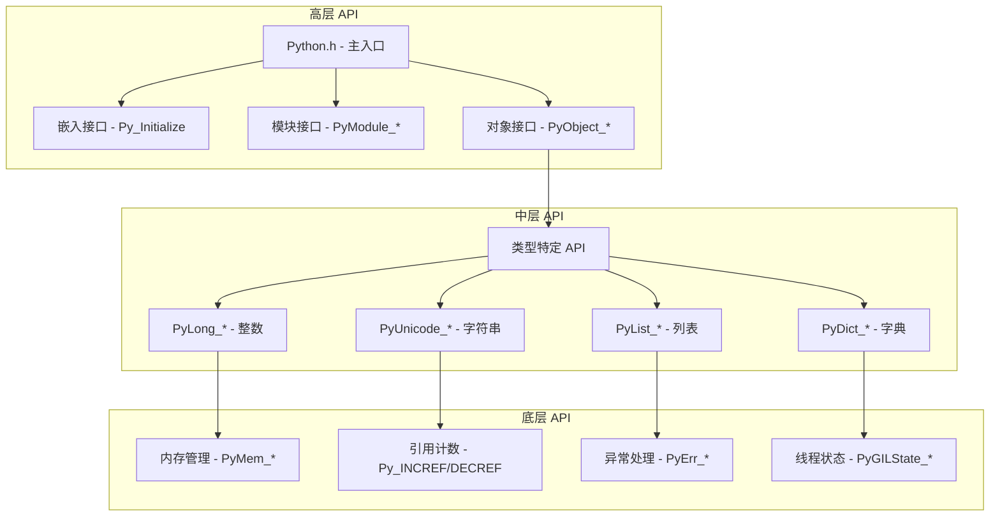

## 概述

CPython 提供了丰富的 C API 接口，允许 C/C++ 程序嵌入 Python 解释器或编写 Python 扩展模块。本章深入分析 CPython 的 API 架构、核心接口和使用模式。

## 1. API 架构总览

### 1.1 API 层次结构



### 1.2 核心头文件

```c
/* Include/Python.h - 主要 API 入口 */
#ifndef Py_PYTHON_H
#define Py_PYTHON_H

// 平台配置
#include "patchlevel.h"
#include "pyconfig.h"
#include "pymacconfig.h"

// 标准库头文件
#include <assert.h>
#include <inttypes.h>
#include <limits.h>
#include <math.h>
#include <stdarg.h>
#include <wchar.h>

// Python 核心头文件
#include "pyport.h"
#include "pymacro.h"
#include "pymath.h"
#include "pymem.h"
#include "pytypedefs.h"
#include "pybuffer.h"
#include "object.h"
#include "objimpl.h"
#include "pyerrors.h"
#include "pystate.h"
#include "pylifecycle.h"

// 内置类型头文件
#include "longobject.h"
#include "boolobject.h"
#include "floatobject.h"
#include "complexobject.h"
#include "rangeobject.h"
#include "memoryobject.h"
#include "tupleobject.h"
#include "listobject.h"
#include "dictobject.h"
#include "setobject.h"
#include "unicodeobject.h"
#include "bytesobject.h"
#include "bytearrayobject.h"

// 高级功能头文件
#include "moduleobject.h"
#include "funcobject.h"
#include "classobject.h"
#include "fileobject.h"
#include "pycapsule.h"
#include "traceback.h"
#include "sliceobject.h"
#include "iterobject.h"
#include "genobject.h"
#include "descrobject.h"
#include "warnings.h"
#include "weakrefobject.h"

#include "codecs.h"
#include "pyerrors.h"
#include "pythread.h"
#include "modsupport.h"
#include "pythonrun.h"
#include "import.h"
#include "abstract.h"
#include "compile.h"
#include "eval.h"

#endif /* !Py_PYTHON_H */
```

## 2. 解释器生命周期 API

### 2.1 解释器初始化

```c
/* Python/pylifecycle.c - 解释器生命周期管理 */

/*

 * 功能: 使用默认配置初始化 Python 解释器
 * 参数: 无
 * 返回: 无
 * 注意: 必须在其他 Python API 调用前调用

 */
void Py_Initialize(void)
{
    Py_InitializeEx(1);  // 安装信号处理器
}

/*

 * 功能: 初始化 Python 解释器（可选择是否安装信号处理器）
 * 参数: install_sigs - 是否安装信号处理器
 * 返回: 无

 */
void Py_InitializeEx(int install_sigs)
{
    PyStatus status;

    // 初始化运行时
    status = _PyRuntime_Initialize();
    if (_PyStatus_EXCEPTION(status)) {
        Py_ExitStatusException(status);
    }

    _PyRuntimeState *runtime = &_PyRuntime;

    if (runtime->initialized) {
        // 重复初始化，直接返回
        return;
    }

    // 创建配置
    PyConfig config;
    _PyConfig_InitCompatConfig(&config);
    config.install_signal_handlers = install_sigs;

    // 从配置初始化
    status = Py_InitializeFromConfig(&config);
    PyConfig_Clear(&config);
    if (_PyStatus_EXCEPTION(status)) {
        Py_ExitStatusException(status);
    }
}

/*

 * 功能: 从详细配置初始化 Python 解释器
 * 参数: config - 详细配置结构
 * 返回: PyStatus - 初始化状态
 * 用途: 嵌入应用的精确配置控制

 */
PyStatus Py_InitializeFromConfig(const PyConfig *config)
{
    if (config == NULL) {
        return _PyStatus_ERR("initialization config is NULL");
    }

    PyStatus status;

    // 确保运行时已初始化
    status = _PyRuntime_Initialize();
    if (_PyStatus_EXCEPTION(status)) {
        return status;
    }
    _PyRuntimeState *runtime = &_PyRuntime;

    PyThreadState *tstate = NULL;

    // 核心初始化
    status = pyinit_core(runtime, config, &tstate);
    if (_PyStatus_EXCEPTION(status)) {
        return status;
    }
    config = _PyInterpreterState_GetConfig(tstate->interp);

    // 主初始化
    if (config->_init_main) {
        status = pyinit_main(tstate);
        if (_PyStatus_EXCEPTION(status)) {
            return status;
        }
    }

    return _PyStatus_OK();
}

/*

 * 功能: 检查解释器是否已初始化
 * 参数: 无
 * 返回: int - 1 表示已初始化，0 表示未初始化

 */
int Py_IsInitialized(void)
{
    return _PyRuntime.initialized;
}

/*

 * 功能: 终止 Python 解释器
 * 参数: 无
 * 返回: 无
 * 注意: 释放所有子解释器和线程状态

 */
void Py_Finalize(void)
{
    PyThreadState *tstate = _PyThreadState_GET();
    if (tstate == NULL) {
        return;  // 解释器未初始化
    }

    PyInterpreterState *interp = tstate->interp;
    if (interp == NULL) {
        return;
    }

    // 设置终止标志
    interp->finalizing = 1;

    // 清理各种资源
    finalize_modules_delete_special();
    finalize_modules_clear_weaklist();
    finalize_modules();

    // 终止内存分配器
    _PyMem_Finalize();

    // 清理运行时状态
    _PyRuntime_Finalize();
}

/*

 * 功能: 终止解释器并设置退出码
 * 参数: sts - 退出状态码
 * 返回: 无 (不返回)

 */
void Py_Exit(int sts)
{
    if (Py_FinalizeEx() < 0) {
        sts = 120;  // 终化失败
    }

    exit(sts);
}
```

### 2.2 配置结构详解

```c
/* Include/cpython/initconfig.h - 配置结构定义 */
typedef struct PyConfig {
    /* 解释器配置 */
    int isolated;               // 隔离模式
    int use_environment;        // 使用环境变量
    int dev_mode;              // 开发者模式
    int install_signal_handlers; // 安装信号处理器
    int use_hash_seed;         // 使用哈希种子
    unsigned long hash_seed;    // 哈希种子值

    /* 字符编码 */
    wchar_t *filesystem_encoding;     // 文件系统编码
    wchar_t *filesystem_errors;       // 文件系统错误处理
    wchar_t *stdio_encoding;          // 标准IO编码
    wchar_t *stdio_errors;            // 标准IO错误处理

    /* 路径配置 */
    wchar_t *executable;        // Python 可执行文件路径
    wchar_t *base_executable;   // 基础可执行文件路径
    wchar_t *prefix;           // 安装前缀
    wchar_t *base_prefix;      // 基础前缀
    wchar_t *exec_prefix;      // 执行前缀
    wchar_t *base_exec_prefix; // 基础执行前缀

    /* 模块搜索路径 */
    int module_search_paths_set;      // 搜索路径是否已设置
    PyWideStringList module_search_paths; // 模块搜索路径列表
    wchar_t *pythonpath_env;         // PYTHONPATH 环境变量
    wchar_t *home;                   // Python 主目录

    /* 运行配置 */
    int argc;                   // 命令行参数数量
    PyWideStringList argv;      // 命令行参数列表
    wchar_t *program_name;      // 程序名
    PyWideStringList xoptions;  // -X 选项

    /* 运行模式 */
    wchar_t *run_command;       // -c 选项命令
    wchar_t *run_module;        // -m 选项模块
    wchar_t *run_filename;      // 要运行的文件名

    /* 优化设置 */
    int optimization_level;     // 优化级别
    int parser_debug;          // 解析器调试
    int write_bytecode;        // 写入字节码
    int quiet;                 // 静默模式
    int configure_c_stdio;     // 配置 C stdio
    int buffered_stdio;        // 缓冲 stdio

    /* 内存配置 */
    int show_alloc_count;      // 显示分配计数
    int dump_refs;             // 转储引用
    int malloc_stats;          // 显示内存统计

    /* 导入配置 */
    int import_time;           // 显示导入时间
    int code_debug_ranges;     // 代码调试范围
    int show_ref_count;        // 显示引用计数

    /* 警告控制 */
    PyWideStringList warnoptions;     // 警告选项
    int bytes_warning;                // 字节警告

    /* 调试和性能 */
    int inspect;               // 交互模式
    int interactive;           // 强制交互模式
    int verbose;               // 详细模式
    int debug;                 // 调试模式

    /* 私有字段 */
    int _init_main;            // 是否初始化主模块
    int _isolated_interpreter; // 隔离解释器标志
} PyConfig;

/*

 * 功能: 初始化配置为 Python 配置
 * 参数: config - 要初始化的配置结构指针
 * 返回: 无

 */
void PyConfig_InitPythonConfig(PyConfig *config)
{
    memset(config, 0, sizeof(*config));

    // 设置默认值
    config->isolated = 0;
    config->use_environment = 1;
    config->dev_mode = 0;
    config->install_signal_handlers = 1;
    config->use_hash_seed = 0;
    config->hash_seed = 0;

    config->optimization_level = 0;
    config->parser_debug = 0;
    config->write_bytecode = 1;
    config->quiet = 0;
    config->configure_c_stdio = 1;
    config->buffered_stdio = 1;

    config->bytes_warning = 0;
    config->inspect = 0;
    config->interactive = 0;
    config->verbose = 0;
    config->debug = 0;

    config->_init_main = 1;
}

/*

 * 功能: 清理配置结构中分配的内存
 * 参数: config - 要清理的配置结构指针
 * 返回: 无

 */
void PyConfig_Clear(PyConfig *config)
{
    PyMem_RawFree(config->filesystem_encoding);
    PyMem_RawFree(config->filesystem_errors);
    PyMem_RawFree(config->stdio_encoding);
    PyMem_RawFree(config->stdio_errors);

    PyMem_RawFree(config->executable);
    PyMem_RawFree(config->base_executable);
    PyMem_RawFree(config->prefix);
    PyMem_RawFree(config->base_prefix);
    PyMem_RawFree(config->exec_prefix);
    PyMem_RawFree(config->base_exec_prefix);

    _PyWideStringList_Clear(&config->module_search_paths);
    PyMem_RawFree(config->pythonpath_env);
    PyMem_RawFree(config->home);

    _PyWideStringList_Clear(&config->argv);
    PyMem_RawFree(config->program_name);
    _PyWideStringList_Clear(&config->xoptions);

    PyMem_RawFree(config->run_command);
    PyMem_RawFree(config->run_module);
    PyMem_RawFree(config->run_filename);

    _PyWideStringList_Clear(&config->warnoptions);

    // 重置为安全状态
    memset(config, 0, sizeof(*config));
}
```

## 3. 对象操作 API

### 3.1 通用对象操作

```c
/* Objects/abstract.c - 抽象对象协议 */

/*

 * 功能: 获取对象的字符串表示
 * 参数: o - 对象指针
 * 返回: PyObject* - 字符串对象，失败时返回 NULL
 * 等价于: Python 中的 repr(o)

 */
PyObject *PyObject_Repr(PyObject *o)
{
    if (o == NULL) {
        return PyUnicode_FromString("<NULL>");
    }

    PyTypeObject *type = Py_TYPE(o);
    reprfunc repr_func = type->tp_repr;

    if (repr_func == NULL) {
        return PyUnicode_FromFormat("<%s object at %p>",
                                   type->tp_name, o);
    }

    PyObject *result = repr_func(o);
    if (result == NULL) {
        return NULL;
    }

    // 确保返回字符串类型
    if (!PyUnicode_Check(result)) {
        PyErr_Format(PyExc_TypeError,
                    "__repr__ returned non-string (type %.200s)",
                    Py_TYPE(result)->tp_name);
        Py_DECREF(result);
        return NULL;
    }

    return result;
}

/*

 * 功能: 获取对象的字符串值
 * 参数: o - 对象指针
 * 返回: PyObject* - 字符串对象，失败时返回 NULL
 * 等价于: Python 中的 str(o)

 */
PyObject *PyObject_Str(PyObject *o)
{
    if (o == NULL) {
        return PyUnicode_FromString("<NULL>");
    }

    // 如果已经是字符串，直接返回引用
    if (PyUnicode_CheckExact(o)) {
        Py_INCREF(o);
        return o;
    }

    PyTypeObject *type = Py_TYPE(o);
    reprfunc str_func = type->tp_str;

    if (str_func != NULL) {
        PyObject *result = str_func(o);
        if (result == NULL) {
            return NULL;
        }

        if (!PyUnicode_Check(result)) {
            PyErr_Format(PyExc_TypeError,
                        "__str__ returned non-string (type %.200s)",
                        Py_TYPE(result)->tp_name);
            Py_DECREF(result);
            return NULL;
        }
        return result;
    }

    // 如果没有 __str__ 方法，使用 __repr__
    return PyObject_Repr(o);
}

/*

 * 功能: 获取对象属性
 * 参数: o - 对象指针
 *      attr_name - 属性名字符串
 * 返回: PyObject* - 属性值，失败时返回 NULL
 * 等价于: Python 中的 getattr(o, attr_name)

 */
PyObject *PyObject_GetAttr(PyObject *o, PyObject *attr_name)
{
    if (o == NULL || attr_name == NULL) {
        return NULL;
    }

    PyTypeObject *tp = Py_TYPE(o);

    if (tp->tp_getattro != NULL) {
        return tp->tp_getattro(o, attr_name);
    }
    if (tp->tp_getattr != NULL) {
        const char *name = PyUnicode_AsUTF8(attr_name);
        if (name == NULL) {
            return NULL;
        }
        return tp->tp_getattr(o, (char *)name);
    }

    PyErr_Format(PyExc_AttributeError,
                "'%.50s' object has no attribute '%U'",
                tp->tp_name, attr_name);
    return NULL;
}

/*

 * 功能: 设置对象属性
 * 参数: o - 对象指针
 *      attr_name - 属性名字符串
 *      v - 属性值
 * 返回: int - 成功返回 0，失败返回 -1
 * 等价于: Python 中的 setattr(o, attr_name, v)

 */
int PyObject_SetAttr(PyObject *o, PyObject *attr_name, PyObject *v)
{
    if (o == NULL || attr_name == NULL) {
        return -1;
    }

    PyTypeObject *tp = Py_TYPE(o);

    if (tp->tp_setattro != NULL) {
        return tp->tp_setattro(o, attr_name, v);
    }
    if (tp->tp_setattr != NULL) {
        const char *name = PyUnicode_AsUTF8(attr_name);
        if (name == NULL) {
            return -1;
        }
        return tp->tp_setattr(o, (char *)name, v);
    }

    if (tp->tp_getattro == NULL && tp->tp_getattr == NULL) {
        PyErr_Format(PyExc_TypeError,
                    "'%.100s' object has no attributes "
                    "(%s .%U)",
                    tp->tp_name,
                    v==NULL ? "del" : "assign to",
                    attr_name);
    }
    else {
        PyErr_Format(PyExc_TypeError,
                    "'%.100s' object attribute '%U' is read-only",
                    tp->tp_name, attr_name);
    }
    return -1;
}

/*

 * 功能: 调用对象
 * 参数: callable - 可调用对象
 *      args - 位置参数元组
 *      kwargs - 关键字参数字典
 * 返回: PyObject* - 调用结果，失败时返回 NULL
 * 等价于: Python 中的 callable(*args, **kwargs)

 */
PyObject *PyObject_Call(PyObject *callable, PyObject *args, PyObject *kwargs)
{
    if (callable == NULL) {
        return NULL;
    }

    ternaryfunc call = Py_TYPE(callable)->tp_call;
    if (call == NULL) {
        PyErr_Format(PyExc_TypeError,
                    "'%.200s' object is not callable",
                    Py_TYPE(callable)->tp_name);
        return NULL;
    }

    if (args == NULL) {
        args = PyTuple_New(0);
        if (args == NULL) {
            return NULL;
        }
    } else {
        Py_INCREF(args);
    }

    if (kwargs != NULL && !PyDict_Check(kwargs)) {
        PyErr_SetString(PyExc_TypeError,
                       "keywords must be a dictionary");
        Py_DECREF(args);
        return NULL;
    }

    PyObject *result = call(callable, args, kwargs);

    Py_DECREF(args);
    return result;
}

/*

 * 功能: 检查对象是否为某个类型的实例
 * 参数: inst - 实例对象
 *      cls - 类对象
 * 返回: int - 是实例返回 1，不是返回 0，出错返回 -1
 * 等价于: Python 中的 isinstance(inst, cls)

 */
int PyObject_IsInstance(PyObject *inst, PyObject *cls)
{
    PyObject *checker;

    if (PyTuple_Check(cls)) {
        // 检查多个类型的元组
        Py_ssize_t n = PyTuple_GET_SIZE(cls);
        for (Py_ssize_t i = 0; i < n; i++) {
            PyObject *item = PyTuple_GET_ITEM(cls, i);
            int r = PyObject_IsInstance(inst, item);
            if (r != 0) {
                return r;  // 匹配或出错
            }
        }
        return 0;  // 都不匹配
    }

    if (PyType_Check(cls)) {
        return PyObject_TypeCheck(inst, (PyTypeObject *)cls);
    }

    // 调用 __instancecheck__ 方法
    _Py_IDENTIFIER(__instancecheck__);
    checker = _PyObject_LookupSpecial(cls, &PyId___instancecheck__);
    if (checker != NULL) {
        PyObject *res = PyObject_CallFunctionObjArgs(checker, inst, NULL);
        Py_DECREF(checker);
        if (res == NULL) {
            return -1;
        }
        int ok = PyObject_IsTrue(res);
        Py_DECREF(res);
        return ok;
    }
    else if (PyErr_Occurred()) {
        return -1;
    }

    // 默认检查
    return _PyObject_RealIsInstance(inst, cls);
}
```

### 3.2 序列操作 API

```c
/* Objects/abstract.c - 序列协议 */

/*

 * 功能: 获取序列长度
 * 参数: o - 序列对象
 * 返回: Py_ssize_t - 长度，失败时返回 -1
 * 等价于: Python 中的 len(o)

 */
Py_ssize_t PySequence_Size(PyObject *o)
{
    if (o == NULL) {
        null_error();
        return -1;
    }

    PySequenceMethods *m = Py_TYPE(o)->tp_as_sequence;
    if (m && m->sq_length) {
        Py_ssize_t len = m->sq_length(o);
        assert(len >= 0 || PyErr_Occurred());
        return len;
    }

    PyMappingMethods *mm = Py_TYPE(o)->tp_as_mapping;
    if (mm && mm->mp_length) {
        Py_ssize_t len = mm->mp_length(o);
        assert(len >= 0 || PyErr_Occurred());
        return len;
    }

    type_error("object of type '%.200s' has no len()", o);
    return -1;
}

/*

 * 功能: 获取序列指定位置的项
 * 参数: o - 序列对象
 *      i - 索引
 * 返回: PyObject* - 项对象，失败时返回 NULL
 * 等价于: Python 中的 o[i]

 */
PyObject *PySequence_GetItem(PyObject *o, Py_ssize_t i)
{
    if (o == NULL) {
        return null_error();
    }

    PySequenceMethods *m = Py_TYPE(o)->tp_as_sequence;
    if (m && m->sq_item) {
        if (i < 0) {
            Py_ssize_t l = PySequence_Size(o);
            if (l < 0) {
                return NULL;
            }
            i += l;
        }
        return m->sq_item(o, i);
    }

    // 尝试使用映射协议
    PyObject *key = PyLong_FromSsize_t(i);
    if (key == NULL) {
        return NULL;
    }

    PyObject *result = PyObject_GetItem(o, key);
    Py_DECREF(key);
    return result;
}

/*

 * 功能: 设置序列指定位置的项
 * 参数: o - 序列对象
 *      i - 索引
 *      v - 新值
 * 返回: int - 成功返回 0，失败返回 -1
 * 等价于: Python 中的 o[i] = v

 */
int PySequence_SetItem(PyObject *o, Py_ssize_t i, PyObject *v)
{
    if (o == NULL) {
        null_error();
        return -1;
    }

    PySequenceMethods *m = Py_TYPE(o)->tp_as_sequence;
    if (m && m->sq_ass_item) {
        if (i < 0) {
            Py_ssize_t l = PySequence_Size(o);
            if (l < 0) {
                return -1;
            }
            i += l;
        }
        return m->sq_ass_item(o, i, v);
    }

    // 尝试使用映射协议
    PyObject *key = PyLong_FromSsize_t(i);
    if (key == NULL) {
        return -1;
    }

    int result;
    if (v == NULL) {
        result = PyObject_DelItem(o, key);
    } else {
        result = PyObject_SetItem(o, key, v);
    }

    Py_DECREF(key);
    return result;
}

/*

 * 功能: 连接两个序列
 * 参数: o1 - 第一个序列
 *      o2 - 第二个序列
 * 返回: PyObject* - 连接后的序列，失败时返回 NULL
 * 等价于: Python 中的 o1 + o2

 */
PyObject *PySequence_Concat(PyObject *o1, PyObject *o2)
{
    PySequenceMethods *m;

    if (o1 == NULL || o2 == NULL) {
        return null_error();
    }

    m = Py_TYPE(o1)->tp_as_sequence;
    if (m && m->sq_concat) {
        return m->sq_concat(o1, o2);
    }

    // 尝试使用数值协议的加法
    return PyNumber_Add(o1, o2);
}

/*

 * 功能: 重复序列
 * 参数: o - 序列对象
 *      count - 重复次数
 * 返回: PyObject* - 重复后的序列，失败时返回 NULL
 * 等价于: Python 中的 o * count

 */
PyObject *PySequence_Repeat(PyObject *o, Py_ssize_t count)
{
    if (o == NULL) {
        return null_error();
    }

    PySequenceMethods *m = Py_TYPE(o)->tp_as_sequence;
    if (m && m->sq_repeat) {
        return m->sq_repeat(o, count);
    }

    // 尝试使用数值协议的乘法
    PyObject *n = PyLong_FromSsize_t(count);
    if (n == NULL) {
        return NULL;
    }

    PyObject *result = PyNumber_Multiply(o, n);
    Py_DECREF(n);
    return result;
}

/*

 * 功能: 在序列中查找项的索引
 * 参数: o - 序列对象
 *      value - 要查找的值
 * 返回: Py_ssize_t - 索引位置，未找到返回 -1
 * 等价于: Python 中的 o.index(value)

 */
Py_ssize_t PySequence_Index(PyObject *o, PyObject *value)
{
    Py_ssize_t i, n;

    if (o == NULL || value == NULL) {
        null_error();
        return -1;
    }

    n = PySequence_Size(o);
    if (n < 0) {
        return -1;
    }

    for (i = 0; i < n; i++) {
        PyObject *item = PySequence_GetItem(o, i);
        if (item == NULL) {
            return -1;
        }

        int cmp = PyObject_RichCompareBool(item, value, Py_EQ);
        Py_DECREF(item);

        if (cmp < 0) {
            return -1;  // 比较出错
        }
        if (cmp > 0) {
            return i;   // 找到了
        }
    }

    PyErr_SetString(PyExc_ValueError, "sequence.index(x): x not in sequence");
    return -1;
}

/*

 * 功能: 统计序列中某值的出现次数
 * 参数: o - 序列对象
 *      value - 要统计的值
 * 返回: Py_ssize_t - 出现次数，失败时返回 -1
 * 等价于: Python 中的 o.count(value)

 */
Py_ssize_t PySequence_Count(PyObject *o, PyObject *value)
{
    Py_ssize_t i, n, count = 0;

    if (o == NULL || value == NULL) {
        null_error();
        return -1;
    }

    n = PySequence_Size(o);
    if (n < 0) {
        return -1;
    }

    for (i = 0; i < n; i++) {
        PyObject *item = PySequence_GetItem(o, i);
        if (item == NULL) {
            return -1;
        }

        int cmp = PyObject_RichCompareBool(item, value, Py_EQ);
        Py_DECREF(item);

        if (cmp < 0) {
            return -1;  // 比较出错
        }
        if (cmp > 0) {
            count++;
            if (count > PY_SSIZE_T_MAX) {
                PyErr_SetString(PyExc_OverflowError, "count exceeds C integer size");
                return -1;
            }
        }
    }

    return count;
}
```

## 4. 内存管理 API

### 4.1 内存分配接口

```c
/* Objects/obmalloc.c - 内存管理 API */

/*

 * 功能: 分配原始内存
 * 参数: size - 要分配的字节数
 * 返回: void* - 内存指针，失败时返回 NULL
 * 注意: 不初始化内存内容，不触发 GC

 */
void *PyMem_RawMalloc(size_t size)
{
    if (size > (size_t)PY_SSIZE_T_MAX) {
        return NULL;
    }
    return _PyMem_Raw.malloc(_PyMem_Raw.ctx, size);
}

/*

 * 功能: 重新分配原始内存
 * 参数: ptr - 原内存指针
 *      new_size - 新的大小
 * 返回: void* - 新内存指针，失败时返回 NULL

 */
void *PyMem_RawRealloc(void *ptr, size_t new_size)
{
    if (new_size > (size_t)PY_SSIZE_T_MAX) {
        return NULL;
    }
    return _PyMem_Raw.realloc(_PyMem_Raw.ctx, ptr, new_size);
}

/*

 * 功能: 释放原始内存
 * 参数: ptr - 要释放的内存指针
 * 返回: 无

 */
void PyMem_RawFree(void *ptr)
{
    _PyMem_Raw.free(_PyMem_Raw.ctx, ptr);
}

/*

 * 功能: 分配内存（Python 对象）
 * 参数: size - 要分配的字节数
 * 返回: void* - 内存指针，失败时返回 NULL
 * 注意: 用于 Python 对象的内存分配，支持调试跟踪

 */
void *PyMem_Malloc(size_t size)
{
    if (size > (size_t)PY_SSIZE_T_MAX) {
        return NULL;
    }
    OBJECT_STAT_INC_COND(allocations512, size < 512);
    OBJECT_STAT_INC_COND(allocations4k, size >= 512 && size < 4094);
    OBJECT_STAT_INC_COND(allocations_big, size >= 4094);
    OBJECT_STAT_INC(allocations);
    return _PyMem.malloc(_PyMem.ctx, size);
}

/*

 * 功能: 分配并清零内存
 * 参数: nelem - 元素数量
 *      elsize - 每个元素的大小
 * 返回: void* - 内存指针，失败时返回 NULL

 */
void *PyMem_Calloc(size_t nelem, size_t elsize)
{
    if (elsize != 0 && nelem > (size_t)PY_SSIZE_T_MAX / elsize) {
        return NULL;
    }
    OBJECT_STAT_INC_COND(allocations512, elsize < 512);
    OBJECT_STAT_INC_COND(allocations4k, elsize >= 512 && elsize < 4094);
    OBJECT_STAT_INC_COND(allocations_big, elsize >= 4094);
    OBJECT_STAT_INC(allocations);
    return _PyMem.calloc(_PyMem.ctx, nelem, elsize);
}

/*

 * 功能: 重新分配内存
 * 参数: ptr - 原内存指针
 *      new_size - 新的大小
 * 返回: void* - 新内存指针，失败时返回 NULL

 */
void *PyMem_Realloc(void *ptr, size_t new_size)
{
    if (new_size > (size_t)PY_SSIZE_T_MAX) {
        return NULL;
    }
    return _PyMem.realloc(_PyMem.ctx, ptr, new_size);
}

/*

 * 功能: 释放内存
 * 参数: ptr - 要释放的内存指针
 * 返回: 无

 */
void PyMem_Free(void *ptr)
{
    OBJECT_STAT_INC(frees);
    _PyMem.free(_PyMem.ctx, ptr);
}

/*

 * 功能: 分配 Python 对象内存
 * 参数: size - 要分配的字节数
 * 返回: void* - 内存指针，失败时返回 NULL
 * 注意: 用于可能参与垃圾回收的对象

 */
void *PyObject_Malloc(size_t size)
{
    if (size > (size_t)PY_SSIZE_T_MAX) {
        return NULL;
    }
    OBJECT_STAT_INC_COND(allocations512, size < 512);
    OBJECT_STAT_INC_COND(allocations4k, size >= 512 && size < 4094);
    OBJECT_STAT_INC_COND(allocations_big, size >= 4094);
    OBJECT_STAT_INC(allocations);
    return _PyObject.malloc(_PyObject.ctx, size);
}

/*

 * 功能: 分配并清零对象内存
 * 参数: nelem - 元素数量
 *      elsize - 每个元素的大小
 * 返回: void* - 内存指针，失败时返回 NULL

 */
void *PyObject_Calloc(size_t nelem, size_t elsize)
{
    if (elsize != 0 && nelem > (size_t)PY_SSIZE_T_MAX / elsize) {
        return NULL;
    }
    OBJECT_STAT_INC_COND(allocations512, elsize < 512);
    OBJECT_STAT_INC_COND(allocations4k, elsize >= 512 && elsize < 4094);
    OBJECT_STAT_INC_COND(allocations_big, elsize >= 4094);
    OBJECT_STAT_INC(allocations);
    return _PyObject.calloc(_PyObject.ctx, nelem, elsize);
}

/*

 * 功能: 重新分配对象内存
 * 参数: ptr - 原内存指针
 *      new_size - 新的大小
 * 返回: void* - 新内存指针，失败时返回 NULL

 */
void *PyObject_Realloc(void *ptr, size_t new_size)
{
    if (new_size > (size_t)PY_SSIZE_T_MAX) {
        return NULL;
    }
    return _PyObject.realloc(_PyObject.ctx, ptr, new_size);
}

/*

 * 功能: 释放对象内存
 * 参数: ptr - 要释放的内存指针
 * 返回: 无

 */
void PyObject_Free(void *ptr)
{
    OBJECT_STAT_INC(frees);
    _PyObject.free(_PyObject.ctx, ptr);
}
```

## 5. 异常处理 API

### 5.1 异常设置和获取

```c
/* Python/errors.c - 异常处理 API */

/*

 * 功能: 设置异常
 * 参数: exception - 异常类型
 *      string - 异常消息
 * 返回: 无
 * 用途: 设置简单的字符串异常

 */
void PyErr_SetString(PyObject *exception, const char *string)
{
    PyObject *value = PyUnicode_FromString(string);
    PyErr_SetObject(exception, value);
    Py_XDECREF(value);
}

/*

 * 功能: 使用格式化字符串设置异常
 * 参数: exception - 异常类型
 *      format - 格式化字符串
 *      ... - 可变参数
 * 返回: 无

 */
void PyErr_Format(PyObject *exception, const char *format, ...)
{
    va_list vargs;
    PyObject *string;

    va_start(vargs, format);
    string = PyUnicode_FromFormatV(format, vargs);
    va_end(vargs);

    PyErr_SetObject(exception, string);
    Py_XDECREF(string);
}

/*

 * 功能: 设置异常对象
 * 参数: exception - 异常类型
 *      value - 异常值
 * 返回: 无

 */
void PyErr_SetObject(PyObject *exception, PyObject *value)
{
    PyThreadState *tstate = _PyThreadState_GET();
    if (exception != NULL &&
        !PyExceptionClass_Check(exception)) {
        PyErr_Format(PyExc_SystemError,
                    "_PyErr_SetObject: exception %R is not a class",
                    exception);
        return;
    }

    Py_XINCREF(exception);
    Py_XINCREF(value);

    PyErr_SetExcInfo(tstate, exception, value, NULL);
}

/*

 * 功能: 检查是否发生了异常
 * 参数: 无
 * 返回: int - 发生异常返回 1，否则返回 0

 */
int PyErr_Occurred(void)
{
    PyThreadState *tstate = _PyThreadState_GET();
    return tstate == NULL ? 0 : (tstate->current_exception != NULL);
}

/*

 * 功能: 获取当前异常信息
 * 参数: ptype - 异常类型输出指针
 *      pvalue - 异常值输出指针
 *      ptraceback - 回溯信息输出指针
 * 返回: 无
 * 注意: 调用后异常状态被清除

 */
void PyErr_Fetch(PyObject **ptype, PyObject **pvalue, PyObject **ptraceback)
{
    PyThreadState *tstate = _PyThreadState_GET();

    *ptype = tstate->current_exception;
    *pvalue = NULL;
    *ptraceback = NULL;

    if (*ptype != NULL) {
        if (PyExceptionInstance_Check(*ptype)) {
            // 异常实例
            *pvalue = *ptype;
            *ptype = (PyObject*) Py_TYPE(*ptype);
            Py_INCREF(*ptype);

            *ptraceback = PyException_GetTraceback(*pvalue);
        } else {
            // 异常类
            Py_INCREF(*ptype);
        }

        tstate->current_exception = NULL;
    }
}

/*

 * 功能: 恢复异常状态
 * 参数: type - 异常类型
 *      value - 异常值
 *      traceback - 回溯信息
 * 返回: 无

 */
void PyErr_Restore(PyObject *type, PyObject *value, PyObject *traceback)
{
    PyThreadState *tstate = _PyThreadState_GET();
    PyObject *oldtype, *oldvalue, *oldtraceback;

    if (traceback != NULL && !PyTraceBack_Check(traceback)) {
        PyErr_SetString(PyExc_TypeError,
                       "traceback must be a traceback object");
        return;
    }

    oldtype = tstate->current_exception;
    tstate->current_exception = NULL;

    tstate->current_exception = value;
    Py_XDECREF(oldtype);

    if (traceback != NULL) {
        PyException_SetTraceback(value, traceback);
    }
}

/*

 * 功能: 清除当前异常状态
 * 参数: 无
 * 返回: 无

 */
void PyErr_Clear(void)
{
    PyErr_Restore(NULL, NULL, NULL);
}

/*

 * 功能: 检查异常是否匹配指定类型
 * 参数: given - 当前异常类型
 *      exc - 要匹配的异常类型
 * 返回: int - 匹配返回 1，否则返回 0

 */
int PyErr_GivenExceptionMatches(PyObject *given, PyObject *exc)
{
    if (given == NULL || exc == NULL) {
        return 0;
    }

    if (PyTuple_Check(exc)) {
        Py_ssize_t i, n = PyTuple_Size(exc);
        for (i = 0; i < n; i++) {
            if (PyErr_GivenExceptionMatches(given, PyTuple_GET_ITEM(exc, i))) {
                return 1;
            }
        }
        return 0;
    }

    if (PyExceptionClass_Check(given) && PyExceptionClass_Check(exc)) {
        return PyType_IsSubtype((PyTypeObject *)given, (PyTypeObject *)exc);
    }

    return given == exc;
}

/*

 * 功能: 检查当前异常是否匹配指定类型
 * 参数: exc - 要匹配的异常类型
 * 返回: int - 匹配返回 1，否则返回 0

 */
int PyErr_ExceptionMatches(PyObject *exc)
{
    return PyErr_GivenExceptionMatches(PyErr_GetRaisedException(), exc);
}

/*

 * 功能: 打印异常信息到 stderr
 * 参数: 无
 * 返回: 无

 */
void PyErr_Print(void)
{
    PyErr_PrintEx(1);  // 设置 sys.last_* 变量
}

/*

 * 功能: 打印异常信息
 * 参数: set_sys_last_vars - 是否设置 sys.last_* 变量
 * 返回: 无

 */
void PyErr_PrintEx(int set_sys_last_vars)
{
    PyObject *exception, *v, *tb, *hook;

    if (!PyErr_Occurred()) {
        return;
    }

    PyErr_Fetch(&exception, &v, &tb);

    if (set_sys_last_vars) {
        PySys_SetObject("last_type", exception);
        PySys_SetObject("last_value", v);
        PySys_SetObject("last_traceback", tb);
    }

    hook = PySys_GetObject("excepthook");
    if (hook && hook != Py_None) {
        PyObject *args = PyTuple_Pack(3,
            exception ? exception : Py_None,
            v ? v : Py_None,
            tb ? tb : Py_None);

        if (args != NULL) {
            PyObject *result = PyObject_CallObject(hook, args);
            if (result == NULL) {
                PyObject *exception2, *v2, *tb2;
                PyErr_Fetch(&exception2, &v2, &tb2);

                PyErr_NormalizeException(&exception2, &v2, &tb2);
                if (tb2 == NULL) {
                    tb2 = Py_None;
                    Py_INCREF(tb2);
                }

                PySys_WriteStderr("Error in sys.excepthook:\n");
                PyErr_Display(exception2, v2, tb2);
                PySys_WriteStderr("\nOriginal exception was:\n");

                Py_DECREF(exception2);
                Py_DECREF(v2);
                Py_DECREF(tb2);
            }
            Py_XDECREF(result);
            Py_DECREF(args);
        }
    }
    else {
        PySys_WriteStderr("sys.excepthook is missing\n");
        PyErr_Display(exception, v, tb);
    }

    Py_XDECREF(exception);
    Py_XDECREF(v);
    Py_XDECREF(tb);
}
```

## 6. 线程和 GIL API

### 6.1 GIL 管理

```c
/* Python/pystate.c - 线程状态和 GIL 管理 */

/*

 * 功能: 获取当前线程状态
 * 参数: 无
 * 返回: PyThreadState* - 当前线程状态，可能为 NULL
 * 注意: 不检查 GIL 状态

 */
PyThreadState *PyThreadState_Get(void)
{
    PyThreadState *tstate = _PyThreadState_GET();
    if (tstate == NULL) {
        Py_FatalError("PyThreadState_Get: no current thread");
    }
    return tstate;
}

/*

 * 功能: 交换当前线程状态
 * 参数: newts - 新的线程状态
 * 返回: PyThreadState* - 之前的线程状态
 * 注意: 调用者必须持有 GIL

 */
PyThreadState *PyThreadState_Swap(PyThreadState *newts)
{
    PyThreadState *oldts = _PyThreadState_GET();

    _PyThreadState_SET(newts);

    return oldts;
}

/*

 * 功能: 释放 GIL 并保存线程状态
 * 参数: 无
 * 返回: PyThreadState* - 当前线程状态
 * 用途: 在长时间 CPU 操作前释放 GIL

 */
PyThreadState *PyEval_SaveThread(void)
{
    PyThreadState *tstate = PyThreadState_Swap(NULL);
    if (tstate == NULL) {
        Py_FatalError("PyEval_SaveThread: NULL tstate");
    }

    if (_PyThreadState_GetFrame(tstate) != NULL) {
        Py_FatalError("PyEval_SaveThread: thread has frame");
    }

    _PyRuntimeState *runtime = tstate->interp->runtime;
    PyMutex_Lock(&runtime->interpreters.mutex);

    _Py_atomic_store_relaxed(&tstate->interp->eval_frame, NULL);

    PyMutex_Unlock(&runtime->interpreters.mutex);

    return tstate;
}

/*

 * 功能: 重新获取 GIL 并恢复线程状态
 * 参数: tstate - 之前保存的线程状态
 * 返回: 无
 * 用途: 在 PyEval_SaveThread() 之后重新获取 GIL

 */
void PyEval_RestoreThread(PyThreadState *tstate)
{
    if (tstate == NULL) {
        Py_FatalError("PyEval_RestoreThread: NULL tstate");
    }

    assert(_PyThreadState_GetFrame(tstate) == NULL);

    _PyRuntimeState *runtime = tstate->interp->runtime;
    PyMutex_Lock(&runtime->interpreters.mutex);

    _Py_atomic_store_relaxed(&tstate->interp->eval_frame,
                            _PyEval_EvalFrameDefault);

    PyMutex_Unlock(&runtime->interpreters.mutex);

    PyThreadState_Swap(tstate);
}

/*

 * 功能: 确保当前线程已准备调用 Python API
 * 参数: 无
 * 返回: PyGILState_STATE - GIL 状态，用于后续恢复
 * 用途: 从 C 回调函数中安全调用 Python API

 */
PyGILState_STATE PyGILState_Ensure(void)
{
    int current;
    PyThreadState *tcur;

    tcur = (PyThreadState *)_Py_atomic_load_relaxed(&_PyThreadState_Current);
    if (tcur == NULL) {
        // 当前线程没有 Python 状态
        PyEval_InitThreads();  // 确保 GIL 已创建
        tcur = PyThreadState_New(PyInterpreterState_Head());
        if (tcur == NULL) {
            Py_FatalError("Couldn't create thread-state for new thread");
        }

        // 新线程需要获取 GIL
        PyEval_RestoreThread(tcur);
        current = 0;  // 需要释放
    }
    else {
        current = 1;  // 已经持有
    }

    return current ? PyGILState_LOCKED : PyGILState_UNLOCKED;
}

/*

 * 功能: 恢复之前的 GIL 状态
 * 参数: oldstate - PyGILState_Ensure() 返回的状态
 * 返回: 无

 */
void PyGILState_Release(PyGILState_STATE oldstate)
{
    PyThreadState *tcur = (PyThreadState *)_Py_atomic_load_relaxed(&_PyThreadState_Current);
    if (tcur == NULL) {
        Py_FatalError("auto-releasing thread-state, "
                     "but no thread-state for this thread");
    }

    if (oldstate == PyGILState_UNLOCKED) {
        PyEval_SaveThread();
    }
}

/*

 * 功能: 初始化线程支持
 * 参数: 无
 * 返回: 无
 * 注意: 在 Python 3.7+ 中，GIL 在 Py_Initialize() 时自动初始化

 */
void PyEval_InitThreads(void)
{
    // Python 3.9+ 中这个函数什么都不做
    // GIL 在解释器初始化时自动创建
}

/*

 * 功能: 创建新的线程状态
 * 参数: interp - 解释器状态
 * 返回: PyThreadState* - 新的线程状态

 */
PyThreadState *PyThreadState_New(PyInterpreterState *interp)
{
    PyThreadState *tstate = (PyThreadState *)PyMem_RawCalloc(1, sizeof(PyThreadState));
    if (tstate == NULL) {
        return NULL;
    }

    tstate->interp = interp;
    tstate->frame = NULL;
    tstate->recursion_depth = 0;
    tstate->recursion_headroom = 0;
    tstate->recursion_limit = Py_GetRecursionLimit();

    tstate->current_exception = NULL;
    tstate->dict = NULL;

    tstate->gilstate_counter = 0;
    tstate->async_exc = NULL;
    tstate->thread_id = PyThread_get_thread_ident();

    tstate->trash_delete_nesting = 0;
    tstate->trash_delete_later = NULL;

    tstate->on_delete = NULL;
    tstate->on_delete_data = NULL;

    tstate->coroutine_origin_tracking_depth = 0;
    tstate->async_gen_firstiter = NULL;
    tstate->async_gen_finalizer = NULL;
    tstate->context = NULL;
    tstate->context_ver = 1;

    tstate->id = ++interp->tstate_next_unique_id;

    // 添加到解释器的线程列表
    PyMutex_Lock(&interp->threads.mutex);
    tstate->next = interp->threads.head;
    if (tstate->next) {
        tstate->next->prev = tstate;
    }
    tstate->prev = NULL;
    interp->threads.head = tstate;
    interp->threads.count++;
    PyMutex_Unlock(&interp->threads.mutex);

    return tstate;
}

/*

 * 功能: 删除线程状态
 * 参数: tstate - 要删除的线程状态
 * 返回: 无

 */
void PyThreadState_Delete(PyThreadState *tstate)
{
    if (tstate == NULL) {
        Py_FatalError("PyThreadState_Delete: NULL tstate");
    }

    PyInterpreterState *interp = tstate->interp;

    // 从解释器的线程列表中移除
    PyMutex_Lock(&interp->threads.mutex);
    if (tstate->prev) {
        tstate->prev->next = tstate->next;
    }
    else {
        interp->threads.head = tstate->next;
    }
    if (tstate->next) {
        tstate->next->prev = tstate->prev;
    }
    interp->threads.count--;
    PyMutex_Unlock(&interp->threads.mutex);

    // 清理资源
    Py_CLEAR(tstate->frame);
    Py_CLEAR(tstate->dict);
    Py_CLEAR(tstate->async_exc);
    Py_CLEAR(tstate->async_gen_firstiter);
    Py_CLEAR(tstate->async_gen_finalizer);
    Py_CLEAR(tstate->context);

    if (tstate->on_delete != NULL) {
        tstate->on_delete(tstate->on_delete_data);
    }

    PyMem_RawFree(tstate);
}
```

## 7. 实战案例

### 7.1 嵌入 Python 解释器

```c
/* 完整的 Python 嵌入示例 */
#include <Python.h>
#include <stdio.h>

int main()
{
    PyStatus status;
    PyConfig config;
    int exit_code = 0;

    // 1. 初始化配置
    PyConfig_InitPythonConfig(&config);

    // 2. 自定义配置
    status = PyConfig_SetBytesString(&config, &config.program_name, "EmbeddedPython");
    if (PyStatus_Exception(status)) {
        goto fail_with_config;
    }

    // 设置模块搜索路径
    status = PyConfig_SetBytesString(&config, &config.home, "/usr/local");
    if (PyStatus_Exception(status)) {
        goto fail_with_config;
    }

    // 3. 初始化 Python
    status = Py_InitializeFromConfig(&config);
    if (PyStatus_Exception(status)) {
        goto fail_with_config;
    }
    PyConfig_Clear(&config);

    // 4. 执行 Python 代码
    printf("执行简单 Python 表达式:\n");
    PyRun_SimpleString("print('Hello from embedded Python!')");
    PyRun_SimpleString("import sys; print(f'Python version: {sys.version}')");

    // 5. 调用 Python 函数
    printf("\n调用 Python 函数:\n");
    PyObject *pModule, *pFunc, *pArgs, *pValue;

    // 创建 Python 模块
    const char *python_code =
        "def fibonacci(n):\n"
        "    if n <= 1:\n"
        "        return n\n"
        "    return fibonacci(n-1) + fibonacci(n-2)\n"
        "\n"
        "def greet(name):\n"
        "    return f'Hello, {name}!'\n";

    PyRun_SimpleString(python_code);

    // 获取主模块
    pModule = PyImport_AddModule("__main__");
    if (pModule == NULL) {
        PyErr_Print();
        goto cleanup;
    }

    // 获取函数对象
    pFunc = PyObject_GetAttrString(pModule, "fibonacci");
    if (pFunc && PyCallable_Check(pFunc)) {
        // 调用 fibonacci(10)
        pArgs = PyTuple_New(1);
        PyTuple_SetItem(pArgs, 0, PyLong_FromLong(10));

        pValue = PyObject_CallObject(pFunc, pArgs);
        if (pValue != NULL) {
            printf("fibonacci(10) = %ld\n", PyLong_AsLong(pValue));
            Py_DECREF(pValue);
        }
        else {
            PyErr_Print();
        }
        Py_DECREF(pArgs);
    }
    Py_XDECREF(pFunc);

    // 6. 处理异常
    pFunc = PyObject_GetAttrString(pModule, "greet");
    if (pFunc && PyCallable_Check(pFunc)) {
        pArgs = PyTuple_New(1);
        PyTuple_SetItem(pArgs, 0, PyUnicode_FromString("World"));

        pValue = PyObject_CallObject(pFunc, pArgs);
        if (pValue != NULL) {
            const char *result = PyUnicode_AsUTF8(pValue);
            printf("%s\n", result);
            Py_DECREF(pValue);
        }
        else {
            printf("调用 greet() 函数失败:\n");
            PyErr_Print();
        }
        Py_DECREF(pArgs);
    }
    Py_XDECREF(pFunc);

    // 7. 使用 C API 操作 Python 对象
    printf("\n使用 C API 操作 Python 对象:\n");

    // 创建列表
    PyObject *list = PyList_New(0);
    for (int i = 0; i < 5; i++) {
        PyObject *num = PyLong_FromLong(i * i);
        PyList_Append(list, num);
        Py_DECREF(num);
    }

    // 打印列表
    PyObject *list_str = PyObject_Str(list);
    printf("Created list: %s\n", PyUnicode_AsUTF8(list_str));
    Py_DECREF(list_str);

    // 创建字典
    PyObject *dict = PyDict_New();
    PyDict_SetItemString(dict, "name", PyUnicode_FromString("CPython"));
    PyDict_SetItemString(dict, "version", PyFloat_FromDouble(3.15));
    PyDict_SetItemString(dict, "numbers", list);

    PyObject *dict_str = PyObject_Str(dict);
    printf("Created dict: %s\n", PyUnicode_AsUTF8(dict_str));
    Py_DECREF(dict_str);

    // 清理对象
    Py_DECREF(list);
    Py_DECREF(dict);

cleanup:
    // 8. 终止 Python
    if (Py_FinalizeEx() < 0) {
        exit_code = 120;
    }
    return exit_code;

fail_with_config:
    PyConfig_Clear(&config);
    if (PyStatus_IsExit(status)) {
        return status.exitcode;
    }

    Py_ExitStatusException(status);
    return -1;  // 不会执行到这里
}
```

### 7.2 创建 Python 扩展模块

```c
/* Python 扩展模块示例 */
#include <Python.h>

/*

 * 功能: C 函数实现 - 计算两数之和
 * 参数: self - 模块对象
 *      args - 参数元组
 * 返回: PyObject* - 结果对象

 */
static PyObject *
math_add(PyObject *self, PyObject *args)
{
    double a, b;

    // 解析参数
    if (!PyArg_ParseTuple(args, "dd", &a, &b)) {
        return NULL;
    }

    // 计算结果
    double result = a + b;

    // 返回 Python 对象
    return PyFloat_FromDouble(result);
}

/*

 * 功能: 计算斐波那契数列
 * 参数: self - 模块对象
 *      args - 参数元组
 * 返回: PyObject* - 结果列表

 */
static PyObject *
math_fibonacci(PyObject *self, PyObject *args)
{
    int n;

    if (!PyArg_ParseTuple(args, "i", &n)) {
        return NULL;
    }

    if (n < 0) {
        PyErr_SetString(PyExc_ValueError, "n must be non-negative");
        return NULL;
    }

    PyObject *result = PyList_New(n);
    if (result == NULL) {
        return NULL;
    }

    for (int i = 0; i < n; i++) {
        long fib_value;
        if (i == 0 || i == 1) {
            fib_value = i;
        } else {
            // 简化实现，实际应该优化
            PyObject *prev1 = PyList_GetItem(result, i-1);
            PyObject *prev2 = PyList_GetItem(result, i-2);
            fib_value = PyLong_AsLong(prev1) + PyLong_AsLong(prev2);
        }

        PyObject *fib_obj = PyLong_FromLong(fib_value);
        if (fib_obj == NULL) {
            Py_DECREF(result);
            return NULL;
        }

        PyList_SetItem(result, i, fib_obj);
    }

    return result;
}

/*

 * 功能: 带关键字参数的函数示例
 * 参数: self - 模块对象
 *      args - 位置参数元组
 *      kwargs - 关键字参数字典
 * 返回: PyObject* - 结果对象

 */
static PyObject *
math_power(PyObject *self, PyObject *args, PyObject *kwargs)
{
    double base, exponent = 2.0;  // 默认指数为 2

    static char *kwlist[] = {"base", "exponent", NULL};

    if (!PyArg_ParseTupleAndKeywords(args, kwargs, "d|d", kwlist,
                                    &base, &exponent)) {
        return NULL;
    }

    double result = pow(base, exponent);
    return PyFloat_FromDouble(result);
}

/* 模块方法表 */
static PyMethodDef MathMethods[] = {
    {"add", math_add, METH_VARARGS,
     "Add two numbers"},
    {"fibonacci", math_fibonacci, METH_VARARGS,
     "Generate fibonacci sequence"},
    {"power", (PyCFunction)math_power, METH_VARARGS | METH_KEYWORDS,
     "Calculate base^exponent"},
    {NULL, NULL, 0, NULL}  /* Sentinel */
};

/* 模块定义 */
static struct PyModuleDef mathmodule = {
    PyModuleDef_HEAD_INIT,
    "math_ext",              /* 模块名 */
    "Extended math module",  /* 模块文档 */
    -1,                      /* 模块状态大小 */
    MathMethods
};

/* 模块初始化函数 */
PyMODINIT_FUNC
PyInit_math_ext(void)
{
    PyObject *module;

    module = PyModule_Create(&mathmodule);
    if (module == NULL) {
        return NULL;
    }

    // 添加常量
    PyModule_AddIntConstant(module, "MAGIC_NUMBER", 42);
    PyModule_AddStringConstant(module, "VERSION", "1.0");

    // 添加自定义异常
    PyObject *MathError = PyErr_NewException("math_ext.MathError", NULL, NULL);
    Py_XINCREF(MathError);
    if (PyModule_AddObject(module, "MathError", MathError) < 0) {
        Py_XDECREF(MathError);
        Py_CLEAR(MathError);
        Py_DECREF(module);
        return NULL;
    }

    return module;
}
```

### 7.3 多线程 Python 应用

```c
/* 多线程 Python 应用示例 */
#include <Python.h>
#include <pthread.h>
#include <stdio.h>
#include <unistd.h>

typedef struct {
    int thread_id;
    const char *script;
} ThreadData;

/*

 * 功能: 线程工作函数
 * 参数: arg - ThreadData 指针
 * 返回: void* - 线程返回值

 */
void *thread_worker(void *arg)
{
    ThreadData *data = (ThreadData *)arg;

    printf("Thread %d starting...\n", data->thread_id);

    // 获取 GIL
    PyGILState_STATE gstate = PyGILState_Ensure();

    // 执行 Python 代码
    PyRun_SimpleString(data->script);

    // 创建线程特定的对象
    PyObject *thread_dict = PyDict_New();
    PyDict_SetItemString(thread_dict, "thread_id",
                        PyLong_FromLong(data->thread_id));

    // 调用 Python 函数
    const char *func_code =
        "import threading\n"
        "import time\n"
        "def worker_func(thread_id):\n"
        "    print(f'Python function in thread {thread_id}')\n"
        "    for i in range(3):\n"
        "        print(f'  Thread {thread_id}: iteration {i}')\n"
        "        time.sleep(0.1)\n"
        "    return f'Thread {thread_id} completed'\n";

    PyRun_SimpleString(func_code);

    PyObject *main_module = PyImport_AddModule("__main__");
    PyObject *worker_func = PyObject_GetAttrString(main_module, "worker_func");

    if (worker_func && PyCallable_Check(worker_func)) {
        PyObject *args = PyTuple_New(1);
        PyTuple_SetItem(args, 0, PyLong_FromLong(data->thread_id));

        PyObject *result = PyObject_CallObject(worker_func, args);
        if (result) {
            const char *result_str = PyUnicode_AsUTF8(result);
            printf("Result from thread %d: %s\n", data->thread_id, result_str);
            Py_DECREF(result);
        } else {
            PyErr_Print();
        }

        Py_DECREF(args);
    }

    Py_XDECREF(worker_func);
    Py_DECREF(thread_dict);

    // 释放 GIL
    PyGILState_Release(gstate);

    printf("Thread %d finished.\n", data->thread_id);
    return NULL;
}

int main()
{
    // 初始化 Python
    Py_Initialize();
    if (!Py_IsInitialized()) {
        fprintf(stderr, "Failed to initialize Python\n");
        return 1;
    }

    // 确保线程支持已初始化
    PyEval_InitThreads();

    // 准备线程数据
    const int num_threads = 3;
    pthread_t threads[num_threads];
    ThreadData thread_data[num_threads];

    const char *scripts[] = {
        "print('Thread 1 Python setup')",
        "print('Thread 2 Python setup')",
        "print('Thread 3 Python setup')"
    };

    // 保存主线程状态并释放 GIL
    PyThreadState *main_state = PyEval_SaveThread();

    // 创建线程
    for (int i = 0; i < num_threads; i++) {
        thread_data[i].thread_id = i + 1;
        thread_data[i].script = scripts[i];

        if (pthread_create(&threads[i], NULL, thread_worker, &thread_data[i]) != 0) {
            fprintf(stderr, "Failed to create thread %d\n", i);
            return 1;
        }
    }

    // 等待所有线程完成
    for (int i = 0; i < num_threads; i++) {
        pthread_join(threads[i], NULL);
    }

    // 恢复主线程状态
    PyEval_RestoreThread(main_state);

    // 在主线程中执行最后的清理
    printf("\nMain thread executing final cleanup:\n");
    PyRun_SimpleString(
        "import gc\n"
        "print(f'Garbage collected: {gc.collect()} objects')\n"
        "print('All threads completed successfully!')"
    );

    // 终止 Python
    Py_Finalize();

    printf("Application finished.\n");
    return 0;
}
```

## 8. 最佳实践和注意事项

### 8.1 内存管理最佳实践

1. **正确使用引用计数**
   - 获得新引用时使用 `Py_INCREF()`
   - 不再需要引用时使用 `Py_DECREF()`
   - 可能为 NULL 的对象使用 `Py_XINCREF()` 和 `Py_XDECREF()`

2. **异常安全编程**
   - 检查所有可能失败的 API 调用
   - 在异常情况下正确清理资源
   - 使用 `PyErr_Occurred()` 检查异常状态

3. **GIL 管理**
   - 长时间 CPU 操作前释放 GIL
   - 从其他线程调用 Python API 前获取 GIL
   - 正确配对 `PyEval_SaveThread()` 和 `PyEval_RestoreThread()`

### 8.2 性能优化建议

1. **避免不必要的类型检查**
2. **使用专用 API 而非通用 API**
3. **缓存重要的 Python 对象引用**
4. **最小化 Python/C 边界的跨越**

## 9. 总结

CPython API 提供了强大而灵活的接口，支持：

1. **解释器嵌入** - 在 C 应用中集成 Python
2. **扩展模块开发** - 为 Python 添加 C 实现的功能
3. **对象操作** - 完整的 Python 对象协议支持
4. **内存管理** - 多层次的内存分配接口
5. **异常处理** - 完善的错误处理机制
6. **线程支持** - GIL 和多线程安全操作

掌握这些 API 是开发高性能 Python 应用和扩展的关键。
