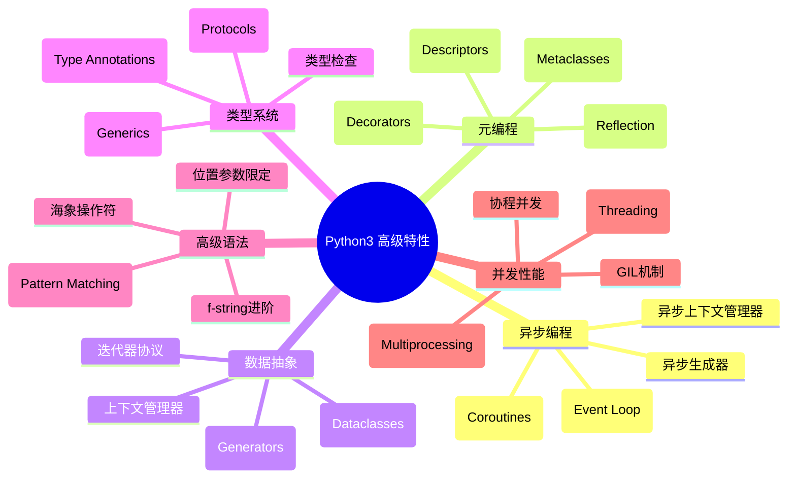
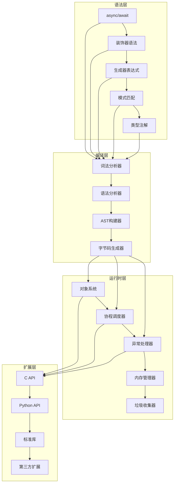
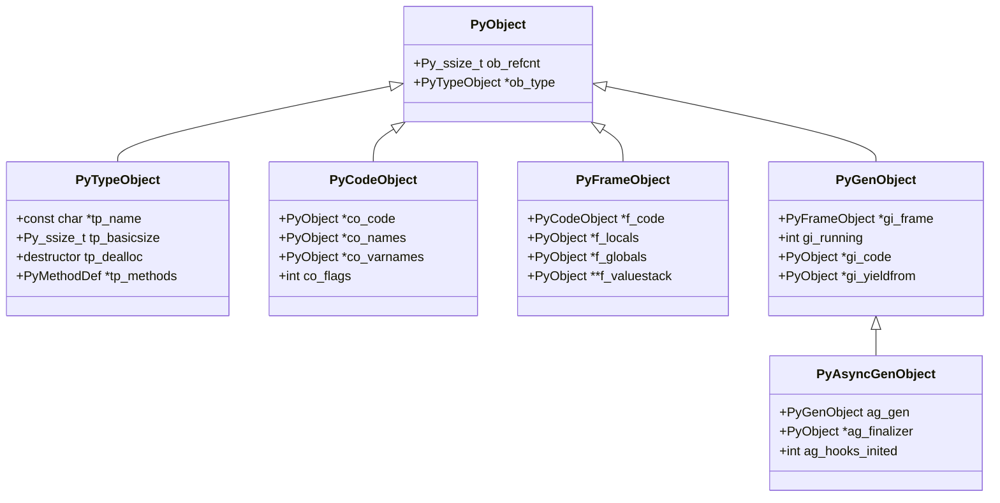

## 📋 概述

Python作为一门现代动态编程语言，提供了丰富的高级特性来满足复杂的编程需求。本文档系列将深入分析CPython解释器中这些高级特性的底层实现机制，从源码层面理解每个特性的工作原理、设计思路和性能考量。

## 🎯 高级特性全景图



## 📚 文档结构与内容覆盖

### 1. 📖 异步编程与协程 (python-08_async_coroutines_analysis.md)

**核心内容**:
- 协程对象的创建与生命周期管理
- 事件循环的实现机制
- async/await语法的底层实现
- 异步生成器与异步迭代器
- 异步上下文管理器协议

**源码模块**:
- `Objects/genobject.c` - 协程对象实现
- `Modules/_asynciomodule.c` - asyncio核心功能
- `Python/compile.c` - async/await编译
- `Objects/iterobject.c` - 异步迭代器

### 2. 🎨 装饰器深度剖析 (python-09_decorators_analysis.md)

**核心内容**:
- 装饰器语法糖的编译过程
- 函数装饰器与类装饰器
- 属性装饰器(@property, @classmethod, @staticmethod)
- 装饰器链的执行顺序
- 参数化装饰器的实现

**源码模块**:
- `Objects/funcobject.c` - 函数对象与装饰器
- `Objects/descrobject.c` - 描述符装饰器
- `Python/compile.c` - 装饰器编译逻辑

### 3. 🔄 生成器与迭代器协议 (python-10_generators_iterators_analysis.md)

**核心内容**:
- 生成器函数的字节码生成
- 生成器对象的状态管理
- yield/yield from的实现机制
- 迭代器协议的底层支持
- 生成器表达式优化

**源码模块**:
- `Objects/genobject.c` - 生成器核心实现
- `Python/compile.c` - yield语句编译
- `Python/ceval.c` - 生成器执行逻辑

### 4. 🔍 模式匹配系统 (python-11_pattern_matching_analysis.md)

**核心内容**:
- match/case语句的语法分析
- 模式匹配的编译策略
- 各种模式类型的实现
- 模式匹配的性能优化
- 守护条件的处理

**源码模块**:
- `Python/compile.c` - 模式匹配编译
- `Python/ceval.c` - 模式匹配执行
- `Grammar/python.gram` - 语法定义

### 5. 📝 类型系统与泛型 (python-12_typing_system_analysis.md)

**核心内容**:
- 类型注解的存储与访问
- 泛型类型的实现机制
- 协议(Protocol)的动态检查
- 类型别名与前向引用
- 运行时类型检查

**源码模块**:
- `Lib/typing.py` - 类型系统核心
- `Objects/typeobject.c` - 类型对象扩展
- `Python/compile.c` - 注解处理

### 6. 🏗️ 数据类与元编程 (python-13_dataclasses_metaclasses_analysis.md)

**核心内容**:
- 数据类的自动生成机制
- 元类的创建与继承链
- 类创建过程的钩子函数
- 描述符协议的高级应用
- 类装饰器vs元类

**源码模块**:
- `Lib/dataclasses.py` - 数据类实现
- `Objects/typeobject.c` - 元类机制
- `Objects/descrobject.c` - 描述符协议

### 7. ✨ Python数据模型(魔术方法) (python-14_data_model_magic_analysis.md)

**核心内容**:
- 特殊方法的查找与调用机制
- 运算符重载的底层实现
- 对象协议的完整分析
- 属性访问的拦截机制
- 比较操作与哈希的实现

**源码模块**:
- `Objects/abstract.c` - 抽象对象协议
- `Objects/typeobject.c` - 特殊方法处理
- `Python/ceval.c` - 运算符执行

### 8. 🔐 上下文管理与资源编排 (python-15_context_managers_analysis.md)

**核心内容**:
- with语句的编译与执行
- 上下文管理器协议
- 异常处理与资源清理
- 嵌套上下文管理器
- contextlib模块的高级特性

**源码模块**:
- `Python/compile.c` - with语句编译
- `Python/ceval.c` - 上下文管理执行
- `Lib/contextlib.py` - 上下文工具库

### 9. 🚀 并发模型对比分析 (python-16_concurrency_models_analysis.md)

**核心内容**:
- GIL机制的详细分析
- 多线程vs多进程vs协程
- 线程安全的实现策略
- 原子操作与锁机制
- 并发数据结构

**源码模块**:
- `Python/ceval_gil.c` - GIL实现
- `Modules/_threadmodule.c` - 线程模块
- `Python/pystate.c` - 线程状态管理

### 10. 🔍 反射与插件化系统 (python-17_reflection_plugins_analysis.md)

**核心内容**:
- 内省机制的底层支持
- 动态导入与模块加载
- 钩子系统的实现
- 代码对象的动态修改
- 插件架构的设计模式

**源码模块**:
- `Python/import.c` - 模块导入机制
- `Objects/moduleobject.c` - 模块对象
- `Python/sysmodule.c` - 系统钩子

### 11. ⚠️ 错误处理与健壮性 (python-18_error_handling_analysis.md)

**核心内容**:
- 异常对象的创建与传播
- 异常链与上下文信息
- 错误恢复机制
- 调试信息的生成
- 异常性能优化

**源码模块**:
- `Objects/exceptions.c` - 异常对象
- `Python/errors.c` - 错误处理
- `Python/traceback.c` - 追踪信息

### 12. 📝 f-string进阶特性 (python-19_fstring_advanced_analysis.md)

**核心内容**:
- f-string的词法分析
- 表达式嵌套的处理
- 格式化选项的解析
- 性能优化策略
- 与其他字符串格式化的对比

**源码模块**:
- `Parser/string_parser.c` - 字符串解析
- `Python/compile.c` - f-string编译
- `Objects/unicodeobject.c` - 字符串格式化

### 13. ⚡ 并行与性能优化 (python-20_parallel_performance_analysis.md)

**核心内容**:
- CPU密集型任务的并行策略
- I/O密集型任务的异步处理
- 内存优化与缓存策略
- 性能分析工具的实现
- JIT编译的探索

**源码模块**:
- `Python/ceval.c` - 执行优化
- `Objects/` - 对象池与缓存
- `Python/perf_profiler.c` - 性能分析

## 🎯 学习路径建议

### 📈 初级阶段 (理解概念)
1. 先阅读总览文档，建立整体认知
2. 学习装饰器和生成器的基础概念
3. 掌握异步编程的基本原理

### 📊 中级阶段 (深入机制)
1. 分析具体特性的源码实现
2. 理解编译与执行的分离
3. 掌握对象模型与协议设计

### 🎓 高级阶段 (精通应用)
1. 研究性能优化的底层原理
2. 理解并发模型的设计权衡
3. 掌握元编程的高级技巧

## 🏗️ 整体架构图



## 📊 特性复杂度矩阵

| 特性 | 语法复杂度 | 实现复杂度 | 性能影响 | 学习难度 |
|------|------------|------------|----------|----------|
| 装饰器 | ⭐⭐ | ⭐⭐⭐ | ⭐⭐ | ⭐⭐⭐ |
| 生成器 | ⭐⭐⭐ | ⭐⭐⭐⭐ | ⭐⭐⭐ | ⭐⭐⭐⭐ |
| 协程 | ⭐⭐⭐⭐ | ⭐⭐⭐⭐⭐ | ⭐⭐⭐⭐ | ⭐⭐⭐⭐⭐ |
| 模式匹配 | ⭐⭐⭐⭐ | ⭐⭐⭐⭐ | ⭐⭐⭐ | ⭐⭐⭐⭐ |
| 类型系统 | ⭐⭐⭐ | ⭐⭐⭐ | ⭐ | ⭐⭐⭐ |
| 元类 | ⭐⭐⭐ | ⭐⭐⭐⭐⭐ | ⭐⭐ | ⭐⭐⭐⭐⭐ |
| 数据模型 | ⭐⭐ | ⭐⭐⭐⭐ | ⭐⭐⭐ | ⭐⭐⭐⭐ |
| 上下文管理 | ⭐⭐ | ⭐⭐⭐ | ⭐⭐ | ⭐⭐⭐ |
| f-string | ⭐⭐ | ⭐⭐⭐ | ⭐⭐⭐ | ⭐⭐ |

## 🎨 可视化说明

### 架构图说明
上面的整体架构图展示了Python高级特性在解释器中的分层实现：
- **语法层**: 用户可见的语法特性
- **编译层**: 将源码转换为字节码的处理流程
- **运行时层**: 执行字节码的核心系统
- **扩展层**: 对外提供的接口和扩展机制

### 复杂度矩阵说明
- **语法复杂度**: 语法规则的复杂程度
- **实现复杂度**: 底层实现的技术难度
- **性能影响**: 对程序执行性能的影响程度
- **学习难度**: 掌握该特性的难度级别

## 🔍 核心数据结构概览



## 🎯 实战应用场景

### 1. 高性能Web服务
```python
# 异步Web框架的核心实现
async def handle_request(request):
    async with database.transaction():
        result = await process_data(request.data)
        return Response(result)

# 装饰器进行性能监控
@performance_monitor
@cache_result
async def process_data(data):
    return await heavy_computation(data)
```

### 2. 数据处理管道
```python
# 生成器实现内存高效的数据流
def process_large_dataset():
    for chunk in read_data_chunks():
        yield from transform_chunk(chunk)

# 模式匹配简化数据解析
match data_record:
    case {"type": "user", "id": user_id, **attrs}:
        return User(user_id, **attrs)
    case {"type": "order", "items": [*items]}:
        return Order(items)
```

### 3. 插件化架构
```python
# 元类实现插件注册
class PluginMeta(type):
    plugins = {}

    def __new__(mcs, name, bases, attrs):
        cls = super().__new__(mcs, name, bases, attrs)
        if hasattr(cls, 'plugin_name'):
            mcs.plugins[cls.plugin_name] = cls
        return cls

# 反射实现动态功能扩展
def load_plugin(plugin_name):
    plugin_class = PluginMeta.plugins.get(plugin_name)
    if plugin_class:
        return plugin_class()
```

## 📈 性能基准测试

### 特性性能对比
```python
# 协程 vs 线程性能测试
import asyncio
import threading
import time

# 异步方式 - 高并发I/O
async def async_task():
    await asyncio.sleep(0.001)
    return "result"

async def run_async_benchmark():
    tasks = [async_task() for _ in range(10000)]
    start = time.time()
    results = await asyncio.gather(*tasks)
    return time.time() - start

# 线程方式 - 有限并发
def thread_task():
    time.sleep(0.001)
    return "result"

def run_thread_benchmark():
    import concurrent.futures
    start = time.time()
    with concurrent.futures.ThreadPoolExecutor(max_workers=100) as executor:
        futures = [executor.submit(thread_task) for _ in range(10000)]
        results = [f.result() for f in futures]
    return time.time() - start
```

## 🔧 开发工具与调试

### 源码调试技巧
```c
// 在CPython源码中添加调试输出
#ifdef DEBUG_COROUTINES
    fprintf(stderr, "Creating coroutine: %s\n",
            PyUnicode_AsUTF8(co->co_name));
#endif

// 使用gdb调试CPython
// (gdb) py-bt  # Python调用栈
// (gdb) py-locals  # 查看Python局部变量
// (gdb) py-up/py-down  # 在Python栈帧间导航
```

### 性能分析工具
```python
# 使用cProfile分析性能瓶颈
import cProfile
import pstats

def profile_advanced_features():
    pr = cProfile.Profile()
    pr.enable()

    # 测试代码
    run_feature_tests()

    pr.disable()
    stats = pstats.Stats(pr)
    stats.sort_stats('cumulative')
    stats.print_stats(20)

# 使用tracemalloc追踪内存使用
import tracemalloc

tracemalloc.start()
# 运行测试代码
current, peak = tracemalloc.get_traced_memory()
print(f"Current memory: {current / 1024 / 1024:.1f} MB")
print(f"Peak memory: {peak / 1024 / 1024:.1f} MB")
tracemalloc.stop()
```

## 📚 学习资源推荐

### 官方文档
- [Python Language Reference](https://docs.python.org/3/reference/)
- [Python/C API Reference](https://docs.python.org/3/c-api/)
- [CPython Developer's Guide](https://devguide.python.org/)

### 深度学习资源
- [CPython Internals](https://github.com/python/cpython/tree/main/InternalDocs)
- [Real Python CPython Source Code Guide](https://realpython.com/cpython-source-code-guide/)
- [Anthony Shaw's CPython Internals](https://cpython-internals.readthedocs.io/)

### 社区讨论
- [Python-Dev Mailing List](https://mail.python.org/mailman/listinfo/python-dev)
- [Python Discourse](https://discuss.python.org/)
- [CPython GitHub Discussions](https://github.com/python/cpython/discussions)

## 🎯 总结与展望

本文档系列将通过深入的源码分析，帮助读者：

1. **理解设计哲学**: 掌握Python高级特性的设计原理和演进历程
2. **掌握实现技术**: 学习现代动态语言的实现技术和优化策略
3. **提升编程能力**: 深入理解使您能更高效地使用这些特性
4. **参与开源贡献**: 具备参与CPython开发的技术基础

### 技术趋势展望
- **性能优化**: 更多JIT编译和优化技术
- **类型系统**: 渐进式类型检查的发展
- **并发模型**: 更好的异步编程支持
- **语言特性**: 持续改进的语法糖和表达力

让我们开始这段深入Python内核的精彩旅程吧！🚀
