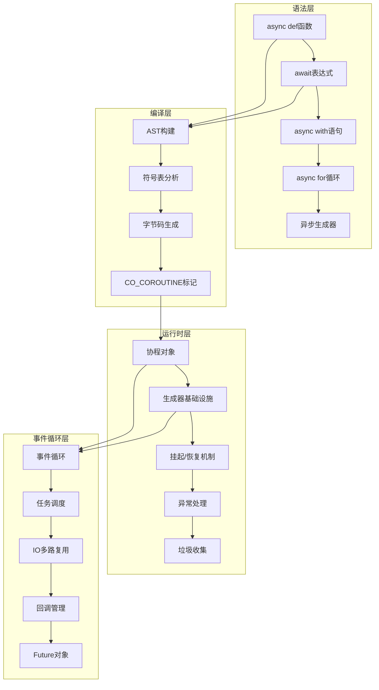
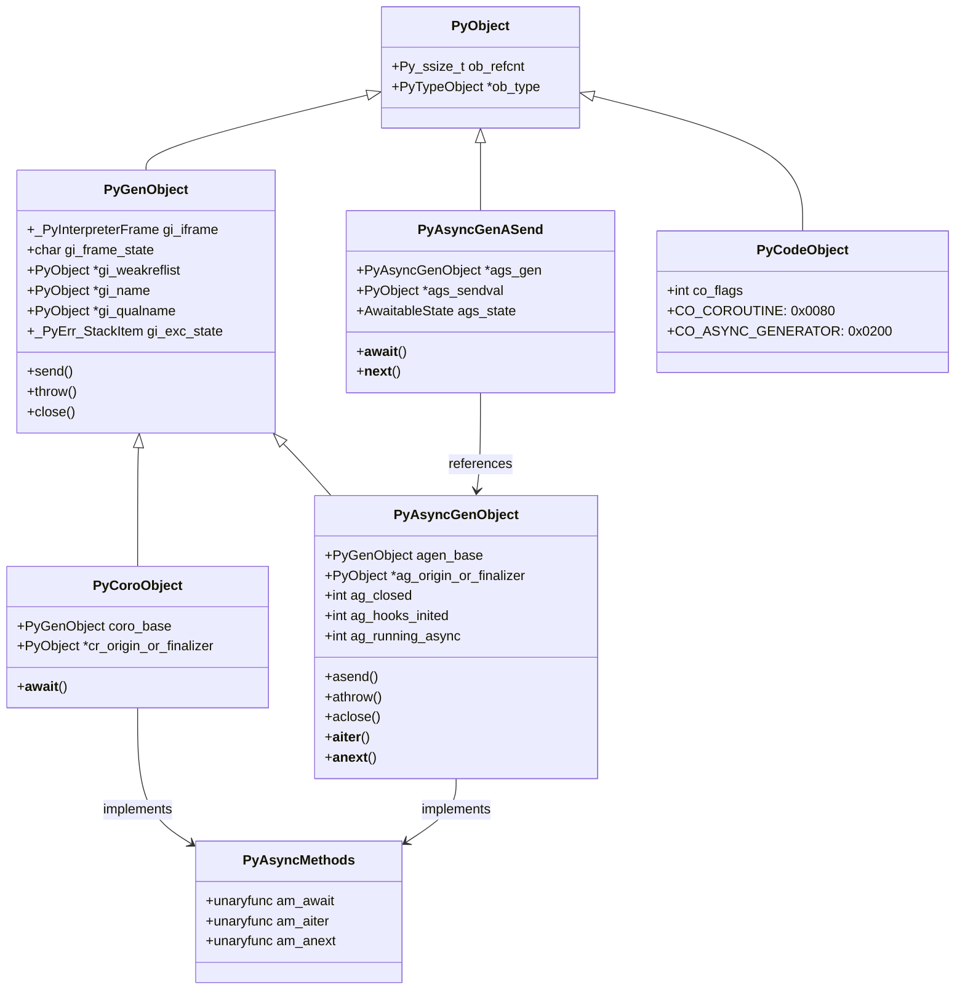

## 📋 概述

Python的异步编程模型基于协程(Coroutines)、事件循环(Event Loop)和异步IO操作，为高并发应用提供了强大的解决方案。本文档将深入分析CPython中协程系统的底层实现，包括async/await语法、协程对象、异步生成器、事件循环机制以及与之相关的编译和执行过程。

## 🎯 异步编程架构概览



## 1. 协程对象的核心实现

### 1.1 协程对象数据结构

协程对象基于生成器对象实现，共享大部分基础设施：

```c
/* Include/internal/pycore_genobject.h - 协程对象定义 */

#define _PyGenObject_HEAD(prefix)                                           \
    PyObject_HEAD                                                           \
    /* _PyFrame_GetFirstComplete(gen->gi_iframe.previous) == NULL 意味着     \
     * 要么没有父帧，要么有一个正在运行的父帧 */                                   \
    _PyInterpreterFrame gi_iframe;                                          \
    /* 生成器的代码对象和运行状态 */                                             \
    char prefix##_frame_state;      /* 帧状态: FRAME_CREATED, FRAME_EXECUTING, 等 */ \
    /* 生成器的弱引用列表 */                                                    \
    PyObject *prefix##_weakreflist;                                         \
    /* 生成器的名称和限定名称 */                                                 \
    PyObject *prefix##_name;                                               \
    PyObject *prefix##_qualname;                                           \
    /* 异常状态管理 */                                                         \
    _PyErr_StackItem prefix##_exc_state

typedef struct {
    _PyGenObject_HEAD(gi)
} PyGenObject;

typedef struct _PyCoroObject {
    _PyGenObject_HEAD(cr)
    PyObject *cr_origin_or_finalizer;  /* 协程的创建来源或终结器 */
} PyCoroObject;

typedef struct _PyAsyncGenObject {
    _PyGenObject_HEAD(ag)
    PyObject *ag_origin_or_finalizer;  /* 异步生成器的终结器 */
    int ag_closed;                     /* 异步生成器是否已关闭 */
    int ag_hooks_inited;              /* 钩子是否已初始化 */
    int ag_running_async;             /* 是否正在异步执行 */
} PyAsyncGenObject;
```

**数据结构说明**:
- `gi_iframe`: 内嵌的解释器栈帧，保存执行上下文
- `gi_frame_state`: 帧状态标记，控制协程的生命周期
- `gi_name/gi_qualname`: 协程的名称信息，用于调试和表示
- `gi_exc_state`: 异常状态管理，支持异常传播
- `cr_origin_or_finalizer`: 协程特有的追踪和清理机制

### 1.2 协程创建机制

协程对象的创建过程涉及代码标志检查和对象初始化：

```c
/* Objects/genobject.c - 协程创建函数 */

PyObject *
_Py_MakeCoro(PyFunctionObject *func)
{
    /* 检查函数的协程标志 */
    int coro_flags = ((PyCodeObject *)func->func_code)->co_flags &
        (CO_GENERATOR | CO_COROUTINE | CO_ASYNC_GENERATOR);
    assert(coro_flags);

    /* 根据标志创建不同类型的对象 */
    if (coro_flags == CO_GENERATOR) {
        return make_gen(&PyGen_Type, func);  /* 普通生成器 */
    }
    if (coro_flags == CO_ASYNC_GENERATOR) {
        /* 异步生成器对象 */
        PyAsyncGenObject *ag;
        ag = (PyAsyncGenObject *)make_gen(&PyAsyncGen_Type, func);
        if (ag == NULL) {
            return NULL;
        }
        ag->ag_origin_or_finalizer = NULL;
        ag->ag_closed = 0;
        ag->ag_hooks_inited = 0;
        ag->ag_running_async = 0;
        return (PyObject*)ag;
    }

    /* 创建协程对象 */
    assert (coro_flags == CO_COROUTINE);
    PyObject *coro = make_gen(&PyCoro_Type, func);
    if (!coro) {
        return NULL;
    }

    /* 设置协程来源追踪 */
    PyThreadState *tstate = _PyThreadState_GET();
    int origin_depth = tstate->coroutine_origin_tracking_depth;

    if (origin_depth == 0) {
        ((PyCoroObject *)coro)->cr_origin_or_finalizer = NULL;
    } else {
        _PyInterpreterFrame *frame = tstate->current_frame;
        assert(frame);
        assert(_PyFrame_IsIncomplete(frame));
        frame = _PyFrame_GetFirstComplete(frame->previous);
        PyObject *cr_origin = compute_cr_origin(origin_depth, frame);
        ((PyCoroObject *)coro)->cr_origin_or_finalizer = cr_origin;
        if (!cr_origin) {
            Py_DECREF(coro);
            return NULL;
        }
    }
    return coro;
}

/* 基础生成器对象创建 */
static PyObject *
make_gen(PyTypeObject *type, PyFunctionObject *func)
{
    PyCodeObject *code = (PyCodeObject *)func->func_code;

    /* 分配对象内存 */
    int size = code->co_nlocalsplus + code->co_stacksize + FRAME_SPECIALS_SIZE;
    PyGenObject *gen = (PyGenObject *)type->tp_alloc(type, 0);
    if (gen == NULL) {
        return NULL;
    }

    /* 初始化内嵌栈帧 */
    _PyFrame_InitializeSpecials(&gen->gi_iframe, (PyFunctionObject*)Py_NewRef(func),
                                NULL, code->co_nlocalsplus);

    /* 设置生成器状态 */
    gen->gi_frame_state = FRAME_CREATED;
    gen->gi_weakreflist = NULL;
    gen->gi_name = Py_NewRef(func->func_name);
    gen->gi_qualname = Py_NewRef(func->func_qualname);
    _PyErr_InitStackItem(&gen->gi_exc_state);

    /* 垃圾收集跟踪 */
    _PyObject_GC_TRACK(gen);
    return (PyObject *)gen;
}
```

**关键参数说明**:
- `func`: 函数对象，包含了要执行的代码
- `coro_flags`: 代码对象的标志，决定创建何种类型的对象
- `origin_depth`: 协程来源追踪深度，用于调试

### 1.3 协程来源追踪机制

```c
/* Objects/genobject.c - 协程来源计算 */

static PyObject *
compute_cr_origin(int origin_depth, _PyInterpreterFrame *current_frame)
{
    _PyInterpreterFrame *frame = current_frame;

    /* 首先计算有多少帧 */
    int frame_count = 0;
    for (; frame && frame_count < origin_depth; ++frame_count) {
        frame = _PyFrame_GetFirstComplete(frame->previous);
    }

    /* 收集帧信息 */
    PyObject *cr_origin = PyTuple_New(frame_count);
    if (cr_origin == NULL) {
        return NULL;
    }

    frame = current_frame;
    for (int i = 0; i < frame_count; ++i) {
        PyCodeObject *code = _PyFrame_GetCode(frame);
        int line = PyUnstable_InterpreterFrame_GetLine(frame);

        /* 构建帧信息元组: (filename, line, name) */
        PyObject *frameinfo = Py_BuildValue("OiO", code->co_filename, line,
                                            code->co_name);
        if (!frameinfo) {
            Py_DECREF(cr_origin);
            return NULL;
        }
        PyTuple_SET_ITEM(cr_origin, i, frameinfo);
        frame = _PyFrame_GetFirstComplete(frame->previous);
    }

    return cr_origin;
}
```

**功能说明**: 协程来源追踪用于调试，记录协程的创建调用栈，帮助开发者理解协程的创建位置。

## 2. async/await语法的编译实现

### 2.1 符号表分析

在编译阶段，Python需要识别异步函数并设置相应的标志：

```c
/* Python/symtable.c - 异步语法分析 */

static int
symtable_visit_expr(struct symtable *st, expr_ty e)
{
    switch (e->kind) {
    case Await_kind:
        /* 检查await表达式的上下文合法性 */
        if (!symtable_raise_if_annotation_block(st, "await expression", e)) {
            return 0;
        }

        /* 检查await是否在允许的上下文中 */
        if (!allows_top_level_await(st)) {
            if (!_PyST_IsFunctionLike(st->st_cur)) {
                PyErr_SetString(PyExc_SyntaxError,
                                "'await' outside function");
                SET_ERROR_LOCATION(st->st_filename, LOCATION(e));
                return 0;
            }
            if (!IS_ASYNC_DEF(st) && st->st_cur->ste_comprehension == NoComprehension) {
                PyErr_SetString(PyExc_SyntaxError,
                                "'await' outside async function");
                SET_ERROR_LOCATION(st->st_filename, LOCATION(e));
                return 0;
            }
        }

        /* 访问await的值表达式 */
        VISIT(st, expr, e->v.Await.value);

        /* 标记当前作用域为协程 */
        st->st_cur->ste_coroutine = 1;
        break;
    // ... 其他表达式类型
    }
    return 1;
}

/* 检查是否允许顶层await */
static int
allows_top_level_await(struct symtable *st)
{
    return (st->st_cur->ste_type == ModuleBlock) && st->st_future->ff_features;
}
```

### 2.2 字节码生成

异步语法被编译为特殊的字节码指令：

```c
/* Python/codegen.c - 异步函数编译 */

static int
codegen_function_body(compiler *c, stmt_ty s, int is_async, Py_ssize_t funcflags,
                      int firstlineno)
{
    arguments_ty args;
    identifier name;
    asdl_stmt_seq *body;
    int scope_type;

    if (is_async) {
        /* 异步函数处理 */
        assert(s->kind == AsyncFunctionDef_kind);
        args = s->v.AsyncFunctionDef.args;
        name = s->v.AsyncFunctionDef.name;
        body = s->v.AsyncFunctionDef.body;
        scope_type = COMPILE_SCOPE_ASYNC_FUNCTION;
    } else {
        /* 普通函数处理 */
        assert(s->kind == FunctionDef_kind);
        args = s->v.FunctionDef.args;
        name = s->v.FunctionDef.name;
        body = s->v.FunctionDef.body;
        scope_type = COMPILE_SCOPE_FUNCTION;
    }

    /* 编译器作用域设置 */
    _PyCompile_CodeUnitMetadata umd = {
        .u_argcount = asdl_seq_LEN(args->args),
        .u_posonlyargcount = asdl_seq_LEN(args->posonlyargs),
        .u_kwonlyargcount = asdl_seq_LEN(args->kwonlyargs),
    };
    RETURN_IF_ERROR(
        codegen_enter_scope(c, name, scope_type, (void *)s, firstlineno, NULL, &umd));

    PySTEntryObject *ste = SYMTABLE_ENTRY(c);

    /* 为协程和生成器添加StopIteration处理器 */
    bool add_stopiteration_handler = ste->ste_coroutine || ste->ste_generator;
    if (add_stopiteration_handler) {
        /* 添加异常处理代码块 */
        // ... 异常处理逻辑
    }

    /* 编译函数体 */
    VISIT_SEQ(c, stmt, body);

    return SUCCESS;
}

/* await表达式编译 */
case Await_kind:
    /* 编译await的值表达式 */
    VISIT(c, expr, e->v.Await.value);

    /* 生成GET_AWAITABLE指令 */
    ADDOP_I(c, loc, GET_AWAITABLE, 0);

    /* 加载None作为初始值 */
    ADDOP_LOAD_CONST(c, loc, Py_None);

    /* 生成YIELD_FROM指令，标记为协程 */
    ADD_YIELD_FROM(c, loc, 1);
    break;
```

**关键字节码指令**:
- `GET_AWAITABLE`: 获取可等待对象
- `YIELD_FROM`: 委托给子协程执行
- `RESUME`: 协程恢复执行

### 2.3 代码对象标志设置

```c
/* Python/compile.c - 代码标志设置 */

static Py_ssize_t
compiler_scope_setflags(compiler *c)
{
    PySTEntryObject *ste = SYMTABLE_ENTRY(c);
    Py_ssize_t flags = 0;

    /* 根据符号表设置相应标志 */
    if (ste->ste_type == FunctionBlock) {
        if (ste->ste_coroutine) {
            flags |= CO_COROUTINE;  /* 协程标志 */
        }
        if (ste->ste_generator) {
            if (ste->ste_coroutine) {
                flags |= CO_ASYNC_GENERATOR;  /* 异步生成器标志 */
            } else {
                flags |= CO_GENERATOR;  /* 普通生成器标志 */
            }
        }
    }

    /* 其他标志设置... */

    return flags;
}
```

## 3. 协程执行机制

### 3.1 可等待对象协议

```c
/* Objects/genobject.c - 可等待对象处理 */

PyObject *
_PyCoro_GetAwaitableIter(PyObject *o)
{
    unaryfunc getter = NULL;
    PyTypeObject *ot;

    /* 如果已经是协程，直接返回 */
    if (PyCoro_CheckExact(o) || gen_is_coroutine(o)) {
        return Py_NewRef(o);
    }

    /* 检查类型的__await__方法 */
    ot = Py_TYPE(o);
    if (ot->tp_as_async != NULL) {
        getter = ot->tp_as_async->am_await;
    }
    if (getter != NULL) {
        PyObject *res = (*getter)(o);
        if (res != NULL) {
            /* __await__必须返回迭代器，不能是协程 */
            if (PyCoro_CheckExact(res) || gen_is_coroutine(res)) {
                PyErr_Format(PyExc_TypeError,
                             "%T.__await__() must return an iterator, "
                             "not coroutine", o);
                Py_CLEAR(res);
            } else if (!PyIter_Check(res)) {
                PyErr_Format(PyExc_TypeError,
                             "%T.__await__() must return an iterator, "
                             "not %T", o, res);
                Py_CLEAR(res);
            }
        }
        return res;
    }

    /* 无法等待的对象 */
    PyErr_Format(PyExc_TypeError,
                 "'%.100s' object can't be awaited",
                 ot->tp_name);
    return NULL;
}

/* 检查对象是否为协程 */
static int
gen_is_coroutine(PyObject *o)
{
    if (PyGen_CheckExact(o)) {
        PyCodeObject *code = _PyGen_GetCode((PyGenObject*)o);
        if (code->co_flags & CO_ITERABLE_COROUTINE) {
            return 1;  /* 标记为可迭代协程的生成器 */
        }
    }
    return 0;
}
```

### 3.2 协程的发送和异常机制

协程通过`send()`和`throw()`方法与外部通信：

```c
/* Objects/genobject.c - 协程通信方法 */

static PyMethodDef coro_methods[] = {
    {"send", gen_send, METH_O, coro_send_doc},
    {"throw",_PyCFunction_CAST(gen_throw), METH_FASTCALL, coro_throw_doc},
    {"close", gen_close, METH_NOARGS, coro_close_doc},
    {"__sizeof__", gen_sizeof, METH_NOARGS, sizeof__doc__},
    {"__class_getitem__", Py_GenericAlias, METH_O|METH_CLASS, PyDoc_STR("See PEP 585")},
    {NULL, NULL}        /* Sentinel */
};

/* 协程类型定义，支持异步协议 */
static PyAsyncMethods coro_as_async = {
    coro_await,                                 /* am_await */
    0,                                          /* am_aiter */
    0,                                          /* am_anext */
};

PyTypeObject PyCoro_Type = {
    PyVarObject_HEAD_INIT(&PyType_Type, 0)
    "coroutine",                                /* tp_name */
    offsetof(PyCoroObject, cr_iframe.localsplus),/* tp_basicsize */
    sizeof(PyObject *),                         /* tp_itemsize */
    /* methods */
    gen_dealloc,                                /* tp_dealloc */
    0,                                          /* tp_vectorcall_offset */
    0,                                          /* tp_getattr */
    0,                                          /* tp_setattr */
    &coro_as_async,                             /* tp_as_async */
    coro_repr,                                  /* tp_repr */
    // ... 其他方法定义
};
```

## 4. 异步上下文管理器

### 4.1 async with语句编译

```c
/* Python/codegen.c - async with语句编译 */

static int
codegen_async_with_inner(compiler *c, stmt_ty s, int pos)
{
    location loc = LOC(s);
    withitem_ty item = asdl_seq_GET(s->v.AsyncWith.items, pos);

    assert(s->kind == AsyncWith_kind);

    NEW_JUMP_TARGET_LABEL(c, block);
    NEW_JUMP_TARGET_LABEL(c, final);
    NEW_JUMP_TARGET_LABEL(c, exit);
    NEW_JUMP_TARGET_LABEL(c, cleanup);

    /* 1. 求值上下文表达式 */
    VISIT(c, expr, item->context_expr);
    loc = LOC(item->context_expr);

    /* 2. 获取__aexit__方法 */
    ADDOP_I(c, loc, COPY, 1);
    ADDOP_I(c, loc, LOAD_SPECIAL, SPECIAL___AEXIT__);
    ADDOP_I(c, loc, SWAP, 2);
    ADDOP_I(c, loc, SWAP, 3);

    /* 3. 调用__aenter__方法 */
    ADDOP_I(c, loc, LOAD_SPECIAL, SPECIAL___AENTER__);
    ADDOP_I(c, loc, CALL, 0);

    /* 4. 等待__aenter__结果 */
    ADDOP_I(c, loc, GET_AWAITABLE, 1);
    ADDOP_LOAD_CONST(c, loc, Py_None);
    ADD_YIELD_FROM(c, loc, 1);

    /* 5. 设置异常处理 */
    ADDOP_JUMP(c, loc, SETUP_WITH, final);

    /* 执行代码块 */
    USE_LABEL(c, block);
    RETURN_IF_ERROR(_PyCompile_PushFBlock(c, loc, COMPILE_FBLOCK_ASYNC_WITH, block, final, s));

    /* 处理可选变量绑定 */
    if (item->optional_vars) {
        VISIT(c, expr, item->optional_vars);
    }
    else {
        /* 丢弃__aenter__结果 */
        ADDOP(c, loc, POP_TOP);
    }

    /* 编译内层或代码体 */
    pos++;
    if (pos == asdl_seq_LEN(s->v.AsyncWith.items)) {
        /* 执行with代码块 */
        VISIT_SEQ(c, stmt, s->v.AsyncWith.body);
    }
    else {
        RETURN_IF_ERROR(codegen_async_with_inner(c, s, pos));
    }

    _PyCompile_PopFBlock(c, COMPILE_FBLOCK_ASYNC_WITH, block);

    /* 正常退出处理 */
    ADDOP(c, loc, POP_BLOCK);
    RETURN_IF_ERROR(codegen_call_exit_with_nones(c, loc));

    /* 等待__aexit__结果 */
    ADDOP_I(c, loc, GET_AWAITABLE, 2);
    ADDOP_LOAD_CONST(c, loc, Py_None);
    ADD_YIELD_FROM(c, loc, 1);

    ADDOP(c, loc, POP_TOP);
    ADDOP_JUMP(c, loc, JUMP, exit);

    /* 异常退出处理 */
    USE_LABEL(c, final);
    // ... 异常处理逻辑

    USE_LABEL(c, exit);
    return SUCCESS;
}
```

**async with语义流程**:
1. 求值上下文表达式
2. 获取`__aenter__`和`__aexit__`方法
3. await `__aenter__()`的结果
4. 执行代码块
5. 无论是否有异常，都await `__aexit__()`

### 4.2 异步上下文管理器协议

```python
# 异步上下文管理器示例实现
class AsyncContextManager:
    async def __aenter__(self):
        """进入异步上下文时调用"""
        print("进入异步上下文")
        # 可以执行异步初始化操作
        await self.async_setup()
        return self

    async def __aexit__(self, exc_type, exc_val, exc_tb):
        """退出异步上下文时调用"""
        print("退出异步上下文")
        # 可以执行异步清理操作
        await self.async_cleanup()
        return False  # 不抑制异常

    async def async_setup(self):
        """异步初始化"""
        pass

    async def async_cleanup(self):
        """异步清理"""
        pass

# 使用示例
async def example():
    async with AsyncContextManager() as cm:
        print("在异步上下文中执行")
        # 可能抛出异常的代码
```

## 5. 异步生成器

### 5.1 异步生成器对象

```c
/* Objects/genobject.c - 异步生成器相关定义 */

typedef enum {
    AWAITABLE_STATE_INIT,   /* 新建的可等待对象，尚未开始迭代 */
    AWAITABLE_STATE_ITER,   /* 正在迭代 */
    AWAITABLE_STATE_CLOSED, /* 已关闭 */
} AwaitableState;

typedef struct PyAsyncGenASend {
    PyObject_HEAD
    PyAsyncGenObject *ags_gen;      /* 关联的异步生成器 */
    PyObject *ags_sendval;          /* 要发送的值 */
    AwaitableState ags_state;       /* 当前状态 */
} PyAsyncGenASendObject;

typedef struct PyAsyncGenAThrow {
    PyObject_HEAD
    PyAsyncGenObject *agt_gen;      /* 关联的异步生成器 */
    PyObject *agt_args;             /* 异常参数 */
    AwaitableState agt_state;       /* 当前状态 */
} PyAsyncGenAThrowObject;
```

### 5.2 异步生成器方法实现

```c
/* Objects/genobject.c - 异步生成器方法 */

static PyObject *
async_gen_asend(PyAsyncGenObject *ag, PyObject *arg)
{
    return async_gen_asend_new(ag, arg);
}

static PyObject *
async_gen_athrow(PyAsyncGenObject *ag, PyObject *args)
{
    return async_gen_athrow_new(ag, args);
}

static PyObject *
async_gen_aclose(PyAsyncGenObject *ag, PyObject *arg)
{
    if (ag->ag_closed) {
        /* 已关闭的异步生成器 */
        return _PyAsyncGenValueWrapperNew(Py_None);
    }

    ag->ag_closed = 1;

    /* 创建GeneratorExit异常 */
    PyObject *exc = PyObject_CallNoArgs(PyExc_GeneratorExit);
    if (exc == NULL) {
        return NULL;
    }

    /* 抛出异常到异步生成器 */
    return async_gen_athrow_new(ag, exc);
}

/* 异步生成器类型方法表 */
static PyMethodDef async_gen_methods[] = {
    {"asend", (PyCFunction)async_gen_asend, METH_O, async_asend_doc},
    {"athrow", (PyCFunction)async_gen_athrow, METH_O, async_athrow_doc},
    {"aclose", (PyCFunction)async_gen_aclose, METH_NOARGS, async_aclose_doc},
    {"__sizeof__", gen_sizeof, METH_NOARGS, sizeof__doc__},
    {"__class_getitem__", Py_GenericAlias, METH_O|METH_CLASS, PyDoc_STR("See PEP 585")},
    {NULL, NULL}        /* Sentinel */
};

/* 异步迭代器协议支持 */
static PyAsyncMethods async_gen_as_async = {
    PyObject_SelfIter,                          /* am_await */
    PyObject_SelfIter,                          /* am_aiter */
    (unaryfunc)async_gen_anext,                 /* am_anext */
};
```

### 5.3 异步生成器使用示例

```python
# 异步生成器框架使用示例
import asyncio

async def async_range(start, stop, step=1):
    """异步范围生成器"""
    current = start
    while current < stop:
        # 模拟异步操作
        await asyncio.sleep(0.1)
        yield current
        current += step

async def consume_async_generator():
    """消费异步生成器"""
    # 方式1: async for循环
    async for value in async_range(0, 5):
        print(f"生成的值: {value}")

    # 方式2: 手动迭代
    agen = async_range(10, 15)
    try:
        while True:
            value = await agen.asend(None)
            print(f"手动获取: {value}")
    except StopAsyncIteration:
        print("异步生成器迭代完成")
    finally:
        await agen.aclose()

# 运行示例
asyncio.run(consume_async_generator())
```

## 6. 事件循环与协程调度

### 6.1 事件循环的C语言实现

```c
/* Modules/_asynciomodule.c - 事件循环核心功能 */

static PyObject *
get_event_loop(asyncio_state *state)
{
    PyObject *loop;
    PyObject *policy;

    /* 获取当前线程的运行中事件循环 */
    _PyThreadStateImpl *ts = (_PyThreadStateImpl *)_PyThreadState_GET();
    loop = Py_XNewRef(ts->asyncio_running_loop);

    if (loop != NULL) {
        return loop;  /* 返回正在运行的循环 */
    }

    /* 如果没有运行中的循环，获取默认事件循环 */
    policy = PyObject_CallNoArgs(state->asyncio_get_event_loop_policy);
    if (policy == NULL) {
        return NULL;
    }

    loop = PyObject_CallMethodNoArgs(policy, &_Py_ID(get_event_loop));
    Py_DECREF(policy);
    return loop;
}

/* 设置运行中的事件循环 */
static PyObject *
_asyncio__set_running_loop(PyObject *module, PyObject *loop)
{
    _PyThreadStateImpl *ts = (_PyThreadStateImpl *)_PyThreadState_GET();
    if (loop == Py_None) {
        loop = NULL;  /* 清除运行中的循环 */
    }
    Py_XSETREF(ts->asyncio_running_loop, Py_XNewRef(loop));
    Py_RETURN_NONE;
}

/* 获取运行中的事件循环 */
static PyObject *
_asyncio_get_running_loop_impl(PyObject *module)
{
    PyObject *loop;
    _PyThreadStateImpl *ts = (_PyThreadStateImpl *)_PyThreadState_GET();
    loop = Py_XNewRef(ts->asyncio_running_loop);
    if (loop == NULL) {
        /* 没有运行中的事件循环 */
        PyErr_SetString(
            PyExc_RuntimeError, "no running event loop");
        return NULL;
    }
    return loop;
}
```

### 6.2 任务调度机制

```c
/* Modules/_asynciomodule.c - 任务调度 */

static int
call_soon(asyncio_state *state, PyObject *loop, PyObject *func, PyObject *arg,
          PyObject *ctx)
{
    PyObject *handle;

    if (ctx == NULL) {
        /* 无上下文调用 */
        PyObject *stack[] = {loop, func, arg};
        size_t nargsf = 3 | PY_VECTORCALL_ARGUMENTS_OFFSET;
        handle = PyObject_VectorcallMethod(&_Py_ID(call_soon), stack, nargsf, NULL);
    }
    else {
        /* 带上下文调用 */
        PyObject *stack[4];
        size_t nargs = 2;
        stack[0] = loop;
        stack[1] = func;
        if (arg != NULL) {
            stack[2] = arg;
            nargs++;
        }
        stack[nargs] = (PyObject *)ctx;
        size_t nargsf = nargs | PY_VECTORCALL_ARGUMENTS_OFFSET;
        handle = PyObject_VectorcallMethod(&_Py_ID(call_soon), stack, nargsf,
                                           state->context_kwname);
    }

    if (handle == NULL) {
        return -1;
    }
    Py_DECREF(handle);
    return 0;
}

/* 任务注册 */
static PyObject *
_asyncio__register_task_impl(PyObject *module, PyObject *task)
{
    asyncio_state *state = get_asyncio_state(module);
    if (Task_Check(state, task)) {
        /* 高效链表实现，用于asyncio.Task实例 */
        register_task((TaskObj *)task);
        Py_RETURN_NONE;
    }

    /* 通用weakset实现，用于非asyncio.Task子类 */
    PyObject *res = PyObject_CallMethodOneArg(state->non_asyncio_tasks,
                                              &_Py_ID(add), task);
    if (res == NULL) {
        return NULL;
    }
    Py_DECREF(res);
    Py_RETURN_NONE;
}
```

## 7. 协程时序图

### 7.1 协程创建与执行时序

```mermaid
sequenceDiagram
    participant User as 用户代码
    participant Compiler as 编译器
    participant Runtime as 运行时
    participant Coro as 协程对象
    participant Loop as 事件循环

    User->>Compiler: async def func()
    Compiler->>Compiler: 设置CO_COROUTINE标志
    Compiler-->>Runtime: 生成字节码

    User->>Runtime: func()调用
    Runtime->>Runtime: _Py_MakeCoro()
    Runtime->>Coro: 创建协程对象
    Coro-->>Runtime: 返回协程实例
    Runtime-->>User: 返回协程对象

    User->>Loop: loop.run_until_complete(coro)
    Loop->>Coro: send(None) - 启动协程

    alt await表达式
        Coro->>Coro: 处理await
        Coro->>Runtime: GET_AWAITABLE
        Runtime->>Runtime: 获取可等待对象
        Coro-->>Loop: 暂停(YIELD_FROM)
        Loop->>Loop: 调度其他任务
        Loop->>Coro: send(result) - 恢复执行
    end

    Coro->>Coro: 执行完成
    Coro-->>Loop: StopIteration(返回值)
    Loop-->>User: 返回最终结果
```

### 7.2 异步上下文管理器时序

```mermaid
sequenceDiagram
    participant Code as 用户代码
    participant CM as 上下文管理器
    participant Loop as 事件循环

    Code->>CM: async with context_manager:
    Code->>CM: __aenter__()
    CM->>Loop: await async_setup()
    Loop-->>CM: 初始化完成
    CM-->>Code: 返回上下文对象

    Code->>Code: 执行代码块

    alt 正常退出
        Code->>CM: __aexit__(None, None, None)
        CM->>Loop: await async_cleanup()
        Loop-->>CM: 清理完成
        CM-->>Code: 返回False
    else 异常退出
        Code->>CM: __aexit__(exc_type, exc_val, exc_tb)
        CM->>Loop: await async_cleanup()
        Loop-->>CM: 清理完成
        CM-->>Code: 返回False/True(抑制异常)
    end
```

## 8. 关键数据结构UML图



## 9. 性能优化与最佳实践

### 9.1 协程性能特征

```python
# 协程性能测试示例
import asyncio
import time

async def cpu_bound_task():
    """CPU密集型任务 - 不适合协程"""
    result = 0
    for i in range(1000000):
        result += i * i
    return result

async def io_bound_task():
    """IO密集型任务 - 适合协程"""
    await asyncio.sleep(0.1)  # 模拟IO等待
    return "IO完成"

async def benchmark_concurrency():
    """并发性能基准测试"""

    # 测试IO密集型任务的并发执行
    start_time = time.time()
    tasks = [io_bound_task() for _ in range(100)]
    results = await asyncio.gather(*tasks)
    io_time = time.time() - start_time
    print(f"100个IO任务并发执行时间: {io_time:.3f}秒")

    # 测试CPU密集型任务(协程效果不佳)
    start_time = time.time()
    tasks = [cpu_bound_task() for _ in range(10)]
    results = await asyncio.gather(*tasks)
    cpu_time = time.time() - start_time
    print(f"10个CPU任务协程执行时间: {cpu_time:.3f}秒")

# 运行基准测试
asyncio.run(benchmark_concurrency())
```

### 9.2 内存使用优化

```python
# 协程内存优化示例
import asyncio
import sys
import tracemalloc

class OptimizedAsyncContextManager:
    """优化的异步上下文管理器"""

    __slots__ = ('resource', 'config')  # 减少内存占用

    def __init__(self, config):
        self.resource = None
        self.config = config

    async def __aenter__(self):
        # 延迟资源分配
        self.resource = await self.acquire_resource()
        return self

    async def __aexit__(self, exc_type, exc_val, exc_tb):
        # 及时释放资源
        if self.resource:
            await self.release_resource()
            self.resource = None
        return False

    async def acquire_resource(self):
        # 模拟资源获取
        await asyncio.sleep(0.01)
        return f"Resource-{id(self)}"

    async def release_resource(self):
        # 模拟资源释放
        await asyncio.sleep(0.01)

async def memory_efficient_async_processing():
    """内存高效的异步处理"""

    # 使用生成器减少内存占用
    async def async_data_stream():
        for i in range(1000):
            # 逐个生成数据，避免一次性加载
            yield f"data-{i}"
            await asyncio.sleep(0.001)

    # 批量处理减少上下文切换
    async def process_batch(batch):
        # 批量处理数据
        await asyncio.sleep(0.01)
        return [f"processed-{item}" for item in batch]

    batch = []
    batch_size = 50

    async for data in async_data_stream():
        batch.append(data)
        if len(batch) >= batch_size:
            result = await process_batch(batch)
            # 处理结果...
            batch = []  # 清空批次，释放内存

    # 处理剩余数据
    if batch:
        result = await process_batch(batch)

# 内存监控运行
async def run_with_memory_tracking():
    tracemalloc.start()

    await memory_efficient_async_processing()

    current, peak = tracemalloc.get_traced_memory()
    print(f"当前内存: {current / 1024 / 1024:.1f} MB")
    print(f"峰值内存: {peak / 1024 / 1024:.1f} MB")

    tracemalloc.stop()

asyncio.run(run_with_memory_tracking())
```

### 9.3 错误处理最佳实践

```python
# 协程错误处理示例
import asyncio
import logging
from typing import List, Optional

class AsyncTaskManager:
    """异步任务管理器"""

    def __init__(self):
        self.logger = logging.getLogger(__name__)

    async def execute_with_retry(self, coro, max_retries=3, delay=1.0):
        """带重试的协程执行"""
        for attempt in range(max_retries + 1):
            try:
                return await coro
            except asyncio.CancelledError:
                # 取消异常不重试
                raise
            except Exception as e:
                if attempt == max_retries:
                    self.logger.error(f"任务失败，已重试{max_retries}次: {e}")
                    raise
                else:
                    self.logger.warning(f"任务失败，第{attempt + 1}次重试: {e}")
                    await asyncio.sleep(delay * (2 ** attempt))  # 指数退避

    async def execute_with_timeout(self, coro, timeout=30.0):
        """带超时的协程执行"""
        try:
            return await asyncio.wait_for(coro, timeout=timeout)
        except asyncio.TimeoutError:
            self.logger.error(f"任务超时({timeout}秒)")
            raise

    async def execute_batch_safely(self, tasks: List[asyncio.Task]) -> List[Optional[object]]:
        """安全的批量任务执行"""
        results = []

        # 等待所有任务完成（无论成功失败）
        done, pending = await asyncio.wait(tasks, return_when=asyncio.ALL_COMPLETED)

        # 处理结果
        for task in tasks:
            try:
                if task.done():
                    if task.exception():
                        self.logger.error(f"任务异常: {task.exception()}")
                        results.append(None)
                    else:
                        results.append(task.result())
                else:
                    # 理论上不应该到这里
                    results.append(None)
            except Exception as e:
                self.logger.error(f"获取任务结果失败: {e}")
                results.append(None)

        return results

# 使用示例
async def example_robust_async_app():
    manager = AsyncTaskManager()

    # 定义一些可能失败的任务
    async def flaky_task(task_id, fail_probability=0.3):
        import random
        await asyncio.sleep(random.uniform(0.1, 0.5))
        if random.random() < fail_probability:
            raise Exception(f"任务 {task_id} 随机失败")
        return f"任务 {task_id} 成功"

    # 创建任务列表
    tasks = [
        asyncio.create_task(
            manager.execute_with_retry(
                manager.execute_with_timeout(
                    flaky_task(i), timeout=2.0
                ),
                max_retries=2
            )
        )
        for i in range(10)
    ]

    # 安全执行批量任务
    results = await manager.execute_batch_safely(tasks)

    # 统计结果
    success_count = sum(1 for r in results if r is not None)
    print(f"成功任务: {success_count}/{len(results)}")

# 配置日志并运行
logging.basicConfig(level=logging.INFO)
asyncio.run(example_robust_async_app())
```

## 10. 调试和性能分析

### 10.1 协程调试技巧

```python
# 协程调试示例
import asyncio
import inspect
import sys
import traceback

class AsyncDebugger:
    """异步调试工具"""

    @staticmethod
    def get_coroutine_info(coro):
        """获取协程详细信息"""
        if not inspect.iscoroutine(coro):
            return None

        return {
            'name': coro.__name__ if hasattr(coro, '__name__') else str(coro),
            'qualname': coro.__qualname__ if hasattr(coro, '__qualname__') else 'unknown',
            'frame': coro.cr_frame,
            'code': coro.cr_code,
            'running': coro.cr_running,
            'suspended': coro.cr_await is not None,
            'await_chain': AsyncDebugger._get_await_chain(coro)
        }

    @staticmethod
    def _get_await_chain(coro, max_depth=10):
        """获取await调用链"""
        chain = []
        current = coro
        depth = 0

        while current and depth < max_depth:
            if hasattr(current, 'cr_await') and current.cr_await:
                chain.append({
                    'type': type(current).__name__,
                    'repr': repr(current)[:100]
                })
                current = current.cr_await
                depth += 1
            else:
                break

        return chain

    @staticmethod
    def print_running_tasks():
        """打印所有运行中的任务"""
        try:
            loop = asyncio.get_running_loop()
            tasks = asyncio.all_tasks(loop)

            print(f"总共有 {len(tasks)} 个任务:")
            for i, task in enumerate(tasks, 1):
                print(f"  {i}. {task.get_name()}: {task}")
                if task.done():
                    if task.exception():
                        print(f"     异常: {task.exception()}")
                    else:
                        print(f"     结果: {task.result()}")
                else:
                    coro_info = AsyncDebugger.get_coroutine_info(task.get_coro())
                    if coro_info:
                        print(f"     协程: {coro_info['name']}")
                        if coro_info['await_chain']:
                            print(f"     等待链: {coro_info['await_chain']}")
        except RuntimeError:
            print("没有运行中的事件循环")

# 调试装饰器
def debug_async(func):
    """异步函数调试装饰器"""
    async def wrapper(*args, **kwargs):
        print(f"[DEBUG] 开始执行: {func.__name__}")
        try:
            result = await func(*args, **kwargs)
            print(f"[DEBUG] 完成执行: {func.__name__}")
            return result
        except Exception as e:
            print(f"[DEBUG] 执行异常: {func.__name__} - {e}")
            traceback.print_exc()
            raise
    return wrapper

# 使用示例
@debug_async
async def problematic_function():
    """可能有问题的异步函数"""
    await asyncio.sleep(1)
    # 模拟一个可能的问题
    if True:  # 改为 False 可以避免异常
        raise ValueError("模拟的错误")
    return "成功"

async def debug_example():
    """调试示例"""

    # 创建一些任务
    tasks = [
        asyncio.create_task(problematic_function(), name=f"task-{i}")
        for i in range(3)
    ]

    # 等待一段时间后查看任务状态
    await asyncio.sleep(0.5)
    AsyncDebugger.print_running_tasks()

    # 等待所有任务完成
    results = await asyncio.gather(*tasks, return_exceptions=True)
    print(f"结果: {results}")

# 运行调试示例
asyncio.run(debug_example())
```

### 10.2 性能分析工具

```python
# 协程性能分析示例
import asyncio
import time
import cProfile
import pstats
from functools import wraps

class AsyncProfiler:
    """异步性能分析器"""

    def __init__(self):
        self.call_counts = {}
        self.call_times = {}

    def profile_async(self, func):
        """异步函数性能分析装饰器"""
        @wraps(func)
        async def wrapper(*args, **kwargs):
            start_time = time.perf_counter()

            # 记录调用次数
            func_name = f"{func.__module__}.{func.__name__}"
            self.call_counts[func_name] = self.call_counts.get(func_name, 0) + 1

            try:
                result = await func(*args, **kwargs)
                return result
            finally:
                # 记录执行时间
                elapsed = time.perf_counter() - start_time
                if func_name not in self.call_times:
                    self.call_times[func_name] = []
                self.call_times[func_name].append(elapsed)

        return wrapper

    def print_stats(self):
        """打印性能统计"""
        print("\n=== 异步函数性能统计 ===")
        for func_name in sorted(self.call_counts.keys()):
            count = self.call_counts[func_name]
            times = self.call_times[func_name]
            total_time = sum(times)
            avg_time = total_time / count
            max_time = max(times)
            min_time = min(times)

            print(f"{func_name}:")
            print(f"  调用次数: {count}")
            print(f"  总时间: {total_time:.4f}s")
            print(f"  平均时间: {avg_time:.4f}s")
            print(f"  最大时间: {max_time:.4f}s")
            print(f"  最小时间: {min_time:.4f}s")

# 使用示例
profiler = AsyncProfiler()

@profiler.profile_async
async def fast_operation():
    """快速操作"""
    await asyncio.sleep(0.01)
    return "fast"

@profiler.profile_async
async def slow_operation():
    """慢速操作"""
    await asyncio.sleep(0.1)
    return "slow"

@profiler.profile_async
async def variable_operation(delay):
    """可变延迟操作"""
    await asyncio.sleep(delay)
    return f"variable-{delay}"

async def performance_test():
    """性能测试"""

    # 执行多个快速操作
    fast_tasks = [fast_operation() for _ in range(50)]
    await asyncio.gather(*fast_tasks)

    # 执行多个慢速操作
    slow_tasks = [slow_operation() for _ in range(10)]
    await asyncio.gather(*slow_tasks)

    # 执行可变延迟操作
    import random
    variable_tasks = [
        variable_operation(random.uniform(0.01, 0.05))
        for _ in range(20)
    ]
    await asyncio.gather(*variable_tasks)

    # 打印性能统计
    profiler.print_stats()

# 运行性能测试
asyncio.run(performance_test())
```

## 11. 总结

Python的协程与异步编程系统展示了现代动态语言在并发编程方面的重要创新：

### 11.1 设计优势

1. **统一的异步模型**: async/await语法提供了直观的异步编程体验
2. **高效的实现**: 基于生成器的协程实现减少了内存和CPU开销
3. **完整的生态**: 从语法到运行时的全栈异步支持
4. **良好的错误处理**: 异常传播和资源清理机制

### 11.2 性能特征

1. **IO密集型优化**: 协程在IO密集型任务中表现出色
2. **内存效率**: 相比线程，协程的内存占用更小
3. **上下文切换成本**: 协程切换成本远低于线程切换

### 11.3 适用场景

- **Web服务器**: 处理大量并发HTTP请求
- **爬虫程序**: 并发网络请求和数据处理
- **实时应用**: WebSocket服务器、聊天应用
- **数据管道**: 异步数据流处理

通过深入理解协程的实现机制，开发者能够更好地利用Python的异步编程能力，构建高性能的并发应用程序。
