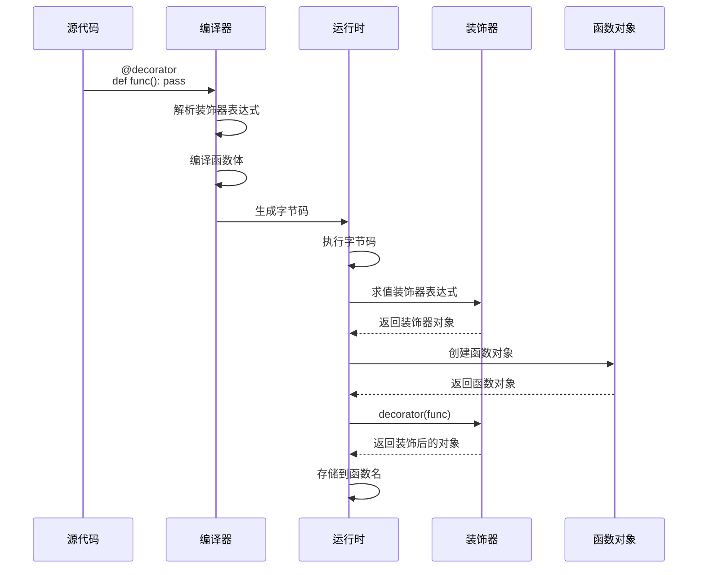
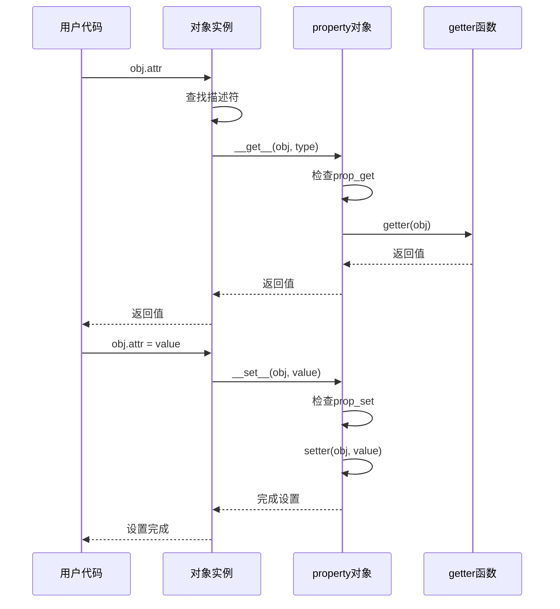
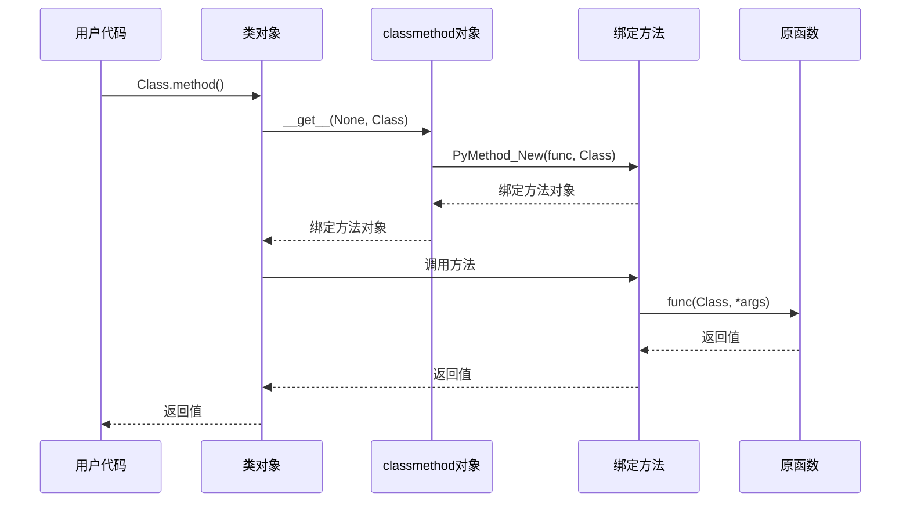
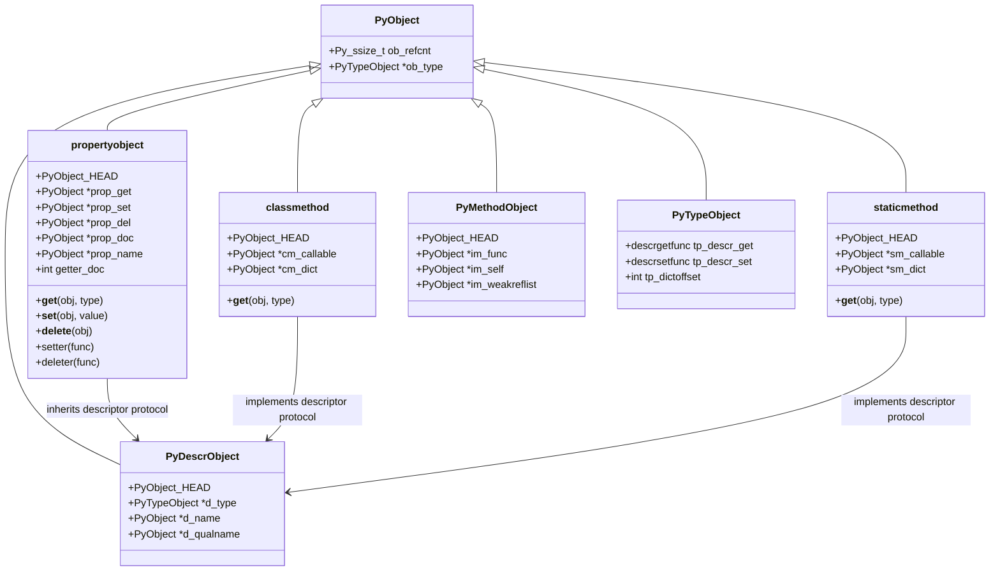

## 📋 概述

装饰器是Python的重要特性，提供了优雅的语法糖来修改或增强函数、类的行为。本文档将深入分析CPython中装饰器的实现机制，包括函数装饰器、类装饰器、内置装饰器(@property、@classmethod、@staticmethod)的底层原理，以及描述符协议在装饰器实现中的核心作用。

## 🎯 装饰器系统架构

```mermaid
graph TB
    subgraph "语法层"
        A[@decorator语法] --> B[装饰器链]
        B --> C[参数化装饰器]
        C --> D[内置装饰器]
    end

    subgraph "编译层"
        E[装饰器表达式解析] --> F[装饰器应用顺序]
        F --> G[函数/类创建]
        G --> H[装饰器调用]
    end

    subgraph "运行时层"
        I[描述符协议] --> J[__get__方法]
        J --> K[__set__方法]
        K --> L[__delete__方法]
    end

    subgraph "内置装饰器"
        M[property] --> N[classmethod]
        N --> O[staticmethod]
        O --> P[functools装饰器]
    end

    A --> E
    D --> I
    H --> I
    I --> M
```

## 1. 装饰器编译机制

### 1.1 装饰器语法分析与编译

装饰器在编译阶段被处理，生成相应的字节码：

```c
/* Python/codegen.c - 装饰器编译处理 */

static int
codegen_decorators(compiler *c, asdl_expr_seq* decos)
{
    /* 如果没有装饰器，直接返回 */
    if (!decos) {
        return SUCCESS;
    }

    /* 按顺序编译所有装饰器表达式
     * 注意：装饰器的求值顺序是从上到下 */
    for (Py_ssize_t i = 0; i < asdl_seq_LEN(decos); i++) {
        VISIT(c, expr, (expr_ty)asdl_seq_GET(decos, i));
    }
    return SUCCESS;
}

static int
codegen_apply_decorators(compiler *c, asdl_expr_seq* decos)
{
    /* 如果没有装饰器，直接返回 */
    if (!decos) {
        return SUCCESS;
    }

    /* 按逆序应用装饰器
     * 装饰器的应用顺序是从下到上（后进先出） */
    for (Py_ssize_t i = asdl_seq_LEN(decos) - 1; i > -1; i--) {
        location loc = LOC((expr_ty)asdl_seq_GET(decos, i));
        /* 生成CALL指令，调用装饰器函数 */
        ADDOP_I(c, loc, CALL, 0);
    }
    return SUCCESS;
}
```

**装饰器编译过程说明**:
1. **求值阶段**: 从上到下求值装饰器表达式
2. **应用阶段**: 从下到上应用装饰器到被装饰对象
3. **调用生成**: 为每个装饰器生成CALL指令

### 1.2 函数装饰器编译示例

考虑以下装饰器代码：

```python
@decorator1
@decorator2
def func():
    pass
```

编译后的字节码等价于：

```python
def func():
    pass
func = decorator1(decorator2(func))
```

**编译过程**:

```c
/* Python/codegen.c - 函数装饰器编译 */

static int
codegen_function(compiler *c, stmt_ty s, int is_async)
{
    arguments_ty args;
    expr_ty returns;
    identifier name;
    asdl_expr_seq *decos;

    if (is_async) {
        args = s->v.AsyncFunctionDef.args;
        returns = s->v.AsyncFunctionDef.returns;
        decos = s->v.AsyncFunctionDef.decorator_list;
        name = s->v.AsyncFunctionDef.name;
    } else {
        args = s->v.FunctionDef.args;
        returns = s->v.FunctionDef.returns;
        decos = s->v.FunctionDef.decorator_list;
        name = s->v.FunctionDef.name;
    }

    /* 1. 编译装饰器表达式（从上到下求值） */
    RETURN_IF_ERROR(codegen_decorators(c, decos));

    /* 2. 编译函数默认参数 */
    Py_ssize_t funcflags = codegen_default_arguments(c, loc, args);
    RETURN_IF_ERROR(funcflags);

    /* 3. 编译函数体，生成代码对象 */
    RETURN_IF_ERROR(codegen_function_body(c, s, is_async, funcflags, firstlineno));

    /* 4. 应用装饰器（从下到上应用） */
    RETURN_IF_ERROR(codegen_apply_decorators(c, decos));

    /* 5. 将结果存储到函数名 */
    RETURN_IF_ERROR(codegen_nameop(c, loc, name, Store));

    return SUCCESS;
}
```

### 1.3 类装饰器编译

类装饰器的编译过程类似：

```c
/* Python/codegen.c - 类装饰器编译 */

static int
codegen_class(compiler *c, stmt_ty s)
{
    /* 获取类定义信息 */
    identifier name = s->v.ClassDef.name;
    asdl_expr_seq *decos = s->v.ClassDef.decorator_list;
    asdl_expr_seq *bases = s->v.ClassDef.bases;
    asdl_keyword_seq *keywords = s->v.ClassDef.keywords;

    /* 1. 编译装饰器表达式 */
    RETURN_IF_ERROR(codegen_decorators(c, decos));

    /* 2. 编译类体，创建类对象 */
    RETURN_IF_ERROR(codegen_call_helper(c, loc, 2, bases, keywords));

    /* 3. 应用装饰器 */
    RETURN_IF_ERROR(codegen_apply_decorators(c, decos));

    /* 4. 存储到类名 */
    RETURN_IF_ERROR(codegen_nameop(c, loc, name, Store));

    return SUCCESS;
}
```

## 2. 描述符协议 - 装饰器的核心基础

### 2.1 描述符协议定义

描述符是实现了`__get__`、`__set__`或`__delete__`方法的对象：

```c
/* Include/cpython/object.h - 描述符协议定义 */

typedef struct {
    /* 描述符的获取方法 */
    getattrofunc tp_getattro;
    /* 描述符的设置方法 */
    setattrofunc tp_setattro;
} PyTypeObject;

/* 描述符方法签名 */
typedef PyObject *(*getter)(PyObject *, void *);
typedef int (*setter)(PyObject *, PyObject *, void *);

/* 描述符对象基础结构 */
typedef struct {
    PyObject_HEAD
    PyTypeObject *d_type;      /* 描述符所属的类型 */
    PyObject *d_name;          /* 描述符的名称 */
    PyObject *d_qualname;      /* 描述符的限定名称 */
} PyDescrObject;
```

### 2.2 描述符查找和调用机制

```c
/* Objects/object.c - 属性访问中的描述符处理 */

PyObject *
PyObject_GenericGetAttr(PyObject *obj, PyObject *name)
{
    PyTypeObject *tp = Py_TYPE(obj);
    PyObject *descr = NULL;
    PyObject *res = NULL;
    descrgetfunc f;
    Py_ssize_t dictoffset;
    PyObject **dictptr;

    /* 1. 在类型的MRO中查找描述符 */
    if (!PyUnicode_Check(name)){
        PyErr_Format(PyExc_TypeError,
                     "attribute name must be string, not '%.200s'",
                     Py_TYPE(name)->tp_name);
        return NULL;
    }

    /* 在类型字典中查找描述符 */
    descr = _PyType_Lookup(tp, name);

    f = NULL;
    if (descr != NULL) {
        Py_INCREF(descr);
        /* 检查是否是数据描述符（定义了__set__或__delete__） */
        f = Py_TYPE(descr)->tp_descr_get;
        if (f != NULL && PyDescr_IsData(descr)) {
            /* 数据描述符优先级最高 */
            res = f(descr, obj, (PyObject *)Py_TYPE(obj));
            if (res == NULL && PyErr_ExceptionMatches(PyExc_AttributeError)) {
                PyErr_Clear();
            }
            goto done;
        }
    }

    /* 2. 查找实例字典 */
    dictoffset = tp->tp_dictoffset;
    if (dictoffset != 0) {
        PyObject *dict;
        dictptr = (PyObject **) ((char *)obj + dictoffset);
        dict = *dictptr;
        if (dict != NULL) {
            Py_INCREF(dict);
            res = PyDict_GetItemWithError(dict, name);
            if (res != NULL) {
                Py_INCREF(res);
                Py_DECREF(dict);
                goto done;
            }
            else {
                Py_DECREF(dict);
                if (PyErr_Occurred()) {
                    goto done;
                }
            }
        }
    }

    /* 3. 使用非数据描述符 */
    if (f != NULL) {
        res = f(descr, obj, (PyObject *)Py_TYPE(obj));
        if (res == NULL && PyErr_ExceptionMatches(PyExc_AttributeError)) {
            PyErr_Clear();
        }
        goto done;
    }

    /* 4. 直接返回类属性 */
    if (descr != NULL) {
        res = descr;
        descr = NULL;
        goto done;
    }

    /* 5. 属性不存在，抛出AttributeError */
    PyErr_Format(PyExc_AttributeError,
                 "'%.50s' object has no attribute '%U'",
                 tp->tp_name, name);
  done:
    Py_XDECREF(descr);
    return res;
}
```

**描述符查找优先级**:
1. 数据描述符（有`__set__`或`__delete__`）
2. 实例字典中的属性
3. 非数据描述符（只有`__get__`）
4. 类字典中的属性

## 3. @property装饰器实现

### 3.1 property对象结构

```c
/* Objects/descrobject.c - property对象定义 */

typedef struct {
    PyObject_HEAD
    PyObject *prop_get;        /* getter函数 */
    PyObject *prop_set;        /* setter函数 */
    PyObject *prop_del;        /* deleter函数 */
    PyObject *prop_doc;        /* 文档字符串 */
    PyObject *prop_name;       /* 属性名称 */
    int getter_doc;            /* 是否使用getter的文档 */
} propertyobject;

#define _propertyobject_CAST(op)    ((propertyobject *)(op))
```

### 3.2 property描述符协议实现

```c
/* Objects/descrobject.c - property的__get__方法 */

static PyObject *
property_descr_get(PyObject *self, PyObject *obj, PyObject *type)
{
    /* 类访问时返回property对象本身 */
    if (obj == NULL || obj == Py_None) {
        return Py_NewRef(self);
    }

    propertyobject *gs = (propertyobject *)self;

    /* 检查是否有getter函数 */
    if (gs->prop_get == NULL) {
        PyObject *propname;
        if (property_name(gs, &propname) < 0) {
            return NULL;
        }
        PyObject *qualname = PyType_GetQualName(Py_TYPE(obj));

        /* 生成详细的错误信息 */
        if (propname != NULL && qualname != NULL) {
            PyErr_Format(PyExc_AttributeError,
                         "property %R of %R object has no getter",
                         propname, qualname);
        }
        else if (qualname != NULL) {
            PyErr_Format(PyExc_AttributeError,
                         "property of %R object has no getter",
                         qualname);
        } else {
            PyErr_SetString(PyExc_AttributeError,
                            "property has no getter");
        }
        Py_XDECREF(propname);
        Py_XDECREF(qualname);
        return NULL;
    }

    /* 调用getter函数，传入实例对象 */
    return PyObject_CallOneArg(gs->prop_get, obj);
}

/* property的__set__和__delete__方法 */
static int
property_descr_set(PyObject *self, PyObject *obj, PyObject *value)
{
    propertyobject *gs = (propertyobject *)self;
    PyObject *func, *res;

    /* 根据value是否为NULL决定调用setter还是deleter */
    if (value == NULL) {
        func = gs->prop_del;        /* 删除操作 */
    }
    else {
        func = gs->prop_set;        /* 设置操作 */
    }

    /* 检查是否有相应的函数 */
    if (func == NULL) {
        PyObject *propname;
        if (property_name(gs, &propname) < 0) {
            return -1;
        }
        PyObject *qualname = NULL;
        if (obj != NULL) {
            qualname = PyType_GetQualName(Py_TYPE(obj));
        }

        /* 生成错误信息 */
        if (propname != NULL && qualname != NULL) {
            PyErr_Format(PyExc_AttributeError,
                        value == NULL ?
                        "property %R of %R object has no deleter" :
                        "property %R of %R object has no setter",
                        propname, qualname);
        }
        else if (qualname != NULL) {
            PyErr_Format(PyExc_AttributeError,
                            value == NULL ?
                            "property of %R object has no deleter" :
                            "property of %R object has no setter",
                            qualname);
        }
        else {
            PyErr_SetString(PyExc_AttributeError,
                         value == NULL ?
                         "property has no deleter" :
                         "property has no setter");
        }
        Py_XDECREF(propname);
        Py_XDECREF(qualname);
        return -1;
    }

    /* 调用相应的函数 */
    if (value == NULL) {
        /* 删除操作：deleter(obj) */
        res = PyObject_CallOneArg(func, obj);
    }
    else {
        /* 设置操作：setter(obj, value) */
        EVAL_CALL_STAT_INC_IF_FUNCTION(EVAL_CALL_API, func);
        PyObject *args[] = { obj, value };
        res = PyObject_Vectorcall(func, args, 2, NULL);
    }

    if (res == NULL) {
        return -1;
    }

    Py_DECREF(res);
    return 0;
}
```

### 3.3 property装饰器的setter/deleter方法

```c
/* Objects/descrobject.c - property的getter/setter/deleter方法 */

static PyObject *
property_setter(PyObject *self, PyObject *setter)
{
    /* 创建新的property对象，替换setter */
    return property_copy(self, NULL, setter, NULL);
}

static PyObject *
property_deleter(PyObject *self, PyObject *deleter)
{
    /* 创建新的property对象，替换deleter */
    return property_copy(self, NULL, NULL, deleter);
}

/* 复制property对象，替换指定的函数 */
static PyObject *
property_copy(PyObject *old, PyObject *get, PyObject *set, PyObject *del)
{
    propertyobject *pold = (propertyobject *)old;
    PyObject *new, *type, *doc;

    /* 获取property的类型（支持子类） */
    type = PyObject_Type(old);
    if (type == NULL)
        return NULL;

    /* 使用现有的函数或新提供的函数 */
    if (get == NULL || get == Py_None) {
        get = pold->prop_get ? pold->prop_get : Py_None;
    }
    if (set == NULL || set == Py_None) {
        set = pold->prop_set ? pold->prop_set : Py_None;
    }
    if (del == NULL || del == Py_None) {
        del = pold->prop_del ? pold->prop_del : Py_None;
    }

    /* 处理文档字符串 */
    if (pold->getter_doc && get != Py_None) {
        /* 使用getter的__doc__ */
        doc = Py_None;
    }
    else {
        doc = pold->prop_doc ? pold->prop_doc : Py_None;
    }

    /* 创建新的property对象 */
    new = PyObject_CallFunctionObjArgs(type, get, set, del, doc, NULL);
    Py_DECREF(type);
    if (new == NULL)
        return NULL;

    /* 复制名称信息 */
    if (PyObject_TypeCheck((new), &PyProperty_Type)) {
        Py_XSETREF(((propertyobject *) new)->prop_name,
                   Py_XNewRef(pold->prop_name));
    }
    return new;
}

/* property的方法表 */
static PyMethodDef property_methods[] = {
    {"getter", property_getter, METH_O, getter_doc},
    {"setter", property_setter, METH_O, setter_doc},
    {"deleter", property_deleter, METH_O, deleter_doc},
    {"__set_name__", property_set_name, METH_VARARGS, set_name_doc},
    {0}
};
```

### 3.4 property使用示例

```python
# property装饰器的框架使用示例
class Circle:
    def __init__(self, radius):
        self._radius = radius

    @property
    def radius(self):
        """获取半径"""
        print("获取radius")
        return self._radius

    @radius.setter
    def radius(self, value):
        """设置半径"""
        if value < 0:
            raise ValueError("半径不能为负数")
        print(f"设置radius为{value}")
        self._radius = value

    @radius.deleter
    def radius(self):
        """删除半径"""
        print("删除radius")
        del self._radius

    @property
    def area(self):
        """计算面积（只读属性）"""
        return 3.14159 * self._radius ** 2

# 使用示例
circle = Circle(5)
print(f"半径: {circle.radius}")      # 调用getter
circle.radius = 10                   # 调用setter
print(f"面积: {circle.area}")        # 只读属性
del circle.radius                    # 调用deleter
```

## 4. @classmethod装饰器实现

### 4.1 classmethod对象结构

```c
/* Objects/funcobject.c - classmethod对象定义 */

typedef struct {
    PyObject_HEAD
    PyObject *cm_callable;     /* 被装饰的函数 */
    PyObject *cm_dict;         /* 实例字典 */
} classmethod;

#define _PyClassMethod_CAST(cm) \
    (assert(PyObject_TypeCheck((cm), &PyClassMethod_Type)), \
     _Py_CAST(classmethod*, cm))
```

### 4.2 classmethod描述符实现

```c
/* Objects/funcobject.c - classmethod的__get__方法 */

static PyObject *
cm_descr_get(PyObject *self, PyObject *obj, PyObject *type)
{
    classmethod *cm = (classmethod *)self;

    if (cm->cm_callable == NULL) {
        PyErr_SetString(PyExc_RuntimeError,
                        "uninitialized classmethod object");
        return NULL;
    }

    /* 获取类型对象 */
    if (type == NULL)
        type = (PyObject *)(Py_TYPE(obj));

    /* 返回绑定了类型的方法对象 */
    return PyMethod_New(cm->cm_callable, type);
}

/* classmethod初始化 */
static int
cm_init(PyObject *self, PyObject *args, PyObject *kwds)
{
    classmethod *cm = (classmethod *)self;
    PyObject *callable;

    if (!_PyArg_NoKeywords("classmethod", kwds))
        return -1;
    if (!PyArg_UnpackTuple(args, "classmethod", 1, 1, &callable))
        return -1;

    /* 存储被装饰的函数 */
    Py_XSETREF(cm->cm_callable, Py_NewRef(callable));

    /* 处理抽象方法标记 */
    if (functools_wraps((PyObject *)cm, callable) < 0) {
        return -1;
    }
    return 0;
}

/* classmethod类型定义 */
PyTypeObject PyClassMethod_Type = {
    PyVarObject_HEAD_INIT(&PyType_Type, 0)
    "classmethod",                          /* tp_name */
    sizeof(classmethod),                    /* tp_basicsize */
    0,                                      /* tp_itemsize */
    cm_dealloc,                             /* tp_dealloc */
    0,                                      /* tp_vectorcall_offset */
    0,                                      /* tp_getattr */
    0,                                      /* tp_setattr */
    0,                                      /* tp_as_async */
    cm_repr,                                /* tp_repr */
    0,                                      /* tp_as_number */
    0,                                      /* tp_as_sequence */
    0,                                      /* tp_as_mapping */
    0,                                      /* tp_hash */
    0,                                      /* tp_call */
    0,                                      /* tp_str */
    0,                                      /* tp_getattro */
    0,                                      /* tp_setattro */
    0,                                      /* tp_as_buffer */
    Py_TPFLAGS_DEFAULT | Py_TPFLAGS_BASETYPE | Py_TPFLAGS_HAVE_GC,
    classmethod_doc,                        /* tp_doc */
    cm_traverse,                            /* tp_traverse */
    cm_clear,                               /* tp_clear */
    0,                                      /* tp_richcompare */
    0,                                      /* tp_weaklistoffset */
    0,                                      /* tp_iter */
    0,                                      /* tp_iternext */
    0,                                      /* tp_methods */
    cm_memberlist,                          /* tp_members */
    cm_getsetlist,                          /* tp_getset */
    0,                                      /* tp_base */
    0,                                      /* tp_dict */
    cm_descr_get,                           /* tp_descr_get */
    0,                                      /* tp_descr_set */
    offsetof(classmethod, cm_dict),         /* tp_dictoffset */
    cm_init,                                /* tp_init */
    PyType_GenericAlloc,                    /* tp_alloc */
    PyType_GenericNew,                      /* tp_new */
    PyObject_GC_Del,                        /* tp_free */
};
```

### 4.3 类方法自动转换

```c
/* Objects/typeobject.c - 特殊方法的自动转换 */

static int
type_new_classmethod(PyObject *dict, PyObject *attr)
{
    PyObject *func = PyDict_GetItemWithError(dict, attr);
    if (func == NULL) {
        if (!PyErr_Occurred()) {
            return 0;
        }
        return -1;
    }

    /* 检查是否是普通函数 */
    if (!PyFunction_Check(func)) {
        return 0;
    }

    /* 自动转换为classmethod */
    PyObject *classmethod_func = PyClassMethod_New(func);
    if (classmethod_func == NULL) {
        return -1;
    }

    /* 替换字典中的函数 */
    if (PyDict_SetItem(dict, attr, classmethod_func) < 0) {
        Py_DECREF(classmethod_func);
        return -1;
    }
    Py_DECREF(classmethod_func);
    return 0;
}

/* 在类型创建时自动处理特殊方法 */
if (type_new_classmethod(dict, &_Py_ID(__init_subclass__)) < 0) {
    return -1;
}
if (type_new_classmethod(dict, &_Py_ID(__class_getitem__)) < 0) {
    return -1;
}
```

## 5. @staticmethod装饰器实现

### 5.1 staticmethod对象结构

```c
/* Objects/funcobject.c - staticmethod对象定义 */

typedef struct {
    PyObject_HEAD
    PyObject *sm_callable;     /* 被装饰的函数 */
    PyObject *sm_dict;         /* 实例字典 */
} staticmethod;

#define _PyStaticMethod_CAST(sm) \
    (assert(PyObject_TypeCheck((sm), &PyStaticMethod_Type)), \
     _Py_CAST(staticmethod*, sm))
```

### 5.2 staticmethod描述符实现

```c
/* Objects/funcobject.c - staticmethod的__get__方法 */

static PyObject *
sm_descr_get(PyObject *self, PyObject *obj, PyObject *type)
{
    staticmethod *sm = (staticmethod *)self;

    if (sm->sm_callable == NULL) {
        PyErr_SetString(PyExc_RuntimeError,
                        "uninitialized staticmethod object");
        return NULL;
    }

    /* 静态方法直接返回原函数，不绑定任何对象 */
    return Py_NewRef(sm->sm_callable);
}

/* staticmethod初始化 */
static int
sm_init(PyObject *self, PyObject *args, PyObject *kwds)
{
    staticmethod *sm = (staticmethod *)self;
    PyObject *callable;

    if (!_PyArg_NoKeywords("staticmethod", kwds))
        return -1;
    if (!PyArg_UnpackTuple(args, "staticmethod", 1, 1, &callable))
        return -1;

    /* 存储被装饰的函数 */
    Py_XSETREF(sm->sm_callable, Py_NewRef(callable));

    /* 处理抽象方法标记 */
    if (functools_wraps((PyObject *)sm, callable) < 0) {
        return -1;
    }
    return 0;
}
```

### 5.3 静态方法自动转换

```c
/* Objects/typeobject.c - __new__方法的自动转换 */

static int
type_new_staticmethod(PyObject *dict, PyObject *attr)
{
    PyObject *func = PyDict_GetItemWithError(dict, attr);
    if (func == NULL) {
        if (!PyErr_Occurred()) {
            return 0;
        }
        return -1;
    }

    /* 检查是否是普通函数 */
    if (!PyFunction_Check(func)) {
        return 0;
    }

    /* 自动转换为staticmethod */
    PyObject *staticmethod_func = PyStaticMethod_New(func);
    if (staticmethod_func == NULL) {
        return -1;
    }

    /* 替换字典中的函数 */
    if (PyDict_SetItem(dict, attr, staticmethod_func) < 0) {
        Py_DECREF(staticmethod_func);
        return -1;
    }
    Py_DECREF(staticmethod_func);
    return 0;
}

/* __new__方法自动转换为静态方法 */
if (type_new_staticmethod(dict, &_Py_ID(__new__)) < 0) {
    return -1;
}
```

## 6. 装饰器时序图

### 6.1 装饰器编译与应用时序



### 6.2 property访问时序



### 6.3 classmethod调用时序



## 7. 高级装饰器模式

### 7.1 参数化装饰器

```python
# 参数化装饰器实现示例
import functools
import time

def retry(max_attempts=3, delay=1.0, backoff=2.0):
    """重试装饰器工厂函数"""
    def decorator(func):
        @functools.wraps(func)
        def wrapper(*args, **kwargs):
            attempts = 0
            current_delay = delay

            while attempts < max_attempts:
                try:
                    return func(*args, **kwargs)
                except Exception as e:
                    attempts += 1
                    if attempts >= max_attempts:
                        raise

                    print(f"尝试 {attempts} 失败: {e}")
                    print(f"等待 {current_delay} 秒后重试...")
                    time.sleep(current_delay)
                    current_delay *= backoff

            return func(*args, **kwargs)
        return wrapper
    return decorator

# 使用参数化装饰器
@retry(max_attempts=5, delay=0.5, backoff=1.5)
def unreliable_function():
    """可能失败的函数"""
    import random
    if random.random() < 0.7:
        raise Exception("随机失败")
    return "成功"

# 类装饰器示例
def singleton(cls):
    """单例装饰器"""
    instances = {}
    def get_instance(*args, **kwargs):
        if cls not in instances:
            instances[cls] = cls(*args, **kwargs)
        return instances[cls]
    return get_instance

@singleton
class Database:
    def __init__(self):
        print("创建数据库连接")
        self.connection = "database_connection"

# 多次创建返回同一实例
db1 = Database()
db2 = Database()
print(db1 is db2)  # True
```

### 7.2 装饰器链和组合

```python
# 装饰器链示例
import functools
import time
from typing import Callable, Any

def timing(func: Callable) -> Callable:
    """计时装饰器"""
    @functools.wraps(func)
    def wrapper(*args, **kwargs):
        start = time.time()
        try:
            result = func(*args, **kwargs)
            return result
        finally:
            end = time.time()
            print(f"{func.__name__} 执行时间: {end - start:.4f} 秒")
    return wrapper

def logging_decorator(func: Callable) -> Callable:
    """日志装饰器"""
    @functools.wraps(func)
    def wrapper(*args, **kwargs):
        print(f"调用函数: {func.__name__}")
        print(f"参数: args={args}, kwargs={kwargs}")
        try:
            result = func(*args, **kwargs)
            print(f"返回值: {result}")
            return result
        except Exception as e:
            print(f"异常: {e}")
            raise
    return wrapper

def validate_types(**types):
    """类型验证装饰器"""
    def decorator(func: Callable) -> Callable:
        @functools.wraps(func)
        def wrapper(*args, **kwargs):
            # 获取函数签名
            import inspect
            sig = inspect.signature(func)
            bound = sig.bind(*args, **kwargs)
            bound.apply_defaults()

            # 验证参数类型
            for param_name, expected_type in types.items():
                if param_name in bound.arguments:
                    value = bound.arguments[param_name]
                    if not isinstance(value, expected_type):
                        raise TypeError(
                            f"参数 {param_name} 期望类型 {expected_type.__name__}, "
                            f"但得到 {type(value).__name__}"
                        )

            return func(*args, **kwargs)
        return wrapper
    return decorator

# 装饰器链使用（从下到上应用）
@timing                    # 最外层：计时
@logging_decorator         # 中间层：日志
@validate_types(x=int, y=int)  # 最内层：类型验证
def add_numbers(x: int, y: int) -> int:
    """计算两个数的和"""
    return x + y

# 测试装饰器链
result = add_numbers(10, 20)
print(f"最终结果: {result}")

# 测试类型验证
try:
    add_numbers("10", 20)  # 类型错误
except TypeError as e:
    print(f"类型验证失败: {e}")
```

### 7.3 基于类的装饰器

```python
# 基于类的装饰器示例
class CountCalls:
    """计算函数调用次数的装饰器类"""

    def __init__(self, func):
        self.func = func
        self.count = 0
        # 保留原函数的元数据
        functools.update_wrapper(self, func)

    def __call__(self, *args, **kwargs):
        self.count += 1
        print(f"函数 {self.func.__name__} 被调用了 {self.count} 次")
        return self.func(*args, **kwargs)

    def __get__(self, obj, objtype=None):
        """支持方法装饰的描述符协议"""
        if obj is None:
            return self
        return functools.partial(self.__call__, obj)

class Memoize:
    """记忆化装饰器类"""

    def __init__(self, func):
        self.func = func
        self.cache = {}
        functools.update_wrapper(self, func)

    def __call__(self, *args, **kwargs):
        # 创建缓存键
        key = str(args) + str(sorted(kwargs.items()))

        if key not in self.cache:
            print(f"计算 {self.func.__name__}{args}")
            self.cache[key] = self.func(*args, **kwargs)
        else:
            print(f"从缓存获取 {self.func.__name__}{args}")

        return self.cache[key]

    def clear_cache(self):
        """清空缓存"""
        self.cache.clear()

# 使用基于类的装饰器
@CountCalls
def greet(name):
    return f"Hello, {name}!"

@Memoize
def fibonacci(n):
    if n < 2:
        return n
    return fibonacci(n-1) + fibonacci(n-2)

# 测试调用计数
print(greet("Alice"))
print(greet("Bob"))
print(greet("Charlie"))

# 测试记忆化
print(f"斐波那契数列第10项: {fibonacci(10)}")
print(f"斐波那契数列第10项: {fibonacci(10)}")  # 从缓存获取

# 清空缓存
fibonacci.clear_cache()
print(f"清空缓存后，斐波那契数列第5项: {fibonacci(5)}")
```

## 8. 关键数据结构UML图



## 9. 性能分析与优化

### 9.1 装饰器性能开销

```python
# 装饰器性能测试
import time
import functools

def simple_function(x):
    """无装饰器的简单函数"""
    return x * 2

def simple_decorator(func):
    """简单装饰器"""
    @functools.wraps(func)
    def wrapper(*args, **kwargs):
        return func(*args, **kwargs)
    return wrapper

@simple_decorator
def decorated_function(x):
    """被装饰的函数"""
    return x * 2

def multiple_decorator_factory(n):
    """多层装饰器工厂"""
    def decorator(func):
        @functools.wraps(func)
        def wrapper(*args, **kwargs):
            result = func(*args, **kwargs)
            return result
        return wrapper
    return decorator

# 创建多层装饰器
@multiple_decorator_factory(1)
@multiple_decorator_factory(2)
@multiple_decorator_factory(3)
def heavily_decorated_function(x):
    """多层装饰的函数"""
    return x * 2

def benchmark_function(func, iterations=1000000):
    """性能基准测试"""
    start = time.time()
    for i in range(iterations):
        func(i)
    end = time.time()
    return end - start

# 性能测试
print("装饰器性能对比:")
print(f"无装饰器: {benchmark_function(simple_function):.4f}秒")
print(f"单层装饰器: {benchmark_function(decorated_function):.4f}秒")
print(f"多层装饰器: {benchmark_function(heavily_decorated_function):.4f}秒")
```

### 9.2 装饰器优化技巧

```python
# 装饰器优化示例
import functools
from typing import Callable, Any

# 高效的类型检查装饰器
def typed(func: Callable) -> Callable:
    """优化的类型检查装饰器"""
    # 在装饰时就解析类型注解，而不是每次调用时解析
    import inspect
    sig = inspect.signature(func)
    type_hints = func.__annotations__

    # 预编译验证逻辑
    param_types = {}
    for param_name, param in sig.parameters.items():
        if param_name in type_hints:
            param_types[param_name] = type_hints[param_name]

    # 如果没有类型注解，返回原函数
    if not param_types:
        return func

    @functools.wraps(func)
    def wrapper(*args, **kwargs):
        # 快速绑定参数
        bound = sig.bind(*args, **kwargs)

        # 高效的类型检查
        for param_name, expected_type in param_types.items():
            if param_name in bound.arguments:
                value = bound.arguments[param_name]
                if not isinstance(value, expected_type):
                    raise TypeError(
                        f"参数 {param_name} 类型错误: 期望 {expected_type.__name__}, "
                        f"得到 {type(value).__name__}"
                    )

        return func(*args, **kwargs)
    return wrapper

# 缓存优化的装饰器
class LRUCache:
    """LRU缓存装饰器实现"""

    def __init__(self, maxsize=128):
        self.maxsize = maxsize
        self.cache = {}
        self.access_order = []

    def __call__(self, func):
        @functools.wraps(func)
        def wrapper(*args, **kwargs):
            # 创建缓存键
            key = (args, tuple(sorted(kwargs.items())))

            if key in self.cache:
                # 更新访问顺序
                self.access_order.remove(key)
                self.access_order.append(key)
                return self.cache[key]

            # 计算结果
            result = func(*args, **kwargs)

            # 缓存管理
            if len(self.cache) >= self.maxsize:
                # 移除最少使用的项
                oldest = self.access_order.pop(0)
                del self.cache[oldest]

            # 添加新结果
            self.cache[key] = result
            self.access_order.append(key)

            return result

        # 添加缓存信息方法
        wrapper.cache_info = lambda: {
            'hits': len([k for k in self.cache.keys()]),
            'misses': 0,  # 简化版本
            'maxsize': self.maxsize,
            'currsize': len(self.cache)
        }
        wrapper.cache_clear = lambda: (
            self.cache.clear(),
            self.access_order.clear()
        )

        return wrapper

# 使用优化的装饰器
@typed
def add_typed(x: int, y: int) -> int:
    return x + y

@LRUCache(maxsize=64)
def expensive_computation(n: int) -> int:
    """模拟昂贵的计算"""
    import time
    time.sleep(0.1)  # 模拟计算时间
    return n ** 2

# 测试优化效果
print("类型检查测试:")
print(add_typed(10, 20))  # 正常
try:
    add_typed("10", 20)   # 类型错误
except TypeError as e:
    print(f"类型错误: {e}")

print("\nLRU缓存测试:")
print(f"第一次计算: {expensive_computation(5)}")  # 慢
print(f"第二次计算: {expensive_computation(5)}")  # 快（从缓存）
print(f"缓存信息: {expensive_computation.cache_info()}")
```

## 10. 总结

Python装饰器系统展现了语言设计的优雅和强大：

### 10.1 设计优势

1. **语法糖的力量**: @语法提供了直观、清洁的代码修饰方式
2. **描述符协议**: 统一的属性访问机制支撑了复杂的装饰器行为
3. **组合性**: 装饰器可以自由组合，创造复杂的功能
4. **元编程支持**: 运行时修改和增强代码行为

### 10.2 应用场景

- **属性管理**: @property提供了Pythonic的getter/setter模式
- **方法类型**: @classmethod和@staticmethod明确了方法的调用语义
- **横切关注点**: 日志、缓存、验证等通用功能
- **API设计**: Flask、Django等框架的路由装饰器

### 10.3 最佳实践

1. **保持简单**: 避免过度复杂的装饰器链
2. **保留元数据**: 使用functools.wraps保持函数信息
3. **性能考虑**: 在装饰时预计算，减少运行时开销
4. **错误处理**: 提供清晰的错误信息和调试支持

装饰器作为Python的核心特性，体现了语言在可读性、灵活性和功能性之间的平衡，为开发者提供了强大的代码组织和复用工具。
