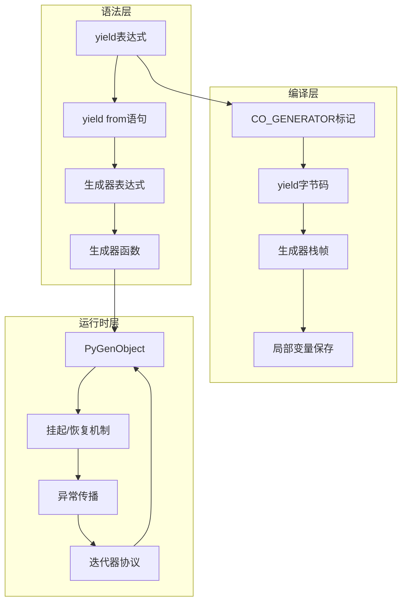
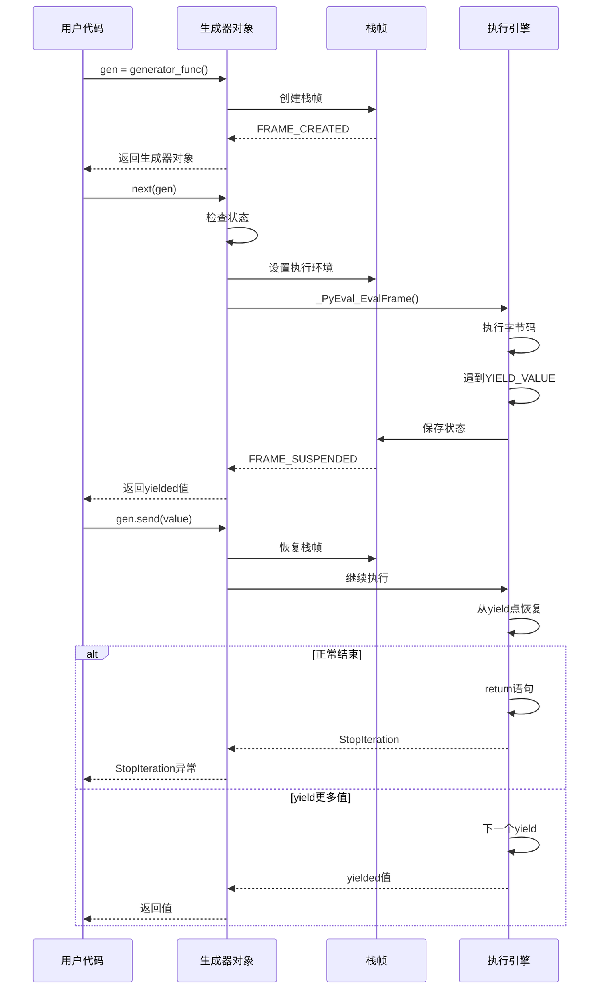

## 📋 概述

生成器和迭代器是Python中支持惰性求值和内存高效编程的核心特性。本文档将深入分析CPython中生成器对象、迭代器协议、yield语句、生成器表达式等的底层实现机制。

## 🎯 生成器系统架构



## 1. 生成器对象核心实现

### 1.1 生成器对象结构

```c
/* Include/internal/pycore_genobject.h - 生成器对象基础结构 */

#define _PyGenObject_HEAD(prefix)                                           \
    PyObject_HEAD                                                           \
    _PyInterpreterFrame gi_iframe;      /* 嵌入的解释器栈帧 */                \
    char prefix##_frame_state;          /* 帧状态标记 */                     \
    PyObject *prefix##_weakreflist;     /* 弱引用列表 */                     \
    PyObject *prefix##_name;            /* 生成器名称 */                     \
    PyObject *prefix##_qualname;        /* 限定名称 */                       \
    _PyErr_StackItem prefix##_exc_state /* 异常状态 */

typedef struct {
    _PyGenObject_HEAD(gi)
} PyGenObject;

/* 帧状态枚举 */
typedef enum {
    FRAME_CREATED = -1,     /* 新创建，尚未开始执行 */
    FRAME_EXECUTING = 0,    /* 正在执行 */
    FRAME_SUSPENDED = 1,    /* 挂起状态（yield） */
    FRAME_COMPLETED = 2,    /* 执行完成 */
    FRAME_CLEARED = 3       /* 帧已清理 */
} _PyFrameState;
```

### 1.2 生成器创建机制

```c
/* Objects/genobject.c - 生成器创建函数 */

static PyObject *
make_gen(PyTypeObject *type, PyFunctionObject *func)
{
    PyCodeObject *code = (PyCodeObject *)func->func_code;

    /* 计算所需的栈帧大小 */
    int size = code->co_nlocalsplus + code->co_stacksize + FRAME_SPECIALS_SIZE;

    /* 分配生成器对象 */
    PyGenObject *gen = (PyGenObject *)type->tp_alloc(type, 0);
    if (gen == NULL) {
        return NULL;
    }

    /* 初始化嵌入的栈帧 */
    _PyFrame_InitializeSpecials(&gen->gi_iframe,
                                (PyFunctionObject*)Py_NewRef(func),
                                NULL, code->co_nlocalsplus);

    /* 设置生成器状态 */
    gen->gi_frame_state = FRAME_CREATED;
    gen->gi_weakreflist = NULL;
    gen->gi_name = Py_NewRef(func->func_name);
    gen->gi_qualname = Py_NewRef(func->func_qualname);

    /* 初始化异常状态 */
    _PyErr_InitStackItem(&gen->gi_exc_state);

    /* 启用垃圾收集跟踪 */
    _PyObject_GC_TRACK(gen);
    return (PyObject *)gen;
}

PyObject *
_Py_MakeGen(PyFunctionObject *func)
{
    /* 检查函数的生成器标志 */
    int coro_flags = ((PyCodeObject *)func->func_code)->co_flags &
        (CO_GENERATOR | CO_COROUTINE | CO_ASYNC_GENERATOR);

    if (coro_flags == CO_GENERATOR) {
        return make_gen(&PyGen_Type, func);
    }
    /* 其他类型处理... */
}
```

### 1.3 生成器执行引擎

```c
/* Objects/genobject.c - 生成器发送机制 */

static PySendResult
gen_send_ex2(PyGenObject *gen, PyObject *arg, PyObject **presult,
             int exc, int closing)
{
    PyThreadState *tstate = _PyThreadState_GET();
    _PyInterpreterFrame *frame = &gen->gi_iframe;

    *presult = NULL;

    /* 检查生成器状态 */
    if (gen->gi_frame_state == FRAME_CREATED && arg && arg != Py_None) {
        /* 新创建的生成器不能发送非None值 */
        const char *msg = "can't send non-None value to a "
                         "just-started generator";
        PyErr_SetString(PyExc_TypeError, msg);
        return PYGEN_ERROR;
    }

    if (FRAME_STATE_FINISHED(gen->gi_frame_state)) {
        /* 已完成的生成器抛出StopIteration */
        if (PyCoro_CheckExact(gen) && !closing) {
            /* 协程特殊处理 */
            PyErr_SetString(PyExc_RuntimeError,
                           "cannot reuse already awaited coroutine");
        } else if (arg && !exc) {
            /* 普通生成器返回None */
            *presult = Py_NewRef(Py_None);
            return PYGEN_RETURN;
        }
        return PYGEN_ERROR;
    }

    /* 准备执行环境 */
    if (gen->gi_frame_state == FRAME_CREATED) {
        /* 首次执行初始化 */
        if (arg && arg != Py_None) {
            const char *msg = "can't send non-None value to a "
                             "just-started generator";
            PyErr_SetString(PyExc_TypeError, msg);
            return PYGEN_ERROR;
        }

        /* 设置初始参数 */
        if (arg) {
            Py_INCREF(arg);
        } else {
            arg = Py_NewRef(Py_None);
        }
    } else {
        /* 恢复执行时的参数处理 */
        Py_XINCREF(arg);
    }

    /* 恢复异常状态 */
    _PyErr_SwapStackItem(&gen->gi_exc_state);

    /* 设置栈顶值（yield的结果） */
    if (gen->gi_frame_state != FRAME_CREATED) {
        _PyStackRef_XCLOSE(frame->stackpointer[-1]);
        frame->stackpointer[-1] = PyStackRef_FromPyObjectNew(arg);
    }

    /* 执行生成器 */
    gen->gi_frame_state = FRAME_EXECUTING;
    frame->previous = _PyThreadState_GetFrame(tstate);
    tstate->current_frame = frame;

    /* 调用字节码执行引擎 */
    PyObject *result = _PyEval_EvalFrame(tstate, frame, exc);

    /* 恢复线程状态 */
    tstate->current_frame = frame->previous;
    frame->previous = NULL;

    /* 保存异常状态 */
    _PyErr_SwapStackItem(&gen->gi_exc_state);

    /* 处理执行结果 */
    if (result != NULL) {
        /* 正常返回 */
        if (!_PyObject_IsGen(result)) {
            /* 函数正常返回（非yield） */
            *presult = result;
            gen->gi_frame_state = FRAME_COMPLETED;
            return PYGEN_RETURN;
        }

        /* yield的值 */
        *presult = result;
        gen->gi_frame_state = FRAME_SUSPENDED;
        return PYGEN_NEXT;
    } else {
        /* 异常或StopIteration */
        if (PyErr_ExceptionMatches(PyExc_StopIteration) ||
            PyErr_ExceptionMatches(PyExc_GeneratorExit)) {
            gen->gi_frame_state = FRAME_COMPLETED;
            if (PyErr_ExceptionMatches(PyExc_StopIteration)) {
                /* 提取StopIteration的值 */
                PyObject *value = NULL;
                if (_PyGen_GetStopIterationValue(&value) == 0) {
                    *presult = value;
                    return PYGEN_RETURN;
                }
            }
        }
        return PYGEN_ERROR;
    }
}
```

## 2. yield语句编译与执行

### 2.1 yield语句编译

```c
/* Python/codegen.c - yield表达式编译 */

case Yield_kind:
    if (!_PyST_IsFunctionLike(SYMTABLE_ENTRY(c))) {
        return _PyCompile_Error(c, loc, "'yield' outside function");
    }

    if (c->c_scope_type != COMPILE_SCOPE_FUNCTION &&
        c->c_scope_type != COMPILE_SCOPE_ASYNC_FUNCTION) {
        return _PyCompile_Error(c, loc, "'yield' outside function");
    }

    /* 编译yield的值表达式 */
    if (e->v.Yield.value) {
        VISIT(c, expr, e->v.Yield.value);
    } else {
        ADDOP_LOAD_CONST(c, loc, Py_None);
    }

    /* 生成YIELD_VALUE指令 */
    ADDOP_YIELD(c, loc);
    break;

case YieldFrom_kind:
    if (!_PyST_IsFunctionLike(SYMTABLE_ENTRY(c))) {
        return _PyCompile_Error(c, loc, "'yield from' outside function");
    }

    if (SCOPE_TYPE(c) == COMPILE_SCOPE_ASYNC_FUNCTION) {
        return _PyCompile_Error(c, loc, "'yield from' inside async function");
    }

    /* 编译yield from的值 */
    VISIT(c, expr, e->v.YieldFrom.value);

    /* 生成GET_YIELD_FROM_ITER和YIELD_FROM指令 */
    ADDOP(c, loc, GET_YIELD_FROM_ITER);
    ADDOP_LOAD_CONST(c, loc, Py_None);
    ADD_YIELD_FROM(c, loc, 0);
    break;
```

### 2.2 yield字节码执行

```c
/* Python/ceval.c - YIELD_VALUE指令处理 */

case TARGET(YIELD_VALUE): {
    PyObject *retval = POP();  /* 弹出要yield的值 */

    assert(frame->owner == FRAME_OWNED_BY_GENERATOR);
    PyGenObject *gen = _PyFrame_GetGenerator(frame);
    gen->gi_frame_state = FRAME_SUSPENDED;

    /* 设置栈指针，保存当前状态 */
    frame->stackpointer = STACK_LEVEL();

    /* 返回yielded值给调用者 */
    _PyFrame_SetStackPointer(frame, STACK_LEVEL());
    DISPATCH();
}

case TARGET(GET_YIELD_FROM_ITER): {
    /* yield from的迭代器获取 */
    PyObject *iterable = TOP();
    PyObject *iter = PyObject_GetIter(iterable);
    if (iter == NULL) {
        PyErr_Format(PyExc_TypeError,
                     "'%.200s' object is not iterable",
                     Py_TYPE(iterable)->tp_name);
        goto error;
    }
    Py_DECREF(iterable);
    SET_TOP(iter);
    DISPATCH();
}
```

## 3. 迭代器协议实现

### 3.1 内置迭代器类型

```c
/* Objects/iterobject.c - 序列迭代器 */

typedef struct {
    PyObject_HEAD
    Py_ssize_t it_index;      /* 当前索引 */
    PyObject *it_seq;         /* 序列对象 */
} seqiterobject;

static PyObject *
iter_iternext(PyObject *iterator)
{
    seqiterobject *it = (seqiterobject *)iterator;
    PyObject *seq = it->it_seq;

    if (seq == NULL) {
        return NULL;  /* 迭代器已耗尽 */
    }

    /* 获取下一个元素 */
    PyObject *result = PySequence_GetItem(seq, it->it_index);
    if (result != NULL) {
        it->it_index++;
        return result;
    }

    /* 处理索引越界（正常结束） */
    if (PyErr_ExceptionMatches(PyExc_IndexError) ||
        PyErr_ExceptionMatches(PyExc_StopIteration)) {
        PyErr_Clear();
        it->it_seq = NULL;  /* 标记为已耗尽 */
        Py_DECREF(seq);
    }
    return NULL;
}

/* 可调用对象迭代器 */
typedef struct {
    PyObject_HEAD
    PyObject *it_callable;    /* 可调用对象 */
    PyObject *it_sentinel;    /* 哨兵值 */
} calliterobject;

static PyObject *
calliter_iternext(calliterobject *it)
{
    if (it->it_callable == NULL) {
        return NULL;
    }

    /* 调用可调用对象 */
    PyObject *result = PyObject_CallNoArgs(it->it_callable);
    if (result == NULL) {
        return NULL;
    }

    /* 检查是否达到哨兵值 */
    int sentinel_match = PyObject_RichCompareBool(result, it->it_sentinel, Py_EQ);
    if (sentinel_match == 1) {
        /* 达到哨兵值，停止迭代 */
        Py_DECREF(result);
        Py_CLEAR(it->it_callable);
        return NULL;
    }
    if (sentinel_match == -1) {
        Py_DECREF(result);
        return NULL;
    }

    return result;
}
```

### 3.2 迭代器协议的使用

```python
# 迭代器协议示例实现
class CountdownIterator:
    """倒计时迭代器"""

    def __init__(self, start):
        self.current = start

    def __iter__(self):
        return self

    def __next__(self):
        if self.current <= 0:
            raise StopIteration
        self.current -= 1
        return self.current + 1

class Fibonacci:
    """斐波那契数列迭代器"""

    def __init__(self, max_count=None):
        self.max_count = max_count
        self.count = 0
        self.a, self.b = 0, 1

    def __iter__(self):
        return self

    def __next__(self):
        if self.max_count is not None and self.count >= self.max_count:
            raise StopIteration

        self.count += 1
        if self.count == 1:
            return self.a
        elif self.count == 2:
            return self.b
        else:
            self.a, self.b = self.b, self.a + self.b
            return self.b

# 使用示例
print("倒计时迭代器:")
for i in CountdownIterator(5):
    print(i)

print("\n斐波那契数列:")
for i, fib in enumerate(Fibonacci(10)):
    print(f"F({i}) = {fib}")
```

## 4. 生成器表达式实现

### 4.1 生成器表达式编译

```c
/* Python/codegen.c - 生成器表达式编译 */

static int
codegen_comprehension_generator(compiler *c, comprehension_ty comp,
                               int comp_index, int first,
                               expr_ty elt, expr_ty val, int type)
{
    PyObject *start = PyObject_New(PyObject, &_PyNone_Type);
    _Py_DECLARE_STR(tmp, ".0");

    /* 生成器表达式被编译为独立的代码对象 */
    if (comp_index == 0) {
        /* 第一个生成器，设置参数 */
        if (!codegen_nameop(c, LOC(comp), &_Py_STR(tmp), Load)) {
            goto error;
        }
    } else {
        /* 嵌套生成器 */
        VISIT(c, expr, comp->iter);
    }

    /* 获取迭代器 */
    ADDOP(c, LOC(comp), GET_ITER);

    /* 循环开始 */
    NEW_JUMP_TARGET_LABEL(c, start);
    USE_LABEL(c, start);

    /* FOR_ITER指令 */
    NEW_JUMP_TARGET_LABEL(c, end);
    ADDOP_JUMP(c, LOC(comp), FOR_ITER, end);

    /* 绑定循环变量 */
    VISIT(c, expr, comp->target);

    /* 处理条件过滤 */
    for (Py_ssize_t i = 0; i < asdl_seq_LEN(comp->ifs); i++) {
        expr_ty if_clause = asdl_seq_GET(comp->ifs, i);
        VISIT(c, expr, if_clause);

        NEW_JUMP_TARGET_LABEL(c, next_if);
        ADDOP_JUMP(c, LOC(if_clause), POP_JUMP_IF_FALSE, next_if);

        NEXT_BLOCK(c);
        USE_LABEL(c, next_if);
    }

    /* 处理嵌套生成器或生成值 */
    if (comp_index < asdl_seq_LEN(generators) - 1) {
        /* 递归处理嵌套 */
        comprehension_ty next_comp = asdl_seq_GET(generators, comp_index + 1);
        codegen_comprehension_generator(c, next_comp, comp_index + 1, 0,
                                       elt, val, type);
    } else {
        /* 生成值 */
        if (type == COMP_GENEXP) {
            VISIT(c, expr, elt);
            ADDOP_YIELD(c, LOC(elt));
            ADDOP(c, LOC(elt), POP_TOP);
        }
    }

    /* 跳回循环开始 */
    ADDOP_JUMP(c, LOC(comp), JUMP, start);

    /* 循环结束 */
    USE_LABEL(c, end);

    return 1;
}
```

### 4.2 生成器表达式优化

```python
# 生成器表达式vs列表推导式性能对比
import sys
import time

def memory_usage():
    """获取当前内存使用"""
    import tracemalloc
    if not tracemalloc.is_tracing():
        tracemalloc.start()
    current, peak = tracemalloc.get_traced_memory()
    return current

def compare_memory_and_time():
    """对比生成器表达式和列表推导式"""
    n = 1000000

    # 列表推导式
    print("列表推导式:")
    start_mem = memory_usage()
    start_time = time.time()

    list_comp = [x * 2 for x in range(n)]

    end_time = time.time()
    end_mem = memory_usage()

    print(f"  创建时间: {end_time - start_time:.4f}秒")
    print(f"  内存使用: {(end_mem - start_mem) / 1024 / 1024:.2f} MB")
    print(f"  对象大小: {sys.getsizeof(list_comp) / 1024 / 1024:.2f} MB")

    del list_comp  # 释放内存

    # 生成器表达式
    print("\n生成器表达式:")
    start_mem = memory_usage()
    start_time = time.time()

    gen_exp = (x * 2 for x in range(n))

    end_time = time.time()
    end_mem = memory_usage()

    print(f"  创建时间: {end_time - start_time:.4f}秒")
    print(f"  内存使用: {(end_mem - start_mem) / 1024:.2f} KB")
    print(f"  对象大小: {sys.getsizeof(gen_exp)} bytes")

    # 测试迭代性能
    print("\n迭代性能测试:")
    start_time = time.time()
    count = 0
    for item in gen_exp:
        count += 1
        if count > 100000:  # 只迭代部分元素
            break
    end_time = time.time()
    print(f"  迭代100000个元素时间: {end_time - start_time:.4f}秒")

# 运行对比
import tracemalloc
tracemalloc.start()
compare_memory_and_time()
```

## 5. 生成器时序图



## 6. 高级生成器模式

### 6.1 协作式多任务

```python
# 使用生成器实现协作式多任务
import time
from collections import deque

class Task:
    """任务包装器"""

    def __init__(self, generator):
        self.generator = generator
        self.finished = False
        self.result = None

    def run(self):
        """运行任务一步"""
        try:
            next(self.generator)
        except StopIteration as e:
            self.finished = True
            self.result = e.value

class Scheduler:
    """简单的任务调度器"""

    def __init__(self):
        self.tasks = deque()
        self.sleeping = []

    def add_task(self, generator):
        """添加新任务"""
        task = Task(generator)
        self.tasks.append(task)
        return task

    def sleep(self, delay):
        """暂停当前任务"""
        deadline = time.time() + delay
        yield ('sleep', deadline)

    def run(self):
        """运行调度器"""
        while self.tasks or self.sleeping:
            # 检查休眠任务
            current_time = time.time()
            ready_tasks = []
            remaining_sleeping = []

            for task, deadline in self.sleeping:
                if current_time >= deadline:
                    ready_tasks.append(task)
                else:
                    remaining_sleeping.append((task, deadline))

            self.sleeping = remaining_sleeping
            self.tasks.extend(ready_tasks)

            # 运行就绪任务
            if self.tasks:
                task = self.tasks.popleft()
                try:
                    result = next(task.generator)
                    if isinstance(result, tuple) and result[0] == 'sleep':
                        # 任务请求休眠
                        self.sleeping.append((task, result[1]))
                    else:
                        # 任务继续运行
                        self.tasks.append(task)
                except StopIteration:
                    # 任务完成
                    task.finished = True
                    print(f"任务完成: {task}")
            else:
                # 没有就绪任务，短暂休眠
                time.sleep(0.001)

# 使用示例
def worker(name, scheduler, work_time):
    """工作任务"""
    print(f"任务 {name} 开始")

    for i in range(3):
        print(f"任务 {name} 工作步骤 {i+1}")
        yield from scheduler.sleep(work_time)

    print(f"任务 {name} 完成")
    return f"任务{name}的结果"

# 创建调度器并运行任务
scheduler = Scheduler()
scheduler.add_task(worker("A", scheduler, 0.5))
scheduler.add_task(worker("B", scheduler, 0.3))
scheduler.add_task(worker("C", scheduler, 0.7))

print("开始协作式多任务执行:")
scheduler.run()
```

### 6.2 数据流水线

```python
# 生成器数据流水线示例
import random
import time

def data_source(count):
    """数据源生成器"""
    for i in range(count):
        # 模拟数据生成
        time.sleep(0.01)
        data = {
            'id': i,
            'value': random.randint(1, 100),
            'timestamp': time.time()
        }
        print(f"生成数据: {data['id']}")
        yield data

def filter_data(data_stream, min_value):
    """数据过滤器"""
    for data in data_stream:
        if data['value'] >= min_value:
            print(f"过滤通过: {data['id']}")
            yield data
        else:
            print(f"过滤丢弃: {data['id']}")

def transform_data(data_stream):
    """数据转换器"""
    for data in data_stream:
        # 添加计算字段
        data['squared'] = data['value'] ** 2
        data['category'] = 'high' if data['value'] > 50 else 'low'
        print(f"转换数据: {data['id']}")
        yield data

def batch_data(data_stream, batch_size):
    """数据批处理器"""
    batch = []
    for data in data_stream:
        batch.append(data)
        if len(batch) >= batch_size:
            print(f"输出批次: {len(batch)} 条记录")
            yield batch
            batch = []

    # 处理剩余数据
    if batch:
        print(f"输出最后批次: {len(batch)} 条记录")
        yield batch

def save_data(batches):
    """数据保存器"""
    total_saved = 0
    for batch in batches:
        # 模拟保存操作
        time.sleep(0.05)
        total_saved += len(batch)
        print(f"保存批次: {len(batch)} 条, 总计: {total_saved} 条")

# 构建数据流水线
print("构建数据流水线:")
pipeline = save_data(
    batch_data(
        transform_data(
            filter_data(
                data_source(20),  # 生成20条数据
                min_value=30      # 过滤值大于等于30的数据
            )
        ),
        batch_size=3              # 每批3条数据
    )
)

# 执行流水线（惰性执行）
print("\n执行流水线:")
list(pipeline)  # 触发整个流水线的执行
```

## 7. 性能优化与最佳实践

### 7.1 生成器内存效率

```python
# 生成器内存效率演示
import sys
import tracemalloc

def memory_efficient_processing():
    """内存高效的数据处理"""

    def large_dataset_generator():
        """模拟大数据集生成器"""
        for i in range(1000000):
            # 生成复杂数据结构
            yield {
                'id': i,
                'data': f"record_{i}",
                'values': [i * j for j in range(10)]
            }

    def process_data_generator(data_gen):
        """数据处理生成器"""
        for record in data_gen:
            # 复杂处理逻辑
            processed = {
                'id': record['id'],
                'sum': sum(record['values']),
                'avg': sum(record['values']) / len(record['values']),
                'processed_data': record['data'].upper()
            }
            yield processed

    # 开始内存追踪
    tracemalloc.start()

    # 创建生成器链（不会立即消耗内存）
    print("创建生成器链...")
    data_gen = large_dataset_generator()
    processed_gen = process_data_generator(data_gen)

    # 检查内存使用
    current, peak = tracemalloc.get_traced_memory()
    print(f"创建生成器后内存: {current / 1024:.2f} KB")

    # 处理前100条记录
    print("处理前100条记录...")
    count = 0
    for processed_record in processed_gen:
        count += 1
        if count >= 100:
            break

    current, peak = tracemalloc.get_traced_memory()
    print(f"处理100条记录后内存: {current / 1024:.2f} KB")
    print(f"内存峰值: {peak / 1024:.2f} KB")

    tracemalloc.stop()

# 对比：一次性加载vs生成器
def compare_memory_usage():
    """对比内存使用"""
    tracemalloc.start()

    # 方法1：一次性加载所有数据
    print("方法1：一次性加载")
    all_data = []
    for i in range(100000):
        all_data.append({
            'id': i,
            'data': f"record_{i}",
            'values': [i * j for j in range(10)]
        })

    current, peak = tracemalloc.get_traced_memory()
    print(f"一次性加载内存: {current / 1024 / 1024:.2f} MB")

    del all_data  # 清理内存

    # 方法2：使用生成器
    print("\n方法2：使用生成器")
    def data_generator():
        for i in range(100000):
            yield {
                'id': i,
                'data': f"record_{i}",
                'values': [i * j for j in range(10)]
            }

    gen = data_generator()
    current, peak = tracemalloc.get_traced_memory()
    print(f"生成器内存: {current / 1024:.2f} KB")

    # 迭代生成器
    count = 0
    for item in gen:
        count += 1
        if count % 10000 == 0:
            current, peak = tracemalloc.get_traced_memory()
            print(f"处理{count}条后内存: {current / 1024:.2f} KB")
        if count >= 50000:
            break

    tracemalloc.stop()

# 运行内存效率测试
print("生成器内存效率测试:")
memory_efficient_processing()

print("\n内存使用对比:")
compare_memory_usage()
```

## 8. 总结

Python的生成器系统体现了语言设计的前瞻性和实用性：

### 8.1 核心优势

1. **内存效率**: 惰性求值避免了大量数据的一次性加载
2. **简洁语法**: yield关键字提供了直观的暂停/恢复语义
3. **组合性**: 生成器可以轻松组合构建复杂的数据流水线
4. **状态保持**: 自动管理局部状态，简化了迭代器实现

### 8.2 应用场景

- **大数据处理**: 流式处理避免内存溢出
- **网络编程**: 协作式并发模型
- **数据流水线**: 分阶段数据处理
- **状态机**: 复杂控制流的简化实现

### 8.3 性能考虑

1. **CPU开销**: 生成器的创建和恢复有一定开销
2. **适用场景**: 适合I/O密集型和内存敏感的应用
3. **避免过度嵌套**: 深层嵌套可能影响性能和可读性

生成器作为Python的核心特性，为开发者提供了强大的工具来构建高效、可维护的代码，特别在处理大数据和实现复杂控制流方面表现出色。
