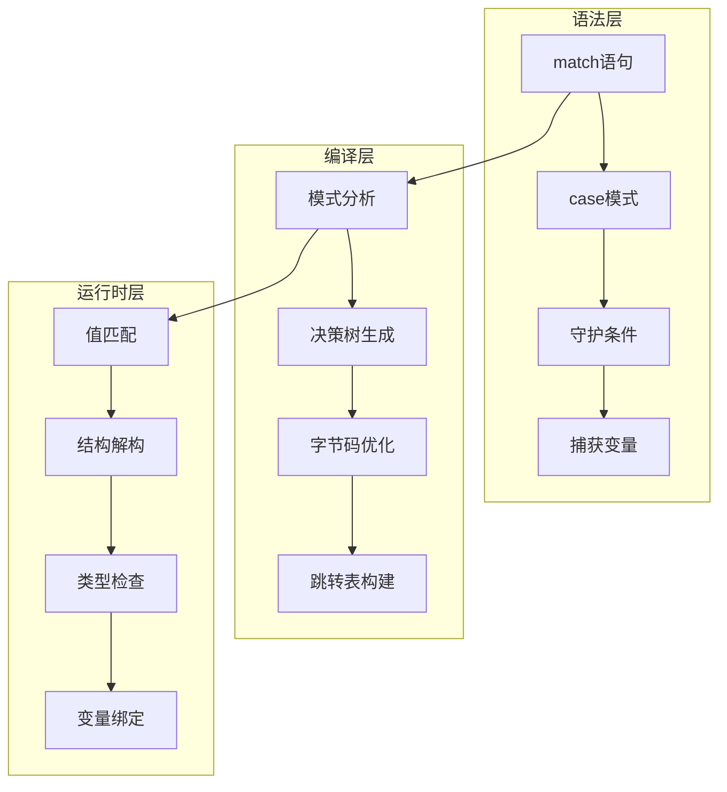
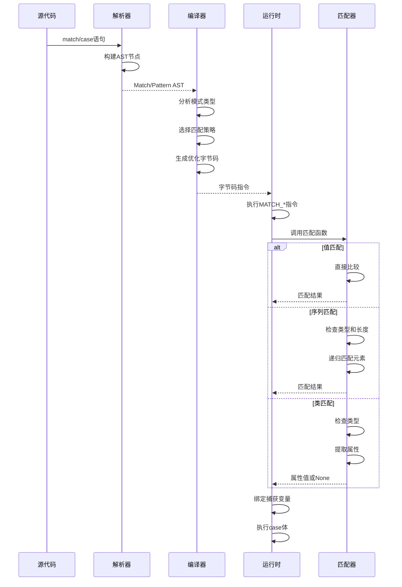

## 📋 概述

模式匹配是Python 3.10引入的重要特性，通过match/case语句提供了强大的结构化数据匹配能力。本文档将深入分析CPython中模式匹配的实现机制，包括语法解析、编译优化、模式类型、性能特征等。

## 🎯 模式匹配系统架构



## 1. 模式匹配语法与AST

### 1.1 AST节点定义

```c
/* Include/Python-ast.h - 模式匹配相关AST节点 */

typedef struct _stmt *stmt_ty;
typedef struct _expr *expr_ty;
typedef struct _pattern *pattern_ty;

/* Match语句 */
struct _stmt {
    enum _stmt_kind kind;
    union {
        struct {
            expr_ty subject;              /* 匹配的主题表达式 */
            asdl_match_case_seq *cases;   /* case子句序列 */
        } Match;
        /* 其他语句类型... */
    } v;
    int lineno, col_offset, end_lineno, end_col_offset;
};

/* match_case - case子句 */
typedef struct _match_case {
    pattern_ty pattern;         /* 模式 */
    expr_ty guard;             /* 守护条件（可选） */
    asdl_stmt_seq *body;       /* case体 */
} match_case_ty;

/* 模式类型枚举 */
typedef enum _pattern_kind {
    MatchValue_kind = 1,        /* 值模式：case 42 */
    MatchSingleton_kind,        /* 单例模式：case None */
    MatchSequence_kind,         /* 序列模式：case [x, y] */
    MatchMapping_kind,          /* 映射模式：case {"key": value} */
    MatchClass_kind,           /* 类模式：case Point(x, y) */
    MatchStar_kind,            /* 星号模式：case [x, *rest] */
    MatchAs_kind,              /* as模式：case x as y */
    MatchOr_kind               /* 或模式：case x | y */
} pattern_kind;

/* 模式结构体 */
struct _pattern {
    pattern_kind kind;
    union {
        /* MatchValue - 值模式 */
        struct {
            expr_ty value;      /* 要匹配的值 */
        } MatchValue;

        /* MatchSingleton - 单例模式 */
        struct {
            constant value;     /* None, True, False */
        } MatchSingleton;

        /* MatchSequence - 序列模式 */
        struct {
            asdl_pattern_seq *patterns;  /* 子模式序列 */
        } MatchSequence;

        /* MatchMapping - 映射模式 */
        struct {
            asdl_expr_seq *keys;         /* 键列表 */
            asdl_pattern_seq *patterns;  /* 对应的模式 */
            identifier rest;             /* 剩余项捕获变量 */
        } MatchMapping;

        /* MatchClass - 类模式 */
        struct {
            expr_ty cls;                 /* 类表达式 */
            asdl_pattern_seq *patterns;  /* 位置模式 */
            asdl_identifier_seq *kwd_attrs;   /* 关键字属性 */
            asdl_pattern_seq *kwd_patterns;   /* 关键字模式 */
        } MatchClass;

        /* MatchStar - 星号模式 */
        struct {
            identifier name;    /* 捕获变量名（可选） */
        } MatchStar;

        /* MatchAs - as模式 */
        struct {
            pattern_ty pattern; /* 子模式（可选） */
            identifier name;    /* 绑定变量名 */
        } MatchAs;

        /* MatchOr - 或模式 */
        struct {
            asdl_pattern_seq *patterns;  /* 选择的模式 */
        } MatchOr;
    } v;
    int lineno, col_offset, end_lineno, end_col_offset;
};
```

### 1.2 模式匹配语法解析

```c
/* Parser/parser.c - 模式匹配语法解析 */

/* match_stmt: 'match' subject_expr ':' NEWLINE INDENT case_block+ DEDENT */
static stmt_ty
match_stmt_rule(Parser *p)
{
    if (p->level++ == MAXSTACK) {
        p->error_indicator = 1;
        PyErr_SetString(PyExc_MemoryError, "too much recursion");
        return NULL;
    }

    stmt_ty result = NULL;
    int mark = p->mark;

    /* 解析 'match' 关键字 */
    if (p->mark == p->fill && _PyPegen_fill_token(p) < 0) {
        p->error_indicator = 1;
        goto done;
    }

    Token *keyword = _PyPegen_expect_token(p, NAME);
    if (!keyword || !_PyPegen_lookahead_with_name(1, "match", p)) {
        goto done;
    }

    /* 解析主题表达式 */
    expr_ty subject;
    if (!(subject = subject_expr_rule(p))) {
        goto done;
    }

    /* 解析 ':' */
    if (!_PyPegen_expect_token(p, COLON)) {
        goto done;
    }

    /* 解析 NEWLINE INDENT */
    if (!_PyPegen_expect_token(p, NEWLINE)) {
        goto done;
    }
    if (!_PyPegen_expect_token(p, INDENT)) {
        goto done;
    }

    /* 解析case子句 */
    asdl_match_case_seq *cases;
    if (!(cases = _PyPegen_collect_one_plus(p, case_block_rule))) {
        goto done;
    }

    /* 解析 DEDENT */
    if (!_PyPegen_expect_token(p, DEDENT)) {
        goto done;
    }

    /* 创建Match AST节点 */
    result = _PyAST_Match(subject, cases, EXTRA);

done:
    p->level--;
    return result;
}

/* case_block: 'case' patterns [guard] ':' block */
static match_case_ty
case_block_rule(Parser *p)
{
    match_case_ty result = NULL;
    int mark = p->mark;

    /* 解析 'case' 关键字 */
    if (!_PyPegen_expect_soft_keyword(p, "case")) {
        goto done;
    }

    /* 解析模式 */
    pattern_ty pattern;
    if (!(pattern = patterns_rule(p))) {
        goto done;
    }

    /* 解析可选的守护条件 */
    expr_ty guard = NULL;
    if (_PyPegen_lookahead_with_name(1, "if", p)) {
        if (!_PyPegen_expect_soft_keyword(p, "if")) {
            goto done;
        }
        if (!(guard = named_expression_rule(p))) {
            goto done;
        }
    }

    /* 解析 ':' */
    if (!_PyPegen_expect_token(p, COLON)) {
        goto done;
    }

    /* 解析代码块 */
    asdl_stmt_seq *body;
    if (!(body = block_rule(p))) {
        goto done;
    }

    /* 创建match_case节点 */
    result = _PyAST_match_case(pattern, guard, body, p->arena);

done:
    return result;
}
```

## 2. 模式编译与优化

### 2.1 模式匹配编译策略

```c
/* Python/codegen.c - match语句编译 */

static int
codegen_match(compiler *c, stmt_ty s)
{
    /* match语句编译主函数 */

    location loc = LOC(s);

    /* 编译主题表达式 */
    VISIT(c, expr, s->v.Match.subject);

    /* 为模式匹配创建决策树 */
    match_context ctx;
    ctx.subject = s->v.Match.subject;
    ctx.cases = s->v.Match.cases;
    ctx.fail_label = NULL;

    /* 生成高效的匹配代码 */
    RETURN_IF_ERROR(codegen_match_inner(c, &ctx));

    return SUCCESS;
}

static int
codegen_match_inner(compiler *c, match_context *ctx)
{
    Py_ssize_t cases_count = asdl_seq_LEN(ctx->cases);

    /* 为每个case创建标签 */
    NEW_JUMP_TARGET_LABEL(c, end);
    jump_target_label *case_labels = PyMem_Calloc(cases_count, sizeof(jump_target_label));
    if (!case_labels) {
        return ERROR;
    }

    for (Py_ssize_t i = 0; i < cases_count; i++) {
        NEW_JUMP_TARGET_LABEL(c, case_labels[i]);
    }

    /* 优化：分析模式类型并选择最佳匹配策略 */
    match_strategy strategy = analyze_match_patterns(ctx->cases);

    switch (strategy) {
    case STRATEGY_VALUE_SWITCH:
        /* 值匹配优化：生成跳转表 */
        RETURN_IF_ERROR(codegen_value_switch(c, ctx, case_labels));
        break;

    case STRATEGY_TYPE_DISPATCH:
        /* 类型分发优化 */
        RETURN_IF_ERROR(codegen_type_dispatch(c, ctx, case_labels));
        break;

    case STRATEGY_SEQUENTIAL:
    default:
        /* 顺序匹配：通用策略 */
        RETURN_IF_ERROR(codegen_sequential_match(c, ctx, case_labels));
        break;
    }

    /* 生成case体代码 */
    for (Py_ssize_t i = 0; i < cases_count; i++) {
        match_case_ty case_node = asdl_seq_GET(ctx->cases, i);

        USE_LABEL(c, case_labels[i]);

        /* 绑定模式变量 */
        RETURN_IF_ERROR(codegen_pattern_bindings(c, case_node->pattern));

        /* 生成case体 */
        VISIT_SEQ(c, stmt, case_node->body);

        /* 跳到match结束 */
        ADDOP_JUMP(c, LOC(case_node->pattern), JUMP, end);
    }

    USE_LABEL(c, end);
    PyMem_Free(case_labels);

    return SUCCESS;
}
```

### 2.2 值匹配优化（跳转表）

```c
/* Python/codegen.c - 值匹配优化 */

static int
codegen_value_switch(compiler *c, match_context *ctx, jump_target_label *case_labels)
{
    /* 为常量值创建高效的跳转表 */

    location loc = LOC(ctx->subject);
    Py_ssize_t cases_count = asdl_seq_LEN(ctx->cases);

    /* 收集所有常量值 */
    PyObject *values = PyTuple_New(cases_count);
    if (!values) {
        return ERROR;
    }

    for (Py_ssize_t i = 0; i < cases_count; i++) {
        match_case_ty case_node = asdl_seq_GET(ctx->cases, i);

        if (case_node->pattern->kind == MatchValue_kind) {
            /* 提取常量值 */
            PyObject *value = extract_constant_value(case_node->pattern->v.MatchValue.value);
            if (value) {
                Py_INCREF(value);
                PyTuple_SET_ITEM(values, i, value);
            } else {
                /* 非常量值，退回到顺序匹配 */
                Py_DECREF(values);
                return codegen_sequential_match(c, ctx, case_labels);
            }
        }
    }

    /* 生成MATCH_KEYS指令 */
    ADDOP_LOAD_CONST(c, loc, values);
    ADDOP_I(c, loc, MATCH_KEYS, cases_count);

    /* 生成条件跳转 */
    for (Py_ssize_t i = 0; i < cases_count; i++) {
        ADDOP_I(c, loc, DUP_TOP, 0);
        ADDOP_LOAD_CONST_NEW(c, loc, PyLong_FromSsize_t(i));
        ADDOP_I(c, loc, COMPARE_OP, Py_EQ);
        ADDOP_JUMP(c, loc, POP_JUMP_IF_TRUE, case_labels[i]);
    }

    /* 清理栈 */
    ADDOP(c, loc, POP_TOP);

    Py_DECREF(values);
    return SUCCESS;
}
```

### 2.3 序列模式编译

```c
/* Python/codegen.c - 序列模式编译 */

static int
codegen_sequence_pattern(compiler *c, pattern_ty pattern)
{
    location loc = LOC(pattern);
    asdl_pattern_seq *patterns = pattern->v.MatchSequence.patterns;
    Py_ssize_t size = asdl_seq_LEN(patterns);

    /* 检查序列类型和长度 */
    ADDOP(c, loc, DUP_TOP);
    ADDOP_I(c, loc, MATCH_SEQUENCE, 0);

    NEW_JUMP_TARGET_LABEL(c, fail);
    ADDOP_JUMP(c, loc, POP_JUMP_IF_FALSE, fail);

    /* 检查长度 */
    ADDOP(c, loc, DUP_TOP);
    ADDOP(c, loc, GET_LEN);
    ADDOP_LOAD_CONST_NEW(c, loc, PyLong_FromSsize_t(size));
    ADDOP_I(c, loc, COMPARE_OP, Py_EQ);
    ADDOP_JUMP(c, loc, POP_JUMP_IF_FALSE, fail);

    /* 匹配序列元素 */
    for (Py_ssize_t i = 0; i < size; i++) {
        pattern_ty subpattern = asdl_seq_GET(patterns, i);

        if (subpattern->kind == MatchStar_kind) {
            /* 处理星号模式 */
            RETURN_IF_ERROR(codegen_star_pattern(c, subpattern, i, size));
        } else {
            /* 普通元素模式 */
            ADDOP(c, loc, DUP_TOP);
            ADDOP_LOAD_CONST_NEW(c, loc, PyLong_FromSsize_t(i));
            ADDOP_I(c, loc, BINARY_SUBSCR, 0);

            /* 递归匹配子模式 */
            RETURN_IF_ERROR(codegen_pattern(c, subpattern));
            ADDOP_JUMP(c, loc, POP_JUMP_IF_FALSE, fail);
        }
    }

    /* 匹配成功 */
    ADDOP(c, loc, POP_TOP);  /* 清理主题 */

    NEW_JUMP_TARGET_LABEL(c, end);
    ADDOP_JUMP(c, loc, JUMP, end);

    /* 匹配失败 */
    USE_LABEL(c, fail);
    ADDOP(c, loc, POP_TOP);  /* 清理主题 */
    ADDOP_LOAD_CONST(c, loc, Py_False);

    USE_LABEL(c, end);
    return SUCCESS;
}
```

## 3. 模式匹配字节码指令

### 3.1 专用字节码指令

```c
/* Python/ceval.c - 模式匹配字节码执行 */

case TARGET(MATCH_SEQUENCE): {
    /* 检查对象是否为序列 */
    PyObject *subject = TOP();
    int result = PySequence_Check(subject) && !PyUnicode_Check(subject) && !PyBytes_Check(subject);
    PyObject *res = result ? Py_True : Py_False;
    Py_INCREF(res);
    PUSH(res);
    DISPATCH();
}

case TARGET(MATCH_MAPPING): {
    /* 检查对象是否为映射 */
    PyObject *subject = TOP();
    int result = PyMapping_Check(subject);
    PyObject *res = result ? Py_True : Py_False;
    Py_INCREF(res);
    PUSH(res);
    DISPATCH();
}

case TARGET(MATCH_CLASS): {
    /* 类模式匹配 */
    PyObject *names = POP();
    PyObject *type = POP();
    PyObject *subject = TOP();

    PyObject *result = match_class(subject, type, oparg, names);
    if (result == NULL) {
        goto error;
    }

    PUSH(result);
    DISPATCH();
}

case TARGET(MATCH_KEYS): {
    /* 映射键匹配 */
    PyObject *keys = POP();
    PyObject *subject = TOP();

    if (!PyMapping_Check(subject)) {
        PUSH(Py_None);
        DISPATCH();
    }

    PyObject *values_or_none = match_keys(subject, keys);
    if (values_or_none == NULL) {
        goto error;
    }

    PUSH(values_or_none);
    DISPATCH();
}

/* 辅助函数实现 */
static PyObject *
match_class(PyObject *subject, PyObject *type, Py_ssize_t nargs, PyObject *kwargs)
{
    /* 实现类模式匹配逻辑 */

    /* 检查类型 */
    if (!PyType_Check(type)) {
        PyErr_SetString(PyExc_TypeError, "match_class expected a type");
        return NULL;
    }

    /* 检查实例 */
    int isinstance_result = PyObject_IsInstance(subject, type);
    if (isinstance_result < 0) {
        return NULL;
    }
    if (!isinstance_result) {
        Py_RETURN_NONE;  /* 类型不匹配 */
    }

    /* 提取属性值 */
    PyObject *attrs = PyTuple_New(nargs);
    if (!attrs) {
        return NULL;
    }

    for (Py_ssize_t i = 0; i < nargs; i++) {
        PyObject *name = PyTuple_GET_ITEM(kwargs, i);
        PyObject *value = PyObject_GetAttr(subject, name);
        if (!value) {
            Py_DECREF(attrs);
            return NULL;
        }
        PyTuple_SET_ITEM(attrs, i, value);
    }

    return attrs;
}

static PyObject *
match_keys(PyObject *map, PyObject *keys)
{
    /* 实现映射键匹配 */

    if (!PyMapping_Check(map)) {
        Py_RETURN_NONE;
    }

    Py_ssize_t nkeys = PyTuple_GET_SIZE(keys);
    PyObject *values = PyTuple_New(nkeys);
    if (!values) {
        return NULL;
    }

    for (Py_ssize_t i = 0; i < nkeys; i++) {
        PyObject *key = PyTuple_GET_ITEM(keys, i);
        PyObject *value = PyObject_GetItem(map, key);
        if (!value) {
            if (PyErr_ExceptionMatches(PyExc_KeyError)) {
                PyErr_Clear();
                Py_DECREF(values);
                Py_RETURN_NONE;  /* 键不存在 */
            }
            Py_DECREF(values);
            return NULL;  /* 其他错误 */
        }
        PyTuple_SET_ITEM(values, i, value);
    }

    return values;
}
```

## 4. 完整的模式匹配示例

### 4.1 基础模式匹配

```python
# 基础模式匹配示例
def basic_pattern_matching():
    """基础模式匹配演示"""

    def process_data(data):
        match data:
            # 值模式
            case 0:
                return "零"
            case 1:
                return "一"

            # 序列模式
            case []:
                return "空列表"
            case [x]:
                return f"单元素列表: {x}"
            case [x, y]:
                return f"双元素列表: {x}, {y}"
            case [first, *rest]:
                return f"列表开头: {first}, 剩余: {rest}"

            # 映射模式
            case {}:
                return "空字典"
            case {"name": name}:
                return f"有名字的字典: {name}"
            case {"x": x, "y": y}:
                return f"坐标字典: ({x}, {y})"

            # 类模式
            case int() if data > 100:
                return f"大整数: {data}"
            case str() if len(data) > 10:
                return f"长字符串: {data[:10]}..."

            # 通配符模式
            case _:
                return f"其他类型: {type(data).__name__}"

    # 测试各种模式
    test_cases = [
        0, 1, 42,
        [], [10], [1, 2], [1, 2, 3, 4],
        {}, {"name": "Alice"}, {"x": 10, "y": 20},
        150, "Hello, World!",
        (1, 2, 3), set([1, 2, 3])
    ]

    print("基础模式匹配测试:")
    for case in test_cases:
        result = process_data(case)
        print(f"  {case!r} -> {result}")

basic_pattern_matching()
```

### 4.2 高级模式匹配

```python
# 高级模式匹配示例
from dataclasses import dataclass
from typing import Union
import json

@dataclass
class Point:
    x: int
    y: int

@dataclass
class Circle:
    center: Point
    radius: int

@dataclass
class Rectangle:
    top_left: Point
    bottom_right: Point

def advanced_pattern_matching():
    """高级模式匹配演示"""

    def analyze_shape(shape):
        """分析几何形状"""
        match shape:
            # 类模式匹配
            case Point(x=0, y=0):
                return "原点"
            case Point(x=0, y=y):
                return f"Y轴上的点: (0, {y})"
            case Point(x=x, y=0):
                return f"X轴上的点: ({x}, 0)"
            case Point(x=x, y=y) if x == y:
                return f"对角线上的点: ({x}, {y})"
            case Point(x=x, y=y):
                return f"一般点: ({x}, {y})"

            # 嵌套类模式
            case Circle(center=Point(x=0, y=0), radius=r):
                return f"以原点为圆心的圆，半径: {r}"
            case Circle(center=center, radius=r) if r > 10:
                return f"大圆: 圆心{center}, 半径{r}"
            case Circle(center=center, radius=r):
                return f"小圆: 圆心{center}, 半径{r}"

            # 复杂类模式
            case Rectangle(top_left=Point(x=x1, y=y1),
                         bottom_right=Point(x=x2, y=y2)) if x2-x1 == y2-y1:
                return f"正方形: 边长{x2-x1}"
            case Rectangle(top_left=tl, bottom_right=br):
                return f"矩形: 左上角{tl}, 右下角{br}"

            case _:
                return f"未知形状: {type(shape).__name__}"

    def process_json_data(data):
        """处理JSON数据"""
        match data:
            # API响应模式
            case {"status": "success", "data": result}:
                return f"成功: {result}"
            case {"status": "error", "message": msg, "code": code}:
                return f"错误 {code}: {msg}"
            case {"status": "error", "message": msg}:
                return f"错误: {msg}"

            # 用户数据模式
            case {"type": "user", "id": user_id, "profile": {"name": name, "age": age}}:
                return f"用户 {name} (ID: {user_id}, 年龄: {age})"
            case {"type": "user", "id": user_id, **other_data}:
                return f"用户 ID {user_id}, 其他数据: {other_data}"

            # 列表处理模式
            case {"items": []}:
                return "空项目列表"
            case {"items": [item]} if isinstance(item, dict):
                return f"单个项目: {item}"
            case {"items": [first, *rest]} if len(rest) > 0:
                return f"多个项目: 首项 {first}, 其余 {len(rest)} 项"

            # 嵌套结构模式
            case {"config": {"database": {"host": host, "port": port}}}:
                return f"数据库配置: {host}:{port}"
            case {"config": config_dict}:
                return f"配置信息: {list(config_dict.keys())}"

            case _:
                return f"未识别的数据格式"

    def parse_command(command):
        """解析命令行命令"""
        parts = command.split()

        match parts:
            # 系统命令
            case ["exit"] | ["quit"]:
                return "退出程序"
            case ["help"] | ["?"]:
                return "显示帮助"
            case ["clear"] | ["cls"]:
                return "清屏"

            # 文件操作
            case ["ls"] | ["dir"]:
                return "列出文件"
            case ["ls", path] | ["dir", path]:
                return f"列出 {path} 中的文件"
            case ["cat", filename] | ["type", filename]:
                return f"显示文件内容: {filename}"
            case ["rm", filename] | ["del", filename]:
                return f"删除文件: {filename}"

            # Git命令
            case ["git", "status"]:
                return "显示Git状态"
            case ["git", "add", file]:
                return f"添加文件到Git: {file}"
            case ["git", "commit", "-m", message]:
                return f"提交更改: {message}"
            case ["git", "push", remote, branch]:
                return f"推送到 {remote}/{branch}"
            case ["git", subcommand, *args]:
                return f"Git {subcommand} 命令，参数: {args}"

            # 复杂命令
            case ["python", script, *args] if script.endswith('.py'):
                return f"运行Python脚本: {script}，参数: {args}"
            case ["pip", "install", *packages]:
                return f"安装Python包: {packages}"

            case _:
                return f"未知命令: {' '.join(parts)}"

    # 测试几何形状分析
    shapes = [
        Point(0, 0),
        Point(0, 5),
        Point(3, 0),
        Point(4, 4),
        Point(3, 7),
        Circle(Point(0, 0), 5),
        Circle(Point(2, 3), 15),
        Circle(Point(1, 1), 3),
        Rectangle(Point(0, 0), Point(5, 5)),
        Rectangle(Point(1, 1), Point(4, 6))
    ]

    print("\n几何形状分析:")
    for shape in shapes:
        result = analyze_shape(shape)
        print(f"  {shape} -> {result}")

    # 测试JSON数据处理
    json_data = [
        {"status": "success", "data": {"id": 123, "name": "Test"}},
        {"status": "error", "message": "Not found", "code": 404},
        {"status": "error", "message": "Server error"},
        {"type": "user", "id": 1, "profile": {"name": "Alice", "age": 25}},
        {"type": "user", "id": 2, "email": "bob@example.com"},
        {"items": []},
        {"items": [{"id": 1, "name": "item1"}]},
        {"items": [{"id": 1}, {"id": 2}, {"id": 3}]},
        {"config": {"database": {"host": "localhost", "port": 5432}}},
        {"config": {"app": {"name": "MyApp", "version": "1.0"}}}
    ]

    print("\nJSON数据处理:")
    for data in json_data:
        result = process_json_data(data)
        print(f"  {data} -> {result}")

    # 测试命令解析
    commands = [
        "exit", "help", "clear",
        "ls", "ls /home", "cat readme.txt",
        "git status", "git add file.py", "git commit -m 'Fix bug'",
        "git push origin main",
        "python script.py arg1 arg2", "pip install requests numpy",
        "unknown command with args"
    ]

    print("\n命令解析:")
    for cmd in commands:
        result = parse_command(cmd)
        print(f"  '{cmd}' -> {result}")

advanced_pattern_matching()
```

### 4.3 性能优化模式

```python
# 模式匹配性能优化示例
import time
import random
from enum import Enum

class TokenType(Enum):
    NUMBER = "NUMBER"
    STRING = "STRING"
    IDENTIFIER = "IDENTIFIER"
    OPERATOR = "OPERATOR"
    KEYWORD = "KEYWORD"

@dataclass
class Token:
    type: TokenType
    value: str
    line: int = 0
    column: int = 0

def performance_optimized_matching():
    """性能优化的模式匹配"""

    # 优化1: 使用早期退出减少比较
    def optimize_early_exit(value):
        """早期退出优化"""
        match value:
            case x if x < 0:           # 快速路径：负数
                return "negative"
            case 0:                    # 快速路径：零
                return "zero"
            case x if x > 1000:        # 快速路径：大数
                return "large"
            case x if 1 <= x <= 10:    # 中等开销：小范围
                return "small"
            case _:                    # 默认路径
                return "medium"

    # 优化2: 使用类型检查减少模式复杂度
    def optimize_type_dispatch(obj):
        """类型分发优化"""
        match obj:
            case int():
                return f"整数: {obj}"
            case str():
                return f"字符串: {obj[:20]}..."
            case list():
                return f"列表长度: {len(obj)}"
            case dict():
                return f"字典键数: {len(obj)}"
            case _:
                return f"其他类型: {type(obj).__name__}"

    # 优化3: 避免复杂的嵌套模式
    def optimize_simple_patterns(token):
        """简化模式以提高性能"""
        # 好的做法：简单的顶层模式
        match token.type:
            case TokenType.NUMBER:
                return f"数字: {token.value}"
            case TokenType.STRING:
                return f"字符串: {token.value}"
            case TokenType.IDENTIFIER:
                return f"标识符: {token.value}"
            case _:
                return f"其他: {token.type}"

    # 性能测试
    def benchmark_pattern_matching():
        """模式匹配性能基准测试"""

        # 生成测试数据
        test_values = []
        for _ in range(10000):
            choice = random.randint(1, 5)
            if choice == 1:
                test_values.append(random.randint(-100, 1500))
            elif choice == 2:
                test_values.append(random.choice(["hello", "world", "test"]))
            elif choice == 3:
                test_values.append([random.randint(1, 10) for _ in range(random.randint(1, 5))])
            elif choice == 4:
                test_values.append({f"key{i}": i for i in range(random.randint(1, 5))})
            else:
                test_values.append(Token(random.choice(list(TokenType)), f"value{random.randint(1, 100)}"))

        # 测试早期退出优化
        start = time.time()
        for value in test_values:
            if isinstance(value, int):
                optimize_early_exit(value)
        early_exit_time = time.time() - start

        # 测试类型分发
        start = time.time()
        for value in test_values:
            optimize_type_dispatch(value)
        type_dispatch_time = time.time() - start

        # 测试简单模式
        start = time.time()
        for value in test_values:
            if isinstance(value, Token):
                optimize_simple_patterns(value)
        simple_patterns_time = time.time() - start

        print(f"\n性能基准测试结果 (10000次操作):")
        print(f"早期退出优化: {early_exit_time:.4f} 秒")
        print(f"类型分发优化: {type_dispatch_time:.4f} 秒")
        print(f"简单模式优化: {simple_patterns_time:.4f} 秒")

        # 对比传统if-elif方法
        def traditional_dispatch(obj):
            if isinstance(obj, int):
                return f"整数: {obj}"
            elif isinstance(obj, str):
                return f"字符串: {obj[:20]}..."
            elif isinstance(obj, list):
                return f"列表长度: {len(obj)}"
            elif isinstance(obj, dict):
                return f"字典键数: {len(obj)}"
            else:
                return f"其他类型: {type(obj).__name__}"

        start = time.time()
        for value in test_values:
            traditional_dispatch(value)
        traditional_time = time.time() - start

        print(f"传统if-elif方法: {traditional_time:.4f} 秒")
        print(f"模式匹配相对性能: {type_dispatch_time/traditional_time:.2f}x")

    # 运行性能测试
    benchmark_pattern_matching()

    # 最佳实践示例
    def best_practices_example():
        """模式匹配最佳实践"""

        # 1. 将最常见的情况放在前面
        def process_http_status(status):
            match status:
                case 200:              # 最常见
                    return "成功"
                case 404:              # 次常见
                    return "未找到"
                case 500:              # 服务器错误
                    return "服务器错误"
                case status if 200 <= status < 300:  # 其他成功状态
                    return "成功响应"
                case status if 400 <= status < 500:  # 客户端错误
                    return "客户端错误"
                case status if 500 <= status < 600:  # 服务器错误
                    return "服务器错误"
                case _:
                    return "未知状态"

        # 2. 使用守护条件进行精确控制
        def categorize_temperature(temp):
            match temp:
                case t if t < -20:
                    return "极寒"
                case t if -20 <= t < 0:
                    return "寒冷"
                case t if 0 <= t < 15:
                    return "凉爽"
                case t if 15 <= t < 25:
                    return "舒适"
                case t if 25 <= t < 35:
                    return "温暖"
                case t if t >= 35:
                    return "炎热"

        # 3. 合理使用或模式
        def is_weekend_or_holiday(day):
            match day:
                case "Saturday" | "Sunday":
                    return True
                case "Christmas" | "New Year" | "Independence Day":
                    return True
                case _:
                    return False

        # 测试最佳实践
        print("\n最佳实践示例:")

        statuses = [200, 404, 500, 201, 401, 503, 999]
        for status in statuses:
            print(f"  HTTP {status}: {process_http_status(status)}")

        temperatures = [-25, -10, 5, 20, 30, 40]
        for temp in temperatures:
            print(f"  {temp}°C: {categorize_temperature(temp)}")

        days = ["Monday", "Saturday", "Christmas", "Tuesday"]
        for day in days:
            print(f"  {day}: {'休息日' if is_weekend_or_holiday(day) else '工作日'}")

    best_practices_example()

performance_optimized_matching()
```

## 5. 模式匹配时序图



## 6. 总结

Python的模式匹配系统展现了现代编程语言的强大表达力：

### 6.1 核心优势

1. **表达力强**: 声明式的模式描述替代复杂的条件逻辑
2. **类型安全**: 编译时的模式分析和优化
3. **性能优化**: 智能的匹配策略选择和字节码优化
4. **可扩展性**: 支持自定义类的模式匹配

### 6.2 最佳实践

1. **模式顺序**: 将最常见的模式放在前面
2. **守护条件**: 使用if子句进行精确控制
3. **避免复杂嵌套**: 保持模式的简洁性
4. **性能考虑**: 在性能敏感场景中谨慎使用

### 6.3 应用场景

- **数据解析**: JSON、XML等结构化数据处理
- **状态机**: 复杂状态转换逻辑
- **编译器**: 语法树遍历和处理
- **API处理**: 不同类型请求的分发处理

模式匹配作为Python 3.10+的重要特性，为复杂数据处理和控制流提供了优雅而高效的解决方案。
