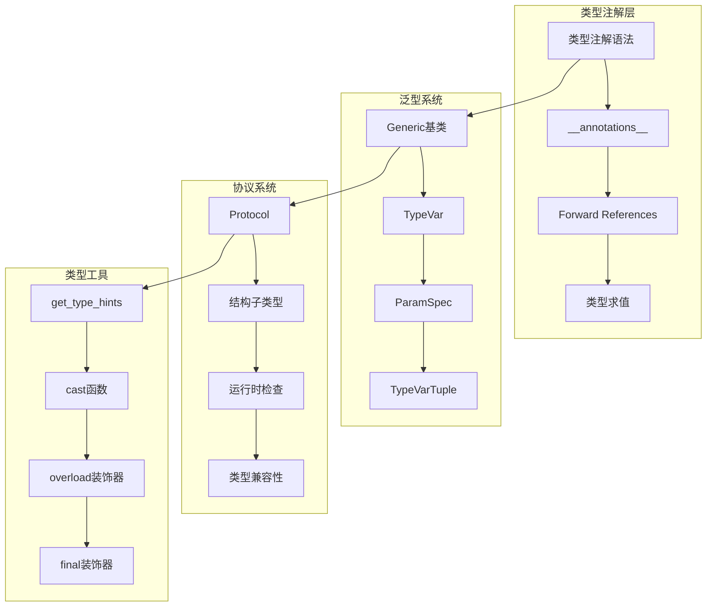
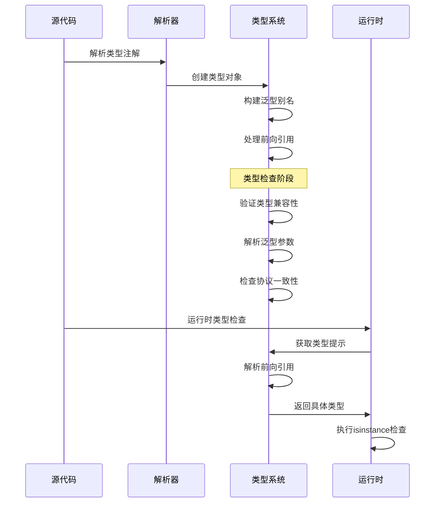

## 📋 概述

Python的类型系统是一个渐进式类型检查系统，通过类型注解、泛型、协议等机制提供类型安全保障。本文档将深入分析CPython中类型系统的实现机制，包括类型注解处理、泛型系统、类型变量、协议检查等核心功能。

## 🎯 类型系统架构



## 1. 类型注解系统实现

### 1.1 类型注解存储机制

```c
/* Objects/typeobject.c - 类型注解存储 */

/* 获取对象的注解字典 */
PyObject *
PyObject_GetAnnotations(PyObject *obj)
{
    PyObject *annotations = NULL;

    /* 检查对象类型 */
    if (PyType_Check(obj)) {
        /* 类型对象的注解 */
        PyTypeObject *type = (PyTypeObject *)obj;
        annotations = PyDict_GetItem(type->tp_dict, &_Py_ID(__annotations__));

        if (annotations == NULL) {
            /* 创建新的注解字典 */
            annotations = PyDict_New();
            if (annotations == NULL) {
                return NULL;
            }

            /* 设置到类型字典中 */
            if (PyDict_SetItem(type->tp_dict, &_Py_ID(__annotations__), annotations) < 0) {
                Py_DECREF(annotations);
                return NULL;
            }
        }

        Py_INCREF(annotations);
        return annotations;

    } else if (PyFunction_Check(obj)) {
        /* 函数对象的注解 */
        PyFunctionObject *func = (PyFunctionObject *)obj;

        if (func->func_annotations == NULL) {
            func->func_annotations = PyDict_New();
            if (func->func_annotations == NULL) {
                return NULL;
            }
        }

        Py_INCREF(func->func_annotations);
        return func->func_annotations;

    } else if (PyModule_Check(obj)) {
        /* 模块对象的注解 */
        PyObject *module_dict = PyModule_GetDict(obj);
        annotations = PyDict_GetItem(module_dict, &_Py_ID(__annotations__));

        if (annotations == NULL) {
            annotations = PyDict_New();
            if (annotations == NULL) {
                return NULL;
            }

            if (PyDict_SetItem(module_dict, &_Py_ID(__annotations__), annotations) < 0) {
                Py_DECREF(annotations);
                return NULL;
            }
        }

        Py_INCREF(annotations);
        return annotations;
    }

    /* 不支持的对象类型 */
    PyErr_Format(PyExc_TypeError,
                 "object %R has no annotations",
                 obj);
    return NULL;
}

/* 设置对象的注解 */
int
PyObject_SetAnnotations(PyObject *obj, PyObject *annotations)
{
    if (annotations == NULL) {
        PyErr_SetString(PyExc_TypeError, "annotations cannot be None");
        return -1;
    }

    if (!PyDict_Check(annotations)) {
        PyErr_SetString(PyExc_TypeError, "annotations must be a dict");
        return -1;
    }

    if (PyType_Check(obj)) {
        /* 设置类型注解 */
        PyTypeObject *type = (PyTypeObject *)obj;
        return PyDict_SetItem(type->tp_dict, &_Py_ID(__annotations__), annotations);

    } else if (PyFunction_Check(obj)) {
        /* 设置函数注解 */
        PyFunctionObject *func = (PyFunctionObject *)obj;
        Py_INCREF(annotations);
        Py_XSETREF(func->func_annotations, annotations);
        return 0;

    } else if (PyModule_Check(obj)) {
        /* 设置模块注解 */
        PyObject *module_dict = PyModule_GetDict(obj);
        return PyDict_SetItem(module_dict, &_Py_ID(__annotations__), annotations);
    }

    PyErr_Format(PyExc_TypeError,
                 "cannot set annotations on object %R",
                 obj);
    return -1;
}
```

### 1.2 前向引用处理

```python
# 前向引用实现分析
from typing import ForwardRef, get_type_hints
import sys
from types import ModuleType

class ForwardRefHandler:
    """前向引用处理器"""

    def __init__(self):
        self.cache = {}
        self.resolving = set()  # 防止循环引用

    def resolve_forward_ref(self, forward_ref: ForwardRef, globalns: dict, localns: dict):
        """解析前向引用"""

        # 创建缓存键
        cache_key = (forward_ref.__forward_arg__, id(globalns), id(localns))

        # 检查缓存
        if cache_key in self.cache:
            return self.cache[cache_key]

        # 检查循环引用
        if cache_key in self.resolving:
            raise RecursionError(f"Circular reference in forward reference: {forward_ref}")

        try:
            self.resolving.add(cache_key)

            # 解析引用
            try:
                result = eval(forward_ref.__forward_arg__, globalns, localns)
                self.cache[cache_key] = result
                return result

            except NameError as e:
                # 名称未定义，保持为前向引用
                return forward_ref

            except Exception as e:
                # 其他错误，抛出异常
                raise TypeError(f"Cannot resolve forward reference {forward_ref}: {e}")

        finally:
            self.resolving.discard(cache_key)

def demonstrate_forward_references():
    """演示前向引用的使用"""

    print("=== 前向引用示例 ===")

    # 1. 类中的自引用
    class Node:
        def __init__(self, value: int, next_node: 'Node' = None):
            self.value = value
            self.next = next_node

        def add_next(self, value: int) -> 'Node':
            self.next = Node(value)
            return self.next

    # 获取类型提示
    hints = get_type_hints(Node.__init__)
    print(f"Node.__init__ 类型提示: {hints}")

    hints = get_type_hints(Node.add_next)
    print(f"Node.add_next 类型提示: {hints}")

    # 2. 模块级前向引用
    def create_tree() -> 'TreeNode':
        return TreeNode("root")

    class TreeNode:
        def __init__(self, name: str):
            self.name = name
            self.children: list['TreeNode'] = []

        def add_child(self, name: str) -> 'TreeNode':
            child = TreeNode(name)
            self.children.append(child)
            return child

    # 解析前向引用
    hints = get_type_hints(create_tree)
    print(f"create_tree 类型提示: {hints}")

    # 3. 复杂的前向引用场景
    from typing import Dict, List, Optional, Union

    def process_graph(graph: 'Dict[str, List[GraphNode]]') -> 'Optional[GraphNode]':
        """处理图结构"""
        pass

    class GraphNode:
        def __init__(self, id: str):
            self.id = id
            self.edges: List['GraphNode'] = []

        def connect(self, other: 'GraphNode') -> None:
            self.edges.append(other)

    # 解析复杂前向引用
    hints = get_type_hints(process_graph)
    print(f"process_graph 类型提示: {hints}")

demonstrate_forward_references()
```

## 2. 泛型系统深度实现

### 2.1 Generic基类实现

```c
/* Modules/_typingmodule.c - Generic基类的C实现 */

typedef struct {
    PyObject_HEAD
    PyObject *origin;           /* 原始类型 */
    PyObject *args;             /* 类型参数 */
    PyObject *parameters;       /* 类型变量 */
    PyObject *origin_origin;    /* 嵌套的原始类型 */
} GenericAliasObject;

/* Generic别名对象的创建 */
static PyObject *
generic_alias_new(PyTypeObject *type, PyObject *args, PyObject *kwds)
{
    if (!_PyArg_NoKeywords("GenericAlias", kwds)) {
        return NULL;
    }

    if (!_PyArg_CheckPositional("GenericAlias", PyTuple_GET_SIZE(args), 2, 2)) {
        return NULL;
    }

    PyObject *origin = PyTuple_GET_ITEM(args, 0);
    PyObject *args_tuple = PyTuple_GET_ITEM(args, 1);

    /* 创建GenericAlias对象 */
    GenericAliasObject *alias = (GenericAliasObject *)type->tp_alloc(type, 0);
    if (alias == NULL) {
        return NULL;
    }

    /* 设置origin */
    Py_INCREF(origin);
    alias->origin = origin;

    /* 处理参数 */
    if (!PyTuple_Check(args_tuple)) {
        /* 单个参数，转换为元组 */
        PyObject *tuple = PyTuple_New(1);
        if (tuple == NULL) {
            Py_DECREF(alias);
            return NULL;
        }
        Py_INCREF(args_tuple);
        PyTuple_SET_ITEM(tuple, 0, args_tuple);
        alias->args = tuple;
    } else {
        /* 多个参数 */
        Py_INCREF(args_tuple);
        alias->args = args_tuple;
    }

    /* 提取类型参数 */
    alias->parameters = extract_type_parameters(alias->args);
    if (alias->parameters == NULL) {
        Py_DECREF(alias);
        return NULL;
    }

    /* 设置origin_origin */
    if (Py_TYPE(origin) == &Py_GenericAliasType) {
        GenericAliasObject *origin_alias = (GenericAliasObject *)origin;
        Py_INCREF(origin_alias->origin);
        alias->origin_origin = origin_alias->origin;
    } else {
        Py_INCREF(origin);
        alias->origin_origin = origin;
    }

    return (PyObject *)alias;
}

/* 提取类型参数 */
static PyObject *
extract_type_parameters(PyObject *args)
{
    PyObject *parameters = PySet_New(NULL);
    if (parameters == NULL) {
        return NULL;
    }

    /* 遍历参数，提取TypeVar */
    Py_ssize_t nargs = PyTuple_GET_SIZE(args);
    for (Py_ssize_t i = 0; i < nargs; i++) {
        PyObject *arg = PyTuple_GET_ITEM(args, i);

        if (collect_type_vars(arg, parameters) < 0) {
            Py_DECREF(parameters);
            return NULL;
        }
    }

    /* 转换为frozenset */
    PyObject *frozen_params = PyFrozenSet_New(parameters);
    Py_DECREF(parameters);
    return frozen_params;
}

/* 收集类型变量 */
static int
collect_type_vars(PyObject *obj, PyObject *type_vars)
{
    /* 检查是否为TypeVar */
    if (PyObject_HasAttr(obj, &_Py_ID(__name__)) &&
        PyObject_HasAttr(obj, &_Py_ID(__bound__))) {

        return PySet_Add(type_vars, obj);
    }

    /* 检查是否为Generic别名 */
    if (Py_TYPE(obj) == &Py_GenericAliasType) {
        GenericAliasObject *alias = (GenericAliasObject *)obj;

        Py_ssize_t nargs = PyTuple_GET_SIZE(alias->args);
        for (Py_ssize_t i = 0; i < nargs; i++) {
            PyObject *arg = PyTuple_GET_ITEM(alias->args, i);
            if (collect_type_vars(arg, type_vars) < 0) {
                return -1;
            }
        }
    }

    return 0;
}

/* Generic别名的下标操作 */
static PyObject *
generic_alias_getitem(GenericAliasObject *self, PyObject *item)
{
    /* 创建新的参数化类型 */
    PyObject *new_args;

    if (!PyTuple_Check(item)) {
        /* 单个参数 */
        new_args = PyTuple_New(1);
        if (new_args == NULL) {
            return NULL;
        }
        Py_INCREF(item);
        PyTuple_SET_ITEM(new_args, 0, item);
    } else {
        /* 多个参数 */
        Py_INCREF(item);
        new_args = item;
    }

    /* 创建新的GenericAlias */
    PyObject *new_alias = generic_alias_new(&Py_GenericAliasType,
                                           PyTuple_Pack(2, self->origin, new_args),
                                           NULL);

    Py_DECREF(new_args);
    return new_alias;
}
```

### 2.2 类型变量系统

```python
# 类型变量系统深度分析
from typing import TypeVar, Generic, ParamSpec, TypeVarTuple, get_args, get_origin
from typing_extensions import TypeVarTuple as TypeVarTuple_ext
import inspect
from types import GenericAlias

class TypeVariableAnalysis:
    """类型变量分析器"""

    def __init__(self):
        self.type_var_registry = {}
        self.constraints_cache = {}

    def analyze_typevar(self, tv: TypeVar):
        """分析TypeVar的属性和约束"""

        analysis = {
            'name': tv.__name__,
            'bound': tv.__bound__,
            'constraints': tv.__constraints__,
            'covariant': tv.__covariant__,
            'contravariant': tv.__contravariant__,
            'infer_variance': getattr(tv, '__infer_variance__', False)
        }

        # 检查约束一致性
        if analysis['bound'] is not None and analysis['constraints']:
            print(f"警告: TypeVar {tv.__name__} 同时有bound和constraints")

        # 检查变异性
        if analysis['covariant'] and analysis['contravariant']:
            print(f"错误: TypeVar {tv.__name__} 不能同时是协变和逆变")

        return analysis

    def demonstrate_type_variables(self):
        """演示各种类型变量的使用"""

        print("=== 类型变量系统分析 ===")

        # 1. 基础TypeVar
        T = TypeVar('T')
        print(f"基础TypeVar: {self.analyze_typevar(T)}")

        # 2. 带约束的TypeVar
        NumberT = TypeVar('NumberT', int, float, complex)
        print(f"约束TypeVar: {self.analyze_typevar(NumberT)}")

        # 3. 带边界的TypeVar
        from collections.abc import Sized
        SizedT = TypeVar('SizedT', bound=Sized)
        print(f"边界TypeVar: {self.analyze_typevar(SizedT)}")

        # 4. 协变和逆变TypeVar
        T_co = TypeVar('T_co', covariant=True)
        T_contra = TypeVar('T_contra', contravariant=True)

        print(f"协变TypeVar: {self.analyze_typevar(T_co)}")
        print(f"逆变TypeVar: {self.analyze_typevar(T_contra)}")

        # 5. ParamSpec - 函数签名参数
        from typing import Callable
        P = ParamSpec('P')

        def decorator(func: Callable[P, T]) -> Callable[P, T]:
            def wrapper(*args: P.args, **kwargs: P.kwargs) -> T:
                print(f"调用函数: {func.__name__}")
                return func(*args, **kwargs)
            return wrapper

        @decorator
        def greet(name: str, age: int = 25) -> str:
            return f"Hello {name}, age {age}"

        result = greet("Alice", 30)
        print(f"装饰器结果: {result}")

        # 6. TypeVarTuple - 可变长度类型参数
        try:
            Ts = TypeVarTuple('Ts')

            class Array(Generic[*Ts]):
                def __init__(self, *items: *Ts):
                    self.items = items

                def get_items(self) -> tuple[*Ts]:
                    return self.items

            # 使用TypeVarTuple
            arr = Array(1, "hello", 3.14)
            items = arr.get_items()
            print(f"TypeVarTuple示例: {type(items)} = {items}")

        except Exception as e:
            print(f"TypeVarTuple示例失败: {e}")

    def analyze_generic_class(self, cls):
        """分析泛型类的结构"""

        analysis = {
            'name': cls.__name__,
            'origin': get_origin(cls),
            'args': get_args(cls),
            'parameters': getattr(cls, '__parameters__', ()),
            'mro': cls.__mro__ if hasattr(cls, '__mro__') else None
        }

        # 分析类型参数
        if hasattr(cls, '__orig_bases__'):
            analysis['orig_bases'] = cls.__orig_bases__

        return analysis

    def demonstrate_generic_classes(self):
        """演示泛型类的实现"""

        print(f"\n=== 泛型类分析 ===")

        # 1. 基础泛型类
        T = TypeVar('T')
        U = TypeVar('U')

        class Container(Generic[T]):
            def __init__(self, item: T):
                self.item = item

            def get(self) -> T:
                return self.item

            def set(self, item: T) -> None:
                self.item = item

        # 分析泛型类
        print(f"Container类分析: {self.analyze_generic_class(Container)}")

        # 实例化泛型类
        str_container = Container[str]("hello")
        int_container = Container[int](42)

        print(f"字符串容器: {str_container.get()}")
        print(f"整数容器: {int_container.get()}")

        # 2. 多参数泛型类
        class Pair(Generic[T, U]):
            def __init__(self, first: T, second: U):
                self.first = first
                self.second = second

            def get_first(self) -> T:
                return self.first

            def get_second(self) -> U:
                return self.second

            def swap(self) -> 'Pair[U, T]':
                return Pair(self.second, self.first)

        print(f"Pair类分析: {self.analyze_generic_class(Pair)}")

        # 使用多参数泛型
        pair = Pair[str, int]("hello", 42)
        swapped = pair.swap()

        print(f"原始对: ({pair.get_first()}, {pair.get_second()})")
        print(f"交换后: ({swapped.get_first()}, {swapped.get_second()})")

        # 3. 带约束的泛型类
        from collections.abc import Comparable
        ComparableT = TypeVar('ComparableT', bound=Comparable)

        class SortedList(Generic[ComparableT]):
            def __init__(self):
                self._items: list[ComparableT] = []

            def add(self, item: ComparableT) -> None:
                # 保持排序插入
                import bisect
                bisect.insort(self._items, item)

            def get_all(self) -> list[ComparableT]:
                return self._items.copy()

        # 使用约束泛型
        sorted_numbers = SortedList[int]()
        for num in [3, 1, 4, 1, 5, 9]:
            sorted_numbers.add(num)

        print(f"排序列表: {sorted_numbers.get_all()}")

# 运行类型变量分析
analyzer = TypeVariableAnalysis()
analyzer.demonstrate_type_variables()
analyzer.demonstrate_generic_classes()
```

## 3. 协议系统实现

### 3.1 Protocol基类实现

```python
# 协议系统深度分析
from typing import Protocol, runtime_checkable, TYPE_CHECKING
from abc import abstractmethod
import inspect
from types import MethodType

class ProtocolAnalysis:
    """协议系统分析器"""

    def __init__(self):
        self.protocol_registry = {}
        self.structural_cache = {}

    def analyze_protocol(self, protocol_class):
        """分析协议类的结构"""

        # 获取协议成员
        members = {}
        for name, value in inspect.getmembers(protocol_class):
            if not name.startswith('_') or name in ['__call__', '__iter__', '__next__']:
                if inspect.isfunction(value) or inspect.ismethod(value):
                    members[name] = {
                        'type': 'method',
                        'signature': inspect.signature(value) if callable(value) else None,
                        'abstract': getattr(value, '__isabstractmethod__', False)
                    }
                elif isinstance(value, property):
                    members[name] = {
                        'type': 'property',
                        'getter': value.fget is not None,
                        'setter': value.fset is not None,
                        'deleter': value.fdel is not None
                    }
                else:
                    members[name] = {
                        'type': 'attribute',
                        'value_type': type(value).__name__
                    }

        return {
            'name': protocol_class.__name__,
            'members': members,
            'runtime_checkable': hasattr(protocol_class, '__class_getitem__'),
            'mro': protocol_class.__mro__
        }

    def check_structural_compatibility(self, obj, protocol_class):
        """检查对象与协议的结构兼容性"""

        protocol_info = self.analyze_protocol(protocol_class)
        missing_members = []
        incompatible_members = []

        for member_name, member_info in protocol_info['members'].items():
            if not hasattr(obj, member_name):
                missing_members.append(member_name)
                continue

            obj_member = getattr(obj, member_name)

            if member_info['type'] == 'method':
                if not callable(obj_member):
                    incompatible_members.append(f"{member_name} 不是可调用对象")
                elif member_info['signature']:
                    try:
                        obj_sig = inspect.signature(obj_member)
                        # 简化的签名检查
                        if len(obj_sig.parameters) != len(member_info['signature'].parameters):
                            incompatible_members.append(f"{member_name} 参数数量不匹配")
                    except (ValueError, TypeError):
                        pass  # 无法获取签名，跳过检查

            elif member_info['type'] == 'property':
                if not isinstance(getattr(type(obj), member_name, None), property):
                    if not hasattr(obj, member_name):
                        incompatible_members.append(f"{member_name} 不是属性")

        return {
            'compatible': len(missing_members) == 0 and len(incompatible_members) == 0,
            'missing_members': missing_members,
            'incompatible_members': incompatible_members
        }

    def demonstrate_protocols(self):
        """演示协议系统的使用"""

        print("=== 协议系统分析 ===")

        # 1. 基础协议定义
        class Drawable(Protocol):
            def draw(self) -> None:
                """绘制对象"""
                ...

            def get_area(self) -> float:
                """获取面积"""
                ...

        print(f"Drawable协议分析: {self.analyze_protocol(Drawable)}")

        # 2. 实现协议的类（结构子类型）
        class Circle:
            def __init__(self, radius: float):
                self.radius = radius

            def draw(self) -> None:
                print(f"绘制半径为 {self.radius} 的圆")

            def get_area(self) -> float:
                return 3.14159 * self.radius ** 2

        class Rectangle:
            def __init__(self, width: float, height: float):
                self.width = width
                self.height = height

            def draw(self) -> None:
                print(f"绘制 {self.width}x{self.height} 的矩形")

            def get_area(self) -> float:
                return self.width * self.height

        # 测试结构兼容性
        circle = Circle(5.0)
        rectangle = Rectangle(3.0, 4.0)

        circle_compat = self.check_structural_compatibility(circle, Drawable)
        rectangle_compat = self.check_structural_compatibility(rectangle, Drawable)

        print(f"Circle与Drawable兼容性: {circle_compat}")
        print(f"Rectangle与Drawable兼容性: {rectangle_compat}")

        # 3. 运行时可检查协议
        @runtime_checkable
        class Sized(Protocol):
            def __len__(self) -> int:
                ...

        # 测试运行时检查
        test_objects = [
            [1, 2, 3],           # list
            "hello",             # str
            {1, 2, 3},          # set
            42,                  # int (不支持)
            circle              # Circle (不支持)
        ]

        print(f"\n运行时协议检查 (Sized):")
        for obj in test_objects:
            is_sized = isinstance(obj, Sized)
            print(f"  {type(obj).__name__}: {is_sized}")

        # 4. 复杂协议：支持上下文管理
        class ContextManager(Protocol):
            def __enter__(self):
                ...

            def __exit__(self, exc_type, exc_val, exc_tb):
                ...

        # 实现上下文管理协议
        class FileHandler:
            def __init__(self, filename: str):
                self.filename = filename
                self.file = None

            def __enter__(self):
                print(f"打开文件: {self.filename}")
                self.file = open(self.filename, 'w')
                return self.file

            def __exit__(self, exc_type, exc_val, exc_tb):
                if self.file:
                    print(f"关闭文件: {self.filename}")
                    self.file.close()
                return False

        # 测试上下文管理协议
        handler_compat = self.check_structural_compatibility(FileHandler("test.txt"), ContextManager)
        print(f"\nFileHandler与ContextManager兼容性: {handler_compat}")

        # 5. 泛型协议
        from typing import TypeVar, Generic

        T = TypeVar('T')

        class Container(Protocol[T]):
            def add(self, item: T) -> None:
                ...

            def get(self) -> T:
                ...

        # 实现泛型协议
        class ListContainer:
            def __init__(self):
                self._items = []

            def add(self, item):
                self._items.append(item)

            def get(self):
                return self._items[-1] if self._items else None

        list_container = ListContainer()
        container_compat = self.check_structural_compatibility(list_container, Container)
        print(f"ListContainer与Container兼容性: {container_compat}")

        # 演示使用
        def draw_all(shapes: list[Drawable]) -> None:
            """绘制所有形状"""
            total_area = 0
            for shape in shapes:
                shape.draw()
                total_area += shape.get_area()
            print(f"总面积: {total_area}")

        print(f"\n使用协议:")
        shapes = [circle, rectangle]
        draw_all(shapes)

# 运行协议分析
protocol_analyzer = ProtocolAnalysis()
protocol_analyzer.demonstrate_protocols()
```

## 4. 高级类型特性

### 4.1 类型别名和NewType

```python
# 高级类型特性分析
from typing import TypeAlias, NewType, Literal, Union, Optional, Final
from typing_extensions import TypedDict, NotRequired
import sys
from dataclasses import dataclass

class AdvancedTypingFeatures:
    """高级类型特性分析"""

    def demonstrate_type_aliases(self):
        """演示类型别名的使用"""

        print("=== 类型别名分析 ===")

        # 1. 传统类型别名
        Vector = list[float]
        Matrix = list[Vector]

        def multiply_matrix(a: Matrix, b: Matrix) -> Matrix:
            """矩阵乘法（简化版）"""
            if not a or not b or len(a[0]) != len(b):
                raise ValueError("矩阵维度不匹配")

            result = []
            for i in range(len(a)):
                row = []
                for j in range(len(b[0])):
                    sum_val = sum(a[i][k] * b[k][j] for k in range(len(b)))
                    row.append(sum_val)
                result.append(row)
            return result

        # 测试矩阵乘法
        m1: Matrix = [[1.0, 2.0], [3.0, 4.0]]
        m2: Matrix = [[2.0, 0.0], [1.0, 2.0]]
        result = multiply_matrix(m1, m2)
        print(f"矩阵乘法结果: {result}")

        # 2. 显式类型别名 (Python 3.10+)
        if sys.version_info >= (3, 10):
            UserId: TypeAlias = int
            UserName: TypeAlias = str
            UserData: TypeAlias = dict[UserId, UserName]

            def get_user(user_id: UserId, user_data: UserData) -> Optional[UserName]:
                return user_data.get(user_id)

            users: UserData = {1: "Alice", 2: "Bob", 3: "Charlie"}
            user = get_user(2, users)
            print(f"用户查询结果: {user}")

        # 3. NewType - 创建不同的类型
        UserId = NewType('UserId', int)
        ProductId = NewType('ProductId', int)

        def get_user_by_id(user_id: UserId) -> str:
            return f"User with ID {user_id}"

        def get_product_by_id(product_id: ProductId) -> str:
            return f"Product with ID {product_id}"

        # NewType 提供类型安全
        user_id = UserId(123)
        product_id = ProductId(456)

        print(f"用户: {get_user_by_id(user_id)}")
        print(f"产品: {get_product_by_id(product_id)}")

        # 类型检查器会捕获这种错误（运行时不会）
        # get_user_by_id(product_id)  # 类型错误

    def demonstrate_literal_types(self):
        """演示字面量类型的使用"""

        print(f"\n=== Literal类型分析 ===")

        # 1. 基础Literal类型
        from typing import Literal

        Mode = Literal['read', 'write', 'append']
        Status = Literal[200, 404, 500]

        def open_file(filename: str, mode: Mode) -> str:
            """打开文件（模拟）"""
            return f"打开文件 {filename}，模式: {mode}"

        def handle_status(status: Status) -> str:
            """处理HTTP状态码"""
            if status == 200:
                return "成功"
            elif status == 404:
                return "未找到"
            elif status == 500:
                return "服务器错误"
            else:
                return "未知状态"  # 这行永远不会执行

        print(f"文件操作: {open_file('data.txt', 'read')}")
        print(f"状态处理: {handle_status(404)}")

        # 2. 布尔字面量
        EnabledFlag = Literal[True]
        DisabledFlag = Literal[False]

        def process_with_flag(enabled: EnabledFlag) -> str:
            return "处理已启用"

        def process_without_flag(disabled: DisabledFlag) -> str:
            return "处理已禁用"

        print(f"启用处理: {process_with_flag(True)}")
        print(f"禁用处理: {process_without_flag(False)}")

        # 3. 复杂的Literal组合
        Color = Literal['red', 'green', 'blue']
        Size = Literal['small', 'medium', 'large']

        @dataclass
        class Product:
            name: str
            color: Color
            size: Size
            price: float

        def create_product(name: str, color: Color, size: Size, price: float) -> Product:
            return Product(name, color, size, price)

        product = create_product("T-shirt", "blue", "medium", 25.99)
        print(f"产品: {product}")

    def demonstrate_typed_dict(self):
        """演示TypedDict的使用"""

        print(f"\n=== TypedDict分析 ===")

        # 1. 基础TypedDict
        class PersonDict(TypedDict):
            name: str
            age: int
            email: str

        def process_person(person: PersonDict) -> str:
            return f"{person['name']} ({person['age']}) - {person['email']}"

        person: PersonDict = {
            'name': 'Alice',
            'age': 30,
            'email': 'alice@example.com'
        }

        print(f"处理人员: {process_person(person)}")

        # 2. 可选字段的TypedDict
        class UserDict(TypedDict):
            username: str
            email: str
            full_name: NotRequired[str]  # 可选字段
            is_active: NotRequired[bool]

        def create_user(username: str, email: str, **kwargs) -> UserDict:
            user: UserDict = {'username': username, 'email': email}
            if 'full_name' in kwargs:
                user['full_name'] = kwargs['full_name']
            if 'is_active' in kwargs:
                user['is_active'] = kwargs['is_active']
            return user

        user1 = create_user("alice", "alice@example.com")
        user2 = create_user("bob", "bob@example.com", full_name="Bob Smith", is_active=True)

        print(f"用户1: {user1}")
        print(f"用户2: {user2}")

        # 3. 继承的TypedDict
        class BaseConfig(TypedDict):
            debug: bool
            log_level: str

        class DatabaseConfig(BaseConfig):
            host: str
            port: int
            database: str

        def setup_database(config: DatabaseConfig) -> str:
            return f"连接到 {config['host']}:{config['port']}/{config['database']}，调试: {config['debug']}"

        db_config: DatabaseConfig = {
            'debug': True,
            'log_level': 'INFO',
            'host': 'localhost',
            'port': 5432,
            'database': 'myapp'
        }

        print(f"数据库设置: {setup_database(db_config)}")

    def demonstrate_final_and_constants(self):
        """演示Final和常量的使用"""

        print(f"\n=== Final和常量分析 ===")

        # 1. Final变量
        MAX_CONNECTIONS: Final = 100
        DEFAULT_TIMEOUT: Final[float] = 30.0
        SUPPORTED_FORMATS: Final[list[str]] = ['json', 'xml', 'csv']

        class Configuration:
            API_VERSION: Final = "v1"

            def __init__(self):
                self.connections: Final[int] = MAX_CONNECTIONS
                # self.connections = 200  # 这会被类型检查器标记为错误

        # 2. Final方法
        class BaseService:
            @final
            def get_version(self) -> str:
                return "1.0.0"

            def process(self) -> str:
                return "基础处理"

        class ExtendedService(BaseService):
            # def get_version(self) -> str:  # 这会被类型检查器标记为错误
            #     return "2.0.0"

            def process(self) -> str:  # 这是允许的
                return "扩展处理"

        config = Configuration()
        service = ExtendedService()

        print(f"最大连接数: {MAX_CONNECTIONS}")
        print(f"配置连接数: {config.connections}")
        print(f"服务版本: {service.get_version()}")
        print(f"服务处理: {service.process()}")

    def demonstrate_union_and_optional(self):
        """演示Union和Optional的高级用法"""

        print(f"\n=== Union和Optional高级用法 ===")

        # 1. 复杂的Union类型
        from typing import Union

        StringOrNumber = Union[str, int, float]

        def process_value(value: StringOrNumber) -> str:
            if isinstance(value, str):
                return f"字符串: {value.upper()}"
            elif isinstance(value, int):
                return f"整数: {value * 2}"
            elif isinstance(value, float):
                return f"浮点数: {value:.2f}"
            else:
                return "未知类型"

        values = ["hello", 42, 3.14159]
        for val in values:
            print(f"处理值: {process_value(val)}")

        # 2. 可辨识联合（Tagged Union）
        from typing import Literal

        class SuccessResult(TypedDict):
            status: Literal['success']
            data: str

        class ErrorResult(TypedDict):
            status: Literal['error']
            message: str
            code: int

        Result = Union[SuccessResult, ErrorResult]

        def handle_result(result: Result) -> str:
            if result['status'] == 'success':
                return f"成功: {result['data']}"
            else:
                return f"错误 {result['code']}: {result['message']}"

        success: SuccessResult = {'status': 'success', 'data': 'Operation completed'}
        error: ErrorResult = {'status': 'error', 'message': 'File not found', 'code': 404}

        print(f"成功结果: {handle_result(success)}")
        print(f"错误结果: {handle_result(error)}")

        # 3. Optional的高级模式
        def safe_divide(a: float, b: float) -> Optional[float]:
            """安全除法，除零时返回None"""
            return a / b if b != 0 else None

        def process_division(a: float, b: float) -> str:
            result = safe_divide(a, b)
            if result is not None:
                return f"{a} / {b} = {result}"
            else:
                return f"无法计算 {a} / {b}（除零错误）"

        print(f"除法测试: {process_division(10, 2)}")
        print(f"除法测试: {process_division(10, 0)}")

# 运行高级类型特性分析
advanced_features = AdvancedTypingFeatures()
advanced_features.demonstrate_type_aliases()
advanced_features.demonstrate_literal_types()
advanced_features.demonstrate_typed_dict()
advanced_features.demonstrate_final_and_constants()
advanced_features.demonstrate_union_and_optional()
```

## 5. 类型系统性能分析

### 5.1 类型检查性能

```python
# 类型系统性能分析
import time
import sys
from typing import get_type_hints, Union, Optional, List, Dict, Generic, TypeVar
import gc
import tracemalloc

class TypingPerformanceAnalysis:
    """类型系统性能分析"""

    def __init__(self):
        self.results = {}

    def benchmark_type_hints_extraction(self):
        """测试类型提示提取的性能"""

        print("=== 类型提示提取性能测试 ===")

        # 创建测试函数
        def simple_function(x: int, y: str) -> bool:
            return len(y) > x

        def complex_function(
            data: Dict[str, List[Union[int, str]]],
            callback: Optional[callable],
            options: Dict[str, Union[bool, int, str]] = None
        ) -> Union[List[str], None]:
            pass

        # 测试简单函数
        iterations = 10000

        start = time.time()
        for _ in range(iterations):
            hints = get_type_hints(simple_function)
        simple_time = time.time() - start

        # 测试复杂函数
        start = time.time()
        for _ in range(iterations):
            hints = get_type_hints(complex_function)
        complex_time = time.time() - start

        print(f"简单函数类型提示提取 ({iterations}次): {simple_time:.4f}秒")
        print(f"复杂函数类型提示提取 ({iterations}次): {complex_time:.4f}秒")
        print(f"复杂函数开销倍数: {complex_time/simple_time:.2f}x")

        self.results['type_hints'] = {
            'simple_time': simple_time,
            'complex_time': complex_time,
            'ratio': complex_time/simple_time
        }

    def benchmark_generic_instantiation(self):
        """测试泛型实例化性能"""

        print(f"\n=== 泛型实例化性能测试 ===")

        T = TypeVar('T')

        class Container(Generic[T]):
            def __init__(self, item: T):
                self.item = item

        # 测试泛型类型创建
        iterations = 1000

        # 测试简单泛型
        start = time.time()
        for _ in range(iterations):
            int_container_type = Container[int]
        simple_generic_time = time.time() - start

        # 测试复杂泛型
        ComplexType = Dict[str, List[Union[int, str, None]]]

        start = time.time()
        for _ in range(iterations):
            complex_container_type = Container[ComplexType]
        complex_generic_time = time.time() - start

        # 测试实例创建
        start = time.time()
        for i in range(iterations):
            instance = Container[int](i)
        instance_creation_time = time.time() - start

        print(f"简单泛型类型创建 ({iterations}次): {simple_generic_time:.4f}秒")
        print(f"复杂泛型类型创建 ({iterations}次): {complex_generic_time:.4f}秒")
        print(f"泛型实例创建 ({iterations}次): {instance_creation_time:.4f}秒")

        self.results['generic_instantiation'] = {
            'simple_generic': simple_generic_time,
            'complex_generic': complex_generic_time,
            'instance_creation': instance_creation_time
        }

    def benchmark_runtime_type_checking(self):
        """测试运行时类型检查性能"""

        print(f"\n=== 运行时类型检查性能测试 ===")

        from typing import runtime_checkable, Protocol

        @runtime_checkable
        class Drawable(Protocol):
            def draw(self) -> None: ...

        class Circle:
            def draw(self) -> None:
                pass

        class Square:
            def draw(self) -> None:
                pass

        class NotDrawable:
            def paint(self) -> None:
                pass

        objects = [Circle(), Square(), NotDrawable(), "string", 42]
        iterations = 10000

        # 测试isinstance检查
        start = time.time()
        for _ in range(iterations):
            for obj in objects:
                result = isinstance(obj, Drawable)
        isinstance_time = time.time() - start

        # 测试hasattr检查（手动）
        start = time.time()
        for _ in range(iterations):
            for obj in objects:
                result = hasattr(obj, 'draw') and callable(getattr(obj, 'draw'))
        hasattr_time = time.time() - start

        print(f"isinstance协议检查 ({iterations * len(objects)}次): {isinstance_time:.4f}秒")
        print(f"hasattr手动检查 ({iterations * len(objects)}次): {hasattr_time:.4f}秒")
        print(f"协议检查开销: {isinstance_time/hasattr_time:.2f}x")

        self.results['runtime_checking'] = {
            'isinstance_time': isinstance_time,
            'hasattr_time': hasattr_time,
            'overhead': isinstance_time/hasattr_time
        }

    def benchmark_memory_usage(self):
        """测试类型系统的内存使用"""

        print(f"\n=== 类型系统内存使用测试 ===")

        tracemalloc.start()
        snapshot1 = tracemalloc.take_snapshot()

        # 创建大量类型对象
        type_objects = []
        for i in range(1000):
            # 创建泛型类型
            list_type = List[int]
            dict_type = Dict[str, Union[int, str]]
            optional_type = Optional[List[Dict[str, int]]]

            type_objects.extend([list_type, dict_type, optional_type])

        snapshot2 = tracemalloc.take_snapshot()

        # 清理类型对象
        del type_objects
        gc.collect()

        snapshot3 = tracemalloc.take_snapshot()

        # 分析内存使用
        type_creation_diff = snapshot2.compare_to(snapshot1, 'lineno')
        cleanup_diff = snapshot3.compare_to(snapshot2, 'lineno')

        total_allocated = sum(stat.size for stat in type_creation_diff)
        total_freed = sum(-stat.size for stat in cleanup_diff if stat.size < 0)

        print(f"类型对象创建内存增长: {total_allocated/1024:.1f} KB")
        print(f"清理后内存释放: {total_freed/1024:.1f} KB")

        # 显示内存增长最多的地方
        print("内存增长Top5:")
        for stat in type_creation_diff[:5]:
            print(f"  {stat.traceback.format()[-1].strip()}: +{stat.size/1024:.1f} KB")

        tracemalloc.stop()

        self.results['memory_usage'] = {
            'allocated': total_allocated,
            'freed': total_freed,
            'net_usage': total_allocated - total_freed
        }

    def benchmark_forward_reference_resolution(self):
        """测试前向引用解析性能"""

        print(f"\n=== 前向引用解析性能测试 ===")

        # 创建包含前向引用的类
        class Node:
            def __init__(self, value: int, children: 'List[Node]' = None):
                self.value = value
                self.children = children or []

            def add_child(self, child: 'Node') -> None:
                self.children.append(child)

            def find_child(self, value: int) -> 'Optional[Node]':
                for child in self.children:
                    if child.value == value:
                        return child
                return None

        iterations = 1000

        # 测试前向引用解析
        start = time.time()
        for _ in range(iterations):
            hints = get_type_hints(Node.__init__)
            hints = get_type_hints(Node.add_child)
            hints = get_type_hints(Node.find_child)
        forward_ref_time = time.time() - start

        # 创建不含前向引用的等效类作为对比
        from typing import List, Optional

        class SimpleNode:
            def __init__(self, value: int, children: List['SimpleNode'] = None):
                self.value = value
                self.children = children or []

        start = time.time()
        for _ in range(iterations):
            hints = get_type_hints(SimpleNode.__init__)
        simple_time = time.time() - start

        print(f"前向引用解析 ({iterations * 3}次): {forward_ref_time:.4f}秒")
        print(f"简单类型提取 ({iterations}次): {simple_time:.4f}秒")
        print(f"前向引用开销: {forward_ref_time/(simple_time*3):.2f}x")

        self.results['forward_references'] = {
            'forward_ref_time': forward_ref_time,
            'simple_time': simple_time,
            'overhead': forward_ref_time/(simple_time*3)
        }

    def run_all_benchmarks(self):
        """运行所有性能测试"""

        print("开始类型系统性能分析...\n")

        self.benchmark_type_hints_extraction()
        self.benchmark_generic_instantiation()
        self.benchmark_runtime_type_checking()
        self.benchmark_memory_usage()
        self.benchmark_forward_reference_resolution()

        # 生成性能报告
        self.generate_performance_report()

    def generate_performance_report(self):
        """生成性能报告"""

        print(f"\n=== 性能分析总结 ===")

        print("关键发现:")

        # 类型提示提取
        if 'type_hints' in self.results:
            ratio = self.results['type_hints']['ratio']
            if ratio > 2.0:
                print(f"• 复杂类型提示的提取开销显著 ({ratio:.1f}x)")
            else:
                print(f"• 类型提示提取性能良好 ({ratio:.1f}x)")

        # 运行时检查
        if 'runtime_checking' in self.results:
            overhead = self.results['runtime_checking']['overhead']
            if overhead > 1.5:
                print(f"• 运行时协议检查有较大开销 ({overhead:.1f}x)")
            else:
                print(f"• 运行时协议检查开销可接受 ({overhead:.1f}x)")

        # 内存使用
        if 'memory_usage' in self.results:
            net_kb = self.results['memory_usage']['net_usage'] / 1024
            print(f"• 类型对象净内存使用: {net_kb:.1f} KB")

        # 前向引用
        if 'forward_references' in self.results:
            overhead = self.results['forward_references']['overhead']
            if overhead > 3.0:
                print(f"• 前向引用解析开销较大 ({overhead:.1f}x)")
            else:
                print(f"• 前向引用解析性能可接受 ({overhead:.1f}x)")

        print("\n优化建议:")
        print("• 在性能关键路径中缓存类型提示")
        print("• 避免过度复杂的泛型嵌套")
        print("• 谨慎使用运行时协议检查")
        print("• 考虑使用静态类型检查器而非运行时检查")

# 运行性能分析
if __name__ == "__main__":
    analyzer = TypingPerformanceAnalysis()
    analyzer.run_all_benchmarks()
```

## 6. 类型系统时序图



## 7. 总结

Python的类型系统展现了现代编程语言的先进设计：

### 7.1 核心特性

1. **渐进式类型**: 可选的类型注解系统
2. **泛型支持**: 完整的泛型编程能力
3. **结构化类型**: Protocol提供的鸭子类型
4. **类型安全**: 编译时和运行时的类型检查

### 7.2 设计理念

1. **向后兼容**: 不破坏现有Python代码
2. **渐进采用**: 可以逐步添加类型注解
3. **静态分析友好**: 支持强大的IDE和工具
4. **运行时灵活**: 保持Python的动态特性

### 7.3 最佳实践

1. **合理使用**: 在复杂项目中使用类型注解
2. **性能考虑**: 避免过度的运行时类型检查
3. **工具集成**: 结合mypy等静态检查工具
4. **团队约定**: 建立一致的类型注解规范

Python的类型系统为大型项目的开发和维护提供了强有力的支持，是现代Python开发的重要工具。
