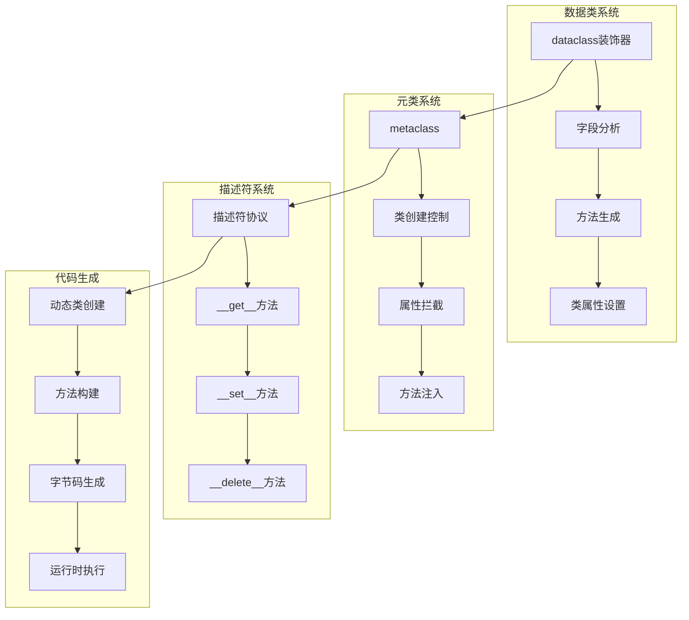
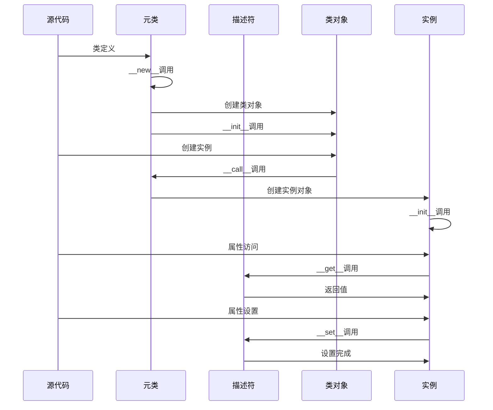

## 📋 概述

数据类和元编程是Python中强大的代码生成和类定制机制。本文档将深入分析CPython中数据类的实现原理、元类系统的工作机制、描述符协议、以及各种元编程技术的源码实现和应用场景。

## 🎯 数据类与元编程架构



## 1. 数据类系统深度实现

### 1.1 dataclass装饰器实现机制

```python
# 数据类系统深度分析
from dataclasses import dataclass, field, Field, fields, asdict, astuple, replace, InitVar
from typing import ClassVar, Optional, List, Dict, Any, Union
import inspect
import sys
from types import FunctionType

class DataclassAnalysis:
    """数据类系统分析器"""

    def __init__(self):
        self.analysis_cache = {}
        self.field_registry = {}

    def analyze_dataclass_structure(self, cls):
        """分析数据类的内部结构"""

        if not hasattr(cls, '__dataclass_fields__'):
            return {"error": "不是数据类"}

        analysis = {
            'class_name': cls.__name__,
            'fields': {},
            'parameters': {},
            'generated_methods': [],
            'inheritance': []
        }

        # 分析字段
        for field_name, field_obj in cls.__dataclass_fields__.items():
            analysis['fields'][field_name] = {
                'name': field_obj.name,
                'type': field_obj.type,
                'default': field_obj.default,
                'default_factory': field_obj.default_factory,
                'init': field_obj.init,
                'repr': field_obj.repr,
                'hash': field_obj.hash,
                'compare': field_obj.compare,
                'metadata': field_obj.metadata
            }

        # 分析dataclass参数
        if hasattr(cls, '__dataclass_params__'):
            params = cls.__dataclass_params__
            analysis['parameters'] = {
                'init': params.init,
                'repr': params.repr,
                'eq': params.eq,
                'order': params.order,
                'unsafe_hash': params.unsafe_hash,
                'frozen': params.frozen
            }

        # 分析生成的方法
        generated_methods = ['__init__', '__repr__', '__eq__', '__hash__', '__lt__', '__le__', '__gt__', '__ge__']
        for method_name in generated_methods:
            if hasattr(cls, method_name):
                method = getattr(cls, method_name)
                if hasattr(method, '__qualname__') and 'dataclass' in str(method):
                    analysis['generated_methods'].append(method_name)

        # 分析继承结构
        for base in cls.__mro__[1:]:  # 跳过自己
            if hasattr(base, '__dataclass_fields__'):
                analysis['inheritance'].append({
                    'class': base.__name__,
                    'fields': list(base.__dataclass_fields__.keys())
                })

        return analysis

    def demonstrate_basic_dataclass(self):
        """演示基础数据类功能"""

        print("=== 基础数据类分析 ===")

        @dataclass
        class Person:
            name: str
            age: int
            email: Optional[str] = None
            active: bool = True

        # 分析数据类结构
        analysis = self.analyze_dataclass_structure(Person)
        print(f"Person类分析: {analysis}")

        # 创建实例
        person1 = Person("Alice", 30, "alice@example.com")
        person2 = Person("Bob", 25)

        print(f"person1: {person1}")
        print(f"person2: {person2}")

        # 测试生成的方法
        print(f"person1 == person2: {person1 == person2}")
        print(f"person1字段: {fields(person1)}")

        # 转换为字典和元组
        person_dict = asdict(person1)
        person_tuple = astuple(person1)

        print(f"转换为字典: {person_dict}")
        print(f"转换为元组: {person_tuple}")

        # 替换操作
        updated_person = replace(person1, age=31)
        print(f"更新后: {updated_person}")

    def demonstrate_advanced_dataclass_features(self):
        """演示高级数据类特性"""

        print(f"\n=== 高级数据类特性 ===")

        # 1. 字段配置
        @dataclass
        class Product:
            name: str
            price: float = field(compare=False)  # 不参与比较
            description: str = field(repr=False, default="")  # 不显示在repr中
            internal_id: int = field(init=False)  # 不在__init__中
            tags: List[str] = field(default_factory=list)  # 默认工厂
            metadata_info: Dict[str, Any] = field(
                default_factory=dict,
                metadata={'sensitive': True}  # 元数据
            )

            def __post_init__(self):
                """后初始化处理"""
                self.internal_id = hash(self.name) % 1000000

        product1 = Product("Laptop", 999.99, "Gaming laptop")
        product2 = Product("Mouse", 29.99, "Wireless mouse")

        print(f"产品1: {product1}")
        print(f"产品2: {product2}")
        print(f"产品比较 (忽略价格): {product1 == product2}")

        # 分析Product类
        product_analysis = self.analyze_dataclass_structure(Product)
        print(f"Product类字段分析:")
        for field_name, field_info in product_analysis['fields'].items():
            print(f"  {field_name}: init={field_info['init']}, repr={field_info['repr']}, compare={field_info['compare']}")

        # 2. 冻结数据类
        @dataclass(frozen=True)
        class Point:
            x: float
            y: float

            def distance_from_origin(self) -> float:
                return (self.x ** 2 + self.y ** 2) ** 0.5

        point = Point(3.0, 4.0)
        print(f"点: {point}")
        print(f"距离原点: {point.distance_from_origin()}")

        # 尝试修改冻结对象会引发错误
        try:
            point.x = 5.0
        except Exception as e:
            print(f"修改冻结对象失败: {type(e).__name__}: {e}")

        # 3. 排序数据类
        @dataclass(order=True)
        class Student:
            name: str = field(compare=False)  # 名字不参与排序
            grade: float
            student_id: int = field(compare=False)

        students = [
            Student("Alice", 85.5, 1001),
            Student("Bob", 92.0, 1002),
            Student("Charlie", 78.5, 1003)
        ]

        sorted_students = sorted(students)
        print(f"按成绩排序的学生:")
        for student in sorted_students:
            print(f"  {student}")

        # 4. InitVar的使用
        @dataclass
        class Rectangle:
            width: float
            height: float
            area: float = field(init=False)
            database_info: InitVar[Optional[str]] = None

            def __post_init__(self, database_info):
                self.area = self.width * self.height
                if database_info:
                    print(f"连接到数据库: {database_info}")

        rect = Rectangle(10.0, 5.0, "production_db")
        print(f"矩形: width={rect.width}, height={rect.height}, area={rect.area}")

    def demonstrate_inheritance_and_composition(self):
        """演示数据类继承和组合"""

        print(f"\n=== 数据类继承和组合 ===")

        # 1. 基础继承
        @dataclass
        class Animal:
            name: str
            species: str
            age: int = 0

        @dataclass
        class Dog(Animal):
            breed: str
            is_good_boy: bool = True

            def __post_init__(self):
                if self.species != "Canis lupus":
                    self.species = "Canis lupus"

        dog = Dog("Buddy", "Unknown", 3, "Golden Retriever")
        print(f"狗: {dog}")

        # 分析继承结构
        dog_analysis = self.analyze_dataclass_structure(Dog)
        print(f"Dog类继承分析: {dog_analysis['inheritance']}")

        # 2. 组合模式
        @dataclass
        class Address:
            street: str
            city: str
            zip_code: str
            country: str = "USA"

        @dataclass
        class Person:
            name: str
            age: int
            address: Address
            secondary_addresses: List[Address] = field(default_factory=list)

        address = Address("123 Main St", "Anytown", "12345")
        person = Person("Alice", 30, address)

        print(f"带地址的人: {person}")

        # 3. 混合继承模式
        @dataclass
        class Timestamped:
            created_at: float = field(default_factory=lambda: __import__('time').time())
            updated_at: float = field(default_factory=lambda: __import__('time').time())

        @dataclass
        class Identifiable:
            id: str = field(default_factory=lambda: str(__import__('uuid').uuid4()))

        @dataclass
        class BlogPost(Timestamped, Identifiable):
            title: str
            content: str
            author: str
            published: bool = False

            def publish(self):
                self.published = True
                self.updated_at = __import__('time').time()

        post = BlogPost("Hello World", "This is my first post", "Alice")
        print(f"博客文章: {post}")

        # 分析多重继承
        post_analysis = self.analyze_dataclass_structure(BlogPost)
        print(f"BlogPost多重继承字段: {list(post_analysis['fields'].keys())}")

# 运行数据类分析
dataclass_analyzer = DataclassAnalysis()
dataclass_analyzer.demonstrate_basic_dataclass()
dataclass_analyzer.demonstrate_advanced_dataclass_features()
dataclass_analyzer.demonstrate_inheritance_and_composition()
```

### 1.2 字段生成和方法构建

```c
/* 模拟dataclass字段处理的C实现逻辑 */

/* 在实际CPython中，dataclass是纯Python实现，这里展示等效的C逻辑 */

typedef struct {
    PyObject_HEAD
    PyObject *name;         /* 字段名 */
    PyObject *type;         /* 字段类型 */
    PyObject *default_value; /* 默认值 */
    PyObject *default_factory; /* 默认工厂函数 */
    int init;              /* 是否在__init__中 */
    int repr;              /* 是否在__repr__中 */
    int hash;              /* 是否参与哈希 */
    int compare;           /* 是否参与比较 */
    PyObject *metadata;    /* 元数据字典 */
} DataclassFieldObject;

/* 创建数据类字段 */
static PyObject *
dataclass_field_new(PyTypeObject *type, PyObject *args, PyObject *kwds)
{
    static char *kwlist[] = {
        "default", "default_factory", "init", "repr",
        "hash", "compare", "metadata", NULL
    };

    PyObject *default_value = NULL;
    PyObject *default_factory = NULL;
    int init = 1, repr = 1, hash = -1, compare = 1;
    PyObject *metadata = NULL;

    if (!PyArg_ParseTupleAndKeywords(args, kwds, "|OOppppO", kwlist,
                                     &default_value, &default_factory,
                                     &init, &repr, &hash, &compare,
                                     &metadata)) {
        return NULL;
    }

    DataclassFieldObject *field = (DataclassFieldObject *)type->tp_alloc(type, 0);
    if (field == NULL) {
        return NULL;
    }

    /* 设置字段属性 */
    field->name = NULL;  /* 稍后设置 */
    field->type = NULL;  /* 稍后设置 */

    Py_XINCREF(default_value);
    field->default_value = default_value;

    Py_XINCREF(default_factory);
    field->default_factory = default_factory;

    field->init = init;
    field->repr = repr;
    field->hash = hash;
    field->compare = compare;

    if (metadata == NULL) {
        field->metadata = PyDict_New();
    } else {
        Py_INCREF(metadata);
        field->metadata = metadata;
    }

    return (PyObject *)field;
}

/* 生成__init__方法 */
static PyObject *
generate_init_method(PyObject *fields_dict)
{
    /* 构建__init__方法的字符串表示 */
    PyObject *method_code = PyUnicode_FromString("def __init__(self");
    PyObject *body_code = PyUnicode_FromString("pass");

    /* 遍历字段，构建参数列表和方法体 */
    PyObject *key, *value;
    Py_ssize_t pos = 0;

    while (PyDict_Next(fields_dict, &pos, &key, &value)) {
        DataclassFieldObject *field = (DataclassFieldObject *)value;

        if (field->init) {
            /* 添加到参数列表 */
            PyObject *param = PyUnicode_FromFormat(", %U", field->name);
            PyUnicode_Append(&method_code, param);
            Py_DECREF(param);

            /* 添加到方法体 */
            PyObject *assignment = PyUnicode_FromFormat("    self.%U = %U\n",
                                                       field->name, field->name);
            PyUnicode_Append(&body_code, assignment);
            Py_DECREF(assignment);
        }
    }

    /* 完成方法定义 */
    PyUnicode_AppendAndDel(&method_code, PyUnicode_FromString("):\n"));
    PyUnicode_Append(&method_code, body_code);

    Py_DECREF(body_code);
    return method_code;
}
```

## 2. 元类系统深度分析

### 2.1 元类工作原理

```python
# 元类系统深度分析
import types
import inspect
import functools
from typing import Dict, Any, Type, Callable, Optional

class MetaclassAnalysis:
    """元类系统分析器"""

    def __init__(self):
        self.metaclass_registry = {}
        self.creation_hooks = []

    def demonstrate_basic_metaclass(self):
        """演示基础元类功能"""

        print("=== 基础元类分析 ===")

        # 1. 最简单的元类
        class SimpleMeta(type):
            def __new__(mcs, name, bases, namespace, **kwargs):
                print(f"创建类 {name}，基类: {[b.__name__ for b in bases]}")

                # 可以修改类的命名空间
                namespace['created_by_metaclass'] = True
                namespace['class_id'] = id(namespace)

                # 调用父类创建类对象
                cls = super().__new__(mcs, name, bases, namespace)

                print(f"类 {name} 创建完成，ID: {id(cls)}")
                return cls

            def __init__(cls, name, bases, namespace, **kwargs):
                print(f"初始化类 {name}")
                super().__init__(name, bases, namespace)

                # 在类创建后进行额外的初始化
                cls._instances = []
                cls._creation_time = __import__('time').time()

            def __call__(cls, *args, **kwargs):
                print(f"实例化类 {cls.__name__}")

                # 可以控制实例创建过程
                instance = super().__call__(*args, **kwargs)
                cls._instances.append(instance)

                return instance

        # 使用元类
        class MyClass(metaclass=SimpleMeta):
            def __init__(self, value):
                self.value = value

            def get_value(self):
                return self.value

        print(f"MyClass.created_by_metaclass: {MyClass.created_by_metaclass}")
        print(f"MyClass.class_id: {MyClass.class_id}")

        # 创建实例
        obj1 = MyClass(10)
        obj2 = MyClass(20)

        print(f"实例列表长度: {len(MyClass._instances)}")
        print(f"类创建时间: {MyClass._creation_time}")

    def demonstrate_singleton_metaclass(self):
        """演示单例模式元类"""

        print(f"\n=== 单例模式元类 ===")

        class SingletonMeta(type):
            _instances = {}
            _lock = __import__('threading').Lock()

            def __call__(cls, *args, **kwargs):
                # 双重检查锁定模式
                if cls not in cls._instances:
                    with cls._lock:
                        if cls not in cls._instances:
                            instance = super().__call__(*args, **kwargs)
                            cls._instances[cls] = instance

                return cls._instances[cls]

        class DatabaseConnection(metaclass=SingletonMeta):
            def __init__(self, host="localhost", port=5432):
                if hasattr(self, '_initialized'):
                    return

                self.host = host
                self.port = port
                self.connected = False
                self._initialized = True
                print(f"创建数据库连接: {host}:{port}")

            def connect(self):
                self.connected = True
                print(f"连接到 {self.host}:{self.port}")

            def disconnect(self):
                self.connected = False
                print(f"断开连接 {self.host}:{self.port}")

        # 测试单例模式
        db1 = DatabaseConnection()
        db2 = DatabaseConnection("remote_host", 3306)

        print(f"db1 is db2: {db1 is db2}")
        print(f"db1连接信息: {db1.host}:{db1.port}")
        print(f"db2连接信息: {db2.host}:{db2.port}")

    def demonstrate_attribute_validation_metaclass(self):
        """演示属性验证元类"""

        print(f"\n=== 属性验证元类 ===")

        class ValidatedMeta(type):
            def __new__(mcs, name, bases, namespace, **kwargs):
                # 收集所有验证器
                validators = {}
                for key, value in namespace.items():
                    if hasattr(value, '_validator'):
                        validators[key] = value._validator

                # 创建类
                cls = super().__new__(mcs, name, bases, namespace)

                # 存储验证器
                cls._validators = validators

                return cls

            def __call__(cls, *args, **kwargs):
                instance = super().__call__(*args, **kwargs)

                # 应用验证器
                for attr_name, validator in cls._validators.items():
                    if hasattr(instance, attr_name):
                        value = getattr(instance, attr_name)
                        if not validator(value):
                            raise ValueError(f"验证失败: {attr_name} = {value}")

                return instance

        # 验证器装饰器
        def validator(validation_func):
            def decorator(func):
                func._validator = validation_func
                return func
            return decorator

        class Person(metaclass=ValidatedMeta):
            def __init__(self, name, age, email):
                self.name = name
                self.age = age
                self.email = email

            @validator(lambda name: len(name) > 0 and isinstance(name, str))
            def validate_name(self):
                pass

            @validator(lambda age: isinstance(age, int) and 0 <= age <= 150)
            def validate_age(self):
                pass

            @validator(lambda email: "@" in email and "." in email)
            def validate_email(self):
                pass

        # 测试验证
        try:
            person1 = Person("Alice", 30, "alice@example.com")
            print(f"有效人员: {person1.name}, {person1.age}, {person1.email}")
        except ValueError as e:
            print(f"验证错误: {e}")

        try:
            person2 = Person("", -5, "invalid-email")
            print("不应该到达这里")
        except ValueError as e:
            print(f"验证错误: {e}")

    def demonstrate_orm_metaclass(self):
        """演示ORM风格的元类"""

        print(f"\n=== ORM元类演示 ===")

        class Field:
            def __init__(self, field_type, primary_key=False, nullable=True, default=None):
                self.field_type = field_type
                self.primary_key = primary_key
                self.nullable = nullable
                self.default = default
                self.name = None

            def __set_name__(self, owner, name):
                self.name = name

            def __get__(self, obj, objtype=None):
                if obj is None:
                    return self
                return obj.__dict__.get(self.name)

            def __set__(self, obj, value):
                # 类型验证
                if not isinstance(value, self.field_type) and value is not None:
                    raise TypeError(f"{self.name} 必须是 {self.field_type.__name__} 类型")

                # 空值检查
                if value is None and not self.nullable:
                    raise ValueError(f"{self.name} 不能为空")

                obj.__dict__[self.name] = value

        class ModelMeta(type):
            def __new__(mcs, name, bases, namespace, **kwargs):
                # 收集所有字段
                fields = {}
                for key, value in namespace.items():
                    if isinstance(value, Field):
                        fields[key] = value

                # 创建类
                cls = super().__new__(mcs, name, bases, namespace)

                # 存储字段信息
                cls._fields = fields
                cls._table_name = kwargs.get('table_name', name.lower())

                # 生成SQL相关方法
                cls.create_table_sql = mcs._generate_create_table_sql(cls)

                return cls

            @staticmethod
            def _generate_create_table_sql(cls):
                """生成CREATE TABLE SQL"""
                sql = f"CREATE TABLE {cls._table_name} (\n"

                field_definitions = []
                for field_name, field in cls._fields.items():
                    field_def = f"  {field_name} {field.field_type.__name__.upper()}"

                    if field.primary_key:
                        field_def += " PRIMARY KEY"

                    if not field.nullable:
                        field_def += " NOT NULL"

                    if field.default is not None:
                        field_def += f" DEFAULT {repr(field.default)}"

                    field_definitions.append(field_def)

                sql += ",\n".join(field_definitions) + "\n)"
                return sql

        # 使用ORM元类
        class User(metaclass=ModelMeta, table_name='users'):
            id = Field(int, primary_key=True)
            username = Field(str, nullable=False)
            email = Field(str, nullable=False)
            age = Field(int, default=18)
            active = Field(bool, default=True)

            def __init__(self, id=None, username=None, email=None, age=18, active=True):
                self.id = id
                self.username = username
                self.email = email
                self.age = age
                self.active = active

            def __repr__(self):
                return f"User(id={self.id}, username='{self.username}', email='{self.email}')"

        print(f"User表字段: {list(User._fields.keys())}")
        print(f"创建表SQL:\n{User.create_table_sql}")

        # 创建用户实例
        user = User(1, "alice", "alice@example.com", 25)
        print(f"用户实例: {user}")

        # 测试字段验证
        try:
            user.age = "invalid"  # 应该引发错误
        except TypeError as e:
            print(f"类型验证错误: {e}")

# 运行元类分析
metaclass_analyzer = MetaclassAnalysis()
metaclass_analyzer.demonstrate_basic_metaclass()
metaclass_analyzer.demonstrate_singleton_metaclass()
metaclass_analyzer.demonstrate_attribute_validation_metaclass()
metaclass_analyzer.demonstrate_orm_metaclass()
```

## 3. 描述符协议深度实现

### 3.1 描述符协议源码分析

```c
/* Objects/descrobject.c - 描述符协议的C实现 */

/* 描述符获取方法 */
PyObject *
PyObject_GenericGetAttr(PyObject *obj, PyObject *name)
{
    PyTypeObject *tp = Py_TYPE(obj);
    PyObject *descr = NULL;
    PyObject *res = NULL;
    descrgetfunc f;
    Py_ssize_t dictoffset;
    PyObject **dictptr;

    if (!PyUnicode_Check(name)){
        PyErr_Format(PyExc_TypeError,
                     "attribute name must be string, not '%.200s'",
                     Py_TYPE(name)->tp_name);
        return NULL;
    }

    /* 1. 首先查找类型字典中的描述符 */
    if (tp->tp_dict != NULL) {
        descr = _PyDict_GetItem_KnownHash(tp->tp_dict, name,
                                         ((PyASCIIObject *)name)->hash);
        if (descr != NULL) {
            Py_INCREF(descr);
            f = Py_TYPE(descr)->tp_descr_get;

            /* 检查是否是数据描述符 */
            if (f != NULL) {
                if (Py_TYPE(descr)->tp_descr_set != NULL) {
                    /* 数据描述符，直接调用__get__ */
                    res = f(descr, obj, (PyObject *)Py_TYPE(obj));
                    goto done;
                }
            }
        }
    }

    /* 2. 查找实例字典 */
    dictoffset = tp->tp_dictoffset;
    if (dictoffset != 0) {
        if (dictoffset < 0) {
            Py_ssize_t tsize = Py_SIZE(obj);
            if (tsize < 0) {
                tsize = -tsize;
            }
            dictoffset += (long)tsize * sizeof(PyObject *);
            assert(dictoffset > 0);
            assert(dictoffset % SIZEOF_VOID_P == 0);
        }
        dictptr = (PyObject **) ((char *)obj + dictoffset);
        PyObject *dict = *dictptr;
        if (dict != NULL) {
            Py_INCREF(dict);
            res = PyDict_GetItemWithError(dict, name);
            if (res != NULL) {
                Py_INCREF(res);
                Py_DECREF(dict);
                goto done;
            }
            else {
                Py_DECREF(dict);
                if (PyErr_Occurred()) {
                    goto done;
                }
            }
        }
    }

    /* 3. 使用非数据描述符 */
    if (f != NULL) {
        res = f(descr, obj, (PyObject *)Py_TYPE(obj));
        goto done;
    }

    /* 4. 直接返回描述符对象 */
    if (descr != NULL) {
        res = descr;
        descr = NULL;
        goto done;
    }

    /* 5. 属性不存在 */
    PyErr_Format(PyExc_AttributeError,
                 "'%.50s' object has no attribute '%U'",
                 tp->tp_name, name);

done:
    Py_XDECREF(descr);
    return res;
}

/* 描述符设置方法 */
int
PyObject_GenericSetAttr(PyObject *obj, PyObject *name, PyObject *value)
{
    PyTypeObject *tp = Py_TYPE(obj);
    PyObject *descr;
    descrsetfunc f;
    PyObject **dictptr;
    int res = -1;

    if (!PyUnicode_Check(name)){
        PyErr_Format(PyExc_TypeError,
                     "attribute name must be string, not '%.200s'",
                     Py_TYPE(name)->tp_name);
        return -1;
    }

    /* 1. 查找数据描述符 */
    if (tp->tp_dict != NULL) {
        descr = _PyDict_GetItem_KnownHash(tp->tp_dict, name,
                                         ((PyASCIIObject *)name)->hash);
        if (descr != NULL) {
            f = Py_TYPE(descr)->tp_descr_set;
            if (f != NULL) {
                /* 调用数据描述符的__set__方法 */
                res = f(descr, obj, value);
                goto done;
            }
        }
    }

    /* 2. 设置实例字典 */
    dictptr = _PyObject_GetDictPtr(obj);
    if (dictptr != NULL) {
        PyObject *dict = *dictptr;
        if (dict == NULL && value != NULL) {
            dict = PyDict_New();
            if (dict == NULL)
                goto done;
            *dictptr = dict;
        }
        if (dict != NULL) {
            if (value == NULL) {
                res = PyDict_DelItem(dict, name);
            } else {
                res = PyDict_SetItem(dict, name, value);
            }
            goto done;
        }
    }

    /* 3. 如果没有__dict__，且不是数据描述符，报错 */
    if (descr == NULL) {
        PyErr_Format(PyExc_AttributeError,
                     "'%.100s' object has no attribute '%U'",
                     tp->tp_name, name);
    } else {
        PyErr_Format(PyExc_AttributeError,
                     "'%.50s' object attribute '%U' is read-only",
                     tp->tp_name, name);
    }

done:
    return res;
}
```

### 3.2 描述符应用实例

```python
# 描述符协议应用实例
import weakref
import functools
from typing import Any, Dict, Optional, Callable, TypeVar, Generic

T = TypeVar('T')

class DescriptorAnalysis:
    """描述符系统分析"""

    def demonstrate_basic_descriptors(self):
        """演示基础描述符功能"""

        print("=== 基础描述符分析 ===")

        # 1. 简单的数据描述符
        class Attribute:
            def __init__(self, initial_value=None):
                self.value = initial_value
                self.name = None

            def __set_name__(self, owner, name):
                self.name = name

            def __get__(self, obj, objtype=None):
                if obj is None:
                    return self
                print(f"获取 {self.name} = {self.value}")
                return self.value

            def __set__(self, obj, value):
                print(f"设置 {self.name} = {value}")
                self.value = value

            def __delete__(self, obj):
                print(f"删除 {self.name}")
                self.value = None

        class MyClass:
            attr = Attribute("初始值")

            def __init__(self, name):
                self.name = name

        obj = MyClass("测试对象")

        # 测试描述符操作
        value = obj.attr  # 触发__get__
        obj.attr = "新值"  # 触发__set__
        new_value = obj.attr  # 再次触发__get__

        print(f"最终值: {new_value}")

    def demonstrate_property_descriptor(self):
        """演示property描述符的实现原理"""

        print(f"\n=== Property描述符原理 ===")

        # 自定义property实现
        class MyProperty:
            def __init__(self, fget=None, fset=None, fdel=None, doc=None):
                self.fget = fget
                self.fset = fset
                self.fdel = fdel
                self.__doc__ = doc

            def __get__(self, obj, objtype=None):
                if obj is None:
                    return self
                if self.fget is None:
                    raise AttributeError("无法读取属性")
                return self.fget(obj)

            def __set__(self, obj, value):
                if self.fset is None:
                    raise AttributeError("无法设置属性")
                self.fset(obj, value)

            def __delete__(self, obj):
                if self.fdel is None:
                    raise AttributeError("无法删除属性")
                self.fdel(obj)

            def getter(self, fget):
                return type(self)(fget, self.fset, self.fdel, self.__doc__)

            def setter(self, fset):
                return type(self)(self.fget, fset, self.fdel, self.__doc__)

            def deleter(self, fdel):
                return type(self)(self.fget, self.fset, fdel, self.__doc__)

        class Temperature:
            def __init__(self, celsius=0):
                self._celsius = celsius

            @MyProperty
            def fahrenheit(self):
                """华氏温度"""
                return self._celsius * 9/5 + 32

            @fahrenheit.setter
            def fahrenheit(self, value):
                self._celsius = (value - 32) * 5/9

            @MyProperty
            def celsius(self):
                """摄氏温度"""
                return self._celsius

            @celsius.setter
            def celsius(self, value):
                self._celsius = value

        temp = Temperature(25)
        print(f"25°C = {temp.fahrenheit}°F")

        temp.fahrenheit = 86
        print(f"86°F = {temp.celsius}°C")

    def demonstrate_validation_descriptor(self):
        """演示验证描述符"""

        print(f"\n=== 验证描述符 ===")

        class ValidatedAttribute:
            def __init__(self, validator=None, default=None):
                self.validator = validator
                self.default = default
                self.data = weakref.WeakKeyDictionary()
                self.name = None

            def __set_name__(self, owner, name):
                self.name = name

            def __get__(self, obj, objtype=None):
                if obj is None:
                    return self
                return self.data.get(obj, self.default)

            def __set__(self, obj, value):
                if self.validator is not None:
                    if not self.validator(value):
                        raise ValueError(f"{self.name} 验证失败: {value}")
                self.data[obj] = value

            def __delete__(self, obj):
                del self.data[obj]

        # 验证器函数
        def positive_number(value):
            return isinstance(value, (int, float)) and value > 0

        def non_empty_string(value):
            return isinstance(value, str) and len(value.strip()) > 0

        def valid_email(value):
            return isinstance(value, str) and "@" in value and "." in value

        class User:
            name = ValidatedAttribute(non_empty_string)
            age = ValidatedAttribute(positive_number)
            email = ValidatedAttribute(valid_email)

            def __init__(self, name, age, email):
                self.name = name
                self.age = age
                self.email = email

            def __repr__(self):
                return f"User(name='{self.name}', age={self.age}, email='{self.email}')"

        # 测试验证
        try:
            user1 = User("Alice", 25, "alice@example.com")
            print(f"有效用户: {user1}")
        except ValueError as e:
            print(f"验证错误: {e}")

        try:
            user2 = User("", -5, "invalid-email")
        except ValueError as e:
            print(f"验证错误: {e}")

    def demonstrate_lazy_property(self):
        """演示惰性求值属性"""

        print(f"\n=== 惰性求值属性 ===")

        class LazyProperty:
            def __init__(self, func):
                self.func = func
                self.name = func.__name__
                self.__doc__ = func.__doc__

            def __get__(self, obj, objtype=None):
                if obj is None:
                    return self

                # 检查是否已计算
                value = obj.__dict__.get(self.name, self)
                if value is self:
                    # 第一次访问，计算值
                    print(f"计算惰性属性 {self.name}")
                    value = self.func(obj)
                    obj.__dict__[self.name] = value
                else:
                    print(f"使用缓存的 {self.name}")

                return value

            def __set__(self, obj, value):
                obj.__dict__[self.name] = value

            def __delete__(self, obj):
                obj.__dict__.pop(self.name, None)

        class DataProcessor:
            def __init__(self, data):
                self.data = data

            @LazyProperty
            def processed_data(self):
                """处理数据（耗时操作）"""
                import time
                time.sleep(0.1)  # 模拟耗时计算
                return [x * 2 for x in self.data]

            @LazyProperty
            def data_summary(self):
                """数据摘要"""
                return {
                    'count': len(self.data),
                    'sum': sum(self.data),
                    'avg': sum(self.data) / len(self.data) if self.data else 0
                }

        processor = DataProcessor([1, 2, 3, 4, 5])

        # 第一次访问会计算
        summary1 = processor.data_summary
        print(f"数据摘要: {summary1}")

        # 第二次访问使用缓存
        summary2 = processor.data_summary
        print(f"数据摘要（缓存）: {summary2}")

        # 访问处理后的数据
        processed = processor.processed_data
        print(f"处理后数据: {processed}")

    def demonstrate_method_descriptor(self):
        """演示方法描述符"""

        print(f"\n=== 方法描述符 ===")

        class BoundMethod:
            def __init__(self, func, obj):
                self.func = func
                self.obj = obj

            def __call__(self, *args, **kwargs):
                return self.func(self.obj, *args, **kwargs)

            def __repr__(self):
                return f"<bound method {self.func.__name__} of {self.obj}>"

        class Function:
            def __init__(self, func):
                self.func = func
                self.__name__ = func.__name__
                self.__doc__ = func.__doc__

            def __get__(self, obj, objtype=None):
                if obj is None:
                    return self
                return BoundMethod(self.func, obj)

            def __call__(self, *args, **kwargs):
                return self.func(*args, **kwargs)

        class MyClass:
            @Function
            def greet(self, name):
                return f"Hello, {name}! I'm {type(self).__name__}"

            @Function
            def calculate(self, x, y):
                return x + y

        obj = MyClass()

        # 访问方法描述符
        method = obj.greet
        print(f"绑定方法: {method}")

        # 调用方法
        result = obj.greet("Alice")
        print(f"调用结果: {result}")

        # 直接从类访问
        unbound = MyClass.greet
        print(f"未绑定方法: {unbound}")

        # 手动传入实例
        result2 = unbound(obj, "Bob")
        print(f"手动调用结果: {result2}")

# 运行描述符分析
descriptor_analyzer = DescriptorAnalysis()
descriptor_analyzer.demonstrate_basic_descriptors()
descriptor_analyzer.demonstrate_property_descriptor()
descriptor_analyzer.demonstrate_validation_descriptor()
descriptor_analyzer.demonstrate_lazy_property()
descriptor_analyzer.demonstrate_method_descriptor()
```

## 4. 动态类创建和代码生成

### 4.1 动态类创建技术

```python
# 动态类创建和代码生成
import types
import sys
from typing import Dict, Any, Callable, Type

class DynamicClassGeneration:
    """动态类创建和代码生成分析"""

    def demonstrate_type_function(self):
        """演示使用type()函数动态创建类"""

        print("=== 动态类创建：type()函数 ===")

        # 1. 基本的动态类创建
        def init_method(self, name, value):
            self.name = name
            self.value = value

        def str_method(self):
            return f"{self.name}: {self.value}"

        def add_method(self, other):
            if isinstance(other, self.__class__):
                return self.__class__(
                    f"{self.name}+{other.name}",
                    self.value + other.value
                )
            return NotImplemented

        # 动态创建类
        DynamicClass = type(
            'DynamicClass',  # 类名
            (object,),       # 基类
            {                # 类字典
                '__init__': init_method,
                '__str__': str_method,
                '__add__': add_method,
                'class_type': 'dynamic'
            }
        )

        # 使用动态创建的类
        obj1 = DynamicClass("obj1", 10)
        obj2 = DynamicClass("obj2", 20)
        obj3 = obj1 + obj2

        print(f"obj1: {obj1}")
        print(f"obj2: {obj2}")
        print(f"obj3: {obj3}")
        print(f"class_type: {DynamicClass.class_type}")

    def demonstrate_class_factory(self):
        """演示类工厂模式"""

        print(f"\n=== 类工厂模式 ===")

        def create_data_class(class_name, fields):
            """创建数据类的工厂函数"""

            def init_method(self, **kwargs):
                for field in fields:
                    value = kwargs.get(field['name'], field.get('default'))
                    if value is None and field.get('required', True):
                        raise ValueError(f"字段 {field['name']} 是必需的")
                    setattr(self, field['name'], value)

            def repr_method(self):
                field_strs = []
                for field in fields:
                    value = getattr(self, field['name'], None)
                    field_strs.append(f"{field['name']}={value!r}")
                return f"{class_name}({', '.join(field_strs)})"

            def eq_method(self, other):
                if not isinstance(other, self.__class__):
                    return False
                for field in fields:
                    if getattr(self, field['name']) != getattr(other, field['name']):
                        return False
                return True

            def to_dict_method(self):
                return {field['name']: getattr(self, field['name'])
                       for field in fields}

            def from_dict_method(cls, data):
                return cls(**data)

            # 创建类方法
            class_methods = {
                '__init__': init_method,
                '__repr__': repr_method,
                '__eq__': eq_method,
                'to_dict': to_dict_method,
                'from_dict': classmethod(from_dict_method),
                '_fields': fields
            }

            return type(class_name, (object,), class_methods)

        # 定义字段
        person_fields = [
            {'name': 'name', 'type': str, 'required': True},
            {'name': 'age', 'type': int, 'required': True},
            {'name': 'email', 'type': str, 'default': None, 'required': False}
        ]

        # 创建Person类
        Person = create_data_class('Person', person_fields)

        # 使用创建的类
        person1 = Person(name="Alice", age=30, email="alice@example.com")
        person2 = Person(name="Bob", age=25)

        print(f"person1: {person1}")
        print(f"person2: {person2}")
        print(f"person1.to_dict(): {person1.to_dict()}")

        # 从字典创建
        person_data = {'name': 'Charlie', 'age': 35, 'email': 'charlie@example.com'}
        person3 = Person.from_dict(person_data)
        print(f"person3: {person3}")

    def demonstrate_code_generation(self):
        """演示代码生成技术"""

        print(f"\n=== 代码生成技术 ===")

        class CodeGenerator:
            def __init__(self):
                self.indent_level = 0
                self.lines = []

            def indent(self):
                self.indent_level += 1

            def dedent(self):
                self.indent_level = max(0, self.indent_level - 1)

            def add_line(self, line):
                indent = "    " * self.indent_level
                self.lines.append(indent + line)

            def get_code(self):
                return "\n".join(self.lines)

        def generate_property_class(class_name, properties):
            """生成包含属性的类"""

            gen = CodeGenerator()

            # 类定义
            gen.add_line(f"class {class_name}:")
            gen.indent()

            # __init__方法
            params = ["self"] + [f"{prop}=None" for prop in properties]
            gen.add_line(f"def __init__({', '.join(params)}):")
            gen.indent()

            for prop in properties:
                gen.add_line(f"self._{prop} = {prop}")

            gen.dedent()
            gen.add_line("")

            # 为每个属性生成getter和setter
            for prop in properties:
                # getter
                gen.add_line("@property")
                gen.add_line(f"def {prop}(self):")
                gen.indent()
                gen.add_line(f"return self._{prop}")
                gen.dedent()
                gen.add_line("")

                # setter
                gen.add_line(f"@{prop}.setter")
                gen.add_line(f"def {prop}(self, value):")
                gen.indent()
                gen.add_line(f"if value is not None:")
                gen.indent()
                gen.add_line(f"print(f'设置 {prop} = {{value}}')")
                gen.dedent()
                gen.add_line(f"self._{prop} = value")
                gen.dedent()
                gen.add_line("")

            # __repr__方法
            gen.add_line("def __repr__(self):")
            gen.indent()
            fields = [f"{prop}={{self.{prop}!r}}" for prop in properties]
            gen.add_line(f"return f\"{class_name}({', '.join(fields)})\"")
            gen.dedent()

            return gen.get_code()

        # 生成类代码
        properties = ['name', 'age', 'email']
        class_code = generate_property_class('GeneratedPerson', properties)

        print("生成的类代码:")
        print(class_code)
        print("\n" + "="*50 + "\n")

        # 执行生成的代码
        namespace = {}
        exec(class_code, namespace)
        GeneratedPerson = namespace['GeneratedPerson']

        # 使用生成的类
        person = GeneratedPerson("Alice", 30, "alice@example.com")
        print(f"生成的类实例: {person}")

        # 测试属性设置
        person.age = 31
        print(f"更新后: {person}")

    def demonstrate_advanced_metaclass_patterns(self):
        """演示高级元类模式"""

        print(f"\n=== 高级元类模式 ===")

        class APIEndpointMeta(type):
            """API端点元类"""

            def __new__(mcs, name, bases, namespace, **kwargs):
                # 收集API方法
                api_methods = {}
                for key, value in namespace.items():
                    if hasattr(value, '_api_endpoint'):
                        api_methods[key] = value._api_endpoint

                # 创建类
                cls = super().__new__(mcs, name, bases, namespace)

                # 存储API信息
                cls._api_methods = api_methods
                cls._base_url = kwargs.get('base_url', '/')

                # 生成路由信息
                cls._routes = mcs._generate_routes(cls)

                return cls

            @staticmethod
            def _generate_routes(cls):
                """生成路由信息"""
                routes = []
                for method_name, endpoint_info in cls._api_methods.items():
                    route = {
                        'method': endpoint_info.get('method', 'GET'),
                        'path': cls._base_url.rstrip('/') + endpoint_info['path'],
                        'handler': method_name,
                        'params': endpoint_info.get('params', [])
                    }
                    routes.append(route)
                return routes

        # API装饰器
        def api_endpoint(path, method='GET', params=None):
            def decorator(func):
                func._api_endpoint = {
                    'path': path,
                    'method': method,
                    'params': params or []
                }
                return func
            return decorator

        # 使用API元类
        class UserAPI(metaclass=APIEndpointMeta, base_url='/api/users'):

            @api_endpoint('/', method='GET')
            def list_users(self):
                return "获取用户列表"

            @api_endpoint('/{user_id}', method='GET', params=['user_id'])
            def get_user(self, user_id):
                return f"获取用户 {user_id}"

            @api_endpoint('/', method='POST', params=['name', 'email'])
            def create_user(self, name, email):
                return f"创建用户: {name} ({email})"

            @api_endpoint('/{user_id}', method='PUT', params=['user_id', 'data'])
            def update_user(self, user_id, data):
                return f"更新用户 {user_id}: {data}"

            @api_endpoint('/{user_id}', method='DELETE', params=['user_id'])
            def delete_user(self, user_id):
                return f"删除用户 {user_id}"

        # 检查生成的路由
        print("生成的API路由:")
        for route in UserAPI._routes:
            print(f"  {route['method']} {route['path']} -> {route['handler']}")

        # 使用API
        api = UserAPI()
        print(f"\n测试API调用:")
        print(f"list_users: {api.list_users()}")
        print(f"get_user: {api.get_user(123)}")
        print(f"create_user: {api.create_user('Alice', 'alice@example.com')}")

# 运行动态类创建分析
dynamic_class_gen = DynamicClassGeneration()
dynamic_class_gen.demonstrate_type_function()
dynamic_class_gen.demonstrate_class_factory()
dynamic_class_gen.demonstrate_code_generation()
dynamic_class_gen.demonstrate_advanced_metaclass_patterns()
```

## 5. 元编程时序图



## 6. 性能分析与最佳实践

### 6.1 元编程性能影响

```python
# 元编程性能分析
import time
import sys
from dataclasses import dataclass
import gc

class MetaprogrammingPerformance:
    """元编程性能分析"""

    def benchmark_class_creation(self):
        """测试类创建性能"""

        print("=== 类创建性能对比 ===")

        iterations = 10000

        # 1. 普通类定义（作为基准）
        def create_normal_class():
            class NormalClass:
                def __init__(self, x, y):
                    self.x = x
                    self.y = y

                def __repr__(self):
                    return f"NormalClass(x={self.x}, y={self.y})"

            return NormalClass

        # 2. 动态类创建
        def create_dynamic_class():
            return type('DynamicClass', (object,), {
                '__init__': lambda self, x, y: setattr(self, 'x', x) or setattr(self, 'y', y),
                '__repr__': lambda self: f"DynamicClass(x={self.x}, y={self.y})"
            })

        # 3. 数据类创建
        def create_dataclass():
            @dataclass
            class DataClass:
                x: int
                y: int
            return DataClass

        # 性能测试
        print(f"创建 {iterations} 个类：")

        # 测试普通类（实际上这个测试不太合理，因为类定义在编译时完成）
        start = time.time()
        normal_classes = [create_normal_class() for _ in range(100)]  # 减少迭代次数
        normal_time = time.time() - start

        # 测试动态类
        start = time.time()
        dynamic_classes = [create_dynamic_class() for _ in range(100)]
        dynamic_time = time.time() - start

        # 测试数据类
        start = time.time()
        dataclasses = [create_dataclass() for _ in range(100)]
        dataclass_time = time.time() - start

        print(f"普通类定义: {normal_time:.4f}秒")
        print(f"动态类创建: {dynamic_time:.4f}秒 ({dynamic_time/normal_time:.2f}x)")
        print(f"数据类创建: {dataclass_time:.4f}秒 ({dataclass_time/normal_time:.2f}x)")

    def benchmark_instance_creation(self):
        """测试实例创建性能"""

        print(f"\n=== 实例创建性能对比 ===")

        # 普通类
        class NormalClass:
            def __init__(self, x, y):
                self.x = x
                self.y = y

        # 带元类的类
        class MetaClass(type):
            def __call__(cls, *args, **kwargs):
                instance = super().__call__(*args, **kwargs)
                instance._created_by_metaclass = True
                return instance

        class ClassWithMeta(metaclass=MetaClass):
            def __init__(self, x, y):
                self.x = x
                self.y = y

        # 数据类
        @dataclass
        class DataClass:
            x: int
            y: int

        # 带描述符的类
        class DescriptorAttribute:
            def __init__(self, name):
                self.name = name

            def __get__(self, obj, objtype=None):
                if obj is None:
                    return self
                return obj.__dict__.get(self.name)

            def __set__(self, obj, value):
                obj.__dict__[self.name] = value

        class ClassWithDescriptors:
            x = DescriptorAttribute('x')
            y = DescriptorAttribute('y')

            def __init__(self, x, y):
                self.x = x
                self.y = y

        # 性能测试
        iterations = 100000
        classes_to_test = [
            ("普通类", NormalClass),
            ("元类", ClassWithMeta),
            ("数据类", DataClass),
            ("描述符类", ClassWithDescriptors)
        ]

        results = {}

        for name, cls in classes_to_test:
            start = time.time()
            instances = [cls(i, i*2) for i in range(iterations)]
            end_time = time.time() - start
            results[name] = end_time

            # 清理内存
            del instances
            gc.collect()

        print(f"创建 {iterations} 个实例：")
        baseline = results["普通类"]
        for name, time_taken in results.items():
            ratio = time_taken / baseline if baseline > 0 else 0
            print(f"{name}: {time_taken:.4f}秒 ({ratio:.2f}x)")

    def benchmark_attribute_access(self):
        """测试属性访问性能"""

        print(f"\n=== 属性访问性能对比 ===")

        # 普通属性
        class NormalClass:
            def __init__(self):
                self.value = 42

        # property属性
        class PropertyClass:
            def __init__(self):
                self._value = 42

            @property
            def value(self):
                return self._value

        # 描述符属性
        class DescriptorAttribute:
            def __get__(self, obj, objtype=None):
                if obj is None:
                    return self
                return 42

        class DescriptorClass:
            value = DescriptorAttribute()

        # 带验证的描述符
        class ValidatedDescriptor:
            def __get__(self, obj, objtype=None):
                if obj is None:
                    return self
                return getattr(obj, '_value', 42)

            def __set__(self, obj, value):
                if not isinstance(value, int):
                    raise TypeError("必须是整数")
                obj._value = value

        class ValidatedClass:
            value = ValidatedDescriptor()

            def __init__(self):
                self._value = 42

        # 创建测试实例
        normal_obj = NormalClass()
        property_obj = PropertyClass()
        descriptor_obj = DescriptorClass()
        validated_obj = ValidatedClass()

        # 性能测试
        iterations = 1000000

        objects_to_test = [
            ("普通属性", normal_obj),
            ("property属性", property_obj),
            ("描述符属性", descriptor_obj),
            ("验证描述符", validated_obj)
        ]

        print(f"访问属性 {iterations} 次：")

        for name, obj in objects_to_test:
            start = time.time()
            for _ in range(iterations):
                _ = obj.value
            end_time = time.time() - start
            print(f"{name}: {end_time:.4f}秒")

    def analyze_memory_usage(self):
        """分析内存使用"""

        print(f"\n=== 内存使用分析 ===")

        import tracemalloc

        tracemalloc.start()

        # 创建不同类型的对象
        baseline = tracemalloc.take_snapshot()

        # 普通对象
        normal_objects = []
        for i in range(10000):
            class TempClass:
                def __init__(self, value):
                    self.value = value
            normal_objects.append(TempClass(i))

        normal_snapshot = tracemalloc.take_snapshot()

        # 数据类对象
        @dataclass
        class TempDataClass:
            value: int

        dataclass_objects = [TempDataClass(i) for i in range(10000)]
        dataclass_snapshot = tracemalloc.take_snapshot()

        # 分析内存差异
        normal_diff = normal_snapshot.compare_to(baseline, 'lineno')
        dataclass_diff = dataclass_snapshot.compare_to(normal_snapshot, 'lineno')

        normal_memory = sum(stat.size for stat in normal_diff)
        dataclass_memory = sum(stat.size for stat in dataclass_diff)

        print(f"普通对象内存使用: {normal_memory/1024:.1f} KB")
        print(f"数据类对象内存使用: {dataclass_memory/1024:.1f} KB")

        tracemalloc.stop()

    def best_practices_recommendations(self):
        """最佳实践建议"""

        print(f"\n=== 元编程最佳实践 ===")

        recommendations = [
            "1. 性能考虑：",
            "   - 避免在热点路径中使用复杂的元编程",
            "   - property比描述符更快，描述符比验证描述符更快",
            "   - 数据类比手动实现的类稍慢，但代码更简洁",
            "",
            "2. 设计原则：",
            "   - 优先使用简单的解决方案",
            "   - 只在真正需要时使用元编程",
            "   - 考虑代码的可读性和维护性",
            "",
            "3. 具体建议：",
            "   - 对于简单的数据容器，使用dataclass",
            "   - 对于需要验证的属性，使用property或描述符",
            "   - 对于需要特殊类创建逻辑，使用元类",
            "   - 对于需要大量相似类，考虑类工厂",
            "",
            "4. 避免的陷阱：",
            "   - 不要过度使用元编程",
            "   - 注意元类的继承复杂性",
            "   - 小心描述符的名称设置",
            "   - 注意循环引用和内存泄漏"
        ]

        for recommendation in recommendations:
            print(recommendation)

# 运行性能分析
performance_analyzer = MetaprogrammingPerformance()
performance_analyzer.benchmark_class_creation()
performance_analyzer.benchmark_instance_creation()
performance_analyzer.benchmark_attribute_access()
performance_analyzer.analyze_memory_usage()
performance_analyzer.best_practices_recommendations()
```

## 7. 总结

Python的数据类和元编程系统展现了语言的强大表达力：

### 7.1 核心特性

1. **数据类**: 简化数据容器的创建和管理
2. **元类**: 控制类的创建和行为
3. **描述符**: 精细控制属性访问
4. **动态创建**: 运行时生成类和代码

### 7.2 设计哲学

1. **简洁性**: 减少样板代码，提高开发效率
2. **灵活性**: 提供多种定制类行为的方式
3. **一致性**: 遵循Python的对象模型和约定
4. **可扩展性**: 支持复杂的设计模式和框架

### 7.3 应用场景

1. **数据建模**: 快速创建数据结构
2. **框架开发**: ORM、API框架等
3. **代码生成**: 动态创建类和方法
4. **属性验证**: 类型检查和数据验证

### 7.4 最佳实践

1. **适度使用**: 权衡复杂性和收益
2. **性能考虑**: 在性能敏感场景中谨慎使用
3. **可读性**: 保持代码的清晰和可维护性
4. **文档化**: 为复杂的元编程提供充分的文档

数据类和元编程为Python开发者提供了强大的工具，使得创建优雅、高效的代码成为可能。
