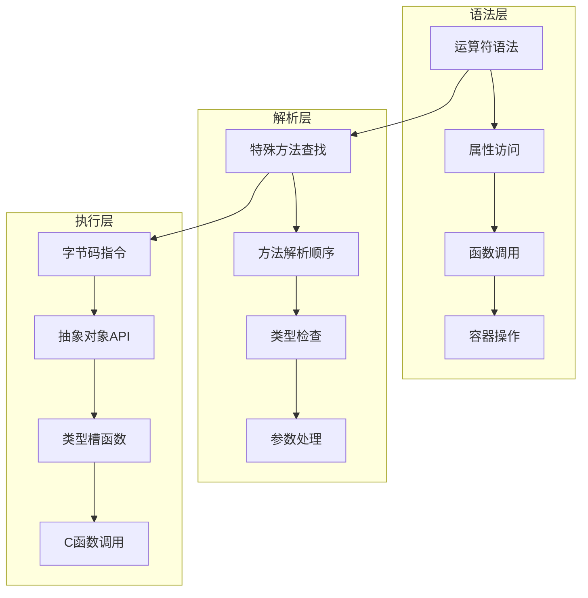

## 📋 概述

Python的数据模型定义了对象如何与语言的内置操作(如运算符、属性访问、函数调用等)交互。通过实现特殊方法(magic methods/dunder methods)，用户定义的类可以与Python的语法和内置函数无缝集成。本文档将深入分析CPython中数据模型的实现机制。

## 🎯 数据模型架构



## 1. 特殊方法查找机制

### 1.1 特殊方法查找流程

```c
/* Objects/typeobject.c - 特殊方法查找 */

PyObject *
_PyType_LookupId(PyTypeObject *type, _Py_Identifier *name)
{
    PyObject *mro, *res;
    Py_ssize_t i, n;

    /* 在类型的MRO中查找 */
    mro = type->tp_mro;
    assert(PyTuple_Check(mro));
    n = PyTuple_GET_SIZE(mro);

    for (i = 0; i < n; i++) {
        PyObject *base = PyTuple_GET_ITEM(mro, i);
        PyObject *dict = ((PyTypeObject *)base)->tp_dict;

        assert(dict && PyDict_Check(dict));
        res = PyDict_GetItemWithError(dict, _PyUnicode_FromId(name));
        if (res != NULL) {
            return res;
        }
        if (PyErr_Occurred()) {
            return NULL;
        }
    }
    return NULL;
}

/* 特殊方法的快速查找 */
static inline PyObject *
lookup_maybe(PyObject *self, _Py_Identifier *attrid)
{
    PyObject *res;
    res = _PyType_LookupId(Py_TYPE(self), attrid);
    if (res != NULL) {
        Py_INCREF(res);
        return res;
    }
    return NULL;
}
```

### 1.2 运算符重载实现

```c
/* Objects/abstract.c - 二元运算符实现 */

PyObject *
PyNumber_Add(PyObject *v, PyObject *w)
{
    PyObject *result = binary_op1(v, w, NB_SLOT(nb_add));
    if (result == Py_NotImplemented) {
        /* 尝试反向操作 */
        PyObject *result2 = binary_op1(w, v, NB_SLOT(nb_radd));
        if (result2 != Py_NotImplemented) {
            Py_DECREF(result);
            return result2;
        }
        Py_DECREF(result2);
    }
    return result;
}

static PyObject *
binary_op1(PyObject *v, PyObject *w, const int op_slot)
{
    PyObject *x;
    binaryfunc slotv = NULL;
    binaryfunc slotw = NULL;

    /* 获取左操作数的槽函数 */
    if (Py_TYPE(v)->tp_as_number != NULL) {
        slotv = NB_BINOP(Py_TYPE(v)->tp_as_number, op_slot);
    }

    /* 获取右操作数的槽函数 */
    if (Py_TYPE(w)->tp_as_number != NULL) {
        slotw = NB_BINOP(Py_TYPE(w)->tp_as_number, op_slot);
    }

    /* 如果类型相同，直接调用 */
    if (slotv == slotw) {
        if (slotv) {
            x = slotv(v, w);
            if (x != Py_NotImplemented)
                return x;
            Py_DECREF(x);
        }
        return Py_NewRef(Py_NotImplemented);
    }

    /* 尝试左操作数的方法 */
    if (slotv) {
        x = slotv(v, w);
        if (x != Py_NotImplemented)
            return x;
        Py_DECREF(x);
    }

    /* 尝试右操作数的方法 */
    if (slotw) {
        x = slotw(v, w);
        if (x != Py_NotImplemented)
            return x;
        Py_DECREF(x);
    }

    return Py_NewRef(Py_NotImplemented);
}
```

## 2. 重要魔术方法实现

### 2.1 对象创建与初始化

```c
/* Objects/typeobject.c - 对象创建流程 */

static PyObject *
slot_tp_new(PyTypeObject *type, PyObject *args, PyObject *kwds)
{
    PyObject *func, *result;

    /* 查找__new__方法 */
    func = _PyType_LookupId(type, &PyId___new__);
    if (func == NULL) {
        PyErr_Format(PyExc_AttributeError,
                     "type object '%.50s' has no attribute '%U'",
                     type->tp_name, _PyUnicode_FromId(&PyId___new__));
        return NULL;
    }

    /* __new__是静态方法，第一个参数是类型 */
    Py_INCREF(func);
    PyObject *new_args = PyTuple_New(PyTuple_GET_SIZE(args) + 1);
    if (new_args == NULL) {
        Py_DECREF(func);
        return NULL;
    }

    Py_INCREF(type);
    PyTuple_SET_ITEM(new_args, 0, (PyObject *)type);
    for (Py_ssize_t i = 0; i < PyTuple_GET_SIZE(args); i++) {
        PyObject *arg = PyTuple_GET_ITEM(args, i);
        Py_INCREF(arg);
        PyTuple_SET_ITEM(new_args, i + 1, arg);
    }

    /* 调用__new__方法 */
    result = PyObject_Call(func, new_args, kwds);
    Py_DECREF(func);
    Py_DECREF(new_args);

    return result;
}

static int
slot_tp_init(PyObject *self, PyObject *args, PyObject *kwds)
{
    PyObject *meth = lookup_method(self, &PyId___init__);
    PyObject *res;

    if (meth == NULL)
        return -1;

    /* 调用__init__方法 */
    res = PyObject_Call(meth, args, kwds);
    Py_DECREF(meth);
    if (res == NULL)
        return -1;

    if (res != Py_None) {
        PyErr_Format(PyExc_TypeError,
                     "__init__() should return None, not '%.200s'",
                     Py_TYPE(res)->tp_name);
        Py_DECREF(res);
        return -1;
    }
    Py_DECREF(res);
    return 0;
}
```

### 2.2 属性访问魔术方法

```c
/* Objects/object.c - 属性访问实现 */

PyObject *
PyObject_GenericGetAttr(PyObject *obj, PyObject *name)
{
    PyTypeObject *tp = Py_TYPE(obj);
    PyObject *descr = NULL;
    PyObject *res = NULL;
    descrgetfunc f;
    Py_ssize_t dictoffset;
    PyObject **dictptr;

    if (!PyUnicode_Check(name)){
        PyErr_Format(PyExc_TypeError,
                     "attribute name must be string, not '%.200s'",
                     Py_TYPE(name)->tp_name);
        return NULL;
    }

    /* 1. 在类型字典中查找描述符 */
    descr = _PyType_Lookup(tp, name);

    f = NULL;
    if (descr != NULL) {
        Py_INCREF(descr);
        f = Py_TYPE(descr)->tp_descr_get;
        /* 数据描述符优先级最高 */
        if (f != NULL && PyDescr_IsData(descr)) {
            res = f(descr, obj, (PyObject *)Py_TYPE(obj));
            goto done;
        }
    }

    /* 2. 在实例字典中查找 */
    dictoffset = tp->tp_dictoffset;
    if (dictoffset != 0) {
        PyObject *dict;
        dictptr = (PyObject **) ((char *)obj + dictoffset);
        dict = *dictptr;
        if (dict != NULL) {
            Py_INCREF(dict);
            res = PyDict_GetItemWithError(dict, name);
            if (res != NULL) {
                Py_INCREF(res);
                Py_DECREF(dict);
                goto done;
            }
            Py_DECREF(dict);
            if (PyErr_Occurred()) {
                goto done;
            }
        }
    }

    /* 3. 使用非数据描述符 */
    if (f != NULL) {
        res = f(descr, obj, (PyObject *)Py_TYPE(obj));
        goto done;
    }

    /* 4. 返回类属性 */
    if (descr != NULL) {
        res = descr;
        descr = NULL;
        goto done;
    }

    /* 5. 调用__getattr__方法 */
    PyObject *getattr = _PyType_LookupId(tp, &PyId___getattr__);
    if (getattr != NULL) {
        Py_INCREF(getattr);
        res = PyObject_CallFunctionObjArgs(getattr, obj, name, NULL);
        Py_DECREF(getattr);
        goto done;
    }

    /* 6. 属性不存在 */
    PyErr_Format(PyExc_AttributeError,
                 "'%.50s' object has no attribute '%U'",
                 tp->tp_name, name);
  done:
    Py_XDECREF(descr);
    return res;
}

/* 属性设置实现 */
int
PyObject_GenericSetAttr(PyObject *obj, PyObject *name, PyObject *value)
{
    PyTypeObject *tp = Py_TYPE(obj);
    PyObject *descr;
    descrsetfunc f;
    PyObject **dictptr;
    int res = -1;

    if (!PyUnicode_Check(name)){
        PyErr_Format(PyExc_TypeError,
                     "attribute name must be string, not '%.200s'",
                     Py_TYPE(name)->tp_name);
        return -1;
    }

    /* 查找数据描述符 */
    descr = _PyType_Lookup(tp, name);
    if (descr != NULL) {
        f = Py_TYPE(descr)->tp_descr_set;
        if (f != NULL) {
            /* 使用描述符的__set__方法 */
            res = f(descr, obj, value);
            goto done;
        }
    }

    /* 设置实例字典 */
    dictptr = _PyObject_GetDictPtr(obj);
    if (dictptr != NULL) {
        PyObject *dict = *dictptr;
        if (dict == NULL && value != NULL) {
            /* 创建实例字典 */
            dict = PyDict_New();
            if (dict == NULL)
                goto done;
            *dictptr = dict;
        }
        if (dict != NULL) {
            if (value == NULL)
                res = PyDict_DelItem(dict, name);
            else
                res = PyDict_SetItem(dict, name, value);
            goto done;
        }
    }

    if (descr == NULL) {
        PyErr_Format(PyExc_AttributeError,
                     "'%.100s' object has no attribute '%U'",
                     tp->tp_name, name);
        goto done;
    }

    PyErr_Format(PyExc_AttributeError,
                 "'%.50s' object attribute '%U' is read-only",
                 tp->tp_name, name);
  done:
    return res;
}
```

### 2.3 容器魔术方法

```c
/* Objects/abstract.c - 序列和映射协议 */

PyObject *
PyObject_GetItem(PyObject *o, PyObject *key)
{
    PyMappingMethods *m;
    PySequenceMethods *ms;

    if (o == NULL || key == NULL) {
        return null_error();
    }

    /* 尝试映射协议 */
    m = Py_TYPE(o)->tp_as_mapping;
    if (m && m->mp_subscript) {
        PyObject *item = m->mp_subscript(o, key);
        assert((item != NULL) ^ (PyErr_Occurred() != NULL));
        return item;
    }

    /* 尝试序列协议 */
    ms = Py_TYPE(o)->tp_as_sequence;
    if (ms && ms->sq_item) {
        if (PyIndex_Check(key)) {
            Py_ssize_t key_value = PyNumber_AsSsize_t(key, PyExc_IndexError);
            if (key_value == -1 && PyErr_Occurred())
                return NULL;
            return PySequence_GetItem(o, key_value);
        }
        else {
            PyErr_Format(PyExc_TypeError,
                         "sequence index must be integer, not '%.200s'",
                         Py_TYPE(key)->tp_name);
            return NULL;
        }
    }

    /* 尝试__getitem__方法 */
    PyObject *getitem = _PyType_LookupId(Py_TYPE(o), &PyId___getitem__);
    if (getitem != NULL) {
        Py_INCREF(getitem);
        PyObject *result = PyObject_CallFunctionObjArgs(getitem, o, key, NULL);
        Py_DECREF(getitem);
        return result;
    }

    return type_error("'%.200s' object is not subscriptable", o);
}

int
PyObject_SetItem(PyObject *o, PyObject *key, PyObject *value)
{
    PyMappingMethods *m;

    if (o == NULL || key == NULL || value == NULL) {
        null_error();
        return -1;
    }

    /* 尝试映射协议 */
    m = Py_TYPE(o)->tp_as_mapping;
    if (m && m->mp_ass_subscript)
        return m->mp_ass_subscript(o, key, value);

    /* 尝试序列协议 */
    if (Py_TYPE(o)->tp_as_sequence) {
        if (PyIndex_Check(key)) {
            Py_ssize_t key_value = PyNumber_AsSsize_t(key, PyExc_IndexError);
            if (key_value == -1 && PyErr_Occurred())
                return -1;
            return PySequence_SetItem(o, key_value, value);
        }
        else if (Py_TYPE(o)->tp_as_sequence->sq_ass_item) {
            type_error("sequence index must be integer, not '%.200s'", key);
            return -1;
        }
    }

    /* 尝试__setitem__方法 */
    PyObject *setitem = _PyType_LookupId(Py_TYPE(o), &PyId___setitem__);
    if (setitem != NULL) {
        Py_INCREF(setitem);
        int result = PyObject_CallFunctionObjArgs(setitem, o, key, value, NULL);
        Py_DECREF(setitem);
        return result == NULL ? -1 : 0;
    }

    type_error("'%.200s' object does not support item assignment", o);
    return -1;
}
```

## 3. 数据模型完整示例

### 3.1 自定义容器类

```python
# 完整的自定义容器实现
import collections.abc
from typing import Iterator, Any

class SmartList:
    """智能列表 - 演示完整的数据模型实现"""

    def __init__(self, iterable=None):
        """初始化智能列表"""
        self._items = list(iterable) if iterable else []
        self._access_count = 0

    # 1. 基本表示方法
    def __repr__(self):
        """开发者友好的表示"""
        return f"SmartList({self._items!r})"

    def __str__(self):
        """用户友好的表示"""
        return f"SmartList with {len(self._items)} items"

    def __bool__(self):
        """布尔值转换"""
        return bool(self._items)

    # 2. 容器协议
    def __len__(self):
        """返回长度"""
        return len(self._items)

    def __getitem__(self, key):
        """索引访问"""
        self._access_count += 1
        if isinstance(key, slice):
            return SmartList(self._items[key])
        return self._items[key]

    def __setitem__(self, key, value):
        """索引设置"""
        self._items[key] = value

    def __delitem__(self, key):
        """索引删除"""
        del self._items[key]

    def __contains__(self, item):
        """成员测试"""
        return item in self._items

    def __iter__(self):
        """迭代器"""
        return iter(self._items)

    def __reversed__(self):
        """反向迭代"""
        return reversed(self._items)

    # 3. 数值运算符
    def __add__(self, other):
        """加法：列表连接"""
        if isinstance(other, SmartList):
            return SmartList(self._items + other._items)
        elif isinstance(other, list):
            return SmartList(self._items + other)
        return NotImplemented

    def __radd__(self, other):
        """反向加法"""
        if isinstance(other, list):
            return SmartList(other + self._items)
        return NotImplemented

    def __iadd__(self, other):
        """就地加法"""
        if isinstance(other, (SmartList, list)):
            if isinstance(other, SmartList):
                self._items.extend(other._items)
            else:
                self._items.extend(other)
            return self
        return NotImplemented

    def __mul__(self, other):
        """乘法：重复"""
        if isinstance(other, int):
            return SmartList(self._items * other)
        return NotImplemented

    def __rmul__(self, other):
        """反向乘法"""
        return self.__mul__(other)

    def __imul__(self, other):
        """就地乘法"""
        if isinstance(other, int):
            self._items *= other
            return self
        return NotImplemented

    # 4. 比较运算符
    def __eq__(self, other):
        """相等比较"""
        if isinstance(other, SmartList):
            return self._items == other._items
        elif isinstance(other, list):
            return self._items == other
        return NotImplemented

    def __lt__(self, other):
        """小于比较"""
        if isinstance(other, SmartList):
            return self._items < other._items
        elif isinstance(other, list):
            return self._items < other
        return NotImplemented

    def __le__(self, other):
        """小于等于比较"""
        return self == other or self < other

    def __gt__(self, other):
        """大于比较"""
        if isinstance(other, (SmartList, list)):
            return not (self <= other)
        return NotImplemented

    def __ge__(self, other):
        """大于等于比较"""
        return self == other or self > other

    def __ne__(self, other):
        """不等比较"""
        result = self.__eq__(other)
        if result is NotImplemented:
            return result
        return not result

    # 5. 哈希支持（只读时）
    def __hash__(self):
        """哈希值（如果是不可变的话）"""
        # 注意：可变对象通常不应该是可哈希的
        # 这里仅作演示
        try:
            return hash(tuple(self._items))
        except TypeError:
            # 包含不可哈希元素
            raise TypeError("unhashable type: 'SmartList'")

    # 6. 调用协议
    def __call__(self, func):
        """使对象可调用 - 应用函数到所有元素"""
        return SmartList(func(item) for item in self._items)

    # 7. 上下文管理器协议
    def __enter__(self):
        """进入上下文"""
        print("进入SmartList上下文")
        return self

    def __exit__(self, exc_type, exc_val, exc_tb):
        """退出上下文"""
        print("退出SmartList上下文")
        if exc_type:
            print(f"异常类型: {exc_type.__name__}")
        return False  # 不抑制异常

    # 8. 属性访问
    def __getattr__(self, name):
        """动态属性访问"""
        if name == 'access_count':
            return self._access_count
        elif name == 'first':
            return self._items[0] if self._items else None
        elif name == 'last':
            return self._items[-1] if self._items else None
        raise AttributeError(f"'SmartList' object has no attribute '{name}'")

    def __setattr__(self, name, value):
        """属性设置控制"""
        if name.startswith('_') or name in ('_items', '_access_count'):
            # 内部属性直接设置
            super().__setattr__(name, value)
        else:
            raise AttributeError(f"can't set attribute '{name}'")

    def __dir__(self):
        """自定义dir()输出"""
        return ['append', 'extend', 'pop', 'remove', 'clear', 'copy',
                'access_count', 'first', 'last']

    # 9. 复制支持
    def __copy__(self):
        """浅复制"""
        return SmartList(self._items)

    def __deepcopy__(self, memo):
        """深复制"""
        import copy
        return SmartList(copy.deepcopy(self._items, memo))

    # 10. 序列化支持
    def __getstate__(self):
        """获取pickle状态"""
        return {'items': self._items, 'access_count': self._access_count}

    def __setstate__(self, state):
        """设置pickle状态"""
        self._items = state['items']
        self._access_count = state['access_count']

    # 11. 大小计算
    def __sizeof__(self):
        """返回对象大小"""
        import sys
        return (sys.getsizeof(self._items) +
                sys.getsizeof(self._access_count) +
                super().__sizeof__())

    # 12. 格式化支持
    def __format__(self, format_spec):
        """格式化输出"""
        if format_spec == 'count':
            return f"{len(self._items)} items"
        elif format_spec == 'detail':
            return f"SmartList({len(self._items)} items, {self._access_count} accesses)"
        else:
            return str(self)

    # 常用方法
    def append(self, item):
        """添加元素"""
        self._items.append(item)

    def extend(self, iterable):
        """扩展列表"""
        self._items.extend(iterable)

    def pop(self, index=-1):
        """弹出元素"""
        return self._items.pop(index)

    def remove(self, value):
        """移除元素"""
        self._items.remove(value)

    def clear(self):
        """清空列表"""
        self._items.clear()
        self._access_count = 0

    def copy(self):
        """复制列表"""
        return SmartList(self._items)

# 注册为容器抽象基类
collections.abc.MutableSequence.register(SmartList)

# 使用示例
if __name__ == "__main__":
    # 创建智能列表
    sl = SmartList([1, 2, 3, 4, 5])

    # 测试表示方法
    print(f"repr: {repr(sl)}")
    print(f"str: {str(sl)}")
    print(f"bool: {bool(sl)}")
    print(f"格式化: {sl:count}")
    print(f"详细格式: {sl:detail}")

    # 测试容器操作
    print(f"长度: {len(sl)}")
    print(f"索引访问: {sl[2]}")
    print(f"切片: {sl[1:4]}")
    print(f"包含测试: {3 in sl}")

    # 测试运算符
    sl2 = SmartList([6, 7, 8])
    print(f"加法: {sl + sl2}")
    print(f"乘法: {sl * 2}")

    # 测试比较
    print(f"相等: {sl == [1, 2, 3, 4, 5]}")
    print(f"小于: {sl < SmartList([1, 2, 3, 4, 6])}")

    # 测试动态属性
    print(f"访问次数: {sl.access_count}")
    print(f"第一个元素: {sl.first}")
    print(f"最后一个元素: {sl.last}")

    # 测试上下文管理器
    with sl as context_sl:
        print("在上下文中操作")
        context_sl.append(6)

    # 测试调用协议
    squared = sl(lambda x: x ** 2)
    print(f"平方: {squared}")

    # 测试复制
    import copy
    sl_copy = copy.copy(sl)
    sl_deepcopy = copy.deepcopy(sl)
    print(f"浅复制: {sl_copy}")
    print(f"深复制: {sl_deepcopy}")

    # 测试序列化
    import pickle
    pickled = pickle.dumps(sl)
    unpickled = pickle.loads(pickled)
    print(f"序列化后: {unpickled}")

    # 测试大小
    import sys
    print(f"对象大小: {sys.getsizeof(sl)} bytes")
    print(f"自定义大小: {sl.__sizeof__()} bytes")
```

### 3.2 描述符实现示例

```python
# 高级描述符实现
import weakref
from typing import Any, Dict, Optional

class ValidatedAttribute:
    """验证属性描述符"""

    def __init__(self, validator=None, default=None, doc=None):
        self.validator = validator
        self.default = default
        self.__doc__ = doc
        self.name = None
        # 使用弱引用避免循环引用
        self.data = weakref.WeakKeyDictionary()

    def __set_name__(self, owner, name):
        """设置描述符名称"""
        self.name = name

    def __get__(self, obj, objtype=None):
        """获取属性值"""
        if obj is None:
            return self
        return self.data.get(obj, self.default)

    def __set__(self, obj, value):
        """设置属性值"""
        if self.validator:
            value = self.validator(value)
        self.data[obj] = value

    def __delete__(self, obj):
        """删除属性"""
        if obj in self.data:
            del self.data[obj]
        else:
            raise AttributeError(f"'{self.name}' not set")

class TypedAttribute(ValidatedAttribute):
    """类型检查属性描述符"""

    def __init__(self, expected_type, **kwargs):
        def type_validator(value):
            if not isinstance(value, expected_type):
                raise TypeError(
                    f"Expected {expected_type.__name__}, got {type(value).__name__}"
                )
            return value
        super().__init__(validator=type_validator, **kwargs)

class RangeAttribute(ValidatedAttribute):
    """范围检查属性描述符"""

    def __init__(self, min_val=None, max_val=None, **kwargs):
        def range_validator(value):
            if min_val is not None and value < min_val:
                raise ValueError(f"Value {value} < minimum {min_val}")
            if max_val is not None and value > max_val:
                raise ValueError(f"Value {value} > maximum {max_val}")
            return value
        super().__init__(validator=range_validator, **kwargs)

class CachedProperty:
    """缓存属性描述符"""

    def __init__(self, func):
        self.func = func
        self.name = func.__name__
        self.__doc__ = func.__doc__

    def __get__(self, obj, objtype=None):
        if obj is None:
            return self

        # 检查是否已缓存
        cache_name = f'_cached_{self.name}'
        if hasattr(obj, cache_name):
            return getattr(obj, cache_name)

        # 计算并缓存值
        value = self.func(obj)
        setattr(obj, cache_name, value)
        return value

    def __set__(self, obj, value):
        # 允许手动设置缓存值
        cache_name = f'_cached_{self.name}'
        setattr(obj, cache_name, value)

    def __delete__(self, obj):
        # 清除缓存
        cache_name = f'_cached_{self.name}'
        if hasattr(obj, cache_name):
            delattr(obj, cache_name)

# 使用描述符的类
class Person:
    """使用各种描述符的人员类"""

    # 类型检查属性
    name = TypedAttribute(str, default="Unknown")
    age = TypedAttribute(int, default=0)

    # 范围检查属性
    score = RangeAttribute(min_val=0, max_val=100, default=0)

    # 复合验证
    email = ValidatedAttribute(
        validator=lambda x: x if '@' in x else None,
        doc="Email address (must contain @)"
    )

    def __init__(self, name, age, score=0, email=None):
        self.name = name
        self.age = age
        self.score = score
        if email:
            self.email = email

    @CachedProperty
    def full_info(self):
        """完整信息（计算密集型，使用缓存）"""
        print("计算完整信息...")  # 显示何时计算
        return f"{self.name} (age: {self.age}, score: {self.score})"

    @CachedProperty
    def age_category(self):
        """年龄分类"""
        print("计算年龄分类...")
        if self.age < 18:
            return "未成年"
        elif self.age < 60:
            return "成年"
        else:
            return "老年"

    def __repr__(self):
        return f"Person(name='{self.name}', age={self.age})"

# 测试描述符
if __name__ == "__main__":
    # 创建Person实例
    person = Person("张三", 25, 85)

    print(f"创建: {person}")
    print(f"分数: {person.score}")

    # 测试类型检查
    try:
        person.age = "invalid"  # 应该报错
    except TypeError as e:
        print(f"类型错误: {e}")

    # 测试范围检查
    try:
        person.score = 150  # 应该报错
    except ValueError as e:
        print(f"范围错误: {e}")

    # 测试邮箱验证
    try:
        person.email = "invalid_email"  # 返回None
        print(f"邮箱: {person.email}")
    except Exception as e:
        print(f"邮箱错误: {e}")

    person.email = "zhangsan@example.com"
    print(f"有效邮箱: {person.email}")

    # 测试缓存属性
    print("\n测试缓存属性:")
    print(f"第一次访问: {person.full_info}")  # 会计算
    print(f"第二次访问: {person.full_info}")  # 使用缓存

    print(f"年龄分类: {person.age_category}")  # 会计算
    print(f"年龄分类: {person.age_category}")  # 使用缓存

    # 修改属性后，缓存依然有效（需要手动清除）
    person.age = 65
    print(f"修改年龄后: {person.age_category}")  # 仍然是缓存值

    # 手动清除缓存
    del person.age_category
    print(f"清除缓存后: {person.age_category}")  # 重新计算
```

## 4. 性能优化与最佳实践

### 4.1 特殊方法性能考虑

```python
# 特殊方法性能优化示例
import time
import operator
from functools import total_ordering

# 高效的比较实现
@total_ordering
class OptimizedPoint:
    """优化的点类"""

    __slots__ = ('x', 'y')  # 减少内存使用

    def __init__(self, x, y):
        self.x = x
        self.y = y

    def __eq__(self, other):
        """相等比较 - 最常用的比较操作"""
        if not isinstance(other, OptimizedPoint):
            return NotImplemented
        return self.x == other.x and self.y == other.y

    def __lt__(self, other):
        """小于比较 - 用于排序"""
        if not isinstance(other, OptimizedPoint):
            return NotImplemented
        # 按距离原点的距离排序
        return (self.x*self.x + self.y*self.y) < (other.x*other.x + other.y*other.y)

    def __hash__(self):
        """高效的哈希实现"""
        return hash((self.x, self.y))

    def __repr__(self):
        """快速表示"""
        return f"Point({self.x}, {self.y})"

# 性能测试
def benchmark_special_methods():
    """特殊方法性能基准测试"""

    # 创建大量点对象
    points = [OptimizedPoint(i, i*2) for i in range(10000)]

    # 测试相等比较
    start = time.time()
    equal_count = sum(1 for p in points if p == OptimizedPoint(5000, 10000))
    eq_time = time.time() - start

    # 测试排序
    start = time.time()
    sorted_points = sorted(points)
    sort_time = time.time() - start

    # 测试哈希
    start = time.time()
    point_set = set(points)
    hash_time = time.time() - start

    print(f"相等比较时间: {eq_time:.4f}秒 (找到 {equal_count} 个)")
    print(f"排序时间: {sort_time:.4f}秒")
    print(f"哈希/集合创建时间: {hash_time:.4f}秒")
    print(f"集合大小: {len(point_set)}")

# 运行性能测试
benchmark_special_methods()
```

### 4.2 内存优化技巧

```python
# 内存优化的数据模型实现
import sys
from typing import Union

class MemoryEfficientClass:
    """内存高效的类实现"""

    # 使用__slots__减少内存使用
    __slots__ = ('_data', '_size', '_capacity')

    def __init__(self, initial_capacity=10):
        self._data = [None] * initial_capacity
        self._size = 0
        self._capacity = initial_capacity

    def __len__(self):
        return self._size

    def __getitem__(self, index):
        if not 0 <= index < self._size:
            raise IndexError("index out of range")
        return self._data[index]

    def __setitem__(self, index, value):
        if not 0 <= index < self._size:
            raise IndexError("index out of range")
        self._data[index] = value

    def __sizeof__(self):
        """准确计算对象大小"""
        return (sys.getsizeof(self._data) +
                sys.getsizeof(self._size) +
                sys.getsizeof(self._capacity) +
                object.__sizeof__(self))

    def append(self, value):
        """添加元素"""
        if self._size >= self._capacity:
            self._resize()
        self._data[self._size] = value
        self._size += 1

    def _resize(self):
        """扩容"""
        old_capacity = self._capacity
        self._capacity *= 2
        new_data = [None] * self._capacity
        new_data[:old_capacity] = self._data
        self._data = new_data

# 内存使用对比
def compare_memory_usage():
    """对比内存使用"""

    # 普通列表
    normal_list = []
    for i in range(1000):
        normal_list.append(i)

    # 优化的类
    efficient_obj = MemoryEfficientClass(1000)
    for i in range(1000):
        efficient_obj.append(i)

    # 带__slots__的类
    class SlottedClass:
        __slots__ = ('value',)
        def __init__(self, value):
            self.value = value

    # 普通类
    class NormalClass:
        def __init__(self, value):
            self.value = value

    slotted_objects = [SlottedClass(i) for i in range(1000)]
    normal_objects = [NormalClass(i) for i in range(1000)]

    print("内存使用对比:")
    print(f"普通列表: {sys.getsizeof(normal_list)} bytes")
    print(f"优化对象: {efficient_obj.__sizeof__()} bytes")
    print(f"1000个__slots__对象: {sum(sys.getsizeof(obj) for obj in slotted_objects)} bytes")
    print(f"1000个普通对象: {sum(sys.getsizeof(obj) for obj in normal_objects)} bytes")

compare_memory_usage()
```

## 5. 总结

Python数据模型通过特殊方法提供了强大而灵活的对象行为定制能力：

### 5.1 核心优势

1. **语法集成**: 特殊方法让自定义类与Python语法无缝集成
2. **协议统一**: 统一的接口协议简化了代码理解和使用
3. **性能优化**: 底层C实现确保了高效的操作执行
4. **扩展性**: 灵活的方法解析机制支持复杂的继承结构

### 5.2 最佳实践

1. **选择性实现**: 只实现需要的特殊方法，避免过度复杂化
2. **一致性**: 确保相关方法的行为一致（如==和__hash__）
3. **性能考虑**: 重要的特殊方法应该高效实现
4. **文档化**: 特殊方法的行为应该有清晰的文档说明

### 5.3 常见陷阱

1. **可变对象哈希**: 可变对象通常不应该实现__hash__
2. **比较操作**: 实现比较时要考虑类型兼容性
3. **内存泄漏**: 描述符使用时要注意循环引用问题

Python的数据模型是语言设计的核心，它让Python具有了强大的表达力和扩展性，使得用户定义的类能够与内置类型一样自然地工作。
