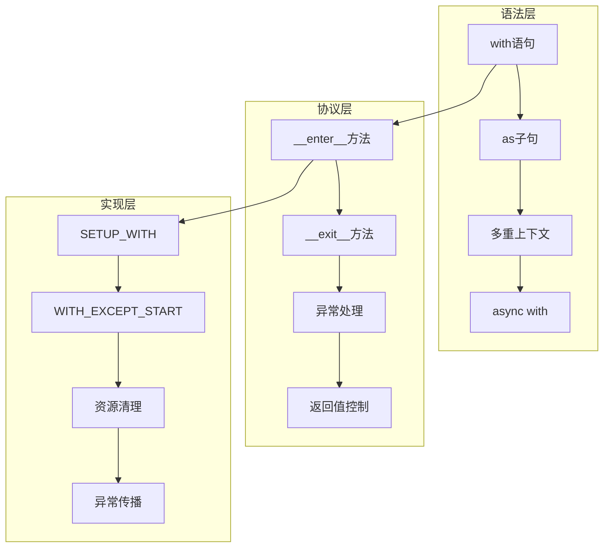
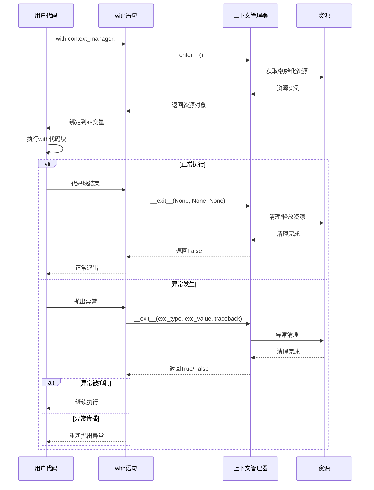

## 📋 概述

上下文管理器是Python中管理资源生命周期的重要机制，通过with语句提供了自动资源获取和释放的能力。本文档将深入分析CPython中上下文管理器的实现机制，包括with语句编译、上下文协议、异常处理、以及contextlib模块的高级特性。

## 🎯 上下文管理系统架构



## 1. with语句的编译实现

### 1.1 with语句AST结构

```c
/* Include/Python-ast.h - with语句AST定义 */

typedef struct _stmt *stmt_ty;
typedef struct _withitem *withitem_ty;

/* With语句结构 */
struct _stmt {
    enum _stmt_kind kind;
    union {
        struct {
            asdl_withitem_seq *items;  /* with项目序列 */
            asdl_stmt_seq *body;       /* with代码块 */
        } With;

        struct {
            asdl_withitem_seq *items;  /* async with项目序列 */
            asdl_stmt_seq *body;       /* async with代码块 */
        } AsyncWith;
        /* 其他语句类型... */
    } v;
    int lineno, col_offset, end_lineno, end_col_offset;
};

/* with项目结构 */
struct _withitem {
    expr_ty context_expr;      /* 上下文表达式 */
    expr_ty optional_vars;     /* 可选的as变量 */
};
```

### 1.2 with语句编译

```c
/* Python/codegen.c - with语句编译 */

static int
codegen_with(compiler *c, stmt_ty s, int pos)
{
    location loc = LOC(s);
    withitem_ty item = asdl_seq_GET(s->v.With.items, pos);

    /* 编译上下文表达式 */
    VISIT(c, expr, item->context_expr);

    /* 复制上下文管理器对象 */
    ADDOP_I(c, loc, COPY, 1);

    /* 加载__exit__方法 */
    ADDOP_I(c, loc, LOAD_SPECIAL, SPECIAL___EXIT__);

    /* 交换栈顶元素 */
    ADDOP_I(c, loc, SWAP, 2);
    ADDOP_I(c, loc, SWAP, 3);

    /* 加载并调用__enter__方法 */
    ADDOP_I(c, loc, LOAD_SPECIAL, SPECIAL___ENTER__);
    ADDOP_I(c, loc, CALL, 0);

    /* 设置with块的异常处理 */
    NEW_JUMP_TARGET_LABEL(c, final);
    ADDOP_JUMP(c, loc, SETUP_WITH, final);

    /* 处理as变量绑定 */
    if (item->optional_vars) {
        VISIT(c, expr, item->optional_vars);
    } else {
        /* 如果没有as变量，丢弃__enter__的返回值 */
        ADDOP(c, loc, POP_TOP);
    }

    /* 处理下一个with项或代码体 */
    pos++;
    if (pos == asdl_seq_LEN(s->v.With.items)) {
        /* 编译with代码体 */
        VISIT_SEQ(c, stmt, s->v.With.body);
    } else {
        /* 递归处理嵌套with */
        RETURN_IF_ERROR(codegen_with(c, s, pos));
    }

    /* 正常退出路径 */
    ADDOP(c, loc, POP_BLOCK);

    /* 调用__exit__(None, None, None) */
    RETURN_IF_ERROR(codegen_call_exit_with_nones(c, loc));
    ADDOP(c, loc, POP_TOP);

    /* 跳转到结束 */
    NEW_JUMP_TARGET_LABEL(c, exit);
    ADDOP_JUMP(c, loc, JUMP, exit);

    /* 异常处理路径 */
    USE_LABEL(c, final);

    /* 设置异常清理 */
    NEW_JUMP_TARGET_LABEL(c, cleanup);
    ADDOP_JUMP(c, loc, SETUP_CLEANUP, cleanup);

    /* 推入异常信息 */
    ADDOP(c, loc, PUSH_EXC_INFO);

    /* 开始with异常处理 */
    ADDOP(c, loc, WITH_EXCEPT_START);
    ADDOP_JUMP(c, loc, POP_JUMP_IF_TRUE, cleanup);

    /* 重新抛出异常 */
    ADDOP_I(c, loc, RERAISE, 1);

    /* 清理路径 */
    USE_LABEL(c, cleanup);
    ADDOP(c, loc, POP_EXCEPT);
    ADDOP(c, loc, POP_TOP);
    ADDOP(c, loc, POP_TOP);

    USE_LABEL(c, exit);
    return SUCCESS;
}

/* 调用__exit__(None, None, None) */
static int
codegen_call_exit_with_nones(compiler *c, location loc)
{
    ADDOP_LOAD_CONST(c, loc, Py_None);  /* exc_type */
    ADDOP_LOAD_CONST(c, loc, Py_None);  /* exc_value */
    ADDOP_LOAD_CONST(c, loc, Py_None);  /* traceback */
    ADDOP_I(c, loc, CALL, 3);
    return SUCCESS;
}
```

## 2. with语句字节码执行

### 2.1 核心字节码指令

```c
/* Python/ceval.c - with相关字节码执行 */

case TARGET(SETUP_WITH): {
    /* 设置with块的异常处理 */
    PyObject *mgr = TOP();
    PyObject *enter = NULL, *exit = NULL;

    /* 获取__enter__和__exit__方法 */
    if (_PyObject_LookupAttr(mgr, &_Py_ID(__enter__), &enter) < 0) {
        goto error;
    }
    if (enter == NULL) {
        PyErr_Format(PyExc_AttributeError,
                     "'%T' object does not have __enter__ method",
                     mgr);
        goto error;
    }

    if (_PyObject_LookupAttr(mgr, &_Py_ID(__exit__), &exit) < 0) {
        Py_DECREF(enter);
        goto error;
    }
    if (exit == NULL) {
        PyErr_Format(PyExc_AttributeError,
                     "'%T' object does not have __exit__ method",
                     mgr);
        Py_DECREF(enter);
        goto error;
    }

    /* 设置异常处理块 */
    SET_TOP(exit);
    PUSH(enter);
    PUSH(mgr);

    /* 推入异常处理块到栈 */
    PyFrame_BlockSetup(frame, SETUP_WITH, INSTR_OFFSET() + oparg, STACK_LEVEL());
    DISPATCH();
}

case TARGET(WITH_EXCEPT_START): {
    /* with块异常处理开始 */
    PyObject *exc, *val, *tb, *exit_func, *res;

    /* 获取异常信息 */
    exc = TOP();
    val = SECOND();
    tb = THIRD();
    exit_func = PEEK(7);

    /* 调用__exit__(exc_type, exc_value, traceback) */
    PyObject *stack[4] = {NULL, exit_func, exc, val, tb};
    res = PyObject_Vectorcall(exit_func, stack + 1, 3 | PY_VECTORCALL_ARGUMENTS_OFFSET, NULL);

    if (res == NULL) {
        goto error;
    }

    /* 检查__exit__的返回值 */
    int err = PyObject_IsTrue(res);
    Py_DECREF(res);

    if (err < 0) {
        goto error;
    }

    if (err > 0) {
        /* __exit__返回True，抑制异常 */
        PUSH(Py_True);
    } else {
        /* __exit__返回False，不抑制异常 */
        PUSH(Py_False);
    }

    DISPATCH();
}

case TARGET(SETUP_CLEANUP): {
    /* 设置清理处理 */
    PyFrame_BlockSetup(frame, SETUP_CLEANUP, INSTR_OFFSET() + oparg, STACK_LEVEL());
    DISPATCH();
}
```

### 2.2 异常处理机制

```c
/* Python/ceval.c - with块异常处理 */

static void
format_with_traceback(PyObject *mgr, PyObject *exc_info)
{
    /* 格式化with块中的异常追踪信息 */
    PyObject *exc_type, *exc_value, *exc_traceback;

    if (!PyArg_UnpackTuple(exc_info, "exc_info", 3, 3,
                          &exc_type, &exc_value, &exc_traceback)) {
        return;
    }

    /* 添加上下文管理器信息到异常 */
    if (exc_value != NULL && exc_value != Py_None) {
        PyObject *context_info = PyUnicode_FromFormat(
            "Exception occurred in context manager %R", mgr);
        if (context_info) {
            PyException_SetContext(exc_value, context_info);
        }
    }
}

/* with块异常传播控制 */
static int
handle_with_exception(PyObject *exit_result, PyObject *exc_info)
{
    /* 处理__exit__方法的返回值 */

    if (exit_result == NULL) {
        /* __exit__方法本身抛出异常 */
        return -1;
    }

    /* 检查返回值的真假 */
    int suppress = PyObject_IsTrue(exit_result);
    if (suppress < 0) {
        return -1;
    }

    if (suppress) {
        /* 返回True，抑制异常 */
        return 1;
    } else {
        /* 返回False或None，传播异常 */
        return 0;
    }
}
```

## 3. 上下文管理器协议实现

### 3.1 基础上下文管理器

```python
# 基础上下文管理器实现
import os
import tempfile
import shutil
from typing import Optional, Any, Type
import traceback

class FileManager:
    """文件上下文管理器"""

    def __init__(self, filename: str, mode: str = 'r', encoding: str = 'utf-8'):
        self.filename = filename
        self.mode = mode
        self.encoding = encoding
        self.file = None
        self.opened = False

    def __enter__(self):
        """进入上下文时调用"""
        print(f"打开文件: {self.filename}")
        try:
            self.file = open(self.filename, self.mode, encoding=self.encoding)
            self.opened = True
            return self.file
        except Exception as e:
            print(f"打开文件失败: {e}")
            raise

    def __exit__(self, exc_type: Optional[Type[BaseException]],
                 exc_value: Optional[BaseException],
                 traceback_obj: Optional[Any]) -> bool:
        """退出上下文时调用"""
        print(f"关闭文件: {self.filename}")

        if self.file and self.opened:
            try:
                self.file.close()
                self.opened = False
                print("文件已成功关闭")
            except Exception as e:
                print(f"关闭文件时出错: {e}")

        if exc_type is not None:
            print(f"捕获到异常: {exc_type.__name__}: {exc_value}")
            # 返回False表示不抑制异常
            return False

        return False

class DatabaseConnection:
    """数据库连接上下文管理器"""

    def __init__(self, connection_string: str):
        self.connection_string = connection_string
        self.connection = None
        self.transaction = None

    def __enter__(self):
        """建立数据库连接"""
        print(f"连接数据库: {self.connection_string}")
        # 模拟数据库连接
        self.connection = f"Connection({self.connection_string})"
        self.transaction = "Transaction_001"
        print("数据库连接建立成功")
        return self

    def __exit__(self, exc_type, exc_value, traceback_obj):
        """关闭数据库连接"""
        if exc_type is not None:
            print(f"事务回滚: {exc_type.__name__}")
            # 模拟事务回滚
            self.transaction = None
        else:
            print("事务提交")
            # 模拟事务提交

        if self.connection:
            print("关闭数据库连接")
            self.connection = None

        # 不抑制异常
        return False

    def execute(self, query: str):
        """执行SQL查询"""
        if not self.connection:
            raise RuntimeError("数据库未连接")
        print(f"执行查询: {query}")
        return f"Result for: {query}"

class TemporaryDirectory:
    """临时目录上下文管理器"""

    def __init__(self, prefix: str = "temp_", cleanup: bool = True):
        self.prefix = prefix
        self.cleanup = cleanup
        self.path = None

    def __enter__(self):
        """创建临时目录"""
        self.path = tempfile.mkdtemp(prefix=self.prefix)
        print(f"创建临时目录: {self.path}")
        return self.path

    def __exit__(self, exc_type, exc_value, traceback_obj):
        """清理临时目录"""
        if self.cleanup and self.path and os.path.exists(self.path):
            try:
                shutil.rmtree(self.path)
                print(f"清理临时目录: {self.path}")
            except Exception as e:
                print(f"清理临时目录失败: {e}")

        return False

# 使用基础上下文管理器
def test_basic_context_managers():
    """测试基础上下文管理器"""

    print("=== 文件管理器测试 ===")
    try:
        with FileManager("test.txt", "w") as f:
            f.write("Hello, World!")
            print("文件写入完成")
    except Exception as e:
        print(f"文件操作失败: {e}")

    print("\n=== 数据库连接测试 ===")
    try:
        with DatabaseConnection("sqlite:///example.db") as db:
            result = db.execute("SELECT * FROM users")
            print(f"查询结果: {result}")
            # 模拟一个错误
            # raise ValueError("模拟数据库错误")
    except Exception as e:
        print(f"数据库操作失败: {e}")

    print("\n=== 临时目录测试 ===")
    with TemporaryDirectory("myapp_") as temp_dir:
        print(f"在临时目录中工作: {temp_dir}")

        # 创建一些临时文件
        temp_file = os.path.join(temp_dir, "temp_file.txt")
        with open(temp_file, "w") as f:
            f.write("临时文件内容")

        print(f"创建临时文件: {temp_file}")

test_basic_context_managers()
```

### 3.2 高级上下文管理器模式

```python
# 高级上下文管理器模式
import threading
import time
import functools
from contextlib import contextmanager, ExitStack, suppress, closing
from typing import Generator, Any
import weakref

class ResourcePool:
    """资源池上下文管理器"""

    def __init__(self, resource_factory, max_size: int = 10):
        self.resource_factory = resource_factory
        self.max_size = max_size
        self.pool = []
        self.in_use = set()
        self.lock = threading.Lock()

    def __enter__(self):
        with self.lock:
            if self.pool:
                resource = self.pool.pop()
            else:
                resource = self.resource_factory()

            self.in_use.add(resource)
            return resource

    def __exit__(self, exc_type, exc_value, traceback_obj):
        resource = None
        # 找到要归还的资源（简化实现）
        with self.lock:
            if self.in_use:
                resource = next(iter(self.in_use))
                self.in_use.remove(resource)

                if len(self.pool) < self.max_size:
                    self.pool.append(resource)
                else:
                    # 资源池满了，销毁资源
                    if hasattr(resource, 'close'):
                        resource.close()

class TimingContext:
    """计时上下文管理器"""

    def __init__(self, name: str = "Operation", logger=None):
        self.name = name
        self.logger = logger
        self.start_time = None
        self.end_time = None

    def __enter__(self):
        self.start_time = time.time()
        message = f"开始 {self.name}"
        if self.logger:
            self.logger.info(message)
        else:
            print(message)
        return self

    def __exit__(self, exc_type, exc_value, traceback_obj):
        self.end_time = time.time()
        duration = self.end_time - self.start_time

        if exc_type is not None:
            message = f"{self.name} 失败，耗时: {duration:.3f}秒 - {exc_type.__name__}: {exc_value}"
        else:
            message = f"{self.name} 完成，耗时: {duration:.3f}秒"

        if self.logger:
            self.logger.info(message)
        else:
            print(message)

        return False  # 不抑制异常

    @property
    def duration(self):
        """获取执行时间"""
        if self.start_time and self.end_time:
            return self.end_time - self.start_time
        return None

class StateManager:
    """状态管理上下文管理器"""

    def __init__(self, obj, **state_changes):
        self.obj = obj
        self.state_changes = state_changes
        self.original_state = {}

    def __enter__(self):
        # 保存原始状态
        for attr_name in self.state_changes:
            if hasattr(self.obj, attr_name):
                self.original_state[attr_name] = getattr(self.obj, attr_name)

        # 应用新状态
        for attr_name, new_value in self.state_changes.items():
            setattr(self.obj, attr_name, new_value)

        return self.obj

    def __exit__(self, exc_type, exc_value, traceback_obj):
        # 恢复原始状态
        for attr_name, original_value in self.original_state.items():
            setattr(self.obj, attr_name, original_value)

        return False

class LockManager:
    """锁管理上下文管理器"""

    def __init__(self, *locks, timeout=None):
        self.locks = locks
        self.timeout = timeout
        self.acquired_locks = []

    def __enter__(self):
        start_time = time.time()

        for lock in self.locks:
            if self.timeout:
                remaining_time = self.timeout - (time.time() - start_time)
                if remaining_time <= 0:
                    self._release_all()
                    raise TimeoutError("无法在指定时间内获取所有锁")

                acquired = lock.acquire(timeout=remaining_time)
            else:
                acquired = lock.acquire()

            if acquired:
                self.acquired_locks.append(lock)
            else:
                self._release_all()
                raise RuntimeError("无法获取锁")

        return self.acquired_locks

    def __exit__(self, exc_type, exc_value, traceback_obj):
        self._release_all()
        return False

    def _release_all(self):
        for lock in reversed(self.acquired_locks):
            try:
                lock.release()
            except Exception as e:
                print(f"释放锁时出错: {e}")
        self.acquired_locks.clear()

# 函数式上下文管理器
@contextmanager
def temporary_attribute(obj, **kwargs) -> Generator[Any, None, None]:
    """临时设置对象属性"""
    old_values = {}

    # 保存原始值并设置新值
    for name, value in kwargs.items():
        if hasattr(obj, name):
            old_values[name] = getattr(obj, name)
        setattr(obj, name, value)

    try:
        yield obj
    finally:
        # 恢复原始值
        for name, value in kwargs.items():
            if name in old_values:
                setattr(obj, name, old_values[name])
            else:
                delattr(obj, name)

@contextmanager
def error_handler(error_types=Exception, default_return=None, log_errors=True):
    """错误处理上下文管理器"""
    try:
        yield
    except error_types as e:
        if log_errors:
            print(f"捕获到错误: {type(e).__name__}: {e}")
        if default_return is not None:
            return default_return

@contextmanager
def change_directory(path):
    """临时更改工作目录"""
    old_cwd = os.getcwd()
    try:
        os.chdir(path)
        yield path
    finally:
        os.chdir(old_cwd)

# 测试高级上下文管理器
def test_advanced_context_managers():
    """测试高级上下文管理器"""

    print("=== 资源池测试 ===")
    def create_connection():
        return f"Connection_{time.time()}"

    pool = ResourcePool(create_connection, max_size=3)

    with pool as conn1:
        print(f"获取连接1: {conn1}")
        with pool as conn2:
            print(f"获取连接2: {conn2}")

    print("\n=== 计时上下文测试 ===")
    with TimingContext("数据处理操作") as timer:
        time.sleep(0.1)  # 模拟耗时操作
        print("执行数据处理...")
    print(f"操作耗时: {timer.duration:.3f}秒")

    print("\n=== 状态管理测试 ===")
    class TestObject:
        def __init__(self):
            self.value = 10
            self.name = "original"

    obj = TestObject()
    print(f"原始状态: value={obj.value}, name={obj.name}")

    with StateManager(obj, value=100, name="temporary"):
        print(f"临时状态: value={obj.value}, name={obj.name}")

    print(f"恢复状态: value={obj.value}, name={obj.name}")

    print("\n=== 锁管理测试 ===")
    lock1 = threading.Lock()
    lock2 = threading.Lock()

    with LockManager(lock1, lock2, timeout=1.0):
        print("成功获取所有锁")
        # 执行需要多个锁的操作

    print("\n=== 函数式上下文管理器测试 ===")
    with temporary_attribute(obj, temp_attr="临时值", value=999):
        print(f"临时属性: temp_attr={getattr(obj, 'temp_attr', None)}, value={obj.value}")

    print(f"恢复后: temp_attr存在={hasattr(obj, 'temp_attr')}, value={obj.value}")

    print("\n=== 错误处理上下文测试 ===")
    with error_handler(ValueError, default_return="错误处理"):
        print("正常执行")
        # raise ValueError("测试错误")  # 取消注释测试错误处理

    print("\n=== 目录更改测试 ===")
    current_dir = os.getcwd()
    print(f"当前目录: {current_dir}")

    try:
        with change_directory("/tmp"):
            print(f"临时目录: {os.getcwd()}")
    except Exception as e:
        print(f"目录更改失败: {e}")

    print(f"恢复目录: {os.getcwd()}")

test_advanced_context_managers()
```

### 3.3 contextlib模块深度应用

```python
# contextlib模块深度应用
from contextlib import (
    contextmanager, ExitStack, suppress, closing,
    nullcontext, redirect_stdout, redirect_stderr
)
import sys
import io
import json
import subprocess
from typing import Dict, Any

def advanced_contextlib_usage():
    """contextlib模块高级用法"""

    print("=== ExitStack 使用示例 ===")
    def process_multiple_files(filenames):
        """处理多个文件，自动管理所有文件对象"""
        with ExitStack() as stack:
            files = [
                stack.enter_context(open(fname, 'r'))
                for fname in filenames if os.path.exists(fname)
            ]

            print(f"成功打开 {len(files)} 个文件")

            # 处理所有文件
            for i, file in enumerate(files):
                try:
                    content = file.read()
                    print(f"文件 {i+1} 内容长度: {len(content)} 字符")
                except Exception as e:
                    print(f"读取文件 {i+1} 失败: {e}")

            # 所有文件会被自动关闭

    # 创建测试文件
    test_files = ["test1.txt", "test2.txt", "test3.txt"]
    for fname in test_files:
        try:
            with open(fname, 'w') as f:
                f.write(f"Content of {fname}")
        except Exception:
            pass

    process_multiple_files(test_files)

    # 清理测试文件
    for fname in test_files:
        try:
            os.remove(fname)
        except Exception:
            pass

    print("\n=== suppress 异常抑制 ===")
    # 抑制特定异常
    with suppress(FileNotFoundError):
        os.remove("不存在的文件.txt")
        print("这行不会执行")
    print("FileNotFoundError 被抑制")

    # 抑制多种异常
    with suppress(ValueError, TypeError, KeyError):
        data = {"key": "value"}
        result = int(data["nonexistent_key"])  # 会抛出KeyError
    print("KeyError 被抑制")

    print("\n=== redirect_stdout/stderr 重定向 ===")

    # 重定向标准输出
    output_buffer = io.StringIO()
    with redirect_stdout(output_buffer):
        print("这个输出被重定向了")
        print("这也是")

    captured_output = output_buffer.getvalue()
    print(f"捕获的输出: {captured_output!r}")

    # 重定向标准错误
    error_buffer = io.StringIO()
    with redirect_stderr(error_buffer):
        print("标准错误信息", file=sys.stderr)

    captured_error = error_buffer.getvalue()
    print(f"捕获的错误: {captured_error!r}")

    print("\n=== nullcontext 条件上下文 ===")

    def process_with_optional_file(data, filename=None):
        """可选文件输出的处理函数"""
        # 根据条件使用不同的上下文管理器
        context = open(filename, 'w') if filename else nullcontext(sys.stdout)

        with context as output:
            json.dump(data, output, ensure_ascii=False, indent=2)
            print()  # 添加换行

    test_data = {"name": "测试", "value": 123}

    print("输出到标准输出:")
    process_with_optional_file(test_data)

    print("\n输出到文件:")
    process_with_optional_file(test_data, "output.json")

    # 读取并显示文件内容
    try:
        with open("output.json", 'r') as f:
            content = f.read()
            print(f"文件内容:\n{content}")
        os.remove("output.json")
    except Exception as e:
        print(f"文件操作失败: {e}")

    print("\n=== closing 资源关闭 ===")

    class MockResource:
        """模拟资源类"""
        def __init__(self, name):
            self.name = name
            self.closed = False
            print(f"资源 {self.name} 已创建")

        def close(self):
            if not self.closed:
                self.closed = True
                print(f"资源 {self.name} 已关闭")

        def use(self):
            if self.closed:
                raise RuntimeError(f"资源 {self.name} 已关闭")
            print(f"使用资源 {self.name}")

    # 使用closing自动关闭资源
    with closing(MockResource("数据库连接")) as resource:
        resource.use()
        # 资源会被自动关闭

    print("\n=== 自定义高级上下文管理器 ===")

    @contextmanager
    def managed_subprocess(command, **kwargs):
        """管理子进程的上下文管理器"""
        process = None
        try:
            print(f"启动进程: {command}")
            process = subprocess.Popen(command, **kwargs)
            yield process
        except Exception as e:
            print(f"进程执行出错: {e}")
            raise
        finally:
            if process:
                if process.poll() is None:  # 进程仍在运行
                    print("终止进程")
                    process.terminate()
                    try:
                        process.wait(timeout=5)
                    except subprocess.TimeoutExpired:
                        print("强制杀死进程")
                        process.kill()
                        process.wait()
                print(f"进程已结束，退出码: {process.returncode}")

    # 使用子进程管理器
    try:
        with managed_subprocess(["echo", "Hello, World!"],
                              stdout=subprocess.PIPE,
                              stderr=subprocess.PIPE,
                              text=True) as proc:
            stdout, stderr = proc.communicate()
            print(f"进程输出: {stdout.strip()}")
    except Exception as e:
        print(f"子进程管理失败: {e}")

advanced_contextlib_usage()
```

## 4. 异步上下文管理器

### 4.1 async with实现

```python
# 异步上下文管理器实现
import asyncio
import aiofiles
import aiohttp
import time
from typing import Optional, Type, Any

class AsyncFileManager:
    """异步文件管理器"""

    def __init__(self, filename: str, mode: str = 'r'):
        self.filename = filename
        self.mode = mode
        self.file = None

    async def __aenter__(self):
        """异步进入上下文"""
        print(f"异步打开文件: {self.filename}")
        self.file = await aiofiles.open(self.filename, self.mode)
        return self.file

    async def __aexit__(self, exc_type: Optional[Type[BaseException]],
                       exc_value: Optional[BaseException],
                       traceback_obj: Optional[Any]) -> bool:
        """异步退出上下文"""
        print(f"异步关闭文件: {self.filename}")
        if self.file:
            await self.file.close()

        if exc_type is not None:
            print(f"文件操作中出现异常: {exc_type.__name__}: {exc_value}")

        return False

class AsyncHTTPClient:
    """异步HTTP客户端上下文管理器"""

    def __init__(self, timeout: float = 30.0):
        self.timeout = aiohttp.ClientTimeout(total=timeout)
        self.session = None

    async def __aenter__(self):
        """创建HTTP会话"""
        print("创建HTTP会话")
        self.session = aiohttp.ClientSession(timeout=self.timeout)
        return self.session

    async def __aexit__(self, exc_type, exc_value, traceback_obj):
        """关闭HTTP会话"""
        print("关闭HTTP会话")
        if self.session:
            await self.session.close()
        return False

class AsyncDatabaseTransaction:
    """异步数据库事务管理器"""

    def __init__(self, connection):
        self.connection = connection
        self.transaction = None

    async def __aenter__(self):
        """开始事务"""
        print("开始数据库事务")
        # 模拟异步事务开始
        await asyncio.sleep(0.01)
        self.transaction = "async_transaction_001"
        return self

    async def __aexit__(self, exc_type, exc_value, traceback_obj):
        """结束事务"""
        if exc_type is not None:
            print(f"事务回滚: {exc_type.__name__}")
            await asyncio.sleep(0.01)  # 模拟异步回滚
        else:
            print("事务提交")
            await asyncio.sleep(0.01)  # 模拟异步提交

        self.transaction = None
        return False

    async def execute(self, query: str):
        """执行异步查询"""
        if not self.transaction:
            raise RuntimeError("没有活动的事务")

        print(f"执行异步查询: {query}")
        await asyncio.sleep(0.02)  # 模拟异步查询
        return f"异步结果: {query}"

class AsyncResourcePool:
    """异步资源池"""

    def __init__(self, factory, max_size: int = 5):
        self.factory = factory
        self.max_size = max_size
        self.pool = asyncio.Queue(maxsize=max_size)
        self.created_count = 0
        self.lock = asyncio.Lock()

    async def __aenter__(self):
        """获取资源"""
        async with self.lock:
            try:
                # 尝试从池中获取资源
                resource = self.pool.get_nowait()
                print("从池中获取资源")
            except asyncio.QueueEmpty:
                if self.created_count < self.max_size:
                    # 创建新资源
                    resource = await self.factory()
                    self.created_count += 1
                    print("创建新资源")
                else:
                    # 等待资源可用
                    print("等待资源可用...")
                    resource = await self.pool.get()

        return resource

    async def __aexit__(self, exc_type, exc_value, traceback_obj):
        """归还资源"""
        # 简化实现：这里应该归还具体的资源
        try:
            self.pool.put_nowait("returned_resource")
            print("资源已归还到池")
        except asyncio.QueueFull:
            print("资源池已满，销毁资源")

# 异步上下文管理器测试
async def test_async_context_managers():
    """测试异步上下文管理器"""

    print("=== 异步文件管理器测试 ===")
    try:
        # 创建测试文件
        with open("async_test.txt", "w") as f:
            f.write("异步测试内容")

        async with AsyncFileManager("async_test.txt", "r") as file:
            content = await file.read()
            print(f"异步读取内容: {content}")

        # 清理测试文件
        os.remove("async_test.txt")
    except Exception as e:
        print(f"异步文件操作失败: {e}")

    print("\n=== 异步HTTP客户端测试 ===")
    try:
        async with AsyncHTTPClient(timeout=10.0) as session:
            # 这里需要有效的URL进行测试
            print("HTTP会话已准备就绪")
            # async with session.get("https://httpbin.org/json") as response:
            #     data = await response.json()
            #     print(f"获取数据: {data}")
    except Exception as e:
        print(f"HTTP请求失败: {e}")

    print("\n=== 异步数据库事务测试 ===")
    connection = "async_db_connection"

    try:
        async with AsyncDatabaseTransaction(connection) as tx:
            result1 = await tx.execute("SELECT * FROM users")
            result2 = await tx.execute("UPDATE users SET status = 'active'")
            print(f"查询结果: {result1}")
            print(f"更新结果: {result2}")
    except Exception as e:
        print(f"数据库事务失败: {e}")

    print("\n=== 异步资源池测试 ===")
    async def create_async_resource():
        """创建异步资源"""
        await asyncio.sleep(0.01)  # 模拟异步创建
        return f"AsyncResource_{time.time()}"

    pool = AsyncResourcePool(create_async_resource, max_size=3)

    async def use_resource(task_id):
        """使用资源的任务"""
        async with pool as resource:
            print(f"任务 {task_id} 使用资源: {resource}")
            await asyncio.sleep(0.1)  # 模拟使用资源

    # 并发使用资源
    tasks = [use_resource(i) for i in range(5)]
    await asyncio.gather(*tasks)

# 运行异步测试
if __name__ == "__main__":
    asyncio.run(test_async_context_managers())
```

## 5. 上下文管理器时序图



## 6. 性能分析与最佳实践

### 6.1 性能对比

```python
# 上下文管理器性能分析
import time
import contextlib
from typing import Generator

def performance_analysis():
    """上下文管理器性能分析"""

    # 测试数据
    iterations = 100000

    # 1. 基本的try/finally vs 上下文管理器
    def manual_resource_management():
        """手动资源管理"""
        resource = "resource"
        try:
            # 使用资源
            pass
        finally:
            # 清理资源
            pass

    class SimpleContextManager:
        def __enter__(self):
            return "resource"

        def __exit__(self, exc_type, exc_value, traceback):
            # 清理资源
            pass

    @contextlib.contextmanager
    def generator_context_manager() -> Generator[str, None, None]:
        resource = "resource"
        try:
            yield resource
        finally:
            # 清理资源
            pass

    # 性能测试
    print("上下文管理器性能对比:")

    # 测试手动管理
    start = time.time()
    for _ in range(iterations):
        manual_resource_management()
    manual_time = time.time() - start

    # 测试类上下文管理器
    start = time.time()
    for _ in range(iterations):
        with SimpleContextManager():
            pass
    class_cm_time = time.time() - start

    # 测试生成器上下文管理器
    start = time.time()
    for _ in range(iterations):
        with generator_context_manager():
            pass
    generator_cm_time = time.time() - start

    print(f"手动try/finally:        {manual_time:.4f}秒")
    print(f"类上下文管理器:        {class_cm_time:.4f}秒 ({class_cm_time/manual_time:.2f}x)")
    print(f"生成器上下文管理器:    {generator_cm_time:.4f}秒 ({generator_cm_time/manual_time:.2f}x)")

    # 2. 嵌套上下文管理器性能
    def nested_manual():
        """嵌套手动管理"""
        resource1 = "resource1"
        try:
            resource2 = "resource2"
            try:
                resource3 = "resource3"
                try:
                    pass
                finally:
                    pass
            finally:
                pass
        finally:
            pass

    def nested_with():
        """嵌套with语句"""
        with SimpleContextManager():
            with SimpleContextManager():
                with SimpleContextManager():
                    pass

    def exit_stack_with():
        """使用ExitStack"""
        with contextlib.ExitStack() as stack:
            stack.enter_context(SimpleContextManager())
            stack.enter_context(SimpleContextManager())
            stack.enter_context(SimpleContextManager())

    # 嵌套性能测试
    test_iterations = 50000

    start = time.time()
    for _ in range(test_iterations):
        nested_manual()
    nested_manual_time = time.time() - start

    start = time.time()
    for _ in range(test_iterations):
        nested_with()
    nested_with_time = time.time() - start

    start = time.time()
    for _ in range(test_iterations):
        exit_stack_with()
    exit_stack_time = time.time() - start

    print(f"\n嵌套资源管理性能对比:")
    print(f"嵌套try/finally:      {nested_manual_time:.4f}秒")
    print(f"嵌套with语句:         {nested_with_time:.4f}秒 ({nested_with_time/nested_manual_time:.2f}x)")
    print(f"ExitStack:            {exit_stack_time:.4f}秒 ({exit_stack_time/nested_manual_time:.2f}x)")

def best_practices():
    """上下文管理器最佳实践"""

    print("\n=== 上下文管理器最佳实践 ===")

    # 1. 确保异常安全
    class SafeContextManager:
        """异常安全的上下文管理器"""

        def __init__(self, resource_name):
            self.resource_name = resource_name
            self.resource = None
            self.acquired = False

        def __enter__(self):
            try:
                print(f"获取资源: {self.resource_name}")
                # 模拟可能失败的资源获取
                self.resource = f"Resource({self.resource_name})"
                self.acquired = True
                return self.resource
            except Exception as e:
                # 确保在__enter__失败时不会调用__exit__
                print(f"资源获取失败: {e}")
                raise

        def __exit__(self, exc_type, exc_value, traceback):
            if self.acquired and self.resource:
                try:
                    print(f"释放资源: {self.resource_name}")
                    # 模拟资源释放
                    self.resource = None
                except Exception as e:
                    print(f"资源释放失败: {e}")
                    # 在__exit__中抑制异常通常不是好的做法
                    # 除非你确定这样做是安全的
                finally:
                    self.acquired = False
            return False

    # 2. 合理的异常抑制
    @contextlib.contextmanager
    def optional_cleanup(cleanup_func, suppress_errors=False):
        """可选的清理操作"""
        try:
            yield
        finally:
            try:
                cleanup_func()
            except Exception as e:
                if suppress_errors:
                    print(f"清理操作失败（已抑制）: {e}")
                else:
                    print(f"清理操作失败: {e}")
                    raise

    # 3. 资源分层管理
    class LayeredResourceManager:
        """分层资源管理器"""

        def __init__(self):
            self.resources = []

        def add_resource(self, resource):
            """添加资源"""
            self.resources.append(resource)

        def __enter__(self):
            # 按顺序获取所有资源
            acquired = []
            try:
                for resource in self.resources:
                    if hasattr(resource, '__enter__'):
                        result = resource.__enter__()
                        acquired.append((resource, result))
                    else:
                        acquired.append((resource, resource))
                return [result for _, result in acquired]
            except Exception:
                # 如果任何资源获取失败，释放已获取的资源
                for resource, _ in reversed(acquired):
                    try:
                        if hasattr(resource, '__exit__'):
                            resource.__exit__(None, None, None)
                    except Exception as cleanup_error:
                        print(f"清理资源时出错: {cleanup_error}")
                raise

        def __exit__(self, exc_type, exc_value, traceback):
            # 按逆序释放所有资源
            for resource in reversed(self.resources):
                try:
                    if hasattr(resource, '__exit__'):
                        resource.__exit__(exc_type, exc_value, traceback)
                except Exception as e:
                    print(f"释放资源时出错: {e}")
            return False

    # 4. 上下文管理器装饰器
    def context_manager_method(method):
        """将方法转换为上下文管理器的装饰器"""
        @functools.wraps(method)
        def wrapper(self, *args, **kwargs):
            @contextlib.contextmanager
            def context():
                # 设置阶段
                print(f"进入方法上下文: {method.__name__}")
                try:
                    result = method(self, *args, **kwargs)
                    yield result
                finally:
                    # 清理阶段
                    print(f"退出方法上下文: {method.__name__}")
            return context()
        return wrapper

    class ExampleClass:
        @context_manager_method
        def process_data(self, data):
            """处理数据的方法"""
            print(f"处理数据: {data}")
            return f"处理结果: {data}"

    # 测试最佳实践
    print("1. 异常安全测试:")
    try:
        with SafeContextManager("安全资源"):
            print("使用资源")
    except Exception as e:
        print(f"操作失败: {e}")

    print("\n2. 可选清理测试:")
    def cleanup_operation():
        print("执行清理操作")
        # raise Exception("清理失败")  # 取消注释测试错误处理

    with optional_cleanup(cleanup_operation, suppress_errors=True):
        print("执行主要操作")

    print("\n3. 分层资源管理测试:")
    manager = LayeredResourceManager()
    manager.add_resource(SafeContextManager("资源1"))
    manager.add_resource(SafeContextManager("资源2"))

    with manager as resources:
        print(f"获取到 {len(resources)} 个资源")
        for i, resource in enumerate(resources, 1):
            print(f"  资源 {i}: {resource}")

    print("\n4. 方法上下文管理器测试:")
    obj = ExampleClass()
    with obj.process_data("测试数据") as result:
        print(f"方法结果: {result}")

# 运行性能分析和最佳实践
performance_analysis()
best_practices()
```

## 7. 总结

Python的上下文管理器系统展现了语言设计的优雅和实用性：

### 7.1 核心优势

1. **资源安全**: 自动化的资源获取和释放机制
2. **异常处理**: 优雅的异常传播和抑制控制
3. **代码简洁**: with语句提供了清晰的资源管理语法
4. **组合性**: 支持多重上下文和嵌套管理

### 7.2 设计模式

1. **RAII模式**: 资源获取即初始化的Python实现
2. **装饰器模式**: contextmanager装饰器的灵活应用
3. **组合模式**: ExitStack的多资源管理
4. **策略模式**: 不同清理策略的条件选择

### 7.3 最佳实践

1. **异常安全**: 确保在任何情况下都能正确清理资源
2. **性能考虑**: 在高频场景中谨慎使用复杂的上下文管理器
3. **错误处理**: 合理使用异常抑制，避免隐藏重要错误
4. **代码可读性**: 保持上下文管理器的简单和清晰

上下文管理器作为Python的重要特性，为资源管理和异常安全提供了强大而优雅的解决方案，是现代Python编程的重要工具。
