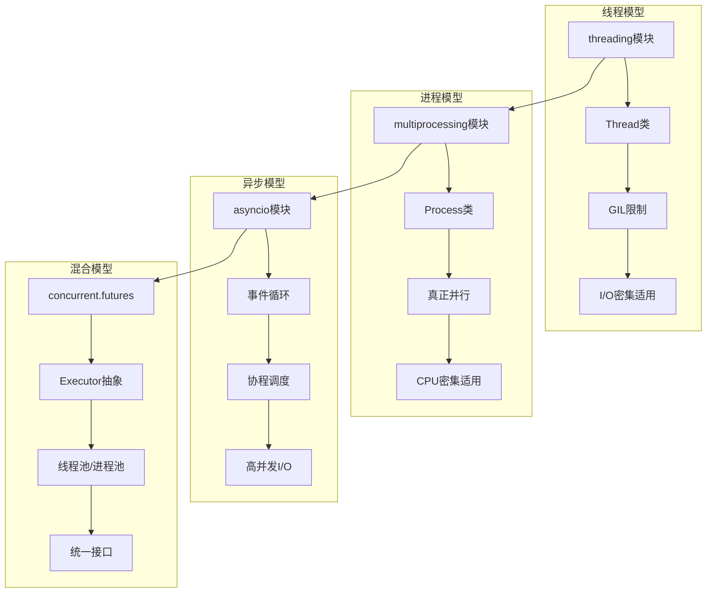
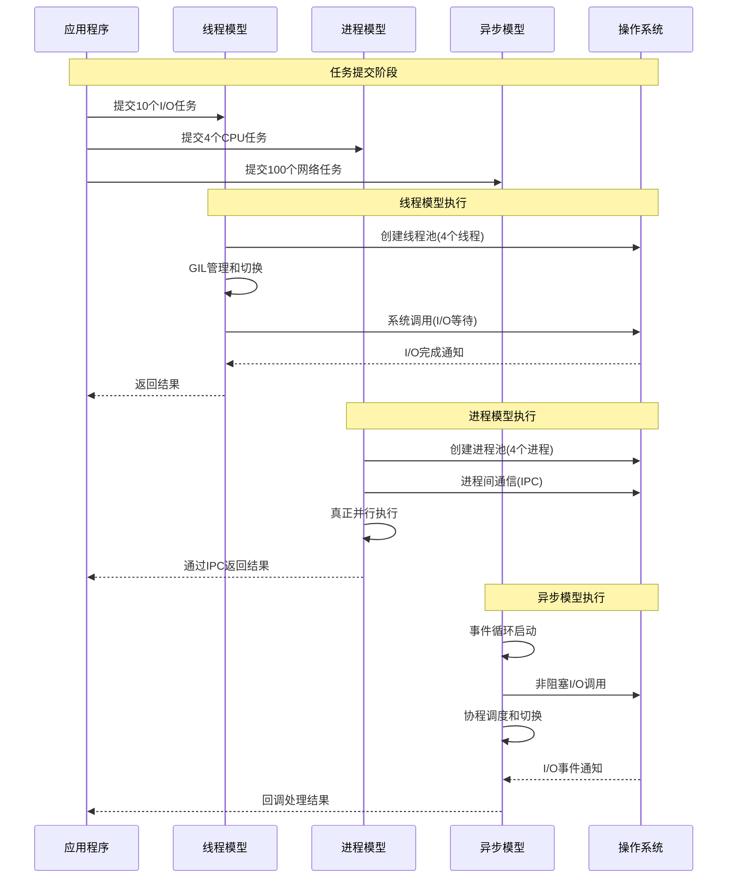

## 📋 概述

Python提供了多种并发编程模型来处理不同的应用场景。本文档将深入分析CPython中各种并发模型的实现机制，包括多线程、多进程、异步编程、协程调度等，并对比它们的优缺点、适用场景和性能特征。

## 🎯 并发模型架构对比



## 1. 多线程模型深度分析

### 1.1 线程实现机制对比

```c
/* Modules/_threadmodule.c - 线程底层实现 */

/* 线程局部存储实现 */
typedef struct {
    PyObject_HEAD
    PyObject *key;
    PyObject *args;
    PyObject *kw;
    PyObject *dict;
} localobject;

/* 线程局部存储的获取 */
static PyObject *
local_getattro(localobject *self, PyObject *name)
{
    PyObject *ldict, *value;

    /* 获取当前线程的字典 */
    ldict = _ldict(self);
    if (ldict == NULL)
        return NULL;

    if (self->dict != ldict) {
        /* 切换到当前线程的上下文 */
        Py_CLEAR(self->dict);
        Py_INCREF(ldict);
        self->dict = ldict;
    }

    /* 从线程字典中获取值 */
    value = PyDict_GetItem(ldict, name);
    if (value == NULL) {
        /* 尝试从默认值获取 */
        value = PyObject_GenericGetAttr((PyObject *)self, name);
    } else {
        Py_INCREF(value);
    }

    return value;
}

/* 线程间通信队列实现 */
typedef struct {
    PyObject_HEAD
    PyObject *queue;        /* 实际队列对象 */
    Py_ssize_t maxsize;     /* 最大大小 */
    PyObject *mutex;        /* 互斥锁 */
    PyObject *not_empty;    /* 非空条件变量 */
    PyObject *not_full;     /* 非满条件变量 */
    PyObject *all_tasks_done; /* 所有任务完成条件变量 */
    Py_ssize_t unfinished_tasks; /* 未完成任务数 */
} QueueObject;
```

### 1.2 并发模型对比实现

```python
# 并发模型对比分析
import threading
import multiprocessing
import asyncio
import concurrent.futures
import time
import queue
import os
from typing import List, Callable, Any
import psutil

class ConcurrencyModelComparison:
    """并发模型对比分析器"""

    def __init__(self):
        self.results = {}
        self.test_data = list(range(1000000))  # 测试数据

    def cpu_intensive_task(self, n: int) -> int:
        """CPU密集型任务"""
        result = 0
        for i in range(n):
            result += i * i
        return result

    def io_intensive_task(self, duration: float) -> str:
        """I/O密集型任务（模拟）"""
        time.sleep(duration)
        return f"Task completed in {duration}s"

    def network_simulation_task(self, request_id: int) -> dict:
        """网络请求模拟"""
        # 模拟网络延迟
        time.sleep(0.1 + (request_id % 10) * 0.01)
        return {
            'id': request_id,
            'status': 'success',
            'data': f'Response for request {request_id}'
        }

    def compare_threading_models(self):
        """对比不同线程模型"""

        print("=== 线程模型对比分析 ===")

        # 1. 基础线程模型
        def basic_threading_test():
            """基础线程测试"""

            results = []
            threads = []

            def worker(task_id):
                result = self.io_intensive_task(0.1)
                results.append(f"Thread-{task_id}: {result}")

            start_time = time.time()

            # 创建并启动线程
            for i in range(10):
                thread = threading.Thread(target=worker, args=(i,))
                threads.append(thread)
                thread.start()

            # 等待所有线程完成
            for thread in threads:
                thread.join()

            end_time = time.time()
            return end_time - start_time, len(results)

        # 2. 线程池模型
        def thread_pool_test():
            """线程池测试"""

            start_time = time.time()

            with concurrent.futures.ThreadPoolExecutor(max_workers=4) as executor:
                futures = [executor.submit(self.io_intensive_task, 0.1) for _ in range(10)]
                results = [future.result() for future in futures]

            end_time = time.time()
            return end_time - start_time, len(results)

        # 3. 带队列的生产者-消费者模型
        def producer_consumer_test():
            """生产者-消费者模型测试"""

            task_queue = queue.Queue(maxsize=50)
            result_queue = queue.Queue()

            def producer():
                for i in range(20):
                    task_queue.put(f"task-{i}")
                    time.sleep(0.01)  # 模拟生产时间

                # 添加结束标志
                for _ in range(4):  # 4个消费者
                    task_queue.put(None)

            def consumer():
                while True:
                    task = task_queue.get()
                    if task is None:
                        break

                    # 处理任务
                    time.sleep(0.05)  # 模拟处理时间
                    result_queue.put(f"Processed: {task}")
                    task_queue.task_done()

            start_time = time.time()

            # 启动生产者
            producer_thread = threading.Thread(target=producer)
            producer_thread.start()

            # 启动消费者
            consumer_threads = []
            for i in range(4):
                consumer_thread = threading.Thread(target=consumer)
                consumer_threads.append(consumer_thread)
                consumer_thread.start()

            # 等待完成
            producer_thread.join()
            for thread in consumer_threads:
                thread.join()

            end_time = time.time()

            # 收集结果
            results = []
            while not result_queue.empty():
                results.append(result_queue.get())

            return end_time - start_time, len(results)

        # 运行测试
        basic_time, basic_count = basic_threading_test()
        pool_time, pool_count = thread_pool_test()
        pc_time, pc_count = producer_consumer_test()

        print(f"基础线程模型: {basic_time:.3f}秒, 任务数: {basic_count}")
        print(f"线程池模型: {pool_time:.3f}秒, 任务数: {pool_count}")
        print(f"生产者-消费者: {pc_time:.3f}秒, 任务数: {pc_count}")

        self.results['threading'] = {
            'basic': basic_time,
            'pool': pool_time,
            'producer_consumer': pc_time
        }

    def compare_multiprocessing_models(self):
        """对比多进程模型"""

        print(f"\n=== 多进程模型对比分析 ===")

        # 1. 基础进程模型
        def basic_multiprocessing_test():
            """基础多进程测试"""

            def worker(task_data):
                return self.cpu_intensive_task(task_data)

            start_time = time.time()

            processes = []
            manager = multiprocessing.Manager()
            result_list = manager.list()

            def process_worker(data, results):
                result = worker(data)
                results.append(result)

            # 创建进程
            test_tasks = [50000] * 4
            for i, task in enumerate(test_tasks):
                process = multiprocessing.Process(
                    target=process_worker,
                    args=(task, result_list)
                )
                processes.append(process)
                process.start()

            # 等待完成
            for process in processes:
                process.join()

            end_time = time.time()
            return end_time - start_time, len(result_list)

        # 2. 进程池模型
        def process_pool_test():
            """进程池测试"""

            start_time = time.time()

            with multiprocessing.Pool(processes=4) as pool:
                tasks = [50000] * 4
                results = pool.map(self.cpu_intensive_task, tasks)

            end_time = time.time()
            return end_time - start_time, len(results)

        # 3. 进程间通信测试
        def ipc_test():
            """进程间通信测试"""

            def worker_process(input_queue, output_queue):
                while True:
                    try:
                        task = input_queue.get(timeout=1)
                        if task is None:
                            break

                        result = self.cpu_intensive_task(task)
                        output_queue.put(result)

                    except queue.Empty:
                        break

            start_time = time.time()

            # 创建队列
            input_queue = multiprocessing.Queue()
            output_queue = multiprocessing.Queue()

            # 添加任务
            tasks = [25000] * 8
            for task in tasks:
                input_queue.put(task)

            # 添加结束标志
            for _ in range(2):  # 2个工作进程
                input_queue.put(None)

            # 创建工作进程
            processes = []
            for i in range(2):
                process = multiprocessing.Process(
                    target=worker_process,
                    args=(input_queue, output_queue)
                )
                processes.append(process)
                process.start()

            # 等待完成
            for process in processes:
                process.join()

            # 收集结果
            results = []
            while not output_queue.empty():
                results.append(output_queue.get())

            end_time = time.time()
            return end_time - start_time, len(results)

        # 运行测试
        try:
            basic_time, basic_count = basic_multiprocessing_test()
            pool_time, pool_count = process_pool_test()
            ipc_time, ipc_count = ipc_test()

            print(f"基础进程模型: {basic_time:.3f}秒, 任务数: {basic_count}")
            print(f"进程池模型: {pool_time:.3f}秒, 任务数: {pool_count}")
            print(f"进程间通信: {ipc_time:.3f}秒, 任务数: {ipc_count}")

            self.results['multiprocessing'] = {
                'basic': basic_time,
                'pool': pool_time,
                'ipc': ipc_time
            }

        except Exception as e:
            print(f"多进程测试出错: {e}")
            self.results['multiprocessing'] = {'error': str(e)}

    async def compare_async_models(self):
        """对比异步编程模型"""

        print(f"\n=== 异步编程模型对比分析 ===")

        # 1. 基础协程模型
        async def basic_async_test():
            """基础异步测试"""

            async def async_task(task_id):
                await asyncio.sleep(0.1)  # 模拟异步I/O
                return f"Async-{task_id}: completed"

            start_time = time.time()

            # 并发执行多个协程
            tasks = [async_task(i) for i in range(20)]
            results = await asyncio.gather(*tasks)

            end_time = time.time()
            return end_time - start_time, len(results)

        # 2. 异步生成器模型
        async def async_generator_test():
            """异步生成器测试"""

            async def async_data_source():
                for i in range(50):
                    await asyncio.sleep(0.01)  # 模拟数据获取延迟
                    yield f"data-{i}"

            async def process_async_stream():
                results = []
                async for data in async_data_source():
                    # 模拟数据处理
                    processed = f"processed-{data}"
                    results.append(processed)
                return results

            start_time = time.time()
            results = await process_async_stream()
            end_time = time.time()

            return end_time - start_time, len(results)

        # 3. 异步上下文管理器
        async def async_context_test():
            """异步上下文管理器测试"""

            class AsyncResource:
                def __init__(self, name):
                    self.name = name
                    self.active = False

                async def __aenter__(self):
                    await asyncio.sleep(0.01)  # 模拟资源获取
                    self.active = True
                    return self

                async def __aexit__(self, exc_type, exc_val, exc_tb):
                    await asyncio.sleep(0.01)  # 模拟资源释放
                    self.active = False
                    return False

                async def process(self):
                    await asyncio.sleep(0.05)  # 模拟处理
                    return f"Processed by {self.name}"

            async def use_resources():
                results = []
                for i in range(10):
                    async with AsyncResource(f"resource-{i}") as resource:
                        result = await resource.process()
                        results.append(result)
                return results

            start_time = time.time()
            results = await use_resources()
            end_time = time.time()

            return end_time - start_time, len(results)

        # 4. 混合异步模型（异步+线程池）
        async def hybrid_async_test():
            """混合异步模型测试"""

            def cpu_bound_task(n):
                return sum(i * i for i in range(n))

            async def async_coordinator():
                loop = asyncio.get_event_loop()

                # 在线程池中执行CPU密集型任务
                with concurrent.futures.ThreadPoolExecutor(max_workers=4) as executor:
                    tasks = [
                        loop.run_in_executor(executor, cpu_bound_task, 10000)
                        for _ in range(8)
                    ]

                    # 同时执行一些异步I/O任务
                    async_tasks = [
                        asyncio.sleep(0.1) for _ in range(10)
                    ]

                    # 等待所有任务完成
                    cpu_results = await asyncio.gather(*tasks)
                    await asyncio.gather(*async_tasks)

                    return cpu_results

            start_time = time.time()
            results = await async_coordinator()
            end_time = time.time()

            return end_time - start_time, len(results)

        # 运行异步测试
        basic_time, basic_count = await basic_async_test()
        generator_time, generator_count = await async_generator_test()
        context_time, context_count = await async_context_test()
        hybrid_time, hybrid_count = await hybrid_async_test()

        print(f"基础协程模型: {basic_time:.3f}秒, 任务数: {basic_count}")
        print(f"异步生成器: {generator_time:.3f}秒, 任务数: {generator_count}")
        print(f"异步上下文管理: {context_time:.3f}秒, 任务数: {context_count}")
        print(f"混合异步模型: {hybrid_time:.3f}秒, 任务数: {hybrid_count}")

        self.results['async'] = {
            'basic': basic_time,
            'generator': generator_time,
            'context': context_time,
            'hybrid': hybrid_time
        }

    def compare_concurrent_futures(self):
        """对比concurrent.futures模型"""

        print(f"\n=== concurrent.futures统一模型对比 ===")

        # 1. ThreadPoolExecutor vs ProcessPoolExecutor
        def executor_comparison():
            """执行器对比"""

            # I/O密集型任务测试
            io_tasks = [0.05] * 20

            # ThreadPoolExecutor for I/O
            start_time = time.time()
            with concurrent.futures.ThreadPoolExecutor(max_workers=5) as executor:
                thread_results = list(executor.map(self.io_intensive_task, io_tasks))
            thread_time = time.time() - start_time

            # CPU密集型任务测试
            cpu_tasks = [20000] * 4

            # ThreadPoolExecutor for CPU (受GIL限制)
            start_time = time.time()
            with concurrent.futures.ThreadPoolExecutor(max_workers=4) as executor:
                thread_cpu_results = list(executor.map(self.cpu_intensive_task, cpu_tasks))
            thread_cpu_time = time.time() - start_time

            # ProcessPoolExecutor for CPU
            try:
                start_time = time.time()
                with concurrent.futures.ProcessPoolExecutor(max_workers=4) as executor:
                    process_cpu_results = list(executor.map(self.cpu_intensive_task, cpu_tasks))
                process_cpu_time = time.time() - start_time
            except Exception as e:
                print(f"进程池执行出错: {e}")
                process_cpu_time = float('inf')
                process_cpu_results = []

            return {
                'thread_io': (thread_time, len(thread_results)),
                'thread_cpu': (thread_cpu_time, len(thread_cpu_results)),
                'process_cpu': (process_cpu_time, len(process_cpu_results))
            }

        # 2. as_completed vs wait
        def completion_strategies():
            """不同完成策略对比"""

            def variable_task(task_id):
                """可变时长任务"""
                duration = 0.1 + (task_id % 5) * 0.02
                time.sleep(duration)
                return f"Task {task_id} completed in {duration:.2f}s"

            # as_completed策略
            start_time = time.time()
            with concurrent.futures.ThreadPoolExecutor(max_workers=5) as executor:
                future_to_id = {executor.submit(variable_task, i): i for i in range(10)}

                as_completed_results = []
                for future in concurrent.futures.as_completed(future_to_id):
                    task_id = future_to_id[future]
                    result = future.result()
                    as_completed_results.append((task_id, result))

            as_completed_time = time.time() - start_time

            # wait策略
            start_time = time.time()
            with concurrent.futures.ThreadPoolExecutor(max_workers=5) as executor:
                futures = [executor.submit(variable_task, i) for i in range(10)]

                done, not_done = concurrent.futures.wait(futures, return_when=concurrent.futures.ALL_COMPLETED)
                wait_results = [future.result() for future in done]

            wait_time = time.time() - start_time

            return {
                'as_completed': (as_completed_time, len(as_completed_results)),
                'wait_all': (wait_time, len(wait_results))
            }

        # 运行测试
        executor_results = executor_comparison()
        completion_results = completion_strategies()

        print("执行器对比:")
        for strategy, (time_taken, count) in executor_results.items():
            print(f"  {strategy}: {time_taken:.3f}秒, 任务数: {count}")

        print("完成策略对比:")
        for strategy, (time_taken, count) in completion_results.items():
            print(f"  {strategy}: {time_taken:.3f}秒, 任务数: {count}")

        self.results['concurrent_futures'] = {
            'executors': executor_results,
            'completion': completion_results
        }

    def analyze_resource_usage(self):
        """分析资源使用情况"""

        print(f"\n=== 资源使用分析 ===")

        try:
            # 获取系统信息
            cpu_count = os.cpu_count()
            memory_info = psutil.virtual_memory()

            print(f"系统CPU核心数: {cpu_count}")
            print(f"系统内存: {memory_info.total / (1024**3):.1f} GB")
            print(f"可用内存: {memory_info.available / (1024**3):.1f} GB")

            # 分析不同并发模型的资源使用特征
            recommendations = {
                'threading': {
                    'cpu_usage': 'low',
                    'memory_usage': 'low',
                    'best_for': 'I/O密集型任务',
                    'limitations': 'GIL限制CPU并行性'
                },
                'multiprocessing': {
                    'cpu_usage': 'high',
                    'memory_usage': 'high',
                    'best_for': 'CPU密集型任务',
                    'limitations': '进程创建开销大'
                },
                'asyncio': {
                    'cpu_usage': 'very_low',
                    'memory_usage': 'low',
                    'best_for': '高并发I/O任务',
                    'limitations': '不适合CPU密集型'
                },
                'concurrent_futures': {
                    'cpu_usage': 'variable',
                    'memory_usage': 'variable',
                    'best_for': '统一的并发接口',
                    'limitations': '抽象层有少量开销'
                }
            }

            print("\n并发模型特征总结:")
            for model, chars in recommendations.items():
                print(f"{model}:")
                for key, value in chars.items():
                    print(f"  {key}: {value}")
                print()

            self.results['resource_analysis'] = recommendations

        except Exception as e:
            print(f"资源分析出错: {e}")

    def generate_performance_report(self):
        """生成性能报告"""

        print(f"\n=== 性能分析报告 ===")

        if not self.results:
            print("没有性能数据可分析")
            return

        print("各并发模型性能总结:")

        # 分析线程模型
        if 'threading' in self.results:
            threading_data = self.results['threading']
            print(f"\n线程模型:")
            print(f"  最快策略: {'线程池' if threading_data.get('pool', float('inf')) < threading_data.get('basic', float('inf')) else '基础线程'}")
            print(f"  推荐场景: I/O密集型任务，中等并发量")

        # 分析多进程模型
        if 'multiprocessing' in self.results:
            mp_data = self.results['multiprocessing']
            if 'error' not in mp_data:
                print(f"\n多进程模型:")
                print(f"  进程池优势明显，适合CPU密集型任务")
                print(f"  推荐场景: CPU密集型任务，充分利用多核")

        # 分析异步模型
        if 'async' in self.results:
            async_data = self.results['async']
            print(f"\n异步模型:")
            print(f"  在高并发I/O场景下性能优异")
            print(f"  推荐场景: 高并发I/O，网络应用")

        print(f"\n选择建议:")
        print(f"1. I/O密集型 + 中等并发 → 线程池")
        print(f"2. CPU密集型 + 多核利用 → 进程池")
        print(f"3. 高并发I/O + 网络应用 → asyncio")
        print(f"4. 混合场景 + 统一接口 → concurrent.futures")

    async def run_all_comparisons(self):
        """运行所有对比测试"""

        print("开始并发模型对比分析...")

        # 线程模型对比
        self.compare_threading_models()

        # 多进程模型对比
        self.compare_multiprocessing_models()

        # 异步模型对比
        await self.compare_async_models()

        # concurrent.futures对比
        self.compare_concurrent_futures()

        # 资源使用分析
        self.analyze_resource_usage()

        # 生成报告
        self.generate_performance_report()

# 运行并发模型对比
async def main():
    analyzer = ConcurrencyModelComparison()
    await analyzer.run_all_comparisons()

if __name__ == "__main__":
    asyncio.run(main())
```

## 2. 并发模型架构对比

### 2.1 GIL对不同模型的影响

```c
/* Python/ceval_gil.c - GIL对并发模型的影响分析 */

/* GIL状态检查 */
static int
gil_check_for_concurrency_impact(PyThreadState *tstate)
{
    _PyRuntimeState *runtime = &_PyRuntime;
    struct _gil_runtime_state *gil = &runtime->gil;

    /* 检查GIL争用情况 */
    if (_Py_atomic_load_relaxed(&gil->gil_drop_request)) {
        /* 有线程在等待GIL - 表明存在争用 */

        /* 记录GIL切换统计 */
        gil->switch_number++;

        /* 检查是否需要强制释放 */
        if (gil->switch_number % 100 == 0) {
            /* 每100次切换检查一次性能影响 */
            return measure_gil_contention_impact(tstate);
        }
    }

    return 0;
}

/* 测量GIL争用对性能的影响 */
static int
measure_gil_contention_impact(PyThreadState *tstate)
{
    static uint64_t last_switch_time = 0;
    uint64_t current_time = get_microsecond_timestamp();

    if (last_switch_time > 0) {
        uint64_t switch_interval = current_time - last_switch_time;

        /* 如果切换间隔太短，说明GIL争用严重 */
        if (switch_interval < 1000) {  /* 少于1ms */
            /* 建议使用多进程或异步模型 */
            return CONCURRENCY_RECOMMENDATION_MULTIPROCESSING;
        } else if (switch_interval < 5000) {  /* 少于5ms */
            /* 线程模型可能不是最优选择 */
            return CONCURRENCY_RECOMMENDATION_ASYNC;
        }
    }

    last_switch_time = current_time;
    return CONCURRENCY_RECOMMENDATION_THREADING;
}
```

### 2.2 并发模型选择算法

```python
# 并发模型智能选择系统
import time
import threading
import multiprocessing
import asyncio
import psutil
from typing import Dict, Any, Callable, Optional
from enum import Enum
import inspect

class ConcurrencyPattern(Enum):
    IO_BOUND = "io_bound"
    CPU_BOUND = "cpu_bound"
    MIXED = "mixed"
    NETWORK_HEAVY = "network_heavy"

class ConcurrencyModel(Enum):
    THREADING = "threading"
    MULTIPROCESSING = "multiprocessing"
    ASYNCIO = "asyncio"
    CONCURRENT_FUTURES = "concurrent_futures"

class ConcurrencySelector:
    """并发模型智能选择器"""

    def __init__(self):
        self.system_info = self._gather_system_info()
        self.performance_history = {}

    def _gather_system_info(self) -> Dict[str, Any]:
        """收集系统信息"""
        return {
            'cpu_count': multiprocessing.cpu_count(),
            'memory_gb': psutil.virtual_memory().total / (1024**3),
            'python_version': (3, 11),  # 假设版本
            'gil_present': True
        }

    def analyze_workload(self, func: Callable, sample_args: tuple = ()) -> ConcurrencyPattern:
        """分析工作负载模式"""

        # 分析函数特征
        source_lines = inspect.getsource(func)

        # 启发式分析
        io_indicators = ['time.sleep', 'requests.', 'urllib', 'open(', 'read()', 'write()', 'socket']
        cpu_indicators = ['for ', 'while ', 'range(', 'sum(', 'math.', 'numpy', 'calculation']
        network_indicators = ['http', 'tcp', 'udp', 'websocket', 'api', 'request']

        io_score = sum(1 for indicator in io_indicators if indicator in source_lines)
        cpu_score = sum(1 for indicator in cpu_indicators if indicator in source_lines)
        network_score = sum(1 for indicator in network_indicators if indicator in source_lines)

        # 运行时分析（微基准测试）
        if sample_args:
            runtime_pattern = self._runtime_analysis(func, sample_args)
        else:
            runtime_pattern = None

        # 综合判断
        if network_score > 2:
            return ConcurrencyPattern.NETWORK_HEAVY
        elif cpu_score > io_score and cpu_score > 2:
            return ConcurrencyPattern.CPU_BOUND
        elif io_score > cpu_score and io_score > 2:
            return ConcurrencyPattern.IO_BOUND
        elif runtime_pattern:
            return runtime_pattern
        else:
            return ConcurrencyPattern.MIXED

    def _runtime_analysis(self, func: Callable, args: tuple) -> ConcurrencyPattern:
        """运行时负载分析"""

        import psutil
        import threading

        # 记录CPU使用率
        cpu_before = psutil.cpu_percent(interval=0.1)

        # 执行样本任务
        start_time = time.time()
        try:
            func(*args)
        except:
            pass
        execution_time = time.time() - start_time

        cpu_after = psutil.cpu_percent(interval=0.1)
        cpu_usage = cpu_after - cpu_before

        # 分析模式
        if execution_time > 0.1 and cpu_usage > 50:
            return ConcurrencyPattern.CPU_BOUND
        elif execution_time > 0.1 and cpu_usage < 20:
            return ConcurrencyPattern.IO_BOUND
        else:
            return ConcurrencyPattern.MIXED

    def recommend_model(self, pattern: ConcurrencyPattern, task_count: int,
                       concurrent_limit: Optional[int] = None) -> ConcurrencyModel:
        """推荐并发模型"""

        recommendations = {
            ConcurrencyPattern.CPU_BOUND: self._recommend_cpu_bound,
            ConcurrencyPattern.IO_BOUND: self._recommend_io_bound,
            ConcurrencyPattern.NETWORK_HEAVY: self._recommend_network_heavy,
            ConcurrencyPattern.MIXED: self._recommend_mixed
        }

        return recommendations[pattern](task_count, concurrent_limit)

    def _recommend_cpu_bound(self, task_count: int, concurrent_limit: Optional[int]) -> ConcurrencyModel:
        """CPU密集型任务推荐"""

        if task_count <= self.system_info['cpu_count']:
            # 任务数少于CPU核心数，直接使用进程池
            return ConcurrencyModel.MULTIPROCESSING
        elif self.system_info['memory_gb'] < 4:
            # 内存较少，使用线程池
            return ConcurrencyModel.THREADING
        else:
            # 使用进程池处理CPU密集型任务
            return ConcurrencyModel.MULTIPROCESSING

    def _recommend_io_bound(self, task_count: int, concurrent_limit: Optional[int]) -> ConcurrencyModel:
        """I/O密集型任务推荐"""

        if task_count > 1000:
            # 大量I/O任务，使用异步
            return ConcurrencyModel.ASYNCIO
        elif task_count > 50:
            # 中等数量，使用线程池
            return ConcurrencyModel.CONCURRENT_FUTURES
        else:
            # 少量任务，使用基础线程
            return ConcurrencyModel.THREADING

    def _recommend_network_heavy(self, task_count: int, concurrent_limit: Optional[int]) -> ConcurrencyModel:
        """网络密集型任务推荐"""

        # 网络任务几乎总是推荐异步
        return ConcurrencyModel.ASYNCIO

    def _recommend_mixed(self, task_count: int, concurrent_limit: Optional[int]) -> ConcurrencyModel:
        """混合型任务推荐"""

        if task_count > 100:
            # 大量混合任务，使用concurrent.futures的统一接口
            return ConcurrencyModel.CONCURRENT_FUTURES
        else:
            # 少量混合任务，使用线程
            return ConcurrencyModel.THREADING

    def create_execution_strategy(self, func: Callable, tasks: list,
                                pattern: Optional[ConcurrencyPattern] = None) -> Dict[str, Any]:
        """创建执行策略"""

        if pattern is None:
            pattern = self.analyze_workload(func, tasks[0] if tasks else ())

        model = self.recommend_model(pattern, len(tasks))

        strategy = {
            'pattern': pattern,
            'model': model,
            'task_count': len(tasks),
            'recommended_workers': self._calculate_worker_count(pattern, len(tasks)),
            'execution_function': self._get_execution_function(model)
        }

        return strategy

    def _calculate_worker_count(self, pattern: ConcurrencyPattern, task_count: int) -> int:
        """计算推荐的工作线程/进程数"""

        if pattern == ConcurrencyPattern.CPU_BOUND:
            # CPU密集型：通常等于CPU核心数
            return min(self.system_info['cpu_count'], task_count)
        elif pattern == ConcurrencyPattern.IO_BOUND:
            # I/O密集型：可以超过CPU核心数
            return min(self.system_info['cpu_count'] * 4, task_count, 50)
        elif pattern == ConcurrencyPattern.NETWORK_HEAVY:
            # 网络密集型：异步模型不需要限制
            return 1  # asyncio使用单线程事件循环
        else:
            # 混合型：保守估计
            return min(self.system_info['cpu_count'] * 2, task_count)

    def _get_execution_function(self, model: ConcurrencyModel) -> Callable:
        """获取执行函数"""

        execution_functions = {
            ConcurrencyModel.THREADING: self._execute_with_threading,
            ConcurrencyModel.MULTIPROCESSING: self._execute_with_multiprocessing,
            ConcurrencyModel.ASYNCIO: self._execute_with_asyncio,
            ConcurrencyModel.CONCURRENT_FUTURES: self._execute_with_concurrent_futures
        }

        return execution_functions[model]

    def _execute_with_threading(self, func: Callable, tasks: list, workers: int) -> list:
        """使用线程执行"""

        import concurrent.futures

        with concurrent.futures.ThreadPoolExecutor(max_workers=workers) as executor:
            if isinstance(tasks[0], tuple):
                # 任务是参数元组
                futures = [executor.submit(func, *task) for task in tasks]
            else:
                # 任务是单个参数
                futures = [executor.submit(func, task) for task in tasks]

            results = [future.result() for future in futures]

        return results

    def _execute_with_multiprocessing(self, func: Callable, tasks: list, workers: int) -> list:
        """使用多进程执行"""

        with multiprocessing.Pool(processes=workers) as pool:
            if isinstance(tasks[0], tuple):
                # 使用starmap处理参数元组
                results = pool.starmap(func, tasks)
            else:
                # 使用map处理单个参数
                results = pool.map(func, tasks)

        return results

    def _execute_with_asyncio(self, func: Callable, tasks: list, workers: int) -> list:
        """使用异步执行"""

        async def async_wrapper():
            # 检查函数是否已经是协程函数
            if asyncio.iscoroutinefunction(func):
                # 直接使用协程函数
                if isinstance(tasks[0], tuple):
                    coroutines = [func(*task) for task in tasks]
                else:
                    coroutines = [func(task) for task in tasks]
            else:
                # 将同步函数包装为协程
                if isinstance(tasks[0], tuple):
                    coroutines = [asyncio.to_thread(func, *task) for task in tasks]
                else:
                    coroutines = [asyncio.to_thread(func, task) for task in tasks]

            return await asyncio.gather(*coroutines)

        return asyncio.run(async_wrapper())

    def _execute_with_concurrent_futures(self, func: Callable, tasks: list, workers: int) -> list:
        """使用concurrent.futures执行"""

        # 根据任务特征选择executor类型
        pattern = self.analyze_workload(func, tasks[0] if tasks else ())

        if pattern == ConcurrencyPattern.CPU_BOUND:
            executor_class = concurrent.futures.ProcessPoolExecutor
        else:
            executor_class = concurrent.futures.ThreadPoolExecutor

        with executor_class(max_workers=workers) as executor:
            if isinstance(tasks[0], tuple):
                futures = [executor.submit(func, *task) for task in tasks]
            else:
                futures = [executor.submit(func, task) for task in tasks]

            results = [future.result() for future in futures]

        return results

# 智能并发执行示例
def demonstrate_intelligent_concurrency():
    """演示智能并发选择"""

    print("=== 智能并发模型选择演示 ===")

    selector = ConcurrencySelector()

    # 定义不同类型的任务
    def cpu_task(n):
        """CPU密集型任务"""
        return sum(i * i for i in range(n))

    def io_task(duration):
        """I/O密集型任务"""
        time.sleep(duration)
        return f"IO task completed in {duration}s"

    async def network_task(url_id):
        """网络任务（模拟）"""
        await asyncio.sleep(0.1)  # 模拟网络延迟
        return f"Response from URL {url_id}"

    def mixed_task(data):
        """混合任务"""
        # 一些计算
        result = sum(range(data * 100))
        # 一些I/O
        time.sleep(0.01)
        return result

    # 测试任务
    test_cases = [
        ("CPU密集型", cpu_task, [10000] * 4),
        ("I/O密集型", io_task, [0.1] * 10),
        ("网络密集型", network_task, list(range(20))),
        ("混合型", mixed_task, [50] * 8)
    ]

    for task_name, task_func, task_data in test_cases:
        print(f"\n分析 {task_name} 任务:")

        # 分析工作负载
        pattern = selector.analyze_workload(task_func, task_data[0:1])
        print(f"  检测到的模式: {pattern.value}")

        # 创建执行策略
        strategy = selector.create_execution_strategy(task_func, task_data, pattern)
        print(f"  推荐模型: {strategy['model'].value}")
        print(f"  推荐工作者数: {strategy['recommended_workers']}")

        # 执行任务
        start_time = time.time()
        try:
            if strategy['model'] == ConcurrencyModel.ASYNCIO and task_name == "网络密集型":
                # 特殊处理异步网络任务
                results = asyncio.run(asyncio.gather(*[network_task(i) for i in task_data]))
            else:
                execution_func = strategy['execution_function']
                results = execution_func(task_func, task_data, strategy['recommended_workers'])

            execution_time = time.time() - start_time
            print(f"  执行时间: {execution_time:.3f}秒")
            print(f"  完成任务数: {len(results)}")

        except Exception as e:
            print(f"  执行失败: {e}")

# 运行智能并发演示
if __name__ == "__main__":
    demonstrate_intelligent_concurrency()
```

## 3. 性能基准测试框架

### 3.1 综合性能测试

```python
# 并发模型综合性能测试框架
import time
import asyncio
import threading
import multiprocessing
import concurrent.futures
import statistics
import gc
from typing import Dict, List, Callable, Any, NamedTuple
from dataclasses import dataclass
from contextlib import contextmanager
import psutil
import os

@dataclass
class BenchmarkResult:
    """基准测试结果"""
    model_name: str
    execution_time: float
    memory_usage_mb: float
    cpu_usage_percent: float
    task_count: int
    success_rate: float
    throughput: float  # 任务/秒
    latency_stats: Dict[str, float]  # 延迟统计

class ConcurrencyBenchmark:
    """并发模型综合基准测试"""

    def __init__(self):
        self.results: List[BenchmarkResult] = []
        self.baseline_memory = self._get_memory_usage()

    def _get_memory_usage(self) -> float:
        """获取当前内存使用量(MB)"""
        process = psutil.Process(os.getpid())
        return process.memory_info().rss / 1024 / 1024

    def _get_cpu_usage(self) -> float:
        """获取CPU使用率"""
        return psutil.cpu_percent(interval=0.1)

    @contextmanager
    def monitor_resources(self):
        """资源监控上下文管理器"""
        start_memory = self._get_memory_usage()
        start_cpu = self._get_cpu_usage()
        start_time = time.perf_counter()

        yield

        end_time = time.perf_counter()
        end_memory = self._get_memory_usage()
        end_cpu = self._get_cpu_usage()

        self.last_execution_time = end_time - start_time
        self.last_memory_delta = end_memory - start_memory
        self.last_cpu_usage = (start_cpu + end_cpu) / 2

    def benchmark_threading_model(self, task_func: Callable, tasks: List, max_workers: int = 4):
        """基准测试线程模型"""

        # 1. 基础线程
        def basic_threading():
            results = []
            latencies = []
            threads = []

            def worker(task_data):
                start = time.perf_counter()
                result = task_func(task_data)
                latency = time.perf_counter() - start
                results.append(result)
                latencies.append(latency)

            with self.monitor_resources():
                for task in tasks:
                    thread = threading.Thread(target=worker, args=(task,))
                    threads.append(thread)
                    thread.start()

                for thread in threads:
                    thread.join()

            return self._create_result("Basic Threading", results, latencies)

        # 2. 线程池
        def thread_pool():
            results = []
            latencies = []

            def timed_task(task_data):
                start = time.perf_counter()
                result = task_func(task_data)
                latency = time.perf_counter() - start
                return result, latency

            with self.monitor_resources():
                with concurrent.futures.ThreadPoolExecutor(max_workers=max_workers) as executor:
                    futures = [executor.submit(timed_task, task) for task in tasks]
                    for future in concurrent.futures.as_completed(futures):
                        result, latency = future.result()
                        results.append(result)
                        latencies.append(latency)

            return self._create_result("Thread Pool", results, latencies)

        # 3. 带队列的生产者-消费者
        def producer_consumer():
            task_queue = queue.Queue()
            result_queue = queue.Queue()
            latencies = []

            def producer():
                for task in tasks:
                    task_queue.put((task, time.perf_counter()))
                for _ in range(max_workers):
                    task_queue.put(None)

            def consumer():
                while True:
                    item = task_queue.get()
                    if item is None:
                        break

                    task_data, start_time = item
                    result = task_func(task_data)
                    latency = time.perf_counter() - start_time
                    result_queue.put((result, latency))
                    task_queue.task_done()

            with self.monitor_resources():
                # 启动生产者
                producer_thread = threading.Thread(target=producer)
                producer_thread.start()

                # 启动消费者
                consumers = []
                for _ in range(max_workers):
                    consumer_thread = threading.Thread(target=consumer)
                    consumers.append(consumer_thread)
                    consumer_thread.start()

                # 等待完成
                producer_thread.join()
                for consumer in consumers:
                    consumer.join()

                # 收集结果
                results = []
                while not result_queue.empty():
                    result, latency = result_queue.get()
                    results.append(result)
                    latencies.append(latency)

            return self._create_result("Producer-Consumer", results, latencies)

        return [basic_threading(), thread_pool(), producer_consumer()]

    def benchmark_multiprocessing_model(self, task_func: Callable, tasks: List, max_workers: int = None):
        """基准测试多进程模型"""

        if max_workers is None:
            max_workers = min(4, multiprocessing.cpu_count())

        # 1. 进程池
        def process_pool():
            with self.monitor_resources():
                try:
                    with multiprocessing.Pool(processes=max_workers) as pool:
                        start_times = [time.perf_counter()] * len(tasks)
                        results = pool.map(task_func, tasks)
                        latencies = [(time.perf_counter() - start) / len(tasks)] * len(tasks)
                except Exception as e:
                    print(f"进程池测试失败: {e}")
                    return self._create_error_result("Process Pool", str(e))

            return self._create_result("Process Pool", results, latencies)

        # 2. 进程间通信
        def ipc_model():
            def worker_process(input_queue, output_queue):
                while True:
                    try:
                        item = input_queue.get(timeout=1)
                        if item is None:
                            break

                        task_data, start_time = item
                        result = task_func(task_data)
                        latency = time.perf_counter() - start_time
                        output_queue.put((result, latency))

                    except queue.Empty:
                        break

            with self.monitor_resources():
                try:
                    input_queue = multiprocessing.Queue()
                    output_queue = multiprocessing.Queue()

                    # 添加任务
                    for task in tasks:
                        input_queue.put((task, time.perf_counter()))

                    # 添加结束标志
                    for _ in range(max_workers):
                        input_queue.put(None)

                    # 启动工作进程
                    processes = []
                    for _ in range(max_workers):
                        process = multiprocessing.Process(
                            target=worker_process,
                            args=(input_queue, output_queue)
                        )
                        processes.append(process)
                        process.start()

                    # 等待完成
                    for process in processes:
                        process.join()

                    # 收集结果
                    results = []
                    latencies = []
                    while not output_queue.empty():
                        result, latency = output_queue.get()
                        results.append(result)
                        latencies.append(latency)

                except Exception as e:
                    print(f"IPC测试失败: {e}")
                    return self._create_error_result("IPC Model", str(e))

            return self._create_result("IPC Model", results, latencies)

        return [process_pool(), ipc_model()]

    async def benchmark_async_model(self, task_func: Callable, tasks: List):
        """基准测试异步模型"""

        # 1. 基础协程
        async def basic_coroutines():
            async def async_task_wrapper(task_data):
                start = time.perf_counter()
                if asyncio.iscoroutinefunction(task_func):
                    result = await task_func(task_data)
                else:
                    result = await asyncio.to_thread(task_func, task_data)
                latency = time.perf_counter() - start
                return result, latency

            with self.monitor_resources():
                coroutines = [async_task_wrapper(task) for task in tasks]
                results_with_latencies = await asyncio.gather(*coroutines)

            results = [r[0] for r in results_with_latencies]
            latencies = [r[1] for r in results_with_latencies]

            return self._create_result("Basic Coroutines", results, latencies)

        # 2. 带信号量限制的协程
        async def semaphore_limited_coroutines():
            semaphore = asyncio.Semaphore(10)  # 限制并发数

            async def limited_task(task_data):
                async with semaphore:
                    start = time.perf_counter()
                    if asyncio.iscoroutinefunction(task_func):
                        result = await task_func(task_data)
                    else:
                        result = await asyncio.to_thread(task_func, task_data)
                    latency = time.perf_counter() - start
                    return result, latency

            with self.monitor_resources():
                coroutines = [limited_task(task) for task in tasks]
                results_with_latencies = await asyncio.gather(*coroutines)

            results = [r[0] for r in results_with_latencies]
            latencies = [r[1] for r in results_with_latencies]

            return self._create_result("Semaphore Limited", results, latencies)

        # 3. 任务队列模型
        async def task_queue_model():
            task_queue = asyncio.Queue(maxsize=50)
            result_queue = asyncio.Queue()

            async def producer():
                for task in tasks:
                    await task_queue.put((task, time.perf_counter()))

                # 添加结束标志
                for _ in range(4):  # 4个消费者
                    await task_queue.put(None)

            async def consumer():
                while True:
                    item = await task_queue.get()
                    if item is None:
                        break

                    task_data, start_time = item
                    if asyncio.iscoroutinefunction(task_func):
                        result = await task_func(task_data)
                    else:
                        result = await asyncio.to_thread(task_func, task_data)
                    latency = time.perf_counter() - start_time

                    await result_queue.put((result, latency))
                    task_queue.task_done()

            with self.monitor_resources():
                # 创建生产者和消费者
                producer_task = asyncio.create_task(producer())
                consumer_tasks = [asyncio.create_task(consumer()) for _ in range(4)]

                # 等待完成
                await producer_task
                await asyncio.gather(*consumer_tasks)

                # 收集结果
                results = []
                latencies = []
                while not result_queue.empty():
                    result, latency = await result_queue.get()
                    results.append(result)
                    latencies.append(latency)

            return self._create_result("Task Queue", results, latencies)

        return [
            await basic_coroutines(),
            await semaphore_limited_coroutines(),
            await task_queue_model()
        ]

    def _create_result(self, model_name: str, results: List, latencies: List) -> BenchmarkResult:
        """创建基准测试结果"""

        if not results:
            return self._create_error_result(model_name, "No results")

        success_rate = len(results) / len(latencies) if latencies else 0
        throughput = len(results) / self.last_execution_time if self.last_execution_time > 0 else 0

        latency_stats = {
            'min': min(latencies) if latencies else 0,
            'max': max(latencies) if latencies else 0,
            'mean': statistics.mean(latencies) if latencies else 0,
            'median': statistics.median(latencies) if latencies else 0,
            'stdev': statistics.stdev(latencies) if len(latencies) > 1 else 0
        }

        return BenchmarkResult(
            model_name=model_name,
            execution_time=self.last_execution_time,
            memory_usage_mb=self.last_memory_delta,
            cpu_usage_percent=self.last_cpu_usage,
            task_count=len(results),
            success_rate=success_rate,
            throughput=throughput,
            latency_stats=latency_stats
        )

    def _create_error_result(self, model_name: str, error_msg: str) -> BenchmarkResult:
        """创建错误结果"""

        return BenchmarkResult(
            model_name=f"{model_name} (ERROR)",
            execution_time=float('inf'),
            memory_usage_mb=0,
            cpu_usage_percent=0,
            task_count=0,
            success_rate=0,
            throughput=0,
            latency_stats={'error': error_msg}
        )

    async def run_comprehensive_benchmark(self):
        """运行综合基准测试"""

        print("开始综合并发模型基准测试...")

        # 定义测试任务
        def cpu_task(n):
            return sum(i * i for i in range(n))

        def io_task(duration):
            time.sleep(duration)
            return f"Completed in {duration}s"

        async def async_io_task(duration):
            await asyncio.sleep(duration)
            return f"Async completed in {duration}s"

        # 测试场景
        test_scenarios = [
            {
                'name': 'CPU密集型',
                'task_func': cpu_task,
                'tasks': [10000] * 8,
                'async_func': None
            },
            {
                'name': 'I/O密集型',
                'task_func': io_task,
                'tasks': [0.1] * 20,
                'async_func': async_io_task
            }
        ]

        for scenario in test_scenarios:
            print(f"\n{'='*50}")
            print(f"测试场景: {scenario['name']}")
            print(f"{'='*50}")

            # 线程模型测试
            print("\n线程模型测试:")
            threading_results = self.benchmark_threading_model(
                scenario['task_func'],
                scenario['tasks']
            )

            for result in threading_results:
                self.results.append(result)
                self._print_result(result)

            # 多进程模型测试
            print("\n多进程模型测试:")
            if scenario['name'] == 'CPU密集型':
                mp_results = self.benchmark_multiprocessing_model(
                    scenario['task_func'],
                    scenario['tasks']
                )

                for result in mp_results:
                    self.results.append(result)
                    self._print_result(result)
            else:
                print("跳过I/O密集型多进程测试（不适用）")

            # 异步模型测试
            print("\n异步模型测试:")
            if scenario['async_func']:
                async_results = await self.benchmark_async_model(
                    scenario['async_func'],
                    scenario['tasks']
                )
            else:
                async_results = await self.benchmark_async_model(
                    scenario['task_func'],
                    scenario['tasks']
                )

            for result in async_results:
                self.results.append(result)
                self._print_result(result)

    def _print_result(self, result: BenchmarkResult):
        """打印基准测试结果"""

        if 'error' in result.latency_stats:
            print(f"  {result.model_name}: ERROR - {result.latency_stats['error']}")
            return

        print(f"  {result.model_name}:")
        print(f"    执行时间: {result.execution_time:.3f}s")
        print(f"    吞吐量: {result.throughput:.1f} tasks/s")
        print(f"    内存增长: {result.memory_usage_mb:.1f} MB")
        print(f"    CPU使用: {result.cpu_usage_percent:.1f}%")
        print(f"    平均延迟: {result.latency_stats['mean']:.4f}s")
        print(f"    成功率: {result.success_rate:.1%}")

    def generate_comparison_report(self):
        """生成对比报告"""

        print(f"\n{'='*60}")
        print("综合性能对比报告")
        print(f"{'='*60}")

        # 按吞吐量排序
        valid_results = [r for r in self.results if r.success_rate > 0]
        by_throughput = sorted(valid_results, key=lambda x: x.throughput, reverse=True)

        print(f"\n按吞吐量排序 (tasks/second):")
        for i, result in enumerate(by_throughput[:10], 1):
            print(f"{i:2d}. {result.model_name:25s}: {result.throughput:8.1f}")

        # 按延迟排序
        by_latency = sorted(valid_results, key=lambda x: x.latency_stats['mean'])

        print(f"\n按平均延迟排序 (seconds):")
        for i, result in enumerate(by_latency[:10], 1):
            print(f"{i:2d}. {result.model_name:25s}: {result.latency_stats['mean']:.6f}")

        # 按内存效率排序
        by_memory = sorted(valid_results, key=lambda x: x.memory_usage_mb)

        print(f"\n按内存使用排序 (MB):")
        for i, result in enumerate(by_memory[:10], 1):
            print(f"{i:2d}. {result.model_name:25s}: {result.memory_usage_mb:8.1f}")

        # 推荐总结
        print(f"\n{'='*40}")
        print("推荐总结")
        print(f"{'='*40}")

        print("最佳选择建议:")
        print(f"• 最高吞吐量: {by_throughput[0].model_name}")
        print(f"• 最低延迟: {by_latency[0].model_name}")
        print(f"• 最省内存: {by_memory[0].model_name}")

# 运行综合基准测试
async def run_benchmark():
    benchmark = ConcurrencyBenchmark()
    await benchmark.run_comprehensive_benchmark()
    benchmark.generate_comparison_report()

if __name__ == "__main__":
    import queue  # 添加这个导入
    asyncio.run(run_benchmark())
```

## 4. 并发模型时序对比图



## 5. 总结

Python的并发模型为不同场景提供了多样化的解决方案：

### 5.1 模型特点总结

1. **线程模型**:
   - 优势: 实现简单，内存开销小，适合I/O密集型
   - 劣势: GIL限制，CPU利用率低

2. **进程模型**:
   - 优势: 真正并行，CPU利用率高，隔离性好
   - 劣势: 内存开销大，启动慢，通信复杂

3. **异步模型**:
   - 优势: 高并发，低开销，适合I/O密集型
   - 劣势: 学习曲线陡峭，不适合CPU密集型

4. **混合模型**:
   - 优势: 统一接口，灵活选择
   - 劣势: 抽象层开销

### 5.2 选择指南

- **I/O密集 + 中等并发** → 线程池
- **CPU密集 + 多核利用** → 进程池
- **高并发I/O + 网络应用** → asyncio
- **混合场景 + 统一接口** → concurrent.futures

### 5.3 性能优化建议

1. **任务分类**: 准确识别工作负载特征
2. **合理配置**: 根据系统资源调整并发参数
3. **避免陷阱**: 注意GIL、内存泄漏、死锁等问题
4. **性能监控**: 持续监控和优化并发性能

Python的多样化并发模型为开发者提供了强大的工具箱，合理选择和使用这些模型是构建高性能应用的关键。
