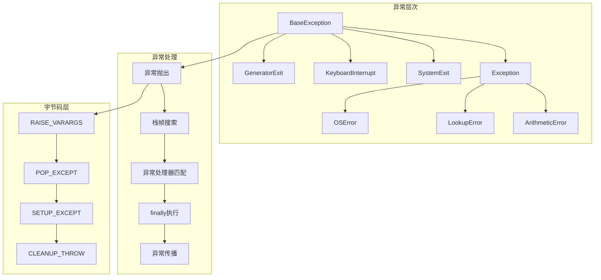
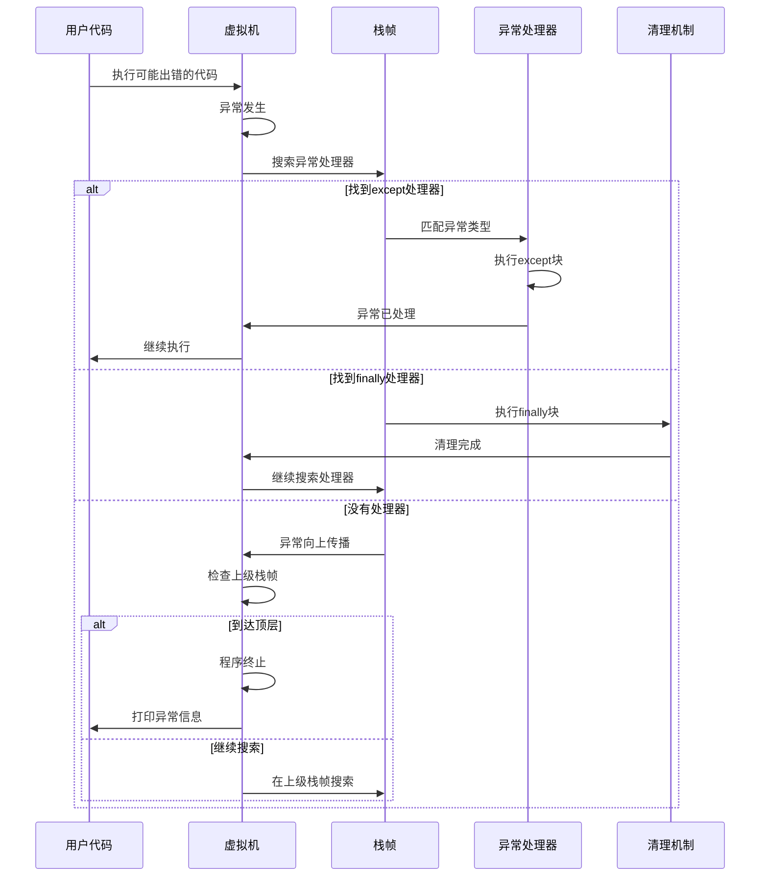

## 📋 概述

错误处理是Python程序健壮性的核心，涉及异常机制、错误传播、资源清理等多个方面。本文档将深入分析CPython中异常系统的实现机制，包括异常对象模型、异常传播机制、try/except/finally语句的执行、以及异常处理的最佳实践。

## 🎯 异常处理系统架构



## 1. 异常对象系统

### 1.1 异常基类实现

```c
/* Objects/exceptions.c - 异常对象实现 */

/* BaseException类型对象 */
PyTypeObject PyExc_BaseException = {
    PyVarObject_HEAD_INIT(NULL, 0)
    "BaseException",
    sizeof(PyBaseExceptionObject),
    0,
    (destructor)BaseException_dealloc,     /* tp_dealloc */
    0,                                     /* tp_vectorcall_offset */
    0,                                     /* tp_getattr */
    0,                                     /* tp_setattr */
    0,                                     /* tp_as_async */
    (reprfunc)BaseException_repr,          /* tp_repr */
    0,                                     /* tp_as_number */
    0,                                     /* tp_as_sequence */
    0,                                     /* tp_as_mapping */
    0,                                     /* tp_hash */
    0,                                     /* tp_call */
    (reprfunc)BaseException_str,           /* tp_str */
    PyObject_GenericGetAttr,               /* tp_getattro */
    PyObject_GenericSetAttr,               /* tp_setattro */
    0,                                     /* tp_as_buffer */
    Py_TPFLAGS_DEFAULT | Py_TPFLAGS_BASETYPE, /* tp_flags */
    PyDoc_STR("Common base class for all exceptions"),  /* tp_doc */
    (traverseproc)BaseException_traverse,  /* tp_traverse */
    (inquiry)BaseException_clear,          /* tp_clear */
    0,                                     /* tp_richcompare */
    0,                                     /* tp_weaklistoffset */
    0,                                     /* tp_iter */
    0,                                     /* tp_iternext */
    BaseException_methods,                 /* tp_methods */
    BaseException_members,                 /* tp_members */
    BaseException_getset,                  /* tp_getset */
    0,                                     /* tp_base */
    0,                                     /* tp_dict */
    0,                                     /* tp_descr_get */
    0,                                     /* tp_descr_set */
    offsetof(PyBaseExceptionObject, dict), /* tp_dictoffset */
    (initproc)BaseException_init,          /* tp_init */
    0,                                     /* tp_alloc */
    BaseException_new,                     /* tp_new */
};

/* BaseException对象结构 */
typedef struct {
    PyObject_HEAD
    PyObject *dict;          /* 实例字典 */
    PyObject *args;          /* 异常参数元组 */
    PyObject *notes;         /* 异常注释列表 (Python 3.11+) */
    PyObject *traceback;     /* 异常追踪信息 */
    PyObject *context;       /* 异常上下文 */
    PyObject *cause;         /* 异常原因 */
    char suppress_context;   /* 是否抑制上下文显示 */
} PyBaseExceptionObject;

/* BaseException初始化 */
static int
BaseException_init(PyBaseExceptionObject *self, PyObject *args, PyObject *kwds)
{
    if (!_PyArg_NoKeywords("BaseException", kwds))
        return -1;

    /* 设置异常参数 */
    Py_INCREF(args);
    Py_XSETREF(self->args, args);

    return 0;
}

/* 创建新的BaseException实例 */
static PyObject *
BaseException_new(PyTypeObject *type, PyObject *args, PyObject *kwds)
{
    PyBaseExceptionObject *self;

    self = (PyBaseExceptionObject *)type->tp_alloc(type, 0);
    if (!self)
        return NULL;

    /* 初始化字段 */
    self->dict = NULL;
    self->args = PyTuple_New(0);
    self->notes = NULL;
    self->traceback = NULL;
    self->context = NULL;
    self->cause = NULL;
    self->suppress_context = 0;

    if (!self->args) {
        Py_DECREF(self);
        return NULL;
    }

    return (PyObject *)self;
}
```

### 1.2 异常字符串表示

```c
/* Objects/exceptions.c - 异常字符串表示 */

static PyObject *
BaseException_str(PyBaseExceptionObject *self)
{
    /* 返回异常的字符串表示 */

    switch (PyTuple_GET_SIZE(self->args)) {
    case 0:
        /* 无参数：返回空字符串 */
        return PyUnicode_FromString("");

    case 1:
        /* 单参数：直接返回参数的字符串形式 */
        return PyObject_Str(PyTuple_GET_ITEM(self->args, 0));

    default:
        /* 多参数：返回参数元组的字符串形式 */
        return PyObject_Str(self->args);
    }
}

static PyObject *
BaseException_repr(PyBaseExceptionObject *self)
{
    /* 返回异常的repr表示 */

    const char *name = Py_TYPE(self)->tp_name;

    if (PyTuple_GET_SIZE(self->args) == 1) {
        return PyUnicode_FromFormat("%s(%R)",
                                   name, PyTuple_GET_ITEM(self->args, 0));
    } else {
        return PyUnicode_FromFormat("%s%R", name, self->args);
    }
}

/* 异常追踪信息格式化 */
static PyObject *
BaseException_with_traceback(PyBaseExceptionObject *self, PyObject *tb)
{
    /* 设置异常的追踪信息 */

    if (tb == Py_None) {
        tb = NULL;
    } else if (tb != NULL && !PyTraceBack_Check(tb)) {
        PyErr_SetString(PyExc_TypeError,
                       "with_traceback() arg must be a traceback or None");
        return NULL;
    }

    /* 设置traceback */
    Py_XINCREF(tb);
    Py_XSETREF(self->traceback, tb);

    Py_INCREF(self);
    return (PyObject *)self;
}
```

## 2. 异常传播机制

### 2.1 异常抛出实现

```c
/* Python/ceval.c - 异常抛出字节码 */

case TARGET(RAISE_VARARGS): {
    PyObject *cause = NULL, *exc = NULL;

    switch (oparg) {
    case 2:
        /* raise exc from cause */
        cause = POP();
        /* fall through */
    case 1:
        /* raise exc */
        exc = POP();
        /* fall through */
    case 0:
        /* re-raise (bare raise) */
        if (do_raise(tstate, exc, cause)) {
            goto exception_unwind;
        }
        break;
    default:
        PyErr_SetString(PyExc_SystemError,
                       "bad RAISE_VARARGS oparg");
        goto error;
    }
    DISPATCH();
}

/* 执行异常抛出 */
static int
do_raise(PyThreadState *tstate, PyObject *exc, PyObject *cause)
{
    PyObject *type = NULL, *value = NULL;

    if (exc == NULL) {
        /* 裸露的raise语句 - 重新抛出当前异常 */
        _PyErr_StackItem *exc_info = _PyErr_GetTopmostException(tstate);
        if (exc_info->exc_value == NULL || exc_info->exc_value == Py_None) {
            PyErr_SetString(PyExc_RuntimeError,
                           "No active exception to re-raise");
            return 0;
        }

        /* 重新抛出当前异常 */
        _PyErr_SetRaisedException(tstate, exc_info->exc_value);
        return 1;
    }

    /* 规范化异常 */
    if (PyExceptionClass_Check(exc)) {
        /* 异常类 - 实例化 */
        type = exc;
        value = _PyObject_CallNoArgs(exc);
        if (value == NULL) {
            goto raise_error;
        }
        if (!PyExceptionInstance_Check(value)) {
            PyErr_SetString(PyExc_TypeError,
                           "exceptions must derive from BaseException");
            goto raise_error;
        }
    } else if (PyExceptionInstance_Check(exc)) {
        /* 异常实例 */
        value = exc;
        type = PyExceptionInstance_Class(exc);
        Py_INCREF(type);
    } else {
        /* 无效的异常对象 */
        PyErr_SetString(PyExc_TypeError,
                       "exceptions must derive from BaseException");
        goto raise_error;
    }

    /* 处理cause (from子句) */
    if (cause) {
        PyObject *fixed_cause;
        if (PyExceptionClass_Check(cause)) {
            fixed_cause = _PyObject_CallNoArgs(cause);
            if (fixed_cause == NULL) {
                goto raise_error;
            }
        } else if (PyExceptionInstance_Check(cause)) {
            fixed_cause = cause;
            Py_INCREF(fixed_cause);
        } else if (cause == Py_None) {
            fixed_cause = NULL;
        } else {
            PyErr_SetString(PyExc_TypeError,
                           "exception causes must derive from BaseException");
            goto raise_error;
        }

        PyException_SetCause(value, fixed_cause);
    }

    /* 抛出异常 */
    _PyErr_SetRaisedException(tstate, value);
    Py_XDECREF(type);
    return 1;

raise_error:
    Py_XDECREF(value);
    Py_XDECREF(type);
    return 0;
}
```

### 2.2 异常处理器搜索

```c
/* Python/ceval.c - 异常处理器搜索 */

static enum why_code
handle_exception(PyThreadState *tstate, PyFrameObject *frame,
                enum why_code why, PyObject **kwds)
{
    /* 处理异常的主函数 */

    PyObject *exc, *val, *tb;

    /* 获取当前异常 */
    _PyErr_Fetch(tstate, &exc, &val, &tb);

    if (exc == NULL) {
        return WHY_NOT;
    }

    /* 搜索异常处理器 */
    PyTryBlock *b = PyFrame_BlockStack(frame);
    while (PyFrame_BlockStackLevel(frame) > 0) {
        b = &PyFrame_BlockStack(frame)[PyFrame_BlockStackLevel(frame) - 1];

        if (b->b_type == EXCEPT_HANDLER) {
            /* 找到except处理器 */

            /* 设置异常信息 */
            _PyErr_Restore(tstate, exc, val, tb);

            /* 跳转到处理器 */
            frame->f_lasti = b->b_handler;
            PyFrame_BlockPop(frame);

            return WHY_NOT;

        } else if (b->b_type == SETUP_FINALLY) {
            /* 找到finally块 */

            /* 设置异常状态 */
            _PyErr_Restore(tstate, exc, val, tb);

            /* 推入异常信息到栈 */
            PyObject *exc_obj = _PyErr_GetRaisedException(tstate);
            if (exc_obj == NULL) {
                exc_obj = Py_None;
                Py_INCREF(exc_obj);
            }
            PUSH(exc_obj);

            /* 跳转到finally块 */
            frame->f_lasti = b->b_handler;
            PyFrame_BlockPop(frame);

            return WHY_EXCEPTION;

        } else if (b->b_type == SETUP_WITH) {
            /* with语句的异常处理 */

            /* 调用__exit__方法 */
            PyObject *exit_func = PEEK(7);
            PyObject *exit_result;

            /* 准备__exit__参数 */
            PyObject *stack[4] = {NULL, exit_func, exc, val, tb};
            exit_result = PyObject_Vectorcall(exit_func, stack + 1, 3 | PY_VECTORCALL_ARGUMENTS_OFFSET, NULL);

            if (exit_result == NULL) {
                /* __exit__方法抛出异常 */
                _PyErr_Fetch(tstate, &exc, &val, &tb);
            } else {
                int suppress = PyObject_IsTrue(exit_result);
                Py_DECREF(exit_result);

                if (suppress > 0) {
                    /* __exit__返回True，抑制异常 */
                    Py_XDECREF(exc);
                    Py_XDECREF(val);
                    Py_XDECREF(tb);

                    PyFrame_BlockPop(frame);
                    return WHY_NOT;
                } else if (suppress < 0) {
                    /* PyObject_IsTrue失败 */
                    _PyErr_Fetch(tstate, &exc, &val, &tb);
                }
            }

            /* 继续传播异常 */
            PyFrame_BlockPop(frame);
        } else {
            PyFrame_BlockPop(frame);
        }
    }

    /* 没有找到处理器，异常继续传播 */
    _PyErr_Restore(tstate, exc, val, tb);
    return WHY_EXCEPTION;
}
```

## 3. try/except/finally语句编译

### 3.1 try语句编译

```c
/* Python/codegen.c - try语句编译 */

static int
codegen_try_except(compiler *c, stmt_ty s)
{
    location loc = LOC(s);

    /* 创建标签 */
    NEW_JUMP_TARGET_LABEL(c, except);
    NEW_JUMP_TARGET_LABEL(c, orelse);
    NEW_JUMP_TARGET_LABEL(c, end);

    /* 设置异常处理块 */
    ADDOP_JUMP(c, loc, SETUP_EXCEPT, except);

    /* 编译try块 */
    VISIT_SEQ(c, stmt, s->v.Try.body);

    /* try块正常结束 */
    ADDOP(c, loc, POP_BLOCK);

    /* 如果有else子句，跳转到else */
    if (s->v.Try.orelse) {
        ADDOP_JUMP(c, loc, JUMP, orelse);
    } else {
        ADDOP_JUMP(c, loc, JUMP, end);
    }

    /* except处理器 */
    USE_LABEL(c, except);

    /* 推入异常信息 */
    ADDOP(c, loc, PUSH_EXC_INFO);

    /* 编译except子句 */
    for (Py_ssize_t i = 0; i < asdl_seq_LEN(s->v.Try.handlers); i++) {
        excepthandler_ty handler = asdl_seq_GET(s->v.Try.handlers, i);
        RETURN_IF_ERROR(codegen_except_handler(c, handler, end));
    }

    /* 如果没有匹配的except，重新抛出 */
    ADDOP_I(c, loc, RERAISE, 0);

    /* else子句 */
    if (s->v.Try.orelse) {
        USE_LABEL(c, orelse);
        VISIT_SEQ(c, stmt, s->v.Try.orelse);
    }

    USE_LABEL(c, end);
    return SUCCESS;
}

static int
codegen_except_handler(compiler *c, excepthandler_ty handler, jump_target_label end)
{
    location loc = LOC(handler);

    NEW_JUMP_TARGET_LABEL(c, next_except);

    if (handler->v.ExceptHandler.type) {
        /* 具名异常处理：except Type as name: */

        /* 复制栈顶的异常 */
        ADDOP(c, loc, DUP_TOP);

        /* 加载异常类型 */
        VISIT(c, expr, handler->v.ExceptHandler.type);

        /* 检查异常类型匹配 */
        ADDOP_I(c, loc, CHECK_EXC_MATCH, 0);
        ADDOP_JUMP(c, loc, POP_JUMP_IF_FALSE, next_except);

        /* 匹配成功，绑定异常变量 */
        if (handler->v.ExceptHandler.name) {
            /* 存储异常实例到变量 */
            VISIT(c, expr, handler->v.ExceptHandler.name);
        } else {
            /* 丢弃异常实例 */
            ADDOP(c, loc, POP_TOP);
        }

        /* 弹出异常信息 */
        ADDOP(c, loc, POP_EXCEPT);

        /* 编译处理器代码 */
        VISIT_SEQ(c, stmt, handler->v.ExceptHandler.body);

        /* 清理异常变量 */
        if (handler->v.ExceptHandler.name) {
            ADDOP_LOAD_CONST(c, loc, Py_None);
            VISIT(c, expr, handler->v.ExceptHandler.name);
        }

        ADDOP_JUMP(c, loc, JUMP, end);

    } else {
        /* 裸露except：except: */
        ADDOP(c, loc, POP_TOP);  /* 丢弃异常实例 */
        ADDOP(c, loc, POP_EXCEPT);

        /* 编译处理器代码 */
        VISIT_SEQ(c, stmt, handler->v.ExceptHandler.body);

        ADDOP_JUMP(c, loc, JUMP, end);
    }

    USE_LABEL(c, next_except);
    return SUCCESS;
}

static int
codegen_try_finally(compiler *c, stmt_ty s)
{
    /* try/finally语句编译 */
    location loc = LOC(s);

    NEW_JUMP_TARGET_LABEL(c, finally);
    NEW_JUMP_TARGET_LABEL(c, end);

    /* 设置finally块 */
    ADDOP_JUMP(c, loc, SETUP_FINALLY, finally);

    /* 编译try块 */
    VISIT_SEQ(c, stmt, s->v.Try.body);

    /* 正常结束，弹出finally块 */
    ADDOP(c, loc, POP_BLOCK);

    /* 推入None表示正常退出 */
    ADDOP_LOAD_CONST(c, loc, Py_None);

    /* finally块 */
    USE_LABEL(c, finally);

    /* 编译finally代码 */
    VISIT_SEQ(c, stmt, s->v.Try.finalbody);

    /* 检查退出原因 */
    ADDOP(c, loc, POP_TOP);  /* 弹出退出标志 */

    USE_LABEL(c, end);
    return SUCCESS;
}
```

## 4. 异常处理最佳实践

### 4.1 异常分类和处理策略

```python
# 异常处理最佳实践
import logging
import traceback
import sys
import functools
import inspect
from typing import Type, Union, Optional, Any, Callable
from contextlib import contextmanager
import weakref

# 1. 自定义异常层次结构
class ApplicationError(Exception):
    """应用程序基础异常"""

    def __init__(self, message: str, error_code: str = None, details: dict = None):
        super().__init__(message)
        self.error_code = error_code or self.__class__.__name__
        self.details = details or {}
        self.timestamp = None

    def __str__(self):
        base_msg = super().__str__()
        if self.error_code:
            return f"[{self.error_code}] {base_msg}"
        return base_msg

    def to_dict(self):
        """转换为字典格式"""
        return {
            'error_type': self.__class__.__name__,
            'error_code': self.error_code,
            'message': str(self),
            'details': self.details,
            'timestamp': self.timestamp
        }

class ValidationError(ApplicationError):
    """数据验证错误"""
    pass

class BusinessLogicError(ApplicationError):
    """业务逻辑错误"""
    pass

class ResourceError(ApplicationError):
    """资源相关错误"""
    pass

class ConfigurationError(ApplicationError):
    """配置错误"""
    pass

class ExternalServiceError(ApplicationError):
    """外部服务错误"""

    def __init__(self, message: str, service_name: str, status_code: int = None, **kwargs):
        super().__init__(message, **kwargs)
        self.service_name = service_name
        self.status_code = status_code
        self.details.update({
            'service_name': service_name,
            'status_code': status_code
        })

# 2. 错误处理装饰器
def exception_handler(*exception_types,
                     default_return=None,
                     log_errors=True,
                     reraise=False,
                     logger=None):
    """通用异常处理装饰器"""

    def decorator(func):
        @functools.wraps(func)
        def wrapper(*args, **kwargs):
            try:
                return func(*args, **kwargs)
            except exception_types as e:
                if log_errors:
                    error_logger = logger or logging.getLogger(func.__module__)
                    error_logger.error(
                        f"异常在函数 {func.__name__} 中发生: {type(e).__name__}: {e}",
                        exc_info=True
                    )

                if reraise:
                    raise

                return default_return

        return wrapper
    return decorator

def retry_on_exception(exception_types: tuple = (Exception,),
                      max_retries: int = 3,
                      delay: float = 1.0,
                      backoff_factor: float = 2.0,
                      logger=None):
    """异常重试装饰器"""

    def decorator(func):
        @functools.wraps(func)
        def wrapper(*args, **kwargs):
            last_exception = None
            current_delay = delay

            for attempt in range(max_retries + 1):
                try:
                    return func(*args, **kwargs)
                except exception_types as e:
                    last_exception = e

                    if attempt == max_retries:
                        # 最后一次尝试失败
                        break

                    if logger:
                        logger.warning(
                            f"函数 {func.__name__} 第 {attempt + 1} 次尝试失败: {e}, "
                            f"{current_delay:.1f}秒后重试"
                        )

                    import time
                    time.sleep(current_delay)
                    current_delay *= backoff_factor

            # 重试耗尽，抛出最后的异常
            raise last_exception

        return wrapper
    return decorator

def exception_context(error_context: dict = None):
    """为异常添加上下文信息的装饰器"""

    def decorator(func):
        @functools.wraps(func)
        def wrapper(*args, **kwargs):
            try:
                return func(*args, **kwargs)
            except Exception as e:
                # 获取函数调用上下文
                frame = inspect.currentframe()
                call_info = {
                    'function': func.__name__,
                    'module': func.__module__,
                    'args': args,
                    'kwargs': kwargs,
                    'line_number': frame.f_lineno if frame else None
                }

                if error_context:
                    call_info.update(error_context)

                # 为异常添加上下文信息
                if hasattr(e, 'details'):
                    e.details.update(call_info)
                else:
                    # 创建新的异常实例，保留原始异常作为原因
                    new_exc = ApplicationError(
                        f"异常在 {func.__name__} 中发生: {e}",
                        details=call_info
                    )
                    raise new_exc from e

                raise

        return wrapper
    return decorator

# 3. 异常聚合和分析
class ExceptionAggregator:
    """异常聚合器，用于收集和分析异常"""

    def __init__(self, max_exceptions: int = 1000):
        self.max_exceptions = max_exceptions
        self.exceptions = []
        self.exception_counts = {}
        self._lock = None

    def add_exception(self, exception: Exception, context: dict = None):
        """添加异常记录"""
        exc_info = {
            'exception': exception,
            'type': type(exception).__name__,
            'message': str(exception),
            'traceback': traceback.format_exc(),
            'context': context or {},
            'timestamp': None
        }

        # 防止内存溢出
        if len(self.exceptions) >= self.max_exceptions:
            self.exceptions.pop(0)

        self.exceptions.append(exc_info)

        # 统计异常类型
        exc_type = type(exception).__name__
        self.exception_counts[exc_type] = self.exception_counts.get(exc_type, 0) + 1

    def get_statistics(self):
        """获取异常统计信息"""
        total_exceptions = len(self.exceptions)

        if total_exceptions == 0:
            return {'total': 0, 'by_type': {}, 'most_common': []}

        # 最常见的异常类型
        sorted_counts = sorted(self.exception_counts.items(),
                             key=lambda x: x[1], reverse=True)

        return {
            'total': total_exceptions,
            'by_type': self.exception_counts.copy(),
            'most_common': sorted_counts[:10],
            'recent_exceptions': self.exceptions[-10:]  # 最近10个异常
        }

    def clear(self):
        """清空异常记录"""
        self.exceptions.clear()
        self.exception_counts.clear()

# 全局异常聚合器
global_exception_aggregator = ExceptionAggregator()

# 4. 上下文管理器异常处理
@contextmanager
def exception_handling_context(aggregator: ExceptionAggregator = None,
                             suppress_types: tuple = (),
                             transform_types: dict = None):
    """异常处理上下文管理器"""
    aggregator = aggregator or global_exception_aggregator
    transform_types = transform_types or {}

    try:
        yield aggregator
    except suppress_types:
        # 抑制指定类型的异常
        pass
    except Exception as e:
        # 记录异常
        aggregator.add_exception(e, {'suppressed': False})

        # 异常转换
        for source_type, target_type in transform_types.items():
            if isinstance(e, source_type):
                if issubclass(target_type, ApplicationError):
                    raise target_type(str(e), details={'original_type': type(e).__name__}) from e
                else:
                    raise target_type(str(e)) from e

        # 重新抛出原异常
        raise

# 5. 异常处理应用示例
def demonstrate_error_handling():
    """演示错误处理最佳实践"""

    print("=== 异常处理最佳实践演示 ===")

    # 1. 基础异常处理
    @exception_handler(ValueError, TypeError, default_return="错误处理")
    def risky_operation(value):
        """可能出错的操作"""
        if value < 0:
            raise ValueError("值不能为负数")
        if not isinstance(value, (int, float)):
            raise TypeError("值必须是数字")
        return f"处理结果: {value * 2}"

    print("1. 基础异常处理:")
    print(f"正常值: {risky_operation(5)}")
    print(f"负数: {risky_operation(-1)}")
    print(f"字符串: {risky_operation('abc')}")

    # 2. 重试机制
    attempt_count = 0

    @retry_on_exception((ConnectionError, OSError), max_retries=3, delay=0.1)
    def unreliable_network_call():
        """不可靠的网络调用"""
        nonlocal attempt_count
        attempt_count += 1

        if attempt_count < 3:
            raise ConnectionError(f"网络连接失败 (尝试 {attempt_count})")
        return f"网络调用成功 (尝试 {attempt_count})"

    print(f"\n2. 重试机制:")
    try:
        result = unreliable_network_call()
        print(f"最终结果: {result}")
    except Exception as e:
        print(f"重试失败: {e}")

    # 3. 异常上下文
    @exception_context({'module': 'demo', 'version': '1.0'})
    def business_logic(user_id: int, amount: float):
        """业务逻辑函数"""
        if user_id <= 0:
            raise ValidationError("用户ID必须为正数", error_code="INVALID_USER_ID")

        if amount > 10000:
            raise BusinessLogicError("金额超过限制",
                                   error_code="AMOUNT_LIMIT_EXCEEDED",
                                   details={'limit': 10000, 'requested': amount})

        return f"用户 {user_id} 的交易金额: {amount}"

    print(f"\n3. 异常上下文:")
    try:
        print(business_logic(123, 500))
    except ApplicationError as e:
        print(f"业务异常: {e}")
        print(f"错误详情: {e.to_dict()}")

    try:
        business_logic(-1, 100)
    except ApplicationError as e:
        print(f"验证异常: {e}")

    # 4. 异常聚合
    print(f"\n4. 异常聚合:")

    with exception_handling_context(suppress_types=(ValidationError,)) as aggregator:
        # 模拟多个异常
        try:
            raise ValueError("测试ValueError")
        except:
            pass

        try:
            raise TypeError("测试TypeError")
        except:
            pass

        try:
            raise ValidationError("测试ValidationError")  # 这个会被抑制
        except:
            pass

    stats = global_exception_aggregator.get_statistics()
    print(f"异常统计: {stats}")

    # 5. 复杂异常处理场景
    def complex_operation():
        """复杂操作的异常处理"""

        # 多层嵌套的异常处理
        try:
            # 第一层：资源获取
            try:
                print("获取资源...")
                # 模拟资源获取失败
                if True:  # 模拟条件
                    raise ResourceError("数据库连接失败",
                                      error_code="DB_CONNECTION_FAILED")
            except ResourceError as e:
                print(f"资源获取失败: {e}")

                # 尝试降级方案
                try:
                    print("尝试使用缓存...")
                    # 模拟缓存也失败
                    raise ResourceError("缓存不可用",
                                      error_code="CACHE_UNAVAILABLE") from e
                except ResourceError:
                    print("缓存失败，使用默认值")
                    return "默认结果"

            # 第二层：业务处理
            try:
                print("执行业务逻辑...")
                # 模拟业务逻辑
                result = "业务处理结果"
                return result

            except BusinessLogicError as e:
                print(f"业务逻辑错误: {e}")
                # 记录错误但不中断
                global_exception_aggregator.add_exception(e)
                return "业务处理失败"

        except Exception as e:
            print(f"未预期的错误: {e}")
            # 记录严重错误
            logging.error("严重错误", exc_info=True)
            raise ApplicationError("系统内部错误") from e

        finally:
            print("清理资源...")

    print(f"\n5. 复杂异常处理:")
    result = complex_operation()
    print(f"操作结果: {result}")

    # 6. 异常链和上下文
    def demonstrate_exception_chaining():
        """演示异常链和上下文"""

        try:
            # 原始异常
            try:
                x = 1 / 0
            except ZeroDivisionError as e:
                # 隐式异常链（上下文）
                raise ValueError("计算错误")
        except ValueError:
            try:
                # 显式异常链（原因）
                raise RuntimeError("处理失败") from e
            except RuntimeError as final_e:
                print(f"最终异常: {final_e}")
                print(f"异常原因: {final_e.__cause__}")
                print(f"异常上下文: {final_e.__context__}")

    print(f"\n6. 异常链和上下文:")
    demonstrate_exception_chaining()

# 运行演示
if __name__ == "__main__":
    # 配置日志
    logging.basicConfig(
        level=logging.INFO,
        format='%(asctime)s - %(name)s - %(levelname)s - %(message)s'
    )

    demonstrate_error_handling()
```

### 4.2 异常性能分析

```python
# 异常性能分析
import time
import sys
import traceback
from typing import List, Dict, Any
import cProfile
import pstats
from io import StringIO

def exception_performance_analysis():
    """异常处理性能分析"""

    print("=== 异常处理性能分析 ===")

    # 1. 异常创建和抛出的性能开销
    def test_exception_overhead():
        """测试异常开销"""

        iterations = 100000

        # 正常流程
        def normal_flow():
            for i in range(iterations):
                if i >= 0:  # 总是True
                    result = i * 2
                else:
                    result = 0

        # 异常流程
        def exception_flow():
            for i in range(iterations):
                try:
                    if i < 0:  # 总是False
                        raise ValueError("测试异常")
                    result = i * 2
                except ValueError:
                    result = 0

        # 实际抛出异常
        def actual_exception_flow():
            exceptions_caught = 0
            for i in range(1000):  # 减少迭代次数
                try:
                    if i % 100 == 0:  # 1%的概率抛出异常
                        raise ValueError("测试异常")
                    result = i * 2
                except ValueError:
                    exceptions_caught += 1
                    result = 0
            return exceptions_caught

        # 性能测试
        start = time.time()
        normal_flow()
        normal_time = time.time() - start

        start = time.time()
        exception_flow()
        exception_setup_time = time.time() - start

        start = time.time()
        caught = actual_exception_flow()
        actual_exception_time = time.time() - start

        print(f"正常流程: {normal_time:.4f}秒")
        print(f"异常结构但不抛出: {exception_setup_time:.4f}秒 ({exception_setup_time/normal_time:.2f}x)")
        print(f"实际异常抛出({caught}次): {actual_exception_time:.4f}秒")
        print(f"平均每次异常开销: {actual_exception_time/caught:.6f}秒")

    test_exception_overhead()

    # 2. 不同异常处理模式的性能对比
    def test_exception_patterns():
        """测试不同异常处理模式"""

        iterations = 10000

        # EAFP (Easier to Ask for Forgiveness than Permission)
        def eafp_pattern(data: dict, key: str):
            try:
                return data[key]
            except KeyError:
                return None

        # LBYL (Look Before You Leap)
        def lbyl_pattern(data: dict, key: str):
            if key in data:
                return data[key]
            return None

        # 测试数据
        test_data = {f"key_{i}": f"value_{i}" for i in range(100)}

        # 存在的键测试
        start = time.time()
        for _ in range(iterations):
            for i in range(50):  # 前50个键存在
                result = eafp_pattern(test_data, f"key_{i}")
        eafp_hit_time = time.time() - start

        start = time.time()
        for _ in range(iterations):
            for i in range(50):
                result = lbyl_pattern(test_data, f"key_{i}")
        lbyl_hit_time = time.time() - start

        # 不存在的键测试
        start = time.time()
        for _ in range(iterations):
            for i in range(100, 150):  # 这些键不存在
                result = eafp_pattern(test_data, f"key_{i}")
        eafp_miss_time = time.time() - start

        start = time.time()
        for _ in range(iterations):
            for i in range(100, 150):
                result = lbyl_pattern(test_data, f"key_{i}")
        lbyl_miss_time = time.time() - start

        print(f"\n异常处理模式性能对比:")
        print(f"EAFP (键存在): {eafp_hit_time:.4f}秒")
        print(f"LBYL (键存在): {lbyl_hit_time:.4f}秒 ({lbyl_hit_time/eafp_hit_time:.2f}x)")
        print(f"EAFP (键不存在): {eafp_miss_time:.4f}秒")
        print(f"LBYL (键不存在): {lbyl_miss_time:.4f}秒 ({lbyl_miss_time/eafp_miss_time:.2f}x)")

    test_exception_patterns()

    # 3. 异常信息收集的性能影响
    def test_traceback_performance():
        """测试异常追踪信息的性能影响"""

        iterations = 1000

        def deep_call_stack(depth: int):
            """创建深层调用栈"""
            if depth <= 0:
                raise ValueError("深层异常")
            return deep_call_stack(depth - 1)

        def catch_with_traceback():
            """捕获异常并保留完整追踪信息"""
            try:
                deep_call_stack(20)
            except ValueError:
                # 获取完整追踪信息
                tb_str = traceback.format_exc()
                return len(tb_str)

        def catch_without_traceback():
            """捕获异常但不保留追踪信息"""
            try:
                deep_call_stack(20)
            except ValueError as e:
                # 只获取异常信息
                return str(e)

        def catch_minimal():
            """最小化异常处理"""
            try:
                deep_call_stack(20)
            except ValueError:
                return "异常发生"

        # 性能测试
        start = time.time()
        for _ in range(iterations):
            catch_with_traceback()
        with_tb_time = time.time() - start

        start = time.time()
        for _ in range(iterations):
            catch_without_traceback()
        without_tb_time = time.time() - start

        start = time.time()
        for _ in range(iterations):
            catch_minimal()
        minimal_time = time.time() - start

        print(f"\n异常信息收集性能:")
        print(f"完整追踪信息: {with_tb_time:.4f}秒")
        print(f"仅异常信息: {without_tb_time:.4f}秒 ({without_tb_time/with_tb_time:.2f}x)")
        print(f"最小化处理: {minimal_time:.4f}秒 ({minimal_time/with_tb_time:.2f}x)")

    test_traceback_performance()

    # 4. 异常处理的内存影响
    def test_exception_memory():
        """测试异常处理的内存影响"""

        import gc
        import psutil
        import os

        def get_memory_usage():
            """获取当前内存使用量"""
            process = psutil.Process(os.getpid())
            return process.memory_info().rss / 1024 / 1024  # MB

        # 基准内存使用
        gc.collect()
        baseline_memory = get_memory_usage()

        # 创建大量异常对象
        exceptions = []
        for i in range(10000):
            try:
                raise ValueError(f"异常 {i}")
            except ValueError as e:
                exceptions.append(e)

        with_exceptions_memory = get_memory_usage()

        # 清理异常对象
        exceptions.clear()
        gc.collect()
        after_cleanup_memory = get_memory_usage()

        print(f"\n异常对象内存影响:")
        print(f"基准内存: {baseline_memory:.2f} MB")
        print(f"包含10000个异常: {with_exceptions_memory:.2f} MB (+{with_exceptions_memory-baseline_memory:.2f} MB)")
        print(f"清理后内存: {after_cleanup_memory:.2f} MB")
        print(f"平均每个异常: {(with_exceptions_memory-baseline_memory)*1024/10000:.2f} KB")

    try:
        test_exception_memory()
    except ImportError:
        print("\n内存测试需要psutil库")

    # 5. 异常处理优化建议
    def optimization_recommendations():
        """异常处理优化建议"""

        print(f"\n=== 异常处理优化建议 ===")

        # 1. 避免在循环中使用异常
        def bad_pattern():
            """不良模式：循环中的异常"""
            data = ["1", "2", "abc", "4", "def"]
            results = []
            for item in data:
                try:
                    results.append(int(item))
                except ValueError:
                    results.append(0)
            return results

        def good_pattern():
            """良好模式：预检查"""
            data = ["1", "2", "abc", "4", "def"]
            results = []
            for item in data:
                if item.isdigit():
                    results.append(int(item))
                else:
                    results.append(0)
            return results

        # 性能对比
        iterations = 10000

        start = time.time()
        for _ in range(iterations):
            bad_pattern()
        bad_time = time.time() - start

        start = time.time()
        for _ in range(iterations):
            good_pattern()
        good_time = time.time() - start

        print(f"1. 循环中异常处理:")
        print(f"   异常模式: {bad_time:.4f}秒")
        print(f"   预检查模式: {good_time:.4f}秒 ({good_time/bad_time:.2f}x)")

        # 2. 异常粒度建议
        print(f"\n2. 异常粒度建议:")
        print(f"   - 使用具体的异常类型而不是通用Exception")
        print(f"   - 在合适的层级捕获异常")
        print(f"   - 避免空的except块")
        print(f"   - 使用finally进行清理")

        # 3. 性能敏感场景建议
        print(f"\n3. 性能敏感场景:")
        print(f"   - 优先使用LBYL模式进行预检查")
        print(f"   - 缓存频繁的异常类型")
        print(f"   - 避免深层调用栈中的异常")
        print(f"   - 最小化异常信息收集")

    optimization_recommendations()

# 运行性能分析
if __name__ == "__main__":
    exception_performance_analysis()
```

## 5. 异常处理时序图



## 6. 总结

Python的异常处理系统展现了语言设计的深度和实用性：

### 6.1 核心优势

1. **结构化错误处理**: 清晰的异常层次和处理机制
2. **异常链和上下文**: 完整的错误传播追踪
3. **资源安全**: 通过finally和with语句确保资源清理
4. **性能平衡**: 在异常情况下保持合理的性能

### 6.2 设计哲学

1. **EAFP原则**: "请求宽恕比请求许可更容易"
2. **异常即信息**: 异常对象携带丰富的错误信息
3. **优雅降级**: 允许程序在错误情况下继续运行
4. **开发者友好**: 清晰的错误消息和调试信息

### 6.3 最佳实践

1. **异常层次设计**: 创建清晰的自定义异常体系
2. **适度的异常处理**: 在合适的层级捕获和处理异常
3. **性能考虑**: 在高频路径中谨慎使用异常
4. **可观测性**: 完善的异常记录和监控机制

Python的异常处理系统为程序的健壮性和可维护性提供了强大的支持，是现代Python应用程序不可或缺的重要组件。
