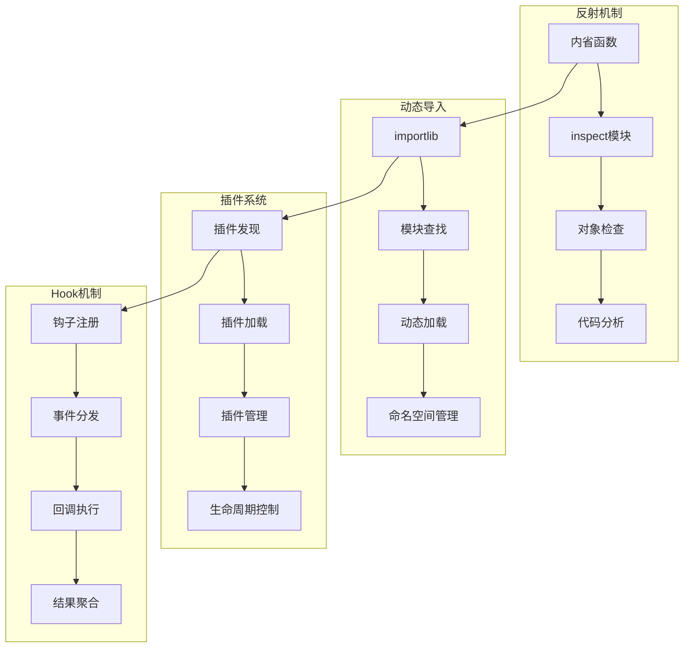
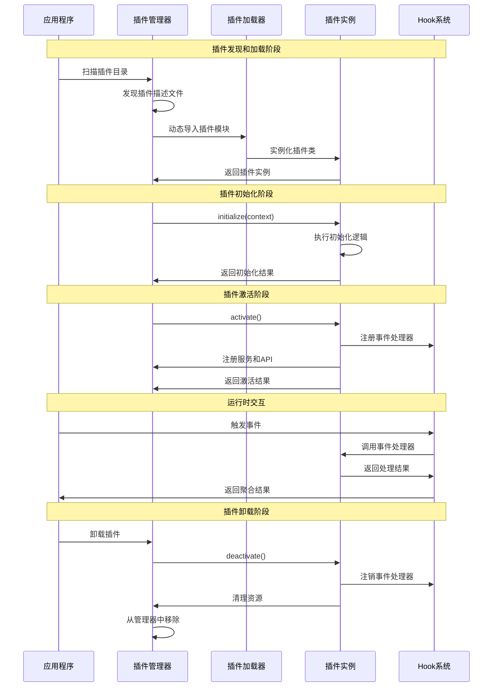

## 📋 概述

反射和插件化是Python强大的动态特性，允许程序在运行时检查、修改自身的结构和行为。本文档将深入分析CPython中反射机制的实现原理、插件系统的设计模式、动态导入机制、以及各种元编程技术的源码实现。

## 🎯 反射与插件化架构



## 1. 反射机制深度实现

### 1.1 内省函数源码分析

```c
/* Objects/object.c - 对象内省的C实现 */

/* 获取对象属性 */
PyObject *
PyObject_GetAttr(PyObject *v, PyObject *name)
{
    PyTypeObject *tp = Py_TYPE(v);

    /* 检查是否有自定义的getattr方法 */
    if (tp->tp_getattro != NULL) {
        return (*tp->tp_getattro)(v, name);
    }

    /* 检查是否有getattr函数 */
    if (tp->tp_getattr != NULL) {
        const char *name_str = PyUnicode_AsUTF8(name);
        if (name_str == NULL) {
            return NULL;
        }
        return (*tp->tp_getattr)(v, (char *)name_str);
    }

    /* 使用通用属性获取 */
    return PyObject_GenericGetAttr(v, name);
}

/* 检查对象是否有某个属性 */
int
PyObject_HasAttr(PyObject *v, PyObject *name)
{
    PyObject *res = PyObject_GetAttr(v, name);
    if (res != NULL) {
        Py_DECREF(res);
        return 1;
    }

    /* 清除异常，只返回布尔值 */
    PyErr_Clear();
    return 0;
}

/* 获取对象的所有属性名 */
PyObject *
PyObject_Dir(PyObject *obj)
{
    PyObject *result = NULL;
    PyObject *dict = NULL;

    /* 检查对象是否有__dir__方法 */
    _Py_IDENTIFIER(__dir__);
    PyObject *dirfunc = _PyObject_LookupSpecial(obj, &PyId___dir__);
    if (dirfunc != NULL) {
        result = _PyObject_CallNoArg(dirfunc);
        Py_DECREF(dirfunc);
        if (result == NULL) {
            return NULL;
        }

        /* 确保返回值是列表 */
        if (!PyList_Check(result)) {
            PyErr_Format(PyExc_TypeError,
                         "__dir__() must return a list, not %.200s",
                         Py_TYPE(result)->tp_name);
            Py_DECREF(result);
            return NULL;
        }

        return result;
    }

    /* 如果没有__dir__方法，使用默认实现 */
    return _PyObject_GenericDir(obj);
}

/* 通用目录列举实现 */
static PyObject *
_PyObject_GenericDir(PyObject *obj)
{
    PyObject *result = NULL;
    PyObject *dict = NULL;
    PyObject *lis = NULL;
    PyObject *name = NULL;

    /* 创建结果列表 */
    result = PyList_New(0);
    if (result == NULL) {
        return NULL;
    }

    /* 获取对象的字典 */
    dict = PyObject_GetAttrString(obj, "__dict__");
    if (dict != NULL) {
        if (PyDict_Check(dict)) {
            /* 添加实例属性 */
            PyObject *key, *value;
            Py_ssize_t pos = 0;

            while (PyDict_Next(dict, &pos, &key, &value)) {
                if (PyList_Append(result, key) < 0) {
                    goto error;
                }
            }
        }
        Py_DECREF(dict);
    } else {
        PyErr_Clear();
    }

    /* 添加类属性 */
    PyTypeObject *type = Py_TYPE(obj);
    if (type->tp_dict != NULL) {
        PyObject *key, *value;
        Py_ssize_t pos = 0;

        while (PyDict_Next(type->tp_dict, &pos, &key, &value)) {
            if (PyList_Append(result, key) < 0) {
                goto error;
            }
        }
    }

    /* 排序并去重 */
    if (PyList_Sort(result) < 0) {
        goto error;
    }

    return result;

error:
    Py_XDECREF(result);
    return NULL;
}
```

### 1.2 Python反射机制分析

```python
# Python反射机制深度分析
import inspect
import types
import sys
import dis
from typing import Any, Dict, List, Callable, Optional, Union
import ast
import importlib

class ReflectionAnalyzer:
    """反射机制分析器"""

    def __init__(self):
        self.analysis_cache = {}
        self.introspection_history = []

    def analyze_object_structure(self, obj: Any) -> Dict[str, Any]:
        """分析对象结构"""

        analysis = {
            'basic_info': self._get_basic_info(obj),
            'attributes': self._get_attributes(obj),
            'methods': self._get_methods(obj),
            'properties': self._get_properties(obj),
            'inheritance': self._get_inheritance_info(obj),
            'source_info': self._get_source_info(obj),
            'metadata': self._get_metadata(obj)
        }

        return analysis

    def _get_basic_info(self, obj: Any) -> Dict[str, Any]:
        """获取基础信息"""

        return {
            'type': type(obj).__name__,
            'module': getattr(obj, '__module__', None),
            'name': getattr(obj, '__name__', None),
            'qualname': getattr(obj, '__qualname__', None),
            'id': id(obj),
            'size': sys.getsizeof(obj),
            'is_callable': callable(obj),
            'is_class': inspect.isclass(obj),
            'is_function': inspect.isfunction(obj),
            'is_method': inspect.ismethod(obj),
            'is_builtin': inspect.isbuiltin(obj),
            'is_module': inspect.ismodule(obj)
        }

    def _get_attributes(self, obj: Any) -> Dict[str, Any]:
        """获取属性信息"""

        attributes = {}

        try:
            # 使用dir()获取所有属性名
            attr_names = dir(obj)

            for name in attr_names:
                try:
                    attr_value = getattr(obj, name)
                    attributes[name] = {
                        'value': attr_value,
                        'type': type(attr_value).__name__,
                        'callable': callable(attr_value),
                        'private': name.startswith('_'),
                        'special': name.startswith('__') and name.endswith('__'),
                        'descriptor': hasattr(type(attr_value), '__get__'),
                        'doc': getattr(attr_value, '__doc__', None)
                    }
                except Exception as e:
                    attributes[name] = {'error': str(e)}

        except Exception as e:
            return {'error': f"无法获取属性: {e}"}

        return attributes

    def _get_methods(self, obj: Any) -> Dict[str, Any]:
        """获取方法信息"""

        methods = {}

        # 获取所有方法
        for name, method in inspect.getmembers(obj, inspect.ismethod):
            methods[name] = self._analyze_method(method)

        # 获取所有函数（对于类对象）
        if inspect.isclass(obj):
            for name, func in inspect.getmembers(obj, inspect.isfunction):
                methods[name] = self._analyze_function(func)

        return methods

    def _analyze_method(self, method) -> Dict[str, Any]:
        """分析方法"""

        try:
            sig = inspect.signature(method)

            return {
                'type': 'method',
                'signature': str(sig),
                'parameters': {
                    name: {
                        'kind': param.kind.name,
                        'default': param.default if param.default != param.empty else None,
                        'annotation': param.annotation if param.annotation != param.empty else None
                    }
                    for name, param in sig.parameters.items()
                },
                'return_annotation': sig.return_annotation if sig.return_annotation != sig.empty else None,
                'doc': method.__doc__,
                'module': method.__module__,
                'qualname': method.__qualname__,
                'is_bound': hasattr(method, '__self__'),
                'self_type': type(method.__self__).__name__ if hasattr(method, '__self__') else None
            }

        except Exception as e:
            return {'error': f"方法分析失败: {e}"}

    def _analyze_function(self, func) -> Dict[str, Any]:
        """分析函数"""

        try:
            sig = inspect.signature(func)

            analysis = {
                'type': 'function',
                'signature': str(sig),
                'parameters': {
                    name: {
                        'kind': param.kind.name,
                        'default': param.default if param.default != param.empty else None,
                        'annotation': param.annotation if param.annotation != param.empty else None
                    }
                    for name, param in sig.parameters.items()
                },
                'return_annotation': sig.return_annotation if sig.return_annotation != sig.empty else None,
                'doc': func.__doc__,
                'module': func.__module__,
                'qualname': func.__qualname__,
                'closure': func.__closure__ is not None,
                'defaults': func.__defaults__,
                'kwdefaults': func.__kwdefaults__,
                'annotations': getattr(func, '__annotations__', {})
            }

            # 分析函数代码
            if hasattr(func, '__code__'):
                code = func.__code__
                analysis['code_info'] = {
                    'filename': code.co_filename,
                    'firstlineno': code.co_firstlineno,
                    'argcount': code.co_argcount,
                    'kwonlyargcount': code.co_kwonlyargcount,
                    'nlocals': code.co_nlocals,
                    'stacksize': code.co_stacksize,
                    'flags': code.co_flags,
                    'varnames': code.co_varnames,
                    'freevars': code.co_freevars,
                    'cellvars': code.co_cellvars
                }

            return analysis

        except Exception as e:
            return {'error': f"函数分析失败: {e}"}

    def _get_properties(self, obj: Any) -> Dict[str, Any]:
        """获取属性描述符信息"""

        properties = {}

        if inspect.isclass(obj):
            for name, prop in inspect.getmembers(obj):
                if isinstance(prop, property):
                    properties[name] = {
                        'type': 'property',
                        'fget': prop.fget.__name__ if prop.fget else None,
                        'fset': prop.fset.__name__ if prop.fset else None,
                        'fdel': prop.fdel.__name__ if prop.fdel else None,
                        'doc': prop.__doc__,
                        'readable': prop.fget is not None,
                        'writable': prop.fset is not None,
                        'deletable': prop.fdel is not None
                    }
                elif hasattr(prop, '__get__') or hasattr(prop, '__set__'):
                    # 其他描述符
                    properties[name] = {
                        'type': 'descriptor',
                        'class': type(prop).__name__,
                        'get': hasattr(prop, '__get__'),
                        'set': hasattr(prop, '__set__'),
                        'delete': hasattr(prop, '__delete__'),
                        'doc': getattr(prop, '__doc__', None)
                    }

        return properties

    def _get_inheritance_info(self, obj: Any) -> Dict[str, Any]:
        """获取继承信息"""

        if not inspect.isclass(obj):
            obj = type(obj)

        return {
            'mro': [cls.__name__ for cls in obj.__mro__],
            'bases': [cls.__name__ for cls in obj.__bases__],
            'subclasses': [cls.__name__ for cls in obj.__subclasses__()],
            'abstract': inspect.isabstract(obj) if hasattr(inspect, 'isabstract') else False
        }

    def _get_source_info(self, obj: Any) -> Dict[str, Any]:
        """获取源码信息"""

        source_info = {}

        try:
            # 获取源码
            source_info['source'] = inspect.getsource(obj)
            source_info['file'] = inspect.getfile(obj)
            source_info['line_number'] = inspect.getsourcelines(obj)[1]

        except Exception as e:
            source_info['error'] = f"无法获取源码: {e}"

        # 获取字节码（如果是函数或方法）
        if hasattr(obj, '__code__'):
            try:
                import io
                output = io.StringIO()
                dis.dis(obj, file=output)
                source_info['bytecode'] = output.getvalue()
            except Exception as e:
                source_info['bytecode_error'] = str(e)

        return source_info

    def _get_metadata(self, obj: Any) -> Dict[str, Any]:
        """获取元数据"""

        metadata = {}

        # 常见的元数据属性
        meta_attrs = [
            '__author__', '__version__', '__date__', '__credits__',
            '__license__', '__copyright__', '__contact__', '__email__',
            '__status__', '__deprecated__', '__since__'
        ]

        for attr in meta_attrs:
            if hasattr(obj, attr):
                metadata[attr] = getattr(obj, attr)

        # 注解信息
        if hasattr(obj, '__annotations__'):
            metadata['annotations'] = obj.__annotations__

        # 类型信息
        if hasattr(obj, '__orig_bases__'):
            metadata['generic_bases'] = [str(base) for base in obj.__orig_bases__]

        if hasattr(obj, '__parameters__'):
            metadata['type_parameters'] = [str(param) for param in obj.__parameters__]

        return metadata

    def demonstrate_reflection_capabilities(self):
        """演示反射能力"""

        print("=== Python反射机制演示 ===")

        # 创建测试类
        class SampleClass:
            """示例类，用于演示反射功能"""

            class_var = "类变量"

            def __init__(self, name: str, value: int = 0):
                self.name = name
                self.value = value
                self._private = "私有属性"

            def public_method(self, arg: str) -> str:
                """公共方法"""
                return f"Hello, {arg}!"

            def _private_method(self):
                """私有方法"""
                return "This is private"

            @property
            def computed_property(self) -> str:
                """计算属性"""
                return f"{self.name}: {self.value}"

            @computed_property.setter
            def computed_property(self, value: str):
                parts = value.split(': ')
                if len(parts) == 2:
                    self.name, self.value = parts[0], int(parts[1])

            @staticmethod
            def static_method(x: int, y: int) -> int:
                """静态方法"""
                return x + y

            @classmethod
            def class_method(cls, name: str):
                """类方法"""
                return cls(name, 100)

        # 创建实例
        sample_obj = SampleClass("test", 42)

        # 分析类
        print("分析类结构:")
        class_analysis = self.analyze_object_structure(SampleClass)
        self._print_analysis_summary(class_analysis)

        # 分析实例
        print(f"\n分析实例结构:")
        instance_analysis = self.analyze_object_structure(sample_obj)
        self._print_analysis_summary(instance_analysis)

        # 动态操作演示
        print(f"\n动态操作演示:")
        self._demonstrate_dynamic_operations(sample_obj)

    def _print_analysis_summary(self, analysis: Dict[str, Any]):
        """打印分析摘要"""

        basic = analysis['basic_info']
        print(f"  类型: {basic['type']}")
        print(f"  模块: {basic['module']}")
        print(f"  名称: {basic['name']}")

        attrs = analysis['attributes']
        print(f"  属性数量: {len(attrs)}")

        methods = analysis['methods']
        print(f"  方法数量: {len(methods)}")

        properties = analysis['properties']
        if properties:
            print(f"  属性描述符数量: {len(properties)}")

        inheritance = analysis['inheritance']
        print(f"  继承层次: {' -> '.join(inheritance['mro'])}")

    def _demonstrate_dynamic_operations(self, obj):
        """演示动态操作"""

        # 动态获取属性
        attr_name = 'name'
        if hasattr(obj, attr_name):
            value = getattr(obj, attr_name)
            print(f"动态获取属性 {attr_name}: {value}")

        # 动态设置属性
        setattr(obj, 'dynamic_attr', 'dynamically set')
        print(f"动态设置属性: {obj.dynamic_attr}")

        # 动态调用方法
        method_name = 'public_method'
        if hasattr(obj, method_name):
            method = getattr(obj, method_name)
            result = method("World")
            print(f"动态调用方法 {method_name}: {result}")

        # 动态创建方法
        def new_method(self, x, y):
            return x * y + self.value

        # 绑定新方法到实例
        import types
        obj.new_method = types.MethodType(new_method, obj)
        result = obj.new_method(3, 4)
        print(f"动态创建的方法结果: {result}")

        # 检查对象能力
        capabilities = {
            '可调用': callable(obj),
            '可迭代': hasattr(obj, '__iter__'),
            '可比较': hasattr(obj, '__eq__'),
            '可哈希': hasattr(obj, '__hash__'),
            '上下文管理器': hasattr(obj, '__enter__') and hasattr(obj, '__exit__')
        }

        print("对象能力检查:")
        for capability, has_it in capabilities.items():
            print(f"  {capability}: {has_it}")

# 运行反射演示
reflection_analyzer = ReflectionAnalyzer()
reflection_analyzer.demonstrate_reflection_capabilities()
```

## 2. 动态导入系统实现

### 2.1 importlib源码分析

```python
# 动态导入系统深度分析
import importlib
import importlib.util
import importlib.machinery
import sys
import os
from typing import Dict, List, Any, Optional, Type, ModuleType
import types
import inspect

class DynamicImportAnalyzer:
    """动态导入分析器"""

    def __init__(self):
        self.import_history = []
        self.module_cache = {}
        self.custom_finders = []

    def analyze_import_system(self):
        """分析Python导入系统"""

        print("=== Python导入系统分析 ===")

        # 分析sys.modules
        print(f"已加载模块数量: {len(sys.modules)}")

        # 分析sys.path
        print(f"模块搜索路径:")
        for i, path in enumerate(sys.path):
            print(f"  {i}: {path}")

        # 分析sys.meta_path
        print(f"\n元路径查找器:")
        for i, finder in enumerate(sys.meta_path):
            print(f"  {i}: {type(finder).__name__}")

        # 分析sys.path_hooks
        print(f"\n路径钩子:")
        for i, hook in enumerate(sys.path_hooks):
            print(f"  {i}: {hook}")

        # 分析sys.path_importer_cache
        print(f"\n导入器缓存项数: {len(sys.path_importer_cache)}")

    def demonstrate_dynamic_import_methods(self):
        """演示各种动态导入方法"""

        print(f"\n=== 动态导入方法演示 ===")

        # 1. 使用importlib.import_module
        print("1. importlib.import_module方法:")
        try:
            math_module = importlib.import_module('math')
            print(f"   导入成功: {math_module.__name__}")
            print(f"   pi值: {math_module.pi}")
        except ImportError as e:
            print(f"   导入失败: {e}")

        # 2. 动态导入子模块
        print(f"\n2. 动态导入子模块:")
        try:
            json_encoder = importlib.import_module('json.encoder')
            print(f"   导入成功: {json_encoder.__name__}")
            print(f"   JSONEncoder类: {json_encoder.JSONEncoder}")
        except ImportError as e:
            print(f"   导入失败: {e}")

        # 3. 从字符串导入
        print(f"\n3. 从字符串路径导入:")
        module_names = [
            'os.path',
            'collections.abc',
            'urllib.parse',
            'xml.etree.ElementTree'
        ]

        for module_name in module_names:
            try:
                module = importlib.import_module(module_name)
                print(f"   {module_name}: ✓")
            except ImportError as e:
                print(f"   {module_name}: ✗ ({e})")

        # 4. 条件导入
        print(f"\n4. 条件导入演示:")
        optional_modules = ['numpy', 'requests', 'django', 'flask']

        for module_name in optional_modules:
            try:
                module = importlib.import_module(module_name)
                print(f"   {module_name}: 可用 (版本: {getattr(module, '__version__', 'unknown')})")
            except ImportError:
                print(f"   {module_name}: 不可用")

    def demonstrate_spec_based_import(self):
        """演示基于规范的导入"""

        print(f"\n=== 基于规范的导入演示 ===")

        # 1. 查找模块规范
        module_name = 'json'
        spec = importlib.util.find_spec(module_name)

        if spec:
            print(f"模块 {module_name} 的规范:")
            print(f"  名称: {spec.name}")
            print(f"  加载器: {type(spec.loader).__name__}")
            print(f"  原始位置: {spec.origin}")
            print(f"  是包: {spec.submodule_search_locations is not None}")

            # 2. 从规范创建模块
            module = importlib.util.module_from_spec(spec)
            print(f"  从规范创建的模块: {module}")

            # 3. 执行模块
            spec.loader.exec_module(module)
            print(f"  执行后的模块: {module.__name__}")

        # 4. 从文件路径导入
        print(f"\n从文件路径导入:")

        # 创建临时模块文件
        temp_module_code = '''
"""临时模块，用于演示从文件导入"""

def hello(name):
    return f"Hello, {name} from dynamic module!"

class TempClass:
    def __init__(self, value):
        self.value = value

    def get_double(self):
        return self.value * 2

CONSTANT = 42
'''

        temp_file = 'temp_dynamic_module.py'
        try:
            with open(temp_file, 'w') as f:
                f.write(temp_module_code)

            # 从文件导入
            spec = importlib.util.spec_from_file_location("temp_module", temp_file)
            temp_module = importlib.util.module_from_spec(spec)
            spec.loader.exec_module(temp_module)

            print(f"  从文件导入成功: {temp_module.__name__}")
            print(f"  调用函数: {temp_module.hello('World')}")
            print(f"  使用类: {temp_module.TempClass(21).get_double()}")
            print(f"  常量: {temp_module.CONSTANT}")

        except Exception as e:
            print(f"  从文件导入失败: {e}")

        finally:
            # 清理临时文件
            if os.path.exists(temp_file):
                os.remove(temp_file)

    def demonstrate_lazy_import(self):
        """演示惰性导入"""

        print(f"\n=== 惰性导入演示 ===")

        class LazyImporter:
            """惰性导入器"""

            def __init__(self, module_name: str):
                self.module_name = module_name
                self._module = None

            def __getattr__(self, name):
                if self._module is None:
                    print(f"首次访问，正在导入模块: {self.module_name}")
                    self._module = importlib.import_module(self.module_name)

                return getattr(self._module, name)

            def __repr__(self):
                status = "已加载" if self._module else "未加载"
                return f"LazyImporter({self.module_name}, {status})"

        # 创建惰性导入器
        lazy_math = LazyImporter('math')
        lazy_os = LazyImporter('os')

        print(f"创建惰性导入器:")
        print(f"  lazy_math: {lazy_math}")
        print(f"  lazy_os: {lazy_os}")

        # 首次访问触发导入
        print(f"\n首次访问 math.pi:")
        pi_value = lazy_math.pi
        print(f"  π = {pi_value}")
        print(f"  lazy_math状态: {lazy_math}")

        print(f"\n访问 os.getcwd:")
        cwd = lazy_os.getcwd()
        print(f"  当前目录: {cwd}")
        print(f"  lazy_os状态: {lazy_os}")

    def create_custom_importer(self):
        """创建自定义导入器"""

        print(f"\n=== 自定义导入器演示 ===")

        class CustomFinder:
            """自定义查找器"""

            def __init__(self, modules_map: Dict[str, str]):
                self.modules_map = modules_map

            def find_spec(self, fullname, path, target=None):
                if fullname in self.modules_map:
                    code = self.modules_map[fullname]
                    loader = CustomLoader(fullname, code)
                    spec = importlib.machinery.ModuleSpec(fullname, loader)
                    return spec
                return None

        class CustomLoader:
            """自定义加载器"""

            def __init__(self, fullname: str, code: str):
                self.fullname = fullname
                self.code = code

            def create_module(self, spec):
                return None  # 使用默认模块创建

            def exec_module(self, module):
                # 执行代码在模块的命名空间中
                exec(self.code, module.__dict__)

        # 定义虚拟模块
        virtual_modules = {
            'my_virtual_module': '''
def greet(name):
    return f"Hello from virtual module, {name}!"

class VirtualClass:
    def __init__(self, x):
        self.x = x

    def compute(self):
        return self.x ** 2

VERSION = "1.0.0"
''',
            'my_math_utils': '''
import math

def factorial_iter(n):
    result = 1
    for i in range(1, n + 1):
        result *= i
    return result

def is_prime(n):
    if n < 2:
        return False
    for i in range(2, int(math.sqrt(n)) + 1):
        if n % i == 0:
            return False
    return True

PI = 3.14159265359
'''
        }

        # 创建并注册自定义查找器
        custom_finder = CustomFinder(virtual_modules)
        sys.meta_path.insert(0, custom_finder)

        try:
            # 导入虚拟模块
            print("导入虚拟模块:")

            virtual_mod = importlib.import_module('my_virtual_module')
            print(f"  成功导入: {virtual_mod.__name__}")
            print(f"  调用函数: {virtual_mod.greet('Python')}")
            print(f"  使用类: {virtual_mod.VirtualClass(5).compute()}")
            print(f"  版本: {virtual_mod.VERSION}")

            math_utils = importlib.import_module('my_math_utils')
            print(f"  数学工具模块: {math_utils.__name__}")
            print(f"  阶乘计算: 5! = {math_utils.factorial_iter(5)}")
            print(f"  质数检查: is_prime(17) = {math_utils.is_prime(17)}")
            print(f"  常量: PI = {math_utils.PI}")

        finally:
            # 清理：移除自定义查找器
            if custom_finder in sys.meta_path:
                sys.meta_path.remove(custom_finder)

    def analyze_module_lifecycle(self):
        """分析模块生命周期"""

        print(f"\n=== 模块生命周期分析 ===")

        # 创建模块生命周期监控器
        class ModuleLifecycleMonitor:
            def __init__(self):
                self.events = []

            def log_event(self, event, module_name, details=None):
                self.events.append({
                    'event': event,
                    'module': module_name,
                    'details': details,
                    'timestamp': __import__('time').time()
                })
                print(f"  [{event}] {module_name}: {details or ''}")

        monitor = ModuleLifecycleMonitor()

        # 监控模块导入过程
        module_code = '''
print("模块正在初始化...")

def init_function():
    print("模块初始化函数被调用")
    return "initialized"

class ModuleClass:
    def __init__(self):
        print("ModuleClass实例被创建")
        self.status = "active"

# 模块级别的初始化代码
INIT_RESULT = init_function()
INSTANCE = ModuleClass()

print("模块初始化完成")
'''

        # 创建临时模块文件
        temp_file = 'lifecycle_test_module.py'
        try:
            with open(temp_file, 'w') as f:
                f.write(module_code)

            monitor.log_event('CREATE_SPEC', 'lifecycle_test_module', '创建模块规范')
            spec = importlib.util.spec_from_file_location("lifecycle_test_module", temp_file)

            monitor.log_event('CREATE_MODULE', 'lifecycle_test_module', '从规范创建模块对象')
            module = importlib.util.module_from_spec(spec)

            monitor.log_event('EXEC_MODULE', 'lifecycle_test_module', '执行模块代码')
            spec.loader.exec_module(module)

            monitor.log_event('MODULE_READY', 'lifecycle_test_module', f'模块就绪，INIT_RESULT={module.INIT_RESULT}')

            # 访问模块内容
            monitor.log_event('ACCESS_ATTR', 'lifecycle_test_module', f'访问实例状态: {module.INSTANCE.status}')

            # 重新导入（应该使用缓存）
            monitor.log_event('REIMPORT', 'lifecycle_test_module', '尝试重新导入')
            reimported = importlib.import_module('lifecycle_test_module')
            is_same = reimported is module
            monitor.log_event('REIMPORT_RESULT', 'lifecycle_test_module', f'是否为同一对象: {is_same}')

        except Exception as e:
            monitor.log_event('ERROR', 'lifecycle_test_module', str(e))

        finally:
            # 清理
            if os.path.exists(temp_file):
                os.remove(temp_file)

            # 从sys.modules中移除（如果存在）
            if 'lifecycle_test_module' in sys.modules:
                del sys.modules['lifecycle_test_module']
                monitor.log_event('CLEANUP', 'lifecycle_test_module', '从sys.modules中移除')

        print(f"\n生命周期事件总数: {len(monitor.events)}")

# 运行动态导入分析
dynamic_import_analyzer = DynamicImportAnalyzer()
dynamic_import_analyzer.analyze_import_system()
dynamic_import_analyzer.demonstrate_dynamic_import_methods()
dynamic_import_analyzer.demonstrate_spec_based_import()
dynamic_import_analyzer.demonstrate_lazy_import()
dynamic_import_analyzer.create_custom_importer()
dynamic_import_analyzer.analyze_module_lifecycle()
```

## 3. 插件系统设计与实现

### 3.1 插件架构模式

```python
# 插件系统设计与实现
import abc
import importlib
import pkgutil
import sys
import os
import json
import inspect
from typing import Dict, List, Any, Type, Callable, Optional, Union
from dataclasses import dataclass
from enum import Enum
import threading
import weakref

class PluginState(Enum):
    """插件状态"""
    DISCOVERED = "discovered"
    LOADED = "loaded"
    ACTIVATED = "activated"
    DEACTIVATED = "deactivated"
    ERROR = "error"

@dataclass
class PluginMetadata:
    """插件元数据"""
    name: str
    version: str
    description: str
    author: str
    dependencies: List[str]
    entry_point: str
    config: Dict[str, Any] = None

    @classmethod
    def from_dict(cls, data: Dict[str, Any]) -> 'PluginMetadata':
        return cls(
            name=data['name'],
            version=data['version'],
            description=data.get('description', ''),
            author=data.get('author', ''),
            dependencies=data.get('dependencies', []),
            entry_point=data['entry_point'],
            config=data.get('config', {})
        )

class IPlugin(abc.ABC):
    """插件接口"""

    @abc.abstractmethod
    def get_metadata(self) -> PluginMetadata:
        """获取插件元数据"""
        pass

    @abc.abstractmethod
    def initialize(self, context: 'PluginContext') -> bool:
        """初始化插件"""
        pass

    @abc.abstractmethod
    def activate(self) -> bool:
        """激活插件"""
        pass

    @abc.abstractmethod
    def deactivate(self) -> bool:
        """停用插件"""
        pass

    def get_config(self) -> Dict[str, Any]:
        """获取插件配置"""
        return {}

    def get_hooks(self) -> Dict[str, Callable]:
        """获取插件提供的钩子"""
        return {}

class PluginContext:
    """插件上下文"""

    def __init__(self, app_context: Dict[str, Any]):
        self.app_context = app_context
        self.services = {}
        self.logger = None

    def get_service(self, service_name: str) -> Any:
        """获取服务"""
        return self.services.get(service_name)

    def register_service(self, service_name: str, service: Any):
        """注册服务"""
        self.services[service_name] = service

    def get_config(self, key: str, default: Any = None) -> Any:
        """获取配置值"""
        return self.app_context.get(key, default)

    def log(self, level: str, message: str):
        """记录日志"""
        if self.logger:
            getattr(self.logger, level)(message)
        else:
            print(f"[{level.upper()}] {message}")

class PluginManager:
    """插件管理器"""

    def __init__(self):
        self.plugins: Dict[str, IPlugin] = {}
        self.plugin_states: Dict[str, PluginState] = {}
        self.plugin_metadata: Dict[str, PluginMetadata] = {}
        self.plugin_directories: List[str] = []
        self.context = PluginContext({})
        self.hooks: Dict[str, List[Callable]] = {}
        self.lock = threading.RLock()

    def add_plugin_directory(self, directory: str):
        """添加插件目录"""
        if os.path.exists(directory):
            self.plugin_directories.append(directory)

    def discover_plugins(self) -> List[str]:
        """发现插件"""
        discovered = []

        with self.lock:
            # 从指定目录发现插件
            for directory in self.plugin_directories:
                discovered.extend(self._discover_plugins_in_directory(directory))

            # 从入口点发现插件
            discovered.extend(self._discover_entry_point_plugins())

        return discovered

    def _discover_plugins_in_directory(self, directory: str) -> List[str]:
        """在目录中发现插件"""
        discovered = []

        for item in os.listdir(directory):
            item_path = os.path.join(directory, item)

            # 检查插件描述文件
            plugin_file = os.path.join(item_path, 'plugin.json')
            if os.path.isfile(plugin_file):
                try:
                    with open(plugin_file, 'r') as f:
                        plugin_data = json.load(f)

                    metadata = PluginMetadata.from_dict(plugin_data)
                    self.plugin_metadata[metadata.name] = metadata
                    self.plugin_states[metadata.name] = PluginState.DISCOVERED
                    discovered.append(metadata.name)

                except Exception as e:
                    print(f"解析插件描述文件失败 {plugin_file}: {e}")

        return discovered

    def _discover_entry_point_plugins(self) -> List[str]:
        """通过入口点发现插件"""
        discovered = []

        try:
            # 这里可以集成pkg_resources或importlib.metadata
            # 为简化演示，我们跳过实际的entry_points查找
            pass
        except Exception as e:
            print(f"发现入口点插件失败: {e}")

        return discovered

    def load_plugin(self, plugin_name: str) -> bool:
        """加载插件"""

        with self.lock:
            if plugin_name not in self.plugin_metadata:
                print(f"插件 {plugin_name} 未发现")
                return False

            if plugin_name in self.plugins:
                print(f"插件 {plugin_name} 已加载")
                return True

            try:
                metadata = self.plugin_metadata[plugin_name]

                # 检查依赖
                if not self._check_dependencies(metadata.dependencies):
                    print(f"插件 {plugin_name} 依赖检查失败")
                    self.plugin_states[plugin_name] = PluginState.ERROR
                    return False

                # 动态导入插件模块
                plugin_module = importlib.import_module(metadata.entry_point)

                # 查找插件类
                plugin_class = self._find_plugin_class(plugin_module)
                if not plugin_class:
                    print(f"在模块 {metadata.entry_point} 中找不到插件类")
                    self.plugin_states[plugin_name] = PluginState.ERROR
                    return False

                # 实例化插件
                plugin_instance = plugin_class()

                # 初始化插件
                if plugin_instance.initialize(self.context):
                    self.plugins[plugin_name] = plugin_instance
                    self.plugin_states[plugin_name] = PluginState.LOADED

                    # 注册插件钩子
                    self._register_plugin_hooks(plugin_name, plugin_instance)

                    print(f"插件 {plugin_name} 加载成功")
                    return True
                else:
                    print(f"插件 {plugin_name} 初始化失败")
                    self.plugin_states[plugin_name] = PluginState.ERROR
                    return False

            except Exception as e:
                print(f"加载插件 {plugin_name} 失败: {e}")
                self.plugin_states[plugin_name] = PluginState.ERROR
                return False

    def _check_dependencies(self, dependencies: List[str]) -> bool:
        """检查插件依赖"""
        for dep in dependencies:
            if dep not in self.plugins:
                return False
        return True

    def _find_plugin_class(self, module) -> Optional[Type[IPlugin]]:
        """在模块中查找插件类"""
        for name, obj in inspect.getmembers(module, inspect.isclass):
            if (obj != IPlugin and
                issubclass(obj, IPlugin) and
                not inspect.isabstract(obj)):
                return obj
        return None

    def _register_plugin_hooks(self, plugin_name: str, plugin: IPlugin):
        """注册插件钩子"""
        hooks = plugin.get_hooks()
        for hook_name, hook_func in hooks.items():
            if hook_name not in self.hooks:
                self.hooks[hook_name] = []
            self.hooks[hook_name].append(hook_func)

    def activate_plugin(self, plugin_name: str) -> bool:
        """激活插件"""

        with self.lock:
            if plugin_name not in self.plugins:
                print(f"插件 {plugin_name} 未加载")
                return False

            plugin = self.plugins[plugin_name]

            try:
                if plugin.activate():
                    self.plugin_states[plugin_name] = PluginState.ACTIVATED
                    print(f"插件 {plugin_name} 激活成功")
                    return True
                else:
                    print(f"插件 {plugin_name} 激活失败")
                    return False

            except Exception as e:
                print(f"激活插件 {plugin_name} 失败: {e}")
                self.plugin_states[plugin_name] = PluginState.ERROR
                return False

    def deactivate_plugin(self, plugin_name: str) -> bool:
        """停用插件"""

        with self.lock:
            if plugin_name not in self.plugins:
                return True

            plugin = self.plugins[plugin_name]

            try:
                if plugin.deactivate():
                    self.plugin_states[plugin_name] = PluginState.DEACTIVATED
                    print(f"插件 {plugin_name} 停用成功")
                    return True
                else:
                    print(f"插件 {plugin_name} 停用失败")
                    return False

            except Exception as e:
                print(f"停用插件 {plugin_name} 失败: {e}")
                return False

    def unload_plugin(self, plugin_name: str) -> bool:
        """卸载插件"""

        with self.lock:
            # 先停用
            if not self.deactivate_plugin(plugin_name):
                return False

            # 移除钩子
            self._unregister_plugin_hooks(plugin_name)

            # 从管理器中移除
            if plugin_name in self.plugins:
                del self.plugins[plugin_name]

            if plugin_name in self.plugin_states:
                del self.plugin_states[plugin_name]

            print(f"插件 {plugin_name} 卸载成功")
            return True

    def _unregister_plugin_hooks(self, plugin_name: str):
        """注销插件钩子"""
        # 这里需要更复杂的逻辑来移除特定插件的钩子
        # 为简化，我们跳过具体实现
        pass

    def call_hook(self, hook_name: str, *args, **kwargs) -> List[Any]:
        """调用钩子"""
        results = []

        if hook_name in self.hooks:
            for hook_func in self.hooks[hook_name]:
                try:
                    result = hook_func(*args, **kwargs)
                    results.append(result)
                except Exception as e:
                    print(f"调用钩子 {hook_name} 失败: {e}")

        return results

    def get_plugin_info(self, plugin_name: str) -> Dict[str, Any]:
        """获取插件信息"""
        info = {}

        if plugin_name in self.plugin_metadata:
            metadata = self.plugin_metadata[plugin_name]
            info['metadata'] = {
                'name': metadata.name,
                'version': metadata.version,
                'description': metadata.description,
                'author': metadata.author,
                'dependencies': metadata.dependencies
            }

        if plugin_name in self.plugin_states:
            info['state'] = self.plugin_states[plugin_name].value

        if plugin_name in self.plugins:
            plugin = self.plugins[plugin_name]
            info['config'] = plugin.get_config()
            info['hooks'] = list(plugin.get_hooks().keys())

        return info

    def list_plugins(self) -> Dict[str, Dict[str, Any]]:
        """列出所有插件"""
        return {
            name: self.get_plugin_info(name)
            for name in self.plugin_metadata.keys()
        }

class SamplePlugin(IPlugin):
    """示例插件实现"""

    def __init__(self):
        self.initialized = False
        self.active = False

    def get_metadata(self) -> PluginMetadata:
        return PluginMetadata(
            name="sample_plugin",
            version="1.0.0",
            description="示例插件，演示插件系统功能",
            author="Plugin Developer",
            dependencies=[],
            entry_point="sample_plugin"
        )

    def initialize(self, context: PluginContext) -> bool:
        """初始化插件"""
        print("SamplePlugin: 正在初始化...")
        self.context = context
        self.initialized = True
        return True

    def activate(self) -> bool:
        """激活插件"""
        if not self.initialized:
            return False

        print("SamplePlugin: 正在激活...")
        self.active = True

        # 可以在这里设置钩子、注册服务等
        self.context.register_service("sample_service", self)

        return True

    def deactivate(self) -> bool:
        """停用插件"""
        print("SamplePlugin: 正在停用...")
        self.active = False
        return True

    def get_config(self) -> Dict[str, Any]:
        return {
            "feature_enabled": True,
            "max_connections": 100,
            "timeout": 30
        }

    def get_hooks(self) -> Dict[str, Callable]:
        return {
            "before_request": self.before_request_hook,
            "after_request": self.after_request_hook
        }

    def before_request_hook(self, request_data: Dict[str, Any]) -> Dict[str, Any]:
        """请求前钩子"""
        print(f"SamplePlugin: 处理请求前钩子 - {request_data}")
        request_data['plugin_processed'] = True
        return request_data

    def after_request_hook(self, response_data: Dict[str, Any]) -> Dict[str, Any]:
        """请求后钩子"""
        print(f"SamplePlugin: 处理请求后钩子 - {response_data}")
        response_data['plugin_timestamp'] = __import__('time').time()
        return response_data

    def process_data(self, data: str) -> str:
        """示例服务方法"""
        return f"Processed by SamplePlugin: {data}"

def demonstrate_plugin_system():
    """演示插件系统"""

    print("=== 插件系统演示 ===")

    # 创建插件管理器
    plugin_manager = PluginManager()

    # 创建示例插件
    sample_plugin = SamplePlugin()
    metadata = sample_plugin.get_metadata()

    # 手动注册插件（实际应用中会通过目录扫描）
    plugin_manager.plugin_metadata[metadata.name] = metadata
    plugin_manager.plugin_states[metadata.name] = PluginState.DISCOVERED

    # 模拟插件模块
    class MockPluginModule:
        SamplePlugin = SamplePlugin

    # 替换动态导入
    original_import = importlib.import_module
    def mock_import_module(name):
        if name == metadata.entry_point:
            return MockPluginModule()
        return original_import(name)

    importlib.import_module = mock_import_module

    try:
        # 加载插件
        print("1. 加载插件:")
        success = plugin_manager.load_plugin(metadata.name)
        print(f"   加载结果: {success}")

        # 激活插件
        print(f"\n2. 激活插件:")
        success = plugin_manager.activate_plugin(metadata.name)
        print(f"   激活结果: {success}")

        # 调用钩子
        print(f"\n3. 调用钩子:")
        request_data = {"method": "GET", "path": "/api/test"}
        results = plugin_manager.call_hook("before_request", request_data)
        print(f"   before_request钩子结果: {results}")

        response_data = {"status": 200, "data": "test response"}
        results = plugin_manager.call_hook("after_request", response_data)
        print(f"   after_request钩子结果: {results}")

        # 使用插件服务
        print(f"\n4. 使用插件服务:")
        service = plugin_manager.context.get_service("sample_service")
        if service:
            result = service.process_data("Hello, Plugin!")
            print(f"   服务调用结果: {result}")

        # 获取插件信息
        print(f"\n5. 插件信息:")
        info = plugin_manager.get_plugin_info(metadata.name)
        for key, value in info.items():
            print(f"   {key}: {value}")

        # 列出所有插件
        print(f"\n6. 所有插件列表:")
        all_plugins = plugin_manager.list_plugins()
        for name, info in all_plugins.items():
            print(f"   {name}: {info.get('state', 'unknown')}")

        # 停用插件
        print(f"\n7. 停用插件:")
        success = plugin_manager.deactivate_plugin(metadata.name)
        print(f"   停用结果: {success}")

        # 卸载插件
        print(f"\n8. 卸载插件:")
        success = plugin_manager.unload_plugin(metadata.name)
        print(f"   卸载结果: {success}")

    finally:
        # 恢复原始导入函数
        importlib.import_module = original_import

# 运行插件系统演示
demonstrate_plugin_system()
```

## 4. Hook机制与事件系统

### 4.1 事件驱动架构实现

```python
# Hook机制与事件系统实现
import threading
import weakref
import asyncio
import inspect
from typing import Dict, List, Callable, Any, Optional, Union, Set
from dataclasses import dataclass, field
from enum import Enum
import time
from collections import defaultdict
import traceback

class EventPriority(Enum):
    """事件优先级"""
    HIGHEST = 1
    HIGH = 2
    NORMAL = 3
    LOW = 4
    LOWEST = 5

@dataclass
class EventHandler:
    """事件处理器"""
    callback: Callable
    priority: EventPriority = EventPriority.NORMAL
    once: bool = False
    condition: Optional[Callable] = None

    def __call__(self, *args, **kwargs):
        return self.callback(*args, **kwargs)

@dataclass
class Event:
    """事件对象"""
    name: str
    data: Dict[str, Any] = field(default_factory=dict)
    timestamp: float = field(default_factory=time.time)
    source: Optional[str] = None
    cancelled: bool = False

    def cancel(self):
        """取消事件"""
        self.cancelled = True

class HookManager:
    """Hook管理器"""

    def __init__(self):
        self.hooks: Dict[str, List[EventHandler]] = defaultdict(list)
        self.event_history: List[Event] = []
        self.max_history = 1000
        self.lock = threading.RLock()
        self.middleware: List[Callable] = []
        self.global_filters: List[Callable] = []

    def register_hook(self,
                     event_name: str,
                     callback: Callable,
                     priority: EventPriority = EventPriority.NORMAL,
                     once: bool = False,
                     condition: Optional[Callable] = None) -> str:
        """注册Hook"""

        handler = EventHandler(
            callback=callback,
            priority=priority,
            once=once,
            condition=condition
        )

        with self.lock:
            self.hooks[event_name].append(handler)
            # 按优先级排序
            self.hooks[event_name].sort(key=lambda h: h.priority.value)

        # 返回处理器ID（用于注销）
        return f"{event_name}:{id(handler)}"

    def unregister_hook(self, event_name: str, callback: Callable) -> bool:
        """注销Hook"""

        with self.lock:
            handlers = self.hooks.get(event_name, [])
            original_count = len(handlers)

            # 移除匹配的处理器
            self.hooks[event_name] = [
                h for h in handlers if h.callback != callback
            ]

            return len(self.hooks[event_name]) < original_count

    def add_middleware(self, middleware: Callable):
        """添加中间件"""
        self.middleware.append(middleware)

    def add_global_filter(self, filter_func: Callable):
        """添加全局过滤器"""
        self.global_filters.append(filter_func)

    def emit(self, event_name: str, data: Dict[str, Any] = None, source: str = None) -> List[Any]:
        """触发事件"""

        event = Event(
            name=event_name,
            data=data or {},
            source=source
        )

        # 应用全局过滤器
        for filter_func in self.global_filters:
            if not filter_func(event):
                return []

        # 记录事件历史
        self._record_event(event)

        results = []

        with self.lock:
            handlers = self.hooks.get(event_name, []).copy()

        for handler in handlers:
            if event.cancelled:
                break

            # 检查条件
            if handler.condition and not handler.condition(event):
                continue

            try:
                # 应用中间件
                processed_event = self._apply_middleware(event, handler)

                # 调用处理器
                if asyncio.iscoroutinefunction(handler.callback):
                    # 异步处理器
                    result = asyncio.create_task(
                        handler.callback(processed_event)
                    )
                else:
                    # 同步处理器
                    result = handler.callback(processed_event)

                results.append(result)

                # 如果是一次性处理器，移除它
                if handler.once:
                    with self.lock:
                        if handler in self.hooks[event_name]:
                            self.hooks[event_name].remove(handler)

            except Exception as e:
                print(f"处理事件 {event_name} 时出错: {e}")
                traceback.print_exc()

        return results

    def _apply_middleware(self, event: Event, handler: EventHandler) -> Event:
        """应用中间件"""

        processed_event = event

        for middleware in self.middleware:
            try:
                processed_event = middleware(processed_event, handler) or processed_event
            except Exception as e:
                print(f"中间件处理失败: {e}")

        return processed_event

    def _record_event(self, event: Event):
        """记录事件历史"""

        self.event_history.append(event)

        # 限制历史记录大小
        if len(self.event_history) > self.max_history:
            self.event_history = self.event_history[-self.max_history:]

    async def emit_async(self, event_name: str, data: Dict[str, Any] = None, source: str = None) -> List[Any]:
        """异步触发事件"""

        event = Event(
            name=event_name,
            data=data or {},
            source=source
        )

        # 应用全局过滤器
        for filter_func in self.global_filters:
            if not filter_func(event):
                return []

        self._record_event(event)

        results = []
        tasks = []

        with self.lock:
            handlers = self.hooks.get(event_name, []).copy()

        for handler in handlers:
            if event.cancelled:
                break

            if handler.condition and not handler.condition(event):
                continue

            try:
                processed_event = self._apply_middleware(event, handler)

                if asyncio.iscoroutinefunction(handler.callback):
                    # 异步处理器
                    task = asyncio.create_task(
                        handler.callback(processed_event)
                    )
                    tasks.append(task)
                else:
                    # 同步处理器在线程池中运行
                    task = asyncio.create_task(
                        asyncio.to_thread(handler.callback, processed_event)
                    )
                    tasks.append(task)

                if handler.once:
                    with self.lock:
                        if handler in self.hooks[event_name]:
                            self.hooks[event_name].remove(handler)

            except Exception as e:
                print(f"处理异步事件 {event_name} 时出错: {e}")

        # 等待所有任务完成
        if tasks:
            results = await asyncio.gather(*tasks, return_exceptions=True)

        return results

    def get_hook_info(self, event_name: str) -> Dict[str, Any]:
        """获取Hook信息"""

        with self.lock:
            handlers = self.hooks.get(event_name, [])

            return {
                'event_name': event_name,
                'handler_count': len(handlers),
                'handlers': [
                    {
                        'callback': handler.callback.__name__,
                        'priority': handler.priority.name,
                        'once': handler.once,
                        'has_condition': handler.condition is not None
                    }
                    for handler in handlers
                ]
            }

    def list_events(self) -> List[str]:
        """列出所有事件名称"""
        with self.lock:
            return list(self.hooks.keys())

    def get_event_history(self, event_name: Optional[str] = None, limit: int = 100) -> List[Event]:
        """获取事件历史"""

        history = self.event_history[-limit:] if limit else self.event_history

        if event_name:
            history = [event for event in history if event.name == event_name]

        return history

    def clear_hooks(self, event_name: Optional[str] = None):
        """清除Hook"""

        with self.lock:
            if event_name:
                self.hooks.pop(event_name, None)
            else:
                self.hooks.clear()

class EventBus:
    """事件总线 - 更高级的事件系统"""

    def __init__(self):
        self.hook_manager = HookManager()
        self.channels: Dict[str, Set[str]] = defaultdict(set)
        self.subscribers: Dict[str, Set[Callable]] = defaultdict(set)
        self.weak_refs: weakref.WeakSet = weakref.WeakSet()

    def subscribe(self, channel: str, callback: Callable, weak: bool = True):
        """订阅频道"""

        if weak:
            # 使用弱引用避免内存泄漏
            self.weak_refs.add(callback)

        self.subscribers[channel].add(callback)

        # 注册到Hook管理器
        self.hook_manager.register_hook(channel, callback)

    def unsubscribe(self, channel: str, callback: Callable):
        """取消订阅"""

        self.subscribers[channel].discard(callback)
        self.hook_manager.unregister_hook(channel, callback)

    def publish(self, channel: str, message: Any, metadata: Dict[str, Any] = None):
        """发布消息"""

        data = {
            'message': message,
            'metadata': metadata or {}
        }

        return self.hook_manager.emit(channel, data, source='EventBus')

    async def publish_async(self, channel: str, message: Any, metadata: Dict[str, Any] = None):
        """异步发布消息"""

        data = {
            'message': message,
            'metadata': metadata or {}
        }

        return await self.hook_manager.emit_async(channel, data, source='EventBus')

    def create_channel(self, channel_name: str, parent_channel: Optional[str] = None):
        """创建频道"""

        self.channels[channel_name] = set()

        if parent_channel:
            # 建立父子关系
            self.channels[parent_channel].add(channel_name)

    def get_channel_info(self, channel: str) -> Dict[str, Any]:
        """获取频道信息"""

        return {
            'channel': channel,
            'subscriber_count': len(self.subscribers[channel]),
            'child_channels': list(self.channels[channel]),
            'hook_info': self.hook_manager.get_hook_info(channel)
        }

def demonstrate_hook_system():
    """演示Hook系统"""

    print("=== Hook机制与事件系统演示 ===")

    # 创建Hook管理器
    hook_manager = HookManager()

    # 定义事件处理器
    def on_user_login(event: Event):
        user_id = event.data.get('user_id')
        print(f"用户登录处理器: 用户 {user_id} 已登录")
        return f"login_processed_{user_id}"

    def on_user_login_high_priority(event: Event):
        user_id = event.data.get('user_id')
        print(f"高优先级登录处理器: 优先处理用户 {user_id}")
        return f"high_priority_{user_id}"

    def on_user_login_once(event: Event):
        print("一次性登录处理器: 这个处理器只会执行一次")
        return "once_executed"

    def admin_only_condition(event: Event):
        """只有管理员才触发的条件"""
        return event.data.get('user_type') == 'admin'

    def on_admin_login(event: Event):
        user_id = event.data.get('user_id')
        print(f"管理员登录处理器: 管理员 {user_id} 已登录")
        return f"admin_login_{user_id}"

    # 注册Hook
    print("1. 注册Hook:")
    hook_manager.register_hook('user_login', on_user_login)
    hook_manager.register_hook('user_login', on_user_login_high_priority,
                             priority=EventPriority.HIGH)
    hook_manager.register_hook('user_login', on_user_login_once, once=True)
    hook_manager.register_hook('user_login', on_admin_login,
                             condition=admin_only_condition)

    # 添加中间件
    def logging_middleware(event: Event, handler: EventHandler) -> Event:
        print(f"中间件: 处理事件 {event.name} -> {handler.callback.__name__}")
        return event

    hook_manager.add_middleware(logging_middleware)

    # 添加全局过滤器
    def event_filter(event: Event) -> bool:
        # 过滤掉测试事件
        return not event.name.startswith('test_')

    hook_manager.add_global_filter(event_filter)

    # 触发事件
    print(f"\n2. 触发普通用户登录事件:")
    results = hook_manager.emit('user_login', {
        'user_id': 'user123',
        'user_type': 'normal'
    })
    print(f"   处理结果: {results}")

    print(f"\n3. 触发管理员登录事件:")
    results = hook_manager.emit('user_login', {
        'user_id': 'admin456',
        'user_type': 'admin'
    })
    print(f"   处理结果: {results}")

    print(f"\n4. 再次触发事件（一次性处理器不会执行）:")
    results = hook_manager.emit('user_login', {
        'user_id': 'user789',
        'user_type': 'normal'
    })
    print(f"   处理结果: {results}")

    # 获取Hook信息
    print(f"\n5. Hook信息:")
    info = hook_manager.get_hook_info('user_login')
    print(f"   事件: {info['event_name']}")
    print(f"   处理器数量: {info['handler_count']}")
    for handler_info in info['handlers']:
        print(f"   - {handler_info}")

    # 演示事件总线
    print(f"\n6. 事件总线演示:")
    event_bus = EventBus()

    def channel_subscriber(event: Event):
        message = event.data['message']
        print(f"频道订阅者收到消息: {message}")

    # 订阅频道
    event_bus.subscribe('notifications', channel_subscriber)

    # 发布消息
    event_bus.publish('notifications', "Hello from EventBus!")

    # 获取频道信息
    channel_info = event_bus.get_channel_info('notifications')
    print(f"   频道信息: {channel_info}")

    # 事件历史
    print(f"\n7. 事件历史:")
    history = hook_manager.get_event_history(limit=5)
    for event in history:
        print(f"   {event.timestamp:.2f}: {event.name} from {event.source}")

# 异步Hook演示
async def demonstrate_async_hooks():
    """演示异步Hook"""

    print(f"\n=== 异步Hook演示 ===")

    hook_manager = HookManager()

    # 异步事件处理器
    async def async_handler(event: Event):
        await asyncio.sleep(0.1)  # 模拟异步操作
        print(f"异步处理器: 处理事件 {event.name}")
        return f"async_result_{event.data.get('id', 'unknown')}"

    def sync_handler(event: Event):
        print(f"同步处理器: 处理事件 {event.name}")
        return f"sync_result_{event.data.get('id', 'unknown')}"

    # 注册混合处理器
    hook_manager.register_hook('async_event', async_handler)
    hook_manager.register_hook('async_event', sync_handler)

    # 异步触发事件
    print("异步触发事件:")
    results = await hook_manager.emit_async('async_event', {'id': 'test123'})
    print(f"异步处理结果: {results}")

# 运行Hook系统演示
demonstrate_hook_system()

# 运行异步Hook演示
if __name__ == "__main__":
    asyncio.run(demonstrate_async_hooks())
```

## 5. 反射与插件化时序图



## 6. 总结

Python的反射与插件化机制展现了语言的强大动态特性：

### 6.1 核心能力

1. **内省机制**: 运行时检查对象结构和属性
2. **动态导入**: 灵活的模块加载和管理
3. **插件架构**: 可扩展的应用程序设计
4. **事件系统**: 松耦合的组件通信

### 6.2 设计原则

1. **动态性**: 运行时发现和加载功能
2. **可扩展性**: 支持第三方功能扩展
3. **松耦合**: 通过接口和事件解耦
4. **生命周期管理**: 完整的插件生命周期控制

### 6.3 应用场景

1. **框架开发**: Web框架、ORM、测试框架
2. **应用扩展**: IDE插件、浏览器扩展
3. **微服务**: 服务发现、配置管理
4. **工具链**: 构建工具、代码生成器

### 6.4 最佳实践

1. **安全考虑**: 验证插件来源和权限
2. **性能优化**: 惰性加载和缓存机制
3. **错误处理**: 优雅的插件故障恢复
4. **文档化**: 清晰的插件API文档

反射与插件化为Python应用提供了强大的扩展能力，是构建灵活、可维护系统的重要工具。
