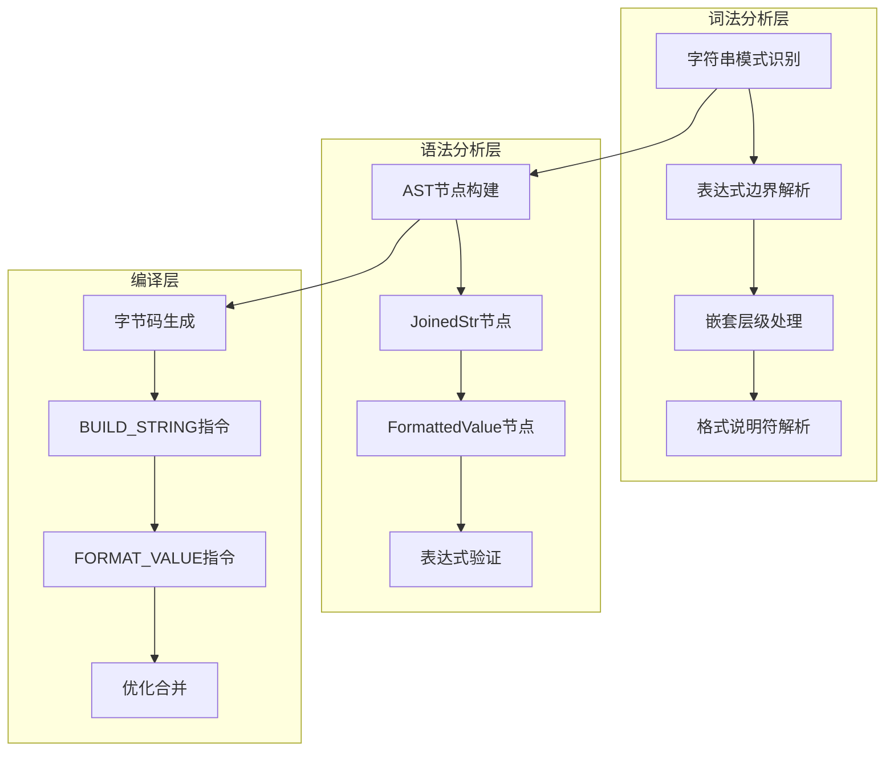

# Python3 f-string进阶特性深度源码分析

## 📋 概述

f-string（格式化字符串字面量）是Python 3.6引入的强大字符串格式化特性。本文档将深入分析CPython中f-string的解析、编译和执行机制，包括表达式嵌套、格式化选项、性能优化等高级特性。

## 🎯 f-string架构概览



## 1. f-string词法分析

### 1.1 字符串解析器实现

```c
/* Parser/string_parser.c - f-string解析核心 */

typedef struct {
    const char *str;          /* 原始字符串 */
    const char *end;          /* 字符串结束位置 */
    const char *s;            /* 当前解析位置 */
    int in_format_spec;       /* 是否在格式说明符中 */
    int nested_depth;         /* 嵌套深度 */
    PyObject *last_str;       /* 最后一个字符串片段 */
    _PyArena *arena;          /* 内存分配器 */
} fstring_parser;

/* f-string主解析函数 */
static int
fstring_find_expr(fstring_parser *state, const char **expr_start,
                  const char **expr_end, const char **format_spec_start,
                  const char **format_spec_end, int *conversion,
                  int raw)
{
    const char *s = state->s;
    const char *end = state->end;
    int nested_depth = state->nested_depth;
    int in_format_spec = state->in_format_spec;

    /* 查找表达式开始标记 '{' */
    while (s < end) {
        if (*s == '{') {
            if (s + 1 < end && s[1] == '{') {
                /* 转义的 '{{' */
                s += 2;
                continue;
            }
            break;  /* 找到表达式开始 */
        }
        if (*s == '}') {
            if (s + 1 < end && s[1] == '}') {
                /* 转义的 '}}' */
                s += 2;
                continue;
            }
            /* 意外的 '}' */
            return -1;
        }
        s++;
    }

    if (s >= end) {
        return 0;  /* 没有更多表达式 */
    }

    /* 记录表达式开始位置 */
    *expr_start = s + 1;  /* 跳过 '{' */
    s++;

    /* 解析表达式内容，处理嵌套 */
    int brace_count = 1;
    int paren_count = 0;
    int bracket_count = 0;
    int in_string = 0;
    char string_char = 0;

    while (s < end && brace_count > 0) {
        char c = *s;

        if (!in_string) {
            switch (c) {
            case '{':
                brace_count++;
                break;
            case '}':
                brace_count--;
                break;
            case '(':
                paren_count++;
                break;
            case ')':
                paren_count--;
                break;
            case '[':
                bracket_count++;
                break;
            case ']':
                bracket_count--;
                break;
            case '"':
            case '\'':
                in_string = 1;
                string_char = c;
                break;
            case '!':
                /* 转换说明符 */
                if (brace_count == 1 && paren_count == 0 && bracket_count == 0) {
                    if (s + 1 < end) {
                        char conv = s[1];
                        if (conv == 's' || conv == 'r' || conv == 'a') {
                            *conversion = conv;
                            s += 2;
                            continue;
                        }
                    }
                }
                break;
            case ':':
                /* 格式说明符 */
                if (brace_count == 1 && paren_count == 0 && bracket_count == 0) {
                    *expr_end = s;
                    *format_spec_start = s + 1;

                    /* 查找格式说明符结束 */
                    s++;
                    while (s < end && *s != '}') {
                        if (*s == '{') {
                            /* 嵌套的f-string */
                            return fstring_parse_nested(state, &s);
                        }
                        s++;
                    }
                    *format_spec_end = s;
                    state->s = s + 1;  /* 跳过 '}' */
                    return 1;
                }
                break;
            }
        } else {
            /* 在字符串内部 */
            if (c == string_char) {
                if (s > *expr_start && s[-1] != '\\') {
                    in_string = 0;
                }
            }
        }
        s++;
    }

    if (brace_count > 0) {
        /* 未闭合的表达式 */
        return -1;
    }

    *expr_end = s - 1;  /* 不包括 '}' */
    *format_spec_start = NULL;
    *format_spec_end = NULL;
    state->s = s;

    return 1;
}
```

### 1.2 嵌套f-string处理

```c
/* Parser/string_parser.c - 嵌套f-string解析 */

static int
fstring_parse_nested(fstring_parser *state, const char **current_pos)
{
    const char *s = *current_pos;
    const char *end = state->end;
    int original_depth = state->nested_depth;

    /* 增加嵌套深度 */
    state->nested_depth++;

    if (state->nested_depth > MAX_FSTRING_NESTED_DEPTH) {
        PyErr_SetString(PyExc_SyntaxError,
                        "f-string expression part cannot include nested f-strings");
        return -1;
    }

    /* 解析嵌套的f-string */
    while (s < end) {
        if (*s == '{') {
            /* 递归处理嵌套 */
            const char *nested_start, *nested_end, *spec_start, *spec_end;
            int conversion = 0;

            state->s = s;
            int result = fstring_find_expr(state, &nested_start, &nested_end,
                                          &spec_start, &spec_end, &conversion, 0);
            if (result < 0) {
                return -1;
            }
            s = state->s;
        } else if (*s == '}') {
            /* 嵌套结束 */
            break;
        } else {
            s++;
        }
    }

    /* 恢复嵌套深度 */
    state->nested_depth = original_depth;
    *current_pos = s;

    return 0;
}
```

## 2. f-string AST构建

### 2.1 AST节点定义

```c
/* Include/Python-ast.h - f-string相关AST节点 */

typedef struct _expr *expr_ty;

/* JoinedStr - 连接字符串（f-string的顶层节点） */
struct _expr {
    enum _expr_kind kind;
    union {
        /* ... 其他表达式类型 ... */

        struct {
            asdl_expr_seq *values;  /* 字符串片段和格式化值的序列 */
        } JoinedStr;

        /* FormattedValue - 格式化值（f-string中的表达式） */
        struct {
            expr_ty value;          /* 要格式化的表达式 */
            int conversion;         /* 转换类型: 's', 'r', 'a', 或 -1 */
            expr_ty format_spec;    /* 格式说明符表达式 */
        } FormattedValue;

        /* Constant - 常量字符串片段 */
        struct {
            constant value;         /* 字符串常量值 */
            string kind;           /* 字符串类型 */
        } Constant;
    } v;

    int lineno;
    int col_offset;
    int end_lineno;
    int end_col_offset;
};
```

### 2.2 AST构建过程

```c
/* Parser/string_parser.c - AST构建 */

static expr_ty
fstring_parse(fstring_parser *state, const char *str, Py_ssize_t len,
              int raw, PyArena *arena)
{
    asdl_expr_seq *seq = _Py_asdl_expr_seq_new(0, arena);
    if (seq == NULL) {
        return NULL;
    }

    state->str = str;
    state->end = str + len;
    state->s = str;
    state->arena = arena;
    state->nested_depth = 0;

    const char *expr_start, *expr_end, *format_spec_start, *format_spec_end;
    int conversion;

    while (state->s < state->end) {
        /* 查找下一个表达式 */
        const char *literal_start = state->s;
        int found = fstring_find_expr(state, &expr_start, &expr_end,
                                     &format_spec_start, &format_spec_end,
                                     &conversion, raw);

        if (found < 0) {
            return NULL;  /* 解析错误 */
        }

        /* 添加字面量部分 */
        if (expr_start > literal_start) {
            expr_ty str_node = make_constant_string(literal_start,
                                                   expr_start - literal_start - 1,
                                                   arena);
            if (str_node == NULL) {
                return NULL;
            }
            asdl_seq_SET(seq, asdl_seq_LEN(seq), str_node);
        }

        if (found == 0) {
            break;  /* 没有更多表达式 */
        }

        /* 解析表达式 */
        expr_ty expr = fstring_parse_expression(expr_start, expr_end, arena);
        if (expr == NULL) {
            return NULL;
        }

        /* 解析格式说明符 */
        expr_ty format_spec = NULL;
        if (format_spec_start != NULL) {
            format_spec = fstring_parse_format_spec(format_spec_start,
                                                   format_spec_end, arena);
            if (format_spec == NULL) {
                return NULL;
            }
        }

        /* 创建FormattedValue节点 */
        expr_ty formatted = _PyAST_FormattedValue(expr, conversion, format_spec,
                                                 0, 0, 0, 0, arena);
        if (formatted == NULL) {
            return NULL;
        }

        asdl_seq_SET(seq, asdl_seq_LEN(seq), formatted);
    }

    /* 处理剩余的字面量 */
    if (state->s < state->end) {
        expr_ty str_node = make_constant_string(state->s,
                                               state->end - state->s,
                                               arena);
        if (str_node == NULL) {
            return NULL;
        }
        asdl_seq_SET(seq, asdl_seq_LEN(seq), str_node);
    }

    /* 创建JoinedStr节点 */
    return _PyAST_JoinedStr(seq, 0, 0, 0, 0, arena);
}
```

## 3. f-string编译与优化

### 3.1 字节码生成

```c
/* Python/codegen.c - f-string编译 */

static int
codegen_joinedstr(compiler *c, expr_ty e)
{
    location loc = LOC(e);
    Py_ssize_t i, n_values;

    n_values = asdl_seq_LEN(e->v.JoinedStr.values);
    if (n_values == 0) {
        /* 空f-string */
        ADDOP_LOAD_CONST(c, loc, PyUnicode_FromString(""));
        return SUCCESS;
    }

    /* 编译所有值 */
    for (i = 0; i < n_values; i++) {
        expr_ty value = (expr_ty)asdl_seq_GET(e->v.JoinedStr.values, i);
        VISIT(c, expr, value);
    }

    /* 生成BUILD_STRING指令 */
    ADDOP_I(c, loc, BUILD_STRING, n_values);

    return SUCCESS;
}

static int
codegen_formatted_value(compiler *c, expr_ty e)
{
    location loc = LOC(e);

    /* 编译要格式化的表达式 */
    VISIT(c, expr, e->v.FormattedValue.value);

    /* 处理格式说明符 */
    if (e->v.FormattedValue.format_spec) {
        /* 编译格式说明符 */
        VISIT(c, expr, e->v.FormattedValue.format_spec);
    } else {
        /* 没有格式说明符，使用None */
        ADDOP_LOAD_CONST(c, loc, Py_None);
    }

    /* 生成FORMAT_VALUE指令 */
    int conversion = e->v.FormattedValue.conversion;
    int opcode_arg = (conversion & 0xff);
    if (e->v.FormattedValue.format_spec) {
        opcode_arg |= FVC_FORMAT_SPEC;
    }

    ADDOP_I(c, loc, FORMAT_VALUE, opcode_arg);

    return SUCCESS;
}
```

### 3.2 格式化指令执行

```c
/* Python/ceval.c - FORMAT_VALUE指令执行 */

case TARGET(FORMAT_VALUE): {
    PyObject *result;
    PyObject *fmt_spec;
    PyObject *value;
    PyObject *(*conv_fn)(PyObject *);
    int which_conversion = oparg & FVC_MASK;
    int have_fmt_spec = (oparg & FVC_FORMAT_SPEC) == FVC_FORMAT_SPEC;

    /* 获取格式说明符和值 */
    fmt_spec = have_fmt_spec ? POP() : NULL;
    value = POP();

    /* 应用转换函数 */
    switch (which_conversion) {
    case FVC_NONE:
        conv_fn = PyObject_Str;
        break;
    case FVC_STR:
        conv_fn = PyObject_Str;
        break;
    case FVC_REPR:
        conv_fn = PyObject_Repr;
        break;
    case FVC_ASCII:
        conv_fn = PyObject_ASCII;
        break;
    default:
        PyErr_Format(PyExc_SystemError,
                     "unexpected conversion flag %d", which_conversion);
        goto error;
    }

    /* 转换值 */
    if (conv_fn != PyObject_Str || !PyUnicode_CheckExact(value)) {
        PyObject *converted = conv_fn(value);
        Py_DECREF(value);
        if (converted == NULL) {
            Py_XDECREF(fmt_spec);
            goto error;
        }
        value = converted;
    }

    /* 应用格式说明符 */
    if (fmt_spec != NULL) {
        result = PyObject_Format(value, fmt_spec);
        Py_DECREF(fmt_spec);
        Py_DECREF(value);
    } else {
        /* 没有格式说明符，直接使用转换后的值 */
        result = value;
    }

    if (result == NULL) {
        goto error;
    }

    PUSH(result);
    DISPATCH();
}

case TARGET(BUILD_STRING): {
    PyObject *str;
    PyObject *empty = PyUnicode_New(0, 0);
    if (empty == NULL) {
        goto error;
    }
    str = _PyUnicode_JoinArray(empty,
                               &PEEK(oparg), oparg);
    Py_DECREF(empty);
    if (str == NULL)
        goto error;
    while (--oparg >= 0) {
        PyObject *item = POP();
        Py_DECREF(item);
    }
    PUSH(str);
    DISPATCH();
}
```

## 4. 高级f-string特性

### 4.1 表达式嵌套示例

```python
# f-string高级嵌套示例
import datetime
import json

def advanced_fstring_examples():
    """f-string高级特性演示"""

    # 1. 基本表达式嵌套
    name = "Python"
    version = 3.11

    # 简单嵌套
    message = f"Welcome to {name} {version:.1f}!"
    print(f"基本嵌套: {message}")

    # 2. 复杂表达式嵌套
    data = {"users": [{"name": "Alice", "age": 25}, {"name": "Bob", "age": 30}]}

    # 字典和列表访问
    info = f"用户: {data['users'][0]['name']}, 年龄: {data['users'][0]['age']}"
    print(f"复杂嵌套: {info}")

    # 3. 函数调用嵌套
    now = datetime.datetime.now()
    formatted_time = f"当前时间: {now.strftime('%Y-%m-%d %H:%M:%S')}"
    print(f"函数调用: {formatted_time}")

    # 4. 条件表达式嵌套
    score = 85
    grade = f"成绩: {score} ({'优秀' if score >= 90 else '良好' if score >= 80 else '一般')}"
    print(f"条件表达式: {grade}")

    # 5. 列表推导式嵌套
    numbers = [1, 2, 3, 4, 5]
    squares = f"平方: {[x**2 for x in numbers if x % 2 == 0]}"
    print(f"列表推导式: {squares}")

    # 6. 嵌套f-string（Python 3.12+支持更好的嵌套）
    items = ["apple", "banana", "cherry"]
    nested_fstring = f"水果列表: {', '.join([f'{item.title()}' for item in items])}"
    print(f"嵌套f-string: {nested_fstring}")

    # 7. 字典格式化
    person = {"name": "Charlie", "age": 28, "city": "Shanghai"}
    formatted_dict = f"个人信息: {json.dumps(person, ensure_ascii=False, indent=2)}"
    print(f"字典格式化:\n{formatted_dict}")

    # 8. 数值格式化
    pi = 3.141592653589793
    numbers_demo = f"""
    数值格式化演示:
    原始值: {pi}
    保留2位小数: {pi:.2f}
    科学计数法: {pi:.2e}
    百分比: {pi:.1%}
    """
    print(numbers_demo)

    # 9. 对齐和填充
    items_with_prices = [
        ("苹果", 3.50),
        ("香蕉", 2.80),
        ("橘子", 4.20)
    ]

    print("商品价格表:")
    print("-" * 20)
    for item, price in items_with_prices:
        print(f"{item:<6} : {price:>6.2f} 元")

    # 10. 日期和时间格式化
    today = datetime.date.today()
    time_formats = f"""
    日期格式化:
    默认格式: {today}
    中文格式: {today:%Y年%m月%d日}
    ISO格式: {today:%Y-%m-%d}
    """
    print(time_formats)

# 运行高级示例
advanced_fstring_examples()
```

### 4.2 自定义格式化类

```python
# 自定义格式化支持
class SmartNumber:
    """支持高级格式化的数字类"""

    def __init__(self, value):
        self.value = float(value)

    def __str__(self):
        return str(self.value)

    def __repr__(self):
        return f"SmartNumber({self.value})"

    def __format__(self, format_spec):
        """自定义格式化方法"""
        if not format_spec:
            return str(self.value)

        # 解析格式说明符
        if format_spec.endswith('cn'):
            # 中文数字格式
            return self._format_chinese()
        elif format_spec.endswith('words'):
            # 英文单词格式
            return self._format_words()
        elif format_spec.endswith('roman'):
            # 罗马数字格式
            return self._format_roman()
        elif format_spec.endswith('binary'):
            # 二进制格式
            return f"0b{int(self.value):b}"
        elif format_spec.endswith('hex'):
            # 十六进制格式
            return f"0x{int(self.value):x}"
        else:
            # 使用标准格式化
            return format(self.value, format_spec)

    def _format_chinese(self):
        """中文数字格式化"""
        digits = ['零', '一', '二', '三', '四', '五', '六', '七', '八', '九']
        if 0 <= self.value < 10 and self.value == int(self.value):
            return digits[int(self.value)]
        return str(self.value)  # 简化实现

    def _format_words(self):
        """英文单词格式化"""
        words = ['zero', 'one', 'two', 'three', 'four', 'five',
                'six', 'seven', 'eight', 'nine']
        if 0 <= self.value < 10 and self.value == int(self.value):
            return words[int(self.value)]
        return str(self.value)  # 简化实现

    def _format_roman(self):
        """罗马数字格式化"""
        if not (1 <= self.value <= 3999) or self.value != int(self.value):
            return str(self.value)

        num = int(self.value)
        values = [1000, 900, 500, 400, 100, 90, 50, 40, 10, 9, 5, 4, 1]
        letters = ['M', 'CM', 'D', 'CD', 'C', 'XC', 'L', 'XL', 'X', 'IX', 'V', 'IV', 'I']

        result = ''
        for i, value in enumerate(values):
            count = num // value
            result += letters[i] * count
            num -= value * count
        return result

class FormattedContainer:
    """支持格式化的容器类"""

    def __init__(self, items):
        self.items = list(items)

    def __format__(self, format_spec):
        """容器格式化"""
        if not format_spec:
            return str(self.items)

        if format_spec == 'pretty':
            # 美观格式
            if not self.items:
                return "[]"
            return "[\n  " + ",\n  ".join(repr(item) for item in self.items) + "\n]"
        elif format_spec == 'csv':
            # CSV格式
            return ",".join(str(item) for item in self.items)
        elif format_spec == 'sum':
            # 求和格式
            try:
                total = sum(self.items)
                return f"总和: {total}"
            except TypeError:
                return "无法求和"
        elif format_spec.startswith('join:'):
            # 自定义连接符
            sep = format_spec[5:]
            return sep.join(str(item) for item in self.items)
        else:
            return str(self.items)

# 测试自定义格式化
def test_custom_formatting():
    """测试自定义格式化"""

    # 测试SmartNumber
    num = SmartNumber(5)
    print("SmartNumber格式化测试:")
    print(f"默认: {num}")
    print(f"中文: {num:cn}")
    print(f"英文: {num:words}")
    print(f"罗马: {num:roman}")
    print(f"二进制: {num:binary}")
    print(f"十六进制: {num:hex}")
    print(f"保留2位小数: {num:.2f}")

    # 测试FormattedContainer
    container = FormattedContainer([1, 2, 3, 4, 5])
    print("\nFormattedContainer格式化测试:")
    print(f"默认: {container}")
    print(f"美观格式: {container:pretty}")
    print(f"CSV格式: {container:csv}")
    print(f"求和: {container:sum}")
    print(f"自定义连接: {container:join: | }")

test_custom_formatting()
```

### 4.3 性能优化示例

```python
# f-string性能优化示例
import time
import string

def performance_comparison():
    """f-string性能对比"""

    # 测试数据
    name = "Python"
    version = 3.11
    count = 100000

    # 1. f-string
    start_time = time.time()
    for i in range(count):
        result = f"Hello, {name} {version}! Iteration {i}"
    fstring_time = time.time() - start_time

    # 2. format方法
    start_time = time.time()
    template = "Hello, {} {}! Iteration {}"
    for i in range(count):
        result = template.format(name, version, i)
    format_time = time.time() - start_time

    # 3. % 格式化
    start_time = time.time()
    template = "Hello, %s %s! Iteration %d"
    for i in range(count):
        result = template % (name, version, i)
    percent_time = time.time() - start_time

    # 4. 字符串连接
    start_time = time.time()
    for i in range(count):
        result = "Hello, " + name + " " + str(version) + "! Iteration " + str(i)
    concat_time = time.time() - start_time

    # 5. join方法
    start_time = time.time()
    for i in range(count):
        result = "".join(["Hello, ", name, " ", str(version), "! Iteration ", str(i)])
    join_time = time.time() - start_time

    print(f"性能对比 ({count} 次迭代):")
    print(f"f-string:     {fstring_time:.4f} 秒")
    print(f"format():     {format_time:.4f} 秒 ({format_time/fstring_time:.2f}x)")
    print(f"% 格式化:     {percent_time:.4f} 秒 ({percent_time/fstring_time:.2f}x)")
    print(f"字符串连接:   {concat_time:.4f} 秒 ({concat_time/fstring_time:.2f}x)")
    print(f"join():       {join_time:.4f} 秒 ({join_time/fstring_time:.2f}x)")

def optimized_fstring_patterns():
    """优化的f-string使用模式"""

    # 1. 预计算复杂表达式
    data = [1, 2, 3, 4, 5]

    # 低效：在f-string中重复计算
    # result = f"平均值: {sum(data)/len(data):.2f}, 总和: {sum(data)}"

    # 高效：预计算
    total = sum(data)
    average = total / len(data)
    result = f"平均值: {average:.2f}, 总和: {total}"

    # 2. 缓存格式字符串
    def format_user_info(users):
        """高效的用户信息格式化"""
        results = []
        for user in users:
            # 预编译格式模板
            results.append(f"{user['name']:10} | {user['age']:3} | {user['email']:20}")
        return "\n".join(results)

    # 3. 批量格式化优化
    def batch_format_numbers(numbers):
        """批量数字格式化"""
        # 使用生成器表达式减少内存占用
        return "\n".join(f"Number {i+1:3}: {num:8.2f}"
                        for i, num in enumerate(numbers))

    # 测试数据
    users = [
        {"name": "Alice", "age": 25, "email": "alice@example.com"},
        {"name": "Bob", "age": 30, "email": "bob@example.com"},
        {"name": "Charlie", "age": 35, "email": "charlie@example.com"}
    ]

    numbers = [3.14159, 2.71828, 1.41421, 0.57721]

    print("优化的格式化结果:")
    print(f"数据统计: {result}")
    print("\n用户信息:")
    print(format_user_info(users))
    print("\n数字列表:")
    print(batch_format_numbers(numbers))

# 运行性能测试
performance_comparison()
print("\n" + "="*50 + "\n")
optimized_fstring_patterns()
```

## 5. f-string最佳实践

### 5.1 调试技巧

```python
# f-string调试技巧
import datetime
import math

def fstring_debugging_tips():
    """f-string调试技巧"""

    # 1. 调试表达式（Python 3.8+）
    x = 42
    y = 24

    # 显示变量名和值
    print(f"{x=}")  # 输出: x=42
    print(f"{y=}")  # 输出: y=24
    print(f"{x + y=}")  # 输出: x + y=66

    # 2. 复杂表达式调试
    data = {"a": 1, "b": 2, "c": 3}
    print(f"{sum(data.values())=}")  # 输出: sum(data.values())=6

    # 3. 函数调用调试
    now = datetime.datetime.now()
    print(f"{now.strftime('%Y-%m-%d')=}")

    # 4. 格式化调试信息
    def debug_format(value, precision=2):
        """调试友好的格式化"""
        return f"{value:.{precision}f}"

    pi = math.pi
    print(f"π = {debug_format(pi, 4)}")

    # 5. 条件调试
    debug_mode = True
    if debug_mode:
        print(f"DEBUG: {x=}, {y=}, {x*y=}")

    # 6. 多行调试信息
    debug_info = f"""
    调试信息:
    x = {x}
    y = {y}
    计算结果 = {x * y}
    时间戳 = {datetime.datetime.now()}
    """
    print(debug_info)

def fstring_error_handling():
    """f-string错误处理"""

    # 1. 安全的属性访问
    class SafeObject:
        def __init__(self, name=None):
            self.name = name

    obj = SafeObject()

    # 不安全：可能抛出AttributeError
    # print(f"Name: {obj.missing_attr}")

    # 安全：使用getattr
    print(f"Name: {getattr(obj, 'missing_attr', 'Unknown')}")

    # 2. 安全的字典访问
    data = {"name": "Alice"}

    # 不安全
    # print(f"Age: {data['age']}")  # KeyError

    # 安全
    print(f"Age: {data.get('age', 'Unknown')}")

    # 3. 异常处理包装
    def safe_format(template, **kwargs):
        """安全的格式化函数"""
        try:
            return template.format(**kwargs)
        except (KeyError, ValueError, TypeError) as e:
            return f"格式化错误: {e}"

    # 使用安全格式化
    result = safe_format("Hello, {name}! You are {age} years old.",
                        name="Bob")  # 缺少age参数
    print(result)

# 运行调试示例
fstring_debugging_tips()
print("\n" + "="*30 + "\n")
fstring_error_handling()
```

### 5.2 国际化支持

```python
# f-string国际化支持
import locale
import datetime
from babel.dates import format_datetime
from babel.numbers import format_currency, format_decimal

def fstring_internationalization():
    """f-string国际化示例"""

    # 1. 本地化数字格式
    try:
        # 设置本地化
        locale.setlocale(locale.LC_ALL, 'zh_CN.UTF-8')
    except locale.Error:
        print("中文本地化不可用，使用默认设置")

    number = 1234567.89
    currency = 9999.99

    # 本地化数字格式
    formatted_number = f"数字: {number:n}"  # 使用本地化千位分隔符
    print(formatted_number)

    # 2. 日期本地化
    now = datetime.datetime.now()

    # 标准格式
    print(f"日期: {now:%Y年%m月%d日}")
    print(f"时间: {now:%H:%M:%S}")

    # 3. 多语言模板
    messages = {
        'zh': "欢迎，{name}！今天是{date}。",
        'en': "Welcome, {name}! Today is {date}.",
        'fr': "Bienvenue, {name}! Aujourd'hui c'est {date}."
    }

    def localized_message(lang, name, date):
        """本地化消息"""
        template = messages.get(lang, messages['en'])
        return template.format(name=name, date=date)

    # 使用本地化消息
    user_name = "张三"
    today = "2023年12月25日"

    for lang in ['zh', 'en', 'fr']:
        msg = localized_message(lang, user_name, today)
        print(f"{lang}: {msg}")

    # 4. 货币格式化
    prices = [100.5, 1234.67, 999999.99]
    print("\n货币格式化:")
    for price in prices:
        # 简单货币格式
        print(f"价格: ¥{price:,.2f}")

fstring_internationalization()
```

## 6. 总结

f-string作为Python现代字符串格式化的首选方案，体现了语言设计的优雅和实用性：

### 6.1 核心优势

1. **性能优秀**: 编译时优化，运行时效率高
2. **语法简洁**: 直观的嵌入式表达式语法
3. **功能强大**: 支持复杂表达式和格式化选项
4. **易于调试**: 内建的调试支持（=操作符）

### 6.2 最佳实践

1. **性能优化**: 预计算复杂表达式，避免重复计算
2. **可读性**: 合理使用换行和缩进，保持代码清晰
3. **错误处理**: 使用安全的访问方法，避免运行时错误
4. **国际化**: 考虑本地化需求，使用适当的格式化选项

### 6.3 注意事项

1. **版本兼容**: 某些高级特性需要较新的Python版本
2. **嵌套限制**: 避免过度复杂的嵌套表达式
3. **性能考虑**: 在高频调用场景中注意性能影响

f-string作为Python 3.6+的核心特性，为字符串格式化提供了强大而高效的解决方案，是现代Python编程的重要工具。
