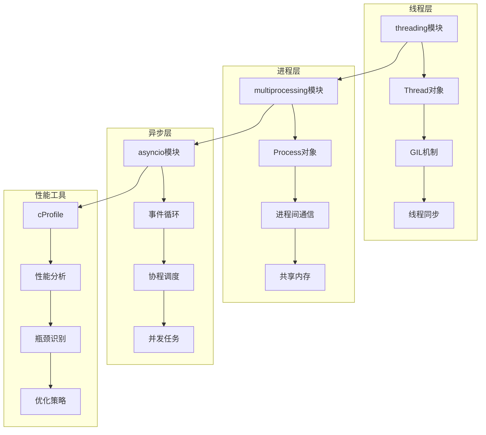
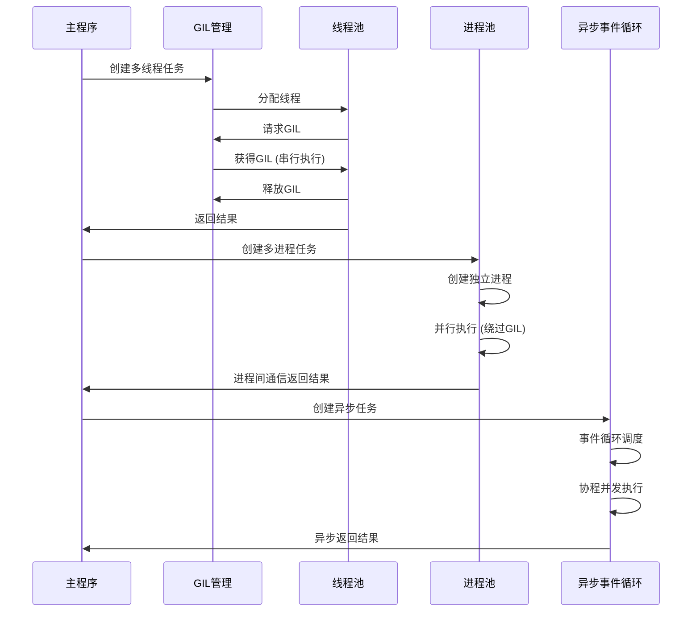

## 📋 概述

并行处理和性能优化是现代Python应用的关键需求。本文档将深入分析CPython中的并行处理机制，包括多线程、多进程、异步编程、GIL机制、性能分析工具等，以及各种性能优化技术和最佳实践。

## 🎯 并行处理架构



## 1. GIL机制深度分析

### 1.1 GIL实现原理

```c
/* Python/ceval_gil.c - GIL实现 */

/* GIL状态结构 */
struct _gil_runtime_state {
    /* GIL的当前状态 */
    unsigned long locked;       /* GIL是否被锁定 */
    unsigned long interval;     /* 切换间隔(微秒) */
    PyThreadState *last_holder; /* 上一个持有GIL的线程 */

    /* 等待GIL的线程 */
    COND_T cond;               /* 条件变量 */
    MUTEX_T mutex;             /* 互斥锁 */

    /* 强制切换标志 */
    _Py_atomic_int gil_drop_request;
    _Py_atomic_int eval_breaker;

    /* 切换统计 */
    unsigned long switch_number;
};

/* 获取GIL */
static void
take_gil(PyThreadState *tstate)
{
    int err;
    _PyRuntimeState *runtime = &_PyRuntime;
    struct _gil_runtime_state *gil = &runtime->gil;

    if (tstate == NULL) {
        Py_FatalError("take_gil: NULL tstate");
    }

    err = PyMUTEX_LOCK(gil->mutex);
    if (err) {
        Py_FatalError("take_gil: PyMUTEX_LOCK failed");
    }

    if (!_Py_atomic_load_relaxed(&gil->locked)) {
        /* GIL空闲，直接获取 */
        goto _ready;
    }

    /* GIL被占用，等待释放 */
    while (_Py_atomic_load_relaxed(&gil->locked)) {
        /* 设置等待标志 */
        _Py_atomic_store_relaxed(&gil->gil_drop_request, 1);

        /* 等待条件变量 */
        err = PyCOND_WAIT(gil->cond, gil->mutex);
        if (err) {
            Py_FatalError("take_gil: PyCOND_WAIT failed");
        }
    }

_ready:
    /* 成功获取GIL */
    _Py_atomic_store_relaxed(&gil->locked, 1);
    _Py_atomic_store_relaxed(&gil->gil_drop_request, 0);

    if (tstate != gil->last_holder) {
        gil->last_holder = tstate;
        gil->switch_number++;
    }

    /* 清除eval_breaker标志 */
    _Py_atomic_store_relaxed(&gil->eval_breaker, 0);

    PyMUTEX_UNLOCK(gil->mutex);

    if (_Py_atomic_load_relaxed(&gil->gil_drop_request)) {
        /* 有其他线程在等待，准备释放 */
        RESET_GIL_DROP_REQUEST(runtime);
    }
}

/* 释放GIL */
static void
drop_gil(PyThreadState *tstate)
{
    _PyRuntimeState *runtime = &_PyRuntime;
    struct _gil_runtime_state *gil = &runtime->gil;

    if (!_Py_atomic_load_relaxed(&gil->locked)) {
        Py_FatalError("drop_gil: GIL is not locked");
    }

    /* 释放GIL */
    PyMUTEX_LOCK(gil->mutex);
    _Py_atomic_store_relaxed(&gil->locked, 0);
    PyCOND_SIGNAL(gil->cond);  /* 唤醒等待的线程 */
    PyMUTEX_UNLOCK(gil->mutex);
}

/* GIL检查点 - 在字节码执行中定期调用 */
int
_Py_CheckInterval()
{
    PyThreadState *tstate = _PyThreadState_GET();

    /* 检查是否需要释放GIL */
    if (_Py_atomic_load_relaxed(&_PyRuntime.gil.gil_drop_request)) {
        /* 有线程请求GIL，释放并重新获取 */
        if (tstate->async_exc != NULL) {
            /* 处理异步异常 */
            return -1;
        }

        drop_gil(tstate);
        /* 让其他线程有机会运行 */
        _Py_ANNOTATE_RWLOCK_RELEASED(&_PyRuntime.gil.locked, 1);
        take_gil(tstate);
        _Py_ANNOTATE_RWLOCK_ACQUIRED(&_PyRuntime.gil.locked, 1);

        if (tstate->async_exc != NULL) {
            return -1;
        }
    }

    return 0;
}
```

### 1.2 GIL性能影响分析

```python
# GIL性能影响分析
import threading
import time
import queue
import multiprocessing
import concurrent.futures
from typing import List
import sys

def gil_impact_analysis():
    """分析GIL对性能的影响"""

    print("=== GIL性能影响分析 ===")

    # 1. CPU密集型任务 - GIL限制明显
    def cpu_intensive_task(n: int) -> int:
        """CPU密集型任务"""
        count = 0
        for i in range(n):
            count += i * i
        return count

    def test_cpu_intensive():
        """测试CPU密集型任务的并行性能"""
        task_size = 1000000
        num_tasks = 4

        # 单线程执行
        start = time.time()
        results_single = []
        for i in range(num_tasks):
            result = cpu_intensive_task(task_size)
            results_single.append(result)
        single_thread_time = time.time() - start

        # 多线程执行（受GIL限制）
        start = time.time()
        results_multi = []
        threads = []
        result_queue = queue.Queue()

        def worker():
            result = cpu_intensive_task(task_size)
            result_queue.put(result)

        for i in range(num_tasks):
            thread = threading.Thread(target=worker)
            threads.append(thread)
            thread.start()

        for thread in threads:
            thread.join()

        while not result_queue.empty():
            results_multi.append(result_queue.get())

        multi_thread_time = time.time() - start

        # 多进程执行（绕过GIL）
        start = time.time()
        with multiprocessing.Pool(num_tasks) as pool:
            results_multi_proc = pool.map(cpu_intensive_task, [task_size] * num_tasks)
        multi_process_time = time.time() - start

        print(f"CPU密集型任务性能对比:")
        print(f"单线程: {single_thread_time:.3f}秒")
        print(f"多线程: {multi_thread_time:.3f}秒 (效率: {single_thread_time/multi_thread_time:.2f}x)")
        print(f"多进程: {multi_process_time:.3f}秒 (效率: {single_thread_time/multi_process_time:.2f}x)")

        return single_thread_time, multi_thread_time, multi_process_time

    # 2. I/O密集型任务 - GIL影响较小
    def io_intensive_task(duration: float) -> str:
        """I/O密集型任务模拟"""
        import time
        time.sleep(duration)  # 模拟I/O等待
        return f"Task completed after {duration}s"

    def test_io_intensive():
        """测试I/O密集型任务的并行性能"""
        task_duration = 0.1
        num_tasks = 10

        # 串行执行
        start = time.time()
        results_serial = []
        for i in range(num_tasks):
            result = io_intensive_task(task_duration)
            results_serial.append(result)
        serial_time = time.time() - start

        # 多线程执行
        start = time.time()
        with concurrent.futures.ThreadPoolExecutor(max_workers=num_tasks) as executor:
            results_thread = list(executor.map(io_intensive_task, [task_duration] * num_tasks))
        thread_time = time.time() - start

        # 多进程执行
        start = time.time()
        with concurrent.futures.ProcessPoolExecutor(max_workers=num_tasks) as executor:
            results_process = list(executor.map(io_intensive_task, [task_duration] * num_tasks))
        process_time = time.time() - start

        print(f"\nI/O密集型任务性能对比:")
        print(f"串行执行: {serial_time:.3f}秒")
        print(f"多线程: {thread_time:.3f}秒 (效率: {serial_time/thread_time:.2f}x)")
        print(f"多进程: {process_time:.3f}秒 (效率: {serial_time/process_time:.2f}x)")

        return serial_time, thread_time, process_time

    # 3. 混合型任务
    def mixed_task(cpu_work: int, io_duration: float) -> int:
        """混合CPU和I/O的任务"""
        # CPU部分
        count = 0
        for i in range(cpu_work):
            count += i

        # I/O部分
        time.sleep(io_duration)

        return count

    def test_mixed_workload():
        """测试混合工作负载"""
        cpu_work = 100000
        io_duration = 0.05
        num_tasks = 6

        # 单线程
        start = time.time()
        results_single = []
        for i in range(num_tasks):
            result = mixed_task(cpu_work, io_duration)
            results_single.append(result)
        single_time = time.time() - start

        # 多线程
        start = time.time()
        with concurrent.futures.ThreadPoolExecutor(max_workers=num_tasks) as executor:
            futures = [executor.submit(mixed_task, cpu_work, io_duration) for _ in range(num_tasks)]
            results_thread = [f.result() for f in futures]
        thread_time = time.time() - start

        print(f"\n混合型任务性能对比:")
        print(f"单线程: {single_time:.3f}秒")
        print(f"多线程: {thread_time:.3f}秒 (效率: {single_time/thread_time:.2f}x)")

    # 运行测试
    test_cpu_intensive()
    test_io_intensive()
    test_mixed_workload()

    # 4. GIL释放频率分析
    def gil_release_analysis():
        """分析GIL释放频率"""

        import sys

        print(f"\n=== GIL配置信息 ===")
        print(f"Python版本: {sys.version}")
        print(f"GIL切换间隔: {sys.getswitchinterval():.6f}秒")

        # 测试GIL切换的实际影响
        def busy_thread(name: str, duration: float):
            """忙等线程"""
            start = time.time()
            count = 0
            while time.time() - start < duration:
                count += 1
            print(f"线程 {name}: 执行了 {count} 次循环")
            return count

        print(f"\nGIL切换测试 (2秒):")
        threads = []
        for i in range(3):
            thread = threading.Thread(target=busy_thread, args=(f"T{i}", 2.0))
            threads.append(thread)
            thread.start()

        for thread in threads:
            thread.join()

    gil_release_analysis()

# 运行GIL分析
if __name__ == "__main__":
    gil_impact_analysis()
```

## 2. 多线程编程深度分析

### 2.1 线程对象实现

```c
/* Modules/_threadmodule.c - 线程模块实现 */

/* 线程状态结构 */
typedef struct {
    PyObject_HEAD
    pthread_t ident;           /* 线程标识符 */
    PyObject *args;            /* 线程参数 */
    PyObject *kwargs;          /* 关键字参数 */
    PyObject *func;            /* 线程函数 */
    PyObject *name;            /* 线程名称 */
    PyObject *target;          /* 目标函数 */
    int daemon;                /* 是否为守护线程 */
    int started;               /* 是否已启动 */
    int stopped;               /* 是否已停止 */
    pthread_cond_t finished;   /* 完成条件变量 */
    pthread_mutex_t lock;      /* 线程锁 */
} ThreadObject;

/* 线程启动函数 */
static void *
thread_run(void *arg)
{
    ThreadObject *self = (ThreadObject *)arg;
    PyObject *result = NULL;
    PyThreadState *tstate = NULL;

    /* 创建线程状态 */
    tstate = PyThreadState_New(PyInterpreterState_Main());
    if (tstate == NULL) {
        return NULL;
    }

    /* 设置线程状态 */
    PyEval_AcquireThread(tstate);

    /* 执行线程函数 */
    if (self->target) {
        if (self->args && self->kwargs) {
            result = PyObject_Call(self->target, self->args, self->kwargs);
        } else if (self->args) {
            result = PyObject_CallObject(self->target, self->args);
        } else {
            result = PyObject_CallObject(self->target, NULL);
        }
    }

    /* 处理异常 */
    if (result == NULL) {
        PyErr_WriteUnraisable(self->target);
    } else {
        Py_DECREF(result);
    }

    /* 清理线程状态 */
    PyThreadState_Clear(tstate);
    PyEval_ReleaseThread(tstate);
    PyThreadState_Delete(tstate);

    /* 标记线程完成 */
    pthread_mutex_lock(&self->lock);
    self->stopped = 1;
    pthread_cond_broadcast(&self->finished);
    pthread_mutex_unlock(&self->lock);

    return NULL;
}

/* 启动线程 */
static PyObject *
thread_start(ThreadObject *self, PyObject *Py_UNUSED(ignored))
{
    if (self->started) {
        PyErr_SetString(PyExc_RuntimeError, "thread already started");
        return NULL;
    }

    self->started = 1;

    /* 创建系统线程 */
    int err = pthread_create(&self->ident, NULL, thread_run, (void *)self);
    if (err) {
        self->started = 0;
        PyErr_SetString(PyExc_RuntimeError, "can't start new thread");
        return NULL;
    }

    Py_RETURN_NONE;
}

/* 等待线程结束 */
static PyObject *
thread_join(ThreadObject *self, PyObject *args)
{
    double timeout = -1.0;

    if (!PyArg_ParseTuple(args, "|d:join", &timeout)) {
        return NULL;
    }

    if (!self->started) {
        PyErr_SetString(PyExc_RuntimeError, "cannot join thread before it is started");
        return NULL;
    }

    if (self->ident == pthread_self()) {
        PyErr_SetString(PyExc_RuntimeError, "cannot join current thread");
        return NULL;
    }

    /* 等待线程完成 */
    pthread_mutex_lock(&self->lock);

    if (timeout < 0.0) {
        /* 无限等待 */
        while (!self->stopped) {
            pthread_cond_wait(&self->finished, &self->lock);
        }
    } else {
        /* 超时等待 */
        struct timespec ts;
        clock_gettime(CLOCK_REALTIME, &ts);
        ts.tv_sec += (time_t)timeout;
        ts.tv_nsec += (long)((timeout - (time_t)timeout) * 1e9);

        while (!self->stopped) {
            int err = pthread_cond_timedwait(&self->finished, &self->lock, &ts);
            if (err == ETIMEDOUT) {
                break;
            }
        }
    }

    pthread_mutex_unlock(&self->lock);
    Py_RETURN_NONE;
}
```

### 2.2 线程同步机制

```python
# 线程同步机制深度分析
import threading
import time
import queue
import random
from typing import List, Any
import concurrent.futures
from contextlib import contextmanager

def threading_synchronization_analysis():
    """线程同步机制分析"""

    print("=== 线程同步机制分析 ===")

    # 1. Lock - 基础互斥锁
    def test_basic_lock():
        """测试基础锁机制"""
        shared_resource = 0
        lock = threading.Lock()
        results = []

        def increment_with_lock(iterations: int):
            nonlocal shared_resource
            local_increments = 0

            for _ in range(iterations):
                with lock:  # 使用锁保护临界区
                    old_value = shared_resource
                    time.sleep(0.0001)  # 模拟竞争条件
                    shared_resource = old_value + 1
                    local_increments += 1

            results.append(local_increments)

        def increment_without_lock(iterations: int):
            nonlocal shared_resource
            local_increments = 0

            for _ in range(iterations):
                old_value = shared_resource
                time.sleep(0.0001)  # 模拟竞争条件
                shared_resource = old_value + 1
                local_increments += 1

            results.append(local_increments)

        print("1. Lock机制测试:")

        # 无锁测试
        shared_resource = 0
        results.clear()
        threads = []
        for i in range(3):
            thread = threading.Thread(target=increment_without_lock, args=(10,))
            threads.append(thread)
            thread.start()

        for thread in threads:
            thread.join()

        print(f"   无锁: 期望值=30, 实际值={shared_resource}, 差异={30-shared_resource}")

        # 有锁测试
        shared_resource = 0
        results.clear()
        threads = []
        for i in range(3):
            thread = threading.Thread(target=increment_with_lock, args=(10,))
            threads.append(thread)
            thread.start()

        for thread in threads:
            thread.join()

        print(f"   有锁: 期望值=30, 实际值={shared_resource}, 差异={30-shared_resource}")

    test_basic_lock()

    # 2. RLock - 可重入锁
    def test_reentrant_lock():
        """测试可重入锁"""
        rlock = threading.RLock()
        call_depth = 0

        def recursive_function(depth: int):
            nonlocal call_depth

            with rlock:
                call_depth += 1
                print(f"   递归深度: {call_depth}, 参数: {depth}")

                if depth > 0:
                    recursive_function(depth - 1)  # 递归调用，重新获取同一个锁

                call_depth -= 1

        print(f"\n2. RLock可重入锁测试:")
        recursive_function(3)

    test_reentrant_lock()

    # 3. Condition - 条件变量
    def test_condition_variable():
        """测试条件变量"""
        condition = threading.Condition()
        items = []

        def consumer(name: str):
            with condition:
                while len(items) == 0:
                    print(f"   消费者 {name} 等待商品...")
                    condition.wait()  # 等待条件满足

                item = items.pop(0)
                print(f"   消费者 {name} 消费了 {item}")

        def producer(name: str, count: int):
            for i in range(count):
                time.sleep(0.1)  # 模拟生产时间

                with condition:
                    item = f"{name}-item-{i}"
                    items.append(item)
                    print(f"   生产者 {name} 生产了 {item}")
                    condition.notify_all()  # 通知所有等待的消费者

        print(f"\n3. Condition条件变量测试:")

        # 启动消费者线程
        consumer_threads = []
        for i in range(2):
            thread = threading.Thread(target=consumer, args=(f"C{i}",))
            consumer_threads.append(thread)
            thread.start()

        time.sleep(0.5)  # 让消费者先等待

        # 启动生产者线程
        producer_thread = threading.Thread(target=producer, args=("P1", 3))
        producer_thread.start()

        # 等待完成
        producer_thread.join()
        for thread in consumer_threads:
            thread.join(timeout=1.0)  # 设置超时避免死锁

    test_condition_variable()

    # 4. Semaphore - 信号量
    def test_semaphore():
        """测试信号量"""
        # 限制同时访问资源的线程数
        semaphore = threading.Semaphore(2)  # 最多2个线程同时访问

        def access_resource(worker_id: int):
            print(f"   工作者 {worker_id} 请求资源...")

            with semaphore:
                print(f"   工作者 {worker_id} 获得资源，开始工作")
                time.sleep(random.uniform(0.5, 1.5))  # 模拟工作时间
                print(f"   工作者 {worker_id} 完成工作，释放资源")

        print(f"\n4. Semaphore信号量测试 (最多2个并发):")

        threads = []
        for i in range(5):
            thread = threading.Thread(target=access_resource, args=(i,))
            threads.append(thread)
            thread.start()

        for thread in threads:
            thread.join()

    test_semaphore()

    # 5. Event - 事件对象
    def test_event():
        """测试事件对象"""
        event = threading.Event()

        def waiter(name: str):
            print(f"   {name} 等待事件...")
            event.wait()  # 等待事件被设置
            print(f"   {name} 收到事件通知！")

        def setter():
            time.sleep(2)  # 等待2秒
            print(f"   设置事件...")
            event.set()  # 设置事件，唤醒所有等待的线程

        print(f"\n5. Event事件对象测试:")

        # 启动等待线程
        waiter_threads = []
        for i in range(3):
            thread = threading.Thread(target=waiter, args=(f"等待者{i}",))
            waiter_threads.append(thread)
            thread.start()

        # 启动设置线程
        setter_thread = threading.Thread(target=setter)
        setter_thread.start()

        # 等待完成
        setter_thread.join()
        for thread in waiter_threads:
            thread.join()

    test_event()

    # 6. Barrier - 屏障
    def test_barrier():
        """测试屏障同步"""
        num_threads = 3
        barrier = threading.Barrier(num_threads)

        def worker(worker_id: int):
            # 第一阶段工作
            work_time = random.uniform(0.5, 2.0)
            print(f"   工作者 {worker_id} 开始第一阶段工作 ({work_time:.1f}秒)...")
            time.sleep(work_time)
            print(f"   工作者 {worker_id} 完成第一阶段，等待其他工作者...")

            try:
                barrier.wait()  # 等待所有线程到达屏障
            except threading.BrokenBarrierError:
                print(f"   工作者 {worker_id}: 屏障被破坏！")
                return

            # 第二阶段工作
            print(f"   工作者 {worker_id} 开始第二阶段工作...")
            time.sleep(0.5)
            print(f"   工作者 {worker_id} 完成所有工作")

        print(f"\n6. Barrier屏障测试 ({num_threads}个工作者):")

        threads = []
        for i in range(num_threads):
            thread = threading.Thread(target=worker, args=(i,))
            threads.append(thread)
            thread.start()

        for thread in threads:
            thread.join()

    test_barrier()

# 运行线程同步分析
if __name__ == "__main__":
    threading_synchronization_analysis()
```

## 3. 多进程编程深度分析

### 3.1 进程间通信机制

```python
# 多进程编程深度分析
import multiprocessing as mp
import time
import os
import signal
import mmap
import pickle
from typing import List, Dict, Any, Optional
import concurrent.futures
import queue

def multiprocessing_analysis():
    """多进程编程深度分析"""

    print("=== 多进程编程深度分析 ===")

    # 1. 基础进程创建和管理
    def test_basic_process():
        """测试基础进程功能"""

        def worker_function(name: str, work_time: float):
            """工作进程函数"""
            pid = os.getpid()
            print(f"   进程 {name} (PID: {pid}) 开始工作，预计 {work_time} 秒")
            time.sleep(work_time)
            print(f"   进程 {name} (PID: {pid}) 工作完成")
            return f"结果来自进程 {name}"

        print("1. 基础进程创建:")

        # 创建和启动进程
        processes = []
        for i in range(3):
            process = mp.Process(
                target=worker_function,
                args=(f"Worker-{i}", random.uniform(1.0, 3.0))
            )
            processes.append(process)
            process.start()
            print(f"   启动进程 Worker-{i}, PID: {process.pid}")

        # 等待所有进程完成
        for process in processes:
            process.join()
            print(f"   进程 {process.pid} 退出，退出码: {process.exitcode}")

    test_basic_process()

    # 2. 进程池
    def test_process_pool():
        """测试进程池"""

        def cpu_task(n: int) -> int:
            """CPU密集型任务"""
            result = 0
            for i in range(n):
                result += i * i
            return result

        print(f"\n2. 进程池测试:")

        tasks = [100000, 200000, 150000, 300000]

        # 使用进程池
        start_time = time.time()
        with mp.Pool(processes=4) as pool:
            results = pool.map(cpu_task, tasks)
        pool_time = time.time() - start_time

        # 串行执行对比
        start_time = time.time()
        serial_results = [cpu_task(n) for n in tasks]
        serial_time = time.time() - start_time

        print(f"   进程池执行: {pool_time:.3f}秒")
        print(f"   串行执行: {serial_time:.3f}秒")
        print(f"   加速比: {serial_time/pool_time:.2f}x")
        print(f"   结果一致: {results == serial_results}")

    test_process_pool()

    # 3. 进程间通信 - Queue
    def test_process_queue():
        """测试进程队列通信"""

        def producer(q: mp.Queue, name: str, count: int):
            """生产者进程"""
            for i in range(count):
                item = f"{name}-item-{i}"
                q.put(item)
                print(f"   生产者 {name} 生产: {item}")
                time.sleep(0.2)

            q.put(None)  # 结束标志
            print(f"   生产者 {name} 完成")

        def consumer(q: mp.Queue, name: str):
            """消费者进程"""
            consumed = 0
            while True:
                try:
                    item = q.get(timeout=5)
                    if item is None:
                        break

                    print(f"   消费者 {name} 消费: {item}")
                    consumed += 1
                    time.sleep(0.1)

                except queue.Empty:
                    print(f"   消费者 {name} 超时退出")
                    break

            print(f"   消费者 {name} 总共消费 {consumed} 个项目")

        print(f"\n3. 进程队列通信:")

        # 创建队列
        q = mp.Queue(maxsize=10)

        # 创建生产者和消费者进程
        producer_proc = mp.Process(target=producer, args=(q, "P1", 5))
        consumer_proc = mp.Process(target=consumer, args=(q, "C1"))

        # 启动进程
        producer_proc.start()
        consumer_proc.start()

        # 等待完成
        producer_proc.join()
        consumer_proc.join()

    test_process_queue()

    # 4. 共享内存
    def test_shared_memory():
        """测试共享内存"""

        def worker_with_shared_memory(shared_array, lock, worker_id: int):
            """使用共享内存的工作进程"""
            with lock:
                print(f"   工作者 {worker_id} 开始修改共享数组")
                for i in range(len(shared_array)):
                    shared_array[i] += worker_id
                time.sleep(0.1)  # 模拟工作时间
                print(f"   工作者 {worker_id} 完成修改")

        print(f"\n4. 共享内存测试:")

        # 创建共享数组
        shared_array = mp.Array('i', [0, 0, 0, 0, 0])  # 5个整数的共享数组
        lock = mp.Lock()

        print(f"   初始数组: {list(shared_array[:])}")

        # 创建工作进程
        processes = []
        for i in range(3):
            process = mp.Process(
                target=worker_with_shared_memory,
                args=(shared_array, lock, i+1)
            )
            processes.append(process)
            process.start()

        # 等待所有进程完成
        for process in processes:
            process.join()

        print(f"   最终数组: {list(shared_array[:])}")

    test_shared_memory()

    # 5. 管道通信
    def test_pipe_communication():
        """测试管道通信"""

        def sender(conn, messages: List[str]):
            """发送端进程"""
            for msg in messages:
                print(f"   发送: {msg}")
                conn.send(msg)
                time.sleep(0.5)

            conn.send("END")
            conn.close()

        def receiver(conn):
            """接收端进程"""
            received = []
            while True:
                try:
                    msg = conn.recv()
                    if msg == "END":
                        break

                    print(f"   接收: {msg}")
                    received.append(msg)

                except EOFError:
                    break

            conn.close()
            print(f"   总共接收 {len(received)} 条消息")

        print(f"\n5. 管道通信测试:")

        # 创建管道
        parent_conn, child_conn = mp.Pipe()

        # 创建进程
        sender_proc = mp.Process(
            target=sender,
            args=(child_conn, ["Hello", "World", "From", "Pipe"])
        )
        receiver_proc = mp.Process(target=receiver, args=(parent_conn,))

        # 启动进程
        sender_proc.start()
        receiver_proc.start()

        # 等待完成
        sender_proc.join()
        receiver_proc.join()

    test_pipe_communication()

    # 6. 进程同步 - Manager
    def test_manager():
        """测试Manager对象"""

        def worker_with_manager(shared_dict, shared_list, lock, worker_id: int):
            """使用Manager的工作进程"""
            with lock:
                # 修改共享字典
                shared_dict[f'worker_{worker_id}'] = f'result_{worker_id}'

                # 修改共享列表
                shared_list.append(f'item_{worker_id}')

                print(f"   工作者 {worker_id} 更新了共享数据")
                time.sleep(0.1)

        print(f"\n6. Manager对象测试:")

        # 创建Manager
        with mp.Manager() as manager:
            shared_dict = manager.dict()
            shared_list = manager.list()
            lock = manager.Lock()

            print(f"   初始字典: {dict(shared_dict)}")
            print(f"   初始列表: {list(shared_list)}")

            # 创建工作进程
            processes = []
            for i in range(4):
                process = mp.Process(
                    target=worker_with_manager,
                    args=(shared_dict, shared_list, lock, i)
                )
                processes.append(process)
                process.start()

            # 等待所有进程完成
            for process in processes:
                process.join()

            print(f"   最终字典: {dict(shared_dict)}")
            print(f"   最终列表: {list(shared_list)}")

    test_manager()

# 运行多进程分析
if __name__ == "__main__":
    import random
    multiprocessing_analysis()
```

## 4. 异步编程性能分析

### 4.1 asyncio性能特征

```python
# 异步编程性能分析
import asyncio
import aiohttp
import time
import concurrent.futures
from typing import List, Dict, Any
import requests
import threading

async def asyncio_performance_analysis():
    """异步编程性能分析"""

    print("=== 异步编程性能分析 ===")

    # 1. I/O密集型任务的性能对比
    async def test_io_performance():
        """测试I/O密集型任务性能"""

        # 模拟I/O操作
        async def async_io_task(task_id: int, duration: float):
            await asyncio.sleep(duration)
            return f"异步任务 {task_id} 完成"

        def sync_io_task(task_id: int, duration: float):
            time.sleep(duration)
            return f"同步任务 {task_id} 完成"

        num_tasks = 10
        task_duration = 0.1

        print("1. I/O密集型任务性能对比:")

        # 异步执行
        start = time.time()
        tasks = [async_io_task(i, task_duration) for i in range(num_tasks)]
        async_results = await asyncio.gather(*tasks)
        async_time = time.time() - start

        # 同步串行执行
        start = time.time()
        sync_results = [sync_io_task(i, task_duration) for i in range(num_tasks)]
        sync_time = time.time() - start

        # 多线程执行
        start = time.time()
        with concurrent.futures.ThreadPoolExecutor(max_workers=num_tasks) as executor:
            thread_results = list(executor.map(
                lambda x: sync_io_task(x[0], x[1]),
                [(i, task_duration) for i in range(num_tasks)]
            ))
        thread_time = time.time() - start

        print(f"   异步执行: {async_time:.3f}秒")
        print(f"   同步串行: {sync_time:.3f}秒 (异步效率: {sync_time/async_time:.1f}x)")
        print(f"   多线程: {thread_time:.3f}秒 (异步效率: {thread_time/async_time:.1f}x)")

    await test_io_performance()

    # 2. 并发连接数测试
    async def test_concurrent_connections():
        """测试并发连接数"""

        async def make_request(session, url: str, request_id: int):
            """发起HTTP请求"""
            try:
                async with session.get(url) as response:
                    content = await response.text()
                    return f"请求 {request_id}: {response.status}"
            except Exception as e:
                return f"请求 {request_id}: 错误 - {e}"

        print(f"\n2. 并发HTTP请求测试:")

        # 使用httpbin.org作为测试服务
        test_url = "https://httpbin.org/delay/0.1"  # 延迟0.1秒的测试端点
        num_requests = 20

        try:
            timeout = aiohttp.ClientTimeout(total=10)
            async with aiohttp.ClientSession(timeout=timeout) as session:
                start = time.time()

                # 并发发起请求
                tasks = [
                    make_request(session, test_url, i)
                    for i in range(num_requests)
                ]
                results = await asyncio.gather(*tasks, return_exceptions=True)

                async_time = time.time() - start

                print(f"   {num_requests} 个并发请求完成时间: {async_time:.3f}秒")

                # 统计成功和失败的请求
                success_count = sum(1 for r in results if isinstance(r, str) and "200" in r)
                print(f"   成功请求: {success_count}/{num_requests}")

        except Exception as e:
            print(f"   HTTP测试失败: {e}")

    await test_concurrent_connections()

    # 3. 异步生成器性能
    async def test_async_generator():
        """测试异步生成器性能"""

        async def async_data_generator(count: int):
            """异步数据生成器"""
            for i in range(count):
                await asyncio.sleep(0.01)  # 模拟异步数据获取
                yield f"data-{i}"

        def sync_data_generator(count: int):
            """同步数据生成器"""
            for i in range(count):
                time.sleep(0.01)  # 模拟同步数据获取
                yield f"data-{i}"

        print(f"\n3. 异步生成器性能测试:")

        count = 50

        # 异步生成器
        start = time.time()
        async_data = []
        async for item in async_data_generator(count):
            async_data.append(item)
        async_gen_time = time.time() - start

        # 同步生成器
        start = time.time()
        sync_data = list(sync_data_generator(count))
        sync_gen_time = time.time() - start

        print(f"   异步生成器: {async_gen_time:.3f}秒")
        print(f"   同步生成器: {sync_gen_time:.3f}秒")
        print(f"   数据一致性: {len(async_data) == len(sync_data)}")

    await test_async_generator()

    # 4. 事件循环性能分析
    async def test_event_loop_performance():
        """测试事件循环性能"""

        async def micro_task():
            """微任务"""
            await asyncio.sleep(0)
            return "micro"

        async def small_task():
            """小任务"""
            await asyncio.sleep(0.001)
            return "small"

        async def medium_task():
            """中等任务"""
            await asyncio.sleep(0.01)
            return "medium"

        print(f"\n4. 事件循环性能分析:")

        # 测试大量微任务
        num_micro_tasks = 1000
        start = time.time()
        micro_results = await asyncio.gather(*[micro_task() for _ in range(num_micro_tasks)])
        micro_time = time.time() - start

        # 测试中等数量小任务
        num_small_tasks = 100
        start = time.time()
        small_results = await asyncio.gather(*[small_task() for _ in range(num_small_tasks)])
        small_time = time.time() - start

        # 测试少量中等任务
        num_medium_tasks = 20
        start = time.time()
        medium_results = await asyncio.gather(*[medium_task() for _ in range(num_medium_tasks)])
        medium_time = time.time() - start

        print(f"   {num_micro_tasks} 个微任务: {micro_time:.3f}秒 (平均: {micro_time/num_micro_tasks*1000:.3f}ms)")
        print(f"   {num_small_tasks} 个小任务: {small_time:.3f}秒 (平均: {small_time/num_small_tasks*1000:.3f}ms)")
        print(f"   {num_medium_tasks} 个中等任务: {medium_time:.3f}秒 (平均: {medium_time/num_medium_tasks*1000:.3f}ms)")

    await test_event_loop_performance()

    # 5. CPU密集型任务在异步环境中的表现
    async def test_cpu_intensive_in_async():
        """测试CPU密集型任务在异步环境中的表现"""

        def cpu_task(n: int) -> int:
            """CPU密集型任务"""
            result = 0
            for i in range(n):
                result += i * i
            return result

        async def async_cpu_wrapper(n: int) -> int:
            """异步包装的CPU任务"""
            loop = asyncio.get_event_loop()
            # 在线程池中执行CPU密集型任务
            return await loop.run_in_executor(None, cpu_task, n)

        print(f"\n5. CPU密集型任务在异步环境测试:")

        tasks = [100000, 200000, 150000]

        # 直接在事件循环中执行（会阻塞）
        start = time.time()
        direct_results = []
        for n in tasks:
            result = cpu_task(n)
            direct_results.append(result)
        direct_time = time.time() - start

        # 在线程池中异步执行
        start = time.time()
        async_results = await asyncio.gather(*[async_cpu_wrapper(n) for n in tasks])
        async_time = time.time() - start

        print(f"   直接执行: {direct_time:.3f}秒")
        print(f"   线程池异步: {async_time:.3f}秒")
        print(f"   结果一致: {direct_results == async_results}")

    await test_cpu_intensive_in_async()

# 运行异步性能分析
async def main():
    await asyncio_performance_analysis()

if __name__ == "__main__":
    asyncio.run(main())
```

## 5. 性能分析工具深度应用

### 5.1 cProfile和line_profiler

```python
# 性能分析工具深度应用
import cProfile
import pstats
import io
import time
import sys
import tracemalloc
from typing import List, Dict, Any, Callable
import functools
import threading
import multiprocessing

def performance_profiling_tools():
    """性能分析工具应用"""

    print("=== 性能分析工具应用 ===")

    # 1. cProfile基础使用
    def example_function_to_profile():
        """需要分析的示例函数"""

        def fibonacci(n: int) -> int:
            if n <= 1:
                return n
            return fibonacci(n-1) + fibonacci(n-2)

        def factorial(n: int) -> int:
            if n <= 1:
                return 1
            return n * factorial(n-1)

        def bubble_sort(arr: List[int]) -> List[int]:
            n = len(arr)
            for i in range(n):
                for j in range(0, n-i-1):
                    if arr[j] > arr[j+1]:
                        arr[j], arr[j+1] = arr[j+1], arr[j]
            return arr

        # 执行一些计算
        fib_results = [fibonacci(i) for i in range(20, 25)]
        fact_results = [factorial(i) for i in range(5, 10)]

        # 排序操作
        import random
        for _ in range(10):
            data = [random.randint(1, 100) for _ in range(50)]
            sorted_data = bubble_sort(data.copy())

        return fib_results, fact_results

    def test_cprofile():
        """测试cProfile"""
        print("1. cProfile性能分析:")

        # 创建性能分析器
        profiler = cProfile.Profile()

        # 开始分析
        profiler.enable()

        # 执行需要分析的代码
        result = example_function_to_profile()

        # 停止分析
        profiler.disable()

        # 获取分析结果
        s = io.StringIO()
        stats = pstats.Stats(profiler, stream=s)
        stats.sort_stats('cumulative')
        stats.print_stats(10)  # 显示前10个最耗时的函数

        profile_output = s.getvalue()
        print("   性能分析结果:")
        print("   " + "\n   ".join(profile_output.split('\n')[:15]))

        # 分析热点函数
        stats.sort_stats('tottime')
        hot_functions = []
        for func_info in list(stats.stats.items())[:5]:
            func_name = func_info[0]
            func_stats = func_info[1]
            hot_functions.append({
                'function': f"{func_name[0]}:{func_name[1]}({func_name[2]})",
                'total_time': func_stats[2],
                'calls': func_stats[0]
            })

        print(f"\n   热点函数Top5:")
        for i, func in enumerate(hot_functions, 1):
            print(f"   {i}. {func['function']}")
            print(f"      总时间: {func['total_time']:.4f}秒, 调用次数: {func['calls']}")

    test_cprofile()

    # 2. 内存分析 - tracemalloc
    def test_memory_profiling():
        """测试内存分析"""
        print(f"\n2. 内存使用分析:")

        # 启动内存追踪
        tracemalloc.start()

        # 获取初始内存快照
        snapshot1 = tracemalloc.take_snapshot()

        # 执行一些内存密集型操作
        def memory_intensive_operations():
            # 创建大量列表
            big_lists = []
            for i in range(100):
                big_list = [j * i for j in range(1000)]
                big_lists.append(big_list)

            # 创建大量字典
            big_dicts = []
            for i in range(50):
                big_dict = {f"key_{j}": f"value_{j}_{i}" for j in range(500)}
                big_dicts.append(big_dict)

            return big_lists, big_dicts

        # 执行内存操作
        result = memory_intensive_operations()

        # 获取操作后的内存快照
        snapshot2 = tracemalloc.take_snapshot()

        # 比较内存快照
        top_stats = snapshot2.compare_to(snapshot1, 'lineno')

        print("   内存增长Top10:")
        for index, stat in enumerate(top_stats[:10], 1):
            print(f"   {index}. {stat.traceback.format()[-1].strip()}")
            print(f"      增长: {stat.size_diff/1024:.1f} KB ({stat.count_diff} 个对象)")

        # 获取当前内存使用情况
        current, peak = tracemalloc.get_traced_memory()
        print(f"\n   当前内存使用: {current/1024/1024:.1f} MB")
        print(f"   峰值内存使用: {peak/1024/1024:.1f} MB")

        # 停止内存追踪
        tracemalloc.stop()

    test_memory_profiling()

    # 3. 自定义性能装饰器
    def performance_decorator(func: Callable) -> Callable:
        """性能分析装饰器"""

        @functools.wraps(func)
        def wrapper(*args, **kwargs):
            # 记录开始时间和内存
            start_time = time.perf_counter()
            tracemalloc.start()
            start_snapshot = tracemalloc.take_snapshot()

            try:
                # 执行函数
                result = func(*args, **kwargs)

                # 记录结束时间和内存
                end_time = time.perf_counter()
                end_snapshot = tracemalloc.take_snapshot()

                # 计算性能指标
                execution_time = end_time - start_time
                current_memory, peak_memory = tracemalloc.get_traced_memory()

                # 分析内存变化
                memory_diff = end_snapshot.compare_to(start_snapshot, 'lineno')
                total_memory_growth = sum(stat.size_diff for stat in memory_diff)

                print(f"\n   函数 {func.__name__} 性能报告:")
                print(f"   执行时间: {execution_time:.4f} 秒")
                print(f"   内存使用: {current_memory/1024:.1f} KB (峰值: {peak_memory/1024:.1f} KB)")
                print(f"   内存增长: {total_memory_growth/1024:.1f} KB")

                return result

            finally:
                tracemalloc.stop()

        return wrapper

    # 使用性能装饰器
    @performance_decorator
    def test_function():
        """测试函数"""
        # 模拟一些计算和内存操作
        data = []
        for i in range(10000):
            data.append(i ** 2)

        # 模拟一些字符串操作
        text_data = []
        for i in range(1000):
            text = f"This is string number {i} with some additional text"
            text_data.append(text.upper().replace("NUMBER", "NUM"))

        return len(data), len(text_data)

    print(f"\n3. 自定义性能装饰器测试:")
    result = test_function()
    print(f"   函数返回结果: {result}")

    # 4. 多线程性能分析
    def test_threading_performance():
        """测试多线程性能"""
        print(f"\n4. 多线程性能分析:")

        def cpu_bound_task(n: int) -> int:
            """CPU密集型任务"""
            result = 0
            for i in range(n):
                result += i * i
            return result

        def io_bound_task(duration: float) -> str:
            """I/O密集型任务"""
            time.sleep(duration)
            return f"Task completed in {duration}s"

        # CPU密集型任务测试
        cpu_tasks = [100000] * 4

        # 单线程执行
        start = time.time()
        cpu_results_single = [cpu_bound_task(n) for n in cpu_tasks]
        cpu_single_time = time.time() - start

        # 多线程执行
        start = time.time()
        with concurrent.futures.ThreadPoolExecutor(max_workers=4) as executor:
            cpu_results_multi = list(executor.map(cpu_bound_task, cpu_tasks))
        cpu_multi_time = time.time() - start

        print(f"   CPU密集型任务:")
        print(f"   单线程: {cpu_single_time:.3f}秒")
        print(f"   多线程: {cpu_multi_time:.3f}秒 (效率: {cpu_single_time/cpu_multi_time:.2f}x)")

        # I/O密集型任务测试
        io_tasks = [0.1] * 8

        # 串行执行
        start = time.time()
        io_results_serial = [io_bound_task(d) for d in io_tasks]
        io_serial_time = time.time() - start

        # 多线程执行
        start = time.time()
        with concurrent.futures.ThreadPoolExecutor(max_workers=8) as executor:
            io_results_multi = list(executor.map(io_bound_task, io_tasks))
        io_multi_time = time.time() - start

        print(f"   I/O密集型任务:")
        print(f"   串行执行: {io_serial_time:.3f}秒")
        print(f"   多线程: {io_multi_time:.3f}秒 (效率: {io_serial_time/io_multi_time:.2f}x)")

    test_threading_performance()

    # 5. 性能监控类
    class PerformanceMonitor:
        """性能监控类"""

        def __init__(self, name: str = "Performance Monitor"):
            self.name = name
            self.metrics = []
            self.start_time = None
            self.start_memory = None

        def start_monitoring(self):
            """开始监控"""
            self.start_time = time.perf_counter()
            tracemalloc.start()
            self.start_memory = tracemalloc.take_snapshot()
            print(f"   {self.name} 开始监控...")

        def record_checkpoint(self, label: str):
            """记录检查点"""
            if self.start_time is None:
                return

            current_time = time.perf_counter()
            elapsed = current_time - self.start_time
            current_memory = tracemalloc.take_snapshot()

            memory_diff = current_memory.compare_to(self.start_memory, 'lineno')
            memory_growth = sum(stat.size_diff for stat in memory_diff)

            self.metrics.append({
                'label': label,
                'elapsed_time': elapsed,
                'memory_growth': memory_growth
            })

            print(f"   检查点 '{label}': {elapsed:.3f}秒, 内存: {memory_growth/1024:+.1f}KB")

        def stop_monitoring(self):
            """停止监控"""
            if self.start_time is None:
                return

            total_time = time.perf_counter() - self.start_time
            current_memory, peak_memory = tracemalloc.get_traced_memory()
            tracemalloc.stop()

            print(f"   {self.name} 监控完成:")
            print(f"   总时间: {total_time:.3f}秒")
            print(f"   内存使用: {current_memory/1024:.1f}KB (峰值: {peak_memory/1024:.1f}KB)")

            return {
                'total_time': total_time,
                'current_memory': current_memory,
                'peak_memory': peak_memory,
                'checkpoints': self.metrics
            }

    # 使用性能监控类
    print(f"\n5. 性能监控类测试:")

    monitor = PerformanceMonitor("复杂操作监控")
    monitor.start_monitoring()

    # 模拟复杂操作
    data = []
    monitor.record_checkpoint("开始数据生成")

    for i in range(5000):
        data.append({'id': i, 'value': i**2, 'text': f"item_{i}"})

    monitor.record_checkpoint("数据生成完成")

    # 数据处理
    processed_data = []
    for item in data:
        if item['value'] % 2 == 0:
            processed_data.append({
                'id': item['id'],
                'processed_value': item['value'] * 2,
                'text': item['text'].upper()
            })

    monitor.record_checkpoint("数据处理完成")

    # 数据汇总
    summary = {
        'total_items': len(data),
        'processed_items': len(processed_data),
        'sum_values': sum(item['processed_value'] for item in processed_data)
    }

    monitor.record_checkpoint("数据汇总完成")

    final_report = monitor.stop_monitoring()
    print(f"   最终结果: {summary}")

# 运行性能分析工具测试
if __name__ == "__main__":
    import concurrent.futures
    import random
    performance_profiling_tools()
```

## 6. 并行处理时序图



## 7. 总结

Python的并行处理和性能优化体现了语言的灵活性和实用性：

### 7.1 并行模型特点

1. **多线程**: 适合I/O密集型任务，受GIL限制
2. **多进程**: 适合CPU密集型任务，真正的并行执行
3. **异步编程**: 适合大量并发I/O操作，单线程高效
4. **混合模式**: 结合多种方式处理复杂场景

### 7.2 性能优化策略

1. **选择合适的并行模型**: 根据任务特性选择最优方案
2. **GIL意识**: 理解GIL的影响并采取相应策略
3. **资源管理**: 合理控制线程/进程数量
4. **性能监控**: 使用专业工具识别性能瓶颈

### 7.3 最佳实践

1. **任务分类**: 区分CPU密集型和I/O密集型任务
2. **合理设计**: 避免过度并行化带来的开销
3. **错误处理**: 完善的异常处理和资源清理
4. **性能测试**: 持续的性能测试和优化

Python的并行处理能力为现代应用程序提供了强大的性能提升手段，合理运用这些技术可以显著改善程序的响应性和吞吐量。
