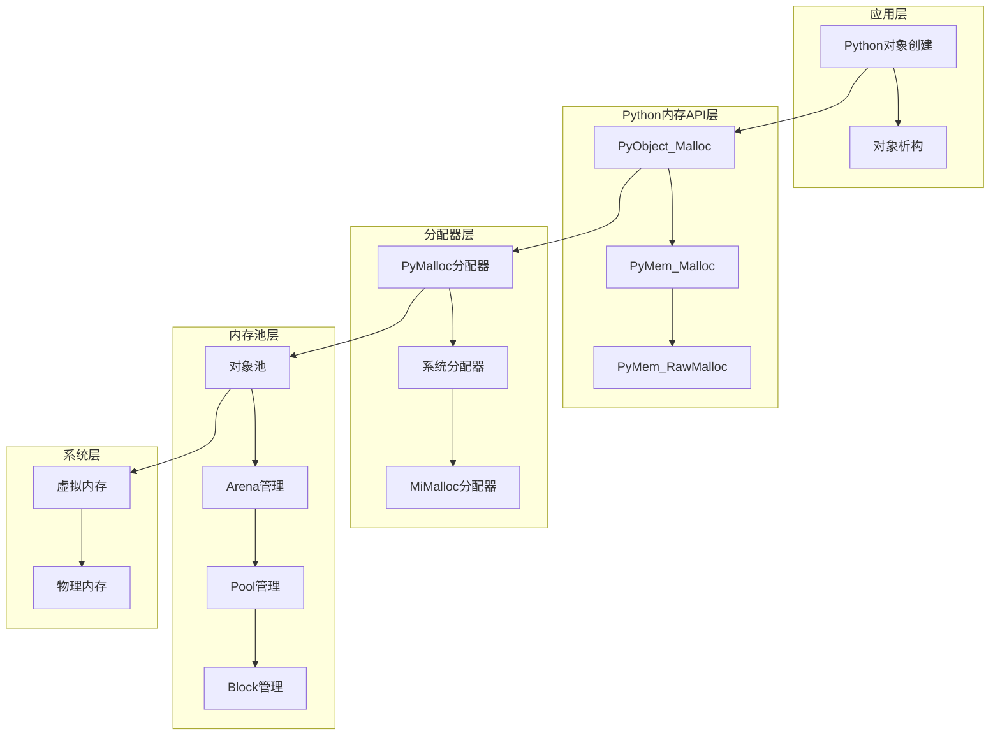
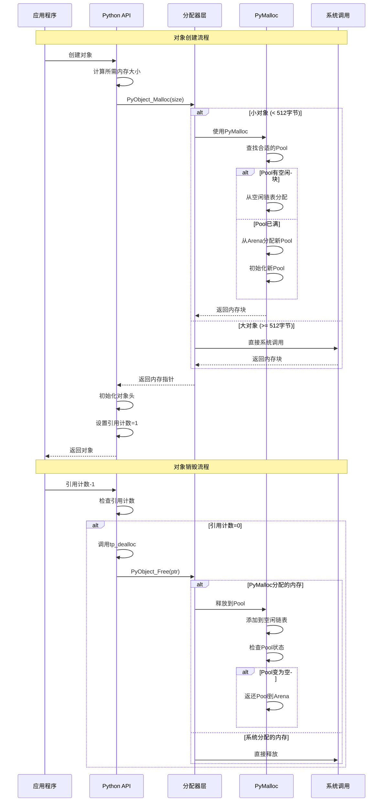

## 📋 概述

Python的内存管理是解释器的核心组件之一，它负责所有对象的内存分配、回收和优化。本文档将深入分析CPython中内存管理系统的实现机制，包括多层内存分配器、对象特定的内存池、内存统计和调试等功能。

## 🎯 内存管理系统架构



## 1. 内存分配器体系结构

### 1.1 多层分配器架构

```c
/* Objects/obmalloc.c - 内存分配器的层次结构 */

/* 分配器函数指针结构 */
typedef struct {
    /* 分配器上下文 */
    void *ctx;
    /* 内存分配函数 */
    void* (*malloc) (void *ctx, size_t size);
    /* 清零分配函数 */
    void* (*calloc) (void *ctx, size_t nelem, size_t elsize);
    /* 重新分配函数 */
    void* (*realloc) (void *ctx, void *ptr, size_t new_size);
    /* 内存释放函数 */
    void (*free) (void *ctx, void *ptr);
} PyMemAllocatorEx;

/* 三层分配器系统 */
static PyMemAllocatorEx _PyMem_Raw = {
    /* Raw层：直接系统调用，用于解释器基础设施 */
#ifdef MS_WINDOWS
    NULL, _PyMem_RawMalloc, _PyMem_RawCalloc, _PyMem_RawRealloc, _PyMem_RawFree
#else
    NULL, _PyMem_RawMalloc, _PyMem_RawCalloc, _PyMem_RawRealloc, _PyMem_RawFree
#endif
};

static PyMemAllocatorEx _PyMem = {
    /* Mem层：带调试和统计的分配器 */
    NULL, _PyMem_DebugMalloc, _PyMem_DebugCalloc,
    _PyMem_DebugRealloc, _PyMem_DebugFree
};

static PyMemAllocatorEx _PyObject = {
    /* Object层：优化的对象分配器（PyMalloc） */
#ifdef WITH_PYMALLOC
    NULL, _PyObject_Malloc, _PyObject_Calloc,
    _PyObject_Realloc, _PyObject_Free
#else
    NULL, PyMem_Malloc, PyMem_Calloc, PyMem_Realloc, PyMem_Free
#endif
};

/* Arena分配器：用于大块内存区域 */
static PyObjectArenaAllocator _PyObject_Arena = {
    NULL, _PyObject_VirtualAlloc, _PyObject_VirtualFree
};
```

### 1.2 PyMalloc核心实现

```c
/* PyMalloc - Python的专用内存分配器 */

/* 内存块大小常量 */
#define ALIGNMENT               8               /* 字节对齐 */
#define ALIGNMENT_SHIFT         3               /* log2(ALIGNMENT) */
#define SMALL_REQUEST_THRESHOLD 512             /* 小对象阈值 */
#define POOL_SIZE               4096            /* Pool大小 4KB */
#define ARENA_SIZE              (256 << 10)     /* Arena大小 256KB */

/* Pool结构 - 管理同大小的内存块 */
typedef struct pool_header {
    union {
        pymem_block *_padding;      /* 确保对齐 */
        uint count;
    } ref;                          /* Pool引用计数 */

    pymem_block *freeblock;         /* 空闲块链表头 */
    struct pool_header *nextpool;   /* 下一个Pool */
    struct pool_header *prevpool;   /* 前一个Pool */
    uint arenaindex;                /* 所属Arena索引 */
    uint szidx;                     /* 块大小索引 */
    uint nextoffset;                /* 下一个可用块偏移 */
    uint maxnextoffset;             /* 最大偏移值 */
} poolp;

/* Arena结构 - 管理大块内存区域 */
typedef struct arena_object {
    uintptr_t address;              /* Arena起始地址 */
    pymem_block* pool_address;      /* Pool区域起始地址 */
    uint nfreepools;                /* 空闲Pool数量 */
    uint ntotalpools;               /* 总Pool数量 */
    struct pool_header* freepools;  /* 空闲Pool链表 */
    struct arena_object* nextarena; /* 下一个Arena */
    struct arena_object* prevarena; /* 前一个Arena */
} arena_object;

/* 全局状态结构 */
typedef struct {
    /* Arena管理 */
    arena_object* arenas;           /* Arena数组 */
    uint maxarenas;                 /* 最大Arena数 */
    uint arena_free_count;          /* 空闲Arena数 */

    /* Pool管理 */
    poolp usedpools[2 * ((SMALL_REQUEST_THRESHOLD + ALIGNMENT - 1) / ALIGNMENT)];

    /* 统计信息 */
    struct _obmalloc_usage pool_is_full;
    struct _obmalloc_usage num_allocated_blocks;
} OMState;

/* 核心分配函数 */
static inline void*
pymalloc_alloc(OMState *state, void *Py_UNUSED(ctx), size_t nbytes)
{
    /*

     * 检查Valgrind环境
     * Valgrind不支持自定义内存管理，回退到系统分配器
     */
#ifdef WITH_VALGRIND
    if (UNLIKELY(running_on_valgrind == -1)) {
        running_on_valgrind = RUNNING_ON_VALGRIND;
    }
    if (UNLIKELY(running_on_valgrind)) {
        return NULL;  /* 回退到系统分配器 */
    }
#endif

    /* 边界检查 */
    if (UNLIKELY(nbytes == 0)) {
        return NULL;  /* 不分配0字节 */
    }
    if (UNLIKELY(nbytes > SMALL_REQUEST_THRESHOLD)) {
        return NULL;  /* 大对象使用系统分配器 */
    }

    /* 计算大小类别索引 */
    uint size = (uint)(nbytes - 1) >> ALIGNMENT_SHIFT;
    poolp pool = state->usedpools[size + size];  /* 获取对应Pool */
    pymem_block *bp;

    /* 情况1：有可用的Pool */
    if (LIKELY(pool != pool->nextpool)) {
        /*

         * 从Pool的空闲链表中分配块
         */
        ++pool->ref.count;          /* 增加引用计数 */
        bp = pool->freeblock;       /* 获取空闲块 */
        assert(bp != NULL);

        /* 更新空闲链表 */
        if (UNLIKELY((pool->freeblock = *(pymem_block **)bp) == NULL)) {
            /* 空闲链表为空，尝试扩展Pool */
            pymalloc_pool_extend(pool, size);
        }
    }
    else {
        /* 情况2：需要新的Pool */
        bp = allocate_from_new_pool(state, size);
    }

    return (void *)bp;

}

/* 从新Pool分配内存 */
static pymem_block *
allocate_from_new_pool(OMState *state, uint size)
{
    poolp pool;
    pymem_block *bp;

    /* 尝试获取空闲Pool */
    if (LIKELY(state->usable_arenas != NULL)) {
        /* 从现有Arena获取Pool */
        arena_object *ao = state->usable_arenas;
        pool = ao->freepools;

        if (LIKELY(pool != NULL)) {
            /* 更新Arena的空闲Pool链表 */
            ao->freepools = pool->nextpool;
            ao->nfreepools--;

            if (UNLIKELY(ao->nfreepools == 0)) {
                /* Arena已满，从可用列表中移除 */
                state->usable_arenas = ao->nextarena;
                ao->nextarena = NULL;
            }
        }
    }

    if (UNLIKELY(pool == NULL)) {
        /* 需要新的Arena */
        pool = new_arena(state);
        if (pool == NULL) {
            return NULL;  /* 内存不足 */
        }
    }

    /* 初始化Pool */
    pool->ref.count = 1;
    pool->szidx = size;

    /* 设置第一个块 */
    size_t block_size = INDEX2SIZE(size);
    bp = (pymem_block *)pool + POOL_OVERHEAD;
    pool->nextoffset = POOL_OVERHEAD + block_size;
    pool->maxnextoffset = POOL_SIZE - block_size;
    pool->freeblock = bp + block_size;
    *(pymem_block **)(pool->freeblock) = NULL;

    /* 将Pool添加到used链表 */
    poolp next = state->usedpools[size + size];
    poolp prev = next->prevpool;
    pool->nextpool = next;
    pool->prevpool = prev;
    next->prevpool = pool;
    prev->nextpool = pool;

    return bp;
}

/* Pool扩展 - 分配更多块 */
static void
pymalloc_pool_extend(poolp pool, uint size)
{
    if (UNLIKELY(pool->nextoffset <= pool->maxnextoffset)) {
        /* 还有空间可以分配新块 */
        pool->freeblock = (pymem_block *)((char *)pool + pool->nextoffset);
        pool->nextoffset += INDEX2SIZE(size);
        *(pymem_block **)(pool->freeblock) = NULL;
        return;
    }

    /* Pool已满，无法扩展 */
    /* 将Pool从usedpools移到fullpools */
    poolp next = pool->nextpool;
    poolp prev = pool->prevpool;
    next->prevpool = prev;
    prev->nextpool = next;

    /* 重置Pool链表指针 */
    pool->nextpool = pool;
    pool->prevpool = pool;
}
```

### 1.3 内存释放机制

```c
/* 内存释放实现 */

/* pymalloc释放函数 */
static inline int
pymalloc_free(OMState *state, void *Py_UNUSED(ctx), void *p)
{
    poolp pool;
    pymem_block *bp;
    arena_object *ao;

#ifdef WITH_VALGRIND
    if (UNLIKELY(running_on_valgrind > 0)) {
        return 0;  /* 让系统分配器处理 */
    }
#endif

    /* 获取Pool指针 */
    pool = POOL_ADDR(p);

    /* 验证Pool魔术数字 */
    if (UNLIKELY(!address_in_range(p, pool))) {
        return 0;  /* 不是pymalloc分配的内存 */
    }

    /* 将块添加到空闲链表 */
    bp = (pymem_block *)p;
    *(pymem_block **)bp = pool->freeblock;
    pool->freeblock = bp;

    /* 减少引用计数 */
    if (UNLIKELY(--pool->ref.count == 0)) {
        /* Pool变为空闲 */
        pool_dealloc(state, pool);
        return 1;
    }

    /* 检查Pool是否从满变为非满 */
    if (UNLIKELY(pool->nextpool == pool)) {
        /* Pool之前是满的，现在有空闲块了 */
        insert_to_usedpool(state, pool);
    }

    return 1;
}

/* Pool释放 */
static void
pool_dealloc(OMState *state, poolp pool)
{
    arena_object *ao;
    uint nf;  /* ao->nfreepools */

    /* 从usedpools链表中移除 */
    if (LIKELY(pool->nextpool != pool)) {
        poolp next = pool->nextpool;
        poolp prev = pool->prevpool;
        next->prevpool = prev;
        prev->nextpool = next;
    }

    /* 获取Arena */
    ao = &state->arenas[pool->arenaindex];
    nf = ++ao->nfreepools;

    /* 将Pool添加到Arena的空闲链表 */
    pool->nextpool = ao->freepools;
    ao->freepools = pool;

    if (UNLIKELY(nf == ao->ntotalpools)) {
        /* Arena完全空闲，可以释放 */
        arena_dealloc(state, ao);
    }
    else if (LIKELY(nf == 1)) {
        /* Arena从满变为有空闲Pool */
        ao->nextarena = state->usable_arenas;
        if (state->usable_arenas) {
            state->usable_arenas->prevarena = ao;
        }
        state->usable_arenas = ao;
        ao->prevarena = NULL;
    }
}

/* Arena释放 */
static void
arena_dealloc(OMState *state, arena_object *ao)
{
    /* 从链表中移除Arena */
    if (ao->prevarena != NULL) {
        ao->prevarena->nextarena = ao->nextarena;
    }
    else {
        state->usable_arenas = ao->nextarena;
    }

    if (ao->nextarena != NULL) {
        ao->nextarena->prevarena = ao->prevarena;
    }

    /* 释放虚拟内存 */
    _PyObject_VirtualFree((void *)ao->address, ARENA_SIZE);
    ao->address = 0;

    /* 将Arena标记为未使用 */
    ao->nextarena = state->unused_arena_objects;
    state->unused_arena_objects = ao;
}
```

## 2. 对象内存管理

### 2.1 对象分配和初始化

```c
/* Objects/object.c - 对象内存管理 */

/* 通用对象分配 */
PyObject *
_PyObject_New(PyTypeObject *tp)
{
    PyObject *op;

    /* 分配内存 */
    op = (PyObject *) PyObject_Malloc(_PyObject_SIZE(tp));
    if (op == NULL) {
        return PyErr_NoMemory();
    }

    /* 初始化对象头 */
    _PyObject_Init(op, tp);
    return op;
}

/* 可变对象分配 */
PyVarObject *
_PyObject_NewVar(PyTypeObject *tp, Py_ssize_t nitems)
{
    PyVarObject *op;
    const size_t size = _PyObject_VAR_SIZE(tp, nitems);

    /* 检查溢出 */
    if (size == (size_t)-1) {
        return (PyVarObject *)PyErr_NoMemory();
    }

    /* 分配内存 */
    op = (PyVarObject *) PyObject_Malloc(size);
    if (op == NULL) {
        return (PyVarObject *)PyErr_NoMemory();
    }

    /* 初始化可变对象 */
    _PyObject_InitVar(op, tp, nitems);
    return op;
}

/* 对象初始化 */
void
_PyObject_Init(PyObject *op, PyTypeObject *tp)
{
    assert(op != NULL);
    assert(tp != NULL);

    /* 设置类型指针 */
    Py_SET_TYPE(op, tp);

    /* 初始化引用计数 */
    if (_PyType_HasFeature(tp, Py_TPFLAGS_HEAPTYPE)) {
        Py_INCREF(tp);  /* 堆类型需要增加引用计数 */
    }

#ifdef Py_GIL_DISABLED
    /* 在无GIL模式下初始化引用计数 */
    _PyObject_InitReferenceCount(op);
#else
    /* 设置引用计数为1 */
    Py_SET_REFCNT(op, 1);
#endif

#ifdef Py_TRACE_REFS
    /* 调试模式下添加到对象链表 */
    _Py_AddToAllObjects(op, 1);
#endif
}

/* 可变对象初始化 */
void
_PyObject_InitVar(PyVarObject *op, PyTypeObject *tp, Py_ssize_t size)
{
    assert(op != NULL);
    assert(tp != NULL);

    /* 设置大小 */
    Py_SET_SIZE(op, size);

    /* 调用基础初始化 */
    _PyObject_Init((PyObject *)op, tp);
}
```

### 2.2 引用计数管理

```c
/* Include/object.h 和 Objects/object.c - 引用计数实现 */

/* 增加引用计数 */
static inline void _Py_INCREF(PyObject *op)
{
    _Py_INC_REFTOTAL;

#ifdef Py_GIL_DISABLED
    /* 无GIL模式使用原子操作 */
    _Py_atomic_add_int32(&op->ob_refcnt, 1);
#else
    /* 普通模式直接增加 */
    ++op->ob_refcnt;
#endif
}

/* 减少引用计数 */
static inline void _Py_DECREF(PyObject *op)
{
    _Py_DEC_REFTOTAL;

#ifdef Py_GIL_DISABLED
    /* 无GIL模式使用原子操作 */
    if (_Py_atomic_add_int32(&op->ob_refcnt, -1) == 1) {
        _Py_Dealloc(op);
    }
#else
    /* 普通模式 */
    if (--op->ob_refcnt == 0) {
        _Py_Dealloc(op);
    }
#endif
}

/* 对象销毁 */
void
_Py_Dealloc(PyObject *op)
{
    destructor dealloc = Py_TYPE(op)->tp_dealloc;

#ifdef Py_TRACE_REFS
    /* 调试模式下从对象链表移除 */
    _Py_ForgetReference(op);
#endif

    /* 调用类型特定的释放函数 */
    (*dealloc)(op);
}

/* 通用对象释放 */
void
PyObject_Free(void *ptr)
{
    if (ptr == NULL) {
        return;
    }

    /* 调用配置的分配器 */
    _PyObject.free(_PyObject.ctx, ptr);
}
```

## 3. 内存调试和统计

### 3.1 内存统计系统

```c
/* Objects/obmalloc.c - 内存统计实现 */

/* 内存统计结构 */
typedef struct {
    size_t count;           /* 分配次数 */
    size_t total;           /* 总分配字节数 */
    size_t peak;            /* 峰值使用量 */
} _PyObjectStats;

/* 全局统计 */
static _PyObjectStats object_stats = {0, 0, 0};

/* 记录分配 */
static inline void
record_allocation(size_t size)
{
    object_stats.count++;
    object_stats.total += size;

    if (object_stats.total > object_stats.peak) {
        object_stats.peak = object_stats.total;
    }
}

/* 记录释放 */
static inline void
record_deallocation(size_t size)
{
    object_stats.total -= size;
}

/* 获取内存统计信息 */
PyObject *
_PyObject_GetMemoryStats(void)
{
    PyObject *result = PyDict_New();
    if (result == NULL) {
        return NULL;
    }

    /* 分配器统计 */
    if (PyDict_SetItemString(result, "allocations",
                           PyLong_FromSize_t(object_stats.count)) < 0) {
        goto error;
    }

    if (PyDict_SetItemString(result, "total_allocated",
                           PyLong_FromSize_t(object_stats.total)) < 0) {
        goto error;
    }

    if (PyDict_SetItemString(result, "peak_usage",
                           PyLong_FromSize_t(object_stats.peak)) < 0) {
        goto error;
    }

    /* PyMalloc统计 */
    OMState *state = get_state();
    PyObject *pymalloc_stats = get_pymalloc_stats(state);
    if (pymalloc_stats == NULL) {
        goto error;
    }

    if (PyDict_SetItemString(result, "pymalloc", pymalloc_stats) < 0) {
        Py_DECREF(pymalloc_stats);
        goto error;
    }
    Py_DECREF(pymalloc_stats);

    return result;

error:
    Py_DECREF(result);
    return NULL;
}

/* PyMalloc详细统计 */
static PyObject *
get_pymalloc_stats(OMState *state)
{
    PyObject *result = PyDict_New();
    if (result == NULL) {
        return NULL;
    }

    /* Arena统计 */
    uint arena_count = 0;
    uint total_arena_size = 0;

    for (uint i = 0; i < state->maxarenas; ++i) {
        arena_object *ao = &state->arenas[i];
        if (ao->address != 0) {
            arena_count++;
            total_arena_size += ARENA_SIZE;
        }
    }

    PyDict_SetItemString(result, "arena_count", PyLong_FromUnsignedLong(arena_count));
    PyDict_SetItemString(result, "total_arena_bytes", PyLong_FromUnsignedLong(total_arena_size));

    /* Pool统计 */
    uint total_pools = 0;
    uint used_pools = 0;

    for (uint i = 0; i < SMALL_REQUEST_THRESHOLD / ALIGNMENT; ++i) {
        poolp pool = state->usedpools[i + i];
        poolp temp = pool->nextpool;

        while (temp != pool) {
            used_pools++;
            temp = temp->nextpool;
        }
    }

    PyDict_SetItemString(result, "used_pools", PyLong_FromUnsignedLong(used_pools));

    return result;
}
```

### 3.2 内存调试支持

```c
/* Objects/obmalloc.c - 内存调试实现 */

#ifdef WITH_PYMALLOC_DEBUG

/* 调试头结构 */
typedef struct {
    char api_id;            /* 分配器ID */
    uchar api_data[1];      /* API数据 */
    size_t size;            /* 请求大小 */
    size_t serial;          /* 序列号 */
} debug_alloc_api_t;

/* 调试分配包装器 */
static void *
_PyMem_DebugRawAlloc(int use_calloc, void *ctx, size_t nbytes)
{
    debug_alloc_api_t *p;
    size_t total;

    /* 计算总大小（包含调试信息） */
    total = nbytes + _PyMem_DebugCheckGIL() + sizeof(debug_alloc_api_t);
    if (total < nbytes) {
        /* 溢出检查 */
        return NULL;
    }

    /* 分配内存 */
    p = (debug_alloc_api_t *)PyMem_RawMalloc(total);
    if (p == NULL) {
        return NULL;
    }

    /* 填充调试信息 */
    p->api_id = (char)ctx;
    p->size = nbytes;
    p->serial = ++serialno;

    /* 写入边界标记 */
    write_size_t(p->api_data, nbytes);
    memset(p->api_data + sizeof(size_t), PYMEM_FORBIDDENBYTE,
           _PyMem_DebugCheckGIL());

    if (use_calloc) {
        memset(p + 1, 0, nbytes);
    }
    else {
        memset(p + 1, PYMEM_CLEANBYTE, nbytes);
    }

    /* 写入结束标记 */
    write_size_t((char *)(p + 1) + nbytes, nbytes);
    memset((char *)(p + 1) + nbytes + sizeof(size_t),
           PYMEM_FORBIDDENBYTE, _PyMem_DebugCheckGIL());

    return p + 1;
}

/* 调试释放包装器 */
static void
_PyMem_DebugRawFree(void *ctx, void *ptr)
{
    debug_alloc_api_t *p;
    size_t nbytes;

    if (ptr == NULL) {
        return;
    }

    /* 验证调试信息 */
    p = (debug_alloc_api_t *)ptr - 1;
    if (p->api_id != (char)ctx) {
        _PyMem_DebugCheckAddress(__func__, p->api_id,
                               "bad ID", ptr);
        return;
    }

    nbytes = read_size_t(p->api_data);
    if (nbytes != p->size) {
        _PyMem_DebugCheckAddress(__func__, p->api_id,
                               "bad size", ptr);
        return;
    }

    /* 检查边界标记 */
    if (memcmp(p->api_data + sizeof(size_t),
               pymem_pattern_forbidden, _PyMem_DebugCheckGIL()) != 0) {
        _PyMem_DebugCheckAddress(__func__, p->api_id,
                               "bad leading pad byte", ptr);
        return;
    }

    /* 填充已释放模式 */
    memset(ptr, PYMEM_DEADBYTE, nbytes);

    /* 释放内存 */
    PyMem_RawFree(p);
}

#endif /* WITH_PYMALLOC_DEBUG */
```

## 4. 内存管理API详解

### 4.1 公共API接口

```python
# Python内存管理API使用示例
import sys
import gc
import tracemalloc

class MemoryManagementDemo:
    """内存管理功能演示"""

    def __init__(self):
        self.test_objects = []
        self.memory_snapshots = []

    def demonstrate_basic_memory_apis(self):
        """演示基础内存管理API"""

        print("=== 基础内存管理API演示 ===")

        # 1. 获取对象大小
        test_objects = [
            42,                          # int
            "Hello, World!",            # str
            [1, 2, 3, 4, 5],           # list
            {"a": 1, "b": 2},          # dict
            (1, 2, 3),                 # tuple
            {1, 2, 3, 4, 5}            # set
        ]

        print("对象内存大小:")
        for obj in test_objects:
            size = sys.getsizeof(obj)
            print(f"  {type(obj).__name__:8s}: {size:4d} bytes - {repr(obj)}")

        # 2. 深度大小计算
        def get_deep_size(obj, seen=None):
            """递归计算对象及其引用的总大小"""
            if seen is None:
                seen = set()

            obj_id = id(obj)
            if obj_id in seen:
                return 0

            seen.add(obj_id)
            size = sys.getsizeof(obj)

            # 递归计算引用对象的大小
            if isinstance(obj, dict):
                size += sum(get_deep_size(v, seen) for v in obj.values())
                size += sum(get_deep_size(k, seen) for k in obj.keys())
            elif hasattr(obj, '__dict__'):
                size += get_deep_size(obj.__dict__, seen)
            elif hasattr(obj, '__iter__') and not isinstance(obj, (str, bytes, bytearray)):
                size += sum(get_deep_size(i, seen) for i in obj)

            return size

        complex_obj = {
            'numbers': [1, 2, 3, 4, 5],
            'nested': {
                'inner_list': ['a', 'b', 'c'],
                'inner_dict': {'x': 10, 'y': 20}
            }
        }

        shallow_size = sys.getsizeof(complex_obj)
        deep_size = get_deep_size(complex_obj)

        print(f"\n复杂对象大小分析:")
        print(f"  浅度大小: {shallow_size} bytes")
        print(f"  深度大小: {deep_size} bytes")
        print(f"  引用开销: {deep_size - shallow_size} bytes")

    def demonstrate_tracemalloc(self):
        """演示tracemalloc内存跟踪"""

        print(f"\n=== tracemalloc内存跟踪演示 ===")

        # 启动内存跟踪
        tracemalloc.start()

        # 获取初始快照
        snapshot1 = tracemalloc.take_snapshot()

        # 创建一些对象
        large_list = []
        for i in range(10000):
            large_list.append({
                'id': i,
                'data': f"Item {i}" * 10,
                'metadata': {'created': True, 'index': i}
            })

        # 获取第二个快照
        snapshot2 = tracemalloc.take_snapshot()

        # 分析内存增长
        top_stats = snapshot2.compare_to(snapshot1, 'lineno')

        print("内存增长Top 5:")
        for index, stat in enumerate(top_stats[:5], 1):
            print(f"  {index}. {stat}")

        # 获取当前内存使用情况
        current, peak = tracemalloc.get_traced_memory()
        print(f"\n当前内存使用: {current / 1024 / 1024:.1f} MB")
        print(f"峰值内存使用: {peak / 1024 / 1024:.1f} MB")

        # 清理并获取最终快照
        del large_list
        gc.collect()

        snapshot3 = tracemalloc.take_snapshot()
        cleanup_stats = snapshot3.compare_to(snapshot2, 'lineno')

        print(f"\n清理后内存变化Top 3:")
        for index, stat in enumerate(cleanup_stats[:3], 1):
            print(f"  {index}. {stat}")

        tracemalloc.stop()

    def demonstrate_garbage_collection_integration(self):
        """演示与垃圾回收的集成"""

        print(f"\n=== 内存管理与垃圾回收集成 ===")

        # 获取GC统计信息
        print("垃圾回收统计:")
        for i, count in enumerate(gc.get_stats()):
            print(f"  Generation {i}: {count}")

        # 创建循环引用
        class Node:
            def __init__(self, value):
                self.value = value
                self.children = []
                self.parent = None

            def add_child(self, child):
                child.parent = self
                self.children.append(child)

        # 创建循环引用结构
        root = Node("root")
        for i in range(100):
            child = Node(f"child_{i}")
            root.add_child(child)

            # 创建一些循环引用
            if i > 0:
                child.add_child(root.children[i-1])

        # 检查对象数量
        objects_before = len(gc.get_objects())
        print(f"创建循环引用后对象数: {objects_before}")

        # 删除根引用
        del root

        # 手动触发垃圾回收
        collected = gc.collect()
        objects_after = len(gc.get_objects())

        print(f"垃圾回收清理对象数: {collected}")
        print(f"清理后对象数: {objects_after}")
        print(f"实际清理对象数: {objects_before - objects_after}")

    def demonstrate_memory_optimization_techniques(self):
        """演示内存优化技术"""

        print(f"\n=== 内存优化技术演示 ===")

        # 1. __slots__ 优化
        class RegularClass:
            def __init__(self, x, y, z):
                self.x = x
                self.y = y
                self.z = z

        class SlottedClass:
            __slots__ = ['x', 'y', 'z']

            def __init__(self, x, y, z):
                self.x = x
                self.y = y
                self.z = z

        # 比较内存使用
        regular_obj = RegularClass(1, 2, 3)
        slotted_obj = SlottedClass(1, 2, 3)

        regular_size = sys.getsizeof(regular_obj) + sys.getsizeof(regular_obj.__dict__)
        slotted_size = sys.getsizeof(slotted_obj)

        print(f"__slots__ 内存优化:")
        print(f"  普通类实例: {regular_size} bytes")
        print(f"  __slots__类实例: {slotted_size} bytes")
        print(f"  节省内存: {regular_size - slotted_size} bytes ({(regular_size - slotted_size) / regular_size * 100:.1f}%)")

        # 2. 字符串驻留
        import sys

        s1 = "hello_world"
        s2 = "hello_world"
        s3 = "hello" + "_world"

        print(f"\n字符串驻留:")
        print(f"  s1 is s2: {s1 is s2}")  # True，字面量自动驻留
        print(f"  s1 is s3: {s1 is s3}")  # 可能False，运行时拼接

        # 手动驻留
        s4 = sys.intern("hello" + "_world")
        print(f"  s1 is intern(s3): {s1 is s4}")  # True

        # 3. 生成器vs列表内存使用
        def demonstrate_generator_memory():
            # 列表方式
            list_data = [x * x for x in range(100000)]
            list_size = sys.getsizeof(list_data)

            # 生成器方式
            gen_data = (x * x for x in range(100000))
            gen_size = sys.getsizeof(gen_data)

            print(f"\n生成器内存优化:")
            print(f"  列表内存: {list_size:,} bytes")
            print(f"  生成器内存: {gen_size} bytes")
            print(f"  内存节省: {list_size / gen_size:.0f}x")

        demonstrate_generator_memory()

    def demonstrate_memory_profiling(self):
        """演示内存分析工具"""

        print(f"\n=== 内存分析工具演示 ===")

        import resource
        import psutil
        import os

        # 1. 资源使用情况
        def get_memory_usage():
            """获取详细的内存使用情况"""
            process = psutil.Process(os.getpid())
            memory_info = process.memory_info()

            return {
                'rss': memory_info.rss,          # 物理内存
                'vms': memory_info.vms,          # 虚拟内存
                'percent': process.memory_percent(),  # 内存占用百分比
                'available': psutil.virtual_memory().available  # 系统可用内存
            }

        # 获取初始内存状态
        initial_memory = get_memory_usage()
        print(f"初始内存状态:")
        for key, value in initial_memory.items():
            if key in ['rss', 'vms', 'available']:
                print(f"  {key}: {value / 1024 / 1024:.1f} MB")
            else:
                print(f"  {key}: {value:.2f}%")

        # 2. 分配大量内存
        memory_hog = []
        for i in range(1000):
            # 每次分配约1MB的数据
            chunk = [0] * (1024 * 1024 // 8)  # 8 bytes per int
            memory_hog.append(chunk)

        # 获取分配后内存状态
        after_alloc_memory = get_memory_usage()
        print(f"\n分配1GB内存后:")
        for key, value in after_alloc_memory.items():
            if key in ['rss', 'vms', 'available']:
                print(f"  {key}: {value / 1024 / 1024:.1f} MB")
            else:
                print(f"  {key}: {value:.2f}%")

        # 计算内存增长
        rss_growth = (after_alloc_memory['rss'] - initial_memory['rss']) / 1024 / 1024
        print(f"\nRSS内存增长: {rss_growth:.1f} MB")

        # 清理内存
        del memory_hog
        gc.collect()

        # 获取清理后内存状态
        final_memory = get_memory_usage()
        rss_after_cleanup = final_memory['rss'] / 1024 / 1024
        print(f"清理后RSS内存: {rss_after_cleanup:.1f} MB")

    def run_all_demos(self):
        """运行所有演示"""

        print("开始Python内存管理深度分析演示...\n")

        self.demonstrate_basic_memory_apis()
        self.demonstrate_tracemalloc()
        self.demonstrate_garbage_collection_integration()
        self.demonstrate_memory_optimization_techniques()
        self.demonstrate_memory_profiling()

        print(f"\n{'='*50}")
        print("内存管理分析完成")
        print(f"{'='*50}")

# 运行内存管理演示
if __name__ == "__main__":
    demo = MemoryManagementDemo()
    demo.run_all_demos()
```

## 5. 内存管理时序图



## 6. 内存管理最佳实践

### 6.1 性能优化建议

```python
# 内存管理最佳实践示例
import sys
import weakref
from typing import Dict, List, Optional

class MemoryBestPractices:
    """内存管理最佳实践演示"""

    def __init__(self):
        self.cache = {}
        self.weak_cache = weakref.WeakValueDictionary()

    def demonstrate_object_reuse(self):
        """演示对象重用模式"""

        print("=== 对象重用模式 ===")

        # 1. 对象池模式
        class ObjectPool:
            def __init__(self, factory, max_size=100):
                self._factory = factory
                self._pool = []
                self._max_size = max_size

            def acquire(self):
                if self._pool:
                    return self._pool.pop()
                return self._factory()

            def release(self, obj):
                if len(self._pool) < self._max_size:
                    # 重置对象状态
                    if hasattr(obj, 'reset'):
                        obj.reset()
                    self._pool.append(obj)

        class ExpensiveObject:
            def __init__(self):
                self.data = [0] * 1000  # 模拟昂贵的初始化
                self.state = "initialized"

            def reset(self):
                self.data = [0] * 1000
                self.state = "reset"

            def use(self):
                self.state = "in_use"
                # 模拟使用
                for i in range(len(self.data)):
                    self.data[i] = i

        # 使用对象池
        pool = ObjectPool(ExpensiveObject, max_size=10)

        print("对象池使用演示:")
        objects = []

        # 从池中获取对象
        for i in range(5):
            obj = pool.acquire()
            obj.use()
            objects.append(obj)
            print(f"  获取对象 {i+1}, 池大小: {len(pool._pool)}")

        # 返回对象到池
        for i, obj in enumerate(objects):
            pool.release(obj)
            print(f"  返回对象 {i+1}, 池大小: {len(pool._pool)}")

    def demonstrate_weak_references(self):
        """演示弱引用使用"""

        print(f"\n=== 弱引用使用 ===")

        class Node:
            def __init__(self, value):
                self.value = value
                self._children = []
                self._parent_ref = None  # 弱引用

            def add_child(self, child):
                child._parent_ref = weakref.ref(self)
                self._children.append(child)

            @property
            def parent(self):
                if self._parent_ref is not None:
                    return self._parent_ref()
                return None

            def __repr__(self):
                return f"Node({self.value})"

        # 创建树结构
        root = Node("root")
        for i in range(3):
            child = Node(f"child_{i}")
            root.add_child(child)

        # 检查弱引用
        child = root._children[0]
        print(f"子节点的父节点: {child.parent}")

        # 删除根节点，子节点的弱引用会自动失效
        del root
        print(f"删除根节点后，子节点的父节点: {child.parent}")

    def demonstrate_lazy_loading(self):
        """演示延迟加载模式"""

        print(f"\n=== 延迟加载模式 ===")

        class LazyProperty:
            def __init__(self, func):
                self.func = func
                self.name = func.__name__

            def __get__(self, obj, cls):
                if obj is None:
                    return self

                # 检查是否已经计算过
                value = obj.__dict__.get(self.name, self)
                if value is self:
                    # 第一次访问，计算值
                    print(f"  计算 {self.name}")
                    value = self.func(obj)
                    obj.__dict__[self.name] = value

                return value

        class DataProcessor:
            def __init__(self, data_source):
                self.data_source = data_source

            @LazyProperty
            def processed_data(self):
                # 模拟昂贵的计算
                print("    执行昂贵的数据处理...")
                return [x * 2 for x in range(10000)]

            @LazyProperty
            def statistics(self):
                # 依赖processed_data的计算
                print("    计算统计信息...")
                data = self.processed_data
                return {
                    'count': len(data),
                    'sum': sum(data),
                    'avg': sum(data) / len(data)
                }

        processor = DataProcessor("data.csv")

        print("延迟加载演示:")
        print("第一次访问 processed_data:")
        _ = processor.processed_data

        print("第二次访问 processed_data (使用缓存):")
        _ = processor.processed_data

        print("访问 statistics:")
        stats = processor.statistics
        print(f"  统计结果: count={stats['count']}, avg={stats['avg']:.2f}")

    def demonstrate_memory_efficient_data_structures(self):
        """演示内存高效的数据结构"""

        print(f"\n=== 内存高效的数据结构 ===")

        # 1. 使用array替代list存储数值
        import array

        # 比较list和array的内存使用
        list_data = [i for i in range(10000)]
        array_data = array.array('i', range(10000))

        list_size = sys.getsizeof(list_data) + sum(sys.getsizeof(i) for i in list_data[:100])
        array_size = sys.getsizeof(array_data)

        print(f"数值存储对比 (10000个整数):")
        print(f"  list内存使用: {list_size:,} bytes")
        print(f"  array内存使用: {array_size:,} bytes")
        print(f"  节省内存: {(list_size - array_size) / list_size * 100:.1f}%")

        # 2. 使用collections.deque替代list进行队列操作
        from collections import deque
        import time

        def benchmark_queue_operations(container_class, name):
            container = container_class()

            # 测试左侧插入性能
            start = time.time()
            for i in range(10000):
                if hasattr(container, 'appendleft'):
                    container.appendleft(i)
                else:
                    container.insert(0, i)
            insert_time = time.time() - start

            # 测试左侧删除性能
            start = time.time()
            for _ in range(10000):
                if hasattr(container, 'popleft'):
                    container.popleft()
                else:
                    container.pop(0)
            pop_time = time.time() - start

            return insert_time, pop_time

        print(f"\n队列操作性能对比:")

        list_insert, list_pop = benchmark_queue_operations(list, "list")
        deque_insert, deque_pop = benchmark_queue_operations(deque, "deque")

        print(f"  list: 插入 {list_insert:.4f}s, 删除 {list_pop:.4f}s")
        print(f"  deque: 插入 {deque_insert:.4f}s, 删除 {deque_pop:.4f}s")
        print(f"  deque性能提升: 插入 {list_insert/deque_insert:.1f}x, 删除 {list_pop/deque_pop:.1f}x")

    def demonstrate_memory_leaks_prevention(self):
        """演示内存泄漏预防"""

        print(f"\n=== 内存泄漏预防 ===")

        # 1. 循环引用处理
        class SafeNode:
            def __init__(self, value):
                self.value = value
                self.children = []
                self._parent_ref = None

            def add_child(self, child):
                child._parent_ref = weakref.ref(self)
                self.children.append(child)

            def remove_child(self, child):
                if child in self.children:
                    child._parent_ref = None
                    self.children.remove(child)

            def cleanup(self):
                """清理循环引用"""
                for child in self.children:
                    child._parent_ref = None
                self.children.clear()

        # 2. 上下文管理器自动清理
        class ResourceManager:
            def __init__(self):
                self.resources = []

            def __enter__(self):
                return self

            def __exit__(self, exc_type, exc_val, exc_tb):
                self.cleanup()

            def acquire_resource(self, resource):
                self.resources.append(resource)
                return resource

            def cleanup(self):
                print(f"    清理 {len(self.resources)} 个资源")
                for resource in self.resources:
                    if hasattr(resource, 'cleanup'):
                        resource.cleanup()
                self.resources.clear()

        print("安全的资源管理:")
        with ResourceManager() as manager:
            # 创建资源
            for i in range(5):
                node = SafeNode(f"node_{i}")
                manager.acquire_resource(node)

            print(f"  创建了 {len(manager.resources)} 个资源")

        print("  上下文管理器自动清理完成")

    def run_all_practices(self):
        """运行所有最佳实践演示"""

        print("Python内存管理最佳实践演示\n")

        self.demonstrate_object_reuse()
        self.demonstrate_weak_references()
        self.demonstrate_lazy_loading()
        self.demonstrate_memory_efficient_data_structures()
        self.demonstrate_memory_leaks_prevention()

        print(f"\n{'='*50}")
        print("最佳实践演示完成")
        print(f"{'='*50}")

# 运行最佳实践演示
if __name__ == "__main__":
    practices = MemoryBestPractices()
    practices.run_all_practices()
```

## 7. 总结

Python的内存管理系统展现了复杂而精密的设计：

### 7.1 核心特点

1. **多层架构**: Raw、Mem、Object三层分配器满足不同需求
2. **专用优化**: PyMalloc针对小对象进行优化
3. **自动管理**: 引用计数与垃圾回收相结合
4. **调试支持**: 完善的内存调试和分析工具

### 7.2 设计原则

1. **性能优化**: 针对Python对象模式优化
2. **内存效率**: 减少碎片和浪费
3. **线程安全**: 支持多线程环境
4. **可扩展性**: 支持不同的内存分配策略

### 7.3 优化策略

1. **对象池**: 重用昂贵对象
2. **弱引用**: 避免循环引用
3. **延迟加载**: 按需计算和分配
4. **合适的数据结构**: 选择内存效率高的容器

### 7.4 最佳实践

1. **避免内存泄漏**: 正确处理循环引用
2. **使用上下文管理器**: 确保资源清理
3. **监控内存使用**: 使用tracemalloc等工具
4. **选择合适的数据结构**: 根据使用模式选择

Python的内存管理为高效的对象操作提供了坚实的基础，理解其工作原理对于编写高性能Python程序至关重要。
