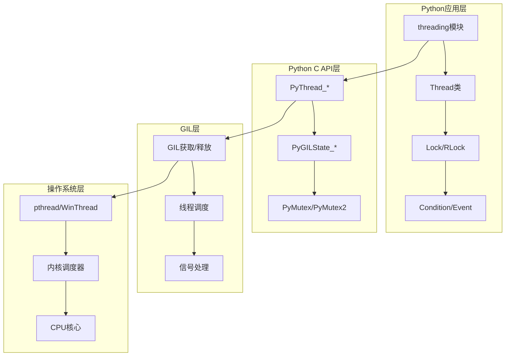
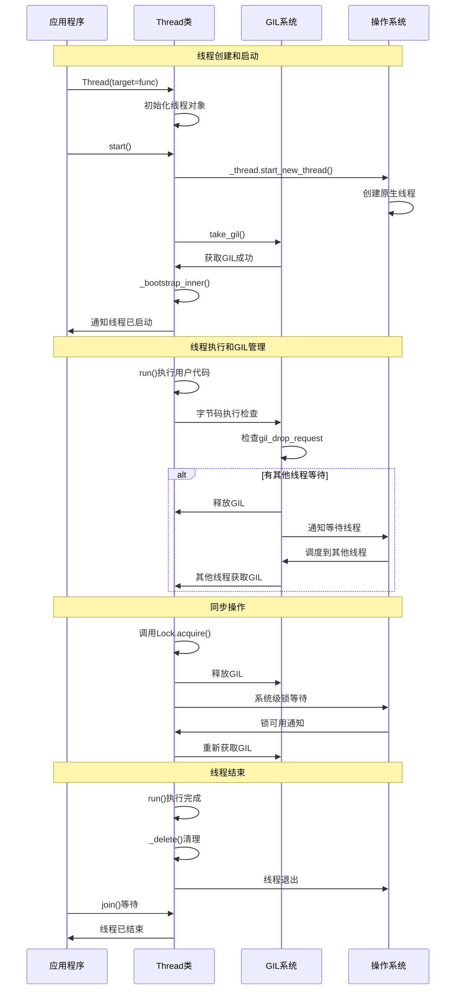

## 📋 概述

Python的线程与并发系统是解释器的重要组成部分，它涉及全局解释器锁(GIL)、线程管理、同步原语、以及各种并发编程模型的实现。本文档将深入分析CPython中线程与并发机制的源码实现，包括底层线程接口、GIL机制、threading模块、以及现代并发编程模式。

## 🎯 线程与并发系统架构



## 1. 底层线程实现

### 1.1 跨平台线程抽象

```c
/* Python/thread.c - 跨平台线程抽象层 */

/* 线程初始化 */
void
PyThread_init_thread(void)
{
    if (initialized) {
        return;
    }
    initialized = 1;
    PyThread__init_thread();  /* 调用平台特定的初始化 */
}

/* 线程锁分配 */
PyThread_type_lock
PyThread_allocate_lock(void)
{
    if (!initialized) {
        PyThread_init_thread();
    }

    /* 分配PyMutex结构 */
    PyMutex *lock = (PyMutex *)PyMem_RawMalloc(sizeof(PyMutex));
    if (lock) {
        *lock = (PyMutex){0};  /* 零初始化 */
    }

    return (PyThread_type_lock)lock;
}

/* 带超时的锁获取 */
PyLockStatus
PyThread_acquire_lock_timed(PyThread_type_lock lock, PY_TIMEOUT_T microseconds,
                            int intr_flag)
{
    PyTime_t timeout;  /* 相对超时时间 */

    if (microseconds >= 0) {
        /* 防止超时溢出，限制在合理范围内 */
        timeout = _PyTime_FromMicrosecondsClamp(microseconds);
    }
    else {
        timeout = -1;  /* 无限等待 */
    }

    /* 设置锁标志 */
    _PyLockFlags flags = _Py_LOCK_DONT_DETACH;
    if (intr_flag) {
        flags |= _PY_FAIL_IF_INTERRUPTED;  /* 可被信号中断 */
    }

    /* 调用底层互斥锁实现 */
    return _PyMutex_LockTimed((PyMutex *)lock, timeout, flags);
}

/* 带重试的锁获取（处理信号中断） */
PyLockStatus
PyThread_acquire_lock_timed_with_retries(PyThread_type_lock lock,
                                         PY_TIMEOUT_T timeout)
{
    PyThreadState *tstate = _PyThreadState_GET();
    PyTime_t endtime = 0;

    if (timeout > 0) {
        endtime = _PyDeadline_Init(timeout);  /* 计算截止时间 */
    }

    PyLockStatus r;
    do {
        PyTime_t microseconds;
        microseconds = _PyTime_AsMicroseconds(timeout, _PyTime_ROUND_CEILING);

        /* 首先尝试非阻塞获取，不释放GIL */
        r = PyThread_acquire_lock_timed(lock, 0, 0);

        if (r == PY_LOCK_FAILURE && microseconds != 0) {
            /* 阻塞获取，释放GIL */
            Py_BEGIN_ALLOW_THREADS
            r = PyThread_acquire_lock_timed(lock, microseconds, 1);
            Py_END_ALLOW_THREADS
        }

        if (r == PY_LOCK_INTR) {
            /* 被信号中断，处理挂起的信号 */
            if (_PyEval_MakePendingCalls(tstate) < 0) {
                return PY_LOCK_INTR;  /* 传播异常 */
            }

            /* 重新计算剩余超时时间 */
            if (timeout > 0) {
                timeout = _PyDeadline_Get(endtime);
                if (timeout < 0) {
                    r = PY_LOCK_FAILURE;  /* 超时 */
                }
            }
        }
    } while (r == PY_LOCK_INTR);  /* 如果被中断则重试 */

    return r;
}
```

### 1.2 线程特定存储(TSS)

```c
/* Thread Specific Storage (TSS) API实现 */

/* TSS键分配 */
Py_tss_t *
PyThread_tss_alloc(void)
{
    Py_tss_t *new_key = (Py_tss_t *)PyMem_RawMalloc(sizeof(Py_tss_t));
    if (new_key == NULL) {
        return NULL;
    }
    new_key->_is_initialized = 0;  /* 标记为未初始化 */
    return new_key;
}

/* TSS键释放 */
void
PyThread_tss_free(Py_tss_t *key)
{
    if (key == NULL) {
        return;
    }

    /* 如果已初始化，先删除键 */
    if (key->_is_initialized) {
        PyThread_tss_delete(key);
    }

    PyMem_RawFree((void *)key);
}

/* TSS键创建 */
int
PyThread_tss_create(Py_tss_t *key)
{
    assert(key != NULL);

    /* 调用平台特定的实现 */
    int fail = pthread_key_create(&(key->_key), NULL);
    if (fail) {
        return -1;
    }

    key->_is_initialized = 1;
    return 0;
}

/* TSS值设置 */
int
PyThread_tss_set(Py_tss_t *key, void *value)
{
    assert(key != NULL);
    assert(key->_is_initialized);

    /* 调用平台特定的实现 */
    return pthread_setspecific(key->_key, value) ? -1 : 0;
}

/* TSS值获取 */
void *
PyThread_tss_get(Py_tss_t *key)
{
    assert(key != NULL);
    assert(key->_is_initialized);

    /* 调用平台特定的实现 */
    return pthread_getspecific(key->_key);
}
```

## 2. GIL (全局解释器锁) 深度分析

### 2.1 GIL核心实现

```c
/* Python/ceval_gil.c - GIL实现 */

/* GIL状态结构 */
struct _gil_runtime_state {
    unsigned long interval;      /* GIL检查间隔 */
    _Py_atomic_int gil_drop_request;  /* GIL释放请求 */
    _Py_atomic_int gil;         /* GIL状态 */

    PyMutex mutex;              /* 互斥锁保护GIL状态 */
    PyMutex2 cond;              /* 条件变量用于线程等待 */

    PyThreadState *holder;      /* 当前持有GIL的线程 */
    int locked;                 /* GIL是否被锁定 */
    unsigned long switch_number; /* GIL切换次数 */
};

/* 获取GIL */
void
take_gil(PyThreadState *tstate)
{
    int err = errno;

    assert(!_PyThreadState_MustExit(tstate));

    if (tstate_must_exit(tstate)) {
        /* 线程正在退出，不获取GIL */
        PyThread_exit_thread();
    }

    assert(is_tstate_valid(tstate));

    PyMutex_Lock(&gil->mutex);

    if (!_Py_atomic_load_int_relaxed(&gil->gil)) {
        /* GIL未被持有，直接获取 */
        goto _ready;
    }

    /* GIL被其他线程持有，等待释放 */
    while (_Py_atomic_load_int_relaxed(&gil->gil)) {
        _Py_atomic_store_int_relaxed(&gil->gil_drop_request, 1);

        /* 等待条件变量信号 */
        PyMutex2_Wait(&gil->cond, &gil->mutex);

        if (tstate_must_exit(tstate)) {
            PyMutex_Unlock(&gil->mutex);
            PyThread_exit_thread();
        }
    }

_ready:
    /* 设置GIL状态 */
    _Py_atomic_store_int_relaxed(&gil->gil_drop_request, 0);
    _Py_atomic_store_int_relaxed(&gil->gil, 1);
    gil->holder = tstate;
    gil->locked = 1;

    PyMutex_Unlock(&gil->mutex);

    if (_Py_atomic_load_int_relaxed(&tstate->eval_breaker)) {
        /* 有挂起的信号或异步任务 */
        _Py_FinishPendingCalls(tstate);
    }

    errno = err;
}

/* 释放GIL */
void
drop_gil(PyInterpreterState *interp, PyThreadState *tstate, int final)
{
    /* 检查是否持有GIL */
    if (!gil->locked) {
        Py_FatalError("drop_gil: GIL is not locked");
    }

    if (gil->holder != tstate) {
        Py_FatalError("drop_gil: wrong thread state");
    }

    PyMutex_Lock(&gil->mutex);

    _Py_atomic_store_int_relaxed(&gil->gil, 0);
    gil->holder = NULL;
    gil->locked = 0;

    /* 通知等待的线程 */
    PyMutex2_Notify(&gil->cond);

    PyMutex_Unlock(&gil->mutex);

#ifdef FORCE_SWITCHING
    if (!final) {
        /* 强制线程切换，给其他线程机会 */
        PyThread_yield();
    }
#endif
}

/* GIL状态检查（在字节码执行循环中调用） */
int
_Py_MakePendingCalls(PyThreadState *tstate)
{
    /* 检查是否有GIL释放请求 */
    if (_Py_atomic_load_int_relaxed(&gil->gil_drop_request)) {
        /* 释放并重新获取GIL，给其他线程机会 */
        if (gil->holder == tstate) {
            drop_gil(_PyInterpreterState_GET(), tstate, 0);
            take_gil(tstate);
        }
    }

    /* 处理挂起的异步调用 */
    if (gil->pending.calls_to_do) {
        if (make_pending_calls(tstate) != 0) {
            return -1;
        }
    }

    return 0;
}
```

### 2.2 GIL性能优化

```c
/* GIL性能优化机制 */

/* 自适应GIL间隔调整 */
static void
update_gil_interval(struct _gil_runtime_state *gil)
{
    /* 测量GIL争用情况 */
    unsigned long current_time = PyThread_get_time_ns();
    unsigned long switch_time = current_time - gil->last_switch_time;

    if (switch_time < gil->interval * 1000) {
        /* 切换太频繁，增加间隔 */
        if (gil->interval < 10000) {  /* 最大10ms */
            gil->interval *= 2;
        }
    }
    else if (switch_time > gil->interval * 5000) {
        /* 切换太慢，减少间隔 */
        if (gil->interval > 5) {  /* 最小5μs */
            gil->interval /= 2;
        }
    }

    gil->last_switch_time = current_time;
    gil->switch_number++;
}

/* GIL争用监控 */
typedef struct {
    unsigned long contention_count;
    unsigned long total_wait_time;
    unsigned long max_wait_time;
    unsigned long switches_per_second;
} GILStats;

static GILStats gil_stats = {0};

static void
record_gil_contention(unsigned long wait_time)
{
    gil_stats.contention_count++;
    gil_stats.total_wait_time += wait_time;

    if (wait_time > gil_stats.max_wait_time) {
        gil_stats.max_wait_time = wait_time;
    }
}

/* 获取GIL统计信息 */
PyObject *
_PyGIL_GetStats(void)
{
    PyObject *stats = PyDict_New();
    if (stats == NULL) {
        return NULL;
    }

    PyDict_SetItemString(stats, "contention_count",
                        PyLong_FromUnsignedLong(gil_stats.contention_count));
    PyDict_SetItemString(stats, "total_wait_time",
                        PyLong_FromUnsignedLong(gil_stats.total_wait_time));
    PyDict_SetItemString(stats, "max_wait_time",
                        PyLong_FromUnsignedLong(gil_stats.max_wait_time));
    PyDict_SetItemString(stats, "switch_number",
                        PyLong_FromUnsignedLong(gil->switch_number));
    PyDict_SetItemString(stats, "current_interval",
                        PyLong_FromUnsignedLong(gil->interval));

    return stats;
}
```

## 3. threading模块深度实现

### 3.1 Thread类核心实现

```python
# Lib/threading.py - Thread类实现分析
import _thread
import sys
import weakref
from time import sleep as _sleep

class Thread:
    """线程类的核心实现"""

    def __init__(self, group=None, target=None, name=None,
                 args=(), kwargs=None, *, daemon=None):
        """
        初始化线程对象

        参数说明:
        - group: 保留参数，必须为None
        - target: 线程执行的目标函数
        - name: 线程名称
        - args: 目标函数的位置参数
        - kwargs: 目标函数的关键字参数
        - daemon: 是否为守护线程
        """
        assert group is None, "group argument must be None for now"

        if kwargs is None:
            kwargs = {}

        self._target = target
        self._name = str(name or _newname())
        self._args = args
        self._kwargs = kwargs
        self._daemonic = daemon

        # 线程状态管理
        self._ident = None          # 线程ID
        self._tstate_lock = None    # 线程状态锁
        self._started = _Event()    # 启动事件
        self._is_stopped = False    # 停止标志
        self._initialized = True

        # 将线程注册到全局线程列表
        _limbo[self] = self

    def start(self):
        """启动线程"""
        if not self._initialized:
            raise RuntimeError("thread.__init__() not called")

        if self._started.is_set():
            raise RuntimeError("threads can only be started once")

        # 设置守护线程状态
        if self._daemonic is None:
            self._daemonic = current_thread().daemon

        # 创建底层线程
        try:
            _thread.start_new_thread(self._bootstrap, ())
        except Exception:
            # 启动失败，从limbo中移除
            with _active_limbo_lock:
                try:
                    del _limbo[self]
                except KeyError:
                    pass
            raise

        # 等待线程实际启动
        self._started.wait()

    def _bootstrap(self):
        """线程启动引导函数（在新线程中执行）"""
        try:
            self._bootstrap_inner()
        except:
            # 处理启动过程中的异常
            if self._daemonic and _is_main_interpreter():
                return
            else:
                raise

    def _bootstrap_inner(self):
        """线程启动的核心逻辑"""
        try:
            # 获取线程ID和状态锁
            self._ident = _thread.get_ident()
            self._tstate_lock = _thread.allocate_lock()
            self._tstate_lock.acquire()

            # 将线程从limbo移动到active
            with _active_limbo_lock:
                try:
                    del _limbo[self]
                except KeyError:
                    pass
                _active[self._ident] = self

            # 设置线程名称
            try:
                _thread._set_name(self._name)
            except AttributeError:
                pass

            # 通知线程已启动
            self._started.set()
        finally:
            # 确保锁被释放
            pass

        # 执行线程主体
        try:
            self.run()
        finally:
            # 线程结束清理
            self._delete()

    def run(self):
        """线程的主执行函数（可以被子类重写）"""
        try:
            if self._target:
                self._target(*self._args, **self._kwargs)
        finally:
            # 避免在线程结束后保持对象引用
            del self._target, self._args, self._kwargs

    def join(self, timeout=None):
        """等待线程结束"""
        if not self._initialized:
            raise RuntimeError("Thread.__init__() not called")

        if not self._started.is_set():
            raise RuntimeError("cannot join thread before it is started")

        if self is current_thread():
            raise RuntimeError("cannot join current thread")

        if timeout is None:
            # 无限等待
            self._wait_for_tstate_lock()
        else:
            # 带超时等待
            self._wait_for_tstate_lock(timeout=max(timeout, 0))

    def _wait_for_tstate_lock(self, block=True, timeout=-1):
        """等待线程状态锁（表示线程结束）"""
        lock = self._tstate_lock
        if lock is None:
            # 线程从未启动或已经结束
            assert self._is_stopped
            return

        try:
            if lock.acquire(block, timeout):
                lock.release()
                self._stop()
        except:
            # 超时或被中断
            pass

    def _delete(self):
        """线程结束时的清理工作"""
        with _active_limbo_lock:
            try:
                # 从活动线程列表中移除
                del _active[self._ident]
            except KeyError:
                pass

        # 释放线程状态锁
        try:
            self._tstate_lock.release()
        except:
            pass

    @property
    def ident(self):
        """线程标识符"""
        assert self._initialized
        return self._ident

    @property
    def native_id(self):
        """原生线程ID（操作系统级别）"""
        return _thread.get_native_id() if self._ident == _thread.get_ident() else None

    def is_alive(self):
        """检查线程是否存活"""
        assert self._initialized
        if self._is_stopped or not self._started.is_set():
            return False

        # 检查线程状态锁
        if self._tstate_lock is None:
            return False

        # 尝试非阻塞获取锁
        if self._tstate_lock.acquire(False):
            self._tstate_lock.release()
            self._stop()
            return False
        else:
            return True

# 线程管理全局变量
_active_limbo_lock = _RLock()  # 保护_active和_limbo的锁
_active = {}                   # 活动线程字典 {线程ID: Thread对象}
_limbo = {}                    # 等待启动的线程
_counter = 0                   # 线程计数器

def _newname(template="Thread-%d"):
    """生成新线程名称"""
    global _counter
    _counter += 1
    return template % _counter

def current_thread():
    """获取当前线程对象"""
    try:
        return _active[_thread.get_ident()]
    except KeyError:
        # 主线程或未通过Thread类创建的线程
        return _DummyThread()
```

### 3.2 同步原语实现

```python
# 同步原语的详细实现
import _thread
from collections import deque
import warnings

class Lock:
    """互斥锁实现"""

    def __init__(self):
        self._lock = _thread.allocate_lock()

    def acquire(self, blocking=True, timeout=-1):
        """
        获取锁

        参数:
        - blocking: 是否阻塞
        - timeout: 超时时间（秒）

        返回: 是否成功获取锁
        """
        return self._lock.acquire(blocking, timeout)

    def release(self):
        """释放锁"""
        try:
            self._lock.release()
        except RuntimeError:
            raise RuntimeError("release unlocked lock")

    def locked(self):
        """检查锁是否被持有"""
        return self._lock.locked()

    def __enter__(self):
        self._lock.acquire()
        return self

    def __exit__(self, t, v, tb):
        self._lock.release()

    def __repr__(self):
        status = "locked" if self._lock.locked() else "unlocked"
        return f"<{self.__class__.__name__} object at {hex(id(self))}: {status}>"

class RLock:
    """可重入锁实现"""

    def __init__(self):
        self._block = _thread.allocate_lock()  # 底层锁
        self._owner = None                     # 锁的持有者
        self._count = 0                        # 重入计数

    def acquire(self, blocking=True, timeout=-1):
        """获取可重入锁"""
        me = _thread.get_ident()

        if self._owner == me:
            # 同一线程重入
            self._count += 1
            return True

        # 尝试获取底层锁
        rc = self._block.acquire(blocking, timeout)
        if rc:
            self._owner = me
            self._count = 1

        return rc

    def release(self):
        """释放可重入锁"""
        if self._owner != _thread.get_ident():
            raise RuntimeError("cannot release un-acquired lock")

        self._count -= 1
        if self._count == 0:
            self._owner = None
            self._block.release()

    def _is_owned(self):
        """检查当前线程是否持有锁"""
        return self._owner == _thread.get_ident()

    def __enter__(self):
        self.acquire()
        return self

    def __exit__(self, t, v, tb):
        self.release()

class Condition:
    """条件变量实现"""

    def __init__(self, lock=None):
        if lock is None:
            lock = RLock()
        self._lock = lock

        # 获取锁的底层acquire和release方法
        self.acquire = lock.acquire
        self.release = lock.release

        try:
            self._release_save = lock._release_save
        except AttributeError:
            pass
        try:
            self._acquire_restore = lock._acquire_restore
        except AttributeError:
            pass
        try:
            self._is_owned = lock._is_owned
        except AttributeError:
            pass

        # 等待线程队列
        self._waiters = []

    def wait(self, timeout=None):
        """等待条件满足"""
        if not self._is_owned():
            raise RuntimeError("cannot wait on un-acquired lock")

        # 创建等待锁
        waiter = _thread.allocate_lock()
        waiter.acquire()
        self._waiters.append(waiter)

        # 释放主锁
        saved_state = self._release_save()
        gotit = False

        try:
            # 等待通知
            if timeout is None:
                waiter.acquire()
                gotit = True
            else:
                if timeout > 0:
                    gotit = waiter.acquire(True, timeout)
                else:
                    gotit = waiter.acquire(False)

            return gotit
        finally:
            # 恢复主锁
            self._acquire_restore(saved_state)
            if not gotit:
                # 超时或被中断，从等待队列移除
                try:
                    self._waiters.remove(waiter)
                except ValueError:
                    pass

    def notify(self, n=1):
        """通知等待的线程"""
        if not self._is_owned():
            raise RuntimeError("cannot notify on un-acquired lock")

        all_waiters = self._waiters
        waiters_to_notify = all_waiters[:n]

        if not waiters_to_notify:
            return

        for waiter in waiters_to_notify:
            waiter.release()
            try:
                all_waiters.remove(waiter)
            except ValueError:
                pass

    def notify_all(self):
        """通知所有等待的线程"""
        self.notify(len(self._waiters))

    def wait_for(self, predicate, timeout=None):
        """等待直到谓词为真"""
        endtime = None
        waittime = timeout
        result = predicate()

        while not result:
            if waittime is not None:
                if endtime is None:
                    endtime = _time() + waittime
                else:
                    waittime = endtime - _time()
                    if waittime <= 0:
                        break

            self.wait(waittime)
            result = predicate()

        return result

class Semaphore:
    """信号量实现"""

    def __init__(self, value=1):
        if value < 0:
            raise ValueError("semaphore initial value must be >= 0")

        self._cond = Condition(Lock())
        self._value = value

    def acquire(self, blocking=True, timeout=None):
        """获取信号量"""
        if not blocking and timeout is not None:
            raise ValueError("can't specify timeout for non-blocking acquire")

        rc = False
        endtime = None

        with self._cond:
            while self._value == 0:
                if not blocking:
                    break

                if timeout is not None:
                    if endtime is None:
                        endtime = _time() + timeout
                    else:
                        timeout = endtime - _time()
                        if timeout <= 0:
                            break

                self._cond.wait(timeout)
            else:
                self._value -= 1
                rc = True

        return rc

    def release(self):
        """释放信号量"""
        with self._cond:
            self._value += 1
            self._cond.notify()

    def __enter__(self):
        self.acquire()
        return self

    def __exit__(self, t, v, tb):
        self.release()

class BoundedSemaphore(Semaphore):
    """有界信号量"""

    def __init__(self, value=1):
        super().__init__(value)
        self._initial_value = value

    def release(self):
        """释放有界信号量"""
        with self._cond:
            if self._value >= self._initial_value:
                raise ValueError("Semaphore released too many times")
            self._value += 1
            self._cond.notify()

class Event:
    """事件对象实现"""

    def __init__(self):
        self._cond = Condition(Lock())
        self._flag = False

    def is_set(self):
        """检查事件是否被设置"""
        return self._flag

    def set(self):
        """设置事件"""
        with self._cond:
            self._flag = True
            self._cond.notify_all()

    def clear(self):
        """清除事件"""
        with self._cond:
            self._flag = False

    def wait(self, timeout=None):
        """等待事件被设置"""
        with self._cond:
            signaled = self._flag
            if not signaled:
                signaled = self._cond.wait_for(lambda: self._flag, timeout)
            return signaled

# 工具函数
def _time():
    """获取当前时间（用于超时计算）"""
    return __import__('time').time()
```

## 4. 线程并发编程模式

### 4.1 生产者-消费者模式

```python
# 高级并发编程模式实现
import threading
import queue
import time
import random
from typing import Optional, Callable, Any
from concurrent.futures import ThreadPoolExecutor, as_completed

class ThreadingPatterns:
    """线程并发编程模式演示"""

    def __init__(self):
        self.results = []
        self.stats = {}

    def demonstrate_producer_consumer(self):
        """演示生产者-消费者模式"""

        print("=== 生产者-消费者模式演示 ===")

        # 共享队列
        buffer = queue.Queue(maxsize=10)

        # 统计信息
        stats_lock = threading.Lock()
        stats = {
            'produced': 0,
            'consumed': 0,
            'max_queue_size': 0
        }

        def producer(producer_id: int, items_count: int):
            """生产者函数"""
            for i in range(items_count):
                item = f"Producer-{producer_id}-Item-{i}"

                # 模拟生产时间
                time.sleep(random.uniform(0.01, 0.05))

                # 放入队列
                buffer.put(item)

                # 更新统计
                with stats_lock:
                    stats['produced'] += 1
                    current_size = buffer.qsize()
                    if current_size > stats['max_queue_size']:
                        stats['max_queue_size'] = current_size

                print(f"  生产: {item} (队列大小: {buffer.qsize()})")

            print(f"生产者 {producer_id} 完成")

        def consumer(consumer_id: int, stop_event: threading.Event):
            """消费者函数"""
            while not stop_event.is_set():
                try:
                    # 从队列获取项目（带超时）
                    item = buffer.get(timeout=0.1)

                    # 模拟消费时间
                    time.sleep(random.uniform(0.02, 0.08))

                    # 更新统计
                    with stats_lock:
                        stats['consumed'] += 1

                    print(f"  消费: {item} (队列大小: {buffer.qsize()})")

                    # 标记任务完成
                    buffer.task_done()

                except queue.Empty:
                    continue
                except Exception as e:
                    print(f"消费者 {consumer_id} 错误: {e}")

            print(f"消费者 {consumer_id} 退出")

        # 创建并启动线程
        stop_event = threading.Event()

        # 启动3个生产者
        producers = []
        for i in range(3):
            t = threading.Thread(target=producer, args=(i, 5))
            t.start()
            producers.append(t)

        # 启动2个消费者
        consumers = []
        for i in range(2):
            t = threading.Thread(target=consumer, args=(i, stop_event))
            t.daemon = True  # 守护线程
            t.start()
            consumers.append(t)

        # 等待所有生产者完成
        for t in producers:
            t.join()

        # 等待队列清空
        buffer.join()

        # 停止消费者
        stop_event.set()

        # 打印统计信息
        print(f"\n生产者-消费者统计:")
        print(f"  生产项目: {stats['produced']}")
        print(f"  消费项目: {stats['consumed']}")
        print(f"  最大队列大小: {stats['max_queue_size']}")

    def demonstrate_worker_pool(self):
        """演示工作线程池模式"""

        print(f"\n=== 工作线程池模式演示 ===")

        class WorkerPool:
            def __init__(self, num_workers: int = 4):
                self.num_workers = num_workers
                self.task_queue = queue.Queue()
                self.result_queue = queue.Queue()
                self.workers = []
                self.stop_event = threading.Event()
                self.stats_lock = threading.Lock()
                self.stats = {
                    'tasks_submitted': 0,
                    'tasks_completed': 0,
                    'total_processing_time': 0.0
                }

            def _worker(self, worker_id: int):
                """工作线程函数"""
                print(f"  工作线程 {worker_id} 启动")

                while not self.stop_event.is_set():
                    try:
                        # 获取任务
                        task_func, args, kwargs = self.task_queue.get(timeout=0.1)

                        # 执行任务
                        start_time = time.time()
                        try:
                            result = task_func(*args, **kwargs)
                            end_time = time.time()

                            # 记录结果
                            self.result_queue.put(('success', result))

                            # 更新统计
                            with self.stats_lock:
                                self.stats['tasks_completed'] += 1
                                self.stats['total_processing_time'] += (end_time - start_time)

                            print(f"  工作线程 {worker_id} 完成任务")

                        except Exception as e:
                            self.result_queue.put(('error', e))

                        finally:
                            self.task_queue.task_done()

                    except queue.Empty:
                        continue

                print(f"  工作线程 {worker_id} 退出")

            def start(self):
                """启动工作线程池"""
                for i in range(self.num_workers):
                    worker = threading.Thread(target=self._worker, args=(i,))
                    worker.daemon = True
                    worker.start()
                    self.workers.append(worker)

                print(f"工作线程池启动，{self.num_workers} 个工作线程")

            def submit_task(self, func: Callable, *args, **kwargs):
                """提交任务"""
                self.task_queue.put((func, args, kwargs))
                with self.stats_lock:
                    self.stats['tasks_submitted'] += 1

            def get_result(self, timeout: Optional[float] = None):
                """获取结果"""
                try:
                    return self.result_queue.get(timeout=timeout)
                except queue.Empty:
                    return None

            def shutdown(self, wait: bool = True):
                """关闭线程池"""
                if wait:
                    self.task_queue.join()  # 等待所有任务完成

                self.stop_event.set()

                if wait:
                    for worker in self.workers:
                        worker.join()

                print("工作线程池已关闭")

            def get_stats(self):
                """获取统计信息"""
                with self.stats_lock:
                    return self.stats.copy()

        # 定义测试任务
        def cpu_intensive_task(n: int) -> int:
            """CPU密集型任务"""
            result = 0
            for i in range(n):
                result += i * i
            return result

        def io_intensive_task(duration: float) -> str:
            """I/O密集型任务"""
            time.sleep(duration)
            return f"Task completed in {duration:.2f}s"

        # 使用工作线程池
        pool = WorkerPool(num_workers=4)
        pool.start()

        # 提交任务
        print("提交CPU密集型任务:")
        for i in range(8):
            pool.submit_task(cpu_intensive_task, 50000)

        print("提交I/O密集型任务:")
        for i in range(5):
            pool.submit_task(io_intensive_task, 0.1)

        # 收集结果
        print(f"\n收集结果:")
        completed = 0
        total_tasks = 13

        while completed < total_tasks:
            result = pool.get_result(timeout=1.0)
            if result:
                status, value = result
                if status == 'success':
                    print(f"  任务成功: {type(value).__name__}")
                else:
                    print(f"  任务失败: {value}")
                completed += 1

        # 获取统计信息
        stats = pool.get_stats()
        print(f"\n线程池统计:")
        print(f"  提交任务: {stats['tasks_submitted']}")
        print(f"  完成任务: {stats['tasks_completed']}")
        print(f"  平均处理时间: {stats['total_processing_time'] / stats['tasks_completed']:.4f}s")

        # 关闭线程池
        pool.shutdown()

    def demonstrate_read_write_lock(self):
        """演示读写锁模式"""

        print(f"\n=== 读写锁模式演示 ===")

        class ReadWriteLock:
            """读写锁实现"""

            def __init__(self):
                self._read_ready = threading.Condition(threading.RLock())
                self._readers = 0

            def acquire_read(self):
                """获取读锁"""
                self._read_ready.acquire()
                try:
                    self._readers += 1
                finally:
                    self._read_ready.release()

            def release_read(self):
                """释放读锁"""
                self._read_ready.acquire()
                try:
                    self._readers -= 1
                    if self._readers == 0:
                        self._read_ready.notifyAll()
                finally:
                    self._read_ready.release()

            def acquire_write(self):
                """获取写锁"""
                self._read_ready.acquire()
                while self._readers > 0:
                    self._read_ready.wait()

            def release_write(self):
                """释放写锁"""
                self._read_ready.release()

        # 共享数据
        shared_data = {"counter": 0, "data": []}
        rw_lock = ReadWriteLock()

        def reader(reader_id: int, read_count: int):
            """读者函数"""
            for i in range(read_count):
                rw_lock.acquire_read()
                try:
                    # 读取数据
                    counter = shared_data["counter"]
                    data_len = len(shared_data["data"])
                    print(f"  读者 {reader_id}: counter={counter}, data_len={data_len}")

                    # 模拟读取时间
                    time.sleep(0.01)
                finally:
                    rw_lock.release_read()

                time.sleep(0.02)  # 读取间隔

        def writer(writer_id: int, write_count: int):
            """写者函数"""
            for i in range(write_count):
                rw_lock.acquire_write()
                try:
                    # 修改数据
                    shared_data["counter"] += 1
                    shared_data["data"].append(f"writer-{writer_id}-item-{i}")
                    print(f"  写者 {writer_id}: 写入数据, counter={shared_data['counter']}")

                    # 模拟写入时间
                    time.sleep(0.05)
                finally:
                    rw_lock.release_write()

                time.sleep(0.1)  # 写入间隔

        # 创建读者和写者线程
        threads = []

        # 启动3个读者
        for i in range(3):
            t = threading.Thread(target=reader, args=(i, 5))
            threads.append(t)

        # 启动2个写者
        for i in range(2):
            t = threading.Thread(target=writer, args=(i, 3))
            threads.append(t)

        # 启动所有线程
        for t in threads:
            t.start()

        # 等待所有线程完成
        for t in threads:
            t.join()

        print(f"最终数据状态:")
        print(f"  counter: {shared_data['counter']}")
        print(f"  data length: {len(shared_data['data'])}")

    def run_all_patterns(self):
        """运行所有并发模式演示"""

        print("线程并发编程模式演示\n")

        self.demonstrate_producer_consumer()
        self.demonstrate_worker_pool()
        self.demonstrate_read_write_lock()

        print(f"\n{'='*50}")
        print("并发模式演示完成")
        print(f"{'='*50}")

# 运行并发模式演示
if __name__ == "__main__":
    patterns = ThreadingPatterns()
    patterns.run_all_patterns()
```

## 5. 线程安全与同步机制

### 5.1 原子操作与内存模型

```c
/* Include/cpython/pyatomic.h - 原子操作实现 */

/* 原子整数操作 */
static inline int
_Py_atomic_load_int(const int *obj)
{
#if defined(_MSC_VER)
    return _InterlockedOr((volatile long*)obj, 0);
#elif defined(__GNUC__)
    return __atomic_load_n(obj, __ATOMIC_SEQ_CST);
#else
    /* 回退到非原子操作（假设单线程或有其他同步） */
    return *obj;
#endif
}

static inline void
_Py_atomic_store_int(int *obj, int value)
{
#if defined(_MSC_VER)
    _InterlockedExchange((volatile long*)obj, value);
#elif defined(__GNUC__)
    __atomic_store_n(obj, value, __ATOMIC_SEQ_CST);
#else
    *obj = value;
#endif
}

static inline int
_Py_atomic_add_int(int *obj, int value)
{
#if defined(_MSC_VER)
    return _InterlockedExchangeAdd((volatile long*)obj, value);
#elif defined(__GNUC__)
    return __atomic_fetch_add(obj, value, __ATOMIC_SEQ_CST);
#else
    int old = *obj;
    *obj += value;
    return old;
#endif
}

/* 原子指针操作 */
static inline void*
_Py_atomic_load_ptr(const void **obj)
{
#if defined(_MSC_VER)
    return (void*)_InterlockedOrPtr((volatile LONG_PTR*)obj, 0);
#elif defined(__GNUC__)
    return __atomic_load_n(obj, __ATOMIC_SEQ_CST);
#else
    return (void*)*obj;
#endif
}

static inline void
_Py_atomic_store_ptr(void **obj, void *value)
{
#if defined(_MSC_VER)
    _InterlockedExchangePointer((volatile PVOID*)obj, value);
#elif defined(__GNUC__)
    __atomic_store_n(obj, value, __ATOMIC_SEQ_CST);
#else
    *obj = value;
#endif
}

/* 比较并交换 */
static inline int
_Py_atomic_compare_exchange_ptr(void **obj, void **expected, void *desired)
{
#if defined(_MSC_VER)
    void *old = _InterlockedCompareExchangePointer((volatile PVOID*)obj, desired, *expected);
    if (old == *expected) {
        return 1;
    } else {
        *expected = old;
        return 0;
    }
#elif defined(__GNUC__)
    return __atomic_compare_exchange_n(obj, expected, desired, 0,
                                      __ATOMIC_SEQ_CST, __ATOMIC_SEQ_CST);
#else
    if (*obj == *expected) {
        *obj = desired;
        return 1;
    } else {
        *expected = *obj;
        return 0;
    }
#endif
}
```

### 5.2 高级同步原语

```python
# 高级同步原语实现
import threading
import time
import collections
from typing import Optional, Any, Callable

class AdvancedSynchronization:
    """高级同步原语演示"""

    def demonstrate_barrier(self):
        """演示屏障同步"""

        print("=== 屏障同步演示 ===")

        class Barrier:
            """自定义屏障实现"""

            def __init__(self, parties: int, action: Optional[Callable] = None):
                self._parties = parties
                self._action = action
                self._lock = threading.Lock()
                self._condition = threading.Condition(self._lock)
                self._count = 0
                self._generation = 0

            def wait(self, timeout: Optional[float] = None) -> int:
                """等待所有线程到达屏障"""
                with self._condition:
                    generation = self._generation
                    self._count += 1

                    if self._count == self._parties:
                        # 最后一个到达的线程
                        self._count = 0
                        self._generation += 1

                        # 执行屏障动作
                        if self._action:
                            try:
                                self._action()
                            except Exception as e:
                                print(f"屏障动作异常: {e}")

                        # 唤醒所有等待的线程
                        self._condition.notify_all()
                        return self._parties - 1
                    else:
                        # 等待其他线程
                        while (self._count < self._parties and
                               generation == self._generation):
                            if not self._condition.wait(timeout):
                                # 超时
                                raise threading.BrokenBarrierError("超时")

                        return self._parties - self._count

        def barrier_action():
            """屏障动作：所有线程到达时执行"""
            print(f"  >>> 所有线程已到达屏障，执行同步动作 <<<")

        def worker(worker_id: int, barrier: Barrier, phases: int):
            """工作线程函数"""
            for phase in range(phases):
                # 模拟工作
                work_time = 0.1 + (worker_id * 0.05)
                print(f"  工作线程 {worker_id} 阶段 {phase}: 工作 {work_time:.2f}s")
                time.sleep(work_time)

                # 到达屏障
                print(f"  工作线程 {worker_id} 到达屏障 (阶段 {phase})")
                try:
                    index = barrier.wait(timeout=2.0)
                    print(f"  工作线程 {worker_id} 通过屏障 (索引: {index})")
                except threading.BrokenBarrierError as e:
                    print(f"  工作线程 {worker_id} 屏障错误: {e}")
                    break

        # 使用屏障同步
        num_workers = 4
        phases = 3
        barrier = Barrier(num_workers, barrier_action)

        threads = []
        for i in range(num_workers):
            t = threading.Thread(target=worker, args=(i, barrier, phases))
            threads.append(t)
            t.start()

        # 等待所有线程完成
        for t in threads:
            t.join()

        print("屏障同步演示完成")

    def demonstrate_countdown_latch(self):
        """演示倒计时锁"""

        print(f"\n=== 倒计时锁演示 ===")

        class CountDownLatch:
            """倒计时锁实现"""

            def __init__(self, count: int):
                if count < 0:
                    raise ValueError("count must be >= 0")
                self._count = count
                self._lock = threading.Lock()
                self._condition = threading.Condition(self._lock)

            def count_down(self):
                """减少计数"""
                with self._condition:
                    if self._count > 0:
                        self._count -= 1
                        if self._count == 0:
                            self._condition.notify_all()

            def wait(self, timeout: Optional[float] = None) -> bool:
                """等待计数归零"""
                with self._condition:
                    while self._count > 0:
                        if not self._condition.wait(timeout):
                            return False  # 超时
                    return True

            def get_count(self) -> int:
                """获取当前计数"""
                with self._lock:
                    return self._count

        def initialization_task(task_id: int, latch: CountDownLatch):
            """初始化任务"""
            print(f"  初始化任务 {task_id} 开始")

            # 模拟初始化工作
            init_time = 0.2 + (task_id * 0.1)
            time.sleep(init_time)

            print(f"  初始化任务 {task_id} 完成")
            latch.count_down()

        def main_task(latch: CountDownLatch):
            """主任务：等待所有初始化完成"""
            print("主任务等待所有初始化任务完成...")

            start_time = time.time()
            if latch.wait(timeout=5.0):
                elapsed = time.time() - start_time
                print(f"所有初始化任务完成，耗时 {elapsed:.2f}s")
                print("主任务开始执行")
            else:
                print("等待初始化任务超时")

        # 使用倒计时锁
        num_init_tasks = 5
        latch = CountDownLatch(num_init_tasks)

        # 启动主任务
        main_thread = threading.Thread(target=main_task, args=(latch,))
        main_thread.start()

        # 启动初始化任务
        init_threads = []
        for i in range(num_init_tasks):
            t = threading.Thread(target=initialization_task, args=(i, latch))
            init_threads.append(t)
            t.start()

        # 等待所有线程完成
        for t in init_threads:
            t.join()
        main_thread.join()

        print("倒计时锁演示完成")

    def demonstrate_future_promise(self):
        """演示Future/Promise模式"""

        print(f"\n=== Future/Promise模式演示 ===")

        class Future:
            """Future实现"""

            def __init__(self):
                self._lock = threading.Lock()
                self._condition = threading.Condition(self._lock)
                self._state = 'PENDING'  # PENDING, COMPLETED, CANCELLED
                self._result = None
                self._exception = None
                self._callbacks = []

            def set_result(self, result: Any):
                """设置结果"""
                with self._condition:
                    if self._state != 'PENDING':
                        raise RuntimeError("Future已完成")

                    self._result = result
                    self._state = 'COMPLETED'
                    self._condition.notify_all()

                    # 执行回调
                    for callback in self._callbacks:
                        try:
                            callback(self)
                        except Exception as e:
                            print(f"回调异常: {e}")

            def set_exception(self, exception: Exception):
                """设置异常"""
                with self._condition:
                    if self._state != 'PENDING':
                        raise RuntimeError("Future已完成")

                    self._exception = exception
                    self._state = 'COMPLETED'
                    self._condition.notify_all()

                    # 执行回调
                    for callback in self._callbacks:
                        try:
                            callback(self)
                        except Exception as e:
                            print(f"回调异常: {e}")

            def get(self, timeout: Optional[float] = None) -> Any:
                """获取结果"""
                with self._condition:
                    while self._state == 'PENDING':
                        if not self._condition.wait(timeout):
                            raise TimeoutError("获取结果超时")

                    if self._exception:
                        raise self._exception

                    return self._result

            def add_done_callback(self, callback: Callable):
                """添加完成回调"""
                with self._lock:
                    if self._state == 'COMPLETED':
                        # 已完成，立即执行回调
                        try:
                            callback(self)
                        except Exception as e:
                            print(f"回调异常: {e}")
                    else:
                        # 添加到回调列表
                        self._callbacks.append(callback)

            def is_done(self) -> bool:
                """检查是否完成"""
                with self._lock:
                    return self._state != 'PENDING'

        def async_computation(future: Future, computation_id: int):
            """异步计算任务"""
            try:
                print(f"  异步计算 {computation_id} 开始")

                # 模拟计算
                compute_time = 0.5 + (computation_id * 0.2)
                time.sleep(compute_time)

                # 模拟可能的错误
                if computation_id == 2:
                    raise ValueError(f"计算 {computation_id} 失败")

                result = computation_id * computation_id
                print(f"  异步计算 {computation_id} 完成，结果: {result}")

                future.set_result(result)

            except Exception as e:
                print(f"  异步计算 {computation_id} 异常: {e}")
                future.set_exception(e)

        def result_callback(future: Future):
            """结果回调"""
            try:
                result = future.get()
                print(f"    回调收到结果: {result}")
            except Exception as e:
                print(f"    回调收到异常: {e}")

        # 使用Future/Promise
        futures = []

        for i in range(4):
            future = Future()
            future.add_done_callback(result_callback)

            # 启动异步计算
            t = threading.Thread(target=async_computation, args=(future, i))
            t.start()

            futures.append((future, t))

        # 等待并获取结果
        print("等待异步计算结果:")
        for i, (future, thread) in enumerate(futures):
            try:
                result = future.get(timeout=2.0)
                print(f"  计算 {i} 结果: {result}")
            except Exception as e:
                print(f"  计算 {i} 异常: {e}")

            thread.join()

        print("Future/Promise演示完成")

    def run_all_synchronization(self):
        """运行所有同步原语演示"""

        print("高级同步原语演示\n")

        self.demonstrate_barrier()
        self.demonstrate_countdown_latch()
        self.demonstrate_future_promise()

        print(f"\n{'='*50}")
        print("同步原语演示完成")
        print(f"{'='*50}")

# 运行同步原语演示
if __name__ == "__main__":
    sync_demo = AdvancedSynchronization()
    sync_demo.run_all_synchronization()
```

## 6. 线程与并发时序图



## 7. 总结

Python的线程与并发系统展现了复杂而高效的设计：

### 7.1 核心特点

1. **GIL机制**: 全局解释器锁确保线程安全
2. **跨平台抽象**: 统一的线程接口适配不同操作系统
3. **丰富的同步原语**: 支持各种并发编程模式
4. **高级抽象**: threading模块提供面向对象的接口

### 7.2 设计权衡

1. **简化vs性能**: GIL简化了实现但限制了并行性
2. **安全vs效率**: 引用计数需要GIL保护
3. **兼容性vs现代性**: 保持向后兼容的同时支持新特性

### 7.3 应用指导

1. **I/O密集型**: 线程模型适合I/O等待场景
2. **CPU密集型**: 考虑多进程或异步模型
3. **混合场景**: 使用concurrent.futures统一接口
4. **同步需求**: 选择合适的同步原语

### 7.4 最佳实践

1. **避免竞态条件**: 正确使用锁和同步原语
2. **防止死锁**: 注意锁的获取顺序
3. **资源管理**: 使用上下文管理器
4. **性能监控**: 关注GIL争用情况

Python的线程与并发系统为开发者提供了强大而灵活的并发编程工具，理解其实现原理有助于编写高效的并发程序。
