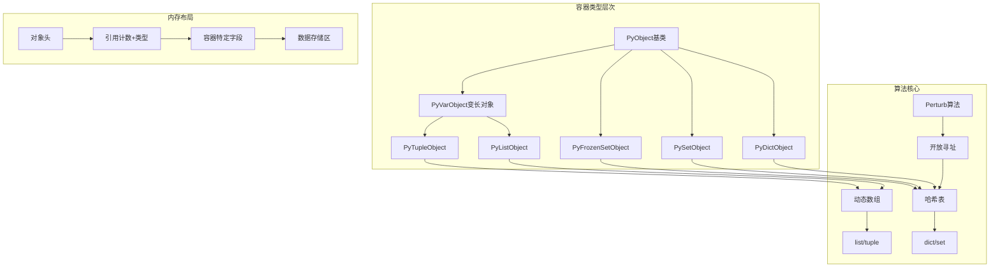
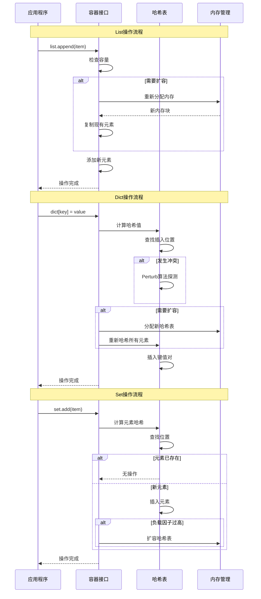

## 📋 概述

Python的核心容器（list、dict、set/frozenset、tuple）是Python编程的基础数据结构。本文档将深入分析CPython中这些容器的实现机制，包括内存布局、算法优化、动态扩展策略、以及性能特征，帮助开发者理解Python容器的内部工作原理。

## 🎯 核心容器系统架构



## 1. List容器深度实现

### 1.1 List内部结构与内存布局

```c
/* Objects/listobject.c - PyListObject结构定义 */

typedef struct {
    PyVarObject ob_base;        /* 变长对象头 */
    PyObject **ob_item;         /* 指向元素数组的指针 */
    Py_ssize_t allocated;       /* 已分配的槽位数 */
} PyListObject;

/*
 * List内存布局示意：
 *
 * PyListObject:
 * +-------------------+
 * | PyVarObject       | <- 对象头(引用计数、类型、大小)
 * | ob_item ----------|----> +----------+
 * | allocated         |      | PyObject*| <- 元素0
 * +-------------------+      | PyObject*| <- 元素1
 *                            | PyObject*| <- 元素2
 *                            |   ...    |
 *                            | NULL     | <- 未使用槽位
 *                            | NULL     |
 *                            +----------+
 */

/* List创建函数 */
PyObject *
PyList_New(Py_ssize_t size)
{
    if (size < 0) {
        PyErr_BadInternalCall();
        return NULL;
    }

    /* 从空闲列表获取或分配新的PyListObject */
    PyListObject *op = _Py_FREELIST_POP(PyListObject, lists);
    if (op == NULL) {
        op = PyObject_GC_New(PyListObject, &PyList_Type);
        if (op == NULL) {
            return NULL;
        }
    }

    if (size <= 0) {
        /* 空列表：不分配元素数组 */
        op->ob_item = NULL;
    }
    else {
        /* 分配元素数组 */
#ifdef Py_GIL_DISABLED
        /* 无GIL模式：使用线程安全的数组分配 */
        _PyListArray *array = list_allocate_array(size);
        if (array == NULL) {
            Py_DECREF(op);
            return PyErr_NoMemory();
        }
        memset(&array->ob_item, 0, size * sizeof(PyObject *));
        op->ob_item = array->ob_item;
#else
        /* 标准模式：直接分配 */
        op->ob_item = (PyObject **) PyMem_Calloc(size, sizeof(PyObject *));
#endif
        if (op->ob_item == NULL) {
            Py_DECREF(op);
            return PyErr_NoMemory();
        }
    }

    /* 设置列表大小和分配大小 */
    Py_SET_SIZE(op, size);
    op->allocated = size;

    /* 开启垃圾回收跟踪 */
    _PyObject_GC_TRACK(op);
    return (PyObject *) op;
}

/* List动态扩展算法 */
static int
list_resize(PyListObject *self, Py_ssize_t newsize)
{
    Py_ssize_t new_allocated, num_allocated_bytes;
    size_t new_allocated_bytes;

    /* 快速路径：大小没有超出已分配空间 */
    if (newsize <= self->allocated && newsize >= (self->allocated >> 1)) {
        assert(self->ob_item != NULL || newsize == 0);
        Py_SET_SIZE(self, newsize);
        return 0;
    }

    /*
     * 动态扩展策略：
     * 新分配大小 = newsize + (newsize >> 3) + (newsize < 9 ? 3 : 6)
     *
     * 这个公式的设计理念：
     * 1. 为小列表提供额外的3-6个槽位
     * 2. 为大列表按12.5%的比例增长
     * 3. 平衡内存使用和重新分配频率
     */
    new_allocated = (size_t)newsize + (newsize >> 3) + (newsize < 9 ? 3 : 6);

    /* 检查整数溢出 */
    if (new_allocated > (size_t)PY_SSIZE_T_MAX / sizeof(PyObject *)) {
        PyErr_NoMemory();
        return -1;
    }

    if (newsize == 0) {
        /* 缩减到空列表 */
        PyMem_Free(self->ob_item);
        self->ob_item = NULL;
        Py_SET_SIZE(self, 0);
        self->allocated = 0;
        return 0;
    }

    /* 重新分配内存 */
    new_allocated_bytes = new_allocated * sizeof(PyObject *);
    PyObject **items = (PyObject **)PyMem_Realloc(self->ob_item, new_allocated_bytes);
    if (items == NULL) {
        PyErr_NoMemory();
        return -1;
    }

    self->ob_item = items;
    Py_SET_SIZE(self, newsize);
    self->allocated = new_allocated;
    return 0;
}

/* List插入操作实现 */
static int
ins1(PyListObject *self, Py_ssize_t where, PyObject *v)
{
    Py_ssize_t i, n = Py_SIZE(self);
    PyObject **items;

    if (v == NULL) {
        PyErr_BadInternalCall();
        return -1;
    }

    /* 边界检查 */
    if (where < 0) {
        where += n;
        if (where < 0)
            where = 0;
    }
    if (where > n)
        where = n;

    /* 扩展列表大小 */
    if (list_resize(self, n+1) < 0)
        return -1;

    /* 移动元素为新元素腾出空间 */
    items = self->ob_item;
    for (i = n; --i >= where; )
        items[i+1] = items[i];

    /* 插入新元素 */
    Py_INCREF(v);
    items[where] = v;
    return 0;
}

/* List切片操作 */
static PyObject *
list_subscript(PyListObject* self, PyObject* item)
{
    if (_PyIndex_Check(item)) {
        /* 单个索引访问 */
        Py_ssize_t i = PyNumber_AsSsize_t(item, PyExc_IndexError);
        if (i == -1 && PyErr_Occurred())
            return NULL;
        if (i < 0)
            i += PyList_GET_SIZE(self);
        return list_item(self, i);
    }
    else if (PySlice_Check(item)) {
        /* 切片访问 */
        Py_ssize_t start, stop, step, slicelength;

        if (PySlice_Unpack(item, &start, &stop, &step) < 0) {
            return NULL;
        }
        slicelength = PySlice_AdjustIndices(Py_SIZE(self), &start, &stop, step);

        if (slicelength <= 0) {
            return PyList_New(0);
        }
        else if (step == 1) {
            /* 连续切片：优化路径 */
            return list_slice(self, start, stop);
        }
        else {
            /* 步长切片：逐个复制 */
            PyListObject *result = (PyListObject *)PyList_New(slicelength);
            if (!result) return NULL;

            PyObject **src = self->ob_item;
            PyObject **dest = result->ob_item;

            for (Py_ssize_t cur = start, i = 0; i < slicelength;
                 cur += step, i++) {
                PyObject *it = src[cur];
                Py_INCREF(it);
                dest[i] = it;
            }
            return (PyObject *)result;
        }
    }
    else {
        PyErr_Format(PyExc_TypeError,
                     "list indices must be integers or slices, not %.200s",
                     Py_TYPE(item)->tp_name);
        return NULL;
    }
}
```

### 1.2 List性能优化技术

```python
# List性能特征分析和优化演示
import sys
import time
import gc
from typing import List, Any

class ListPerformanceAnalyzer:
    """List性能分析器"""

    def __init__(self):
        self.test_results = {}

    def analyze_memory_layout(self):
        """分析List内存布局"""

        print("=== List内存布局分析 ===")

        # 空列表的内存开销
        empty_list = []
        empty_size = sys.getsizeof(empty_list)
        print(f"空列表内存: {empty_size} bytes")

        # 不同大小列表的内存使用
        sizes = [1, 2, 4, 8, 16, 32, 64, 128, 256, 512, 1024]

        print(f"列表大小 -> 内存使用 (bytes) -> 每元素开销 (bytes)")
        for size in sizes:
            test_list = [None] * size
            total_memory = sys.getsizeof(test_list)
            # 计算元素指针数组的大小
            element_array_size = size * 8  # 64位系统上指针是8字节
            overhead = total_memory - element_array_size
            per_element = total_memory / size if size > 0 else 0

            print(f"{size:4d} -> {total_memory:6d} -> {per_element:5.1f}")

        # 分析列表的动态扩展
        print(f"\n列表动态扩展策略分析:")
        test_list = []
        last_capacity = 0

        for i in range(20):
            test_list.append(i)
            # 通过内存大小推算容量
            current_memory = sys.getsizeof(test_list)
            estimated_capacity = (current_memory - empty_size) // 8

            if estimated_capacity != last_capacity:
                print(f"元素数: {i+1:2d}, 估算容量: {estimated_capacity:2d}, "
                      f"扩展比例: {estimated_capacity / (i+1):.2f}")
                last_capacity = estimated_capacity

    def benchmark_operations(self):
        """基准测试各种操作"""

        print(f"\n=== List操作性能基准测试 ===")

        # 测试数据
        test_sizes = [1000, 10000, 100000]

        for size in test_sizes:
            print(f"\n测试大小: {size:,} 元素")

            # 1. 追加操作性能
            def test_append():
                test_list = []
                start = time.perf_counter()
                for i in range(size):
                    test_list.append(i)
                return time.perf_counter() - start

            append_time = test_append()
            print(f"  append操作: {append_time:.4f}s ({size/append_time/1000:.1f}K ops/s)")

            # 2. 预分配vs动态增长
            def test_prealloc():
                start = time.perf_counter()
                test_list = [None] * size
                for i in range(size):
                    test_list[i] = i
                return time.perf_counter() - start

            prealloc_time = test_prealloc()
            print(f"  预分配+赋值: {prealloc_time:.4f}s ({size/prealloc_time/1000:.1f}K ops/s)")
            print(f"  预分配优势: {append_time/prealloc_time:.1f}x")

            # 3. 插入操作性能
            test_list = list(range(size))

            def test_insert_head():
                start = time.perf_counter()
                for i in range(min(1000, size//10)):  # 避免过度测试
                    test_list.insert(0, -i)
                return time.perf_counter() - start

            insert_time = test_insert_head()
            operations = min(1000, size//10)
            print(f"  头部插入: {insert_time:.4f}s ({operations/insert_time:.1f} ops/s)")

            # 4. 切片操作性能
            def test_slice():
                start = time.perf_counter()
                for _ in range(100):
                    _ = test_list[size//4:3*size//4]  # 中间50%切片
                return time.perf_counter() - start

            slice_time = test_slice()
            print(f"  切片操作: {slice_time:.4f}s ({100/slice_time:.1f} ops/s)")

            # 5. 查找操作性能
            def test_index():
                start = time.perf_counter()
                for i in range(min(1000, size//10)):
                    try:
                        test_list.index(size - 1 - i)  # 查找末尾元素
                    except ValueError:
                        pass
                return time.perf_counter() - start

            index_time = test_index()
            print(f"  index查找: {index_time:.4f}s ({min(1000, size//10)/index_time:.1f} ops/s)")

    def analyze_memory_patterns(self):
        """分析内存使用模式"""

        print(f"\n=== List内存使用模式分析 ===")

        # 1. 引用vs拷贝
        original_list = list(range(10000))

        print("引用 vs 拷贝内存对比:")

        # 浅拷贝
        shallow_copy = original_list[:]
        print(f"  原列表内存: {sys.getsizeof(original_list):,} bytes")
        print(f"  浅拷贝内存: {sys.getsizeof(shallow_copy):,} bytes")

        # 引用同一数据
        reference = original_list
        print(f"  引用内存: {sys.getsizeof(reference):,} bytes")

        # 2. 内存碎片分析
        print(f"\n内存碎片分析:")

        # 创建大量小列表
        small_lists = []
        for i in range(1000):
            small_lists.append([i] * 10)

        # 创建少量大列表
        large_lists = []
        for i in range(10):
            large_lists.append([i] * 1000)

        small_total = sum(sys.getsizeof(lst) for lst in small_lists)
        large_total = sum(sys.getsizeof(lst) for lst in large_lists)

        print(f"  1000个小列表(10元素): {small_total:,} bytes")
        print(f"  10个大列表(1000元素): {large_total:,} bytes")
        print(f"  小列表开销比例: {(small_total/large_total - 1)*100:.1f}%")

        # 3. 内存释放模式
        print(f"\n内存释放模式:")

        gc_before = gc.collect()

        # 创建循环引用
        circular_lists = []
        for i in range(100):
            lst = [None] * 100
            lst[0] = lst  # 创建循环引用
            circular_lists.append(lst)

        del circular_lists
        gc_after = gc.collect()

        print(f"  垃圾回收清理对象: {gc_after} 个")

    def demonstrate_optimization_techniques(self):
        """演示优化技术"""

        print(f"\n=== List优化技术演示 ===")

        size = 100000

        # 1. 列表推导式 vs 循环
        def test_list_comprehension():
            start = time.perf_counter()
            result = [i * 2 for i in range(size)]
            return time.perf_counter() - start

        def test_loop_append():
            start = time.perf_counter()
            result = []
            for i in range(size):
                result.append(i * 2)
            return time.perf_counter() - start

        comp_time = test_list_comprehension()
        loop_time = test_loop_append()

        print(f"列表推导式: {comp_time:.4f}s")
        print(f"循环追加: {loop_time:.4f}s")
        print(f"推导式优势: {loop_time/comp_time:.1f}x")

        # 2. 预分配优化
        def test_extend():
            start = time.perf_counter()
            result = []
            result.extend(range(size))
            return time.perf_counter() - start

        extend_time = test_extend()
        print(f"extend方法: {extend_time:.4f}s")
        print(f"extend vs 推导式: {comp_time/extend_time:.1f}x")

        # 3. 内存视图优化
        import array

        def test_array():
            start = time.perf_counter()
            result = array.array('i', range(size))
            return time.perf_counter() - start

        array_time = test_array()
        print(f"array.array: {array_time:.4f}s")

        # 内存使用对比
        list_obj = list(range(1000))
        array_obj = array.array('i', range(1000))

        print(f"\n内存使用对比 (1000个整数):")
        print(f"  list: {sys.getsizeof(list_obj):,} bytes")
        print(f"  array: {sys.getsizeof(array_obj):,} bytes")
        print(f"  array节省: {(1 - sys.getsizeof(array_obj)/sys.getsizeof(list_obj))*100:.1f}%")

    def run_analysis(self):
        """运行完整分析"""

        print("Python List容器深度性能分析\n")

        self.analyze_memory_layout()
        self.benchmark_operations()
        self.analyze_memory_patterns()
        self.demonstrate_optimization_techniques()

        print(f"\n{'='*50}")
        print("List分析完成")
        print(f"{'='*50}")

# 运行List分析
if __name__ == "__main__":
    analyzer = ListPerformanceAnalyzer()
    analyzer.run_analysis()
```

## 2. Dict容器深度实现

### 2.1 Dict哈希表结构

```c
/* Objects/dictobject.c - PyDictObject结构定义 */

/*
 * Python字典采用开放寻址的哈希表实现
 *
 * 核心思想：
 * 1. 分离索引表和条目表，提高缓存局部性
 * 2. 使用Perturb算法减少聚集
 * 3. 保持插入顺序（从Python 3.7开始）
 */

typedef struct {
    PyObject_HEAD

    /* 已使用的条目数 */
    Py_ssize_t ma_used;

    /* 键表指针 */
    PyDictKeysObject *ma_keys;

    /* 值数组指针（用于分离键值的字典） */
    PyDictValues *ma_values;

    /* 监视器标签 */
    uint8_t _ma_watcher_tag;
} PyDictObject;

/* 键表结构 */
typedef struct {
    Py_ssize_t dk_refcnt;       /* 引用计数 */
    uint8_t dk_log2_size;       /* log2(dk_size) */
    uint8_t dk_log2_index_bytes; /* log2(index_table_entry_size) */
    uint8_t dk_kind;            /* 字典类型标志 */
    uint32_t dk_version;        /* 版本号，用于优化 */
    Py_ssize_t dk_usable;       /* 可用条目数 */
    Py_ssize_t dk_nentries;     /* 已使用条目数 */

    /*
     * 内存布局：
     * dk_indices[dk_size]      <- 索引表
     * dk_entries[dk_usable]    <- 条目表
     */
    char dk_indices[];          /* 可变大小的索引+条目数据 */
} PyDictKeysObject;

/* Unicode字符串优化的条目结构 */
typedef struct {
    PyObject *me_key;           /* 键对象 */
    PyObject *me_value;         /* 值对象 */
} PyDictUnicodeEntry;

/* 通用条目结构 */
typedef struct {
    Py_hash_t me_hash;          /* 键的哈希值 */
    PyObject *me_key;           /* 键对象 */
    PyObject *me_value;         /* 值对象 */
} PyDictKeyEntry;

/* 字典创建函数 */
PyObject *
PyDict_New(void)
{
    /* 使用空键表创建新字典 */
    return new_dict(Py_EMPTY_KEYS, NULL, 0, 0);
}

/* 通用字典创建函数 */
static PyObject *
new_dict(PyDictKeysObject *keys, PyDictValues *values,
         Py_ssize_t used, int free_values_on_failure)
{
    assert(keys != NULL);

    /* 从空闲列表获取或分配新的PyDictObject */
    PyDictObject *mp = _Py_FREELIST_POP(PyDictObject, dicts);
    if (mp == NULL) {
        mp = PyObject_GC_New(PyDictObject, &PyDict_Type);
        if (mp == NULL) {
            dictkeys_decref(keys, false);
            if (free_values_on_failure) {
                free_values(values, false);
            }
            return NULL;
        }
    }

    assert(Py_IS_TYPE(mp, &PyDict_Type));
    mp->ma_keys = keys;
    mp->ma_values = values;
    mp->ma_used = used;
    mp->_ma_watcher_tag = 0;

    /* 开启垃圾回收跟踪 */
    _PyObject_GC_TRACK(mp);
    return (PyObject *)mp;
}

/* 哈希查找实现 - 核心算法 */
static Py_ssize_t
lookdict_index(PyDictKeysObject *k, Py_hash_t hash, Py_ssize_t index)
{
    size_t mask = DK_MASK(k);
    size_t perturb = (size_t)hash;
    size_t i = (size_t)hash & mask;

    for (;;) {
        Py_ssize_t ix = dictkeys_get_index(k, i);
        if (ix == DKIX_EMPTY) {
            /* 找到空槽 */
            return DKIX_EMPTY;
        }
        if (ix >= 0) {
            /* 找到已使用的槽 */
            if (ix == index) {
                return index;
            }
        }

        /* 使用Perturb算法计算下一个探测位置 */
        perturb >>= PERTURB_SHIFT;
        i = (i*5 + 1 + perturb) & mask;
    }
}

/* Unicode字符串特化的查找函数 */
static Py_ssize_t
unicodekeys_lookup_unicode(PyDictKeysObject* dk, PyObject *key, Py_hash_t hash)
{
    /*
     * Unicode字典的优化查找：
     * 1. 跳过哈希值比较（已知为Unicode）
     * 2. 使用更简单的字符串比较
     * 3. 利用字符串驻留优化
     */

    assert(PyUnicode_CheckExact(key));

    PyDictUnicodeEntry *ep0 = DK_UNICODE_ENTRIES(dk);
    size_t mask = DK_MASK(dk);
    size_t perturb = hash;
    size_t i = (size_t)hash & mask;

    for (;;) {
        Py_ssize_t ix = dictkeys_get_index(dk, i);
        if (ix == DKIX_EMPTY) {
            return DKIX_EMPTY;
        }
        if (ix >= 0) {
            PyDictUnicodeEntry *ep = &ep0[ix];
            assert(ep->me_key != NULL);

            if (ep->me_key == key) {
                /* 对象身份相等（字符串驻留） */
                return ix;
            }

            if (PyUnicode_CheckExact(ep->me_key)) {
                if (unicode_get_hash(ep->me_key) == hash) {
                    /* 哈希值相等，进行字符串比较 */
                    int cmp = unicode_eq(ep->me_key, key);
                    if (cmp < 0) {
                        return DKIX_ERROR;
                    }
                    if (cmp > 0) {
                        return ix;
                    }
                }
            }
        }

        /* 继续探测 */
        perturb >>= PERTURB_SHIFT;
        i = (i*5 + 1 + perturb) & mask;
    }
}

/* 字典插入/更新操作 */
static int
insertdict(PyDictObject *mp, PyObject *key, Py_hash_t hash, PyObject *value)
{
    PyObject *old_value;
    PyDictKeysObject *dk;
    Py_ssize_t ix;

    /* 确保字典可写 */
    if (mp->ma_values != NULL && !PyUnicode_CheckExact(key)) {
        if (insertion_resize(mp, 1) < 0) {
            return -1;
        }
    }

    dk = mp->ma_keys;
    assert(dk != NULL);

    /* 查找插入位置 */
    if (DK_IS_UNICODE(dk) && PyUnicode_CheckExact(key)) {
        ix = unicodekeys_lookup_unicode(dk, key, hash);
    }
    else {
        ix = lookdict(mp, key, hash, &old_value);
    }

    if (ix == DKIX_ERROR) {
        return -1;
    }

    if (ix == DKIX_EMPTY) {
        /* 新键：需要插入新条目 */
        uint64_t new_version = _PyDict_NotifyEvent(
            mp, PyDict_EVENT_ADDED, key, value);
        return insert_to_emptydict(mp, key, hash, value, new_version);
    }

    /* 更新现有键的值 */
    if (DK_IS_UNICODE(dk)) {
        PyDictUnicodeEntry *ep = &DK_UNICODE_ENTRIES(dk)[ix];
        old_value = ep->me_value;
        ep->me_value = value;
    }
    else {
        PyDictKeyEntry *ep = &DK_ENTRIES(dk)[ix];
        old_value = ep->me_value;
        ep->me_value = value;
    }

    /* 释放旧值，增加新值引用 */
    Py_XDECREF(old_value);
    Py_INCREF(value);

    _PyDict_NotifyEvent(mp, PyDict_EVENT_MODIFIED, key, value);
    return 0;
}

/* 字典扩容策略 */
static int
dictresize(PyDictObject *mp, uint8_t log2_newsize, int unicode)
{
    PyDictKeysObject *oldkeys;
    PyDictValues *oldvalues;

    oldkeys = mp->ma_keys;
    oldvalues = mp->ma_values;

    /* 分配新的键表 */
    PyDictKeysObject *newkeys = new_keys_object(
        1 << log2_newsize, unicode);
    if (newkeys == NULL) {
        return -1;
    }

    /*
     * 字典扩容策略：
     * 1. 小字典(< 50000): 4倍增长
     * 2. 大字典: 2倍增长
     * 3. 保持负载因子在2/3以下
     */

    if (oldvalues != NULL) {
        /* 分离键值字典的复制 */
        if (copy_values_to_keys(mp, newkeys) < 0) {
            dictkeys_decref(newkeys, unicode);
            return -1;
        }
        mp->ma_values = NULL;
    }
    else {
        /* 合并键值字典的复制 */
        if (copy_entries_to_keys(oldkeys, newkeys) < 0) {
            dictkeys_decref(newkeys, unicode);
            return -1;
        }
    }

    /* 切换到新键表 */
    mp->ma_keys = newkeys;
    dictkeys_decref(oldkeys, DK_IS_UNICODE(oldkeys));

    if (oldvalues != NULL) {
        free_values(oldvalues, false);
    }

    return 0;
}
```

### 2.2 Dict性能优化与特殊化

```python
# Dict性能分析和优化演示
import sys
import time
import string
import random
from typing import Dict, Any

class DictPerformanceAnalyzer:
    """Dict性能分析器"""

    def __init__(self):
        self.test_results = {}

    def analyze_hash_distribution(self):
        """分析哈希分布质量"""

        print("=== Dict哈希分布分析 ===")

        # 1. 字符串键的哈希分布
        string_keys = [f"key_{i}" for i in range(1000)]
        hash_values = [hash(key) for key in string_keys]

        # 计算哈希值在不同桶中的分布
        bucket_counts = {}
        table_size = 1024  # 假设哈希表大小

        for h in hash_values:
            bucket = h % table_size
            bucket_counts[bucket] = bucket_counts.get(bucket, 0) + 1

        # 分析分布均匀性
        used_buckets = len(bucket_counts)
        max_collisions = max(bucket_counts.values())
        avg_collisions = sum(bucket_counts.values()) / used_buckets

        print(f"字符串键哈希分布:")
        print(f"  使用的桶: {used_buckets}/{table_size} ({used_buckets/table_size*100:.1f}%)")
        print(f"  最大冲突: {max_collisions}")
        print(f"  平均冲突: {avg_collisions:.2f}")

        # 2. 整数键的哈希分布
        int_keys = list(range(1000))
        int_hashes = [hash(key) for key in int_keys]

        int_bucket_counts = {}
        for h in int_hashes:
            bucket = h % table_size
            int_bucket_counts[bucket] = int_bucket_counts.get(bucket, 0) + 1

        int_used_buckets = len(int_bucket_counts)
        int_max_collisions = max(int_bucket_counts.values())

        print(f"\n整数键哈希分布:")
        print(f"  使用的桶: {int_used_buckets}/{table_size} ({int_used_buckets/table_size*100:.1f}%)")
        print(f"  最大冲突: {int_max_collisions}")

        # 3. 混合键类型的性能影响
        mixed_dict = {}
        string_dict = {}

        # 创建纯字符串键字典
        for i in range(1000):
            string_dict[f"str_{i}"] = i

        # 创建混合键字典
        for i in range(500):
            mixed_dict[f"str_{i}"] = i
            mixed_dict[i] = f"val_{i}"

        print(f"\n字典键类型优化:")
        print(f"  纯字符串字典内存: {sys.getsizeof(string_dict):,} bytes")
        print(f"  混合键字典内存: {sys.getsizeof(mixed_dict):,} bytes")
        print(f"  混合键开销: {(sys.getsizeof(mixed_dict)/sys.getsizeof(string_dict)-1)*100:.1f}%")

    def benchmark_dict_operations(self):
        """基准测试字典操作"""

        print(f"\n=== Dict操作性能基准测试 ===")

        sizes = [1000, 10000, 100000]

        for size in sizes:
            print(f"\n测试大小: {size:,} 元素")

            # 1. 插入性能
            def test_insertion():
                test_dict = {}
                start = time.perf_counter()
                for i in range(size):
                    test_dict[f"key_{i}"] = i
                return time.perf_counter() - start

            insert_time = test_insertion()
            print(f"  插入操作: {insert_time:.4f}s ({size/insert_time/1000:.1f}K ops/s)")

            # 2. 查找性能
            test_dict = {f"key_{i}": i for i in range(size)}

            def test_lookup():
                start = time.perf_counter()
                for i in range(min(10000, size)):
                    _ = test_dict[f"key_{i}"]
                return time.perf_counter() - start

            lookup_time = test_lookup()
            operations = min(10000, size)
            print(f"  查找操作: {lookup_time:.4f}s ({operations/lookup_time/1000:.1f}K ops/s)")

            # 3. 删除性能
            test_dict_copy = test_dict.copy()

            def test_deletion():
                start = time.perf_counter()
                for i in range(min(1000, size//2)):
                    del test_dict_copy[f"key_{i}"]
                return time.perf_counter() - start

            delete_time = test_deletion()
            del_ops = min(1000, size//2)
            print(f"  删除操作: {delete_time:.4f}s ({del_ops/delete_time/1000:.1f}K ops/s)")

            # 4. 迭代性能
            def test_iteration():
                start = time.perf_counter()
                for _ in range(100):
                    for key in test_dict:
                        pass
                return time.perf_counter() - start

            iter_time = test_iteration()
            print(f"  迭代操作: {iter_time:.4f}s ({100*size/iter_time/1000:.1f}K items/s)")

    def analyze_memory_efficiency(self):
        """分析内存效率"""

        print(f"\n=== Dict内存效率分析 ===")

        # 1. 键类型对内存的影响
        size = 10000

        # 字符串键
        str_dict = {f"key_{i}": i for i in range(size)}
        str_memory = sys.getsizeof(str_dict)

        # 整数键
        int_dict = {i: f"value_{i}" for i in range(size)}
        int_memory = sys.getsizeof(int_dict)

        # 元组键
        tuple_dict = {(i, i+1): f"value_{i}" for i in range(size)}
        tuple_memory = sys.getsizeof(tuple_dict)

        print(f"不同键类型的内存使用 ({size:,} 元素):")
        print(f"  字符串键: {str_memory:,} bytes ({str_memory/size:.1f} bytes/item)")
        print(f"  整数键: {int_memory:,} bytes ({int_memory/size:.1f} bytes/item)")
        print(f"  元组键: {tuple_memory:,} bytes ({tuple_memory/size:.1f} bytes/item)")

        # 2. 分离式存储 vs 合并式存储
        print(f"\n分离式存储分析:")

        # 模拟类的__dict__（使用分离式存储）
        class TestClass:
            def __init__(self):
                self.attr1 = 1
                self.attr2 = 2
                self.attr3 = 3
                self.attr4 = 4
                self.attr5 = 5

        instances = [TestClass() for _ in range(1000)]

        # 计算实例字典的总内存
        total_dict_memory = sum(sys.getsizeof(inst.__dict__) for inst in instances)
        avg_dict_memory = total_dict_memory / len(instances)

        print(f"  1000个实例的__dict__:")
        print(f"  总内存: {total_dict_memory:,} bytes")
        print(f"  平均每个: {avg_dict_memory:.1f} bytes")

        # 3. 字典推导式 vs 循环构建
        def test_dict_comprehension():
            start = time.perf_counter()
            result = {f"key_{i}": i*2 for i in range(size)}
            return time.perf_counter() - start

        def test_dict_loop():
            start = time.perf_counter()
            result = {}
            for i in range(size):
                result[f"key_{i}"] = i*2
            return time.perf_counter() - start

        comp_time = test_dict_comprehension()
        loop_time = test_dict_loop()

        print(f"\n构建方式性能对比:")
        print(f"  字典推导式: {comp_time:.4f}s")
        print(f"  循环构建: {loop_time:.4f}s")
        print(f"  推导式优势: {loop_time/comp_time:.1f}x")

    def analyze_advanced_features(self):
        """分析高级特性"""

        print(f"\n=== Dict高级特性分析 ===")

        # 1. 插入顺序保持（Python 3.7+）
        print("插入顺序保持测试:")
        test_dict = {}
        keys = [f"key_{i}" for i in range(100)]
        random.shuffle(keys)  # 随机顺序插入

        for key in keys:
            test_dict[key] = len(test_dict)

        # 检查迭代顺序是否与插入顺序一致
        dict_keys = list(test_dict.keys())
        order_preserved = dict_keys == keys
        print(f"  插入顺序保持: {order_preserved}")

        # 2. 字典合并性能
        dict1 = {f"key1_{i}": i for i in range(5000)}
        dict2 = {f"key2_{i}": i for i in range(5000)}

        def test_dict_merge_update():
            d = dict1.copy()
            start = time.perf_counter()
            d.update(dict2)
            return time.perf_counter() - start

        def test_dict_merge_operator():
            start = time.perf_counter()
            d = dict1 | dict2  # Python 3.9+
            return time.perf_counter() - start

        update_time = test_dict_merge_update()
        try:
            operator_time = test_dict_merge_operator()
            print(f"\n字典合并性能:")
            print(f"  update方法: {update_time:.4f}s")
            print(f"  |操作符: {operator_time:.4f}s")
            print(f"  操作符优势: {update_time/operator_time:.1f}x")
        except TypeError:
            print(f"\n字典合并性能:")
            print(f"  update方法: {update_time:.4f}s")
            print(f"  |操作符: 不支持 (Python < 3.9)")

        # 3. 视图对象性能
        large_dict = {i: f"value_{i}" for i in range(10000)}

        def test_keys_iteration():
            start = time.perf_counter()
            for _ in range(100):
                for key in large_dict.keys():
                    pass
            return time.perf_counter() - start

        def test_items_iteration():
            start = time.perf_counter()
            for _ in range(100):
                for key, value in large_dict.items():
                    pass
            return time.perf_counter() - start

        keys_time = test_keys_iteration()
        items_time = test_items_iteration()

        print(f"\n视图对象迭代性能:")
        print(f"  keys()迭代: {keys_time:.4f}s")
        print(f"  items()迭代: {items_time:.4f}s")
        print(f"  items开销: {(items_time/keys_time-1)*100:.1f}%")

    def run_analysis(self):
        """运行完整分析"""

        print("Python Dict容器深度性能分析\n")

        self.analyze_hash_distribution()
        self.benchmark_dict_operations()
        self.analyze_memory_efficiency()
        self.analyze_advanced_features()

        print(f"\n{'='*50}")
        print("Dict分析完成")
        print(f"{'='*50}")

# 运行Dict分析
if __name__ == "__main__":
    analyzer = DictPerformanceAnalyzer()
    analyzer.run_analysis()
```

## 3. Set容器深度实现

### 3.1 Set哈希表结构

```c
/* Objects/setobject.c - PySetObject结构定义 */

/*
 * Set实现基于开放寻址的哈希表
 * 与dict类似，但只存储键，不存储值
 */

typedef struct {
    PyObject_HEAD

    Py_ssize_t fill;            /* 已使用槽位数（包括dummy） */
    Py_ssize_t used;            /* 活跃元素数 */
    Py_ssize_t mask;            /* 哈希表掩码 (size - 1) */

    setentry *table;            /* 哈希表指针 */
    Py_hash_t hash;             /* frozenset的哈希值缓存 */
    Py_ssize_t finger;          /* 迭代器位置 */

    setentry smalltable[PySet_MINSIZE];  /* 小表优化 */
    PyObject *weakreflist;      /* 弱引用列表 */
} PySetObject;

/* Set条目结构 */
typedef struct {
    PyObject *key;              /* 元素对象 */
    Py_hash_t hash;             /* 哈希值缓存 */
} setentry;

/* Set创建函数 */
PyObject *
PySet_New(PyObject *iterable)
{
    return make_new_set(&PySet_Type, iterable);
}

/* 通用Set创建函数 */
static PyObject *
make_new_set(PyTypeObject *type, PyObject *iterable)
{
    assert(PyType_Check(type));
    PySetObject *so;

    /* 分配Set对象 */
    so = (PySetObject *)type->tp_alloc(type, 0);
    if (so == NULL)
        return NULL;

    /* 初始化Set结构 */
    so->fill = 0;
    so->used = 0;
    so->mask = PySet_MINSIZE - 1;    /* 初始大小为8 */
    so->table = so->smalltable;      /* 使用内置小表 */
    so->hash = -1;                   /* 未计算哈希值 */
    so->finger = 0;                  /* 迭代器起始位置 */
    so->weakreflist = NULL;

    if (iterable != NULL) {
        /* 从可迭代对象初始化 */
        if (set_update_local(so, iterable)) {
            Py_DECREF(so);
            return NULL;
        }
    }

    return (PyObject *)so;
}

/* Set查找实现 */
static setentry *
set_lookkey(PySetObject *so, PyObject *key, Py_hash_t hash)
{
    setentry *table;
    setentry *entry;
    size_t perturb = hash;
    size_t mask = so->mask;
    size_t i = (size_t)hash & mask;     /* 初始探测位置 */

    table = so->table;
    entry = &table[i];

    if (entry->key == NULL) {
        /* 空槽，元素不存在 */
        return entry;
    }

    if (entry->key == key) {
        /* 对象身份相等 */
        return entry;
    }

    if (entry->hash == hash && entry->key != dummy) {
        /* 哈希值相等，进行深度比较 */
        int cmp = PyObject_RichCompareBool(entry->key, key, Py_EQ);
        if (cmp < 0) {
            return NULL;
        }
        if (cmp > 0) {
            return entry;
        }
    }

    /* 使用Perturb算法进行开放寻址 */
    while (1) {
        perturb >>= PERTURB_SHIFT;
        i = (i * 5 + 1 + perturb) & mask;
        entry = &table[i];

        if (entry->key == NULL) {
            return entry;
        }
        if (entry->key == key) {
            return entry;
        }
        if (entry->hash == hash && entry->key != dummy) {
            int cmp = PyObject_RichCompareBool(entry->key, key, Py_EQ);
            if (cmp < 0) {
                return NULL;
            }
            if (cmp > 0) {
                return entry;
            }
        }
    }
}

/* Set添加元素 */
static int
set_add_entry(PySetObject *so, PyObject *key, Py_hash_t hash)
{
    setentry *entry;

    assert(so->fill <= so->mask);

    /* 查找插入位置 */
    entry = set_lookkey(so, key, hash);
    if (entry == NULL) {
        return -1;
    }

    if (entry->key == NULL) {
        /* 新元素 */
        entry->key = key;
        entry->hash = hash;
        so->fill++;
        so->used++;
        Py_INCREF(key);
    }
    else if (entry->key == dummy) {
        /* 重用deleted槽位 */
        entry->key = key;
        entry->hash = hash;
        so->used++;
        Py_INCREF(key);
    }
    /* 元素已存在，不做任何操作 */

    return 0;
}

/* Set扩容策略 */
static int
set_table_resize(PySetObject *so, Py_ssize_t minused)
{
    Py_ssize_t newsize;
    setentry *oldtable, *newtable, *entry;
    Py_ssize_t oldfill = so->fill;
    Py_ssize_t oldused = so->used;
    Py_ssize_t oldmask = so->mask;
    size_t i;

    assert(minused >= 0);

    /*
     * Set扩容策略：
     * - 找到能容纳minused个元素的最小2的幂
     * - 负载因子保持在2/3以下
     */
    for (newsize = PySet_MINSIZE; newsize < minused; newsize <<= 1)
        ;

    /* 分配新表 */
    if (newsize == PySet_MINSIZE) {
        /* 使用内置小表 */
        newtable = so->smalltable;
    }
    else {
        newtable = PyMem_New(setentry, newsize);
        if (newtable == NULL) {
            PyErr_NoMemory();
            return -1;
        }
    }

    /* 初始化新表 */
    memset(newtable, 0, sizeof(setentry) * newsize);

    /* 保存旧表 */
    oldtable = so->table;

    /* 设置新表参数 */
    so->table = newtable;
    so->mask = newsize - 1;
    so->fill = 0;
    so->used = 0;

    /* 重新插入所有元素 */
    for (i = 0; i <= oldmask; i++) {
        entry = &oldtable[i];
        if (entry->key != NULL && entry->key != dummy) {
            if (set_add_entry(so, entry->key, entry->hash)) {
                /* 回滚 */
                so->table = oldtable;
                so->mask = oldmask;
                so->fill = oldfill;
                so->used = oldused;

                if (newtable != so->smalltable) {
                    PyMem_Free(newtable);
                }
                return -1;
            }
            Py_DECREF(entry->key);  /* 移除旧引用 */
        }
    }

    /* 释放旧表 */
    if (oldtable != so->smalltable) {
        PyMem_Free(oldtable);
    }

    return 0;
}

/* Set删除元素 */
static int
set_discard_entry(PySetObject *so, PyObject *key, Py_hash_t hash)
{
    setentry *entry;

    entry = set_lookkey(so, key, hash);
    if (entry == NULL) {
        return -1;
    }
    if (entry->key == NULL) {
        return DISCARD_NOTFOUND;
    }

    /* 标记为已删除 */
    Py_DECREF(entry->key);
    entry->key = dummy;
    entry->hash = -1;
    so->used--;

    return DISCARD_FOUND;
}

/* frozenset哈希值计算 */
static Py_hash_t
frozenset_hash(PyObject *self)
{
    PySetObject *so = (PySetObject *)self;
    Py_uhash_t hash = 0;
    setentry *entry;
    Py_ssize_t pos = 0;

    if (so->hash != -1) {
        /* 返回缓存的哈希值 */
        return so->hash;
    }

    /*
     * frozenset哈希算法：
     * 1. 对所有元素的哈希值进行XOR
     * 2. 使用乘法和位移混合
     * 3. 确保结果与元素顺序无关
     */
    while (set_next(so, &pos, &entry)) {
        /* 混合元素哈希值 */
        Py_uhash_t h = (Py_uhash_t)entry->hash;
        hash ^= ((h ^ 89869747UL) ^ (h << 16)) * 3644798167UL;
    }

    /* 最终混合 */
    hash = hash * 69069U + 907133923UL;
    if (hash == (Py_uhash_t)-1) {
        hash = 590923713UL;
    }

    /* 缓存哈希值 */
    so->hash = (Py_hash_t)hash;
    return (Py_hash_t)hash;
}
```

## 4. 容器性能对比与最佳实践

### 4.1 容器选择指南

```python
# 容器性能对比和选择指南
import time
import sys
import random
from collections import deque, defaultdict, Counter
from typing import List, Dict, Set, Tuple

class ContainerComparisonAnalyzer:
    """容器对比分析器"""

    def __init__(self):
        self.test_sizes = [1000, 10000, 100000]
        self.results = {}

    def compare_sequence_containers(self):
        """对比序列容器性能"""

        print("=== 序列容器性能对比 ===")

        for size in self.test_sizes:
            print(f"\n测试大小: {size:,} 元素")

            # 1. 追加操作对比
            def test_list_append():
                container = []
                start = time.perf_counter()
                for i in range(size):
                    container.append(i)
                return time.perf_counter() - start

            def test_deque_append():
                container = deque()
                start = time.perf_counter()
                for i in range(size):
                    container.append(i)
                return time.perf_counter() - start

            list_append_time = test_list_append()
            deque_append_time = test_deque_append()

            print(f"  追加操作:")
            print(f"    list: {list_append_time:.4f}s")
            print(f"    deque: {deque_append_time:.4f}s")
            print(f"    deque优势: {list_append_time/deque_append_time:.1f}x")

            # 2. 头部插入对比
            test_list = list(range(min(1000, size//10)))
            test_deque = deque(range(min(1000, size//10)))

            def test_list_prepend():
                start = time.perf_counter()
                for i in range(100):
                    test_list.insert(0, -i)
                return time.perf_counter() - start

            def test_deque_prepend():
                start = time.perf_counter()
                for i in range(100):
                    test_deque.appendleft(-i)
                return time.perf_counter() - start

            list_prepend_time = test_list_prepend()
            deque_prepend_time = test_deque_prepend()

            print(f"  头部插入:")
            print(f"    list.insert(0): {list_prepend_time:.4f}s")
            print(f"    deque.appendleft: {deque_prepend_time:.4f}s")
            print(f"    deque优势: {list_prepend_time/deque_prepend_time:.1f}x")

            # 3. 随机访问对比
            test_list = list(range(size))
            test_tuple = tuple(range(size))

            def test_list_access():
                start = time.perf_counter()
                for _ in range(min(10000, size)):
                    idx = random.randint(0, size-1)
                    _ = test_list[idx]
                return time.perf_counter() - start

            def test_tuple_access():
                start = time.perf_counter()
                for _ in range(min(10000, size)):
                    idx = random.randint(0, size-1)
                    _ = test_tuple[idx]
                return time.perf_counter() - start

            list_access_time = test_list_access()
            tuple_access_time = test_tuple_access()

            print(f"  随机访问:")
            print(f"    list: {list_access_time:.4f}s")
            print(f"    tuple: {tuple_access_time:.4f}s")
            print(f"    tuple优势: {list_access_time/tuple_access_time:.1f}x")

    def compare_mapping_containers(self):
        """对比映射容器性能"""

        print(f"\n=== 映射容器性能对比 ===")

        for size in self.test_sizes:
            print(f"\n测试大小: {size:,} 元素")

            # 1. 构建性能对比
            def test_dict_build():
                start = time.perf_counter()
                container = {}
                for i in range(size):
                    container[f"key_{i}"] = i
                return time.perf_counter() - start

            def test_defaultdict_build():
                start = time.perf_counter()
                container = defaultdict(int)
                for i in range(size):
                    container[f"key_{i}"] = i
                return time.perf_counter() - start

            dict_build_time = test_dict_build()
            defaultdict_build_time = test_defaultdict_build()

            print(f"  构建性能:")
            print(f"    dict: {dict_build_time:.4f}s")
            print(f"    defaultdict: {defaultdict_build_time:.4f}s")
            print(f"    开销比例: {(defaultdict_build_time/dict_build_time-1)*100:.1f}%")

            # 2. 缺失键处理对比
            test_dict = {f"key_{i}": i for i in range(size)}
            test_defaultdict = defaultdict(int, test_dict)

            def test_dict_get():
                start = time.perf_counter()
                for i in range(1000):
                    _ = test_dict.get(f"missing_{i}", 0)
                return time.perf_counter() - start

            def test_defaultdict_access():
                start = time.perf_counter()
                for i in range(1000):
                    _ = test_defaultdict[f"missing_{i}"]
                return time.perf_counter() - start

            dict_get_time = test_dict_get()
            defaultdict_access_time = test_defaultdict_access()

            print(f"  缺失键处理:")
            print(f"    dict.get(): {dict_get_time:.4f}s")
            print(f"    defaultdict[]: {defaultdict_access_time:.4f}s")
            print(f"    defaultdict优势: {dict_get_time/defaultdict_access_time:.1f}x")

    def compare_set_containers(self):
        """对比集合容器性能"""

        print(f"\n=== 集合容器性能对比 ===")

        for size in self.test_sizes:
            print(f"\n测试大小: {size:,} 元素")

            # 1. 构建性能对比
            data = list(range(size))

            def test_set_build():
                start = time.perf_counter()
                container = set(data)
                return time.perf_counter() - start

            def test_frozenset_build():
                start = time.perf_counter()
                container = frozenset(data)
                return time.perf_counter() - start

            set_build_time = test_set_build()
            frozenset_build_time = test_frozenset_build()

            print(f"  构建性能:")
            print(f"    set: {set_build_time:.4f}s")
            print(f"    frozenset: {frozenset_build_time:.4f}s")
            print(f"    frozenset开销: {(frozenset_build_time/set_build_time-1)*100:.1f}%")

            # 2. 成员测试性能
            test_set = set(data)
            test_frozenset = frozenset(data)
            test_list = data.copy()

            def test_set_membership():
                start = time.perf_counter()
                for i in range(min(10000, size)):
                    _ = i in test_set
                return time.perf_counter() - start

            def test_frozenset_membership():
                start = time.perf_counter()
                for i in range(min(10000, size)):
                    _ = i in test_frozenset
                return time.perf_counter() - start

            def test_list_membership():
                start = time.perf_counter()
                for i in range(min(1000, size//10)):  # 减少测试次数
                    _ = i in test_list
                return time.perf_counter() - start

            set_membership_time = test_set_membership()
            frozenset_membership_time = test_frozenset_membership()
            list_membership_time = test_list_membership()

            # 标准化到相同的操作次数
            list_ops = min(1000, size//10)
            set_ops = min(10000, size)
            list_normalized_time = list_membership_time * (set_ops / list_ops)

            print(f"  成员测试:")
            print(f"    set: {set_membership_time:.4f}s")
            print(f"    frozenset: {frozenset_membership_time:.4f}s")
            print(f"    list: {list_normalized_time:.4f}s (标准化)")
            print(f"    set vs list优势: {list_normalized_time/set_membership_time:.1f}x")

            # 3. 集合操作性能
            set1 = set(range(size//2))
            set2 = set(range(size//4, 3*size//4))

            def test_set_union():
                start = time.perf_counter()
                for _ in range(100):
                    _ = set1 | set2
                return time.perf_counter() - start

            def test_set_intersection():
                start = time.perf_counter()
                for _ in range(100):
                    _ = set1 & set2
                return time.perf_counter() - start

            union_time = test_set_union()
            intersection_time = test_set_intersection()

            print(f"  集合操作 (100次):")
            print(f"    并集: {union_time:.4f}s")
            print(f"    交集: {intersection_time:.4f}s")

    def analyze_memory_usage(self):
        """分析内存使用模式"""

        print(f"\n=== 容器内存使用分析 ===")

        size = 10000

        # 创建不同类型的容器
        test_list = list(range(size))
        test_tuple = tuple(range(size))
        test_set = set(range(size))
        test_frozenset = frozenset(range(size))
        test_dict = {i: i for i in range(size)}

        containers = {
            'list': test_list,
            'tuple': test_tuple,
            'set': test_set,
            'frozenset': test_frozenset,
            'dict': test_dict
        }

        print(f"内存使用对比 ({size:,} 整数元素):")

        base_memory = None
        for name, container in containers.items():
            memory = sys.getsizeof(container)
            per_element = memory / size

            if base_memory is None:
                base_memory = memory
                print(f"  {name:10s}: {memory:,} bytes ({per_element:.1f} bytes/元素)")
            else:
                ratio = memory / base_memory
                print(f"  {name:10s}: {memory:,} bytes ({per_element:.1f} bytes/元素) [{ratio:.1f}x]")

    def provide_usage_recommendations(self):
        """提供使用建议"""

        print(f"\n=== 容器选择建议 ===")

        recommendations = {
            "序列容器": {
                "list": {
                    "优势": ["动态大小", "随机访问O(1)", "尾部操作O(1)"],
                    "劣势": ["头部操作O(n)", "内存开销大"],
                    "适用": ["通用序列", "需要修改", "随机访问"]
                },
                "tuple": {
                    "优势": ["不可变", "内存效率高", "可哈希"],
                    "劣势": ["不能修改", "构建开销大"],
                    "适用": ["固定数据", "字典键", "配置参数"]
                },
                "deque": {
                    "优势": ["两端操作O(1)", "线程安全的操作"],
                    "劣势": ["随机访问O(n)", "内存开销大"],
                    "适用": ["队列/栈", "滑动窗口", "两端操作"]
                }
            },
            "映射容器": {
                "dict": {
                    "优势": ["查找O(1)", "插入顺序保持", "内存优化"],
                    "劣势": ["内存开销", "不可哈希"],
                    "适用": ["通用映射", "缓存", "计数器"]
                },
                "defaultdict": {
                    "优势": ["自动初始化", "简化代码"],
                    "劣势": ["轻微性能开销"],
                    "适用": ["分组", "嵌套结构", "计数器"]
                }
            },
            "集合容器": {
                "set": {
                    "优势": ["唯一性", "集合运算", "成员测试O(1)"],
                    "劣势": ["无序", "内存开销"],
                    "适用": ["去重", "成员测试", "集合运算"]
                },
                "frozenset": {
                    "优势": ["不可变", "可哈希", "可做字典键"],
                    "劣势": ["不能修改"],
                    "适用": ["不变集合", "字典键", "集合的集合"]
                }
            }
        }

        for category, containers in recommendations.items():
            print(f"\n{category}:")
            for container, info in containers.items():
                print(f"  {container}:")
                print(f"    优势: {', '.join(info['优势'])}")
                print(f"    劣势: {', '.join(info['劣势'])}")
                print(f"    适用: {', '.join(info['适用'])}")

    def run_comparison(self):
        """运行完整对比分析"""

        print("Python核心容器性能对比分析\n")

        self.compare_sequence_containers()
        self.compare_mapping_containers()
        self.compare_set_containers()
        self.analyze_memory_usage()
        self.provide_usage_recommendations()

        print(f"\n{'='*50}")
        print("容器对比分析完成")
        print(f"{'='*50}")

# 运行容器对比分析
if __name__ == "__main__":
    analyzer = ContainerComparisonAnalyzer()
    analyzer.run_comparison()
```

## 5. 容器架构时序图



## 6. 总结

Python的核心容器系统展现了高度优化的设计：

### 6.1 设计精华

1. **List**: 动态数组，智能扩容策略，优化内存局部性
2. **Dict**: 开放寻址，Perturb算法，Unicode优化，插入顺序保持
3. **Set**: 哈希去重，集合运算优化，frozenset可哈希性
4. **Tuple**: 不可变优化，内存紧凑，可哈希特性

### 6.2 性能特征

1. **时间复杂度**: 大部分操作达到理论最优
2. **空间效率**: 针对不同使用模式优化内存布局
3. **缓存友好**: 数据结构设计考虑现代CPU缓存特性

### 6.3 应用指导

1. **选择合适的容器**: 根据访问模式和性能需求
2. **理解性能特征**: 避免意外的性能陷阱
3. **内存优化**: 合理使用不同容器减少内存开销
4. **算法配合**: 容器特性与算法设计相结合

### 6.4 优化建议

1. **预分配**: 已知大小时预分配容器
2. **批量操作**: 使用extend、update等批量方法
3. **合适的数据结构**: 根据使用模式选择最优容器
4. **内存管理**: 注意容器的内存使用模式

Python的核心容器为高效的数据操作提供了坚实的基础，理解其实现原理对于编写高性能Python程序至关重要。
