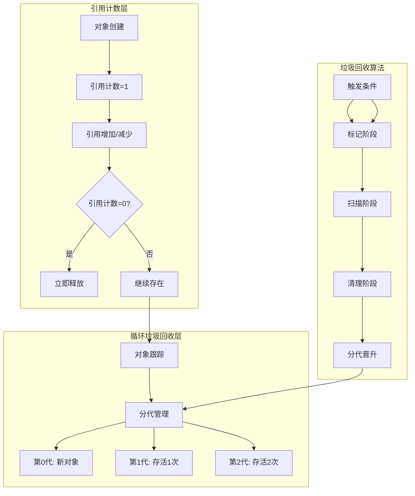
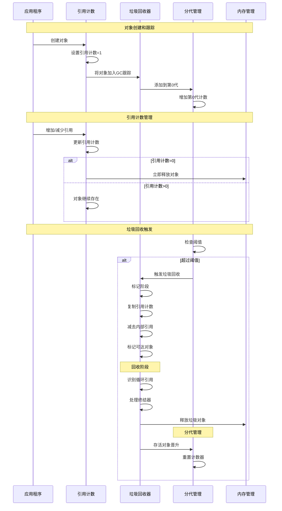

## 📋 概述

Python的垃圾回收系统是解决循环引用内存泄漏的关键机制。在引用计数的基础上，Python实现了分代垃圾回收器来检测和清理循环引用对象。本文档将深入分析CPython中垃圾回收系统的实现原理、分代策略、对象跟踪机制以及性能优化技术。

## 🎯 垃圾回收系统架构



## 1. 垃圾回收核心机制

### 1.1 GC状态和数据结构

```c
/* Python/gc.c - 垃圾回收核心数据结构 */

/* 分代数量 */
#define NUM_GENERATIONS 3

/* GC状态结构 */
typedef struct _gc_runtime_state {
    /* GC启用状态 */
    int enabled;

    /* 调试标志 */
    int debug;

    /* 分代信息 */
    struct gc_generation generations[NUM_GENERATIONS];

    /* 分代统计 */
    struct gc_generation_stats generation_stats[NUM_GENERATIONS];

    /* 冻结计数 */
    Py_ssize_t freeze_count;

    /* 不可回收对象列表 */
    PyObject *garbage;

    /* 回调函数列表 */
    PyObject *callbacks;
} GCState;

/* 分代结构 */
struct gc_generation {
    PyGC_Head head;         /* 对象链表头 */
    int threshold;          /* 触发回收的阈值 */
    int count;              /* 当前计数 */
};

/* 分代统计结构 */
struct gc_generation_stats {
    Py_ssize_t collections;     /* 回收次数 */
    Py_ssize_t collected;       /* 回收的对象数 */
    Py_ssize_t uncollectable;   /* 不可回收对象数 */
};

/* GC对象头结构 */
typedef union _gc_head {
    struct {
        union _gc_head *gc_next;    /* 下一个对象 */
        union _gc_head *gc_prev;    /* 前一个对象 */
        Py_ssize_t gc_refs;         /* GC引用计数 */
    } gc;
    double dummy;  /* 确保对齐 */
} PyGC_Head;

/* 获取GC状态 */
static GCState *
get_gc_state(PyInterpreterState *interp)
{
    return &interp->gc;
}

/* 初始化GC系统 */
void
_PyGC_Init(PyInterpreterState *interp)
{
    GCState *gcstate = &interp->gc;

    /* 设置默认阈值 */
    gcstate->generations[0].threshold = 700;   /* 第0代：700个分配触发 */
    gcstate->generations[1].threshold = 10;    /* 第1代：10次第0代回收触发 */
    gcstate->generations[2].threshold = 10;    /* 第2代：10次第1代回收触发 */

    /* 初始化分代链表 */
    for (int i = 0; i < NUM_GENERATIONS; i++) {
        PyGC_Head *gen = GEN_HEAD(gcstate, i);
        gen->gc.gc_next = gen;
        gen->gc.gc_prev = gen;
        gcstate->generations[i].count = 0;
    }

    /* 初始化其他字段 */
    gcstate->enabled = 1;       /* 默认启用GC */
    gcstate->debug = 0;         /* 默认无调试 */
    gcstate->freeze_count = 0;
    gcstate->garbage = PyList_New(0);
    gcstate->callbacks = PyList_New(0);
}

/* 对象GC跟踪 */
void
PyObject_GC_Track(void *op_raw)
{
    PyObject *op = _PyObject_CAST(op_raw);
    if (_PyObject_GC_IS_TRACKED(op)) {
        /* 对象已被跟踪 */
        return;
    }

    PyInterpreterState *interp = _PyInterpreterState_GET();
    GCState *gcstate = &interp->gc;

    /* 将对象添加到第0代 */
    PyGC_Head *gc = _Py_AS_GC(op);
    PyGC_Head *generation0 = GEN_HEAD(gcstate, 0);

    /* 链表插入操作 */
    PyGC_Head *last = generation0->gc.gc_prev;
    last->gc.gc_next = gc;
    gc->gc.gc_prev = last;
    gc->gc.gc_next = generation0;
    generation0->gc.gc_prev = gc;

    /* 增加第0代计数 */
    gcstate->generations[0].count++;

    /* 检查是否需要触发垃圾回收 */
    if (gcstate->enabled &&
        gcstate->generations[0].count > gcstate->generations[0].threshold &&
        gcstate->generations[0].threshold) {
        _PyGC_Collect(PyThreadState_GET(), 0, _Py_GC_REASON_HEAP);
    }
}

/* 停止对象GC跟踪 */
void
PyObject_GC_UnTrack(void *op_raw)
{
    PyObject *op = _PyObject_CAST(op_raw);
    if (!_PyObject_GC_IS_TRACKED(op)) {
        return;
    }

    /* 从链表中移除 */
    PyGC_Head *gc = _Py_AS_GC(op);
    PyGC_Head *prev = gc->gc.gc_prev;
    PyGC_Head *next = gc->gc.gc_next;

    prev->gc.gc_next = next;
    next->gc.gc_prev = prev;

    /* 标记为未跟踪 */
    gc->gc.gc_next = NULL;
}
```

### 1.2 循环引用检测算法

```c
/* 循环引用检测的核心算法 */

/* 标记-清除算法实现 */
static Py_ssize_t
gc_collect_main(PyThreadState *tstate, int generation, Py_ssize_t *n_collected,
                Py_ssize_t *n_uncollectable, int nofail)
{
    Py_ssize_t m = 0; /* 回收的对象数 */
    Py_ssize_t n = 0; /* 不可回收的对象数 */
    PyGC_Head *young; /* 年轻代链表 */
    PyGC_Head *old; /* 老年代链表 */
    PyGC_Head unreachable; /* 不可达对象链表 */
    PyGC_Head finalizers; /* 有析构函数的对象链表 */
    PyGC_Head *gc;

    GCState *gcstate = &tstate->interp->gc;

    /*

     * 第一阶段：标记阶段
     *
     * 算法思路：
     * 1. 复制所有对象的引用计数到gc_refs字段
     * 2. 遍历所有对象，对每个被引用的对象的gc_refs减1
     * 3. gc_refs > 0的对象可能不在循环中，从它们开始标记可达对象
     * 4. 未被标记的对象形成循环引用，可以回收
     */

    /* 收集所有要检查的代 */
    young = GEN_HEAD(gcstate, generation);
    if (generation < NUM_GENERATIONS-1) {
        old = GEN_HEAD(gcstate, generation+1);
    } else {
        old = young;
    }

    /* 将年轻代合并到老年代 */
    if (young != old) {
        gc_list_merge(young, old);
    }

    /* 第一步：复制引用计数 */
    update_refs(young);

    /* 第二步：减去内部引用 */
    subtract_refs(young);

    /* 第三步：标记可达对象 */
    gc_list_init(&unreachable);
    move_unreachable(young, &unreachable);

    /*
     * 第二阶段：终结器处理
     *
     * 有__del__方法的对象需要特殊处理，因为：
     * 1. 它们的析构顺序很重要
     * 2. 析构过程可能复活对象
     * 3. 需要避免析构函数中的异常
     */

    /* 移动有终结器的对象 */
    gc_list_init(&finalizers);
    move_legacy_finalizers(&unreachable, &finalizers);

    /* 移动有终结器的对象的可达对象 */
    move_legacy_finalizer_reachable(&finalizers);

    /*
     * 第三阶段：垃圾回收
     *
     * 1. 调用弱引用回调
     * 2. 调用终结器
     * 3. 删除对象
     */

    /* 处理弱引用 */
    m += handle_weakrefs(&unreachable, old);

    /* 调用终结器并删除对象 */
    m += handle_finalizers(&finalizers, old);

    /* 删除剩余的不可达对象 */
    m += delete_garbage(tstate, gcstate, &unreachable, old);

    /* 第四阶段：分代管理 */
    if (generation < NUM_GENERATIONS-1) {
        /* 存活的对象晋升到下一代 */
        gc_list_merge(old, GEN_HEAD(gcstate, generation+1));
    }

    /* 更新统计信息 */
    gcstate->generation_stats[generation].collections++;
    gcstate->generation_stats[generation].collected += m;
    gcstate->generation_stats[generation].uncollectable += n;

    if (n_collected) {
        *n_collected = m;
    }
    if (n_uncollectable) {
        *n_uncollectable = n;
    }

    return m;

}

/* 更新对象的gc_refs字段 */
static void
update_refs(PyGC_Head *containers)
{
    PyGC_Head *gc = GC_NEXT(containers);

    for (; gc != containers; gc = GC_NEXT(gc)) {
        /* 复制引用计数到gc_refs */
        gc->gc.gc_refs = Py_REFCNT(FROM_GC(gc));

        /* 确保gc_refs不为负数 */
        assert(gc->gc.gc_refs >= 0);
    }
}

/* 减去容器内部的引用 */
static void
subtract_refs(PyGC_Head *containers)
{
    traverseproc traverse;
    PyGC_Head *gc = GC_NEXT(containers);

    for (; gc != containers; gc = GC_NEXT(gc)) {
        PyObject *op = FROM_GC(gc);

        /* 获取对象的遍历函数 */
        traverse = Py_TYPE(op)->tp_traverse;
        if (traverse) {
            /* 遍历对象引用的所有对象，减少它们的gc_refs */
            (void) traverse(op, (visitproc)visit_decref, NULL);
        }
    }
}

/* 访问函数：减少被引用对象的gc_refs */
static int
visit_decref(PyObject *op, void *data)
{
    if (_PyObject_IS_GC(op)) {
        PyGC_Head *gc = AS_GC(op);

        /* 只有在同一次收集中的对象才减少引用 */
        if (gc->gc.gc_refs > 0) {
            gc->gc.gc_refs--;
        }
    }
    return 0;
}

/* 移动不可达对象 */
static void
move_unreachable(PyGC_Head *young, PyGC_Head *unreachable)
{
    PyGC_Head *gc = GC_NEXT(young);

    /*

     * 算法核心：
     * gc_refs > 0的对象不在循环中（有外部引用）
     * 从这些对象开始，标记所有可达的对象
     * 剩下的对象就是循环引用的垃圾对象
     */

    while (gc != young) {
        if (gc->gc.gc_refs) {
            /* 对象有外部引用，从它开始标记可达对象 */
            PyObject *op = FROM_GC(gc);
            traverseproc traverse = Py_TYPE(op)->tp_traverse;

            if (traverse) {
                (void) traverse(op, (visitproc)visit_reachable, (void *)young);
            }
            gc = GC_NEXT(gc);
        }
        else {
            /* 对象可能不可达，移动到unreachable链表 */
            PyGC_Head *next = GC_NEXT(gc);
            gc_list_move(gc, unreachable);
            gc = next;
        }
    }

}

/* 访问函数：标记可达对象 */
static int
visit_reachable(PyObject *op, PyGC_Head *reachable)
{
    if (!_PyObject_IS_GC(op)) {
        return 0;
    }

    PyGC_Head *gc = AS_GC(op);
    const Py_ssize_t gc_refs = gc->gc.gc_refs;

    if (gc_refs == 0) {
        /* 对象之前被认为不可达，现在发现可达 */
        gc->gc.gc_refs = 1;

        /* 递归标记这个对象引用的所有对象 */
        PyObject *op = FROM_GC(gc);
        traverseproc traverse = Py_TYPE(op)->tp_traverse;
        if (traverse) {
            (void) traverse(op, (visitproc)visit_reachable, (void *)reachable);
        }
    }
    else if (gc_refs == -1) {
        /* 对象在unreachable链表中，移回reachable */
        gc_set_refs(gc, 1);
        gc_list_move(gc, reachable);
    }

    return 0;
}
```

### 1.3 分代垃圾回收策略

```c
/* 分代垃圾回收的实现 */

/* 主要的垃圾回收函数 */
Py_ssize_t
_PyGC_Collect(PyThreadState *tstate, int generation, _PyGC_Reason reason)
{
    PyInterpreterState *interp = tstate->interp;
    GCState *gcstate = &interp->gc;

    if (!gcstate->enabled) {
        return 0;
    }

    /*

     * 分代回收策略：
     *
     * 第0代：包含最新创建的对象，回收频率最高
     * 第1代：经历过一次第0代回收的对象
     * 第2代：经历过一次第1代回收的对象，回收频率最低
     *
     * 假设：越老的对象越不可能成为垃圾（分代假设）
     */

    /* 确定要回收的代数 */
    int collecting_generation = generation;

    /* 如果指定代数为-1，则进行完整回收 */
    if (generation == -1) {
        collecting_generation = NUM_GENERATIONS - 1;
    }

    /* 检查是否应该收集更高的代 */
    for (int i = 0; i <= collecting_generation; i++) {
        if (gcstate->generations[i].count > gcstate->generations[i].threshold) {
            /* 当前代需要回收 */
            if (i == NUM_GENERATIONS - 1) {
                /* 最高代，收集所有代 */
                collecting_generation = i;
                break;
            }
            else {
                /* 检查下一代是否也需要回收 */
                continue;
            }
        }
    }

    /* 调试信息 */
    if (gcstate->debug & _PyGC_DEBUG_STATS) {
        PySys_WriteStderr("gc: collecting generation %d...\n", collecting_generation);
        PySys_WriteStderr("gc: objects in each generation:");
        for (int i = 0; i < NUM_GENERATIONS; i++) {
            PySys_WriteStderr(" %zd", gc_list_size(GEN_HEAD(gcstate, i)));
        }
        PySys_WriteStderr("\n");
    }

    /* 执行垃圾回收 */
    Py_ssize_t n_collected, n_uncollectable;
    Py_ssize_t result = gc_collect_main(tstate, collecting_generation,
                                       &n_collected, &n_uncollectable, 0);

    /* 重置被回收代的计数 */
    for (int i = 0; i <= collecting_generation; i++) {
        gcstate->generations[i].count = 0;
    }

    /* 如果回收了对象，增加上一代的计数 */
    if (n_collected > 0 && collecting_generation > 0) {
        gcstate->generations[collecting_generation - 1].count++;
    }

    /* 调试信息 */
    if (gcstate->debug & _PyGC_DEBUG_STATS) {
        PySys_WriteStderr("gc: done, %zd unreachable, %zd uncollectable\n",
                         n_collected, n_uncollectable);
    }

    /* 调用回调函数 */
    if (gcstate->callbacks != NULL) {
        invoke_gc_callback(tstate, "start", collecting_generation, n_collected, n_uncollectable);
    }

    return result;

}

/* 对象分代晋升 */
static void
move_to_next_generation(GCState *gcstate, int generation)
{
    /*

     * 晋升策略：
     *
     * 1. 第0代回收后，存活对象晋升到第1代
     * 2. 第1代回收后，存活对象晋升到第2代
     * 3. 第2代是最高代，存活对象留在第2代
     */

    if (generation < NUM_GENERATIONS - 1) {
        PyGC_Head *from_gen = GEN_HEAD(gcstate, generation);
        PyGC_Head *to_gen = GEN_HEAD(gcstate, generation + 1);

        /* 将当前代的所有对象移动到下一代 */
        gc_list_merge(from_gen, to_gen);
    }

}

/* 垃圾回收触发条件检查 */
static int
check_gc_trigger(GCState *gcstate)
{
    /*

     * 触发条件：
     *
     * 1. 第0代：新分配对象数 > threshold0
     * 2. 第1代：第0代回收次数 > threshold1
     * 3. 第2代：第1代回收次数 > threshold2
     */

    for (int i = 0; i < NUM_GENERATIONS; i++) {
        if (gcstate->generations[i].count > gcstate->generations[i].threshold) {
            return i;
        }
    }

    return -1; /* 不需要垃圾回收 */

}

/* 设置垃圾回收阈值 */
void
PyGC_SetThreshold(int threshold0, int threshold1, int threshold2)
{
    PyInterpreterState *interp = _PyInterpreterState_GET();
    GCState *gcstate = &interp->gc;

    gcstate->generations[0].threshold = threshold0;
    gcstate->generations[1].threshold = threshold1;
    gcstate->generations[2].threshold = threshold2;
}

/* 获取垃圾回收统计信息 */
PyObject *
_PyGC_GetStats(PyInterpreterState *interp)
{
    GCState *gcstate = &interp->gc;
    PyObject *result = PyList_New(0);

    for (int i = 0; i < NUM_GENERATIONS; i++) {
        struct gc_generation_stats *stats = &gcstate->generation_stats[i];

        PyObject *dict = Py_BuildValue(
            "{snsnsn}",
            "collections", stats->collections,
            "collected", stats->collected,
            "uncollectable", stats->uncollectable
        );

        if (dict == NULL) {
            Py_DECREF(result);
            return NULL;
        }

        if (PyList_Append(result, dict) < 0) {
            Py_DECREF(dict);
            Py_DECREF(result);
            return NULL;
        }

        Py_DECREF(dict);
    }

    return result;
}
```

## 2. 垃圾回收性能分析

### 2.1 垃圾回收监控与调优

```python
# 垃圾回收性能分析和优化
import gc
import sys
import time
import weakref
import tracemalloc
from typing import List, Dict, Any, Optional
from dataclasses import dataclass

@dataclass
class GCStats:
    """垃圾回收统计信息"""
    generation: int
    collections: int
    collected: int
    uncollectable: int

class GarbageCollectionAnalyzer:
    """垃圾回收分析器"""

    def __init__(self):
        self.initial_stats = gc.get_stats()
        self.test_objects = []
        self.gc_history = []

    def analyze_gc_behavior(self):
        """分析垃圾回收行为"""

        print("=== 垃圾回收行为分析 ===")

        # 获取当前GC设置
        print(f"GC状态: {'启用' if gc.isenabled() else '禁用'}")
        print(f"GC阈值: {gc.get_threshold()}")
        print(f"GC计数: {gc.get_count()}")

        # 获取当前统计信息
        stats = gc.get_stats()
        print(f"\nGC统计信息:")
        for i, stat in enumerate(stats):
            print(f"  第{i}代: 回收{stat['collections']}次, "
                  f"清理{stat['collected']}个对象, "
                  f"不可回收{stat['uncollectable']}个")

        # 分析对象跟踪情况
        all_objects = gc.get_objects()
        tracked_count = sum(1 for obj in all_objects if gc.is_tracked(obj))

        print(f"\n对象跟踪情况:")
        print(f"  总对象数: {len(all_objects):,}")
        print(f"  被跟踪对象: {tracked_count:,} ({tracked_count/len(all_objects)*100:.1f}%)")
        print(f"  未跟踪对象: {len(all_objects)-tracked_count:,}")

    def demonstrate_circular_references(self):
        """演示循环引用处理"""

        print(f"\n=== 循环引用处理演示 ===")

        # 记录初始状态
        initial_objects = len(gc.get_objects())
        initial_collections = gc.get_stats()[0]['collections']

        print(f"初始对象数: {initial_objects:,}")
        print(f"初始回收次数: {initial_collections}")

        # 创建循环引用
        class Node:
            def __init__(self, value):
                self.value = value
                self.children = []
                self.parent = None
                self.circular_ref = self  # 自循环引用

            def add_child(self, child):
                child.parent = self
                self.children.append(child)

            def __del__(self):
                # 析构函数可能会影响GC行为
                pass

        # 创建复杂的循环引用结构
        print(f"\n创建循环引用结构...")

        root_nodes = []
        for i in range(100):
            root = Node(f"root_{i}")

            # 创建子节点网络
            for j in range(10):
                child = Node(f"child_{i}_{j}")
                root.add_child(child)

                # 创建子节点间的交叉引用
                if j > 0:
                    child.children.append(root.children[j-1])
                    root.children[j-1].children.append(child)

            root_nodes.append(root)

        # 创建根节点间的引用
        for i in range(len(root_nodes)-1):
            root_nodes[i].children.append(root_nodes[i+1])
            root_nodes[i+1].parent = root_nodes[i]

        after_creation = len(gc.get_objects())
        print(f"创建后对象数: {after_creation:,} (增加 {after_creation-initial_objects:,})")

        # 删除显式引用
        del root_nodes

        # 检查GC前的状态
        before_gc = len(gc.get_objects())
        before_collections = gc.get_stats()[0]['collections']

        print(f"删除引用后对象数: {before_gc:,}")

        # 手动触发垃圾回收
        print(f"\n触发垃圾回收...")
        collected = gc.collect()

        # 检查GC后的状态
        after_gc = len(gc.get_objects())
        after_collections = gc.get_stats()[0]['collections']

        print(f"GC回收对象数: {collected}")
        print(f"GC后对象数: {after_gc:,} (减少 {before_gc-after_gc:,})")
        print(f"GC回收次数增加: {after_collections-before_collections}")

    def analyze_generational_behavior(self):
        """分析分代回收行为"""

        print(f"\n=== 分代回收行为分析 ===")

        # 监控分代回收过程
        class GCMonitor:
            def __init__(self):
                self.history = []
                self.callbacks_registered = False

            def gc_callback(self, phase, info):
                self.history.append({
                    'phase': phase,
                    'generation': info.get('generation', -1),
                    'collected': info.get('collected', 0),
                    'time': time.time()
                })
                print(f"  GC {phase}: 第{info.get('generation', '?')}代, "
                      f"回收{info.get('collected', 0)}个对象")

            def start_monitoring(self):
                if not self.callbacks_registered:
                    gc.callbacks.append(self.gc_callback)
                    self.callbacks_registered = True

            def stop_monitoring(self):
                if self.callbacks_registered:
                    try:
                        gc.callbacks.remove(self.gc_callback)
                        self.callbacks_registered = False
                    except ValueError:
                        pass

        monitor = GCMonitor()
        monitor.start_monitoring()

        try:
            # 记录初始统计
            initial_stats = [dict(stat) for stat in gc.get_stats()]

            # 测试第0代回收
            print("测试第0代回收 (短期对象):")
            temp_objects = []
            for i in range(1000):
                # 创建很快被丢弃的对象
                obj = {'id': i, 'data': list(range(10))}
                temp_objects.append(obj)
                if i % 100 == 0:
                    # 周期性地丢弃一些对象
                    temp_objects = temp_objects[-50:]

            del temp_objects
            gc.collect(0)  # 只回收第0代

            # 测试长期存活对象（会晋升到高代）
            print(f"\n测试对象晋升 (长期存活对象):")
            long_lived_objects = []
            for i in range(500):
                obj = {
                    'id': i,
                    'data': list(range(100)),
                    'timestamp': time.time()
                }
                long_lived_objects.append(obj)

            # 多次第0代回收，让对象晋升
            for i in range(5):
                # 创建一些临时对象触发GC
                temp = [list(range(100)) for _ in range(200)]
                del temp
                gc.collect(0)

            # 完整回收
            print(f"\n执行完整垃圾回收:")
            gc.collect()

            # 分析统计变化
            final_stats = [dict(stat) for stat in gc.get_stats()]

            print(f"\n分代统计变化:")
            for i in range(3):
                initial = initial_stats[i]
                final = final_stats[i]

                collections_diff = final['collections'] - initial['collections']
                collected_diff = final['collected'] - initial['collected']

                print(f"  第{i}代:")
                print(f"    回收次数增加: {collections_diff}")
                print(f"    回收对象增加: {collected_diff}")
                if collections_diff > 0:
                    print(f"    平均每次回收: {collected_diff/collections_diff:.1f}个对象")

        finally:
            monitor.stop_monitoring()

    def demonstrate_gc_optimization(self):
        """演示GC优化技术"""

        print(f"\n=== GC优化技术演示 ===")

        # 1. 弱引用优化
        print("1. 弱引用优化:")

        class CacheEntry:
            def __init__(self, key, value):
                self.key = key
                self.value = value
                self.references = []

        # 传统强引用缓存
        strong_cache = {}
        cache_entries = []

        for i in range(1000):
            entry = CacheEntry(f"key_{i}", f"value_{i}")
            strong_cache[f"key_{i}"] = entry
            cache_entries.append(entry)

            # 创建交叉引用
            if i > 0:
                entry.references.append(cache_entries[i-1])
                cache_entries[i-1].references.append(entry)

        strong_objects_before = len(gc.get_objects())

        # 弱引用缓存
        weak_cache = weakref.WeakValueDictionary()

        class WeakCacheEntry:
            def __init__(self, key, value):
                self.key = key
                self.value = value
                self.references = weakref.WeakSet()

        weak_entries = []
        for i in range(1000):
            entry = WeakCacheEntry(f"key_{i}", f"value_{i}")
            weak_cache[f"key_{i}"] = entry
            weak_entries.append(entry)

            # 使用弱引用
            if i > 0:
                entry.references.add(weak_entries[i-1])
                weak_entries[i-1].references.add(entry)

        weak_objects_after = len(gc.get_objects())

        print(f"  强引用缓存对象数: {strong_objects_before:,}")
        print(f"  弱引用缓存对象数: {weak_objects_after:,}")

        # 删除引用，观察回收效果
        del strong_cache, cache_entries
        collected_strong = gc.collect()

        del weak_cache, weak_entries
        collected_weak = gc.collect()

        print(f"  强引用回收: {collected_strong}个对象")
        print(f"  弱引用回收: {collected_weak}个对象")

        # 2. 对象池优化
        print(f"\n2. 对象池优化:")

        class ObjectPool:
            def __init__(self, factory, max_size=100):
                self.factory = factory
                self.pool = []
                self.max_size = max_size
                self.created = 0
                self.reused = 0

            def acquire(self):
                if self.pool:
                    self.reused += 1
                    return self.pool.pop()
                else:
                    self.created += 1
                    return self.factory()

            def release(self, obj):
                if len(self.pool) < self.max_size:
                    # 重置对象状态
                    if hasattr(obj, 'reset'):
                        obj.reset()
                    self.pool.append(obj)

            def get_stats(self):
                return {
                    'created': self.created,
                    'reused': self.reused,
                    'pool_size': len(self.pool)
                }

        class PooledObject:
            def __init__(self):
                self.data = [0] * 100
                self.active = True

            def reset(self):
                self.data = [0] * 100
                self.active = True

            def use(self):
                for i in range(len(self.data)):
                    self.data[i] = i
                self.active = False

        # 测试无池化
        start_objects = len(gc.get_objects())
        start_time = time.time()

        for i in range(1000):
            obj = PooledObject()
            obj.use()
            # 对象立即被丢弃

        no_pool_time = time.time() - start_time
        no_pool_objects = len(gc.get_objects())
        gc.collect()

        # 测试对象池
        pool = ObjectPool(PooledObject, max_size=50)
        pool_start_time = time.time()

        for i in range(1000):
            obj = pool.acquire()
            obj.use()
            pool.release(obj)

        pool_time = time.time() - pool_start_time
        pool_stats = pool.get_stats()

        print(f"  无池化:")
        print(f"    时间: {no_pool_time:.4f}s")
        print(f"    对象增加: {no_pool_objects - start_objects}")
        print(f"  对象池:")
        print(f"    时间: {pool_time:.4f}s")
        print(f"    创建对象: {pool_stats['created']}")
        print(f"    重用对象: {pool_stats['reused']}")
        print(f"    池大小: {pool_stats['pool_size']}")
        print(f"    性能提升: {no_pool_time/pool_time:.1f}x")

    def analyze_gc_impact_on_performance(self):
        """分析GC对性能的影响"""

        print(f"\n=== GC性能影响分析 ===")

        # 测试GC启用vs禁用的性能差异
        def performance_test():
            """执行性能测试"""
            objects = []
            for i in range(10000):
                obj = {
                    'id': i,
                    'data': list(range(50)),
                    'refs': []
                }
                # 创建一些引用
                if objects:
                    obj['refs'].append(objects[-1])
                    objects[-1]['refs'].append(obj)

                objects.append(obj)

                # 周期性清理
                if i % 1000 == 0:
                    objects = objects[-500:]

            return len(objects)

        # 启用GC的测试
        gc.enable()
        gc_enabled_start = time.time()
        result1 = performance_test()
        gc_enabled_time = time.time() - gc_enabled_start
        gc_enabled_collections = gc.get_stats()[0]['collections']

        # 禁用GC的测试
        gc.disable()
        gc_disabled_start = time.time()
        result2 = performance_test()
        gc_disabled_time = time.time() - gc_disabled_start

        # 手动回收
        gc.enable()
        manual_collected = gc.collect()

        print(f"GC性能对比:")
        print(f"  启用GC:")
        print(f"    执行时间: {gc_enabled_time:.4f}s")
        print(f"    自动回收次数: {gc_enabled_collections}")
        print(f"  禁用GC:")
        print(f"    执行时间: {gc_disabled_time:.4f}s")
        print(f"    手动回收对象: {manual_collected}")
        print(f"  GC开销: {(gc_enabled_time/gc_disabled_time-1)*100:.1f}%")

        # 测试不同GC阈值的影响
        print(f"\nGC阈值影响测试:")

        original_threshold = gc.get_threshold()
        test_thresholds = [
            (100, 5, 5),    # 频繁回收
            (700, 10, 10),  # 默认设置
            (2000, 20, 20)  # 较少回收
        ]

        for threshold in test_thresholds:
            gc.set_threshold(*threshold)
            gc.collect()  # 清理之前的状态

            start_time = time.time()
            start_stats = [dict(stat) for stat in gc.get_stats()]

            # 执行测试
            performance_test()

            end_time = time.time()
            end_stats = [dict(stat) for stat in gc.get_stats()]

            total_collections = sum(
                end_stats[i]['collections'] - start_stats[i]['collections']
                for i in range(3)
            )

            print(f"  阈值{threshold}: {end_time-start_time:.4f}s, "
                  f"{total_collections}次回收")

        # 恢复原始阈值
        gc.set_threshold(*original_threshold)

    def run_analysis(self):
        """运行完整的垃圾回收分析"""

        print("Python垃圾回收深度分析\n")

        self.analyze_gc_behavior()
        self.demonstrate_circular_references()
        self.analyze_generational_behavior()
        self.demonstrate_gc_optimization()
        self.analyze_gc_impact_on_performance()

        print(f"\n{'='*50}")
        print("垃圾回收分析完成")
        print(f"{'='*50}")

# 运行垃圾回收分析
if __name__ == "__main__":
    analyzer = GarbageCollectionAnalyzer()
    analyzer.run_analysis()
```

## 3. 垃圾回收时序图



## 4. 总结

Python的垃圾回收系统展现了精密的内存管理设计：

### 4.1 核心机制

1. **双重策略**: 引用计数 + 循环垃圾回收
2. **分代假设**: 年轻对象更容易成为垃圾
3. **标记-清除**: 检测和清理循环引用
4. **增量回收**: 减少回收暂停时间

### 4.2 设计优势

1. **高效性**: 大部分对象通过引用计数立即回收
2. **完整性**: 循环引用也能被正确处理
3. **可控性**: 可调节的阈值和分代策略
4. **调试性**: 丰富的调试和监控接口

### 4.3 性能特征

1. **时间开销**: 通常占总执行时间的1-5%
2. **空间开销**: 每个跟踪对象增加一个GC头
3. **暂停时间**: 分代策略减少长时间暂停
4. **触发频率**: 可通过阈值调节

### 4.4 优化建议

1. **减少循环引用**: 使用弱引用打破循环
2. **对象池**: 重用频繁创建的对象
3. **分代调优**: 根据应用特征调整阈值
4. **监控工具**: 使用gc模块监控回收情况

### 4.5 应用指导

1. **理解机制**: 知道何时会触发垃圾回收
2. **避免陷阱**: 注意循环引用和终结器的影响
3. **性能分析**: 使用工具分析GC对性能的影响
4. **内存优化**: 结合引用计数和GC特性优化内存使用

Python的垃圾回收系统为自动内存管理提供了强大而灵活的解决方案，理解其工作原理对于编写高性能Python程序至关重要。
