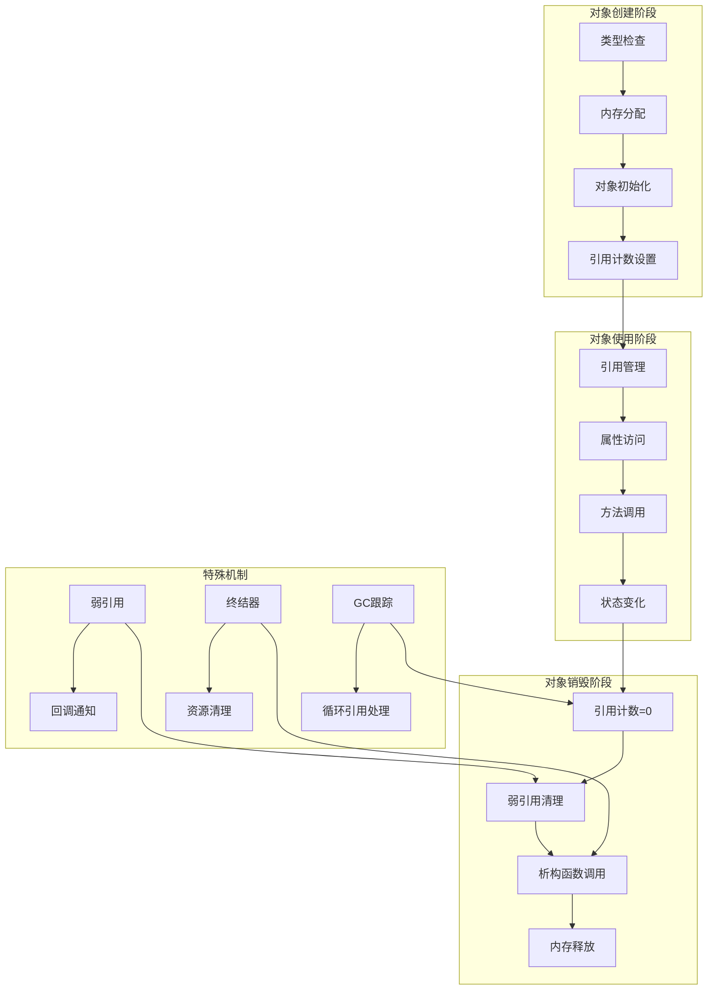

## 📋 概述

Python对象的生命周期管理是CPython解释器的核心功能，涉及对象创建、初始化、使用、销毁的完整过程。本文档将深入分析对象生命周期的各个阶段、弱引用机制、析构函数调用、以及生命周期相关的优化技术。

## 🎯 对象生命周期架构



## 1. 对象创建与初始化

### 1.1 对象创建流程

```c
/* Objects/object.c - 对象创建的核心流程 */

/* 通用对象创建函数 */
PyObject *
_PyObject_New(PyTypeObject *tp)
{
    PyObject *op;

    /* 检查类型对象的有效性 */
    assert(tp != NULL);
    assert(PyType_Check(tp));
    assert(tp->tp_basicsize >= sizeof(PyObject));

    /* 分配内存 */
    if (_PyType_IS_GC(tp)) {
        /* 需要垃圾回收跟踪的对象 */
        op = _PyObject_GC_Malloc(_PyObject_SIZE(tp));
        if (op == NULL) {
            return NULL;
        }
    } else {
        /* 普通对象 */
        op = (PyObject *)PyObject_Malloc(_PyObject_SIZE(tp));
        if (op == NULL) {
            return PyErr_NoMemory();
        }
    }

    /* 初始化对象头 */
    _PyObject_Init(op, tp);

    /* 如果需要GC跟踪，启动跟踪 */
    if (_PyType_IS_GC(tp)) {
        _PyObject_GC_TRACK(op);
    }

    return op;
}

/* 对象初始化函数 */
void
_PyObject_Init(PyObject *op, PyTypeObject *tp)
{
    assert(op != NULL);
    assert(tp != NULL);

    /* 设置类型指针 */
    Py_SET_TYPE(op, tp);

    /* 初始化引用计数 */
#ifdef Py_GIL_DISABLED
    /* 无GIL模式下的原子初始化 */
    _PyObject_InitReferenceCount(op);
#else
    /* 标准模式 */
    Py_SET_REFCNT(op, 1);
#endif

    /* 增加类型对象的引用计数 */
    if (_PyType_HasFeature(tp, Py_TPFLAGS_HEAPTYPE)) {
        Py_INCREF(tp);
    }

#ifdef Py_TRACE_REFS
    /* 调试模式：添加到对象跟踪链表 */
    _Py_AddToAllObjects(op, 1);
#endif
}

/* 可变长对象创建 */
PyVarObject *
_PyObject_NewVar(PyTypeObject *tp, Py_ssize_t nitems)
{
    PyVarObject *op;
    const size_t size = _PyObject_VAR_SIZE(tp, nitems);

    /* 检查大小溢出 */
    if (size == (size_t)-1) {
        return (PyVarObject *)PyErr_NoMemory();
    }

    /* 分配内存 */
    if (_PyType_IS_GC(tp)) {
        op = (PyVarObject *)_PyObject_GC_Malloc(size);
        if (op == NULL) {
            return NULL;
        }
    } else {
        op = (PyVarObject *)PyObject_Malloc(size);
        if (op == NULL) {
            return (PyVarObject *)PyErr_NoMemory();
        }
    }

    /* 初始化可变对象 */
    _PyObject_InitVar(op, tp, nitems);

    if (_PyType_IS_GC(tp)) {
        _PyObject_GC_TRACK(op);
    }

    return op;
}

/* 可变对象初始化 */
void
_PyObject_InitVar(PyVarObject *op, PyTypeObject *tp, Py_ssize_t size)
{
    assert(op != NULL);
    assert(tp != NULL);

    /* 设置大小 */
    Py_SET_SIZE(op, size);

    /* 调用基础初始化 */
    _PyObject_Init((PyObject *)op, tp);
}

/* 高级对象创建（带初始化参数） */
PyObject *
PyObject_CallFunction(PyObject *callable, const char *format, ...)
{
    va_list va;
    PyObject *args;
    PyObject *result;

    if (callable == NULL) {
        return PyErr_BadInternalCall();
    }

    if (format && *format) {
        /* 构建参数元组 */
        va_start(va, format);
        args = Py_VaBuildValue(format, va);
        va_end(va);
        if (args == NULL) {
            return NULL;
        }
    } else {
        args = PyTuple_New(0);
        if (args == NULL) {
            return NULL;
        }
    }

    /* 调用对象 */
    result = PyObject_Call(callable, args, NULL);
    Py_DECREF(args);

    return result;
}
```

### 1.2 类型特定的创建流程

```c
/* 不同类型对象的特定创建流程 */

/* 列表对象创建 */
PyObject *
PyList_New(Py_ssize_t size)
{
    PyListObject *op;

    if (size < 0) {
        PyErr_BadInternalCall();
        return NULL;
    }

    /* 从空闲列表获取或创建新对象 */
    op = _Py_FREELIST_POP(PyListObject, lists);
    if (op == NULL) {
        op = PyObject_GC_New(PyListObject, &PyList_Type);
        if (op == NULL) {
            return NULL;
        }
    }

    /* 初始化列表特定字段 */
    if (size <= 0) {
        op->ob_item = NULL;
    } else {
        op->ob_item = (PyObject **)PyMem_Calloc(size, sizeof(PyObject *));
        if (op->ob_item == NULL) {
            Py_DECREF(op);
            return PyErr_NoMemory();
        }
    }

    Py_SET_SIZE(op, size);
    op->allocated = size;

    /* 开始GC跟踪 */
    _PyObject_GC_TRACK(op);
    return (PyObject *)op;
}

/* 字典对象创建 */
PyObject *
PyDict_New(void)
{
    PyDictObject *mp;

    /* 从空闲列表获取或创建新对象 */
    mp = _Py_FREELIST_POP(PyDictObject, dicts);
    if (mp == NULL) {
        mp = PyObject_GC_New(PyDictObject, &PyDict_Type);
        if (mp == NULL) {
            return NULL;
        }
    }

    /* 使用空键表初始化 */
    mp->ma_keys = Py_EMPTY_KEYS;
    mp->ma_values = NULL;
    mp->ma_used = 0;
    mp->_ma_watcher_tag = 0;

    /* GC跟踪 */
    _PyObject_GC_TRACK(mp);
    return (PyObject *)mp;
}

/* 自定义类实例创建 */
PyObject *
_PyObject_MakeTpCall(PyThreadState *tstate, PyObject *callable,
                    PyObject *const *args, Py_ssize_t nargs,
                    PyObject *keywords)
{
    /* 获取类型对象 */
    assert(PyType_Check(callable));
    PyTypeObject *type = (PyTypeObject *)callable;

    /* 检查类型是否可调用 */
    if (type->tp_new == NULL) {
        PyErr_Format(PyExc_TypeError,
                    "cannot create '%.100s' instances",
                    type->tp_name);
        return NULL;
    }

    /* 调用tp_new创建对象 */
    PyObject *obj = type->tp_new(type, NULL, NULL);
    if (obj == NULL) {
        return NULL;
    }

    /* 如果有tp_init，调用初始化方法 */
    if (type->tp_init != NULL) {
        if (type->tp_init(obj, NULL, NULL) < 0) {
            Py_DECREF(obj);
            return NULL;
        }
    }

    return obj;
}
```

## 2. 引用计数管理

### 2.1 引用计数操作

```c
/* Include/object.h - 引用计数管理 */

/* 增加引用计数 */
static inline void _Py_INCREF(PyObject *op)
{
#ifdef Py_REF_DEBUG
    _Py_RefTotal++;
#endif

#ifdef Py_GIL_DISABLED
    /* 无GIL模式：使用原子操作 */
    uint32_t local = _Py_atomic_load_uint32_relaxed(&op->ob_refcnt_split[1]);
    uint32_t new_local = local + 1;
    if (new_local == 0) {
        /* 溢出处理 */
        _Py_incref_overflow();
    }
    _Py_atomic_store_uint32_relaxed(&op->ob_refcnt_split[1], new_local);
#else
    /* 标准模式：直接增加 */
    op->ob_refcnt++;
#endif
}

/* 减少引用计数 */
static inline void _Py_DECREF(PyObject *op)
{
#ifdef Py_REF_DEBUG
    _Py_RefTotal--;
#endif

#ifdef Py_GIL_DISABLED
    /* 无GIL模式：原子减少 */
    uint32_t local = _Py_atomic_load_uint32_relaxed(&op->ob_refcnt_split[1]);
    if (local == 0) {
        /* 需要检查共享引用计数 */
        if (_Py_decref_shared(op)) {
            return; /* 对象被其他线程回收 */
        }
    } else {
        _Py_atomic_store_uint32_relaxed(&op->ob_refcnt_split[1], local - 1);
        if (local > 1) {
            return; /* 引用计数仍大于0 */
        }
    }

    /* 引用计数归零，销毁对象 */
    _Py_Dealloc(op);
#else
    /* 标准模式 */
    if (--op->ob_refcnt == 0) {
        _Py_Dealloc(op);
    }
#endif
}

/* 安全的引用计数减少（检查NULL） */
static inline void _Py_XDECREF(PyObject *op)
{
    if (op != NULL) {
        _Py_DECREF(op);
    }
}

/* 条件引用计数增加 */
static inline void _Py_XINCREF(PyObject *op)
{
    if (op != NULL) {
        _Py_INCREF(op);
    }
}

/* 引用计数调试 */
#ifdef Py_REF_DEBUG
extern Py_ssize_t _Py_RefTotal;

static inline void _Py_INC_REFTOTAL(void)
{
    _Py_RefTotal++;
}

static inline void _Py_DEC_REFTOTAL(void)
{
    _Py_RefTotal--;
}

/* 获取总引用计数 */
Py_ssize_t
_Py_GetRefTotal(void)
{
    return _Py_RefTotal;
}
#endif /* Py_REF_DEBUG */
```

### 2.2 引用计数的边界情况处理

```c
/* 引用计数的特殊情况处理 */

/* 永生对象的引用计数管理 */
static inline void
_Py_SET_REFCNT_IMMORTAL(PyObject *op)
{
    /*
     * 永生对象（如None, True, False）使用特殊的引用计数值
     * 这些对象永远不会被销毁
     */
#ifdef Py_GIL_DISABLED
    op->ob_refcnt_split[0] = _Py_IMMORTAL_REFCNT_HIGH;
    op->ob_refcnt_split[1] = _Py_IMMORTAL_REFCNT_LOW;
#else
    op->ob_refcnt = _Py_IMMORTAL_REFCNT;
#endif
}

/* 检查对象是否为永生对象 */
static inline int
_Py_IS_IMMORTAL(PyObject *op)
{
#ifdef Py_GIL_DISABLED
    return op->ob_refcnt_split[0] == _Py_IMMORTAL_REFCNT_HIGH;
#else
    return op->ob_refcnt == _Py_IMMORTAL_REFCNT;
#endif
}

/* 循环引用中的引用计数处理 */
static void
_PyObject_GC_TRACK_impl(const char *filename, int lineno, PyObject *op)
{
    PyGC_Head *gc = _Py_AS_GC(op);

    /* 确保对象未被跟踪 */
    assert(!_PyObject_GC_IS_TRACKED(op));

    /* 将对象添加到GC跟踪链表 */
    PyInterpreterState *interp = _PyInterpreterState_GET();
    GCState *gcstate = &interp->gc;
    PyGC_Head *generation0 = GEN_HEAD(gcstate, 0);

    PyGC_Head *last = generation0->gc.gc_prev;
    last->gc.gc_next = gc;
    gc->gc.gc_prev = last;
    gc->gc.gc_next = generation0;
    generation0->gc.gc_prev = gc;

    /* 检查是否需要触发垃圾回收 */
    gcstate->generations[0].count++;
    if (gcstate->enabled &&
        gcstate->generations[0].count > gcstate->generations[0].threshold &&
        gcstate->generations[0].threshold &&
        !gcstate->collecting) {

        gcstate->collecting = 1;
        _PyGC_Collect(_PyThreadState_GET(), 0, _Py_GC_REASON_HEAP);
        gcstate->collecting = 0;
    }
}
```

## 3. 弱引用机制

### 3.1 弱引用实现

```c
/* Objects/weakrefobject.c - 弱引用机制实现 */

/* 弱引用对象结构 */
typedef struct _PyWeakReference PyWeakReference;

struct _PyWeakReference {
    PyObject_HEAD

    /* 被引用的对象 */
    PyObject *wr_object;

    /* 回调函数 */
    PyObject *wr_callback;

    /* 哈希值缓存 */
    Py_hash_t hash;

    /* 弱引用链表指针 */
    PyWeakReference *wr_prev;
    PyWeakReference *wr_next;
};

/* 创建弱引用 */
PyObject *
PyWeakref_NewRef(PyObject *ob, PyObject *callback)
{
    PyWeakReference *result;

    /* 检查对象是否支持弱引用 */
    if (!PyType_SUPPORTS_WEAKREFS(Py_TYPE(ob))) {
        PyErr_Format(PyExc_TypeError,
                    "cannot create weak reference to '%.100s' object",
                    Py_TYPE(ob)->tp_name);
        return NULL;
    }

    /* 检查是否已有相同的弱引用 */
    PyWeakReference **list = GET_WEAKREFS_LISTPTR(ob);
    if (*list != NULL) {
        /* 查找现有的弱引用 */
        PyWeakReference *ref = *list;
        while (ref != NULL) {
            if (ref->wr_callback == callback) {
                /* 找到相同的弱引用，返回新引用 */
                Py_INCREF(ref);
                return (PyObject *)ref;
            }
            ref = ref->wr_next;
        }
    }

    /* 创建新的弱引用对象 */
    result = PyObject_GC_New(PyWeakReference, &_PyWeakref_RefType);
    if (result == NULL) {
        return NULL;
    }

    /* 初始化弱引用 */
    result->wr_object = ob;
    result->wr_callback = callback;
    result->hash = -1;
    result->wr_prev = NULL;
    result->wr_next = *list;

    /* 增加回调函数的引用 */
    Py_XINCREF(callback);

    /* 将弱引用添加到对象的弱引用链表 */
    if (*list != NULL) {
        (*list)->wr_prev = result;
    }
    *list = result;

    /* 开始GC跟踪 */
    _PyObject_GC_TRACK(result);

    return (PyObject *)result;
}

/* 弱引用回调处理 */
static void
handle_callback(PyWeakReference *ref, PyObject *callback)
{
    PyObject *cbresult;

    /* 调用回调函数 */
    cbresult = PyObject_CallOneArg(callback, (PyObject *)ref);
    if (cbresult == NULL) {
        /* 回调函数出错，写入stderr */
        PyErr_WriteUnraisable(callback);
    } else {
        Py_DECREF(cbresult);
    }
}

/* 清理对象的所有弱引用 */
void
PyObject_ClearWeakRefs(PyObject *object)
{
    PyWeakReference **list;

    if (!PyType_SUPPORTS_WEAKREFS(Py_TYPE(object))) {
        return;
    }

    list = GET_WEAKREFS_LISTPTR(object);
    if (*list != NULL) {
        PyWeakReference *current = *list;

        /* 清空弱引用链表指针，防止递归 */
        *list = NULL;

        /* 处理每个弱引用 */
        do {
            PyWeakReference *next = current->wr_next;

            /* 清除弱引用的目标对象 */
            current->wr_object = Py_None;

            /* 如果有回调函数，调用它 */
            if (current->wr_callback != NULL) {
                handle_callback(current, current->wr_callback);

                /* 清除回调函数引用 */
                Py_CLEAR(current->wr_callback);
            }

            current = next;
        } while (current != NULL);
    }
}

/* 弱引用代理对象 */
typedef struct {
    PyObject_HEAD
    PyObject *proxy_object;     /* 被代理的对象 */
    PyWeakReference *proxy_ref; /* 对应的弱引用 */
} PyWeakProxyObject;

/* 创建弱引用代理 */
PyObject *
PyWeakref_NewProxy(PyObject *ob, PyObject *callback)
{
    PyWeakProxyObject *result;

    /* 检查对象类型 */
    if (!PyType_SUPPORTS_WEAKREFS(Py_TYPE(ob))) {
        PyErr_Format(PyExc_TypeError,
                    "cannot create weak reference to '%.100s' object",
                    Py_TYPE(ob)->tp_name);
        return NULL;
    }

    /* 创建代理对象 */
    if (PyCallable_Check(ob)) {
        result = PyObject_GC_New(PyWeakProxyObject, &_PyWeakref_CallableProxyType);
    } else {
        result = PyObject_GC_New(PyWeakProxyObject, &_PyWeakref_ProxyType);
    }

    if (result == NULL) {
        return NULL;
    }

    /* 创建对应的弱引用 */
    result->proxy_ref = (PyWeakReference *)PyWeakref_NewRef(ob, callback);
    if (result->proxy_ref == NULL) {
        Py_DECREF(result);
        return NULL;
    }

    result->proxy_object = ob;

    _PyObject_GC_TRACK(result);
    return (PyObject *)result;
}
```

## 4. 对象销毁与析构

### 4.1 对象销毁流程

```c
/* Objects/object.c - 对象销毁流程 */

/* 主要的对象销毁函数 */
void
_Py_Dealloc(PyObject *op)
{
    destructor dealloc = Py_TYPE(op)->tp_dealloc;

#ifdef Py_TRACE_REFS
    /* 调试模式：从跟踪链表移除 */
    _Py_ForgetReference(op);
#endif

#ifdef Py_GIL_DISABLED
    /* 无GIL模式：确保对象未被其他线程访问 */
    _PyObject_ASSERT_FAILED_MSG(op, "object deallocated while still referenced");
#endif

    /* 调用类型特定的析构函数 */
    (*dealloc)(op);
}

/* 通用对象析构函数 */
void
PyObject_Del(void *op)
{
    if (_PyObject_IS_GC(op)) {
        /* GC对象的释放 */
        PyObject_GC_Del(op);
    } else {
        /* 普通对象的释放 */
        PyObject_Free(op);
    }
}

/* GC对象的析构 */
void
PyObject_GC_Del(void *op)
{
    PyGC_Head *g = AS_GC(op);

    /* 如果对象被GC跟踪，停止跟踪 */
    if (_PyObject_GC_IS_TRACKED(op)) {
        _PyObject_GC_UNTRACK(op);
    }

    /* 释放内存 */
    PyObject_Free(g);
}

/* 具有终结器的对象销毁 */
static void
subtype_dealloc(PyObject *self)
{
    PyTypeObject *type, *base;
    destructor basedealloc;
    int has_finalizer;

    /* 获取对象类型 */
    type = Py_TYPE(self);

    /* 检查是否有终结器 */
    has_finalizer = type->tp_finalize != NULL || type->tp_del != NULL;

    if (has_finalizer) {
        /* 如果对象正在终结过程中，避免递归 */
        if (_PyObject_GC_IS_FINALIZED(self)) {
            return;
        }

        /* 标记对象为正在终结 */
        _PyObject_GC_SET_FINALIZED(self);

        /* 调用终结器 */
        if (type->tp_finalize != NULL) {
            type->tp_finalize(self);
        }

        /* 检查对象是否被复活 */
        if (Py_REFCNT(self) > 0) {
            /* 对象被复活，停止销毁过程 */
            return;
        }
    }

    /* 清理弱引用 */
    if (type->tp_weaklistoffset) {
        PyObject_ClearWeakRefs(self);
    }

    /* 清理对象字典 */
    if (type->tp_dictoffset) {
        PyObject **dictptr = _PyObject_GetDictPtr(self);
        if (dictptr != NULL) {
            PyObject *dict = *dictptr;
            if (dict != NULL) {
                Py_DECREF(dict);
                *dictptr = NULL;
            }
        }
    }

    /* 调用基类的析构函数 */
    base = type->tp_base;
    if (base) {
        basedealloc = base->tp_dealloc;
        assert(basedealloc);
        basedealloc(self);
    }
}
```

### 4.2 终结器和资源清理

```c
/* 终结器机制的实现 */

/* 调用对象的终结器 */
int
PyObject_CallFinalizerFromDealloc(PyObject *self)
{
    if (PyObject_CallFinalizer(self) < 0) {
        /* 终结器调用失败 */
        PyErr_WriteUnraisable(self);
        return -1;
    }
    return 0;
}

/* 终结器调用的核心实现 */
int
PyObject_CallFinalizer(PyObject *self)
{
    PyTypeObject *type = Py_TYPE(self);

    /* 检查对象是否已被终结 */
    if (_PyObject_GC_IS_FINALIZED(self)) {
        return 0;
    }

    /* 标记对象为已终结 */
    _PyObject_GC_SET_FINALIZED(self);

    /* 调用tp_finalize */
    if (type->tp_finalize != NULL) {
        type->tp_finalize(self);

        /* 检查是否有未处理的异常 */
        if (PyErr_Occurred()) {
            return -1;
        }
    }

    return 0;
}

/* 传统的__del__方法支持 */
static void
call_tp_del(PyObject *self)
{
    PyTypeObject *type = Py_TYPE(self);

    if (type->tp_del != NULL) {
        /* 增加引用计数，防止在__del__中被销毁 */
        Py_INCREF(self);

        /* 调用__del__方法 */
        type->tp_del(self);

        /* 减少引用计数 */
        Py_DECREF(self);

        /* 如果有异常，写入stderr */
        if (PyErr_Occurred()) {
            PyErr_WriteUnraisable(self);
        }
    }
}

/* 资源管理的上下文管理器 */
typedef struct {
    PyObject_HEAD
    PyObject *resource;     /* 管理的资源 */
    PyObject *cleanup_func; /* 清理函数 */
    int entered;            /* 是否已进入上下文 */
} ResourceManagerObject;

static PyObject *
resource_manager_enter(ResourceManagerObject *self, PyObject *args)
{
    if (self->entered) {
        PyErr_SetString(PyExc_RuntimeError, "Already entered context");
        return NULL;
    }

    self->entered = 1;
    Py_INCREF(self->resource);
    return self->resource;
}

static PyObject *
resource_manager_exit(ResourceManagerObject *self, PyObject *args)
{
    if (!self->entered) {
        PyErr_SetString(PyExc_RuntimeError, "Not in context");
        return NULL;
    }

    self->entered = 0;

    /* 调用清理函数 */
    if (self->cleanup_func != NULL) {
        PyObject *result = PyObject_CallOneArg(self->cleanup_func, self->resource);
        if (result == NULL) {
            return NULL;
        }
        Py_DECREF(result);
    }

    Py_CLEAR(self->resource);
    Py_RETURN_NONE;
}

/* 资源管理器的析构函数 */
static void
resource_manager_dealloc(ResourceManagerObject *self)
{
    /* 确保资源被清理 */
    if (self->entered && self->resource != NULL) {
        /* 在析构时强制清理资源 */
        if (self->cleanup_func != NULL) {
            PyObject *result = PyObject_CallOneArg(self->cleanup_func, self->resource);
            Py_XDECREF(result);

            /* 忽略清理过程中的异常 */
            PyErr_Clear();
        }
    }

    Py_XDECREF(self->resource);
    Py_XDECREF(self->cleanup_func);

    Py_TYPE(self)->tp_free((PyObject *)self);
}
```

## 5. 生命周期管理实践

### 5.1 生命周期监控与调试

```python
# 对象生命周期管理实践与分析
import gc
import sys
import weakref
import traceback
from typing import Any, Dict, List, Optional, Callable
import time

class LifecycleManager:
    """对象生命周期管理器"""

    def __init__(self):
        self.tracked_objects = weakref.WeakSet()
        self.creation_history = []
        self.destruction_callbacks = {}
        self.lifecycle_stats = {
            'created': 0,
            'destroyed': 0,
            'max_alive': 0,
            'current_alive': 0
        }

    def track_object(self, obj: Any, metadata: Optional[Dict] = None) -> None:
        """跟踪对象生命周期"""

        # 记录创建信息
        creation_info = {
            'object_id': id(obj),
            'type': type(obj).__name__,
            'creation_time': time.time(),
            'creation_stack': traceback.extract_stack(),
            'metadata': metadata or {}
        }

        self.creation_history.append(creation_info)
        self.lifecycle_stats['created'] += 1
        self.lifecycle_stats['current_alive'] += 1

        if self.lifecycle_stats['current_alive'] > self.lifecycle_stats['max_alive']:
            self.lifecycle_stats['max_alive'] = self.lifecycle_stats['current_alive']

        # 添加到跟踪集合
        self.tracked_objects.add(obj)

        # 设置销毁回调
        def destruction_callback(ref):
            self.lifecycle_stats['destroyed'] += 1
            self.lifecycle_stats['current_alive'] -= 1

            # 记录销毁信息
            if id(obj) in self.destruction_callbacks:
                callback_info = self.destruction_callbacks.pop(id(obj))
                print(f"对象销毁: {callback_info['type']} (id={callback_info['object_id']})")

        weak_ref = weakref.ref(obj, destruction_callback)
        self.destruction_callbacks[id(obj)] = {
            'object_id': id(obj),
            'type': type(obj).__name__,
            'weak_ref': weak_ref
        }

    def get_stats(self) -> Dict[str, Any]:
        """获取生命周期统计信息"""
        return dict(self.lifecycle_stats)

    def get_alive_objects(self) -> List[Any]:
        """获取当前存活的跟踪对象"""
        return list(self.tracked_objects)

class ObjectWithLifecycle:
    """带生命周期管理的示例对象"""

    _lifecycle_manager = LifecycleManager()

    def __init__(self, name: str, data: Any = None):
        self.name = name
        self.data = data
        self.created_at = time.time()

        # 自动跟踪生命周期
        self._lifecycle_manager.track_object(self, {
            'name': name,
            'data_type': type(data).__name__ if data else None
        })

    def __del__(self):
        """析构函数"""
        print(f"析构函数被调用: {self.name}")

    @classmethod
    def get_lifecycle_stats(cls):
        """获取类的生命周期统计"""
        return cls._lifecycle_manager.get_stats()

    @classmethod
    def get_alive_instances(cls):
        """获取存活的实例"""
        return cls._lifecycle_manager.get_alive_objects()

def demonstrate_object_lifecycle():
    """演示对象生命周期"""

    print("=== 对象生命周期演示 ===")

    # 1. 正常的对象创建和销毁
    print("1. 正常生命周期:")

    obj1 = ObjectWithLifecycle("object1", [1, 2, 3])
    obj2 = ObjectWithLifecycle("object2", {"key": "value"})

    print(f"创建后统计: {ObjectWithLifecycle.get_lifecycle_stats()}")
    print(f"存活对象数: {len(ObjectWithLifecycle.get_alive_instances())}")

    # 显式删除
    del obj1
    print("删除obj1后...")

    # 强制垃圾回收
    gc.collect()
    print(f"GC后统计: {ObjectWithLifecycle.get_lifecycle_stats()}")

    # 2. 循环引用的处理
    print(f"\n2. 循环引用处理:")

    obj3 = ObjectWithLifecycle("object3")
    obj4 = ObjectWithLifecycle("object4")

    # 创建循环引用
    obj3.ref = obj4
    obj4.ref = obj3

    print(f"创建循环引用后: {ObjectWithLifecycle.get_lifecycle_stats()}")

    # 删除显式引用
    del obj3, obj4
    print("删除显式引用后...")

    # 垃圾回收清理循环引用
    collected = gc.collect()
    print(f"GC回收了 {collected} 个对象")
    print(f"最终统计: {ObjectWithLifecycle.get_lifecycle_stats()}")

def demonstrate_weak_references():
    """演示弱引用机制"""

    print(f"\n=== 弱引用机制演示 ===")

    class Resource:
        def __init__(self, name):
            self.name = name
            print(f"资源创建: {name}")

        def __del__(self):
            print(f"资源销毁: {self.name}")

    # 1. 普通引用 vs 弱引用
    print("1. 普通引用 vs 弱引用:")

    resource = Resource("重要资源")

    # 强引用
    strong_ref = resource

    # 弱引用
    weak_ref = weakref.ref(resource)

    print(f"强引用指向: {strong_ref.name}")
    print(f"弱引用指向: {weak_ref().name}")

    # 删除原始引用
    del resource
    print("删除原始引用后...")
    print(f"强引用仍然有效: {strong_ref.name}")
    print(f"弱引用仍然有效: {weak_ref().name}")

    # 删除强引用
    del strong_ref
    print("删除强引用后...")

    # 弱引用现在失效
    if weak_ref() is None:
        print("弱引用已失效")

    # 2. 弱引用回调
    print(f"\n2. 弱引用回调:")

    def cleanup_callback(ref):
        print(f"弱引用回调被调用: {ref}")

    resource2 = Resource("带回调的资源")
    weak_ref_with_callback = weakref.ref(resource2, cleanup_callback)

    del resource2
    print("资源已删除，回调应该被调用")

    # 3. 弱引用集合
    print(f"\n3. 弱引用集合:")

    resource_registry = weakref.WeakSet()

    for i in range(5):
        res = Resource(f"临时资源_{i}")
        resource_registry.add(res)
        # res变量会在循环结束时被回收

    print(f"循环后注册表大小: {len(resource_registry)}")

    # 强制垃圾回收
    gc.collect()
    print(f"GC后注册表大小: {len(resource_registry)}")

def demonstrate_context_management():
    """演示上下文管理和资源清理"""

    print(f"\n=== 上下文管理演示 ===")

    class ManagedResource:
        """带自动清理的资源"""

        def __init__(self, name: str):
            self.name = name
            self.active = False
            print(f"资源初始化: {name}")

        def __enter__(self):
            print(f"进入上下文: {self.name}")
            self.active = True
            return self

        def __exit__(self, exc_type, exc_val, exc_tb):
            print(f"退出上下文: {self.name}")
            self.cleanup()

            if exc_type is not None:
                print(f"处理异常: {exc_type.__name__}: {exc_val}")

            return False  # 不抑制异常

        def cleanup(self):
            """清理资源"""
            if self.active:
                print(f"清理资源: {self.name}")
                self.active = False

        def __del__(self):
            """确保资源被清理"""
            if self.active:
                print(f"析构函数强制清理: {self.name}")
                self.cleanup()

    # 1. 正常的上下文管理
    print("1. 正常上下文使用:")

    with ManagedResource("正常资源") as resource:
        print(f"使用资源: {resource.name}")
        print(f"资源状态: {'活跃' if resource.active else '非活跃'}")

    print("上下文结束\n")

    # 2. 异常情况下的资源清理
    print("2. 异常情况下的清理:")

    try:
        with ManagedResource("异常资源") as resource:
            print(f"使用资源: {resource.name}")
            raise ValueError("模拟异常")
    except ValueError as e:
        print(f"捕获异常: {e}")

    print("异常处理完成\n")

    # 3. 资源泄漏的预防
    print("3. 资源泄漏预防:")

    # 不使用with语句的资源
    leaked_resource = ManagedResource("可能泄漏的资源")
    leaked_resource.__enter__()

    # 故意不调用__exit__，但析构函数会清理
    del leaked_resource

    print("泄漏资源已删除")

def analyze_memory_usage_patterns():
    """分析内存使用模式"""

    print(f"\n=== 内存使用模式分析 ===")

    import tracemalloc

    # 启动内存跟踪
    tracemalloc.start()

    # 记录初始状态
    initial_snapshot = tracemalloc.take_snapshot()

    # 创建一些对象
    objects = []
    for i in range(1000):
        obj = ObjectWithLifecycle(f"batch_object_{i}", list(range(100)))
        objects.append(obj)

    # 记录分配后状态
    after_allocation = tracemalloc.take_snapshot()

    # 删除一半对象
    del objects[::2]
    gc.collect()

    # 记录清理后状态
    after_cleanup = tracemalloc.take_snapshot()

    # 分析内存增长
    allocation_diff = after_allocation.compare_to(initial_snapshot, 'lineno')
    cleanup_diff = after_cleanup.compare_to(after_allocation, 'lineno')

    print("内存分配增长Top 3:")
    for stat in allocation_diff[:3]:
        print(f"  {stat}")

    print(f"\n内存清理变化Top 3:")
    for stat in cleanup_diff[:3]:
        print(f"  {stat}")

    # 获取当前内存使用
    current, peak = tracemalloc.get_traced_memory()
    print(f"\n当前内存使用: {current / 1024 / 1024:.1f} MB")
    print(f"峰值内存使用: {peak / 1024 / 1024:.1f} MB")

    tracemalloc.stop()

def run_lifecycle_analysis():
    """运行完整的生命周期分析"""

    print("Python对象生命周期管理深度分析\n")

    demonstrate_object_lifecycle()
    demonstrate_weak_references()
    demonstrate_context_management()
    analyze_memory_usage_patterns()

    print(f"\n{'='*50}")
    print("生命周期管理分析完成")
    print(f"{'='*50}")

# 运行生命周期分析
if __name__ == "__main__":
    run_lifecycle_analysis()
```

## 6. 总结

Python的对象生命周期管理体现了复杂而精密的设计：

### 6.1 核心机制

1. **创建阶段**: 内存分配、对象初始化、引用计数设置
2. **使用阶段**: 引用管理、属性访问、状态变化
3. **销毁阶段**: 引用计数归零、弱引用清理、析构函数调用
4. **特殊机制**: 弱引用、终结器、上下文管理

### 6.2 设计特点

1. **自动化**: 引用计数自动管理内存
2. **安全性**: 弱引用避免循环引用
3. **可控性**: 上下文管理器确保资源清理
4. **调试性**: 完善的跟踪和调试机制

### 6.3 最佳实践

1. **避免循环引用**: 使用弱引用打破循环
2. **资源管理**: 使用上下文管理器
3. **生命周期监控**: 跟踪对象创建和销毁
4. **内存分析**: 使用tracemalloc等工具

### 6.4 性能考虑

1. **引用计数开销**: 每次引用操作的成本
2. **弱引用成本**: 额外的内存和计算开销
3. **析构函数影响**: 可能影响对象销毁性能
4. **内存碎片**: 对象生命周期对内存布局的影响

Python的对象生命周期管理为程序员提供了强大而灵活的内存管理工具，理解其原理对于编写高效、稳定的Python程序至关重要。
