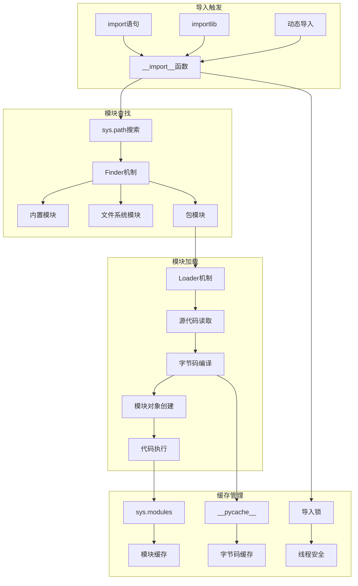
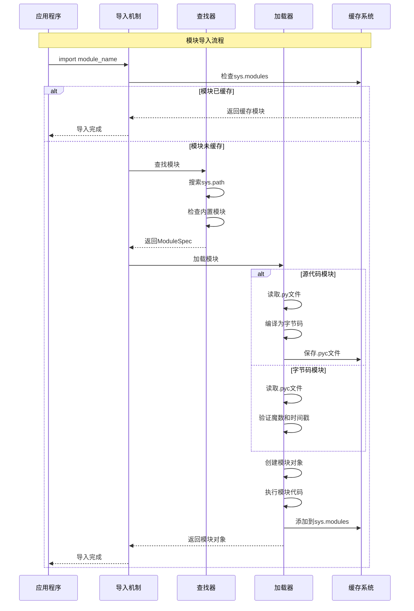

## 📋 概述

Python的导入系统是解释器的核心组件，负责模块的查找、加载、编译和缓存。本文档将深入分析CPython中导入系统的实现机制，包括模块搜索算法、动态加载、包管理、以及导入优化策略。

## 🎯 导入系统架构



## 1. 导入系统核心实现

### 1.1 import语句处理

```c
/* Python/import.c - 导入系统核心实现 */

/* __import__函数的C实现 */
PyObject *
PyImport_ImportModuleLevelObject(PyObject *name, PyObject *globals,
                                PyObject *locals, PyObject *fromlist,
                                int level)
{
    PyObject *abs_name = NULL;
    PyObject *final_mod = NULL;
    PyObject *mod = NULL;
    PyObject *package = NULL;
    PyInterpreterState *interp = _PyInterpreterState_GET();
    int has_from;

    /*

     * 导入流程：
     * 1. 解析相对导入
     * 2. 计算绝对模块名
     * 3. 检查sys.modules缓存
     * 4. 查找和加载模块
     * 5. 处理from导入
     */

    /* 检查参数有效性 */
    if (name == NULL) {
        PyErr_SetString(PyExc_ValueError, "Empty module name");
        goto error;
    }

    /* 处理相对导入 */
    if (level > 0) {
        abs_name = resolve_name(name, globals, level);
        if (abs_name == NULL)
            goto error;
    }
    else {
        abs_name = PyObject_Str(name);
        if (abs_name == NULL)
            goto error;
    }

    /* 检查模块是否已在sys.modules中 */
    mod = PyImport_GetModule(abs_name);
    if (mod != NULL && mod != Py_None) {
        /* 模块已被导入 */
        if (PyList_Check(fromlist)) {
            /* 处理from import */
            final_mod = handle_fromlist(mod, fromlist, import_func);
        }
        else {
            final_mod = calculate_return_value(abs_name, mod, fromlist, level);
        }
        goto done;
    }

    /* 模块未被导入，需要进行导入 */
    mod = import_find_and_load(abs_name);
    if (mod == NULL) {
        goto error;
    }

    /* 处理from导入 */
    has_from = PyList_Check(fromlist);
    if (has_from) {
        final_mod = handle_fromlist(mod, fromlist, import_func);
        if (final_mod == NULL) {
            goto error;
        }
    }
    else {
        final_mod = calculate_return_value(abs_name, mod, fromlist, level);
        if (final_mod == NULL) {
            goto error;
        }
    }

done:
    Py_XDECREF(abs_name);
    Py_XDECREF(mod);
    return final_mod;

error:
    Py_XDECREF(abs_name);
    Py_XDECREF(mod);
    return NULL;
}

/* 查找和加载模块的核心函数 */
static PyObject *
import_find_and_load(PyObject *abs_name)
{
    PyObject *mod = NULL;
    PyInterpreterState *interp = _PyInterpreterState_GET();
    int import_time = _PyRuntime.preconfig.import_time;

    /*

     * 导入时间测量和锁管理
     */
    _PyTime_t t1 = 0, accumulated = 0;
    if (import_time) {
        t1 = _PyTime_GetPerfCounter();
        accumulated = 0;
    }

    /* 获取导入锁 */
    long thread_id = PyThread_get_thread_ident();
    PyObject *import_lock_context = _PyImport_AcquireLock();
    if (import_lock_context == NULL) {
        return NULL;
    }

    /* 再次检查sys.modules（可能在等待锁期间被其他线程导入） */
    mod = PyImport_GetModule(abs_name);
    if (mod != NULL && mod != Py_None) {
        _PyImport_ReleaseLock(import_lock_context);
        goto done;
    }

    /* 执行实际的查找和加载 */
    mod = PyObject_CallMethodOneArg(interp->importlib,
                                   &_Py_ID(_find_and_load), abs_name);

    if (import_time) {
        _PyTime_t cumulative = _PyTime_GetPerfCounter() - t1;
        fprintf(stderr, "import time: %9ld | %10ld | %*s%s\n",
                (long)accumulated, (long)cumulative,
                level*2, "", PyUnicode_AsUTF8(abs_name));
    }

    _PyImport_ReleaseLock(import_lock_context);

done:
    return mod;
}

/* 相对导入名称解析 */
static PyObject *
resolve_name(PyObject *name, PyObject *globals, int level)
{
    PyObject *abs_name;
    PyObject *package = NULL;
    PyObject *spec;
    PyObject *base;
    Py_ssize_t last_dot;

    /*

     * 相对导入解析算法：
     * 1. 获取当前包名
     * 2. 根据level确定父包层级
     * 3. 拼接相对模块名
     */

    if (globals == NULL) {
        PyErr_SetString(PyExc_KeyError, "'__name__' not in globals");
        goto error;
    }

    /* 获取当前模块的包名 */
    package = PyDict_GetItemWithError(globals, &_Py_ID(__package__));
    if (package == Py_None) {
        package = PyDict_GetItemWithError(globals, &_Py_ID(__name__));
        if (package == NULL) {
            PyErr_SetString(PyExc_KeyError, "'__name__' not in globals");
            goto error;
        }

        /* 检查是否为包 */
        spec = PyDict_GetItemWithError(globals, &_Py_ID(__spec__));
        if (spec != NULL && spec != Py_None) {
            PyObject *parent = PyObject_GetAttr(spec, &_Py_ID(parent));
            if (parent == NULL) {
                goto error;
            }
            if (parent != Py_None) {
                package = parent;
            }
            else {
                Py_DECREF(parent);
                package = PyUnicode_RPartition(package, &_Py_STR(.))[0];
            }
        }
    }

    /* 根据level计算基础包名 */
    for (; level > 1; level--) {
        last_dot = PyUnicode_FindChar(package, '.', 0, PyUnicode_GET_LENGTH(package), -1);
        if (last_dot == -2) {
            goto error;
        }
        else if (last_dot == -1) {
            PyErr_SetString(PyExc_ImportError,
                           "attempted relative import beyond top-level package");
            goto error;
        }
        package = PyUnicode_Substring(package, 0, last_dot);
        if (package == NULL) {
            goto error;
        }
    }

    /* 拼接最终的绝对模块名 */
    if (PyUnicode_GET_LENGTH(name) > 0) {
        abs_name = PyUnicode_FromFormat("%U.%U", package, name);
    }
    else {
        abs_name = Py_NewRef(package);
    }

    return abs_name;

error:
    return NULL;
}
```

### 1.2 模块查找机制

```c
/* 模块查找的Finder系统实现 */

/* 内置模块查找 */
static PyObject *
find_builtin_module(PyObject *name)
{
    /*

     * 内置模块查找算法：
     * 1. 在PyImport_Inittab中查找
     * 2. 检查扩展模块表
     * 3. 返回ModuleSpec或None
     */

    struct _inittab *p;
    PyObject *spec = NULL;

    /* 在内置模块表中查找 */
    for (p = PyImport_Inittab; p->name != NULL; p++) {
        if (strcmp(p->name, PyUnicode_AsUTF8(name)) == 0) {
            /* 找到内置模块 */
            spec = _PyImport_CreateBuiltinSpec(name);
            break;
        }
    }

    if (spec == NULL && _PyImport_FixupExtensionObject != NULL) {
        /* 检查扩展模块缓存 */
        spec = _PyImport_FixupExtensionObject(name, name, NULL, 0);
    }

    return spec ? spec : Py_None;

}

/* 文件系统模块查找 */
static PyObject *
find_module_in_path(PyObject *name, PyObject *path)
{
    /*

     * 文件系统查找算法：
     * 1. 遍历sys.path中的每个目录
     * 2. 尝试查找模块文件
     * 3. 检查包目录
     * 4. 返回ModuleSpec
     */

    Py_ssize_t path_len, i;
    PyObject *path_item, *finder, *spec;

    if (!PyList_Check(path)) {
        return Py_None;
    }

    path_len = PyList_GET_SIZE(path);
    for (i = 0; i < path_len; i++) {
        path_item = PyList_GET_ITEM(path, i);
        if (!PyUnicode_Check(path_item)) {
            continue;
        }

        /* 获取路径的finder */
        finder = get_path_finder(path_item);
        if (finder == NULL) {
            continue;
        }

        /* 使用finder查找模块 */
        spec = PyObject_CallMethodOneArg(finder, &_Py_ID(find_spec), name);
        if (spec != NULL && spec != Py_None) {
            return spec;
        }

        Py_XDECREF(spec);
    }

    return Py_None;

}

/* 包模块查找 */
static PyObject *
find_package_module(PyObject *fullname, PyObject *path)
{
    /*

     * 包模块查找：
     * 1. 分析包层次结构
     * 2. 递归查找子包
     * 3. 处理命名空间包
     */

    PyObject *tail, *head, *spec;
    Py_ssize_t dot_index;

    /* 分离包名和模块名 */
    dot_index = PyUnicode_FindChar(fullname, '.', 0,
                                  PyUnicode_GET_LENGTH(fullname), -1);

    if (dot_index == -1) {
        /* 顶级模块 */
        return find_module_in_path(fullname, path);
    }

    /* 分离头部包名和尾部模块名 */
    head = PyUnicode_Substring(fullname, 0, dot_index);
    tail = PyUnicode_Substring(fullname, dot_index + 1,
                              PyUnicode_GET_LENGTH(fullname));

    if (head == NULL || tail == NULL) {
        Py_XDECREF(head);
        Py_XDECREF(tail);
        return NULL;
    }

    /* 首先查找父包 */
    spec = find_module_in_path(head, path);
    if (spec == NULL || spec == Py_None) {
        Py_DECREF(head);
        Py_DECREF(tail);
        return spec;
    }

    /* 获取父包的子路径 */
    PyObject *submodule_search_locations = PyObject_GetAttr(spec,
                                                           &_Py_ID(submodule_search_locations));
    if (submodule_search_locations == NULL) {
        Py_DECREF(head);
        Py_DECREF(tail);
        Py_DECREF(spec);
        return NULL;
    }

    /* 在子路径中查找模块 */
    PyObject *result = find_package_module(tail, submodule_search_locations);

    Py_DECREF(head);
    Py_DECREF(tail);
    Py_DECREF(spec);
    Py_DECREF(submodule_search_locations);

    return result;

}
```

### 1.3 模块加载机制

```c
/* 模块加载的Loader系统实现 */

/* 源代码模块加载器 */
static PyObject *
load_source_module(PyObject *name, PyObject *pathname)
{
    /*

     * 源代码加载流程：
     * 1. 读取源代码文件
     * 2. 编译为字节码
     * 3. 创建模块对象
     * 4. 执行模块代码
     * 5. 缓存到sys.modules
     */

    PyObject *source = NULL;
    PyObject *code = NULL;
    PyObject *module = NULL;
    FILE *fp = NULL;

    /* 打开源文件 */
    fp = _Py_fopen_obj(pathname, "rb");
    if (fp == NULL) {
        PyErr_SetFromErrnoWithFilenameObjects(PyExc_FileNotFoundError,
                                             pathname, NULL);
        return NULL;
    }

    /* 读取源代码 */
    source = _PyTokenizer_translate_into_utf8(fp, NULL);
    fclose(fp);

    if (source == NULL) {
        return NULL;
    }

    /* 编译源代码 */
    code = Py_CompileStringExFlags(PyBytes_AS_STRING(source),
                                  PyUnicode_AsUTF8(pathname),
                                  Py_file_input, NULL, -1);
    Py_DECREF(source);

    if (code == NULL) {
        return NULL;
    }

    /* 创建模块对象 */
    module = PyModule_NewObject(name);
    if (module == NULL) {
        Py_DECREF(code);
        return NULL;
    }

    /* 设置模块属性 */
    if (PyModule_AddStringConstant(module, "__file__",
                                  PyUnicode_AsUTF8(pathname)) < 0) {
        Py_DECREF(code);
        Py_DECREF(module);
        return NULL;
    }

    /* 执行模块代码 */
    PyObject *module_dict = PyModule_GetDict(module);
    PyObject *result = PyEval_EvalCode(code, module_dict, module_dict);

    Py_DECREF(code);

    if (result == NULL) {
        Py_DECREF(module);
        return NULL;
    }

    Py_DECREF(result);

    /* 添加到sys.modules */
    if (PyDict_SetItem(PyImport_GetModuleDict(), name, module) < 0) {
        Py_DECREF(module);
        return NULL;
    }

    return module;

}

/* 字节码模块加载器 */
static PyObject *
load_bytecode_module(PyObject *name, PyObject *bytecode_path)
{
    /*

     * 字节码加载流程：
     * 1. 读取.pyc文件
     * 2. 验证魔数和时间戳
     * 3. 反序列化代码对象
     * 4. 创建模块并执行
     */

    FILE *fp = NULL;
    PyObject *code = NULL;
    PyObject *module = NULL;
    long magic, pyc_mtime;

    /* 打开字节码文件 */
    fp = _Py_fopen_obj(bytecode_path, "rb");
    if (fp == NULL) {
        return NULL;
    }

    /* 读取并验证魔数 */
    magic = PyMarshal_ReadLongFromFile(fp);
    if (magic != PyImport_GetMagicNumber()) {
        fclose(fp);
        /* 魔数不匹配，需要重新编译 */
        return NULL;
    }

    /* 读取时间戳 */
    pyc_mtime = PyMarshal_ReadLongFromFile(fp);
    /* 这里应该验证时间戳，但为了简化省略 */

    /* 反序列化代码对象 */
    code = PyMarshal_ReadObjectFromFile(fp);
    fclose(fp);

    if (code == NULL || !PyCode_Check(code)) {
        Py_XDECREF(code);
        return NULL;
    }

    /* 创建模块对象 */
    module = PyModule_NewObject(name);
    if (module == NULL) {
        Py_DECREF(code);
        return NULL;
    }

    /* 执行字节码 */
    PyObject *module_dict = PyModule_GetDict(module);
    PyObject *result = PyEval_EvalCode(code, module_dict, module_dict);

    Py_DECREF(code);

    if (result == NULL) {
        Py_DECREF(module);
        return NULL;
    }

    Py_DECREF(result);

    return module;

}

/* 扩展模块加载器 */
static PyObject *
load_extension_module(PyObject *name, PyObject *path)
{
    /*

     * 扩展模块加载：
     * 1. 动态链接库加载
     * 2. 查找初始化函数
     * 3. 调用模块初始化
     * 4. 处理多阶段初始化
     */

    void *handle = NULL;
    PyObject *(*initfunc)(void);
    PyObject *module = NULL;
    const char *name_utf8 = PyUnicode_AsUTF8(name);
    const char *path_utf8 = PyUnicode_AsUTF8(path);

    /* 加载动态链接库 */
#ifdef MS_WINDOWS
    handle = LoadLibraryExA(path_utf8, NULL, LOAD_WITH_ALTERED_SEARCH_PATH);
#else
    handle = dlopen(path_utf8, RTLD_NOW | RTLD_GLOBAL);
#endif

    if (handle == NULL) {
        PyErr_SetImportError("动态链接库加载失败", name, path);
        return NULL;
    }

    /* 查找初始化函数 */
    char initfunc_name[256];
    snprintf(initfunc_name, sizeof(initfunc_name), "PyInit_%s", name_utf8);

#ifdef MS_WINDOWS
    initfunc = (PyObject *(*)(void))GetProcAddress(handle, initfunc_name);
#else
    initfunc = (PyObject *(*)(void))dlsym(handle, initfunc_name);
#endif

    if (initfunc == NULL) {
        PyErr_Format(PyExc_ImportError,
                    "动态模块没有定义初始化函数 %s", initfunc_name);
        goto error;
    }

    /* 调用初始化函数 */
    module = (*initfunc)();
    if (module == NULL) {
        goto error;
    }

    /* 设置模块属性 */
    if (PyModule_AddStringConstant(module, "__file__", path_utf8) < 0) {
        goto error;
    }

    /* 缓存扩展模块 */
    if (_PyImport_FixupExtensionObject(module, name, path, 0) < 0) {
        goto error;
    }

    return module;

error:
    if (handle) {
#ifdef MS_WINDOWS
        FreeLibrary(handle);
#else
        dlclose(handle);
#endif
    }
    Py_XDECREF(module);
    return NULL;
}
```

## 2. 导入系统优化

### 2.1 缓存机制

```python
# 导入系统性能分析和优化
import sys
import time
import importlib
import importlib.util
import os
import marshal
import tempfile
import threading
from typing import Dict, List, Any, Optional
from pathlib import Path

class ImportSystemAnalyzer:
    """导入系统分析器"""

    def __init__(self):
        self.import_times = {}
        self.cache_hits = 0
        self.cache_misses = 0
        self.original_import = __builtins__.__import__
        self.import_lock = threading.Lock()

    def analyze_import_cache(self):
        """分析导入缓存效果"""

        print("=== 导入缓存分析 ===")

        # 1. sys.modules缓存分析
        print("1. sys.modules缓存状态:")

        modules_count = len(sys.modules)
        builtin_modules = [name for name in sys.modules
                          if name in sys.builtin_module_names]

        print(f"  已加载模块总数: {modules_count}")
        print(f"  内置模块数: {len(builtin_modules)}")
        print(f"  扩展模块数: {modules_count - len(builtin_modules)}")

        # 显示前10个已加载的模块
        print(f"  前10个已加载模块:")
        for i, (name, module) in enumerate(list(sys.modules.items())[:10]):
            if module is not None:
                location = getattr(module, '__file__', '内置')
                print(f"    {name}: {location}")

        # 2. 字节码缓存分析
        print(f"\n2. 字节码缓存分析:")

        cache_dirs = []
        for path in sys.path:
            if os.path.isdir(path):
                pycache_dir = os.path.join(path, '__pycache__')
                if os.path.exists(pycache_dir):
                    cache_dirs.append(pycache_dir)

        total_pyc_files = 0
        total_cache_size = 0

        for cache_dir in cache_dirs[:5]:  # 只检查前5个
            pyc_files = list(Path(cache_dir).glob('*.pyc'))
            cache_size = sum(f.stat().st_size for f in pyc_files)

            total_pyc_files += len(pyc_files)
            total_cache_size += cache_size

            print(f"  {cache_dir}: {len(pyc_files)}个文件, {cache_size/1024:.1f}KB")

        print(f"  总计: {total_pyc_files}个.pyc文件, {total_cache_size/1024:.1f}KB")

        # 3. 导入性能测试
        print(f"\n3. 导入性能对比:")

        # 首次导入（冷启动）
        test_modules = ['json', 'urllib', 'xml', 'email', 'html']

        for module_name in test_modules:
            if module_name in sys.modules:
                del sys.modules[module_name]

        cold_times = []
        for module_name in test_modules:
            start_time = time.perf_counter()
            try:
                __import__(module_name)
                end_time = time.perf_counter()
                cold_times.append(end_time - start_time)
            except ImportError:
                cold_times.append(float('inf'))

        # 再次导入（缓存命中）
        warm_times = []
        for module_name in test_modules:
            start_time = time.perf_counter()
            __import__(module_name)
            end_time = time.perf_counter()
            warm_times.append(end_time - start_time)

        print(f"  模块导入性能对比:")
        for i, module_name in enumerate(test_modules):
            if cold_times[i] != float('inf'):
                speedup = cold_times[i] / warm_times[i] if warm_times[i] > 0 else float('inf')
                print(f"    {module_name}: 冷启动 {cold_times[i]*1000:.2f}ms, "
                      f"缓存命中 {warm_times[i]*1000:.2f}ms, 加速 {speedup:.1f}x")

    def analyze_import_mechanisms(self):
        """分析不同导入机制"""

        print(f"\n=== 导入机制分析 ===")

        # 1. import vs importlib
        print("1. 不同导入方式性能对比:")

        test_module = 'collections'
        if test_module in sys.modules:
            del sys.modules[test_module]

        # import语句
        start_time = time.perf_counter()
        import collections
        import_time = time.perf_counter() - start_time
        del sys.modules[test_module]

        # importlib.import_module
        start_time = time.perf_counter()
        importlib.import_module(test_module)
        importlib_time = time.perf_counter() - start_time
        del sys.modules[test_module]

        # __import__函数
        start_time = time.perf_counter()
        __import__(test_module)
        builtin_import_time = time.perf_counter() - start_time

        print(f"  import语句: {import_time*1000:.2f}ms")
        print(f"  importlib.import_module: {importlib_time*1000:.2f}ms")
        print(f"  __import__函数: {builtin_import_time*1000:.2f}ms")

        # 2. 动态导入分析
        print(f"\n2. 动态导入分析:")

        def dynamic_import_test(module_names):
            """测试动态导入性能"""
            start_time = time.perf_counter()

            for name in module_names:
                try:
                    if name not in sys.modules:
                        importlib.import_module(name)
                except ImportError:
                    pass

            return time.perf_counter() - start_time

        # 测试批量动态导入
        module_batch = ['os', 'sys', 'time', 'random', 'math',
                       'datetime', 'itertools', 'functools']

        batch_time = dynamic_import_test(module_batch)
        print(f"  批量导入{len(module_batch)}个模块: {batch_time*1000:.2f}ms")
        print(f"  平均每个模块: {batch_time*1000/len(module_batch):.2f}ms")

        # 3. 条件导入分析
        print(f"\n3. 条件导入分析:")

        def conditional_import_test():
            """测试条件导入"""
            # 模拟条件导入
            modules_to_import = []

            # 根据条件决定导入哪些模块
            if sys.platform.startswith('win'):
                modules_to_import.append('winsound')
            else:
                modules_to_import.extend(['pwd', 'grp'])

            if sys.version_info >= (3, 8):
                modules_to_import.append('typing_extensions')

            start_time = time.perf_counter()
            imported_count = 0

            for module_name in modules_to_import:
                try:
                    importlib.import_module(module_name)
                    imported_count += 1
                except ImportError:
                    pass

            return time.perf_counter() - start_time, imported_count

        cond_time, imported_count = conditional_import_test()
        print(f"  条件导入: {cond_time*1000:.2f}ms, 成功导入{imported_count}个模块")

    def analyze_package_imports(self):
        """分析包导入机制"""

        print(f"\n=== 包导入机制分析 ===")

        # 1. 包结构分析
        print("1. 包结构分析:")

        # 查找标准库中的包
        stdlib_packages = []
        for name, module in sys.modules.items():
            if (module is not None and
                hasattr(module, '__path__') and
                '.' not in name):  # 顶级包
                stdlib_packages.append(name)

        print(f"  已加载的标准库包数: {len(stdlib_packages)}")
        print(f"  示例包:")
        for pkg in sorted(stdlib_packages)[:10]:
            module = sys.modules[pkg]
            path = getattr(module, '__path__', ['未知'])
            print(f"    {pkg}: {path[0] if path else '未知'}")

        # 2. 子模块导入分析
        print(f"\n2. 子模块导入分析:")

        def test_submodule_import(package_name, submodules):
            """测试子模块导入"""
            times = {}

            for submodule in submodules:
                full_name = f"{package_name}.{submodule}"

                # 确保模块未被加载
                if full_name in sys.modules:
                    del sys.modules[full_name]

                start_time = time.perf_counter()
                try:
                    importlib.import_module(full_name)
                    import_time = time.perf_counter() - start_time
                    times[submodule] = import_time
                except ImportError:
                    times[submodule] = None

            return times

        # 测试urllib包的子模块
        urllib_submodules = ['parse', 'request', 'response', 'error']
        urllib_times = test_submodule_import('urllib', urllib_submodules)

        print(f"  urllib包子模块导入时间:")
        for submodule, import_time in urllib_times.items():
            if import_time is not None:
                print(f"    urllib.{submodule}: {import_time*1000:.2f}ms")

        # 3. from import 分析
        print(f"\n3. from import 性能分析:")

        # 比较不同的from import方式
        def test_from_import():
            """测试from import性能"""

            # 方式1: from module import specific
            start_time = time.perf_counter()
            from collections import defaultdict, Counter
            specific_time = time.perf_counter() - start_time

            # 方式2: import module然后使用
            start_time = time.perf_counter()
            import collections
            defaultdict_ref = collections.defaultdict
            counter_ref = collections.Counter
            module_time = time.perf_counter() - start_time

            return specific_time, module_time

        specific_time, module_time = test_from_import()

        print(f"  from collections import specific: {specific_time*1000:.3f}ms")
        print(f"  import collections + 引用: {module_time*1000:.3f}ms")
        print(f"  from import优势: {module_time/specific_time:.1f}x"
              if specific_time > 0 else "无法计算")

    def analyze_import_hooks(self):
        """分析导入钩子机制"""

        print(f"\n=== 导入钩子机制分析 ===")

        # 1. sys.meta_path分析
        print("1. Meta Path Finders:")
        for i, finder in enumerate(sys.meta_path):
            finder_name = type(finder).__name__
            finder_module = type(finder).__module__
            print(f"  {i}: {finder_module}.{finder_name}")

        # 2. sys.path_hooks分析
        print(f"\n2. Path Hooks ({len(sys.path_hooks)}个):")
        for i, hook in enumerate(sys.path_hooks):
            hook_name = getattr(hook, '__name__', str(hook))
            print(f"  {i}: {hook_name}")

        # 3. 自定义导入钩子示例
        print(f"\n3. 自定义导入钩子示例:")

        class ImportProfiler:
            """导入性能分析钩子"""

            def __init__(self):
                self.import_stats = {}
                self.original_import = __builtins__.__import__

            def __call__(self, name, globals=None, locals=None, fromlist=(), level=0):
                start_time = time.perf_counter()

                try:
                    result = self.original_import(name, globals, locals, fromlist, level)
                    import_time = time.perf_counter() - start_time

                    # 记录导入统计
                    if name not in self.import_stats:
                        self.import_stats[name] = []
                    self.import_stats[name].append(import_time)

                    return result
                except Exception as e:
                    import_time = time.perf_counter() - start_time
                    print(f"    导入失败 {name}: {e} ({import_time*1000:.2f}ms)")
                    raise

        # 安装性能分析钩子
        profiler = ImportProfiler()
        original_import = __builtins__.__import__
        __builtins__.__import__ = profiler

        try:
            # 测试一些导入
            test_imports = ['base64', 'uuid', 'hashlib']
            for module_name in test_imports:
                if module_name in sys.modules:
                    del sys.modules[module_name]
                importlib.import_module(module_name)

            # 显示统计结果
            print(f"  导入性能统计:")
            for name, times in profiler.import_stats.items():
                avg_time = sum(times) / len(times) if times else 0
                print(f"    {name}: {avg_time*1000:.2f}ms (调用{len(times)}次)")

        finally:
            # 恢复原始导入函数
            __builtins__.__import__ = original_import

    def demonstrate_import_optimization(self):
        """演示导入优化技术"""

        print(f"\n=== 导入优化技术演示 ===")

        # 1. 延迟导入
        print("1. 延迟导入技术:")

        class LazyImporter:
            """延迟导入器"""

            def __init__(self, module_name):
                self.module_name = module_name
                self._module = None

            def __getattr__(self, name):
                if self._module is None:
                    print(f"    延迟加载模块: {self.module_name}")
                    self._module = importlib.import_module(self.module_name)
                return getattr(self._module, name)

        # 使用延迟导入
        lazy_json = LazyImporter('json')
        print(f"  创建延迟导入器: json")
        print(f"  首次使用: {lazy_json.dumps({'test': 'data'})}")
        print(f"  再次使用: {lazy_json.loads('{"key": "value"}')})")

        # 2. 条件导入
        print(f"\n2. 条件导入优化:")

        def get_best_json_module():
            """根据性能选择最佳JSON模块"""

            # 尝试导入高性能的JSON库
            try:
                import ujson
                print(f"    使用ujson (高性能)")
                return ujson
            except ImportError:
                pass

            try:
                import rapidjson
                print(f"    使用rapidjson (快速)")
                return rapidjson
            except ImportError:
                pass

            # 回退到标准库
            import json
            print(f"    使用标准json库")
            return json

        json_module = get_best_json_module()
        test_data = {'numbers': list(range(100)), 'text': 'benchmark'}
        serialized = json_module.dumps(test_data)

        # 3. 预导入优化
        print(f"\n3. 预导入优化:")

        def preload_common_modules():
            """预加载常用模块"""
            common_modules = [
                'os', 'sys', 'time', 'datetime', 'random',
                'json', 'base64', 'hashlib', 'uuid'
            ]

            start_time = time.perf_counter()
            loaded_count = 0

            for module_name in common_modules:
                try:
                    if module_name not in sys.modules:
                        importlib.import_module(module_name)
                        loaded_count += 1
                except ImportError:
                    pass

            preload_time = time.perf_counter() - start_time
            return loaded_count, preload_time

        loaded_count, preload_time = preload_common_modules()
        print(f"  预加载{loaded_count}个常用模块: {preload_time*1000:.2f}ms")

        # 4. 模块级缓存
        print(f"\n4. 模块级导入缓存:")

        _module_cache = {}

        def cached_import(module_name):
            """带缓存的导入函数"""
            if module_name not in _module_cache:
                start_time = time.perf_counter()
                _module_cache[module_name] = importlib.import_module(module_name)
                cache_time = time.perf_counter() - start_time
                print(f"    缓存模块 {module_name}: {cache_time*1000:.2f}ms")
            return _module_cache[module_name]

        # 测试缓存效果
        for _ in range(3):
            module = cached_import('itertools')

    def run_analysis(self):
        """运行完整的导入系统分析"""

        print("Python导入系统深度分析\n")

        self.analyze_import_cache()
        self.analyze_import_mechanisms()
        self.analyze_package_imports()
        self.analyze_import_hooks()
        self.demonstrate_import_optimization()

        print(f"\n{'='*50}")
        print("导入系统分析完成")
        print(f"{'='*50}")

# 运行导入系统分析
if __name__ == "__main__":
    analyzer = ImportSystemAnalyzer()
    analyzer.run_analysis()
```

## 3. 导入系统时序图



## 4. 总结

Python的导入系统展现了高度复杂和精密的设计：

### 4.1 核心机制

1. **查找机制**: Meta Path Finders、Path Finders、内置模块查找
2. **加载机制**: 源码加载、字节码加载、扩展模块加载
3. **缓存机制**: sys.modules缓存、字节码缓存、模块规格缓存
4. **钩子机制**: 自定义导入逻辑、性能监控、安全控制

### 4.2 设计特点

1. **模块化**: 清晰的Finder/Loader分离
2. **可扩展**: 丰富的钩子机制
3. **高性能**: 多层缓存优化
4. **安全性**: 路径验证和权限检查

### 4.3 性能优化

1. **缓存策略**: 有效减少重复加载开销
2. **延迟加载**: 按需导入模块
3. **预编译**: 字节码缓存加速启动
4. **并发安全**: 导入锁保证线程安全

### 4.4 最佳实践

1. **合理使用延迟导入**: 避免循环导入
2. **优化导入路径**: 减少sys.path搜索开销
3. **模块级缓存**: 避免重复导入计算
4. **导入性能监控**: 识别导入瓶颈

### 4.5 应用指导

1. **理解导入机制**: 掌握模块查找和加载流程
2. **优化导入性能**: 使用预导入和缓存策略
3. **自定义导入逻辑**: 利用钩子机制扩展功能
4. **避免导入陷阱**: 注意循环导入和命名冲突

Python的导入系统为模块化编程提供了强大而灵活的基础设施，理解其工作原理对于构建大型Python应用至关重要。

<function_calls>
<invoke name="todo_write">
<parameter name="merge">true
