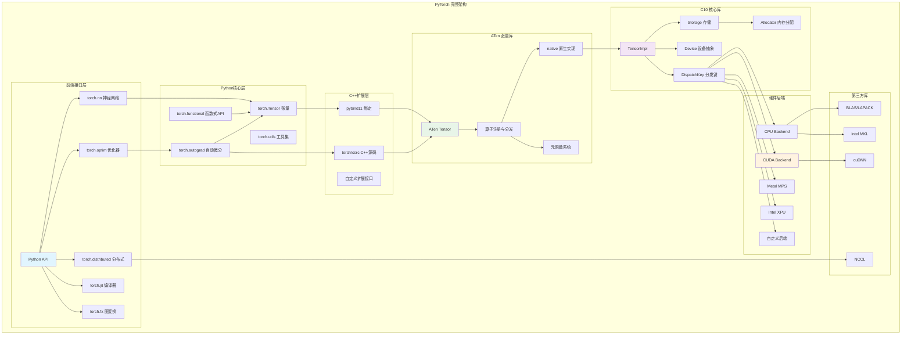
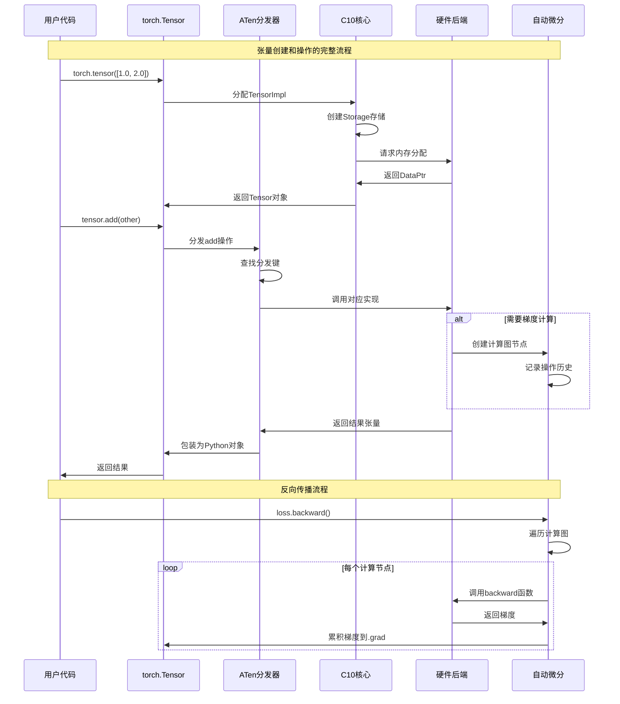
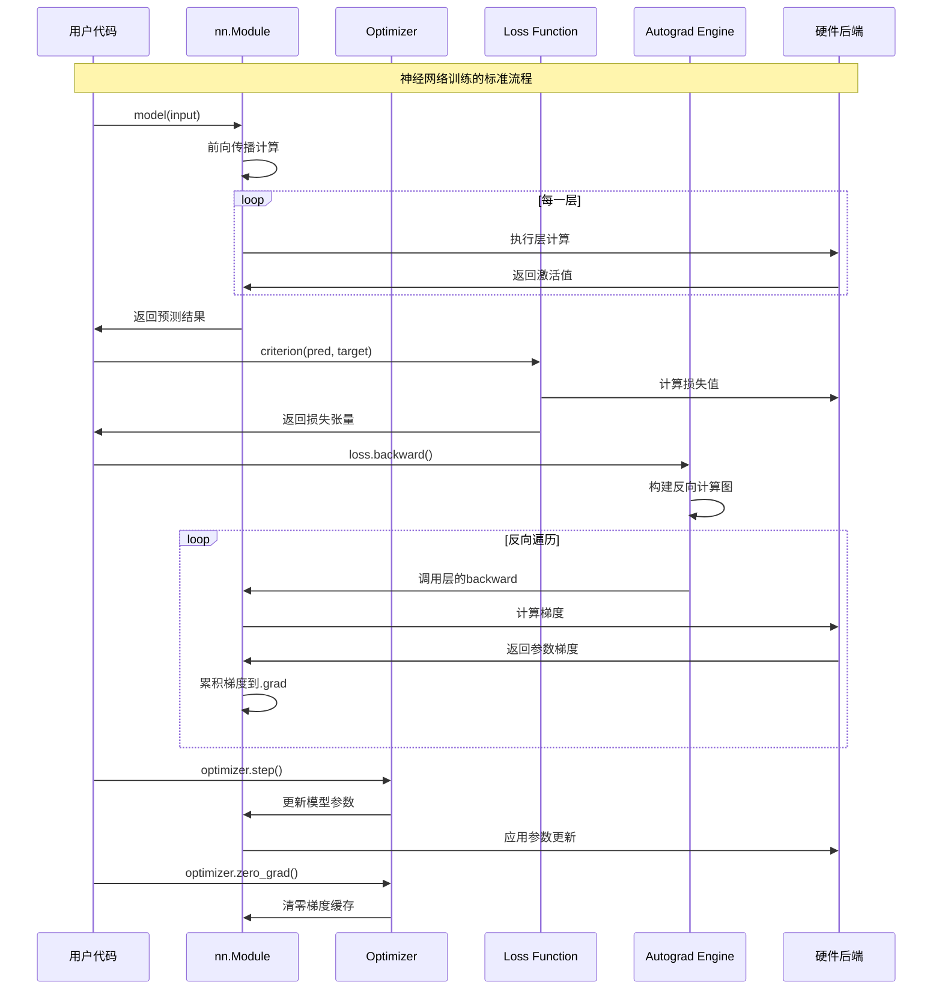

## 概述

PyTorch是当今最流行的深度学习框架之一，以其动态计算图、易用的Python接口和强大的GPU加速能力而闻名。PyTorch的完整架构设计，从最底层的C10核心库到高层的神经网络模块，揭示其背后的技术实现和设计哲学。

<!--more-->

## 1. PyTorch架构全景

### 1.1 设计哲学与核心目标

PyTorch的设计遵循以下核心哲学：

- **研究友好性**：动态计算图，支持运行时图结构变化
- **Python优先**：原生Python体验，无需预定义计算图
- **性能与易用性平衡**：C++后端+Python前端的双层架构
- **可扩展性**：模块化设计，支持自定义操作和后端

### 1.2 整体架构层次

PyTorch采用分层架构设计，从底层到高层依次为：

```
┌─────────────────────────────────────────────────────────────┐
│                    Python API Layer                        │  
│  torch.nn • torch.optim • torch.distributed • torch.jit   │
├─────────────────────────────────────────────────────────────┤
│                   PyTorch Python Core                      │
│        torch.Tensor • torch.autograd • torch.fx           │
├─────────────────────────────────────────────────────────────┤
│                    C++ Extension API                       │
│            Python C Extension • pybind11 Binding          │
├─────────────────────────────────────────────────────────────┤
│                      ATen Library                          │
│          Tensor Operations • Backend Dispatch             │
├─────────────────────────────────────────────────────────────┤
│                       C10 Library                          │
│        Core Tensor • Memory Management • Device API       │
├─────────────────────────────────────────────────────────────┤
│                    Hardware Backends                       │
│       CPU • CUDA • MPS • XPU • Custom Devices            │
└─────────────────────────────────────────────────────────────┘
```

### 1.3 核心架构组件图



## 2. 核心组件详解

### 2.1 C10 - 核心基础库

C10（Caffe2的十进制版本）是PyTorch的核心基础库，提供了最基本的数据结构和抽象：

**核心职责**：
- 张量的基础数据结构（TensorImpl）
- 设备抽象和内存管理
- 类型系统和标量类型
- 分发机制的基础设施

**关键组件**：
```cpp
// 核心张量实现
class TensorImpl {
    Storage storage_;           // 数据存储
    SymIntArrayRef sizes_;      // 张量形状
    SymIntArrayRef strides_;    // 步长信息
    DispatchKeySet key_set_;    // 分发键集合
    ScalarType dtype_;          // 数据类型
    Device device_;             // 设备信息
    // ...其他元数据
};

// 存储管理
class Storage {
    DataPtr data_ptr_;          // 数据指针
    SymInt size_bytes_;         // 字节大小
    Allocator* allocator_;      // 内存分配器
    bool resizable_;            // 是否可调整大小
};
```

### 2.2 ATen - 张量操作库

ATen（A Tensor Library）是PyTorch的张量操作核心，实现了所有数学和张量操作：

**核心功能**：
- 算子注册与动态分发
- 多设备后端支持
- 内存格式优化
- 批处理和广播机制

**算子分发架构**：
```cpp
// 算子注册示例
TORCH_LIBRARY_IMPL(aten, CPU, m) {
  m.impl("add.Tensor", &cpu_add);
  m.impl("mul.Tensor", &cpu_mul);
}

TORCH_LIBRARY_IMPL(aten, CUDA, m) {
  m.impl("add.Tensor", &cuda_add);
  m.impl("mul.Tensor", &cuda_mul);
}
```

### 2.3 Autograd - 自动微分引擎

Autograd系统是PyTorch的核心优势，实现了自动求导：

**核心机制**：
- 动态计算图构建
- 反向传播算法
- 梯度累积和优化
- 高阶导数支持

**计算图节点结构**：
```python
class Function:
    def forward(ctx, *args):    # 前向传播
        pass
    
    def backward(ctx, *grad_outputs):  # 反向传播
        pass
```

### 2.4 神经网络模块系统

torch.nn提供了构建神经网络的高级抽象：

**模块化设计**：
- Module基类和参数管理
- 层级结构和状态管理
- 序列化和加载机制
- 钩子和回调系统

## 3. 关键流程时序图

### 3.1 张量创建和操作流程



### 3.2 神经网络训练流程



## 4. 内存管理与优化

### 4.1 内存分配策略

PyTorch采用多层级内存管理：

**CPU内存管理**：
- 默认使用系统分配器
- 支持内存池和缓存机制
- 对齐优化提升性能

**GPU内存管理**：
- CUDA缓存分配器
- 内存池避免频繁申请释放
- 流和事件同步机制

```cpp
// CUDA缓存分配器核心逻辑
class CUDACachingAllocator {
    // 内存块管理
    std::map<size_t, std::set<Block*>> cached_blocks;
    std::set<Block*> active_blocks;
    
    // 分配策略
    DataPtr allocate(size_t size) {
        // 1. 尝试从缓存获取
        // 2. 无缓存则从GPU申请
        // 3. 失败时触发垃圾回收
    }
};
```

### 4.2 张量存储优化

**视图机制**：
- 零拷贝视图操作
- 共享底层存储
- 写时拷贝优化

**内存格式**：
- 连续内存布局（NCHW）
- 通道优先格式（NHWC）
- 自动格式选择

## 5. 分发机制详解

### 5.1 分发键系统

PyTorch使用分发键（DispatchKey）实现算子的动态分发：

```cpp
enum class DispatchKey : uint16_t {
  Undefined = 0,
  CPU,                    // CPU后端
  CUDA,                   // CUDA后端  
  XLA,                    // XLA编译
  Lazy,                   // 延迟计算
  Meta,                   // 元张量
  Autograd,               // 自动微分
  Profiler,               // 性能分析
  Tracer,                 // 图追踪
  // ... 更多分发键
};
```

**分发过程**：
1. 根据张量属性计算分发键集合
2. 查找对应的算子实现
3. 调用匹配的后端函数
4. 处理自动微分和其他功能

### 5.2 算子注册机制

```cpp
// 算子声明
TORCH_LIBRARY(aten, m) {
  m.def("add.Tensor(Tensor self, Tensor other, *, Scalar alpha=1) -> Tensor");
}

// 具体实现注册
TORCH_LIBRARY_IMPL(aten, CPU, m) {
  m.impl("add.Tensor", TORCH_FN(cpu_add_tensor));
}

TORCH_LIBRARY_IMPL(aten, Autograd, m) {
  m.impl("add.Tensor", TORCH_FN(autograd_add_tensor));
}
```

## 6. 并发与并行机制

### 6.1 线程模型

**Inter-op并行**：
- 算子间并行执行
- 线程池管理
- 任务调度优化

**Intra-op并行**：
- 算子内并行计算
- OpenMP集成
- SIMD向量化

### 6.2 GPU并发

**CUDA流管理**：
```cpp
class CUDAStream {
    cudaStream_t stream_;       // CUDA流句柄
    int device_index_;          // 设备索引
    StreamPriority priority_;   // 流优先级
    
    void synchronize();         // 同步等待
    void record_event(CUDAEvent& event);  // 记录事件
};
```

**内存异步拷贝**：
- 主机到设备异步传输
- 设备间P2P通信
- 流水线优化减少等待

## 7. 扩展性设计

### 7.1 自定义算子

PyTorch提供灵活的扩展机制：

```python
# Python自定义算子
@torch.library.custom_op("mylib::my_op", mutates_args=())
def my_op(x: Tensor) -> Tensor:
    return x.sin()

@my_op.register_fake
def _(x):
    return torch.empty_like(x)
```

### 7.2 后端扩展

**设备扩展**：
- 自定义DeviceType
- 实现Allocator接口
- 注册算子实现

**编译器集成**：
- TorchScript JIT编译
- AOT编译支持
- 图优化pass

## 8. 性能优化策略

### 8.1 计算优化

**内核融合**：
- 逐元素操作融合
- 减少内存访问次数
- 提升缓存局部性

**数据预取**：
- 异步数据加载
- 内存预分配
- 计算与IO重叠

### 8.2 内存优化

**梯度检查点**：
```python
# 使用梯度检查点节省内存
def forward_with_checkpoint(self, x):
    return checkpoint(self.layer, x)
```

**混合精度训练**：
- FP16计算加速
- 自动损失缩放
- 数值稳定性保证

## 9. 调试与分析工具

### 9.1 内置分析工具

**PyTorch Profiler**：
```python
with torch.profiler.profile(
    activities=[ProfilerActivity.CPU, ProfilerActivity.CUDA],
    record_shapes=True
) as prof:
    model(inputs)

print(prof.key_averages().table(sort_by="cuda_time_total"))
```

**内存分析**：
```python
# 内存使用分析
torch.cuda.memory_summary()
torch.cuda.memory_stats()
```

### 9.2 图可视化

**计算图导出**：
- TensorBoard集成
- 图结构可视化
- 性能瓶颈分析

## 10. 未来发展方向

### 10.1 技术趋势

**编译器优化**：
- torch.compile全图编译
- 图级别优化
- 硬件特定优化

**分布式计算**：
- 更好的集合通信
- 异构硬件支持
- 弹性训练机制

### 10.2 生态系统

**移动端部署**：
- 模型量化和压缩
- 边缘设备优化
- 推理引擎集成

**云原生支持**：
- 容器化部署
- 服务网格集成
- 自动扩缩容

## 总结

PyTorch通过其精心设计的分层架构，实现了易用性与性能的完美平衡。从底层的C10核心库到高层的神经网络模块，每一层都承担着明确的职责，并通过清晰的接口进行交互。

**核心优势**：
- **灵活性**：动态计算图支持复杂的研究需求
- **性能**：高效的C++后端和GPU加速
- **可扩展性**：开放的算子注册和后端扩展机制
- **易用性**：Pythonic的API设计和丰富的工具链

通过深入理解PyTorch的架构设计，我们能够更好地利用其特性，编写高效的深度学习代码，并在需要时进行定制化扩展。随着AI技术的不断发展，PyTorch也将持续演进，为研究者和工程师提供更加强大的工具。
