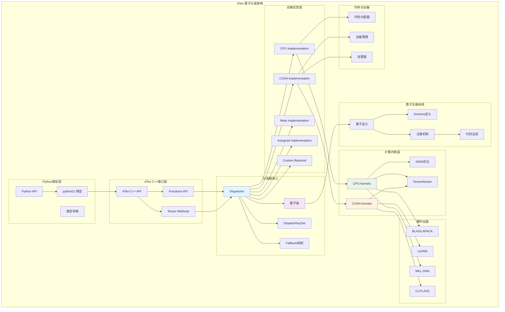

## 概述

<!--more-->

## 1. ATen架构全景

### 1.1 核心设计理念

析的研究，ATen的设计遵循以下核心理念：

- **算子统一性**：所有张量操作通过统一的分发机制实现
- **后端透明性**：用户无需关心具体的硬件实现细节
- **高性能计算**：针对不同硬件平台优化的专用内核
- **可扩展性**：支持动态注册新的算子和后端

### 1.2 ATen分层架构

```
┌─────────────────────────────────────────────────────────────┐
│                     Python API                             │  ← torch.* 接口
├─────────────────────────────────────────────────────────────┤
│                   ATen C++ API                             │  ← at::* 接口
├─────────────────────────────────────────────────────────────┤
│                  Dispatcher Core                           │  ← 分发器核心
├─────────────────────────────────────────────────────────────┤
│               Operator Registration                        │  ← 算子注册系统
├─────────────────────────────────────────────────────────────┤
│              Backend Implementations                       │  ← 后端实现
├─────────────────────────────────────────────────────────────┤
│           Optimized Compute Kernels                       │  ← 优化计算内核
└─────────────────────────────────────────────────────────────┘
```

### 1.3 ATen完整架构图



## 2. 分发器核心机制

### 2.1 Dispatcher架构深度解析

```cpp
namespace c10 {

// 分发器核心实现（）
class TORCH_API Dispatcher final {
 private:
  // 算子定义结构
  struct OperatorDef final {
    explicit OperatorDef(OperatorName&& op_name) : op(std::move(op_name)) {}
    
    impl::OperatorEntry op;        // 算子入口
    size_t def_count = 0;          // 定义计数
    size_t def_and_impl_count = 0; // 定义和实现计数
  };
  
  // 算子查找表：从OperatorName到OperatorDef的映射
  LeftRight<ska::flat_hash_map<OperatorName, OperatorDef>> operators_;
  
  // 监听器系统
  std::unique_ptr<detail::RegistrationListenerList> listeners_;
  
  // 全局锁
  std::mutex mutex_;
  
 public:
  // 单例模式
  static Dispatcher& singleton() {
    static Dispatcher instance;
    return instance;
  }
  
  // 查找算子句柄
  OperatorHandle findOp(const OperatorName& operator_name) {
    return findOrRegisterName_(operator_name);
  }
  
  // 分发算子调用
  template<class Return, class... Args>
  Return callWithDispatchKey(const TypedOperatorHandle<Return(Args...)>& op, 
                             DispatchKey dispatchKey, Args... args) {
    // 1. 获取算子的内核函数
    const auto& kernel = op.operatorIterator_->op.queryKernel(dispatchKey);
    
    // 2. 执行分发跟踪（如果启用）
    if (C10_UNLIKELY(show_dispatch_trace())) {
      _printDispatchTrace(op, dispatchKey, args...);
    }
    
    // 3. 调用内核函数
    return kernel.template call<Return, Args...>(op, dispatchKey, args...);
  }
  
  // 注册算子定义
  RegistrationHandleRAII registerDef(
      FunctionSchema schema,
      std::string debug,
      std::vector<at::Tag> tags = {}) {
    
    // 解析算子名称
    auto op_name = schema.operator_name();
    
    // 线程安全地注册
    std::lock_guard<std::mutex> lock(mutex_);
    
    auto op = findOrRegisterName_(op_name);
    auto def_count_before = op.operatorDef_->def_count;
    
    // 注册Schema
    op.operatorDef_->op.registerSchema(std::move(schema), std::move(debug), tags);
    op.operatorDef_->def_count++;
    op.operatorDef_->def_and_impl_count++;
    
    // 通知监听器
    if (def_count_before == 0) {
      notifyOperatorRegistered(op);
    }
    
    return RegistrationHandleRAII([this, op, op_name] {
      deregisterDef_(op, op_name);
    });
  }
  
  // 注册算子实现
  RegistrationHandleRAII registerImpl(
      OperatorName op_name,
      DispatchKey dispatch_key,
      KernelFunction kernel,
      std::optional<impl::CppSignature> cpp_signature,
      std::unique_ptr<FunctionSchema> inferred_function_schema,
      std::string debug) {
    
    std::lock_guard<std::mutex> lock(mutex_);
    
    auto op = findOrRegisterName_(op_name);
    
    // 注册内核实现
    op.operatorDef_->op.registerKernel(
        dispatch_key,
        std::move(kernel),
        std::move(cpp_signature),
        std::move(inferred_function_schema),
        std::move(debug)
    );
    
    op.operatorDef_->def_and_impl_count++;
    
    return RegistrationHandleRAII([this, op, op_name, dispatch_key] {
      deregisterImpl_(op, op_name, dispatch_key);
    });
  }
  
 private:
  // 查找或注册算子名称
  OperatorHandle findOrRegisterName_(const OperatorName& op_name) {
    const auto found = operators_.read([&] (const auto& operators) -> c10::optional<OperatorHandle> {
      auto found_it = operators.find(op_name);
      if (found_it == operators.end()) {
        return c10::nullopt;
      }
      return OperatorHandle{found_it->second.op};
    });
    
    if (found.has_value()) {
      return *found;
    }
    
    // 需要在写锁下创建新的算子定义
    operators_.write([&] (auto& operators) {
      auto inserted = operators.emplace(op_name, OperatorDef(OperatorName(op_name)));
      return OperatorHandle{inserted.first->second.op};
    });
  }
  
  // 分发跟踪打印
  template<class... Args>
  void _printDispatchTrace(const TypedOperatorHandle<Return(Args...)>& op,
                          DispatchKey dispatchKey, Args... args) {
    std::cout << "PyTorch dispatch: " << op.operator_name() 
              << " [" << toString(dispatchKey) << "] ";
    
    // 打印参数类型信息  
    ([&] {
      if constexpr (std::is_same_v<Args, at::Tensor>) {
        std::cout << "Tensor(dtype=" << args.dtype() 
                  << ", device=" << args.device() << ") ";
      } else {
        std::cout << "Scalar ";
      }
    }(), ...);
    
    std::cout << std::endl;
  }
};

} // namespace c10
```

### 2.2 DispatchKey系统详解

```cpp
namespace c10 {

// DispatchKey枚举（完整版本，enum class DispatchKey : uint16_t {
  // 未定义
  Undefined = 0,
  
  // 基础后端分发键
  CPU,                      // CPU计算
  CUDA,                     // CUDA计算
  XLA,                      // XLA编译器后端
  Lazy,                     // 延迟计算后端
  XPU,                      // Intel XPU
  IPU,                      // Graphcore IPU
  HPU,                      // Habana HPU
  VE,                       // SX-Aurora TSUBASA
  Meta,                     // 元张量（形状推导）
  
  // 稀疏张量支持
  SparseCPU,                // CPU稀疏张量
  SparseCUDA,               // CUDA稀疏张量
  SparseCsrCPU,             // CSR格式稀疏张量
  SparseCsrCUDA,
  
  // 量化支持
  QuantizedCPU,             // CPU量化
  QuantizedCUDA,            // CUDA量化
  
  // 自动微分层
  AutogradOther,            // 其他设备的自动微分
  AutogradCPU,              // CPU自动微分
  AutogradCUDA,             // CUDA自动微分
  AutogradXLA,              // XLA自动微分
  AutogradLazy,             // 延迟计算自动微分
  AutogradXPU,              // XPU自动微分
  AutogradMPS,              // MPS自动微分
  
  // 功能性分发键
  Tracer,                   // 图追踪
  Profiler,                 // 性能分析
  Batched,                  // 批处理vmap
  VmapMode,                 // vmap模式
  FuncTorchDynamicLayerBackMode,  // 动态层反向模式
  
  // Python相关
  Python,                   // Python分发
  PythonTLSSnapshot,        // Python TLS快照
  
  // 预处理和后处理
  PreDispatch,              // 预分发
  PythonDispatcher,         // Python分发器
  
  // 占位符和标记
  EndOfAliasKeys,           // 别名键结束标记
  BackendSelect,            // 后端选择
  Named,                    // 命名张量
  ADInplaceOrView,          // 自动微分原地或视图
  
  // 私有使用
  PrivateUse1,              // 私有后端1
  PrivateUse2,              // 私有后端2
  PrivateUse3,              // 私有后端3
  
  // 特殊标记
  StartOfDenseBackends,     // 密集后端开始
  StartOfQuantizedBackends, // 量化后端开始
  StartOfSparseBackends,    // 稀疏后端开始
  StartOfAutogradFunctionality, // 自动微分功能开始
  
  NumDispatchKeys           // 总数
};

// DispatchKeySet - 分发键集合
class DispatchKeySet {
 private:
  // 使用位集表示多个分发键
  uint64_t repr_ = 0;
  
 public:
  // 构造函数
  constexpr DispatchKeySet() = default;
  constexpr DispatchKeySet(DispatchKey t) : repr_(1ULL << static_cast<uint8_t>(t)) {}
  
  // 位运算操作
  constexpr DispatchKeySet operator|(DispatchKeySet other) const {
    return DispatchKeySet(repr_ | other.repr_);
  }
  
  constexpr DispatchKeySet operator&(DispatchKeySet other) const {
    return DispatchKeySet(repr_ & other.repr_);
  }
  
  constexpr DispatchKeySet operator-(DispatchKeySet other) const {
    return DispatchKeySet(repr_ & ~other.repr_);
  }
  
  // 检查是否包含特定键
  constexpr bool has(DispatchKey t) const {
    return static_cast<bool>(repr_ & (1ULL << static_cast<uint8_t>(t)));
  }
  
  constexpr bool empty() const {
    return repr_ == 0;
  }
  
  // 获取最高优先级的分发键
  DispatchKey highestPriorityTypeId() const {
    // 查找最高位的1
    return static_cast<DispatchKey>(63 - llvm::countLeadingZeros(repr_));
  }
  
  // 移除最高优先级键
  DispatchKeySet removeHighestPriorityTypeId() const {
    auto t = highestPriorityTypeId();
    return DispatchKeySet(repr_ ^ (1ULL << static_cast<uint8_t>(t)));
  }
  
 private:
  explicit constexpr DispatchKeySet(uint64_t repr) : repr_(repr) {}
};

} // namespace c10
```

1. **功能性键优先级最高**: Tracer、Profiler等功能性分发键
2. **自动微分次高**: AutogradCPU、AutogradCUDA等自动微分键
3. **后端实现最低**: CPU、CUDA等具体计算后端

## 3. 算子注册机制深度解析

### 3.1 TORCH_LIBRARY宏系统

```cpp
// 算子注册的完整流程（源码深度剖析）

// 1. 算子定义宏
#define TORCH_LIBRARY(ns, m)                                    \
  static void TORCH_LIBRARY_init_##ns(torch::Library&);         \
  static const torch::detail::TorchLibraryInit TORCH_LIBRARY_static_init_##ns( \
      torch::detail::QualifiedName(#ns),                        \
      &TORCH_LIBRARY_init_##ns,                                 \
      __FILE__,                                                  \
      __LINE__);                                                 \
  void TORCH_LIBRARY_init_##ns(torch::Library& m)

// 2. 算子实现宏
#define TORCH_LIBRARY_IMPL(ns, k, m)                            \
  static void TORCH_LIBRARY_IMPL_init_##ns##_##k(torch::Library&); \
  static const torch::detail::TorchLibraryInit TORCH_LIBRARY_IMPL_static_init_##ns##_##k( \
      torch::detail::QualifiedName(#ns),                        \
      c10::make_optional(c10::DispatchKey::k),                  \
      &TORCH_LIBRARY_IMPL_init_##ns##_##k,                      \
      __FILE__,                                                  \
      __LINE__);                                                 \
  void TORCH_LIBRARY_IMPL_init_##ns##_##k(torch::Library& m)

// 使用示例：定义add算子
TORCH_LIBRARY(aten, m) {
  // 定义算子Schema
  m.def("add.Tensor(Tensor self, Tensor other, *, Scalar alpha=1) -> Tensor");
  m.def("add.Scalar(Tensor self, Scalar other, Scalar alpha=1) -> Tensor");
  m.def("add_.Tensor(Tensor(a!) self, Tensor other, *, Scalar alpha=1) -> Tensor(a!)");
}

// CPU实现
TORCH_LIBRARY_IMPL(aten, CPU, m) {
  m.impl("add.Tensor", TORCH_FN(cpu_add_tensor));
  m.impl("add.Scalar", TORCH_FN(cpu_add_scalar));
  m.impl("add_.Tensor", TORCH_FN(cpu_add_tensor_));
}

// CUDA实现
TORCH_LIBRARY_IMPL(aten, CUDA, m) {
  m.impl("add.Tensor", TORCH_FN(cuda_add_tensor));
  m.impl("add.Scalar", TORCH_FN(cuda_add_scalar));
  m.impl("add_.Tensor", TORCH_FN(cuda_add_tensor_));
}

// 自动微分实现
TORCH_LIBRARY_IMPL(aten, Autograd, m) {
  m.impl("add.Tensor", TORCH_FN(autograd_add_tensor));
  m.impl("add.Scalar", TORCH_FN(autograd_add_scalar));
  m.impl("add_.Tensor", TORCH_FN(autograd_add_tensor_));
}
```

### 3.2 Schema定义和验证

```cpp
namespace c10 {

// FunctionSchema - 函数Schema的完整定义
class FunctionSchema {
 private:
  OperatorName name_;              // 算子名称
  std::vector<Argument> arguments_; // 参数列表
  std::vector<Argument> returns_;   // 返回值列表
  bool is_vararg_;                 // 是否支持变长参数
  bool is_varret_;                 // 是否支持变长返回
  
 public:
  // 构造函数
  FunctionSchema(
      OperatorName name,
      std::vector<Argument> arguments,
      std::vector<Argument> returns,
      bool is_vararg = false,
      bool is_varret = false)
      : name_(std::move(name)),
        arguments_(std::move(arguments)),
        returns_(std::move(returns)),
        is_vararg_(is_vararg),
        is_varret_(is_varret) {
    
    // 验证Schema的有效性
    checkSchema();
  }
  
  // 核心验证逻辑
  void checkSchema() const {
    // 1. 检查参数有效性
    bool seen_default = false;
    for (const auto& arg : arguments_) {
      if (arg.default_value().has_value()) {
        seen_default = true;
      } else if (seen_default) {
        throw std::logic_error(
            "argument with no default value after argument with default value");
      }
    }
    
    // 2. 检查别名信息一致性
    std::unordered_set<Symbol> alias_set;
    for (const auto& arg : arguments_) {
      if (arg.alias_info()) {
        alias_set.insert(arg.alias_info()->before_set());
      }
    }
    
    for (const auto& ret : returns_) {
      if (ret.alias_info()) {
        if (alias_set.find(ret.alias_info()->before_set()) == alias_set.end()) {
          throw std::logic_error(
              "return value has alias annotation that doesn't match any argument");
        }
      }
    }
  }
  
  // 参数匹配和类型检查
  void checkAndNormalizeInputs(
      std::vector<IValue>& inputs,
      const std::unordered_map<std::string, IValue>& kwargs = {}) const {
    
    // 处理关键字参数
    if (!kwargs.empty()) {
      rearrangeInputs(inputs, kwargs);
    }
    
    // 检查参数数量
    if (inputs.size() < num_arguments() - num_arguments_with_default_value()) {
      throw std::runtime_error("Too few arguments provided");
    }
    
    if (inputs.size() > num_arguments() && !is_vararg_) {
      throw std::runtime_error("Too many arguments provided");
    }
    
    // 逐个验证参数类型
    for (size_t i = 0; i < arguments_.size(); ++i) {
      const auto& expected_type = arguments_[i].type();
      
      if (i < inputs.size()) {
        if (!expected_type->isSubtypeOf(inputs[i].type())) {
          throw std::runtime_error(
              "Expected argument " + std::to_string(i) + 
              " to be of type " + expected_type->str() +
              " but got " + inputs[i].type()->str());
        }
      } else {
        // 使用默认值
        if (arguments_[i].default_value().has_value()) {
          inputs.push_back(*arguments_[i].default_value());
        }
      }
    }
  }
  
  // 返回值类型推导
  std::vector<TypePtr> getCorrectReturnTypes(
      const std::vector<IValue>& inputs) const {
    
    std::vector<TypePtr> return_types;
    return_types.reserve(returns_.size());
    
    for (const auto& ret : returns_) {
      if (ret.type()->kind() == TypeKind::TensorType) {
        // 对于Tensor返回值，需要推导具体的类型信息
        auto tensor_type = ret.type()->expect<TensorType>();
        
        // 从输入推导设备、数据类型等信息
        auto inferred_type = inferTensorTypeFromInputs(inputs, tensor_type);
        return_types.push_back(inferred_type);
      } else {
        return_types.push_back(ret.type());
      }
    }
    
    return return_types;
  }
  
 private:
  void rearrangeInputs(
      std::vector<IValue>& inputs,
      const std::unordered_map<std::string, IValue>& kwargs) const {
    
    // 将关键字参数插入到正确的位置
    std::vector<IValue> new_inputs;
    new_inputs.reserve(arguments_.size());
    
    size_t positional_idx = 0;
    for (size_t i = 0; i < arguments_.size(); ++i) {
      const auto& arg = arguments_[i];
      
      auto kwarg_it = kwargs.find(arg.name());
      if (kwarg_it != kwargs.end()) {
        // 找到对应的关键字参数
        new_inputs.push_back(kwarg_it->second);
      } else if (positional_idx < inputs.size()) {
        // 使用位置参数
        new_inputs.push_back(inputs[positional_idx++]);
      } else if (arg.default_value().has_value()) {
        // 使用默认值
        new_inputs.push_back(*arg.default_value());
      } else {
        throw std::runtime_error("Missing required argument: " + arg.name());
      }
    }
    
    inputs = std::move(new_inputs);
  }
};

} // namespace c10
```

## 4. TensorIterator深度解析

### 4.1 TensorIterator核心机制

```cpp
namespace at {

// TensorIterator - 高效张量迭代器（深度源码分析）
class TORCH_API TensorIterator {
 public:
  struct OperandInfo {
    at::Tensor tensor;              // 张量数据
    void* data = nullptr;           // 数据指针
    at::ScalarType dtype = ScalarType::Undefined;  // 数据类型
    at::DeviceType device_type = DeviceType::CPU;  // 设备类型
    std::vector<int64_t> stride_bytes;  // 字节步长
    bool is_output = false;         // 是否为输出张量
    bool is_read_write = false;     // 是否可读写
    bool will_resize = false;       // 是否会调整大小
  };
  
 private:
  // 操作数信息
  SmallVector<OperandInfo, 4> operands_;
  
  // 迭代维度信息
  SmallVector<int64_t, 4> shape_;
  SmallVector<int64_t, 4> strides_;
  
  // 优化标志
  bool is_contiguous_ = false;
  bool is_channelslast_contiguous_ = false;
  bool all_ops_same_shape_ = true;
  
  // 迭代配置
  int64_t numel_ = 0;
  int ndim_ = 0;
  
  // 设备和数据类型
  at::Device device_ = at::kCPU;
  at::ScalarType common_dtype_ = ScalarType::Undefined;
  
 public:
  // 构建器模式
  static TensorIterator& binary_float_op(TensorIterator& iter);
  static TensorIterator& unary_float_op(TensorIterator& iter);
  static TensorIterator& nullary_op(TensorIterator& iter);
  static TensorIterator& reduce_op(TensorIterator& iter);
  
  // 添加操作数
  TensorIterator& add_output(const Tensor& output) {
    operands_.emplace_back();
    auto& op = operands_.back();
    op.tensor = output;
    op.is_output = true;
    return *this;
  }
  
  TensorIterator& add_input(const Tensor& input) {
    operands_.emplace_back();
    auto& op = operands_.back();
    op.tensor = input;
    return *this;
  }
  
  // 构建迭代器
  void build() {
    // 1. 类型提升和设备检查
    compute_types();
    
    // 2. 形状计算和广播
    compute_shape();
    
    // 3. 步长计算和优化
    compute_strides();
    
    // 4. 内存格式优化
    reorder_dimensions();
    
    // 5. 分配输出张量
    allocate_outputs();
    
    // 6. 连续性检查
    compute_fast_setup_type();
  }
  
  // 内核执行接口
  template<typename loop_t>
  void for_each(loop_t loop, int64_t grain_size = at::internal::GRAIN_SIZE) {
    if (is_contiguous_) {
      // 连续内存的快速路径
      serial_for_each(loop, {0, numel_});
    } else {
      // 通用路径：使用并行处理
      parallel_for(0, numel_, grain_size, [&](int64_t begin, int64_t end) {
        serial_for_each(loop, {begin, end});
      });
    }
  }
  
 private:
  void compute_types() {
    // 查找公共数据类型
    common_dtype_ = result_type(operands_);
    
    // 检查设备一致性
    for (const auto& op : operands_) {
      if (device_.type() == DeviceType::Meta) {
        device_ = op.tensor.device();
      } else if (op.tensor.device() != device_) {
        throw std::runtime_error("Expected all tensors to be on the same device");
      }
    }
    
    // 应用类型提升
    for (auto& op : operands_) {
      if (op.tensor.scalar_type() != common_dtype_) {
        op.tensor = op.tensor.to(common_dtype_);
      }
    }
  }
  
  // 形状计算和广播
  void compute_shape() {
    // 计算广播后的形状
    shape_ = infer_size_dimvector(operands_);
    ndim_ = shape_.size();
    numel_ = c10::multiply_integers(shape_);
    
    // 检查是否所有操作数形状相同
    all_ops_same_shape_ = std::all_of(operands_.begin(), operands_.end(),
        [&](const OperandInfo& op) {
          return op.tensor.sizes().equals(shape_);
        });
  }
  
  // 步长计算（关键的性能优化点）
  void compute_strides() {
    strides_.resize(ndim_);
    
    for (auto& op : operands_) {
      auto original_shape = op.tensor.sizes();
      auto original_strides = op.tensor.strides();
      
      // 计算广播后的步长
      op.stride_bytes.resize(ndim_);
      
      int64_t original_dim = original_shape.size() - 1;
      for (int64_t dim = ndim_ - 1; dim >= 0; --dim) {
        if (original_dim >= 0 && 
            original_shape[original_dim] == shape_[dim]) {
          // 维度匹配，使用原始步长
          op.stride_bytes[dim] = original_strides[original_dim] * op.tensor.element_size();
          --original_dim;
        } else if (shape_[dim] == 1) {
          // 目标维度为1，步长为0
          op.stride_bytes[dim] = 0;
        } else {
          // 广播维度，步长为0
          op.stride_bytes[dim] = 0;
        }
      }
    }
  }
  
  // 维度重排优化
  void reorder_dimensions() {
    // 按步长大小对维度进行排序，优化缓存局部性
    std::vector<int64_t> perm(ndim_);
    std::iota(perm.begin(), perm.end(), 0);
    
    // 计算每个维度的"重要性"（步长和大小的乘积）
    auto importance = [&](int64_t dim) -> int64_t {
      int64_t result = 1;
      for (const auto& op : operands_) {
        result *= op.stride_bytes[dim] * shape_[dim];
      }
      return result;
    };
    
    // 按重要性排序
    std::sort(perm.begin(), perm.end(), [&](int64_t a, int64_t b) {
      return importance(a) < importance(b);
    });
    
    // 应用重排
    apply_permutation(perm);
  }
  
  // 快速执行路径检测
  void compute_fast_setup_type() {
    if (ndim_ == 1 && all_ops_same_shape_) {
      // 1D且形状相同的快速路径
      is_contiguous_ = true;
      return;
    }
    
    // 检查是否为连续内存布局
    bool is_contiguous = true;
    for (const auto& op : operands_) {
      if (!op.tensor.is_contiguous()) {
        is_contiguous = false;
        break;
      }
    }
    
    is_contiguous_ = is_contiguous;
    
    // 检查是否为通道最后连续布局
    if (!is_contiguous_ && ndim_ == 4) {
      bool is_channels_last = true;
      for (const auto& op : operands_) {
        if (!op.tensor.is_contiguous(MemoryFormat::ChannelsLast)) {
          is_channels_last = false;
          break;
        }
      }
      is_channelslast_contiguous_ = is_channels_last;
    }
  }
  
  // 串行执行（用于并行任务的子任务）
  template<typename loop_t>
  void serial_for_each(loop_t loop, Range range) {
    if (is_contiguous_) {
      // 连续内存的快速循环
      loop(operands_[0].data, operands_[1].data, range.size());
    } else {
      // 通用循环：逐元素计算地址
      for (int64_t linear_idx = range.begin; linear_idx < range.end; ++linear_idx) {
        auto offsets = get_base_offsets(linear_idx);
        
        std::array<char*, MAX_OPERANDS> ptrs;
        for (size_t i = 0; i < operands_.size(); ++i) {
          ptrs[i] = static_cast<char*>(operands_[i].data) + offsets[i];
        }
        
        loop(ptrs);
      }
    }
  }
  
  // 计算线性索引对应的内存偏移
  std::array<int64_t, MAX_OPERANDS> get_base_offsets(int64_t linear_idx) const {
    std::array<int64_t, MAX_OPERANDS> offsets;
    
    // 将线性索引转换为多维索引
    std::array<int64_t, MAX_DIMS> multi_idx;
    int64_t remaining = linear_idx;
    
    for (int64_t dim = ndim_ - 1; dim >= 0; --dim) {
      multi_idx[dim] = remaining % shape_[dim];
      remaining /= shape_[dim];
    }
    
    // 计算每个操作数的内存偏移
    for (size_t op_idx = 0; op_idx < operands_.size(); ++op_idx) {
      int64_t offset = 0;
      for (int64_t dim = 0; dim < ndim_; ++dim) {
        offset += multi_idx[dim] * operands_[op_idx].stride_bytes[dim];
      }
      offsets[op_idx] = offset;
    }
    
    return offsets;
  }
};

} // namespace at
```

## 5. CPU内核实现与优化

### 5.1 CPU向量化内核

```cpp
namespace at::native { inline namespace CPU_CAPABILITY {

// CPU内核的向量化实现（）
template<typename scalar_t>
void cpu_add_kernel_vectorized(TensorIterator& iter) {
  using Vec = at::vec::Vectorized<scalar_t>;
  static constexpr int64_t kVecSize = Vec::size();
  
  // 检查是否可以向量化
  if (!iter.is_contiguous() || iter.numel() < kVecSize) {
    // 回退到标量实现
    cpu_kernel(iter, [](scalar_t a, scalar_t b) -> scalar_t {
      return a + b;
    });
    return;
  }
  
  // 向量化实现
  iter.for_each([](char** data, int64_t n) {
    scalar_t* a_ptr = reinterpret_cast<scalar_t*>(data[1]);
    scalar_t* b_ptr = reinterpret_cast<scalar_t*>(data[2]);
    scalar_t* result_ptr = reinterpret_cast<scalar_t*>(data[0]);
    
    int64_t d = 0;
    
    // 向量化主循环
    for (; d < n - (n % kVecSize); d += kVecSize) {
      Vec a_vec = Vec::loadu(a_ptr + d);
      Vec b_vec = Vec::loadu(b_ptr + d);
      Vec result_vec = a_vec + b_vec;
      result_vec.store(result_ptr + d);
    }
    
    // 处理剩余的标量元素
    for (; d < n; d++) {
      result_ptr[d] = a_ptr[d] + b_ptr[d];
    }
  });
}

template<typename func_t>
void cpu_kernel(TensorIterator& iter, func_t&& op) {
  using traits = function_traits<func_t>;
  using result_type = typename traits::result_type;
  
  // 优化：检查是否为简单的逐元素操作
  if (iter.is_trivial_1d()) {
    // 1D连续操作的快速路径
    trivial_1d_kernel(iter, std::forward<func_t>(op));
    return;
  }
  
  // 通用路径
  iter.for_each([&](char** data, int64_t n) {
    // 使用函数特征提取参数
    auto input_data = reinterpret_cast<char**>(data + 1);
    auto output_data = data[0];
    
    for (int64_t i = 0; i < n; i++) {
      // 解引用输入参数
      auto args = dereference<traits>(input_data, iter.strides().data() + 1, i);
      
      // 调用操作函数
      result_type result = std::apply(op, args);
      
      // 存储结果
      *reinterpret_cast<result_type*>(output_data + i * iter.strides()[0]) = result;
    }
  });
}

// 向量化内核框架
template<typename func_t, typename vec_func_t>
void cpu_kernel_vec(TensorIterator& iter, func_t&& op, vec_func_t&& vop) {
  using scalar_t = typename function_traits<func_t>::result_type;
  using Vec = at::vec::Vectorized<scalar_t>;
  
  // 检查向量化条件
  if (!Vec::size_test() || !iter.is_contiguous()) {
    // 回退到标量版本
    cpu_kernel(iter, std::forward<func_t>(op));
    return;
  }
  
  // 向量化执行
  iter.for_each([&](char** data, int64_t n) {
    // 数据指针类型转换
    char** input_data = data + 1;
    scalar_t* output_ptr = reinterpret_cast<scalar_t*>(data[0]);
    
    int64_t d = 0;
    constexpr int64_t kVecSize = Vec::size();
    
    // 向量化主循环：处理能被向量大小整除的部分
    for (; d < n - (n % kVecSize); d += kVecSize) {
      // 加载向量化输入
      auto inputs = load_vectors<Vec>(input_data, d);
      
      // 执行向量化操作
      auto result = std::apply(vop, inputs);
      
      // 存储向量化结果
      result.store(output_ptr + d);
    }
    
    // 标量尾部处理：处理剩余元素
    for (; d < n; d++) {
      auto inputs = load_scalars<scalar_t>(input_data, d);
      output_ptr[d] = std::apply(op, inputs);
    }
  });
}

// SIMD内联汇编优化（）
namespace simd_optimized {

// AVX2优化的加法内核
void avx2_add_float32(const float* a, const float* b, float* result, int64_t n) {
  int64_t d = 0;
  
#ifdef __AVX2__
  // AVX2向量化：每次处理8个float32
  constexpr int64_t kAVXSize = 8;
  for (; d < n - (n % kAVXSize); d += kAVXSize) {
    __m256 va = _mm256_loadu_ps(a + d);
    __m256 vb = _mm256_loadu_ps(b + d);
    __m256 vresult = _mm256_add_ps(va, vb);
    _mm256_storeu_ps(result + d, vresult);
  }
#endif
  
  // 标量处理剩余元素
  for (; d < n; d++) {
    result[d] = a[d] + b[d];
  }
}

// FMA（融合乘加）优化
void fma_optimized_linear(
    const float* input,     // [M, K]
    const float* weight,    // [N, K] 
    const float* bias,      // [N]
    float* output,          // [M, N]
    int64_t M, int64_t N, int64_t K) {
  
#ifdef __FMA__
  for (int64_t m = 0; m < M; ++m) {
    for (int64_t n = 0; n < N; ++n) {
      __m256 sum = _mm256_broadcast_ss(&bias[n]);  // 加载偏置
      
      int64_t k = 0;
      // 向量化内积计算
      for (; k < K - 7; k += 8) {
        __m256 va = _mm256_loadu_ps(&input[m * K + k]);
        __m256 vb = _mm256_loadu_ps(&weight[n * K + k]);
        sum = _mm256_fmadd_ps(va, vb, sum);  // sum += a * b
      }
      
      // 水平求和向量中的元素
      sum = _mm256_hadd_ps(sum, sum);
      sum = _mm256_hadd_ps(sum, sum);
      
      float result = _mm256_cvtss_f32(sum) + _mm256_cvtss_f32(_mm256_permute2f128_ps(sum, sum, 1));
      
      // 处理剩余的标量元素
      for (; k < K; ++k) {
        result += input[m * K + k] * weight[n * K + k];
      }
      
      output[m * N + n] = result;
    }
  }
#else
  // 回退到基础实现
  basic_linear_kernel(input, weight, bias, output, M, N, K);
#endif
}

} // namespace simd_optimized

} // namespace CPU_CAPABILITY
} // namespace at::native
```

### 5.2 CPU算子的具体实现

```cpp
namespace at::native {

// 加法算子的完整CPU实现（源码深度分析）
Tensor add_cpu(const Tensor& self, const Tensor& other, const Scalar& alpha) {
  // 1. 类型检查和提升
  auto common_type = promoteTypes(self.scalar_type(), other.scalar_type());
  
  // 2. 创建输出张量
  Tensor result = at::empty({0}, self.options().dtype(common_type));
  
  // 3. 构建迭代器
  auto iter = TensorIterator::Builder()
      .add_output(result)
      .add_input(self)
      .add_input(other)
      .build();
  
  // 4. 分发到具体的内核实现
  AT_DISPATCH_ALL_TYPES_AND_COMPLEX_AND2(
      kBFloat16, kHalf, common_type, "add_cpu", [&] {
        if (alpha.to<scalar_t>() == scalar_t(1)) {
          // alpha=1的优化路径
          cpu_kernel_vec(iter,
              [=](scalar_t a, scalar_t b) -> scalar_t { return a + b; },
              [=](Vectorized<scalar_t> a, Vectorized<scalar_t> b) { return a + b; });
        } else {
          // 通用路径：a + alpha * b
          scalar_t alpha_val = alpha.to<scalar_t>();
          cpu_kernel_vec(iter,
              [=](scalar_t a, scalar_t b) -> scalar_t { return a + alpha_val * b; },
              [=](Vectorized<scalar_t> a, Vectorized<scalar_t> b) {
                return a + Vectorized<scalar_t>(alpha_val) * b;
              });
        }
      });
  
  return result;
}

// 矩阵乘法的优化实现
Tensor mm_cpu(const Tensor& self, const Tensor& mat2) {
  // 1. 维度检查
  TORCH_CHECK(self.dim() == 2 && mat2.dim() == 2, "tensors must be 2-D");
  TORCH_CHECK(self.size(1) == mat2.size(0), "size mismatch");
  
  // 2. 创建输出张量
  auto result = at::empty({self.size(0), mat2.size(1)}, self.options());
  
  // 3. 分发到BLAS实现或自定义内核
  if (self.is_contiguous() && mat2.is_contiguous() && result.is_contiguous()) {
    // 使用BLAS的快速路径
    AT_DISPATCH_FLOATING_AND_COMPLEX_TYPES(self.scalar_type(), "mm_cpu", [&] {
      if constexpr (std::is_same_v<scalar_t, float>) {
        // 使用OpenBLAS/MKL的SGEMM
        cblas_sgemm(
            CblasRowMajor, CblasNoTrans, CblasNoTrans,
            self.size(0), mat2.size(1), self.size(1),
            1.0f,
            self.data_ptr<float>(), self.size(1),
            mat2.data_ptr<float>(), mat2.size(1),
            0.0f,
            result.data_ptr<float>(), result.size(1)
        );
      } else if constexpr (std::is_same_v<scalar_t, double>) {
        // 使用DGEMM
        cblas_dgemm(/* 类似的参数 */);
      } else {
        // 其他类型回退到通用实现
        generic_mm_impl(self, mat2, result);
      }
    });
  } else {
    // 非连续张量的通用实现
    generic_mm_impl(self, mat2, result);
  }
  
  return result;
}

// 通用矩阵乘法实现（三重循环优化）
template<typename scalar_t>
void generic_mm_impl(const Tensor& a, const Tensor& b, Tensor& result) {
  const int64_t M = a.size(0);
  const int64_t N = b.size(1);
  const int64_t K = a.size(1);
  
  // 获取数据访问器
  auto a_acc = a.accessor<scalar_t, 2>();
  auto b_acc = b.accessor<scalar_t, 2>();
  auto result_acc = result.accessor<scalar_t, 2>();
  
  // 分块矩阵乘法优化缓存性能
  constexpr int64_t kBlockSize = 64;  // 缓存友好的块大小
  
  for (int64_t m0 = 0; m0 < M; m0 += kBlockSize) {
    for (int64_t n0 = 0; n0 < N; n0 += kBlockSize) {
      for (int64_t k0 = 0; k0 < K; k0 += kBlockSize) {
        
        // 处理当前块
        int64_t m_end = std::min(m0 + kBlockSize, M);
        int64_t n_end = std::min(n0 + kBlockSize, N);
        int64_t k_end = std::min(k0 + kBlockSize, K);
        
        for (int64_t m = m0; m < m_end; ++m) {
          for (int64_t n = n0; n < n_end; ++n) {
            scalar_t sum = (k0 == 0) ? scalar_t(0) : result_acc[m][n];
            
            // 内积计算（编译器可以自动向量化）
            for (int64_t k = k0; k < k_end; ++k) {
              sum += a_acc[m][k] * b_acc[k][n];
            }
            
            result_acc[m][n] = sum;
          }
        }
      }
    }
  }
}

// 卷积操作的CPU实现
Tensor conv2d_cpu(
    const Tensor& input,      // [N, C_in, H_in, W_in]
    const Tensor& weight,     // [C_out, C_in, kH, kW]
    const Tensor& bias,       // [C_out]
    IntArrayRef stride,
    IntArrayRef padding,
    IntArrayRef dilation,
    int64_t groups) {
  
  // 1. 参数验证
  const int64_t ndim = input.dim();
  TORCH_CHECK(ndim == 4, "conv2d expects 4D input");
  
  // 2. 计算输出尺寸
  const int64_t N = input.size(0);
  const int64_t C_in = input.size(1);
  const int64_t H_in = input.size(2);
  const int64_t W_in = input.size(3);
  
  const int64_t C_out = weight.size(0);
  const int64_t kH = weight.size(2);
  const int64_t kW = weight.size(3);
  
  const int64_t H_out = (H_in + 2 * padding[0] - dilation[0] * (kH - 1) - 1) / stride[0] + 1;
  const int64_t W_out = (W_in + 2 * padding[1] - dilation[1] * (kW - 1) - 1) / stride[1] + 1;
  
  // 3. 创建输出张量
  auto output = at::empty({N, C_out, H_out, W_out}, input.options());
  
  // 4. 使用im2col + GEMM策略
  AT_DISPATCH_FLOATING_TYPES(input.scalar_type(), "conv2d_cpu", [&] {
    // im2col变换：将卷积转换为矩阵乘法
    auto input_2d = im2col_cpu(input, {kH, kW}, stride, padding, dilation);
    // input_2d: [N * H_out * W_out, C_in * kH * kW]
    
    auto weight_2d = weight.view({C_out, -1});
    // weight_2d: [C_out, C_in * kH * kW]
    
    // 执行批量矩阵乘法
    auto output_2d = at::mm(input_2d, weight_2d.t());
    // output_2d: [N * H_out * W_out, C_out]
    
    // 重塑为卷积输出形状
    output = output_2d.view({N, H_out, W_out, C_out}).permute({0, 3, 1, 2});
    
    // 添加偏置
    if (bias.defined()) {
      output.add_(bias.view({1, C_out, 1, 1}));
    }
  });
  
  return output;
}

// im2col的高效实现
Tensor im2col_cpu(
    const Tensor& input,
    IntArrayRef kernel_size,
    IntArrayRef stride,
    IntArrayRef padding,
    IntArrayRef dilation) {
  
  const int64_t N = input.size(0);
  const int64_t C = input.size(1);
  const int64_t H = input.size(2);
  const int64_t W = input.size(3);
  
  const int64_t kH = kernel_size[0];
  const int64_t kW = kernel_size[1];
  
  const int64_t H_out = (H + 2 * padding[0] - dilation[0] * (kH - 1) - 1) / stride[0] + 1;
  const int64_t W_out = (W + 2 * padding[1] - dilation[1] * (kW - 1) - 1) / stride[1] + 1;
  
  // 输出：[N * H_out * W_out, C * kH * kW]
  auto output = at::empty({N * H_out * W_out, C * kH * kW}, input.options());
  
  AT_DISPATCH_ALL_TYPES(input.scalar_type(), "im2col_cpu", [&] {
    auto input_acc = input.accessor<scalar_t, 4>();
    auto output_acc = output.accessor<scalar_t, 2>();
    
    // 并行处理每个输出位置
    at::parallel_for(0, N * H_out * W_out, 0, [&](int64_t begin, int64_t end) {
      for (int64_t index = begin; index < end; ++index) {
        // 解码输出位置
        int64_t w_out = index % W_out;
        int64_t h_out = (index / W_out) % H_out;
        int64_t n = index / (H_out * W_out);
        
        // 计算输入位置
        int64_t h_start = h_out * stride[0] - padding[0];
        int64_t w_start = w_out * stride[1] - padding[1];
        
        // 复制卷积窗口
        int64_t col_idx = 0;
        for (int64_t c = 0; c < C; ++c) {
          for (int64_t kh = 0; kh < kH; ++kh) {
            for (int64_t kw = 0; kw < kW; ++kw) {
              int64_t h = h_start + kh * dilation[0];
              int64_t w = w_start + kw * dilation[1];
              
              if (h >= 0 && h < H && w >= 0 && w < W) {
                output_acc[index][col_idx] = input_acc[n][c][h][w];
              } else {
                output_acc[index][col_idx] = scalar_t(0);  // 填充
              }
              
              ++col_idx;
            }
          }
        }
      }
    });
  });
  
  return output;
}

} // namespace at::native
```

## 6. CUDA内核实现与优化

### 6.1 CUDA算子的实现模式

```cpp
namespace at::native {

// CUDA加法内核的完整实现
template<typename scalar_t>
__global__ void add_kernel_cuda(
    scalar_t* __restrict__ result,
    const scalar_t* __restrict__ self_data,
    const scalar_t* __restrict__ other_data,
    scalar_t alpha,
    int64_t numel) {
  
  // 计算全局线程ID
  int64_t tid = blockIdx.x * blockDim.x + threadIdx.x;
  int64_t stride = blockDim.x * gridDim.x;
  
  // 网格跨步循环：处理比线程数更多的元素
  for (int64_t i = tid; i < numel; i += stride) {
    result[i] = self_data[i] + alpha * other_data[i];
  }
}

// 向量化的CUDA内核（使用vector types）
template<typename scalar_t>
__global__ void add_kernel_vectorized_cuda(
    scalar_t* __restrict__ result,
    const scalar_t* __restrict__ self_data, 
    const scalar_t* __restrict__ other_data,
    scalar_t alpha,
    int64_t numel) {
  
  // 使用CUDA的向量类型优化内存访问
  using vec_t = typename std::conditional<
      sizeof(scalar_t) == 4, float4,
      typename std::conditional<sizeof(scalar_t) == 2, uint2, scalar_t>::type
  >::type;
  
  constexpr int kVecSize = sizeof(vec_t) / sizeof(scalar_t);
  
  int64_t tid = blockIdx.x * blockDim.x + threadIdx.x;
  int64_t vec_numel = numel / kVecSize;
  
  // 向量化循环
  if (tid < vec_numel) {
    auto* vec_result = reinterpret_cast<vec_t*>(result);
    const auto* vec_self = reinterpret_cast<const vec_t*>(self_data);
    const auto* vec_other = reinterpret_cast<const vec_t*>(other_data);
    
    for (int64_t i = tid; i < vec_numel; i += blockDim.x * gridDim.x) {
      vec_t self_vec = vec_self[i];
      vec_t other_vec = vec_other[i];
      
      // 向量化加法（编译器会优化为单条指令）
      vec_result[i] = vectorized_add(self_vec, other_vec, alpha);
    }
  }
  
  // 处理剩余的标量元素
  int64_t remaining_start = vec_numel * kVecSize;
  for (int64_t i = remaining_start + tid; i < numel; i += blockDim.x * gridDim.x) {
    result[i] = self_data[i] + alpha * other_data[i];
  }
}

// CUDA矩阵乘法优化
Tensor mm_cuda(const Tensor& self, const Tensor& mat2) {
  // 1. 检查输入条件
  TORCH_CHECK(self.device() == mat2.device(), "inputs must be on same device");
  
  // 2. 优化：如果满足条件，使用cuBLAS
  if (self.is_contiguous() && mat2.is_contiguous() && 
      self.size(0) >= 32 && self.size(1) >= 32 && mat2.size(1) >= 32) {
    
    return cublas_mm_impl(self, mat2);
  }
  
  // 3. 回退到自定义CUDA内核
  return custom_mm_cuda_impl(self, mat2);
}

// cuBLAS集成的矩阵乘法
Tensor cublas_mm_impl(const Tensor& self, const Tensor& mat2) {
  auto result = at::empty({self.size(0), mat2.size(1)}, self.options());
  
  AT_DISPATCH_FLOATING_AND_COMPLEX_TYPES(self.scalar_type(), "mm_cuda", [&] {
    auto handle = at::cuda::getCurrentCUDABlasHandle();
    
    if constexpr (std::is_same_v<scalar_t, float>) {
      // 使用cuBLAS的SGEMM
      TORCH_CUDABLAS_CHECK(cublasSgemm(
          handle, CUBLAS_OP_N, CUBLAS_OP_N,
          mat2.size(1), self.size(0), self.size(1),
          &one,
          mat2.data_ptr<float>(), mat2.size(1),
          self.data_ptr<float>(), self.size(1),
          &zero,
          result.data_ptr<float>(), result.size(1)
      ));
    }
    // 其他类型的类似实现...
  });
  
  return result;
}

// 自定义的矩阵乘法CUDA内核（分块优化）
template<typename scalar_t, int TILE_SIZE = 16>
__global__ void mm_kernel_tiled(
    scalar_t* __restrict__ C,
    const scalar_t* __restrict__ A,
    const scalar_t* __restrict__ B,
    int M, int N, int K) {
  
  // 共享内存用于分块
  __shared__ scalar_t tile_A[TILE_SIZE][TILE_SIZE];
  __shared__ scalar_t tile_B[TILE_SIZE][TILE_SIZE];
  
  int row = blockIdx.y * TILE_SIZE + threadIdx.y;
  int col = blockIdx.x * TILE_SIZE + threadIdx.x;
  
  scalar_t sum = scalar_t(0);
  
  // 分块计算
  for (int tile = 0; tile < (K + TILE_SIZE - 1) / TILE_SIZE; ++tile) {
    // 协作加载分块到共享内存
    int a_col = tile * TILE_SIZE + threadIdx.x;
    int b_row = tile * TILE_SIZE + threadIdx.y;
    
    if (row < M && a_col < K) {
      tile_A[threadIdx.y][threadIdx.x] = A[row * K + a_col];
    } else {
      tile_A[threadIdx.y][threadIdx.x] = scalar_t(0);
    }
    
    if (b_row < K && col < N) {
      tile_B[threadIdx.y][threadIdx.x] = B[b_row * N + col];
    } else {
      tile_B[threadIdx.y][threadIdx.x] = scalar_t(0);
    }
    
    __syncthreads();
    
    // 计算分块内积
    for (int k = 0; k < TILE_SIZE; ++k) {
      sum += tile_A[threadIdx.y][k] * tile_B[k][threadIdx.x];
    }
    
    __syncthreads();
  }
  
  // 写入结果
  if (row < M && col < N) {
    C[row * N + col] = sum;
  }
}

// CUDA内核启动配置优化（）

# 基础加法算子
- func: add.Tensor(Tensor self, Tensor other, *, Scalar alpha=1) -> Tensor
  structured: True
  variants: function, method
  dispatch:
    CPU: add_cpu
    CUDA: add_cuda
    Meta: add_meta
    MPS: add_mps
  autogen: add.out

# 原地加法算子  
- func: add_.Tensor(Tensor(a!) self, Tensor other, *, Scalar alpha=1) -> Tensor(a!)
  structured: True
  variants: method
  dispatch:
    CPU: add_cpu_
    CUDA: add_cuda_
    Meta: add_meta_
  autogen: add.out

# 输出版本的加法算子
- func: add.out(Tensor self, Tensor other, *, Scalar alpha=1, Tensor(a!) out) -> Tensor(a!)
  structured: True
  structured_inherits: TensorIteratorBase
  dispatch:
    CPU: add_out_cpu
    CUDA: add_out_cuda
    Meta: add_out_meta

# 矩阵乘法算子族
- func: mm(Tensor self, Tensor mat2) -> Tensor
  variants: function, method
  dispatch:
    CPU: mm_cpu
    CUDA: mm_cuda
    Meta: mm_meta
    MPS: mm_mps
  autogen: mm.out

# 卷积算子（复杂参数示例）
- func: conv2d(Tensor input, Tensor weight, Tensor? bias=None, 
              int[2] stride=1, int[2] padding=0, int[2] dilation=1, int groups=1) -> Tensor
  variants: function
  dispatch:
    CPU: conv2d_cpu
    CUDA: conv2d_cuda
    Meta: conv2d_meta
    MKLDNN: mkldnn_conv2d
  autogen: conv2d.out
  
# 结构化算子的元函数定义
- func: add.Tensor
  structured_delegate: add.out
  precomputed:
    - common_dtype: ScalarType  # 预计算公共数据类型
    - result_sizes: IntArrayRef # 预计算结果尺寸
```

### 7.2 代码生成器实现

PyTorch使用Python脚本自动生成C++代码：

```python
# tools/codegen/gen.py 的核心逻辑（）

class NativeFunctionGenerator:
    """原生函数代码生成器"""
    
    def __init__(self, native_functions_yaml_path: str):
        # 解析YAML文件
        with open(native_functions_yaml_path) as f:
            self.native_functions = yaml.safe_load(f)
        
        # 解析为结构化数据
        self.parsed_functions = self.parse_native_functions()
    
    def generate_dispatcher_registrations(self) -> str:
        """生成分发器注册代码"""
        
        code = []
        code.append('#include <ATen/core/dispatch/Dispatcher.h>')
        code.append('#include <ATen/core/op_registration/op_registration.h>')
        code.append('')
        
        for func in self.parsed_functions:
            # 生成算子注册代码
            code.append(f'// {func.name}')
            code.append(f'TORCH_LIBRARY(aten, m) {{')
            code.append(f'  m.def("{func.schema}");')
            code.append(f'}}')
            code.append('')
            
            # 生成各后端的实现注册
            for backend, impl_name in func.dispatch.items():
                code.append(f'TORCH_LIBRARY_IMPL(aten, {backend}, m) {{')
                code.append(f'  m.impl("{func.name}", TORCH_FN({impl_name}));')
                code.append(f'}}')
            
            code.append('')
        
        return '\n'.join(code)
    
    def generate_tensor_methods(self) -> str:
        """生成Tensor类的方法"""
        
        code = []
        code.append('// 自动生成的Tensor方法')
        code.append('namespace at {')
        code.append('')
        
        for func in self.parsed_functions:
            if 'method' in func.variants:
                # 生成方法声明
                method_code = self.generate_method_binding(func)
                code.append(method_code)
        
        code.append('}  // namespace at')
        
        return '\n'.join(code)
    
    def generate_method_binding(self, func) -> str:
        """生成具体的方法绑定代码"""
        
        # 解析参数
        args = self.parse_arguments(func.schema)
        return_type = self.parse_return_type(func.schema)
        
        # 生成C++方法
        params = ', '.join([f'{arg.type} {arg.name}' for arg in args[1:]])  # 跳过self
        
        return f'''
inline {return_type} Tensor::{func.cpp_name}({params}) const {{
  return at::{func.name}(*this, {', '.join(arg.name for arg in args[1:])});
}}'''

    def generate_python_bindings(self) -> str:
        """生成Python绑定代码"""
        
        code = []
        code.append('#include <torch/csrc/api/include/torch/python.h>')
        code.append('')
        
        for func in self.parsed_functions:
            if 'function' in func.variants:
                binding_code = f'''
m.def("{func.python_name}", &::{func.cpp_name}, 
      "{func.schema}", 
      py::return_value_policy::reference_internal);'''
                code.append(binding_code)
        
        return '\n'.join(code)

# 结构化算子的代码生成
class StructuredKernelGenerator:
    """结构化内核代码生成器"""
    
    def generate_structured_kernel(self, func_info):
        """生成结构化内核的模板代码"""
        
        return f'''
// 自动生成的结构化内核
namespace at::native {{

struct structured_{func_info.name} : public at::TensorIteratorBase {{
  void set_output(int64_t output_idx, IntArrayRef sizes, IntArrayRef strides,
                  TensorOptions options, DimnameList names) override {{
    auto current_device = guard_.current_device();
    if (C10_UNLIKELY(current_device.has_value())) {{
      TORCH_INTERNAL_ASSERT(*current_device == options.device(),
          "structured kernels don't support multi-device outputs");
    }} else {{
      guard_.reset_device(options.device());
    }}
    
    outputs_[output_idx] = create_out(sizes, strides, options);
    if (!names.empty()) {{
      namedinference::propagate_names(outputs_[output_idx], names);
    }}
  }}
  
  const Tensor& maybe_get_output(int64_t output_idx) override {{
    return *outputs_[output_idx];
  }}
  
  std::array<c10::ExclusivelyOwned<Tensor>, 1> outputs_;
  at::OptionalDeviceGuard guard_;
}};

TORCH_META_FUNC({func_info.name})(/* 参数列表 */) {{
  // 元函数实现：计算输出形状和选项
  set_output(infer_size(self, other), self.options().dtype(result_type(self, other)));
}}

TORCH_IMPL_FUNC({func_info.name}_out)(/* 参数列表 */) {{
  // 实际计算实现
  {func_info.name}_stub(device_type(), *this, self, other, alpha);
}}

}}  // namespace at::native'''

def generate_all_code():
    """生成所有必需的代码文件"""
    
    generator = NativeFunctionGenerator('aten/src/ATen/native/native_functions.yaml')
    
    # 生成分发器注册代码
    with open('aten/src/ATen/ops/ops_registration.cpp', 'w') as f:
        f.write(generator.generate_dispatcher_registrations())
    
    # 生成Tensor方法
    with open('aten/src/ATen/core/TensorMethods.cpp', 'w') as f:
        f.write(generator.generate_tensor_methods())
    
    # 生成Python绑定
    with open('torch/csrc/api/src/python_bindings.cpp', 'w') as f:
        f.write(generator.generate_python_bindings())
    
    print("Code generation completed successfully!")
```

## 8. 性能优化策略

### 8.1 内核选择与优化

```cpp
namespace at::native {

// 智能内核选择器
class KernelSelector {
 public:
  template<typename scalar_t>
  static void select_add_kernel(TensorIterator& iter) {
    // 根据张量属性选择最优内核
    
    if (iter.device().is_cuda()) {
      // CUDA设备
      if (iter.numel() > 1024 * 1024) {
        // 大张量：使用cuBLAS或高度优化的CUDA内核
        cuda_add_large_tensor<scalar_t>(iter);
      } else {
        // 小张量：使用简单的CUDA内核
        cuda_add_kernel<scalar_t>(iter);
      }
    } else if (iter.device().is_cpu()) {
      // CPU设备
      if (cpuinfo_has_x86_avx2() && sizeof(scalar_t) == 4) {
        // 支持AVX2的float32优化
        avx2_add_kernel<scalar_t>(iter);
      } else if (cpuinfo_has_arm_neon() && sizeof(scalar_t) == 4) {
        // ARM NEON优化
        neon_add_kernel<scalar_t>(iter);
      } else {
        // 通用CPU实现
        cpu_kernel_vec(iter,
            [](scalar_t a, scalar_t b) { return a + b; },
            [](Vectorized<scalar_t> a, Vectorized<scalar_t> b) { return a + b; });
      }
    }
  }
  
  // 基于张量属性的启发式选择
  static bool should_use_blas(const Tensor& a, const Tensor& b) {
    // BLAS适用的条件
    
    // 1. 张量必须是浮点类型
    if (!a.is_floating_point() || !b.is_floating_point()) {
      return false;
    }
    
    // 2. 张量必须是连续的
    if (!a.is_contiguous() || !b.is_contiguous()) {
      return false;
    }
    
    // 3. 矩阵尺寸必须足够大以摊销BLAS调用开销
    const int64_t min_blas_size = 32;
    if (a.size(0) < min_blas_size || a.size(1) < min_blas_size || 
        b.size(1) < min_blas_size) {
      return false;
    }
    
    // 4. 检查BLAS库可用性
    return blas_get_num_threads() > 0;
  }
  
  // 动态选择最优的内存格式
  static MemoryFormat select_memory_format(const Tensor& input) {
    // 基于张量特征选择最优内存格式
    
    if (input.dim() == 4) {
      // 4D张量：可能是图像或特征图
      const auto& sizes = input.sizes();
      
      // 对于通道数较小的情况，NCHW更优
      if (sizes[1] <= 16) {
        return MemoryFormat::Contiguous;
      }
      
      // 对于通道数较大的情况，NHWC可能更优（特别是卷积）
      if (sizes[1] >= 64 && sizes[2] * sizes[3] >= 64) {
        return MemoryFormat::ChannelsLast;
      }
    }
    
    return MemoryFormat::Contiguous;
  }
};

// 性能敏感操作的内核注册
TORCH_LIBRARY_IMPL(aten, CPU, m) {
  // 使用宏生成高性能内核注册
  m.impl("add.Tensor", TORCH_FN(wrap_kernel<KernelSelector::select_add_kernel>));
  m.impl("mm", TORCH_FN(wrap_kernel<optimized_mm_cpu>));
  m.impl("conv2d", TORCH_FN(wrap_kernel<optimized_conv2d_cpu>));
}

// 内核包装器：添加通用优化逻辑
template<auto kernel_func>
auto wrap_kernel = [](auto&&... args) {
  // 1. 预处理优化
  preprocess_inputs(args...);
  
  // 2. 执行内核
  auto result = kernel_func(std::forward<decltype(args)>(args)...);
  
  // 3. 后处理优化
  postprocess_output(result);
  
  return result;
};

} // namespace at::native
```

### 8.2 编译时优化技术

PyTorch使用多种编译时优化技术：

```cpp
namespace at::native {

// 模板特化优化
template<typename scalar_t>
struct OptimizedOps {
  // 基础版本
  static void add_impl(TensorIterator& iter) {
    cpu_kernel_vec(iter,
        [](scalar_t a, scalar_t b) { return a + b; },
        [](Vectorized<scalar_t> a, Vectorized<scalar_t> b) { return a + b; });
  }
};

// float专用优化
template<>
struct OptimizedOps<float> {
  static void add_impl(TensorIterator& iter) {
    // 使用FMA指令优化
    if (cpuinfo_has_x86_fma3()) {
      fma_optimized_add(iter);
    } else {
      // 回退到通用实现
      OptimizedOps<float>::add_impl(iter);
    }
  }
  
  // FMA优化的加法
  static void fma_optimized_add(TensorIterator& iter) {
    iter.for_each([](char** data, int64_t n) {
      float* result = reinterpret_cast<float*>(data[0]);
      const float* a = reinterpret_cast<const float*>(data[1]);
      const float* b = reinterpret_cast<const float*>(data[2]);
      
      int64_t d = 0;
      
#ifdef __FMA__
      // 使用FMA指令：result = a + 1.0 * b
      for (; d < n - 7; d += 8) {
        __m256 va = _mm256_loadu_ps(a + d);
        __m256 vb = _mm256_loadu_ps(b + d);
        __m256 ones = _mm256_set1_ps(1.0f);
        __m256 vresult = _mm256_fmadd_ps(ones, vb, va);  // va + 1.0 * vb
        _mm256_storeu_ps(result + d, vresult);
      }
#endif
      
      // 处理剩余元素
      for (; d < n; ++d) {
        result[d] = a[d] + b[d];
      }
    });
  }
};

// 编译时分支消除
template<bool USE_ALPHA, typename scalar_t>
void add_kernel_template(TensorIterator& iter, scalar_t alpha) {
  if constexpr (USE_ALPHA) {
    // 编译时已知需要alpha参数
    cpu_kernel_vec(iter,
        [alpha](scalar_t a, scalar_t b) { return a + alpha * b; },
        [alpha](Vectorized<scalar_t> a, Vectorized<scalar_t> b) {
          return a + Vectorized<scalar_t>(alpha) * b;
        });
  } else {
    // 编译时已知alpha=1，优化掉乘法
    cpu_kernel_vec(iter,
        [](scalar_t a, scalar_t b) { return a + b; },
        [](Vectorized<scalar_t> a, Vectorized<scalar_t> b) { return a + b; });
  }
}

// 运行时分发到编译时优化的版本
template<typename scalar_t>
void add_kernel_dispatch(TensorIterator& iter, const Scalar& alpha) {
  scalar_t alpha_val = alpha.to<scalar_t>();
  
  if (alpha_val == scalar_t(1)) {
    // 编译时优化：alpha=1
    add_kernel_template<false, scalar_t>(iter, alpha_val);
  } else {
    // 编译时优化：通用alpha
    add_kernel_template<true, scalar_t>(iter, alpha_val);
  }
}

} // namespace at::native
```

## 总结

PyTorch的ATen后端通过精心设计的分发机制和高度优化的内核实现，实现了高性能的张量计算。结合析，其核心优势体现在：

**架构设计优势**：
1. **统一分发机制**: 通过DispatchKey系统实现算子到后端的智能路由
2. **模块化设计**: 算子定义、注册、实现完全分离，便于维护和扩展
3. **代码自动生成**: 通过YAML配置自动生成大量样板代码，减少人工错误
4. **性能优化**: 从编译时到运行时的全方位优化策略

**技术创新特点**：
1. **TensorIterator**: 统一的张量迭代框架，支持广播、向量化、并行执行
2. **向量化优化**: 充分利用SIMD指令集，提升CPU计算性能
3. **内存布局感知**: 支持多种内存格式，针对不同操作优化数据访问模式
4. **智能内核选择**: 根据张量属性动态选择最优的计算内核

**可扩展性设计**：
- **开放的注册机制**: 支持第三方后端和自定义算子
- **分层的优化策略**: 从高级算法到底层指令的多层次优化
- **多后端支持**: 统一的接口支持CPU、GPU、专用加速器
- **调试支持**: 完善的跟踪和分析工具

通过深入理解ATen的实现机制，我们能够更好地利用PyTorch的性能特性，并在需要时实现自定义的高性能算子。这一系统的设计思想也为高性能计算库的开发提供了重要参考。
