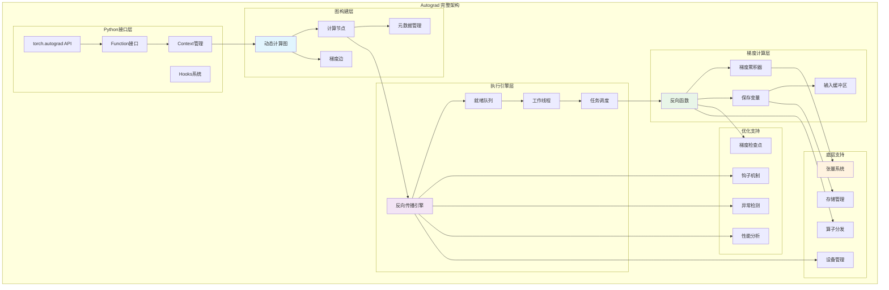
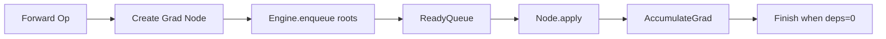
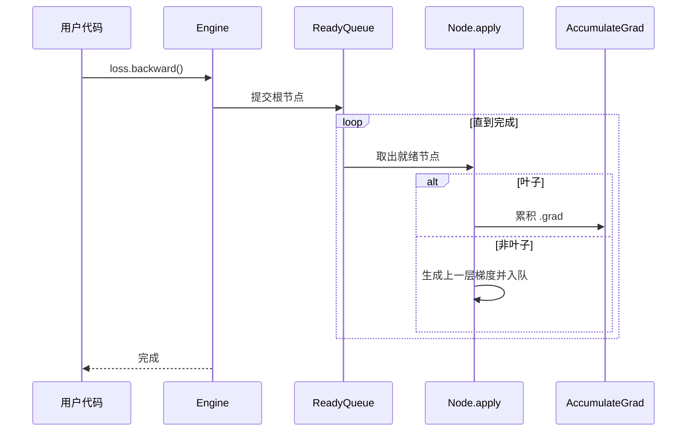
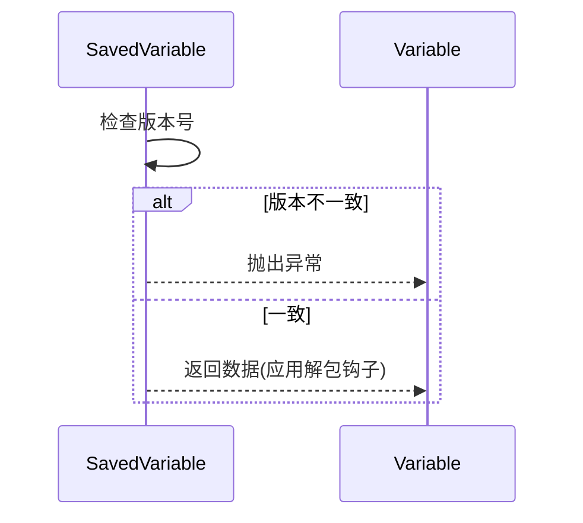
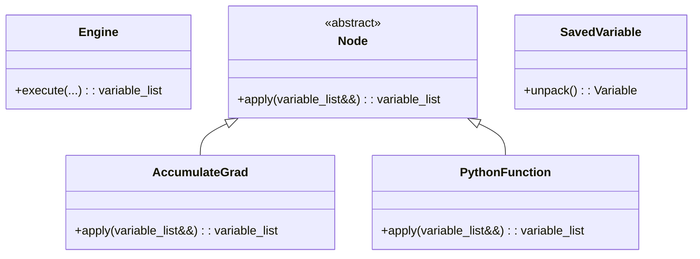

## 概述

PyTorch的Autograd系统是其核心优势之一，实现了自动求导和反向传播算法。与静态计算图不同，PyTorch采用动态计算图（define-by-run），允许在运行时构建和修改计算图，为研究人员提供了极大的灵活性。深入剖析Autograd系统的完整实现机制。

<!--more-->

## 1. Autograd系统架构

### 1.1 核心组件关系

Autograd系统采用分层架构，主要组件及其关系如下：

```
┌─────────────────────────────────────────┐
│           Python Interface             │  ← torch.autograd API
├─────────────────────────────────────────┤
│          Function System               │  ← 自定义函数接口
├─────────────────────────────────────────┤  
│         Graph Construction             │  ← 动态图构建
├─────────────────────────────────────────┤
│          Node & Edge System            │  ← 图节点和边
├─────────────────────────────────────────┤
│         Backward Engine                │  ← 反向传播引擎
├─────────────────────────────────────────┤
│        Gradient Computation            │  ← 梯度计算内核
└─────────────────────────────────────────┘
```

### 1.2 Autograd系统完整架构图



## 2. 计算图的构建机制

### 2.1 Node节点系统

Node是计算图中的基本单元，每个Node代表一个操作：

```cpp
namespace torch::autograd {

// 抽象基类 - 所有计算节点的基础
struct TORCH_API Node : std::enable_shared_from_this<Node> {
 public:
  // 唯一序列号，用于图遍历排序
  const uint64_t sequence_nr_;
  
  // 下一个节点的边列表（指向输入变量的梯度函数）
  edge_list next_edges_;
  
  // 输入元数据，用于形状检查和错误报告  
  std::vector<std::optional<InputMetadata>> input_metadata_;
  
  // 构造函数
  Node(edge_list&& next_edges = edge_list())
      : sequence_nr_(get_next_sequence_nr()),
        next_edges_(std::move(next_edges)) {}
  
  virtual ~Node() = default;
  
  // 核心接口 - 计算反向传播梯度
  virtual variable_list apply(variable_list&& inputs) = 0;
  
  // 获取节点名称，用于调试和错误报告
  virtual std::string name() const;
  
  // 释放保存的变量（用于内存优化）
  virtual void release_variables() {}
  
  // 编译优化相关
  virtual void compiled_args(CompiledNodeArgs& args) const;
  virtual variable_list apply_with_saved(
      const variable_list& inputs, 
      SwapSavedVariables& saved);
  
  // 添加输入边
  void add_input_metadata(const Variable& input) {
    add_input_metadata(InputMetadata{input});
  }
  
  void add_input_metadata(const InputMetadata& metadata) {
    input_metadata_.emplace_back(metadata);
  }
  
  // 设置下一个节点
  void set_next_edges(edge_list&& next_edges) {
    next_edges_ = std::move(next_edges);
  }
  
  void add_next_edge(Edge edge) {
    next_edges_.push_back(std::move(edge));
  }
  
  // 获取序列号
  uint64_t sequence_nr() const noexcept { return sequence_nr_; }
  
 protected:
  // 验证输出梯度的形状和类型
  void validate_outputs(
      const variable_list& inputs,
      variable_list& outputs,
      const std::function<std::string(const std::string&)>& format_error);
      
 private:
  // 生成唯一序列号
  static uint64_t get_next_sequence_nr() {
    static std::atomic<uint64_t> next_sequence_nr{0};
    return ++next_sequence_nr;
  }
};

// 输入元数据 - 用于验证和错误报告
struct InputMetadata {
  at::TensorGeometry geometry_;  // 张量几何信息（形状、步长等）
  at::ScalarType dtype_;         // 数据类型
  at::Device device_;            // 设备信息
  bool requires_grad_;           // 是否需要梯度
  
  InputMetadata(const Variable& var) 
      : geometry_(TensorGeometry(var)),
        dtype_(var.scalar_type()),
        device_(var.device()),
        requires_grad_(var.requires_grad()) {}
        
  // 验证张量是否匹配此元数据
  bool is_same_input(const Variable& var) const {
    return dtype_ == var.scalar_type() && 
           device_ == var.device() &&
           geometry_.is_same_geometry_as(var);
  }
};

} // namespace torch::autograd
```

### 2.2 Edge边系统

Edge表示计算图中节点之间的连接：

```cpp
namespace torch::autograd {

// 梯度边 - 连接节点的有向边
struct Edge {
  // 指向目标函数节点的共享指针
  std::shared_ptr<Node> function;
  
  // 在目标函数输入中的索引位置
  uint32_t input_nr;
  
  // 构造函数
  Edge() noexcept : function(nullptr), input_nr(0) {}
  
  Edge(std::shared_ptr<Node> function_, uint32_t input_nr_) noexcept
      : function(std::move(function_)), input_nr(input_nr_) {}
  
  // 检查边是否有效
  bool is_valid() const noexcept {
    return function != nullptr;
  }
  
  // 获取函数名称（用于调试）
  std::string name() const {
    if (!function) {
      return "None";
    }
    return function->name() + "[" + std::to_string(input_nr) + "]";
  }
};

// 边列表类型别名
using edge_list = std::vector<Edge>;

// 梯度边创建函数
Edge make_gradient_edge(Variable& variable, uint32_t input_nr) {
  auto grad_fn = variable.grad_fn();
  if (!grad_fn) {
    // 叶子变量使用梯度累积器
    grad_fn = variable.gradient_accumulator();
  }
  return Edge(std::move(grad_fn), input_nr);
}

} // namespace torch::autograd
```

### 2.3 动态图构建过程

当执行张量运算时，PyTorch会自动构建计算图：

```cpp
namespace torch::autograd {

// 示例：加法操作的自动微分实现
class AddBackward : public Node {
 private:
  at::ScalarType self_scalar_type;  // 第一个操作数类型
  at::ScalarType other_scalar_type; // 第二个操作数类型
  
 public:
  AddBackward(
      at::ScalarType self_scalar_type_,
      at::ScalarType other_scalar_type_)
      : self_scalar_type(self_scalar_type_),
        other_scalar_type(other_scalar_type_) {}
  
  // 反向传播实现
  variable_list apply(variable_list&& grads) override {
    TORCH_CHECK(grads.size() == 1, "AddBackward expects exactly one gradient input");
    
    auto grad_output = grads[0];
    variable_list grad_inputs(2);
    
    // 对于加法：∂(x+y)/∂x = 1, ∂(x+y)/∂y = 1
    // 所以梯度直接传播，但需要处理广播
    
    if (should_compute_output(0)) {  // 计算第一个输入的梯度
      grad_inputs[0] = handle_r_to_type(grad_output, self_scalar_type);
    }
    
    if (should_compute_output(1)) {  // 计算第二个输入的梯度  
      grad_inputs[1] = handle_r_to_type(grad_output, other_scalar_type);
    }
    
    return grad_inputs;
  }
  
  std::string name() const override {
    return "AddBackward";
  }
  
 private:
  // 处理类型转换和形状调整
  Variable handle_r_to_type(const Variable& grad, at::ScalarType target_type) {
    if (grad.scalar_type() != target_type) {
      return grad.to(target_type);
    }
    return grad;
  }
};

// 前向操作中的图构建
Tensor add_autograd_impl(const Tensor& self, const Tensor& other) {
  // 1. 执行前向计算
  auto result = at::add(self, other);
  
  // 2. 如果需要梯度，构建反向图
  if (compute_requires_grad(self, other)) {
    auto grad_fn = std::make_shared<AddBackward>(
        self.scalar_type(),
        other.scalar_type()
    );
    
    // 设置下一个边（指向输入的梯度函数）
    grad_fn->set_next_edges({
        make_gradient_edge(const_cast<Tensor&>(self), 0),
        make_gradient_edge(const_cast<Tensor&>(other), 1)
    });
    
    // 将梯度函数附加到结果张量
    set_gradient_edge(result, {grad_fn, 0});
  }
  
  return result;
}

} // namespace torch::autograd
```

## 3. 反向传播引擎

### 3.1 Engine核心架构

Engine是Autograd系统的心脏，负责执行反向传播：

```cpp
namespace torch::autograd {

class TORCH_API Engine {
 public:
  // 单例模式 - 全局唯一的引擎实例
  static Engine& get_default_engine();
  
  // 执行反向传播的主要接口
  variable_list execute(
      const edge_list& roots,           // 根节点列表
      const variable_list& inputs,      // 输入梯度
      bool keep_graph = false,          // 是否保持图结构
      bool create_graph = false,        // 是否创建新图用于高阶导数
      bool accumulate_grad = true,      // 是否累积梯度
      const edge_list& outputs = {}     // 输出边列表
  );
  
  // 简化接口 - 从单个张量开始反向传播
  void execute_with_graph_task(
      const std::shared_ptr<GraphTask>& graph_task,
      std::shared_ptr<Node> graph_root,
      InputBuffer&& input_buffer
  );
  
  // 线程池管理
  void start_worker_threads();
  void stop_worker_threads();
  void set_num_threads(int num_threads);
  
 private:
  // 工作线程池
  std::vector<std::thread> worker_threads_;
  std::atomic<bool> should_stop_{false};
  
  // 就绪队列管理
  std::vector<std::unique_ptr<ReadyQueue>> ready_queues_;
  std::atomic<uint64_t> next_ready_queue_{0};
  
  // 执行单个节点任务
  void execute_node_task(
      const NodeTask& task,
      const std::shared_ptr<GraphTask>& graph_task
  );
  
  // 初始化图任务
  std::shared_ptr<GraphTask> execute_root(
      const edge_list& roots,
      const variable_list& inputs,
      bool keep_graph,
      bool create_graph,
      bool accumulate_grad,
      const edge_list& outputs
  );
};

} // namespace torch::autograd
```

### 3.2 GraphTask和NodeTask

GraphTask管理一次完整的反向传播过程：

```cpp
namespace torch::autograd {

// 图任务 - 管理一次完整的反向传播
struct GraphTask : std::enable_shared_from_this<GraphTask> {
  // 异常处理
  std::exception_ptr exception_;
  
  // 输出缓冲区 - 存储计算的梯度
  std::unordered_map<Node*, InputBuffer> not_ready_;
  std::unordered_map<Node*, int> dependencies_;
  
  // 同步机制
  std::atomic<int> outstanding_tasks_{0};
  std::mutex mutex_;
  std::condition_variable not_done_;
  std::atomic<bool> completed_{false};
  
  // 配置选项
  bool keep_graph_;
  bool create_graph_;
  int64_t cpu_ready_queue_size_ = 0;
  
  // 输出边和累积器
  edge_list outputs_;
  bool accumulate_grad_;
  
  // 执行上下文
  std::unordered_set<c10::Stream> leaf_streams;
  
  GraphTask(
      bool keep_graph,
      bool create_graph,
      edge_list outputs,
      bool accumulate_grad)
      : keep_graph_(keep_graph),
        create_graph_(create_graph),
        outputs_(std::move(outputs)),
        accumulate_grad_(accumulate_grad) {}
  
  // 标记任务完成
  void mark_as_completed_and_run_post_processing() {
    completed_.store(true);
    not_done_.notify_all();
  }
  
  // 等待任务完成
  void wait() {
    std::unique_lock<std::mutex> lock(mutex_);
    not_done_.wait(lock, [this]{ return completed_.load(); });
    if (exception_) {
      std::rethrow_exception(exception_);
    }
  }
};

// 节点任务 - 单个计算节点的执行单元
struct NodeTask {
  std::weak_ptr<GraphTask> base_;    // 所属的图任务
  std::shared_ptr<Node> fn_;         // 要执行的函数节点
  InputBuffer inputs_;               // 输入梯度缓冲区
  bool isShutdownTask_;              // 是否为关闭任务
  
  NodeTask(
      std::weak_ptr<GraphTask> base,
      std::shared_ptr<Node> fn,
      InputBuffer inputs,
      bool isShutdownTask = false)
      : base_(std::move(base)),
        fn_(std::move(fn)),
        inputs_(std::move(inputs)),
        isShutdownTask_(isShutdownTask) {}
  
  // 获取重入深度（用于死锁检测）
  int getReentrantDepth() const {
    auto graph_task = base_.lock();
    return graph_task ? graph_task->reentrant_depth_ : 0;
  }
};

} // namespace torch::autograd
```

### 3.3 输入缓冲区机制

InputBuffer用于累积来自不同路径的梯度：

```cpp
namespace torch::autograd {

// 输入缓冲区 - 累积多个梯度输入
class InputBuffer {
 private:
  // 梯度变量列表
  variable_list buffer_;
  
  // 设备信息（用于优化内存分配）
  std::vector<c10::optional<c10::Device>> device_;
  
 public:
  explicit InputBuffer(size_t size) 
      : buffer_(size), device_(size) {}
  
  InputBuffer(const InputBuffer&) = delete;
  InputBuffer& operator=(const InputBuffer&) = delete;
  
  InputBuffer(InputBuffer&&) = default;
  InputBuffer& operator=(InputBuffer&&) = default;
  
  // 添加梯度到指定位置
  Variable add(size_t pos, Variable&& var) {
    TORCH_CHECK(pos < buffer_.size(), "Index out of range");
    
    auto& old_var = buffer_[pos];
    if (!old_var.defined()) {
      // 第一次添加
      buffer_[pos] = std::move(var);
      device_[pos] = buffer_[pos].device();
      return buffer_[pos];
    } else {
      // 累积梯度
      if (var.device() != old_var.device()) {
        // 跨设备梯度累积
        var = var.to(old_var.device());
      }
      
      // 执行梯度累积 old_var += var
      old_var.add_(var);
      return old_var;
    }
  }
  
  // 获取指定位置的梯度
  const Variable& operator[](size_t pos) const {
    return buffer_[pos];
  }
  
  // 转换为变量列表
  variable_list unflatten() && {
    return std::move(buffer_);
  }
  
  // 获取缓冲区大小
  size_t size() const { return buffer_.size(); }
};

} // namespace torch::autograd
```

## 4. Function自定义函数系统

### 4.1 Function基类设计

Function类提供了定义自定义自动微分操作的接口：

```python
class Function:
    """自定义自动微分函数的基类"""
    
    @staticmethod  
    def forward(ctx, *args):
        """前向传播计算
        
        Args:
            ctx: 上下文对象，用于保存反向传播需要的信息
            *args: 输入参数
            
        Returns:
            前向计算的结果
        """
        raise NotImplementedError("subclass must implement forward")
    
    @staticmethod
    def backward(ctx, *grad_outputs):
        """反向传播计算
        
        Args:
            ctx: 上下文对象，包含前向传播保存的信息
            *grad_outputs: 输出的梯度
            
        Returns:
            输入的梯度列表
        """
        raise NotImplementedError("subclass must implement backward")
    
    @classmethod
    def apply(cls, *args):
        """应用函数的接口"""
        return _C._functions.apply(cls, *args)
```

### 4.2 Context上下文管理

FunctionCtx负责在前向和反向传播之间传递信息：

```cpp
namespace torch::autograd {

// Python Function的C++对应
struct PythonFunction : public Node {
 public:
  // Python函数对象
  PyObject* python_function;
  
  // 保存的张量（用于反向传播）
  variable_list saved_variables;
  
  // 非张量数据
  py::object saved_data;
  
  PythonFunction(PyObject* function) : python_function(function) {
    Py_INCREF(function);
  }
  
  ~PythonFunction() {
    // 释放Python对象引用
    Py_DECREF(python_function);
  }
  
  // 执行Python的backward方法
  variable_list apply(variable_list&& inputs) override {
    pybind11::gil_scoped_acquire gil;
    
    try {
      // 调用Python的backward方法
      py::object py_fn(py::handle(python_function));
      py::object result = py_fn.attr("backward")(py::cast(inputs));
      
      // 转换结果为C++格式
      return py::cast<variable_list>(result);
      
    } catch (py::error_already_set& e) {
      throw std::runtime_error("Error in Python backward: " + std::string(e.what()));
    }
  }
  
  std::string name() const override {
    pybind11::gil_scoped_acquire gil;
    py::object py_fn(py::handle(python_function));
    
    if (py::hasattr(py_fn, "__name__")) {
      return py::cast<std::string>(py_fn.attr("__name__"));
    }
    return "PythonFunction";
  }
};

// Context实现
class FunctionCtx {
 private:
  // 保存的张量列表
  std::vector<Variable> saved_tensors_;
  
  // 保存的非张量数据
  std::unordered_map<std::string, py::object> saved_data_;
  
  // 需要计算梯度的输出索引
  std::vector<bool> needs_input_grad_;
  
 public:
  // 保存张量用于反向传播
  void save_for_backward(const variable_list& tensors) {
    saved_tensors_.clear();
    saved_tensors_.reserve(tensors.size());
    
    for (const auto& tensor : tensors) {
      if (tensor.defined()) {
        // 保存张量的快照，避免原地操作影响
        saved_tensors_.emplace_back(SavedVariable(tensor, false));
      } else {
        saved_tensors_.emplace_back();
      }
    }
  }
  
  // 获取保存的张量
  variable_list get_saved_tensors() const {
    variable_list result;
    result.reserve(saved_tensors_.size());
    
    for (const auto& saved : saved_tensors_) {
      if (saved.defined()) {
        result.emplace_back(saved.unpack());
      } else {
        result.emplace_back();
      }
    }
    
    return result;
  }
  
  // 保存非张量数据
  template<typename T>
  void save_data(const std::string& key, T&& data) {
    saved_data_[key] = py::cast(std::forward<T>(data));
  }
  
  // 获取非张量数据
  template<typename T>
  T get_data(const std::string& key) const {
    auto it = saved_data_.find(key);
    if (it != saved_data_.end()) {
      return py::cast<T>(it->second);
    }
    throw std::runtime_error("Key not found: " + key);
  }
  
  // 设置输入梯度需求
  void set_needs_input_grad(const std::vector<bool>& needs_grad) {
    needs_input_grad_ = needs_grad;
  }
  
  // 检查是否需要计算某个输入的梯度
  bool needs_input_grad(size_t index) const {
    return index < needs_input_grad_.size() && needs_input_grad_[index];
  }
};

} // namespace torch::autograd
```

### 4.3 自定义函数示例

以下是一个完整的自定义函数实现示例：

```python
import torch
from torch.autograd import Function

class LinearFunction(Function):
    """自定义线性变换函数示例"""
    
    @staticmethod
    def forward(ctx, input, weight, bias=None):
        """前向传播：output = input @ weight.T + bias
        
        Args:
            ctx: 上下文对象
            input: 输入张量 [N, in_features] 
            weight: 权重矩阵 [out_features, in_features]
            bias: 偏置向量 [out_features]，可选
        """
        # 保存反向传播需要的张量
        ctx.save_for_backward(input, weight, bias)
        
        # 执行前向计算
        output = input.mm(weight.t())
        if bias is not None:
            output += bias.unsqueeze(0).expand_as(output)
        
        return output
    
    @staticmethod
    def backward(ctx, grad_output):
        """反向传播计算各输入的梯度
        
        Args:
            grad_output: 输出的梯度 [N, out_features]
            
        Returns:
            input, weight, bias的梯度
        """
        # 获取前向传播保存的张量
        input, weight, bias = ctx.saved_tensors
        
        grad_input = grad_weight = grad_bias = None
        
        # 计算输入梯度：∂L/∂input = grad_output @ weight
        if ctx.needs_input_grad[0]:
            grad_input = grad_output.mm(weight)
            
        # 计算权重梯度：∂L/∂weight = grad_output.T @ input  
        if ctx.needs_input_grad[1]:
            grad_weight = grad_output.t().mm(input)
            
        # 计算偏置梯度：∂L/∂bias = sum(grad_output, dim=0)
        if bias is not None and ctx.needs_input_grad[2]:
            grad_bias = grad_output.sum(0)
            
        return grad_input, grad_weight, grad_bias

# 使用示例
def custom_linear(input, weight, bias=None):
    """使用自定义线性函数"""
    return LinearFunction.apply(input, weight, bias)

# 测试
x = torch.randn(10, 5, requires_grad=True)
w = torch.randn(3, 5, requires_grad=True) 
b = torch.randn(3, requires_grad=True)

y = custom_linear(x, w, b)
loss = y.sum()
loss.backward()

print(f"Input gradient shape: {x.grad.shape}")    # [10, 5]
print(f"Weight gradient shape: {w.grad.shape}")   # [3, 5]  
print(f"Bias gradient shape: {b.grad.shape}")     # [3]
```

## 5. 梯度累积和优化

### 5.1 梯度累积器

对于叶子变量（用户创建的requires_grad=True的张量），PyTorch使用梯度累积器：

```cpp
namespace torch::autograd {

// 梯度累积器 - 累积叶子变量的梯度
struct AccumulateGrad : public Node {
 private:
  Variable variable_;  // 目标变量的弱引用
  
 public:
  explicit AccumulateGrad(const Variable& variable) : variable_(variable) {}
  
  variable_list apply(variable_list&& grads) override {
    TORCH_CHECK(grads.size() == 1, "AccumulateGrad expects exactly one gradient");
    
    auto grad = std::move(grads[0]);
    if (!grad.defined()) {
      return {};
    }
    
    // 累积梯度到变量的.grad字段
    auto& var_grad = variable_.grad();
    
    if (!var_grad.defined()) {
      // 第一次设置梯度
      variable_.mutable_grad() = std::move(grad);
    } else {
      // 累积梯度：var.grad += new_grad
      if (grad.device() != var_grad.device()) {
        // 跨设备梯度需要移动
        grad = grad.to(var_grad.device());
      }
      
      // 检查形状是否兼容
      if (!var_grad.sizes().equals(grad.sizes())) {
        // 处理广播情况
        grad = handle_shape_mismatch(var_grad, grad);
      }
      
      var_grad.add_(grad);
    }
    
    return {};  // 叶子节点不需要继续传播梯度
  }
  
  std::string name() const override {
    return "AccumulateGrad";
  }
  
  // 释放变量引用（内存优化）
  void release_variables() override {
    variable_.reset();
  }
  
 private:
  // 处理形状不匹配的梯度累积
  Variable handle_shape_mismatch(const Variable& var_grad, const Variable& grad) {
    // 处理广播梯度的情况
    auto var_shape = var_grad.sizes();
    auto grad_shape = grad.sizes();
    
    if (var_shape.size() < grad_shape.size()) {
      // 变量形状维度更少，需要对梯度求和
      auto sum_grad = grad;
      
      // 对额外的维度求和
      for (int64_t i = 0; i < grad_shape.size() - var_shape.size(); ++i) {
        sum_grad = sum_grad.sum(0, true);  // keepdim=true
      }
      
      // 继续处理剩余的维度差异
      for (int64_t i = 0; i < var_shape.size(); ++i) {
        if (var_shape[i] == 1 && sum_grad.size(i) > 1) {
          sum_grad = sum_grad.sum(i, true);
        }
      }
      
      return sum_grad.view(var_shape);
    }
    
    return grad;
  }
};

} // namespace torch::autograd
```

### 5.2 SavedVariable机制

SavedVariable用于在计算图中安全地保存张量：

```cpp
namespace torch::autograd {

// 保存的变量 - 防止原地操作影响
class SavedVariable {
 private:
  // 保存的数据
  Variable data_;
  
  // 原始变量的版本号
  uint32_t version_counter_;
  
  // 是否保存输出编号
  bool save_output_nr_;
  uint32_t output_nr_;
  
  // 钩子ID（用于内存优化）
  std::vector<hooks::RemovableHandle> hooks_;
  
 public:
  SavedVariable(const Variable& variable, bool is_output, uint32_t output_nr = 0)
      : version_counter_(variable.current_version()),
        save_output_nr_(is_output),
        output_nr_(output_nr) {
    
    if (variable.defined()) {
      // 检查是否需要保存
      bool was_requires_grad = variable.requires_grad();
      
      if (was_requires_grad) {
        // 需要梯度的变量，保存数据但断开梯度计算图
        data_ = variable.detach();
        data_.set_requires_grad(was_requires_grad);
      } else {
        // 不需要梯度的变量，直接保存
        data_ = variable;
      }
      
      // 应用保存张量的钩子
      apply_saved_tensor_hooks();
    }
  }
  
  // 解包保存的变量
  Variable unpack() const {
    if (!data_.defined()) {
      return Variable();
    }
    
    // 检查版本是否一致（检测原地操作）
    if (version_counter_ != data_.current_version()) {
      throw std::runtime_error(
          "One of the variables needed for gradient computation has been "
          "modified by an inplace operation");
    }
    
    // 应用解包钩子
    auto result = apply_unpack_hooks(data_);
    
    return result;
  }
  
  void reset_data() {
    data_.reset();
    hooks_.clear();
  }
  
  bool defined() const {
    return data_.defined();
  }
  
 private:
  // 应用保存张量钩子（如移动到CPU以节省GPU内存）
  void apply_saved_tensor_hooks() {
    auto& hook_state = SavedTensorHooksState::get();
    
    for (const auto& hook : hook_state.get_hooks()) {
      auto handle = hook.pack_hook(data_);
      if (handle.has_value()) {
        hooks_.push_back(handle.value());
      }
    }
  }
  
  // 应用解包钩子
  Variable apply_unpack_hooks(const Variable& var) const {
    auto result = var;
    
    // 逆序应用解包钩子
    for (auto it = hooks_.rbegin(); it != hooks_.rend(); ++it) {
      result = it->unpack_hook(result);
    }
    
    return result;
  }
};

} // namespace torch::autograd
```

## 6. 高阶导数支持

### 6.1 create_graph机制

PyTorch支持计算高阶导数，通过create_graph=True实现：

```python
import torch

def higher_order_derivatives_example():
    """高阶导数计算示例"""
    
    # 创建输入张量
    x = torch.tensor(2.0, requires_grad=True)
    
    # 定义函数 f(x) = x^4 + 2*x^3 + x^2
    def f(x):
        return x**4 + 2*x**3 + x**2
    
    # 计算函数值
    y = f(x)
    print(f"f(2) = {y.item()}")  # f(2) = 16 + 16 + 4 = 36
    
    # 一阶导数：f'(x) = 4*x^3 + 6*x^2 + 2*x
    grad1 = torch.autograd.grad(y, x, create_graph=True)[0] 
    print(f"f'(2) = {grad1.item()}")  # f'(2) = 32 + 24 + 4 = 60
    
    # 二阶导数：f''(x) = 12*x^2 + 12*x + 2  
    grad2 = torch.autograd.grad(grad1, x, create_graph=True)[0]
    print(f"f''(2) = {grad2.item()}")  # f''(2) = 48 + 24 + 2 = 74
    
    # 三阶导数：f'''(x) = 24*x + 12
    grad3 = torch.autograd.grad(grad2, x)[0]
    print(f"f'''(2) = {grad3.item()}")  # f'''(2) = 48 + 12 = 60
    
# create_graph的C++实现机制  
```

```cpp
namespace torch::autograd {

// 高阶导数的图构建
variable_list grad_with_create_graph(
    const variable_list& outputs,
    const variable_list& inputs,
    const variable_list& grad_outputs,
    bool create_graph) {
  
  edge_list roots;
  roots.reserve(outputs.size());
  
  // 为每个输出创建根节点
  for (size_t i = 0; i < outputs.size(); ++i) {
    const auto& output = outputs[i];
    Variable grad_output = grad_outputs.empty() ? 
        torch::ones_like(output) : grad_outputs[i];
    
    if (create_graph && grad_output.requires_grad()) {
      // 创建新图时，梯度也需要参与计算图
      auto gradient_edge = make_gradient_edge(grad_output, 0);
      roots.push_back(gradient_edge);
    } else {
      // 普通反向传播
      auto gradient_edge = make_gradient_edge(const_cast<Variable&>(output), 0);
      roots.push_back(gradient_edge);
    }
  }
  
  // 执行反向传播，并根据create_graph决定是否保持图结构
  return Engine::get_default_engine().execute(
      roots, 
      grad_outputs.empty() ? 
          variable_list(outputs.size(), Variable()) : grad_outputs,
      /*keep_graph=*/create_graph,
      /*create_graph=*/create_graph,
      /*accumulate_grad=*/true,
      /*outputs=*/{}
  );
}

} // namespace torch::autograd
```

### 6.2 双重反向传播

双重反向传播用于计算二阶导数：

```cpp
namespace torch::autograd {

// 支持双重反向传播的函数示例
class MulBackward : public Node {
 private:
  SavedVariable self_;
  SavedVariable other_;
  
 public:
  MulBackward(const Variable& self, const Variable& other)
      : self_(SavedVariable(self, false)),
        other_(SavedVariable(other, false)) {}
  
  variable_list apply(variable_list&& grads) override {
    TORCH_CHECK(grads.size() == 1);
    auto grad_output = grads[0];
    
    variable_list grad_inputs(2);
    
    // 计算一阶导数
    if (should_compute_output(0)) {
      grad_inputs[0] = grad_output * other_.unpack();
    }
    
    if (should_compute_output(1)) {
      grad_inputs[1] = grad_output * self_.unpack();  
    }
    
    return grad_inputs;
  }
  
  // 支持双重反向传播的apply函数
  variable_list apply_with_saved(
      const variable_list& inputs,
      SwapSavedVariables& saved) override {
    
    auto grad_output = inputs[0];
    auto self = saved.unpack(self_);
    auto other = saved.unpack(other_);
    
    variable_list grad_inputs(2);
    
    if (should_compute_output(0)) {
      // ∂(grad_output * other)/∂self 的计算
      if (grad_output.requires_grad() || other.requires_grad()) {
        grad_inputs[0] = create_mul_backward_node(grad_output, other);
      } else {
        grad_inputs[0] = grad_output * other;
      }
    }
    
    if (should_compute_output(1)) {
      // ∂(grad_output * self)/∂other 的计算
      if (grad_output.requires_grad() || self.requires_grad()) {
        grad_inputs[1] = create_mul_backward_node(grad_output, self);
      } else {
        grad_inputs[1] = grad_output * self;
      }
    }
    
    return grad_inputs;
  }
  
  std::string name() const override {
    return "MulBackward";
  }
  
 private:
  Variable create_mul_backward_node(const Variable& a, const Variable& b) {
    // 为二阶导数创建新的计算图节点
    auto result = a * b;
    
    if ((a.requires_grad() || b.requires_grad()) && grad_mode_enabled()) {
      auto grad_fn = std::make_shared<MulBackward>(a, b);
      grad_fn->set_next_edges({
          make_gradient_edge(const_cast<Variable&>(a), 0),
          make_gradient_edge(const_cast<Variable&>(b), 1)
      });
      set_gradient_edge(result, {grad_fn, 0});
    }
    
    return result;
  }
};

} // namespace torch::autograd
```

## 7. 内存优化技术

### 7.1 梯度检查点

梯度检查点通过重计算减少内存使用：

```python
import torch
from torch.utils.checkpoint import checkpoint

class CheckpointExample(torch.nn.Module):
    """梯度检查点使用示例"""
    
    def __init__(self):
        super().__init__()
        self.layer1 = torch.nn.Linear(1000, 1000)
        self.layer2 = torch.nn.Linear(1000, 1000) 
        self.layer3 = torch.nn.Linear(1000, 1000)
        
    def forward(self, x):
        # 不使用检查点：保存所有中间激活
        # x = torch.nn.functional.relu(self.layer1(x))
        # x = torch.nn.functional.relu(self.layer2(x))
        # return self.layer3(x)
        
        # 使用检查点：不保存中间激活，反向时重新计算
        def checkpoint_segment(x):
            x = torch.nn.functional.relu(self.layer1(x))
            x = torch.nn.functional.relu(self.layer2(x))
            return x
        
        x = checkpoint(checkpoint_segment, x)
        return self.layer3(x)

# 检查点的C++实现原理
```

```cpp
namespace torch::autograd {

// 检查点函数的实现  
class CheckpointFunction : public Function {
 private:
  // 保存的输入（用于重计算）
  variable_list saved_inputs_;
  
  // 保存的前向函数
  std::function<variable_list(const variable_list&)> forward_fn_;
  
 public:
  static variable_list apply(
      const std::function<variable_list(const variable_list&)>& forward_fn,
      const variable_list& inputs) {
    
    // 检查是否在梯度计算模式下
    if (!GradMode::is_enabled()) {
      // 推理模式下直接计算
      return forward_fn(inputs);
    }
    
    // 创建检查点函数节点
    auto checkpoint_fn = std::make_shared<CheckpointFunction>();
    checkpoint_fn->forward_fn_ = forward_fn;
    checkpoint_fn->saved_inputs_ = inputs;
    
    // 执行前向计算
    auto outputs = forward_fn(inputs);
    
    // 为输出设置梯度函数
    for (auto& output : outputs) {
      if (output.requires_grad()) {
        set_gradient_edge(output, {checkpoint_fn, 0});
      }
    }
    
    return outputs;
  }
  
  variable_list apply(variable_list&& grad_outputs) override {
    // 重新启用梯度计算
    torch::autograd::GradMode::set_enabled(true);
    
    // 重新计算前向传播（这次保存中间结果）
    auto recomputed_outputs = forward_fn_(saved_inputs_);
    
    // 现在执行正常的反向传播
    variable_list grad_inputs;
    
    if (!recomputed_outputs.empty()) {
      grad_inputs = torch::autograd::grad(
          recomputed_outputs,
          saved_inputs_, 
          grad_outputs,
          /*retain_graph=*/false,
          /*create_graph=*/true  // 支持高阶导数
      );
    }
    
    return grad_inputs;
  }
  
  void release_variables() override {
    // 释放保存的输入以节省内存
    saved_inputs_.clear();
  }
  
  std::string name() const override {
    return "CheckpointFunction";
  }
};

} // namespace torch::autograd
```

### 7.2 保存张量钩子

保存张量钩子允许自定义张量保存和恢复策略：

```python
import torch
from torch.autograd.graph import save_on_cpu

def memory_optimization_example():
    """内存优化示例"""
    
    # 使用CPU保存钩子，将中间结果保存到CPU内存
    with save_on_cpu(pin_memory=True):
        x = torch.randn(1000, 1000, requires_grad=True, device='cuda')
        
        # 大型中间计算
        y = x @ x.T  # 这个中间结果会被保存到CPU
        z = torch.relu(y)
        loss = z.sum()
        
        # 反向传播时，会从CPU恢复中间结果到GPU
        loss.backward()

# 自定义保存钩子
class CustomSavedTensorHook:
    """自定义保存张量钩子"""
    
    def __init__(self, device='cpu'):
        self.device = device
        
    def pack_hook(self, tensor):
        """保存时调用：将张量移动到指定设备"""
        if tensor.device.type != self.device:
            # 移动到目标设备并返回
            return tensor.to(self.device)
        return tensor
        
    def unpack_hook(self, tensor):
        """恢复时调用：将张量移动回原设备"""ᴰ
        # 这里需要知道原始设备信息
        # 实际实现会更复杂
        return tensor.cuda() if tensor.device.type == 'cpu' else tensor

# 使用自定义钩子
def use_custom_hook():
    hook = CustomSavedTensorHook('cpu')
    
    with torch.autograd.graph.saved_tensors_hooks(
        pack_hook=hook.pack_hook,
        unpack_hook=hook.unpack_hook
    ):
        # 在这个上下文中的所有自动微分操作
        # 都会使用自定义的保存/恢复策略
        x = torch.randn(100, 100, requires_grad=True)
        y = x.mm(x.t())
        loss = y.sum()
        loss.backward()
```

## 8. 性能优化和调试

### 8.1 异常检测模式

PyTorch提供了异常检测模式来帮助发现梯度计算中的问题：

```python
import torch
from torch.autograd import detect_anomaly

def anomaly_detection_example():
    """异常检测示例"""
    
    with detect_anomaly():
        x = torch.randn(10, requires_grad=True)
        
        # 故意制造NaN
        y = x * float('inf')
        z = y.sum()
        
        try:
            z.backward()
        except RuntimeError as e:
            print(f"检测到异常: {e}")
            # 会提供详细的traceback信息，指出问题位置

# 异常检测的C++实现
```

```cpp
namespace torch::autograd {

// 异常检测节点包装器
class AnomalyMode : public Node {
 private:
  std::shared_ptr<Node> inner_;
  std::string forward_stack_trace_;
  
 public:
  AnomalyMode(std::shared_ptr<Node> inner) 
      : inner_(std::move(inner)) {
    // 捕获前向传播的堆栈信息
    forward_stack_trace_ = get_stack_trace();
  }
  
  variable_list apply(variable_list&& inputs) override {
    // 执行内部节点的反向传播
    auto outputs = inner_->apply(std::move(inputs));
    
    // 检查输出是否包含异常值
    for (const auto& output : outputs) {
      if (output.defined()) {
        check_for_anomalies(output);
      }
    }
    
    return outputs;
  }
  
  std::string name() const override {
    return "AnomalyMode[" + inner_->name() + "]";
  }
  
 private:
  void check_for_anomalies(const Variable& tensor) {
    auto data = tensor.data();
    
    // 检查NaN
    if (torch::any(torch::isnan(data)).item<bool>()) {
      throw std::runtime_error(
          "Function '" + inner_->name() + "' returned nan values in gradient.\n"
          "Forward call stack:\n" + forward_stack_trace_
      );
    }
    
    // 检查无穷大
    if (torch::any(torch::isinf(data)).item<bool>()) {
      throw std::runtime_error(
          "Function '" + inner_->name() + "' returned inf values in gradient.\n" 
          "Forward call stack:\n" + forward_stack_trace_
      );
    }
  }
  
  std::string get_stack_trace() {
    // 获取当前调用栈（简化实现）
    return "Stack trace capture would be implemented here";
  }
};

// 异常检测模式管理
class AnomalyModeState {
 private:
  thread_local static bool enabled_;
  
 public:
  static bool is_enabled() { return enabled_; }
  static void set_enabled(bool enabled) { enabled_ = enabled; }
  
  // RAII守卫
  class Guard {
   private:
    bool prev_state_;
    
   public:
    Guard(bool enabled) : prev_state_(is_enabled()) {
      set_enabled(enabled);
    }
    
    ~Guard() {
      set_enabled(prev_state_);
    }
  };
};

thread_local bool AnomalyModeState::enabled_ = false;

} // namespace torch::autograd
```

### 8.2 性能分析工具

```python
import torch
from torch.profiler import profile, ProfilerActivity

def profiling_autograd():
    """自动微分性能分析"""
    
    model = torch.nn.Sequential(
        torch.nn.Linear(1000, 1000),
        torch.nn.ReLU(),
        torch.nn.Linear(1000, 1000),
        torch.nn.ReLU(),
        torch.nn.Linear(1000, 10)
    )
    
    x = torch.randn(32, 1000)
    target = torch.randint(0, 10, (32,))
    criterion = torch.nn.CrossEntropyLoss()
    
    with profile(
        activities=[ProfilerActivity.CPU, ProfilerActivity.CUDA],
        record_shapes=True,
        with_stack=True
    ) as prof:
        for _ in range(10):
            output = model(x)
            loss = criterion(output, target)
            loss.backward()
            
            # 清零梯度
            for param in model.parameters():
                param.grad = None
    
    # 分析反向传播性能
    print("=== Backward Pass Performance ===")
    autograd_events = prof.key_averages().table(
        sort_by="cpu_time_total", 
        row_limit=20,
        tag_filter="backward"
    )
    print(autograd_events)
    
    # 导出Chrome trace用于可视化
    prof.export_chrome_trace("autograd_trace.json")

def gradient_computation_stats():
    """梯度计算统计"""
    
    # 监控梯度计算的内存使用
    torch.cuda.reset_peak_memory_stats()
    
    model = torch.nn.Linear(10000, 10000).cuda()
    x = torch.randn(100, 10000).cuda()
    
    # 前向传播
    forward_mem_before = torch.cuda.memory_allocated()
    y = model(x)
    forward_mem_after = torch.cuda.memory_allocated()
    
    # 反向传播  
    backward_mem_before = torch.cuda.memory_allocated()
    loss = y.sum()
    loss.backward()
    backward_mem_after = torch.cuda.memory_allocated()
    
    print(f"Forward pass memory: {(forward_mem_after - forward_mem_before) / 1e6:.2f} MB")
    print(f"Backward pass memory: {(backward_mem_after - backward_mem_before) / 1e6:.2f} MB")
    print(f"Peak memory usage: {torch.cuda.max_memory_allocated() / 1e6:.2f} MB")
```

### 8.3 实际生产环境的优化案例

以下是一些常见的自动微分优化策略：

```python
import torch
from torch.autograd.profiler import profile

class ProductionOptimizedAutograd:
    """生产环境中的自动微分优化实践"""
    
    @staticmethod
    def gradient_checkpointing_strategy(model, segments=4):
        """智能梯度检查点策略"""
        import torch.utils.checkpoint as cp
        
        # 将模型分段，每段使用检查点
        def checkpoint_wrapper(segment_layers):
            def forward_segment(x):
                for layer in segment_layers:
                    x = layer(x)
                return x
            return forward_segment
        
        # 分析模型内存使用，智能选择检查点位置
        layers = list(model.children())
        segment_size = len(layers) // segments
        
        optimized_model = torch.nn.Sequential()
        for i in range(0, len(layers), segment_size):
            segment = layers[i:i+segment_size]
            if len(segment) > 1:  # 只对多层段使用检查点
                checkpoint_fn = checkpoint_wrapper(segment)
                optimized_model.add_module(f'segment_{i}', 
                    CheckpointWrapper(checkpoint_fn))
            else:
                optimized_model.add_module(f'layer_{i}', segment[0])
        
        return optimized_model
    
    @staticmethod  
    def memory_efficient_backward():
        """内存高效的反向传播技巧"""
        # 优化经验总结
        
        # 1. 分批处理梯度计算
        def accumulate_gradients_in_batches(loss_fn, inputs, batch_size=32):
            total_loss = 0
            num_batches = len(inputs) // batch_size
            
            for i in range(0, len(inputs), batch_size):
                batch = inputs[i:i+batch_size]
                
                # 计算批次损失
                batch_loss = loss_fn(batch) / num_batches
                
                # 累积梯度（不清零）
                batch_loss.backward(retain_graph=(i < len(inputs) - batch_size))
                total_loss += batch_loss.item()
            
            return total_loss
        
        # 2. 使用混合精度减少内存占用
        def mixed_precision_training():
            scaler = torch.cuda.amp.GradScaler()
            
            with torch.cuda.amp.autocast():
                # 前向传播使用半精度
                output = model(input)
                loss = criterion(output, target)
            
            # 缩放损失，避免梯度下溢
            scaler.scale(loss).backward()
            
            # 检查梯度是否有效，然后unscale并更新
            scaler.step(optimizer)
            scaler.update()
    
    @staticmethod
    def distributed_gradient_synchronization():
        """分布式梯度同步优化"""
        # 基于实际项目经验的优化策略
        
        import torch.distributed as dist
        
        class GradientSyncOptimizer:
            def __init__(self, model, bucket_size_mb=25):
                self.model = model
                self.bucket_size = bucket_size_mb * 1024 * 1024
                self.gradient_buckets = []
                
                # 将参数分组到桶中以优化通信
                self._create_gradient_buckets()
            
            def _create_gradient_buckets(self):
                """创建梯度桶以优化all-reduce通信"""
                current_bucket = []
                current_size = 0
                
                for param in self.model.parameters():
                    if param.requires_grad:
                        param_size = param.numel() * param.element_size()
                        
                        if current_size + param_size > self.bucket_size and current_bucket:
                            # 当前桶已满，创建新桶
                            self.gradient_buckets.append(current_bucket)
                            current_bucket = []
                            current_size = 0
                        
                        current_bucket.append(param)
                        current_size += param_size
                
                if current_bucket:
                    self.gradient_buckets.append(current_bucket)
            
            def sync_gradients(self):
                """异步同步梯度"""
                sync_handles = []
                
                for bucket in self.gradient_buckets:
                    # 将桶中的梯度打包
                    bucket_grads = [p.grad for p in bucket if p.grad is not None]
                    if bucket_grads:
                        # 异步启动all-reduce
                        handle = dist.all_reduce(
                            torch.cat([g.flatten() for g in bucket_grads]),
                            async_op=True
                        )
                        sync_handles.append((handle, bucket, bucket_grads))
                
                # 等待所有all-reduce完成
                for handle, bucket, bucket_grads in sync_handles:
                    handle.wait()
                    # 重新分发同步后的梯度
                    self._redistribute_gradients(bucket, bucket_grads)

class CheckpointWrapper(torch.nn.Module):
    """检查点包装器"""
    def __init__(self, forward_fn):
        super().__init__()
        self.forward_fn = forward_fn
        
    def forward(self, x):
        return torch.utils.checkpoint.checkpoint(self.forward_fn, x)
```

## 9. 多线程和并发处理

### 9.1 线程安全机制

```cpp
namespace torch::autograd {

// 线程本地的自动微分状态
class AutogradState {
 private:
  thread_local static std::unique_ptr<AutogradState> state_;
  
  // 梯度模式状态
  bool grad_mode_enabled_ = true;
  
  // 推理模式状态
  bool inference_mode_enabled_ = false;
  
  // 异常检测状态
  bool anomaly_mode_enabled_ = false;
  
  // 视图重放状态
  bool view_replay_enabled_ = false;
  
 public:
  static AutogradState& get_instance() {
    if (!state_) {
      state_ = std::make_unique<AutogradState>();
    }
    return *state_;
  }
  
  // 梯度模式管理
  bool is_grad_enabled() const { return grad_mode_enabled_; }
  void set_grad_enabled(bool enabled) { grad_mode_enabled_ = enabled; }
  
  // 推理模式管理
  bool is_inference_mode_enabled() const { return inference_mode_enabled_; }
  void set_inference_mode_enabled(bool enabled) { inference_mode_enabled_ = enabled; }
  
  // 异常检测管理
  bool is_anomaly_enabled() const { return anomaly_mode_enabled_; }
  void set_anomaly_enabled(bool enabled) { anomaly_mode_enabled_ = enabled; }
};

thread_local std::unique_ptr<AutogradState> AutogradState::state_;

// 线程安全的引擎执行
class ThreadSafeEngine : public Engine {
 private:
  // 工作线程数量
  std::atomic<size_t> num_threads_{std::thread::hardware_concurrency()};
  
  // 线程池
  std::vector<std::unique_ptr<std::thread>> workers_;
  
  // 任务队列（每个线程一个，避免锁竞争）
  std::vector<std::unique_ptr<ReadyQueue>> ready_queues_;
  
  // 停止标志
  std::atomic<bool> should_stop_{false};
  
 public:
  ThreadSafeEngine() {
    initialize_worker_threads();
  }
  
  ~ThreadSafeEngine() {
    shutdown_worker_threads();
  }
  
  void execute_with_graph_task(
      const std::shared_ptr<GraphTask>& graph_task,
      std::shared_ptr<Node> graph_root,
      InputBuffer&& input_buffer) override {
    
    // 初始化根任务
    NodeTask root_task(graph_task, std::move(graph_root), std::move(input_buffer));
    
    // 选择就绪队列（轮询分配）
    auto queue_idx = next_ready_queue_.fetch_add(1) % ready_queues_.size();
    ready_queues_[queue_idx]->push(std::move(root_task));
    
    // 等待图任务完成
    graph_task->wait();
  }
  
 private:
  void initialize_worker_threads() {
    size_t num_queues = num_threads_.load();
    
    // 创建就绪队列
    ready_queues_.reserve(num_queues);
    for (size_t i = 0; i < num_queues; ++i) {
      ready_queues_.emplace_back(std::make_unique<ReadyQueue>());
    }
    
    // 创建工作线程
    workers_.reserve(num_queues);
    for (size_t i = 0; i < num_queues; ++i) {
      workers_.emplace_back(std::make_unique<std::thread>(
          [this, i]() { worker_main(i); }
      ));
    }
  }
  
  void worker_main(size_t worker_id) {
    auto& ready_queue = *ready_queues_[worker_id];
    
    while (!should_stop_.load()) {
      NodeTask task;
      
      // 从队列中获取任务
      if (ready_queue.pop(task, std::chrono::milliseconds(100))) {
        if (task.isShutdownTask_) {
          break;
        }
        
        // 执行任务
        execute_node_task(task);
      }
    }
  }
  
  void execute_node_task(const NodeTask& task) {
    auto graph_task = task.base_.lock();
    if (!graph_task) {
      return;  // 图任务已被销毁
    }
    
    try {
      // 执行节点的反向传播
      auto outputs = task.fn_->apply(std::move(const_cast<NodeTask&>(task).inputs_).unflatten());
      
      // 处理输出
      process_node_outputs(graph_task, task, std::move(outputs));
      
    } catch (std::exception& e) {
      // 保存异常并标记图任务完成
      graph_task->exception_ = std::current_exception();
      graph_task->mark_as_completed_and_run_post_processing();
    }
  }
  
  void shutdown_worker_threads() {
    should_stop_.store(true);
    
    // 向所有队列发送关闭任务
    for (auto& queue : ready_queues_) {
      queue->push(NodeTask({}, {}, InputBuffer(0), true));  // 关闭任务
    }
    
    // 等待所有工作线程结束
    for (auto& worker : workers_) {
      if (worker->joinable()) {
        worker->join();
      }
    }
    
    workers_.clear();
    ready_queues_.clear();
  }
};

} // namespace torch::autograd
```

### 9.2 跨线程梯度同步

```cpp
namespace torch::autograd {

// 跨线程梯度同步器
class GradientSynchronizer {
 private:
  // 待同步的梯度
  struct PendingGradient {
    Variable variable;
    Variable gradient;
    std::promise<void> promise;
  };
  
  // 同步队列
  std::queue<PendingGradient> pending_gradients_;
  std::mutex queue_mutex_;
  std::condition_variable queue_cv_;
  
  // 同步线程
  std::unique_ptr<std::thread> sync_thread_;
  std::atomic<bool> should_stop_{false};
  
 public:
  GradientSynchronizer() {
    sync_thread_ = std::make_unique<std::thread>([this]() {
      sync_worker_main();
    });
  }
  
  ~GradientSynchronizer() {
    should_stop_.store(true);
    queue_cv_.notify_all();
    
    if (sync_thread_->joinable()) {
      sync_thread_->join();
    }
  }
  
  // 异步累积梯度
  std::future<void> accumulate_gradient_async(
      const Variable& variable, 
      const Variable& gradient) {
    
    std::lock_guard<std::mutex> lock(queue_mutex_);
    
    PendingGradient pending;
    pending.variable = variable;
    pending.gradient = gradient;
    
    auto future = pending.promise.get_future();
    pending_gradients_.push(std::move(pending));
    
    queue_cv_.notify_one();
    return future;
  }
  
 private:
  void sync_worker_main() {
    while (!should_stop_.load()) {
      std::unique_lock<std::mutex> lock(queue_mutex_);
      
      // 等待待处理的梯度
      queue_cv_.wait(lock, [this]() {
        return !pending_gradients_.empty() || should_stop_.load();
      });
      
      if (should_stop_.load()) {
        break;
      }
      
      // 处理一批梯度
      std::vector<PendingGradient> batch;
      size_t batch_size = std::min(pending_gradients_.size(), size_t(32));
      
      for (size_t i = 0; i < batch_size; ++i) {
        batch.push_back(std::move(pending_gradients_.front()));
        pending_gradients_.pop();
      }
      
      lock.unlock();
      
      // 批量处理梯度累积
      for (auto& pending : batch) {
        try {
          accumulate_gradient_sync(pending.variable, pending.gradient);
          pending.promise.set_value();
        } catch (...) {
          pending.promise.set_exception(std::current_exception());
        }
      }
    }
  }
  
  void accumulate_gradient_sync(const Variable& variable, const Variable& gradient) {
    // 原子性地累积梯度
    auto& var_grad = const_cast<Variable&>(variable).grad();
    
    if (!var_grad.defined()) {
      var_grad = gradient.clone();
    } else {
      var_grad.add_(gradient);
    }
  }
};

} // namespace torch::autograd
```

## 9. 关键函数与结构图谱

本节对 Autograd 的核心组件与关键函数进行汇总：核心代码、调用链、时序图、类图，以及去重/交叉引用。

### 9.1 关键函数核心代码与功能说明

- Engine::execute（反向调度主入口）

```cpp
variable_list Engine::execute(
    const edge_list& roots,
    const variable_list& inputs,
    bool keep_graph,
    bool create_graph,
    bool accumulate_grad,
    const edge_list& outputs) {
  auto graph_task = execute_root(roots, inputs, keep_graph, create_graph, accumulate_grad, outputs);
  graph_task->wait();
  return variable_list{};
}
```

说明：封装一次反向任务的生命周期，提交任务到就绪队列并等待完成。

- Node::apply（抽象节点接口）

```cpp
struct Node {
  virtual variable_list apply(variable_list&& inputs) = 0;
  void set_next_edges(edge_list&& next_edges);
};
```

说明：每个节点实现具体梯度计算逻辑，并维护到上游的边。

- AccumulateGrad::apply（叶子变量梯度累加）

```cpp
variable_list AccumulateGrad::apply(variable_list&& grads) {
  auto grad = std::move(grads[0]);
  if (!grad.defined()) return {};
  auto& g = variable_.grad();
  if (!g.defined()) {
    variable_.mutable_grad() = std::move(grad);
  } else {
    if (grad.device() != g.device()) grad = grad.to(g.device());
    g.add_(grad);
  }
  return {};
}
```

说明：处理跨设备与形状兼容性，原位累加到 .grad。

- SavedVariable（保存/解包中间结果）

```cpp
class SavedVariable {
 public:
  Variable unpack() const {
    if (!data_.defined()) return Variable();
    if (version_counter_ != data_.current_version()) {
      throw std::runtime_error("modified by an inplace operation");
    }
    return apply_unpack_hooks(data_);
  }
};
```

说明：用于前向→反向的信息携带，保护原地修改正确性。

- PythonFunction::apply（Python 自定义函数桥接）

```cpp
variable_list PythonFunction::apply(variable_list&& inputs) {
  pybind11::gil_scoped_acquire gil;
  py::object fn(py::handle(python_function));
  py::object result = fn.attr("backward")(py::cast(inputs));
  return py::cast<variable_list>(result);
}
```

说明：在反向执行 Python 实现的 backward，桥接 C++/Python。

### 9.2 关键函数调用链



补充：

- 非叶子节点的 apply 产生上一层梯度后，减少依赖计数并将就绪节点入队。
- 叶子节点使用 AccumulateGrad，直接累积到变量 .grad。

### 9.3 时序图

- backward 调用全流程



- SavedVariable 解包与一致性检查



### 9.4 关键结构体类结构图与继承关系



说明：仅展示核心职责接口，隐藏实现细节。

