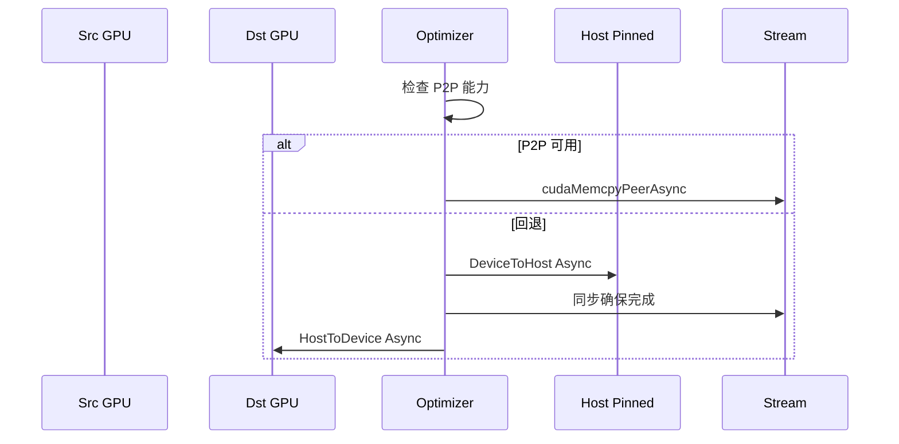
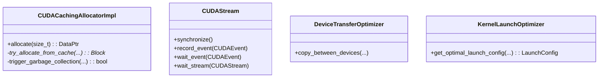

## 概述

PyTorch的CUDA集成是其GPU加速能力的核心，通过精心设计的内存管理、流调度和内核执行机制，实现了高效的GPU计算。本文深度剖析PyTorch CUDA集成的完整架构和实现细节。

<!--more-->

## 1. CUDA集成架构全景

### 1.1 核心组件层次

PyTorch的CUDA集成采用分层设计，从高层Python接口到底层CUDA调用：

```
┌─────────────────────────────────────────────────────────────┐
│                   Python CUDA API                          │  ← torch.cuda.*
├─────────────────────────────────────────────────────────────┤
│                 C++ CUDA Bindings                          │  ← torch/csrc/cuda/
├─────────────────────────────────────────────────────────────┤
│                   C10 CUDA Core                            │  ← c10/cuda/
├─────────────────────────────────────────────────────────────┤
│                  CUDA Allocator                            │  ← 内存管理
├─────────────────────────────────────────────────────────────┤
│                   Stream Manager                           │  ← 流管理
├─────────────────────────────────────────────────────────────┤
│                  Device Manager                            │  ← 设备管理
├─────────────────────────────────────────────────────────────┤
│                 CUDA Runtime API                           │  ← CUDA底层调用
└─────────────────────────────────────────────────────────────┘
```

### 1.2 CUDA集成完整架构图

```mermaid
graph TB
    subgraph "PyTorch CUDA 完整架构"
        subgraph "Python接口层"
            CUDA_API[torch.cuda API]
            TENSOR_CUDA[tensor.cuda()]
            DEVICE_API[device管理]
            MEMORY_API[内存监控]
        end
        
        subgraph "C++绑定层"
            CUDA_BINDING[CUDA Python绑定]
            STREAM_BINDING[Stream绑定]
            EVENT_BINDING[Event绑定]
            GUARD_BINDING[Guard绑定]
        end
        
        subgraph "C10 CUDA核心"
            CUDA_STREAM[CUDAStream]
            CUDA_EVENT[CUDAEvent]
            CUDA_GUARD[CUDAGuard]
            DEVICE_PROP[DeviceProperties]
        end
        
        subgraph "内存管理层"
            CACHING_ALLOC[CUDACachingAllocator]
            MEMORY_POOL[内存池管理]
            GC_SYSTEM[垃圾回收系统]
            MEMORY_STATS[内存统计]
        end
        
        subgraph "流和事件管理"
            STREAM_POOL[流池]
            EVENT_POOL[事件池]
            SYNC_MANAGER[同步管理器]
            PRIORITY_STREAM[优先级流]
        end
        
        subgraph "设备管理层"
            DEVICE_MANAGER[设备管理器]
            CONTEXT_MANAGER[上下文管理]
            PEER_ACCESS[点对点访问]
            DEVICE_SELECT[设备选择]
        end
        
        subgraph "内核执行层"
            KERNEL_LAUNCH[内核启动]
            OCCUPANCY_CALC[占用率计算]
            BLOCK_CONFIG[块配置]
            SHARED_MEM[共享内存管理]
        end
        
        subgraph "CUDA库集成"
            CUBLAS[cuBLAS]
            CUDNN[cuDNN]
            CUFFT[cuFFT]
            CUSPARSE[cuSPARSE]
            CUTLASS[CUTLASS]
        end
        
        subgraph "低层CUDA Runtime"
            CUDA_RUNTIME[CUDA Runtime API]
            CUDA_DRIVER[CUDA Driver API]
            NVML[NVIDIA ML]
        end
    end
    
    %% 连接关系
    CUDA_API --> CUDA_BINDING
    DEVICE_API --> STREAM_BINDING
    MEMORY_API --> EVENT_BINDING
    
    CUDA_BINDING --> CUDA_STREAM
    STREAM_BINDING --> CUDA_EVENT
    EVENT_BINDING --> CUDA_GUARD
    GUARD_BINDING --> DEVICE_PROP
    
    CUDA_STREAM --> CACHING_ALLOC
    CUDA_EVENT --> MEMORY_POOL
    CUDA_GUARD --> GC_SYSTEM
    DEVICE_PROP --> MEMORY_STATS
    
    CACHING_ALLOC --> STREAM_POOL
    MEMORY_POOL --> EVENT_POOL
    GC_SYSTEM --> SYNC_MANAGER
    MEMORY_STATS --> PRIORITY_STREAM
    
    STREAM_POOL --> DEVICE_MANAGER
    EVENT_POOL --> CONTEXT_MANAGER
    SYNC_MANAGER --> PEER_ACCESS
    PRIORITY_STREAM --> DEVICE_SELECT
    
    DEVICE_MANAGER --> KERNEL_LAUNCH
    CONTEXT_MANAGER --> OCCUPANCY_CALC
    PEER_ACCESS --> BLOCK_CONFIG
    DEVICE_SELECT --> SHARED_MEM
    
    KERNEL_LAUNCH --> CUBLAS
    OCCUPANCY_CALC --> CUDNN
    BLOCK_CONFIG --> CUFFT
    SHARED_MEM --> CUSPARSE
    KERNEL_LAUNCH --> CUTLASS
    
    CUBLAS --> CUDA_RUNTIME
    CUDNN --> CUDA_DRIVER
    CUFFT --> NVML
    
    style CACHING_ALLOC fill:#e1f5fe
    style STREAM_POOL fill:#f3e5f5
    style KERNEL_LAUNCH fill:#e8f5e8
    style CUDA_RUNTIME fill:#fff3e0
```

## 2. CUDA内存管理深度解析

### 2.1 CUDACachingAllocator核心机制

```cpp
namespace c10::cuda::CUDACachingAllocator {

// CUDA缓存分配器的完整实现
class CUDACachingAllocatorImpl {
 private:
  // 设备特定的内存状态
  struct DeviceStats {
    // 内存使用统计
    size_t allocated_bytes[static_cast<size_t>(StatType::NUM_TYPES)];
    size_t reserved_bytes[static_cast<size_t>(StatType::NUM_TYPES)];
    size_t active_bytes[static_cast<size_t>(StatType::NUM_TYPES)];
    size_t inactive_split_bytes[static_cast<size_t>(StatType::NUM_TYPES)];
    
    // 分配计数
    size_t allocation_count[static_cast<size_t>(StatType::NUM_TYPES)];
    size_t deallocation_count[static_cast<size_t>(StatType::NUM_TYPES)];
    
    // 峰值统计
    size_t peak_bytes[static_cast<size_t>(StatType::NUM_TYPES)];
    
    // 重置统计
    void reset_peak_stats() {
      for (size_t i = 0; i < static_cast<size_t>(StatType::NUM_TYPES); ++i) {
        peak_bytes[i] = allocated_bytes[i];
      }
    }
  };
  
  // 内存块的完整定义
  struct Block {
    size_t size;                    // 块大小（字节）
    size_t requested_size;          // 用户请求的大小
    void* ptr;                      // GPU内存指针
    
    // 设备和流信息
    c10::DeviceIndex device;
    c10::cuda::CUDAStream stream;
    
    // 状态标志
    bool allocated;                 // 是否已分配给用户
    bool active;                    // 是否活跃使用
    
    // 内存池信息
    MempoolId_t pool_id;           // 所属内存池ID
    
    // 链表结构（用于合并和分割）
    Block* prev;
    Block* next;
    
    std::unordered_set<c10::cuda::CUDAStream> stream_uses;
    
    // 分配上下文（用于调试和分析）
    std::shared_ptr<Context> context_when_allocated;
    
    // 垃圾回收
    size_t gc_count;               // 垃圾回收计数
    
    Block(size_t size, size_t requested_size, void* ptr, 
          c10::DeviceIndex device, c10::cuda::CUDAStream stream)
        : size(size), requested_size(requested_size), ptr(ptr),
          device(device), stream(stream),
          allocated(true), active(true),
          prev(nullptr), next(nullptr), gc_count(0) {
      
      // 记录分配时的流
      stream_uses.insert(stream);
    }
    
    // 检查块是否可以安全释放
    bool can_be_released() const {
      // 检查所有使用此块的流是否已完成
      for (const auto& used_stream : stream_uses) {
        if (!used_stream.query()) {
          return false;  // 仍有流在使用
        }
      }
      return true;
    }
    
    // 记录流使用
    void add_stream_use(c10::cuda::CUDAStream stream) {
      stream_uses.insert(stream);
    }
  };
  
  // 内存段管理
  struct Segment {
    c10::DeviceIndex device;
    void* ptr;                     // 段起始地址
    size_t size;                   // 段总大小
    size_t allocated_size;         // 已分配大小
    
    c10::cuda::CUDAStream stream;  // 分配时的流
    
    std::vector<Block*> blocks;    // 段内的块列表
    
    // 查找最佳匹配的块
    Block* find_best_fit_block(size_t requested_size) {
      Block* best_block = nullptr;
      size_t best_size = SIZE_MAX;
      
      for (auto* block : blocks) {
        if (!block->allocated && 
            block->size >= requested_size && 
            block->size < best_size) {
          best_block = block;
          best_size = block->size;
          
          // 完美匹配，直接返回
          if (block->size == requested_size) {
            break;
          }
        }
      }
      
      return best_block;
    }
    
    // 分割块
    Block* split_block(Block* block, size_t size) {
      if (block->size <= size) {
        return block;
      }
      
      // 创建新块用于剩余空间
      void* split_ptr = static_cast<char*>(block->ptr) + size;
      size_t split_size = block->size - size;
      
      auto* new_block = new Block(
          split_size, 0, split_ptr, block->device, block->stream
      );
      new_block->allocated = false;
      new_block->active = false;
      
      // 更新原块
      block->size = size;
      
      // 维护有序的块列表
      auto it = std::find(blocks.begin(), blocks.end(), block);
      blocks.insert(it + 1, new_block);
      
      return block;
    }
  };
  
  // 每个设备的分配器状态
  struct DeviceAllocatorState {
    // 分大小的空闲块映射
    std::map<size_t, std::set<Block*>> large_blocks;  // >= 1MB
    std::map<size_t, std::set<Block*>> small_blocks;  // < 1MB
    
    // 活跃块集合
    std::unordered_set<Block*> active_blocks;
    
    // 内存段列表
    std::vector<std::unique_ptr<Segment>> segments;
    
    // 统计信息
    DeviceStats stats;
    
    // 内存池
    std::vector<std::unique_ptr<MemoryPool>> memory_pools;
    
    // 垃圾收集
    std::atomic<bool> gc_in_progress{false};
    size_t gc_threshold = 2ULL * 1024 * 1024 * 1024;  // 2GB
  };
  
  // 全局状态
  std::vector<DeviceAllocatorState> device_allocators_;
  std::mutex allocator_mutex_;
  
 public:
  DataPtr allocate(size_t requested_size) {
    // 1. 参数验证和预处理
    if (requested_size == 0) {
      return create_empty_dataptr();
    }
    
    // 2. 内存大小对齐优化
    size_t size = round_size(requested_size);
    
    // 3. 获取当前设备和流
    c10::DeviceIndex device = c10::cuda::current_device();
    c10::cuda::CUDAStream stream = c10::cuda::getCurrentCUDAStream(device);
    
    // 4. 设备状态加锁
    std::lock_guard<std::mutex> lock(allocator_mutex_);
    auto& device_state = device_allocators_[device];
    
    // 5. 尝试从缓存分配
    if (auto block = try_allocate_from_cache(device_state, size, stream)) {
      return create_dataptr_from_block(block, requested_size);
    }
    
    // 6. 触发垃圾回收
    if (trigger_garbage_collection(device_state)) {
      if (auto block = try_allocate_from_cache(device_state, size, stream)) {
        return create_dataptr_from_block(block, requested_size);
      }
    }
    
    // 7. 分配新的GPU内存
    return allocate_new_memory(device_state, size, requested_size, stream);
  }
  
  // 释放内存（加入缓存）
  void deallocate(void* ptr) {
    if (!ptr) return;
    
    std::lock_guard<std::mutex> lock(allocator_mutex_);
    
    // 查找对应的块
    auto* block = find_block_by_ptr(ptr);
    if (!block) {
      throw std::runtime_error("Attempting to free unknown pointer");
    }
    
    // 标记为可重用
    block->allocated = false;
    block->active = false;
    
    // 加入到适当的空闲列表
    auto& device_state = device_allocators_[block->device];
    add_to_free_list(device_state, block);
    
    // 尝试合并相邻块
    merge_free_blocks(device_state, block);
  }
  
 private:
  // 从缓存尝试分配
  Block* try_allocate_from_cache(DeviceAllocatorState& state, size_t size, 
                                c10::cuda::CUDAStream stream) {
    // 选择合适的空闲列表
    auto& free_blocks = (size >= kLargeBuffer) ? state.large_blocks : state.small_blocks;
    
    // 查找最小的合适块
    auto it = free_blocks.lower_bound(size);
    if (it != free_blocks.end() && !it->second.empty()) {
      auto* block = *it->second.begin();
      
      // 检查流兼容性
      if (is_stream_compatible(block, stream)) {
        // 从空闲列表移除
        it->second.erase(it->second.begin());
        
        // 如果块太大，考虑分割
        if (block->size > size + kMinBlockSize) {
          split_block(block, size);
        }
        
        block->allocated = true;
        block->active = true;
        block->add_stream_use(stream);
        
        return block;
      }
    }
    
    return nullptr;
  }
  
  // 垃圾回收触发条件
  bool trigger_garbage_collection(DeviceAllocatorState& state) {
    // 检查是否需要垃圾回收
    size_t total_reserved = state.stats.reserved_bytes[static_cast<size_t>(StatType::AGGREGATE)];
    
    if (total_reserved > state.gc_threshold) {
      // 异步触发垃圾回收
      return run_garbage_collection(state);
    }
    
    return false;
  }
  
  // 垃圾回收实现
  bool run_garbage_collection(DeviceAllocatorState& state) {
    // 防止重复GC
    if (state.gc_in_progress.exchange(true)) {
      return false;
    }
    
    size_t freed_bytes = 0;
    
    try {
      // 回收大块
      freed_bytes += collect_free_blocks(state.large_blocks);
      
      // 回收小块
      freed_bytes += collect_free_blocks(state.small_blocks);
      
      // 整理内存段
      compact_segments(state);
      
    } catch (...) {
      state.gc_in_progress = false;
      throw;
    }
    
    state.gc_in_progress = false;
    
    return freed_bytes > 0;
  }
  
  // 回收空闲块
  size_t collect_free_blocks(std::map<size_t, std::set<Block*>>& free_blocks) {
    size_t freed_bytes = 0;
    
    for (auto& [size, block_set] : free_blocks) {
      auto it = block_set.begin();
      while (it != block_set.end()) {
        auto* block = *it;
        
        // 检查块是否可以安全释放
        if (block->can_be_released() && block->gc_count > kGCThreshold) {
          // 释放GPU内存
          C10_CUDA_CHECK(cudaFree(block->ptr));
          
          freed_bytes += block->size;
          it = block_set.erase(it);
          delete block;
        } else {
          block->gc_count++;
          ++it;
        }
      }
    }
    
    return freed_bytes;
  }
  
  // 内存大小对齐（基于GPU架构优化）
  size_t round_size(size_t size) {
    // GPU内存对齐要求
    if (size < kMinBlockSize) {
      return kMinBlockSize;  // 最小块大小：512字节
    }
    
    // 对齐到512字节边界（GPU内存访问优化）
    if (size < kSmallBuffer) {
      return ((size + kMinBlockSize - 1) / kMinBlockSize) * kMinBlockSize;
    }
    
    // 大内存按2MB对齐（减少碎片）
    return ((size + kLargeBuffer - 1) / kLargeBuffer) * kLargeBuffer;
  }
  
  // 流兼容性检查
  bool is_stream_compatible(Block* block, c10::cuda::CUDAStream stream) {
    // 同一流：直接兼容
    if (block->stream == stream) {
      return true;
    }
    
    // 检查流之间的依赖关系
    if (block->stream.query()) {
      // 原流已完成，可以在新流中使用
      return true;
    }
    
    // 需要插入事件同步
    return false;
  }
};

// 高级内存分配策略
class AdvancedAllocationStrategies {
 public:
  // 内存池策略
  struct MemoryPool {
    c10::DeviceIndex device;
    MempoolId_t id;
    
    // 专用的块列表
    std::map<size_t, std::deque<Block*>> free_blocks;
    std::unordered_set<Block*> allocated_blocks;
    
    // 池配置
    size_t max_size;              // 池最大大小
    size_t min_block_size;        // 最小块大小
    bool enable_coalescing;       // 是否启用合并
    
    // 分配策略
    AllocationStrategy strategy;
    
    MemoryPool(c10::DeviceIndex device, MempoolId_t id, 
               size_t max_size = SIZE_MAX)
        : device(device), id(id), max_size(max_size),
          min_block_size(512), enable_coalescing(true),
          strategy(AllocationStrategy::BEST_FIT) {}
    
    // 智能分配
    Block* allocate_smart(size_t size, c10::cuda::CUDAStream stream) {
      switch (strategy) {
        case AllocationStrategy::FIRST_FIT:
          return allocate_first_fit(size, stream);
        case AllocationStrategy::BEST_FIT:
          return allocate_best_fit(size, stream);
        case AllocationStrategy::WORST_FIT:
          return allocate_worst_fit(size, stream);
        default:
          return allocate_best_fit(size, stream);
      }
    }
    
    Block* allocate_best_fit(size_t size, c10::cuda::CUDAStream stream) {
      // 寻找大小最接近的块
      auto it = free_blocks.lower_bound(size);
      
      if (it != free_blocks.end() && !it->second.empty()) {
        auto* block = it->second.front();
        it->second.pop_front();
        
        // 如果块明显过大，考虑分割
        if (block->size > size + min_block_size) {
          block = split_block_smart(block, size);
        }
        
        return block;
      }
      
      return nullptr;
    }
    
   private:
    Block* split_block_smart(Block* block, size_t size) {
      // 智能分割：保留的块大小应该是常用尺寸
      size_t remaining = block->size - size;
      
      // 将剩余块大小调整为2的幂次，便于后续使用
      size_t aligned_remaining = next_power_of_2(remaining);
      if (aligned_remaining <= remaining && aligned_remaining >= min_block_size) {
        size = block->size - aligned_remaining;
      }
      
      return split_block_impl(block, size);
    }
  };
  
  // 多流内存管理
  class StreamAwareAllocator {
   private:
    // 每个流的专用内存池
    std::unordered_map<c10::cuda::CUDAStream, std::unique_ptr<MemoryPool>> stream_pools_;
    
    // 流之间的同步事件
    std::unordered_map<std::pair<CUDAStream, CUDAStream>, CUDAEvent, 
                       StreamPairHash> sync_events_;
    
   public:
    DataPtr allocate_stream_aware(size_t size, c10::cuda::CUDAStream stream) {
      // 1. 尝试从流专用池分配
      auto it = stream_pools_.find(stream);
      if (it != stream_pools_.end()) {
        if (auto block = it->second->allocate_smart(size, stream)) {
          return create_dataptr_from_block(block, size);
        }
      }
      
      // 2. 从其他流的池"借用"内存（需要同步）
      for (auto& [other_stream, pool] : stream_pools_) {
        if (other_stream != stream) {
          if (auto block = pool->allocate_smart(size, stream)) {
            // 插入同步事件
            insert_sync_event(other_stream, stream);
            return create_dataptr_from_block(block, size);
          }
        }
      }
      
      // 3. 创建新的流专用池
      auto new_pool = std::make_unique<MemoryPool>(
          stream.device_index(), generate_pool_id()
      );
      
      auto block = new_pool->allocate_new_segment(size, stream);
      stream_pools_[stream] = std::move(new_pool);
      
      return create_dataptr_from_block(block, size);
    }
    
   private:
    void insert_sync_event(c10::cuda::CUDAStream from_stream, 
                          c10::cuda::CUDAStream to_stream) {
      auto key = std::make_pair(from_stream, to_stream);
      
      if (sync_events_.find(key) == sync_events_.end()) {
        // 创建新的同步事件
        auto event = c10::cuda::CUDAEvent();
        event.record(from_stream);
        to_stream.wait(event);
        
        sync_events_[key] = std::move(event);
      }
    }
  };
};

} // namespace c10::cuda::CUDACachingAllocator
```

### 2.2 设备间内存传输优化

PyTorch实现了高效的设备间数据传输：

```cpp
namespace c10::cuda {

// 设备间传输优化
class DeviceTransferOptimizer {
 private:
  // P2P访问矩阵
  struct P2PAccessMatrix {
    std::vector<std::vector<bool>> can_access;
    std::vector<std::vector<int>> link_type;  // NVLink, PCIe等
    
    P2PAccessMatrix(int num_devices) {
      can_access.resize(num_devices, std::vector<bool>(num_devices, false));
      link_type.resize(num_devices, std::vector<int>(num_devices, 0));
      
      // 检测P2P能力
      detect_p2p_capabilities();
    }
    
    void detect_p2p_capabilities() {
      int device_count;
      C10_CUDA_CHECK(cudaGetDeviceCount(&device_count));
      
      for (int i = 0; i < device_count; ++i) {
        for (int j = 0; j < device_count; ++j) {
          if (i != j) {
            int can_access_peer;
            C10_CUDA_CHECK(cudaDeviceCanAccessPeer(&can_access_peer, i, j));
            can_access[i][j] = (can_access_peer == 1);
            
            if (can_access[i][j]) {
              // 检测连接类型
              link_type[i][j] = detect_link_type(i, j);
            }
          }
        }
      }
    }
    
    int detect_link_type(int device1, int device2) {
      // 使用NVML检测设备间连接类型
      // 简化实现：返回连接质量评分
      // 3: NVLink, 2: PCIe x16, 1: PCIe x8, 0: 其他
      return 2;  // 假设PCIe连接
    }
  };
  
  P2PAccessMatrix p2p_matrix_;
  
 public:
  DeviceTransferOptimizer() : p2p_matrix_(c10::cuda::device_count()) {}
  
  // 优化的设备间拷贝
  void copy_between_devices(
      void* dst, c10::DeviceIndex dst_device,
      const void* src, c10::DeviceIndex src_device,
      size_t size, c10::cuda::CUDAStream stream) {
    
    if (src_device == dst_device) {
      // 同设备拷贝
      C10_CUDA_CHECK(cudaMemcpyAsync(dst, src, size, cudaMemcpyDeviceToDevice, stream));
      return;
    }
    
    // 跨设备拷贝优化
    if (p2p_matrix_.can_access[src_device][dst_device]) {
      // P2P直接拷贝（最高效）
      copy_p2p_optimized(dst, dst_device, src, src_device, size, stream);
    } else {
      // 通过主机内存中转
      copy_via_host_memory(dst, dst_device, src, src_device, size, stream);
    }
  }
  
 private:
  void copy_p2p_optimized(
      void* dst, c10::DeviceIndex dst_device,
      const void* src, c10::DeviceIndex src_device,
      size_t size, c10::cuda::CUDAStream stream) {
    
    // 设置正确的设备上下文
    CUDADeviceGuard guard(dst_device);
    
    // 启用P2P访问（如果尚未启用）
    static thread_local std::set<std::pair<int, int>> enabled_pairs;
    auto pair = std::make_pair(src_device, dst_device);
    
    if (enabled_pairs.find(pair) == enabled_pairs.end()) {
      C10_CUDA_CHECK(cudaDeviceEnablePeerAccess(src_device, 0));
      enabled_pairs.insert(pair);
    }
    
    // 直接P2P拷贝
    C10_CUDA_CHECK(cudaMemcpyPeerAsync(
        dst, dst_device, src, src_device, size, stream
    ));
  }
  
  void copy_via_host_memory(
      void* dst, c10::DeviceIndex dst_device,
      const void* src, c10::DeviceIndex src_device, 
      size_t size, c10::cuda::CUDAStream stream) {
    
    // 分配固定主机内存作为中转
    void* host_buffer;
    C10_CUDA_CHECK(cudaMallocHost(&host_buffer, size));
    
    try {
      // 分两步完成传输
      // 1. GPU -> Host
      {
        CUDADeviceGuard guard(src_device);
        C10_CUDA_CHECK(cudaMemcpyAsync(
            host_buffer, src, size, cudaMemcpyDeviceToHost, stream
        ));
      }
      
      // 同步确保传输完成
      C10_CUDA_CHECK(cudaStreamSynchronize(stream));
      
      // 2. Host -> GPU
      {
        CUDADeviceGuard guard(dst_device);
        C10_CUDA_CHECK(cudaMemcpyAsync(
            dst, host_buffer, size, cudaMemcpyHostToDevice, stream
        ));
      }
      
    } catch (...) {
      cudaFreeHost(host_buffer);
      throw;
    }
    
    cudaFreeHost(host_buffer);
  }
};

} // namespace c10::cuda
```

## 3. CUDA流管理机制

### 3.1 CUDAStream核心实现

```cpp
namespace c10::cuda {

// CUDA流的完整实现
class CUDAStream {
 private:
  cudaStream_t stream_;           // CUDA流句柄
  c10::DeviceIndex device_;       // 所属设备
  StreamPriority priority_;       // 流优先级
  uint64_t stream_id_;           // 流的唯一ID
  
  // 流池管理
  static thread_local std::unique_ptr<CUDAStreamPool> stream_pool_;
  
 public:
  // 构造函数
  explicit CUDAStream(c10::DeviceIndex device, StreamPriority priority = StreamPriority::Normal)
      : device_(device), priority_(priority) {
    
    // 从流池获取或创建新流
    stream_ = acquire_stream_from_pool(device, priority);
    stream_id_ = generate_stream_id();
  }
  
  // 析构函数
  ~CUDAStream() {
    if (stream_ != nullptr) {
      // 返回流到池中，而不是销毁
      return_stream_to_pool(stream_, device_, priority_);
    }
  }
  
  // 禁止拷贝，允许移动
  CUDAStream(const CUDAStream&) = delete;
  CUDAStream& operator=(const CUDAStream&) = delete;
  
  CUDAStream(CUDAStream&& other) noexcept
      : stream_(other.stream_), device_(other.device_),
        priority_(other.priority_), stream_id_(other.stream_id_) {
    other.stream_ = nullptr;
  }
  
  // 核心操作接口
  void synchronize() const {
    CUDADeviceGuard guard(device_);
    C10_CUDA_CHECK(cudaStreamSynchronize(stream_));
  }
  
  bool query() const {
    CUDADeviceGuard guard(device_);
    cudaError_t err = cudaStreamQuery(stream_);
    
    if (err == cudaSuccess) {
      return true;  // 流已完成
    } else if (err == cudaErrorNotReady) {
      return false; // 流仍在执行
    } else {
      C10_CUDA_CHECK(err);  // 其他错误
      return false;
    }
  }
  
  // 事件记录和等待
  void record_event(CUDAEvent& event) const {
    CUDADeviceGuard guard(device_);
    C10_CUDA_CHECK(cudaEventRecord(event.event(), stream_));
  }
  
  void wait_event(const CUDAEvent& event) const {
    CUDADeviceGuard guard(device_);
    C10_CUDA_CHECK(cudaStreamWaitEvent(stream_, event.event(), 0));
  }
  
  // 流间同步优化
  void wait_stream(const CUDAStream& other) const {
    if (device_ == other.device_ && stream_ == other.stream_) {
      return;  // 同一流，无需同步
    }
    
    // 创建临时事件进行同步
    CUDAEvent sync_event;
    other.record_event(sync_event);
    wait_event(sync_event);
  }
  
  // 获取流属性
  cudaStream_t stream() const { return stream_; }
  c10::DeviceIndex device() const { return device_; }
  StreamPriority priority() const { return priority_; }
  uint64_t id() const { return stream_id_; }
  
 private:
  // 流池管理实现
  static cudaStream_t acquire_stream_from_pool(c10::DeviceIndex device, 
                                              StreamPriority priority) {
    if (!stream_pool_) {
      stream_pool_ = std::make_unique<CUDAStreamPool>();
    }
    
    return stream_pool_->acquire(device, priority);
  }
  
  static void return_stream_to_pool(cudaStream_t stream, c10::DeviceIndex device,
                                   StreamPriority priority) {
    if (stream_pool_) {
      stream_pool_->release(stream, device, priority);
    }
  }
  
  static uint64_t generate_stream_id() {
    static std::atomic<uint64_t> next_id{1};
    return next_id.fetch_add(1);
  }
};

// CUDA流池实现
class CUDAStreamPool {
 private:
  // 按设备和优先级分组的流池
  struct StreamPoolEntry {
    std::queue<cudaStream_t> available_streams;
    std::unordered_set<cudaStream_t> all_streams;
    std::mutex mutex;
    
    // 池配置
    size_t max_pool_size = 32;     // 最大池大小
    size_t initial_pool_size = 4;  // 初始池大小
  };
  
  // 设备 -> 优先级 -> 流池
  std::unordered_map<c10::DeviceIndex, 
      std::unordered_map<StreamPriority, std::unique_ptr<StreamPoolEntry>>> pools_;
  
  std::mutex global_mutex_;
  
 public:
  cudaStream_t acquire(c10::DeviceIndex device, StreamPriority priority) {
    std::lock_guard<std::mutex> lock(global_mutex_);
    
    auto& device_pools = pools_[device];
    auto& pool_entry = get_or_create_pool(device_pools, priority, device);
    
    std::lock_guard<std::mutex> pool_lock(pool_entry->mutex);
    
    if (!pool_entry->available_streams.empty()) {
      // 从池中获取现有流
      auto stream = pool_entry->available_streams.front();
      pool_entry->available_streams.pop();
      return stream;
    }
    
    // 创建新流
    CUDADeviceGuard guard(device);
    cudaStream_t new_stream;
    
    if (priority == StreamPriority::High) {
      // 高优先级流
      C10_CUDA_CHECK(cudaStreamCreateWithPriority(
          &new_stream, cudaStreamNonBlocking, /*priority=*/0
      ));
    } else {
      // 普通优先级流
      C10_CUDA_CHECK(cudaStreamCreateWithFlags(&new_stream, cudaStreamNonBlocking));
    }
    
    pool_entry->all_streams.insert(new_stream);
    return new_stream;
  }
  
  void release(cudaStream_t stream, c10::DeviceIndex device, StreamPriority priority) {
    std::lock_guard<std::mutex> lock(global_mutex_);
    
    auto device_it = pools_.find(device);
    if (device_it == pools_.end()) return;
    
    auto priority_it = device_it->second.find(priority);
    if (priority_it == device_it->second.end()) return;
    
    auto& pool_entry = priority_it->second;
    std::lock_guard<std::mutex> pool_lock(pool_entry->mutex);
    
    // 检查流是否属于此池
    if (pool_entry->all_streams.find(stream) != pool_entry->all_streams.end()) {
      if (pool_entry->available_streams.size() < pool_entry->max_pool_size) {
        // 返回池中复用
        pool_entry->available_streams.push(stream);
      } else {
        // 池已满，销毁流
        CUDADeviceGuard guard(device);
        C10_CUDA_CHECK(cudaStreamDestroy(stream));
        pool_entry->all_streams.erase(stream);
      }
    }
  }
  
 private:
  std::unique_ptr<StreamPoolEntry>& get_or_create_pool(
      std::unordered_map<StreamPriority, std::unique_ptr<StreamPoolEntry>>& device_pools,
      StreamPriority priority,
      c10::DeviceIndex device) {
    
    auto it = device_pools.find(priority);
    if (it == device_pools.end()) {
      auto pool = std::make_unique<StreamPoolEntry>();
      
      // 预分配初始流
      CUDADeviceGuard guard(device);
      for (size_t i = 0; i < pool->initial_pool_size; ++i) {
        cudaStream_t stream;
        if (priority == StreamPriority::High) {
          C10_CUDA_CHECK(cudaStreamCreateWithPriority(
              &stream, cudaStreamNonBlocking, 0
          ));
        } else {
          C10_CUDA_CHECK(cudaStreamCreateWithFlags(&stream, cudaStreamNonBlocking));
        }
        
        pool->available_streams.push(stream);
        pool->all_streams.insert(stream);
      }
      
      it = device_pools.emplace(priority, std::move(pool)).first;
    }
    
    return it->second;
  }
};

// 异步执行管理器
class AsyncExecutionManager {
 public:
  // 异步拷贝 + 计算重叠
  struct AsyncOperation {
    c10::cuda::CUDAStream compute_stream;
    c10::cuda::CUDAStream transfer_stream;
    c10::cuda::CUDAEvent transfer_complete;
    
    AsyncOperation(c10::DeviceIndex device) 
        : compute_stream(c10::cuda::getStreamFromPool(false, device)),
          transfer_stream(c10::cuda::getStreamFromPool(false, device)) {
      
      // 为传输流设置较低优先级
      transfer_stream.set_priority(StreamPriority::Low);
    }
    
    // 异步数据传输
    void async_transfer(const Tensor& src, Tensor& dst) {
      // 在传输流中执行数据拷贝
      c10::cuda::CUDAStreamGuard guard(transfer_stream);
      dst.copy_(src, /*non_blocking=*/true);
      
      // 记录传输完成事件
      transfer_complete.record(transfer_stream);
    }
    
    // 异步计算
    template<typename KernelFunc>
    void async_compute(KernelFunc&& kernel) {
      // 等待数据传输完成
      compute_stream.wait_event(transfer_complete);
      
      // 在计算流中执行内核
      c10::cuda::CUDAStreamGuard guard(compute_stream);
      kernel();
    }
  };
  
  // 多流流水线执行
  template<typename ComputeFunc, typename TransferFunc>
  void pipeline_execution(
      const std::vector<Tensor>& inputs,
      std::vector<Tensor>& outputs,
      ComputeFunc compute_func,
      TransferFunc transfer_func) {
    
    const size_t num_streams = std::min(inputs.size(), size_t(4));  // 限制并发流数量
    std::vector<AsyncOperation> operations;
    
    // 初始化异步操作
    for (size_t i = 0; i < num_streams; ++i) {
      operations.emplace_back(inputs[0].device().index());
    }
    
    // 流水线执行
    for (size_t i = 0; i < inputs.size(); ++i) {
      auto& op = operations[i % num_streams];
      
      // 异步传输数据
      if (i < outputs.size()) {
        op.async_transfer(inputs[i], outputs[i]);
      }
      
      // 异步执行计算
      op.async_compute([&, i]() {
        compute_func(inputs[i], outputs[i]);
      });
    }
    
    // 等待所有操作完成
    for (auto& op : operations) {
      op.compute_stream.synchronize();
    }
  }
};

} // namespace c10::cuda
```

## 4. CUDA内核启动优化

### 4.1 占用率分析与配置优化

```cpp
namespace at::cuda {

// CUDA内核启动配置优化器
class KernelLaunchOptimizer {
 private:
  // 设备属性缓存
  struct DeviceProperties {
    int max_threads_per_block;
    int max_blocks_per_sm;
    int sm_count;
    int max_threads_per_sm;
    size_t shared_mem_per_block;
    size_t shared_mem_per_sm;
    int warp_size;
    
    DeviceProperties(c10::DeviceIndex device) {
      cudaDeviceProp prop;
      C10_CUDA_CHECK(cudaGetDeviceProperties(&prop, device));
      
      max_threads_per_block = prop.maxThreadsPerBlock;
      max_blocks_per_sm = prop.maxBlocksPerMultiProcessor;
      sm_count = prop.multiProcessorCount;
      max_threads_per_sm = prop.maxThreadsPerMultiProcessor;
      shared_mem_per_block = prop.sharedMemPerBlock;
      shared_mem_per_sm = prop.sharedMemPerMultiProcessor;
      warp_size = prop.warpSize;
    }
  };
  
  // 缓存设备属性
  static std::unordered_map<c10::DeviceIndex, DeviceProperties> device_props_;
  static std::mutex props_mutex_;
  
 public:
  // 计算最优的内核启动配置（基于占用率理论）
  template<typename KernelFunc>
  static LaunchConfig get_optimal_launch_config(
      KernelFunc kernel, size_t dynamic_shared_mem = 0) {
    
    auto device = c10::cuda::current_device();
    auto& props = get_device_properties(device);
    
    // 使用CUDA占用率计算器
    int min_grid_size, block_size;
    C10_CUDA_CHECK(cudaOccupancyMaxPotentialBlockSize(
        &min_grid_size, &block_size, kernel, dynamic_shared_mem, 0
    ));
    
    // 优化配置
    LaunchConfig config;
    config.block_size = block_size;
    config.grid_size = min_grid_size;
    config.shared_mem_size = dynamic_shared_mem;
    
    return config;
  }
  
  // 基于工作负载的配置调优
  static LaunchConfig get_workload_optimal_config(
      size_t num_elements, size_t elements_per_thread = 4) {
    
    auto device = c10::cuda::current_device();
    auto& props = get_device_properties(device);
    
    // 计算所需的线程数
    size_t total_threads = (num_elements + elements_per_thread - 1) / elements_per_thread;
    
    // 选择块大小（通常为32的倍数，利用warp执行）
    int block_size = std::min(
        props.max_threads_per_block,
        static_cast<int>(roundUpToPowerOf2(total_threads))
    );
    
    // 确保块大小是warp大小的倍数
    block_size = ((block_size + props.warp_size - 1) / props.warp_size) * props.warp_size;
    
    // 计算网格大小
    int grid_size = std::min(
        static_cast<int>((total_threads + block_size - 1) / block_size),
        props.sm_count * props.max_blocks_per_sm
    );
    
    return LaunchConfig{grid_size, block_size, 0};
  }
  
  // 内存带宽优化配置
  static LaunchConfig get_memory_bandwidth_optimal_config(
      size_t memory_size, size_t compute_intensity = 1) {
    
    auto device = c10::cuda::current_device();
    auto& props = get_device_properties(device);
    
    // 基于内存带宽计算最优配置
    // compute_intensity: 每字节内存访问的计算操作数
    
    // 估算内存带宽需求
    size_t memory_bandwidth_GB_s = 900;  // 现代GPU大约900 GB/s
    size_t bytes_per_second = memory_bandwidth_GB_s * 1024 * 1024 * 1024;
    
    // 计算最优的线程数（避免内存带宽瓶颈）
    size_t optimal_threads = std::min(
        memory_size / (64 * compute_intensity),  // 64字节缓存行
        static_cast<size_t>(props.sm_count * props.max_threads_per_sm)
    );
    
    int block_size = std::min(props.max_threads_per_block, 256);  // 通常256是好的选择
    int grid_size = (optimal_threads + block_size - 1) / block_size;
    
    return LaunchConfig{grid_size, block_size, 0};
  }
  
 private:
  static const DeviceProperties& get_device_properties(c10::DeviceIndex device) {
    std::lock_guard<std::mutex> lock(props_mutex_);
    
    auto it = device_props_.find(device);
    if (it == device_props_.end()) {
      it = device_props_.emplace(device, DeviceProperties(device)).first;
    }
    
    return it->second;
  }
  
  static size_t roundUpToPowerOf2(size_t n) {
    if (n <= 1) return 1;
    return 1ULL << (64 - __builtin_clzll(n - 1));
  }
};

// 内核启动辅助工具
struct LaunchConfig {
  int grid_size;
  int block_size;
  size_t shared_mem_size;
  
  // 计算总线程数
  size_t total_threads() const {
    return static_cast<size_t>(grid_size) * block_size;
  }
  
  // 计算理论占用率
  float theoretical_occupancy(const DeviceProperties& props) const {
    int threads_per_sm = std::min(
        props.max_threads_per_sm,
        (props.max_blocks_per_sm * block_size)
    );
    
    return static_cast<float>(threads_per_sm) / props.max_threads_per_sm;
  }
};

} // namespace at::cuda
```

### 4.2 高级内核启动模式

PyTorch实现了多种高级内核启动模式：

```cpp
namespace at::cuda {

// 协作组（Cooperative Groups）优化
template<typename scalar_t>
__global__ void cooperative_reduce_kernel(
    const scalar_t* __restrict__ input,
    scalar_t* __restrict__ output,
    size_t numel) {
  
  // 使用协作组实现高效的归约
  namespace cg = cooperative_groups;
  
  // 创建网格级别的协作组
  cg::grid_group grid = cg::this_grid();
  cg::thread_block block = cg::this_thread_block();
  
  extern __shared__ scalar_t shared_data[];
  
  // 网格跨步循环加载数据
  scalar_t thread_sum = scalar_t(0);
  for (size_t i = grid.thread_rank(); i < numel; i += grid.size()) {
    thread_sum += input[i];
  }
  
  // 块内归约
  shared_data[block.thread_rank()] = thread_sum;
  block.sync();
  
  // 使用协作组的归约原语
  thread_sum = cg::reduce(block, thread_sum, cg::plus<scalar_t>());
  
  // 写入块级结果
  if (block.thread_rank() == 0) {
    output[block.group_index().x] = thread_sum;
  }
}

// 动态并行（Dynamic Parallelism）应用
template<typename scalar_t>
__global__ void adaptive_computation_kernel(
    const scalar_t* __restrict__ input,
    scalar_t* __restrict__ output,
    size_t* __restrict__ work_counts,
    size_t numel) {
  
  int tid = blockIdx.x * blockDim.x + threadIdx.x;
  
  if (tid < numel) {
    // 根据输入数据决定计算复杂度
    scalar_t value = input[tid];
    
    if (abs(value) > scalar_t(0.1)) {
      // 复杂计算：启动子内核
      if (threadIdx.x == 0) {  // 块内只有一个线程启动子内核
        dim3 child_grid(1);
        dim3 child_block(32);
        
        complex_computation_child_kernel<<<child_grid, child_block>>>(
            &input[blockIdx.x * blockDim.x],
            &output[blockIdx.x * blockDim.x],
            blockDim.x
        );
      }
    } else {
      // 简单计算：直接在当前线程执行
      output[tid] = simple_function(value);
    }
  }
}

// CUDA图（CUDA Graphs）优化
class CUDAGraphOptimizer {
 private:
  struct GraphInstance {
    cudaGraph_t graph;
    cudaGraphExec_t exec;
    bool is_captured;
    std::vector<cudaGraphNode_t> nodes;
    
    GraphInstance() : graph(nullptr), exec(nullptr), is_captured(false) {}
    
    ~GraphInstance() {
      if (exec) cudaGraphExecDestroy(exec);
      if (graph) cudaGraphDestroy(graph);
    }
  };
  
  std::unordered_map<std::string, std::unique_ptr<GraphInstance>> cached_graphs_;
  std::mutex graph_mutex_;
  
 public:
  // 捕获和优化计算图
  template<typename LaunchFunc>
  void capture_and_launch_graph(const std::string& graph_key, 
                               c10::cuda::CUDAStream stream,
                               LaunchFunc&& launch_func) {
    
    std::lock_guard<std::mutex> lock(graph_mutex_);
    
    auto it = cached_graphs_.find(graph_key);
    if (it == cached_graphs_.end()) {
      // 首次运行：捕获图
      auto graph_instance = std::make_unique<GraphInstance>();
      
      // 开始图捕获
      C10_CUDA_CHECK(cudaStreamBeginCapture(stream, cudaStreamCaptureModeGlobal));
      
      // 执行要捕获的操作
      launch_func();
      
      // 结束捕获
      C10_CUDA_CHECK(cudaStreamEndCapture(stream, &graph_instance->graph));
      
      // 实例化图
      C10_CUDA_CHECK(cudaGraphInstantiate(
          &graph_instance->exec, graph_instance->graph, 
          nullptr, nullptr, 0
      ));
      
      graph_instance->is_captured = true;
      it = cached_graphs_.emplace(graph_key, std::move(graph_instance)).first;
    }
    
    // 启动图执行
    if (it->second->is_captured) {
      C10_CUDA_CHECK(cudaGraphLaunch(it->second->exec, stream));
    } else {
      // 回退到普通启动
      launch_func();
    }
  }
  
  // 更新图参数（用于动态输入）
  void update_graph_parameters(const std::string& graph_key,
                              const std::vector<void*>& new_ptrs) {
    auto it = cached_graphs_.find(graph_key);
    if (it != cached_graphs_.end() && it->second->is_captured) {
      
      // 更新图中的内核参数
      for (size_t i = 0; i < it->second->nodes.size(); ++i) {
        cudaKernelNodeParams params;
        C10_CUDA_CHECK(cudaGraphKernelNodeGetParams(it->second->nodes[i], &params));
        
        // 更新内核参数
        if (i < new_ptrs.size()) {
          params.kernelParams[0] = new_ptrs[i];  // 简化：假设第一个参数是数据指针
        }
        
        C10_CUDA_CHECK(cudaGraphKernelNodeSetParams(it->second->nodes[i], &params));
      }
      
      // 重新实例化图
      if (it->second->exec) {
        C10_CUDA_CHECK(cudaGraphExecDestroy(it->second->exec));
      }
      
      C10_CUDA_CHECK(cudaGraphInstantiate(
          &it->second->exec, it->second->graph, nullptr, nullptr, 0
      ));
    }
  }
};

// 自适应内核启动
class AdaptiveKernelLauncher {
 private:
  // 性能历史记录
  struct KernelPerformanceHistory {
    std::vector<float> execution_times;
    std::vector<LaunchConfig> configs;
    size_t best_config_idx = 0;
    
    void record_performance(const LaunchConfig& config, float time_ms) {
      configs.push_back(config);
      execution_times.push_back(time_ms);
      
      // 更新最佳配置
      if (time_ms < execution_times[best_config_idx]) {
        best_config_idx = execution_times.size() - 1;
      }
    }
    
    LaunchConfig get_best_config() const {
      return configs[best_config_idx];
    }
  };
  
  std::unordered_map<std::string, KernelPerformanceHistory> performance_history_;
  std::mutex history_mutex_;
  
 public:
  // 自适应内核启动
  template<typename KernelFunc, typename... Args>
  void adaptive_launch(const std::string& kernel_name,
                      KernelFunc kernel,
                      size_t problem_size,
                      Args&&... args) {
    
    std::lock_guard<std::mutex> lock(history_mutex_);
    
    auto& history = performance_history_[kernel_name];
    LaunchConfig config;
    
    if (history.configs.empty()) {
      // 首次运行：使用启发式配置
      config = KernelLaunchOptimizer::get_workload_optimal_config(problem_size);
    } else {
      // 使用历史最佳配置
      config = history.get_best_config();
      
      // 偶尔尝试新配置（探索-利用平衡）
      if (history.configs.size() % 10 == 0) {
        config = explore_new_configuration(config, problem_size);
      }
    }
    
    // 执行内核并测量性能
    auto start_event = c10::cuda::CUDAEvent();
    auto end_event = c10::cuda::CUDAEvent();
    
    auto stream = c10::cuda::getCurrentCUDAStream();
    start_event.record(stream);
    
    // 启动内核
    launch_kernel_with_config(kernel, config, std::forward<Args>(args)...);
    
    end_event.record(stream);
    stream.synchronize();
    
    // 记录性能
    float elapsed_time = start_event.elapsed_time(end_event);
    history.record_performance(config, elapsed_time);
  }
  
 private:
  LaunchConfig explore_new_configuration(const LaunchConfig& best_config, 
                                        size_t problem_size) {
    // 在最佳配置附近探索新配置
    LaunchConfig new_config = best_config;
    
    // 随机调整块大小
    if (rand() % 2 == 0) {
      new_config.block_size = std::min(1024, best_config.block_size * 2);
    } else {
      new_config.block_size = std::max(32, best_config.block_size / 2);
    }
    
    // 重新计算网格大小
    new_config.grid_size = (problem_size + new_config.block_size - 1) / new_config.block_size;
    
    return new_config;
  }
  
  template<typename KernelFunc, typename... Args>
  void launch_kernel_with_config(KernelFunc kernel, const LaunchConfig& config,
                                Args&&... args) {
    
    dim3 grid(config.grid_size);
    dim3 block(config.block_size);
    
    auto stream = c10::cuda::getCurrentCUDAStream();
    
    kernel<<<grid, block, config.shared_mem_size, stream>>>(
        std::forward<Args>(args)...
    );
    
    C10_CUDA_KERNEL_LAUNCH_CHECK();
  }
};

} // namespace at::cuda
```

## 5. cuDNN和cuBLAS集成

### 5.1 cuDNN集成优化

```cpp
namespace at::native::cudnn {

// cuDNN句柄管理
class CuDNNHandlePool {
 private:
  struct HandleEntry {
    cudnnHandle_t handle;
    c10::cuda::CUDAStream stream;
    bool in_use;
    
    HandleEntry() : handle(nullptr), in_use(false) {
      C10_CUDNN_CHECK(cudnnCreate(&handle));
    }
    
    ~HandleEntry() {
      if (handle) {
        cudnnDestroy(handle);
      }
    }
  };
  
  // 每个设备每个流的句柄池
  std::unordered_map<c10::DeviceIndex, 
      std::unordered_map<c10::cuda::CUDAStream, 
          std::vector<std::unique_ptr<HandleEntry>>>> handle_pools_;
  
  std::mutex pool_mutex_;
  
 public:
  // 获取cuDNN句柄
  cudnnHandle_t acquire_handle(c10::cuda::CUDAStream stream) {
    auto device = c10::cuda::current_device();
    std::lock_guard<std::mutex> lock(pool_mutex_);
    
    auto& device_pools = handle_pools_[device];
    auto& stream_pool = device_pools[stream];
    
    // 查找可用的句柄
    for (auto& entry : stream_pool) {
      if (!entry->in_use) {
        entry->in_use = true;
        entry->stream = stream;
        
        // 设置流
        C10_CUDNN_CHECK(cudnnSetStream(entry->handle, stream));
        return entry->handle;
      }
    }
    
    // 创建新句柄
    auto new_entry = std::make_unique<HandleEntry>();
    new_entry->in_use = true;
    new_entry->stream = stream;
    
    C10_CUDNN_CHECK(cudnnSetStream(new_entry->handle, stream));
    
    auto handle = new_entry->handle;
    stream_pool.push_back(std::move(new_entry));
    
    return handle;
  }
  
  void release_handle(cudnnHandle_t handle) {
    std::lock_guard<std::mutex> lock(pool_mutex_);
    
    // 查找并释放句柄
    for (auto& [device, device_pools] : handle_pools_) {
      for (auto& [stream, stream_pool] : device_pools) {
        for (auto& entry : stream_pool) {
          if (entry->handle == handle) {
            entry->in_use = false;
            return;
          }
        }
      }
    }
  }
};

// cuDNN卷积优化
class CuDNNConvolutionOptimizer {
 public:
  // 算法性能缓存
  struct AlgorithmCache {
    struct CacheKey {
      cudnnConvolutionDescriptor_t conv_desc;
      cudnnFilterDescriptor_t filter_desc;
      cudnnTensorDescriptor_t input_desc;
      cudnnTensorDescriptor_t output_desc;
      
      bool operator==(const CacheKey& other) const {
        // 简化：实际需要比较所有描述符
        return memcmp(this, &other, sizeof(CacheKey)) == 0;
      }
    };
    
    struct CacheValue {
      cudnnConvolutionFwdAlgo_t algorithm;
      size_t workspace_size;
      float execution_time;
    };
    
    std::unordered_map<CacheKey, CacheValue, CacheKeyHash> cache;
    std::mutex cache_mutex;
    
    // 查找最佳算法
    std::optional<CacheValue> find_best_algorithm(const CacheKey& key) {
      std::lock_guard<std::mutex> lock(cache_mutex);
      auto it = cache.find(key);
      return (it != cache.end()) ? std::make_optional(it->second) : std::nullopt;
    }
    
    // 缓存算法性能
    void cache_algorithm(const CacheKey& key, const CacheValue& value) {
      std::lock_guard<std::mutex> lock(cache_mutex);
      cache[key] = value;
    }
  };
  
  static AlgorithmCache algorithm_cache_;
  
  // 自动选择最佳卷积算法
  static cudnnConvolutionFwdAlgo_t select_best_algorithm(
      cudnnHandle_t handle,
      const cudnnTensorDescriptor_t input_desc,
      const cudnnFilterDescriptor_t filter_desc,
      const cudnnConvolutionDescriptor_t conv_desc,
      const cudnnTensorDescriptor_t output_desc,
      size_t max_workspace_size) {
    
    // 构建缓存键
    AlgorithmCache::CacheKey key{conv_desc, filter_desc, input_desc, output_desc};
    
    // 查找缓存
    if (auto cached = algorithm_cache_.find_best_algorithm(key)) {
      if (cached->workspace_size <= max_workspace_size) {
        return cached->algorithm;
      }
    }
    
    // 查找可用算法
    int algo_count;
    C10_CUDNN_CHECK(cudnnGetConvolutionForwardAlgorithmMaxCount(handle, &algo_count));
    
    std::vector<cudnnConvolutionFwdAlgoPerf_t> algo_perfs(algo_count);
    int returned_algo_count;
    
    C10_CUDNN_CHECK(cudnnFindConvolutionForwardAlgorithm(
        handle, input_desc, filter_desc, conv_desc, output_desc,
        algo_count, &returned_algo_count, algo_perfs.data()
    ));
    
    // 选择最快且满足内存要求的算法
    for (int i = 0; i < returned_algo_count; ++i) {
      const auto& perf = algo_perfs[i];
      
      if (perf.status == CUDNN_STATUS_SUCCESS && 
          perf.memory <= max_workspace_size) {
        
        // 缓存结果
        AlgorithmCache::CacheValue value{
            perf.algo, perf.memory, perf.time
        };
        algorithm_cache_.cache_algorithm(key, value);
        
        return perf.algo;
      }
    }
    
    // 回退到默认算法
    return CUDNN_CONVOLUTION_FWD_ALGO_IMPLICIT_GEMM;
  }
  
  // 工作空间管理
  class WorkspaceManager {
   private:
    std::unordered_map<c10::DeviceIndex, void*> workspace_ptrs_;
    std::unordered_map<c10::DeviceIndex, size_t> workspace_sizes_;
    std::mutex workspace_mutex_;
    
   public:
    void* get_workspace(c10::DeviceIndex device, size_t required_size) {
      std::lock_guard<std::mutex> lock(workspace_mutex_);
      
      auto size_it = workspace_sizes_.find(device);
      auto ptr_it = workspace_ptrs_.find(device);
      
      if (size_it != workspace_sizes_.end() && 
          ptr_it != workspace_ptrs_.end() &&
          size_it->second >= required_size) {
        // 现有工作空间足够大
        return ptr_it->second;
      }
      
      // 需要分配更大的工作空间
      if (ptr_it != workspace_ptrs_.end()) {
        // 释放旧的工作空间
        auto allocator = c10::cuda::CUDACachingAllocator::get();
        allocator->raw_deallocate(ptr_it->second);
      }
      
      // 分配新的工作空间
      auto allocator = c10::cuda::CUDACachingAllocator::get();
      void* new_workspace = allocator->raw_allocate(required_size);
      
      workspace_ptrs_[device] = new_workspace;
      workspace_sizes_[device] = required_size;
      
      return new_workspace;
    }
  };
  
  static WorkspaceManager workspace_manager_;
};

// cuDNN卷积的完整实现
Tensor cudnn_convolution(
    const Tensor& input,      // [N, C, H, W]
    const Tensor& weight,     // [O, C, kH, kW]
    const c10::optional<Tensor>& bias,
    IntArrayRef stride,
    IntArrayRef padding,
    IntArrayRef dilation,
    int64_t groups,
    bool benchmark,
    bool deterministic) {
  
  // 1. 参数验证
  checkInputDims(input, weight, bias, stride, padding, dilation, groups);
  
  // 2. 创建cuDNN描述符
  auto input_desc = TensorDescriptor(input);
  auto weight_desc = FilterDescriptor(weight);
  auto conv_desc = ConvolutionDescriptor(stride, padding, dilation, groups);
  
  // 3. 计算输出尺寸
  auto output_sizes = conv_output_size(
      input.sizes(), weight.sizes(), stride, padding, dilation
  );
  auto output = at::empty(output_sizes, input.options());
  auto output_desc = TensorDescriptor(output);
  
  // 4. 获取cuDNN句柄
  auto handle = getCudnnHandle();
  
  // 5. 选择最佳算法
  size_t max_workspace_size = getMaxWorkspaceSize();
  auto algorithm = CuDNNConvolutionOptimizer::select_best_algorithm(
      handle, input_desc.desc(), weight_desc.desc(), conv_desc.desc(),
      output_desc.desc(), max_workspace_size
  );
  
  // 6. 获取工作空间
  size_t workspace_size;
  C10_CUDNN_CHECK(cudnnGetConvolutionForwardWorkspaceSize(
      handle, input_desc.desc(), weight_desc.desc(), conv_desc.desc(),
      output_desc.desc(), algorithm, &workspace_size
  ));
  
  auto workspace = CuDNNConvolutionOptimizer::workspace_manager_
      .get_workspace(input.device().index(), workspace_size);
  
  // 7. 执行卷积
  AT_DISPATCH_FLOATING_TYPES_AND2(kHalf, kBFloat16, input.scalar_type(), "cudnn_convolution", [&] {
    auto alpha = scalar_to_cudnn_type<scalar_t>(1.0);
    auto beta = scalar_to_cudnn_type<scalar_t>(0.0);
    
    C10_CUDNN_CHECK(cudnnConvolutionForward(
        handle,
        &alpha, input_desc.desc(), input.data_ptr<scalar_t>(),
        weight_desc.desc(), weight.data_ptr<scalar_t>(),
        conv_desc.desc(), algorithm,
        workspace, workspace_size,
        &beta, output_desc.desc(), output.mutable_data_ptr<scalar_t>()
    ));
    
    // 添加偏置
    if (bias.has_value()) {
      auto bias_desc = TensorDescriptor(*bias);
      C10_CUDNN_CHECK(cudnnAddTensor(
          handle,
          &alpha, bias_desc.desc(), bias->data_ptr<scalar_t>(),
          &alpha, output_desc.desc(), output.mutable_data_ptr<scalar_t>()
      ));
    }
  });
  
  return output;
}

} // namespace at::native::cudnn
```

## 6. 性能监控和调试工具

### 6.1 CUDA性能分析器

```cpp
namespace torch::profiler::impl {

// CUDA性能事件收集器
class CUDAProfilerCollector {
 private:
  // 性能事件类型
  enum class EventType {
    KERNEL_LAUNCH,    // 内核启动
    MEMORY_COPY,      // 内存拷贝
    MEMORY_ALLOC,     // 内存分配
    MEMORY_FREE,      // 内存释放
    SYNCHRONIZATION,  // 同步操作
    OVERHEAD         // 框架开销
  };
  
  // 事件记录结构
  struct ProfileEvent {
    EventType type;
    std::string name;
    c10::DeviceIndex device;
    c10::cuda::CUDAStream stream;
    uint64_t start_time_ns;
    uint64_t end_time_ns;
    size_t memory_usage;
    
    // CUDA特定信息
    dim3 grid_size;
    dim3 block_size;
    size_t shared_memory;
    size_t registers_per_thread;
    float theoretical_occupancy;
    float achieved_occupancy;
  };
  
  std::vector<ProfileEvent> events_;
  std::mutex events_mutex_;
  
  // CUPTI回调处理
  static void CUPTIAPI cupti_callback(
      void* userdata,
      CUpti_CallbackDomain domain,
      CUpti_CallbackId cbid,
      const CUpti_CallbackData* cbInfo) {
    
    auto* collector = static_cast<CUDAProfilerCollector*>(userdata);
    
    if (domain == CUPTI_CB_DOMAIN_CUDA_API) {
      collector->handle_cuda_api_callback(cbid, cbInfo);
    } else if (domain == CUPTI_CB_DOMAIN_CUDA_DRIVER) {
      collector->handle_driver_callback(cbid, cbInfo);
    }
  }
  
 public:
  // 启动性能分析
  void start_profiling() {
    // 注册CUPTI回调
    CUpti_SubscriberHandle subscriber;
    C10_CUPTI_CHECK(cuptiSubscribe(&subscriber, cupti_callback, this));
    
    // 启用内核级分析
    C10_CUPTI_CHECK(cuptiEnableCallback(
        1, subscriber, CUPTI_CB_DOMAIN_CUDA_API, CUPTI_CUDA_TRACE_CBID_cuLaunchKernel
    ));
    
    // 启用内存API分析
    C10_CUPTI_CHECK(cuptiEnableCallback(
        1, subscriber, CUPTI_CB_DOMAIN_CUDA_API, CUPTI_CUDA_TRACE_CBID_cuMemAlloc_v2
    ));
  }
  
  // 分析结果导出
  std::string export_chrome_trace() {
    std::lock_guard<std::mutex> lock(events_mutex_);
    
    json trace_events = json::array();
    
    for (const auto& event : events_) {
      json trace_event;
      trace_event["name"] = event.name;
      trace_event["cat"] = event_type_to_string(event.type);
      trace_event["ph"] = "X";  // 完整事件
      trace_event["ts"] = event.start_time_ns / 1000;  // 微秒
      trace_event["dur"] = (event.end_time_ns - event.start_time_ns) / 1000;
      trace_event["pid"] = event.device;
      trace_event["tid"] = reinterpret_cast<uint64_t>(event.stream.stream());
      
      // CUDA特定参数
      trace_event["args"]["grid_size"] = format_dim3(event.grid_size);
      trace_event["args"]["block_size"] = format_dim3(event.block_size);
      trace_event["args"]["shared_memory"] = event.shared_memory;
      trace_event["args"]["occupancy"] = event.achieved_occupancy;
      
      trace_events.push_back(trace_event);
    }
    
    json result;
    result["traceEvents"] = trace_events;
    result["displayTimeUnit"] = "ms";
    
    return result.dump(2);
  }
  
 private:
  void handle_cuda_api_callback(CUpti_CallbackId cbid, const CUpti_CallbackData* cbInfo) {
    if (cbid == CUPTI_CUDA_TRACE_CBID_cuLaunchKernel) {
      if (cbInfo->callbackSite == CUPTI_API_ENTER) {
        // 内核启动开始
        record_kernel_launch_start(cbInfo);
      } else {
        // 内核启动结束
        record_kernel_launch_end(cbInfo);
      }
    }
  }
  
  void record_kernel_launch_start(const CUpti_CallbackData* cbInfo) {
    std::lock_guard<std::mutex> lock(events_mutex_);
    
    ProfileEvent event;
    event.type = EventType::KERNEL_LAUNCH;
    event.name = cbInfo->symbolName ? cbInfo->symbolName : "unknown_kernel";
    event.device = c10::cuda::current_device();
    event.stream = c10::cuda::getCurrentCUDAStream();
    event.start_time_ns = cbInfo->correlationId;  // 简化：使用correlationId
    
    // 提取内核启动参数
    auto* params = static_cast<const cuLaunchKernel_params*>(cbInfo->functionParams);
    event.grid_size = dim3(params->gridDimX, params->gridDimY, params->gridDimZ);
    event.block_size = dim3(params->blockDimX, params->blockDimY, params->blockDimZ);
    event.shared_memory = params->sharedMemBytes;
    
    events_.push_back(event);
  }
};

} // namespace torch::profiler::impl
```

## 7. 关键函数与结构图谱

本节针对 CUDA 集成中的关键路径补充核心代码、调用链、时序图、类图

### 7.1 关键函数核心代码与功能说明

- CUDACachingAllocatorImpl::allocate（缓存分配器入口）

```cpp
DataPtr CUDACachingAllocatorImpl::allocate(size_t requested_size) {
  if (requested_size == 0) return create_empty_dataptr();
  size_t size = round_size(requested_size);
  auto device = c10::cuda::current_device();
  auto stream = c10::cuda::getCurrentCUDAStream(device);
  std::lock_guard<std::mutex> lock(allocator_mutex_);
  auto& state = device_allocators_[device];
  if (auto b = try_allocate_from_cache(state, size, stream))
    return create_dataptr_from_block(b, requested_size);
  if (trigger_garbage_collection(state))
    if (auto b2 = try_allocate_from_cache(state, size, stream))
      return create_dataptr_from_block(b2, requested_size);
  return allocate_new_memory(state, size, requested_size, stream);
}
```

说明：优先命中缓存/触发GC，最后走新分配；流感知保障并发正确性。

- CUDAStream::wait_stream / record_event（流间同步）

```cpp
void CUDAStream::wait_stream(const CUDAStream& other) const {
  if (device_ == other.device_ && stream_ == other.stream_) return;
  CUDAEvent e; other.record_event(e); wait_event(e);
}
```

说明：通过事件实现跨流依赖，避免显式同步全设备。

- DeviceTransferOptimizer::copy_between_devices（P2P 优化）

```cpp
void copy_between_devices(void* dst, int dd, const void* src, int sd, size_t sz, CUDAStream s) {
  if (sd == dd) { cudaMemcpyAsync(dst, src, sz, cudaMemcpyDeviceToDevice, s); return; }
  if (p2p_matrix_.can_access[sd][dd]) {
    cudaMemcpyPeerAsync(dst, dd, src, sd, sz, s);
  } else {
    copy_via_host_memory(dst, dd, src, sd, sz, s);
  }
}
```

说明：优先使用 P2P，降级经 Host-Pinned 内存中转。

- KernelLaunchOptimizer::get_optimal_launch_config（占用率辅助）

```cpp
LaunchConfig get_optimal_launch_config(auto kernel, size_t dyn_smem=0) {
  int min_grid, block;
  cudaOccupancyMaxPotentialBlockSize(&min_grid, &block, kernel, dyn_smem, 0);
  return {min_grid, block, dyn_smem};
}
```

说明：使用 CUDA 内建占用率计算器给出启发式启动参数。

- cuDNN 卷积路径（选择算法+工作区）

```cpp
auto algo = CuDNNConvolutionOptimizer::select_best_algorithm(
  handle, in_desc, filt_desc, conv_desc, out_desc, max_workspace);
size_t ws;
cudnnGetConvolutionForwardWorkspaceSize(handle, in_desc, filt_desc, conv_desc, out_desc, algo, &ws);
void* workspace = workspace_manager_.get_workspace(device, ws);
```

说明：依据约束选择算法并分配/复用工作区，兼顾性能与内存。

### 7.2 关键函数调用链

```mermaid
graph LR
  ALLOC[allocate()] --> CACHE[try_allocate_from_cache]
  CACHE -->|miss| GC[trigger_garbage_collection]
  GC --> NEW[allocate_new_memory]
  NEW --> RET[DataPtr]
```


### 7.3 时序图

- 跨设备拷贝（含 P2P/Host 回退）



### 7.4 关键结构体类结构图与继承关系



说明：图示各组件的主要职责与接口；内部字段省略。

