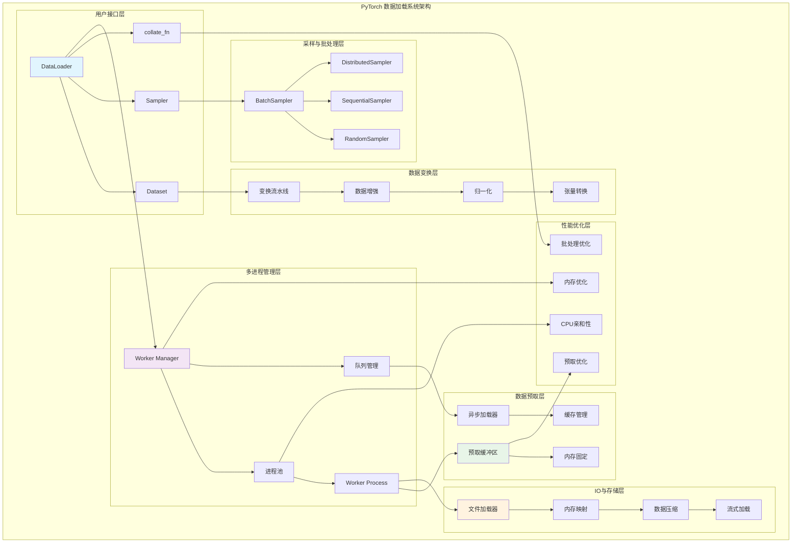

## 概述

<!--more-->

## 1. 数据加载系统架构

### 1.1 核心组件层次

PyTorch数据加载系统采用多层架构设计：

```
┌─────────────────────────────────────────────────────────────┐
│                   DataLoader Interface                     │  ← 用户接口
├─────────────────────────────────────────────────────────────┤
│                   Sampling Strategy                        │  ← 采样策略
├─────────────────────────────────────────────────────────────┤
│                  Batch Construction                        │  ← 批处理构建
├─────────────────────────────────────────────────────────────┤
│                 Multiprocessing Layer                      │  ← 多进程层
├─────────────────────────────────────────────────────────────┤
│                   Prefetch Manager                         │  ← 预取管理
├─────────────────────────────────────────────────────────────┤
│                  Memory Management                         │  ← 内存管理
└─────────────────────────────────────────────────────────────┘
```

### 1.2 数据加载系统完整架构图



## 2. DataLoader核心实现

### 2.1 DataLoader主体架构

```python
class DataLoader:
    """高效数据加载器的完整实现"""
    
    def __init__(
        self,
        dataset,
        batch_size=1,
        shuffle=False,
        sampler=None,
        batch_sampler=None,
        num_workers=0,
        collate_fn=None,
        pin_memory=False,
        drop_last=False,
        timeout=0,
        worker_init_fn=None,
        multiprocessing_context=None,
        generator=None,
        prefetch_factor=2,
        persistent_workers=False,
        pin_memory_device=""
    ):
        self.dataset = dataset
        self.batch_size = batch_size
        self.num_workers = num_workers
        self.pin_memory = pin_memory
        self.timeout = timeout
        self.prefetch_factor = prefetch_factor
        self.persistent_workers = persistent_workers
        
        # 采样器设置
        if batch_sampler is None:
            if sampler is None:
                if shuffle:
                    sampler = RandomSampler(dataset, generator=generator)
                else:
                    sampler = SequentialSampler(dataset)
            batch_sampler = BatchSampler(sampler, batch_size, drop_last)
        
        self.batch_sampler = batch_sampler
        
        # 整理函数
        if collate_fn is None:
            if hasattr(dataset, '_get_collate_fn'):
                self.collate_fn = dataset._get_collate_fn()
            else:
                self.collate_fn = default_collate
        else:
            self.collate_fn = collate_fn
        
        # 工作进程初始化
        self.worker_init_fn = worker_init_fn
        self.multiprocessing_context = multiprocessing_context
        
        # 内部状态
        self._iterator = None
        self._index_sampler = None
        
        # 性能监控
        self._performance_stats = {
            'total_batches_loaded': 0,
            'total_loading_time': 0.0,
            'average_batch_time': 0.0,
            'queue_wait_time': 0.0,
            'worker_utilization': []
        }
    
    def __iter__(self):
        """创建数据迭代器"""
        if self.num_workers == 0:
            # 单进程模式
            return _SingleProcessDataLoaderIter(self)
        else:
            # 多进程模式
            return _MultiProcessingDataLoaderIter(self)
    
    def __len__(self):
        """返回批次数量"""
        return len(self.batch_sampler)

# 单进程数据迭代器
class _SingleProcessDataLoaderIter:
    """单进程数据迭代器"""
    
    def __init__(self, loader):
        self._dataset = loader.dataset
        self._collate_fn = loader.collate_fn
        self._batch_sampler = loader.batch_sampler
        self._pin_memory = loader.pin_memory
        self._pin_memory_device = loader.pin_memory_device
        
        self._sampler_iter = iter(self._batch_sampler)
        self._base_seed = torch.empty((), dtype=torch.int64).random_().item()
        
        # 性能监控
        self._batch_start_time = None
        
    def __next__(self):
        """获取下一个批次"""
        start_time = time.time()
        
        try:
            # 获取索引批次
            indices = next(self._sampler_iter)
        except StopIteration:
            raise StopIteration
        
        # 加载数据
        batch = self._fetch_batch(indices)
        
        # 性能统计
        end_time = time.time()
        batch_time = end_time - start_time
        
        return batch
    
    def _fetch_batch(self, indices):
        """获取批次数据"""
        # 从数据集加载样本
        data = [self._dataset[idx] for idx in indices]
        
        # 应用整理函数
        batch = self._collate_fn(data)
        
        # 内存固定优化
        if self._pin_memory:
            batch = _utils.pin_memory.pin_memory(batch, self._pin_memory_device)
        
        return batch

# 多进程数据迭代器
class _MultiProcessingDataLoaderIter:
    """多进程数据迭代器的完整实现"""
    
    def __init__(self, loader):
        self._dataset = loader.dataset
        self._collate_fn = loader.collate_fn
        self._batch_sampler = loader.batch_sampler
        self._num_workers = loader.num_workers
        self._pin_memory = loader.pin_memory
        self._timeout = loader.timeout
        self._prefetch_factor = loader.prefetch_factor
        self._persistent_workers = loader.persistent_workers
        
        # 工作进程管理
        self._worker_manager = MultiprocessingWorkerManager(
            dataset=self._dataset,
            num_workers=self._num_workers,
            collate_fn=self._collate_fn,
            worker_init_fn=loader.worker_init_fn,
            multiprocessing_context=loader.multiprocessing_context
        )
        
        # 预取管理
        self._prefetch_manager = PrefetchManager(
            num_workers=self._num_workers,
            prefetch_factor=self._prefetch_factor,
            pin_memory=self._pin_memory
        )
        
        # 批次索引迭代器
        self._sampler_iter = iter(self._batch_sampler)
        
        # 初始化状态
        self._workers_status = ['ready'] * self._num_workers
        self._tasks_outstanding = 0
        self._task_info = {}
        self._rcvd_idx = 0
        self._send_idx = 0
        
        # 启动工作进程
        self._worker_manager.start_workers()
        
        # 启动预取
        self._start_prefetching()
    
    def __next__(self):
        """获取下一个批次（异步优化版本）"""
        # 从预取缓冲区获取批次
        batch = self._prefetch_manager.get_next_batch(timeout=self._timeout)
        
        if batch is None:
            raise StopIteration
        
        # 触发下一批次的预取
        self._trigger_next_prefetch()
        
        return batch
    
    def _start_prefetching(self):
        """启动预取机制"""
        # 预取初始批次
        for _ in range(self._prefetch_factor * self._num_workers):
            try:
                self._put_indices()
            except StopIteration:
                break
    
    def _put_indices(self):
        """向工作进程发送索引"""
        try:
            indices = next(self._sampler_iter)
        except StopIteration:
            return
        
        # 选择最空闲的工作进程
        worker_id = self._worker_manager.get_least_busy_worker()
        
        # 发送任务到工作进程
        task = DataLoaderTask(
            task_id=self._send_idx,
            indices=indices,
            dataset_kind=self._dataset_kind()
        )
        
        self._worker_manager.send_task(worker_id, task)
        self._task_info[self._send_idx] = (worker_id, time.time())
        self._send_idx += 1
        self._tasks_outstanding += 1
    
    def _trigger_next_prefetch(self):
        """触发下一批次的预取"""
        if self._tasks_outstanding < self._prefetch_factor * self._num_workers:
            try:
                self._put_indices()
            except StopIteration:
                pass
```

### 2.2 多进程工作管理器

```python
import multiprocessing as mp
import queue
import threading
import time
from typing import Dict, List, Optional, Any

class MultiprocessingWorkerManager:
    """多进程工作管理器"""
    
    def __init__(self, dataset, num_workers, collate_fn, worker_init_fn=None, 
                 multiprocessing_context=None):
        self.dataset = dataset
        self.num_workers = num_workers
        self.collate_fn = collate_fn
        self.worker_init_fn = worker_init_fn
        
        # 多进程上下文
        if multiprocessing_context is None:
            # 根据平台选择最优的多进程方法
            if hasattr(mp, 'get_context'):
                if sys.platform == 'win32':
                    self.mp_context = mp.get_context('spawn')
                else:
                    self.mp_context = mp.get_context('fork')
            else:
                self.mp_context = mp
        else:
            self.mp_context = multiprocessing_context
        
        # 进程间通信队列
        self.index_queues = []      # 主进程 -> 工作进程的索引队列
        self.data_queue = None      # 工作进程 -> 主进程的数据队列
        self.worker_processes = []   # 工作进程列表
        self.workers_done_event = None  # 工作完成事件
        
        # 工作进程状态监控
        self.worker_status = {}
        self.worker_pids = {}
        self.worker_queue_sizes = [0] * num_workers
        
        # 性能监控
        self.task_completion_times = {}
        self.worker_utilization = [0.0] * num_workers
    
    def start_workers(self):
        """启动所有工作进程"""
        # 创建进程间通信队列
        for i in range(self.num_workers):
            # 每个工作进程一个索引队列
            self.index_queues.append(self.mp_context.Queue())
        
        # 共享的数据队列
        self.data_queue = self.mp_context.Queue()
        
        # 工作完成事件
        self.workers_done_event = self.mp_context.Event()
        
        # 启动工作进程
        for worker_id in range(self.num_workers):
            # 创建工作进程
            worker_process = self.mp_context.Process(
                target=self._worker_loop,
                args=(
                    worker_id,
                    self.dataset,
                    self.index_queues[worker_id],
                    self.data_queue,
                    self.workers_done_event,
                    self.collate_fn,
                    self.worker_init_fn
                )
            )
            
            worker_process.daemon = True
            worker_process.start()
            
            self.worker_processes.append(worker_process)
            self.worker_pids[worker_id] = worker_process.pid
            self.worker_status[worker_id] = 'running'
        
        # 启动状态监控线程
        self._start_monitoring_thread()
    
    def send_task(self, worker_id: int, task: 'DataLoaderTask'):
        """向指定工作进程发送任务"""
        try:
            self.index_queues[worker_id].put(task, timeout=1.0)
            self.worker_queue_sizes[worker_id] += 1
        except queue.Full:
            raise RuntimeError(f"Worker {worker_id} queue is full")
    
    def get_least_busy_worker(self) -> int:
        """获取最空闲的工作进程"""
        return min(range(self.num_workers), 
                  key=lambda i: self.worker_queue_sizes[i])
    
    def shutdown_workers(self):
        """关闭所有工作进程"""
        if self.workers_done_event:
            self.workers_done_event.set()
        
        # 向所有工作进程发送终止信号
        for i in range(self.num_workers):
            try:
                self.index_queues[i].put(None, timeout=1.0)
            except queue.Full:
                pass
        
        # 等待工作进程结束
        for worker_process in self.worker_processes:
            worker_process.join(timeout=5.0)
            if worker_process.is_alive():
                worker_process.terminate()
                worker_process.join()
    
    @staticmethod
    def _worker_loop(worker_id, dataset, index_queue, data_queue, done_event,
                    collate_fn, worker_init_fn):
        """工作进程主循环"""
        try:
            # 设置随机种子（确保不同工作进程的随机性）
            torch.manual_seed(torch.initial_seed() + worker_id)
            np.random.seed(torch.initial_seed() + worker_id)
            
            # 执行工作进程初始化函数
            if worker_init_fn is not None:
                worker_init_fn(worker_id)
            
            # 优化工作进程设置
            optimize_worker_process(worker_id)
            
            # 主工作循环
            while not done_event.is_set():
                try:
                    # 从索引队列获取任务
                    task = index_queue.get(timeout=1.0)
                    
                    if task is None:  # 终止信号
                        break
                    
                    # 执行数据加载
                    batch_data = load_batch_data(dataset, task.indices, collate_fn)
                    
                    # 发送结果到主进程
                    result = DataLoaderResult(
                        task_id=task.task_id,
                        worker_id=worker_id,
                        data=batch_data,
                        completion_time=time.time()
                    )
                    
                    data_queue.put(result)
                    
                except queue.Empty:
                    continue
                except Exception as e:
                    # 发送异常信息到主进程
                    error_result = DataLoaderResult(
                        task_id=getattr(task, 'task_id', -1),
                        worker_id=worker_id,
                        error=e,
                        completion_time=time.time()
                    )
                    data_queue.put(error_result)
        
        except Exception as e:
            print(f"Worker {worker_id} crashed with error: {e}")
    
    def _start_monitoring_thread(self):
        """启动工作进程监控线程"""
        def monitor_workers():
            while not self.workers_done_event.is_set():
                time.sleep(1.0)  # 每秒检查一次
                
                # 检查工作进程健康状态
                for worker_id, process in enumerate(self.worker_processes):
                    if not process.is_alive():
                        self.worker_status[worker_id] = 'dead'
                        # 可以实现工作进程重启逻辑
                        self._restart_worker(worker_id)
                    
                    # 更新队列大小统计
                    try:
                        queue_size = self.index_queues[worker_id].qsize()
                        self.worker_queue_sizes[worker_id] = queue_size
                    except NotImplementedError:
                        # 某些平台不支持qsize()
                        pass
                
                # 计算工作进程利用率
                self._update_worker_utilization()
        
        monitor_thread = threading.Thread(target=monitor_workers, daemon=True)
        monitor_thread.start()
    
    def _restart_worker(self, worker_id):
        """重启故障的工作进程"""
        if self.worker_status[worker_id] == 'dead':
            # 清理旧进程
            old_process = self.worker_processes[worker_id]
            if old_process.is_alive():
                old_process.terminate()
                old_process.join()
            
            # 创建新的工作进程
            new_process = self.mp_context.Process(
                target=self._worker_loop,
                args=(
                    worker_id,
                    self.dataset,
                    self.index_queues[worker_id], 
                    self.data_queue,
                    self.workers_done_event,
                    self.collate_fn,
                    self.worker_init_fn
                )
            )
            
            new_process.daemon = True
            new_process.start()
            
            self.worker_processes[worker_id] = new_process
            self.worker_pids[worker_id] = new_process.pid
            self.worker_status[worker_id] = 'running'

def optimize_worker_process(worker_id):
    """优化工作进程设置"""
    try:
        import os
        import psutil
        
        # 设置CPU亲和性（减少缓存miss）
        cpu_count = os.cpu_count()
        if cpu_count > 1:
            # 将工作进程绑定到特定CPU核心
            available_cpus = list(range(cpu_count))
            assigned_cpu = available_cpus[worker_id % len(available_cpus)]
            
            process = psutil.Process()
            process.cpu_affinity([assigned_cpu])
        
        # 设置进程优先级
        if hasattr(os, 'nice'):
            os.nice(-5)  # 提高优先级（需要权限）
        
        # 设置内存策略
        if hasattr(os, 'sched_setaffinity'):
            # 在NUMA系统上优化内存访问
            numa_node = worker_id % 2  # 简化：假设2个NUMA节点
            # 实际需要更复杂的NUMA拓扑检测
    
    except ImportError:
        # psutil不可用时跳过优化
        pass
    except PermissionError:
        # 权限不足时跳过优化
        pass

def load_batch_data(dataset, indices, collate_fn):
    """加载批次数据（优化版本）"""
    # 批量预取优化
    if hasattr(dataset, 'batch_load'):
        # 数据集支持批量加载
        return dataset.batch_load(indices, collate_fn)
    
    # 传统的逐个加载
    samples = []
    for idx in indices:
        try:
            sample = dataset[idx]
            samples.append(sample)
        except Exception as e:
            # 处理数据加载异常
            print(f"Error loading sample {idx}: {e}")
            # 可以选择跳过或使用默认样本
            continue
    
    # 应用collate函数
    if samples:
        return collate_fn(samples)
    else:
        return None

# 数据加载任务和结果的定义
class DataLoaderTask:
    """数据加载任务"""
    def __init__(self, task_id, indices, dataset_kind):
        self.task_id = task_id
        self.indices = indices
        self.dataset_kind = dataset_kind
        self.creation_time = time.time()

class DataLoaderResult:
    """数据加载结果"""
    def __init__(self, task_id, worker_id, data=None, error=None, completion_time=None):
        self.task_id = task_id
        self.worker_id = worker_id
        self.data = data
        self.error = error
        self.completion_time = completion_time or time.time()
```

## 3. 预取和缓存机制

### 3.1 智能预取管理器

```python
import threading
import queue
from collections import deque
from typing import Optional, Any

class PrefetchManager:
    """智能预取管理器"""
    
    def __init__(self, num_workers, prefetch_factor=2, pin_memory=False):
        self.num_workers = num_workers
        self.prefetch_factor = prefetch_factor
        self.pin_memory = pin_memory
        
        # 预取缓冲区
        self.prefetch_buffer = queue.Queue(maxsize=prefetch_factor * num_workers)
        
        # 内存固定池（GPU优化）
        if pin_memory:
            self.pin_memory_pool = PinMemoryPool()
        
        # 缓存管理
        self.cache_manager = AdaptiveCacheManager()
        
        # 性能监控
        self.prefetch_stats = {
            'buffer_hit_rate': 0.0,
            'average_wait_time': 0.0,
            'cache_hit_rate': 0.0
        }
    
    def get_next_batch(self, timeout=None):
        """获取下一个批次（带超时）"""
        start_time = time.time()
        
        try:
            # 从预取缓冲区获取
            result = self.prefetch_buffer.get(timeout=timeout)
            
            if result.error:
                raise result.error
            
            batch_data = result.data
            
            # 内存固定优化（GPU传输优化）
            if self.pin_memory and batch_data is not None:
                batch_data = self.pin_memory_pool.pin_memory(batch_data)
            
            # 更新性能统计
            wait_time = time.time() - start_time
            self._update_prefetch_stats(wait_time)
            
            return batch_data
            
        except queue.Empty:
            return None
    
    def put_batch(self, batch_result):
        """将批次放入预取缓冲区"""
        try:
            self.prefetch_buffer.put(batch_result, block=False)
        except queue.Full:
            # 缓冲区满，丢弃最旧的批次
            try:
                self.prefetch_buffer.get(block=False)
                self.prefetch_buffer.put(batch_result, block=False)
            except queue.Empty:
                pass
    
    def _update_prefetch_stats(self, wait_time):
        """更新预取性能统计"""
        # 使用指数移动平均
        alpha = 0.1
        self.prefetch_stats['average_wait_time'] = (
            alpha * wait_time + 
            (1 - alpha) * self.prefetch_stats['average_wait_time']
        )
        
        # 更新缓冲区命中率
        buffer_size = self.prefetch_buffer.qsize()
        buffer_capacity = self.prefetch_buffer.maxsize
        hit_rate = buffer_size / buffer_capacity if buffer_capacity > 0 else 0
        
        self.prefetch_stats['buffer_hit_rate'] = (
            alpha * hit_rate +
            (1 - alpha) * self.prefetch_stats['buffer_hit_rate']
        )

class PinMemoryPool:
    """内存固定池"""
    
    def __init__(self, max_pool_size=100 * 1024 * 1024):  # 100MB
        self.max_pool_size = max_pool_size
        self.current_pool_size = 0
        
        # 内存池：大小 -> 固定内存块列表
        self.memory_pools = {}
        self.pool_lock = threading.Lock()
        
        # 使用统计
        self.allocation_stats = {
            'total_allocations': 0,
            'pool_hits': 0,
            'pool_misses': 0
        }
    
    def pin_memory(self, data):
        """固定内存（GPU传输优化）"""
        if torch.cuda.is_available():
            return self._pin_tensor_memory(data)
        return data
    
    def _pin_tensor_memory(self, data):
        """固定张量内存"""
        if isinstance(data, torch.Tensor):
            # 单个张量
            return self._get_pinned_tensor(data)
        elif isinstance(data, (list, tuple)):
            # 张量序列
            pinned_data = []
            for item in data:
                pinned_data.append(self._pin_tensor_memory(item))
            return type(data)(pinned_data)
        elif isinstance(data, dict):
            # 字典
            pinned_data = {}
            for key, value in data.items():
                pinned_data[key] = self._pin_tensor_memory(value)
            return pinned_data
        else:
            return data
    
    def _get_pinned_tensor(self, tensor):
        """获取固定内存的张量"""
        if tensor.is_pinned():
            return tensor
        
        with self.pool_lock:
            tensor_size = tensor.numel() * tensor.element_size()
            
            # 查找合适大小的内存池
            if tensor_size in self.memory_pools:
                pool = self.memory_pools[tensor_size]
                if pool:
                    # 从池中获取
                    pinned_tensor = pool.pop()
                    pinned_tensor.copy_(tensor)
                    
                    self.allocation_stats['pool_hits'] += 1
                    return pinned_tensor
            
            # 池中没有合适的内存，分配新的
            if self.current_pool_size + tensor_size <= self.max_pool_size:
                pinned_tensor = torch.empty_like(tensor).pin_memory()
                pinned_tensor.copy_(tensor)
                
                self.current_pool_size += tensor_size
                self.allocation_stats['pool_misses'] += 1
                
                return pinned_tensor
            else:
                # 池已满，使用普通内存
                return tensor.pin_memory()
    
    def return_to_pool(self, pinned_tensor):
        """将固定内存返回池中"""
        if not pinned_tensor.is_pinned():
            return
        
        with self.pool_lock:
            tensor_size = pinned_tensor.numel() * pinned_tensor.element_size()
            
            if tensor_size not in self.memory_pools:
                self.memory_pools[tensor_size] = deque()
            
            # 限制每个大小池的最大数量
            if len(self.memory_pools[tensor_size]) < 10:
                self.memory_pools[tensor_size].append(pinned_tensor)

class AdaptiveCacheManager:
    """自适应缓存管理器"""
    
    def __init__(self, max_cache_size=500 * 1024 * 1024):  # 500MB
        self.max_cache_size = max_cache_size
        self.current_cache_size = 0
        
        # LRU缓存实现
        self.cache = {}
        self.access_order = deque()
        self.access_counts = {}
        
        self.cache_lock = threading.Lock()
        
        # 自适应参数
        self.hit_rate_threshold = 0.8
        self.size_adaptation_factor = 1.1
    
    def get_cached_item(self, key):
        """获取缓存项"""
        with self.cache_lock:
            if key in self.cache:
                # 更新访问顺序
                self.access_order.remove(key)
                self.access_order.append(key)
                self.access_counts[key] = self.access_counts.get(key, 0) + 1
                
                return self.cache[key]
            
            return None
    
    def cache_item(self, key, data):
        """缓存数据项"""
        with self.cache_lock:
            data_size = self._calculate_data_size(data)
            
            # 检查是否需要逐出
            while (self.current_cache_size + data_size > self.max_cache_size and 
                   self.access_order):
                self._evict_lru_item()
            
            # 添加到缓存
            self.cache[key] = data
            self.access_order.append(key)
            self.access_counts[key] = 1
            self.current_cache_size += data_size
    
    def _evict_lru_item(self):
        """逐出最近最少使用的项"""
        if not self.access_order:
            return
        
        # 找到访问次数最少的项进行逐出
        lru_key = min(self.access_order, key=lambda k: self.access_counts.get(k, 0))
        
        # 移除项
        evicted_data = self.cache.pop(lru_key)
        self.access_order.remove(lru_key)
        del self.access_counts[lru_key]
        
        evicted_size = self._calculate_data_size(evicted_data)
        self.current_cache_size -= evicted_size
    
    def _calculate_data_size(self, data):
        """计算数据大小"""
        if isinstance(data, torch.Tensor):
            return data.numel() * data.element_size()
        elif isinstance(data, (list, tuple)):
            return sum(self._calculate_data_size(item) for item in data)
        else:
            # 估算其他类型的大小
            return sys.getsizeof(data)
    
    def adapt_cache_size(self):
        """根据命中率自适应调整缓存大小"""
        hit_rate = self._calculate_hit_rate()
        
        if hit_rate < self.hit_rate_threshold:
            # 命中率低，增加缓存大小
            new_size = min(
                self.max_cache_size * self.size_adaptation_factor,
                1024 * 1024 * 1024  # 不超过1GB
            )
            self.max_cache_size = int(new_size)
        elif hit_rate > 0.95:
            # 命中率很高，可以减少缓存大小
            new_size = max(
                self.max_cache_size / self.size_adaptation_factor,
                100 * 1024 * 1024  # 不少于100MB
            )
            self.max_cache_size = int(new_size)
    
    def _calculate_hit_rate(self):
        """计算缓存命中率"""
        total_accesses = sum(self.access_counts.values())
        if total_accesses == 0:
            return 0.0
        
        hits = sum(count for count in self.access_counts.values() if count > 1)
        return hits / total_accesses
```

## 4. 高级数据处理优化

### 4.1 批处理优化技术

```python
import torch
import numpy as np
from typing import List, Dict, Tuple, Any

class AdvancedCollateFunction:
    """高级批处理函数"""
    
    def __init__(self, 
                 dynamic_padding=True,
                 tensor_fusion=True, 
                 memory_format_optimization=True):
        self.dynamic_padding = dynamic_padding
        self.tensor_fusion = tensor_fusion
        self.memory_format_optimization = memory_format_optimization
        
        # 批处理统计
        self.batch_stats = {
            'padding_overhead': 0.0,
            'fusion_speedup': 0.0,
            'memory_efficiency': 0.0
        }
    
    def __call__(self, batch: List[Any]) -> Any:
        """优化的批处理函数"""
        if not batch:
            return batch
        
        # 分析批次数据结构
        sample_structure = self._analyze_sample_structure(batch[0])
        
        # 根据数据类型选择优化策略
        if self._is_tensor_batch(batch):
            return self._collate_tensor_batch(batch)
        elif self._is_mixed_batch(batch):
            return self._collate_mixed_batch(batch)
        else:
            return self._collate_generic_batch(batch)
    
    def _collate_tensor_batch(self, batch: List[torch.Tensor]) -> torch.Tensor:
        """优化的张量批处理"""
        if not self._need_padding(batch):
            # 形状一致，直接堆叠
            return torch.stack(batch, dim=0)
        
        if self.dynamic_padding:
            # 动态填充：只填充到批次中的最大尺寸
            return self._dynamic_padding_stack(batch)
        else:
            # 传统填充：填充到预定义的最大尺寸
            return self._static_padding_stack(batch)
    
    def _dynamic_padding_stack(self, batch: List[torch.Tensor]) -> torch.Tensor:
        """动态填充堆叠（最小化填充开销）"""
        # 计算批次中的最大尺寸
        max_shape = list(batch[0].shape)
        for tensor in batch[1:]:
            for i, dim_size in enumerate(tensor.shape):
                max_shape[i] = max(max_shape[i], dim_size)
        
        # 只填充到批次最大尺寸
        padded_tensors = []
        total_padding = 0
        
        for tensor in batch:
            if list(tensor.shape) == max_shape:
                padded_tensors.append(tensor)
            else:
                # 计算填充量
                padding = []
                for i in range(len(tensor.shape)):
                    pad_size = max_shape[i] - tensor.shape[i]
                    padding.extend([0, pad_size])
                    total_padding += pad_size
                
                # 反向填充（PyTorch的pad函数要求）
                padding.reverse()
                padded_tensor = torch.nn.functional.pad(tensor, padding)
                padded_tensors.append(padded_tensor)
        
        # 更新填充开销统计
        total_elements = sum(t.numel() for t in padded_tensors)
        self.batch_stats['padding_overhead'] = total_padding / total_elements
        
        return torch.stack(padded_tensors, dim=0)
    
    def _collate_mixed_batch(self, batch: List[Dict[str, Any]]) -> Dict[str, Any]:
        """混合数据类型的批处理"""
        if not batch:
            return {}
        
        # 分析键和数据类型
        keys = batch[0].keys()
        result = {}
        
        for key in keys:
            # 收集同一键的所有值
            values = [sample[key] for sample in batch]
            
            # 根据数据类型选择处理策略
            if all(isinstance(v, torch.Tensor) for v in values):
                # 张量类型
                result[key] = self._collate_tensor_batch(values)
            elif all(isinstance(v, (int, float)) for v in values):
                # 数值类型
                result[key] = torch.tensor(values)
            elif all(isinstance(v, str) for v in values):
                # 字符串类型
                result[key] = values
            else:
                # 混合类型，保持列表形式
                result[key] = values
        
        return result
    
    def _need_padding(self, batch: List[torch.Tensor]) -> bool:
        """检查是否需要填充"""
        if len(batch) <= 1:
            return False
        
        reference_shape = batch[0].shape
        return any(tensor.shape != reference_shape for tensor in batch[1:])
    
    def _optimize_memory_format(self, tensor: torch.Tensor) -> torch.Tensor:
        """优化内存格式"""
        if not self.memory_format_optimization:
            return tensor
        
        # 对于4D张量，考虑channels_last格式
        if tensor.dim() == 4:
            # 检查是否适合channels_last格式
            if self._should_use_channels_last(tensor):
                return tensor.to(memory_format=torch.channels_last)
        
        return tensor
    
    def _should_use_channels_last(self, tensor: torch.Tensor) -> bool:
        """判断是否应该使用channels_last格式"""
        if tensor.dim() != 4:
            return False
        
        # 获取张量形状 [N, C, H, W]
        N, C, H, W = tensor.shape
        
        # 启发式规则：通道数较多且空间尺寸较大时使用channels_last
        return C >= 64 and H * W >= 64

class DatasetOptimizer:
    """数据集优化器"""
    
    def __init__(self, dataset):
        self.dataset = dataset
        self.access_pattern_analyzer = AccessPatternAnalyzer()
        
    def optimize_dataset_access(self):
        """优化数据集访问模式"""
        # 分析访问模式
        access_pattern = self.access_pattern_analyzer.analyze(self.dataset)
        
        # 根据访问模式应用优化
        if access_pattern['is_sequential']:
            return self._apply_sequential_optimization()
        elif access_pattern['is_random']:
            return self._apply_random_optimization()
        else:
            return self._apply_hybrid_optimization()
    
    def _apply_sequential_optimization(self):
        """顺序访问优化"""
        # 使用预读缓冲
        return SequentialBufferedDataset(self.dataset, buffer_size=1000)
    
    def _apply_random_optimization(self):
        """随机访问优化"""
        # 使用LRU缓存
        return CachedDataset(self.dataset, cache_size=5000)
    
    def _apply_hybrid_optimization(self):
        """混合优化策略"""
        # 结合缓存和预读
        cached_dataset = CachedDataset(self.dataset, cache_size=2000)
        return SequentialBufferedDataset(cached_dataset, buffer_size=500)

class AccessPatternAnalyzer:
    """访问模式分析器"""
    
    def analyze(self, dataset, sample_size=1000):
        """分析数据集访问模式"""
        if len(dataset) < sample_size:
            sample_indices = list(range(len(dataset)))
        else:
            sample_indices = np.random.choice(len(dataset), sample_size, replace=False)
        
        # 模拟访问模式
        access_log = []
        for idx in sample_indices:
            access_log.append(idx)
        
        # 分析顺序性
        sequential_count = 0
        for i in range(1, len(access_log)):
            if access_log[i] == access_log[i-1] + 1:
                sequential_count += 1
        
        sequential_ratio = sequential_count / max(1, len(access_log) - 1)
        
        # 分析局部性
        locality_score = self._calculate_locality_score(access_log)
        
        return {
            'is_sequential': sequential_ratio > 0.8,
            'is_random': sequential_ratio < 0.2 and locality_score < 0.3,
            'locality_score': locality_score,
            'sequential_ratio': sequential_ratio
        }
    
    def _calculate_locality_score(self, access_log):
        """计算访问局部性得分"""
        if len(access_log) < 2:
            return 0.0
        
        distances = []
        for i in range(1, len(access_log)):
            distance = abs(access_log[i] - access_log[i-1])
            distances.append(distance)
        
        # 局部性得分：平均距离的倒数
        avg_distance = np.mean(distances)
        return 1.0 / (1.0 + avg_distance)

class SequentialBufferedDataset:
    """顺序缓冲数据集"""
    
    def __init__(self, dataset, buffer_size=1000):
        self.dataset = dataset
        self.buffer_size = buffer_size
        self.buffer = {}
        self.buffer_start = 0
        
    def __getitem__(self, idx):
        # 检查是否在缓冲区中
        if self.buffer_start <= idx < self.buffer_start + len(self.buffer):
            relative_idx = idx - self.buffer_start
            if relative_idx in self.buffer:
                return self.buffer[relative_idx]
        
        # 重新填充缓冲区
        self._refill_buffer(idx)
        
        relative_idx = idx - self.buffer_start
        return self.buffer[relative_idx]
    
    def __len__(self):
        return len(self.dataset)
    
    def _refill_buffer(self, start_idx):
        """重新填充缓冲区"""
        self.buffer.clear()
        self.buffer_start = start_idx
        
        end_idx = min(start_idx + self.buffer_size, len(self.dataset))
        
        for i in range(start_idx, end_idx):
            relative_idx = i - start_idx
            self.buffer[relative_idx] = self.dataset[i]

class CachedDataset:
    """LRU缓存数据集"""
    
    def __init__(self, dataset, cache_size=5000):
        self.dataset = dataset
        self.cache_size = cache_size
        self.cache = {}
        self.access_order = deque()
        
    def __getitem__(self, idx):
        # 检查缓存
        if idx in self.cache:
            # 更新访问顺序
            self.access_order.remove(idx)
            self.access_order.append(idx)
            return self.cache[idx]
        
        # 加载数据
        data = self.dataset[idx]
        
        # 添加到缓存
        if len(self.cache) >= self.cache_size:
            # 移除最旧的项
            oldest_idx = self.access_order.popleft()
            del self.cache[oldest_idx]
        
        self.cache[idx] = data
        self.access_order.append(idx)
        
        return data
    
    def __len__(self):
        return len(self.dataset)
```

## 总结

**架构设计优势**：
1. **多进程并行**: 充分利用多核CPU进行数据预处理
2. **异步预取**: 与GPU计算重叠，隐藏数据加载延迟
3. **智能缓存**: 基于访问模式的自适应缓存策略
4. **内存优化**: 固定内存、零拷贝等GPU传输优化

**技术创新特点**：
1. **动态批处理**: 智能填充策略减少内存浪费
2. **容错机制**: 工作进程监控和自动重启
3. **性能监控**: 实时统计和自适应调优
4. **跨平台优化**: 针对不同操作系统的特定优化

**性能优化策略**：
- **预取缓冲**: 多级缓冲机制保证数据供应连续性
- **批量IO**: 批量读取减少系统调用开销
- **内存映射**: 大文件的高效访问策略
- **CPU亲和性**: 减少缓存失效和上下文切换

通过深入理解PyTorch数据加载系统的实现机制，我们能够更好地优化数据管道，提升训练效率，并在大规模数据场景下实现最佳性能。这一系统的设计思想也为其他数据处理框架的开发提供了重要参考。

