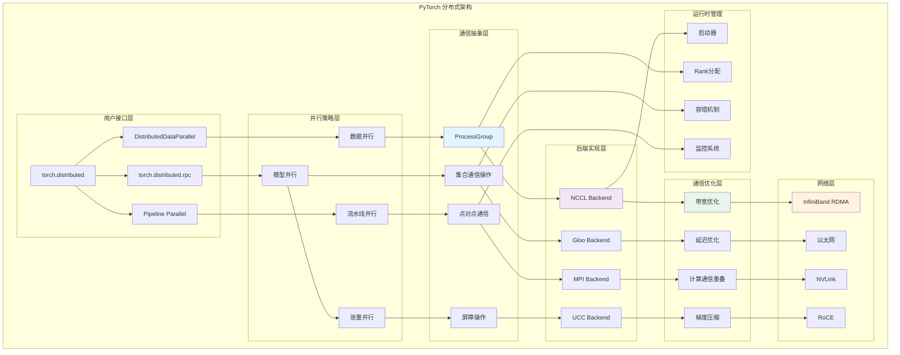

## 概述

<!--more-->

## 1. 分布式架构全景

### 1.1 核心组件层次

PyTorch分布式系统采用分层设计，支持多种并行模式：

```
┌─────────────────────────────────────────────────────────────┐
│              Python Distributed API                        │  ← torch.distributed
├─────────────────────────────────────────────────────────────┤
│               DistributedDataParallel                      │  ← DDP
├─────────────────────────────────────────────────────────────┤
│                  Communication API                         │  ← 集合通信接口
├─────────────────────────────────────────────────────────────┤
│                 Backend Implementations                    │  ← NCCL/Gloo/MPI
├─────────────────────────────────────────────────────────────┤
│                  Process Group Manager                     │  ← 进程组管理
├─────────────────────────────────────────────────────────────┤
│                Network Communication                       │  ← 底层网络通信
└─────────────────────────────────────────────────────────────┘
```

### 1.2 分布式系统完整架构图



## 2. ProcessGroup通信抽象

### 2.1 ProcessGroup基类设计

```cpp
namespace c10d {

// ProcessGroup抽象基类
class TORCH_API ProcessGroup {
 public:
  // 工作句柄：表示异步通信操作
  class TORCH_API Work {
   public:
    Work() : completed_(false), exception_(nullptr) {}
    virtual ~Work() = default;
    
    // 等待操作完成
    virtual bool wait(std::chrono::milliseconds timeout = kDefaultTimeout) {
      std::unique_lock<std::mutex> lock(mutex_);
      return cv_.wait_for(lock, timeout, [this] { return completed_; });
    }
    
    // 获取操作结果
    virtual std::vector<at::Tensor> result() {
      wait();
      if (exception_) {
        std::rethrow_exception(exception_);
      }
      return result_;
    }
    
    // 检查是否完成
    virtual bool isCompleted() {
      std::lock_guard<std::mutex> lock(mutex_);
      return completed_;
    }
    
    // 标记完成
    virtual void finish(std::exception_ptr exception = nullptr) {
      {
        std::lock_guard<std::mutex> lock(mutex_);
        completed_ = true;
        exception_ = exception;
      }
      cv_.notify_all();
    }
    
   protected:
    std::vector<at::Tensor> result_;
    mutable std::mutex mutex_;
    std::condition_variable cv_;
    std::atomic<bool> completed_;
    std::exception_ptr exception_;
  };
  
  // 选项配置
  struct Options {
    std::string backend;          // 后端名称
    std::chrono::milliseconds timeout = std::chrono::minutes(30);
    int group_rank = -1;         // 组内排名
    int group_size = -1;         // 组大小
  };
  
 protected:
  const int rank_;               // 进程排名
  const int size_;               // 进程总数
  const Options options_;        // 配置选项
  
 public:
  ProcessGroup(int rank, int size, Options options = Options{})
      : rank_(rank), size_(size), options_(std::move(options)) {}
  
  virtual ~ProcessGroup() = default;
  
  // 基本属性
  int getRank() const { return rank_; }
  int getSize() const { return size_; }
  virtual const std::string getBackendName() const = 0;
  
  // === 集合通信接口 ===
  
  // All-Reduce：所有进程归约并广播结果
  virtual c10::intrusive_ptr<Work> allreduce(
      std::vector<at::Tensor>& tensors,
      const AllreduceOptions& opts = AllreduceOptions()) = 0;
  
  // All-Gather：收集所有进程的数据
  virtual c10::intrusive_ptr<Work> allgather(
      std::vector<std::vector<at::Tensor>>& output_tensors,
      std::vector<at::Tensor>& input_tensors,
      const AllgatherOptions& opts = AllgatherOptions()) = 0;
  
  // Reduce-Scatter：归约后分散到各进程
  virtual c10::intrusive_ptr<Work> reduce_scatter(
      std::vector<at::Tensor>& output_tensors,
      std::vector<std::vector<at::Tensor>>& input_tensors,
      const ReduceScatterOptions& opts = ReduceScatterOptions()) = 0;
  
  // Broadcast：广播数据到所有进程
  virtual c10::intrusive_ptr<Work> broadcast(
      std::vector<at::Tensor>& tensors,
      const BroadcastOptions& opts = BroadcastOptions()) = 0;
  
  // Send：点对点发送
  virtual c10::intrusive_ptr<Work> send(
      std::vector<at::Tensor>& tensors,
      int dstRank,
      int tag) = 0;
  
  // Recv：点对点接收
  virtual c10::intrusive_ptr<Work> recv(
      std::vector<at::Tensor>& tensors,
      int srcRank,
      int tag) = 0;
  
  // Barrier：同步屏障
  virtual c10::intrusive_ptr<Work> barrier(
      const BarrierOptions& opts = BarrierOptions()) = 0;
  
  // === 高级通信模式 ===
  
  // All-to-All：全交换通信
  virtual c10::intrusive_ptr<Work> alltoall(
      std::vector<at::Tensor>& output_tensors,
      std::vector<at::Tensor>& input_tensors,
      const AllToAllOptions& opts = AllToAllOptions()) {
    throw std::runtime_error("ProcessGroup does not support alltoall");
  }
  
  // Batched Send/Recv
  virtual c10::intrusive_ptr<Work> batch_isend_irecv(
      std::vector<P2POp>& p2p_op_list) {
    throw std::runtime_error("ProcessGroup does not support batch_isend_irecv");
  }
  
 protected:
  // 张量验证
  virtual void check_tensor(const at::Tensor& tensor) {
    if (!tensor.is_contiguous()) {
      throw std::runtime_error("Tensors must be contiguous");
    }
    if (tensor.is_sparse()) {
      throw std::runtime_error("Sparse tensors are not supported");
    }
  }
  
  // 张量列表验证
  virtual void check_tensors(const std::vector<at::Tensor>& tensors) {
    if (tensors.empty()) {
      throw std::runtime_error("Tensor list cannot be empty");
    }
    
    const auto& first = tensors.front();
    for (const auto& tensor : tensors) {
      check_tensor(tensor);
      
      if (tensor.numel() != first.numel()) {
        throw std::runtime_error("All tensors must have the same number of elements");
      }
      
      if (tensor.scalar_type() != first.scalar_type()) {
        throw std::runtime_error("All tensors must have the same data type");
      }
    }
  }
};

} // namespace c10d
```

### 2.2 NCCL后端实现

```cpp
namespace c10d {

// NCCL ProcessGroup实现
class ProcessGroupNCCL : public ProcessGroup {
 private:
  // NCCL通信器管理
  struct NCCLComm {
    ncclComm_t nccl_comm;
    c10::DeviceIndex device_index;
    ncclUniqueId nccl_id;
    
    NCCLComm() : nccl_comm(nullptr), device_index(-1) {}
    
    ~NCCLComm() {
      if (nccl_comm != nullptr) {
        ncclCommDestroy(nccl_comm);
      }
    }
  };
  
  // 每个设备的通信器
  std::vector<std::shared_ptr<NCCLComm>> nccl_comms_;
  
  // 工作流管理
  class NCCLWork : public Work {
   private:
    std::vector<c10::cuda::CUDAEvent> cuda_events_;
    std::vector<c10::cuda::CUDAStream> cuda_streams_;
    
   public:
    NCCLWork(const std::vector<c10::cuda::CUDAStream>& streams) 
        : cuda_streams_(streams) {
      
      // 为每个流创建完成事件
      cuda_events_.reserve(streams.size());
      for (const auto& stream : streams) {
        cuda_events_.emplace_back();
        cuda_events_.back().record(stream);
      }
    }
    
    bool wait(std::chrono::milliseconds timeout = kDefaultTimeout) override {
      // 等待所有CUDA事件完成
      for (const auto& event : cuda_events_) {
        if (!event.query()) {
          // 如果事件未完成，同步等待
          c10::cuda::CUDAStreamGuard guard(cuda_streams_[0]);
          if (!event.wait_for(timeout)) {
            return false;  // 超时
          }
        }
      }
      
      // 标记完成
      finish();
      return true;
    }
    
    bool isCompleted() override {
      // 检查所有事件是否完成
      for (const auto& event : cuda_events_) {
        if (!event.query()) {
          return false;
        }
      }
      return true;
    }
  };
  
 public:
  ProcessGroupNCCL(int rank, int size, const std::string& store_addr)
      : ProcessGroup(rank, size) {
    
    // 初始化NCCL通信器
    initializeNCCLComms(store_addr);
  }
  
  // All-Reduce实现
  c10::intrusive_ptr<Work> allreduce(
      std::vector<at::Tensor>& tensors,
      const AllreduceOptions& opts = AllreduceOptions()) override {
    
    check_tensors(tensors);
    
    // 获取CUDA流
    std::vector<c10::cuda::CUDAStream> streams;
    streams.reserve(tensors.size());
    
    for (size_t i = 0; i < tensors.size(); ++i) {
      auto device = tensors[i].device();
      streams.push_back(c10::cuda::getCurrentCUDAStream(device.index()));
    }
    
    // 启动NCCL All-Reduce
    launch_nccl_collective([&](size_t i) {
      auto& tensor = tensors[i];
      auto& comm = nccl_comms_[tensor.device().index()];
      auto stream = streams[i];
      
      C10_NCCL_CHECK(ncclAllReduce(
          tensor.data_ptr(),           // 发送缓冲区
          tensor.data_ptr(),           // 接收缓冲区（原地操作）
          tensor.numel(),              // 元素数量
          to_nccl_data_type(tensor.scalar_type()),  // 数据类型
          to_nccl_reduce_op(opts.reduceOp),        // 归约操作
          comm->nccl_comm,             // NCCL通信器
          stream                       // CUDA流
      ));
    }, tensors.size());
    
    return c10::make_intrusive<NCCLWork>(streams);
  }
  
  // Reduce-Scatter实现
  c10::intrusive_ptr<Work> reduce_scatter(
      std::vector<at::Tensor>& output_tensors,
      std::vector<std::vector<at::Tensor>>& input_tensors,
      const ReduceScatterOptions& opts = ReduceScatterOptions()) override {
    
    // 验证输入
    TORCH_CHECK(input_tensors.size() == output_tensors.size());
    
    std::vector<c10::cuda::CUDAStream> streams;
    
    // 为每个设备启动Reduce-Scatter
    launch_nccl_collective([&](size_t i) {
      auto& output = output_tensors[i];
      auto& inputs = input_tensors[i];
      
      // 检查输入张量数量是否等于进程数
      TORCH_CHECK(inputs.size() == static_cast<size_t>(size_));
      
      // 将输入张量连接为连续内存
      auto flattened_input = at::cat(inputs, /*dim=*/0);
      
      auto& comm = nccl_comms_[output.device().index()];
      auto stream = c10::cuda::getCurrentCUDAStream(output.device().index());
      streams.push_back(stream);
      
      C10_NCCL_CHECK(ncclReduceScatter(
          flattened_input.data_ptr(),
          output.data_ptr(),
          output.numel(),
          to_nccl_data_type(output.scalar_type()),
          to_nccl_reduce_op(opts.reduceOp),
          comm->nccl_comm,
          stream
      ));
    }, output_tensors.size());
    
    return c10::make_intrusive<NCCLWork>(streams);
  }
  
  // All-Gather实现（内存优化版本）
  c10::intrusive_ptr<Work> allgather(
      std::vector<std::vector<at::Tensor>>& output_tensors,
      std::vector<at::Tensor>& input_tensors,
      const AllgatherOptions& opts = AllgatherOptions()) override {
    
    std::vector<c10::cuda::CUDAStream> streams;
    
    launch_nccl_collective([&](size_t i) {
      auto& input = input_tensors[i];
      auto& outputs = output_tensors[i];
      
      // 为All-Gather分配输出缓冲区
      auto gathered_tensor = at::empty(
          {static_cast<int64_t>(size_) * input.numel()},
          input.options()
      );
      
      auto& comm = nccl_comms_[input.device().index()];
      auto stream = c10::cuda::getCurrentCUDAStream(input.device().index());
      streams.push_back(stream);
      
      C10_NCCL_CHECK(ncclAllGather(
          input.data_ptr(),
          gathered_tensor.data_ptr(),
          input.numel(),
          to_nccl_data_type(input.scalar_type()),
          comm->nccl_comm,
          stream
      ));
      
      // 分割收集到的数据
      outputs.clear();
      outputs.reserve(size_);
      
      for (int rank = 0; rank < size_; ++rank) {
        auto start_idx = rank * input.numel();
        auto slice = gathered_tensor.narrow(0, start_idx, input.numel());
        outputs.push_back(slice.view_as(input));
      }
      
    }, input_tensors.size());
    
    return c10::make_intrusive<NCCLWork>(streams);
  }
  
 private:
  // 初始化NCCL通信器
  void initializeNCCLComms(const std::string& store_addr) {
    // 获取可用的CUDA设备数量
    int num_devices = c10::cuda::device_count();
    nccl_comms_.resize(num_devices);
    
    // 为每个设备创建NCCL通信器
    std::vector<ncclComm_t> nccl_comms(num_devices);
    std::vector<int> devices(num_devices);
    
    for (int i = 0; i < num_devices; ++i) {
      devices[i] = i;
    }
    
    // 生成唯一的NCCL ID
    ncclUniqueId nccl_id;
    if (rank_ == 0) {
      C10_NCCL_CHECK(ncclGetUniqueId(&nccl_id));
      // 通过store分发ID到其他进程
      broadcast_nccl_id(store_addr, nccl_id);
    } else {
      // 从store接收NCCL ID
      nccl_id = receive_nccl_id(store_addr);
    }
    
    // 初始化NCCL通信器
    C10_NCCL_CHECK(ncclCommInitRankConfig(
        nccl_comms.data(),
        num_devices,
        nccl_id,
        rank_,
        size_,
        nullptr  // 使用默认配置
    ));
    
    // 包装为管理对象
    for (int i = 0; i < num_devices; ++i) {
      auto comm = std::make_shared<NCCLComm>();
      comm->nccl_comm = nccl_comms[i];
      comm->device_index = i;
      comm->nccl_id = nccl_id;
      nccl_comms_[i] = comm;
    }
  }
  
  // NCCL集合操作启动器
  template<typename CollectiveFunc>
  void launch_nccl_collective(CollectiveFunc&& func, size_t num_tensors) {
    // 启动NCCL组操作（重要：确保所有操作原子性）
    C10_NCCL_CHECK(ncclGroupStart());
    
    try {
      // 为每个张量启动NCCL操作
      for (size_t i = 0; i < num_tensors; ++i) {
        func(i);
      }
    } catch (...) {
      // 异常时结束组操作
      ncclGroupEnd();
      throw;
    }
    
    // 结束组操作
    C10_NCCL_CHECK(ncclGroupEnd());
  }
  
  // NCCL数据类型转换
  ncclDataType_t to_nccl_data_type(at::ScalarType scalar_type) {
    switch (scalar_type) {
      case at::kFloat: return ncclFloat32;
      case at::kDouble: return ncclFloat64;
      case at::kHalf: return ncclFloat16;
      case at::kBFloat16: return ncclBfloat16;
      case at::kInt: return ncclInt32;
      case at::kLong: return ncclInt64;
      default:
        throw std::runtime_error("Unsupported data type for NCCL");
    }
  }
  
  // NCCL归约操作转换
  ncclRedOp_t to_nccl_reduce_op(ReduceOp reduce_op) {
    switch (reduce_op) {
      case ReduceOp::SUM: return ncclSum;
      case ReduceOp::PRODUCT: return ncclProd;
      case ReduceOp::MIN: return ncclMin;
      case ReduceOp::MAX: return ncclMax;
      case ReduceOp::AVG: return ncclAvg;
      default:
        throw std::runtime_error("Unsupported reduce operation for NCCL");
    }
  }
};

} // namespace c10d
```

## 3. DistributedDataParallel深度解析

### 3.1 DDP核心机制

```cpp
namespace torch::nn::parallel {

// DistributedDataParallel的完整实现
class DistributedDataParallel : public Module {
 private:
  // 模块副本管理
  Module original_module_;
  std::shared_ptr<c10d::ProcessGroup> process_group_;
  
  // 梯度同步状态
  struct GradientState {
    // 梯度桶：将参数分组以优化通信
    std::vector<GradientBucket> gradient_buckets_;
    
    // 异步all-reduce句柄
    std::vector<c10::intrusive_ptr<c10d::Work>> pending_allreduce_works_;
    
    // 同步状态
    std::atomic<bool> sync_in_progress_{false};
    std::atomic<size_t> grad_ready_order_index_{0};
    
    // 性能统计
    std::chrono::high_resolution_clock::time_point sync_start_time_;
    std::vector<double> sync_times_;
  };
  
  std::unique_ptr<GradientState> grad_state_;
  
  // 梯度桶定义
  struct GradientBucket {
    std::vector<at::Tensor> tensors;        // 桶中的张量
    std::vector<size_t> tensor_indices;     // 张量在参数列表中的索引
    at::Tensor flattened_tensor;            // 扁平化的张量
    size_t total_size;                      // 总大小（字节）
    
    // 同步状态
    std::atomic<bool> ready_for_allreduce{false};
    std::atomic<size_t> num_grads_ready{0};
    
    GradientBucket(const std::vector<at::Tensor>& tensors, 
                   const std::vector<size_t>& indices)
        : tensors(tensors), tensor_indices(indices) {
      
      // 计算总大小
      total_size = 0;
      for (const auto& tensor : tensors) {
        total_size += tensor.numel() * tensor.element_size();
      }
      
      // 创建扁平化张量
      flattened_tensor = at::empty({static_cast<int64_t>(total_size)}, 
                                  at::kByte).to(tensors[0].device());
    }
    
    // 将梯度复制到扁平化张量
    void flatten_gradients() {
      size_t offset = 0;
      
      for (const auto& tensor : tensors) {
        if (tensor.grad().defined()) {
          auto grad_data = tensor.grad().contiguous();
          size_t grad_size = grad_data.numel() * grad_data.element_size();
          
          // 复制梯度数据
          cudaMemcpyAsync(
              static_cast<char*>(flattened_tensor.data_ptr()) + offset,
              grad_data.data_ptr(),
              grad_size,
              cudaMemcpyDeviceToDevice,
              c10::cuda::getCurrentCUDAStream()
          );
          
          offset += grad_size;
        }
      }
    }
    
    // 将同步后的梯度复制回原张量
    void unflatten_gradients() {
      size_t offset = 0;
      
      for (const auto& tensor : tensors) {
        if (tensor.grad().defined()) {
          auto grad_data = tensor.grad();
          size_t grad_size = grad_data.numel() * grad_data.element_size();
          
          // 复制同步后的数据
          cudaMemcpyAsync(
              grad_data.data_ptr(),
              static_cast<char*>(flattened_tensor.data_ptr()) + offset,
              grad_size,
              cudaMemcpyDeviceToDevice,
              c10::cuda::getCurrentCUDAStream()
          );
          
          offset += grad_size;
        }
      }
    }
  };
  
 public:
  DistributedDataParallel(
      Module module,
      std::shared_ptr<c10d::ProcessGroup> process_group,
      std::vector<c10::DeviceIndex> device_ids = {},
      c10::DeviceIndex output_device = -1,
      bool broadcast_buffers = true,
      size_t bucket_size_mb = 25)
      : original_module_(std::move(module)),
        process_group_(process_group) {
    
    // 初始化梯度同步
    initialize_gradient_synchronization(bucket_size_mb * 1024 * 1024);
    
    // 注册反向传播钩子
    register_backward_hooks();
    
    // 广播初始参数
    if (broadcast_buffers) {
      broadcast_parameters_and_buffers();
    }
  }
  
  // 前向传播
  std::vector<at::Tensor> forward(std::vector<at::Tensor> inputs) {
    // 检查是否需要查找未使用的参数
    if (find_unused_parameters_) {
      mark_all_parameters_unused();
    }
    
    // 执行原模块的前向传播
    auto outputs = original_module_.forward(inputs);
    
    // 在反向传播中启动梯度同步
    prepare_gradient_synchronization();
    
    return outputs;
  }
  
 private:
  // 初始化梯度同步
  void initialize_gradient_synchronization(size_t bucket_size_bytes) {
    grad_state_ = std::make_unique<GradientState>();
    
    // 收集所有需要梯度的参数
    std::vector<at::Tensor> parameters;
    for (const auto& param : original_module_.parameters()) {
      if (param.requires_grad()) {
        parameters.push_back(param);
      }
    }
    
    // 按反向遍历顺序排序（优化通信延迟）
    std::reverse(parameters.begin(), parameters.end());
    
    // 创建梯度桶
    create_gradient_buckets(parameters, bucket_size_bytes);
  }
  
  // 创建梯度桶
  void create_gradient_buckets(const std::vector<at::Tensor>& parameters,
                              size_t bucket_size_bytes) {
    
    std::vector<at::Tensor> current_bucket;
    std::vector<size_t> current_indices;
    size_t current_size = 0;
    
    for (size_t i = 0; i < parameters.size(); ++i) {
      const auto& param = parameters[i];
      size_t param_size = param.numel() * param.element_size();
      
      // 检查是否需要开始新桶
      if (current_size + param_size > bucket_size_bytes && !current_bucket.empty()) {
        // 创建桶
        grad_state_->gradient_buckets_.emplace_back(current_bucket, current_indices);
        
        // 重置当前桶
        current_bucket.clear();
        current_indices.clear();
        current_size = 0;
      }
      
      // 添加参数到当前桶
      current_bucket.push_back(param);
      current_indices.push_back(i);
      current_size += param_size;
    }
    
    // 处理最后一个桶
    if (!current_bucket.empty()) {
      grad_state_->gradient_buckets_.emplace_back(current_bucket, current_indices);
    }
    
    // 预分配all-reduce工作句柄
    grad_state_->pending_allreduce_works_.resize(grad_state_->gradient_buckets_.size());
  }
  
  // 注册反向传播钩子
  void register_backward_hooks() {
    // 为每个参数注册梯度就绪钩子
    for (const auto& param : original_module_.parameters()) {
      if (param.requires_grad()) {
        // 注册钩子：梯度计算完成时触发
        param.register_hook([this](const at::Tensor& grad) -> at::Tensor {
          this->handle_gradient_ready(grad);
          return grad;  // 不修改梯度
        });
      }
    }
  }
  
  // 处理梯度就绪事件（异步同步优化）
  void handle_gradient_ready(const at::Tensor& grad) {
    // 找到对应的梯度桶
    size_t bucket_idx = find_gradient_bucket(grad);
    if (bucket_idx == SIZE_MAX) return;
    
    auto& bucket = grad_state_->gradient_buckets_[bucket_idx];
    
    // 原子性地增加就绪计数
    size_t ready_count = bucket.num_grads_ready.fetch_add(1) + 1;
    
    if (ready_count == bucket.tensors.size()) {
      // 桶中所有梯度都就绪，启动all-reduce
      launch_bucket_allreduce(bucket_idx);
    }
  }
  
  // 启动桶的all-reduce操作
  void launch_bucket_allreduce(size_t bucket_idx) {
    auto& bucket = grad_state_->gradient_buckets_[bucket_idx];
    
    // 将梯度扁平化到桶中
    bucket.flatten_gradients();
    
    // 启动异步all-reduce
    std::vector<at::Tensor> tensors = {bucket.flattened_tensor};
    
    auto work = process_group_->allreduce(tensors);
    grad_state_->pending_allreduce_works_[bucket_idx] = work;
    
    // 注册完成回调
    register_allreduce_completion_callback(bucket_idx, work);
  }
  
  // all-reduce完成回调
  void register_allreduce_completion_callback(
      size_t bucket_idx, 
      c10::intrusive_ptr<c10d::Work> work) {
    
    // 异步等待all-reduce完成
    std::thread([this, bucket_idx, work]() {
      work->wait();
      
      auto& bucket = grad_state_->gradient_buckets_[bucket_idx];
      
      // 平均梯度（数据并行）
      bucket.flattened_tensor.div_(process_group_->getSize());
      
      // 解扁平化梯度
      bucket.unflatten_gradients();
      
      // 标记桶完成
      bucket.ready_for_allreduce = false;
      bucket.num_grads_ready = 0;
      
    }).detach();
  }
  
  size_t find_gradient_bucket(const at::Tensor& grad) {
    // 简化实现：线性查找梯度所属的桶
    // 实际实现会使用更高效的查找方法
    for (size_t i = 0; i < grad_state_->gradient_buckets_.size(); ++i) {
      const auto& bucket = grad_state_->gradient_buckets_[i];
      for (const auto& tensor : bucket.tensors) {
        if (tensor.grad().data_ptr() == grad.data_ptr()) {
          return i;
        }
      }
    }
    return SIZE_MAX;
  }
};

} // namespace torch::nn::parallel
```

### 3.2 梯度压缩优化

```cpp
namespace torch::distributed {

// 梯度压缩算法（）
  class ErrorFeedbackCompressor {
   private:
    std::unordered_map<int64_t, at::Tensor> error_memory_;  // 误差记忆
    
   public:
    at::Tensor compress_with_feedback(const at::Tensor& gradient, int64_t param_id) {
      // 添加上次的压缩误差
      at::Tensor compensated_grad = gradient.clone();
      
      auto error_it = error_memory_.find(param_id);
      if (error_it != error_memory_.end()) {
        compensated_grad.add_(error_it->second);
      }
      
      // 应用压缩算法（这里使用Top-K）
      TopKCompressor compressor(0.1);  // 保留10%的梯度
      auto [compressed_values, indices] = compressor.compress(compensated_grad);
      
      // 计算压缩误差
      auto decompressed = compressor.decompress(
          compressed_values, indices, compensated_grad
      );
      auto compression_error = compensated_grad - decompressed;
      
      // 保存误差用于下次补偿
      error_memory_[param_id] = compression_error;
      
      return compressed_values;  // 返回压缩后的梯度
    }
  };
};

// 通信与计算重叠优化
class OverlapOptimizer {
 private:
  // 异步梯度同步管理器
  class AsyncGradientSyncer {
   private:
    std::vector<std::future<void>> sync_futures_;
    ThreadPool communication_thread_pool_;
    
   public:
    AsyncGradientSyncer() : communication_thread_pool_(4) {}  // 4个通信线程
    
    // 异步启动梯度同步
    void async_sync_gradients(
        std::shared_ptr<c10d::ProcessGroup> process_group,
        std::vector<GradientBucket>& buckets) {
      
      // 为每个桶启动异步同步
      for (size_t i = 0; i < buckets.size(); ++i) {
        auto future = communication_thread_pool_.submit([&, i]() {
          sync_bucket_gradients(process_group, buckets[i]);
        });
        
        sync_futures_.push_back(std::move(future));
      }
    }
    
    // 等待所有同步完成
    void wait_all_syncs() {
      for (auto& future : sync_futures_) {
        future.wait();
      }
      sync_futures_.clear();
    }
    
   private:
    void sync_bucket_gradients(std::shared_ptr<c10d::ProcessGroup> process_group,
                              GradientBucket& bucket) {
      // 扁平化梯度
      bucket.flatten_gradients();
      
      // 执行all-reduce
      std::vector<at::Tensor> tensors = {bucket.flattened_tensor};
      auto work = process_group->allreduce(tensors);
      work->wait();
      
      // 平均梯度
      bucket.flattened_tensor.div_(process_group->getSize());
      
      // 解扁平化
      bucket.unflatten_gradients();
    }
  };
  
  // 计算与通信重叠调度器
  class OverlapScheduler {
   private:
    enum class TaskType {
      COMPUTATION,
      COMMUNICATION,
      SYNCHRONIZATION
    };
    
    struct Task {
      TaskType type;
      std::function<void()> execute;
      std::vector<size_t> dependencies;  // 依赖的任务ID
      std::atomic<bool> completed{false};
    };
    
    std::vector<Task> tasks_;
    std::mutex scheduler_mutex_;
    std::condition_variable scheduler_cv_;
    
   public:
    // 添加计算任务
    size_t add_computation_task(std::function<void()> compute_func,
                               const std::vector<size_t>& deps = {}) {
      std::lock_guard<std::mutex> lock(scheduler_mutex_);
      
      size_t task_id = tasks_.size();
      tasks_.push_back({TaskType::COMPUTATION, std::move(compute_func), deps});
      
      return task_id;
    }
    
    // 添加通信任务
    size_t add_communication_task(std::function<void()> comm_func,
                                 const std::vector<size_t>& deps = {}) {
      std::lock_guard<std::mutex> lock(scheduler_mutex_);
      
      size_t task_id = tasks_.size();
      tasks_.push_back({TaskType::COMMUNICATION, std::move(comm_func), deps});
      
      return task_id;
    }
    
    // 执行任务调度
    void execute_schedule() {
      // 拓扑排序并并行执行
      auto execution_order = topological_sort();
      
      // 使用多线程执行独立的任务
      std::vector<std::thread> workers;
      
      for (auto task_id : execution_order) {
        workers.emplace_back([this, task_id]() {
          execute_task_when_ready(task_id);
        });
      }
      
      // 等待所有任务完成
      for (auto& worker : workers) {
        worker.join();
      }
    }
    
   private:
    void execute_task_when_ready(size_t task_id) {
      auto& task = tasks_[task_id];
      
      // 等待依赖任务完成
      for (auto dep_id : task.dependencies) {
        while (!tasks_[dep_id].completed.load()) {
          std::this_thread::sleep_for(std::chrono::microseconds(10));
        }
      }
      
      // 执行任务
      task.execute();
      task.completed = true;
      
      // 通知等待的任务
      scheduler_cv_.notify_all();
    }
    
    std::vector<size_t> topological_sort() {
      // 简化的拓扑排序实现
      std::vector<size_t> result;
      std::vector<bool> visited(tasks_.size(), false);
      
      std::function<void(size_t)> dfs = [&](size_t task_id) {
        if (visited[task_id]) return;
        visited[task_id] = true;
        
        for (auto dep : tasks_[task_id].dependencies) {
          dfs(dep);
        }
        
        result.push_back(task_id);
      };
      
      for (size_t i = 0; i < tasks_.size(); ++i) {
        dfs(i);
      }
      
      return result;
    }
  };
};

} // namespace torch::distributed
```

## 4. 模型并行与流水线并行

### 4.1 张量并行实现

```cpp
namespace torch::distributed {

// 张量并行管理器
class TensorParallelManager {
 private:
  // 分片策略
  enum class ShardingStrategy {
    ROW_WISE,        // 按行分片
    COLUMN_WISE,     // 按列分片
    BLOCK_WISE,      // 按块分片
    CUSTOM          // 自定义分片
  };
  
  // 张量分片信息
  struct ShardInfo {
    ShardingStrategy strategy;
    std::vector<int64_t> shard_sizes;      // 各分片大小
    std::vector<c10::DeviceIndex> devices; // 分片所在设备
    int64_t total_size;                    // 总大小
    int64_t local_shard_id;                // 本地分片ID
    
    ShardInfo(ShardingStrategy strat, const std::vector<int64_t>& sizes,
              const std::vector<c10::DeviceIndex>& devs)
        : strategy(strat), shard_sizes(sizes), devices(devs) {
      total_size = std::accumulate(sizes.begin(), sizes.end(), 0LL);
      local_shard_id = find_local_shard_id();
    }
    
   private:
    int64_t find_local_shard_id() {
      auto current_device = c10::cuda::current_device();
      for (size_t i = 0; i < devices.size(); ++i) {
        if (devices[i] == current_device) {
          return static_cast<int64_t>(i);
        }
      }
      return -1;  // 本设备不参与此张量并行
    }
  };
  
  std::unordered_map<std::string, ShardInfo> shard_infos_;
  std::shared_ptr<c10d::ProcessGroup> process_group_;
  
 public:
  TensorParallelManager(std::shared_ptr<c10d::ProcessGroup> pg)
      : process_group_(pg) {}
  
  // 分片线性层权重
  at::Tensor shard_linear_weight(const at::Tensor& weight, 
                                 const std::string& param_name,
                                 ShardingStrategy strategy = ShardingStrategy::ROW_WISE) {
    
    const auto& sizes = weight.sizes();
    TORCH_CHECK(sizes.size() == 2, "Linear weight must be 2D");
    
    int world_size = process_group_->getSize();
    int rank = process_group_->getRank();
    
    std::vector<int64_t> shard_sizes;
    std::vector<c10::DeviceIndex> devices;
    
    if (strategy == ShardingStrategy::ROW_WISE) {
      // 按行分片：每个设备获得部分输出神经元
      int64_t rows_per_shard = sizes[0] / world_size;
      int64_t remainder = sizes[0] % world_size;
      
      for (int i = 0; i < world_size; ++i) {
        int64_t shard_rows = rows_per_shard + (i < remainder ? 1 : 0);
        shard_sizes.push_back(shard_rows * sizes[1]);
        devices.push_back(i);  // 假设设备ID等于rank
      }
      
      // 计算本地分片的起始位置
      int64_t start_row = rank * rows_per_shard + std::min(rank, static_cast<int>(remainder));
      int64_t local_rows = rows_per_shard + (rank < remainder ? 1 : 0);
      
      // 提取本地分片
      auto local_shard = weight.narrow(0, start_row, local_rows).contiguous();
      
      // 注册分片信息
      shard_infos_.emplace(param_name, ShardInfo(strategy, shard_sizes, devices));
      
      return local_shard;
      
    } else if (strategy == ShardingStrategy::COLUMN_WISE) {
      // 按列分片：每个设备获得部分输入连接
      int64_t cols_per_shard = sizes[1] / world_size;
      int64_t remainder = sizes[1] % world_size;
      
      for (int i = 0; i < world_size; ++i) {
        int64_t shard_cols = cols_per_shard + (i < remainder ? 1 : 0);
        shard_sizes.push_back(sizes[0] * shard_cols);
        devices.push_back(i);
      }
      
      int64_t start_col = rank * cols_per_shard + std::min(rank, static_cast<int>(remainder));
      int64_t local_cols = cols_per_shard + (rank < remainder ? 1 : 0);
      
      auto local_shard = weight.narrow(1, start_col, local_cols).contiguous();
      
      shard_infos_.emplace(param_name, ShardInfo(strategy, shard_sizes, devices));
      
      return local_shard;
    }
    
    throw std::runtime_error("Unsupported sharding strategy");
  }
  
  // 张量并行的前向传播
  at::Tensor tensor_parallel_linear_forward(
      const at::Tensor& input,
      const at::Tensor& sharded_weight,
      const std::string& param_name,
      const c10::optional<at::Tensor>& bias = c10::nullopt) {
    
    auto shard_it = shard_infos_.find(param_name);
    TORCH_CHECK(shard_it != shard_infos_.end(), "Unknown parameter: " + param_name);
    
    const auto& shard_info = shard_it->second;
    
    if (shard_info.strategy == ShardingStrategy::ROW_WISE) {
      // 行分片：需要在前向后进行all-gather
      auto local_output = at::linear(input, sharded_weight, bias);
      
      // All-Gather收集所有分片的输出
      std::vector<at::Tensor> gathered_outputs;
      gathered_outputs.resize(process_group_->getSize());
      
      auto work = process_group_->allgather(
          {gathered_outputs}, {local_output}
      );
      work->wait();
      
      // 连接所有分片的输出
      return at::cat(gathered_outputs, /*dim=*/1);
      
    } else if (shard_info.strategy == ShardingStrategy::COLUMN_WISE) {
      // 列分片：需要在前向前进行all-reduce输入
      auto local_output = at::linear(input, sharded_weight, bias);
      
      // All-Reduce对输出求和
      std::vector<at::Tensor> tensors = {local_output};
      auto work = process_group_->allreduce(tensors);
      work->wait();
      
      return local_output;
    }
    
    throw std::runtime_error("Unsupported sharding strategy");
  }
  
  // 张量并行的反向传播
  at::Tensor tensor_parallel_linear_backward(
      const at::Tensor& grad_output,
      const at::Tensor& input,
      const at::Tensor& sharded_weight,
      const std::string& param_name) {
    
    auto shard_it = shard_infos_.find(param_name);
    const auto& shard_info = shard_it->second;
    
    if (shard_info.strategy == ShardingStrategy::ROW_WISE) {
      // 行分片的梯度传播
      
      // 1. 计算权重梯度（本地计算）
      auto weight_grad = at::mm(grad_output.t(), input);
      
      // 2. 计算输入梯度（需要all-reduce）
      auto input_grad = at::mm(grad_output, sharded_weight);
      
      // All-Reduce输入梯度
      std::vector<at::Tensor> tensors = {input_grad};
      auto work = process_group_->allreduce(tensors);
      work->wait();
      
      return input_grad;
      
    } else if (shard_info.strategy == ShardingStrategy::COLUMN_WISE) {
      // 列分片的梯度传播
      
      // 输入梯度直接计算（已经是正确的分片）
      auto input_grad = at::mm(grad_output, sharded_weight);
      
      return input_grad;
    }
    
    throw std::runtime_error("Unsupported sharding strategy");
  }
};

} // namespace torch::distributed
```

### 4.2 流水线并行实现

```cpp
namespace torch::distributed::pipeline {

// 流水线并行管理器
class PipelineParallelManager {
 private:
  // 流水线阶段定义
  struct PipelineStage {
    torch::nn::Module module;              // 阶段模块
    c10::DeviceIndex device;               // 所在设备
    int stage_id;                          // 阶段ID
    
    // 激活检查点配置
    bool use_checkpointing;
    int checkpoint_segments;
    
    PipelineStage(torch::nn::Module mod, c10::DeviceIndex dev, int id)
        : module(std::move(mod)), device(dev), stage_id(id),
          use_checkpointing(false), checkpoint_segments(1) {}
  };
  
  std::vector<PipelineStage> stages_;
  
  // 微批次管理
  struct Microbatch {
    at::Tensor data;
    at::Tensor target;
    int64_t microbatch_id;
    int current_stage;
    
    // 激活缓存（用于反向传播）
    std::vector<at::Tensor> cached_activations;
    
    Microbatch(at::Tensor data, at::Tensor target, int64_t id)
        : data(std::move(data)), target(std::move(target)), 
          microbatch_id(id), current_stage(0) {}
  };
  
  // 流水线调度器
  class PipelineScheduler {
   private:
    enum class SchedulePhase {
      FORWARD_WARMUP,    // 前向预热
      FORWARD_BACKWARD,  // 前向-反向交替
      BACKWARD_COOLDOWN  // 反向冷却
    };
    
    SchedulePhase current_phase_;
    int num_microbatches_;
    int num_stages_;
    
   public:
    PipelineScheduler(int num_microbatches, int num_stages)
        : current_phase_(SchedulePhase::FORWARD_WARMUP),
          num_microbatches_(num_microbatches),
          num_stages_(num_stages) {}
    
    // 生成1F1B（One Forward One Backward）调度
    std::vector<PipelineOperation> generate_1f1b_schedule() {
      std::vector<PipelineOperation> schedule;
      
      // 前向预热阶段：填充流水线
      for (int i = 0; i < num_stages_ - 1; ++i) {
        schedule.push_back({OperationType::FORWARD, i, i});
      }
      
      // 前向-反向交替阶段
      for (int i = num_stages_ - 1; i < num_microbatches_; ++i) {
        // 前向传播
        schedule.push_back({OperationType::FORWARD, i, num_stages_ - 1});
        
        // 反向传播（延迟启动）
        if (i >= num_stages_ - 1) {
          int backward_microbatch = i - num_stages_ + 1;
          schedule.push_back({OperationType::BACKWARD, backward_microbatch, num_stages_ - 1});
        }
      }
      
      // 反向冷却阶段：清空流水线
      for (int i = num_microbatches_ - num_stages_ + 1; i < num_microbatches_; ++i) {
        schedule.push_back({OperationType::BACKWARD, i, num_stages_ - 1 - (i - (num_microbatches_ - num_stages_ + 1))});
      }
      
      return schedule;
    }
  };
  
  // 流水线操作类型
  enum class OperationType {
    FORWARD,
    BACKWARD,
    OPTIMIZER_STEP,
    COMMUNICATION
  };
  
  struct PipelineOperation {
    OperationType type;
    int microbatch_id;
    int stage_id;
  };
  
 public:
  PipelineParallelManager(const std::vector<torch::nn::Module>& stage_modules,
                         const std::vector<c10::DeviceIndex>& devices)
      : stages_() {
    
    TORCH_CHECK(stage_modules.size() == devices.size(), 
                "Number of stages must match number of devices");
    
    // 初始化流水线阶段
    for (size_t i = 0; i < stage_modules.size(); ++i) {
      stages_.emplace_back(stage_modules[i], devices[i], static_cast<int>(i));
    }
  }
  
  // 执行流水线训练
  void train_pipeline(const std::vector<at::Tensor>& inputs,
                     const std::vector<at::Tensor>& targets,
                     int num_microbatches) {
    
    // 分割输入为微批次
    auto microbatches = split_into_microbatches(inputs, targets, num_microbatches);
    
    // 生成流水线调度
    PipelineScheduler scheduler(num_microbatches, stages_.size());
    auto schedule = scheduler.generate_1f1b_schedule();
    
    // 激活缓存（用于反向传播）
    std::vector<std::vector<at::Tensor>> forward_cache(num_microbatches);
    
    // 执行流水线调度
    for (const auto& op : schedule) {
      switch (op.type) {
        case OperationType::FORWARD:
          execute_forward_pass(microbatches[op.microbatch_id], 
                              op.stage_id, forward_cache[op.microbatch_id]);
          break;
          
        case OperationType::BACKWARD:
          execute_backward_pass(microbatches[op.microbatch_id],
                               op.stage_id, forward_cache[op.microbatch_id]);
          break;
          
        case OperationType::COMMUNICATION:
          execute_communication(op.microbatch_id, op.stage_id);
          break;
      }
    }
  }
  
 private:
  // 分割数据为微批次
  std::vector<Microbatch> split_into_microbatches(
      const std::vector<at::Tensor>& inputs,
      const std::vector<at::Tensor>& targets,
      int num_microbatches) {
    
    std::vector<Microbatch> microbatches;
    microbatches.reserve(num_microbatches);
    
    int64_t batch_size = inputs[0].size(0);
    int64_t microbatch_size = batch_size / num_microbatches;
    
    for (int i = 0; i < num_microbatches; ++i) {
      int64_t start_idx = i * microbatch_size;
      int64_t end_idx = (i == num_microbatches - 1) ? batch_size : (i + 1) * microbatch_size;
      
      // 切片输入和目标
      auto input_slice = inputs[0].narrow(0, start_idx, end_idx - start_idx);
      auto target_slice = targets[0].narrow(0, start_idx, end_idx - start_idx);
      
      microbatches.emplace_back(input_slice, target_slice, i);
    }
    
    return microbatches;
  }
  
  // 执行前向传播
  void execute_forward_pass(Microbatch& microbatch, int stage_id,
                           std::vector<at::Tensor>& activation_cache) {
    
    auto& stage = stages_[stage_id];
    
    // 设置设备上下文
    c10::cuda::CUDADeviceGuard guard(stage.device);
    
    // 将数据移动到当前设备
    if (microbatch.data.device().index() != stage.device) {
      microbatch.data = microbatch.data.to(stage.device);
    }
    
    // 前向传播
    at::Tensor output;
    if (stage.use_checkpointing) {
      // 使用梯度检查点节省内存
      output = torch::utils::checkpoint::checkpoint(
          [&](const at::Tensor& input) {
            return stage.module.forward({input})[0];
          },
          microbatch.data
      );
    } else {
      // 普通前向传播
      output = stage.module.forward({microbatch.data})[0];
      
      // 缓存激活用于反向传播
      activation_cache.push_back(microbatch.data.detach());
    }
    
    // 更新微批次数据
    microbatch.data = output;
    microbatch.current_stage = stage_id + 1;
    
    // 如果不是最后一个阶段，发送到下一个阶段
    if (stage_id < static_cast<int>(stages_.size()) - 1) {
      send_to_next_stage(microbatch, stage_id + 1);
    }
  }
  
  // 执行反向传播
  void execute_backward_pass(Microbatch& microbatch, int stage_id,
                            const std::vector<at::Tensor>& activation_cache) {
    
    auto& stage = stages_[stage_id];
    c10::cuda::CUDADeviceGuard guard(stage.device);
    
    // 计算损失梯度（只在最后一个阶段）
    at::Tensor grad_output;
    if (stage_id == static_cast<int>(stages_.size()) - 1) {
      // 最后阶段：计算损失
      auto loss = torch::nn::functional::cross_entropy(
          microbatch.data, microbatch.target
      );
      grad_output = at::autograd::grad({loss}, {microbatch.data})[0];
    } else {
      // 中间阶段：接收来自后续阶段的梯度
      grad_output = receive_grad_from_next_stage(stage_id + 1);
    }
    
    // 反向传播
    at::Tensor grad_input;
    if (stage.use_checkpointing) {
      // 重新计算前向传播
      auto recomputed_output = stage.module.forward({microbatch.data})[0];
      grad_input = at::autograd::grad({recomputed_output}, {microbatch.data}, {grad_output})[0];
    } else {
      // 使用缓存的激活
      grad_input = at::autograd::grad(
          {microbatch.data}, 
          {activation_cache.back()}, 
          {grad_output}
      )[0];
    }
    
    // 如果不是第一个阶段，发送梯度到前一个阶段
    if (stage_id > 0) {
      send_grad_to_prev_stage(grad_input, stage_id - 1);
    }
  }
  
  // 阶段间通信
  void send_to_next_stage(const Microbatch& microbatch, int next_stage_id) {
    auto next_device = stages_[next_stage_id].device;
    
    // P2P发送或通过NCCL
    if (can_use_p2p(microbatch.data.device().index(), next_device)) {
      // 直接P2P传输
      auto transferred = microbatch.data.to(next_device, /*non_blocking=*/true);
    } else {
      // 通过ProcessGroup发送
      auto work = process_group_->send({microbatch.data}, next_stage_id, /*tag=*/0);
      work->wait();
    }
  }
  
  at::Tensor receive_grad_from_next_stage(int next_stage_id) {
    // 从下一个阶段接收梯度
    auto grad_tensor = at::empty_like(stages_[next_stage_id - 1].module.parameters().front());
    auto work = process_group_->recv({grad_tensor}, next_stage_id, /*tag=*/1);
    work->wait();
    
    return grad_tensor;
  }
  
  bool can_use_p2p(c10::DeviceIndex src_device, c10::DeviceIndex dst_device) {
    // 检查是否可以使用P2P传输
    if (src_device == dst_device) return true;
    
    int can_access;
    C10_CUDA_CHECK(cudaDeviceCanAccessPeer(&can_access, src_device, dst_device));
    return can_access == 1;
  }
};

} // namespace torch::distributed::pipeline
```

## 5. 性能优化与监控

### 5.1 通信性能优化

```cpp
namespace torch::distributed::optimization {

// 通信优化器
class CommunicationOptimizer {
 private:
  // 网络拓扑感知
  struct NetworkTopology {
    // 设备间的通信成本矩阵
    std::vector<std::vector<double>> latency_matrix;
    std::vector<std::vector<double>> bandwidth_matrix;
    
    // 网络层次结构
    enum class NetworkLevel {
      INTRA_NODE,      // 节点内（NVLink/PCIe）
      INTER_NODE,      // 节点间（InfiniBand/Ethernet）
      INTER_RACK,      // 机架间
      INTER_DATACENTER // 数据中心间
    };
    
    std::vector<std::vector<NetworkLevel>> topology_matrix;
    
    NetworkTopology(int num_devices) {
      latency_matrix.resize(num_devices, std::vector<double>(num_devices));
      bandwidth_matrix.resize(num_devices, std::vector<double>(num_devices));
      topology_matrix.resize(num_devices, std::vector<NetworkLevel>(num_devices));
      
      detect_network_topology();
    }
    
    void detect_network_topology() {
      // 检测网络拓扑结构
      int device_count = c10::cuda::device_count();
      
      for (int i = 0; i < device_count; ++i) {
        for (int j = 0; j < device_count; ++j) {
          if (i == j) {
            latency_matrix[i][j] = 0.0;
            bandwidth_matrix[i][j] = std::numeric_limits<double>::max();
            topology_matrix[i][j] = NetworkLevel::INTRA_NODE;
          } else {
            // 检测设备间连接类型
            auto level = detect_connection_type(i, j);
            topology_matrix[i][j] = level;
            
            // 设置相应的延迟和带宽
            switch (level) {
              case NetworkLevel::INTRA_NODE:
                latency_matrix[i][j] = 2.0;      // 2微秒（NVLink）
                bandwidth_matrix[i][j] = 600.0;  // 600 GB/s
                break;
              case NetworkLevel::INTER_NODE:
                latency_matrix[i][j] = 5.0;      // 5微秒（InfiniBand）
                bandwidth_matrix[i][j] = 200.0;  // 200 GB/s
                break;
              case NetworkLevel::INTER_RACK:
                latency_matrix[i][j] = 50.0;     // 50微秒
                bandwidth_matrix[i][j] = 100.0;  // 100 GB/s
                break;
              case NetworkLevel::INTER_DATACENTER:
                latency_matrix[i][j] = 1000.0;   // 1毫秒
                bandwidth_matrix[i][j] = 10.0;   // 10 GB/s
                break;
            }
          }
        }
      }
    }
    
   private:
    NetworkLevel detect_connection_type(int device1, int device2) {
      // 简化实现：检测设备间的物理连接
      // 实际应该检查PCIe拓扑、NVLink连接等
      
      // 检查是否在同一节点
      if (are_devices_on_same_node(device1, device2)) {
        return NetworkLevel::INTRA_NODE;
      } else {
        return NetworkLevel::INTER_NODE;
      }
    }
    
    bool are_devices_on_same_node(int device1, int device2) {
      // 简化：假设设备ID相邻的在同一节点
      return abs(device1 - device2) <= 1;
    }
  };
  
  NetworkTopology topology_;
  
 public:
  CommunicationOptimizer(int num_devices) : topology_(num_devices) {}
  
  // 选择最优的集合通信算法
  std::string select_optimal_allreduce_algorithm(
      size_t tensor_size, int world_size) {
    
    // 基于张量大小和网络拓扑选择算法
    if (tensor_size < 32 * 1024) {
      // 小张量：使用树形算法（延迟优化）
      return "tree";
    } else if (tensor_size < 1024 * 1024) {
      // 中等张量：使用ring算法（带宽优化）
      return "ring";
    } else {
      // 大张量：使用double binary tree算法
      return "double_binary_tree";
    }
  }
  
  // 优化通信调度
  class CommunicationScheduler {
   private:
    struct CommTask {
      std::function<void()> execute;
      std::vector<int> participating_ranks;
      size_t data_size;
      double estimated_time;
      
      // 任务优先级（越小越高）
      double priority() const {
        return estimated_time / data_size;  // 时间/数据比
      }
    };
    
    std::priority_queue<CommTask, std::vector<CommTask>, 
                       std::function<bool(const CommTask&, const CommTask&)>> task_queue_;
    
   public:
    CommunicationScheduler() 
        : task_queue_([](const CommTask& a, const CommTask& b) {
            return a.priority() > b.priority();  // 小顶堆
          }) {}
    
    // 添加通信任务
    void add_communication_task(std::function<void()> task,
                               const std::vector<int>& ranks,
                               size_t data_size,
                               double estimated_time) {
      task_queue_.push({std::move(task), ranks, data_size, estimated_time});
    }
    
    // 执行优化的通信调度
    void execute_scheduled_communication() {
      std::vector<std::thread> workers;
      
      while (!task_queue_.empty()) {
        auto task = task_queue_.top();
        task_queue_.pop();
        
        // 检查资源冲突
        if (can_execute_concurrently(task)) {
          // 并行执行
          workers.emplace_back([task]() {
            task.execute();
          });
        } else {
          // 等待之前的任务完成
          for (auto& worker : workers) {
            worker.join();
          }
          workers.clear();
          
          // 串行执行
          task.execute();
        }
      }
      
      // 等待所有任务完成
      for (auto& worker : workers) {
        worker.join();
      }
    }
    
   private:
    bool can_execute_concurrently(const CommTask& task) {
      // 简化检查：如果任务使用不同的设备组合，可以并行
      return true;
    }
  };
  
  // 自适应bucket大小优化
  size_t optimize_bucket_size(const std::vector<at::Tensor>& parameters,
                             double target_sync_frequency_ms = 1.0) {
    
    // 估算网络带宽
    double network_bandwidth_gbps = estimate_network_bandwidth();
    
    // 计算最优bucket大小
    // 目标：同步频率约为target_sync_frequency_ms毫秒
    size_t optimal_size = static_cast<size_t>(
        network_bandwidth_gbps * 1024 * 1024 * 1024 *  // 转换为字节/秒
        target_sync_frequency_ms / 1000.0               // 转换为秒
    );
    
    // 限制在合理范围内
    optimal_size = std::clamp(optimal_size, 
                             1024UL * 1024,      // 最小1MB
                             100UL * 1024 * 1024); // 最大100MB
    
    return optimal_size;
  }
  
 private:
  double estimate_network_bandwidth() {
    // 运行微基准测试估算网络带宽
    const size_t test_size = 10 * 1024 * 1024;  // 10MB测试数据
    auto test_tensor = at::ones({static_cast<int64_t>(test_size)}, at::kFloat32);
    
    auto start_time = std::chrono::high_resolution_clock::now();
    
    // 执行all-reduce测试
    std::vector<at::Tensor> tensors = {test_tensor};
    auto work = process_group_->allreduce(tensors);
    work->wait();
    
    auto end_time = std::chrono::high_resolution_clock::now();
    auto duration = std::chrono::duration_cast<std::chrono::microseconds>(
        end_time - start_time
    ).count();
    
    // 计算有效带宽（考虑all-reduce的2倍数据传输）
    double effective_bandwidth = (2.0 * test_size * 1000000.0) / duration;  // 字节/秒
    
    return effective_bandwidth / (1024.0 * 1024.0 * 1024.0);  // 转换为GB/s
  }
};

} // namespace torch::distributed::optimization
```

## 6. 容错与弹性训练

### 6.1 故障检测与恢复

```cpp
namespace torch::distributed::elastic {

// 弹性训练管理器
class ElasticTrainingManager {
 private:
  // 节点状态监控
  enum class NodeState {
    HEALTHY,        // 健康
    SUSPECTED,      // 疑似故障
    FAILED,         // 故障
    RECOVERING      // 恢复中
  };
  
  struct NodeInfo {
    int rank;
    std::string hostname;
    int port;
    NodeState state;
    std::chrono::time_point<std::chrono::steady_clock> last_heartbeat;
    int failure_count;
    
    NodeInfo(int r, const std::string& host, int p)
        : rank(r), hostname(host), port(p), state(NodeState::HEALTHY),
          last_heartbeat(std::chrono::steady_clock::now()), failure_count(0) {}
  };
  
  std::vector<NodeInfo> nodes_;
  std::shared_ptr<c10d::ProcessGroup> process_group_;
  
  // 检查点管理
  struct CheckpointManager {
    std::string checkpoint_dir;
    int checkpoint_frequency;  // 多少步保存一次
    int current_step;
    
    CheckpointManager(const std::string& dir, int freq)
        : checkpoint_dir(dir), checkpoint_frequency(freq), current_step(0) {}
    
    // 保存检查点
    void save_checkpoint(const torch::nn::Module& model,
                        const torch::optim::Optimizer& optimizer,
                        int epoch, int step) {
      
      std::string checkpoint_path = checkpoint_dir + "/checkpoint_" + 
                                   std::to_string(epoch) + "_" + 
                                   std::to_string(step) + ".pt";
      
      // 保存模型状态
      torch::serialize::OutputArchive archive;
      model.save(archive);
      
      // 保存优化器状态
      optimizer.save(archive);
      
      // 保存训练元信息
      archive.write("epoch", epoch);
      archive.write("step", step);
      archive.write("timestamp", std::time(nullptr));
      
      archive.save_to(checkpoint_path);
    }
    
    // 加载检查点
    bool load_checkpoint(torch::nn::Module& model,
                        torch::optim::Optimizer& optimizer,
                        int& epoch, int& step) {
      
      // 查找最新的检查点
      auto latest_checkpoint = find_latest_checkpoint();
      if (latest_checkpoint.empty()) {
        return false;
      }
      
      torch::serialize::InputArchive archive;
      archive.load_from(latest_checkpoint);
      
      // 恢复模型和优化器状态
      model.load(archive);
      optimizer.load(archive);
      
      // 恢复训练元信息
      archive.read("epoch", epoch);
      archive.read("step", step);
      
      current_step = step;
      return true;
    }
    
   private:
    std::string find_latest_checkpoint() {
      // 查找目录中最新的检查点文件
      // 简化实现
      return checkpoint_dir + "/latest_checkpoint.pt";
    }
  };
  
  std::unique_ptr<CheckpointManager> checkpoint_manager_;
  
 public:
  ElasticTrainingManager(std::shared_ptr<c10d::ProcessGroup> pg,
                        const std::string& checkpoint_dir)
      : process_group_(pg) {
    
    // 初始化检查点管理
    checkpoint_manager_ = std::make_unique<CheckpointManager>(checkpoint_dir, 100);
    
    // 启动健康监控
    start_health_monitoring();
  }
  
  // 执行弹性训练
  void train_with_fault_tolerance(
      torch::nn::Module& model,
      torch::optim::Optimizer& optimizer,
      const std::function<void(int, int)>& train_step_func) {
    
    int epoch = 0, step = 0;
    
    // 尝试从检查点恢复
    if (checkpoint_manager_->load_checkpoint(model, optimizer, epoch, step)) {
      std::cout << "Resumed from checkpoint: epoch=" << epoch << ", step=" << step << std::endl;
    }
    
    try {
      while (true) {  // 主训练循环
        // 执行训练步骤
        train_step_func(epoch, step);
        
        // 定期保存检查点
        if (step % checkpoint_manager_->checkpoint_frequency == 0) {
          checkpoint_manager_->save_checkpoint(model, optimizer, epoch, step);
        }
        
        // 健康检查
        if (!check_cluster_health()) {
          // 检测到故障，进入恢复模式
          handle_cluster_failure();
        }
        
        step++;
      }
      
    } catch (const std::exception& e) {
      // 处理训练异常
      std::cerr << "Training error: " << e.what() << std::endl;
      
      // 尝试恢复
      if (attempt_recovery()) {
        // 递归重启训练
        train_with_fault_tolerance(model, optimizer, train_step_func);
      }
    }
  }
  
 private:
  // 健康监控
  void start_health_monitoring() {
    std::thread monitor_thread([this]() {
      while (true) {
        std::this_thread::sleep_for(std::chrono::seconds(1));
        
        // 发送心跳
        send_heartbeat();
        
        // 检查其他节点的心跳
        check_peer_heartbeats();
        
        // 更新节点状态
        update_node_states();
      }
    });
    
    monitor_thread.detach();
  }
  
  bool check_cluster_health() {
    int healthy_nodes = 0;
    int total_nodes = nodes_.size();
    
    for (const auto& node : nodes_) {
      if (node.state == NodeState::HEALTHY) {
        healthy_nodes++;
      }
    }
    
    // 要求至少一半节点健康
    return healthy_nodes >= total_nodes / 2;
  }
  
  void handle_cluster_failure() {
    // 故障处理策略
    std::cout << "Cluster failure detected, initiating recovery..." << std::endl;
    
    // 1. 保存紧急检查点
    // 2. 重新配置进程组
    // 3. 重新分配工作负载
    
    reconfigure_process_group();
  }
  
  bool attempt_recovery() {
    // 尝试恢复集群
    try {
      // 1. 重新初始化网络连接
      reinitialize_network();
      
      // 2. 重新分配rank
      reassign_ranks();
      
      // 3. 验证集群状态
      if (validate_cluster_state()) {
        std::cout << "Cluster recovery successful" << std::endl;
        return true;
      }
      
    } catch (const std::exception& e) {
      std::cerr << "Recovery failed: " << e.what() << std::endl;
    }
    
    return false;
  }
  
  void reconfigure_process_group() {
    // 重新配置进程组以适应新的集群配置
    // 这里需要与集群管理系统（如SLURM、K8s）交互
    
    // 简化实现：重新创建ProcessGroup
    auto new_world_size = count_healthy_nodes();
    auto new_rank = reassign_local_rank();
    
    // 重新初始化ProcessGroup
    process_group_ = create_new_process_group(new_rank, new_world_size);
  }
  
  int count_healthy_nodes() {
    return std::count_if(nodes_.begin(), nodes_.end(),
        [](const NodeInfo& node) {
          return node.state == NodeState::HEALTHY;
        });
  }
};

} // namespace torch::distributed::elastic
```

## 总结

**架构设计优势**：
1. **通信抽象**: ProcessGroup提供统一的通信接口，支持多种后端
2. **优化策略**: 梯度桶化、压缩、重叠计算等多种优化技术
3. **并行模式**: 支持数据并行、模型并行、流水线并行的灵活组合
4. **容错机制**: 弹性训练和自动恢复保证大规模训练的稳定性

**技术创新特点**：
1. **智能调度**: 基于网络拓扑的通信优化和任务调度
2. **内存优化**: 梯度检查点、激活重计算等内存高效技术
3. **异步执行**: 通信与计算重叠，最大化硬件利用率
4. **自适应优化**: 运行时学习最优配置，动态调整训练策略

**性能优化策略**：
- **网络感知优化**: 基于网络拓扑选择最优通信算法
- **梯度压缩**: 量化、稀疏化等技术减少网络传输开销
- **流水线优化**: 1F1B调度最大化流水线效率
- **NCCL集成**: 充分利用GPU间高速互联的通信优势

通过深入理解PyTorch分布式系统的实现机制，我们能够更好地设计和优化大规模深度学习训练，应对日益增长的模型规模和数据量挑战。这一系统的设计思想也为其他分布式计算框架的开发提供了重要参考。

