## 概述

<!--more-->

## 1. JIT编译系统架构

### 1.1 核心组件层次

PyTorch JIT采用经典的编译器架构，包含前端、中端和后端：

```
┌─────────────────────────────────────────────────────────────┐
│                  Python Frontend                           │  ← torch.jit.script/trace
├─────────────────────────────────────────────────────────────┤
│                   TorchScript IR                           │  ← 中间表示
├─────────────────────────────────────────────────────────────┤
│                  Graph Optimizer                          │  ← 图优化Pass
├─────────────────────────────────────────────────────────────┤
│                 Execution Engine                          │  ← 执行引擎
├─────────────────────────────────────────────────────────────┤
│                Code Generation                             │  ← 代码生成
├─────────────────────────────────────────────────────────────┤
│               Runtime Execution                            │  ← 运行时执行
└─────────────────────────────────────────────────────────────┘
```

### 1.2 JIT系统完整架构图

```mermaid
graph TB
    subgraph "PyTorch JIT 编译系统架构"
        subgraph "前端接口层"
            SCRIPT_API[torch.jit.script]
            TRACE_API[torch.jit.trace]
            LOAD_API[torch.jit.load]
            SAVE_API[torch.jit.save]
        end
        
        subgraph "编译前端"
            PYTHON_FRONTEND[Python前端]
            AST_PARSER[AST解析器]
            TYPE_INFERENCE[类型推导]
            SCRIPT_COMPILER[Script编译器]
        end
        
        subgraph "中间表示"
            GRAPH_IR[Graph IR]
            VALUE_NODE[Value/Node]
            BLOCK_STRUCTURE[Block结构]
            SCHEMA_SYSTEM[Schema系统]
        end
        
        subgraph "图优化层"
            OPTIMIZATION_PASS[优化Pass]
            CONSTANT_FOLD[常量折叠]
            DEAD_CODE_ELIM[死代码消除]
            OPERATOR_FUSION[算子融合]
            MEMORY_OPT[内存优化]
        end
        
        subgraph "执行引擎"
            INTERPRETER[解释器]
            CODE_EXECUTOR[代码执行器]
            MOBILE_RUNTIME[移动端运行时]
            PROFILER_EXECUTOR[性能分析执行器]
        end
        
        subgraph "代码生成后端"
            BYTECODE_GEN[字节码生成]
            MOBILE_CODEGEN[移动端代码生成]
            SERIALIZATION[序列化]
            DESERIALIZATION[反序列化]
        end
        
        subgraph "运行时支持"
            RUNTIME_BUILTIN[运行时内置函数]
            TENSOR_RUNTIME[张量运行时]
            MODULE_RUNTIME[模块运行时]
            EXCEPTION_HANDLE[异常处理]
        end
    end
    
    %% 连接关系
    SCRIPT_API --> PYTHON_FRONTEND
    TRACE_API --> AST_PARSER
    LOAD_API --> TYPE_INFERENCE
    SAVE_API --> SCRIPT_COMPILER
    
    PYTHON_FRONTEND --> GRAPH_IR
    AST_PARSER --> VALUE_NODE
    TYPE_INFERENCE --> BLOCK_STRUCTURE
    SCRIPT_COMPILER --> SCHEMA_SYSTEM
    
    GRAPH_IR --> OPTIMIZATION_PASS
    VALUE_NODE --> CONSTANT_FOLD
    BLOCK_STRUCTURE --> DEAD_CODE_ELIM
    SCHEMA_SYSTEM --> OPERATOR_FUSION
    OPTIMIZATION_PASS --> MEMORY_OPT
    
    CONSTANT_FOLD --> INTERPRETER
    DEAD_CODE_ELIM --> CODE_EXECUTOR
    OPERATOR_FUSION --> MOBILE_RUNTIME
    MEMORY_OPT --> PROFILER_EXECUTOR
    
    INTERPRETER --> BYTECODE_GEN
    CODE_EXECUTOR --> MOBILE_CODEGEN
    MOBILE_RUNTIME --> SERIALIZATION
    PROFILER_EXECUTOR --> DESERIALIZATION
    
    BYTECODE_GEN --> RUNTIME_BUILTIN
    MOBILE_CODEGEN --> TENSOR_RUNTIME
    SERIALIZATION --> MODULE_RUNTIME
    DESERIALIZATION --> EXCEPTION_HANDLE
    
    style GRAPH_IR fill:#e1f5fe
    style OPTIMIZATION_PASS fill:#f3e5f5
    style INTERPRETER fill:#e8f5e8
    style RUNTIME_BUILTIN fill:#fff3e0
```



## 2. TorchScript编译前端

### 2.1 Script编译器核心机制

```cpp
namespace torch::jit {

// Script编译器核心实现
class ScriptCompiler {
 private:
  // 编译上下文
  struct CompilationContext {
    std::shared_ptr<CompilationUnit> compilation_unit;
    std::unordered_map<std::string, TypePtr> type_table;
    std::vector<std::string> error_messages;
    
    // 作用域管理
    std::vector<std::unordered_map<std::string, Value*>> symbol_table_stack;
    
    CompilationContext(std::shared_ptr<CompilationUnit> cu)
        : compilation_unit(cu) {
      push_scope();
    }
    
    void push_scope() {
      symbol_table_stack.emplace_back();
    }
    
    void pop_scope() {
      symbol_table_stack.pop_back();
    }
    
    // 符号查找
    Value* lookup_symbol(const std::string& name) {
      for (auto it = symbol_table_stack.rbegin(); it != symbol_table_stack.rend(); ++it) {
        auto found = it->find(name);
        if (found != it->end()) {
          return found->second;
        }
      }
      return nullptr;
    }
    
    // 符号绑定
    void bind_symbol(const std::string& name, Value* value) {
      symbol_table_stack.back()[name] = value;
    }
  };
  
 public:
  // 编译Python函数为TorchScript
  std::shared_ptr<ScriptFunction> compile_function(
      py::function py_func,
      const std::string& name) {
    
    // 1. 解析Python源码
    auto source_code = extract_source_code(py_func);
    auto ast = parse_python_source(source_code);
    
    // 2. 创建编译上下文
    auto compilation_unit = std::make_shared<CompilationUnit>();
    CompilationContext ctx(compilation_unit);
    
    // 3. 类型推导
    auto function_schema = infer_function_schema(py_func, ast);
    
    // 4. 编译为图
    auto graph = std::make_shared<Graph>();
    compile_ast_to_graph(ast, graph, ctx);
    
    // 5. 创建ScriptFunction
    auto script_func = std::make_shared<ScriptFunction>(
        name, graph, function_schema
    );
    
    compilation_unit->register_function(script_func);
    
    return script_func;
  }
  
  // 编译Python类为ScriptModule
  std::shared_ptr<ScriptModule> compile_class(
      py::class_ py_class) {
    
    // 1. 提取类定义
    auto class_def = extract_class_definition(py_class);
    
    // 2. 分析类成员
    auto [methods, attributes] = analyze_class_members(py_class);
    
    // 3. 编译类型定义
    auto class_type = compile_class_type(class_def, attributes);
    
    // 4. 编译方法
    std::vector<std::shared_ptr<ScriptFunction>> compiled_methods;
    for (const auto& [method_name, method_func] : methods) {
      auto compiled_method = compile_function(method_func, method_name);
      compiled_methods.push_back(compiled_method);
    }
    
    // 5. 创建ScriptModule
    auto script_module = std::make_shared<ScriptModule>(class_type);
    
    // 绑定编译后的方法
    for (auto& method : compiled_methods) {
      script_module->_ivalue()->compilation_unit()->register_function(method);
    }
    
    return script_module;
  }
  
 private:
  // Python AST到Graph的编译
  void compile_ast_to_graph(const py::object& ast, 
                           std::shared_ptr<Graph> graph,
                           CompilationContext& ctx) {
    
    // 创建图的输入节点
    auto input_values = create_input_values(graph, ast);
    
    // 编译函数体
    auto output_values = compile_statements(ast.attr("body"), graph, ctx);
    
    // 创建图的输出节点
    graph->registerOutputs(output_values);
  }
  
  // 编译语句列表
  std::vector<Value*> compile_statements(const py::list& statements,
                                        std::shared_ptr<Graph> graph,
                                        CompilationContext& ctx) {
    std::vector<Value*> results;
    
    for (const auto& stmt : statements) {
      auto stmt_results = compile_statement(stmt, graph, ctx);
      results.insert(results.end(), stmt_results.begin(), stmt_results.end());
    }
    
    return results;
  }
  
  // 编译单个语句
  std::vector<Value*> compile_statement(const py::object& stmt,
                                       std::shared_ptr<Graph> graph,
                                       CompilationContext& ctx) {
    
    auto stmt_type = py::str(stmt.attr("__class__").attr("__name__"));
    
    if (stmt_type.cast<std::string>() == "Assign") {
      return compile_assign_statement(stmt, graph, ctx);
    } else if (stmt_type.cast<std::string>() == "Return") {
      return compile_return_statement(stmt, graph, ctx);
    } else if (stmt_type.cast<std::string>() == "If") {
      return compile_if_statement(stmt, graph, ctx);
    } else if (stmt_type.cast<std::string>() == "For") {
      return compile_for_statement(stmt, graph, ctx);
    } else if (stmt_type.cast<std::string>() == "While") {
      return compile_while_statement(stmt, graph, ctx);
    }
    
    throw std::runtime_error("Unsupported statement type: " + stmt_type.cast<std::string>());
  }
  
  // 编译赋值语句
  std::vector<Value*> compile_assign_statement(const py::object& stmt,
                                              std::shared_ptr<Graph> graph,
                                              CompilationContext& ctx) {
    
    // 获取赋值目标和值
    auto targets = stmt.attr("targets");
    auto value_expr = stmt.attr("value");
    
    // 编译右侧表达式
    auto value = compile_expression(value_expr, graph, ctx);
    
    // 处理左侧目标
    for (const auto& target : targets) {
      auto target_name = extract_target_name(target);
      ctx.bind_symbol(target_name, value);
    }
    
    return {value};
  }
  
  // 编译表达式
  Value* compile_expression(const py::object& expr,
                           std::shared_ptr<Graph> graph,
                           CompilationContext& ctx) {
    
    auto expr_type = py::str(expr.attr("__class__").attr("__name__"));
    auto expr_type_str = expr_type.cast<std::string>();
    
    if (expr_type_str == "Name") {
      // 变量引用
      auto name = expr.attr("id").cast<std::string>();
      auto value = ctx.lookup_symbol(name);
      if (!value) {
        throw std::runtime_error("Undefined variable: " + name);
      }
      return value;
      
    } else if (expr_type_str == "Call") {
      // 函数调用
      return compile_function_call(expr, graph, ctx);
      
    } else if (expr_type_str == "BinOp") {
      // 二元操作
      return compile_binary_op(expr, graph, ctx);
      
    } else if (expr_type_str == "Constant") {
      // 常量
      return compile_constant(expr, graph, ctx);
      
    } else if (expr_type_str == "Attribute") {
      // 属性访问
      return compile_attribute_access(expr, graph, ctx);
    }
    
    throw std::runtime_error("Unsupported expression type: " + expr_type_str);
  }
  
  // 编译函数调用
  Value* compile_function_call(const py::object& call_expr,
                              std::shared_ptr<Graph> graph,
                              CompilationContext& ctx) {
    
    // 获取函数和参数
    auto func_expr = call_expr.attr("func");
    auto args = call_expr.attr("args");
    auto kwargs = call_expr.attr("keywords");
    
    // 编译参数
    std::vector<Value*> arg_values;
    for (const auto& arg : args) {
      arg_values.push_back(compile_expression(arg, graph, ctx));
    }
    
    // 处理关键字参数
    std::vector<std::pair<std::string, Value*>> kwarg_values;
    for (const auto& kwarg : kwargs) {
      auto key = kwarg.attr("arg").cast<std::string>();
      auto value = compile_expression(kwarg.attr("value"), graph, ctx);
      kwarg_values.emplace_back(key, value);
    }
    
    // 确定函数类型
    if (is_torch_function(func_expr)) {
      // torch函数调用
      return compile_torch_function_call(func_expr, arg_values, kwarg_values, graph, ctx);
    } else if (is_method_call(func_expr)) {
      // 方法调用
      return compile_method_call(func_expr, arg_values, kwarg_values, graph, ctx);
    } else {
      // 用户定义函数
      return compile_user_function_call(func_expr, arg_values, kwarg_values, graph, ctx);
    }
  }
  
  // 编译torch函数调用
  Value* compile_torch_function_call(const py::object& func_expr,
                                    const std::vector<Value*>& args,
                                    const std::vector<std::pair<std::string, Value*>>& kwargs,
                                    std::shared_ptr<Graph> graph,
                                    CompilationContext& ctx) {
    
    // 提取函数名
    auto func_name = extract_torch_function_name(func_expr);
    
    // 查找对应的算子Schema
    auto schema = find_operator_schema(func_name);
    if (!schema) {
      throw std::runtime_error("Unknown torch function: " + func_name);
    }
    
    // 创建图节点
    auto node = graph->create(Symbol::fromQualString(func_name));
    
    // 添加输入
    for (auto* arg : args) {
      node->addInput(arg);
    }
    
    // 处理关键字参数
    for (const auto& [key, value] : kwargs) {
      node->addInput(value);
    }
    
    // 设置输出类型
    auto output_types = schema->return_types();
    for (const auto& type : output_types) {
      node->addOutput()->setType(type);
    }
    
    // 插入节点到图中
    graph->insertNode(node);
    
    return node->outputs()[0];  // 简化：假设单输出
  }
};

// 类型推导系统
class TypeInferenceEngine {
 private:
  // 类型环境
  struct TypeEnvironment {
    std::unordered_map<std::string, TypePtr> variable_types;
    std::unordered_map<std::string, c10::IValue> constant_values;
    
    TypePtr lookup_type(const std::string& name) {
      auto it = variable_types.find(name);
      return (it != variable_types.end()) ? it->second : nullptr;
    }
    
    void bind_type(const std::string& name, TypePtr type) {
      variable_types[name] = type;
    }
    
    void bind_constant(const std::string& name, c10::IValue value) {
      constant_values[name] = value;
      variable_types[name] = value.type();
    }
  };
  
 public:
  // 推导函数类型
  FunctionSchema infer_function_type(const py::function& func) {
    // 1. 分析函数签名
    auto signature = inspect_function_signature(func);
    
    // 2. 分析函数体，推导返回类型
    auto source = inspect::getsource(func);
    auto ast = ast::parse(source);
    
    TypeEnvironment type_env;
    
    // 3. 分析参数类型
    std::vector<Argument> arguments;
    for (const auto& param : signature.parameters) {
      auto arg_type = infer_parameter_type(param);
      arguments.emplace_back(param.name, arg_type);
      type_env.bind_type(param.name, arg_type);
    }
    
    // 4. 分析返回类型
    auto return_types = infer_return_types(ast, type_env);
    
    std::vector<Argument> returns;
    for (size_t i = 0; i < return_types.size(); ++i) {
      returns.emplace_back("", return_types[i]);
    }
    
    return FunctionSchema(
        signature.name,
        std::move(arguments),
        std::move(returns)
    );
  }
  
  // 推导表达式类型
  TypePtr infer_expression_type(const py::object& expr, TypeEnvironment& env) {
    auto expr_type = py::str(expr.attr("__class__").attr("__name__"));
    
    if (expr_type.cast<std::string>() == "Name") {
      // 变量引用
      auto name = expr.attr("id").cast<std::string>();
      return env.lookup_type(name);
      
    } else if (expr_type.cast<std::string>() == "Call") {
      // 函数调用
      return infer_call_type(expr, env);
      
    } else if (expr_type.cast<std::string>() == "BinOp") {
      // 二元操作
      return infer_binary_op_type(expr, env);
      
    } else if (expr_type.cast<std::string>() == "Constant") {
      // 常量
      return infer_constant_type(expr);
    }
    
    return nullptr;
  }
  
 private:
  // 推导函数调用的返回类型
  TypePtr infer_call_type(const py::object& call_expr, TypeEnvironment& env) {
    auto func_expr = call_expr.attr("func");
    auto args = call_expr.attr("args");
    
    // 推导参数类型
    std::vector<TypePtr> arg_types;
    for (const auto& arg : args) {
      arg_types.push_back(infer_expression_type(arg, env));
    }
    
    // 查找函数签名
    if (is_torch_function(func_expr)) {
      auto func_name = extract_torch_function_name(func_expr);
      auto schema = find_operator_schema(func_name);
      
      if (schema) {
        // 使用Schema推导返回类型
        return schema->return_types()[0];  // 简化：取第一个返回类型
      }
    }
    
    // 回退到动态类型
    return TensorType::get();
  }
  
  // 推导二元操作类型
  TypePtr infer_binary_op_type(const py::object& binop_expr, TypeEnvironment& env) {
    auto left = binop_expr.attr("left");
    auto right = binop_expr.attr("right");
    auto op = binop_expr.attr("op");
    
    auto left_type = infer_expression_type(left, env);
    auto right_type = infer_expression_type(right, env);
    
    // 类型提升规则
    return promote_types(left_type, right_type);
  }
  
  // 类型提升
  TypePtr promote_types(TypePtr left, TypePtr right) {
    // 张量和标量的提升
    if (left->kind() == TypeKind::TensorType && right->kind() == TypeKind::NumberType) {
      return left;  // 张量优先
    }
    if (left->kind() == TypeKind::NumberType && right->kind() == TypeKind::TensorType) {
      return right;
    }
    
    // 数值类型的提升
    if (left->kind() == TypeKind::IntType && right->kind() == TypeKind::FloatType) {
      return right;  // float优先于int
    }
    if (left->kind() == TypeKind::FloatType && right->kind() == TypeKind::IntType) {
      return left;
    }
    
    // 默认：返回左侧类型
    return left;
  }
};

} // namespace torch::jit
```

### 2.2 追踪（Tracing）机制

```cpp
namespace torch::jit {

// 追踪器实现
class Tracer {
 private:
  // 追踪状态
  struct TracingState {
    std::shared_ptr<Graph> graph;
    std::unordered_map<at::Tensor, Value*> tensor_map;
    std::vector<Value*> input_values;
    std::vector<Value*> output_values;
    
    bool is_tracing;
    int depth;
    
    TracingState() : is_tracing(false), depth(0) {}
  };
  
  static thread_local std::unique_ptr<TracingState> tracing_state_;
  
 public:
  // 开始追踪
  static void start_trace() {
    if (!tracing_state_) {
      tracing_state_ = std::make_unique<TracingState>();
    }
    
    tracing_state_->graph = std::make_shared<Graph>();
    tracing_state_->is_tracing = true;
    tracing_state_->depth++;
  }
  
  // 结束追踪
  static std::shared_ptr<Graph> end_trace() {
    if (!tracing_state_ || !tracing_state_->is_tracing) {
      throw std::runtime_error("No active tracing session");
    }
    
    tracing_state_->depth--;
    if (tracing_state_->depth == 0) {
      tracing_state_->is_tracing = false;
    }
    
    return tracing_state_->graph;
  }
  
  // 追踪张量操作
  static at::Tensor trace_tensor_operation(
      const std::string& op_name,
      const std::vector<at::Tensor>& inputs,
      const std::function<at::Tensor()>& compute_func) {
    
    if (!is_tracing()) {
      // 不在追踪模式，直接执行
      return compute_func();
    }
    
    auto& state = *tracing_state_;
    
    // 创建图节点
    auto node = state.graph->create(Symbol::fromQualString(op_name));
    
    // 添加输入
    std::vector<Value*> input_values;
    for (const auto& input : inputs) {
      auto input_value = get_or_create_value_for_tensor(input);
      node->addInput(input_value);
      input_values.push_back(input_value);
    }
    
    // 执行实际计算
    auto result = compute_func();
    
    // 创建输出Value
    auto output_value = node->addOutput();
    output_value->setType(TensorType::create(result));
    
    // 建立追踪映射
    state.tensor_map[result] = output_value;
    
    // 插入节点到图中
    state.graph->insertNode(node);
    
    return result;
  }
  
  // 追踪控制流
  static std::vector<at::Tensor> trace_if_statement(
      const at::Tensor& condition,
      const std::function<std::vector<at::Tensor>()>& true_branch,
      const std::function<std::vector<at::Tensor>()>& false_branch) {
    
    if (!is_tracing()) {
      // 运行时分支选择
      if (condition.item<bool>()) {
        return true_branch();
      } else {
        return false_branch();
      }
    }
    
    auto& state = *tracing_state_;
    
    // 创建If节点
    auto if_node = state.graph->create(Symbol::fromQualString("prim::If"));
    
    // 添加条件输入
    auto cond_value = get_or_create_value_for_tensor(condition);
    if_node->addInput(cond_value);
    
    // 创建true和false分支的子图
    auto true_block = if_node->addBlock();
    auto false_block = if_node->addBlock();
    
    // 追踪true分支
    {
      GraphGuard guard(true_block);
      auto true_outputs = true_branch();
      
      for (const auto& output : true_outputs) {
        auto output_value = true_block->addOutput();
        output_value->setType(TensorType::create(output));
      }
    }
    
    // 追踪false分支  
    {
      GraphGuard guard(false_block);
      auto false_outputs = false_branch();
      
      for (const auto& output : false_outputs) {
        auto output_value = false_block->addOutput();
        output_value->setType(TensorType::create(output));
      }
    }
    
    // 运行时执行（选择一个分支的结果）
    if (condition.item<bool>()) {
      return true_branch();
    } else {
      return false_branch();
    }
  }
  
  static bool is_tracing() {
    return tracing_state_ && tracing_state_->is_tracing;
  }
  
 private:
  // 为张量创建Value
  static Value* get_or_create_value_for_tensor(const at::Tensor& tensor) {
    auto& state = *tracing_state_;
    
    auto it = state.tensor_map.find(tensor);
    if (it != state.tensor_map.end()) {
      return it->second;
    }
    
    // 创建新的输入Value
    auto value = state.graph->addInput();
    value->setType(TensorType::create(tensor));
    
    state.tensor_map[tensor] = value;
    state.input_values.push_back(value);
    
    return value;
  }
  
  // 图上下文守卫
  class GraphGuard {
   private:
    std::shared_ptr<Graph> prev_graph_;
    
   public:
    GraphGuard(Block* block) {
      auto& state = *tracing_state_;
      prev_graph_ = state.graph;
      
      // 临时创建新图用于子块
      state.graph = std::make_shared<Graph>();
      state.graph->block()->cloneFrom(block, [](Value*) { return nullptr; });
    }
    
    ~GraphGuard() {
      auto& state = *tracing_state_;
      state.graph = prev_graph_;
    }
  };
};

thread_local std::unique_ptr<Tracer::TracingState> Tracer::tracing_state_;

} // namespace torch::jit
```

## 3. 图优化系统

### 3.1 优化Pass框架

```cpp
namespace torch::jit {

// 图优化Pass基类
class GraphOptimizationPass {
 public:
  virtual ~GraphOptimizationPass() = default;
  
  // 执行优化
  virtual bool run(std::shared_ptr<Graph>& graph) = 0;
  
  // 优化Pass的名称
  virtual std::string name() const = 0;
  
  // 是否需要类型信息
  virtual bool requires_type_information() const { return false; }
  
  // 优化前置条件检查
  virtual bool can_optimize(const std::shared_ptr<Graph>& graph) const { return true; }
};

// 常量折叠优化
class ConstantFoldingPass : public GraphOptimizationPass {
 public:
  bool run(std::shared_ptr<Graph>& graph) override {
    bool changed = false;
    
    // 遍历所有节点
    for (auto it = graph->nodes().begin(); it != graph->nodes().end();) {
      auto node = *it;
      ++it;  // 提前移动迭代器，防止节点删除后失效
      
      if (can_constant_fold(node)) {
        // 执行常量折叠
        if (fold_node_constants(node)) {
          changed = true;
        }
      }
    }
    
    return changed;
  }
  
  std::string name() const override { return "ConstantFolding"; }
  
 private:
  // 检查节点是否可以常量折叠
  bool can_constant_fold(Node* node) {
    // 1. 节点没有副作用
    if (node->hasSideEffects()) {
      return false;
    }
    
    // 2. 所有输入都是常量
    for (Value* input : node->inputs()) {
      if (input->node()->kind() != prim::Constant) {
        return false;
      }
    }
    
    // 3. 操作支持编译期计算
    return is_foldable_operation(node->kind());
  }
  
  // 执行常量折叠
  bool fold_node_constants(Node* node) {
    try {
      // 提取输入常量
      std::vector<c10::IValue> input_values;
      for (Value* input : node->inputs()) {
        input_values.push_back(toIValue(input));
      }
      
      // 执行操作
      auto outputs = execute_operation(node->kind(), input_values);
      
      // 替换节点为常量
      replace_node_with_constants(node, outputs);
      
      return true;
      
    } catch (const std::exception&) {
      // 折叠失败，保持原节点
      return false;
    }
  }
  
  // 执行操作计算常量结果
  std::vector<c10::IValue> execute_operation(
      Symbol op_kind, 
      const std::vector<c10::IValue>& inputs) {
    
    // 查找操作的实现
    auto op = findOperatorFor(op_kind);
    if (!op) {
      throw std::runtime_error("Operation not found for constant folding");
    }
    
    // 执行操作
    auto stack = c10::List<c10::IValue>(inputs);
    op->getOperation()(stack);
    
    // 提取结果
    std::vector<c10::IValue> outputs;
    for (size_t i = 0; i < op->schema().returns().size(); ++i) {
      outputs.push_back(stack.get(inputs.size() + i));
    }
    
    return outputs;
  }
  
  // 将节点替换为常量
  void replace_node_with_constants(Node* node, const std::vector<c10::IValue>& values) {
    auto graph = node->owningGraph();
    
    for (size_t i = 0; i < node->outputs().size(); ++i) {
      // 创建常量节点
      auto const_node = graph->create(prim::Constant);
      const_node->output()->setType(values[i].type());
      const_node->ival_(attr::value, values[i]);
      
      // 插入到原节点之前
      const_node->insertBefore(node);
      
      // 替换所有使用
      node->outputs()[i]->replaceAllUsesWith(const_node->output());
    }
    
    // 删除原节点
    node->destroy();
  }
  
  bool is_foldable_operation(Symbol kind) {
    // 可折叠的操作列表
    static const std::unordered_set<Symbol> foldable_ops = {
        aten::add, aten::sub, aten::mul, aten::div,
        aten::pow, aten::sqrt, aten::sin, aten::cos,
        aten::reshape, aten::transpose, aten::permute,
        // 更多可折叠操作...
    };
    
    return foldable_ops.find(kind) != foldable_ops.end();
  }
};

// 死代码消除Pass
class DeadCodeEliminationPass : public GraphOptimizationPass {
 public:
  bool run(std::shared_ptr<Graph>& graph) override {
    bool changed = false;
    
    // 标记活跃节点
    std::unordered_set<Node*> live_nodes;
    mark_live_nodes(graph, live_nodes);
    
    // 删除死代码
    for (auto it = graph->nodes().begin(); it != graph->nodes().end();) {
      auto node = *it;
      ++it;
      
      if (live_nodes.find(node) == live_nodes.end()) {
        // 死代码：删除节点
        node->destroy();
        changed = true;
      }
    }
    
    return changed;
  }
  
  std::string name() const override { return "DeadCodeElimination"; }
  
 private:
  // 标记活跃节点（反向数据流分析）
  void mark_live_nodes(std::shared_ptr<Graph> graph,
                      std::unordered_set<Node*>& live_nodes) {
    
    std::queue<Node*> worklist;
    
    // 从输出节点开始
    for (Value* output : graph->outputs()) {
      auto producer = output->node();
      if (live_nodes.insert(producer).second) {
        worklist.push(producer);
      }
    }
    
    // 从有副作用的节点开始
    for (Node* node : graph->nodes()) {
      if (node->hasSideEffects()) {
        if (live_nodes.insert(node).second) {
          worklist.push(node);
        }
      }
    }
    
    // 传播活跃性
    while (!worklist.empty()) {
      auto node = worklist.front();
      worklist.pop();
      
      // 标记所有输入的生产者为活跃
      for (Value* input : node->inputs()) {
        auto producer = input->node();
        if (live_nodes.insert(producer).second) {
          worklist.push(producer);
        }
      }
    }
  }
};

// 算子融合Pass
class OperatorFusionPass : public GraphOptimizationPass {
 public:
  bool run(std::shared_ptr<Graph>& graph) override {
    bool changed = false;
    
    // 查找融合模式
    auto fusion_groups = find_fusion_groups(graph);
    
    // 应用融合
    for (const auto& group : fusion_groups) {
      if (apply_fusion(group)) {
        changed = true;
      }
    }
    
    return changed;
  }
  
  std::string name() const override { return "OperatorFusion"; }
  
 private:
  // 融合组定义
  struct FusionGroup {
    std::vector<Node*> nodes;
    FusionType type;
    
    enum class FusionType {
      ELEMENT_WISE,     // 逐元素操作融合
      REDUCE,           // 归约操作融合
      CONV_BN,          // 卷积+批归一化融合
      LINEAR_RELU       // 线性+ReLU融合
    };
  };
  
  // 查找可融合的节点组
  std::vector<FusionGroup> find_fusion_groups(std::shared_ptr<Graph> graph) {
    std::vector<FusionGroup> groups;
    
    // 查找逐元素融合模式
    find_elementwise_fusion_groups(graph, groups);
    
    // 查找特定模式融合
    find_conv_bn_fusion_groups(graph, groups);
    find_linear_relu_fusion_groups(graph, groups);
    
    return groups;
  }
  
  // 查找逐元素融合组
  void find_elementwise_fusion_groups(std::shared_ptr<Graph> graph,
                                     std::vector<FusionGroup>& groups) {
    
    for (Node* node : graph->nodes()) {
      if (is_elementwise_op(node->kind())) {
        // 尝试扩展融合组
        FusionGroup group;
        group.type = FusionGroup::FusionType::ELEMENT_WISE;
        
        if (build_elementwise_fusion_group(node, group)) {
          groups.push_back(group);
        }
      }
    }
  }
  
  // 构建逐元素融合组
  bool build_elementwise_fusion_group(Node* start_node, FusionGroup& group) {
    std::queue<Node*> worklist;
    std::unordered_set<Node*> visited;
    
    worklist.push(start_node);
    visited.insert(start_node);
    
    while (!worklist.empty()) {
      auto node = worklist.front();
      worklist.pop();
      
      group.nodes.push_back(node);
      
      // 检查输出节点
      for (Value* output : node->outputs()) {
        for (Use use : output->uses()) {
          auto user = use.user;
          
          if (visited.find(user) == visited.end() && 
              is_elementwise_op(user->kind()) &&
              can_fuse_with_group(user, group)) {
            
            worklist.push(user);
            visited.insert(user);
          }
        }
      }
    }
    
    // 融合组至少需要2个节点才有意义
    return group.nodes.size() >= 2;
  }
  
  // 应用融合优化
  bool apply_fusion(const FusionGroup& group) {
    if (group.nodes.empty()) return false;
    
    auto graph = group.nodes[0]->owningGraph();
    
    switch (group.type) {
      case FusionGroup::FusionType::ELEMENT_WISE:
        return fuse_elementwise_group(group, graph);
      case FusionGroup::FusionType::CONV_BN:
        return fuse_conv_bn_group(group, graph);
      case FusionGroup::FusionType::LINEAR_RELU:
        return fuse_linear_relu_group(group, graph);
      default:
        return false;
    }
  }
  
  // 融合逐元素操作组
  bool fuse_elementwise_group(const FusionGroup& group, std::shared_ptr<Graph> graph) {
    // 创建融合子图
    auto fusion_graph = std::make_shared<Graph>();
    
    // 将融合组的节点复制到子图
    std::unordered_map<Value*, Value*> value_map;
    
    for (Node* node : group.nodes) {
      auto new_node = fusion_graph->createClone(node, [&](Value* v) {
        auto it = value_map.find(v);
        if (it != value_map.end()) {
          return it->second;
        }
        
        // 创建新的输入
        auto new_input = fusion_graph->addInput();
        new_input->setType(v->type());
        value_map[v] = new_input;
        return new_input;
      });
      
      fusion_graph->insertNode(new_node);
      
      // 更新value映射
      for (size_t i = 0; i < node->outputs().size(); ++i) {
        value_map[node->outputs()[i]] = new_node->outputs()[i];
      }
    }
    
    // 创建融合节点
    auto fusion_node = graph->create(Symbol::fromQualString("prim::FusionGroup"));
    fusion_node->g_(attr::Subgraph, fusion_graph);
    
    // 添加融合组的输入
    std::unordered_set<Value*> fusion_inputs;
    for (Node* node : group.nodes) {
      for (Value* input : node->inputs()) {
        if (std::find(group.nodes.begin(), group.nodes.end(), input->node()) == group.nodes.end()) {
          // 输入来自融合组外部
          fusion_inputs.insert(input);
        }
      }
    }
    
    for (Value* input : fusion_inputs) {
      fusion_node->addInput(input);
    }
    
    // 添加融合组的输出
    std::unordered_set<Value*> fusion_outputs;
    for (Node* node : group.nodes) {
      for (Value* output : node->outputs()) {
        if (output->uses().size() > 0) {
          // 输出被使用
          auto new_output = fusion_node->addOutput();
          new_output->setType(output->type());
          output->replaceAllUsesWith(new_output);
          fusion_outputs.insert(output);
        }
      }
    }
    
    // 插入融合节点
    fusion_node->insertBefore(group.nodes[0]);
    
    // 删除原节点
    for (Node* node : group.nodes) {
      node->destroy();
    }
    
    return true;
  }
  
 private:
  bool is_elementwise_op(Symbol kind) {
    static const std::unordered_set<Symbol> elementwise_ops = {
        aten::add, aten::sub, aten::mul, aten::div,
        aten::relu, aten::sigmoid, aten::tanh,
        aten::sin, aten::cos, aten::exp, aten::log,
        // 更多逐元素操作...
    };
    
    return elementwise_ops.find(kind) != elementwise_ops.end();
  }
  
  bool can_fuse_with_group(Node* node, const FusionGroup& group) {
    // 检查是否可以与现有融合组合并
    
    // 1. 操作类型兼容
    if (group.type == FusionGroup::FusionType::ELEMENT_WISE && 
        !is_elementwise_op(node->kind())) {
      return false;
    }
    
    // 2. 数据依赖检查
    for (Node* group_node : group.nodes) {
      if (has_data_dependency(node, group_node)) {
        return false;
      }
    }
    
    // 3. 内存访问模式兼容
    return has_compatible_memory_access(node, group.nodes);
  }
  
  bool has_compatible_memory_access(Node* node, const std::vector<Node*>& group_nodes) {
    // 简化检查：确保所有操作都是相同的内存访问模式
    // 实际实现需要更复杂的分析
    return true;
  }
};

// 算子融合优化Pass（基于深度学习特定优化）
class ConvBatchNormFusionPass : public GraphOptimizationPass {
 public:
  bool run(std::shared_ptr<Graph>& graph) override {
    bool changed = false;
    
    // 查找Conv + BN模式
    for (auto it = graph->nodes().begin(); it != graph->nodes().end(); ++it) {
      auto conv_node = *it;
      
      if (conv_node->kind() == aten::conv2d) {
        // 查找紧接的BatchNorm节点
        auto bn_node = find_following_batchnorm(conv_node);
        
        if (bn_node && can_fuse_conv_bn(conv_node, bn_node)) {
          // 执行融合
          fuse_conv_bn_nodes(conv_node, bn_node);
          changed = true;
        }
      }
    }
    
    return changed;
  }
  
  std::string name() const override { return "ConvBatchNormFusion"; }
  
 private:
  Node* find_following_batchnorm(Node* conv_node) {
    // 查找conv输出的直接使用者中的BatchNorm
    if (conv_node->outputs().size() != 1) return nullptr;
    
    auto conv_output = conv_node->outputs()[0];
    
    for (Use use : conv_output->uses()) {
      auto user = use.user;
      if (user->kind() == aten::batch_norm) {
        return user;
      }
    }
    
    return nullptr;
  }
  
  bool can_fuse_conv_bn(Node* conv_node, Node* bn_node) {
    // 检查融合条件
    
    // 1. Conv输出只被BN使用
    auto conv_output = conv_node->outputs()[0];
    if (conv_output->uses().size() != 1) {
      return false;
    }
    
    // 2. 在训练模式下，BN有统计信息更新副作用，不能融合
    // 简化：假设在推理模式下
    
    // 3. 数据类型兼容
    return true;
  }
  
  void fuse_conv_bn_nodes(Node* conv_node, Node* bn_node) {
    auto graph = conv_node->owningGraph();
    
    // 提取Conv参数
    auto conv_input = conv_node->inputs()[0];
    auto conv_weight = conv_node->inputs()[1];
    auto conv_bias = conv_node->inputs().size() > 2 ? conv_node->inputs()[2] : nullptr;
    
    // 提取BN参数
    auto bn_weight = bn_node->inputs()[1];  // gamma
    auto bn_bias = bn_node->inputs()[2];    // beta
    auto bn_mean = bn_node->inputs()[3];    // running_mean
    auto bn_var = bn_node->inputs()[4];     // running_var
    auto bn_eps = bn_node->inputs()[5];     // eps
    
    // 创建融合节点
    auto fused_node = graph->create(Symbol::fromQualString("aten::conv2d_fused_bn"));
    
    // 添加输入
    fused_node->addInput(conv_input);
    fused_node->addInput(conv_weight);
    fused_node->addInput(conv_bias);
    fused_node->addInput(bn_weight);
    fused_node->addInput(bn_bias);
    fused_node->addInput(bn_mean);
    fused_node->addInput(bn_var);
    fused_node->addInput(bn_eps);
    
    // 复制Conv的其他属性
    copy_conv_attributes(conv_node, fused_node);
    
    // 设置输出
    auto fused_output = fused_node->addOutput();
    fused_output->setType(bn_node->outputs()[0]->type());
    
    // 替换BN的输出
    bn_node->outputs()[0]->replaceAllUsesWith(fused_output);
    
    // 插入融合节点
    fused_node->insertBefore(conv_node);
    
    // 删除原节点
    bn_node->destroy();
    conv_node->destroy();
  }
  
  void copy_conv_attributes(Node* conv_node, Node* fused_node) {
    // 复制卷积的stride、padding、dilation等属性
    if (conv_node->hasAttribute(attr::stride)) {
      fused_node->is_(attr::stride, conv_node->is(attr::stride));
    }
    if (conv_node->hasAttribute(attr::padding)) {
      fused_node->is_(attr::padding, conv_node->is(attr::padding));
    }
    if (conv_node->hasAttribute(attr::dilation)) {
      fused_node->is_(attr::dilation, conv_node->is(attr::dilation));
    }
    if (conv_node->hasAttribute(attr::groups)) {
      fused_node->i_(attr::groups, conv_node->i(attr::groups));
    }
  }
};

// 优化Pass管理器
class OptimizationPassManager {
 private:
  std::vector<std::unique_ptr<GraphOptimizationPass>> passes_;
  bool debug_mode_;
  
 public:
  OptimizationPassManager(bool debug = false) : debug_mode_(debug) {
    // 注册标准优化Pass（按执行顺序）
    register_standard_passes();
  }
  
  // 注册优化Pass
  template<typename PassType, typename... Args>
  void register_pass(Args&&... args) {
    passes_.push_back(std::make_unique<PassType>(std::forward<Args>(args)...));
  }
  
  // 运行所有优化Pass
  void optimize_graph(std::shared_ptr<Graph>& graph) {
    if (debug_mode_) {
      std::cout << "=== Graph Optimization Start ===" << std::endl;
      std::cout << "Original graph:\n" << *graph << std::endl;
    }
    
    for (auto& pass : passes_) {
      if (pass->can_optimize(graph)) {
        auto start_time = std::chrono::high_resolution_clock::now();
        
        bool changed = pass->run(graph);
        
        auto end_time = std::chrono::high_resolution_clock::now();
        auto duration = std::chrono::duration_cast<std::chrono::microseconds>(
            end_time - start_time
        ).count();
        
        if (debug_mode_) {
          std::cout << "Pass: " << pass->name() 
                    << " | Changed: " << (changed ? "Yes" : "No")
                    << " | Time: " << duration << "μs" << std::endl;
          
          if (changed) {
            std::cout << "Graph after " << pass->name() << ":\n" << *graph << std::endl;
          }
        }
      }
    }
    
    if (debug_mode_) {
      std::cout << "=== Graph Optimization End ===" << std::endl;
    }
  }
  
 private:
  void register_standard_passes() {
    // 按依赖顺序注册Pass
    register_pass<ConstantFoldingPass>();
    register_pass<DeadCodeEliminationPass>();
    register_pass<OperatorFusionPass>();
    register_pass<ConvBatchNormFusionPass>();
    // 可以添加更多优化Pass...
  }
};

} // namespace torch::jit
```

## 4. 执行引擎实现

### 4.1 解释器核心机制

```cpp
namespace torch::jit {

// TorchScript解释器
class GraphExecutor {
 private:
  // 执行状态
  struct ExecutionState {
    std::vector<c10::IValue> value_stack;    // 值栈
    std::unordered_map<Value*, c10::IValue> value_map;  // 值映射
    std::vector<Block*> block_stack;         // 块栈（用于控制流）
    
    // 异常处理
    std::exception_ptr current_exception;
    
    // 性能统计
    std::chrono::high_resolution_clock::time_point execution_start;
    std::unordered_map<Symbol, int64_t> op_execution_counts;
    std::unordered_map<Symbol, double> op_execution_times;
  };
  
  std::shared_ptr<Graph> graph_;
  
 public:
  GraphExecutor(std::shared_ptr<Graph> graph) : graph_(graph) {
    // 优化图
    optimize_for_execution();
  }
  
  // 执行图
  std::vector<c10::IValue> execute(const std::vector<c10::IValue>& inputs) {
    ExecutionState state;
    state.execution_start = std::chrono::high_resolution_clock::now();
    
    try {
      // 1. 绑定输入参数
      bind_inputs(inputs, state);
      
      // 2. 执行主块
      execute_block(graph_->block(), state);
      
      // 3. 收集输出
      return collect_outputs(state);
      
    } catch (const std::exception& e) {
      state.current_exception = std::current_exception();
      throw;
    }
  }
  
 private:
  // 绑定输入参数
  void bind_inputs(const std::vector<c10::IValue>& inputs, ExecutionState& state) {
    auto graph_inputs = graph_->inputs();
    
    TORCH_CHECK(inputs.size() == graph_inputs.size(), 
                "Input count mismatch");
    
    for (size_t i = 0; i < inputs.size(); ++i) {
      state.value_map[graph_inputs[i]] = inputs[i];
    }
  }
  
  // 执行图块
  void execute_block(Block* block, ExecutionState& state) {
    state.block_stack.push_back(block);
    
    try {
      // 按顺序执行块中的所有节点
      for (Node* node : block->nodes()) {
        execute_node(node, state);
      }
    } catch (...) {
      state.block_stack.pop_back();
      throw;
    }
    
    state.block_stack.pop_back();
  }
  
  // 执行单个节点
  void execute_node(Node* node, ExecutionState& state) {
    auto start_time = std::chrono::high_resolution_clock::now();
    
    try {
      // 根据节点类型分发执行
      Symbol kind = node->kind();
      
      if (kind == prim::Constant) {
        execute_constant_node(node, state);
      } else if (kind == prim::If) {
        execute_if_node(node, state);
      } else if (kind == prim::Loop) {
        execute_loop_node(node, state);
      } else if (kind == prim::FusionGroup) {
        execute_fusion_group_node(node, state);
      } else {
        // 通用算子执行
        execute_operator_node(node, state);
      }
      
      // 统计执行时间
      auto end_time = std::chrono::high_resolution_clock::now();
      auto duration = std::chrono::duration_cast<std::chrono::microseconds>(
          end_time - start_time
      ).count();
      
      state.op_execution_counts[kind]++;
      state.op_execution_times[kind] += duration / 1000.0;  // 转换为毫秒
      
    } catch (const std::exception& e) {
      // 增强错误信息
      throw std::runtime_error(
          "Error executing node " + node->kind().toQualString() + 
          ": " + e.what()
      );
    }
  }
  
  // 执行常量节点
  void execute_constant_node(Node* node, ExecutionState& state) {
    auto value = toIValue(node->output());
    state.value_map[node->output()] = value;
  }
  
  // 执行If节点
  void execute_if_node(Node* node, ExecutionState& state) {
    // 获取条件值
    auto condition_value = state.value_map[node->inputs()[0]];
    bool condition = condition_value.toBool();
    
    Block* block_to_execute = condition ? node->blocks()[0] : node->blocks()[1];
    
    // 执行选中的分支
    execute_block(block_to_execute, state);
    
    // 收集分支输出
    auto block_outputs = block_to_execute->outputs();
    for (size_t i = 0; i < node->outputs().size(); ++i) {
      state.value_map[node->outputs()[i]] = state.value_map[block_outputs[i]];
    }
  }
  
  // 执行循环节点
  void execute_loop_node(Node* node, ExecutionState& state) {
    // 获取循环参数
    auto max_trip_count = state.value_map[node->inputs()[0]].toInt();
    auto initial_condition = state.value_map[node->inputs()[1]].toBool();
    
    // 初始化循环变量
    std::vector<c10::IValue> loop_vars;
    for (size_t i = 2; i < node->inputs().size(); ++i) {
      loop_vars.push_back(state.value_map[node->inputs()[i]]);
    }
    
    auto loop_block = node->blocks()[0];
    int64_t trip_count = 0;
    bool condition = initial_condition;
    
    // 执行循环
    while (condition && trip_count < max_trip_count) {
      // 绑定循环变量到块输入
      auto block_inputs = loop_block->inputs();
      
      state.value_map[block_inputs[0]] = c10::IValue(trip_count);  // 循环计数器
      state.value_map[block_inputs[1]] = c10::IValue(condition);   // 条件
      
      for (size_t i = 0; i < loop_vars.size(); ++i) {
        state.value_map[block_inputs[i + 2]] = loop_vars[i];
      }
      
      // 执行循环体
      execute_block(loop_block, state);
      
      // 更新循环状态
      auto block_outputs = loop_block->outputs();
      condition = state.value_map[block_outputs[0]].toBool();
      
      for (size_t i = 1; i < block_outputs.size(); ++i) {
        loop_vars[i - 1] = state.value_map[block_outputs[i]];
      }
      
      trip_count++;
    }
    
    // 设置循环输出
    for (size_t i = 0; i < node->outputs().size(); ++i) {
      state.value_map[node->outputs()[i]] = loop_vars[i];
    }
  }
  
  // 执行算子节点
  void execute_operator_node(Node* node, ExecutionState& state) {
    // 收集输入值
    std::vector<c10::IValue> inputs;
    for (Value* input : node->inputs()) {
      inputs.push_back(state.value_map[input]);
    }
    
    // 查找并执行算子
    auto op = findOperatorFor(node);
    if (!op) {
      throw std::runtime_error("No operator found for " + node->kind().toQualString());
    }
    
    // 执行算子
    auto stack = c10::List<c10::IValue>(inputs);
    op->getOperation()(stack);
    
    // 收集输出
    auto schema = op->schema();
    for (size_t i = 0; i < node->outputs().size(); ++i) {
      state.value_map[node->outputs()[i]] = stack.get(inputs.size() + i);
    }
  }
  
  // 收集图输出
  std::vector<c10::IValue> collect_outputs(ExecutionState& state) {
    std::vector<c10::IValue> outputs;
    
    for (Value* output : graph_->outputs()) {
      outputs.push_back(state.value_map[output]);
    }
    
    return outputs;
  }
  
  // 执行前优化
  void optimize_for_execution() {
    OptimizationPassManager pass_manager(/*debug=*/false);
    pass_manager.optimize_graph(graph_);
  }
};

} // namespace torch::jit
```

### 4.2 移动端优化执行

```cpp
namespace torch::jit::mobile {

// 移动端运行时
class MobileExecutor {
 private:
  // 轻量级操作码
  enum class OpCode : uint8_t {
    LOAD_TENSOR = 0,      // 加载张量
    STORE_TENSOR,         // 存储张量
    CALL_FUNCTION,        // 调用函数
    CALL_METHOD,          // 调用方法
    JUMP_IF_FALSE,        // 条件跳转
    JUMP,                 // 无条件跳转
    RETURN,               // 返回
    LOAD_CONST,           // 加载常量
    BINARY_OP,            // 二元操作
    UNARY_OP             // 一元操作
  };
  
  // 字节码指令
  struct Instruction {
    OpCode opcode;
    uint32_t arg1;
    uint32_t arg2;
    uint32_t arg3;
    
    Instruction(OpCode op, uint32_t a1 = 0, uint32_t a2 = 0, uint32_t a3 = 0)
        : opcode(op), arg1(a1), arg2(a2), arg3(a3) {}
  };
  
  // 移动端模块
  struct MobileModule {
    std::vector<Instruction> bytecode;         // 字节码
    std::vector<c10::IValue> constants;        // 常量表
    std::vector<std::string> function_names;   // 函数名表
    std::vector<TypePtr> type_table;          // 类型表
    
    // 元数据
    int64_t bytecode_version;
    std::string model_name;
    std::unordered_map<std::string, c10::IValue> extra_files;
  };
  
  MobileModule module_;
  
 public:
  MobileExecutor(const MobileModule& module) : module_(module) {}
  
  // 执行移动端模块
  std::vector<c10::IValue> execute(const std::vector<c10::IValue>& inputs) {
    // 执行栈
    std::vector<c10::IValue> stack;
    
    // 程序计数器
    size_t pc = 0;
    
    // 将输入压栈
    for (const auto& input : inputs) {
      stack.push_back(input);
    }
    
    // 执行字节码
    while (pc < module_.bytecode.size()) {
      const auto& instruction = module_.bytecode[pc];
      
      switch (instruction.opcode) {
        case OpCode::LOAD_CONST:
          stack.push_back(module_.constants[instruction.arg1]);
          break;
          
        case OpCode::LOAD_TENSOR:
          // 从输入加载张量
          stack.push_back(stack[instruction.arg1]);
          break;
          
        case OpCode::CALL_FUNCTION:
          execute_function_call(instruction, stack);
          break;
          
        case OpCode::CALL_METHOD:
          execute_method_call(instruction, stack);
          break;
          
        case OpCode::BINARY_OP:
          execute_binary_operation(instruction, stack);
          break;
          
        case OpCode::JUMP_IF_FALSE:
          if (!stack.back().toBool()) {
            pc = instruction.arg1;
            continue;
          }
          stack.pop_back();
          break;
          
        case OpCode::JUMP:
          pc = instruction.arg1;
          continue;
          
        case OpCode::RETURN:
          // 收集返回值
          std::vector<c10::IValue> outputs;
          for (uint32_t i = 0; i < instruction.arg1; ++i) {
            outputs.insert(outputs.begin(), stack.back());
            stack.pop_back();
          }
          return outputs;
          
        default:
          throw std::runtime_error("Unknown opcode");
      }
      
      pc++;
    }
    
    return {};
  }
  
 private:
  // 执行函数调用
  void execute_function_call(const Instruction& instr, std::vector<c10::IValue>& stack) {
    auto function_name = module_.function_names[instr.arg1];
    uint32_t num_args = instr.arg2;
    
    // 提取参数
    std::vector<c10::IValue> args;
    for (uint32_t i = 0; i < num_args; ++i) {
      args.insert(args.begin(), stack.back());
      stack.pop_back();
    }
    
    // 查找并执行函数
    auto op = findOperatorFor(Symbol::fromQualString(function_name));
    if (op) {
      auto operation_stack = c10::List<c10::IValue>(args);
      op->getOperation()(operation_stack);
      
      // 将结果压栈
      auto num_outputs = op->schema().returns().size();
      for (size_t i = 0; i < num_outputs; ++i) {
        stack.push_back(operation_stack.get(args.size() + i));
      }
    } else {
      throw std::runtime_error("Function not found: " + function_name);
    }
  }
  
  // 执行二元操作
  void execute_binary_operation(const Instruction& instr, std::vector<c10::IValue>& stack) {
    auto right = stack.back(); stack.pop_back();
    auto left = stack.back(); stack.pop_back();
    
    c10::IValue result;
    
    switch (static_cast<BinaryOpType>(instr.arg1)) {
      case BinaryOpType::ADD:
        result = left.toTensor() + right.toTensor();
        break;
      case BinaryOpType::SUB:
        result = left.toTensor() - right.toTensor();
        break;
      case BinaryOpType::MUL:
        result = left.toTensor() * right.toTensor();
        break;
      case BinaryOpType::DIV:
        result = left.toTensor() / right.toTensor();
        break;
      default:
        throw std::runtime_error("Unknown binary operation");
    }
    
    stack.push_back(result);
  }
  
  enum class BinaryOpType : uint8_t {
    ADD = 0, SUB, MUL, DIV, POW, MOD
  };
};

// 字节码生成器
class BytecodeGenerator {
 public:
  // 将图编译为字节码
  MobileExecutor::MobileModule compile_to_bytecode(std::shared_ptr<Graph> graph) {
    MobileExecutor::MobileModule module;
    
    // 1. 分析图结构
    analyze_graph_structure(graph);
    
    // 2. 生成常量表
    generate_constant_table(graph, module);
    
    // 3. 生成字节码指令
    generate_bytecode_instructions(graph, module);
    
    // 4. 生成元数据
    generate_metadata(module);
    
    return module;
  }
  
 private:
  std::unordered_map<Value*, uint32_t> value_indices_;
  std::unordered_map<c10::IValue, uint32_t> constant_indices_;
  
  void generate_constant_table(std::shared_ptr<Graph> graph, 
                              MobileExecutor::MobileModule& module) {
    
    // 收集所有常量
    for (Node* node : graph->nodes()) {
      if (node->kind() == prim::Constant) {
        auto constant_value = toIValue(node->output());
        
        if (constant_indices_.find(constant_value) == constant_indices_.end()) {
          uint32_t index = module.constants.size();
          module.constants.push_back(constant_value);
          constant_indices_[constant_value] = index;
        }
      }
    }
  }
  
  void generate_bytecode_instructions(std::shared_ptr<Graph> graph,
                                     MobileExecutor::MobileModule& module) {
    
    // 为每个节点生成指令
    for (Node* node : graph->nodes()) {
      generate_node_instructions(node, module);
    }
    
    // 生成返回指令
    uint32_t num_outputs = graph->outputs().size();
    module.bytecode.emplace_back(
        MobileExecutor::OpCode::RETURN, num_outputs
    );
  }
  
  void generate_node_instructions(Node* node, MobileExecutor::MobileModule& module) {
    Symbol kind = node->kind();
    
    if (kind == prim::Constant) {
      // 加载常量指令
      auto constant_value = toIValue(node->output());
      uint32_t const_index = constant_indices_[constant_value];
      
      module.bytecode.emplace_back(
          MobileExecutor::OpCode::LOAD_CONST, const_index
      );
      
    } else if (kind.toUnqualString().find("aten::") == 0) {
      // ATen算子调用
      auto function_name = kind.toQualString();
      uint32_t func_index = get_or_create_function_index(function_name, module);
      uint32_t num_inputs = node->inputs().size();
      
      module.bytecode.emplace_back(
          MobileExecutor::OpCode::CALL_FUNCTION, func_index, num_inputs
      );
      
    } else {
      throw std::runtime_error("Unsupported node type for mobile compilation: " + kind.toQualString());
    }
  }
  
  uint32_t get_or_create_function_index(const std::string& function_name,
                                       MobileExecutor::MobileModule& module) {
    auto it = std::find(module.function_names.begin(), module.function_names.end(), function_name);
    
    if (it != module.function_names.end()) {
      return static_cast<uint32_t>(it - module.function_names.begin());
    }
    
    uint32_t index = module.function_names.size();
    module.function_names.push_back(function_name);
    return index;
  }
};

} // namespace torch::jit::mobile
```

## 5. 序列化与部署

### 5.1 模型序列化机制

```cpp
namespace torch::jit {

// TorchScript模型序列化器
class TorchScriptSerializer {
 private:
  // 序列化格式版本
  static constexpr uint64_t kSerializationVersion = 6;
  
  // 序列化上下文
  struct SerializationContext {
    std::unordered_map<c10::IValue, uint64_t> ivalue_memo;  // IValue去重
    std::unordered_map<at::Tensor, uint64_t> tensor_memo;   // 张量去重
    std::unordered_map<TypePtr, uint64_t> type_memo;        // 类型去重
    
    std::vector<at::Tensor> tensors;                        // 张量列表
    std::vector<c10::IValue> constants;                     // 常量列表
    std::vector<TypePtr> types;                             // 类型列表
    
    uint64_t get_tensor_id(const at::Tensor& tensor) {
      auto it = tensor_memo.find(tensor);
      if (it != tensor_memo.end()) {
        return it->second;
      }
      
      uint64_t id = tensors.size();
      tensors.push_back(tensor);
      tensor_memo[tensor] = id;
      return id;
    }
    
    uint64_t get_type_id(TypePtr type) {
      auto it = type_memo.find(type);
      if (it != type_memo.end()) {
        return it->second;
      }
      
      uint64_t id = types.size();
      types.push_back(type);
      type_memo[type] = id;
      return id;
    }
  };
  
 public:
  // 序列化ScriptModule
  void serialize_script_module(const ScriptModule& module, 
                              std::ostream& output_stream) {
    
    SerializationContext ctx;
    
    // 1. 写入文件头
    write_file_header(output_stream);
    
    // 2. 序列化模块结构
    serialize_module_structure(module, ctx, output_stream);
    
    // 3. 序列化计算图
    serialize_computation_graphs(module, ctx, output_stream);
    
    // 4. 序列化张量数据
    serialize_tensor_data(ctx, output_stream);
    
    // 5. 序列化类型信息
    serialize_type_information(ctx, output_stream);
    
    // 6. 写入文件尾
    write_file_footer(output_stream);
  }
  
  // 反序列化ScriptModule
  ScriptModule deserialize_script_module(std::istream& input_stream) {
    // 1. 读取和验证文件头
    validate_file_header(input_stream);
    
    // 2. 读取模块结构
    auto module_info = deserialize_module_structure(input_stream);
    
    // 3. 读取计算图
    auto graphs = deserialize_computation_graphs(input_stream);
    
    // 4. 读取张量数据
    auto tensors = deserialize_tensor_data(input_stream);
    
    // 5. 读取类型信息
    auto types = deserialize_type_information(input_stream);
    
    // 6. 重建ScriptModule
    return reconstruct_script_module(module_info, graphs, tensors, types);
  }
  
 private:
  // 序列化计算图
  void serialize_computation_graphs(const ScriptModule& module,
                                   SerializationContext& ctx,
                                   std::ostream& output) {
    
    // 获取模块的所有方法
    auto methods = module.get_methods();
    
    // 写入方法数量
    write_uint64(methods.size(), output);
    
    for (const auto& method : methods) {
      // 写入方法名
      write_string(method.name(), output);
      
      // 序列化方法的图
      serialize_graph(method.graph(), ctx, output);
    }
  }
  
  // 序列化单个图
  void serialize_graph(std::shared_ptr<Graph> graph,
                      SerializationContext& ctx,
                      std::ostream& output) {
    
    // 1. 写入节点数量
    write_uint64(graph->nodes().size(), output);
    
    // 2. 序列化每个节点
    for (Node* node : graph->nodes()) {
      serialize_node(node, ctx, output);
    }
    
    // 3. 写入输入数量和输出数量
    write_uint64(graph->inputs().size(), output);
    write_uint64(graph->outputs().size(), output);
    
    // 4. 序列化输入输出映射
    for (Value* input : graph->inputs()) {
      write_uint64(ctx.get_type_id(input->type()), output);
    }
    
    for (Value* output : graph->outputs()) {
      write_uint64(ctx.get_type_id(output->type()), output);
    }
  }
  
  // 序列化节点
  void serialize_node(Node* node, SerializationContext& ctx, std::ostream& output) {
    // 写入节点类型
    write_string(node->kind().toQualString(), output);
    
    // 写入输入数量
    write_uint64(node->inputs().size(), output);
    
    // 写入输出数量
    write_uint64(node->outputs().size(), output);
    
    // 序列化属性
    serialize_node_attributes(node, ctx, output);
    
    // 序列化子块（用于控制流）
    write_uint64(node->blocks().size(), output);
    for (Block* block : node->blocks()) {
      serialize_block(block, ctx, output);
    }
  }
  
  // 序列化张量数据
  void serialize_tensor_data(SerializationContext& ctx, std::ostream& output) {
    // 写入张量数量
    write_uint64(ctx.tensors.size(), output);
    
    for (const auto& tensor : ctx.tensors) {
      // 写入张量元数据
      write_tensor_metadata(tensor, output);
      
      // 写入张量数据
      write_tensor_data_optimized(tensor, output);
    }
  }
  
  // 优化的张量数据写入
  void write_tensor_data_optimized(const at::Tensor& tensor, std::ostream& output) {
    // 确保张量在CPU上
    auto cpu_tensor = tensor.cpu();
    
    // 检查是否可以使用压缩
    if (can_compress_tensor(cpu_tensor)) {
      write_compressed_tensor_data(cpu_tensor, output);
    } else {
      write_raw_tensor_data(cpu_tensor, output);
    }
  }
  
  bool can_compress_tensor(const at::Tensor& tensor) {
    // 检查张量是否适合压缩
    // 1. 张量足够大
    if (tensor.numel() < 1024) return false;
    
    // 2. 数据类型支持压缩
    if (tensor.scalar_type() != at::kFloat && tensor.scalar_type() != at::kHalf) {
      return false;
    }
    
    // 3. 检查数据稀疏性或重复性
    auto flat_tensor = tensor.flatten();
    auto unique_values = at::unique(flat_tensor);
    
    // 如果唯一值数量小于总数的10%，适合压缩
    return unique_values.numel() < flat_tensor.numel() * 0.1;
  }
  
  void write_compressed_tensor_data(const at::Tensor& tensor, std::ostream& output) {
    // 使用字典压缩算法
    auto flat_tensor = tensor.flatten();
    auto [unique_values, indices] = create_compression_dictionary(flat_tensor);
    
    // 写入压缩标志
    write_uint8(1, output);  // 1表示压缩
    
    // 写入字典
    write_uint64(unique_values.numel(), output);
    write_raw_tensor_data(unique_values, output);
    
    // 写入索引（使用更小的数据类型）
    auto compressed_indices = compress_indices(indices);
    write_raw_tensor_data(compressed_indices, output);
  }
  
  std::pair<at::Tensor, at::Tensor> create_compression_dictionary(const at::Tensor& tensor) {
    auto [unique_values, _, inverse_indices] = at::unique_dim(tensor, /*dim=*/0, /*return_inverse=*/true);
    return {unique_values, inverse_indices};
  }
};

} // namespace torch::jit
```

## 总结

**编译器架构优势**：
1. **双路编译**: Script和Trace两种编译方式适应不同的使用场景
2. **图优化**: 丰富的优化Pass系统实现算子融合、常量折叠等优化
3. **多后端支持**: 支持服务器、移动端、嵌入式等多种部署环境
4. **渐进式优化**: 运行时持续优化，适应实际工作负载

**技术创新特点**：
1. **类型推导**: 静态类型分析提供编译期优化机会
2. **控制流支持**: 支持if、loop等动态控制流的编译
3. **移动端优化**: 专门的字节码格式和轻量级运行时
4. **序列化优化**: 高效的模型序列化格式支持压缩和增量更新

**部署优化策略**：
- **算子融合**: 减少内核启动开销，提升执行效率
- **内存优化**: 生命周期分析和内存复用减少内存占用
- **量化集成**: 与量化训练无缝集成，支持低精度部署
- **统一部署**: 统一的序列化格式支持灵活部署

通过深入理解PyTorch JIT系统的实现机制，我们能够更好地利用TorchScript进行模型优化和部署，实现从研究到生产的无缝过渡。这一系统的设计思想也为深度学习编译器的发展提供了重要参考。

