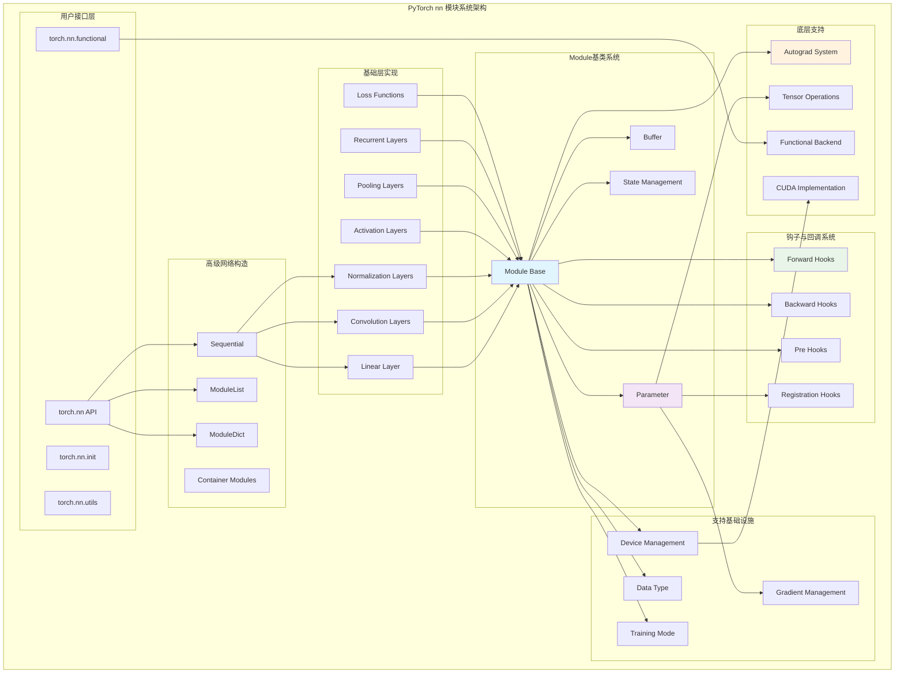

## 概述

PyTorch的`torch.nn`模块提供了构建神经网络的高级抽象，其核心是`Module`基类。通过模块化设计，PyTorch实现了灵活的网络构建、参数管理、前向传播和训练机制。深入剖析nn模块系统的完整架构和实现细节。

<!--more-->

## 1. nn模块系统架构

### 1.1 核心组件层次

PyTorch nn模块采用分层的面向对象设计：

```
┌─────────────────────────────────────────┐
│         High-level Networks             │  ← 预定义网络结构
├─────────────────────────────────────────┤
│         Composite Modules               │  ← 组合模块(Sequential, ModuleList)
├─────────────────────────────────────────┤
│         Basic Layers                    │  ← 基础层(Linear, Conv, etc.)
├─────────────────────────────────────────┤
│         Module Base Class               │  ← Module基类
├─────────────────────────────────────────┤
│         Parameter & Buffer              │  ← 参数和缓冲区管理
├─────────────────────────────────────────┤
│         Hook System                     │  ← 钩子机制
└─────────────────────────────────────────┘
```

### 1.2 nn模块系统完整架构图



## 2. Module基类深度解析

### 2.1 Module核心数据结构

Module是所有神经网络层的基础类，包含了完整的状态管理：

```python
class Module:
    """神经网络模块基类的核心实现"""
    
    def __init__(self):
        # 训练模式标志
        self.training: bool = True
        
        # 参数字典 - 存储可学习参数
        self._parameters: Dict[str, Optional[Parameter]] = OrderedDict()
        
        # 缓冲区字典 - 存储非可学习但需要保存的张量
        self._buffers: Dict[str, Optional[Tensor]] = OrderedDict()
        
        # 非持久化缓冲区 - 不会被保存到state_dict
        self._non_persistent_buffers_set: Set[str] = set()
        
        # 子模块字典
        self._modules: Dict[str, Optional['Module']] = OrderedDict()
        
        # 钩子字典
        self._forward_hooks: Dict[int, Callable] = OrderedDict()
        self._forward_hooks_with_kwargs: Dict[int, bool] = OrderedDict()
        self._forward_hooks_always_called: Dict[int, bool] = OrderedDict()
        self._forward_pre_hooks: Dict[int, Callable] = OrderedDict()
        self._forward_pre_hooks_with_kwargs: Dict[int, bool] = OrderedDict()
        self._backward_hooks: Dict[int, Callable] = OrderedDict()
        self._backward_pre_hooks: Dict[int, Callable] = OrderedDict()
        
        # 状态管理
        self._state_dict_hooks: Dict[int, Callable] = OrderedDict()
        self._load_state_dict_pre_hooks: Dict[int, Callable] = OrderedDict()
        self._load_state_dict_post_hooks: Dict[int, Callable] = OrderedDict()
        
        # 版本控制
        self._version: int = 1
```

### 2.2 参数注册机制

Module提供了灵活的参数注册系统：

```python
def register_parameter(self, name: str, param: Optional[Parameter]) -> None:
    """注册可学习参数
    
    Args:
        name: 参数名称
        param: Parameter对象或None
    """
    if '_parameters' not in self.__dict__:
        raise AttributeError("cannot assign parameters before Module.__init__() call")
    
    elif not isinstance(name, str):
        raise TypeError(f"parameter name should be a string. Got {type(name)}")
    elif '.' in name:
        raise KeyError("parameter name can't contain '.'")
    elif name == '':
        raise KeyError("parameter name can't be empty string")
    elif hasattr(self, name) and name not in self._parameters:
        raise KeyError(f"attribute '{name}' already exists")
    
    # 如果参数为None，移除现有参数
    if param is None:
        self._parameters[name] = None
    elif not isinstance(param, Parameter):
        raise TypeError(f"cannot assign '{type(param)}' object to parameter '{name}' "
                       "(torch.nn.Parameter or None required)")
    elif param.grad_fn is not None:
        raise ValueError(f"cannot assign non-leaf Tensor to parameter '{name}'. Model "
                        f"parameters must be created explicitly. To express 'param + x' as a "
                        f"parameter, compute x outside the forward() method and use 'param = "
                        f"Parameter(param + x)'.")
    else:
        # 注册参数
        self._parameters[name] = param
    
    # 触发参数注册钩子
    for hook in _global_parameter_registration_hooks.values():
        output = hook(self, name, param)
        if output is not None:
            self._parameters[name] = output

def register_buffer(self, name: str, tensor: Optional[Tensor], persistent: bool = True) -> None:
    """注册缓冲区张量
    
    Args:
        name: 缓冲区名称
        tensor: 张量数据或None
        persistent: 是否持久化保存
    """
    if '_buffers' not in self.__dict__:
        raise AttributeError("cannot assign buffer before Module.__init__() call")
    elif not isinstance(name, str):
        raise TypeError(f"buffer name should be a string. Got {type(name)}")
    elif '.' in name:
        raise KeyError("buffer name can't contain '.'")
    elif name == '':
        raise KeyError("buffer name can't be empty string")
    elif hasattr(self, name) and name not in self._buffers:
        raise KeyError(f"attribute '{name}' already exists")
    
    if tensor is not None and not isinstance(tensor, torch.Tensor):
        raise TypeError(f"cannot assign '{type(tensor)}' object to buffer '{name}' "
                       "(torch.Tensor or None required)")
    
    self._buffers[name] = tensor
    
    if not persistent:
        self._non_persistent_buffers_set.add(name)
    elif name in self._non_persistent_buffers_set:
        self._non_persistent_buffers_set.remove(name)
    
    # 触发缓冲区注册钩子
    for hook in _global_buffer_registration_hooks.values():
        output = hook(self, name, tensor)
        if output is not None:
            self._buffers[name] = output

def register_module(self, name: str, module: Optional['Module']) -> None:
    """注册子模块
    
    Args:
        name: 子模块名称
        module: Module对象或None
    """
    if not isinstance(name, str):
        raise TypeError(f"module name should be a string. Got {type(name)}")
    elif '.' in name:
        raise KeyError("module name can't contain '.'")
    elif name == '':
        raise KeyError("module name can't be empty string")
    elif hasattr(self, name) and name not in self._modules:
        raise KeyError(f"attribute '{name}' already exists")
    
    if module is not None and not isinstance(module, Module):
        raise TypeError(f"cannot assign '{type(module)}' object to child module '{name}' "
                       "(torch.nn.Module or None required)")
    
    self._modules[name] = module
    
    # 触发模块注册钩子
    for hook in _global_module_registration_hooks.values():
        output = hook(self, name, module)
        if output is not None:
            self._modules[name] = output
```

### 2.3 动态属性访问

Module通过Python的魔术方法实现了动态属性访问：

```python
def __setattr__(self, name: str, value: Any) -> None:
    """设置属性时的拦截处理"""
    
    def remove_from(*dicts_or_sets):
        """从字典或集合中移除指定键"""
        for d in dicts_or_sets:
            if name in d:
                if isinstance(d, dict):
                    del d[name]
                else:
                    d.discard(name)
    
    params = self.__dict__.get('_parameters')
    if isinstance(value, Parameter):
        # 设置Parameter时，从其他容器中移除并注册为参数
        if params is None:
            raise AttributeError("cannot assign parameters before Module.__init__() call")
        remove_from(self.__dict__, self._buffers, self._modules, self._non_persistent_buffers_set)
        self.register_parameter(name, value)
        
    elif params is not None and name in params:
        # 如果已经存在同名参数，更新参数值
        if value is not None:
            raise TypeError(f"cannot assign '{type(value)}' as parameter '{name}' "
                           "(torch.nn.Parameter or None expected)")
        self.register_parameter(name, value)
        
    else:
        # 处理模块、缓冲区或普通属性
        modules = self.__dict__.get('_modules')
        if isinstance(value, Module):
            if modules is None:
                raise AttributeError("cannot assign module before Module.__init__() call")
            remove_from(self.__dict__, self._parameters, self._buffers, self._non_persistent_buffers_set)
            self.register_module(name, value)
            
        elif modules is not None and name in modules:
            if value is not None:
                raise TypeError(f"cannot assign '{type(value)}' as child module '{name}' "
                               "(torch.nn.Module or None expected)")
            self.register_module(name, value)
            
        else:
            # 处理缓冲区或普通属性
            buffers = self.__dict__.get('_buffers')
            if buffers is not None and name in buffers:
                if value is not None and not isinstance(value, torch.Tensor):
                    raise TypeError(f"cannot assign '{type(value)}' as buffer '{name}' "
                                   "(torch.Tensor or None expected)")
                self.register_buffer(name, value)
            else:
                # 普通属性赋值
                super().__setattr__(name, value)

def __getattr__(self, name: str) -> Any:
    """获取属性时的拦截处理"""
    if '_parameters' in self.__dict__:
        _parameters = self.__dict__['_parameters']
        if name in _parameters:
            return _parameters[name]
    if '_buffers' in self.__dict__:
        _buffers = self.__dict__['_buffers']
        if name in _buffers:
            return _buffers[name]
    if '_modules' in self.__dict__:
        modules = self.__dict__['_modules']
        if name in modules:
            return modules[name]
    raise AttributeError(f"'{type(self).__name__}' object has no attribute '{name}'")

def __delattr__(self, name):
    """删除属性时的拦截处理"""
    if name in self._parameters:
        del self._parameters[name]
    elif name in self._buffers:
        del self._buffers[name]
        self._non_persistent_buffers_set.discard(name)
    elif name in self._modules:
        del self._modules[name]
    else:
        super().__delattr__(name)
```

## 3. Parameter参数系统

### 3.1 Parameter类实现

Parameter是Tensor的特殊子类，专门用于表示可学习参数：

```python
class Parameter(torch.Tensor, metaclass=_ParameterMeta):
    """神经网络参数类
    
    Parameter是Tensor的子类，当赋值给Module属性时会自动被识别为参数
    """
    
    def __new__(cls, data=None, requires_grad=True):
        if data is None:
            data = torch.empty(0)
        
        if type(data) is torch.Tensor or type(data) is Parameter:
            # 标准Tensor路径：使用_make_subclass创建
            return torch.Tensor._make_subclass(cls, data, requires_grad)
        
        # 自定义张量路径：设置_is_param标志
        t = data.detach().requires_grad_(requires_grad)
        if type(t) is not type(data):
            raise RuntimeError(
                f"Creating a Parameter from an instance of type {type(data).__name__} "
                "requires that detach() returns an instance of the same type, but return "
                f"type {type(t).__name__} was found instead."
            )
        
        # 标记为参数
        t._is_param = True
        return t
    
    def __deepcopy__(self, memo):
        """深拷贝实现"""
        if id(self) in memo:
            return memo[id(self)]
        else:
            result = type(self)(
                self.data.clone(memory_format=torch.preserve_format), 
                self.requires_grad
            )
            memo[id(self)] = result
            return result
    
    def __repr__(self):
        """字符串表示"""
        return "Parameter containing:\n" + super().__repr__()
    
    def __reduce_ex__(self, proto):
        """序列化支持"""
        state = torch._utils._get_obj_state(self)
        
        # 不序列化钩子（见Note [Don't serialize hooks]）
        hooks = OrderedDict()
        if not state:
            return (
                torch._utils._rebuild_parameter,
                (self.data, self.requires_grad, hooks),
            )
        
        return (
            torch._utils._rebuild_parameter_with_state,
            (self.data, self.requires_grad, hooks, state),
        )

# Parameter元类，支持isinstance检查
class _ParameterMeta(torch._C._TensorMeta):
    def __instancecheck__(self, instance):
        """自定义isinstance行为"""
        if self is Parameter:
            if isinstance(instance, torch.Tensor) and getattr(instance, '_is_param', False):
                return True
        return super().__instancecheck__(instance)
```

### 3.2 参数初始化系统

PyTorch提供了完整的参数初始化框架：

```python
# torch.nn.init模块的核心实现
import math
import warnings
from typing import Optional

def calculate_gain(nonlinearity, param=None):
    """计算非线性激活函数的增益
    
    Args:
        nonlinearity: 激活函数名称
        param: 激活函数参数（如leaky_relu的负斜率）
    
    Returns:
        推荐的增益值
    """
    linear_fns = ['linear', 'conv1d', 'conv2d', 'conv3d', 'conv_transpose1d', 
                  'conv_transpose2d', 'conv_transpose3d']
    
    if nonlinearity in linear_fns or nonlinearity == 'sigmoid':
        return 1
    elif nonlinearity == 'tanh':
        return 5.0 / 3
    elif nonlinearity == 'relu':
        return math.sqrt(2.0)
    elif nonlinearity == 'leaky_relu':
        if param is None:
            negative_slope = 0.01
        elif not isinstance(param, bool) and isinstance(param, int) or isinstance(param, float):
            negative_slope = param
        else:
            raise ValueError(f"negative_slope {param} not a valid number")
        return math.sqrt(2.0 / (1 + negative_slope ** 2))
    elif nonlinearity == 'selu':
        return 3.0 / 4
    else:
        raise ValueError(f"Unsupported nonlinearity {nonlinearity}")

def uniform_(tensor: Tensor, a: float = 0., b: float = 1.) -> Tensor:
    """用均匀分布初始化张量
    
    Args:
        tensor: n维张量
        a: 均匀分布下界
        b: 均匀分布上界
    """
    with torch.no_grad():
        tensor.uniform_(a, b)
    return tensor

def normal_(tensor: Tensor, mean: float = 0., std: float = 1.) -> Tensor:
    """用正态分布初始化张量"""
    with torch.no_grad():
        tensor.normal_(mean, std)
    return tensor

def xavier_uniform_(tensor: Tensor, gain: float = 1.) -> Tensor:
    """Xavier均匀分布初始化
    
    Xavier初始化保持前向传播时激活值的方差稳定
    """
    num_input = tensor.size(-1)  # 输入维度
    num_output = tensor.size(0)  # 输出维度
    
    # 计算均匀分布边界
    std = gain * math.sqrt(2.0 / float(num_input + num_output))
    a = math.sqrt(3.0) * std  # uniform分布的边界
    
    with torch.no_grad():
        tensor.uniform_(-a, a)
    return tensor

def xavier_normal_(tensor: Tensor, gain: float = 1.) -> Tensor:
    """Xavier正态分布初始化"""
    num_input = tensor.size(-1)
    num_output = tensor.size(0)
    
    std = gain * math.sqrt(2.0 / float(num_input + num_output))
    with torch.no_grad():
        tensor.normal_(0., std)
    return tensor

def kaiming_uniform_(tensor: Tensor, a: float = 0, mode: str = 'fan_in', 
                    nonlinearity: str = 'leaky_relu') -> Tensor:
    """Kaiming均匀分布初始化（He初始化）
    
    专门为ReLU激活函数设计的初始化方法
    """
    if 0 in tensor.shape:
        warnings.warn("Initializing zero-element tensors is a no-op")
        return tensor
    
    num_input, num_output = _calculate_fan_in_and_fan_out(tensor)
    
    if mode == 'fan_in':
        num = num_input
    elif mode == 'fan_out':
        num = num_output
    elif mode == 'fan_avg':
        num = (num_input + num_output) / 2
    else:
        raise ValueError(f"Mode {mode} not supported, please use one of "
                        "fan_in, fan_out or fan_avg.")
    
    gain = calculate_gain(nonlinearity, a)
    std = gain / math.sqrt(num)
    bound = math.sqrt(3.0) * std
    
    with torch.no_grad():
        tensor.uniform_(-bound, bound)
    return tensor

def _calculate_fan_in_and_fan_out(tensor):
    """计算扇入和扇出"""
    dimensions = tensor.dim()
    if dimensions < 2:
        raise ValueError("Fan in and fan out can not be computed for tensor with fewer than 2 dimensions")
    
    num_input_fmaps = tensor.size(1)
    num_output_fmaps = tensor.size(0)
    receptive_field_size = 1
    
    if tensor.dim() > 2:
        # 对于卷积核，计算感受野大小
        for s in tensor.shape[2:]:
            receptive_field_size *= s
    
    fan_in = num_input_fmaps * receptive_field_size
    fan_out = num_output_fmaps * receptive_field_size
    
    return fan_in, fan_out
```

## 4. 前向传播机制

### 4.1 __call__方法实现

Module的前向传播通过`__call__`方法触发：

```python
def __call__(self, *args, **kwargs):
    """模块调用的主入口
    
    处理钩子执行、前向传播调用和结果后处理
    """
    # 检查是否需要全局前向钩子
    for hook_id, hook in _global_forward_pre_hooks.items():
        if hook_id in _global_forward_hooks_always_called or _has_any_global_hook():
            result = hook(self, args, kwargs)
            if result is not None:
                if isinstance(result, tuple) and len(result) == 2:
                    args, kwargs = result
                else:
                    args = result
    
    # 执行模块级前向预钩子
    bw_hook = None
    if len(self._forward_pre_hooks) > 0:
        for hook_id, hook in self._forward_pre_hooks.items():
            if hook_id in self._forward_pre_hooks_with_kwargs:
                hook_result = hook(self, args, kwargs)
            else:
                hook_result = hook(self, args)
            
            if hook_result is not None:
                if isinstance(hook_result, tuple) and len(hook_result) == 2:
                    args, kwargs = hook_result
                else:
                    args = hook_result
    
    # 核心前向传播调用
    result = self.forward(*args, **kwargs)
    
    # 执行前向后钩子
    for hook_id, hook in self._forward_hooks.items():
        if hook_id in self._forward_hooks_with_kwargs:
            hook_result = hook(self, args, kwargs, result)
        else:
            hook_result = hook(self, args, result)
        
        if hook_result is not None:
            result = hook_result
    
    # 执行全局前向后钩子
    for hook_id, hook in _global_forward_hooks.items():
        if hook_id in _global_forward_hooks_with_kwargs:
            hook_result = hook(self, args, kwargs, result)
        else:
            hook_result = hook(self, args, result)
        
        if hook_result is not None:
            result = hook_result
    
    # 如果有反向钩子需要注册
    if bw_hook:
        result.register_hook(bw_hook)
    
    return result

def forward(self, *input):
    """前向传播的抽象方法
    
    子类必须重写此方法来定义具体的前向传播逻辑
    """
    raise NotImplementedError
```

### 4.2 具体层的前向传播实现

以Linear层为例，展示具体的前向传播实现：

```python
class Linear(Module):
    """线性层实现"""
    
    __constants__ = ['in_features', 'out_features']
    in_features: int
    out_features: int
    weight: Tensor
    
    def __init__(self, in_features: int, out_features: int, bias: bool = True, 
                 device=None, dtype=None) -> None:
        """初始化线性层
        
        Args:
            in_features: 输入特征数
            out_features: 输出特征数  
            bias: 是否使用偏置
        """
        factory_kwargs = {'device': device, 'dtype': dtype}
        super().__init__()
        
        self.in_features = in_features
        self.out_features = out_features
        
        # 创建权重参数 [out_features, in_features]
        self.weight = Parameter(torch.empty((out_features, in_features), **factory_kwargs))
        
        if bias:
            # 创建偏置参数 [out_features]
            self.bias = Parameter(torch.empty(out_features, **factory_kwargs))
        else:
            # 注册为None，表示不使用偏置
            self.register_parameter('bias', None)
        
        # 初始化参数
        self.reset_parameters()
    
    def reset_parameters(self) -> None:
        """重置参数为默认初始值"""
        # 使用Kaiming均匀分布初始化权重
        init.kaiming_uniform_(self.weight, a=math.sqrt(5))
        
        if self.bias is not None:
            # 偏置使用小范围均匀分布初始化
            fan_in, _ = init._calculate_fan_in_and_fan_out(self.weight)
            bound = 1 / math.sqrt(fan_in) if fan_in > 0 else 0
            init.uniform_(self.bias, -bound, bound)
    
    def forward(self, input: Tensor) -> Tensor:
        """前向传播：y = xW^T + b
        
        Args:
            input: 输入张量 [*, in_features]
            
        Returns:
            输出张量 [*, out_features]
        """
        return F.linear(input, self.weight, self.bias)
    
    def extra_repr(self) -> str:
        """返回层的额外信息用于打印"""
        return f'in_features={self.in_features}, out_features={self.out_features}, bias={self.bias is not None}'

# torch.nn.functional.linear的实现
def linear(input: Tensor, weight: Tensor, bias: Optional[Tensor] = None) -> Tensor:
    """线性变换的函数式实现
    
    Args:
        input: 输入张量 [..., in_features]
        weight: 权重矩阵 [out_features, in_features]
        bias: 偏置向量 [out_features]，可选
    
    Returns:
        输出张量 [..., out_features]
    """
    if input.dim() == 2 and bias is not None:
        # 优化的2D情况：使用addmm
        ret = torch.addmm(bias, input, weight.t())
    else:
        # 通用情况：使用矩阵乘法
        output = input.matmul(weight.t())
        if bias is not None:
            output += bias
        ret = output
    
    return ret
```

## 5. 钩子系统

### 5.1 钩子类型和机制

PyTorch提供了多种钩子来拦截和修改模块的行为：

```python
class Module:
    """钩子系统的完整实现"""
    
    def register_forward_pre_hook(
        self, 
        hook: Callable[..., None], 
        *,
        prepend: bool = False,
        with_kwargs: bool = False
    ) -> RemovableHandle:
        """注册前向传播前钩子
        
        钩子签名：
        - hook(module, input) -> None or modified input
        - hook(module, input, kwargs) -> None or (modified input, kwargs) (如果with_kwargs=True)
        
        Args:
            hook: 钩子函数
            prepend: 是否添加到钩子列表开头
            with_kwargs: 是否传递kwargs参数
            
        Returns:
            可移除的钩子句柄
        """
        handle = RemovableHandle(self._forward_pre_hooks)
        self._forward_pre_hooks[handle.id] = hook
        
        if with_kwargs:
            self._forward_pre_hooks_with_kwargs[handle.id] = True
        
        if prepend:
            # 将钩子移动到开头
            self._forward_pre_hooks.move_to_end(handle.id, last=False)
        
        return handle
    
    def register_forward_hook(
        self,
        hook: Callable[..., None],
        *,
        prepend: bool = False,
        with_kwargs: bool = False,
        always_call: bool = False
    ) -> RemovableHandle:
        """注册前向传播后钩子
        
        钩子签名：
        - hook(module, input, output) -> None or modified output
        - hook(module, input, kwargs, output) -> None or modified output (如果with_kwargs=True)
        
        Args:
            hook: 钩子函数
            prepend: 是否添加到钩子列表开头
            with_kwargs: 是否传递kwargs参数
            always_call: 是否总是调用（即使模块不在训练模式）
        """
        handle = RemovableHandle(self._forward_hooks)
        self._forward_hooks[handle.id] = hook
        
        if with_kwargs:
            self._forward_hooks_with_kwargs[handle.id] = True
        if always_call:
            self._forward_hooks_always_called[handle.id] = True
        
        if prepend:
            self._forward_hooks.move_to_end(handle.id, last=False)
        
        return handle
    
    def register_full_backward_pre_hook(
        self,
        hook: Callable[..., None],
        prepend: bool = False
    ) -> RemovableHandle:
        """注册完整的反向传播前钩子
        
        钩子签名：hook(module, grad_output) -> None or modified grad_output
        """
        handle = RemovableHandle(self._backward_pre_hooks)
        self._backward_pre_hooks[handle.id] = hook
        
        if prepend:
            self._backward_pre_hooks.move_to_end(handle.id, last=False)
        
        return handle
    
    def register_full_backward_hook(
        self,
        hook: Callable[..., None],
        prepend: bool = False
    ) -> RemovableHandle:
        """注册完整的反向传播后钩子
        
        钩子签名：hook(module, grad_input, grad_output) -> None or modified grad_input
        """
        handle = RemovableHandle(self._backward_hooks)
        self._backward_hooks[handle.id] = hook
        
        if prepend:
            self._backward_hooks.move_to_end(handle.id, last=False)
        
        return handle

# 全局钩子注册函数
def register_module_forward_pre_hook(hook: Callable[..., None]) -> RemovableHandle:
    """注册全局前向传播前钩子"""
    handle = RemovableHandle(_global_forward_pre_hooks)
    _global_forward_pre_hooks[handle.id] = hook
    return handle

def register_module_forward_hook(hook: Callable[..., None]) -> RemovableHandle:
    """注册全局前向传播后钩子"""
    handle = RemovableHandle(_global_forward_hooks)
    _global_forward_hooks[handle.id] = hook
    return handle
```

### 5.2 钩子应用示例

```python
import torch
import torch.nn as nn

class HookExample:
    """钩子使用示例"""
    
    def __init__(self):
        self.activations = {}
        self.gradients = {}
    
    def activation_hook(self, name):
        """创建激活值钩子"""
        def hook(module, input, output):
            # 保存激活值
            self.activations[name] = output.detach().clone()
            print(f"Forward hook for {name}: output shape {output.shape}")
        return hook
    
    def gradient_hook(self, name):
        """创建梯度钩子"""
        def hook(module, grad_input, grad_output):
            # 保存梯度
            if grad_output[0] is not None:
                self.gradients[name] = grad_output[0].detach().clone()
                print(f"Backward hook for {name}: grad_output shape {grad_output[0].shape}")
        return hook
    
    def register_hooks(self, model):
        """为模型注册钩子"""
        hooks = []
        
        for name, module in model.named_modules():
            if isinstance(module, (nn.Linear, nn.Conv2d)):
                # 注册前向钩子
                handle1 = module.register_forward_hook(self.activation_hook(name))
                hooks.append(handle1)
                
                # 注册反向钩子
                handle2 = module.register_full_backward_hook(self.gradient_hook(name))
                hooks.append(handle2)
        
        return hooks

# 使用示例
def hook_usage_example():
    # 创建简单模型
    model = nn.Sequential(
        nn.Linear(10, 20),
        nn.ReLU(),
        nn.Linear(20, 1)
    )
    
    # 注册钩子
    hook_manager = HookExample()
    handles = hook_manager.register_hooks(model)
    
    # 前向传播
    x = torch.randn(5, 10, requires_grad=True)
    output = model(x)
    loss = output.sum()
    
    # 反向传播
    loss.backward()
    
    # 查看保存的激活值和梯度
    print("Saved activations:", list(hook_manager.activations.keys()))
    print("Saved gradients:", list(hook_manager.gradients.keys()))
    
    # 移除钩子
    for handle in handles:
        handle.remove()
```

## 6. 状态管理和序列化

### 6.1 state_dict机制

Module的状态管理通过state_dict实现：

```python
def state_dict(self, *args, destination=None, prefix='', keep_vars=False):
    """获取模块状态字典
    
    Args:
        destination: 目标字典，如果为None则创建新的
        prefix: 键名前缀
        keep_vars: 是否保持Variable类型
        
    Returns:
        包含模块状态的字典
    """
    if destination is None:
        destination = OrderedDict()
    
    # 保存参数
    for name, param in self._parameters.items():
        if param is not None:
            key = prefix + name
            destination[key] = param if keep_vars else param.detach()
    
    # 保存持久化缓冲区
    for name, buf in self._buffers.items():
        if buf is not None and name not in self._non_persistent_buffers_set:
            key = prefix + name
            destination[key] = buf if keep_vars else buf.detach()
    
    # 递归保存子模块状态
    for name, module in self._modules.items():
        if module is not None:
            module.state_dict(destination=destination, prefix=prefix + name + '.')
    
    # 执行状态字典钩子
    for hook in self._state_dict_hooks.values():
        hook_result = hook(self, destination, prefix, {})
        if hook_result is not None:
            destination = hook_result
    
    return destination

def load_state_dict(self, state_dict, strict: bool = True, assign: bool = False):
    """加载模块状态
    
    Args:
        state_dict: 状态字典
        strict: 是否严格模式（键必须完全匹配）
        assign: 是否使用赋值而非复制
        
    Returns:
        NamedTuple包含missing_keys和unexpected_keys
    """
    if not isinstance(state_dict, Mapping):
        raise TypeError(f"Expected state_dict to be dict-like, got {type(state_dict)}")
    
    missing_keys = []
    unexpected_keys = []
    error_msgs = []
    
    # 执行预加载钩子
    for hook in self._load_state_dict_pre_hooks.values():
        hook(state_dict, '', {}, strict, missing_keys, unexpected_keys, error_msgs)
    
    def load(module, prefix=''):
        # 获取模块的本地状态
        local_state = {k: v for k, v in module._parameters.items() if v is not None}
        local_state.update({k: v for k, v in module._buffers.items() 
                           if v is not None and k not in module._non_persistent_buffers_set})
        
        # 检查状态字典中的键
        for name, param in local_state.items():
            key = prefix + name
            if key in state_dict:
                input_param = state_dict[key]
                
                # 检查形状兼容性
                if not _same_shape(input_param, param):
                    error_msgs.append(f'size mismatch for {key}: copying a param with shape {input_param.shape} from checkpoint, '
                                     f'the shape in current model is {param.shape}.')
                    continue
                
                try:
                    if assign:
                        # 使用赋值
                        if isinstance(param, Parameter):
                            param.data = input_param
                        else:
                            param.copy_(input_param)
                    else:
                        # 使用复制
                        param.copy_(input_param)
                        
                except Exception as ex:
                    error_msgs.append(f'While copying the parameter named "{key}", '
                                     f'whose dimensions in the model are {param.shape} '
                                     f'and whose dimensions in the checkpoint are {input_param.shape}, '
                                     f'an exception occurred : {ex.args}.')
            elif strict:
                missing_keys.append(key)
        
        # 递归加载子模块
        for name, child in module._modules.items():
            if child is not None:
                load(child, prefix + name + '.')
    
    # 执行加载
    load(self)
    del load
    
    # 查找意外的键
    if strict:
        for key in state_dict.keys():
            if not any(key.startswith(prefix) for prefix in self._modules.keys()):
                unexpected_keys.append(key)
    
    # 执行后加载钩子
    for hook in self._load_state_dict_post_hooks.values():
        hook(self, '', {}, strict, missing_keys, unexpected_keys, error_msgs)
    
    if error_msgs:
        raise RuntimeError('Error(s) in loading state_dict:\n\t' + '\n\t'.join(error_msgs))
    
    return _IncompatibleKeys(missing_keys, unexpected_keys)

def _same_shape(tensor1, tensor2):
    """检查两个张量形状是否相同"""
    return tensor1.shape == tensor2.shape
```

### 6.2 训练/评估模式切换

```python
def train(self: T, mode: bool = True) -> T:
    """设置训练模式
    
    Args:
        mode: True为训练模式，False为评估模式
        
    Returns:
        返回self以支持链式调用
    """
    if not isinstance(mode, bool):
        raise ValueError("training mode is expected to be boolean")
    
    self.training = mode
    
    # 递归设置所有子模块的训练模式
    for module in self.children():
        module.train(mode)
    
    return self

def eval(self: T) -> T:
    """设置为评估模式"""
    return self.train(False)

def requires_grad_(self: T, requires_grad: bool = True) -> T:
    """设置所有参数是否需要梯度
    
    Args:
        requires_grad: 是否需要梯度计算
        
    Returns:
        返回self以支持链式调用
    """
    for p in self.parameters():
        p.requires_grad_(requires_grad)
    return self
```

## 7. 设备和数据类型管理

### 7.1 设备转移机制

```python
def to(self: T, *args, **kwargs) -> T:
    """将模块转移到指定设备/数据类型
    
    支持多种调用方式：
    - module.to(device)
    - module.to(dtype)
    - module.to(tensor)  # 推断设备和数据类型
    - module.to(device, dtype)
    """
    device, dtype, non_blocking, convert_to_format = torch._C._nn._parse_to(*args, **kwargs)
    
    if dtype is not None:
        if not (dtype.is_floating_point or dtype.is_complex):
            raise TypeError(f'nn.Module.to only accepts floating point or complex dtypes, but got desired dtype={dtype}')
    
    def convert(t):
        if convert_to_format is not None and t.dim() in (4, 5):
            return t.to(device, dtype if t.is_floating_point() or t.is_complex() else None,
                       non_blocking, memory_format=convert_to_format)
        return t.to(device, dtype if t.is_floating_point() or t.is_complex() else None, non_blocking)
    
    return self._apply(convert)

def cuda(self: T, device: Optional[Union[int, device]] = None) -> T:
    """将模块移动到CUDA设备"""
    return self._apply(lambda t: t.cuda(device))

def xpu(self: T, device: Optional[Union[int, device]] = None) -> T:
    """将模块移动到XPU设备"""
    return self._apply(lambda t: t.xpu(device))

def cpu(self: T) -> T:
    """将模块移动到CPU"""
    return self._apply(lambda t: t.cpu())

def type(self: T, dst_type: Union[dtype, str]) -> T:
    """转换模块的数据类型"""
    return self._apply(lambda t: t.type(dst_type))

def float(self: T) -> T:
    """转换为float类型"""
    return self._apply(lambda t: t.float() if t.is_floating_point() else t)

def double(self: T) -> T:
    """转换为double类型"""
    return self._apply(lambda t: t.double() if t.is_floating_point() else t)

def half(self: T) -> T:
    """转换为半精度类型"""
    return self._apply(lambda t: t.half() if t.is_floating_point() else t)

def bfloat16(self: T) -> T:
    """转换为bfloat16类型"""
    return self._apply(lambda t: t.bfloat16() if t.is_floating_point() else t)

def _apply(self, fn):
    """应用函数到所有参数、缓冲区和子模块
    
    这是设备和类型转换的核心实现
    """
    for module in self.children():
        module._apply(fn)
    
    def compute_should_use_set_data(tensor, tensor_applied):
        """计算是否应该使用set_data而非copy_"""
        if torch._has_compatible_shallow_copy_type(tensor, tensor_applied):
            return False
        
        if tensor.dtype != tensor_applied.dtype:
            return True
        if tensor.device != tensor_applied.device:
            return True
        if tensor.is_sparse != tensor_applied.is_sparse:
            return True
        return False
    
    # 转换参数
    for key, param in self._parameters.items():
        if param is None:
            continue
        
        # 子类可以通过重写这个方法来定制转换行为
        with torch.no_grad():
            param_applied = fn(param)
            should_use_set_data = compute_should_use_set_data(param, param_applied)
            
            if should_use_set_data:
                param.data = param_applied
            else:
                param.copy_(param_applied)
    
    # 转换缓冲区
    for key, buf in self._buffers.items():
        if buf is not None:
            self._buffers[key] = fn(buf)
    
    return self
```

## 8. 复合模块系统

### 8.1 Sequential容器

```python
class Sequential(Module):
    """序列容器：按照添加顺序执行子模块"""
    
    def __init__(self, *args):
        super().__init__()
        if len(args) == 1 and isinstance(args[0], OrderedDict):
            # 从OrderedDict构造
            for key, module in args[0].items():
                self.add_module(key, module)
        else:
            # 从位置参数构造
            for idx, module in enumerate(args):
                self.add_module(str(idx), module)
    
    def _get_item_by_idx(self, iterator, idx) -> T:
        """通过索引获取模块"""
        size = len(self)
        idx = operator.index(idx)
        if not -size <= idx < size:
            raise IndexError(f'index {idx} is out of range')
        idx %= size
        return next(itertools.islice(iterator, idx, None))
    
    def __getitem__(self, idx) -> Union['Module', 'Sequential']:
        if isinstance(idx, slice):
            # 切片访问
            return self.__class__(OrderedDict(list(self._modules.items())[idx]))
        else:
            # 单个索引访问
            return self._get_item_by_idx(self._modules.values(), idx)
    
    def __setitem__(self, idx: int, module: Module) -> None:
        """设置指定索引的模块"""
        key: str = self._get_item_by_idx(self._modules.keys(), idx)
        return setattr(self, key, module)
    
    def __delitem__(self, idx: Union[slice, int]) -> None:
        """删除指定索引的模块"""
        if isinstance(idx, slice):
            for key in list(self._modules.keys())[idx]:
                delattr(self, key)
        else:
            key = self._get_item_by_idx(self._modules.keys(), idx)
            delattr(self, key)
        
        # 重新编号
        str_indices = [str(i) for i in range(len(self._modules))]
        self._modules = OrderedDict(list(zip(str_indices, self._modules.values())))
    
    def __len__(self) -> int:
        return len(self._modules)
    
    def __add__(self, other) -> 'Sequential':
        """连接两个Sequential"""
        if isinstance(other, Sequential):
            ret = Sequential()
            for layer in self:
                ret.append(layer)
            for layer in other:
                ret.append(layer)
            return ret
        else:
            raise ValueError('add operator supports only objects of Sequential class')
    
    def pop(self, key: Union[int, slice]) -> Module:
        """移除并返回指定模块"""
        v = self[key]
        del self[key]
        return v
    
    def append(self, module: Module) -> 'Sequential':
        """添加模块到末尾"""
        self.add_module(str(len(self)), module)
        return self
    
    def prepend(self, module: Module) -> 'Sequential':
        """添加模块到开头"""
        self._modules = OrderedDict([(str(0), module)] + 
                                   [(str(i + 1), m) for i, m in enumerate(self._modules.values())])
        return self
    
    def insert(self, index: int, module: Module) -> 'Sequential':
        """在指定位置插入模块"""
        if not isinstance(module, Module):
            raise AssertionError(f'module should be of type Module, got: {type(module)}')
        
        n = len(self._modules)
        if not (-n <= index <= n):
            raise IndexError(f'Index out of range: {index}')
        
        if index < 0:
            index += n
        
        for i in range(n, index, -1):
            self._modules[str(i)] = self._modules[str(i - 1)]
        
        self._modules[str(index)] = module
        return self
    
    def extend(self, sequential) -> 'Sequential':
        """扩展Sequential"""
        for layer in sequential:
            self.append(layer)
        return self
    
    def forward(self, input):
        """前向传播：依次通过所有子模块"""
        for module in self:
            input = module(input)
        return input
```

### 8.2 ModuleList容器

```python
class ModuleList(Module):
    """模块列表：存储子模块的列表容器"""
    
    def __init__(self, modules: Optional[Iterable[Module]] = None) -> None:
        super().__init__()
        if modules is not None:
            self += modules
    
    def _get_abs_string_index(self, idx):
        """获取绝对字符串索引"""
        if isinstance(idx, int):
            if not (-len(self) <= idx < len(self)):
                raise IndexError(f'index {idx} is out of range')
            if idx < 0:
                idx += len(self)
            return str(idx)
        else:
            raise TypeError(f'index must be an integer, not {type(idx).__name__}')
    
    def __getitem__(self, idx: Union[int, slice]) -> Union[Module, 'ModuleList']:
        if isinstance(idx, slice):
            return self.__class__(list(self._modules.values())[idx])
        else:
            return self._modules[self._get_abs_string_index(idx)]
    
    def __setitem__(self, idx: int, module: Module) -> None:
        idx = self._get_abs_string_index(idx)
        return setattr(self, str(idx), module)
    
    def __delitem__(self, idx: Union[int, slice]) -> None:
        if isinstance(idx, slice):
            for k in sorted(list(self._modules.keys())[idx], reverse=True):
                delattr(self, k)
        else:
            delattr(self, self._get_abs_string_index(idx))
        
        # 重新编号剩余模块
        str_indices = [str(i) for i in range(len(self._modules))]
        self._modules = OrderedDict(zip(str_indices, self._modules.values()))
    
    def __len__(self) -> int:
        return len(self._modules)
    
    def __iter__(self) -> Iterator[Module]:
        return iter(self._modules.values())
    
    def __iadd__(self, modules: Iterable[Module]) -> 'ModuleList':
        return self.extend(modules)
    
    def __add__(self, other: Iterable[Module]) -> 'ModuleList':
        combined = ModuleList()
        for i, module in enumerate(self):
            combined.append(module)
        for j, module in enumerate(other):
            combined.append(module)
        return combined
    
    def insert(self, index: int, module: Module) -> None:
        """在指定位置插入模块"""
        for i in range(len(self._modules), index, -1):
            self._modules[str(i)] = self._modules[str(i - 1)]
        self._modules[str(index)] = module
    
    def append(self, module: Module) -> 'ModuleList':
        """添加模块到列表末尾"""
        self.add_module(str(len(self)), module)
        return self
    
    def pop(self, key: Union[int, slice]) -> Module:
        """移除并返回指定模块"""
        v = self[key]
        del self[key]
        return v
    
    def extend(self, modules: Iterable[Module]) -> 'ModuleList':
        """扩展模块列表"""
        if not isinstance(modules, container_abcs.Iterable):
            raise TypeError(f"ModuleList.extend should be called with an iterable, "
                           f"but got {type(modules).__name__}")
        
        offset = len(self)
        for i, module in enumerate(modules):
            self.add_module(str(offset + i), module)
        return self
    
    def forward(self, *input, **kwargs):
        """ModuleList没有定义forward方法，子类需要实现"""
        raise NotImplementedError()
```

## 9. 性能优化和内存管理

### 9.1 延迟初始化机制

```python
class LazyModuleMixin:
    """延迟初始化混合类"""
    
    def __init__(self):
        self._lazy_parameters = {}  # 延迟参数
        self._lazy_buffers = {}     # 延迟缓冲区
        
    def has_uninitialized_params(self) -> bool:
        """检查是否有未初始化的参数"""
        for module in self.modules():
            if isinstance(module, LazyModuleMixin):
                if len(module._lazy_parameters) > 0:
                    return True
        return False
    
    def initialize_parameters(self, *args, **kwargs):
        """初始化参数（需要子类实现）"""
        raise NotImplementedError()
    
    def _lazy_load_hook(self, state_dict, prefix, local_metadata, strict, 
                       missing_keys, unexpected_keys, error_msgs):
        """延迟加载钩子"""
        # 如果state_dict中有参数但模块未初始化，先初始化
        for name, param in self._lazy_parameters.items():
            key = prefix + name
            if key in state_dict:
                # 根据加载的参数形状初始化模块
                input_shape = state_dict[key].shape
                if hasattr(self, '_get_input_shape_from_param'):
                    self._infer_parameters_from_state_dict(state_dict, prefix)
                break

class LazyLinear(LazyModuleMixin, Linear):
    """延迟初始化的线性层"""
    
    def __init__(self, out_features: int, bias: bool = True,
                 device=None, dtype=None) -> None:
        factory_kwargs = {'device': device, 'dtype': dtype}
        super().__init__(0, 0, False)  # 临时初始化
        
        self.out_features = out_features
        
        # 创建延迟参数
        self.weight = UninitializedParameter(**factory_kwargs)
        if bias:
            self.bias = UninitializedParameter(**factory_kwargs)
        else:
            self.register_parameter('bias', None)
    
    def reset_parameters(self) -> None:
        """重置参数（延迟执行）"""
        if not self.has_uninitialized_params():
            # 参数已初始化，执行实际重置
            super().reset_parameters()
    
    def initialize_parameters(self, input) -> None:
        """根据输入初始化参数"""
        if self.has_uninitialized_params():
            with torch.no_grad():
                # 推断输入特征数
                self.in_features = input.shape[-1]
                
                # 初始化权重
                self.weight.materialize((self.out_features, self.in_features))
                if self.bias is not None:
                    self.bias.materialize((self.out_features,))
                
                # 执行实际的参数初始化
                self.reset_parameters()
    
    def forward(self, input: Tensor) -> Tensor:
        """前向传播（首次调用时自动初始化）"""
        if self.has_uninitialized_params():
            self.initialize_parameters(input)
        
        return F.linear(input, self.weight, self.bias)
    
    def extra_repr(self) -> str:
        return f'in_features={self.in_features}, out_features={self.out_features}, bias={self.bias is not None}'

class UninitializedParameter(Parameter):
    """未初始化参数类"""
    
    def __new__(cls, device=None, dtype=None):
        # 创建空张量作为占位符
        data = torch.empty(0, device=device, dtype=dtype)
        return super().__new__(cls, data, requires_grad=True)
    
    def materialize(self, shape):
        """具体化参数为指定形状"""
        if not isinstance(shape, (tuple, list)):
            shape = (shape,)
        
        # 创建新的张量数据
        new_data = torch.empty(shape, device=self.device, dtype=self.dtype)
        
        # 替换当前数据
        self.data = new_data
```

### 9.2 内存优化技术

```python
class MemoryOptimizedModule(Module):
    """内存优化模块基类"""
    
    def __init__(self):
        super().__init__()
        self._activation_checkpointing = False
        self._memory_efficient = True
        
    def enable_activation_checkpointing(self):
        """启用激活检查点"""
        self._activation_checkpointing = True
        
        # 为所有子模块启用检查点
        for module in self.children():
            if hasattr(module, 'enable_activation_checkpointing'):
                module.enable_activation_checkpointing()
    
    def disable_activation_checkpointing(self):
        """禁用激活检查点"""
        self._activation_checkpointing = False
        
        for module in self.children():
            if hasattr(module, 'disable_activation_checkpointing'):
                module.disable_activation_checkpointing()
    
    def memory_efficient_forward(self, *args, **kwargs):
        """内存高效的前向传播"""
        if self._activation_checkpointing and self.training:
            # 使用激活检查点
            from torch.utils.checkpoint import checkpoint
            return checkpoint(self._forward_impl, *args, **kwargs)
        else:
            return self._forward_impl(*args, **kwargs)
    
    def _forward_impl(self, *args, **kwargs):
        """实际的前向传播实现"""
        return self.forward(*args, **kwargs)

# 内存使用监控装饰器
def memory_profiler(func):
    """内存使用分析装饰器"""
    def wrapper(*args, **kwargs):
        if torch.cuda.is_available():
            torch.cuda.reset_peak_memory_stats()
            initial_memory = torch.cuda.memory_allocated()
            
        result = func(*args, **kwargs)
        
        if torch.cuda.is_available():
            final_memory = torch.cuda.memory_allocated()
            peak_memory = torch.cuda.max_memory_allocated()
            
            print(f"Function {func.__name__}:")
            print(f"  Initial memory: {initial_memory / 1e6:.2f} MB")
            print(f"  Final memory: {final_memory / 1e6:.2f} MB")
            print(f"  Peak memory: {peak_memory / 1e6:.2f} MB")
            print(f"  Memory delta: {(final_memory - initial_memory) / 1e6:.2f} MB")
        
        return result
    return wrapper
```

## 10. 调试和可视化工具

### 10.1 模块信息打印

```python
def summary(self, input_size=None, input_dtype=None, depth=3):
    """打印模块结构摘要"""
    def register_hook(module):
        def hook(module, input, output):
            class_name = str(module.__class__).split('.')[-1].split("'")[0]
            module_idx = len(summary_dict)
            
            m_key = f'{class_name}-{module_idx + 1}'
            summary_dict[m_key] = OrderedDict()
            summary_dict[m_key]['input_shape'] = list(input[0].size()) if input else None
            summary_dict[m_key]['output_shape'] = list(output.size()) if hasattr(output, 'size') else None
            
            params = 0
            if hasattr(module, 'weight') and hasattr(module.weight, 'size'):
                params += torch.prod(torch.LongTensor(list(module.weight.size())))
                summary_dict[m_key]['trainable'] = module.weight.requires_grad
            if hasattr(module, 'bias') and hasattr(module.bias, 'size'):
                params += torch.prod(torch.LongTensor(list(module.bias.size())))
            summary_dict[m_key]['nb_params'] = params
        
        if not isinstance(module, Sequential) and not isinstance(module, ModuleList):
            hooks.append(module.register_forward_hook(hook))
    
    # 检查设备
    device = next(self.parameters()).device if next(self.parameters(), None) is not None else 'cpu'
    
    # 创建输入
    if input_size is not None:
        if input_dtype is None:
            input_dtype = torch.float32
        x = torch.rand(*input_size, dtype=input_dtype).to(device)
    
    summary_dict = OrderedDict()
    hooks = []
    
    # 注册钩子
    self.apply(register_hook)
    
    # 前向传播
    if input_size is not None:
        self(x)
    
    # 移除钩子
    for h in hooks:
        h.remove()
    
    # 打印摘要
    print('=' * 70)
    print(f'{"Layer (type)":>25} {"Output Shape":>25} {"Param #":>15}')
    print('=' * 70)
    
    total_params = 0
    total_output = 0
    trainable_params = 0
    
    for layer in summary_dict:
        layer_info = summary_dict[layer]
        total_params += layer_info['nb_params']
        
        if layer_info.get('trainable', False):
            trainable_params += layer_info['nb_params']
        
        if layer_info['output_shape']:
            total_output += torch.prod(torch.LongTensor(layer_info['output_shape']))
        
        print(f"{layer:>25} {str(layer_info['output_shape']):>25} {layer_info['nb_params']:>15,}")
    
    print('=' * 70)
    print(f'Total params: {total_params:,}')
    print(f'Trainable params: {trainable_params:,}')
    print(f'Non-trainable params: {total_params - trainable_params:,}')
    print('=' * 70)

# 为Module类添加summary方法
Module.summary = summary
```

### 10.2 高级模块优化技巧

深度学习优化实践，以下是一些高级的模块优化技巧：

```python
class AdvancedModuleOptimization:
    """高级模块优化技术（最佳实践）"""
    
    @staticmethod
    def parameter_sharing_strategy():
        """参数共享策略优化"""
        
        class SharedEmbeddingNetwork(nn.Module):
            def __init__(self, vocab_size, embed_dim, num_tasks=3):
                super().__init__()
                
                # 共享嵌入层（节省大量参数）
                self.shared_embedding = nn.Embedding(vocab_size, embed_dim)
                
                # 任务特定的投影层
                self.task_projections = nn.ModuleList([
                    nn.Linear(embed_dim, embed_dim) for _ in range(num_tasks)
                ])
                
                # 共享的Transformer编码器
                encoder_layer = nn.TransformerEncoderLayer(
                    d_model=embed_dim, nhead=8, batch_first=True
                )
                self.shared_encoder = nn.TransformerEncoder(encoder_layer, num_layers=6)
                
                # 任务特定的输出头
                self.task_heads = nn.ModuleList([
                    nn.Linear(embed_dim, task_output_dim) 
                    for task_output_dim in [10, 5, 2]  # 不同任务的输出维度
                ])
            
            def forward(self, x, task_id=0):
                # 共享嵌入
                embedded = self.shared_embedding(x)
                
                # 任务特定投影
                projected = self.task_projections[task_id](embedded)
                
                # 共享编码器
                encoded = self.shared_encoder(projected)
                
                # 任务特定输出
                output = self.task_heads[task_id](encoded.mean(dim=1))
                
                return output
    
    @staticmethod
    def efficient_layer_fusion():
        """高效层融合技术"""
        
        class FusedLinearReLU(nn.Module):
            """融合Linear+ReLU的优化实现"""
            
            def __init__(self, in_features, out_features, bias=True):
                super().__init__()
                self.linear = nn.Linear(in_features, out_features, bias)
                
                # 标记为融合层，某些后端可以优化
                self._is_fused = True
            
            def forward(self, x):
                # 在某些后端（如TensorRT），这可以被融合为单个内核
                return torch.relu(self.linear(x))
            
            def unfuse(self):
                """拆分为独立的层"""
                return nn.Sequential(
                    self.linear,
                    nn.ReLU()
                )

def memory_profiling_tools():
    """内存分析工具（基于性能优化经验）"""
    
    def detailed_memory_analysis(model, input_tensor):
        """详细的内存使用分析"""
        
        class MemoryProfiler:
            def __init__(self):
                self.memory_stats = {}
                self.peak_memory = 0
            
            def profile_hook(self, name):
                def hook(module, input, output):
                    if torch.cuda.is_available():
                        torch.cuda.synchronize()
                        current_memory = torch.cuda.memory_allocated()
                        
                        # 计算这一层的内存增量
                        if hasattr(self, 'prev_memory'):
                            memory_delta = current_memory - self.prev_memory
                        else:
                            memory_delta = current_memory
                        
                        self.memory_stats[name] = {
                            'memory_delta': memory_delta,
                            'current_memory': current_memory,
                            'output_size': output.numel() * output.element_size() if hasattr(output, 'numel') else 0
                        }
                        
                        self.prev_memory = current_memory
                        self.peak_memory = max(self.peak_memory, current_memory)
                
                return hook
        
        profiler = MemoryProfiler()
        hooks = []
        
        # 为所有模块注册内存分析钩子
        for name, module in model.named_modules():
            if len(list(module.children())) == 0:  # 只分析叶子模块
                hook = module.register_forward_hook(profiler.profile_hook(name))
                hooks.append(hook)
        
        # 执行前向传播
        torch.cuda.reset_peak_memory_stats()
        with torch.no_grad():
            output = model(input_tensor)
        
        # 清理钩子
        for hook in hooks:
            hook.remove()
        
        # 输出分析结果
        print("=== Memory Analysis Results ===")
        for name, stats in profiler.memory_stats.items():
            print(f"{name:30s} | Memory Δ: {stats['memory_delta']/1e6:8.2f} MB | "
                  f"Output Size: {stats['output_size']/1e6:8.2f} MB")
        
        print(f"\nPeak Memory Usage: {profiler.peak_memory/1e6:.2f} MB")
        
        return profiler.memory_stats

### 10.3 梯度流分析

```python
def plot_grad_flow(named_parameters):
    """绘制梯度流图（增强版）"""
    import matplotlib.pyplot as plt
    
    ave_grads = []
    max_grads = []
    layers = []
    
    for n, p in named_parameters:
        if p.requires_grad and p.grad is not None:
            layers.append(n)
            ave_grads.append(p.grad.abs().mean().cpu().item())
            max_grads.append(p.grad.abs().max().cpu().item())
    
    plt.figure(figsize=(15, 6))
    plt.bar(range(len(ave_grads)), ave_grads, alpha=0.7, lw=1, color='c', label='average gradient')
    plt.bar(range(len(max_grads)), max_grads, alpha=0.7, lw=1, color='r', label='max gradient')
    plt.hlines(0, 0, len(ave_grads) + 1, lw=2, color='k')
    
    plt.xticks(range(0, len(ave_grads), 1), layers, rotation='vertical')
    plt.xlim(left=0, right=len(ave_grads))
    plt.ylim(bottom=-0.001)
    plt.xlabel('Layers')
    plt.ylabel('Gradient')
    plt.title('Gradient flow')
    plt.legend()
    plt.tight_layout()
    plt.show()

def check_gradient_health(model):
    """检查梯度健康状况"""
    total_norm = 0
    param_count = 0
    
    for name, param in model.named_parameters():
        if param.grad is not None:
            grad_norm = param.grad.data.norm(2)
            total_norm += grad_norm.item() ** 2
            param_count += 1
            
            # 检查梯度异常
            if torch.isnan(param.grad).any():
                print(f"NaN gradient found in {name}")
            if torch.isinf(param.grad).any():
                print(f"Inf gradient found in {name}")
            if (param.grad.abs() < 1e-7).all():
                print(f"Very small gradients in {name}")
    
    total_norm = total_norm ** (1. / 2)
    print(f"Total gradient norm: {total_norm}")
    print(f"Average gradient norm: {total_norm / param_count if param_count > 0 else 0}")
    
    return total_norm
```

## 11. 高级主题与最佳实践补充

### 11.1 Hook 语义与常见陷阱

- **执行时机与梯度形态**：
  - 前向钩子 forward_pre/forward 在 `Module.__call__` 包装内触发，可能看到被包装后的输入/输出（含 autocast、no_grad 等上下文影响）。
  - 反向钩子 backward/backward_pre 的 `grad_input/grad_output` 可能为 `None`（分支不参与梯度，或非张量），需判空。
- **Inplace 修改风险**：在 forward hook 中原地改写 `output` 可能破坏 Autograd 的版本计数和视图关系，优先返回新张量替代，或在 no_grad 下做只读统计。
- **内存与生命周期**：持有 `output` 强引用易致内存峰值升高；建议 `.detach().cpu()` 后落盘或环形缓冲缓存，并及时 `handle.remove()`。
- **多次注册的顺序与幂等**：注册顺序即执行顺序；生产中建议集中管理并去重，或以 `prepend=True` 控制优先级。
- **模块复制与脚本化**：`torch.jit.script` 对 Python 端 Hook 支持有限，生产部署前需显式移除或使用 C++/内置替代方案。

示例：安全记录激活与梯度（避免泄漏）
```python
handles = []
acts, grads = {}, {}

def make_forward_hook(name):
    def hook(m, inp, out):
        with torch.no_grad():
            acts[name] = out.detach().float().mean().item()
    return hook

def make_backward_hook(name):
    def hook(m, gin, gout):
        if gout and gout[0] is not None:
            with torch.no_grad():
                grads[name] = gout[0].detach().float().abs().mean().item()
    return hook

for n, mod in model.named_modules():
    if isinstance(mod, (nn.Conv2d, nn.Linear)):
        handles.append(mod.register_forward_hook(make_forward_hook(n)))
        handles.append(mod.register_full_backward_hook(make_backward_hook(n)))

# 结束时：
for h in handles: h.remove()
```

### 11.2 state_dict 深水区

- **buffers 的持久化策略**：`register_buffer(name, tensor, persistent=True/False)` 控制进入 `state_dict` 与否；BN 的 `running_mean/var` 属持久化 buffer。
- **非持久化集合**：`_non_persistent_buffers_set` 内的键不随 `state_dict` 保存，常用于中间统计或缓存。
- **兼容性与键空间**：
  - 跨版本/架构变动时，使用 `strict=False` 并在 `load_state_dict` 钩子中处理重命名、形状迁移与插值。
  - 建议统一命名约定：`{block}.{layer}.{param}`，避免“隐式名称”冲突。
- **Sharded/分布式**：分片权重（如张量并行）通常需自定义 save/load 逻辑，确保聚合/切分一致；DDP 训练保存“本地 rank”权重，推理前可聚合再加载。

示例：兼容加载（重命名 + 非严格）
```python
missing, unexpected = model.load_state_dict(ckpt, strict=False)
if missing or unexpected:
    # 可打印/记录并在此处做键重映射
    pass
```

### 11.3 设备/数据类型迁移边界

- **统一入口 `_apply`**：Module 的 `to/cuda/cpu/half/bfloat16` 最终走 `_apply(fn)`，依序作用于参数、缓冲与子模块；自定义模块如需特殊迁移行为，优先覆写 `_apply`，其次包装 `to()`。
- **memory_format 与通道优先**：图像/卷积链路在 4D/5D 输入下可选择 `channels_last`/`channels_last_3d`，需保证权重与激活对齐，避免在热路径频繁格式互转。
- **Pinned memory 与非阻塞传输**：DataLoader `pin_memory=True` 且 `.to(device, non_blocking=True)` 结合多流可有效重叠 H2D 与计算。

### 11.4 参数共享、别名与参数化

- **共享权重**：多头/多任务常见共享线性层或嵌入；注意共享张量的 `grad` 聚合与优化器去重（参数列表需去重，否则步长翻倍）。
- **Parametrizations**：使用 `torch.nn.utils.parametrize.register_parametrization` 可在不改变权重形状的情况下约束（如正交/低秩）；保存时会展开为真实权重或保存参数化。
- **权重规范化**：`torch.nn.utils.weight_norm`/`spectral_norm` 在训练/推理的行为差异（需 `remove_*_norm` 以便导出部署）。

### 11.5 train/eval 行为与数值一致性

- `train()`/`eval()` 影响：Dropout 采样、BatchNorm 统计/归一；注意多卡/多进程下 BN 的同步策略（SyncBN/NvFuser 的融合影响）。
- 推理一致性：导出/量化/编译前确保 `model.eval()`，并固定随机种子、禁用 dropout 类随机性来源。

### 11.6 命名、遍历顺序与可重复性

- **命名顺序**：`named_modules()/named_parameters()` 按插入顺序与层次遍历，搭配 `OrderedDict`/`register_module` 可构造稳定顺序。
- **可重复初始化**：封装 init 流程并控制随机种子；避免在 `forward` 内做随机初始化。

### 11.7 性能实践与常见坑

- **优化器与梯度**：
  - 使用 `optimizer.zero_grad(set_to_none=True)` 降低内存带宽占用。
  - 梯度累计时控制 `loss = loss / accum_steps`，减少溢出。
- **混合精度与稳定性**：
  - 优先 `torch.cuda.amp.autocast` + `GradScaler`；自定义层保持数值安全（softmax/logits 等用 FP32）。
- **避免隐式拷贝**：频繁的 `.contiguous()`/`.to()` 是热点；尽量在边界统一格式与 dtype。
- **大模型技巧**：梯度检查点（模块粒度合理分段）、启用 `channels_last`、激活卸载/重计算与逐层推进。

### 11.8 Lazy 模块与加载顺序

- **LazyModuleMixin**：首次前向基于输入 shape 实例化参数；`state_dict` 加载需在初始化后进行形状对齐（或在 `load_state_dict` 钩子里推断）。
- **存档落地**：持久化 Lazy 模型时，建议在一次 dummy forward 后保存，避免下游加载需再次推断形状。

### 11.9 脚本化/编译边界（TorchScript / torch.compile）

- **脚本化限制**：
  - Python 动态特性（反射、动态属性）受限；`__getattr__/__setattr__` 的分支需可解析。
  - Hooks 与全局可变状态建议在部署前移除或改写为可脚本的等价逻辑。
- **torch.compile**：
  - 动态控制流、数据相关形状变化可能触发图拆分；为关键高频路径固定形状/分支可提升效果。
  - 避免在 `forward` 里频繁创建/销毁子模块（破坏图稳定性）。

### 11.10 深拷贝、克隆与复用

- `copy.deepcopy(module)` 会递归复制参数与缓冲；共享参数需手动重关联以维持共享关系。
- 复用子模块时注意随机状态与 BN 统计共享；可通过 `module.apply(reset_fn)` 重置权重/统计。

---

## 总结

PyTorch的神经网络模块系统通过精心设计的面向对象架构，实现了灵活、高效的深度学习模型构建。其核心优势包括：

**架构设计优势**：
1. **模块化设计**: Module基类提供统一接口，支持复杂网络的层次化构建
2. **参数自动管理**: Parameter类与Module无缝集成，自动处理梯度计算和设备转移
3. **灵活的钩子系统**: 多层次钩子支持，允许在网络执行的各个阶段插入自定义逻辑
4. **状态管理**: 完善的序列化机制支持模型保存和加载

**技术创新特点**：
1. **动态属性系统**: 通过`__setattr__`等魔术方法实现参数的自动识别和注册
2. **延迟初始化**: LazyModule支持根据输入动态确定网络结构
3. **内存优化**: 激活检查点、梯度缓存等技术减少内存占用
4. **设备透明性**: 统一的设备转移接口支持CPU、GPU等多种硬件

**易用性设计**：
- **直观的API**: Sequential、ModuleList等容器简化网络构建
- **丰富的调试工具**: 内置的summary、梯度分析等功能
- **完善的错误处理**: 详细的错误信息帮助快速定位问题
- **扩展性强**: 用户可以轻松继承Module创建自定义层

通过深入理解nn模块系统的实现机制，我们能够更好地利用PyTorch构建高效的深度学习模型，并在需要时实现自定义的网络结构和训练策略。这一系统的设计思想也为其他深度学习框架的开发提供了重要参考。


```