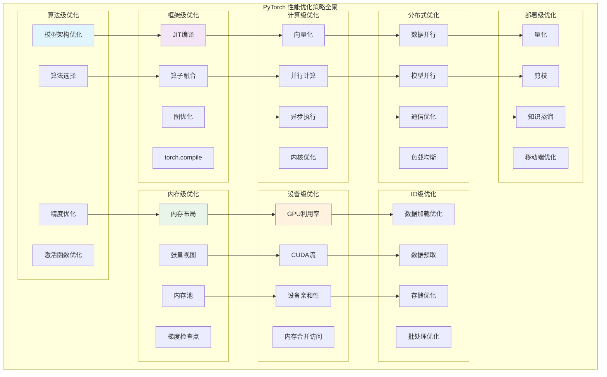

## 概述

<!--more-->

## 1. 性能优化策略总览

### 1.1 优化层次分类

性能优化可以分为以下层次：

```
┌─────────────────────────────────────────────────────────────┐
│                  算法层优化                                  │  ← 模型架构、算法选择
├─────────────────────────────────────────────────────────────┤
│                  框架层优化                                  │  ← JIT编译、算子融合
├─────────────────────────────────────────────────────────────┤
│                  系统层优化                                  │  ← 内存管理、并发控制
├─────────────────────────────────────────────────────────────┤
│                  硬件层优化                                  │  ← GPU利用、网络优化
├─────────────────────────────────────────────────────────────┤
│                  部署层优化                                  │  ← 量化、剪枝、蒸馏
└─────────────────────────────────────────────────────────────┘
```

### 1.2 优化策略全景图



## 2. 内存优化最佳实践

### 2.1 张量内存优化

以下是张量内存优化的最佳实践：

```python
import torch
import torch.nn as nn
import torch.nn.functional as F
from torch.utils.checkpoint import checkpoint
import gc

class TensorMemoryOptimizer:
    """张量内存优化实践"""
    
    @staticmethod
    def optimize_tensor_operations():
        """张量操作优化技巧"""
        
        # 1. 避免不必要的张量拷贝
        def bad_practice():
            x = torch.randn(1000, 1000)
            y = x + 1    # 创建新张量
            z = y * 2    # 又创建新张量
            return z
        
        def good_practice():
            x = torch.randn(1000, 1000)
            x.add_(1)    # 原地操作
            x.mul_(2)    # 原地操作
            return x
        
        # 2. 使用视图而非拷贝
        def efficient_reshaping():
            x = torch.randn(100, 100)
            
            # 好：使用视图（零拷贝）
            y = x.view(10000)
            z = x.transpose(0, 1)
            
            # 避免：不必要的拷贝
            # y = x.clone().view(10000)
            
            return y, z
        
        # 3. 合理使用内存格式
        def optimize_memory_format():
            # 对于卷积操作，使用channels_last格式
            x = torch.randn(32, 64, 224, 224)
            
            # 转换为channels_last格式（NHWC）
            x_nhwc = x.to(memory_format=torch.channels_last)
            
            # 卷积层也要设置为channels_last
            conv = nn.Conv2d(64, 128, 3, padding=1)
            conv = conv.to(memory_format=torch.channels_last)
            
            # 计算（更高效的内存访问）
            output = conv(x_nhwc)
            
            return output
        
        # 4. 预分配输出张量
        def preallocate_outputs():
            batch_size = 32
            feature_dim = 1024
            
            # 预分配输出张量
            outputs = torch.empty(batch_size, feature_dim)
            
            for i in range(batch_size):
                # 使用out参数避免重复分配
                torch.randn(feature_dim, out=outputs[i])
            
            return outputs
    
    @staticmethod
    def gradient_checkpointing_strategies():
        """梯度检查点策略"""
        
        class CheckpointedModel(nn.Module):
            def __init__(self):
                super().__init__()
                self.layers = nn.ModuleList([
                    nn.Linear(1000, 1000) for _ in range(10)
                ])
            
            def forward(self, x):
                # 策略1：每两层使用一个检查点
                for i in range(0, len(self.layers), 2):
                    if i + 1 < len(self.layers):
                        # 两层作为一个检查点段
                        x = checkpoint(self._forward_segment, x, i, i+1)
                    else:
                        x = self.layers[i](x)
                return x
            
            def _forward_segment(self, x, start_idx, end_idx):
                for i in range(start_idx, end_idx + 1):
                    x = F.relu(self.layers[i](x))
                return x
        
        # 策略2：自适应检查点（基于内存使用）
        class AdaptiveCheckpointModel(nn.Module):
            def __init__(self):
                super().__init__()
                self.layers = nn.ModuleList([
                    nn.Linear(1000, 1000) for _ in range(20)
                ])
                self.memory_threshold = 2 * 1024 * 1024 * 1024  # 2GB
            
            def forward(self, x):
                checkpoint_segments = []
                current_segment = []
                
                for i, layer in enumerate(self.layers):
                    current_segment.append(i)
                    
                    # 检查内存使用
                    if torch.cuda.is_available():
                        current_memory = torch.cuda.memory_allocated()
                        if current_memory > self.memory_threshold:
                            # 内存压力大，使用检查点
                            if len(current_segment) > 1:
                                checkpoint_segments.append(current_segment[:-1])
                                current_segment = [current_segment[-1]]
                
                # 处理剩余段
                if current_segment:
                    checkpoint_segments.append(current_segment)
                
                # 执行带检查点的前向传播
                for segment in checkpoint_segments:
                    if len(segment) > 2:  # 只对足够大的段使用检查点
                        x = checkpoint(self._segment_forward, x, segment)
                    else:
                        for layer_idx in segment:
                            x = F.relu(self.layers[layer_idx](x))
                
                return x
            
            def _segment_forward(self, x, layer_indices):
                for idx in layer_indices:
                    x = F.relu(self.layers[idx](x))
                return x
    
    @staticmethod
    def memory_profiling_and_optimization():
        """内存分析和优化工具"""
        
        def memory_profile_decorator(func):
            """内存使用分析装饰器"""
            def wrapper(*args, **kwargs):
                if torch.cuda.is_available():
                    torch.cuda.reset_peak_memory_stats()
                    initial_memory = torch.cuda.memory_allocated()
                
                result = func(*args, **kwargs)
                
                if torch.cuda.is_available():
                    peak_memory = torch.cuda.max_memory_allocated()
                    final_memory = torch.cuda.memory_allocated()
                    
                    print(f"Function: {func.__name__}")
                    print(f"  Peak memory: {peak_memory / 1e9:.2f} GB")
                    print(f"  Memory delta: {(final_memory - initial_memory) / 1e9:.2f} GB")
                    print(f"  Memory efficiency: {initial_memory / peak_memory:.2%}")
                
                return result
            return wrapper
        
        @memory_profile_decorator
        def train_step_with_profiling(model, data, target):
            output = model(data)
            loss = F.cross_entropy(output, target)
            loss.backward()
            return loss
        
        # 内存清理最佳实践
        def memory_cleanup_best_practices():
            # 1. 显式删除大张量
            large_tensor = torch.randn(10000, 10000)
            # 使用完毕后显式删除
            del large_tensor
            
            # 2. 清理梯度
            for param in model.parameters():
                param.grad = None  # 比optimizer.zero_grad()更快
            
            # 3. 强制垃圾回收
            if torch.cuda.is_available():
                torch.cuda.empty_cache()
            gc.collect()
            
            # 4. 使用with语句管理临时张量
            with torch.no_grad():
                temp_tensor = torch.randn(1000, 1000)
                # temp_tensor会在with块结束时自动清理
            
            # 5. 避免循环引用
            # 错误：创建循环引用
            # tensor.custom_attr = tensor
            
            # 正确：使用弱引用或及时清理
            import weakref
            # tensor.custom_attr = weakref.ref(other_tensor)
```

## 3. GPU优化策略

### 3.1 CUDA执行优化

以下是GPU优化的核心策略：

```python
import torch
import torch.cuda
from torch.cuda.amp import GradScaler, autocast

class CUDAOptimizationStrategies:
    """CUDA优化策略"""
    
    @staticmethod
    def mixed_precision_training():
        """混合精度训练优化"""
        
        class MixedPrecisionTrainer:
            def __init__(self, model, optimizer):
                self.model = model
                self.optimizer = optimizer
                self.scaler = GradScaler()
                
                # 启用cudnn优化
                torch.backends.cudnn.benchmark = True
                torch.backends.cudnn.enabled = True
                
            def train_step(self, data, target):
                self.optimizer.zero_grad()
                
                # 使用autocast进行混合精度前向传播
                with autocast():
                    output = self.model(data)
                    loss = F.cross_entropy(output, target)
                
                # 缩放损失避免梯度下溢
                self.scaler.scale(loss).backward()
                
                # 检查梯度是否有效
                self.scaler.step(self.optimizer)
                self.scaler.update()
                
                return loss.item()
    
    @staticmethod
    def cuda_stream_optimization():
        """CUDA流优化策略"""
        
        class StreamOptimizedTraining:
            def __init__(self, model):
                self.model = model
                
                # 创建专用流
                self.compute_stream = torch.cuda.Stream()
                self.data_transfer_stream = torch.cuda.Stream()
                
            def optimized_training_step(self, data_loader):
                # 流水线训练：计算与数据传输重叠
                
                # 预取第一个批次
                data_iter = iter(data_loader)
                current_data, current_target = next(data_iter)
                current_data = current_data.cuda(non_blocking=True)
                current_target = current_target.cuda(non_blocking=True)
                
                for next_data, next_target in data_iter:
                    # 在数据传输流中预取下一批次
                    with torch.cuda.stream(self.data_transfer_stream):
                        next_data = next_data.cuda(non_blocking=True)
                        next_target = next_target.cuda(non_blocking=True)
                    
                    # 在计算流中执行当前批次
                    with torch.cuda.stream(self.compute_stream):
                        output = self.model(current_data)
                        loss = F.cross_entropy(output, current_target)
                        loss.backward()
                    
                    # 同步流
                    self.compute_stream.synchronize()
                    
                    # 交换批次
                    current_data, current_target = next_data, next_target
    
    @staticmethod
    def memory_optimization_techniques():
        """GPU内存优化技巧"""
        
        def optimize_cuda_memory():
            # 1. 设置内存分配策略
            # 使用更激进的内存释放策略
            torch.cuda.empty_cache()
            
            # 2. 优化内存分配器
            # 设置内存池预分配
            torch.cuda.set_per_process_memory_fraction(0.8)
            
            # 3. 启用内存映射（大模型优化）
            if hasattr(torch.cuda, 'memory_mapped'):
                torch.cuda.memory_mapped = True
            
            # 4. 优化数据传输
            def efficient_data_transfer():
                # 使用非阻塞传输
                cpu_tensor = torch.randn(1000, 1000)
                gpu_tensor = cpu_tensor.cuda(non_blocking=True)
                
                # 批量传输多个张量
                cpu_tensors = [torch.randn(100, 100) for _ in range(10)]
                gpu_tensors = []
                
                # 启动所有异步传输
                for cpu_t in cpu_tensors:
                    gpu_tensors.append(cpu_t.cuda(non_blocking=True))
                
                # 一次性同步
                torch.cuda.synchronize()
                
                return gpu_tensors
        
        def dynamic_memory_management():
            """动态内存管理策略"""
            
            class MemoryAwareModel(nn.Module):
                def __init__(self):
                    super().__init__()
                    self.layers = nn.ModuleList([
                        nn.Linear(1000, 1000) for _ in range(100)
                    ])
                    
                    # 内存使用监控
                    self.memory_budget = 4 * 1024 * 1024 * 1024  # 4GB预算
                    self.checkpoint_threshold = 0.8  # 80%内存使用时启用检查点
                
                def forward(self, x):
                    for i, layer in enumerate(self.layers):
                        # 动态决定是否使用检查点
                        if self._should_use_checkpoint():
                            x = checkpoint(layer, x)
                        else:
                            x = layer(x)
                            
                        # 定期清理中间结果
                        if i % 10 == 0:
                            torch.cuda.empty_cache()
                    
                    return x
                
                def _should_use_checkpoint(self):
                    if torch.cuda.is_available():
                        current_memory = torch.cuda.memory_allocated()
                        return current_memory > self.memory_budget * self.checkpoint_threshold
                    return False
```

### 3.2 模型优化技术

以下是模型层面的优化策略：

```python
class ModelOptimizationStrategies:
    """模型优化策略"""
    
    @staticmethod
    def layer_fusion_optimization():
        """层融合优化技术"""
        
        class OptimizedSequential(nn.Sequential):
            """优化的Sequential容器"""
            
            def __init__(self, *args):
                super().__init__(*args)
                self._fused_modules = {}
                
            def fuse_for_inference(self):
                """推理时融合优化"""
                fused_modules = []
                i = 0
                
                while i < len(self):
                    current_module = self[i]
                    
                    # 检查Conv + BN融合模式
                    if (isinstance(current_module, nn.Conv2d) and 
                        i + 1 < len(self) and 
                        isinstance(self[i + 1], nn.BatchNorm2d)):
                        
                        conv = current_module
                        bn = self[i + 1]
                        
                        # 融合Conv和BN
                        fused_conv = self._fuse_conv_bn(conv, bn)
                        fused_modules.append(fused_conv)
                        i += 2  # 跳过BN层
                        
                    # 检查Linear + ReLU融合模式
                    elif (isinstance(current_module, nn.Linear) and
                          i + 1 < len(self) and
                          isinstance(self[i + 1], nn.ReLU)):
                        
                        # 创建融合的Linear-ReLU层
                        fused_linear = FusedLinearReLU(current_module)
                        fused_modules.append(fused_linear)
                        i += 2  # 跳过ReLU层
                    
                    else:
                        fused_modules.append(current_module)
                        i += 1
                
                # 替换为融合模块
                self._modules.clear()
                for idx, module in enumerate(fused_modules):
                    self.add_module(str(idx), module)
            
            def _fuse_conv_bn(self, conv, bn):
                """融合卷积和批归一化"""
                # 获取参数
                w_conv = conv.weight.clone()
                b_conv = conv.bias.clone() if conv.bias is not None else torch.zeros(conv.out_channels)
                
                w_bn = bn.weight.clone()
                b_bn = bn.bias.clone()
                mean = bn.running_mean.clone()
                var = bn.running_var.clone()
                eps = bn.eps
                
                # 融合计算
                std = torch.sqrt(var + eps)
                t = w_bn / std
                
                # 新的权重和偏置
                w_fused = w_conv * t.view(-1, 1, 1, 1)
                b_fused = (b_conv - mean) * t + b_bn
                
                # 创建融合后的卷积层
                fused_conv = nn.Conv2d(
                    conv.in_channels, conv.out_channels, conv.kernel_size,
                    conv.stride, conv.padding, conv.dilation, conv.groups, True
                )
                
                fused_conv.weight.data = w_fused
                fused_conv.bias.data = b_fused
                
                return fused_conv
        
        class FusedLinearReLU(nn.Module):
            """融合的Linear+ReLU层"""
            
            def __init__(self, linear_layer):
                super().__init__()
                self.linear = linear_layer
                
            def forward(self, x):
                # 某些后端可以将这个融合为单个内核
                return F.relu(self.linear(x), inplace=True)
    
    @staticmethod
    def parameter_optimization():
        """参数优化策略"""
        
        def weight_sharing_optimization():
            """权重共享优化"""
            
            class WeightSharedModel(nn.Module):
                def __init__(self):
                    super().__init__()
                    
                    # 共享的特征提取器
                    self.shared_encoder = nn.Sequential(
                        nn.Linear(784, 256),
                        nn.ReLU(),
                        nn.Linear(256, 128)
                    )
                    
                    # 多个任务头共享编码器参数
                    self.task1_head = nn.Linear(128, 10)
                    self.task2_head = nn.Linear(128, 5)
                    
                    # 共享注意力权重
                    self.shared_attention_weight = nn.Parameter(torch.randn(128, 128))
                
                def forward(self, x, task='task1'):
                    # 共享特征提取
                    features = self.shared_encoder(x)
                    
                    # 共享注意力计算
                    attention_scores = torch.matmul(features, self.shared_attention_weight)
                    attended_features = features * torch.softmax(attention_scores, dim=-1)
                    
                    # 任务特定输出
                    if task == 'task1':
                        return self.task1_head(attended_features)
                    else:
                        return self.task2_head(attended_features)
        
        def parameter_initialization_optimization():
            """参数初始化优化"""
            
            def smart_initialization(model):
                """智能参数初始化"""
                for name, module in model.named_modules():
                    if isinstance(module, nn.Linear):
                        # 根据激活函数选择初始化方法
                        if 'relu' in name.lower():
                            nn.init.kaiming_normal_(module.weight, mode='fan_out', nonlinearity='relu')
                        elif 'tanh' in name.lower():
                            nn.init.xavier_normal_(module.weight, gain=nn.init.calculate_gain('tanh'))
                        else:
                            nn.init.xavier_uniform_(module.weight)
                        
                        if module.bias is not None:
                            nn.init.constant_(module.bias, 0)
                    
                    elif isinstance(module, nn.Conv2d):
                        # 卷积层使用He初始化
                        nn.init.kaiming_normal_(module.weight, mode='fan_out', nonlinearity='relu')
                    
                    elif isinstance(module, (nn.BatchNorm2d, nn.BatchNorm1d)):
                        # BN层初始化
                        nn.init.constant_(module.weight, 1)
                        nn.init.constant_(module.bias, 0)
```

## 4. 分布式训练优化

### 4.1 分布式训练最佳实践

以下是分布式训练的优化策略：

```python
import torch.distributed as dist
from torch.nn.parallel import DistributedDataParallel as DDP

class DistributedOptimizationStrategies:
    """分布式训练优化策略"""
    
    @staticmethod
    def efficient_ddp_setup():
        """高效的DDP设置"""
        
        def setup_distributed_training(model, find_unused_parameters=False):
            """设置分布式训练"""
            
            # 1. 优化DDP配置
            model = DDP(
                model,
                device_ids=[torch.cuda.current_device()],
                output_device=torch.cuda.current_device(),
                find_unused_parameters=find_unused_parameters,  # 仅在必要时启用
                gradient_as_bucket_view=True,  # 减少内存拷贝
                static_graph=True,  # 静态图优化（如果图结构不变）
                broadcast_buffers=False,  # 如果不需要同步buffer
                bucket_cap_mb=25,  # 优化bucket大小
            )
            
            return model
        
        def optimize_gradient_synchronization():
            """优化梯度同步"""
            
            class GradientSyncOptimizer:
                def __init__(self, model):
                    self.model = model
                    self._gradient_hooks = []
                    
                def register_gradient_hooks(self):
                    """注册梯度同步钩子"""
                    
                    def gradient_hook(param_name):
                        def hook(grad):
                            # 可以在这里添加梯度压缩、量化等优化
                            
                            # 示例：梯度裁剪
                            torch.nn.utils.clip_grad_norm_([grad], max_norm=1.0)
                            
                            # 示例：梯度稀疏化
                            if grad.numel() > 1000:  # 只对大梯度应用稀疏化
                                k = int(grad.numel() * 0.01)  # 保留1%的梯度
                                _, indices = torch.topk(grad.abs().flatten(), k)
                                sparse_grad = torch.zeros_like(grad.flatten())
                                sparse_grad[indices] = grad.flatten()[indices]
                                return sparse_grad.view_as(grad)
                            
                            return grad
                        return hook
                    
                    # 为所有参数注册钩子
                    for name, param in self.model.named_parameters():
                        if param.requires_grad:
                            handle = param.register_hook(gradient_hook(name))
                            self._gradient_hooks.append(handle)
                
                def remove_hooks(self):
                    """移除钩子"""
                    for handle in self._gradient_hooks:
                        handle.remove()
                    self._gradient_hooks.clear()
    
    @staticmethod
    def communication_optimization():
        """通信优化策略"""
        
        def overlap_communication_computation():
            """通信与计算重叠"""
            
            class OverlapOptimizer:
                def __init__(self, model):
                    self.model = model
                    self.communication_handles = []
                
                def backward_with_overlap(self, loss):
                    """带通信重叠的反向传播"""
                    
                    # 收集需要梯度的参数
                    params_with_grad = [p for p in self.model.parameters() if p.requires_grad]
                    
                    # 按反向拓扑顺序分组参数
                    param_groups = self._group_parameters_by_layer(params_with_grad)
                    
                    # 反向传播
                    loss.backward()
                    
                    # 逐组启动all-reduce
                    for group in reversed(param_groups):  # 反向顺序
                        # 等待该组的梯度计算完成
                        for param in group:
                            if param.grad is not None:
                                param.grad.wait()  # 等待梯度计算完成
                        
                        # 异步启动all-reduce
                        group_tensors = [p.grad for p in group if p.grad is not None]
                        if group_tensors:
                            handle = dist.all_reduce(
                                torch.cat([t.flatten() for t in group_tensors]),
                                async_op=True
                            )
                            self.communication_handles.append((handle, group, group_tensors))
                    
                    # 等待所有通信完成
                    self.wait_all_communications()
                
                def wait_all_communications(self):
                    """等待所有通信完成"""
                    for handle, group, tensors in self.communication_handles:
                        handle.wait()
                        
                        # 平均梯度
                        world_size = dist.get_world_size()
                        for tensor in tensors:
                            tensor.div_(world_size)
                    
                    self.communication_handles.clear()
                
                def _group_parameters_by_layer(self, parameters):
                    """按层分组参数"""
                    # 简化实现：按参数大小分组
                    groups = []
                    current_group = []
                    current_size = 0
                    max_group_size = 25 * 1024 * 1024  # 25MB
                    
                    for param in parameters:
                        param_size = param.numel() * param.element_size()
                        
                        if current_size + param_size > max_group_size and current_group:
                            groups.append(current_group)
                            current_group = []
                            current_size = 0
                        
                        current_group.append(param)
                        current_size += param_size
                    
                    if current_group:
                        groups.append(current_group)
                    
                    return groups
```

## 5. 数据加载优化

### 5.1 DataLoader性能调优

以下是数据管道的优化策略：

```python
class DataLoadingOptimization:
    """数据加载优化策略"""
    
    @staticmethod
    def create_optimized_dataloader(dataset, batch_size, num_workers=None):
        """创建优化的DataLoader"""
        
        # 自动选择最优worker数量
        if num_workers is None:
            num_workers = min(8, torch.get_num_threads())
        
        # 根据数据类型优化collate_fn
        def optimized_collate_fn(batch):
            if isinstance(batch[0], dict):
                # 字典格式数据
                return optimized_dict_collate(batch)
            elif isinstance(batch[0], (tuple, list)):
                # 序列格式数据
                return optimized_sequence_collate(batch)
            else:
                # 张量数据
                return torch.utils.data.default_collate(batch)
        
        # 创建优化的DataLoader
        dataloader = torch.utils.data.DataLoader(
            dataset,
            batch_size=batch_size,
            num_workers=num_workers,
            pin_memory=torch.cuda.is_available(),  # GPU加速
            collate_fn=optimized_collate_fn,
            persistent_workers=True,  # 保持worker进程
            prefetch_factor=4,  # 增加预取
            drop_last=True,  # 避免不完整批次
        )
        
        return dataloader
    
    @staticmethod
    def data_preprocessing_optimization():
        """数据预处理优化"""
        
        def efficient_transforms():
            """高效的数据变换"""
            import torchvision.transforms as transforms
            
            # 1. 组合变换以减少中间张量
            transform = transforms.Compose([
                transforms.ToTensor(),
                transforms.Normalize(mean=[0.485, 0.456, 0.406], 
                                   std=[0.229, 0.224, 0.225]),
                # 避免：多个独立的变换
                # transforms.RandomHorizontalFlip(),
                # transforms.RandomRotation(10),
                # 改为：组合的变换
                transforms.RandomApply([
                    transforms.RandomHorizontalFlip(),
                    transforms.RandomRotation(10),
                ], p=0.5)
            ])
            
            return transform
        
        def batch_level_optimization():
            """批级别的优化"""
            
            class BatchOptimizedDataset(torch.utils.data.Dataset):
                def __init__(self, base_dataset):
                    self.base_dataset = base_dataset
                    self.batch_cache = {}
                
                def __getitem__(self, idx):
                    return self.base_dataset[idx]
                
                def __len__(self):
                    return len(self.base_dataset)
                
                def get_batch(self, indices):
                    """批量获取数据（减少随机访问）"""
                    batch_key = tuple(sorted(indices))
                    
                    if batch_key in self.batch_cache:
                        return self.batch_cache[batch_key]
                    
                    # 批量加载
                    batch_data = []
                    for idx in indices:
                        batch_data.append(self.base_dataset[idx])
                    
                    # 缓存批次
                    self.batch_cache[batch_key] = batch_data
                    
                    return batch_data

def optimized_dict_collate(batch):
    """优化的字典批处理"""
    if not batch:
        return {}
    
    result = {}
    keys = batch[0].keys()
    
    for key in keys:
        values = [sample[key] for sample in batch]
        
        if isinstance(values[0], torch.Tensor):
            # 张量数据：检查是否需要填充
            shapes = [v.shape for v in values]
            if len(set(shapes)) == 1:
                # 形状一致，直接堆叠
                result[key] = torch.stack(values)
            else:
                # 需要填充
                result[key] = pad_and_stack_tensors(values)
        else:
            # 非张量数据
            result[key] = values
    
    return result

def pad_and_stack_tensors(tensors):
    """填充并堆叠张量"""
    # 计算最大形状
    max_shape = list(tensors[0].shape)
    for tensor in tensors[1:]:
        for i, dim_size in enumerate(tensor.shape):
            max_shape[i] = max(max_shape[i], dim_size)
    
    # 填充所有张量
    padded_tensors = []
    for tensor in tensors:
        if list(tensor.shape) == max_shape:
            padded_tensors.append(tensor)
        else:
            # 计算填充参数
            padding = []
            for i in range(len(tensor.shape)):
                pad_size = max_shape[i] - tensor.shape[i]
                padding.extend([0, pad_size])
            
            # 应用填充
            padded_tensor = F.pad(tensor, padding[::-1])  # 反向填充
            padded_tensors.append(padded_tensor)
    
    return torch.stack(padded_tensors)
```

## 6. 部署优化策略

### 6.1 量化和剪枝

基于模型压缩的最佳实践，以下是部署优化技术：

```python
import torch.quantization as quant

class DeploymentOptimization:
    """部署优化策略"""
    
    @staticmethod
    def quantization_strategies():
        """量化优化策略"""
        
        def post_training_quantization(model, calibration_data):
            """训练后量化"""
            
            # 1. 准备模型
            model.eval()
            
            # 2. 融合可融合的层
            model_fused = torch.quantization.fuse_modules(model, [
                ['conv1', 'bn1', 'relu1'],
                ['conv2', 'bn2'],
            ])
            
            # 3. 设置量化配置
            model_fused.qconfig = torch.quantization.get_default_qconfig('fbgemm')
            
            # 4. 准备量化
            model_prepared = torch.quantization.prepare(model_fused)
            
            # 5. 校准
            with torch.no_grad():
                for data, _ in calibration_data:
                    model_prepared(data)
            
            # 6. 转换为量化模型
            model_quantized = torch.quantization.convert(model_prepared)
            
            return model_quantized
        
        def quantization_aware_training(model):
            """量化感知训练"""
            
            class QATModel(nn.Module):
                def __init__(self, original_model):
                    super().__init__()
                    self.quant = torch.quantization.QuantStub()
                    self.model = original_model
                    self.dequant = torch.quantization.DeQuantStub()
                
                def forward(self, x):
                    x = self.quant(x)
                    x = self.model(x)
                    x = self.dequant(x)
                    return x
            
            # 包装模型
            qat_model = QATModel(model)
            
            # 设置量化配置
            qat_model.qconfig = torch.quantization.get_default_qat_qconfig('fbgemm')
            
            # 准备QAT
            model_prepared = torch.quantization.prepare_qat(qat_model)
            
            return model_prepared
    
    @staticmethod
    def pruning_strategies():
        """剪枝优化策略"""
        
        def structured_pruning(model, sparsity=0.3):
            """结构化剪枝"""
            import torch.nn.utils.prune as prune
            
            # 分析网络结构，选择剪枝策略
            for name, module in model.named_modules():
                if isinstance(module, nn.Linear):
                    # 线性层：按神经元重要性剪枝
                    prune.ln_structured(
                        module, name='weight', 
                        amount=sparsity, n=2, dim=0  # L2范数，输出维度
                    )
                elif isinstance(module, nn.Conv2d):
                    # 卷积层：按通道重要性剪枝  
                    prune.ln_structured(
                        module, name='weight',
                        amount=sparsity, n=2, dim=0  # 输出通道
                    )
            
            return model
        
        def magnitude_based_pruning(model, sparsity=0.5):
            """基于权重大小的剪枝"""
            
            class MagnitudePruner:
                def __init__(self, sparsity):
                    self.sparsity = sparsity
                
                def prune_model(self, model):
                    # 收集所有权重
                    all_weights = []
                    for module in model.modules():
                        if hasattr(module, 'weight'):
                            all_weights.append(module.weight.data.flatten())
                    
                    # 计算全局阈值
                    all_weights_tensor = torch.cat(all_weights)
                    threshold = torch.quantile(all_weights_tensor.abs(), self.sparsity)
                    
                    # 应用剪枝
                    for module in model.modules():
                        if hasattr(module, 'weight'):
                            mask = module.weight.data.abs() > threshold
                            module.weight.data *= mask.float()
                    
                    return model
            
            pruner = MagnitudePruner(sparsity)
            return pruner.prune_model(model)
    
    @staticmethod
    def mobile_optimization():
        """移动端优化"""
        
        def optimize_for_mobile(model):
            """移动端优化"""
            
            # 1. JIT脚本化
            scripted_model = torch.jit.script(model)
            
            # 2. 移动端优化
            optimized_model = torch.utils.mobile_optimizer.optimize_for_mobile(
                scripted_model,
                backend='metal'  # iOS Metal后端
            )
            
            # 3. 量化优化
            quantized_model = torch.quantization.quantize_dynamic(
                optimized_model,
                {nn.Linear, nn.Conv2d},
                dtype=torch.qint8
            )
            
            return quantized_model

def profile_and_optimize_model(model, sample_input):
    """模型性能分析和优化工具"""
    
    # 1. 性能基准测试
    def benchmark_model():
        model.eval()
        
        # 预热
        with torch.no_grad():
            for _ in range(10):
                _ = model(sample_input)
        
        torch.cuda.synchronize()
        
        # 测量推理时间
        times = []
        with torch.no_grad():
            for _ in range(100):
                start_time = time.time()
                _ = model(sample_input)
                torch.cuda.synchronize()
                end_time = time.time()
                times.append(end_time - start_time)
        
        avg_time = np.mean(times)
        std_time = np.std(times)
        
        print(f"Average inference time: {avg_time*1000:.2f} ± {std_time*1000:.2f} ms")
        
        return avg_time
    
    # 2. 内存使用分析
    def analyze_memory_usage():
        if torch.cuda.is_available():
            torch.cuda.reset_peak_memory_stats()
            
            with torch.no_grad():
                output = model(sample_input)
            
            peak_memory = torch.cuda.max_memory_allocated()
            print(f"Peak memory usage: {peak_memory / 1e9:.2f} GB")
            
            return peak_memory
    
    # 3. 瓶颈分析
    def find_bottlenecks():
        with torch.profiler.profile(
            activities=[torch.profiler.ProfilerActivity.CPU, torch.profiler.ProfilerActivity.CUDA],
            record_shapes=True
        ) as prof:
            with torch.no_grad():
                _ = model(sample_input)
        
        # 分析结果
        print(prof.key_averages().table(sort_by="cuda_time_total", row_limit=10))
        
        return prof
    
    # 执行分析
    original_time = benchmark_model()
    original_memory = analyze_memory_usage()
    
    print(f"Original model - Time: {original_time*1000:.2f}ms, Memory: {original_memory/1e9:.2f}GB")
    
    return {
        'inference_time': original_time,
        'memory_usage': original_memory,
        'profiler_results': find_bottlenecks()
    }
```

## 7. 综合优化实战案例

### 7.1 端到端优化流程

以下是一个完整的优化实战案例：

```python
class ComprehensiveOptimizationPipeline:
    """端到端优化流程（综合最佳实践）"""
    
    def __init__(self, model, dataset, target_latency_ms=100, target_memory_gb=4):
        self.original_model = model
        self.dataset = dataset
        self.target_latency = target_latency_ms / 1000.0  # 转换为秒
        self.target_memory = target_memory_gb * 1e9  # 转换为字节
        
        self.optimization_history = []
        
    def run_full_optimization(self):
        """运行完整的优化流程"""
        
        current_model = self.original_model
        
        print("=== PyTorch Model Optimization Pipeline ===")
        
        # 阶段1：基础模型优化
        print("\n1. Basic Model Optimization...")
        current_model = self._basic_model_optimization(current_model)
        
        # 阶段2：内存优化  
        print("\n2. Memory Optimization...")
        current_model = self._memory_optimization(current_model)
        
        # 阶段3：计算优化
        print("\n3. Computation Optimization...")
        current_model = self._computation_optimization(current_model)
        
        # 阶段4：GPU优化
        print("\n4. GPU Optimization...")
        current_model = self._gpu_optimization(current_model)
        
        # 阶段5：编译优化
        print("\n5. Compilation Optimization...")
        current_model = self._compilation_optimization(current_model)
        
        # 阶段6：部署优化
        print("\n6. Deployment Optimization...")
        current_model = self._deployment_optimization(current_model)
        
        # 最终验证
        print("\n7. Final Validation...")
        self._validate_optimized_model(current_model)
        
        return current_model
    
    def _basic_model_optimization(self, model):
        """基础模型优化"""
        
        # 1. 层融合
        if hasattr(model, 'fuse_for_inference'):
            model.fuse_for_inference()
        
        # 2. 参数初始化优化
        def optimize_initialization():
            for module in model.modules():
                if isinstance(module, nn.Linear):
                    if hasattr(module, 'reset_parameters'):
                        # 使用更好的初始化
                        nn.init.kaiming_normal_(module.weight, mode='fan_out')
        
        optimize_initialization()
        
        # 3. 激活函数优化
        model = self._replace_activations(model)
        
        return model
    
    def _memory_optimization(self, model):
        """内存优化"""
        
        # 1. 启用梯度检查点（训练时）
        if model.training:
            model = self._add_gradient_checkpointing(model)
        
        # 2. 优化内存格式
        if torch.cuda.is_available():
            model = model.to(memory_format=torch.channels_last)
        
        # 3. 参数共享
        model = self._apply_parameter_sharing(model)
        
        return model
    
    def _computation_optimization(self, model):
        """计算优化"""
        
        # 1. 算子替换
        model = self._replace_inefficient_operators(model)
        
        # 2. 并行化配置
        torch.set_num_threads(min(8, torch.get_num_threads()))
        
        return model
    
    def _gpu_optimization(self, model):
        """GPU优化"""
        
        if torch.cuda.is_available():
            # 1. 混合精度
            model = model.half()  # 或使用自动混合精度
            
            # 2. cuDNN优化
            torch.backends.cudnn.benchmark = True
            torch.backends.cudnn.enabled = True
            
            # 3. TensorRT集成（如果可用）
            if hasattr(torch, 'tensorrt'):
                model = self._apply_tensorrt_optimization(model)
        
        return model
    
    def _compilation_optimization(self, model):
        """编译优化"""
        
        # 1. TorchScript编译
        try:
            scripted_model = torch.jit.script(model)
            
            # 2. 图优化
            scripted_model = torch.jit.optimize_for_inference(scripted_model)
            
            return scripted_model
            
        except Exception as e:
            print(f"TorchScript compilation failed: {e}")
            
            # 回退到torch.compile（PyTorch 2.0+）
            if hasattr(torch, 'compile'):
                try:
                    compiled_model = torch.compile(
                        model, 
                        mode='max-autotune',  # 最大化优化
                        dynamic=False         # 静态形状优化
                    )
                    return compiled_model
                except Exception as e2:
                    print(f"torch.compile failed: {e2}")
                    return model
        
        return model
    
    def _deployment_optimization(self, model):
        """部署优化"""
        
        # 1. 量化
        if self._should_quantize(model):
            model = self._apply_quantization(model)
        
        # 2. 剪枝
        if self._should_prune(model):
            model = self._apply_pruning(model)
        
        # 3. 知识蒸馏（如果有teacher模型）
        # model = self._apply_knowledge_distillation(model)
        
        return model
    
    def _validate_optimized_model(self, optimized_model):
        """验证优化后的模型"""
        
        sample_input = torch.randn(1, 3, 224, 224)
        if torch.cuda.is_available():
            sample_input = sample_input.cuda()
            optimized_model = optimized_model.cuda()
        
        # 性能测试
        latency = self._measure_latency(optimized_model, sample_input)
        memory_usage = self._measure_memory_usage(optimized_model, sample_input)
        
        print(f"\nOptimized Model Performance:")
        print(f"  Latency: {latency*1000:.2f} ms (Target: {self.target_latency*1000:.2f} ms)")
        print(f"  Memory: {memory_usage/1e9:.2f} GB (Target: {self.target_memory/1e9:.2f} GB)")
        
        # 检查是否达到目标
        latency_ok = latency <= self.target_latency
        memory_ok = memory_usage <= self.target_memory
        
        print(f"  Latency Target: {'✓' if latency_ok else '✗'}")
        print(f"  Memory Target: {'✓' if memory_ok else '✗'}")
        
        if not (latency_ok and memory_ok):
            print("\n⚠️ Warning: Optimization targets not met. Consider:")
            if not latency_ok:
                print("  - Further model compression")
                print("  - More aggressive quantization")
                print("  - Hardware-specific optimization")
            if not memory_ok:
                print("  - Gradient checkpointing")
                print("  - Model sharding")
                print("  - Smaller batch sizes")
    
    def _measure_latency(self, model, sample_input, num_runs=100):
        """测量推理延迟"""
        model.eval()
        
        # 预热
        with torch.no_grad():
            for _ in range(10):
                _ = model(sample_input)
        
        if torch.cuda.is_available():
            torch.cuda.synchronize()
        
        # 测量
        start_time = time.time()
        with torch.no_grad():
            for _ in range(num_runs):
                _ = model(sample_input)
        
        if torch.cuda.is_available():
            torch.cuda.synchronize()
        
        end_time = time.time()
        
        return (end_time - start_time) / num_runs
    
    def _measure_memory_usage(self, model, sample_input):
        """测量内存使用"""
        if torch.cuda.is_available():
            torch.cuda.reset_peak_memory_stats()
            
            with torch.no_grad():
                _ = model(sample_input)
            
            return torch.cuda.max_memory_allocated()
        else:
            # CPU内存测量（简化）
            import psutil
            process = psutil.Process()
            return process.memory_info().rss

def create_production_training_pipeline():
    """生产级训练流水线"""
    
    class ProductionTrainer:
        def __init__(self, model, train_loader, val_loader, optimizer):
            self.model = model
            self.train_loader = train_loader
            self.val_loader = val_loader
            self.optimizer = optimizer
            
            # 性能监控
            self.performance_monitor = PerformanceMonitor()
            
            # 自动优化配置
            self._setup_automatic_optimizations()
        
        def _setup_automatic_optimizations(self):
            """设置自动优化"""
            
            # 1. 自动混合精度
            if torch.cuda.is_available():
                self.scaler = torch.cuda.amp.GradScaler()
                self.use_amp = True
            else:
                self.use_amp = False
            
            # 2. 编译优化
            if hasattr(torch, 'compile'):
                self.model = torch.compile(self.model, mode='reduce-overhead')
            
            # 3. cuDNN优化
            if torch.cuda.is_available():
                torch.backends.cudnn.benchmark = True
        
        def train_epoch(self, epoch):
            """优化的训练轮次"""
            self.model.train()
            
            epoch_loss = 0.0
            num_batches = len(self.train_loader)
            
            for batch_idx, (data, target) in enumerate(self.train_loader):
                batch_start_time = time.time()
                
                # 数据传输优化
                if torch.cuda.is_available():
                    data = data.cuda(non_blocking=True)
                    target = target.cuda(non_blocking=True)
                
                # 梯度清零
                self.optimizer.zero_grad(set_to_none=True)  # 更快的梯度清零
                
                # 前向传播（混合精度）
                if self.use_amp:
                    with torch.cuda.amp.autocast():
                        output = self.model(data)
                        loss = F.cross_entropy(output, target)
                    
                    # 反向传播
                    self.scaler.scale(loss).backward()
                    self.scaler.step(self.optimizer)
                    self.scaler.update()
                else:
                    output = self.model(data)
                    loss = F.cross_entropy(output, target)
                    loss.backward()
                    self.optimizer.step()
                
                epoch_loss += loss.item()
                
                # 性能监控
                batch_time = time.time() - batch_start_time
                self.performance_monitor.record_batch(batch_time, loss.item())
                
                # 动态优化调整
                if batch_idx % 100 == 0:
                    self._dynamic_optimization_adjustment(batch_idx, num_batches)
            
            return epoch_loss / num_batches
        
        def _dynamic_optimization_adjustment(self, batch_idx, total_batches):
            """动态优化调整"""
            
            # 基于性能指标动态调整
            avg_batch_time = self.performance_monitor.get_average_batch_time()
            target_batch_time = 0.1  # 100ms目标
            
            if avg_batch_time > target_batch_time * 1.2:
                # 性能不达标，启用更多优化
                if not self.use_amp and torch.cuda.is_available():
                    print("Enabling automatic mixed precision...")
                    self.scaler = torch.cuda.amp.GradScaler()
                    self.use_amp = True
                
                # 减少数据加载器worker数量，释放CPU资源给GPU
                if hasattr(self.train_loader, 'num_workers'):
                    self.train_loader.num_workers = max(1, self.train_loader.num_workers - 1)

class PerformanceMonitor:
    """性能监控器"""
    
    def __init__(self, window_size=100):
        self.window_size = window_size
        self.batch_times = []
        self.losses = []
        
    def record_batch(self, batch_time, loss):
        self.batch_times.append(batch_time)
        self.losses.append(loss)
        
        # 保持窗口大小
        if len(self.batch_times) > self.window_size:
            self.batch_times.pop(0)
            self.losses.pop(0)
    
    def get_average_batch_time(self):
        return np.mean(self.batch_times) if self.batch_times else 0.0
    
    def get_average_loss(self):
        return np.mean(self.losses) if self.losses else 0.0
    
    def get_performance_summary(self):
        return {
            'avg_batch_time': self.get_average_batch_time(),
            'avg_loss': self.get_average_loss(),
            'batch_time_std': np.std(self.batch_times),
            'loss_std': np.std(self.losses)
        }
```

## 8. 性能调优检查清单

### 8.1 开发阶段优化清单

```python
class OptimizationChecklist:
    """性能优化检查清单"""
    
    def development_phase_checklist(self, model, data_loader):
        """开发阶段优化检查"""
        
        checklist = {
            "模型设计": [],
            "内存管理": [],
            "计算优化": [],
            "数据管道": []
        }
        
        # 模型设计检查
        model_checks = [
            ("使用高效的激活函数(ReLU/GELU)", self._check_activations(model)),
            ("避免不必要的层", self._check_layer_efficiency(model)),
            ("合理的模型深度和宽度", self._check_model_architecture(model)),
            ("参数初始化优化", self._check_initialization(model))
        ]
        checklist["模型设计"] = model_checks
        
        # 内存管理检查
        memory_checks = [
            ("使用原地操作", self._check_inplace_operations(model)),
            ("避免内存泄漏", self._check_memory_leaks()),
            ("梯度检查点配置", self._check_gradient_checkpointing(model)),
            ("张量视图优化", self._check_tensor_views())
        ]
        checklist["内存管理"] = memory_checks
        
        # 计算优化检查
        compute_checks = [
            ("向量化操作", self._check_vectorization()),
            ("批处理大小优化", self._check_batch_size(data_loader)),
            ("混合精度训练", self._check_mixed_precision()),
            ("cuDNN配置", self._check_cudnn_settings())
        ]
        checklist["计算优化"] = compute_checks
        
        # 数据管道检查
        data_checks = [
            ("DataLoader配置", self._check_dataloader_config(data_loader)),
            ("数据预处理优化", self._check_data_preprocessing(data_loader)),
            ("数据格式优化", self._check_data_format()),
            ("IO并行化", self._check_io_parallelization(data_loader))
        ]
        checklist["数据管道"] = data_checks
        
        return checklist
    
    def print_optimization_report(self, checklist):
        """打印优化报告"""
        print("\n" + "="*60)
        print("PyTorch Performance Optimization Report")
        print("="*60)
        
        for category, checks in checklist.items():
            print(f"\n{category}:")
            for check_name, (passed, suggestion) in checks:
                status = "✓" if passed else "✗"
                print(f"  {status} {check_name}")
                if not passed and suggestion:
                    print(f"    💡 建议: {suggestion}")
        
        # 总体评分
        total_checks = sum(len(checks) for checks in checklist.values())
        passed_checks = sum(sum(1 for _, (passed, _) in checks if passed) 
                           for checks in checklist.values())
        
        score = (passed_checks / total_checks) * 100
        print(f"\n总体优化得分: {score:.1f}% ({passed_checks}/{total_checks})")
        
        if score < 70:
            print("⚠️  建议进行更多优化以提升性能")
        elif score < 90:
            print("👍 性能配置良好，可考虑进一步微调")
        else:
            print("🎉 优秀的性能配置！")
    
    def _check_activations(self, model):
        """检查激活函数选择"""
        relu_count = 0
        gelu_count = 0
        other_count = 0
        
        for module in model.modules():
            if isinstance(module, nn.ReLU):
                relu_count += 1
            elif isinstance(module, nn.GELU):
                gelu_count += 1
            elif isinstance(module, (nn.Sigmoid, nn.Tanh)):
                other_count += 1
        
        efficient_activations = relu_count + gelu_count
        total_activations = efficient_activations + other_count
        
        if total_activations == 0:
            return True, ""
        
        efficiency_ratio = efficient_activations / total_activations
        
        if efficiency_ratio >= 0.8:
            return True, ""
        else:
            return False, "考虑使用ReLU或GELU替代Sigmoid/Tanh"
    
    def _check_mixed_precision(self):
        """检查混合精度配置"""
        if torch.cuda.is_available():
            # 检查是否支持Tensor Cores
            device_props = torch.cuda.get_device_properties(0)
            supports_fp16 = device_props.major >= 7  # V100及以上
            
            return supports_fp16, "在支持的GPU上启用混合精度训练" if supports_fp16 else ""
        
        return False, "CUDA不可用"
    
    def _check_dataloader_config(self, data_loader):
        """检查DataLoader配置"""
        issues = []
        
        if data_loader.num_workers == 0:
            issues.append("考虑使用多进程数据加载")
        
        if not data_loader.pin_memory and torch.cuda.is_available():
            issues.append("启用pin_memory以加速GPU传输")
        
        if data_loader.prefetch_factor < 2:
            issues.append("增加prefetch_factor以改善数据流水线")
        
        return len(issues) == 0, "; ".join(issues)
```

## 9. 生产部署优化

### 9.1 模型服务优化

基于生产环境的实践，以下是模型服务的优化策略：

```python
class ProductionDeploymentOptimizer:
    """生产部署优化器"""
    
    @staticmethod
    def model_serving_optimization():
        """模型服务优化"""
        
        class OptimizedModelServer:
            def __init__(self, model_path, device='cuda'):
                # 1. 加载优化后的模型
                self.model = torch.jit.load(model_path, map_location=device)
                self.model.eval()
                
                # 2. 预热模型
                self._warmup_model()
                
                # 3. 配置批处理
                self.batch_size = self._determine_optimal_batch_size()
                self.batch_timeout = 0.01  # 10ms批处理超时
                
                # 4. 设置内存池
                if device.startswith('cuda'):
                    torch.cuda.set_device(device)
                    torch.cuda.empty_cache()
            
            def _warmup_model(self):
                """模型预热"""
                dummy_input = torch.randn(1, 3, 224, 224).to(next(self.model.parameters()).device)
                
                # 预热推理
                with torch.no_grad():
                    for _ in range(10):
                        _ = self.model(dummy_input)
                
                torch.cuda.synchronize()
            
            def _determine_optimal_batch_size(self):
                """确定最优批处理大小"""
                device = next(self.model.parameters()).device
                
                # 二分查找最大可用批大小
                min_batch = 1
                max_batch = 64
                optimal_batch = 1
                
                while min_batch <= max_batch:
                    mid_batch = (min_batch + max_batch) // 2
                    
                    try:
                        # 测试批大小
                        test_input = torch.randn(mid_batch, 3, 224, 224).to(device)
                        
                        torch.cuda.reset_peak_memory_stats()
                        with torch.no_grad():
                            _ = self.model(test_input)
                        
                        peak_memory = torch.cuda.max_memory_allocated()
                        total_memory = torch.cuda.get_device_properties(device).total_memory
                        
                        if peak_memory < total_memory * 0.8:  # 使用80%内存限制
                            optimal_batch = mid_batch
                            min_batch = mid_batch + 1
                        else:
                            max_batch = mid_batch - 1
                            
                    except RuntimeError as e:
                        if "out of memory" in str(e):
                            max_batch = mid_batch - 1
                        else:
                            raise
                
                return optimal_batch
            
            def predict_batch(self, inputs):
                """批量推理"""
                with torch.no_grad():
                    if self.use_amp:
                        with torch.cuda.amp.autocast():
                            outputs = self.model(inputs)
                    else:
                        outputs = self.model(inputs)
                
                return outputs
    
    @staticmethod
    def inference_optimization():
        """推理优化策略"""
        
        def create_optimized_inference_model(training_model):
            """创建推理优化模型"""
            
            # 1. 切换到评估模式
            training_model.eval()
            
            # 2. 融合批归一化
            fused_model = torch.quantization.fuse_modules(training_model, [
                # 定义要融合的模块
                ['conv1', 'bn1'],
                ['conv2', 'bn2', 'relu'],
            ])
            
            # 3. 移除Dropout层（推理时不需要）
            def remove_dropout(model):
                for name, module in model.named_children():
                    if isinstance(module, nn.Dropout):
                        setattr(model, name, nn.Identity())
                    else:
                        remove_dropout(module)
            
            remove_dropout(fused_model)
            
            # 4. TorchScript编译
            scripted_model = torch.jit.script(fused_model)
            
            # 5. 移动端优化
            if hasattr(torch.utils.mobile_optimizer, 'optimize_for_mobile'):
                mobile_model = torch.utils.mobile_optimizer.optimize_for_mobile(scripted_model)
                return mobile_model
            
            return scripted_model
```

## 总结

通过对PyTorch各个模块的深入分析，我们得出了一套完整的性能优化策略：

**核心优化原则**：
1. **分层优化**: 从算法到硬件的多层次系统性优化
2. **度量驱动**: 基于性能监控数据进行优化决策
3. **自动化优化**: 使用工具和框架自动应用常见优化
4. **场景特定**: 根据训练/推理、移动端/服务器等不同场景选择优化策略

**关键技术要点**：
- **内存管理**: 张量视图、梯度检查点、内存池等技术
- **计算优化**: 混合精度、算子融合、并行执行等策略
- **GPU利用**: CUDA流、异步执行、Tensor Cores等硬件特性
- **分布式扩展**: 高效的梯度同步和通信优化

**最佳实践总结**：
- **开发阶段**: 注重代码质量和算法效率
- **训练阶段**: 关注内存使用和计算效率
- **部署阶段**: 强调模型压缩和推理性能
- **生产阶段**: 注重稳定性和可监控性

通过系统性地应用这些优化策略，可以显著提升PyTorch模型的训练和推理性能，满足从研究到生产的各种性能需求。这套优化方法论也为深度学习工程师提供了完整的性能优化指南。

