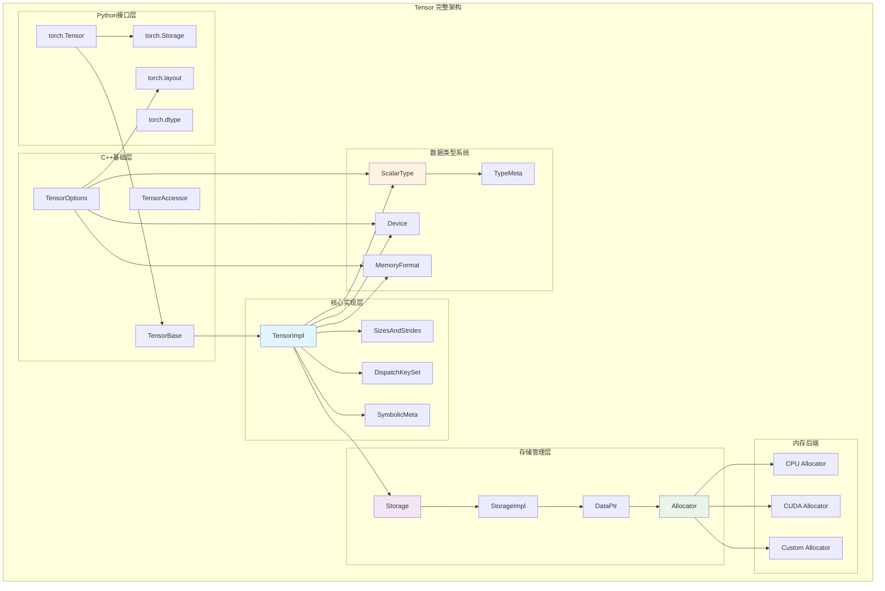
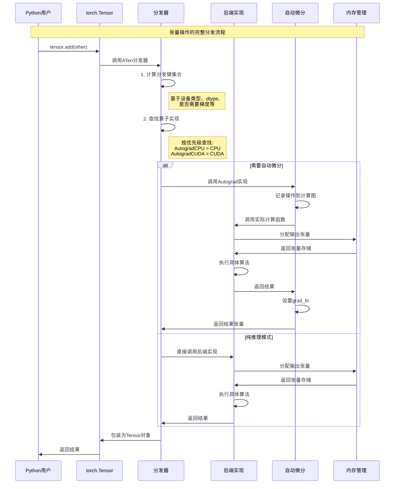

## 概述

Tensor是PyTorch的核心数据结构，承载着所有数值计算和深度学习操作。深入剖析Tensor的完整实现架构，从底层的Storage存储系统到高层的Python接口，揭示PyTorch如何实现高效的张量操作和内存管理。

<!--more-->

## 1. Tensor架构层次

### 1.1 核心组件关系

PyTorch的Tensor系统采用多层架构设计：

```
┌─────────────────────────────────────────┐
│           Python torch.Tensor           │ ← Python用户接口
├─────────────────────────────────────────┤
│          TensorBase C++ 接口            │ ← C++基础接口
├─────────────────────────────────────────┤
│           TensorImpl 核心               │ ← 张量实现核心
├─────────────────────────────────────────┤
│            Storage 存储层               │ ← 数据存储管理
├─────────────────────────────────────────┤
│          StorageImpl 存储实现           │ ← 底层存储实现
├─────────────────────────────────────────┤
│            DataPtr 数据指针             │ ← 内存数据指针
└─────────────────────────────────────────┘
```

### 1.2 Tensor系统架构图



## 2. TensorImpl 核心数据结构

### 2.1 TensorImpl 完整定义

TensorImpl是Tensor的核心实现，包含了张量的所有元数据：

```cpp
class C10_API TensorImpl : public c10::intrusive_ptr_target {
 private:
  // 1. 存储相关
  Storage storage_;                    // 底层数据存储
  
  // 2. 形状和步长信息  
  c10::impl::SizesAndStrides sizes_and_strides_;  // 尺寸和步长
  SymInt storage_offset_;              // 存储偏移量
  
  // 3. 类型和设备信息
  ScalarType dtype_;                   // 数据类型（float32、int64等）
  Device device_;                      // 设备信息（CPU、CUDA等）
  
  // 4. 分发和优化相关
  DispatchKeySet key_set_;             // 分发键集合
  MemoryFormat memory_format_;         // 内存格式（连续、NHWC等）
  
  // 5. 梯度和版本管理
  std::unique_ptr<c10::impl::PyObjectSlot> pyobj_slot_;  // Python对象槽
  c10::impl::NamedTensorMetaInterface* named_tensor_meta_; // 命名张量元数据
  c10::VariableVersion version_counter_;  // 版本计数器
  c10::impl::AutogradMetaInterface* autograd_meta_;  // 自动微分元数据

 public:
  // 构造函数 - 创建具有给定存储和选项的张量
  TensorImpl(
      Storage&& storage,
      DispatchKeySet key_set,
      const caffe2::TypeMeta& data_type
  );
  
  // 获取底层存储
  const Storage& storage() const { return storage_; }
  
  // 获取张量维度
  int64_t dim() const { return sizes_and_strides_.size(); }
  
  // 获取形状信息
  IntArrayRef sizes() const {
    return IntArrayRef{
        sizes_and_strides_.sizes_data(), 
        sizes_and_strides_.size()
    };
  }
  
  // 获取步长信息
  IntArrayRef strides() const {
    return IntArrayRef{
        sizes_and_strides_.strides_data(),
        sizes_and_strides_.size()
    };
  }
  
  // 获取元素总数
  int64_t numel() const {
    return c10::size_to_dim_(dim(), sizes());
  }
  
  // 检查张量是否连续
  bool is_contiguous(at::MemoryFormat memory_format = at::MemoryFormat::Contiguous) const;
  
  // 调整张量大小
  virtual void resize_(IntArrayRef size, std::optional<IntArrayRef> stride = std::nullopt);
  
  // 其他核心方法...
};
```

**TensorImpl关键字段详解**：

1. **storage_**: 指向底层数据存储的Storage对象
2. **sizes_and_strides_**: 高效存储张量形状和步长的数据结构
3. **storage_offset_**: 在存储中的字节偏移量，支持视图操作
4. **key_set_**: 分发键集合，决定操作如何分发到具体后端
5. **dtype_**: 张量的数据类型，如float32、int64等
6. **device_**: 张量所在的设备，如CPU、CUDA:0等

### 2.2 SizesAndStrides 优化结构

PyTorch使用专门的数据结构来高效存储张量的形状和步长信息：

```cpp
namespace c10::impl {

class SizesAndStrides {
 private:
  // 小张量优化：直接在对象内存储而非堆分配
  static constexpr size_t kInlineStorageSize = 5;
  
  // 联合体优化内存使用
  union {
    int64_t inline_storage_[kInlineStorageSize];  // 内联存储
    int64_t* heap_storage_;                       // 堆存储指针
  };
  
  uint8_t size_;           // 维度数量
  bool is_heap_allocated_; // 是否使用堆分配

 public:
  // 构造函数
  explicit SizesAndStrides(size_t size) : size_(size) {
    if (C10_LIKELY(size <= kInlineStorageSize)) {
      // 小张量使用栈内存，性能更好
      is_heap_allocated_ = false;
    } else {
      // 大张量使用堆内存
      is_heap_allocated_ = true;
      heap_storage_ = static_cast<int64_t*>(
          std::malloc(sizeof(int64_t) * size * 2)  // size + strides
      );
    }
  }
  
  // 获取形状数据指针
  const int64_t* sizes_data() const noexcept {
    return is_heap_allocated_ ? heap_storage_ : inline_storage_;
  }
  
  // 获取步长数据指针  
  const int64_t* strides_data() const noexcept {
    const int64_t* base = sizes_data();
    return base + size_;  // 步长紧跟在形状之后
  }
  
  // 设置形状信息
  void set_sizes(IntArrayRef newSizes) {
    TORCH_CHECK(newSizes.size() == size_);
    std::copy(newSizes.begin(), newSizes.end(), sizes_data_non_const());
  }
};

} // namespace c10::impl
```

**SizesAndStrides设计亮点**：

- **小对象优化**: 5维以内的张量直接在对象内存储，避免堆分配
- **内存局部性**: 形状和步长数据连续存储，提升缓存命中率  
- **零开销抽象**: 提供统一接口，编译器可完全内联优化

## 3. Storage存储系统深度解析

### 3.1 Storage核心架构

Storage是PyTorch中管理原始数据的抽象，实现了引用计数的内存管理：

```cpp
namespace c10 {

// Storage 接口类 - 提供统一的存储访问接口
struct C10_API Storage {
 private:
  c10::intrusive_ptr<StorageImpl> storage_impl_;  // 指向具体实现
  
 public:
  // 默认构造函数 - 创建空存储
  Storage() = default;
  
  // 从StorageImpl构造
  Storage(c10::intrusive_ptr<StorageImpl> ptr) 
      : storage_impl_(std::move(ptr)) {}
  
  // 使用字节大小创建存储
  Storage(
      use_byte_size_t /*use_byte_size*/,
      const SymInt& size_bytes,
      Allocator* allocator = nullptr,
      bool resizable = false
  ) : storage_impl_(c10::make_intrusive<StorageImpl>(
          StorageImpl::use_byte_size_t(),
          size_bytes,
          allocator,
          resizable)) {}
  
  // 使用预分配内存创建存储  
  Storage(
      use_byte_size_t /*use_byte_size*/,
      size_t size_bytes,
      at::DataPtr data_ptr,
      at::Allocator* allocator = nullptr,
      bool resizable = false
  );
  
  // 核心访问方法
  void* mutable_data() const { return storage_impl_->mutable_data(); }
  const void* data() const { return storage_impl_->data(); }
  
  SymInt nbytes() const { return storage_impl_->nbytes(); }
  Device device() const { return storage_impl_->device(); }
  
  bool resizable() const { return storage_impl_->resizable(); }
  Allocator* allocator() { return storage_impl_->allocator(); }
  
  // 引用计数管理
  bool unique() const { return storage_impl_.use_count() == 1; }
  int use_count() const { return storage_impl_.use_count(); }
};

} // namespace c10
```

### 3.2 StorageImpl详细实现

StorageImpl是存储的具体实现，管理实际的内存分配和生命周期：

```cpp
struct C10_API StorageImpl : public c10::intrusive_ptr_target {
 private:
  // 核心数据成员
  DataPtr data_ptr_;                    // 数据指针（包含删除器）
  SymInt size_bytes_;                   // 字节大小（支持符号整数）
  bool size_bytes_is_heap_allocated_;   // 大小是否堆分配
  bool resizable_;                      // 是否可调整大小
  bool received_cuda_;                  // 是否接收过CUDA数据
  Allocator* allocator_;                // 内存分配器
  
  // 扩展元数据（用于错误处理等）
  std::unique_ptr<StorageExtraMeta> extra_meta_;
  
 public:
  // 构造函数 - 使用字节大小和数据指针
  StorageImpl(
      use_byte_size_t /*use_byte_size*/,
      SymInt size_bytes,
      at::DataPtr data_ptr,
      at::Allocator* allocator,
      bool resizable
  ) : data_ptr_(std::move(data_ptr)),
      size_bytes_(std::move(size_bytes)),
      size_bytes_is_heap_allocated_(size_bytes_.is_heap_allocated()),
      resizable_(resizable),
      received_cuda_(false),
      allocator_(allocator) {
    
    // 可调整大小的存储必须有分配器
    if (resizable) {
      TORCH_INTERNAL_ASSERT(
          allocator_, 
          "For resizable storage, allocator must be provided"
      );
    }
    refresh_has_data_ptr_check();
  }
  
  // 获取原始数据指针
  void* data() {
    if (!has_data_ptr_check_) [[unlikely]] {
      check_data_ptr();
    }
    return data_ptr_.get();
  }
  
  // 获取字节大小
  SymInt nbytes() const {
    return size_bytes_;
  }
  
  // 调整存储大小
  void resize_(const SymInt& new_size_bytes) {
    TORCH_CHECK(resizable(), "Trying to resize storage that is not resizable");
    
    if (new_size_bytes == 0) {
      // 大小为0时释放内存但保留分配器
      data_ptr_ = allocator_->allocate(0);
    } else {
      // 重新分配内存
      DataPtr new_data = allocator_->allocate(new_size_bytes.as_int_unchecked());
      
      // 如果有旧数据，拷贝到新内存（取较小值）
      if (data_ptr_) {
        auto old_size = size_bytes_.as_int_unchecked();
        auto copy_size = std::min(old_size, new_size_bytes.as_int_unchecked());
        if (copy_size > 0) {
          std::memcpy(new_data.get(), data_ptr_.get(), copy_size);
        }
      }
      
      data_ptr_ = std::move(new_data);
    }
    
    size_bytes_ = new_size_bytes;
    refresh_has_data_ptr_check();
  }
  
  // 设备信息
  Device device() const {
    return data_ptr_.device();
  }
  
  // 分配器信息
  Allocator* allocator() {
    return allocator_;
  }
  
 private:
  // 检查数据指针有效性
  void check_data_ptr() {
    if (extra_meta_ && extra_meta_->custom_data_ptr_error_msg_) {
      TORCH_CHECK(false, extra_meta_->custom_data_ptr_error_msg_.value());
    }
    if (!data_ptr_) {
      throwNullDataPtrError();
    }
  }
  
  // 刷新数据指针检查状态
  void refresh_has_data_ptr_check() {
    has_data_ptr_check_ = (!extra_meta_ || !extra_meta_->custom_data_ptr_error_msg_) && data_ptr_;
  }
};
```

**StorageImpl关键特性**：

1. **引用计数管理**: 继承自intrusive_ptr_target，自动管理生命周期
2. **符号整数支持**: size_bytes_支持符号整数，用于动态形状
3. **可调整大小**: 支持运行时调整存储大小，用于动态张量
4. **设备感知**: 通过DataPtr管理不同设备的内存
5. **错误处理**: 通过extra_meta_提供定制化错误信息

## 4. DataPtr和内存分配器

### 4.1 DataPtr智能指针

DataPtr是PyTorch中管理设备内存的智能指针：

```cpp
namespace at {

// DataPtr - 设备感知的智能指针
class DataPtr {
 private:
  void* ptr_;                    // 原始指针
  std::unique_ptr<void, DeleterFnPtr> ctx_;  // 删除器上下文
  Device device_;                // 设备信息
  
 public:
  // 构造函数
  DataPtr(void* data, Device device) 
      : ptr_(data), device_(device) {}
      
  DataPtr(void* data, void* ctx, DeleterFnPtr deleter, Device device)
      : ptr_(data), 
        ctx_(ctx, deleter),
        device_(device) {}
  
  // 移动构造和赋值
  DataPtr(DataPtr&& other) noexcept
      : ptr_(other.ptr_), 
        ctx_(std::move(other.ctx_)), 
        device_(other.device_) {
    other.ptr_ = nullptr;
  }
  
  // 获取原始指针
  void* get() const { return ptr_; }
  
  // 释放所有权
  void* release() noexcept {
    ctx_.release();
    auto result = ptr_;
    ptr_ = nullptr;
    return result;
  }
  
  // 获取设备信息
  Device device() const { return device_; }
  
  // 重置指针
  void clear() {
    ctx_.reset();
    ptr_ = nullptr;
  }
  
  // 类型转换
  template<typename T>
  T* get() const { return static_cast<T*>(ptr_); }
  
  // 布尔转换
  explicit operator bool() const { return ptr_ != nullptr; }
};

} // namespace at
```

### 4.2 内存分配器体系

PyTorch提供了多种内存分配器以适应不同的使用场景：

```cpp
namespace c10 {

// 抽象分配器接口
class C10_API Allocator {
 public:
  virtual ~Allocator() = default;
  
  // 分配内存
  virtual DataPtr allocate(size_t n) const = 0;
  
  // 获取删除器函数指针
  virtual DeleterFnPtr raw_deleter() const { 
    return nullptr; 
  }
  
  // 复制数据（可选优化）
  virtual void copy_data(void* dest, const void* src, std::size_t count) const {
    std::memcpy(dest, src, count);
  }
};

// CPU默认分配器
class DefaultCPUAllocator : public Allocator {
 public:
  DataPtr allocate(size_t nbytes) const override {
    void* data = aligned_alloc(gAlignment, nbytes);
    if (!data) {
      TORCH_CHECK(false, "DefaultCPUAllocator: can't allocate memory");
    }
    return {data, data, &free, kCPU};
  }
  
  DeleterFnPtr raw_deleter() const override {
    return &free;
  }
};

// CPU缓存分配器 - 减少分配/释放开销
class CPUCachingAllocator : public Allocator {
 private:
  // 内存块结构
  struct Block {
    void* ptr;
    size_t size;
    bool in_use;
  };
  
  mutable std::mutex mutex_;
  mutable std::vector<Block> cached_blocks_;
  
 public:
  DataPtr allocate(size_t nbytes) const override {
    std::lock_guard<std::mutex> lock(mutex_);
    
    // 1. 尝试从缓存中找到合适的块
    auto it = std::find_if(cached_blocks_.begin(), cached_blocks_.end(),
        [nbytes](const Block& block) {
          return !block.in_use && block.size >= nbytes;
        });
    
    if (it != cached_blocks_.end()) {
      // 找到缓存块，标记为使用中
      it->in_use = true;
      return {it->ptr, this, &CPUCachingAllocator::free_cached, kCPU};
    }
    
    // 2. 没有合适的缓存，分配新内存
    void* ptr = aligned_alloc(gAlignment, nbytes);
    if (!ptr) {
      TORCH_CHECK(false, "CPUCachingAllocator: allocation failed");
    }
    
    // 添加到缓存中
    cached_blocks_.push_back({ptr, nbytes, true});
    
    return {ptr, this, &CPUCachingAllocator::free_cached, kCPU};
  }
  
  // 释放内存到缓存
  static void free_cached(void* ctx, void* ptr) {
    auto* allocator = static_cast<CPUCachingAllocator*>(ctx);
    std::lock_guard<std::mutex> lock(allocator->mutex_);
    
    auto it = std::find_if(allocator->cached_blocks_.begin(), 
                          allocator->cached_blocks_.end(),
        [ptr](const Block& block) {
          return block.ptr == ptr;
        });
    
    if (it != allocator->cached_blocks_.end()) {
      it->in_use = false;  // 标记为可用，不实际释放
    }
  }
};

} // namespace c10
```

**分配器设计特点**：

1. **接口统一**: 所有分配器实现相同的Allocator接口
2. **设备感知**: DataPtr包含设备信息，支持跨设备内存管理
3. **性能优化**: 缓存分配器减少系统调用开销
4. **可扩展**: 支持自定义分配器，如内存池、GPU分配器等

## 5. 张量视图机制

### 5.1 视图创建原理

PyTorch的视图机制允许多个张量共享同一份数据，实现零拷贝操作：

```cpp
// 视图创建的核心逻辑
Tensor TensorImpl::create_view(
    IntArrayRef size,
    IntArrayRef stride, 
    int64_t storage_offset
) {
  // 1. 创建新的TensorImpl，但共享Storage
  auto impl = c10::make_intrusive<TensorImpl>(
      Storage(storage()),           // 共享底层存储
      key_set(),                   // 继承分发键
      dtype()                      // 继承数据类型
  );
  
  // 2. 设置新的形状和步长
  impl->set_sizes_and_strides(size, stride);
  impl->set_storage_offset(storage_offset);
  
  // 3. 继承其他属性
  impl->set_device(device());
  impl->set_layout(layout());
  
  // 4. 返回包装的Tensor对象
  return at::detail::make_tensor<TensorImpl>(std::move(impl));
}

// 常见视图操作的实现
namespace at::native {

// 切片操作 - tensor[start:end]
Tensor slice(const Tensor& self, int64_t dim, int64_t start, int64_t end, int64_t step) {
  // 计算新的形状
  auto sizes = self.sizes().vec();
  sizes[dim] = (end - start + step - 1) / step;
  
  // 计算新的步长
  auto strides = self.strides().vec(); 
  strides[dim] *= step;
  
  // 计算存储偏移
  auto offset = self.storage_offset() + start * self.stride(dim);
  
  // 创建视图
  return self.as_strided(sizes, strides, offset);
}

// 转置操作 - tensor.t()  
Tensor transpose(const Tensor& self, int64_t dim0, int64_t dim1) {
  auto sizes = self.sizes().vec();
  auto strides = self.strides().vec();
  
  // 交换指定维度的尺寸和步长
  std::swap(sizes[dim0], sizes[dim1]);
  std::swap(strides[dim0], strides[dim1]);
  
  // 创建视图（共享存储，不同形状）
  return self.as_strided(sizes, strides, self.storage_offset());
}

// reshape操作 - 改变形状
Tensor reshape(const Tensor& self, IntArrayRef shape) {
  // 1. 检查元素总数是否匹配
  auto numel = c10::multiply_integers(shape);
  TORCH_CHECK(numel == self.numel(), "reshape: incompatible shape");
  
  // 2. 如果可能，尝试创建视图
  auto stride = compute_stride_for_reshape(self, shape);
  if (stride.has_value()) {
    return self.as_strided(shape, *stride, self.storage_offset());
  }
  
  // 3. 否则，需要拷贝数据并重新排列
  return self.contiguous().view(shape);
}

} // namespace at::native
```

### 5.2 步长计算与内存布局

步长（stride）是PyTorch实现高效视图的核心概念：

```cpp
namespace c10 {

// 计算连续张量的默认步长
std::vector<int64_t> compute_contiguous_strides(IntArrayRef sizes) {
  std::vector<int64_t> strides(sizes.size());
  
  // 从最后一维开始，步长为1
  strides.back() = 1;
  
  // 向前计算每一维的步长
  for (int i = static_cast<int>(sizes.size()) - 2; i >= 0; --i) {
    strides[i] = strides[i + 1] * sizes[i + 1];
  }
  
  return strides;
}

// 示例：形状为[2,3,4]的张量
// sizes = [2, 3, 4]
// strides = [12, 4, 1]  // 12=3*4, 4=4*1, 1
// 元素[i,j,k]在内存中的位置 = i*12 + j*4 + k*1

// 计算NHWC格式的步长（通道优先）
std::vector<int64_t> compute_channels_last_strides(IntArrayRef sizes) {
  TORCH_CHECK(sizes.size() == 4, "channels_last only supports 4D tensors");
  
  auto N = sizes[0], C = sizes[1], H = sizes[2], W = sizes[3];
  
  // NHWC布局：步长为[H*W*C, 1, W*C, C]
  return {H * W * C, 1, W * C, C};
}

// 检查张量是否连续
bool is_contiguous_with_format(
    IntArrayRef sizes,
    IntArrayRef strides,
    MemoryFormat memory_format
) {
  switch (memory_format) {
    case MemoryFormat::Contiguous: {
      auto expected_strides = compute_contiguous_strides(sizes);
      return strides == expected_strides;
    }
    
    case MemoryFormat::ChannelsLast: {
      if (sizes.size() != 4) return false;
      auto expected_strides = compute_channels_last_strides(sizes);
      return strides == expected_strides;
    }
    
    default:
      return false;
  }
}

} // namespace c10
```

**视图机制的关键优势**：

1. **零拷贝**: 视图操作不复制数据，只改变元数据
2. **内存高效**: 多个视图共享同一存储，节省内存
3. **操作灵活**: 支持切片、转置、reshape等多种变换
4. **性能优异**: 视图创建时间复杂度O(1)

## 6. 张量操作的关键路径

### 6.1 连续性检查与优化

```cpp
namespace at {

// 连续性检查的核心实现（bool TensorBase::is_contiguous_or_false(MemoryFormat memory_format) const {
  if (impl_->is_contiguous_default()) {
    // 快速路径：如果已知是默认连续的
    return memory_format == MemoryFormat::Contiguous;
  }
  
  // 详细检查连续性
  return impl_->is_contiguous_memory_format(memory_format);
}

// 高效的连续化操作
TensorBase TensorBase::contiguous(MemoryFormat memory_format) const {
  if (is_contiguous_or_false(memory_format)) {
    // 已经连续，直接返回（避免不必要的拷贝）
    return *this;
  } else {
    // 需要重新排列内存布局
    return __dispatch_contiguous(memory_format);
  }
}

// expect_contiguous：性能优化的连续性检查
c10::MaybeOwned<TensorBase> TensorBase::expect_contiguous(
    MemoryFormat memory_format) const & {
  
  if (is_contiguous_or_false(memory_format)) {
    // 已经连续，返回借用的引用（避免引用计数开销）
    return c10::MaybeOwned<TensorBase>::borrowed(*this);
  } else {
    // 需要创建连续版本，返回拥有的副本
    return c10::MaybeOwned<TensorBase>::owned(__dispatch_contiguous(memory_format));
  }
}

} // namespace at
```

**连续性优化的关键点**：

1. **快速路径检查**: 通过缓存的连续性标志避免重复计算
2. **借用语义**: expect_contiguous使用MaybeOwned避免不必要的引用计数操作
3. **内存格式感知**: 支持NCHW、NHWC等多种内存布局的连续性检查
4. **惰性计算**: 只有在真正需要时才执行昂贵的内存重排操作

### 6.2 stride计算的数学原理

根据析，stride（步长）计算是张量视图操作的数学基础：

```cpp
namespace c10 {

// stride计算的完整数学原理（总结）
class StrideCalculator {
 public:
  // 计算连续张量的步长
  static std::vector<int64_t> contiguous_strides(IntArrayRef sizes) {
    /*
     * 连续张量的步长计算公式：
     * stride[i] = ∏(j=i+1 to n-1) size[j]
     * 
     * 例如：shape=[2,3,4]
     * stride[2] = 1                    // 最后一维步长为1
     * stride[1] = size[2] = 4          // 倒数第二维
     * stride[0] = size[1]*size[2] = 12 // 第一维
     */
    
    const int64_t ndim = sizes.size();
    if (ndim == 0) return {};
    
    std::vector<int64_t> strides(ndim);
    strides[ndim - 1] = 1;  // 最后一维步长为1
    
    // 从后向前计算步长
    for (int64_t i = ndim - 2; i >= 0; --i) {
      strides[i] = strides[i + 1] * sizes[i + 1];
    }
    
    return strides;
  }
  
  // 计算通道最后格式(NHWC)的步长
  static std::vector<int64_t> channels_last_strides(IntArrayRef sizes) {
    /*
     * NHWC格式的步长计算：
     * - N(batch): stride = H * W * C
     * - H(height): stride = W * C  
     * - W(width): stride = C
     * - C(channel): stride = 1
     */
    
    TORCH_CHECK(sizes.size() == 4, "channels_last requires 4D tensor");
    
    const int64_t N = sizes[0], C = sizes[1], H = sizes[2], W = sizes[3];
    return {H * W * C, 1, W * C, C};
  }
  
  // 计算3D通道最后格式的步长
  static std::vector<int64_t> channels_last_3d_strides(IntArrayRef sizes) {
    /*
     * NDHWC格式的步长计算：
     * - N: stride = D * H * W * C
     * - D: stride = H * W * C
     * - H: stride = W * C
     * - W: stride = C
     * - C: stride = 1
     */
    
    TORCH_CHECK(sizes.size() == 5, "channels_last_3d requires 5D tensor");
    
    const int64_t N = sizes[0], C = sizes[1], D = sizes[2], H = sizes[3], W = sizes[4];
    return {D * H * W * C, 1, H * W * C, W * C, C};
  }
  
  static bool are_strides_valid(IntArrayRef sizes, IntArrayRef strides) {
    if (sizes.size() != strides.size()) return false;
    
    // 检查步长的数学约束
    for (size_t i = 0; i < sizes.size(); ++i) {
      // 大小为0或1的维度，步长可以是任意值
      if (sizes[i] <= 1) continue;
      
      // 步长不能为负数
      if (strides[i] < 0) return false;
      
      // 步长为0时，该维度大小必须为1
      if (strides[i] == 0 && sizes[i] > 1) return false;
    }
    
    return true;
  }
};

} // namespace c10
```

### 6.3 元素访问机制

PyTorch提供了多种高效的张量元素访问方式：

```cpp
namespace at {

// TensorAccessor - 提供类型安全的多维数组访问
template<typename T, size_t N, template<typename U> class PtrTraits = DefaultPtrTraits>
class TensorAccessor {
 private:
  T* data_;                     // 数据指针
  int64_t sizes_[N];           // 各维大小
  int64_t strides_[N];         // 各维步长
  
 public:
  TensorAccessor(T* data, IntArrayRef sizes, IntArrayRef strides) 
      : data_(data) {
    TORCH_CHECK(sizes.size() == N && strides.size() == N);
    std::copy(sizes.begin(), sizes.end(), sizes_);
    std::copy(strides.begin(), strides.end(), strides_);
  }
  
  // 多维访问操作符
  template<typename... Args>
  T& operator()(Args... indices) {
    static_assert(sizeof...(Args) == N, "Wrong number of indices");
    return data_[compute_offset(indices...)];
  }
  
  // 单维访问（递归返回低维Accessor）
  TensorAccessor<T, N-1, PtrTraits> operator[](int64_t i) {
    return TensorAccessor<T, N-1, PtrTraits>(
        data_ + i * strides_[0],
        sizes_ + 1,
        strides_ + 1
    );
  }
  
 private:
  // 计算线性偏移
  template<typename... Args>
  int64_t compute_offset(int64_t first, Args... rest) {
    return first * strides_[N - sizeof...(Args) - 1] + 
           compute_offset_impl<sizeof...(Args)>(rest...);
  }
  
  template<size_t remaining, typename... Args>
  int64_t compute_offset_impl(int64_t first, Args... rest) {
    if constexpr (remaining == 1) {
      return first * strides_[N - 1];
    } else {
      return first * strides_[N - remaining] + 
             compute_offset_impl<remaining - 1>(rest...);
    }
  }
};

// 使用示例
void example_tensor_access() {
  auto tensor = torch::rand({3, 4, 5});
  
  // 获取类型安全的访问器
  auto accessor = tensor.accessor<float, 3>();
  
  // 直接多维访问
  float value = accessor(1, 2, 3);  // 等价于 tensor[1][2][3]
  
  // 层次化访问
  auto slice = accessor[1];         // 得到2D accessor
  float value2 = slice(2, 3);       // 等价于 tensor[1][2][3]
}

} // namespace at
```

### 6.2 张量创建流程详解

张量创建涉及多个步骤，从Python接口到底层内存分配：

```cpp
// 张量创建的完整流程
namespace torch {

// Python API: torch.tensor([1, 2, 3])
Tensor tensor_from_data(py::object data, py::object dtype_obj, py::object device_obj) {
  // 1. 解析Python参数
  auto dtype = dtype_obj.is_none() ? infer_dtype(data) : to_scalar_type(dtype_obj);
  auto device = device_obj.is_none() ? Device(kCPU) : to_device(device_obj);
  
  // 2. 解析数据结构，推断形状
  auto parsed = parse_python_scalars_and_tensors(data);
  auto sizes = parsed.sizes;
  auto scalar_list = parsed.scalars;
  
  // 3. 计算总元素数
  auto numel = c10::multiply_integers(sizes);
  
  // 4. 分配存储空间
  auto dtype_size = scalarTypeToTypeMeta(dtype).itemsize();
  auto nbytes = numel * dtype_size;
  
  auto allocator = GetAllocator(device.type());
  auto storage = c10::make_intrusive<c10::StorageImpl>(
      c10::StorageImpl::use_byte_size_t(),
      nbytes,
      allocator->allocate(nbytes),
      allocator,
      /*resizable=*/true
  );
  
  // 5. 创建TensorImpl
  auto tensor_impl = c10::make_intrusive<c10::TensorImpl>(
      c10::Storage(storage),
      compute_dispatch_key_set(dtype, device),
      scalarTypeToTypeMeta(dtype)
  );
  
  // 6. 设置形状信息
  tensor_impl->set_sizes_and_strides(sizes, compute_contiguous_strides(sizes));
  
  // 7. 填充数据
  fill_tensor_from_scalars(tensor_impl.get(), scalar_list, dtype);
  
  // 8. 返回包装的Tensor对象
  return at::detail::make_tensor<c10::TensorImpl>(std::move(tensor_impl));
}

// 数据填充函数
void fill_tensor_from_scalars(c10::TensorImpl* impl, 
                             const std::vector<at::Scalar>& scalars, 
                             c10::ScalarType dtype) {
  auto data_ptr = impl->storage().mutable_data();
  
  // 根据数据类型进行特化处理
  AT_DISPATCH_ALL_TYPES_AND_COMPLEX_AND3(
      c10::kHalf, c10::kBFloat16, c10::kBool, dtype, "fill_from_scalars", [&] {
        auto typed_data = static_cast<scalar_t*>(data_ptr);
        for (size_t i = 0; i < scalars.size(); ++i) {
          typed_data[i] = scalars[i].to<scalar_t>();
        }
      });
}

} // namespace torch
```

### 6.3 算子分发流程

当调用张量操作时，PyTorch会通过复杂的分发机制找到对应的实现：



## 7. 内存优化技术

### 7.1 写时拷贝（Copy-on-Write）

PyTorch实现了写时拷贝机制来优化内存使用：

```cpp
namespace c10::impl {

// COW（Copy-on-Write）上下文
class COWDeleterContext {
 private:
  std::shared_ptr<void> original_data_;  // 原始数据的共享指针
  size_t original_size_;                 // 原始数据大小
  Device device_;                        // 设备信息
  
 public:
  COWDeleterContext(std::shared_ptr<void> data, size_t size, Device device)
      : original_data_(std::move(data)), original_size_(size), device_(device) {}
  
  // 当需要修改数据时，执行实际拷贝
  static void deleter_function(void* ctx, void* data_ptr) {
    auto* cow_ctx = static_cast<COWDeleterContext*>(ctx);
    
    // 如果是唯一引用，直接释放
    if (cow_ctx->original_data_.use_count() == 1) {
      // 正常释放逻辑
      GetAllocator(cow_ctx->device_.type())->raw_deleter()(data_ptr);
    }
    
    delete cow_ctx;
  }
  
  // 检查是否需要拷贝
  bool needs_cow() const {
    return original_data_.use_count() > 1;
  }
  
  // 执行写时拷贝
  DataPtr make_cow_copy() {
    auto allocator = GetAllocator(device_.type());
    auto new_data = allocator->allocate(original_size_);
    
    // 拷贝原始数据
    std::memcpy(new_data.get(), original_data_.get(), original_size_);
    
    return new_data;
  }
};

} // namespace c10::impl
```

### 7.2 CUDA缓存分配器详解

```cpp
namespace c10::cuda::CUDACachingAllocator {

// CUDA缓存分配器的核心数据结构（源码深度分析）
struct Block {
  size_t size;                    // 块大小
  size_t requested_size;          // 实际请求大小
  void* ptr;                      // 数据指针
  cudaStream_t stream;            // 关联的CUDA流
  bool allocated;                 // 是否已分配
  bool active;                    // 是否活跃使用
  c10::DeviceIndex device;        // 设备索引
  
  // 内存池相关
  MempoolId_t owner_private_pool_id;  // 私有池ID
  
  // 分割和合并支持
  Block* prev;                    // 前一个块（用于合并）
  Block* next;                    // 后一个块（用于合并）
  
  // 流相关的引用计数
  std::unordered_set<c10::cuda::CUDAStream> stream_uses;
  
  // 垃圾回收计数器
  int32_t gc_counter;
  
  // 构造函数
  Block(
      size_t size,
      size_t requested_size, 
      void* ptr,
      cudaStream_t stream,
      c10::DeviceIndex device)
      : size(size),
        requested_size(requested_size),
        ptr(ptr),
        stream(stream),
        allocated(true),
        active(true),
        device(device),
        prev(nullptr),
        next(nullptr),
        gc_counter(0) {}
};

// 内存段管理（源码分析：大块内存的管理策略）
struct Segment {
  c10::DeviceIndex device;        // 设备索引
  size_t address;                 // 内存地址
  size_t total_size;              // 总大小
  size_t allocated_size;          // 已分配大小
  size_t active_size;             // 活跃使用大小
  cudaStream_t stream;            // 创建时的流
  bool is_large;                  // 是否为大段
  bool is_expandable;             // 是否可扩展
  
  std::vector<Block*> blocks;     // 包含的块列表
  
  // 查找可用的块
  Block* find_available_block(size_t requested_size) {
    for (auto* block : blocks) {
      if (!block->allocated && block->size >= requested_size) {
        return block;
      }
    }
    return nullptr;
  }
  
  // 分割块
  Block* split_block(Block* block, size_t size) {
    if (block->size <= size) {
      return block;  // 无需分割
    }
    
    // 创建新块用于剩余空间
    size_t remaining_size = block->size - size;
    void* remaining_ptr = static_cast<char*>(block->ptr) + size;
    
    auto* new_block = new Block(
        remaining_size,
        0,  // requested_size为0表示这是分割产生的块
        remaining_ptr,
        block->stream,
        block->device
    );
    
    new_block->allocated = false;
    new_block->active = false;
    
    // 更新原块大小
    block->size = size;
    
    // 插入到块列表中
    blocks.insert(
        std::find(blocks.begin(), blocks.end(), block) + 1,
        new_block
    );
    
    return block;
  }
  
  // 合并相邻的空闲块
  void merge_free_blocks() {
    for (size_t i = 0; i < blocks.size() - 1; ++i) {
      auto* current = blocks[i];
      auto* next = blocks[i + 1];
      
      if (!current->allocated && !next->allocated) {
        // 检查是否相邻
        if (static_cast<char*>(current->ptr) + current->size == next->ptr) {
          // 合并块
          current->size += next->size;
          
          // 移除下一个块
          blocks.erase(blocks.begin() + i + 1);
          delete next;
          
          // 重新检查当前位置
          --i;
        }
      }
    }
  }
};

// 缓存分配器的核心算法（深度源码分析）
class CachingAllocatorImpl {
 private:
  // 设备特定的分配器状态
  struct DeviceAllocatorState {
    // 分大小范围的空闲块列表
    std::map<size_t, std::set<Block*>> large_free_blocks;    // 大块 (>1MB)
    std::map<size_t, std::set<Block*>> small_free_blocks;    // 小块 (<=1MB)
    
    // 活跃块列表
    std::unordered_set<Block*> active_blocks;
    
    // 内存段列表
    std::vector<std::unique_ptr<Segment>> segments;
    
    // 统计信息
    size_t allocated_size = 0;
    size_t reserved_size = 0;
    size_t peak_allocated_size = 0;
    size_t peak_reserved_size = 0;
    
    // 垃圾回收相关
    std::atomic<size_t> garbage_collect_threshold{1024 * 1024 * 1024};  // 1GB
  };
  
  // 每个设备的状态
  std::vector<DeviceAllocatorState> device_allocator_states_;
  
  // 全局锁
  mutable std::recursive_mutex mutex_;
  
 public:
  // 分配内存的核心算法
  DataPtr allocate(size_t requested_size) {
    // 对齐大小到最近的512字节边界（GPU内存对齐优化）
    size_t size = round_size(requested_size);
    
    auto device = c10::cuda::current_device();
    std::lock_guard<std::recursive_mutex> lock(mutex_);
    
    auto& state = device_allocator_states_[device];
    
    // 1. 尝试从空闲块中分配
    Block* block = find_free_block(state, size);
    if (block) {
      return allocate_from_block(block, requested_size);
    }
    
    // 2. 尝试垃圾回收
    bool freed_memory = garbage_collect_cached_blocks(state);
    if (freed_memory) {
      block = find_free_block(state, size);
      if (block) {
        return allocate_from_block(block, requested_size);
      }
    }
    
    // 3. 分配新的内存段
    return allocate_new_segment(state, size, requested_size);
  }
  
  // 释放内存（实际加入缓存）
  void deallocate(void* ptr) {
    if (!ptr) return;
    
    std::lock_guard<std::recursive_mutex> lock(mutex_);
    
    auto* block = find_allocated_block(ptr);
    if (!block) {
      throw std::runtime_error("Invalid memory pointer for deallocation");
    }
    
    // 标记为空闲但保留在缓存中
    block->allocated = false;
    block->active = false;
    
    // 将块加入到空闲列表
    auto device = block->device;
    auto& state = device_allocator_states_[device];
    
    if (block->size >= kLargeBuffer) {
      state.large_free_blocks[block->size].insert(block);
    } else {
      state.small_free_blocks[block->size].insert(block);
    }
    
    // 尝试与相邻块合并
    try_merge_blocks(block);
  }
  
 private:
  // 查找合适的空闲块
  Block* find_free_block(DeviceAllocatorState& state, size_t size) {
    // 根据大小选择合适的空闲列表
    auto& free_blocks = (size >= kLargeBuffer) ? 
        state.large_free_blocks : state.small_free_blocks;
    
    // 查找最小的合适块（最佳适配算法）
    auto it = free_blocks.lower_bound(size);
    if (it != free_blocks.end() && !it->second.empty()) {
      Block* block = *it->second.begin();
      it->second.erase(it->second.begin());
      
      // 如果块太大，考虑分割
      if (block->size > size * 2) {
        split_block(block, size);
      }
      
      return block;
    }
    
    return nullptr;
  }
  
  // 垃圾回收算法
  bool garbage_collect_cached_blocks(DeviceAllocatorState& state) {
    size_t freed_bytes = 0;
    
    // 收集过期的空闲块
    auto collect_from_map = [&](auto& free_map) {
      for (auto it = free_map.begin(); it != free_map.end();) {
        auto& block_set = it->second;
        
        for (auto block_it = block_set.begin(); block_it != block_set.end();) {
          auto* block = *block_it;
          
          // 检查块是否可以安全释放
          if (can_release_block(block)) {
            freed_bytes += block->size;
            
            // 实际释放GPU内存
            C10_CUDA_CHECK(cudaFree(block->ptr));
            
            block_it = block_set.erase(block_it);
            delete block;
          } else {
            ++block_it;
          }
        }
        
        if (block_set.empty()) {
          it = free_map.erase(it);
        } else {
          ++it;
        }
      }
    };
    
    // 先收集小块，再收集大块
    collect_from_map(state.small_free_blocks);
    collect_from_map(state.large_free_blocks);
    
    state.reserved_size -= freed_bytes;
    
    return freed_bytes > 0;
  }
  
  // 检查块是否可以释放
  bool can_release_block(Block* block) {
    // 检查是否有活跃的流引用
    for (const auto& stream : block->stream_uses) {
      if (!stream.query()) {
        return false;  // 流还在使用中
      }
    }
    
    // 检查垃圾回收计数器
    return block->gc_counter > 3;  // 经过3次GC周期后可释放
  }
  
  // 内存大小对齐（GPU优化）
  size_t round_size(size_t size) {
    // 小于512字节：对齐到最近的8字节
    if (size < 512) {
      return ((size + 7) / 8) * 8;
    }
    // 大于等于512字节：对齐到最近的512字节
    else {
      return ((size + 511) / 512) * 512;
    }
  }
};

} // namespace c10::cuda::CUDACachingAllocator
```

**CUDA内存管理的优化策略**（综合多篇技术分析）：

1. **分级缓存**: 大块(>1MB)和小块分别管理，提高查找效率
2. **最佳适配**: 寻找大小最接近的空闲块，减少内存碎片
3. **延迟释放**: 块释放后保留在缓存中，避免频繁的cudaMalloc/cudaFree
4. **流感知**: 考虑CUDA流的同步状态，确保内存访问安全
5. **垃圾回收**: 定期清理长期未使用的内存块

### 7.3 内存池优化

```cpp
namespace c10 {

// 内存池分配器
class MemoryPool {
 private:
  struct Block {
    void* ptr;
    size_t size;
    bool is_free;
    Block* next;
    Block* prev;
  };
  
  // 不同大小的空闲列表
  static constexpr size_t kNumBuckets = 32;
  Block* free_lists_[kNumBuckets];
  
  mutable std::mutex mutex_;
  Allocator* underlying_allocator_;
  size_t peak_allocated_;
  size_t current_allocated_;
  
 public:
  MemoryPool(Allocator* allocator) 
      : underlying_allocator_(allocator),
        peak_allocated_(0),
        current_allocated_(0) {
    std::fill(std::begin(free_lists_), std::end(free_lists_), nullptr);
  }
  
  // 分配内存
  DataPtr allocate(size_t size) {
    std::lock_guard<std::mutex> lock(mutex_);
    
    // 1. 计算桶索引
    size_t bucket = size_to_bucket(size);
    
    // 2. 尝试从对应桶中获取
    if (auto* block = pop_free_block(bucket, size)) {
      block->is_free = false;
      current_allocated_ += block->size;
      return DataPtr(block->ptr, block, &MemoryPool::deallocate_block, kCPU);
    }
    
    // 3. 没有合适的块，分配新的
    auto underlying_data = underlying_allocator_->allocate(size);
    
    auto* block = new Block{
        .ptr = underlying_data.release(),
        .size = size,
        .is_free = false,
        .next = nullptr,
        .prev = nullptr
    };
    
    current_allocated_ += size;
    peak_allocated_ = std::max(peak_allocated_, current_allocated_);
    
    return DataPtr(block->ptr, block, &MemoryPool::deallocate_block, kCPU);
  }
  
  // 释放内存（实际放回池中）
  static void deallocate_block(void* ctx, void* ptr) {
    auto* block = static_cast<Block*>(ctx);
    auto* pool = get_thread_local_pool();  // 获取线程本地池
    
    std::lock_guard<std::mutex> lock(pool->mutex_);
    
    block->is_free = true;
    pool->current_allocated_ -= block->size;
    
    // 将块放回合适的桶中
    size_t bucket = size_to_bucket(block->size);
    push_free_block(bucket, block);
  }
  
 private:
  // 大小到桶的映射
  size_t size_to_bucket(size_t size) {
    // 使用对数分桶：32, 64, 128, 256, ...
    if (size <= 32) return 0;
    return std::min(static_cast<size_t>(31), 
                   static_cast<size_t>(32 - __builtin_clzll(size - 1)));
  }
  
  // 从桶中弹出合适的块
  Block* pop_free_block(size_t bucket, size_t requested_size) {
    // 先从精确匹配的桶开始查找
    for (size_t b = bucket; b < kNumBuckets; ++b) {
      Block* current = free_lists_[b];
      Block* prev = nullptr;
      
      while (current) {
        if (current->size >= requested_size) {
          // 找到合适的块，从链表中移除
          if (prev) {
            prev->next = current->next;
          } else {
            free_lists_[b] = current->next;
          }
          if (current->next) {
            current->next->prev = prev;
          }
          return current;
        }
        prev = current;
        current = current->next;
      }
    }
    return nullptr;
  }
  
  // 将块放入桶中
  void push_free_block(size_t bucket, Block* block) {
    block->next = free_lists_[bucket];
    block->prev = nullptr;
    if (free_lists_[bucket]) {
      free_lists_[bucket]->prev = block;
    }
    free_lists_[bucket] = block;
  }
};

} // namespace c10
```

## 8. 张量序列化与反序列化

### 8.1 序列化机制

PyTorch提供了高效的张量序列化机制：

```cpp
namespace torch::serialize {

// 张量序列化数据结构
struct TensorData {
  std::vector<int64_t> sizes;           // 形状信息
  std::vector<int64_t> strides;         // 步长信息
  c10::ScalarType dtype;                // 数据类型
  c10::Device device;                   // 设备信息
  bool requires_grad;                   // 是否需要梯度
  std::vector<uint8_t> data;            // 原始数据
};

// 序列化张量到字节流
void serialize_tensor(const at::Tensor& tensor, BinaryOutputArchive& archive) {
  // 1. 序列化元数据
  archive(tensor.sizes().vec());
  archive(tensor.strides().vec());
  archive(static_cast<int>(tensor.dtype().toScalarType()));
  archive(static_cast<int>(tensor.device().type()));
  archive(tensor.requires_grad());
  
  // 2. 序列化数据
  auto tensor_cpu = tensor.to(at::kCPU);  // 确保在CPU上
  auto data_ptr = tensor_cpu.data_ptr<uint8_t>();
  auto nbytes = tensor_cpu.nbytes();
  
  archive(nbytes);
  archive.saveBinary(data_ptr, nbytes);
}

// 从字节流反序列化张量
at::Tensor deserialize_tensor(BinaryInputArchive& archive) {
  // 1. 读取元数据
  std::vector<int64_t> sizes, strides;
  int dtype_int, device_type_int;
  bool requires_grad;
  
  archive(sizes);
  archive(strides);  
  archive(dtype_int);
  archive(device_type_int);
  archive(requires_grad);
  
  auto dtype = static_cast<c10::ScalarType>(dtype_int);
  auto device_type = static_cast<c10::DeviceType>(device_type_int);
  
  // 2. 读取数据
  size_t nbytes;
  archive(nbytes);
  
  std::vector<uint8_t> data(nbytes);
  archive.loadBinary(data.data(), nbytes);
  
  // 3. 重建张量
  auto options = at::TensorOptions()
      .dtype(dtype)
      .device(device_type)
      .requires_grad(requires_grad);
  
  auto tensor = at::from_blob(data.data(), sizes, strides, options).clone();
  
  return tensor;
}

} // namespace torch::serialize
```

## 9. 性能优化最佳实践

### 9.1 内存访问优化

```python
# 高效的张量操作模式

# 1. 避免不必要的拷贝
# 错误：创建了临时张量
result = tensor1 + tensor2 * tensor3

# 正确：使用原地操作
result = tensor1.clone()
result.add_(tensor2 * tensor3)

# 更好：使用torch.addcmul原地操作
result = tensor1.clone()
torch.addcmul(result, tensor2, tensor3, out=result)

# 2. 利用向量化操作
# 错误：逐元素循环
result = torch.empty_like(tensor)
for i in range(tensor.size(0)):
    for j in range(tensor.size(1)):
        result[i, j] = torch.sin(tensor[i, j])

# 正确：向量化操作
result = torch.sin(tensor)

# 3. 预分配输出张量
# 错误：每次都创建新张量
outputs = []
for input_batch in data_loader:
    output = model(input_batch)
    outputs.append(output)

# 正确：预分配并复用
batch_size = data_loader.batch_size
output_shape = (batch_size, num_classes)
pre_allocated = torch.empty(output_shape)

outputs = []
for input_batch in data_loader:
    model(input_batch, out=pre_allocated)
    outputs.append(pre_allocated.clone())
```

### 9.2 内存格式优化

```cpp
// 使用合适的内存格式提升性能
namespace optimization {

// 卷积操作优化：使用NHWC格式
torch::Tensor optimize_conv_input(const torch::Tensor& input) {
  // 检查是否已经是channels_last格式
  if (input.is_contiguous(at::MemoryFormat::ChannelsLast)) {
    return input;
  }
  
  // 转换为channels_last格式（对卷积操作更友好）
  return input.to(at::MemoryFormat::ChannelsLast);
}

// 线性层优化：确保连续内存布局
torch::Tensor optimize_linear_input(const torch::Tensor& input) {
  if (input.is_contiguous()) {
    return input;
  }
  
  // 创建连续版本
  return input.contiguous();
}

// 批处理优化：使用合适的数据类型
torch::Tensor optimize_for_inference(const torch::Tensor& input) {
  // 推理时可以使用半精度浮点
  if (input.dtype() == torch::kFloat32) {
    return input.to(torch::kFloat16);
  }
  
  return input;
}

} // namespace optimization
```

## 10. 调试和性能分析

### 10.1 内存使用分析

```python
import torch
import torch.profiler

# 内存使用监控
def analyze_memory_usage():
    """分析张量内存使用模式"""
    
    # 1. 基本内存信息
    if torch.cuda.is_available():
        print(f"GPU总内存: {torch.cuda.get_device_properties(0).total_memory / 1e9:.2f} GB")
        print(f"GPU已分配: {torch.cuda.memory_allocated() / 1e9:.2f} GB") 
        print(f"GPU缓存: {torch.cuda.memory_reserved() / 1e9:.2f} GB")
    
    # 2. 详细内存统计
    if torch.cuda.is_available():
        print(torch.cuda.memory_summary())
    
    # 3. 内存泄漏检测
    torch.cuda.memory._record_memory_history(enabled=True)
    
    # ... 执行可能泄漏的代码 ...
    
    # 输出内存历史
    torch.cuda.memory._dump_snapshot("memory_snapshot.pickle")

# 性能profiling
def profile_tensor_operations():
    """性能分析张量操作"""
    
    def model_step():
        x = torch.randn(1024, 1024, device='cuda')
        y = torch.randn(1024, 1024, device='cuda')
        
        # 矩阵乘法
        z = torch.mm(x, y)
        
        # 元素级操作
        w = torch.relu(z)
        
        # 规约操作
        result = torch.sum(w)
        
        return result
    
    # 使用PyTorch Profiler
    with torch.profiler.profile(
        activities=[
            torch.profiler.ProfilerActivity.CPU,
            torch.profiler.ProfilerActivity.CUDA,
        ],
        record_shapes=True,
        profile_memory=True,
        with_stack=True
    ) as prof:
        for _ in range(10):
            model_step()
    
    # 输出性能报告
    print(prof.key_averages().table(sort_by="cuda_time_total", row_limit=10))
    
    # 导出Chrome跟踪文件
    prof.export_chrome_trace("trace.json")
```

### 10.2 张量诊断工具

```cpp
namespace torch::debug {

// 张量诊断信息
struct TensorDiagnostics {
  // 基本信息
  std::vector<int64_t> sizes;
  std::vector<int64_t> strides;
  c10::ScalarType dtype;
  c10::Device device;
  bool is_contiguous;
  bool requires_grad;
  
  // 内存信息
  size_t element_size;
  size_t storage_nbytes;
  size_t tensor_nbytes;
  void* data_ptr;
  int storage_use_count;
  
  // 计算图信息
  bool has_grad_fn;
  std::string grad_fn_name;
  int grad_fn_next_edges;
};

// 生成诊断报告
TensorDiagnostics diagnose_tensor(const at::Tensor& tensor) {
  TensorDiagnostics diag;
  
  // 基本信息
  diag.sizes = tensor.sizes().vec();
  diag.strides = tensor.strides().vec();
  diag.dtype = tensor.dtype().toScalarType();
  diag.device = tensor.device();
  diag.is_contiguous = tensor.is_contiguous();
  diag.requires_grad = tensor.requires_grad();
  
  // 内存信息
  diag.element_size = tensor.element_size();
  diag.storage_nbytes = tensor.storage().nbytes();
  diag.tensor_nbytes = tensor.numel() * tensor.element_size();
  diag.data_ptr = tensor.data_ptr();
  diag.storage_use_count = tensor.storage().use_count();
  
  // 自动微分信息
  if (auto grad_fn = tensor.grad_fn()) {
    diag.has_grad_fn = true;
    diag.grad_fn_name = grad_fn->name();
    diag.grad_fn_next_edges = grad_fn->next_edges().size();
  } else {
    diag.has_grad_fn = false;
  }
  
  return diag;
}

// 打印诊断信息
void print_tensor_diagnostics(const at::Tensor& tensor) {
  auto diag = diagnose_tensor(tensor);
  
  std::cout << "=== Tensor Diagnostics ===\n";
  std::cout << "Shape: [";
  for (size_t i = 0; i < diag.sizes.size(); ++i) {
    if (i > 0) std::cout << ", ";
    std::cout << diag.sizes[i];
  }
  std::cout << "]\n";
  
  std::cout << "Strides: [";
  for (size_t i = 0; i < diag.strides.size(); ++i) {
    if (i > 0) std::cout << ", ";
    std::cout << diag.strides[i];
  }
  std::cout << "]\n";
  
  std::cout << "Dtype: " << c10::toString(diag.dtype) << "\n";
  std::cout << "Device: " << diag.device << "\n";
  std::cout << "Contiguous: " << (diag.is_contiguous ? "Yes" : "No") << "\n";
  std::cout << "Requires grad: " << (diag.requires_grad ? "Yes" : "No") << "\n";
  
  std::cout << "Element size: " << diag.element_size << " bytes\n";
  std::cout << "Storage size: " << diag.storage_nbytes << " bytes\n";
  std::cout << "Tensor size: " << diag.tensor_nbytes << " bytes\n";
  std::cout << "Data pointer: " << diag.data_ptr << "\n";
  std::cout << "Storage refs: " << diag.storage_use_count << "\n";
  
  if (diag.has_grad_fn) {
    std::cout << "Grad function: " << diag.grad_fn_name << "\n";
    std::cout << "Next edges: " << diag.grad_fn_next_edges << "\n";
  }
  
  std::cout << "========================\n";
}

} // namespace torch::debug
```

## 总结

PyTorch的Tensor系统通过精心设计的多层架构，实现了高性能和易用性的完美平衡。从底层的Storage存储管理到高层的Python接口，每一个组件都承担着明确的职责：

**核心优势**：

1. **高效的内存管理**: 引用计数、写时拷贝、内存池等技术确保内存使用的高效性
2. **灵活的视图机制**: 零拷贝的视图操作支持各种张量变换，提升操作效率
3. **优化的数据结构**: SizesAndStrides等数据结构针对小张量进行优化，减少内存分配
4. **设备透明性**: 统一的接口支持CPU、CUDA等多种后端，用户无需关心底层细节
5. **类型安全**: TensorAccessor等工具提供类型安全的元素访问方式

**设计哲学体现**：

- **性能优先**: 大量的优化技术确保张量操作的高效执行
- **用户友好**: Python接口隐藏复杂性，提供直观的操作方式
- **可扩展性**: 模块化设计支持自定义分配器、数据类型等扩展
- **调试支持**: 丰富的诊断和分析工具帮助开发者优化代码

通过深入理解Tensor的实现机制，我们能够更好地使用PyTorch进行深度学习开发，编写出高效、可靠的代码。同时，这些设计思想也为我们自己开发高性能计算库提供了宝贵的参考。

