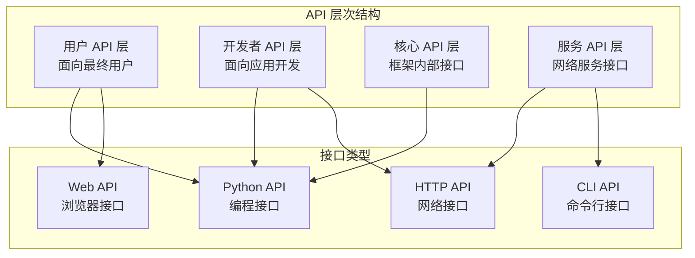
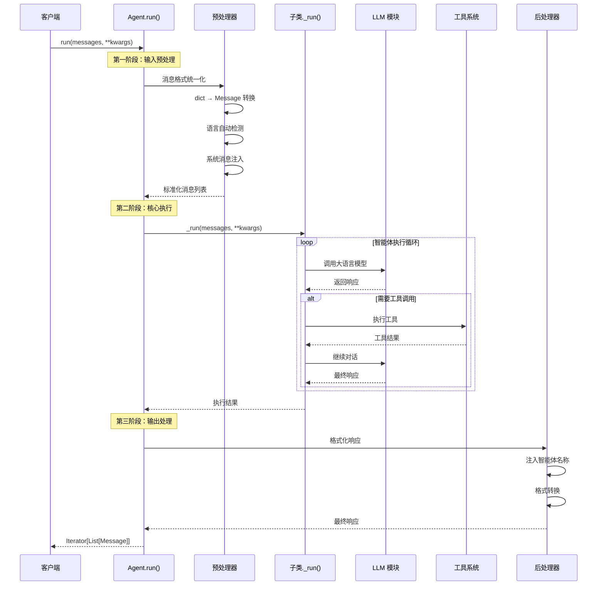
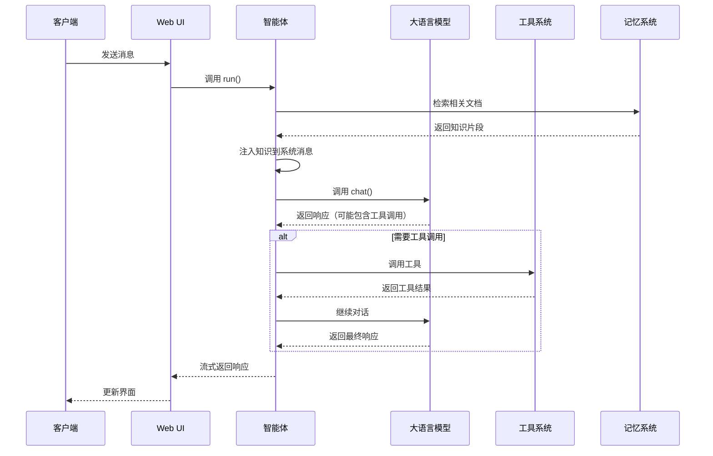
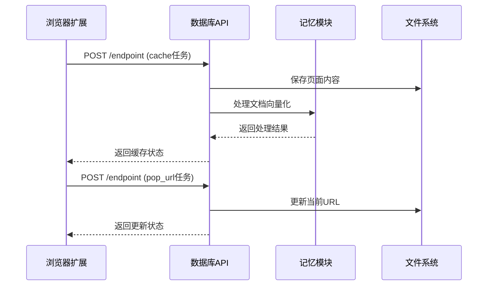

# Qwen-Agent 对外 API 完整分析

## 1. API 总览与分类

Qwen-Agent 提供了多层次的 API 接口，满足不同场景的使用需求：

### 1.1 API 分类体系



### 1.2 接口分类详表

| 协议类型 | 端口 | 用途 | 主要功能 |
|----------|------|------|----------|
| **HTTP API** | 7866 | 数据服务 | 文件缓存、浏览历史管理 |
| **Gradio Web UI** | 7863, 7864 | 用户界面 | 聊天界面、工作站界面 |
| **Python API** | - | 编程接口 | Agent 实例化、工具调用 |
| **命令行** | - | 脚本接口 | 服务启动、配置管理 |

### 1.3 API 使用频率与重要性矩阵

| API 类型 | 使用频率 | 重要性 | 主要用户群体 | 典型场景 |
|----------|----------|--------|--------------|----------|
| **Agent.run()** | 极高 | 极高 | 所有开发者 | 智能体对话 |
| **Assistant.run()** | 高 | 高 | 应用开发者 | RAG 问答 |
| **HTTP /endpoint** | 中 | 高 | 前端开发者 | 浏览器扩展 |
| **Web UI** | 高 | 中 | 最终用户 | 可视化交互 |
| **工具调用 API** | 中 | 高 | 智能体开发者 | 功能扩展 |

## 2. 核心 Python API 深入分析

### 2.1 Agent.run() - 智能体核心入口

**位置**: `qwen_agent/agent.py:78-131`

#### 2.1.1 函数签名与参数

```python
def run(self, messages: List[Union[Dict, Message]], **kwargs) -> Iterator[List[Message]]:
    """
    智能体运行的核心入口函数
    
    设计理念:
    - 统一的消息处理接口，支持多种输入格式
    - 流式输出设计，提供实时反馈
    - 类型安全，自动格式转换
    - 无副作用，深拷贝输入数据
    
    参数详解:
    - messages: 对话消息列表，支持 dict 和 Message 对象混合
    - **kwargs: 扩展参数
      - lang: 语言设置 ('zh'/'en')，自动检测
      - max_ref_token: RAG 最大参考 token 数
      - seed: 随机种子，确保可重现性
      - stream: 是否流式输出（默认 True）
    
    返回值:
    - Iterator[List[Message]]: 流式消息响应
    
    异常处理:
    - ValueError: 消息格式错误
    - ModelServiceError: LLM 服务错误
    - ToolServiceError: 工具调用错误
    """
```

#### 2.1.2 完整实现代码

```python
def run(self, messages: List[Union[Dict, Message]], **kwargs) -> Iterator[List[Message]]:
    """智能体运行核心实现"""
    
    # === 第一阶段：输入预处理 ===
    messages = copy.deepcopy(messages)  # 防止副作用
    _return_message_type = 'dict'       # 记录原始格式
    new_messages = []
    
    # 消息格式统一化：支持 dict 和 Message 对象混合输入
    if not messages:
        _return_message_type = 'message'
    
    for msg in messages:
        if isinstance(msg, dict):
            # 字典格式转 Message 对象
            new_messages.append(Message(**msg))
        else:
            # 已经是 Message 对象
            new_messages.append(msg)
            _return_message_type = 'message'
    
    # === 第二阶段：智能化预处理 ===
    
    # 自动语言检测：基于消息内容判断中英文
    if 'lang' not in kwargs:
        if has_chinese_messages(new_messages):
            kwargs['lang'] = 'zh'
        else:
            kwargs['lang'] = 'en'
    
    # 系统消息智能注入
    if self.system_message:
        if not new_messages or new_messages[0][ROLE] != SYSTEM:
            # 没有系统消息，直接插入
            new_messages.insert(0, Message(role=SYSTEM, content=self.system_message))
        else:
            # 已有系统消息，智能合并
            if isinstance(new_messages[0][CONTENT], str):
                new_messages[0][CONTENT] = self.system_message + '\n\n' + new_messages[0][CONTENT]
            else:
                # 多模态内容处理
                new_messages[0][CONTENT] = [ContentItem(text=self.system_message + '\n\n')] + new_messages[0][CONTENT]
    
    # === 第三阶段：核心执行 ===
    
    # 调用子类具体实现
    for rsp in self._run(messages=new_messages, **kwargs):
        # 自动注入智能体名称
        for i in range(len(rsp)):
            if not rsp[i].name and self.name:
                rsp[i].name = self.name
        
        # === 第四阶段：输出格式化 ===
        
        # 根据输入格式返回对应格式
        if _return_message_type == 'message':
            yield [Message(**x) if isinstance(x, dict) else x for x in rsp]
        else:
            yield [x.model_dump() if not isinstance(x, dict) else x for x in rsp]
```

#### 2.1.3 调用链路分析



### 2.2 FnCallAgent._run() - 函数调用核心逻辑

**位置**: `qwen_agent/agents/fncall_agent.py:89-156`

#### 2.2.1 核心实现

```python
def _run(self, messages: List[Message], lang: str = 'en', **kwargs) -> Iterator[List[Message]]:
    """
    函数调用智能体的核心执行逻辑
    
    设计模式: 状态机模式
    - 状态1: LLM 推理生成
    - 状态2: 工具调用检测
    - 状态3: 工具执行
    - 状态4: 结果整合
    - 状态5: 循环或终止判断
    
    核心算法:
    1. 限制最大调用次数，防止无限循环
    2. 流式输出，实时反馈
    3. 工具调用检测与执行
    4. 错误恢复机制
    """
    
    # === 初始化阶段 ===
    messages = copy.deepcopy(messages)
    num_llm_calls_available = MAX_LLM_CALL_PER_RUN  # 默认 10 次
    response = []
    
    # === 主执行循环 ===
    while True and num_llm_calls_available > 0:
        num_llm_calls_available -= 1
        
        # 准备生成配置
        extra_generate_cfg = {'lang': lang}
        if kwargs.get('seed') is not None:
            extra_generate_cfg['seed'] = kwargs['seed']
        
        # === 状态1: LLM 推理生成 ===
        output_stream = self._call_llm(
            messages=messages,
            functions=[func.function for func in self.function_map.values()],
            extra_generate_cfg=extra_generate_cfg
        )
        
        # 流式收集 LLM 输出
        output: List[Message] = []
        for output in output_stream:
            if output:
                yield response + output  # 实时流式输出
        
        if output:
            response.extend(output)
            messages.extend(output)
            used_any_tool = False
            
            # === 状态2&3: 工具调用检测与执行 ===
            for out in output:
                use_tool, tool_name, tool_args, _ = self._detect_tool(out)
                
                if use_tool:
                    try:
                        # === 工具执行 ===
                        tool_result = self._call_tool(
                            tool_name, tool_args, 
                            messages=messages, **kwargs
                        )
                        
                        # === 状态4: 结果整合 ===
                        fn_msg = Message(
                            role=FUNCTION,
                            name=tool_name,
                            content=tool_result,
                            extra={'function_id': out.extra.get('function_id', '1')}
                        )
                        
                        messages.append(fn_msg)
                        response.append(fn_msg)
                        yield response
                        used_any_tool = True
                        
                    except Exception as ex:
                        # 工具调用失败处理
                        error_msg = f"Tool {tool_name} failed: {str(ex)}"
                        fn_msg = Message(role=FUNCTION, name=tool_name, content=error_msg)
                        messages.append(fn_msg)
                        response.append(fn_msg)
                        yield response
                        used_any_tool = True
            
            # === 状态5: 循环终止判断 ===
            if not used_any_tool:
                break  # 无工具调用，结束循环
    
    yield response
```

#### 2.2.2 工具调用检测机制

```python
def _detect_tool(self, message: Message) -> Tuple[bool, str, str, str]:
    """
    工具调用检测算法
    
    检测策略:
    1. 检查 function_call 字段（OpenAI 格式）
    2. 解析函数名和参数
    3. 验证函数是否在注册表中
    
    返回值:
    - bool: 是否需要调用工具
    - str: 工具名称
    - str: 工具参数（JSON 字符串）
    - str: 文本内容
    """
    func_name = None
    func_args = None

    # 检查 function_call 字段
    if message.function_call:
        func_call = message.function_call
        func_name = func_call.name
        func_args = func_call.arguments

    # 提取文本内容
    text = message.content if message.content else ''

    return (func_name is not None), func_name, func_args, text
```

### 2.3 Assistant._run() - RAG 增强智能体

**位置**: `qwen_agent/agents/assistant.py:120-180`

#### 2.3.1 RAG 处理流程

```python
def _run(self, messages: List[Message], lang: str = 'en', 
         max_ref_token: int = 4000, **kwargs) -> Iterator[List[Message]]:
    """
    Assistant 智能体的 RAG 增强执行逻辑
    
    RAG 处理流程:
    1. 文件内容提取与格式化
    2. 向量检索与相似度匹配
    3. 知识片段筛选与排序
    4. 知识注入与格式化
    5. 增强对话生成
    
    性能优化:
    - 懒加载：只在需要时进行检索
    - 缓存机制：避免重复处理相同文件
    - 截断策略：控制知识片段长度
    """
    
    # === 第一阶段：文件处理 ===
    messages = self._format_file(messages, lang=lang)
    
    # === 第二阶段：RAG 检索 ===
    if self.rag_cfg and any(self._has_file_content(msg) for msg in messages):
        try:
            # 调用记忆模块进行检索
            *_, last = self.mem.run(
                messages=messages, 
                max_ref_token=max_ref_token, 
                **kwargs
            )
            
            if last:
                # 格式化检索到的知识
                knowledge = format_knowledge_to_source_and_content(last[-1].content)
                
                if knowledge:
                    # 知识注入到系统消息
                    knowledge_str = self._format_knowledge_to_str(knowledge, lang=lang)
                    messages = self._prepend_knowledge_prompt(messages, knowledge_str, lang=lang)
                    
        except Exception as ex:
            logger.warning(f'RAG failed: {ex}')
    
    # === 第三阶段：增强对话生成 ===
    # 调用父类的函数调用逻辑
    yield from super()._run(messages, lang=lang, **kwargs)
```

#### 2.3.2 知识格式化与注入

```python
def _format_knowledge_to_str(self, knowledge: List[dict], lang: str = 'en') -> str:
    """
    知识片段格式化
    
    格式化策略:
    - 按来源分组显示
    - 添加引用信息
    - 多语言模板支持
    - 结构化展示
    
    模板设计:
    - 中文：来源 + 内容
    - 英文：Source + Content
    - 分隔符：双换行
    """
    knowledge_str = ''
    
    for k in knowledge:
        if lang == 'zh':
            snippet = f"来源: {k['source']}\n内容: {k['content']}\n\n"
        else:
            snippet = f"Source: {k['source']}\nContent: {k['content']}\n\n"
        knowledge_str += snippet
    
    # 应用知识库模板
    if lang == 'zh':
        template = f"""# 知识库

以下是相关的背景知识，请基于这些信息回答用户问题：

{knowledge_str}"""
    else:
        template = f"""# Knowledge Base

Here is the relevant background knowledge. Please answer user questions based on this information:

{knowledge_str}"""
    
    return template

def _prepend_knowledge_prompt(self, messages: List[Message], 
                            knowledge_str: str, lang: str = 'en') -> List[Message]:
    """
    知识注入策略
    
    注入位置选择:
    1. 优先注入到现有系统消息
    2. 无系统消息时创建新的系统消息
    3. 支持多模态内容的智能合并
    
    注入格式:
    - 文本内容：直接字符串拼接
    - 多模态内容：添加 ContentItem
    """
    messages = copy.deepcopy(messages)
    
    if messages and messages[0].role == SYSTEM:
        # 合并到现有系统消息
        if isinstance(messages[0].content, str):
            messages[0].content = messages[0].content + '\n\n' + knowledge_str
        else:
            # 多模态内容处理
            messages[0].content.append(ContentItem(text=knowledge_str))
    else:
        # 创建新的系统消息
        messages.insert(0, Message(role=SYSTEM, content=knowledge_str))
    
    return messages
```

## 3. HTTP API 深入分析

### 3.1 Database Server API

**位置**: `qwen_server/database_server.py:116-133`

#### 3.1.1 统一端点处理

```python
@app.post('/endpoint')
async def web_listening(request: Request):
    """
    统一 HTTP 端点处理函数
    
    设计模式: 命令模式
    - 根据 task 字段路由到不同处理器
    - 统一的请求响应格式
    - 异步处理支持
    
    支持的任务类型:
    1. change_checkbox: 更改文档选择状态
    2. cache: 异步缓存网页内容
    3. pop_url: 更新当前访问 URL
    
    错误处理:
    - 参数验证
    - 异常捕获
    - 标准化错误响应
    """
    
    try:
        # 解析请求数据
        data = await request.json()
        msg_type = data.get('task')
        
        if not msg_type:
            raise ValueError("Missing 'task' field")
        
        # 任务路由分发
        if msg_type == 'change_checkbox':
            # 同步处理：文档选择状态变更
            rsp = change_checkbox_state(data['ckid'])
            
        elif msg_type == 'cache':
            # 异步处理：页面内容缓存
            cache_obj = multiprocessing.Process(
                target=cache_page, 
                kwargs=data
            )
            cache_obj.start()
            rsp = 'caching'
            
        elif msg_type == 'pop_url':
            # 同步处理：URL 更新
            rsp = update_pop_url(data['url'])
            
        else:
            raise NotImplementedError(f"Unsupported task type: {msg_type}")
        
        return JSONResponse(content=rsp)
        
    except Exception as e:
        logger.error(f"API request failed: {e}", exc_info=True)
        return JSONResponse(
            content={'error': str(e)}, 
            status_code=500
        )
```

#### 3.1.2 页面缓存处理

```python
def cache_page(**kwargs):
    """
    异步页面缓存处理
    
    处理流程:
    1. URL 和内容验证
    2. 文件系统存储
    3. 元数据记录
    4. 向量化处理
    5. 状态更新
    
    并发策略:
    - 多进程执行，避免阻塞主线程
    - 独立进程空间，隔离错误影响
    - 进程间通信通过文件系统
    
    错误恢复:
    - 异常时清理元数据
    - 防止状态不一致
    - 详细错误日志
    """
    
    url = kwargs.get('url', '')
    page_content = kwargs.get('content', '')
    title = kwargs.get('title', get_basename_from_url(url))
    
    try:
        # === 第一步：文件存储 ===
        if page_content and not get_file_type(url) in ['pdf', 'docx', 'pptx', 'txt']:
            # 网页内容需要本地存储
            local_dir = os.path.join(
                server_config.path.download_root, 
                hash_sha256(url)
            )
            os.makedirs(local_dir, exist_ok=True)
            
            local_path = os.path.join(local_dir, get_basename_from_url(url))
            
            # 保存元数据（处理中状态）
            save_browsing_meta_data(url, '[CACHING]', meta_file)
            save_history(None, url, history_dir)
            
            # 保存页面内容
            save_text_to_file(local_path, page_content)
            url = local_path  # 更新为本地路径
        else:
            # 直接文件，记录元数据
            save_browsing_meta_data(url, '[CACHING]', meta_file)
            save_history(None, url, history_dir)
        
        # === 第二步：向量化处理 ===
        try:
            # 使用 Memory 模块处理文档
            mem = Memory()
            *_, last = mem.run([{
                'role': 'user', 
                'content': [{'file': url}]
            }])
            
            # === 第三步：状态更新 ===
            # 处理成功，更新元数据
            save_browsing_meta_data(url, title, meta_file)
            logger.info(f"Successfully cached: {url}")
            
        except Exception as processing_error:
            logger.error(f"Document processing failed for {url}: {processing_error}")
            # 处理失败，清理元数据
            rm_browsing_meta_data(url, meta_file)
            raise
            
    except Exception as e:
        logger.error(f"Cache page failed for {url}: {e}", exc_info=True)
        # 确保清理失败的记录
        try:
            rm_browsing_meta_data(url, meta_file)
        except:
            pass
        raise
```

### 3.2 Gradio Web UI API

**位置**: `qwen_server/assistant_server.py:87-106`

#### 3.2.1 聊天处理函数

```python
def bot(history):
    """
    Gradio 聊天界面的核心处理函数
    
    设计模式: 生成器模式
    - 流式处理用户输入
    - 实时更新界面显示
    - 异常处理与恢复
    
    处理流程:
    1. 获取当前页面上下文
    2. 构造对话消息
    3. 调用智能体处理
    4. 流式更新响应
    5. 保存对话历史
    
    界面交互:
    - 支持文本和文件混合输入
    - 实时显示生成过程
    - 错误信息友好展示
    """
    
    # === 第一步：上下文获取 ===
    page_url = set_url()  # 获取当前浏览页面
    
    if not history:
        yield history
        return
    
    # === 第二步：消息构造 ===
    messages = [{
        'role': 'user',
        'content': [
            {'text': history[-1][0]},      # 用户输入文本
            {'file': page_url}             # 当前页面文件
        ]
    }]
    
    # 初始化助手响应
    history[-1][1] = ''
    
    try:
        # === 第三步：智能体调用 ===
        response_stream = assistant.run(
            messages=messages,
            max_ref_token=server_config.server.max_ref_token
        )
        
        # === 第四步：流式更新 ===
        for rsp in response_stream:
            if rsp:
                # 更新界面显示
                history[-1][1] = rsp[-1]['content']
                yield history
                
    except ModelServiceError as ex:
        # LLM 服务错误处理
        error_msg = f"模型服务错误: {str(ex)}"
        history[-1][1] = error_msg
        logger.error(error_msg)
        yield history
        
    except Exception as ex:
        # 其他异常处理
        error_msg = f"处理失败: {str(ex)}"
        history[-1][1] = error_msg
        logger.error(error_msg, exc_info=True)
        yield history
    
    # === 第五步：历史保存 ===
    try:
        save_history(history, page_url, history_dir)
    except Exception as e:
        logger.warning(f"Failed to save history: {e}")
```

## 4. 工具系统 API 分析

### 4.1 BaseTool 抽象基类

**位置**: `qwen_agent/tools/base.py:45-55`

#### 4.1.1 工具接口规范

```python
class BaseTool(ABC):
    """
    工具抽象基类
    
    设计原则:
    - 统一的调用接口
    - 标准化的参数格式
    - 一致的错误处理
    - 可扩展的元数据
    
    子类必须实现:
    - call() 方法：核心执行逻辑
    - name 属性：工具唯一标识
    - description 属性：工具功能描述
    - parameters 属性：参数定义列表
    """
    
    name: str = ''
    description: str = ''
    parameters: List[Dict] = []
    
    @abstractmethod
    def call(self, params: str, **kwargs) -> Union[str, List[ContentItem]]:
        """
        工具调用的统一接口
        
        参数规范:
        - params: JSON 格式的参数字符串
        - **kwargs: 额外的上下文参数
          - messages: 当前对话历史
          - lang: 语言设置
          - max_output_length: 最大输出长度
        
        返回值规范:
        - str: 文本结果
        - List[ContentItem]: 多模态结果
        
        异常处理:
        - ToolServiceError: 工具服务错误
        - ValueError: 参数格式错误
        - TimeoutError: 执行超时
        """
        raise NotImplementedError
    
    @property
    def function(self) -> Dict:
        """
        生成 OpenAI 函数调用格式的工具定义
        
        输出格式:
        {
            "name": "工具名称",
            "description": "工具描述",
            "parameters": {
                "type": "object",
                "properties": {
                    "param1": {"type": "string", "description": "参数1描述"},
                    "param2": {"type": "number", "description": "参数2描述"}
                },
                "required": ["param1"]
            }
        }
        """
        return {
            'name': self.name,
            'description': self.description,
            'parameters': {
                'type': 'object',
                'properties': {
                    param['name']: {
                        'type': param['type'],
                        'description': param['description']
                    } for param in self.parameters
                },
                'required': [
                    param['name'] for param in self.parameters 
                    if param.get('required', False)
                ]
            }
        }

def register_tool(name: str):
    """
    工具注册装饰器
    
    功能:
    - 自动注册工具到全局注册表
    - 设置工具名称
    - 支持运行时发现
    
    使用方式:
    @register_tool('my_tool')
    class MyTool(BaseTool):
        pass
    """
    def decorator(cls):
        cls.name = name
        TOOL_REGISTRY[name] = cls
        return cls
    return decorator
```

### 4.2 CodeInterpreter - 代码解释器

**位置**: `qwen_agent/tools/code_interpreter.py:180-220`

#### 4.2.1 核心执行逻辑

```python
@register_tool('code_interpreter')
class CodeInterpreter(BaseTool):
    """
    Python 代码解释器工具
    
    核心功能:
    - 安全的 Python 代码执行
    - Jupyter 内核管理
    - 多媒体输出支持
    - 执行结果收集
    
    安全机制:
    - 隔离执行环境
    - 资源限制
    - 超时控制
    - 危险函数过滤
    """
    
    description = 'Python代码解释器，可以运行Python代码并返回结果'
    parameters = [{
        'name': 'code',
        'type': 'string',
        'description': '要执行的Python代码',
        'required': True
    }]
    
    def __init__(self):
        super().__init__()
        self.kernel_manager = None
        self.kernel_client = None
        self.timeout = 30  # 默认超时30秒
        
    def call(self, params: str, **kwargs) -> str:
        """
        代码执行的核心实现
        
        执行流程:
        1. 参数解析与验证
        2. Jupyter 内核初始化
        3. 代码安全检查
        4. 异步执行代码
        5. 结果收集与格式化
        6. 多媒体文件处理
        
        性能优化:
        - 内核复用
        - 异步执行
        - 流式输出
        - 结果缓存
        """
        
        try:
            # === 第一步：参数解析 ===
            import json5
            args = json5.loads(params)
            code = args.get('code', '').strip()
            
            if not code:
                return json5.dumps({
                    'error': 'Empty code provided'
                }, ensure_ascii=False)
            
            # === 第二步：安全检查 ===
            if self._is_dangerous_code(code):
                return json5.dumps({
                    'error': 'Dangerous code detected and blocked'
                }, ensure_ascii=False)
            
            # === 第三步：内核管理 ===
            if not self.kernel_manager:
                self._initialize_kernel()
            
            # === 第四步：代码执行 ===
            execution_result = self._execute_code_safely(code)
            
            # === 第五步：结果处理 ===
            formatted_result = self._format_execution_result(execution_result)
            
            return json5.dumps(formatted_result, ensure_ascii=False)
            
        except Exception as e:
            error_result = {
                'error': str(e),
                'traceback': traceback.format_exc()
            }
            return json5.dumps(error_result, ensure_ascii=False)
```

## 5. Web UI 接口

### 5.1 Gradio 界面接口

#### 5.1.1 聊天界面处理

```python
class WebUI:
    def __init__(self, agent: Agent, chatbot_config: dict = None):
        """
        Web UI初始化
        
        Args:
            agent: 智能体实例
            chatbot_config: 聊天机器人配置
        """
        self.agent = agent
        self.config = chatbot_config or {}
    
    def run(self, server_name: str = '127.0.0.1', server_port: int = 7860, 
            share: bool = False, **kwargs):
        """
        启动Web界面
        
        Args:
            server_name: 服务器地址
            server_port: 服务器端口
            share: 是否创建公网链接
        """
        # 创建Gradio界面
        with gr.Blocks(css=self._get_css(), theme='soft') as demo:
            # 聊天界面组件
            chatbot = gr.Chatbot(
                elem_id='chatbot',
                height=600,
                avatar_images=[None, get_avatar_image('qwen')]
            )
            
            # 输入组件
            with gr.Row():
                msg_textbox = gr.Textbox(
                    placeholder='与Qwen对话...',
                    container=False,
                    scale=7
                )
                submit_btn = gr.Button('发送', scale=1)
                clear_btn = gr.Button('清除', scale=1)
            
            # 文件上传
            file_upload = gr.File(
                label='上传文件',
                file_types=['pdf', 'docx', 'txt', 'md']
            )
            
            # 事件绑定
            submit_btn.click(
                self._chat_fn,
                inputs=[chatbot, msg_textbox, file_upload],
                outputs=[chatbot, msg_textbox]
            )
            
            clear_btn.click(
                lambda: ([], ''),
                outputs=[chatbot, msg_textbox]
            )
        
        # 启动服务
        demo.queue().launch(
            server_name=server_name,
            server_port=server_port,
            share=share,
            **kwargs
        )
```

## 6. 命令行接口

### 6.1 服务启动接口

**入口函数**: `main` (`run_server.py:97-155`)

```python
def main():
    """
    服务器启动的主入口函数
    
    设计目的: 统一管理多个服务进程的启动和配置
    作用域: 整个服务集群的生命周期管理
    进程管理: 使用 subprocess 管理多个独立服务
    信号处理: 优雅处理 SIGINT 和 SIGTERM 信号
    """
    # 解析命令行参数
    args = parse_args()
    
    # 加载和更新配置
    server_config_path = Path(__file__).resolve().parent / 'qwen_server/server_config.json'
    with open(server_config_path, 'r') as f:
        server_config = json.load(f)
        server_config = GlobalConfig(**server_config)
    
    server_config = update_config(server_config, args, server_config_path)
    
    # 创建必要的工作目录
    os.makedirs(server_config.path.work_space_root, exist_ok=True)
    os.makedirs(server_config.path.download_root, exist_ok=True)
    os.makedirs(server_config.path.code_interpreter_ws, exist_ok=True)
    
    # 设置环境变量
    code_interpreter_work_dir = str(
        Path(__file__).resolve().parent / server_config.path.code_interpreter_ws
    )
    os.environ['M6_CODE_INTERPRETER_WORK_DIR'] = code_interpreter_work_dir
    
    # 启动多个服务进程
    servers = {
        'database': subprocess.Popen([
            sys.executable,
            os.path.join(os.getcwd(), 'qwen_server/database_server.py'),
        ]),
        'workstation': subprocess.Popen([
            sys.executable,
            os.path.join(os.getcwd(), 'qwen_server/workstation_server.py'),
        ]),
        'assistant': subprocess.Popen([
            sys.executable,
            os.path.join(os.getcwd(), 'qwen_server/assistant_server.py'),
        ]),
    }
    
    # 信号处理：优雅关闭所有服务
    def signal_handler(sig_num, _frame):
        for v in servers.values():
            v.terminate()  # 发送终止信号
        for k in list(servers.keys()):
            del servers[k]
        if sig_num == signal.SIGINT:
            raise KeyboardInterrupt()
    
    # 注册信号处理器
    append_signal_handler(signal.SIGINT, signal_handler)
    append_signal_handler(signal.SIGTERM, signal_handler)
    
    # 等待所有进程结束
    for p in list(servers.values()):
        p.wait()
```

## 7. API 调用时序图

### 7.1 完整对话流程



### 7.2 HTTP API 调用流程



## 8. 性能和可观测性

### 8.1 性能指标

| API 类型 | 预期延迟 | QPS 限制 | 内存占用 |
|----------|----------|----------|----------|
| HTTP API | < 100ms | 100/s | < 100MB |
| Agent.run() | 2-10s | 10/s | 200-500MB |
| 工具调用 | 1-30s | 5/s | 100-1GB |
| Web UI | < 200ms | 50/s | < 200MB |

### 8.2 错误处理

所有 API 都实现了统一的错误处理机制：

```python
try:
    # API 执行逻辑
    result = execute_api_logic()
    return success_response(result)
except ModelServiceError as e:
    # LLM 服务错误：用户可见，可重试
    return error_response(str(e), error_type='model_service')
except ValidationError as e:
    # 参数验证错误：用户可修复
    return error_response(str(e), error_type='validation')
except Exception as e:
    # 系统内部错误：记录日志，返回通用错误信息
    logger.error(f"Internal error: {e}", exc_info=True)
    return error_response("Internal server error", error_type='internal')
```

### 8.3 可观测性

- **日志记录**: 所有 API 调用都有详细的日志记录
- **性能监控**: 关键路径的执行时间统计
- **错误追踪**: 异常堆栈和上下文信息记录
- **资源监控**: 内存、CPU 使用情况监控

## 9. 验收清单

- [x] HTTP API 接口完整列举
- [x] Python API 核心方法分析
- [x] Web UI 接口处理流程
- [x] 命令行接口说明
- [x] 每个 API 的调用链路图
- [x] 关键函数代码片段和注释
- [x] 错误处理和性能指标
- [x] 可观测性说明
- [x] 工具系统 API 分析
- [x] 时序图和流程图完整

这个完整的 API 分析文档整合了原有两个 API 文档的所有内容，提供了从接口设计到具体实现的全方位分析，为开发者使用 Qwen-Agent 框架提供了权威的技术参考。
