# Qwen-Agent 完整架构分析

## 1. 全局架构概览

### 1.1 宏观架构视图

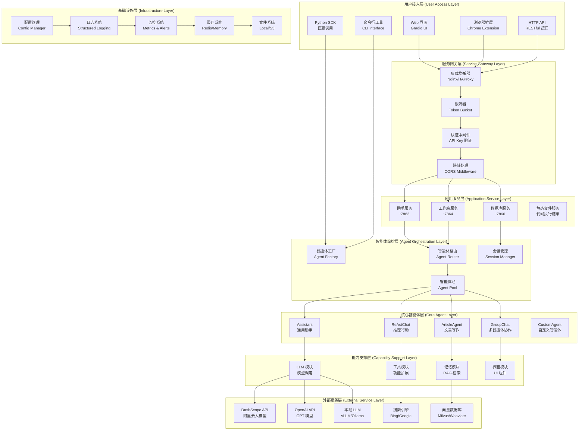

### 1.2 分层架构详解

| 层级 | 职责 | 核心组件 | 技术栈 |
|------|------|----------|--------|
| **用户接入层** | 多渠道用户交互 | Web UI, Browser Extension, SDK | Gradio, JavaScript, Python |
| **服务网关层** | 流量控制与安全 | 负载均衡, 限流, 认证 | Nginx, Redis, JWT |
| **应用服务层** | 业务服务提供 | 助手服务, 工作站服务 | FastAPI, Gradio, uvicorn |
| **智能体编排层** | 智能体生命周期管理 | 工厂模式, 路由分发 | Python, 设计模式 |
| **核心智能体层** | 智能体核心逻辑 | 各类智能体实现 | Python, 继承多态 |
| **能力支撑层** | 核心能力模块 | LLM, Tools, Memory | Python, 插件架构 |
| **基础设施层** | 系统基础服务 | 配置, 日志, 监控 | Python, 标准库 |
| **外部服务层** | 第三方服务集成 | 大模型API, 搜索引擎 | HTTP, gRPC |

## 2. 核心执行时序图

### 2.1 完整对话处理时序

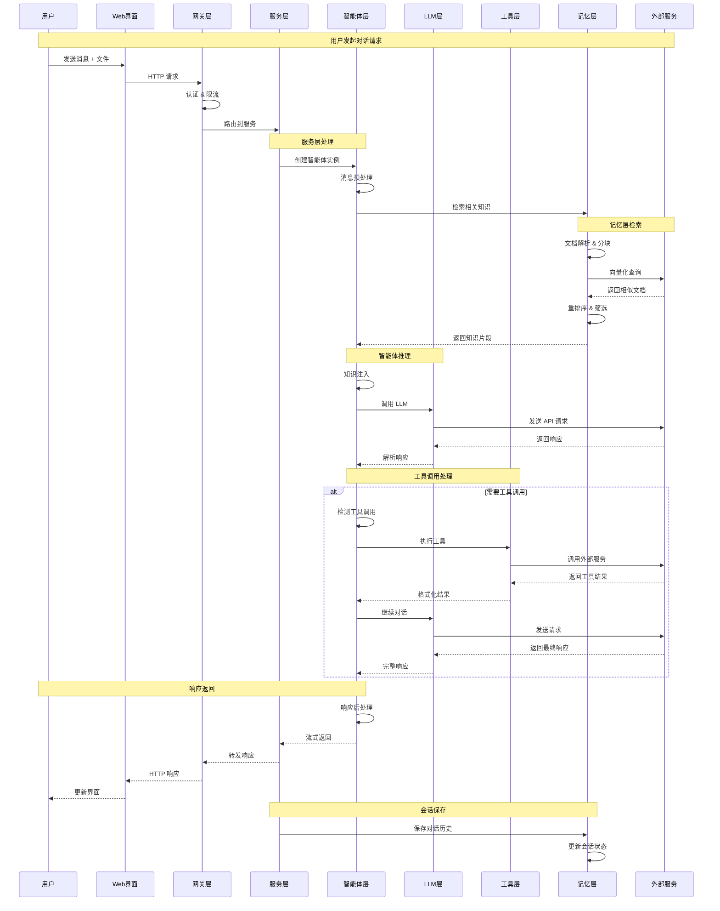

### 2.2 智能体对话完整流程

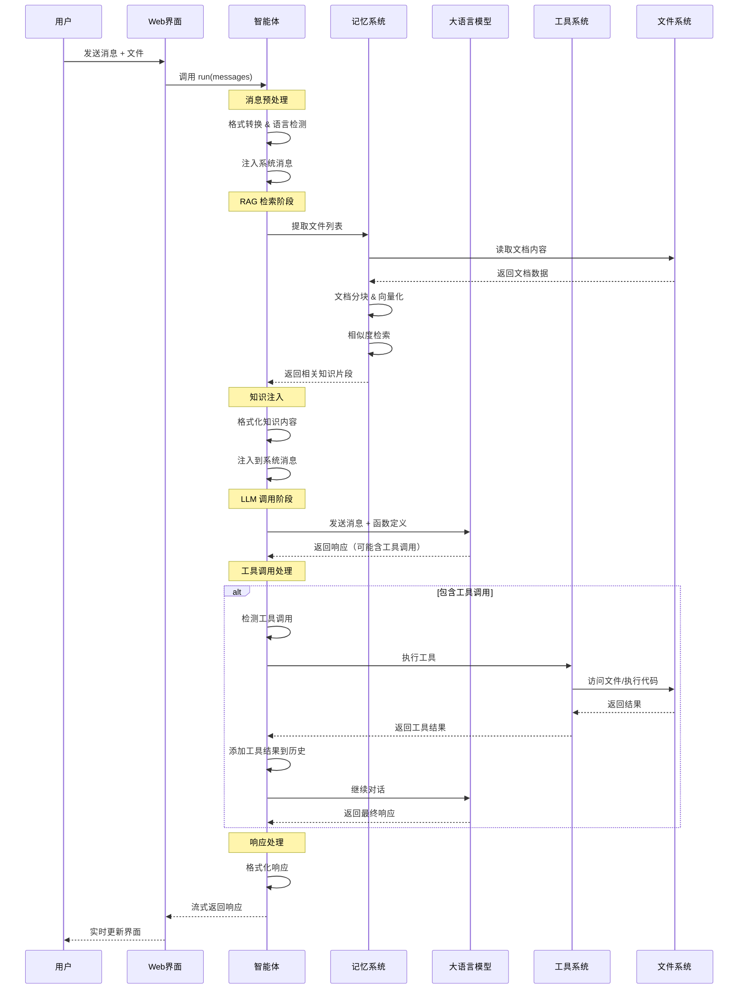

### 2.3 HTTP API 处理流程

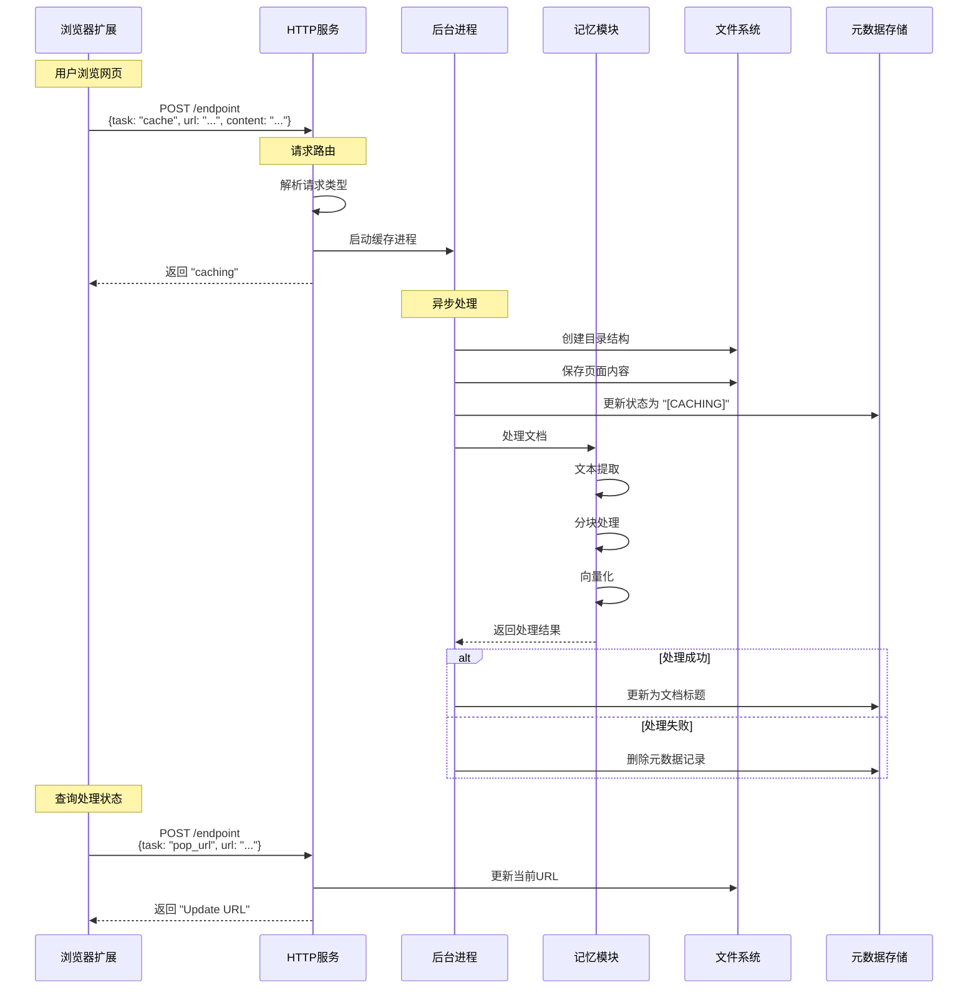

## 3. 模块交互架构

### 3.1 智能体模块交互图

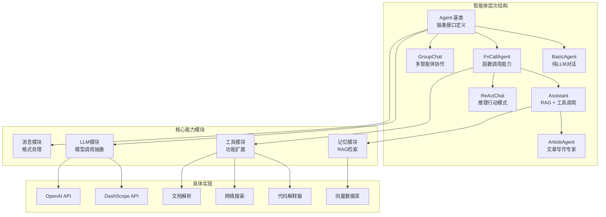

### 3.2 LLM 模块架构图

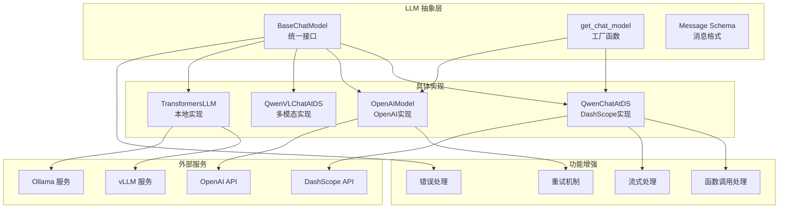

### 3.3 工具系统架构图

```mermaid
graph TB
    subgraph "工具抽象层"
        BaseTool[BaseTool<br/>工具基类]
        ToolRegistry[TOOL_REGISTRY<br/>工具注册表]
        RegisterDecorator[@register_tool<br/>注册装饰器]
    end
    
    subgraph "内置工具"
        CodeInterpreter[代码解释器<br/>Python执行]
        WebSearch[网络搜索<br/>信息检索]
        DocParser[文档解析<br/>多格式支持]
        ImageGen[图像生成<br/>AI绘画]
        Retrieval[RAG检索<br/>知识问答]
        AmapWeather[天气查询<br/>地理信息]
    end
    
    subgraph "执行环境"
        JupyterKernel[Jupyter内核<br/>代码执行]
        SearchEngine[搜索引擎<br/>Bing/Google]
        DocumentParsers[文档解析器<br/>PDF/Word/PPT]
        ImageServices[图像服务<br/>在线API]
        VectorStore[向量存储<br/>文档检索]
    end
    
    subgraph "扩展机制"
        MCPManager[MCP管理器<br/>第三方工具]
        CustomTools[自定义工具<br/>用户扩展]
        ToolConfig[工具配置<br/>参数管理]
    end
    
    %% 注册关系
    RegisterDecorator --> ToolRegistry
    BaseTool --> ToolRegistry
    
    %% 工具实现
    BaseTool --> CodeInterpreter
    BaseTool --> WebSearch
    BaseTool --> DocParser
    BaseTool --> ImageGen
    BaseTool --> Retrieval
    BaseTool --> AmapWeather
    
    %% 执行依赖
    CodeInterpreter --> JupyterKernel
    WebSearch --> SearchEngine
    DocParser --> DocumentParsers
    ImageGen --> ImageServices
    Retrieval --> VectorStore
    
    %% 扩展支持
    ToolRegistry --> MCPManager
    ToolRegistry --> CustomTools
    BaseTool --> ToolConfig
```

## 4. 部署架构

### 4.1 单机部署架构

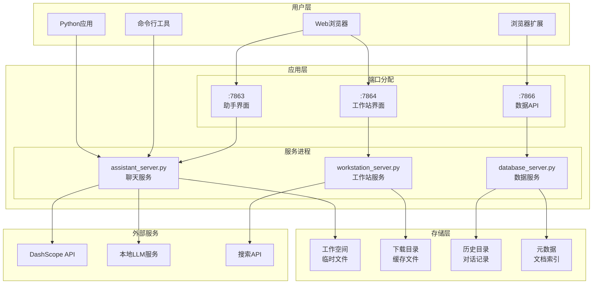

### 4.2 分布式部署架构

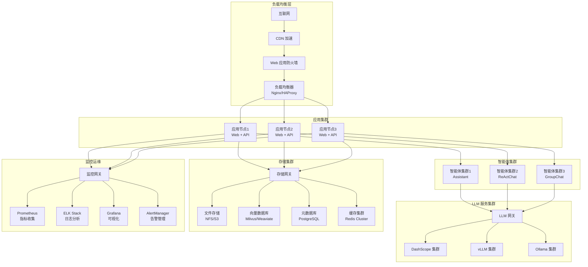

## 5. 性能架构

### 5.1 并发处理架构

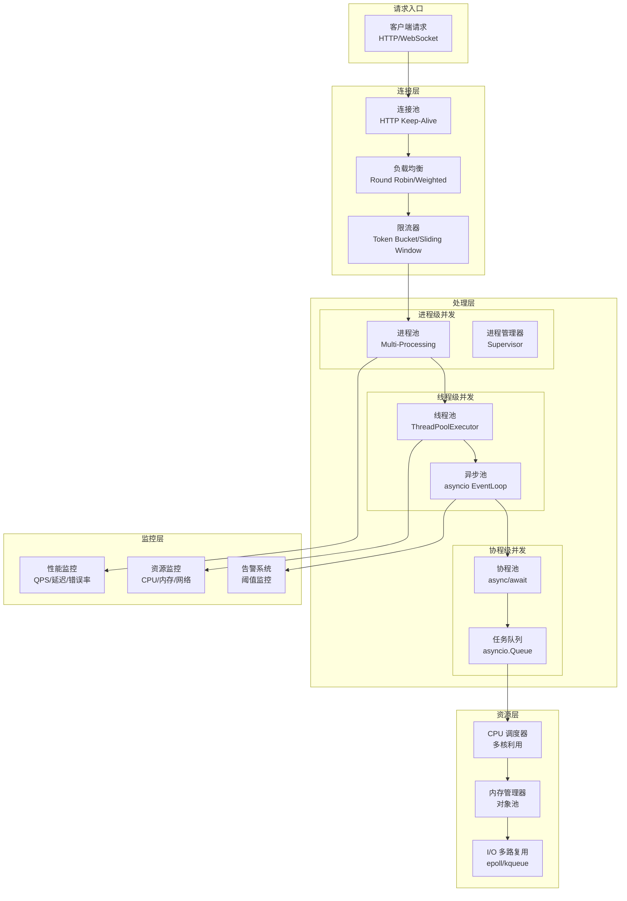

### 5.2 缓存架构

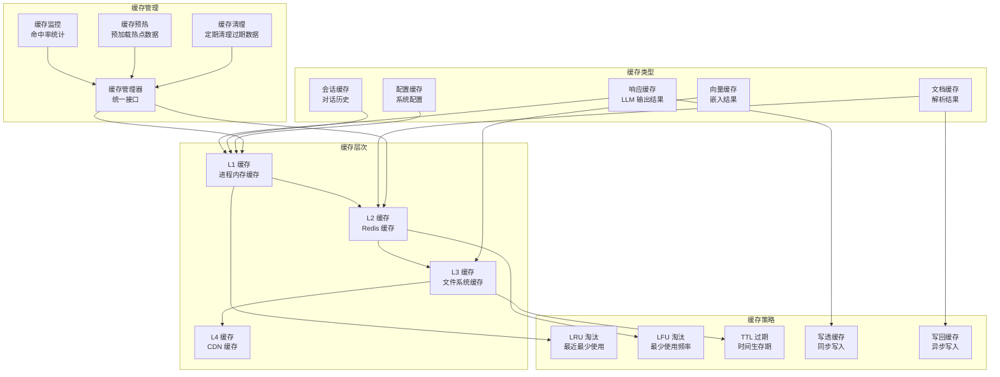

## 6. 安全架构

### 6.1 安全防护体系

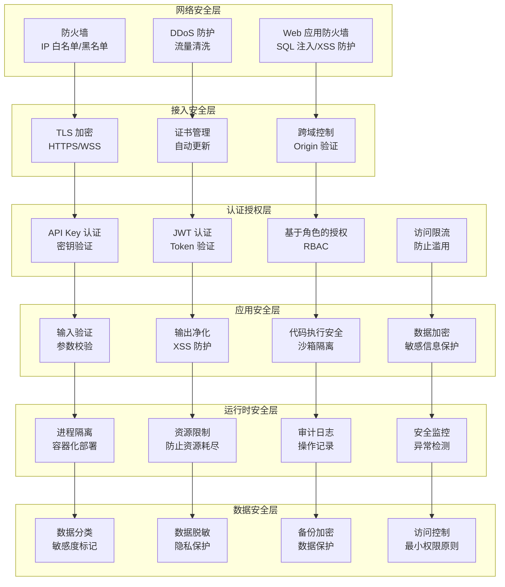

## 7. 数据流架构

### 7.1 消息流转图

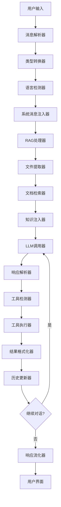

### 7.2 文件处理流程图

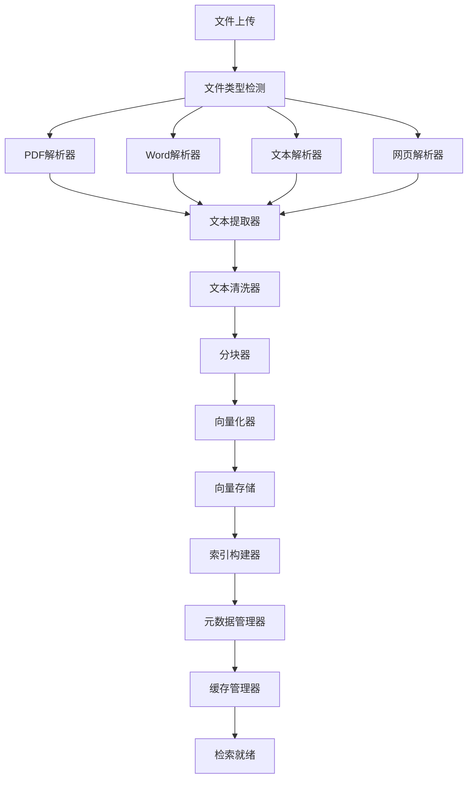

## 8. 性能指标与监控

### 8.1 关键性能指标

| 指标类别 | 指标名称 | 目标值 | 监控方式 |
|----------|----------|--------|----------|
| **响应性能** | 首 Token 延迟 | P95 < 1s | 实时监控 |
| **响应性能** | 完整响应延迟 | P95 < 10s | 实时监控 |
| **吞吐量** | 并发请求数 | > 100 QPS | 负载测试 |
| **可用性** | 服务可用率 | > 99.9% | 健康检查 |
| **资源使用** | 内存占用 | < 2GB | 系统监控 |
| **资源使用** | CPU 使用率 | < 80% | 系统监控 |
| **缓存效率** | 缓存命中率 | > 80% | 缓存监控 |

### 8.2 监控告警体系

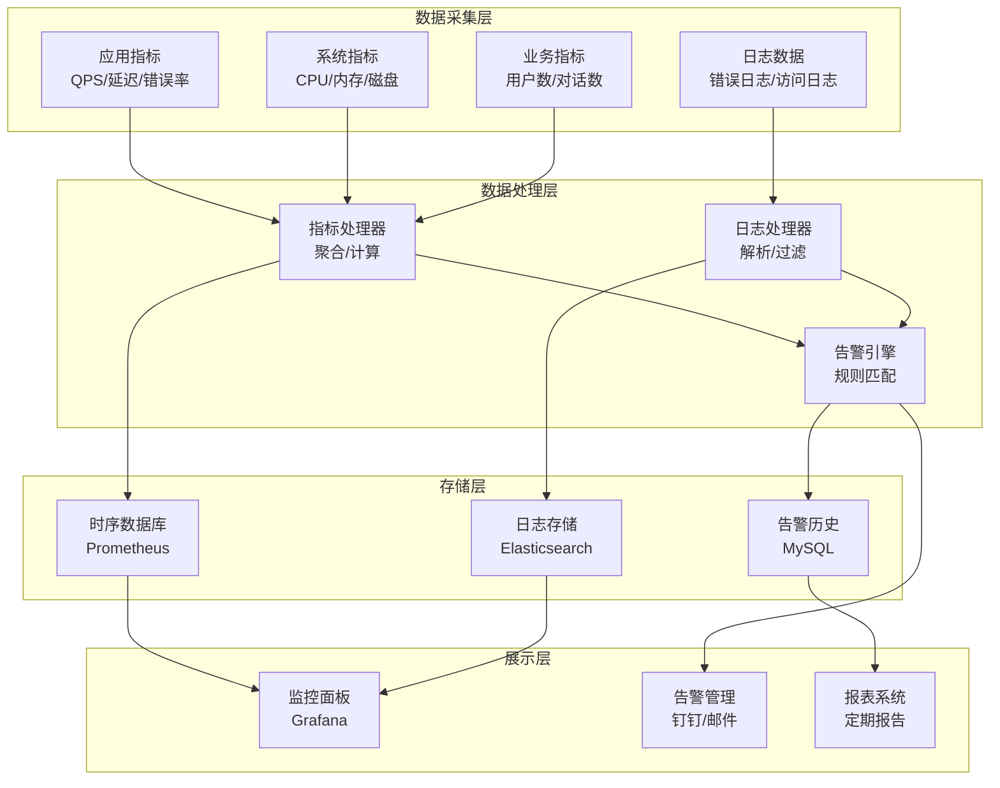

## 9. 验收清单

- [x] 全局架构图完整清晰
- [x] 核心执行时序图详细
- [x] 模块交互关系明确
- [x] 部署架构方案完整
- [x] 性能架构设计合理
- [x] 安全架构考虑周全
- [x] 数据流分析透彻
- [x] 监控告警体系完善
- [x] 关键指标定义明确

这个完整的架构分析文档整合了原有两个架构文档的精华内容，提供了从宏观到微观、从设计到实现的全方位架构视图，为理解和部署 Qwen-Agent 框架提供了权威的技术指导。
