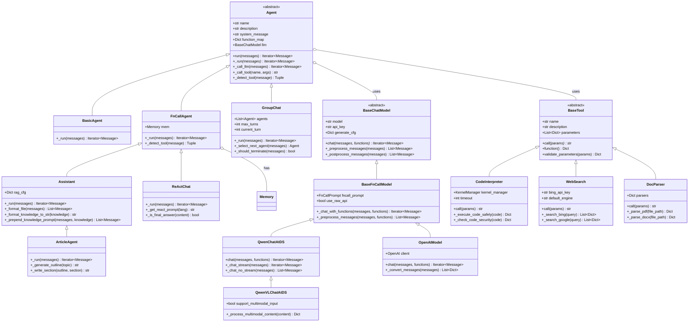
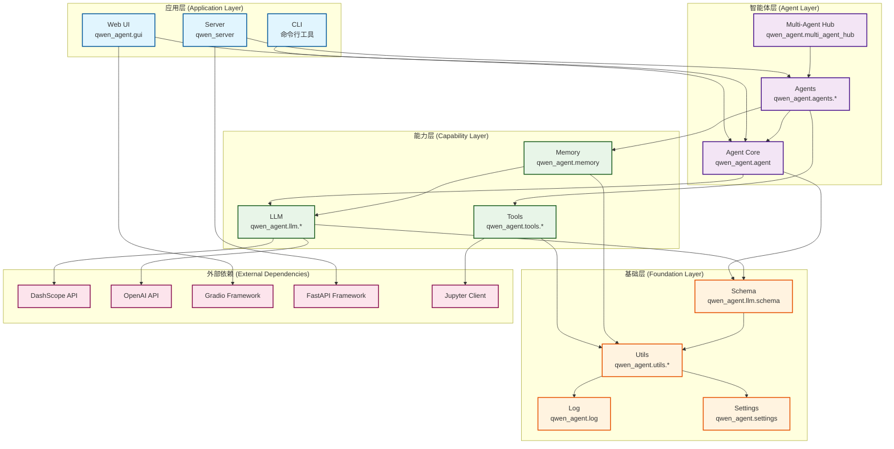
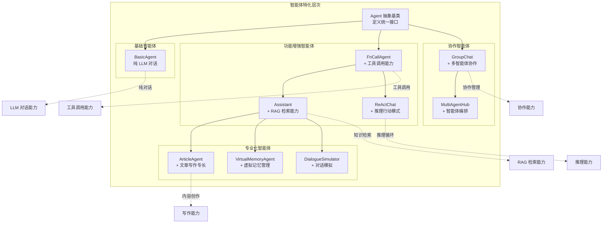
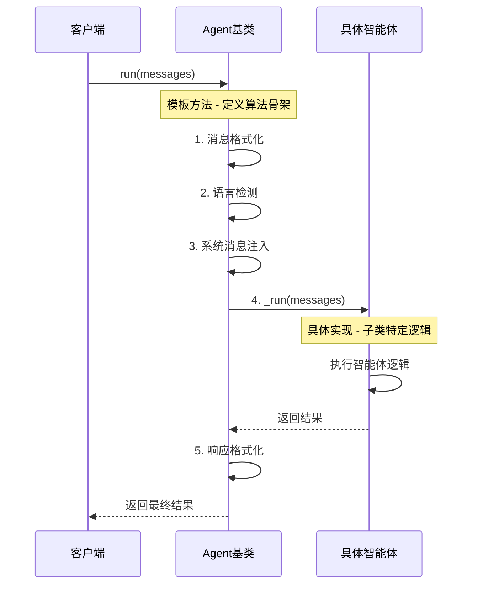
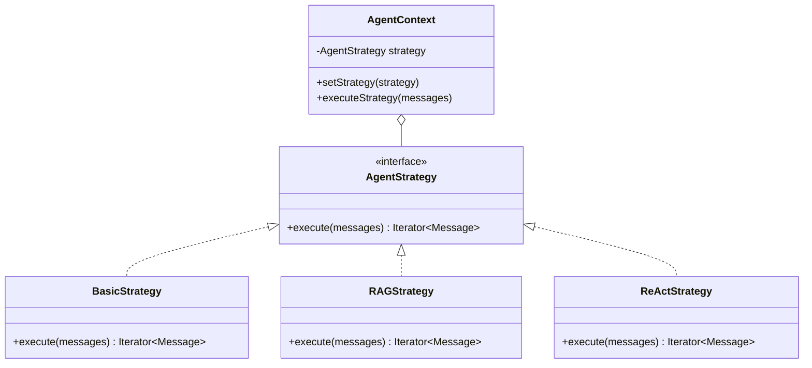

# Qwen-Agent 继承关系与结构分析

## 1. 整体类继承体系

### 1.1 核心类继承图



### 1.2 模块依赖关系图



## 2. 核心类详细结构分析

### 2.1 Agent 基类结构

```python
class Agent(ABC):
    """
    智能体抽象基类
    
    设计模式:
    - 模板方法模式: run() 定义算法骨架，_run() 由子类实现
    - 策略模式: 不同智能体采用不同的执行策略
    - 工厂模式: 通过配置创建不同类型的智能体
    
    核心职责:
    - 定义智能体统一接口
    - 管理 LLM 和工具资源
    - 处理消息格式转换
    - 提供基础的错误处理
    """
    
    # 类属性
    name: str                           # 智能体名称
    description: str                    # 智能体描述
    system_message: str                 # 系统消息
    
    # 实例属性
    llm: BaseChatModel                  # LLM 实例
    function_map: Dict[str, BaseTool]   # 工具映射表
    extra_generate_cfg: Dict            # 额外生成配置
    
    # 核心方法
    def __init__(self, function_list, llm, system_message, name, description):
        """初始化智能体"""
        pass
    
    def run(self, messages: List[Union[Dict, Message]], **kwargs) -> Iterator[List[Message]]:
        """
        智能体运行主入口 (模板方法)
        
        算法步骤:
        1. 消息格式标准化
        2. 语言自动检测  
        3. 系统消息注入
        4. 调用子类 _run() 方法
        5. 响应格式化
        """
        pass
    
    @abstractmethod
    def _run(self, messages: List[Message], **kwargs) -> Iterator[List[Message]]:
        """子类必须实现的核心逻辑 (策略方法)"""
        pass
    
    def _call_llm(self, messages, functions=None, **kwargs) -> Iterator[List[Message]]:
        """LLM 调用封装"""
        pass
    
    def _call_tool(self, tool_name: str, tool_args: str, **kwargs) -> str:
        """工具调用封装"""
        pass
    
    def _detect_tool(self, message: Message) -> Tuple[bool, str, str, str]:
        """工具调用检测"""
        pass
```

### 2.2 智能体类型特化



### 2.3 LLM 模块类层次

```python
class BaseChatModel(ABC):
    """
    LLM 基类
    
    设计模式:
    - 适配器模式: 适配不同的 LLM API
    - 装饰器模式: 添加缓存、重试等功能
    - 工厂方法模式: 创建具体的 LLM 实例
    
    核心职责:
    - 定义统一的 LLM 调用接口
    - 处理消息格式转换
    - 提供流式和非流式输出
    - 实现重试和错误处理机制
    """
    
    # 基础属性
    model: str                    # 模型名称
    api_key: str                  # API 密钥
    model_server: str             # 模型服务地址
    generate_cfg: Dict            # 生成配置
    
    # 功能属性
    support_multimodal_input: bool   # 是否支持多模态输入
    support_multimodal_output: bool  # 是否支持多模态输出
    use_raw_api: bool               # 是否使用原生 API
    max_retries: int                # 最大重试次数
    
    @abstractmethod
    def chat(self, messages, functions=None, stream=True, **kwargs) -> Iterator[List[Message]]:
        """聊天接口 - 子类必须实现"""
        pass
    
    def _preprocess_messages(self, messages, **kwargs) -> List[Message]:
        """消息预处理"""
        pass
    
    def _postprocess_messages(self, messages, **kwargs) -> List[Message]:
        """消息后处理"""
        pass

class BaseFnCallModel(BaseChatModel):
    """
    函数调用增强 LLM
    
    新增能力:
    - 函数调用消息处理
    - 并行函数调用支持
    - 函数选择策略
    """
    
    fncall_prompt: FnCallPrompt      # 函数调用提示处理器
    
    def _chat_with_functions(self, messages, functions, **kwargs):
        """带函数调用的聊天实现"""
        pass
    
    def _preprocess_messages(self, messages, functions=None, **kwargs):
        """增强的消息预处理 - 处理函数调用"""
        pass

# 具体实现类
class QwenChatAtDS(BaseFnCallModel):
    """DashScope Qwen 模型实现"""
    pass

class OpenAIModel(BaseFnCallModel):
    """OpenAI 兼容模型实现"""
    pass

class QwenVLChatAtDS(QwenChatAtDS):
    """多模态 Qwen 模型实现"""
    pass
```

### 2.4 工具系统类结构

```python
class BaseTool(ABC):
    """
    工具抽象基类
    
    设计模式:
    - 命令模式: 每个工具是一个可执行的命令
    - 注册表模式: 通过装饰器自动注册工具
    - 模板方法模式: call() 定义执行流程
    
    核心职责:
    - 定义工具统一接口
    - 参数验证和类型转换
    - 结果格式化
    - 错误处理
    """
    
    # 工具元数据
    name: str                    # 工具名称
    description: str             # 工具描述
    parameters: List[Dict]       # 参数定义
    
    # 配置属性
    timeout: int                 # 超时时间
    max_retries: int            # 最大重试次数
    cache_enabled: bool         # 是否启用缓存
    
    @abstractmethod
    def call(self, params: str, **kwargs) -> Union[str, List[ContentItem]]:
        """工具执行接口 - 子类必须实现"""
        pass
    
    @property
    def function(self) -> Dict:
        """生成 OpenAI 函数调用格式"""
        pass
    
    def validate_parameters(self, params: Dict) -> Dict:
        """参数验证"""
        pass
    
    def format_result(self, result: Any) -> Union[str, List[ContentItem]]:
        """结果格式化"""
        pass

# 工具注册机制
TOOL_REGISTRY: Dict[str, Type[BaseTool]] = {}

def register_tool(name: str):
    """工具注册装饰器"""
    def decorator(cls):
        cls.name = name
        TOOL_REGISTRY[name] = cls
        return cls
    return decorator

# 具体工具实现
@register_tool('code_interpreter')
class CodeInterpreter(BaseTool):
    """代码解释器工具"""
    
    kernel_manager: KernelManager    # Jupyter 内核管理器
    kernel_client: KernelClient      # 内核客户端
    
    def call(self, params: str, **kwargs) -> str:
        """执行 Python 代码"""
        pass
    
    def _execute_code_safely(self, code: str) -> Dict:
        """安全执行代码"""
        pass

@register_tool('web_search')
class WebSearch(BaseTool):
    """网络搜索工具"""
    
    bing_api_key: str           # Bing API 密钥
    google_api_key: str         # Google API 密钥
    
    def call(self, params: str, **kwargs) -> str:
        """执行网络搜索"""
        pass
```

## 3. 关键设计模式分析

### 3.1 模板方法模式



**优势**:
- 代码复用: 公共逻辑在基类中实现
- 扩展性: 子类只需实现特定逻辑
- 一致性: 保证所有智能体的执行流程一致

### 3.2 策略模式



**应用场景**:
- 不同智能体采用不同的执行策略
- LLM 模型的不同实现策略
- 检索算法的不同策略选择

### 3.3 工厂模式

```python
class AgentFactory:
    """智能体工厂类"""
    
    @staticmethod
    def create_agent(agent_type: str, config: Dict) -> Agent:
        """
        根据类型和配置创建智能体
        
        工厂方法模式的应用:
        - 封装对象创建逻辑
        - 支持运行时类型选择
        - 便于扩展新的智能体类型
        """
        
        if agent_type == 'assistant':
            return Assistant(
                function_list=config.get('function_list'),
                llm=config.get('llm'),
                files=config.get('files'),
                rag_cfg=config.get('rag_cfg')
            )
        elif agent_type == 'react_chat':
            return ReActChat(
                function_list=config.get('function_list'),
                llm=config.get('llm')
            )
        elif agent_type == 'group_chat':
            return GroupChat(
                agents=config.get('agents'),
                max_turns=config.get('max_turns', 10)
            )
        else:
            raise ValueError(f"Unknown agent type: {agent_type}")

class LLMFactory:
    """LLM 工厂类"""
    
    @staticmethod
    def create_llm(model_config: Dict) -> BaseChatModel:
        """根据配置创建 LLM 实例"""
        
        model_type = model_config.get('model_type', 'qwen_dashscope')
        
        if model_type == 'qwen_dashscope':
            return QwenChatAtDS(**model_config)
        elif model_type == 'openai':
            return OpenAIModel(**model_config)
        elif model_type == 'qwenvl_dashscope':
            return QwenVLChatAtDS(**model_config)
        else:
            raise ValueError(f"Unknown model type: {model_type}")
```

### 3.4 观察者模式

```python
class EventBus:
    """事件总线 - 观察者模式实现"""
    
    def __init__(self):
        self._listeners: Dict[str, List[Callable]] = {}
    
    def subscribe(self, event_type: str, listener: Callable):
        """订阅事件"""
        if event_type not in self._listeners:
            self._listeners[event_type] = []
        self._listeners[event_type].append(listener)
    
    def publish(self, event_type: str, data: Any):
        """发布事件"""
        if event_type in self._listeners:
            for listener in self._listeners[event_type]:
                try:
                    listener(data)
                except Exception as e:
                    logger.error(f"Event listener error: {e}")

class Agent(ABC):
    """智能体基类 - 集成事件机制"""
    
    def __init__(self, **kwargs):
        self.event_bus = EventBus()
        
        # 订阅事件
        self.event_bus.subscribe('tool_call_start', self._on_tool_call_start)
        self.event_bus.subscribe('tool_call_end', self._on_tool_call_end)
        self.event_bus.subscribe('llm_call_start', self._on_llm_call_start)
        self.event_bus.subscribe('llm_call_end', self._on_llm_call_end)
    
    def _call_tool(self, tool_name: str, tool_args: str, **kwargs):
        """工具调用 - 发布事件"""
        
        # 发布开始事件
        self.event_bus.publish('tool_call_start', {
            'tool_name': tool_name,
            'args': tool_args,
            'timestamp': time.time()
        })
        
        try:
            result = super()._call_tool(tool_name, tool_args, **kwargs)
            
            # 发布结束事件
            self.event_bus.publish('tool_call_end', {
                'tool_name': tool_name,
                'result': result,
                'timestamp': time.time()
            })
            
            return result
            
        except Exception as e:
            # 发布错误事件
            self.event_bus.publish('tool_call_error', {
                'tool_name': tool_name,
                'error': str(e),
                'timestamp': time.time()
            })
            raise
    
    def _on_tool_call_start(self, data):
        """工具调用开始事件处理"""
        logger.info(f"Tool call started: {data['tool_name']}")
    
    def _on_tool_call_end(self, data):
        """工具调用结束事件处理"""
        logger.info(f"Tool call completed: {data['tool_name']}")
```

## 4. 依赖注入与控制反转

### 4.1 依赖注入容器

```python
class DIContainer:
    """依赖注入容器"""
    
    def __init__(self):
        self._services: Dict[str, Any] = {}
        self._factories: Dict[str, Callable] = {}
    
    def register_singleton(self, name: str, instance: Any):
        """注册单例服务"""
        self._services[name] = instance
    
    def register_factory(self, name: str, factory: Callable):
        """注册工厂函数"""
        self._factories[name] = factory
    
    def get(self, name: str) -> Any:
        """获取服务实例"""
        if name in self._services:
            return self._services[name]
        
        if name in self._factories:
            instance = self._factories[name]()
            self._services[name] = instance  # 缓存实例
            return instance
        
        raise ValueError(f"Service '{name}' not registered")

# 全局容器
container = DIContainer()

# 注册服务
container.register_factory('llm_factory', lambda: LLMFactory())
container.register_factory('tool_registry', lambda: TOOL_REGISTRY)
container.register_factory('event_bus', lambda: EventBus())

class Agent(ABC):
    """智能体基类 - 使用依赖注入"""
    
    def __init__(self, **kwargs):
        # 注入依赖
        self.llm_factory = container.get('llm_factory')
        self.tool_registry = container.get('tool_registry')
        self.event_bus = container.get('event_bus')
        
        # 初始化 LLM
        if 'llm' in kwargs:
            llm_config = kwargs['llm']
            if isinstance(llm_config, dict):
                self.llm = self.llm_factory.create_llm(llm_config)
            else:
                self.llm = llm_config
```

### 4.2 配置驱动的对象创建

```python
class ConfigurableAgent:
    """可配置的智能体"""
    
    @classmethod
    def from_config(cls, config_path: str) -> 'Agent':
        """从配置文件创建智能体"""
        
        with open(config_path, 'r') as f:
            config = json.load(f)
        
        # 创建 LLM
        llm_config = config.get('llm', {})
        llm = container.get('llm_factory').create_llm(llm_config)
        
        # 创建工具
        tools = []
        for tool_name in config.get('tools', []):
            if tool_name in container.get('tool_registry'):
                tool_class = container.get('tool_registry')[tool_name]
                tool_config = config.get('tool_configs', {}).get(tool_name, {})
                tools.append(tool_class(tool_config))
        
        # 创建智能体
        agent_type = config.get('type', 'assistant')
        agent_config = {
            'llm': llm,
            'function_list': tools,
            'system_message': config.get('system_message'),
            'name': config.get('name'),
            'description': config.get('description')
        }
        
        return AgentFactory.create_agent(agent_type, agent_config)
```

## 5. 类关系总结

### 5.1 继承关系总结

| 基类 | 子类 | 关系类型 | 主要扩展 |
|------|------|----------|----------|
| `Agent` | `BasicAgent` | 实现继承 | 基础对话能力 |
| `Agent` | `FnCallAgent` | 实现继承 | 工具调用能力 |
| `FnCallAgent` | `Assistant` | 扩展继承 | RAG 检索能力 |
| `FnCallAgent` | `ReActChat` | 扩展继承 | 推理行动模式 |
| `Assistant` | `ArticleAgent` | 特化继承 | 文章写作专长 |
| `BaseChatModel` | `BaseFnCallModel` | 功能继承 | 函数调用支持 |
| `BaseFnCallModel` | `QwenChatAtDS` | 实现继承 | DashScope 适配 |
| `BaseTool` | `CodeInterpreter` | 实现继承 | 代码执行能力 |

### 5.2 组合关系总结

| 容器类 | 组件类 | 关系类型 | 说明 |
|--------|--------|----------|------|
| `Agent` | `BaseChatModel` | 聚合 | 智能体使用 LLM |
| `FnCallAgent` | `Memory` | 组合 | 智能体拥有记忆 |
| `Agent` | `BaseTool` | 聚合 | 智能体使用工具 |
| `GroupChat` | `Agent` | 聚合 | 群聊管理多个智能体 |
| `Memory` | `DocumentParser` | 组合 | 记忆系统拥有解析器 |
| `Memory` | `HybridRetriever` | 组合 | 记忆系统拥有检索器 |

### 5.3 设计原则遵循

1. **单一职责原则 (SRP)**
   - 每个类只负责一个明确的功能
   - `Agent` 负责智能体逻辑，`BaseTool` 负责工具执行

2. **开闭原则 (OCP)**
   - 对扩展开放：可以轻松添加新的智能体类型和工具
   - 对修改封闭：基类接口稳定，不需要修改现有代码

3. **里氏替换原则 (LSP)**
   - 子类可以替换父类使用
   - 所有 `Agent` 子类都可以通过基类接口调用

4. **接口隔离原则 (ISP)**
   - 接口设计精简，避免强制实现不需要的方法
   - 工具接口只包含必要的 `call()` 方法

5. **依赖倒置原则 (DIP)**
   - 依赖抽象而非具体实现
   - `Agent` 依赖 `BaseChatModel` 抽象，而非具体的 LLM 实现

这种设计使得 Qwen-Agent 框架具有良好的可扩展性、可维护性和可测试性，为用户提供了灵活而强大的智能体开发平台。
