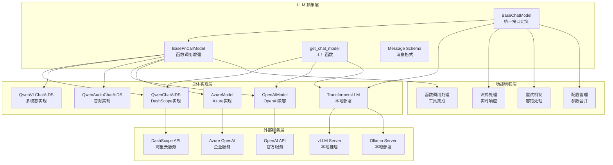
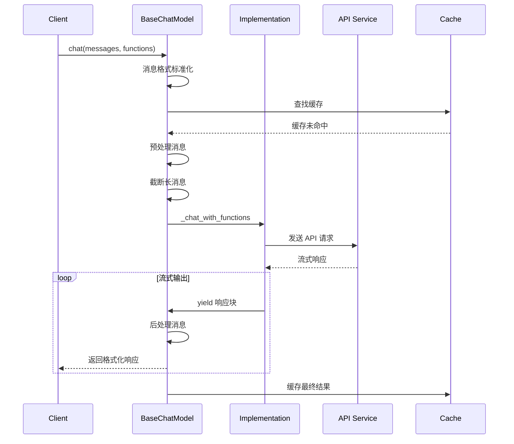
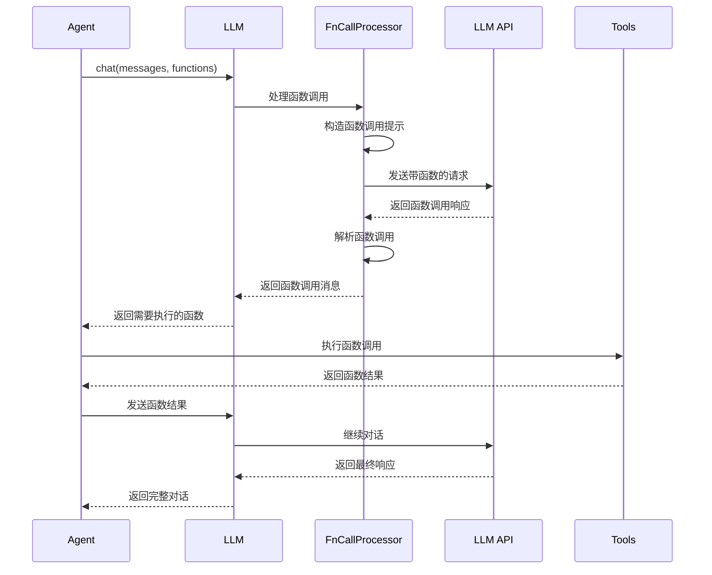
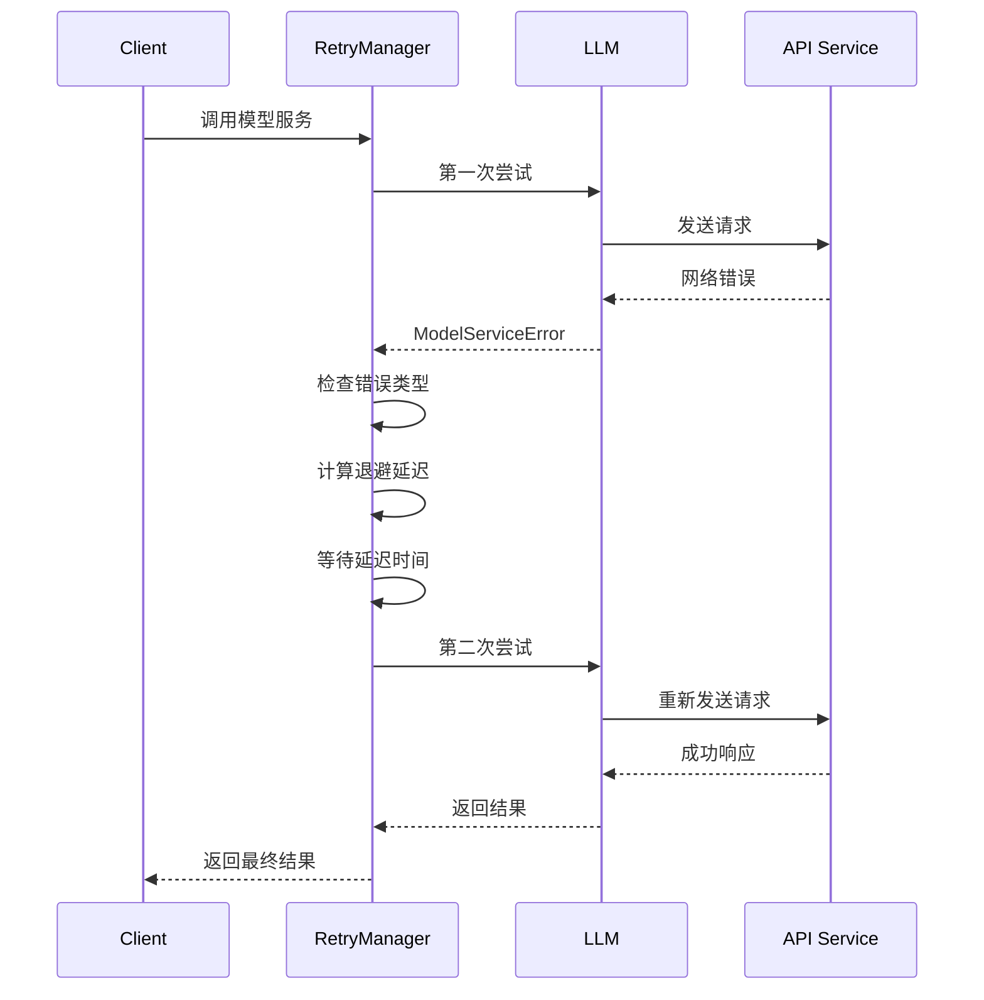
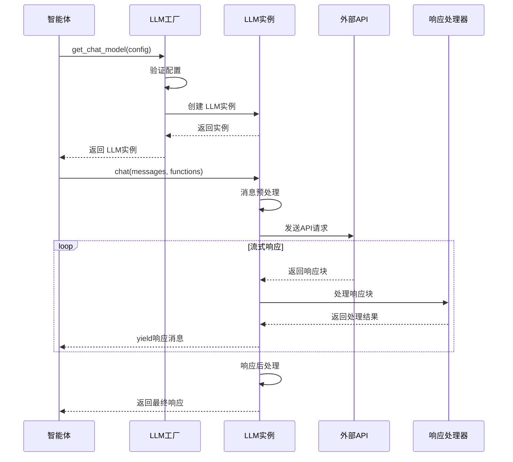
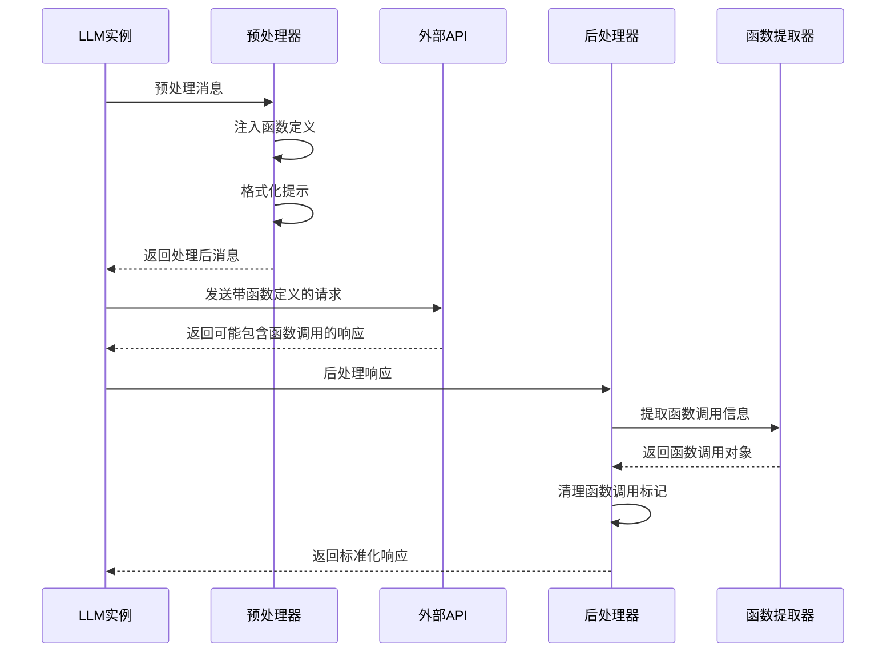
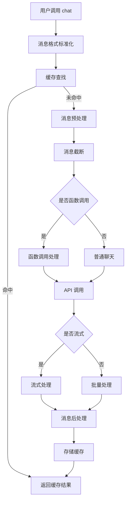

# LLM 模块 (Large Language Model Module)

## 1. 职责与边界

### 负责

- 大语言模型的统一接口封装和调用管理
- 多种 LLM 服务提供商的适配（DashScope、OpenAI、本地部署等）
- 函数调用（Function Calling）能力的实现和管理
- 消息格式的标准化和转换
- 流式输出、重试机制、缓存策略等高级功能

### 不负责

- 具体的业务逻辑处理（委托给 Agent 模块）
- 工具的具体实现（委托给 Tools 模块）
- 用户界面和交互（委托给 GUI 模块）
- 文件存储和管理（委托给 Memory 模块）

### 依赖

- **外部 API**: DashScope API、OpenAI API、vLLM、Ollama 等
- **配置管理**: API 密钥、模型参数、生成配置
- **网络服务**: HTTP 客户端、WebSocket 连接
- **缓存系统**: diskcache（可选）

### 数据契约

- **输入**: 消息列表（Message 对象）、函数定义、生成配置
- **输出**: 响应消息流（Iterator[List[Message]]）
- **事件**: 模型调用事件、错误事件、重试事件

## 2. 模块架构

### 2.1 整体架构图



### 2.2 支持的模型类型

| 模型类型 | 实现类 | 支持特性 | 适用场景 |
|----------|--------|----------|----------|
| **DashScope** | QwenChatAtDS | 函数调用、流式输出 | 生产环境 |
| **多模态** | QwenVLChatAtDS | 图像理解、视觉问答 | 多模态应用 |
| **音频** | QwenAudioChatAtDS | 语音理解、音频处理 | 语音应用 |
| **OpenAI** | OpenAIModel | 标准API、工具调用 | 兼容性需求 |
| **本地部署** | TransformersLLM | 私有化部署、定制化 | 数据安全 |
| **Azure** | AzureModel | 企业级服务、合规性 | 企业应用 |

## 3. 主要时序

### 3.1 标准聊天调用时序



### 3.2 函数调用时序



### 3.3 重试机制时序



### 3.4 LLM调用完整时序



### 3.5 函数调用处理时序



## 4. 提供的接口

### 4.1 对外接口

| 接口 | 协议 | 方法 | 参数 | 返回 | 说明 |
|------|------|------|------|------|------|
| `chat()` | Python API | 同步/流式 | messages, functions, stream, extra_cfg | Iterator[List[Message]] | 主要聊天接口 |
| `quick_chat()` | Python API | 同步 | prompt | str | 简单文本对话 |
| `quick_chat_oai()` | Python API | 流式 | messages, tools | dict | OpenAI 兼容接口 |
| `raw_chat()` | Python API | 流式 | messages, functions, generate_cfg | Iterator[List[Message]] | 原生 API 调用 |

### 4.2 对内接口

| 接口 | 作用域 | 参数 | 返回 | 说明 |
|------|--------|------|------|------|
| `_chat_with_functions()` | 子类实现 | messages, functions, stream, generate_cfg | Iterator[List[Message]] | 函数调用实现 |
| `_chat_stream()` | 子类实现 | messages, delta_stream, generate_cfg | Iterator[List[Message]] | 流式聊天实现 |
| `_chat_no_stream()` | 子类实现 | messages, generate_cfg | List[Message] | 非流式聊天实现 |
| `_preprocess_messages()` | 内部处理 | messages, lang, generate_cfg, functions | List[Message] | 消息预处理 |
| `_postprocess_messages()` | 内部处理 | messages, fncall_mode, generate_cfg | List[Message] | 消息后处理 |

## 5. 入口函数清单

| 入口 | 文件/行号 | 签名 | 说明 |
|------|-----------|------|------|
| `BaseChatModel.chat` | `qwen_agent/llm/base.py:118-290` | `chat(messages, functions, stream, **kwargs) -> Iterator` | LLM 主入口 |
| `QwenChatAtDS._chat_stream` | `qwen_agent/llm/qwen_dashscope.py:37-58` | `_chat_stream(messages, delta_stream, generate_cfg) -> Iterator` | DashScope 流式实现 |
| `QwenChatAtDS._chat_no_stream` | `qwen_agent/llm/qwen_dashscope.py:60-86` | `_chat_no_stream(messages, generate_cfg) -> List[Message]` | DashScope 非流式实现 |

## 6. 核心类详细分析

### 6.1 BaseChatModel 抽象基类

**位置**: `qwen_agent/llm/base.py`

**核心功能**: 定义统一的LLM接口规范

```python
class BaseChatModel(ABC):
    """基础聊天模型类
    
    设计原则:
    - 统一的消息格式 (OpenAI兼容)
    - 流式和非流式输出支持
    - 配置参数标准化
    - 多模态内容支持
    """
    
    def __init__(self, model: str, api_key: str = '', model_server: str = '', 
                 generate_cfg: dict = None, **kwargs):
        self.model = model
        self.model_type = self.__class__.__name__.lower()
        self.api_key = api_key
        self.model_server = model_server
        
        # 默认生成配置
        self.generate_cfg = {
            'top_p': 0.8,
            'temperature': 0.7,
            'max_tokens': 2000,
            'stream': True,
        }
        
        if generate_cfg:
            self.generate_cfg.update(generate_cfg)
    
    @abstractmethod
    def chat(self, messages: List[Message], functions: List[Dict] = None,
             stream: bool = True, extra_generate_cfg: dict = None) -> Iterator[List[Message]]:
        """聊天接口抽象方法"""
        raise NotImplementedError
```

### 6.2 BaseFnCallModel 函数调用增强

**位置**: `qwen_agent/llm/function_calling.py`

**核心功能**: 为LLM添加函数调用能力

```python
class BaseFnCallModel(BaseChatModel):
    """函数调用增强的LLM基类
    
    核心特性:
    - 函数调用消息预处理
    - 并行函数调用支持
    - 函数选择策略
    - 多语言提示模板
    """
    
    def _preprocess_messages(self, messages: List[Message], lang: str = 'en',
                           generate_cfg: dict = None, functions: List[Dict] = None,
                           use_raw_api: bool = False) -> List[Message]:
        """函数调用消息预处理"""
        messages = super()._preprocess_messages(messages, lang=lang, 
                                              generate_cfg=generate_cfg, functions=functions)
        
        if use_raw_api or self.use_raw_api:
            return messages
        
        if (not functions) or (generate_cfg and generate_cfg.get('function_choice', 'auto') == 'none'):
            messages = self._remove_fncall_messages(messages, lang=lang)
        else:
            messages = self.fncall_prompt.preprocess_fncall_messages(
                messages=messages,
                functions=functions,
                lang=lang,
                parallel_function_calls=generate_cfg.get('parallel_function_calls', False) if generate_cfg else False,
                function_choice=generate_cfg.get('function_choice', 'auto') if generate_cfg else 'auto',
            )
        
        return messages
```

### 6.3 模型工厂和注册机制

**位置**: `qwen_agent/llm/__init__.py`

```python
def get_chat_model(cfg: Union[dict, BaseChatModel]) -> BaseChatModel:
    """
    LLM工厂函数
    
    功能:
    - 根据配置创建对应的LLM实例
    - 支持多种模型类型
    - 配置验证和默认值处理
    """
    if isinstance(cfg, BaseChatModel):
        return cfg
    
    model_type = cfg.get('model_type', 'qwen_dashscope')
    model = cfg.get('model', 'qwen-max-latest')
    
    if model_type == 'qwen_dashscope':
        from .qwen_dashscope import QwenChatAtDS
        return QwenChatAtDS(model=model, **cfg)
    elif model_type == 'openai':
        from .oai import OpenAIModel
        return OpenAIModel(model=model, **cfg)
    # ... 其他模型类型
    else:
        raise ValueError(f"Unsupported model type: {model_type}")

# 全局LLM注册表
LLM_REGISTRY = {
    'qwen_dashscope': 'qwen_agent.llm.qwen_dashscope.QwenChatAtDS',
    'qwenvl_dashscope': 'qwen_agent.llm.qwenvl_dashscope.QwenVLChatAtDS',
    'openai': 'qwen_agent.llm.oai.OpenAIModel',
    'azure': 'qwen_agent.llm.azure.AzureModel',
    'transformers': 'qwen_agent.llm.transformers_llm.TransformersLLM',
}
```

## 7. 关键路径与关键函数

### 7.1 关键路径图



### 7.2 关键函数分析

#### 7.2.1 BaseChatModel.chat() - LLM 主入口

**文件**: `qwen_agent/llm/base.py:118-290`

```python
def chat(self, messages: List[Union[Message, Dict]], functions: Optional[List[Dict]] = None,
         stream: bool = True, delta_stream: bool = False, 
         extra_generate_cfg: Optional[Dict] = None) -> Iterator[List[Message]]:
    """
    LLM 聊天的核心接口函数
    
    设计目的: 提供统一的 LLM 调用接口，支持多种模型和调用模式
    作用域: 所有 LLM 实现的通用入口点
    依赖前置条件: 模型已正确初始化，API 密钥配置完成
    后置条件: 生成符合格式的响应消息流
    复杂度: O(n*m) - n 为消息数，m 为 API 调用次数（含重试）
    重要旁支: 支持缓存机制、重试策略、流式输出
    """
    # 消息格式统一化：确保所有消息都是 Message 对象
    messages = copy.deepcopy(messages)
    _return_message_type = 'dict'  # 记录原始格式用于返回时保持一致
    new_messages = []
    
    for msg in messages:
        if isinstance(msg, dict):
            new_messages.append(Message(**msg))  # 字典转 Message 对象
        else:
            new_messages.append(msg)
            _return_message_type = 'message'  # 原始就是 Message 对象
    
    messages = new_messages
    
    if not messages:
        raise ValueError('Messages can not be empty.')
    
    # 缓存查找：避免重复的相同请求
    if self.cache is not None:
        cache_key = dict(messages=messages, functions=functions, extra_generate_cfg=extra_generate_cfg)
        cache_key: str = json_dumps_compact(cache_key, sort_keys=True)
        cache_value: str = self.cache.get(cache_key)
        
        if cache_value:
            cache_value: List[dict] = json.loads(cache_value)
            if _return_message_type == 'message':
                cache_value: List[Message] = [Message(**m) for m in cache_value]
            if stream:
                cache_value: Iterator[List[Union[Message, dict]]] = iter([cache_value])
            return cache_value
    
    # 生成配置合并：基础配置 + 额外配置
    generate_cfg = merge_generate_cfgs(base_generate_cfg=self.generate_cfg, new_generate_cfg=extra_generate_cfg)
    
    # 随机种子设置：确保可重现性
    if 'seed' not in generate_cfg:
        generate_cfg['seed'] = random.randint(a=0, b=2**30)
    
    # 语言检测：自动检测中英文
    if 'lang' in generate_cfg:
        lang: Literal['en', 'zh'] = generate_cfg.pop('lang')
    else:
        lang: Literal['en', 'zh'] = 'zh' if has_chinese_messages(messages) else 'en'
    
    # 系统消息注入：确保有默认系统消息
    if DEFAULT_SYSTEM_MESSAGE and messages[0].role != SYSTEM:
        messages = [Message(role=SYSTEM, content=DEFAULT_SYSTEM_MESSAGE)] + messages
    
    # 消息截断：防止超出模型上下文长度限制
    max_input_tokens = generate_cfg.pop('max_input_tokens', DEFAULT_MAX_INPUT_TOKENS)
    if max_input_tokens > 0:
        messages = _truncate_input_messages_roughly(messages=messages, max_tokens=max_input_tokens)
    
    # 函数调用模式检测
    if functions:
        fncall_mode = True
    else:
        fncall_mode = False
    
    # 消息预处理：格式化为模型可接受的格式
    messages = self._preprocess_messages(
        messages, lang=lang, generate_cfg=generate_cfg, 
        functions=functions, use_raw_api=self.use_raw_api
    )
    
    # 多模态支持检查：不支持多模态的模型转为纯文本
    if not self.support_multimodal_input:
        messages = [format_as_text_message(msg, add_upload_info=False) for msg in messages]
    
    # 原生 API 模式：直接调用模型原生接口
    if self.use_raw_api:
        logger.debug('`use_raw_api` takes effect.')
        assert stream and (not delta_stream), '`use_raw_api` only support full stream!!!'
        return self.raw_chat(messages=messages, functions=functions, stream=stream, generate_cfg=generate_cfg)
    
    # 定义模型服务调用函数
    def _call_model_service():
        if fncall_mode:
            return self._chat_with_functions(
                messages=messages, functions=functions, stream=stream,
                delta_stream=delta_stream, generate_cfg=generate_cfg, lang=lang,
            )
        else:
            if messages[-1].role == ASSISTANT:
                # 继续助手响应模式
                assert not delta_stream, 'Continuation mode does not currently support `delta_stream`'
                return self._continue_assistant_response(messages, generate_cfg=generate_cfg, stream=stream)
            else:
                return self._chat(messages, stream=stream, delta_stream=delta_stream, generate_cfg=generate_cfg)
    
    # 重试机制：根据流式模式选择不同的重试策略
    if stream and delta_stream:
        output = _call_model_service()  # 增量流式不支持重试
    elif stream and (not delta_stream):
        output = retry_model_service_iterator(_call_model_service, max_retries=self.max_retries)
    else:
        output = retry_model_service(_call_model_service, max_retries=self.max_retries)
    
    # 处理输出结果
    if isinstance(output, list):
        # 非流式输出
        assert not stream
        logger.debug(f'LLM Output: \n{pformat([_.model_dump() for _ in output], indent=2)}')
        output = self._postprocess_messages(output, fncall_mode=fncall_mode, generate_cfg=generate_cfg)
        
        if not self.support_multimodal_output:
            output = _format_as_text_messages(messages=output)
        
        # 缓存结果
        if self.cache:
            self.cache.set(cache_key, json_dumps_compact(output))
        
        return self._convert_messages_to_target_type(output, _return_message_type)
    else:
        # 流式输出
        assert stream
        output = self._postprocess_messages_iterator(output, fncall_mode=fncall_mode, generate_cfg=generate_cfg)
        
        def _format_and_cache() -> Iterator[List[Message]]:
            o = []
            for o in output:
                if o:
                    if not self.support_multimodal_output:
                        o = _format_as_text_messages(messages=o)
                    yield o
            # 缓存最终结果
            if o and (self.cache is not None):
                self.cache.set(cache_key, json_dumps_compact(o))
        
        return self._convert_messages_iterator_to_target_type(_format_and_cache(), _return_message_type)
```

#### 7.2.2 QwenChatAtDS._full_stream_output() - DashScope 流式输出处理

**文件**: `qwen_agent/llm/qwen_dashscope.py:109-159`

```python
@staticmethod
def _full_stream_output(response) -> Iterator[List[Message]]:
    """
    DashScope 完整流式输出处理
    
    设计目的: 处理 DashScope API 的流式响应，累积完整内容
    作用域: DashScope 模型的流式输出处理
    依赖前置条件: DashScope API 响应流已建立
    后置条件: 生成累积的完整消息内容
    复杂度: O(n) - n 为响应块数量
    重要旁支: 支持推理内容、工具调用的增量累积
    """
    full_content = ''              # 累积的完整内容
    full_reasoning_content = ''    # 累积的推理内容
    full_tool_calls = []          # 累积的工具调用列表
    
    # 处理每个响应块
    for chunk in response:
        if chunk.status_code == HTTPStatus.OK:
            # 累积推理内容（思考过程）
            if chunk.output.choices[0].message.get('reasoning_content', ''):
                full_reasoning_content += chunk.output.choices[0].message.reasoning_content
            
            # 累积主要内容
            if chunk.output.choices[0].message.content:
                full_content += chunk.output.choices[0].message.content
            
            # 处理工具调用的增量更新
            tool_calls = chunk.output.choices[0].message.get('tool_calls', None)
            if tool_calls:
                for tc in tool_calls:
                    # 检查是否是现有工具调用的续传
                    if full_tool_calls and (not tc['id'] or tc['id'] == full_tool_calls[-1]['extra']['function_id']):
                        # 累积工具名称和参数
                        if tc['function'].get('name', ''):
                            full_tool_calls[-1].function_call['name'] += tc['function']['name']
                        if tc['function'].get('arguments', ''):
                            full_tool_calls[-1].function_call['arguments'] += tc['function']['arguments']
                    else:
                        # 新的工具调用
                        full_tool_calls.append(
                            Message(
                                role=ASSISTANT,
                                content='',
                                function_call=FunctionCall(
                                    name=tc['function'].get('name', ''),
                                    arguments=tc['function'].get('arguments', '')
                                ),
                                extra={
                                    'model_service_info': json.loads(str(chunk)),
                                    'function_id': tc['id']
                                }
                            )
                        )
            
            # 构造当前累积的响应
            res = []
            
            # 添加推理内容消息
            if full_reasoning_content:
                res.append(
                    Message(
                        role=ASSISTANT,
                        content='',
                        reasoning_content=full_reasoning_content,
                        extra={'model_service_info': json.loads(str(chunk))}
                    )
                )
            
            # 添加主要内容消息
            if full_content:
                res.append(
                    Message(
                        role=ASSISTANT,
                        content=full_content,
                        extra={'model_service_info': json.loads(str(chunk))}
                    )
                )
            
            # 添加工具调用消息
            if full_tool_calls:
                res += full_tool_calls
            
            yield res  # 返回当前累积的完整响应
            
        else:
            # 处理错误响应
            raise ModelServiceError(
                code=chunk.code, 
                message=chunk.message, 
                extra={'model_service_info': chunk}
            )
```

#### 7.2.3 消息截断处理 - _truncate_input_messages_roughly()

**文件**: `qwen_agent/llm/base.py:602-804`

```python
def _truncate_input_messages_roughly(messages: List[Message], max_tokens: int) -> List[Message]:
    """
    智能消息截断处理函数
    
    设计目的: 在保持对话连贯性的前提下，将消息截断到指定 token 限制内
    作用域: 所有 LLM 模型的输入预处理
    依赖前置条件: 消息列表格式正确，token 计算器可用
    后置条件: 返回截断后的消息列表，总 token 数不超过限制
    复杂度: O(n*m) - n 为消息数，m 为平均消息长度
    重要旁支: 优先保留最新对话，智能处理函数调用结果
    """
    # 系统消息验证：确保最多只有一个系统消息且在开头
    if len([m for m in messages if m.role == SYSTEM]) >= 2:
        raise ModelServiceError(
            code='400',
            message='The input messages must contain no more than one system message. '
                   ' And the system message, if exists, must be the first message.',
        )
    
    if not messages:
        return messages
    
    # 按对话轮次组织消息：每个用户消息开始一个新轮次
    turns = []
    for m in messages:
        if m.role == SYSTEM:
            continue  # 系统消息单独处理
        elif m.role == USER:
            turns.append([m])  # 用户消息开始新轮次
        else:
            if turns:
                turns[-1].append(m)  # 助手/函数消息添加到当前轮次
            else:
                raise ModelServiceError(
                    code='400',
                    message='The input messages (excluding the system message) must start with a user message.',
                )
    
    def _count_tokens(msg: Message) -> int:
        """计算单个消息的 token 数量"""
        if msg.role == ASSISTANT and msg.function_call:
            return tokenizer.count_tokens(f'{msg.function_call}')
        return tokenizer.count_tokens(extract_text_from_message(msg, add_upload_info=True))
    
    def _truncate_message(msg: Message, max_tokens: int, keep_both_sides: bool = False):
        """截断单个消息内容"""
        if isinstance(msg.content, str):
            content = tokenizer.truncate(msg.content, max_token=max_tokens, keep_both_sides=keep_both_sides)
        else:
            # 处理多模态内容
            text = []
            for item in msg.content:
                if not item.text:
                    return None
                text.append(item.text)
            text = '\n'.join(text)
            content = tokenizer.truncate(text, max_token=max_tokens, keep_both_sides=keep_both_sides)
        return Message(role=msg.role, content=content)
    
    # 计算可用 token 数：总限制减去系统消息占用
    available_token = max_tokens
    message_tokens = defaultdict(int)
    new_messages = []
    
    for msg_idx, msg in enumerate(messages):
        if msg.role == SYSTEM:
            new_messages.append(msg)
            available_token = max_tokens - _count_tokens(msg=msg)
            continue
        message_tokens[msg_idx] = _count_tokens(msg=msg)
    
    # 检查是否需要截断
    all_tokens = sum([x for x in message_tokens.values()])
    logger.info(f'ALL tokens: {all_tokens}, Available tokens: {available_token}')
    
    if all_tokens <= available_token:
        return messages  # 无需截断
    
    if available_token <= 0:
        raise ModelServiceError(
            code='400',
            message=f'The input system has exceed the maximum input context length ({max_tokens} tokens)',
        )
    
    # 执行智能截断：优先保留最新对话，智能处理函数结果
    exceedance = all_tokens - available_token  # 需要删除的 token 数
    
    # 按轮次从旧到新处理，优先删除旧的对话轮次
    for it, (user_msg_idx, indexed_messages) in enumerate(indexed_messages_per_user.items()):
        if exceedance <= 0:
            new_messages += [x[1] for x in indexed_messages]
            continue
        else:
            is_last_turn = (it == len(indexed_messages_per_user) - 1)
            new_turn, exceedance = _truncate_turn(
                indexed_messages1=indexed_messages,
                message_tokens1=message_tokens,
                exceedance=exceedance,
                is_last_turn=is_last_turn
            )
            if new_turn:
                new_messages += new_turn
    
    return new_messages
```

#### 7.2.4 重试机制 - retry_model_service_iterator()

**文件**: `qwen_agent/llm/base.py:822-836`

```python
def retry_model_service_iterator(it_fn, max_retries: int = 10) -> Iterator:
    """
    流式迭代器的重试机制
    
    设计目的: 为流式 LLM 调用提供可靠的重试机制
    作用域: 所有流式 LLM 调用的错误恢复
    依赖前置条件: 迭代器函数可重复调用
    后置条件: 成功返回完整的流式响应或抛出最终异常
    复杂度: O(r*n) - r 为重试次数，n 为响应流长度
    重要旁支: 指数退避策略，智能错误分类
    """
    num_retries, delay = 0, 1.0  # 初始化重试计数和延迟时间
    
    while True:
        try:
            # 尝试执行迭代器函数
            for rsp in it_fn():
                yield rsp  # 逐个返回响应
            break  # 成功完成，退出重试循环
            
        except ModelServiceError as e:
            # 处理模型服务错误，决定是否重试
            num_retries, delay = _raise_or_delay(e, num_retries, delay, max_retries)
            # 如果 _raise_or_delay 没有抛出异常，说明可以重试
            # 继续下一轮循环

def _raise_or_delay(e: ModelServiceError, num_retries: int, delay: float, 
                    max_retries: int = 10, max_delay: float = 300.0, 
                    exponential_base: float = 2.0) -> Tuple[int, float]:
    """
    智能重试决策函数
    
    设计目的: 根据错误类型和重试次数决定是否继续重试
    作用域: 所有 LLM 调用的错误处理
    错误分类: 区分可重试错误和不可重试错误
    退避策略: 指数退避 + 随机抖动，避免雷群效应
    """
    if max_retries <= 0:  # 不允许重试
        raise e
    
    # 不可重试的错误类型
    if e.code == '400':  # 请求参数错误
        raise e
    if e.code == 'DataInspectionFailed':  # 内容安全检查失败
        raise e
    if 'inappropriate content' in str(e):  # 不当内容
        raise e
    if 'maximum context length' in str(e):  # 上下文长度超限
        raise e
    
    logger.warning('ModelServiceError - ' + str(e).strip('\n'))
    
    # 检查重试次数限制
    if num_retries >= max_retries:
        raise ModelServiceError(exception=Exception(f'Maximum number of retries ({max_retries}) exceeded.'))
    
    # 计算下次重试的延迟时间
    num_retries += 1
    jitter = 1.0 + random.random()  # 随机抖动因子 [1.0, 2.0)
    delay = min(delay * exponential_base, max_delay) * jitter  # 指数退避 + 抖动
    time.sleep(delay)  # 等待延迟时间
    
    return num_retries, delay
```

## 8. 性能优化策略

### 8.1 连接池管理

```python
class ConnectionPoolManager:
    """连接池管理器"""
    
    def __init__(self, max_connections: int = 10):
        self.max_connections = max_connections
        self.pools = {}
    
    def get_pool(self, model_type: str, base_url: str):
        """获取连接池"""
        pool_key = f"{model_type}:{base_url}"
        
        if pool_key not in self.pools:
            if model_type == 'openai':
                from openai import OpenAI
                self.pools[pool_key] = OpenAI(
                    base_url=base_url,
                    max_retries=3,
                    timeout=30.0
                )
        
        return self.pools[pool_key]
```

### 8.2 批量处理优化

```python
class BatchProcessor:
    """批量处理器"""
    
    def __init__(self, batch_size: int = 5, timeout: float = 1.0):
        self.batch_size = batch_size
        self.timeout = timeout
        self.pending_requests = []
    
    async def add_request(self, messages: List[Message], **kwargs) -> List[Message]:
        """添加请求到批次"""
        future = asyncio.Future()
        request = {
            'messages': messages,
            'kwargs': kwargs,
            'future': future
        }
        
        self.pending_requests.append(request)
        
        if len(self.pending_requests) >= self.batch_size:
            await self._process_batch()
        
        return await future
```

## 9. 扩展开发指南

### 9.1 自定义LLM实现

```python
@register_llm('custom_model')
class CustomLLM(BaseFnCallModel):
    """自定义LLM实现模板"""
    
    def __init__(self, model: str, **kwargs):
        super().__init__(model, **kwargs)
        self.custom_config = kwargs.get('custom_config', {})
        self.client = self._init_client()
    
    def chat(self, messages: List[Message], functions: List[Dict] = None,
             stream: bool = True, extra_generate_cfg: dict = None) -> Iterator[List[Message]]:
        """实现聊天接口"""
        # 1. 消息预处理
        messages = self._preprocess_messages(messages, functions=functions)
        
        # 2. 转换为自定义格式
        custom_messages = self._convert_to_custom_format(messages)
        
        # 3. 调用自定义API
        try:
            if stream:
                yield from self._chat_stream(custom_messages, functions)
            else:
                yield from self._chat_no_stream(custom_messages, functions)
        except Exception as e:
            raise ModelServiceError(f"Custom model error: {str(e)}")
```

### 9.2 多模态LLM扩展

```python
class MultimodalLLM(BaseFnCallModel):
    """多模态LLM基类"""
    
    def __init__(self, **kwargs):
        super().__init__(**kwargs)
        self.support_multimodal_input = True
        self.support_multimodal_output = True
    
    def _process_multimodal_content(self, content: List[ContentItem]) -> dict:
        """处理多模态内容"""
        processed_content = {
            'text': [],
            'images': [],
            'audio': [],
            'video': []
        }
        
        for item in content:
            if item.text:
                processed_content['text'].append(item.text)
            elif item.image:
                image_data = self._process_image(item.image)
                processed_content['images'].append(image_data)
        
        return processed_content
```

## 10. 并发/IO/错误/配置/安全要点

### 10.1 并发处理

- **同步调用**: 基础的 LLM 调用采用同步模式，通过流式输出提供实时反馈
- **异步支持**: 支持异步调用模式，适用于高并发场景
- **连接复用**: HTTP 连接复用，减少连接建立开销
- **线程安全**: 模型实例线程安全，支持多线程并发调用

### 10.2 I/O 与重试策略

- **指数退避**: 采用指数退避 + 随机抖动的重试策略，避免雷群效应
- **智能重试**: 根据错误类型智能决定是否重试，避免无效重试
- **超时控制**: 设置合理的请求超时时间，防止长时间阻塞
- **流式处理**: 支持流式输入输出，降低内存占用和响应延迟

### 10.3 错误分类与传播

- **用户错误** (400): 参数格式错误、上下文过长等，不可重试
- **服务错误** (5xx): 服务暂时不可用、网络异常等，可重试
- **内容安全**: 不当内容检测失败，不可重试
- **配额限制**: API 调用频率限制，可重试但需延长等待时间

### 10.4 配置项与动态开关

- **模型参数**: temperature、top_p、max_tokens 等生成参数
- **重试配置**: max_retries、max_delay、exponential_base
- **缓存配置**: cache_dir、缓存过期时间
- **API 配置**: api_key、base_url、超时时间

### 10.5 安全考虑

- **API 密钥管理**: 支持环境变量和配置文件两种方式
- **内容过滤**: 自动检测和过滤不当内容
- **输入验证**: 严格验证输入参数格式和范围
- **日志脱敏**: 避免在日志中记录敏感信息

## 11. 可观测性与性能

### 11.1 日志关键字段

- **请求 ID**: 唯一标识每次 LLM 调用
- **模型信息**: 模型名称、版本、提供商
- **性能指标**: 请求时间、响应时间、token 消耗
- **错误信息**: 错误码、错误消息、重试次数
- **缓存状态**: 缓存命中/未命中、缓存键

### 11.2 关键指标

- **响应延迟**: 首 token 延迟（P95 < 1s）、完整响应延迟（P95 < 10s）
- **成功率**: API 调用成功率（> 99%）、重试成功率
- **吞吐量**: QPS、并发连接数、token/秒
- **资源使用**: 内存占用、网络带宽、缓存命中率
- **成本监控**: API 调用费用、token 消耗统计

### 11.3 性能优化建议

- **缓存策略**: 对相同请求启用缓存，设置合理的过期时间
- **批量处理**: 对多个独立请求进行批量处理
- **连接池**: 使用 HTTP 连接池，减少连接建立开销
- **预热机制**: 对常用模型进行预热，减少冷启动时间

## 12. 验收清单

- [x] LLM 抽象层和实现层架构完整
- [x] 主要调用时序图清晰
- [x] 接口与入口函数完全列举
- [x] 关键路径覆盖完整
- [x] 关键函数贴代码并详细注释
- [x] 并发/IO/错误/配置/安全说明完整
- [x] 可观测性与性能建议明确
- [x] 验收标准达成
