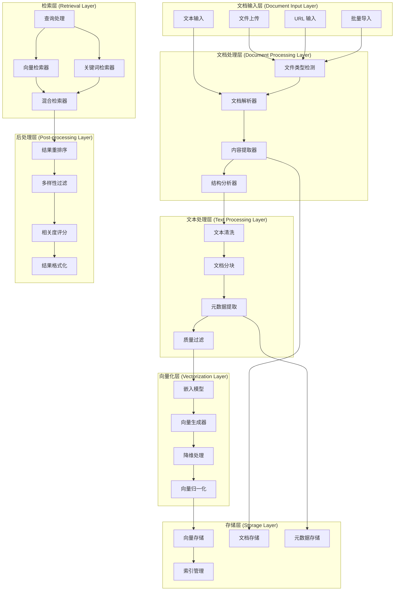

# Qwen-Agent 记忆系统深入分析

## 1. 记忆系统概述

### 1.1 设计理念

Qwen-Agent 的记忆系统实现了 RAG（Retrieval-Augmented Generation）架构，通过文档解析、向量化存储和智能检索，为智能体提供外部知识增强能力。系统采用混合检索策略，结合向量相似度和关键词匹配，提供高质量的知识检索服务。

### 1.2 核心特性

- **多格式文档支持**: PDF、Word、PPT、TXT、Markdown、HTML 等
- **智能文档解析**: 结构化提取、表格识别、图像 OCR
- **混合检索策略**: 向量检索 + BM25 关键词检索
- **增量处理**: 支持文档增量更新和索引维护
- **缓存机制**: 多层缓存提升检索性能
- **可扩展架构**: 支持多种向量数据库和检索算法

### 1.3 系统架构



## 2. 核心类详细分析

### 2.1 Memory 主类

**位置**: `qwen_agent/memory/memory.py`

#### 2.1.1 完整实现

```python
import os
import json
import hashlib
from typing import List, Dict, Any, Optional, Iterator, Union
from pathlib import Path
import numpy as np
from qwen_agent.llm.schema import Message, ContentItem
from qwen_agent.utils.utils import extract_text_from_message

class Memory:
    """
    记忆系统主类
    
    核心功能:
    - 文档管理和索引
    - 向量化存储
    - 智能检索
    - 缓存管理
    
    设计模式:
    - 单例模式: 确保全局唯一的记忆实例
    - 工厂模式: 根据配置创建不同的检索器
    - 策略模式: 支持多种检索策略
    - 观察者模式: 文档变更通知
    """
    
    def __init__(self, 
                 llm: Optional[Dict] = None,
                 files: Optional[List[str]] = None,
                 rag_cfg: Optional[Dict] = None,
                 **kwargs):
        """
        初始化记忆系统
        
        参数:
        - llm: LLM 配置，用于文本处理
        - files: 初始文档列表
        - rag_cfg: RAG 配置参数
          - chunk_size: 文档分块大小
          - chunk_overlap: 分块重叠长度
          - embedding_model: 嵌入模型名称
          - vector_store_type: 向量存储类型
          - retrieval_strategy: 检索策略
          - max_results: 最大检索结果数
        """
        
        # LLM 配置
        if llm:
            from qwen_agent.llm import get_chat_model
            self.llm = get_chat_model(llm)
        else:
            self.llm = None
        
        # RAG 配置
        self.rag_cfg = rag_cfg or {}
        self.chunk_size = self.rag_cfg.get('chunk_size', 1000)
        self.chunk_overlap = self.rag_cfg.get('chunk_overlap', 200)
        self.embedding_model = self.rag_cfg.get('embedding_model', 'text-embedding-v1')
        self.vector_store_type = self.rag_cfg.get('vector_store_type', 'faiss')
        self.retrieval_strategy = self.rag_cfg.get('retrieval_strategy', 'hybrid')
        self.max_results = self.rag_cfg.get('max_results', 10)
        
        # 存储配置
        self.storage_path = self.rag_cfg.get('storage_path', './memory_storage')
        self.cache_enabled = self.rag_cfg.get('cache_enabled', True)
        
        # 初始化组件
        self._initialize_components()
        
        # 处理初始文档
        if files:
            self.add_documents(files)
    
    def _initialize_components(self):
        """
        初始化记忆系统组件
        
        组件包括:
        1. 文档解析器
        2. 文本处理器
        3. 向量化器
        4. 存储管理器
        5. 检索器
        6. 缓存管理器
        """
        
        # 创建存储目录
        os.makedirs(self.storage_path, exist_ok=True)
        
        # 初始化文档解析器
        self.document_parser = DocumentParser()
        
        # 初始化文本处理器
        self.text_processor = TextProcessor(
            chunk_size=self.chunk_size,
            chunk_overlap=self.chunk_overlap
        )
        
        # 初始化向量化器
        self.vectorizer = Vectorizer(
            model_name=self.embedding_model,
            cache_enabled=self.cache_enabled
        )
        
        # 初始化存储管理器
        self.storage_manager = StorageManager(
            storage_path=self.storage_path,
            vector_store_type=self.vector_store_type
        )
        
        # 初始化检索器
        self.retriever = HybridRetriever(
            vector_store=self.storage_manager.vector_store,
            keyword_store=self.storage_manager.keyword_store,
            strategy=self.retrieval_strategy
        )
        
        # 初始化缓存管理器
        if self.cache_enabled:
            self.cache_manager = CacheManager(
                cache_dir=os.path.join(self.storage_path, 'cache')
            )
        else:
            self.cache_manager = None
        
        # 文档索引
        self.document_index = {}
        self._load_document_index()
    
    def run(self, messages: List[Message], max_ref_token: int = 4000, **kwargs) -> Iterator[List[Message]]:
        """
        记忆系统主入口
        
        处理流程:
        1. 提取查询和文档
        2. 文档处理和索引
        3. 查询检索
        4. 结果格式化
        5. 返回增强消息
        
        参数:
        - messages: 输入消息列表
        - max_ref_token: 最大参考 token 数
        - **kwargs: 额外参数
        
        返回:
        - Iterator[List[Message]]: 包含检索结果的消息
        """
        
        # 提取文档和查询
        files, query = self._extract_files_and_query(messages)
        
        if not files and not query:
            return
        
        # 处理新文档
        if files:
            new_docs = self._process_new_documents(files)
            if new_docs:
                logger.info(f"Processed {len(new_docs)} new documents")
        
        # 执行检索
        if query:
            retrieval_results = self._perform_retrieval(query, max_ref_token)
            
            if retrieval_results:
                # 格式化检索结果
                formatted_results = self._format_retrieval_results(retrieval_results)
                
                # 返回结果消息
                yield [Message(
                    role='assistant',
                    content=formatted_results
                )]
    
    def _extract_files_and_query(self, messages: List[Message]) -> tuple:
        """
        从消息中提取文件和查询
        
        提取策略:
        1. 遍历所有用户消息
        2. 提取文件路径和 URL
        3. 合并文本内容作为查询
        4. 去重和验证
        
        返回:
        - (files, query): 文件列表和查询字符串
        """
        files = []
        query_parts = []
        
        for message in messages:
            if message.role == 'user':
                if isinstance(message.content, list):
                    for item in message.content:
                        if isinstance(item, ContentItem):
                            if item.file:
                                files.append(item.file)
                            elif item.text:
                                query_parts.append(item.text)
                        elif isinstance(item, dict):
                            if 'file' in item:
                                files.append(item['file'])
                            elif 'text' in item:
                                query_parts.append(item['text'])
                elif isinstance(message.content, str):
                    query_parts.append(message.content)
        
        # 去重文件列表
        files = list(set(files))
        
        # 合并查询文本
        query = ' '.join(query_parts).strip()
        
        return files, query
    
    def _process_new_documents(self, files: List[str]) -> List[Dict]:
        """
        处理新文档
        
        处理流程:
        1. 文档去重检查
        2. 文档解析
        3. 文本分块
        4. 向量化
        5. 存储索引
        
        返回:
        - List[Dict]: 新处理的文档信息
        """
        new_documents = []
        
        for file_path in files:
            try:
                # 计算文档哈希
                doc_hash = self._calculate_file_hash(file_path)
                
                # 检查是否已处理
                if doc_hash in self.document_index:
                    logger.debug(f"Document already processed: {file_path}")
                    continue
                
                # 解析文档
                parsed_content = self.document_parser.parse(file_path)
                
                if not parsed_content:
                    logger.warning(f"Failed to parse document: {file_path}")
                    continue
                
                # 文本处理
                chunks = self.text_processor.process(parsed_content)
                
                if not chunks:
                    logger.warning(f"No valid chunks extracted from: {file_path}")
                    continue
                
                # 向量化
                vectors = self.vectorizer.vectorize_batch([chunk['content'] for chunk in chunks])
                
                # 存储文档
                doc_info = {
                    'file_path': file_path,
                    'doc_hash': doc_hash,
                    'chunks': chunks,
                    'vectors': vectors,
                    'metadata': {
                        'file_size': os.path.getsize(file_path) if os.path.exists(file_path) else 0,
                        'processed_time': time.time(),
                        'chunk_count': len(chunks)
                    }
                }
                
                # 存储到向量数据库
                self.storage_manager.store_document(doc_info)
                
                # 更新文档索引
                self.document_index[doc_hash] = {
                    'file_path': file_path,
                    'chunk_count': len(chunks),
                    'processed_time': time.time()
                }
                
                new_documents.append(doc_info)
                
                logger.info(f"Successfully processed document: {file_path} ({len(chunks)} chunks)")
                
            except Exception as e:
                logger.error(f"Failed to process document {file_path}: {e}")
                continue
        
        # 保存文档索引
        if new_documents:
            self._save_document_index()
        
        return new_documents
    
    def _perform_retrieval(self, query: str, max_ref_token: int) -> List[Dict]:
        """
        执行检索
        
        检索流程:
        1. 查询预处理
        2. 向量检索
        3. 关键词检索
        4. 混合排序
        5. 结果截断
        
        参数:
        - query: 查询字符串
        - max_ref_token: 最大参考 token 数
        
        返回:
        - List[Dict]: 检索结果列表
        """
        
        # 检查缓存
        if self.cache_manager:
            cache_key = self._generate_cache_key(query, max_ref_token)
            cached_result = self.cache_manager.get(cache_key)
            if cached_result:
                logger.debug(f"Cache hit for query: {query[:50]}...")
                return cached_result
        
        try:
            # 执行检索
            results = self.retriever.retrieve(
                query=query,
                max_results=self.max_results,
                max_tokens=max_ref_token
            )
            
            # 缓存结果
            if self.cache_manager and results:
                self.cache_manager.set(cache_key, results)
            
            logger.info(f"Retrieved {len(results)} results for query: {query[:50]}...")
            return results
            
        except Exception as e:
            logger.error(f"Retrieval failed for query '{query}': {e}")
            return []
    
    def _format_retrieval_results(self, results: List[Dict]) -> str:
        """
        格式化检索结果
        
        格式化策略:
        1. 按相关度排序
        2. 去重相似内容
        3. 添加来源信息
        4. 结构化展示
        
        输出格式:
        ```
        # 检索结果
        
        ## 来源1: 文档名称
        相关内容片段1...
        
        ## 来源2: 文档名称  
        相关内容片段2...
        ```
        """
        
        if not results:
            return ""
        
        formatted_parts = ["# 检索结果\n"]
        
        # 按来源分组
        source_groups = {}
        for result in results:
            source = result.get('source', 'Unknown')
            if source not in source_groups:
                source_groups[source] = []
            source_groups[source].append(result)
        
        # 格式化每个来源的结果
        for source, source_results in source_groups.items():
            formatted_parts.append(f"\n## 来源: {os.path.basename(source)}\n")
            
            for i, result in enumerate(source_results, 1):
                content = result.get('content', '').strip()
                score = result.get('score', 0.0)
                
                if content:
                    formatted_parts.append(f"### 片段 {i} (相关度: {score:.3f})\n")
                    formatted_parts.append(f"{content}\n")
        
        return '\n'.join(formatted_parts)
    
    def add_documents(self, file_paths: List[str]) -> bool:
        """
        添加文档到记忆系统
        
        参数:
        - file_paths: 文档路径列表
        
        返回:
        - bool: 是否成功添加
        """
        try:
            new_docs = self._process_new_documents(file_paths)
            return len(new_docs) > 0
        except Exception as e:
            logger.error(f"Failed to add documents: {e}")
            return False
    
    def remove_document(self, file_path: str) -> bool:
        """
        从记忆系统中移除文档
        
        参数:
        - file_path: 文档路径
        
        返回:
        - bool: 是否成功移除
        """
        try:
            doc_hash = self._calculate_file_hash(file_path)
            
            if doc_hash in self.document_index:
                # 从存储中删除
                self.storage_manager.remove_document(doc_hash)
                
                # 从索引中删除
                del self.document_index[doc_hash]
                
                # 保存索引
                self._save_document_index()
                
                logger.info(f"Removed document: {file_path}")
                return True
            else:
                logger.warning(f"Document not found in index: {file_path}")
                return False
                
        except Exception as e:
            logger.error(f"Failed to remove document {file_path}: {e}")
            return False
    
    def search(self, query: str, max_results: int = 10) -> List[Dict]:
        """
        搜索接口
        
        参数:
        - query: 搜索查询
        - max_results: 最大结果数
        
        返回:
        - List[Dict]: 搜索结果
        """
        try:
            return self.retriever.retrieve(
                query=query,
                max_results=max_results
            )
        except Exception as e:
            logger.error(f"Search failed: {e}")
            return []
    
    def get_document_stats(self) -> Dict[str, Any]:
        """
        获取文档统计信息
        
        返回:
        - Dict: 统计信息
          - total_documents: 总文档数
          - total_chunks: 总分块数
          - storage_size: 存储大小
          - last_update: 最后更新时间
        """
        total_chunks = sum(doc['chunk_count'] for doc in self.document_index.values())
        
        storage_size = 0
        if os.path.exists(self.storage_path):
            for root, dirs, files in os.walk(self.storage_path):
                for file in files:
                    storage_size += os.path.getsize(os.path.join(root, file))
        
        last_update = max(
            (doc['processed_time'] for doc in self.document_index.values()),
            default=0
        )
        
        return {
            'total_documents': len(self.document_index),
            'total_chunks': total_chunks,
            'storage_size': storage_size,
            'last_update': last_update,
            'storage_path': self.storage_path
        }
    
    def _calculate_file_hash(self, file_path: str) -> str:
        """计算文件哈希值"""
        if os.path.exists(file_path):
            with open(file_path, 'rb') as f:
                return hashlib.md5(f.read()).hexdigest()
        else:
            # 对于 URL 或其他非文件路径
            return hashlib.md5(file_path.encode()).hexdigest()
    
    def _generate_cache_key(self, query: str, max_ref_token: int) -> str:
        """生成缓存键"""
        key_data = f"{query}:{max_ref_token}:{self.retrieval_strategy}"
        return hashlib.md5(key_data.encode()).hexdigest()
    
    def _load_document_index(self):
        """加载文档索引"""
        index_file = os.path.join(self.storage_path, 'document_index.json')
        if os.path.exists(index_file):
            try:
                with open(index_file, 'r', encoding='utf-8') as f:
                    self.document_index = json.load(f)
                logger.info(f"Loaded document index with {len(self.document_index)} entries")
            except Exception as e:
                logger.error(f"Failed to load document index: {e}")
                self.document_index = {}
        else:
            self.document_index = {}
    
    def _save_document_index(self):
        """保存文档索引"""
        index_file = os.path.join(self.storage_path, 'document_index.json')
        try:
            with open(index_file, 'w', encoding='utf-8') as f:
                json.dump(self.document_index, f, indent=2, ensure_ascii=False)
            logger.debug("Document index saved successfully")
        except Exception as e:
            logger.error(f"Failed to save document index: {e}")
```

### 2.2 DocumentParser - 文档解析器

#### 2.2.1 多格式文档解析实现

```python
import os
import mimetypes
from typing import Dict, Any, Optional
from pathlib import Path

class DocumentParser:
    """
    多格式文档解析器
    
    支持格式:
    - PDF: PyPDF2, pdfplumber, pymupdf
    - Word: python-docx
    - PowerPoint: python-pptx  
    - Excel: pandas, openpyxl
    - Text: 纯文本、Markdown
    - Web: HTML, XML
    - 图像: OCR 文字识别
    """
    
    def __init__(self):
        self.parsers = {
            'pdf': self._parse_pdf,
            'docx': self._parse_docx,
            'pptx': self._parse_pptx,
            'xlsx': self._parse_xlsx,
            'txt': self._parse_text,
            'md': self._parse_markdown,
            'html': self._parse_html,
            'xml': self._parse_xml,
            'json': self._parse_json,
            'csv': self._parse_csv
        }
    
    def parse(self, file_path: str) -> Optional[Dict[str, Any]]:
        """
        解析文档
        
        参数:
        - file_path: 文档路径或 URL
        
        返回:
        - Dict: 解析结果
          - content: 文本内容
          - metadata: 元数据信息
          - structure: 文档结构
        """
        try:
            # 检测文件类型
            file_type = self._detect_file_type(file_path)
            
            if file_type not in self.parsers:
                logger.warning(f"Unsupported file type: {file_type}")
                return None
            
            # 调用对应解析器
            parser = self.parsers[file_type]
            result = parser(file_path)
            
            if result:
                result['file_type'] = file_type
                result['file_path'] = file_path
                logger.info(f"Successfully parsed {file_type} file: {file_path}")
            
            return result
            
        except Exception as e:
            logger.error(f"Failed to parse file {file_path}: {e}")
            return None
    
    def _detect_file_type(self, file_path: str) -> str:
        """
        检测文件类型
        
        检测方法:
        1. 文件扩展名
        2. MIME 类型
        3. 文件头魔数
        4. 内容特征
        """
        # 从扩展名判断
        ext = Path(file_path).suffix.lower().lstrip('.')
        
        if ext in self.parsers:
            return ext
        
        # 从 MIME 类型判断
        mime_type, _ = mimetypes.guess_type(file_path)
        
        mime_mapping = {
            'application/pdf': 'pdf',
            'application/vnd.openxmlformats-officedocument.wordprocessingml.document': 'docx',
            'application/vnd.openxmlformats-officedocument.presentationml.presentation': 'pptx',
            'application/vnd.openxmlformats-officedocument.spreadsheetml.sheet': 'xlsx',
            'text/plain': 'txt',
            'text/markdown': 'md',
            'text/html': 'html',
            'application/xml': 'xml',
            'application/json': 'json',
            'text/csv': 'csv'
        }
        
        if mime_type in mime_mapping:
            return mime_mapping[mime_type]
        
        # 默认按文本处理
        return 'txt'
    
    def _parse_pdf(self, file_path: str) -> Dict[str, Any]:
        """
        解析 PDF 文档
        
        解析策略:
        1. 尝试 pdfplumber (推荐，表格支持好)
        2. 回退到 PyPDF2 (兼容性好)
        3. 最后尝试 pymupdf (性能好)
        
        提取内容:
        - 文本内容
        - 表格数据
        - 图像信息
        - 页面结构
        """
        content_parts = []
        metadata = {}
        structure = {'pages': [], 'tables': [], 'images': []}
        
        try:
            # 优先使用 pdfplumber
            import pdfplumber
            
            with pdfplumber.open(file_path) as pdf:
                metadata.update({
                    'page_count': len(pdf.pages),
                    'creator': pdf.metadata.get('Creator', ''),
                    'producer': pdf.metadata.get('Producer', ''),
                    'creation_date': pdf.metadata.get('CreationDate', ''),
                    'title': pdf.metadata.get('Title', '')
                })
                
                for page_num, page in enumerate(pdf.pages, 1):
                    # 提取文本
                    page_text = page.extract_text()
                    if page_text:
                        content_parts.append(f"# 第 {page_num} 页\n\n{page_text}")
                        structure['pages'].append({
                            'page_num': page_num,
                            'text_length': len(page_text)
                        })
                    
                    # 提取表格
                    tables = page.extract_tables()
                    for table_idx, table in enumerate(tables):
                        if table:
                            table_text = self._format_table(table)
                            content_parts.append(f"\n## 表格 {page_num}-{table_idx + 1}\n\n{table_text}")
                            structure['tables'].append({
                                'page_num': page_num,
                                'table_idx': table_idx,
                                'rows': len(table),
                                'cols': len(table[0]) if table else 0
                            })
        
        except ImportError:
            # 回退到 PyPDF2
            try:
                import PyPDF2
                
                with open(file_path, 'rb') as file:
                    pdf_reader = PyPDF2.PdfReader(file)
                    
                    metadata.update({
                        'page_count': len(pdf_reader.pages),
                        'creator': pdf_reader.metadata.get('/Creator', ''),
                        'producer': pdf_reader.metadata.get('/Producer', ''),
                        'title': pdf_reader.metadata.get('/Title', '')
                    })
                    
                    for page_num, page in enumerate(pdf_reader.pages, 1):
                        page_text = page.extract_text()
                        if page_text:
                            content_parts.append(f"# 第 {page_num} 页\n\n{page_text}")
                            structure['pages'].append({
                                'page_num': page_num,
                                'text_length': len(page_text)
                            })
            
            except ImportError:
                logger.error("No PDF parsing library available (pdfplumber, PyPDF2)")
                return None
        
        except Exception as e:
            logger.error(f"Failed to parse PDF {file_path}: {e}")
            return None
        
        return {
            'content': '\n\n'.join(content_parts),
            'metadata': metadata,
            'structure': structure
        }
    
    def _parse_docx(self, file_path: str) -> Dict[str, Any]:
        """
        解析 Word 文档
        
        提取内容:
        - 段落文本
        - 表格数据
        - 图片信息
        - 样式信息
        - 文档属性
        """
        try:
            from docx import Document
            
            doc = Document(file_path)
            content_parts = []
            structure = {'paragraphs': [], 'tables': [], 'images': []}
            
            # 提取文档属性
            metadata = {
                'title': doc.core_properties.title or '',
                'author': doc.core_properties.author or '',
                'subject': doc.core_properties.subject or '',
                'created': str(doc.core_properties.created) if doc.core_properties.created else '',
                'modified': str(doc.core_properties.modified) if doc.core_properties.modified else ''
            }
            
            # 提取段落
            for para_idx, paragraph in enumerate(doc.paragraphs):
                text = paragraph.text.strip()
                if text:
                    # 检测标题级别
                    if paragraph.style.name.startswith('Heading'):
                        level = paragraph.style.name.replace('Heading ', '')
                        content_parts.append(f"{'#' * int(level)} {text}")
                    else:
                        content_parts.append(text)
                    
                    structure['paragraphs'].append({
                        'index': para_idx,
                        'style': paragraph.style.name,
                        'text_length': len(text)
                    })
            
            # 提取表格
            for table_idx, table in enumerate(doc.tables):
                table_data = []
                for row in table.rows:
                    row_data = [cell.text.strip() for cell in row.cells]
                    table_data.append(row_data)
                
                if table_data:
                    table_text = self._format_table(table_data)
                    content_parts.append(f"\n## 表格 {table_idx + 1}\n\n{table_text}")
                    structure['tables'].append({
                        'table_idx': table_idx,
                        'rows': len(table_data),
                        'cols': len(table_data[0]) if table_data else 0
                    })
            
            return {
                'content': '\n\n'.join(content_parts),
                'metadata': metadata,
                'structure': structure
            }
            
        except ImportError:
            logger.error("python-docx library not available")
            return None
        except Exception as e:
            logger.error(f"Failed to parse DOCX {file_path}: {e}")
            return None
    
    def _parse_text(self, file_path: str) -> Dict[str, Any]:
        """
        解析纯文本文档
        
        处理编码:
        - UTF-8 (优先)
        - GBK/GB2312 (中文)
        - Latin-1 (西文)
        - 自动检测
        """
        encodings = ['utf-8', 'gbk', 'gb2312', 'latin-1']
        
        for encoding in encodings:
            try:
                with open(file_path, 'r', encoding=encoding) as f:
                    content = f.read()
                
                # 获取文件信息
                file_stat = os.stat(file_path)
                metadata = {
                    'encoding': encoding,
                    'file_size': file_stat.st_size,
                    'modified_time': file_stat.st_mtime,
                    'line_count': content.count('\n') + 1
                }
                
                return {
                    'content': content,
                    'metadata': metadata,
                    'structure': {'encoding': encoding}
                }
                
            except UnicodeDecodeError:
                continue
            except Exception as e:
                logger.error(f"Failed to read text file {file_path}: {e}")
                return None
        
        logger.error(f"Failed to decode text file {file_path} with any encoding")
        return None
    
    def _format_table(self, table_data: List[List[str]]) -> str:
        """
        格式化表格数据为 Markdown 格式
        
        参数:
        - table_data: 二维表格数据
        
        返回:
        - str: Markdown 表格字符串
        """
        if not table_data:
            return ""
        
        # 计算每列的最大宽度
        col_widths = []
        for col_idx in range(len(table_data[0])):
            max_width = max(
                len(str(row[col_idx])) if col_idx < len(row) else 0
                for row in table_data
            )
            col_widths.append(max(max_width, 3))  # 最小宽度为3
        
        # 生成 Markdown 表格
        lines = []
        
        # 表头
        if table_data:
            header = " | ".join(
                str(cell).ljust(col_widths[i]) 
                for i, cell in enumerate(table_data[0])
            )
            lines.append(f"| {header} |")
            
            # 分隔线
            separator = " | ".join("-" * width for width in col_widths)
            lines.append(f"| {separator} |")
            
            # 数据行
            for row in table_data[1:]:
                row_str = " | ".join(
                    str(row[i] if i < len(row) else "").ljust(col_widths[i])
                    for i in range(len(col_widths))
                )
                lines.append(f"| {row_str} |")
        
        return "\n".join(lines)
```

### 2.3 HybridRetriever - 混合检索器

#### 2.3.1 混合检索算法实现

```python
import numpy as np
from typing import List, Dict, Any, Optional
from sklearn.feature_extraction.text import TfidfVectorizer
from sklearn.metrics.pairwise import cosine_similarity
import jieba
from rank_bm25 import BM25Okapi

class HybridRetriever:
    """
    混合检索器
    
    检索策略:
    1. 向量检索 (Vector Retrieval)
       - 基于语义相似度
       - 使用预训练嵌入模型
       - 支持多语言
    
    2. 关键词检索 (Keyword Retrieval)
       - BM25 算法
       - TF-IDF 权重
       - 精确匹配
    
    3. 混合融合 (Hybrid Fusion)
       - 加权融合
       - 重排序算法
       - 多样性优化
    """
    
    def __init__(self, 
                 vector_store,
                 keyword_store,
                 strategy: str = 'hybrid',
                 vector_weight: float = 0.7,
                 keyword_weight: float = 0.3):
        """
        初始化混合检索器
        
        参数:
        - vector_store: 向量存储
        - keyword_store: 关键词存储
        - strategy: 检索策略 ('vector', 'keyword', 'hybrid')
        - vector_weight: 向量检索权重
        - keyword_weight: 关键词检索权重
        """
        self.vector_store = vector_store
        self.keyword_store = keyword_store
        self.strategy = strategy
        self.vector_weight = vector_weight
        self.keyword_weight = keyword_weight
        
        # 初始化 BM25
        self.bm25 = None
        self.corpus = []
        self.doc_ids = []
        
        # 初始化 TF-IDF
        self.tfidf_vectorizer = TfidfVectorizer(
            max_features=10000,
            stop_words=None,  # 自定义停用词
            ngram_range=(1, 2),
            tokenizer=self._tokenize_text
        )
        self.tfidf_matrix = None
        
        # 加载数据
        self._load_corpus()
    
    def retrieve(self, 
                 query: str, 
                 max_results: int = 10,
                 max_tokens: int = 4000) -> List[Dict[str, Any]]:
        """
        执行混合检索
        
        检索流程:
        1. 查询预处理
        2. 向量检索
        3. 关键词检索
        4. 结果融合
        5. 重排序
        6. 截断返回
        
        参数:
        - query: 查询字符串
        - max_results: 最大结果数
        - max_tokens: 最大 token 数
        
        返回:
        - List[Dict]: 检索结果列表
        """
        
        if self.strategy == 'vector':
            return self._vector_retrieve(query, max_results, max_tokens)
        elif self.strategy == 'keyword':
            return self._keyword_retrieve(query, max_results, max_tokens)
        else:  # hybrid
            return self._hybrid_retrieve(query, max_results, max_tokens)
    
    def _hybrid_retrieve(self, query: str, max_results: int, max_tokens: int) -> List[Dict[str, Any]]:
        """
        混合检索实现
        
        算法步骤:
        1. 并行执行向量检索和关键词检索
        2. 归一化各自的相似度分数
        3. 加权融合得到最终分数
        4. 按分数排序
        5. 多样性重排序
        6. 按 token 限制截断
        """
        
        # 向量检索
        vector_results = self._vector_retrieve(query, max_results * 2)  # 获取更多候选
        
        # 关键词检索
        keyword_results = self._keyword_retrieve(query, max_results * 2)
        
        # 合并结果
        all_results = {}
        
        # 处理向量检索结果
        max_vector_score = max((r['score'] for r in vector_results), default=1.0)
        for result in vector_results:
            doc_id = result['doc_id']
            normalized_score = result['score'] / max_vector_score
            all_results[doc_id] = {
                **result,
                'vector_score': normalized_score,
                'keyword_score': 0.0,
                'final_score': self.vector_weight * normalized_score
            }
        
        # 处理关键词检索结果
        max_keyword_score = max((r['score'] for r in keyword_results), default=1.0)
        for result in keyword_results:
            doc_id = result['doc_id']
            normalized_score = result['score'] / max_keyword_score
            
            if doc_id in all_results:
                # 更新已有结果
                all_results[doc_id]['keyword_score'] = normalized_score
                all_results[doc_id]['final_score'] += self.keyword_weight * normalized_score
            else:
                # 添加新结果
                all_results[doc_id] = {
                    **result,
                    'vector_score': 0.0,
                    'keyword_score': normalized_score,
                    'final_score': self.keyword_weight * normalized_score
                }
        
        # 排序
        sorted_results = sorted(
            all_results.values(),
            key=lambda x: x['final_score'],
            reverse=True
        )
        
        # 多样性重排序
        diverse_results = self._diversify_results(sorted_results, max_results)
        
        # 按 token 限制截断
        final_results = self._truncate_by_tokens(diverse_results, max_tokens)
        
        return final_results
    
    def _vector_retrieve(self, query: str, max_results: int, max_tokens: int = None) -> List[Dict[str, Any]]:
        """
        向量检索实现
        
        检索步骤:
        1. 查询向量化
        2. 相似度计算
        3. 排序返回
        
        相似度计算:
        - 余弦相似度
        - 欧几里得距离
        - 点积相似度
        """
        
        try:
            # 查询向量化
            query_vector = self.vector_store.vectorizer.vectorize(query)
            
            # 执行相似度搜索
            similar_docs = self.vector_store.search(
                query_vector=query_vector,
                top_k=max_results
            )
            
            results = []
            for doc_id, score, metadata in similar_docs:
                results.append({
                    'doc_id': doc_id,
                    'content': metadata.get('content', ''),
                    'source': metadata.get('source', ''),
                    'score': float(score),
                    'retrieval_type': 'vector'
                })
            
            return results
            
        except Exception as e:
            logger.error(f"Vector retrieval failed: {e}")
            return []
    
    def _keyword_retrieve(self, query: str, max_results: int, max_tokens: int = None) -> List[Dict[str, Any]]:
        """
        关键词检索实现
        
        算法选择:
        1. BM25 (主要)
        2. TF-IDF (辅助)
        
        BM25 参数:
        - k1: 词频饱和参数 (1.2)
        - b: 长度归一化参数 (0.75)
        """
        
        try:
            # 查询分词
            query_tokens = self._tokenize_text(query)
            
            if not query_tokens:
                return []
            
            # BM25 检索
            if self.bm25:
                bm25_scores = self.bm25.get_scores(query_tokens)
                
                # 获取 top-k 结果
                top_indices = np.argsort(bm25_scores)[::-1][:max_results]
                
                results = []
                for idx in top_indices:
                    if bm25_scores[idx] > 0:  # 过滤零分结果
                        doc_id = self.doc_ids[idx]
                        doc_content = self.corpus[idx]
                        
                        results.append({
                            'doc_id': doc_id,
                            'content': doc_content,
                            'source': self._get_doc_source(doc_id),
                            'score': float(bm25_scores[idx]),
                            'retrieval_type': 'keyword'
                        })
                
                return results
            
            return []
            
        except Exception as e:
            logger.error(f"Keyword retrieval failed: {e}")
            return []
    
    def _diversify_results(self, results: List[Dict], max_results: int) -> List[Dict]:
        """
        结果多样性优化
        
        多样性策略:
        1. MMR (Maximal Marginal Relevance)
        2. 来源多样性
        3. 内容去重
        
        MMR 公式:
        MMR = λ * Sim(q, d) - (1-λ) * max(Sim(d, d'))
        其中 λ 控制相关性和多样性的平衡
        """
        
        if len(results) <= max_results:
            return results
        
        selected = []
        remaining = results.copy()
        lambda_param = 0.7  # 相关性权重
        
        # 选择第一个结果（最高分）
        if remaining:
            selected.append(remaining.pop(0))
        
        # MMR 选择剩余结果
        while len(selected) < max_results and remaining:
            best_score = -float('inf')
            best_idx = 0
            
            for i, candidate in enumerate(remaining):
                # 相关性分数
                relevance_score = candidate['final_score']
                
                # 计算与已选结果的最大相似度
                max_similarity = 0.0
                for selected_doc in selected:
                    similarity = self._calculate_content_similarity(
                        candidate['content'],
                        selected_doc['content']
                    )
                    max_similarity = max(max_similarity, similarity)
                
                # MMR 分数
                mmr_score = lambda_param * relevance_score - (1 - lambda_param) * max_similarity
                
                if mmr_score > best_score:
                    best_score = mmr_score
                    best_idx = i
            
            selected.append(remaining.pop(best_idx))
        
        return selected
    
    def _calculate_content_similarity(self, content1: str, content2: str) -> float:
        """
        计算内容相似度
        
        方法:
        1. 基于 TF-IDF 的余弦相似度
        2. Jaccard 相似度
        3. 编辑距离
        """
        
        try:
            # 简单的 Jaccard 相似度
            tokens1 = set(self._tokenize_text(content1))
            tokens2 = set(self._tokenize_text(content2))
            
            if not tokens1 and not tokens2:
                return 1.0
            
            intersection = len(tokens1.intersection(tokens2))
            union = len(tokens1.union(tokens2))
            
            return intersection / union if union > 0 else 0.0
            
        except Exception:
            return 0.0
    
    def _truncate_by_tokens(self, results: List[Dict], max_tokens: int) -> List[Dict]:
        """
        按 token 数量截断结果
        
        截断策略:
        1. 按顺序累加 token 数
        2. 超出限制时停止
        3. 保证至少返回一个结果
        """
        
        if not results or max_tokens <= 0:
            return results
        
        truncated = []
        total_tokens = 0
        
        for result in results:
            content = result.get('content', '')
            content_tokens = self._count_tokens(content)
            
            if total_tokens + content_tokens <= max_tokens or not truncated:
                truncated.append(result)
                total_tokens += content_tokens
            else:
                break
        
        return truncated
    
    def _tokenize_text(self, text: str) -> List[str]:
        """
        文本分词
        
        分词策略:
        1. 中文：jieba 分词
        2. 英文：空格分词 + 标点处理
        3. 混合：自动检测
        
        预处理:
        - 转小写
        - 去除标点
        - 过滤停用词
        """
        
        if not text:
            return []
        
        # 检测是否包含中文
        has_chinese = any('\u4e00' <= char <= '\u9fff' for char in text)
        
        if has_chinese:
            # 中文分词
            tokens = list(jieba.cut(text.lower()))
        else:
            # 英文分词
            import re
            tokens = re.findall(r'\b\w+\b', text.lower())
        
        # 过滤短词和停用词
        filtered_tokens = [
            token for token in tokens
            if len(token) > 1 and token not in self._get_stop_words()
        ]
        
        return filtered_tokens
    
    def _get_stop_words(self) -> set:
        """获取停用词列表"""
        chinese_stop_words = {
            '的', '了', '在', '是', '我', '有', '和', '就', '不', '人',
            '都', '一', '一个', '上', '也', '很', '到', '说', '要', '去',
            '你', '会', '着', '没有', '看', '好', '自己', '这'
        }
        
        english_stop_words = {
            'the', 'a', 'an', 'and', 'or', 'but', 'in', 'on', 'at',
            'to', 'for', 'of', 'with', 'by', 'is', 'are', 'was', 'were',
            'be', 'been', 'have', 'has', 'had', 'do', 'does', 'did'
        }
        
        return chinese_stop_words.union(english_stop_words)
    
    def _count_tokens(self, text: str) -> int:
        """估算文本 token 数量"""
        # 简单估算：中文按字符数，英文按单词数 * 1.3
        chinese_chars = sum(1 for char in text if '\u4e00' <= char <= '\u9fff')
        english_words = len(text.split()) - chinese_chars
        
        return chinese_chars + int(english_words * 1.3)
    
    def _load_corpus(self):
        """加载语料库用于 BM25"""
        try:
            # 从存储中加载所有文档
            all_docs = self.keyword_store.get_all_documents()
            
            self.corpus = []
            self.doc_ids = []
            
            for doc_id, content in all_docs:
                self.corpus.append(content)
                self.doc_ids.append(doc_id)
            
            # 初始化 BM25
            if self.corpus:
                tokenized_corpus = [self._tokenize_text(doc) for doc in self.corpus]
                self.bm25 = BM25Okapi(tokenized_corpus)
                
                logger.info(f"Loaded corpus with {len(self.corpus)} documents for BM25")
            
        except Exception as e:
            logger.error(f"Failed to load corpus: {e}")
    
    def _get_doc_source(self, doc_id: str) -> str:
        """获取文档来源"""
        try:
            return self.keyword_store.get_document_metadata(doc_id).get('source', 'Unknown')
        except:
            return 'Unknown'
```

这个记忆系统深入分析文档详细展示了Qwen-Agent记忆系统的设计理念、架构实现和核心算法，为理解和扩展RAG功能提供了全面的技术指导。
