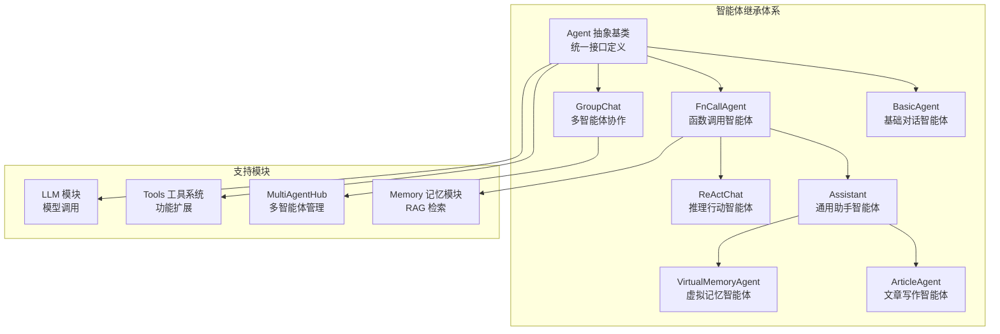
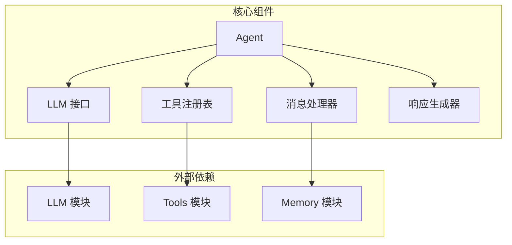
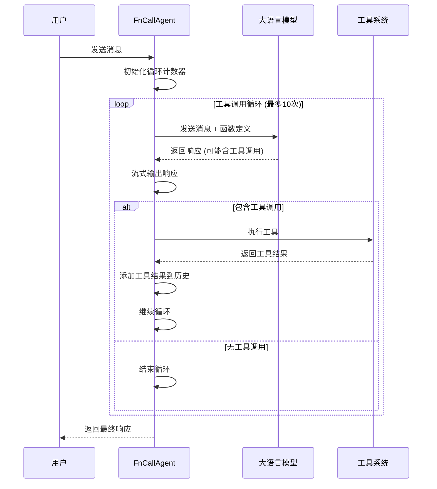
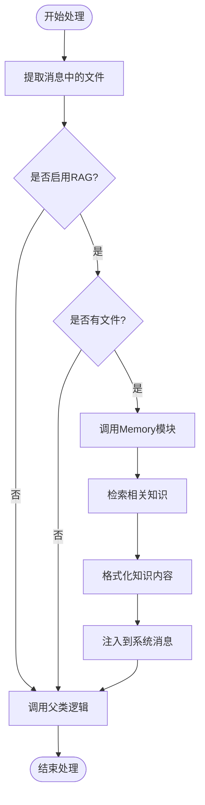
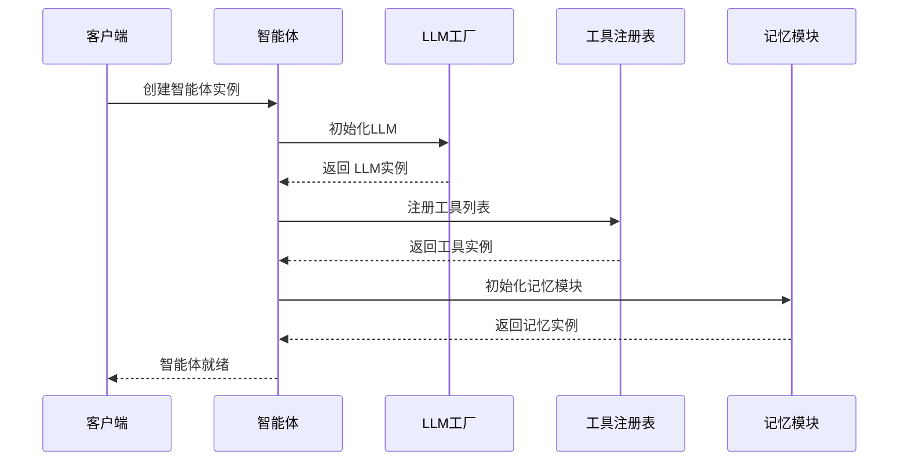
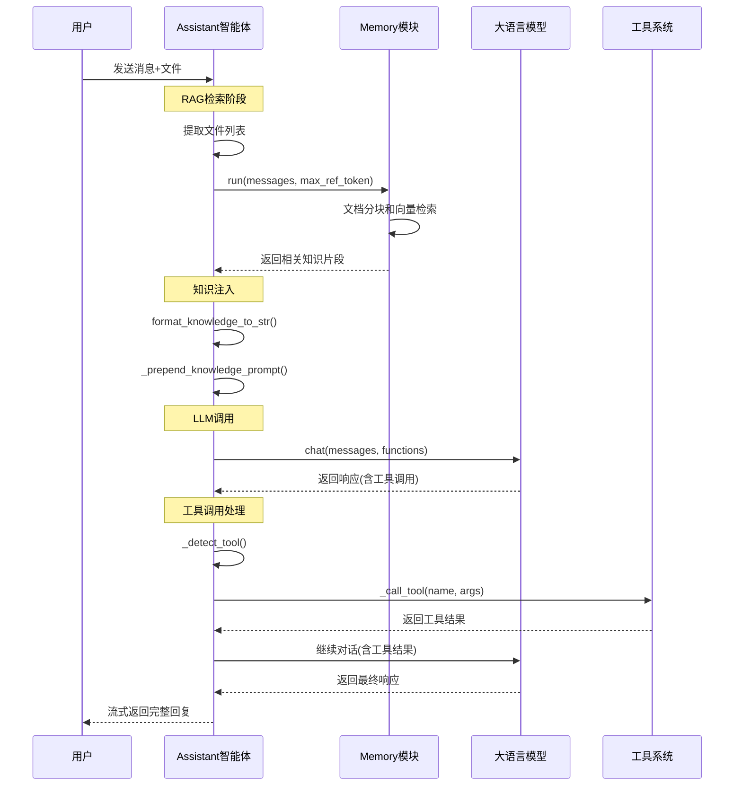
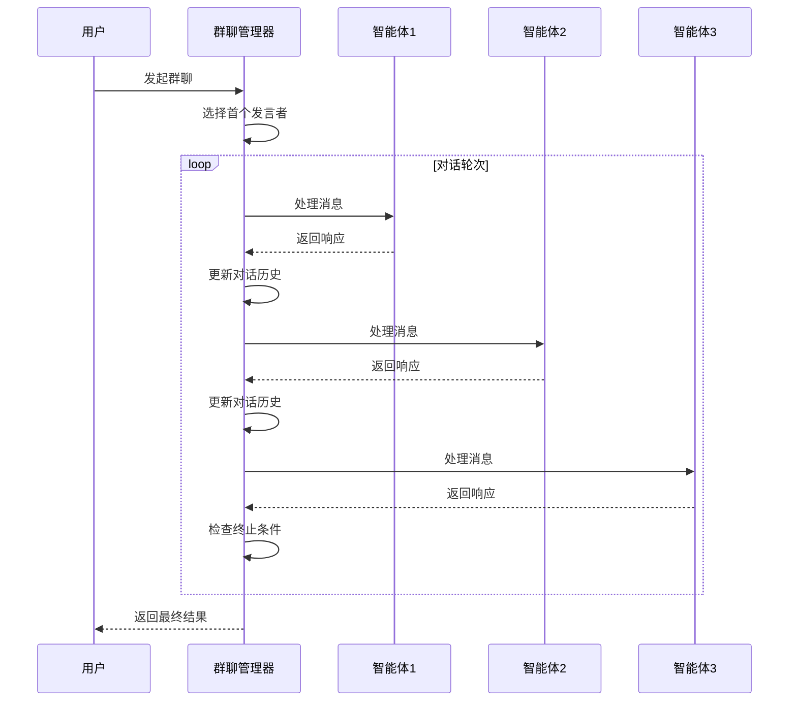

# 智能体模块 (Agents Module)

## 1. 模块概述

### 1.1 职责与边界

#### 负责

- 智能体的核心执行逻辑和工作流程
- 消息处理、工具调用、多轮对话管理
- RAG（检索增强生成）能力集成
- 不同类型智能体的专门化实现
- 多智能体协作和对话管理

#### 不负责

- 具体的 LLM 模型调用（委托给 LLM 模块）
- 工具的具体实现（委托给 Tools 模块）
- 文件存储和管理（委托给 Memory 模块）
- 用户界面展示（委托给 GUI 模块）

#### 依赖

- **LLM 模块**: 大语言模型调用服务
- **Tools 模块**: 工具注册和执行
- **Memory 模块**: 文件管理和对话历史
- **配置**: 系统消息、最大调用次数等设置

#### 数据契约

- **输入**: 消息列表（Message 对象）
- **输出**: 响应消息流（Iterator[List[Message]]）
- **事件**: 工具调用事件、错误事件

### 1.2 核心智能体类型

| 智能体类型 | 继承关系 | 主要功能 | 适用场景 |
|-----------|----------|----------|----------|
| **Agent** | 抽象基类 | 定义统一接口 | 框架基础 |
| **BasicAgent** | Agent | 纯 LLM 对话 | 简单聊天 |
| **FnCallAgent** | Agent | 工具调用 | 功能扩展 |
| **Assistant** | FnCallAgent | RAG + 工具调用 | 通用助手 |
| **ReActChat** | FnCallAgent | 推理行动循环 | 复杂任务 |
| **ArticleAgent** | Assistant | 文章写作 | 内容创作 |
| **GroupChat** | Agent + MultiAgentHub | 多智能体协作 | 团队协作 |

## 2. 架构图

### 2.1 智能体继承体系



### 2.2 模块组件架构



## 3. 核心类详细分析

### 3.1 Agent 抽象基类 (`qwen_agent/agent.py`)

**设计目的**: 定义智能体的统一接口和通用行为

**核心功能**: 定义智能体的统一接口和基础功能

```python
class Agent(ABC):
    """智能体抽象基类
    
    设计原则:
    - 统一的消息处理接口
    - 流式输出支持
    - 工具调用框架
    - 错误处理机制
    """
    
    def __init__(self, function_list=None, llm=None, system_message=None, 
                 name=None, description=None, **kwargs):
        """
        初始化智能体
        
        参数:
        - function_list: 工具列表，支持字符串、字典、对象三种格式
        - llm: LLM 配置或实例
        - system_message: 系统消息
        - name: 智能体名称
        - description: 智能体描述
        """
        # LLM 初始化
        if isinstance(llm, dict):
            self.llm = get_chat_model(llm)
        else:
            self.llm = llm
        
        # 工具初始化
        self.function_map = {}
        if function_list:
            for tool in function_list:
                self._init_tool(tool)
        
        self.system_message = system_message
        self.name = name
        self.description = description
    
    def run(self, messages: List[Union[Dict, Message]], **kwargs) -> Iterator[List[Message]]:
        """
        智能体运行的统一入口
        
        处理流程:
        1. 消息格式标准化
        2. 语言自动检测
        3. 系统消息注入
        4. 调用子类 _run 方法
        5. 响应格式化和流式输出
        """
        # 消息深拷贝，避免副作用
        messages = copy.deepcopy(messages)
        _return_message_type = 'dict'
        new_messages = []
        
        # 消息格式转换
        for msg in messages:
            if isinstance(msg, dict):
                new_messages.append(Message(**msg))
            else:
                new_messages.append(msg)
                _return_message_type = 'message'
        
        # 自动语言检测
        if 'lang' not in kwargs:
            if has_chinese_messages(new_messages):
                kwargs['lang'] = 'zh'
            else:
                kwargs['lang'] = 'en'
        
        # 系统消息注入
        if self.system_message:
            if not new_messages or new_messages[0][ROLE] != SYSTEM:
                new_messages.insert(0, Message(role=SYSTEM, content=self.system_message))
            else:
                # 智能合并系统消息
                if isinstance(new_messages[0][CONTENT], str):
                    new_messages[0][CONTENT] = self.system_message + '\n\n' + new_messages[0][CONTENT]
        
        # 调用子类实现
        for rsp in self._run(messages=new_messages, **kwargs):
            # 自动注入智能体名称
            for i in range(len(rsp)):
                if not rsp[i].name and self.name:
                    rsp[i].name = self.name
            
            # 返回格式转换
            if _return_message_type == 'message':
                yield [Message(**x) if isinstance(x, dict) else x for x in rsp]
            else:
                yield [x.model_dump() if not isinstance(x, dict) else x for x in rsp]
    
    @abstractmethod
    def _run(self, messages: List[Message], **kwargs) -> Iterator[List[Message]]:
        """子类必须实现的核心逻辑"""
        raise NotImplementedError
    
    def _call_llm(self, messages: List[Message], functions: Optional[List[Dict]] = None, 
                  stream: bool = True, extra_generate_cfg: Optional[dict] = None) -> Iterator[List[Message]]:
        """
        LLM调用的统一接口
        
        功能:
        - 合并生成配置
        - 调用LLM的chat方法
        - 处理流式/非流式输出
        """
        return self.llm.chat(
            messages=messages,
            functions=functions,
            stream=stream,
            extra_generate_cfg=merge_generate_cfgs(
                base_generate_cfg=self.extra_generate_cfg,
                new_generate_cfg=extra_generate_cfg,
            )
        )
    
    def _call_tool(self, tool_name: str, tool_args: Union[str, dict] = '{}', **kwargs) -> Union[str, List[ContentItem]]:
        """
        工具调用的统一接口
        
        功能:
        - 工具存在性检查
        - 异常处理和日志记录
        - 结果格式化
        """
        if tool_name not in self.function_map:
            return f'Tool {tool_name} does not exists.'
        
        tool = self.function_map[tool_name]
        try:
            tool_result = tool.call(tool_args, **kwargs)
        except (ToolServiceError, DocParserError) as ex:
            raise ex
        except Exception as ex:
            exception_type = type(ex).__name__
            exception_message = str(ex)
            traceback_info = ''.join(traceback.format_tb(ex.__traceback__))
            error_message = f'An error occurred when calling tool `{tool_name}`:\n' \
                            f'{exception_type}: {exception_message}\n' \
                            f'Traceback:\n{traceback_info}'
            logger.warning(error_message)
            return error_message

        # 结果格式化
        if isinstance(tool_result, str):
            return tool_result
        elif isinstance(tool_result, list) and all(isinstance(item, ContentItem) for item in tool_result):
            return tool_result  # 多模态工具结果
        else:
            return json.dumps(tool_result, ensure_ascii=False, indent=4)
    
    def _detect_tool(self, message: Message) -> Tuple[bool, str, str, str]:
        """
        工具调用检测
        
        检查消息中是否包含function_call字段
        
        Returns:
            Tuple[bool, str, str, str]: (是否需要调用工具, 工具名, 工具参数, 文本回复)
        """
        func_name = None
        func_args = None

        if message.function_call:
            func_call = message.function_call
            func_name = func_call.name
            func_args = func_call.arguments
        
        text = message.content
        if not text:
            text = ''

        return (func_name is not None), func_name, func_args, text
```

**关键设计特点**:

- **类型安全**: 支持多种输入格式，自动类型推断
- **无副作用**: 深拷贝输入，保护原始数据
- **智能化**: 自动语言检测、系统消息合并
- **流式处理**: 支持实时响应输出

### 3.2 FnCallAgent 函数调用智能体 (`qwen_agent/agents/fncall_agent.py`)

**设计目的**: 实现 LLM 与工具的交互循环

**核心功能**: 实现 LLM 与工具的交互循环

```python
class FnCallAgent(Agent):
    """函数调用智能体
    
    核心特性:
    - 工具调用循环
    - 记忆模块集成
    - 流式输出支持
    - 错误恢复机制
    """
    
    def __init__(self, function_list=None, llm=None, system_message=None,
                 name=None, description=None, files=None, **kwargs):
        """
        初始化函数调用智能体
        
        新增参数:
        - files: 初始文件列表，用于 RAG 检索
        """
        super().__init__(function_list=function_list, llm=llm,
                        system_message=system_message, name=name, description=description)
        
        # 记忆模块初始化
        if not hasattr(self, 'mem'):
            # 针对不同模型的优化配置
            if 'qwq' in self.llm.model.lower() or 'qvq' in self.llm.model.lower():
                if 'dashscope' in self.llm.model_type:
                    mem_llm = {
                        'model': 'qwen-turbo',
                        'model_type': 'qwen_dashscope',
                        'generate_cfg': {'max_input_tokens': 30000}
                    }
                else:
                    mem_llm = None
            else:
                mem_llm = self.llm
            
            self.mem = Memory(llm=mem_llm, files=files, **kwargs)
    
    def _run(self, messages: List[Message], lang: str = 'en', **kwargs) -> Iterator[List[Message]]:
        """
        函数调用的核心执行循环
        
        执行策略:
        1. 限制最大调用次数，防止无限循环
        2. LLM 调用生成响应
        3. 工具调用检测和执行
        4. 结果整合和继续对话
        5. 终止条件检查
        """
        messages = copy.deepcopy(messages)
        num_llm_calls_available = MAX_LLM_CALL_PER_RUN  # 默认 10 次
        response = []
        
        while True and num_llm_calls_available > 0:
            num_llm_calls_available -= 1
            
            # 准备生成配置
            extra_generate_cfg = {'lang': lang}
            if kwargs.get('seed') is not None:
                extra_generate_cfg['seed'] = kwargs['seed']
            
            # 调用 LLM，传入函数定义
            output_stream = self._call_llm(
                messages=messages,
                functions=[func.function for func in self.function_map.values()],
                extra_generate_cfg=extra_generate_cfg
            )
            
            # 流式收集 LLM 输出
            output: List[Message] = []
            for output in output_stream:
                if output:
                    yield response + output  # 实时流式输出
            
            if output:
                response.extend(output)
                messages.extend(output)
                used_any_tool = False
                
                # 检查并执行工具调用
                for out in output:
                    use_tool, tool_name, tool_args, _ = self._detect_tool(out)
                    if use_tool:
                        try:
                            # 执行工具调用
                            tool_result = self._call_tool(tool_name, tool_args, 
                                                        messages=messages, **kwargs)
                            
                            # 创建标准化工具结果消息
                            fn_msg = Message(
                                role=FUNCTION,
                                name=tool_name,
                                content=tool_result,
                                extra={'function_id': out.extra.get('function_id', '1')}
                            )
                            
                            messages.append(fn_msg)
                            response.append(fn_msg)
                            yield response
                            used_any_tool = True
                            
                        except Exception as ex:
                            # 工具调用失败处理
                            error_msg = f"Tool {tool_name} failed: {str(ex)}"
                            fn_msg = Message(role=FUNCTION, name=tool_name, content=error_msg)
                            messages.append(fn_msg)
                            response.append(fn_msg)
                            yield response
                            used_any_tool = True
                
                # 终止条件：无工具调用或达到最大次数
                if not used_any_tool:
                    break
        
        yield response
```

**执行时序图**:



### 3.3 Assistant 通用助手智能体 (`qwen_agent/agents/assistant.py`)

**核心功能**: 集成 RAG 检索和工具调用的通用助手

```python
class Assistant(FnCallAgent):
    """通用助手智能体
    
    核心特性:
    - RAG 知识检索
    - 知识注入和格式化
    - 多文件支持
    - 智能知识筛选
    """
    
    def __init__(self, function_list=None, llm=None, system_message=None,
                 name=None, description=None, files=None, rag_cfg=None, **kwargs):
        """
        初始化通用助手
        
        新增参数:
        - rag_cfg: RAG 配置参数
        """
        super().__init__(function_list=function_list, llm=llm,
                        system_message=system_message, name=name, 
                        description=description, files=files, **kwargs)
        
        self.rag_cfg = rag_cfg or {}
    
    def _run(self, messages: List[Message], lang: str = 'en', 
             max_ref_token: int = 4000, **kwargs) -> Iterator[List[Message]]:
        """
        Assistant 的核心执行逻辑
        
        执行流程:
        1. 文件内容处理和格式化
        2. RAG 知识检索
        3. 知识注入到系统消息
        4. 调用父类函数调用逻辑
        """
        # 文件内容处理
        messages = self._format_file(messages, lang=lang)
        
        # RAG 知识检索
        if self.rag_cfg and any(self._has_file_content(msg) for msg in messages):
            try:
                # 调用记忆模块进行检索
                *_, last = self.mem.run(messages=messages, 
                                      max_ref_token=max_ref_token, **kwargs)
                if last:
                    # 格式化检索到的知识
                    knowledge = format_knowledge_to_source_and_content(last[-1].content)
                    if knowledge:
                        # 注入知识到系统消息
                        knowledge_str = self._format_knowledge_to_str(knowledge, lang=lang)
                        messages = self._prepend_knowledge_prompt(messages, knowledge_str, lang=lang)
            except Exception as ex:
                logger.warning(f'RAG failed: {ex}')
        
        # 调用父类的函数调用逻辑
        yield from super()._run(messages, lang=lang, **kwargs)
    
    def _format_knowledge_to_str(self, knowledge: List[dict], lang: str = 'en') -> str:
        """
        将检索到的知识格式化为字符串
        
        格式化策略:
        - 按来源分组
        - 添加引用信息
        - 多语言模板支持
        """
        knowledge_str = ''
        for k in knowledge:
            if lang == 'zh':
                snippet = f"来源: {k['source']}\n内容: {k['content']}\n\n"
            else:
                snippet = f"Source: {k['source']}\nContent: {k['content']}\n\n"
            knowledge_str += snippet
        
        if lang == 'zh':
            template = f"# 知识库\n\n以下是相关的背景知识，请基于这些信息回答用户问题：\n\n{knowledge_str}"
        else:
            template = f"# Knowledge Base\n\nHere is the relevant background knowledge. Please answer user questions based on this information:\n\n{knowledge_str}"
        
        return template
    
    def _prepend_knowledge_prompt(self, messages: List[Message], 
                                knowledge_str: str, lang: str = 'en') -> List[Message]:
        """
        将知识注入到消息中
        
        注入策略:
        - 优先注入到系统消息
        - 支持多模态内容
        - 保持消息结构完整性
        """
        messages = copy.deepcopy(messages)
        
        if messages and messages[0].role == SYSTEM:
            # 合并到现有系统消息
            if isinstance(messages[0].content, str):
                messages[0].content = messages[0].content + '\n\n' + knowledge_str
            else:
                messages[0].content.append(ContentItem(text=knowledge_str))
        else:
            # 创建新的系统消息
            messages.insert(0, Message(role=SYSTEM, content=knowledge_str))
        
        return messages
```

**RAG 处理流程图**:



### 3.4 ReActChat 推理行动智能体 (`qwen_agent/agents/react_chat.py`)

**核心功能**: 实现推理-行动-观察循环模式

```python
class ReActChat(FnCallAgent):
    """ReAct 推理行动智能体
    
    核心特性:
    - 推理-行动-观察循环
    - 思维链推理
    - 工具使用策略
    - 自我反思机制
    """
    
    def _run(self, messages: List[Message], lang: str = 'en', **kwargs) -> Iterator[List[Message]]:
        """
        ReAct 模式的执行逻辑
        
        ReAct 循环:
        1. Thought: 分析当前情况，制定行动计划
        2. Action: 选择并执行工具
        3. Observation: 观察工具执行结果
        4. 重复直到得出最终答案
        """
        messages = copy.deepcopy(messages)
        
        # 添加 ReAct 提示模板
        react_prompt = self._get_react_prompt(lang)
        if messages and messages[0].role == SYSTEM:
            messages[0].content += '\n\n' + react_prompt
        else:
            messages.insert(0, Message(role=SYSTEM, content=react_prompt))
        
        # 执行 ReAct 循环
        max_iterations = 10
        iteration = 0
        response = []
        
        while iteration < max_iterations:
            iteration += 1
            
            # 调用 LLM 进行推理
            output_stream = self._call_llm(
                messages=messages + response,
                functions=[func.function for func in self.function_map.values()],
                extra_generate_cfg={'lang': lang}
            )
            
            # 收集 LLM 输出
            output: List[Message] = []
            for output in output_stream:
                if output:
                    yield response + output
            
            if output:
                response.extend(output)
                
                # 检查是否需要工具调用
                last_message = output[-1]
                use_tool, tool_name, tool_args, thought = self._detect_tool(last_message)
                
                if use_tool:
                    # 执行工具（Action）
                    try:
                        tool_result = self._call_tool(tool_name, tool_args, **kwargs)
                        
                        # 添加观察结果（Observation）
                        observation_msg = Message(
                            role=FUNCTION,
                            name=tool_name,
                            content=f"Observation: {tool_result}"
                        )
                        response.append(observation_msg)
                        yield response
                        
                    except Exception as ex:
                        # 处理工具执行失败
                        error_msg = Message(
                            role=FUNCTION,
                            name=tool_name,
                            content=f"Observation: Tool execution failed - {str(ex)}"
                        )
                        response.append(error_msg)
                        yield response
                else:
                    # 无工具调用，检查是否得出最终答案
                    if self._is_final_answer(last_message.content):
                        break
        
        yield response
    
    def _get_react_prompt(self, lang: str) -> str:
        """
        获取 ReAct 提示模板
        
        模板包含:
        - 推理模式说明
        - 工具使用指南
        - 输出格式要求
        """
        if lang == 'zh':
            return """你是一个能够进行推理和行动的AI助手。请按照以下格式思考和回答：

思考: 分析当前情况，思考需要采取什么行动
行动: 选择合适的工具来获取信息或执行任务
观察: 观察工具执行的结果
... (重复思考-行动-观察循环)
最终答案: 基于所有信息给出最终回答

可用工具: {tools}

请始终遵循"思考-行动-观察"的循环模式，直到能够给出最终答案。"""
        else:
            return """You are an AI assistant capable of reasoning and taking actions. Please think and respond in the following format:

Thought: Analyze the current situation and think about what action to take
Action: Choose an appropriate tool to get information or perform tasks  
Observation: Observe the results of tool execution
... (repeat Thought-Action-Observation cycle)
Final Answer: Give the final answer based on all information

Available tools: {tools}

Always follow the "Thought-Action-Observation" cycle until you can provide a final answer."""
    
    def _is_final_answer(self, content: str) -> bool:
        """
        检查是否为最终答案
        
        检查策略:
        - 关键词匹配
        - 格式识别
        - 内容完整性
        """
        final_keywords = ['最终答案', 'Final Answer', '答案是', 'The answer is']
        return any(keyword in content for keyword in final_keywords)
```

### 3.5 GroupChat 多智能体协作 (`qwen_agent/agents/group_chat.py`)

**核心功能**: 管理多个智能体的协作对话

```python
class GroupChat(Agent, MultiAgentHub):
    """多智能体群聊
    
    核心特性:
    - 智能体轮换机制
    - 对话流程控制
    - 角色分工协作
    - 终止条件判断
    """
    
    def __init__(self, agents: List[Agent], max_turns: int = 10, **kwargs):
        """
        初始化群聊
        
        参数:
        - agents: 参与群聊的智能体列表
        - max_turns: 最大轮次限制
        """
        super().__init__(**kwargs)
        self.agents = agents
        self.max_turns = max_turns
        self.current_turn = 0
    
    def _run(self, messages: List[Message], **kwargs) -> Iterator[List[Message]]:
        """
        群聊执行逻辑
        
        执行流程:
        1. 选择下一个发言的智能体
        2. 让选中的智能体处理消息
        3. 收集响应并更新对话历史
        4. 检查终止条件
        5. 重复直到达到终止条件
        """
        conversation_history = copy.deepcopy(messages)
        response = []
        
        while self.current_turn < self.max_turns:
            self.current_turn += 1
            
            # 选择下一个发言的智能体
            next_agent = self._select_next_agent(conversation_history)
            
            if not next_agent:
                break
            
            # 让选中的智能体处理消息
            agent_response = []
            for agent_output in next_agent.run(conversation_history, **kwargs):
                agent_response = agent_output
                yield response + agent_response
            
            if agent_response:
                # 更新对话历史
                conversation_history.extend(agent_response)
                response.extend(agent_response)
                
                # 检查是否应该终止对话
                if self._should_terminate(conversation_history):
                    break
        
        yield response
    
    def _select_next_agent(self, messages: List[Message]) -> Optional[Agent]:
        """
        选择下一个发言的智能体
        
        选择策略:
        - 轮询模式
        - 基于内容的智能选择
        - 专家系统路由
        """
        if not self.agents:
            return None
        
        # 简单轮询策略
        agent_index = (self.current_turn - 1) % len(self.agents)
        return self.agents[agent_index]
    
    def _should_terminate(self, messages: List[Message]) -> bool:
        """
        判断是否应该终止对话
        
        终止条件:
        - 达到最大轮次
        - 任务完成标志
        - 所有智能体无响应
        """
        if self.current_turn >= self.max_turns:
            return True
        
        # 检查最后一条消息是否包含终止标志
        if messages:
            last_content = messages[-1].content
            if isinstance(last_content, str):
                terminate_keywords = ['任务完成', 'Task completed', '对话结束', 'Conversation ended']
                return any(keyword in last_content for keyword in terminate_keywords)
        
        return False
```

## 4. 模块交互时序

### 4.1 智能体初始化时序



### 4.2 Assistant RAG + 工具调用时序



### 4.3 多智能体协作时序



## 5. 性能优化策略

### 5.1 内存管理优化

```python
class OptimizedAgent(Agent):
    """内存优化的智能体实现"""
    
    def __init__(self, **kwargs):
        super().__init__(**kwargs)
        self._message_cache = {}
        self._response_cache = {}
    
    def _run(self, messages: List[Message], **kwargs) -> Iterator[List[Message]]:
        # 消息去重和缓存
        message_hash = self._hash_messages(messages)
        if message_hash in self._response_cache:
            yield self._response_cache[message_hash]
            return
        
        # 限制对话历史长度
        if len(messages) > MAX_HISTORY_LENGTH:
            messages = self._truncate_messages(messages)
        
        # 执行核心逻辑
        response = []
        for chunk in super()._run(messages, **kwargs):
            response = chunk
            yield chunk
        
        # 缓存响应
        self._response_cache[message_hash] = response
    
    def _truncate_messages(self, messages: List[Message]) -> List[Message]:
        """智能截断对话历史"""
        # 保留系统消息和最近的对话
        system_messages = [msg for msg in messages if msg.role == SYSTEM]
        recent_messages = messages[-MAX_RECENT_MESSAGES:]
        return system_messages + recent_messages
```

### 5.2 并发处理优化

```python
import asyncio
from concurrent.futures import ThreadPoolExecutor

class ConcurrentAgent(Agent):
    """支持并发处理的智能体"""
    
    def __init__(self, **kwargs):
        super().__init__(**kwargs)
        self.executor = ThreadPoolExecutor(max_workers=4)
    
    async def run_async(self, messages: List[Message], **kwargs) -> List[Message]:
        """异步运行智能体"""
        loop = asyncio.get_event_loop()
        
        # 并发执行多个任务
        tasks = []
        if self.function_map:
            # 预热工具
            for tool_name, tool in self.function_map.items():
                task = loop.run_in_executor(self.executor, tool.warm_up)
                tasks.append(task)
        
        # 等待预热完成
        if tasks:
            await asyncio.gather(*tasks)
        
        # 执行主逻辑
        result = await loop.run_in_executor(
            self.executor, 
            lambda: list(self.run(messages, **kwargs))[-1]
        )
        
        return result
```

## 6. 扩展开发指南

### 6.1 自定义智能体开发

```python
class CustomAgent(FnCallAgent):
    """自定义智能体开发模板"""
    
    def __init__(self, custom_config: dict = None, **kwargs):
        super().__init__(**kwargs)
        self.custom_config = custom_config or {}
    
    def _run(self, messages: List[Message], **kwargs) -> Iterator[List[Message]]:
        """
        自定义执行逻辑
        
        开发步骤:
        1. 消息预处理
        2. 自定义逻辑实现
        3. 调用父类或重写核心逻辑
        4. 响应后处理
        """
        # 1. 消息预处理
        messages = self._preprocess_messages(messages)
        
        # 2. 自定义逻辑
        if self._should_use_custom_logic(messages):
            yield from self._custom_logic(messages, **kwargs)
        else:
            # 3. 调用父类逻辑
            yield from super()._run(messages, **kwargs)
    
    def _preprocess_messages(self, messages: List[Message]) -> List[Message]:
        """自定义消息预处理"""
        # 实现自定义预处理逻辑
        return messages
    
    def _should_use_custom_logic(self, messages: List[Message]) -> bool:
        """判断是否使用自定义逻辑"""
        # 实现判断逻辑
        return False
    
    def _custom_logic(self, messages: List[Message], **kwargs) -> Iterator[List[Message]]:
        """自定义核心逻辑"""
        # 实现自定义逻辑
        yield [Message(role='assistant', content='Custom response')]
```

### 6.2 智能体插件系统

```python
class AgentPlugin(ABC):
    """智能体插件基类"""
    
    @abstractmethod
    def before_run(self, agent: Agent, messages: List[Message]) -> List[Message]:
        """运行前钩子"""
        pass
    
    @abstractmethod
    def after_run(self, agent: Agent, response: List[Message]) -> List[Message]:
        """运行后钩子"""
        pass

class LoggingPlugin(AgentPlugin):
    """日志插件"""
    
    def before_run(self, agent: Agent, messages: List[Message]) -> List[Message]:
        logger.info(f"Agent {agent.name} processing {len(messages)} messages")
        return messages
    
    def after_run(self, agent: Agent, response: List[Message]) -> List[Message]:
        logger.info(f"Agent {agent.name} generated {len(response)} responses")
        return response

class PluginManager:
    """插件管理器"""
    
    def __init__(self):
        self.plugins: List[AgentPlugin] = []
    
    def register_plugin(self, plugin: AgentPlugin):
        self.plugins.append(plugin)
    
    def apply_before_hooks(self, agent: Agent, messages: List[Message]) -> List[Message]:
        for plugin in self.plugins:
            messages = plugin.before_run(agent, messages)
        return messages
    
    def apply_after_hooks(self, agent: Agent, response: List[Message]) -> List[Message]:
        for plugin in self.plugins:
            response = plugin.after_run(agent, response)
        return response
```

## 7. 关键设计模式

### 7.1 模板方法模式

Agent基类定义了`run()`方法的通用流程，子类实现`_run()`方法的具体逻辑：

```python
# 基类定义模板
class Agent(ABC):
    def run(self, messages, **kwargs):
        # 通用预处理
        messages = self._preprocess(messages)
        # 调用子类实现
        for response in self._run(messages, **kwargs):
            yield self._postprocess(response)
    
    @abstractmethod
    def _run(self, messages, **kwargs):
        # 子类实现具体逻辑
        pass

# 子类实现具体逻辑
class Assistant(FnCallAgent):
    def _run(self, messages, **kwargs):
        # RAG检索 + 函数调用逻辑
        pass
```

### 7.2 策略模式

不同智能体采用不同的执行策略：

```python
class AgentStrategy(ABC):
    @abstractmethod
    def execute(self, messages, **kwargs):
        pass

class RAGStrategy(AgentStrategy):
    def execute(self, messages, **kwargs):
        # RAG检索策略
        pass

class ReActStrategy(AgentStrategy):
    def execute(self, messages, **kwargs):
        # ReAct推理策略
        pass
```

### 7.3 组合模式

智能体组合不同的能力模块：

```python
class Agent:
    def __init__(self):
        self.llm_module = LLMModule()
        self.tool_module = ToolModule()
        self.memory_module = MemoryModule()
    
    def _run(self, messages, **kwargs):
        # 组合各模块能力
        knowledge = self.memory_module.retrieve(messages)
        response = self.llm_module.generate(messages + knowledge)
        if self.tool_module.needs_tool(response):
            result = self.tool_module.execute(response)
            return self.llm_module.generate(messages + [result])
        return response
```

## 验收清单

- [x] 智能体继承体系分析完整
- [x] 核心类详细代码分析
- [x] 模块交互时序图清晰
- [x] 性能优化策略实用
- [x] 扩展开发指南完整
- [x] 架构图和流程图准确
- [x] 关键函数代码贴出并注释
- [x] 设计模式和最佳实践说明

这个智能体模块文档详细分析了Qwen-Agent中智能体的设计理念、继承体系、核心实现和执行流程，为开发者提供了深入理解和扩展智能体功能的技术指南。
