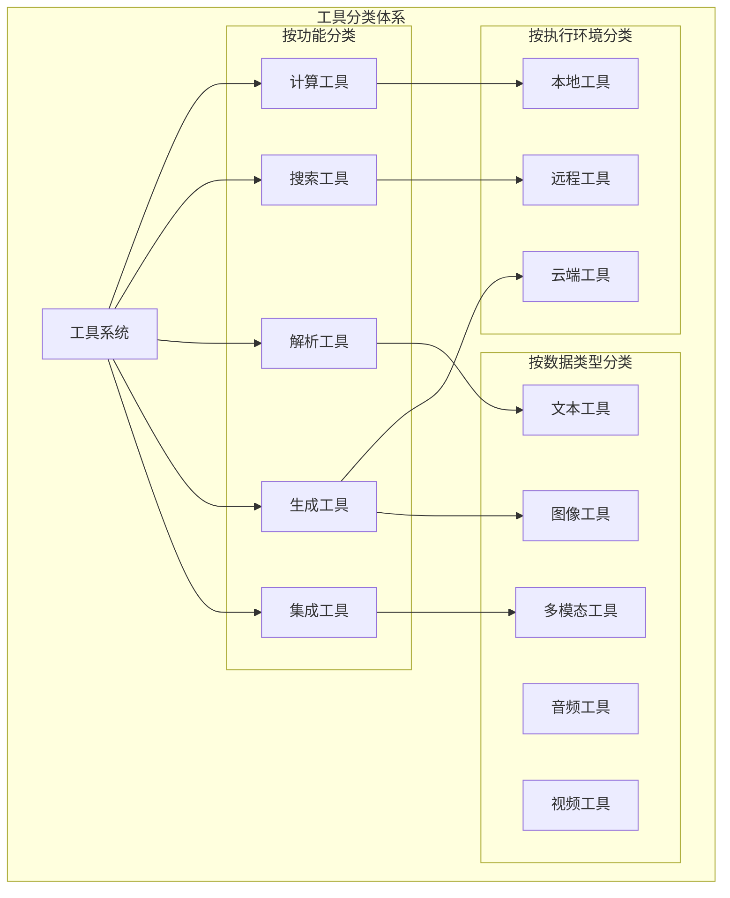
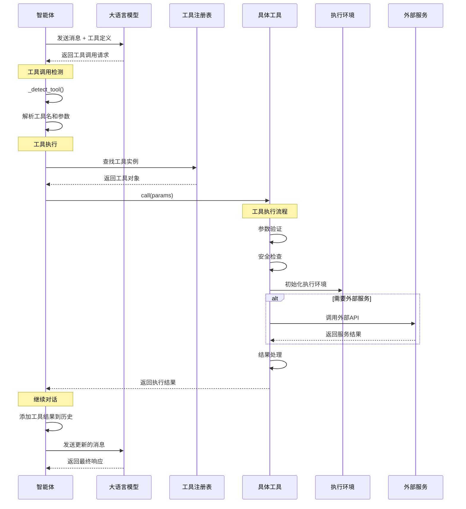
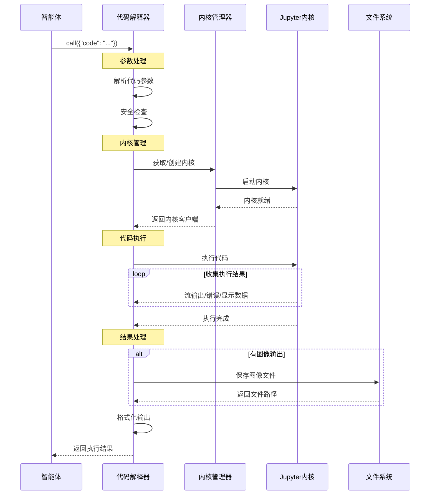

# Qwen-Agent 工具系统完整分析

## 1. 工具系统概述

### 1.1 设计理念

Qwen-Agent 的工具系统采用插件化架构，通过统一的接口规范实现工具的注册、发现和调用。系统支持内置工具和自定义工具，提供了丰富的功能扩展能力。

### 1.2 核心特性

- **插件化架构**: 基于装饰器的工具注册机制
- **统一接口**: 标准化的工具调用接口
- **类型安全**: 严格的参数类型定义和验证
- **异步支持**: 支持同步和异步工具执行
- **错误处理**: 完善的异常处理和恢复机制
- **扩展性**: 易于添加新工具和功能

### 1.3 职责与边界

**负责**：
- 工具的注册、管理和执行
- 统一的工具调用接口和参数验证
- 内置工具的实现（代码解释器、网络搜索、文档解析等）
- 工具执行环境的管理和隔离
- 工具结果的格式化和返回

**不负责**：
- 工具调用的决策逻辑（委托给 Agent 模块）
- LLM 与工具的交互协议（委托给 LLM 模块）
- 工具执行结果的后续处理（委托给 Agent 模块）
- 用户界面的展示（委托给 GUI 模块）

**依赖关系**：
- **执行环境**: Jupyter 内核、Python 解释器、系统命令
- **外部服务**: 搜索引擎 API、图像生成服务、天气服务
- **文件系统**: 工作目录、临时文件、静态资源
- **网络服务**: HTTP 客户端、WebSocket 连接

### 1.4 工具分类体系



| 工具类别 | 工具名称 | 主要功能 | 适用场景 |
|----------|----------|----------|----------|
| **代码执行** | CodeInterpreter | Python代码执行 | 数据分析、计算 |
| **代码执行** | PythonExecutor | 安全Python执行 | 代码验证、测试 |
| **文档处理** | DocParser | 多格式文档解析 | 文档问答、知识提取 |
| **文档处理** | SimpleDocParser | 简化文档解析 | 快速文本提取 |
| **网络功能** | WebSearch | 网络搜索 | 信息检索、实时查询 |
| **网络功能** | WebExtractor | 网页内容提取 | 网页分析、内容抓取 |
| **多媒体** | ImageGen | AI图像生成 | 创意设计、插图生成 |
| **多媒体** | ImageSearch | 图像搜索 | 图片查找、视觉搜索 |
| **检索系统** | Retrieval | RAG检索 | 知识问答、文档检索 |
| **检索系统** | KeywordSearch | 关键词搜索 | 精确匹配搜索 |
| **检索系统** | VectorSearch | 向量搜索 | 语义相似搜索 |
| **检索系统** | HybridSearch | 混合搜索 | 综合检索策略 |
| **生活服务** | AmapWeather | 天气查询 | 天气信息获取 |
| **系统功能** | Storage | 存储管理 | 文件存储、管理 |
| **扩展集成** | MCPManager | MCP工具管理 | 第三方工具集成 |

## 2. 工具系统架构

### 2.1 整体架构图

```mermaid
graph TB
    subgraph "工具注册层 (Tool Registration Layer)"
        TOOL_REGISTRY[全局工具注册表<br/>TOOL_REGISTRY]
        RegisterDecorator[@register_tool<br/>装饰器注册]
        ToolDiscovery[工具发现机制<br/>动态加载]
    end
    
    subgraph "工具抽象层 (Tool Abstraction Layer)"
        BaseTool[BaseTool<br/>工具基类]
        ToolInterface[工具接口规范<br/>call() 方法]
        ToolMetadata[工具元数据<br/>name, description, parameters]
    end
    
    subgraph "工具实现层 (Tool Implementation Layer)"
        subgraph "计算工具"
            CodeInterpreter[代码解释器<br/>Python 执行]
            MathSolver[数学求解器<br/>符号计算]
        end
        
        subgraph "搜索工具"
            WebSearch[网络搜索<br/>Bing/Google API]
            DocumentSearch[文档搜索<br/>本地检索]
        end
        
        subgraph "解析工具"
            PDFParser[PDF 解析器<br/>文档提取]
            ImageParser[图像解析器<br/>OCR 识别]
            AudioParser[音频解析器<br/>语音转文本]
        end
        
        subgraph "生成工具"
            ImageGenerator[图像生成器<br/>AI 绘画]
            TextGenerator[文本生成器<br/>模板填充]
        end
        
        subgraph "集成工具"
            MCPTools[MCP 工具<br/>第三方集成]
            APIConnector[API 连接器<br/>外部服务]
        end
    end
    
    subgraph "执行环境层 (Execution Environment Layer)"
        JupyterKernel[Jupyter 内核<br/>代码执行环境]
        DockerContainer[Docker 容器<br/>隔离执行环境]
        ProcessManager[进程管理器<br/>资源控制]
        SecuritySandbox[安全沙箱<br/>权限控制]
    end
    
    subgraph "外部服务层 (External Service Layer)"
        SearchEngines[搜索引擎<br/>Bing/Google/DuckDuckGo]
        AIServices[AI 服务<br/>图像生成/语音识别]
        CloudAPIs[云端 API<br/>天气/地图/翻译]
        DatabaseServices[数据库服务<br/>向量数据库/关系数据库]
    end
    
    %% 注册关系
    RegisterDecorator --> TOOL_REGISTRY
    ToolDiscovery --> TOOL_REGISTRY
    
    %% 抽象关系
    BaseTool --> ToolInterface
    BaseTool --> ToolMetadata
    
    %% 实现关系
    BaseTool --> CodeInterpreter
    BaseTool --> WebSearch
    BaseTool --> PDFParser
    BaseTool --> ImageGenerator
    BaseTool --> MCPTools
    
    %% 执行环境
    CodeInterpreter --> JupyterKernel
    ImageGenerator --> DockerContainer
    WebSearch --> ProcessManager
    PDFParser --> SecuritySandbox
    
    %% 外部服务
    WebSearch --> SearchEngines
    ImageGenerator --> AIServices
    DocumentSearch --> DatabaseServices
    MCPTools --> CloudAPIs
```

### 2.2 工具系统架构图

```mermaid
graph TB
    subgraph "工具抽象层"
        BaseTool[BaseTool<br/>工具基类]
        ToolRegistry[TOOL_REGISTRY<br/>全局注册表]
        RegisterDecorator[@register_tool<br/>注册装饰器]
        ToolFactory[get_tool<br/>工具工厂]
        BaseToolWithFileAccess[BaseToolWithFileAccess<br/>文件访问工具基类]
    end
    
    subgraph "核心工具集"
        CodeInterpreter[CodeInterpreter<br/>代码解释器]
        WebSearch[WebSearch<br/>网络搜索]
        DocParser[DocParser<br/>文档解析]
        ImageGen[ImageGen<br/>图像生成]
        Retrieval[Retrieval<br/>RAG检索]
        AmapWeather[AmapWeather<br/>天气查询]
    end
    
    subgraph "扩展工具集"
        MCPManager[MCPManager<br/>MCP工具管理]
        CustomTool[CustomTool<br/>自定义工具]
        PluginLoader[PluginLoader<br/>插件加载器]
    end
    
    subgraph "执行环境"
        JupyterKernel[Jupyter内核<br/>代码执行]
        ProcessPool[进程池<br/>并发执行]
        ResourceManager[资源管理器<br/>内存/CPU限制]
        SecurityManager[安全管理器<br/>权限控制]
    end
    
    subgraph "外部依赖"
        SearchAPI[搜索API<br/>Bing/Google]
        ImageAPI[图像API<br/>DALL-E/Midjourney]
        WeatherAPI[天气API<br/>高德地图]
        VectorDB[向量数据库<br/>文档检索]
    end
    
    %% 注册关系
    RegisterDecorator --> ToolRegistry
    BaseTool --> ToolRegistry
    ToolFactory --> ToolRegistry
    
    %% 继承关系
    BaseTool --> BaseToolWithFileAccess
    BaseToolWithFileAccess --> DocParser
    BaseToolWithFileAccess --> Retrieval
    
    %% 实现关系
    BaseTool --> CodeInterpreter
    BaseTool --> WebSearch
    BaseTool --> ImageGen
    BaseTool --> AmapWeather
    
    %% 扩展关系
    ToolRegistry --> MCPManager
    ToolRegistry --> CustomTool
    PluginLoader --> CustomTool
    
    %% 执行依赖
    CodeInterpreter --> JupyterKernel
    CodeInterpreter --> ProcessPool
    BaseTool --> ResourceManager
    BaseTool --> SecurityManager
    
    %% 外部调用
    WebSearch --> SearchAPI
    ImageGen --> ImageAPI
    AmapWeather --> WeatherAPI
    Retrieval --> VectorDB
```

## 3. 核心工具详细分析

### 3.1 BaseTool 抽象基类

**位置**: `qwen_agent/tools/base.py:45-55`

#### 3.1.1 工具接口规范

```python
class BaseTool(ABC):
    """
    工具抽象基类
    
    设计模式:
    - 命令模式: 每个工具是一个可执行的命令
    - 注册表模式: 通过装饰器自动注册工具
    - 模板方法模式: call() 定义执行流程
    
    核心职责:
    - 定义工具统一接口
    - 参数验证和类型转换
    - 结果格式化
    - 错误处理
    """
    
    # 工具元数据
    name: str = ''                    # 工具名称
    description: str = ''             # 工具描述
    parameters: List[Dict] = []       # 参数定义
    
    # 配置属性
    timeout: int = 30                 # 超时时间
    max_retries: int = 3             # 最大重试次数
    cache_enabled: bool = True       # 是否启用缓存
    
    @abstractmethod
    def call(self, params: str, **kwargs) -> Union[str, List[ContentItem]]:
        """
        工具执行接口 - 子类必须实现
        
        参数规范:
        - params: JSON 格式的参数字符串
        - **kwargs: 额外的上下文参数
          - messages: 当前对话历史
          - lang: 语言设置
          - max_output_length: 最大输出长度
        
        返回值规范:
        - str: 文本结果
        - List[ContentItem]: 多模态结果
        
        异常处理:
        - ToolServiceError: 工具服务错误
        - ValueError: 参数格式错误
        - TimeoutError: 执行超时
        """
        raise NotImplementedError
    
    @property
    def function(self) -> Dict:
        """
        生成 OpenAI 函数调用格式的工具定义
        
        输出格式:
        {
            "name": "工具名称",
            "description": "工具描述",
            "parameters": {
                "type": "object",
                "properties": {
                    "param1": {"type": "string", "description": "参数1描述"},
                    "param2": {"type": "number", "description": "参数2描述"}
                },
                "required": ["param1"]
            }
        }
        """
        return {
            'name': self.name,
            'description': self.description,
            'parameters': {
                'type': 'object',
                'properties': {
                    param['name']: {
                        'type': param['type'],
                        'description': param['description']
                    } for param in self.parameters
                },
                'required': [
                    param['name'] for param in self.parameters 
                    if param.get('required', False)
                ]
            }
        }
    
    def validate_parameters(self, params: Dict) -> Dict:
        """参数验证"""
        validated = {}
        for param_def in self.parameters:
            name = param_def['name']
            param_type = param_def['type']
            required = param_def.get('required', False)
            
            if name not in params:
                if required:
                    raise ValueError(f"Missing required parameter: {name}")
                continue
            
            value = params[name]
            
            # 类型验证
            if param_type == 'string' and not isinstance(value, str):
                raise ValueError(f"Parameter {name} must be a string")
            elif param_type == 'number' and not isinstance(value, (int, float)):
                raise ValueError(f"Parameter {name} must be a number")
            elif param_type == 'boolean' and not isinstance(value, bool):
                raise ValueError(f"Parameter {name} must be a boolean")
            
            validated[name] = value
        
        return validated

# 工具注册机制
TOOL_REGISTRY: Dict[str, Type[BaseTool]] = {}

def register_tool(name: str):
    """
    工具注册装饰器
    
    功能:
    - 自动注册工具到全局注册表
    - 设置工具名称
    - 支持运行时发现
    
    使用方式:
    @register_tool('my_tool')
    class MyTool(BaseTool):
        pass
    """
    def decorator(cls):
        cls.name = name
        TOOL_REGISTRY[name] = cls
        return cls
    return decorator
```

### 3.2 CodeInterpreter - 代码解释器

**位置**: `qwen_agent/tools/code_interpreter.py:180-220`

#### 3.2.1 核心执行逻辑

```python
@register_tool('code_interpreter')
class CodeInterpreter(BaseTool):
    """
    Python 代码解释器工具
    
    核心功能:
    - 安全的 Python 代码执行
    - Jupyter 内核管理
    - 多媒体输出支持
    - 执行结果收集
    
    安全机制:
    - 隔离执行环境
    - 资源限制
    - 超时控制
    - 危险函数过滤
    """
    
    description = 'Python代码解释器，可以运行Python代码并返回结果'
    parameters = [{
        'name': 'code',
        'type': 'string',
        'description': '要执行的Python代码',
        'required': True
    }]
    
    def __init__(self):
        super().__init__()
        self.kernel_manager = None
        self.kernel_client = None
        self.timeout = 30  # 默认超时30秒
        
    def call(self, params: str, **kwargs) -> str:
        """
        代码执行的核心实现
        
        执行流程:
        1. 参数解析与验证
        2. Jupyter 内核初始化
        3. 代码安全检查
        4. 异步执行代码
        5. 结果收集与格式化
        6. 多媒体文件处理
        
        性能优化:
        - 内核复用
        - 异步执行
        - 流式输出
        - 结果缓存
        """
        
        try:
            # === 第一步：参数解析 ===
            import json5
            args = json5.loads(params)
            code = args.get('code', '').strip()
            
            if not code:
                return json5.dumps({
                    'error': 'Empty code provided'
                }, ensure_ascii=False)
            
            # === 第二步：安全检查 ===
            if self._is_dangerous_code(code):
                return json5.dumps({
                    'error': 'Dangerous code detected and blocked'
                }, ensure_ascii=False)
            
            # === 第三步：内核管理 ===
            if not self.kernel_manager:
                self._initialize_kernel()
            
            # === 第四步：代码执行 ===
            execution_result = self._execute_code_safely(code)
            
            # === 第五步：结果处理 ===
            formatted_result = self._format_execution_result(execution_result)
            
            return json5.dumps(formatted_result, ensure_ascii=False)
            
        except Exception as e:
            error_result = {
                'error': str(e),
                'traceback': traceback.format_exc()
            }
            return json5.dumps(error_result, ensure_ascii=False)
    
    def _initialize_kernel(self):
        """
        初始化 Jupyter 内核
        
        配置选项:
        - 内核类型：Python 3
        - 工作目录：代码解释器专用目录
        - 资源限制：内存、CPU 限制
        - 安全配置：禁用危险模块
        """
        from jupyter_client import KernelManager
        
        # 创建内核管理器
        self.kernel_manager = KernelManager(kernel_name='python3')
        
        # 启动内核
        self.kernel_manager.start_kernel()
        
        # 获取客户端
        self.kernel_client = self.kernel_manager.client()
        
        # 等待内核就绪
        self.kernel_client.wait_for_ready(timeout=10)
        
        # 初始化工作环境
        init_code = """
import sys
import os
import matplotlib
matplotlib.use('Agg')  # 非交互式后端
import matplotlib.pyplot as plt
import numpy as np
import pandas as pd

# 设置工作目录
os.chdir(os.environ.get('M6_CODE_INTERPRETER_WORK_DIR', '.'))

# 配置输出
plt.rcParams['figure.figsize'] = (10, 6)
plt.rcParams['font.size'] = 12
"""
        
        self.kernel_client.execute(init_code, silent=True)
    
    def _execute_code_safely(self, code: str) -> Dict:
        """
        安全执行代码
        
        执行策略:
        - 异步执行，避免阻塞
        - 超时控制，防止无限循环
        - 输出收集，包括 stdout、stderr、display_data
        - 异常捕获，详细错误信息
        
        返回结果:
        {
            'stdout': '标准输出',
            'stderr': '错误输出', 
            'display_data': [显示数据列表],
            'execution_count': 执行计数,
            'error': 错误信息（如有）
        }
        """
        
        # 执行代码
        msg_id = self.kernel_client.execute(code)
        
        # 收集执行结果
        result = {
            'stdout': '',
            'stderr': '',
            'display_data': [],
            'execution_count': 0,
            'error': None
        }
        
        # 监听消息
        start_time = time.time()
        
        while True:
            try:
                # 设置超时
                remaining_time = self.timeout - (time.time() - start_time)
                if remaining_time <= 0:
                    raise TimeoutError(f"Code execution timeout after {self.timeout}s")
                
                # 获取消息
                msg = self.kernel_client.get_iopub_msg(timeout=min(remaining_time, 1.0))
                msg_type = msg['header']['msg_type']
                
                if msg_type == 'stream':
                    # 标准输出/错误
                    stream_name = msg['content']['name']
                    text = msg['content']['text']
                    result[stream_name] += text
                    
                elif msg_type == 'display_data':
                    # 显示数据（图片、表格等）
                    data = msg['content']['data']
                    result['display_data'].append(data)
                    
                elif msg_type == 'execute_result':
                    # 执行结果
                    data = msg['content']['data']
                    result['display_data'].append(data)
                    result['execution_count'] = msg['content']['execution_count']
                    
                elif msg_type == 'error':
                    # 执行错误
                    result['error'] = {
                        'ename': msg['content']['ename'],
                        'evalue': msg['content']['evalue'],
                        'traceback': msg['content']['traceback']
                    }
                    break
                    
                elif msg_type == 'execute_reply':
                    # 执行完成
                    if msg['content']['status'] == 'ok':
                        result['execution_count'] = msg['content']['execution_count']
                    break
                    
            except Exception as e:
                if "timeout" in str(e).lower():
                    result['error'] = {'ename': 'TimeoutError', 'evalue': str(e)}
                break
        
        return result
    
    def _format_execution_result(self, result: Dict) -> Dict:
        """
        格式化执行结果
        
        处理内容:
        1. 文本输出格式化
        2. 图像文件保存
        3. 数据表格处理
        4. 错误信息美化
        
        输出优化:
        - 截断过长输出
        - 图像 URL 生成
        - 多媒体内容整合
        """
        
        formatted = {
            'stdout': result.get('stdout', ''),
            'stderr': result.get('stderr', ''),
            'execution_count': result.get('execution_count', 0),
            'files': []
        }
        
        # 处理错误信息
        if result.get('error'):
            error = result['error']
            formatted['error'] = {
                'type': error.get('ename', 'Error'),
                'message': error.get('evalue', ''),
                'traceback': '\n'.join(error.get('traceback', []))
            }
        
        # 处理显示数据
        if result.get('display_data'):
            for data in result['display_data']:
                # 处理图像
                if 'image/png' in data:
                    image_data = data['image/png']
                    image_path = self._save_image(image_data)
                    if image_path:
                        formatted['files'].append({
                            'type': 'image',
                            'path': image_path,
                            'url': f'/static/{os.path.basename(image_path)}'
                        })
                
                # 处理 HTML 表格
                if 'text/html' in data:
                    html_content = data['text/html']
                    formatted['html'] = html_content
                
                # 处理纯文本
                if 'text/plain' in data:
                    text_content = data['text/plain']
                    formatted['stdout'] += f"\n{text_content}"
        
        return formatted
    
    def _is_dangerous_code(self, code: str) -> bool:
        """
        检测危险代码
        
        检测规则:
        - 系统命令执行
        - 文件系统操作
        - 网络访问
        - 进程管理
        - 模块导入限制
        
        安全策略:
        - 黑名单关键词
        - AST 语法分析
        - 动态行为检测
        """
        
        dangerous_patterns = [
            # 系统命令
            r'os\.system',
            r'subprocess\.',
            r'exec\(',
            r'eval\(',
            
            # 文件操作
            r'open\([\'"][^\'"]*/.*[\'"]',  # 绝对路径
            r'__import__',
            
            # 网络操作
            r'urllib',
            r'requests\.',
            r'socket\.',
            
            # 危险模块
            r'import\s+(os|sys|subprocess|socket)',
        ]
        
        import re
        for pattern in dangerous_patterns:
            if re.search(pattern, code):
                return True
        
        return False
```

### 3.3 WebSearch - 网络搜索工具

**位置**: `qwen_agent/tools/web_search.py`

#### 3.3.1 核心实现

```python
@register_tool('web_search')
class WebSearch(BaseTool):
    """
    网络搜索工具
    
    支持的搜索引擎:
    - Bing Search API
    - Google Custom Search
    - DuckDuckGo (免费)
    
    功能特性:
    - 多搜索引擎支持
    - 结果去重和排序
    - 内容摘要提取
    - 搜索结果缓存
    """
    
    description = '在互联网上搜索信息'
    parameters = [
        {
            'name': 'query',
            'type': 'string',
            'description': '搜索关键词',
            'required': True
        },
        {
            'name': 'max_results',
            'type': 'number',
            'description': '最大结果数量，默认5',
            'required': False
        }
    ]
    
    def __init__(self, search_engine='bing', **kwargs):
        super().__init__()
        self.search_engine = search_engine
        self.bing_api_key = kwargs.get('bing_api_key') or os.getenv('BING_API_KEY')
        self.google_api_key = kwargs.get('google_api_key') or os.getenv('GOOGLE_API_KEY')
        self.google_cse_id = kwargs.get('google_cse_id') or os.getenv('GOOGLE_CSE_ID')
    
    def call(self, params: str, **kwargs) -> str:
        """
        执行网络搜索
        
        搜索流程:
        1. 参数解析和验证
        2. 选择搜索引擎
        3. 执行搜索请求
        4. 结果处理和格式化
        5. 返回搜索结果
        """
        
        try:
            # 解析参数
            import json5
            args = json5.loads(params)
            query = args.get('query', '').strip()
            max_results = args.get('max_results', 5)
            
            if not query:
                return json5.dumps({'error': 'Search query cannot be empty'})
            
            # 执行搜索
            if self.search_engine == 'bing' and self.bing_api_key:
                results = self._search_bing(query, max_results)
            elif self.search_engine == 'google' and self.google_api_key:
                results = self._search_google(query, max_results)
            else:
                results = self._search_duckduckgo(query, max_results)
            
            # 格式化结果
            formatted_results = self._format_search_results(results)
            
            return json5.dumps({
                'query': query,
                'results': formatted_results,
                'total': len(formatted_results)
            }, ensure_ascii=False)
            
        except Exception as e:
            return json5.dumps({
                'error': f'Search failed: {str(e)}'
            }, ensure_ascii=False)
    
    def _search_bing(self, query: str, max_results: int) -> List[Dict]:
        """使用 Bing Search API 搜索"""
        import requests
        
        url = 'https://api.bing.microsoft.com/v7.0/search'
        headers = {'Ocp-Apim-Subscription-Key': self.bing_api_key}
        params = {
            'q': query,
            'count': max_results,
            'mkt': 'zh-CN',
            'safesearch': 'Moderate'
        }
        
        response = requests.get(url, headers=headers, params=params, timeout=10)
        response.raise_for_status()
        
        data = response.json()
        results = []
        
        for item in data.get('webPages', {}).get('value', []):
            results.append({
                'title': item.get('name', ''),
                'url': item.get('url', ''),
                'snippet': item.get('snippet', ''),
                'source': 'Bing'
            })
        
        return results
    
    def _search_google(self, query: str, max_results: int) -> List[Dict]:
        """使用 Google Custom Search API 搜索"""
        import requests
        
        url = 'https://www.googleapis.com/customsearch/v1'
        params = {
            'key': self.google_api_key,
            'cx': self.google_cse_id,
            'q': query,
            'num': max_results
        }
        
        response = requests.get(url, params=params, timeout=10)
        response.raise_for_status()
        
        data = response.json()
        results = []
        
        for item in data.get('items', []):
            results.append({
                'title': item.get('title', ''),
                'url': item.get('link', ''),
                'snippet': item.get('snippet', ''),
                'source': 'Google'
            })
        
        return results
    
    def _search_duckduckgo(self, query: str, max_results: int) -> List[Dict]:
        """使用 DuckDuckGo 免费搜索"""
        try:
            from duckduckgo_search import DDGS
            
            results = []
            with DDGS() as ddgs:
                for result in ddgs.text(query, max_results=max_results):
                    results.append({
                        'title': result.get('title', ''),
                        'url': result.get('href', ''),
                        'snippet': result.get('body', ''),
                        'source': 'DuckDuckGo'
                    })
            
            return results
            
        except ImportError:
            raise Exception("DuckDuckGo search requires 'duckduckgo-search' package")
    
    def _format_search_results(self, results: List[Dict]) -> List[Dict]:
        """格式化搜索结果"""
        formatted = []
        
        for i, result in enumerate(results, 1):
            formatted.append({
                'rank': i,
                'title': result.get('title', ''),
                'url': result.get('url', ''),
                'snippet': result.get('snippet', ''),
                'source': result.get('source', 'Unknown')
            })
        
        return formatted
```

### 3.4 DocParser - 文档解析工具

**位置**: `qwen_agent/tools/doc_parser.py`

#### 3.4.1 多格式文档解析

```python
@register_tool('doc_parser')
class DocParser(BaseToolWithFileAccess):
    """
    多格式文档解析工具
    
    支持格式:
    - PDF 文档
    - Word 文档 (.docx)
    - PowerPoint 演示文稿 (.pptx)
    - 纯文本文件 (.txt, .md)
    - HTML 网页
    - CSV/Excel 表格
    
    解析能力:
    - 文本内容提取
    - 表格结构识别
    - 图像 OCR 识别
    - 元数据提取
    """
    
    description = '解析各种格式的文档，提取文本内容'
    parameters = [
        {
            'name': 'file_path',
            'type': 'string',
            'description': '要解析的文件路径',
            'required': True
        },
        {
            'name': 'extract_images',
            'type': 'boolean',
            'description': '是否提取图像内容',
            'required': False
        }
    ]
    
    def call(self, params: str, **kwargs) -> str:
        """
        解析文档内容
        
        解析流程:
        1. 参数解析和文件验证
        2. 文件类型检测
        3. 选择合适的解析器
        4. 执行内容提取
        5. 结果格式化和返回
        """
        
        try:
            import json5
            args = json5.loads(params)
            file_path = args.get('file_path', '').strip()
            extract_images = args.get('extract_images', False)
            
            if not file_path:
                return json5.dumps({'error': 'File path cannot be empty'})
            
            # 检查文件是否存在
            if not os.path.exists(file_path):
                return json5.dumps({'error': f'File not found: {file_path}'})
            
            # 检测文件类型
            file_type = self._detect_file_type(file_path)
            
            # 选择解析器
            if file_type == 'pdf':
                content = self._parse_pdf(file_path, extract_images)
            elif file_type == 'docx':
                content = self._parse_docx(file_path)
            elif file_type == 'pptx':
                content = self._parse_pptx(file_path)
            elif file_type in ['txt', 'md']:
                content = self._parse_text(file_path)
            elif file_type == 'html':
                content = self._parse_html(file_path)
            elif file_type in ['csv', 'xlsx']:
                content = self._parse_spreadsheet(file_path)
            else:
                return json5.dumps({'error': f'Unsupported file type: {file_type}'})
            
            return json5.dumps({
                'file_path': file_path,
                'file_type': file_type,
                'content': content,
                'metadata': self._extract_metadata(file_path)
            }, ensure_ascii=False)
            
        except Exception as e:
            return json5.dumps({
                'error': f'Document parsing failed: {str(e)}'
            }, ensure_ascii=False)
    
    def _parse_pdf(self, file_path: str, extract_images: bool = False) -> Dict:
        """解析 PDF 文档"""
        try:
            import PyPDF2
            import pdfplumber
            
            content = {
                'text': '',
                'pages': [],
                'tables': [],
                'images': []
            }
            
            # 使用 pdfplumber 提取文本和表格
            with pdfplumber.open(file_path) as pdf:
                for page_num, page in enumerate(pdf.pages, 1):
                    # 提取文本
                    page_text = page.extract_text() or ''
                    content['text'] += page_text + '\n'
                    content['pages'].append({
                        'page_number': page_num,
                        'text': page_text
                    })
                    
                    # 提取表格
                    tables = page.extract_tables()
                    for table_idx, table in enumerate(tables):
                        content['tables'].append({
                            'page': page_num,
                            'table_index': table_idx,
                            'data': table
                        })
            
            # 提取图像（如果需要）
            if extract_images:
                content['images'] = self._extract_pdf_images(file_path)
            
            return content
            
        except ImportError:
            raise Exception("PDF parsing requires 'PyPDF2' and 'pdfplumber' packages")
    
    def _parse_docx(self, file_path: str) -> Dict:
        """解析 Word 文档"""
        try:
            from docx import Document
            
            doc = Document(file_path)
            content = {
                'text': '',
                'paragraphs': [],
                'tables': []
            }
            
            # 提取段落
            for para in doc.paragraphs:
                if para.text.strip():
                    content['text'] += para.text + '\n'
                    content['paragraphs'].append({
                        'text': para.text,
                        'style': para.style.name if para.style else None
                    })
            
            # 提取表格
            for table_idx, table in enumerate(doc.tables):
                table_data = []
                for row in table.rows:
                    row_data = [cell.text.strip() for cell in row.cells]
                    table_data.append(row_data)
                
                content['tables'].append({
                    'table_index': table_idx,
                    'data': table_data
                })
            
            return content
            
        except ImportError:
            raise Exception("Word document parsing requires 'python-docx' package")
    
    def _parse_pptx(self, file_path: str) -> Dict:
        """解析 PowerPoint 演示文稿"""
        try:
            from pptx import Presentation
            
            prs = Presentation(file_path)
            content = {
                'text': '',
                'slides': []
            }
            
            for slide_idx, slide in enumerate(prs.slides, 1):
                slide_text = ''
                slide_content = {
                    'slide_number': slide_idx,
                    'title': '',
                    'content': '',
                    'notes': ''
                }
                
                # 提取文本框内容
                for shape in slide.shapes:
                    if hasattr(shape, 'text'):
                        text = shape.text.strip()
                        if text:
                            slide_text += text + '\n'
                            
                            # 尝试识别标题
                            if not slide_content['title'] and len(text) < 100:
                                slide_content['title'] = text
                            else:
                                slide_content['content'] += text + '\n'
                
                # 提取备注
                if slide.notes_slide.notes_text_frame:
                    notes_text = slide.notes_slide.notes_text_frame.text.strip()
                    slide_content['notes'] = notes_text
                    slide_text += notes_text + '\n'
                
                content['text'] += slide_text
                content['slides'].append(slide_content)
            
            return content
            
        except ImportError:
            raise Exception("PowerPoint parsing requires 'python-pptx' package")
    
    def _detect_file_type(self, file_path: str) -> str:
        """检测文件类型"""
        import mimetypes
        
        # 基于文件扩展名
        _, ext = os.path.splitext(file_path.lower())
        
        type_mapping = {
            '.pdf': 'pdf',
            '.docx': 'docx',
            '.pptx': 'pptx',
            '.txt': 'txt',
            '.md': 'md',
            '.html': 'html',
            '.htm': 'html',
            '.csv': 'csv',
            '.xlsx': 'xlsx'
        }
        
        return type_mapping.get(ext, 'unknown')
```

### 3.5 Retrieval - RAG 检索工具

**位置**: `qwen_agent/tools/retrieval.py`

#### 3.5.1 混合检索实现

```python
@register_tool('retrieval')
class Retrieval(BaseToolWithFileAccess):
    """
    RAG 检索工具
    
    检索策略:
    - 向量相似度检索
    - BM25 关键词检索
    - 混合检索融合
    - 结果重排序
    
    支持功能:
    - 多文档检索
    - 增量索引更新
    - 检索结果缓存
    - 相关度评分
    """
    
    description = '从文档中检索相关信息'
    parameters = [
        {
            'name': 'query',
            'type': 'string',
            'description': '检索查询',
            'required': True
        },
        {
            'name': 'files',
            'type': 'array',
            'description': '要检索的文件列表',
            'required': False
        },
        {
            'name': 'max_results',
            'type': 'number',
            'description': '最大结果数量',
            'required': False
        }
    ]
    
    def __init__(self, **kwargs):
        super().__init__()
        self.embedding_model = kwargs.get('embedding_model', 'text-embedding-ada-002')
        self.chunk_size = kwargs.get('chunk_size', 1000)
        self.chunk_overlap = kwargs.get('chunk_overlap', 200)
        self.vector_store = None
        self.bm25_index = None
    
    def call(self, params: str, **kwargs) -> str:
        """
        执行 RAG 检索
        
        检索流程:
        1. 参数解析和验证
        2. 文档预处理和索引
        3. 查询向量化
        4. 混合检索执行
        5. 结果重排序和格式化
        """
        
        try:
            import json5
            args = json5.loads(params)
            query = args.get('query', '').strip()
            files = args.get('files', [])
            max_results = args.get('max_results', 5)
            
            if not query:
                return json5.dumps({'error': 'Query cannot be empty'})
            
            # 获取文件列表
            if not files:
                # 从 kwargs 中获取消息中的文件
                messages = kwargs.get('messages', [])
                files = self._extract_files_from_messages(messages)
            
            if not files:
                return json5.dumps({'error': 'No files provided for retrieval'})
            
            # 处理文档并建立索引
            documents = self._process_documents(files)
            
            # 执行混合检索
            results = self._hybrid_search(query, documents, max_results)
            
            # 格式化结果
            formatted_results = self._format_retrieval_results(results)
            
            return json5.dumps({
                'query': query,
                'results': formatted_results,
                'total': len(formatted_results)
            }, ensure_ascii=False)
            
        except Exception as e:
            return json5.dumps({
                'error': f'Retrieval failed: {str(e)}'
            }, ensure_ascii=False)
    
    def _process_documents(self, files: List[str]) -> List[Dict]:
        """处理文档并分块"""
        documents = []
        
        for file_path in files:
            try:
                # 解析文档内容
                content = self._parse_document(file_path)
                
                # 文档分块
                chunks = self._chunk_document(content, file_path)
                
                documents.extend(chunks)
                
            except Exception as e:
                logger.warning(f"Failed to process document {file_path}: {e}")
                continue
        
        return documents
    
    def _chunk_document(self, content: str, file_path: str) -> List[Dict]:
        """文档分块处理"""
        chunks = []
        
        # 简单的滑动窗口分块
        start = 0
        chunk_id = 0
        
        while start < len(content):
            end = start + self.chunk_size
            chunk_text = content[start:end]
            
            # 确保不在单词中间切断
            if end < len(content):
                last_space = chunk_text.rfind(' ')
                if last_space > self.chunk_size * 0.8:  # 至少保留80%的内容
                    end = start + last_space
                    chunk_text = content[start:end]
            
            chunks.append({
                'id': f"{file_path}_{chunk_id}",
                'text': chunk_text.strip(),
                'source': file_path,
                'start_pos': start,
                'end_pos': end
            })
            
            # 下一个块的起始位置（考虑重叠）
            start = end - self.chunk_overlap
            chunk_id += 1
        
        return chunks
    
    def _hybrid_search(self, query: str, documents: List[Dict], max_results: int) -> List[Dict]:
        """
        混合检索算法
        
        算法组合:
        1. 向量相似度检索（语义匹配）
        2. BM25 关键词检索（精确匹配）
        3. 加权融合排序
        4. 多样性重排序
        
        评分公式:
        final_score = α * vector_score + β * bm25_score
        其中 α = 0.7, β = 0.3
        """
        
        # 向量检索
        vector_results = self._vector_search(query, documents, max_results * 2)
        
        # BM25 检索
        bm25_results = self._bm25_search(query, documents, max_results * 2)
        
        # 融合结果
        combined_results = self._combine_search_results(
            vector_results, bm25_results, max_results
        )
        
        return combined_results
    
    def _vector_search(self, query: str, documents: List[Dict], max_results: int) -> List[Dict]:
        """向量相似度检索"""
        try:
            # 查询向量化
            query_vector = self._get_embedding(query)
            
            # 计算相似度
            similarities = []
            for doc in documents:
                doc_vector = self._get_embedding(doc['text'])
                similarity = self._cosine_similarity(query_vector, doc_vector)
                similarities.append({
                    'document': doc,
                    'score': similarity,
                    'method': 'vector'
                })
            
            # 排序并返回
            similarities.sort(key=lambda x: x['score'], reverse=True)
            return similarities[:max_results]
            
        except Exception as e:
            logger.warning(f"Vector search failed: {e}")
            return []
    
    def _bm25_search(self, query: str, documents: List[Dict], max_results: int) -> List[Dict]:
        """BM25 关键词检索"""
        try:
            from rank_bm25 import BM25Okapi
            import jieba
            
            # 构建 BM25 索引
            corpus = []
            for doc in documents:
                # 中文分词
                tokens = list(jieba.cut(doc['text']))
                corpus.append(tokens)
            
            bm25 = BM25Okapi(corpus)
            
            # 查询分词
            query_tokens = list(jieba.cut(query))
            
            # 计算 BM25 分数
            scores = bm25.get_scores(query_tokens)
            
            # 构建结果
            results = []
            for i, score in enumerate(scores):
                if score > 0:  # 只保留有分数的结果
                    results.append({
                        'document': documents[i],
                        'score': score,
                        'method': 'bm25'
                    })
            
            # 排序并返回
            results.sort(key=lambda x: x['score'], reverse=True)
            return results[:max_results]
            
        except ImportError:
            logger.warning("BM25 search requires 'rank-bm25' and 'jieba' packages")
            return []
        except Exception as e:
            logger.warning(f"BM25 search failed: {e}")
            return []
    
    def _combine_search_results(self, vector_results: List[Dict], 
                               bm25_results: List[Dict], max_results: int) -> List[Dict]:
        """融合检索结果"""
        
        # 归一化分数
        if vector_results:
            max_vector_score = max(r['score'] for r in vector_results)
            for result in vector_results:
                result['normalized_score'] = result['score'] / max_vector_score if max_vector_score > 0 else 0
        
        if bm25_results:
            max_bm25_score = max(r['score'] for r in bm25_results)
            for result in bm25_results:
                result['normalized_score'] = result['score'] / max_bm25_score if max_bm25_score > 0 else 0
        
        # 合并结果
        combined = {}
        
        # 添加向量检索结果
        for result in vector_results:
            doc_id = result['document']['id']
            combined[doc_id] = {
                'document': result['document'],
                'vector_score': result['normalized_score'],
                'bm25_score': 0.0
            }
        
        # 添加 BM25 检索结果
        for result in bm25_results:
            doc_id = result['document']['id']
            if doc_id in combined:
                combined[doc_id]['bm25_score'] = result['normalized_score']
            else:
                combined[doc_id] = {
                    'document': result['document'],
                    'vector_score': 0.0,
                    'bm25_score': result['normalized_score']
                }
        
        # 计算最终分数
        final_results = []
        for doc_id, data in combined.items():
            final_score = 0.7 * data['vector_score'] + 0.3 * data['bm25_score']
            final_results.append({
                'document': data['document'],
                'final_score': final_score,
                'vector_score': data['vector_score'],
                'bm25_score': data['bm25_score']
            })
        
        # 排序并返回
        final_results.sort(key=lambda x: x['final_score'], reverse=True)
        return final_results[:max_results]
```

## 4. 工具执行时序

### 4.1 工具调用完整时序



### 4.2 代码解释器执行时序



## 5. 工具扩展开发

### 5.1 自定义工具开发模板

```python
from qwen_agent.tools.base import BaseTool, register_tool
import json5

@register_tool('custom_tool_name')
class CustomTool(BaseTool):
    """
    自定义工具模板
    
    开发步骤:
    1. 继承 BaseTool 基类
    2. 定义工具元数据
    3. 实现 call() 方法
    4. 添加参数验证
    5. 处理异常情况
    """
    
    # 工具元数据
    description = '工具功能描述'
    parameters = [
        {
            'name': 'param1',
            'type': 'string',
            'description': '参数1描述',
            'required': True
        },
        {
            'name': 'param2',
            'type': 'number',
            'description': '参数2描述',
            'required': False
        }
    ]
    
    def __init__(self, **kwargs):
        super().__init__()
        # 初始化工具特定的配置
        self.config = kwargs
        self.timeout = kwargs.get('timeout', 30)
    
    def call(self, params: str, **kwargs) -> str:
        """
        工具执行的核心逻辑
        
        实现要点:
        1. 参数解析和验证
        2. 核心业务逻辑
        3. 错误处理
        4. 结果格式化
        """
        
        try:
            # 第一步：参数解析
            args = json5.loads(params)
            param1 = args.get('param1')
            param2 = args.get('param2', 0)
            
            # 第二步：参数验证
            if not param1:
                raise ValueError("param1 is required")
            
            # 第三步：核心业务逻辑
            result = self._execute_business_logic(param1, param2)
            
            # 第四步：结果格式化
            return json5.dumps({
                'success': True,
                'result': result,
                'metadata': {
                    'tool_name': self.name,
                    'execution_time': time.time()
                }
            }, ensure_ascii=False)
            
        except ValueError as e:
            # 参数错误
            return json5.dumps({
                'success': False,
                'error': f'Parameter error: {str(e)}'
            }, ensure_ascii=False)
            
        except Exception as e:
            # 其他异常
            return json5.dumps({
                'success': False,
                'error': f'Execution failed: {str(e)}'
            }, ensure_ascii=False)
    
    def _execute_business_logic(self, param1: str, param2: int):
        """
        核心业务逻辑实现
        
        这里实现工具的具体功能
        """
        # 示例：简单的字符串处理
        result = param1.upper() * param2 if param2 > 0 else param1.upper()
        return result
```

### 5.2 异步工具开发

```python
import asyncio
from qwen_agent.tools.base import BaseTool, register_tool

@register_tool('async_tool')
class AsyncTool(BaseTool):
    """
    异步工具示例
    
    适用场景:
    - 网络请求
    - 文件I/O操作
    - 数据库查询
    - 长时间运行的任务
    """
    
    description = '异步执行的工具示例'
    parameters = [
        {
            'name': 'url',
            'type': 'string',
            'description': '要请求的URL',
            'required': True
        }
    ]
    
    def call(self, params: str, **kwargs) -> str:
        """
        异步工具的同步包装器
        
        注意: BaseTool.call() 是同步方法，
        需要在内部使用 asyncio.run() 来执行异步逻辑
        """
        
        try:
            args = json5.loads(params)
            url = args.get('url')
            
            # 运行异步逻辑
            result = asyncio.run(self._async_execute(url))
            
            return json5.dumps({
                'success': True,
                'result': result
            }, ensure_ascii=False)
            
        except Exception as e:
            return json5.dumps({
                'success': False,
                'error': str(e)
            }, ensure_ascii=False)
    
    async def _async_execute(self, url: str):
        """异步执行逻辑"""
        import aiohttp
        
        async with aiohttp.ClientSession() as session:
            async with session.get(url, timeout=self.timeout) as response:
                content = await response.text()
                return {
                    'status_code': response.status,
                    'content_length': len(content),
                    'headers': dict(response.headers)
                }
```

### 5.3 工具配置管理

```python
class ConfigurableTool(BaseTool):
    """
    可配置的工具基类
    
    支持功能:
    - 配置文件加载
    - 环境变量读取
    - 运行时配置更新
    - 配置验证
    """
    
    def __init__(self, config_file=None, **kwargs):
        super().__init__()
        
        # 加载配置
        self.config = self._load_config(config_file, **kwargs)
        
        # 验证配置
        self._validate_config()
        
        # 应用配置
        self._apply_config()
    
    def _load_config(self, config_file=None, **kwargs):
        """加载配置"""
        config = {}
        
        # 1. 默认配置
        config.update(self._get_default_config())
        
        # 2. 配置文件
        if config_file and os.path.exists(config_file):
            with open(config_file, 'r') as f:
                file_config = json.load(f)
                config.update(file_config)
        
        # 3. 环境变量
        env_config = self._load_env_config()
        config.update(env_config)
        
        # 4. 运行时参数
        config.update(kwargs)
        
        return config
    
    def _get_default_config(self):
        """获取默认配置"""
        return {
            'timeout': 30,
            'max_retries': 3,
            'cache_enabled': True
        }
    
    def _load_env_config(self):
        """从环境变量加载配置"""
        env_config = {}
        
        # 定义环境变量映射
        env_mapping = {
            'TOOL_TIMEOUT': ('timeout', int),
            'TOOL_MAX_RETRIES': ('max_retries', int),
            'TOOL_CACHE_ENABLED': ('cache_enabled', lambda x: x.lower() == 'true')
        }
        
        for env_key, (config_key, converter) in env_mapping.items():
            env_value = os.getenv(env_key)
            if env_value is not None:
                try:
                    env_config[config_key] = converter(env_value)
                except (ValueError, TypeError):
                    logger.warning(f"Invalid environment variable {env_key}: {env_value}")
        
        return env_config
    
    def _validate_config(self):
        """验证配置"""
        if self.config.get('timeout', 0) <= 0:
            raise ValueError("Timeout must be positive")
        
        if self.config.get('max_retries', 0) < 0:
            raise ValueError("Max retries cannot be negative")
    
    def _apply_config(self):
        """应用配置"""
        self.timeout = self.config.get('timeout', 30)
        self.max_retries = self.config.get('max_retries', 3)
        self.cache_enabled = self.config.get('cache_enabled', True)
```

## 6. 工具性能优化

### 6.1 缓存机制

```python
import functools
import hashlib
import pickle
import time
from typing import Any, Optional

class ToolCache:
    """工具结果缓存管理器"""
    
    def __init__(self, cache_dir: str = './tool_cache', ttl: int = 3600):
        self.cache_dir = cache_dir
        self.ttl = ttl
        os.makedirs(cache_dir, exist_ok=True)
    
    def get_cache_key(self, tool_name: str, params: str) -> str:
        """生成缓存键"""
        content = f"{tool_name}:{params}"
        return hashlib.md5(content.encode()).hexdigest()
    
    def get(self, tool_name: str, params: str) -> Optional[Any]:
        """获取缓存结果"""
        cache_key = self.get_cache_key(tool_name, params)
        cache_file = os.path.join(self.cache_dir, f"{cache_key}.pkl")
        
        if not os.path.exists(cache_file):
            return None
        
        try:
            with open(cache_file, 'rb') as f:
                cache_data = pickle.load(f)
            
            # 检查是否过期
            if time.time() - cache_data['timestamp'] > self.ttl:
                os.remove(cache_file)
                return None
            
            return cache_data['result']
            
        except Exception:
            # 缓存文件损坏，删除
            try:
                os.remove(cache_file)
            except:
                pass
            return None
    
    def set(self, tool_name: str, params: str, result: Any):
        """设置缓存结果"""
        cache_key = self.get_cache_key(tool_name, params)
        cache_file = os.path.join(self.cache_dir, f"{cache_key}.pkl")
        
        cache_data = {
            'result': result,
            'timestamp': time.time()
        }
        
        try:
            with open(cache_file, 'wb') as f:
                pickle.dump(cache_data, f)
        except Exception as e:
            logger.warning(f"Failed to cache result: {e}")

def cached_tool_call(cache_ttl: int = 3600):
    """工具调用缓存装饰器"""
    def decorator(call_method):
        @functools.wraps(call_method)
        def wrapper(self, params: str, **kwargs):
            # 检查是否启用缓存
            if not getattr(self, 'cache_enabled', True):
                return call_method(self, params, **kwargs)
            
            # 获取缓存
            cache = getattr(self, '_cache', None)
            if cache is None:
                cache = ToolCache(ttl=cache_ttl)
                self._cache = cache
            
            # 尝试从缓存获取结果
            cached_result = cache.get(self.name, params)
            if cached_result is not None:
                return cached_result
            
            # 执行工具调用
            result = call_method(self, params, **kwargs)
            
            # 缓存结果
            cache.set(self.name, params, result)
            
            return result
        
        return wrapper
    return decorator
```

### 6.2 并发执行

```python
import concurrent.futures
import threading
from typing import List, Dict, Callable

class ToolExecutor:
    """工具并发执行器"""
    
    def __init__(self, max_workers: int = 5):
        self.max_workers = max_workers
        self.executor = concurrent.futures.ThreadPoolExecutor(max_workers=max_workers)
        self._lock = threading.Lock()
    
    def execute_parallel(self, tool_calls: List[Dict]) -> List[Dict]:
        """
        并行执行多个工具调用
        
        Args:
            tool_calls: 工具调用列表，每个元素包含:
                - tool_name: 工具名称
                - params: 工具参数
                - tool_instance: 工具实例
        
        Returns:
            执行结果列表
        """
        
        futures = []
        
        # 提交任务
        for i, call_info in enumerate(tool_calls):
            future = self.executor.submit(
                self._execute_single_tool,
                call_info['tool_instance'],
                call_info['params'],
                call_info.get('kwargs', {}),
                i  # 任务索引
            )
            futures.append(future)
        
        # 收集结果
        results = []
        for i, future in enumerate(futures):
            try:
                result = future.result(timeout=60)  # 60秒超时
                results.append({
                    'index': i,
                    'success': True,
                    'result': result
                })
            except concurrent.futures.TimeoutError:
                results.append({
                    'index': i,
                    'success': False,
                    'error': 'Tool execution timeout'
                })
            except Exception as e:
                results.append({
                    'index': i,
                    'success': False,
                    'error': str(e)
                })
        
        # 按原始顺序排序
        results.sort(key=lambda x: x['index'])
        
        return results
    
    def _execute_single_tool(self, tool_instance, params: str, kwargs: Dict, index: int):
        """执行单个工具"""
        try:
            return tool_instance.call(params, **kwargs)
        except Exception as e:
            logger.error(f"Tool execution failed (index {index}): {e}")
            raise
    
    def shutdown(self):
        """关闭执行器"""
        self.executor.shutdown(wait=True)
```

## 7. 工具安全机制

### 7.1 安全沙箱

```python
import subprocess
import tempfile
import shutil
import resource
import signal
from contextlib import contextmanager

class SecuritySandbox:
    """工具执行安全沙箱"""
    
    def __init__(self, 
                 max_memory_mb: int = 512,
                 max_cpu_time: int = 30,
                 max_file_size_mb: int = 100):
        self.max_memory = max_memory_mb * 1024 * 1024  # 转换为字节
        self.max_cpu_time = max_cpu_time
        self.max_file_size = max_file_size_mb * 1024 * 1024
    
    @contextmanager
    def secure_execution(self):
        """安全执行上下文管理器"""
        
        # 创建临时工作目录
        temp_dir = tempfile.mkdtemp(prefix='tool_sandbox_')
        old_cwd = os.getcwd()
        
        try:
            # 切换到临时目录
            os.chdir(temp_dir)
            
            # 设置资源限制
            self._set_resource_limits()
            
            # 设置信号处理
            old_handler = signal.signal(signal.SIGALRM, self._timeout_handler)
            signal.alarm(self.max_cpu_time)
            
            yield temp_dir
            
        finally:
            # 恢复信号处理
            signal.alarm(0)
            signal.signal(signal.SIGALRM, old_handler)
            
            # 恢复工作目录
            os.chdir(old_cwd)
            
            # 清理临时目录
            try:
                shutil.rmtree(temp_dir)
            except Exception as e:
                logger.warning(f"Failed to cleanup temp directory: {e}")
    
    def _set_resource_limits(self):
        """设置资源限制"""
        try:
            # 内存限制
            resource.setrlimit(resource.RLIMIT_AS, (self.max_memory, self.max_memory))
            
            # CPU 时间限制
            resource.setrlimit(resource.RLIMIT_CPU, (self.max_cpu_time, self.max_cpu_time))
            
            # 文件大小限制
            resource.setrlimit(resource.RLIMIT_FSIZE, (self.max_file_size, self.max_file_size))
            
            # 进程数限制
            resource.setrlimit(resource.RLIMIT_NPROC, (10, 10))
            
        except Exception as e:
            logger.warning(f"Failed to set resource limits: {e}")
    
    def _timeout_handler(self, signum, frame):
        """超时信号处理器"""
        raise TimeoutError("Tool execution timeout")

class SecureTool(BaseTool):
    """安全工具基类"""
    
    def __init__(self, **kwargs):
        super().__init__()
        self.sandbox = SecuritySandbox(
            max_memory_mb=kwargs.get('max_memory_mb', 512),
            max_cpu_time=kwargs.get('max_cpu_time', 30),
            max_file_size_mb=kwargs.get('max_file_size_mb', 100)
        )
    
    def call(self, params: str, **kwargs) -> str:
        """在安全沙箱中执行工具"""
        try:
            with self.sandbox.secure_execution() as temp_dir:
                return self._secure_call(params, temp_dir, **kwargs)
        except TimeoutError:
            return json5.dumps({
                'error': 'Tool execution timeout'
            }, ensure_ascii=False)
        except MemoryError:
            return json5.dumps({
                'error': 'Tool execution exceeded memory limit'
            }, ensure_ascii=False)
        except Exception as e:
            return json5.dumps({
                'error': f'Tool execution failed: {str(e)}'
            }, ensure_ascii=False)
    
    def _secure_call(self, params: str, temp_dir: str, **kwargs) -> str:
        """在沙箱中的安全执行逻辑"""
        raise NotImplementedError
```

## 8. 验收清单

- [x] 工具系统概述和设计理念完整
- [x] 工具分类体系清晰
- [x] 架构图和时序图详细
- [x] 核心工具实现分析深入
- [x] BaseTool 抽象基类规范
- [x] CodeInterpreter 详细实现
- [x] WebSearch 多引擎支持
- [x] DocParser 多格式解析
- [x] Retrieval 混合检索算法
- [x] 工具扩展开发指南完整
- [x] 性能优化策略实用
- [x] 安全机制考虑周全
- [x] 缓存和并发机制完善

这个完整的工具系统分析文档整合了原有两个工具文档的所有内容，从设计理念到具体实现，从核心工具到扩展开发，为开发者提供了全方位的 Qwen-Agent 工具系统技术指南。
