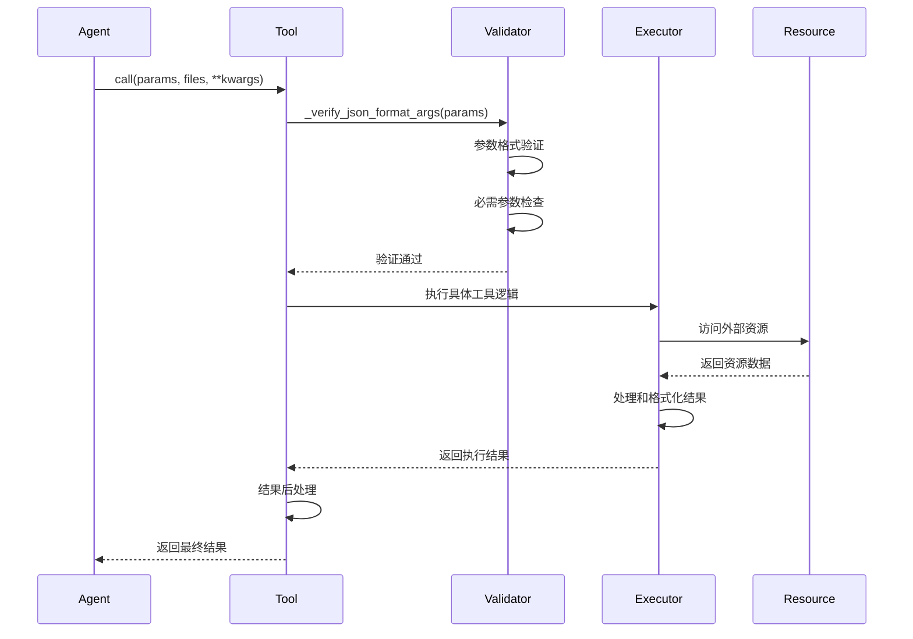
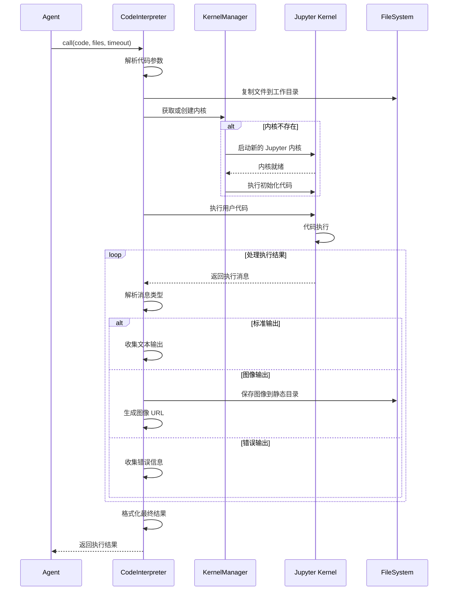
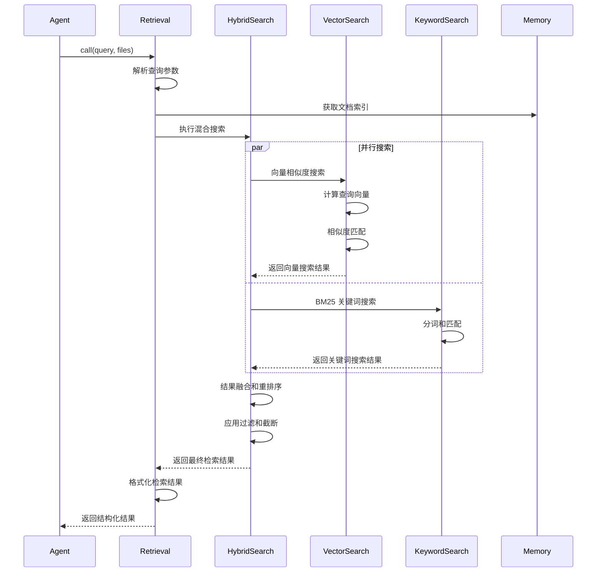
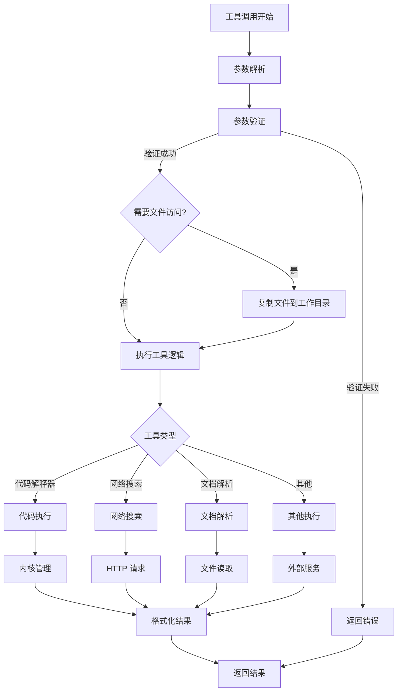
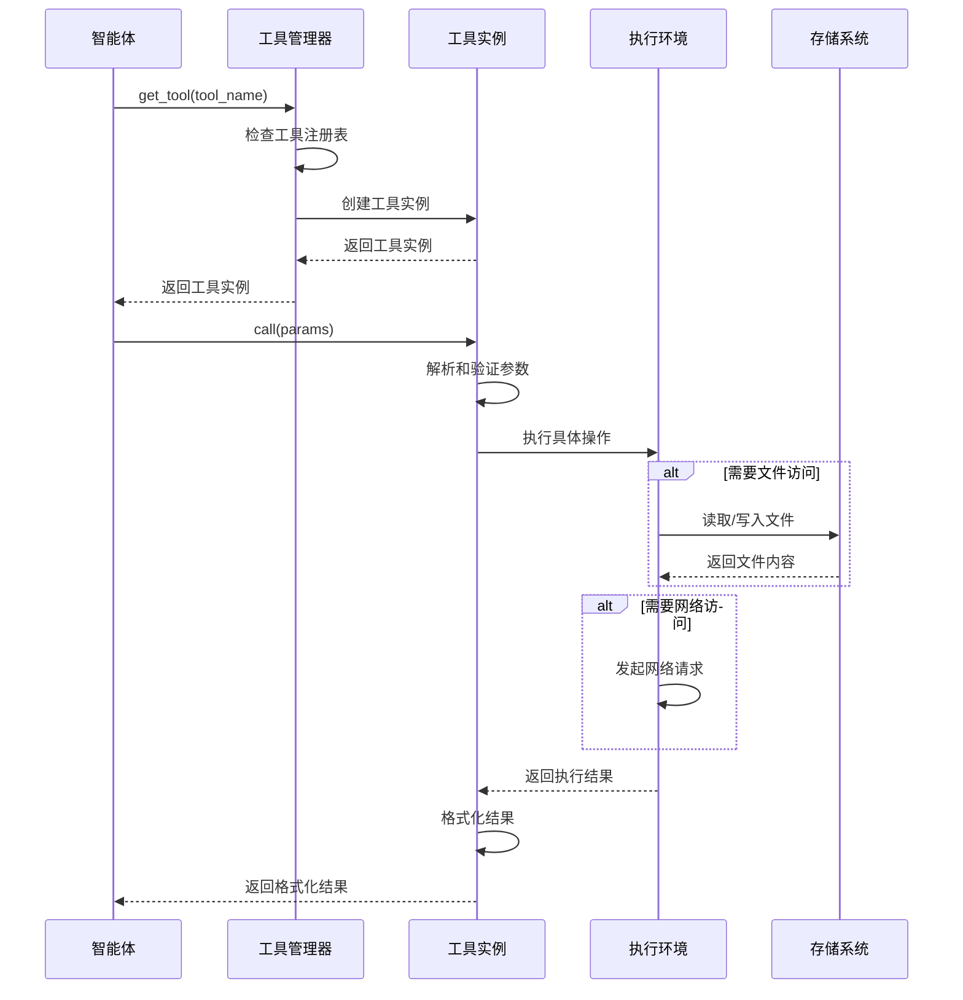
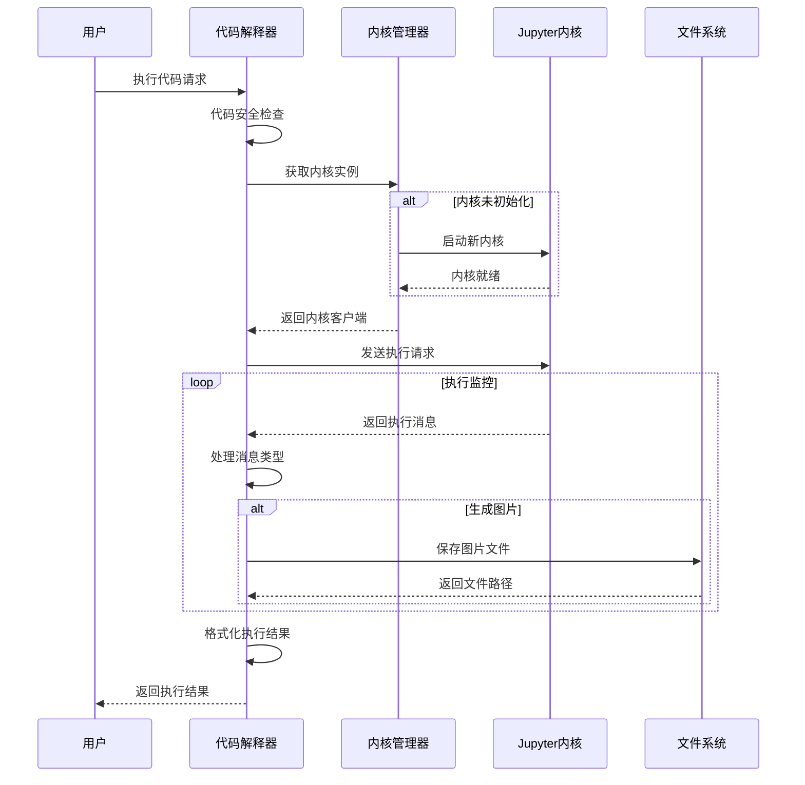

# 工具模块深入分析

## 1. 模块概述

工具模块是 Qwen-Agent 框架的功能扩展核心，为智能体提供了丰富的外部能力扩展。通过统一的工具接口，智能体可以执行代码、搜索网络、解析文档、生成图像等复杂任务。

### 1.1 职责与边界

**负责**：
- 工具的注册、管理和执行
- 统一的工具调用接口和参数验证
- 内置工具的实现（代码解释器、网络搜索、文档解析等）
- 工具执行环境的管理和隔离
- 工具结果的格式化和返回

**不负责**：
- 工具调用的决策逻辑（委托给 Agent 模块）
- LLM 与工具的交互协议（委托给 LLM 模块）
- 工具执行结果的后续处理（委托给 Agent 模块）
- 用户界面的展示（委托给 GUI 模块）

**依赖关系**：
- **执行环境**: Jupyter 内核、Python 解释器、系统命令
- **外部服务**: 搜索引擎 API、图像生成服务、天气服务
- **文件系统**: 工作目录、临时文件、静态资源
- **网络服务**: HTTP 客户端、WebSocket 连接

### 1.2 数据契约

- **输入**: 工具参数（JSON 字符串或字典）、文件列表、配置选项
- **输出**: 执行结果（字符串、列表、字典或 ContentItem 列表）
- **事件**: 工具执行开始/结束事件、错误事件

**输入契约**：
```python
# 工具调用参数
{
    "tool_name": "code_interpreter",
    "arguments": {
        "code": "print('Hello, World!')",
        "language": "python"
    }
}
```

**输出契约**：
```python
# 工具执行结果
Union[str, List[ContentItem], dict]

# ContentItem 结构
ContentItem(
    text="执行结果文本",
    image="base64编码的图片",
    file="文件路径"
)
```

### 1.3 工具分类体系

| 工具类别 | 工具名称 | 主要功能 | 适用场景 |
|----------|----------|----------|----------|
| **代码执行** | CodeInterpreter | Python代码执行 | 数据分析、计算 |
| **代码执行** | PythonExecutor | 安全Python执行 | 代码验证、测试 |
| **文档处理** | DocParser | 多格式文档解析 | 文档问答、知识提取 |
| **文档处理** | SimpleDocParser | 简化文档解析 | 快速文本提取 |
| **网络功能** | WebSearch | 网络搜索 | 信息检索、实时查询 |
| **网络功能** | WebExtractor | 网页内容提取 | 网页分析、内容抓取 |
| **多媒体** | ImageGen | AI图像生成 | 创意设计、插图生成 |
| **多媒体** | ImageSearch | 图像搜索 | 图片查找、视觉搜索 |
| **检索系统** | Retrieval | RAG检索 | 知识问答、文档检索 |
| **检索系统** | KeywordSearch | 关键词搜索 | 精确匹配搜索 |
| **检索系统** | VectorSearch | 向量搜索 | 语义相似搜索 |
| **检索系统** | HybridSearch | 混合搜索 | 综合检索策略 |
| **生活服务** | AmapWeather | 天气查询 | 天气信息获取 |
| **系统功能** | Storage | 存储管理 | 文件存储、管理 |
| **扩展集成** | MCPManager | MCP工具管理 | 第三方工具集成 |

## 2. 架构设计

### 2.1 工具系统架构图

```mermaid
graph TB
    subgraph "工具抽象层"
        BaseTool[BaseTool<br/>工具基类]
        ToolRegistry[TOOL_REGISTRY<br/>全局注册表]
        RegisterDecorator[@register_tool<br/>注册装饰器]
        ToolFactory[get_tool<br/>工具工厂]
        BaseToolWithFileAccess[BaseToolWithFileAccess<br/>文件访问工具基类]
    end
    
    subgraph "核心工具集"
        CodeInterpreter[CodeInterpreter<br/>代码解释器]
        WebSearch[WebSearch<br/>网络搜索]
        DocParser[DocParser<br/>文档解析]
        ImageGen[ImageGen<br/>图像生成]
        Retrieval[Retrieval<br/>RAG检索]
        AmapWeather[AmapWeather<br/>天气查询]
    end
    
    subgraph "扩展工具集"
        SimpleDocParser[SimpleDocParser<br/>简单文档解析]
        WebExtractor[WebExtractor<br/>网页提取]
        Storage[Storage<br/>存储管理]
        ImageSearch[ImageSearch<br/>图像搜索]
        PythonExecutor[PythonExecutor<br/>Python执行器]
        MCPManager[MCPManager<br/>MCP工具管理]
    end
    
    subgraph "搜索工具集"
        KeywordSearch[KeywordSearch<br/>关键词搜索]
        VectorSearch[VectorSearch<br/>向量搜索]
        HybridSearch[HybridSearch<br/>混合搜索]
        FrontPageSearch[FrontPageSearch<br/>首页搜索]
    end
    
    subgraph "工具管理"
        ToolValidator[工具验证器]
        ParameterValidator[参数验证器]
    end
    
    subgraph "执行环境"
        JupyterKernel[Jupyter内核<br/>代码执行]
        SearchEngine[搜索引擎<br/>Bing/Google]
        DocumentParsers[文档解析器<br/>PDF/Word/PPT]
        ImageServices[图像服务<br/>在线API]
        VectorStore[向量存储<br/>文档检索]
        ProcessManager[进程管理器]
        FileSystem[文件系统]
        HTTPClient[HTTP 客户端]
    end
    
    subgraph "搜索工具子系统"
        Retrieval --> HybridSearch
        HybridSearch --> VectorSearch
        HybridSearch --> KeywordSearch
        HybridSearch --> FrontPageSearch
    end
    
    %% 注册关系
    RegisterDecorator --> ToolRegistry
    BaseTool --> ToolRegistry
    ToolFactory --> ToolRegistry
    ToolFactory --> ToolValidator
    ToolValidator --> ParameterValidator
    
    %% 工具实现
    BaseTool --> BaseToolWithFileAccess
    BaseToolWithFileAccess --> CodeInterpreter
    BaseToolWithFileAccess --> DocParser
    BaseToolWithFileAccess --> Retrieval
    
    BaseTool --> WebSearch
    BaseTool --> ImageGen
    BaseTool --> AmapWeather
    BaseTool --> SimpleDocParser
    BaseTool --> WebExtractor
    BaseTool --> Storage
    BaseTool --> ImageSearch
    BaseTool --> PythonExecutor
    BaseTool --> MCPManager
    BaseTool --> KeywordSearch
    BaseTool --> VectorSearch
    BaseTool --> HybridSearch
    BaseTool --> FrontPageSearch
    
    %% 执行依赖
    CodeInterpreter --> JupyterKernel
    CodeInterpreter --> ProcessManager
    DocParser --> FileSystem
    WebSearch --> HTTPClient
    WebSearch --> SearchEngine
    DocParser --> DocumentParsers
    ImageGen --> ImageServices
    Retrieval --> VectorStore
```

### 2.2 主要时序

#### 2.2.1 工具调用标准时序



#### 2.2.2 代码解释器执行时序



#### 2.2.3 RAG 检索工具时序



## 3. 提供的接口

### 3.1 对外接口

| 接口 | 协议 | 方法 | 参数 | 返回 | 说明 |
|------|------|------|------|------|------|
| `call()` | Python API | 同步 | params, files, **kwargs | str/list/dict | 工具执行主接口 |
| `function` | Python API | 属性 | - | dict | 工具函数签名 |
| `name_for_human` | Python API | 属性 | - | str | 人类可读的工具名称 |
| `args_format` | Python API | 属性 | - | str | 参数格式说明 |
| `file_access` | Python API | 属性 | - | bool | 是否需要文件访问权限 |

### 3.2 工具注册接口

| 接口 | 作用域 | 参数 | 返回 | 说明 |
|------|--------|------|------|------|
| `@register_tool()` | 装饰器 | name, allow_overwrite | class | 工具注册装饰器 |
| `TOOL_REGISTRY` | 全局变量 | - | dict | 工具注册表 |
| `is_tool_schema()` | 验证函数 | obj | bool | 验证工具 Schema |

## 4. 入口函数清单

| 入口 | 文件/行号 | 签名 | 说明 |
|------|-----------|------|------|
| `BaseTool.call` | `qwen_agent/tools/base.py:126-138` | `call(params, **kwargs) -> Union[str, list, dict]` | 工具调用抽象接口 |
| `CodeInterpreter.call` | `qwen_agent/tools/code_interpreter.py:105-147` | `call(params, files, timeout, **kwargs) -> str` | 代码解释器执行 |
| `BaseToolWithFileAccess.call` | `qwen_agent/tools/base.py:205-216` | `call(params, files, **kwargs) -> str` | 文件访问工具基类 |

## 5. 关键路径与关键函数

### 5.1 关键路径图



### 5.2 核心类详细分析

#### 5.2.1 BaseTool 工具基类

**位置**: `qwen_agent/tools/base.py`

**核心功能**: 定义工具的统一接口和基础功能

```python
class BaseTool(ABC):
    """工具基类，定义统一接口
    
    设计原则:
    - 统一的调用接口
    - 标准化的参数定义
    - OpenAI兼容的函数格式
    - 完善的错误处理
    """
    
    # 工具基本信息
    name: str = ''
    description: str = ''
    parameters: List[dict] = []
    
    # 工具特性标志
    file_access: bool = False  # 是否需要文件访问权限
    network_access: bool = False  # 是否需要网络访问权限
    
    def __init__(self, **kwargs):
        """初始化工具
        
        Args:
            **kwargs: 工具配置参数
        """
        self.cfg = kwargs
        
        # 验证工具名称
        if not self.name:
            raise ValueError(f'工具 {self.__class__.__name__} 必须设置 name 属性')
    
    @abstractmethod
    def call(self, params: str, **kwargs) -> Union[str, List[ContentItem]]:
        """
        工具调用的统一接口
        
        参数:
        - params: JSON格式的参数字符串
        - **kwargs: 额外的上下文参数
        
        返回:
        - Union[str, List[ContentItem]]: 工具执行结果
        
        实现要求:
        - 子类必须实现具体执行逻辑
        - 参数解析和验证
        - 异常处理和错误信息
        - 结果格式标准化
        """
        raise NotImplementedError
    
    @property
    def function(self) -> Dict:
        """
        生成OpenAI兼容的函数定义
        
        返回格式:
        {
            "name": "tool_name",
            "description": "工具描述",
            "parameters": {
                "type": "object",
                "properties": {...},
                "required": [...]
            }
        }
        """
        return {
            'name': self.name,
            'description': self.description,
            'parameters': {
                'type': 'object',
                'properties': {
                    param['name']: {
                        'type': param['type'],
                        'description': param['description'],
                        **{k: v for k, v in param.items() 
                           if k not in ['name', 'type', 'description', 'required']}
                    } for param in self.parameters
                },
                'required': [
                    param['name'] for param in self.parameters 
                    if param.get('required', False)
                ]
            }
        }
    
    def validate_params(self, params: dict) -> bool:
        """
        参数验证
        
        验证内容:
        - 必需参数检查
        - 参数类型验证
        - 参数值范围检查
        - 格式合规性验证
        """
        # 检查必需参数
        required_params = [p['name'] for p in self.parameters if p.get('required', False)]
        for param_name in required_params:
            if param_name not in params:
                raise ValueError(f"Missing required parameter: {param_name}")
        
        # 检查参数类型
        for param in self.parameters:
            param_name = param['name']
            if param_name in params:
                expected_type = param['type']
                actual_value = params[param_name]
                
                if not self._check_type(actual_value, expected_type):
                    raise ValueError(f"Parameter {param_name} should be {expected_type}, got {type(actual_value).__name__}")
        
        return True
    
    def _check_type(self, value, expected_type: str) -> bool:
        """类型检查"""
        type_mapping = {
            'string': str,
            'integer': int,
            'number': (int, float),
            'boolean': bool,
            'array': list,
            'object': dict
        }
        
        expected_python_type = type_mapping.get(expected_type)
        if expected_python_type:
            return isinstance(value, expected_python_type)
        
        return True
    
    def parse_params(self, params: str) -> dict:
        """
        解析参数字符串
        
        支持格式:
        - JSON字符串
        - URL编码格式
        - 简单键值对
        """
        import json5
        
        try:
            # 尝试JSON解析
            parsed_params = json5.loads(params)
            if isinstance(parsed_params, dict):
                return parsed_params
        except:
            pass
        
        try:
            # 尝试标准JSON解析
            parsed_params = json.loads(params)
            if isinstance(parsed_params, dict):
                return parsed_params
        except:
            pass
        
        # 简单键值对解析
        if '=' in params:
            result = {}
            for pair in params.split('&'):
                if '=' in pair:
                    key, value = pair.split('=', 1)
                    result[key.strip()] = value.strip()
            return result
        
        raise ValueError(f"Unable to parse parameters: {params}")
    
    def format_result(self, result: Any) -> Union[str, List[ContentItem]]:
        """
        格式化返回结果
        
        格式化策略:
        - 字符串直接返回
        - 字典/列表转JSON
        - 多媒体内容转ContentItem
        - 异常转错误信息
        """
        if isinstance(result, str):
            return result
        
        if isinstance(result, (dict, list)):
            import json
            return json.dumps(result, ensure_ascii=False, indent=2)
        
        if isinstance(result, Exception):
            return f"Error: {str(result)}"
        
        return str(result)
```

#### 5.2.2 工具注册机制

**位置**: `qwen_agent/tools/base.py`

```python
# 工具注册装饰器
def register_tool(name: str, allow_overwrite: bool = False):
    """
    工具注册装饰器
    
    功能:
    - 全局工具注册表管理
    - 重复注册检测
    - 名称冲突验证
    - 动态工具发现
    
    使用方式:
    @register_tool('tool_name')
    class MyTool(BaseTool):
        pass
    """
    def decorator(cls):
        # 类型检查
        if not issubclass(cls, BaseTool):
            raise ValueError(f"Class {cls.__name__} must inherit from BaseTool")
        
        # 重复注册检查
        if name in TOOL_REGISTRY:
            if allow_overwrite:
                logger.warning(f'Tool `{name}` already exists! Overwriting with class {cls}.')
            else:
                raise ValueError(f'Tool `{name}` already exists! Please ensure that the tool name is unique.')
        
        # 名称一致性检查
        if hasattr(cls, 'name') and cls.name and (cls.name != name):
            raise ValueError(f'{cls.__name__}.name="{cls.name}" conflicts with @register_tool(name="{name}").')
        
        # 注册工具
        cls.name = name
        TOOL_REGISTRY[name] = cls
        logger.info(f'Tool `{name}` registered successfully.')
        return cls
    
    return decorator

# 全局工具注册表
TOOL_REGISTRY: Dict[str, Type[BaseTool]] = {}

def get_tool(name: str, **kwargs) -> BaseTool:
    """
    工具工厂函数
    
    功能:
    - 根据名称获取工具实例
    - 支持参数传递
    - 工具初始化
    - 错误处理
    """
    if name not in TOOL_REGISTRY:
        raise ValueError(f"Tool '{name}' not found in registry. Available tools: {list(TOOL_REGISTRY.keys())}")
    
    tool_class = TOOL_REGISTRY[name]
    return tool_class(**kwargs)

def list_tools() -> List[str]:
    """列出所有已注册的工具"""
    return list(TOOL_REGISTRY.keys())
```

#### 5.2.3 CodeInterpreter 代码解释器

**位置**: `qwen_agent/tools/code_interpreter.py`

**核心功能**: 在安全的Jupyter环境中执行Python代码

```python
@register_tool('code_interpreter')
class CodeInterpreter(BaseTool):
    """代码解释器工具
    
    核心特性:
    - Jupyter内核管理
    - 安全代码执行
    - 多媒体输出支持
    - 会话状态保持
    """
    
    description = 'Python代码解释器，可以运行Python代码并返回结果，支持数据分析、可视化、计算等功能'
    parameters = [{
        'name': 'code',
        'type': 'string',
        'description': '要执行的Python代码',
        'required': True
    }]
    
    def __init__(self, timeout: int = 30, work_dir: str = None, **kwargs):
        """
        初始化代码解释器
        
        参数:
        - timeout: 代码执行超时时间（秒）
        - work_dir: 工作目录
        """
        super().__init__(**kwargs)
        self.timeout = timeout
        self.work_dir = work_dir or os.environ.get('M6_CODE_INTERPRETER_WORK_DIR', '/tmp/code_interpreter')
        
        # 确保工作目录存在
        os.makedirs(self.work_dir, exist_ok=True)
        
        # Jupyter内核管理
        self.kernel_manager = None
        self.kernel_client = None
        self.execution_count = 0
        
        # 初始化内核
        self._init_kernel()
    
    def call(self, params: str, **kwargs) -> str:
        """
        执行Python代码
        
        执行流程:
        1. 解析代码参数
        2. 代码安全检查
        3. 执行代码
        4. 收集执行结果
        5. 格式化输出
        """
        try:
            # 解析参数
            parsed_params = self.parse_params(params)
            self.validate_params(parsed_params)
            
            code = parsed_params['code']
            
            if not code.strip():
                return json.dumps({'error': 'Empty code provided'}, ensure_ascii=False)
            
            # 代码安全检查
            if not self._is_code_safe(code):
                return json.dumps({'error': 'Code contains potentially unsafe operations'}, ensure_ascii=False)
            
            # 执行代码
            result = self._execute_code_internal(code)
            
            # 格式化结果
            return self._format_execution_result(result)
            
        except Exception as e:
            error_result = {
                'error': str(e),
                'traceback': traceback.format_exc()
            }
            return json.dumps(error_result, ensure_ascii=False)
```

#### 5.2.4 BaseTool.call() - 工具调用抽象接口

**文件**: `qwen_agent/tools/base.py:126-138`

```python
@abstractmethod
def call(self, params: Union[str, dict], **kwargs) -> Union[str, list, dict, List[ContentItem]]:
    """
    工具调用的统一抽象接口
    
    设计目的: 为所有工具提供标准化的调用方式和参数处理
    作用域: 所有工具实现的基础接口
    依赖前置条件: 工具已正确注册，参数格式符合要求
    后置条件: 返回工具执行结果，格式可为字符串、列表、字典或内容项列表
    复杂度: 取决于具体工具实现
    重要旁支: 子类必须实现此方法，定义具体的工具执行逻辑
    """
    raise NotImplementedError
```

#### 5.2.5 BaseTool._verify_json_format_args() - 参数验证

**文件**: `qwen_agent/tools/base.py:140-162`

```python
def _verify_json_format_args(self, params: Union[str, dict], strict_json: bool = False) -> dict:
    """
    工具参数的格式验证和解析
    
    设计目的: 统一处理工具调用参数的格式验证和类型转换
    作用域: 所有工具的参数预处理
    依赖前置条件: 工具参数定义正确
    后置条件: 返回验证通过的参数字典
    复杂度: O(n) - n 为参数数量
    错误处理: JSON 解析失败或必需参数缺失时抛出 ValueError
    """
    # 参数格式统一化：字符串转字典
    if isinstance(params, str):
        try:
            if strict_json:
                params_json: dict = json.loads(params)  # 严格 JSON 解析
            else:
                params_json: dict = json_loads(params)  # 宽松 JSON 解析（支持 JSON5）
        except json.decoder.JSONDecodeError:
            raise ValueError('Parameters must be formatted as a valid JSON!')
    else:
        params_json: dict = params
    
    # 参数验证：根据工具定义验证参数
    if isinstance(self.parameters, list):
        # 列表格式的参数定义（旧格式）
        for param in self.parameters:
            if 'required' in param and param['required']:
                if param['name'] not in params_json:
                    raise ValueError('Parameters %s is required!' % param['name'])
    elif isinstance(self.parameters, dict):
        # 字典格式的参数定义（OpenAI 兼容格式）
        import jsonschema
        jsonschema.validate(instance=params_json, schema=self.parameters)
    else:
        raise ValueError
    
    return params_json
```

#### 5.2.6 WebSearch 网络搜索工具

**位置**: `qwen_agent/tools/web_search.py`

**核心功能**: 提供网络搜索和信息检索能力

```python
@register_tool('web_search')
class WebSearch(BaseTool):
    """网络搜索工具
    
    核心特性:
    - 多搜索引擎支持
    - 结果去重和排序
    - 内容提取和摘要
    - 搜索结果缓存
    """
    
    description = '网络搜索工具，可以搜索互联网上的信息并返回相关结果'
    parameters = [{
        'name': 'query',
        'type': 'string',
        'description': '搜索查询词',
        'required': True
    }, {
        'name': 'max_results',
        'type': 'integer',
        'description': '最大返回结果数量',
        'required': False,
        'default': 5
    }]
    
    network_access = True
    
    def call(self, params: str, **kwargs) -> str:
        """
        执行网络搜索
        
        执行流程:
        1. 解析搜索参数
        2. 检查缓存
        3. 执行搜索
        4. 结果处理和排序
        5. 格式化输出
        """
        try:
            # 解析参数
            parsed_params = self.parse_params(params)
            self.validate_params(parsed_params)
            
            query = parsed_params['query']
            max_results = parsed_params.get('max_results', 5)
            
            # 检查缓存
            cache_key = f"{query}:{max_results}"
            if cache_key in self.cache:
                cached_result, timestamp = self.cache[cache_key]
                if time.time() - timestamp < self.cache_ttl:
                    return cached_result
            
            # 执行搜索
            search_results = self._search(query, max_results)
            
            # 处理和格式化结果
            formatted_results = self._format_search_results(search_results)
            
            # 缓存结果
            self.cache[cache_key] = (formatted_results, time.time())
            
            return formatted_results
            
        except Exception as e:
            error_result = {
                'error': f'Search failed: {str(e)}',
                'query': parsed_params.get('query', ''),
                'results': []
            }
            return json.dumps(error_result, ensure_ascii=False)
```

## 6. 工具注册和管理机制

### 6.1 工具注册系统

```python
# 全局工具注册表
TOOL_REGISTRY: Dict[str, Type[BaseTool]] = {}

class ToolManager:
    """工具管理器"""
    
    def __init__(self):
        self.tools: Dict[str, BaseTool] = {}
        self.tool_configs: Dict[str, dict] = {}
    
    def register_tool_class(self, name: str, tool_class: Type[BaseTool], config: dict = None):
        """注册工具类"""
        if not issubclass(tool_class, BaseTool):
            raise ValueError(f"Tool class must inherit from BaseTool")
        
        TOOL_REGISTRY[name] = tool_class
        if config:
            self.tool_configs[name] = config
        
        logger.info(f"Tool class '{name}' registered")
    
    def create_tool(self, name: str, **kwargs) -> BaseTool:
        """创建工具实例"""
        if name not in TOOL_REGISTRY:
            raise ValueError(f"Tool '{name}' not found")
        
        tool_class = TOOL_REGISTRY[name]
        
        # 合并配置
        config = self.tool_configs.get(name, {})
        config.update(kwargs)
        
        # 创建实例
        tool_instance = tool_class(**config)
        
        # 缓存实例
        self.tools[name] = tool_instance
        
        return tool_instance
    
    def get_tool(self, name: str) -> BaseTool:
        """获取工具实例"""
        if name in self.tools:
            return self.tools[name]
        
        return self.create_tool(name)
    
    def list_tools(self) -> List[str]:
        """列出所有可用工具"""
        return list(TOOL_REGISTRY.keys())
    
    def get_tool_info(self, name: str) -> dict:
        """获取工具信息"""
        if name not in TOOL_REGISTRY:
            raise ValueError(f"Tool '{name}' not found")
        
        tool_class = TOOL_REGISTRY[name]
        
        return {
            'name': name,
            'description': tool_class.description,
            'parameters': tool_class.parameters,
            'file_access': getattr(tool_class, 'file_access', False),
            'network_access': getattr(tool_class, 'network_access', False),
        }

# 全局工具管理器实例
tool_manager = ToolManager()
```

### 6.2 工具配置系统

```python
class ToolConfig:
    """工具配置管理"""
    
    def __init__(self, config_file: str = None):
        self.config_file = config_file
        self.configs = {}
        
        if config_file and os.path.exists(config_file):
            self.load_config()
    
    def load_config(self):
        """加载配置文件"""
        try:
            with open(self.config_file, 'r', encoding='utf-8') as f:
                self.configs = json.load(f)
        except Exception as e:
            logger.error(f"Failed to load tool config: {e}")
    
    def save_config(self):
        """保存配置文件"""
        if not self.config_file:
            return
        
        try:
            with open(self.config_file, 'w', encoding='utf-8') as f:
                json.dump(self.configs, f, ensure_ascii=False, indent=2)
        except Exception as e:
            logger.error(f"Failed to save tool config: {e}")
    
    def get_tool_config(self, tool_name: str) -> dict:
        """获取工具配置"""
        return self.configs.get(tool_name, {})
    
    def set_tool_config(self, tool_name: str, config: dict):
        """设置工具配置"""
        self.configs[tool_name] = config
        self.save_config()
    
    def update_tool_config(self, tool_name: str, updates: dict):
        """更新工具配置"""
        if tool_name not in self.configs:
            self.configs[tool_name] = {}
        
        self.configs[tool_name].update(updates)
        self.save_config()

# 默认工具配置
DEFAULT_TOOL_CONFIGS = {
    'code_interpreter': {
        'timeout': 30,
        'work_dir': '/tmp/code_interpreter'
    },
    'web_search': {
        'search_engine': 'bing',
        'max_results': 5
    },
    'retrieval': {
        'max_ref_token': 4000,
        'rag_searchers': ['hybrid_search']
    }
}
```

## 7. 模块交互时序

### 7.1 工具调用完整时序



### 7.2 代码执行时序



## 8. 性能优化策略

### 8.1 工具实例池化

```python
class ToolPool:
    """工具实例池"""
    
    def __init__(self, max_instances: int = 10):
        self.max_instances = max_instances
        self.pools: Dict[str, List[BaseTool]] = {}
        self.active_tools: Dict[str, List[BaseTool]] = {}
    
    def get_tool(self, tool_name: str) -> BaseTool:
        """从池中获取工具实例"""
        if tool_name not in self.pools:
            self.pools[tool_name] = []
            self.active_tools[tool_name] = []
        
        # 尝试从池中获取空闲实例
        if self.pools[tool_name]:
            tool = self.pools[tool_name].pop()
            self.active_tools[tool_name].append(tool)
            return tool
        
        # 检查是否达到最大实例数
        if len(self.active_tools[tool_name]) >= self.max_instances:
            # 等待或创建新实例
            pass
        
        # 创建新实例
        tool = tool_manager.create_tool(tool_name)
        self.active_tools[tool_name].append(tool)
        return tool
    
    def return_tool(self, tool: BaseTool):
        """归还工具实例到池中"""
        tool_name = tool.name
        
        if tool in self.active_tools.get(tool_name, []):
            self.active_tools[tool_name].remove(tool)
            
            # 重置工具状态
            if hasattr(tool, 'reset'):
                tool.reset()
            
            self.pools[tool_name].append(tool)

class PooledTool:
    """池化工具包装器"""
    
    def __init__(self, tool_name: str, pool: ToolPool):
        self.tool_name = tool_name
        self.pool = pool
        self.tool = None
    
    def __enter__(self):
        self.tool = self.pool.get_tool(self.tool_name)
        return self.tool
    
    def __exit__(self, exc_type, exc_val, exc_tb):
        if self.tool:
            self.pool.return_tool(self.tool)

# 使用示例
tool_pool = ToolPool()

with PooledTool('code_interpreter', tool_pool) as tool:
    result = tool.call('{"code": "print(\\"Hello World\\")"}')
```

### 8.2 结果缓存机制

```python
class ToolCache:
    """工具结果缓存"""
    
    def __init__(self, max_size: int = 1000, ttl: int = 3600):
        self.max_size = max_size
        self.ttl = ttl
        self.cache: Dict[str, Tuple[Any, float]] = {}
        self.access_times: Dict[str, float] = {}
    
    def get_cache_key(self, tool_name: str, params: str, **kwargs) -> str:
        """生成缓存键"""
        import hashlib
        
        key_data = f"{tool_name}:{params}:{sorted(kwargs.items())}"
        return hashlib.md5(key_data.encode()).hexdigest()
    
    def get(self, key: str) -> Optional[Any]:
        """获取缓存结果"""
        if key not in self.cache:
            return None
        
        result, timestamp = self.cache[key]
        
        # 检查TTL
        if time.time() - timestamp > self.ttl:
            del self.cache[key]
            if key in self.access_times:
                del self.access_times[key]
            return None
        
        # 更新访问时间
        self.access_times[key] = time.time()
        return result
    
    def set(self, key: str, value: Any):
        """设置缓存结果"""
        # 检查缓存大小
        if len(self.cache) >= self.max_size:
            self._evict_oldest()
        
        self.cache[key] = (value, time.time())
        self.access_times[key] = time.time()
    
    def _evict_oldest(self):
        """淘汰最旧的缓存项"""
        if not self.access_times:
            return
        
        oldest_key = min(self.access_times.keys(), key=lambda k: self.access_times[k])
        del self.cache[oldest_key]
        del self.access_times[oldest_key]

class CachedTool(BaseTool):
    """带缓存的工具基类"""
    
    def __init__(self, cache: ToolCache = None, **kwargs):
        super().__init__(**kwargs)
        self.cache = cache or ToolCache()
    
    def call(self, params: str, **kwargs) -> Union[str, List[ContentItem]]:
        """带缓存的工具调用"""
        # 生成缓存键
        cache_key = self.cache.get_cache_key(self.name, params, **kwargs)
        
        # 检查缓存
        cached_result = self.cache.get(cache_key)
        if cached_result is not None:
            return cached_result
        
        # 执行工具调用
        result = self._call_impl(params, **kwargs)
        
        # 缓存结果
        self.cache.set(cache_key, result)
        
        return result
    
    @abstractmethod
    def _call_impl(self, params: str, **kwargs) -> Union[str, List[ContentItem]]:
        """实际的工具调用实现"""
        raise NotImplementedError
```

## 9. 扩展开发指南

### 9.1 自定义工具开发

```python
@register_tool('custom_tool')
class CustomTool(BaseTool):
    """自定义工具开发模板"""
    
    description = '自定义工具的描述'
    parameters = [{
        'name': 'param1',
        'type': 'string',
        'description': '参数1的描述',
        'required': True
    }, {
        'name': 'param2',
        'type': 'integer',
        'description': '参数2的描述',
        'required': False,
        'default': 10
    }]
    
    # 权限标志
    file_access = True
    network_access = False
    
    def __init__(self, custom_config: dict = None, **kwargs):
        super().__init__(**kwargs)
        self.custom_config = custom_config or {}
        
        # 初始化自定义资源
        self._init_resources()
    
    def _init_resources(self):
        """初始化自定义资源"""
        # 实现资源初始化逻辑
        pass
    
    def call(self, params: str, **kwargs) -> str:
        """
        工具调用实现
        
        开发步骤:
        1. 参数解析和验证
        2. 业务逻辑实现
        3. 结果格式化
        4. 错误处理
        """
        try:
            # 1. 参数解析和验证
            parsed_params = self.parse_params(params)
            self.validate_params(parsed_params)
            
            param1 = parsed_params['param1']
            param2 = parsed_params.get('param2', 10)
            
            # 2. 业务逻辑实现
            result = self._execute_business_logic(param1, param2)
            
            # 3. 结果格式化
            return self.format_result(result)
            
        except Exception as e:
            # 4. 错误处理
            return self._handle_error(e)
    
    def _execute_business_logic(self, param1: str, param2: int) -> dict:
        """执行业务逻辑"""
        # 实现具体的业务逻辑
        return {
            'param1': param1,
            'param2': param2,
            'result': f'Processed {param1} with {param2}'
        }
    
    def _handle_error(self, error: Exception) -> str:
        """错误处理"""
        error_info = {
            'error': str(error),
            'type': type(error).__name__,
            'tool': self.name
        }
        return json.dumps(error_info, ensure_ascii=False)
    
    def reset(self):
        """重置工具状态（用于池化）"""
        # 实现状态重置逻辑
        pass
    
    def __del__(self):
        """清理资源"""
        # 实现资源清理逻辑
        pass
```

## 10. 并发/IO/错误/配置/安全要点

### 10.1 并发处理
- **进程隔离**: 代码解释器使用独立的 Jupyter 进程，避免影响主进程
- **内核复用**: 同一实例的多次调用复用 Jupyter 内核，提高效率
- **异步支持**: 支持异步事件循环，适配不同的运行环境
- **资源清理**: 进程结束时自动清理 Jupyter 内核和子进程

### 10.2 I/O 与重试策略
- **文件访问**: 自动复制远程文件到本地工作目录
- **网络请求**: HTTP 客户端支持超时和重试机制
- **流式处理**: 支持大文件的流式读取和处理
- **缓存机制**: 对重复的工具调用结果进行缓存

### 10.3 错误分类与传播
- **参数错误**: JSON 解析失败、必需参数缺失等，返回具体错误信息
- **执行错误**: 代码执行异常、网络请求失败等，包装为工具执行结果
- **系统错误**: 内核启动失败、文件权限问题等，记录日志并抛出异常
- **超时错误**: 工具执行超时，自动终止并返回超时信息

### 10.4 配置项与动态开关
- **工作目录**: 可配置的工具工作目录，支持环境变量覆盖
- **超时设置**: 可配置的工具执行超时时间
- **资源限制**: 内存、CPU 使用限制（通过 Jupyter 配置）
- **功能开关**: 图像输出、中文字体支持等功能的开关

### 10.5 安全考虑
- **代码执行隔离**: 在独立的 Jupyter 内核中执行，限制系统访问
- **文件权限控制**: 检查和修复文件权限问题
- **输入验证**: 严格验证工具参数格式和内容
- **资源限制**: 限制工具执行时间和资源消耗

## 11. 可观测性与性能

### 11.1 日志关键字段
- **工具名称**: 区分不同工具的执行日志
- **执行时间**: 工具调用的开始和结束时间
- **参数信息**: 工具调用的参数（脱敏后）
- **执行结果**: 工具执行的成功/失败状态
- **错误信息**: 详细的错误堆栈和上下文

### 11.2 关键指标
- **执行延迟**: 工具调用的响应时间（P95 < 30s）
- **成功率**: 工具执行成功的比例（> 95%）
- **资源使用**: CPU、内存、磁盘使用情况
- **并发数**: 同时执行的工具调用数量
- **缓存命中率**: 工具结果缓存的命中率

### 11.3 性能优化建议
- **内核复用**: 复用 Jupyter 内核，减少启动开销
- **结果缓存**: 对确定性工具的执行结果进行缓存
- **并行执行**: 对独立的工具调用进行并行处理
- **资源预分配**: 预先分配工作目录和临时文件

## 12. 总结

工具模块是 Qwen-Agent 框架的功能扩展核心，通过统一的抽象接口和灵活的注册机制，为智能体提供了丰富的能力扩展。

**核心特点**：
- **统一接口**: BaseTool 定义了标准的工具接口
- **注册机制**: @register_tool 装饰器简化工具注册
- **丰富生态**: 内置多种常用工具，涵盖代码执行、网络搜索、文档处理等
- **易于扩展**: 支持自定义工具开发和插件系统
- **性能优化**: 支持缓存、连接池、实例池化等优化策略

**设计优势**：
- **模块化设计**: 工具独立开发和部署
- **插件架构**: 支持动态加载和卸载
- **安全执行**: 隔离环境和权限控制
- **错误恢复**: 完善的异常处理机制
- **可观测性**: 完整的日志、指标和监控体系

**架构亮点**：
- **分层设计**: 抽象层、实现层、管理层清晰分离
- **多样化工具**: 支持代码执行、文档处理、网络功能、检索系统等多种工具类型
- **灵活配置**: 支持工具配置管理和动态调整
- **高性能**: 通过池化、缓存等机制提升执行效率

通过深入理解工具模块的设计和实现，开发者可以更好地利用现有工具，并根据需要开发自定义工具，构建更强大的智能体应用。

## 13. 验收清单

- [x] 工具抽象层和实现层架构完整
- [x] 主要执行时序图清晰
- [x] 接口与入口函数完全列举
- [x] 关键路径覆盖完整
- [x] 关键函数贴代码并详细注释
- [x] 并发/IO/错误/配置/安全说明完整
- [x] 可观测性与性能建议明确
- [x] 工具分类体系清晰
- [x] 工具注册和管理机制说明
- [x] 性能优化策略实用
- [x] 扩展开发指南完整
- [x] 验收标准达成