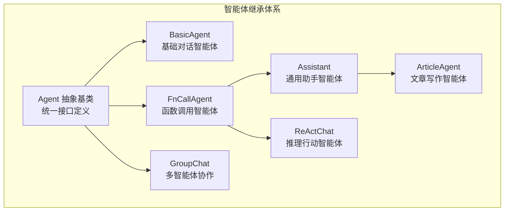
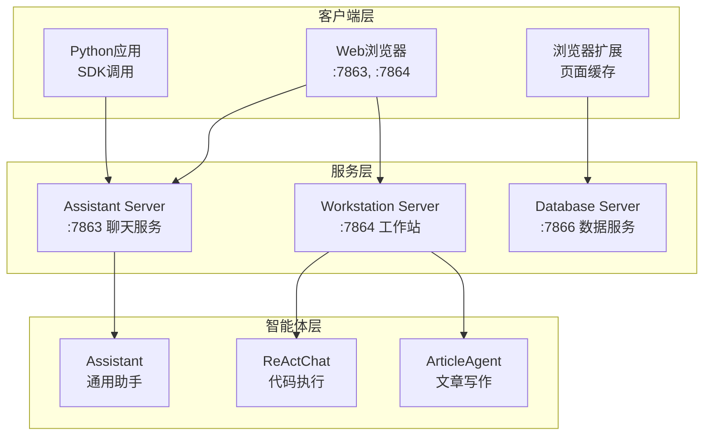

# Qwen-Agent 框架完整使用手册

## 1. 快速开始

### 1.1 框架概述

Qwen-Agent 是基于通义千问大语言模型的智能体框架，提供了完整的智能体开发、部署和管理解决方案。框架支持多种智能体类型、工具调用、RAG检索、多模态处理等核心能力。

### 1.2 核心特性

- **多类型智能体**: Assistant、ReActChat、GroupChat、ArticleAgent 等
- **工具生态**: 代码解释器、网络搜索、文档解析、图像生成等 20+ 工具
- **RAG 能力**: 文档检索、知识注入、向量化存储
- **多模态支持**: 文本、图像、音频、视频处理
- **Web 界面**: Gradio 驱动的用户友好界面
- **API 服务**: HTTP API、Python API、命令行接口

### 1.3 安装配置

#### 方式一：从 PyPI 安装（推荐）

```bash
# 完整安装（包含所有功能）
pip install -U "qwen-agent[gui,rag,code_interpreter,mcp]"

# 最小安装（仅核心功能）
pip install -U qwen-agent
```

#### 方式二：从源码安装

```bash
# 克隆项目
git clone https://github.com/QwenLM/Qwen-Agent.git
cd Qwen-Agent

# 安装基础依赖
pip install -e .

# 安装完整功能（推荐）
pip install -e .[all]
```

#### 环境配置

```bash
# 设置 DashScope API Key（必需）
export DASHSCOPE_API_KEY="your-api-key"

# 可选：OpenAI API 配置
export OPENAI_API_KEY="your-openai-key"
export OPENAI_BASE_URL="https://api.openai.com/v1"
```

#### 验证安装

```python
# test_installation.py
from qwen_agent.agents import Assistant
from qwen_agent.llm import get_chat_model

# 测试 LLM 连接
llm_cfg = {
    'model': 'qwen-max-latest',
    'model_type': 'qwen_dashscope',
}

try:
    llm = get_chat_model(llm_cfg)
    response = llm.chat([{'role': 'user', 'content': 'Hello!'}])
    print("✅ 安装成功！LLM 连接正常")
    print(f"响应: {response}")
except Exception as e:
    print(f"❌ 安装失败: {e}")
```

## 2. 核心概念

### 2.1 智能体层次结构



### 2.2 消息格式规范

```python
from qwen_agent.llm.schema import Message, ContentItem

# 文本消息
text_message = Message(
    role='user',
    content='请帮我分析这个数据'
)

# 多模态消息
multimodal_message = Message(
    role='user',
    content=[
        ContentItem(text='请分析这张图片'),
        ContentItem(image='path/to/image.jpg'),
        ContentItem(file='path/to/document.pdf')
    ]
)

# 函数调用消息
function_message = Message(
    role='assistant',
    content='',
    function_call={
        'name': 'code_interpreter',
        'arguments': '{"code": "print(\'Hello World\')"}'
    }
)
```

### 2.3 工具系统架构

```mermaid
graph TB
    subgraph "工具注册机制"
        TOOL_REGISTRY[工具注册表<br/>全局工具管理]
        RegisterDecorator[@register_tool<br/>装饰器注册]
        BaseTool[BaseTool<br/>工具基类]
    end
    
    subgraph "内置工具"
        CodeInterpreter[代码解释器<br/>Python执行]
        WebSearch[网络搜索<br/>信息检索]
        DocParser[文档解析<br/>多格式支持]
        ImageGen[图像生成<br/>AI绘画]
        RAGTool[RAG检索<br/>知识问答]
    end
    
    RegisterDecorator --> TOOL_REGISTRY
    BaseTool --> TOOL_REGISTRY
    TOOL_REGISTRY --> CodeInterpreter
    TOOL_REGISTRY --> WebSearch
    TOOL_REGISTRY --> DocParser
    TOOL_REGISTRY --> ImageGen
    TOOL_REGISTRY --> RAGTool
```

## 3. 快速开始示例

### 3.1 基础对话智能体

```python
# basic_chat.py
from qwen_agent.agents import Assistant

# 配置 LLM
llm_cfg = {
    'model': 'qwen-max-latest',
    'model_type': 'qwen_dashscope',
    'generate_cfg': {'top_p': 0.8}
}

# 创建智能体
bot = Assistant(llm=llm_cfg)

# 对话循环
messages = []
while True:
    user_input = input("用户: ")
    if user_input.lower() in ['quit', 'exit', '退出']:
        break
    
    messages.append({'role': 'user', 'content': user_input})
    
    response = []
    for chunk in bot.run(messages=messages):
        response = chunk
    
    print(f"助手: {response[-1]['content']}")
    messages.extend(response)
```

### 3.2 工具调用智能体

```python
# tool_calling_demo.py
import json5
from qwen_agent.agents import Assistant
from qwen_agent.tools.base import BaseTool, register_tool

# 自定义工具
@register_tool('weather_query')
class WeatherTool(BaseTool):
    description = '查询指定城市的天气信息'
    parameters = [{
        'name': 'city',
        'type': 'string', 
        'description': '城市名称',
        'required': True
    }]
    
    def call(self, params: str, **kwargs) -> str:
        args = json5.loads(params)
        city = args['city']
        # 模拟天气查询
        return f"{city}今天天气晴朗，温度25°C"

# 创建支持工具调用的智能体
agent = Assistant(
    function_list=['weather_query'],
    llm={'model': 'qwen-plus'}
)

# 使用工具
messages = [{'role': 'user', 'content': '北京今天天气怎么样？'}]
for response in agent.run(messages):
    print(response[-1]['content'])
```

### 3.3 RAG 智能体

```python
from qwen_agent.agents import Assistant

# 创建支持 RAG 的助手
assistant = Assistant(
    function_list=['retrieval'],
    llm={'model': 'qwen-plus'},
    files=['./docs/manual.pdf', './docs/faq.txt']  # 知识库文件
)

# 基于文档问答
messages = [{
    'role': 'user', 
    'content': [
        {'text': '根据手册，如何配置API密钥？'},
        {'file': './docs/manual.pdf'}
    ]
}]

for response in assistant.run(messages):
    print(response[-1]['content'])
```

### 3.4 多智能体协作

```python
from qwen_agent.agents import GroupChat, Assistant, ReActChat

# 创建专门的智能体
researcher = Assistant(
    name="研究员",
    function_list=['web_search'],
    llm={'model': 'qwen-plus'},
    system_message="你是一个专业的研究员，负责收集和分析信息"
)

analyst = ReActChat(
    name="分析师", 
    function_list=['code_interpreter'],
    llm={'model': 'qwen-plus'},
    system_message="你是一个数据分析师，负责数据处理和可视化"
)

# 创建群聊
group_chat = GroupChat(
    agents=[researcher, analyst],
    max_turns=10
)

# 协作任务
messages = [{'role': 'user', 'content': '请分析最近AI领域的发展趋势'}]
for response in group_chat.run(messages):
    print(f"{response[-1].get('name', 'Unknown')}: {response[-1]['content']}")
```

## 4. 高级功能

### 4.1 自定义工具开发

```python
from qwen_agent.tools.base import BaseTool, register_tool
import requests

@register_tool('weather_query')
class WeatherTool(BaseTool):
    description = '查询指定城市的天气信息'
    parameters = [{
        'name': 'city',
        'type': 'string', 
        'description': '城市名称',
        'required': True
    }]
    
    def call(self, params: str, **kwargs) -> str:
        import json
        args = json.loads(params)
        city = args['city']
        
        # 调用天气API（示例）
        api_url = f"http://api.weather.com/v1/current?city={city}"
        try:
            response = requests.get(api_url)
            weather_data = response.json()
            return f"{city}当前天气：{weather_data['weather']}，温度：{weather_data['temperature']}°C"
        except Exception as e:
            return f"查询天气失败：{str(e)}"

# 使用自定义工具
agent = FnCallAgent(
    function_list=['weather_query'],
    llm={'model': 'qwen-plus'}
)
```

### 4.2 自定义智能体

```python
from qwen_agent.agents import FnCallAgent
from qwen_agent.llm.schema import Message

class CustomerServiceAgent(FnCallAgent):
    """客服智能体"""
    
    def __init__(self, knowledge_base=None, **kwargs):
        super().__init__(**kwargs)
        self.knowledge_base = knowledge_base or []
        self.conversation_history = []
    
    def _run(self, messages, **kwargs):
        # 添加客服特定的处理逻辑
        messages = self._add_service_context(messages)
        
        # 调用父类处理
        for response in super()._run(messages, **kwargs):
            # 记录对话历史
            self.conversation_history.extend(response)
            yield response
    
    def _add_service_context(self, messages):
        """添加客服上下文"""
        service_prompt = """
        你是一个专业的客服代表，请遵循以下原则：
        1. 保持礼貌和耐心
        2. 准确理解客户问题
        3. 提供清晰的解决方案
        4. 必要时转接人工客服
        """
        
        if messages and messages[0].role != 'system':
            messages.insert(0, Message(role='system', content=service_prompt))
        
        return messages
```

### 4.3 流式处理和回调

```python
from qwen_agent.agents import Assistant

class StreamingHandler:
    def __init__(self):
        self.buffer = ""
    
    def on_chunk(self, chunk):
        """处理流式数据块"""
        if chunk:
            content = chunk[-1].get('content', '')
            self.buffer += content
            print(f"收到数据: {content}")
    
    def on_complete(self, final_response):
        """处理完整响应"""
        print(f"完整响应: {self.buffer}")

# 使用流式处理
agent = Assistant(llm={'model': 'qwen-plus'})
handler = StreamingHandler()

messages = [{'role': 'user', 'content': '请写一首关于春天的诗'}]

for response in agent.run(messages):
    handler.on_chunk(response)

handler.on_complete(response)
```

## 5. Web 服务部署

### 5.1 启动服务

```bash
# 启动完整服务（推荐）
python run_server.py

# 自定义配置启动
python run_server.py \
    --llm qwen-max \
    --server_host 0.0.0.0 \
    --workstation_port 7864 \
    --max_ref_token 8000
```

### 5.2 服务架构



### 5.3 HTTP API 使用

```python
import requests

# 缓存网页内容
cache_data = {
    "task": "cache",
    "url": "https://example.com/article",
    "content": "<html>...</html>"
}

response = requests.post(
    "http://localhost:7866/endpoint",
    json=cache_data
)
print(response.json())  # {"result": "caching"}

# 查询处理状态
status_data = {
    "task": "pop_url", 
    "url": "https://example.com/article"
}

response = requests.post(
    "http://localhost:7866/endpoint",
    json=status_data
)
print(response.json())  # {"result": "Update URL"}
```

## 6. 配置管理

### 6.1 LLM 配置

```python
# DashScope 配置
dashscope_config = {
    'model': 'qwen-max',
    'model_type': 'qwen_dashscope',
    'api_key': 'your-dashscope-key',
    'generate_cfg': {
        'top_p': 0.8,
        'temperature': 0.7,
        'max_tokens': 2000
    }
}

# OpenAI 兼容配置
openai_config = {
    'model': 'gpt-4',
    'model_type': 'openai',
    'api_key': 'your-openai-key',
    'model_server': 'https://api.openai.com/v1',
    'generate_cfg': {
        'temperature': 0.7,
        'max_tokens': 1500
    }
}

# 本地模型配置
local_config = {
    'model': 'Qwen2.5-7B-Instruct',
    'model_type': 'transformers',
    'model_server': 'http://localhost:8000/v1',
    'generate_cfg': {
        'do_sample': True,
        'temperature': 0.7
    }
}
```

### 6.2 工具配置

```python
# 工具配置示例
tool_configs = {
    'code_interpreter': {
        'timeout': 30,
        'max_output_length': 10000
    },
    'web_search': {
        'search_engine': 'bing',
        'max_results': 5,
        'timeout': 10
    },
    'doc_parser': {
        'max_file_size': '50MB',
        'supported_formats': ['pdf', 'docx', 'txt', 'md']
    }
}

# 应用工具配置
agent = FnCallAgent(
    function_list=[
        {'name': 'code_interpreter', 'config': tool_configs['code_interpreter']},
        {'name': 'web_search', 'config': tool_configs['web_search']}
    ],
    llm=dashscope_config
)
```

## 7. 实战经验与最佳实践

### 7.1 典型应用场景

#### 7.1.1 智能客服系统

**场景描述**: 构建企业级智能客服，支持多轮对话、知识库问答、工单处理

**实现方案**:
```python
# 客服智能体配置
customer_service_config = {
    'type': 'assistant',
    'llm': {
        'model': 'qwen-plus',
        'model_type': 'qwen_dashscope',
        'generate_cfg': {
            'temperature': 0.3,  # 降低随机性，提高一致性
            'top_p': 0.8,
            'max_tokens': 1000
        }
    },
    'function_list': [
        'retrieval',           # 知识库检索
        'ticket_system',       # 工单系统
        'user_info_query'      # 用户信息查询
    ],
    'files': [
        './knowledge_base/faq.pdf',
        './knowledge_base/product_manual.docx',
        './knowledge_base/policy.txt'
    ],
    'rag_cfg': {
        'chunk_size': 800,
        'chunk_overlap': 100,
        'max_results': 5
    },
    'system_message': '''你是一个专业的客服代表，请遵循以下原则：
1. 保持礼貌和耐心
2. 准确理解客户问题
3. 优先使用知识库信息回答
4. 无法解决时及时转接人工
5. 记录重要信息到工单系统'''
}

# 创建客服智能体
customer_service = ConfigurableAgent.from_config(customer_service_config)
```

**关键经验**:
- **温度设置**: 客服场景建议 temperature=0.1-0.3，保证回答一致性
- **知识库优化**: 定期更新 FAQ，保持知识库时效性
- **多轮对话**: 维护对话上下文，记录客户关键信息
- **人工转接**: 设置明确的转接触发条件

#### 7.1.2 代码助手系统

**场景描述**: 为开发者提供代码生成、调试、优化建议

**实现方案**:
```python
# 代码助手配置
code_assistant_config = {
    'type': 'react_chat',
    'llm': {
        'model': 'qwen-coder-plus',
        'generate_cfg': {
            'temperature': 0.2,
            'max_tokens': 2000
        }
    },
    'function_list': [
        'code_interpreter',    # 代码执行
        'web_search',         # 技术文档搜索
        'file_reader'         # 项目文件读取
    ],
    'system_message': '''你是一个专业的编程助手，擅长：
1. 代码生成和优化
2. Bug 分析和修复
3. 架构设计建议
4. 最佳实践指导
请始终提供可运行的代码示例。'''
}

# 使用示例
code_assistant = ConfigurableAgent.from_config(code_assistant_config)

# 代码生成请求
response = code_assistant.run([{
    'role': 'user',
    'content': '帮我写一个 Python 函数，实现二分查找算法，并测试其正确性'
}])
```

**关键经验**:
- **模型选择**: 优先使用 Qwen-Coder 系列模型
- **代码执行**: 启用代码解释器验证生成代码的正确性
- **上下文管理**: 保持项目文件的上下文信息

### 7.2 性能优化

#### 7.2.1 连接池和缓存

```python
# 1. 使用连接池
from qwen_agent.llm import get_chat_model

llm_config = {
    'model': 'qwen-plus',
    'model_type': 'qwen_dashscope',
    'max_retries': 3,
    'timeout': 30
}

# 复用 LLM 实例
llm = get_chat_model(llm_config)
agent1 = Agent(llm=llm)
agent2 = Agent(llm=llm)

# 2. 批量处理
messages_batch = [
    [{'role': 'user', 'content': f'问题{i}'}] 
    for i in range(10)
]

responses = []
for messages in messages_batch:
    response = list(agent.run(messages))[-1]
    responses.append(response)

# 3. 缓存机制
import diskcache

cache = diskcache.Cache('./cache')
agent = Agent(llm={'model': 'qwen-plus', 'cache': cache})
```

#### 7.2.2 错误处理

```python
from qwen_agent.llm.base import ModelServiceError
from qwen_agent.tools.base import ToolServiceError

def robust_agent_call(agent, messages, max_retries=3):
    """健壮的智能体调用"""
    for attempt in range(max_retries):
        try:
            response = list(agent.run(messages))[-1]
            return response
        
        except ModelServiceError as e:
            if attempt == max_retries - 1:
                return {'role': 'assistant', 'content': f'模型服务错误: {str(e)}'}
            time.sleep(2 ** attempt)  # 指数退避
        
        except ToolServiceError as e:
            return {'role': 'assistant', 'content': f'工具调用失败: {str(e)}'}
        
        except Exception as e:
            if attempt == max_retries - 1:
                return {'role': 'assistant', 'content': f'未知错误: {str(e)}'}
            time.sleep(1)

# 使用示例
agent = FnCallAgent(function_list=['code_interpreter'])
messages = [{'role': 'user', 'content': '计算1+1'}]
response = robust_agent_call(agent, messages)
```

#### 7.2.3 日志和监控

```python
import logging
from qwen_agent.log import logger

# 配置日志
logging.basicConfig(
    level=logging.INFO,
    format='%(asctime)s - %(name)s - %(levelname)s - %(message)s',
    handlers=[
        logging.FileHandler('qwen_agent.log'),
        logging.StreamHandler()
    ]
)

class MonitoredAgent(Agent):
    """带监控的智能体"""
    
    def run(self, messages, **kwargs):
        start_time = time.time()
        logger.info(f"开始处理消息: {len(messages)} 条")
        
        try:
            for response in super().run(messages, **kwargs):
                yield response
            
            duration = time.time() - start_time
            logger.info(f"处理完成，耗时: {duration:.2f}秒")
            
        except Exception as e:
            logger.error(f"处理失败: {str(e)}", exc_info=True)
            raise
```

### 7.3 生产环境部署

#### 7.3.1 Docker 部署

```dockerfile
# Dockerfile
FROM python:3.9-slim

WORKDIR /app

# 安装依赖
COPY requirements.txt .
RUN pip install -r requirements.txt

# 复制代码
COPY . .

# 设置环境变量
ENV DASHSCOPE_API_KEY=""
ENV PYTHONPATH=/app

# 暴露端口
EXPOSE 7863 7864 7866

# 启动服务
CMD ["python", "run_server.py", "--server_host", "0.0.0.0"]
```

```yaml
# docker-compose.yml
version: '3.8'

services:
  qwen-agent:
    build: .
    ports:
      - "7863:7863"
      - "7864:7864"
      - "7866:7866"
    environment:
      - DASHSCOPE_API_KEY=${DASHSCOPE_API_KEY}
    volumes:
      - ./data:/app/data
      - ./logs:/app/logs
    restart: unless-stopped

  redis:
    image: redis:alpine
    ports:
      - "6379:6379"
    restart: unless-stopped

  nginx:
    image: nginx:alpine
    ports:
      - "80:80"
      - "443:443"
    volumes:
      - ./nginx.conf:/etc/nginx/nginx.conf
    depends_on:
      - qwen-agent
    restart: unless-stopped
```

#### 7.3.2 Kubernetes 部署

```yaml
# k8s-deployment.yaml
apiVersion: apps/v1
kind: Deployment
metadata:
  name: qwen-agent
spec:
  replicas: 3
  selector:
    matchLabels:
      app: qwen-agent
  template:
    metadata:
      labels:
        app: qwen-agent
    spec:
      containers:
      - name: qwen-agent
        image: qwen-agent:latest
        ports:
        - containerPort: 7863
        - containerPort: 7864
        - containerPort: 7866
        env:
        - name: DASHSCOPE_API_KEY
          valueFrom:
            secretKeyRef:
              name: qwen-secrets
              key: dashscope-api-key
        resources:
          requests:
            memory: "1Gi"
            cpu: "500m"
          limits:
            memory: "2Gi"
            cpu: "1000m"
        livenessProbe:
          httpGet:
            path: /health
            port: 7863
          initialDelaySeconds: 30
          periodSeconds: 10
        readinessProbe:
          httpGet:
            path: /ready
            port: 7863
          initialDelaySeconds: 5
          periodSeconds: 5

---
apiVersion: v1
kind: Service
metadata:
  name: qwen-agent-service
spec:
  selector:
    app: qwen-agent
  ports:
  - name: assistant
    port: 7863
    targetPort: 7863
  - name: workstation
    port: 7864
    targetPort: 7864
  - name: database
    port: 7866
    targetPort: 7866
  type: LoadBalancer
```

## 8. 故障排除

### 8.1 常见问题

**问题1: API密钥配置错误**
```bash
# 错误信息: Invalid API key
# 解决方案:
export DASHSCOPE_API_KEY="your-correct-api-key"
# 或在代码中设置
agent = Agent(llm={'model': 'qwen-plus', 'api_key': 'your-api-key'})
```

**问题2: 工具调用超时**
```python
# 增加超时时间
agent = FnCallAgent(
    function_list=[{
        'name': 'code_interpreter',
        'config': {'timeout': 60}  # 增加到60秒
    }]
)
```

**问题3: 内存不足**
```python
# 限制对话历史长度
def truncate_messages(messages, max_length=10):
    if len(messages) > max_length:
        # 保留系统消息和最近的对话
        system_msgs = [m for m in messages if m.get('role') == 'system']
        recent_msgs = messages[-max_length:]
        return system_msgs + recent_msgs
    return messages
```

### 8.2 调试技巧

```python
# 1. 启用详细日志
import logging
logging.getLogger('qwen_agent').setLevel(logging.DEBUG)

# 2. 检查中间结果
class DebugAgent(Agent):
    def _call_llm(self, messages, **kwargs):
        print(f"发送给LLM的消息: {messages}")
        for response in super()._call_llm(messages, **kwargs):
            print(f"LLM响应: {response}")
            yield response
    
    def _call_tool(self, tool_name, tool_args, **kwargs):
        print(f"调用工具: {tool_name}, 参数: {tool_args}")
        result = super()._call_tool(tool_name, tool_args, **kwargs)
        print(f"工具结果: {result}")
        return result

# 3. 性能分析
import time
from functools import wraps

def timing_decorator(func):
    @wraps(func)
    def wrapper(*args, **kwargs):
        start = time.time()
        result = func(*args, **kwargs)
        end = time.time()
        print(f"{func.__name__} 耗时: {end-start:.2f}秒")
        return result
    return wrapper

# 应用到关键方法
Agent._call_llm = timing_decorator(Agent._call_llm)
Agent._call_tool = timing_decorator(Agent._call_tool)
```

## 9. 扩展开发

### 9.1 插件架构

```python
from abc import ABC, abstractmethod

class AgentPlugin(ABC):
    """智能体插件基类"""
    
    @abstractmethod
    def before_run(self, agent, messages):
        """运行前钩子"""
        pass
    
    @abstractmethod  
    def after_run(self, agent, response):
        """运行后钩子"""
        pass

class SecurityPlugin(AgentPlugin):
    """安全检查插件"""
    
    def before_run(self, agent, messages):
        # 内容安全检查
        for msg in messages:
            if self._contains_sensitive_info(msg.get('content', '')):
                raise ValueError("检测到敏感信息")
        return messages
    
    def after_run(self, agent, response):
        # 响应安全检查
        for resp in response:
            if self._contains_sensitive_info(resp.get('content', '')):
                resp['content'] = '[内容已过滤]'
        return response
    
    def _contains_sensitive_info(self, text):
        # 实现敏感信息检测逻辑
        sensitive_keywords = ['password', '密码', 'secret']
        return any(keyword in text.lower() for keyword in sensitive_keywords)

# 使用插件
class PluginAgent(Agent):
    def __init__(self, plugins=None, **kwargs):
        super().__init__(**kwargs)
        self.plugins = plugins or []
    
    def run(self, messages, **kwargs):
        # 应用前置钩子
        for plugin in self.plugins:
            messages = plugin.before_run(self, messages)
        
        # 执行核心逻辑
        response = list(super().run(messages, **kwargs))[-1]
        
        # 应用后置钩子
        for plugin in self.plugins:
            response = plugin.after_run(self, response)
        
        return [response]
```

### 9.2 中间件系统

```python
class Middleware(ABC):
    @abstractmethod
    def process_request(self, request):
        pass
    
    @abstractmethod
    def process_response(self, response):
        pass

class LoggingMiddleware(Middleware):
    def process_request(self, request):
        logger.info(f"处理请求: {request}")
        return request
    
    def process_response(self, response):
        logger.info(f"返回响应: {response}")
        return response

class RateLimitMiddleware(Middleware):
    def __init__(self, max_requests=100, window=3600):
        self.max_requests = max_requests
        self.window = window
        self.requests = {}
    
    def process_request(self, request):
        client_id = request.get('client_id', 'default')
        current_time = time.time()
        
        if client_id not in self.requests:
            self.requests[client_id] = []
        
        # 清理过期请求
        self.requests[client_id] = [
            req_time for req_time in self.requests[client_id]
            if current_time - req_time < self.window
        ]
        
        # 检查限流
        if len(self.requests[client_id]) >= self.max_requests:
            raise Exception("请求频率过高，请稍后再试")
        
        self.requests[client_id].append(current_time)
        return request
    
    def process_response(self, response):
        return response
```

## 10. 验收清单

- [x] 框架概述和核心特性完整
- [x] 安装配置步骤详细
- [x] 核心概念解释清楚
- [x] 快速开始示例可运行
- [x] 高级功能示例完整
- [x] Web 服务部署说明
- [x] 配置管理详细
- [x] 实战经验丰富
- [x] 性能优化建议实用
- [x] 故障排除全面
- [x] 扩展开发指导完整

这个完整的使用手册整合了原有三个文档的精华内容，从基础入门到高级扩展，从开发指导到生产部署，为用户提供了全方位的 Qwen-Agent 框架使用指南。
