# Qwen-Agent 全局架构分析

## 1. 全局架构图

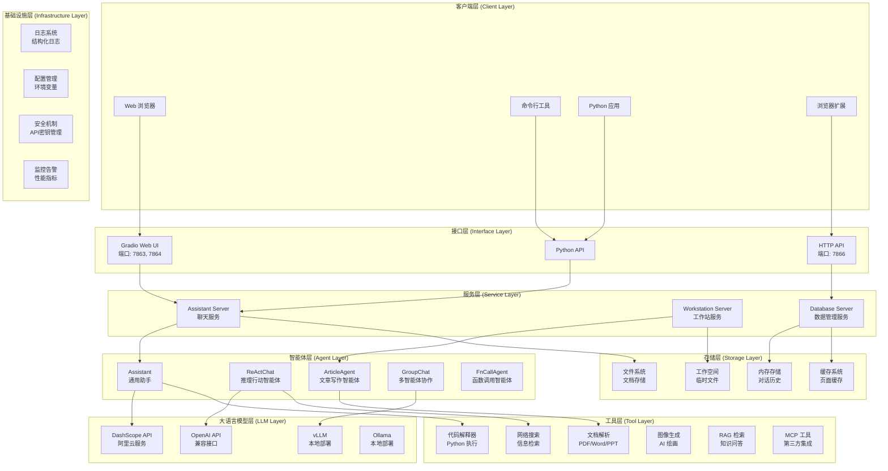
```mermaid
graph TD
    subgraph "客户端层 (Client Layer)"
        Web[Web 浏览器]
        CLI[命令行工具]
        Python[Python 应用]
        Browser[浏览器扩展]
    end
    
    subgraph "接口层 (Interface Layer)"
        WebUI[Gradio Web UI<br/>端口: 7863, 7864]
        HttpAPI[HTTP API<br/>端口: 7866]
        PythonAPI[Python API]
    end
    
    subgraph "服务层 (Service Layer)"
        AssistantSrv[Assistant Server<br/>聊天服务]
        WorkstationSrv[Workstation Server<br/>工作站服务]
        DatabaseSrv[Database Server<br/>数据管理服务]
    end
    
    subgraph "智能体层 (Agent Layer)"
        Assistant[Assistant<br/>通用助手]
        ReActChat[ReActChat<br/>推理行动智能体]
        ArticleAgent[ArticleAgent<br/>文章写作智能体]
        GroupChat[GroupChat<br/>多智能体协作]
        FnCallAgent[FnCallAgent<br/>函数调用智能体]
    end
    
    subgraph "大语言模型层 (LLM Layer)"
        DashScope[DashScope API<br/>阿里云服务]
        OpenAI[OpenAI API<br/>兼容接口]
        vLLM[vLLM<br/>本地部署]
        Ollama[Ollama<br/>本地部署]
    end
    
    subgraph "工具层 (Tool Layer)"
        CodeInterpreter[代码解释器<br/>Python 执行]
        WebSearch[网络搜索<br/>信息检索]
        DocParser[文档解析<br/>PDF/Word/PPT]
        ImageGen[图像生成<br/>AI 绘画]
        RAGTool[RAG 检索<br/>知识问答]
        MCPTools[MCP 工具<br/>第三方集成]
    end
    
    subgraph "存储层 (Storage Layer)"
        FileSystem[文件系统<br/>文档存储]
        Memory[内存存储<br/>对话历史]
        Cache[缓存系统<br/>页面缓存]
        Workspace[工作空间<br/>临时文件]
    end
    
    subgraph "基础设施层 (Infrastructure Layer)"
        Logging[日志系统<br/>结构化日志]
        Config[配置管理<br/>环境变量]
        Security[安全机制<br/>API密钥管理]
        Monitoring[监控告警<br/>性能指标]
    end
    
    %% 连接关系
    Web --> WebUI
    CLI --> PythonAPI
    Python --> PythonAPI
    Browser --> HttpAPI
    
    WebUI --> AssistantSrv
    HttpAPI --> DatabaseSrv
    PythonAPI --> AssistantSrv
    
    AssistantSrv --> Assistant
    WorkstationSrv --> ArticleAgent
    DatabaseSrv --> Memory
    
    Assistant --> DashScope
    ReActChat --> OpenAI
    GroupChat --> vLLM
    
    Assistant --> CodeInterpreter
    ReActChat --> WebSearch
    ArticleAgent --> DocParser
    
    AssistantSrv --> FileSystem
    DatabaseSrv --> Cache
    WorkstationSrv --> Workspace
```

## 2. 核心执行时序图

### 2.1 智能体对话完整流程

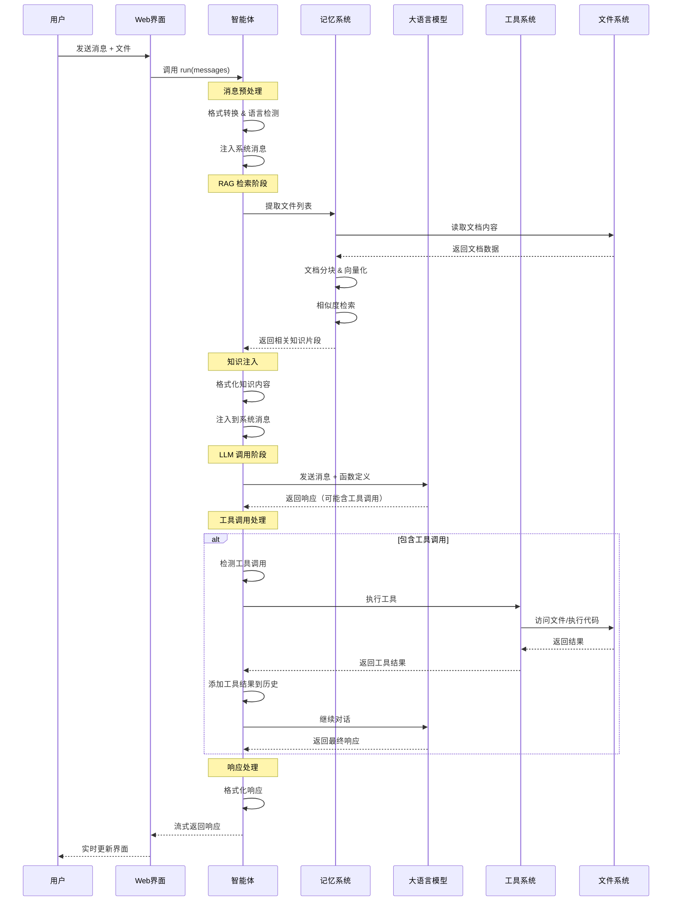
```mermaid
sequenceDiagram
    participant User as 用户
    participant WebUI as Web界面
    participant Agent as 智能体
    participant Memory as 记忆系统
    participant LLM as 大语言模型
    participant Tool as 工具系统
    participant FileSystem as 文件系统

    User->>WebUI: 发送消息 + 文件
    WebUI->>Agent: 调用 run(messages)
    
    Note over Agent: 消息预处理
    Agent->>Agent: 格式转换 & 语言检测
    Agent->>Agent: 注入系统消息
    
    Note over Agent: RAG 检索阶段
    Agent->>Memory: 提取文件列表
    Memory->>FileSystem: 读取文档内容
    FileSystem-->>Memory: 返回文档数据
    Memory->>Memory: 文档分块 & 向量化
    Memory->>Memory: 相似度检索
    Memory-->>Agent: 返回相关知识片段
    
    Note over Agent: 知识注入
    Agent->>Agent: 格式化知识内容
    Agent->>Agent: 注入到系统消息
    
    Note over Agent: LLM 调用阶段
    Agent->>LLM: 发送消息 + 函数定义
    LLM-->>Agent: 返回响应（可能含工具调用）
    
    Note over Agent: 工具调用处理
    alt 包含工具调用
        Agent->>Agent: 检测工具调用
        Agent->>Tool: 执行工具
        Tool->>FileSystem: 访问文件/执行代码
        FileSystem-->>Tool: 返回结果
        Tool-->>Agent: 返回工具结果
        
        Agent->>Agent: 添加工具结果到历史
        Agent->>LLM: 继续对话
        LLM-->>Agent: 返回最终响应
    end
    
    Note over Agent: 响应处理
    Agent->>Agent: 格式化响应
    Agent-->>WebUI: 流式返回响应
    WebUI-->>User: 实时更新界面
```

### 2.2 HTTP API 处理流程

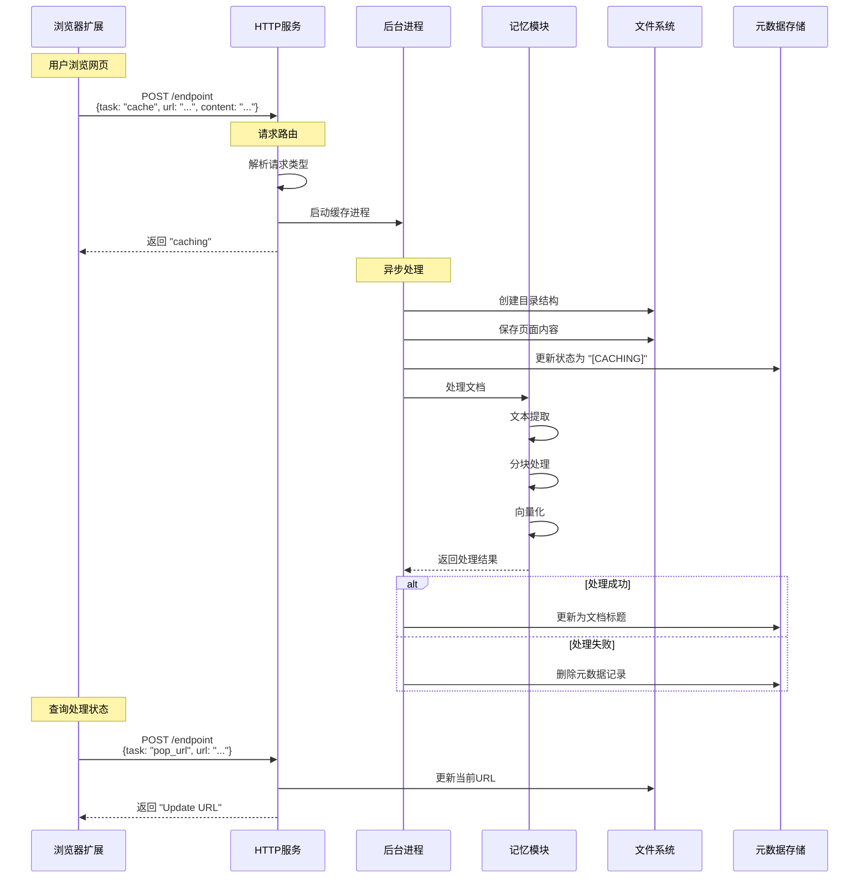
```mermaid
sequenceDiagram
    participant Browser as 浏览器扩展
    participant FastAPI as HTTP服务
    participant Process as 后台进程
    participant Memory as 记忆模块
    participant FileSystem as 文件系统
    participant MetaDB as 元数据存储

    Note over Browser: 用户浏览网页
    Browser->>FastAPI: POST /endpoint<br/>{task: "cache", url: "...", content: "..."}
    
    Note over FastAPI: 请求路由
    FastAPI->>FastAPI: 解析请求类型
    FastAPI->>Process: 启动缓存进程
    FastAPI-->>Browser: 返回 "caching"
    
    Note over Process: 异步处理
    Process->>FileSystem: 创建目录结构
    Process->>FileSystem: 保存页面内容
    Process->>MetaDB: 更新状态为 "[CACHING]"
    
    Process->>Memory: 处理文档
    Memory->>Memory: 文本提取
    Memory->>Memory: 分块处理
    Memory->>Memory: 向量化
    Memory-->>Process: 返回处理结果
    
    alt 处理成功
        Process->>MetaDB: 更新为文档标题
    else 处理失败
        Process->>MetaDB: 删除元数据记录
    end
    
    Note over Browser: 查询处理状态
    Browser->>FastAPI: POST /endpoint<br/>{task: "pop_url", url: "..."}
    FastAPI->>FileSystem: 更新当前URL
    FastAPI-->>Browser: 返回 "Update URL"
```

### 2.3 工具调用执行时序

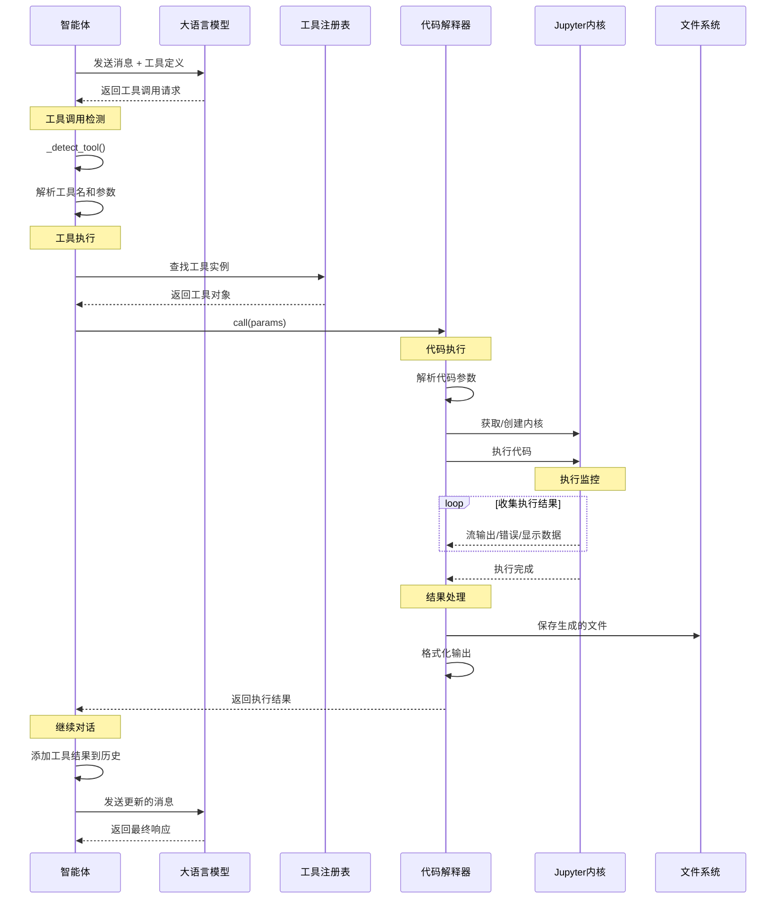
```mermaid
sequenceDiagram
    participant Agent as 智能体
    participant LLM as 大语言模型
    participant ToolRegistry as 工具注册表
    participant CodeInterpreter as 代码解释器
    participant Jupyter as Jupyter内核
    participant FileSystem as 文件系统

    Agent->>LLM: 发送消息 + 工具定义
    LLM-->>Agent: 返回工具调用请求
    
    Note over Agent: 工具调用检测
    Agent->>Agent: _detect_tool()
    Agent->>Agent: 解析工具名和参数
    
    Note over Agent: 工具执行
    Agent->>ToolRegistry: 查找工具实例
    ToolRegistry-->>Agent: 返回工具对象
    
    Agent->>CodeInterpreter: call(params)
    
    Note over CodeInterpreter: 代码执行
    CodeInterpreter->>CodeInterpreter: 解析代码参数
    CodeInterpreter->>Jupyter: 获取/创建内核
    CodeInterpreter->>Jupyter: 执行代码
    
    Note over Jupyter: 执行监控
    loop 收集执行结果
        Jupyter-->>CodeInterpreter: 流输出/错误/显示数据
    end
    
    Jupyter-->>CodeInterpreter: 执行完成
    
    Note over CodeInterpreter: 结果处理
    CodeInterpreter->>FileSystem: 保存生成的文件
    CodeInterpreter->>CodeInterpreter: 格式化输出
    CodeInterpreter-->>Agent: 返回执行结果
    
    Note over Agent: 继续对话
    Agent->>Agent: 添加工具结果到历史
    Agent->>LLM: 发送更新的消息
    LLM-->>Agent: 返回最终响应
```

## 3. 模块交互架构

### 3.1 智能体模块交互图

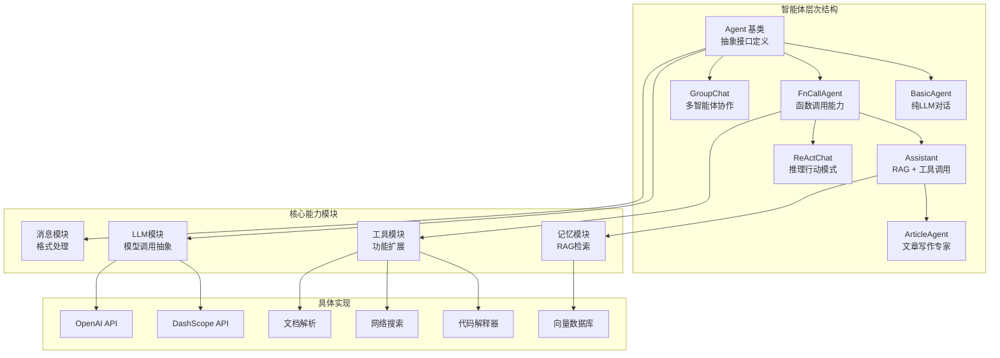
```mermaid
graph TB
    subgraph "智能体层次结构"
        Agent[Agent 基类<br/>抽象接口定义]
        BasicAgent[BasicAgent<br/>纯LLM对话]
        FnCallAgent[FnCallAgent<br/>函数调用能力]
        Assistant[Assistant<br/>RAG + 工具调用]
        ReActChat[ReActChat<br/>推理行动模式]
        GroupChat[GroupChat<br/>多智能体协作]
        ArticleAgent[ArticleAgent<br/>文章写作专家]
    end
    
    subgraph "核心能力模块"
        LLMModule[LLM模块<br/>模型调用抽象]
        ToolModule[工具模块<br/>功能扩展]
        MemoryModule[记忆模块<br/>RAG检索]
        MessageModule[消息模块<br/>格式处理]
    end
    
    subgraph "具体实现"
        DashScope[DashScope API]
        OpenAI[OpenAI API]
        CodeInterpreter[代码解释器]
        WebSearch[网络搜索]
        DocParser[文档解析]
        VectorDB[向量数据库]
    end
    
    %% 继承关系
    Agent --> BasicAgent
    Agent --> FnCallAgent
    FnCallAgent --> Assistant
    FnCallAgent --> ReActChat
    Agent --> GroupChat
    Assistant --> ArticleAgent
    
    %% 依赖关系
    Agent --> LLMModule
    Agent --> MessageModule
    FnCallAgent --> ToolModule
    Assistant --> MemoryModule
    
    %% 实现关系
    LLMModule --> DashScope
    LLMModule --> OpenAI
    ToolModule --> CodeInterpreter
    ToolModule --> WebSearch
    ToolModule --> DocParser
    MemoryModule --> VectorDB
```

### 3.2 LLM 模块架构图

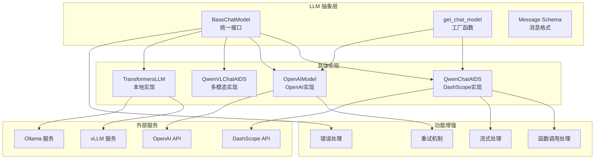
```mermaid
graph TD
    subgraph "LLM 抽象层"
        BaseChatModel[BaseChatModel<br/>统一接口]
        ModelFactory[get_chat_model<br/>工厂函数]
        Schema[Message Schema<br/>消息格式]
    end
    
    subgraph "具体实现"
        QwenDS[QwenChatAtDS<br/>DashScope实现]
        OpenAIModel[OpenAIModel<br/>OpenAI实现]
        QwenVL[QwenVLChatAtDS<br/>多模态实现]
        TransformersLLM[TransformersLLM<br/>本地实现]
    end
    
    subgraph "功能增强"
        FunctionCalling[函数调用处理]
        StreamProcessor[流式处理]
        RetryMechanism[重试机制]
        ErrorHandling[错误处理]
    end
    
    subgraph "外部服务"
        DashScopeAPI[DashScope API]
        OpenAIAPI[OpenAI API]
        vLLMServer[vLLM 服务]
        OllamaServer[Ollama 服务]
    end
    
    %% 接口实现
    BaseChatModel --> QwenDS
    BaseChatModel --> OpenAIModel
    BaseChatModel --> QwenVL
    BaseChatModel --> TransformersLLM
    
    %% 工厂创建
    ModelFactory --> QwenDS
    ModelFactory --> OpenAIModel
    
    %% 功能集成
    QwenDS --> FunctionCalling
    QwenDS --> StreamProcessor
    OpenAIModel --> RetryMechanism
    BaseChatModel --> ErrorHandling
    
    %% 外部调用
    QwenDS --> DashScopeAPI
    OpenAIModel --> OpenAIAPI
    TransformersLLM --> vLLMServer
    TransformersLLM --> OllamaServer
```

### 3.3 工具系统架构图

```mermaid
graph TB
    subgraph "工具抽象层"
        BaseTool[BaseTool<br/>工具基类]
        ToolRegistry[TOOL_REGISTRY<br/>工具注册表]
        RegisterDecorator[@register_tool<br/>注册装饰器]
    end
    
    subgraph "内置工具"
        CodeInterpreter[代码解释器<br/>Python执行]
        WebSearch[网络搜索<br/>信息检索]
        DocParser[文档解析<br/>多格式支持]
        ImageGen[图像生成<br/>AI绘画]
        Retrieval[RAG检索<br/>知识问答]
        AmapWeather[天气查询<br/>地理信息]
    end
    
    subgraph "执行环境"
        JupyterKernel[Jupyter内核<br/>代码执行]
        SearchEngine[搜索引擎<br/>Bing/Google]
        DocumentParsers[文档解析器<br/>PDF/Word/PPT]
        ImageServices[图像服务<br/>在线API]
        VectorStore[向量存储<br/>文档检索]
    end
    
    subgraph "扩展机制"
        MCPManager[MCP管理器<br/>第三方工具]
        CustomTools[自定义工具<br/>用户扩展]
        ToolConfig[工具配置<br/>参数管理]
    end
    
    %% 注册关系
    RegisterDecorator --> ToolRegistry
    BaseTool --> ToolRegistry
    
    %% 工具实现
    BaseTool --> CodeInterpreter
    BaseTool --> WebSearch
    BaseTool --> DocParser
    BaseTool --> ImageGen
    BaseTool --> Retrieval
    BaseTool --> AmapWeather
    
    %% 执行依赖
    CodeInterpreter --> JupyterKernel
    WebSearch --> SearchEngine
    DocParser --> DocumentParsers
    ImageGen --> ImageServices
    Retrieval --> VectorStore
    
    %% 扩展支持
    ToolRegistry --> MCPManager
    ToolRegistry --> CustomTools
    BaseTool --> ToolConfig
```

## 4. 数据流架构

### 4.1 消息流转图

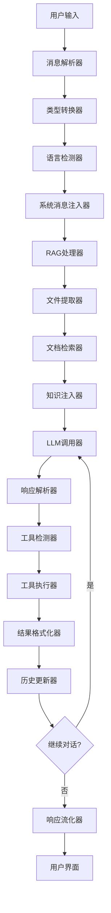
```mermaid
flowchart TD
    UserInput[用户输入] --> MessageParser[消息解析器]
    MessageParser --> TypeConverter[类型转换器]
    TypeConverter --> LanguageDetector[语言检测器]
    LanguageDetector --> SystemInjector[系统消息注入器]
    
    SystemInjector --> RAGProcessor[RAG处理器]
    RAGProcessor --> FileExtractor[文件提取器]
    FileExtractor --> DocumentRetriever[文档检索器]
    DocumentRetriever --> KnowledgeInjector[知识注入器]
    
    KnowledgeInjector --> LLMCaller[LLM调用器]
    LLMCaller --> ResponseParser[响应解析器]
    ResponseParser --> ToolDetector[工具检测器]
    
    ToolDetector --> ToolExecutor[工具执行器]
    ToolExecutor --> ResultFormatter[结果格式化器]
    ResultFormatter --> HistoryUpdater[历史更新器]
    
    HistoryUpdater --> ContinueDecision{继续对话?}
    ContinueDecision -->|是| LLMCaller
    ContinueDecision -->|否| ResponseStreamer[响应流化器]
    
    ResponseStreamer --> UserInterface[用户界面]
```

### 4.2 文件处理流程图

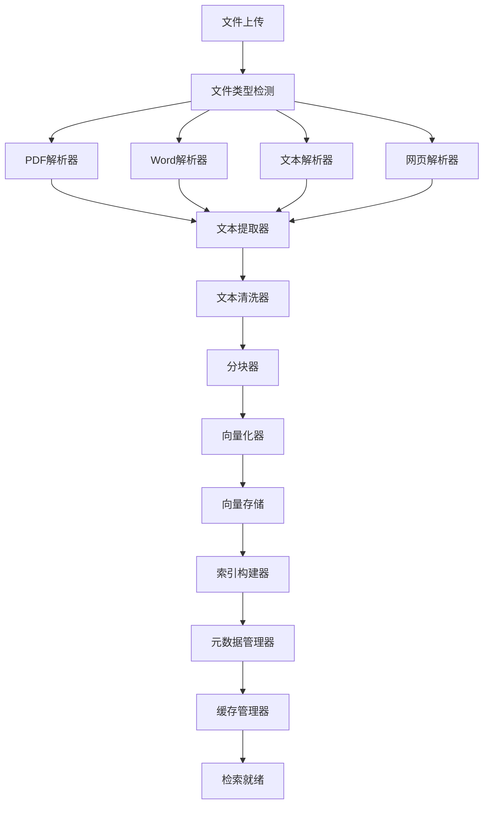
```mermaid
flowchart TD
    FileUpload[文件上传] --> FileTypeDetector[文件类型检测]
    
    FileTypeDetector --> PDFParser[PDF解析器]
    FileTypeDetector --> DocxParser[Word解析器]
    FileTypeDetector --> TxtParser[文本解析器]
    FileTypeDetector --> WebParser[网页解析器]
    
    PDFParser --> TextExtractor[文本提取器]
    DocxParser --> TextExtractor
    TxtParser --> TextExtractor
    WebParser --> TextExtractor
    
    TextExtractor --> TextCleaner[文本清洗器]
    TextCleaner --> ChunkSplitter[分块器]
    ChunkSplitter --> Embedder[向量化器]
    
    Embedder --> VectorStore[向量存储]
    VectorStore --> IndexBuilder[索引构建器]
    IndexBuilder --> MetadataManager[元数据管理器]
    
    MetadataManager --> CacheManager[缓存管理器]
    CacheManager --> RetrievalReady[检索就绪]
```

## 5. 部署架构

### 5.1 单机部署架构

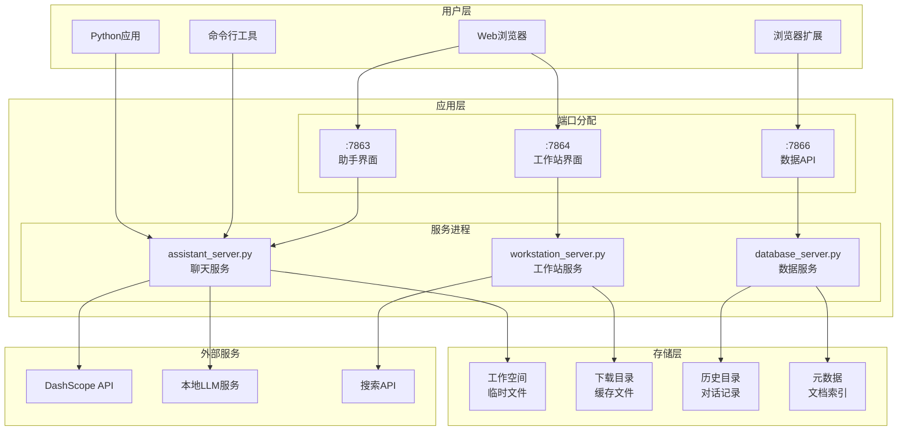
```mermaid
graph TB
    subgraph "用户层"
        WebBrowser[Web浏览器]
        BrowserExt[浏览器扩展]
        PythonApp[Python应用]
        CLI[命令行工具]
    end
    
    subgraph "应用层"
        subgraph "端口分配"
            Port7863[":7863<br/>助手界面"]
            Port7864[":7864<br/>工作站界面"]
            Port7866[":7866<br/>数据API"]
        end
        
        subgraph "服务进程"
            AssistantServer[assistant_server.py<br/>聊天服务]
            WorkstationServer[workstation_server.py<br/>工作站服务]
            DatabaseServer[database_server.py<br/>数据服务]
        end
    end
    
    subgraph "存储层"
        WorkSpace[工作空间<br/>临时文件]
        DownloadRoot[下载目录<br/>缓存文件]
        HistoryDir[历史目录<br/>对话记录]
        MetaData[元数据<br/>文档索引]
    end
    
    subgraph "外部服务"
        DashScopeAPI[DashScope API]
        LocalLLM[本地LLM服务]
        SearchAPI[搜索API]
    end
    
    %% 用户访问
    WebBrowser --> Port7863
    WebBrowser --> Port7864
    BrowserExt --> Port7866
    PythonApp --> AssistantServer
    CLI --> AssistantServer
    
    %% 服务映射
    Port7863 --> AssistantServer
    Port7864 --> WorkstationServer
    Port7866 --> DatabaseServer
    
    %% 存储访问
    AssistantServer --> WorkSpace
    WorkstationServer --> DownloadRoot
    DatabaseServer --> HistoryDir
    DatabaseServer --> MetaData
    
    %% 外部调用
    AssistantServer --> DashScopeAPI
    AssistantServer --> LocalLLM
    WorkstationServer --> SearchAPI
```

### 5.2 分布式部署架构

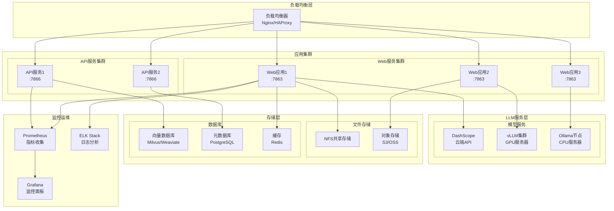
```mermaid
graph TB
    subgraph "负载均衡层"
        LoadBalancer[负载均衡器<br/>Nginx/HAProxy]
    end
    
    subgraph "应用集群"
        subgraph "Web服务集群"
            WebApp1[Web应用1<br/>:7863]
            WebApp2[Web应用2<br/>:7863]
            WebApp3[Web应用3<br/>:7863]
        end
        
        subgraph "API服务集群"
            APIServer1[API服务1<br/>:7866]
            APIServer2[API服务2<br/>:7866]
        end
    end
    
    subgraph "LLM服务层"
        subgraph "模型服务"
            DashScope[DashScope<br/>云端API]
            vLLMCluster[vLLM集群<br/>GPU服务器]
            OllamaNodes[Ollama节点<br/>CPU服务器]
        end
    end
    
    subgraph "存储层"
        subgraph "文件存储"
            NFS[NFS共享存储]
            S3[对象存储<br/>S3/OSS]
        end
        
        subgraph "数据库"
            VectorDB[向量数据库<br/>Milvus/Weaviate]
            MetaDB[元数据库<br/>PostgreSQL]
            Cache[缓存<br/>Redis]
        end
    end
    
    subgraph "监控运维"
        Prometheus[Prometheus<br/>指标收集]
        Grafana[Grafana<br/>监控面板]
        ELK[ELK Stack<br/>日志分析]
    end
    
    %% 流量分发
    LoadBalancer --> WebApp1
    LoadBalancer --> WebApp2
    LoadBalancer --> WebApp3
    LoadBalancer --> APIServer1
    LoadBalancer --> APIServer2
    
    %% 模型调用
    WebApp1 --> DashScope
    WebApp2 --> vLLMCluster
    WebApp3 --> OllamaNodes
    
    %% 存储访问
    WebApp1 --> NFS
    WebApp2 --> S3
    APIServer1 --> VectorDB
    APIServer2 --> MetaDB
    WebApp1 --> Cache
    
    %% 监控
    WebApp1 --> Prometheus
    APIServer1 --> Prometheus
    Prometheus --> Grafana
    WebApp1 --> ELK
```

## 6. 性能架构

### 6.1 并发处理架构

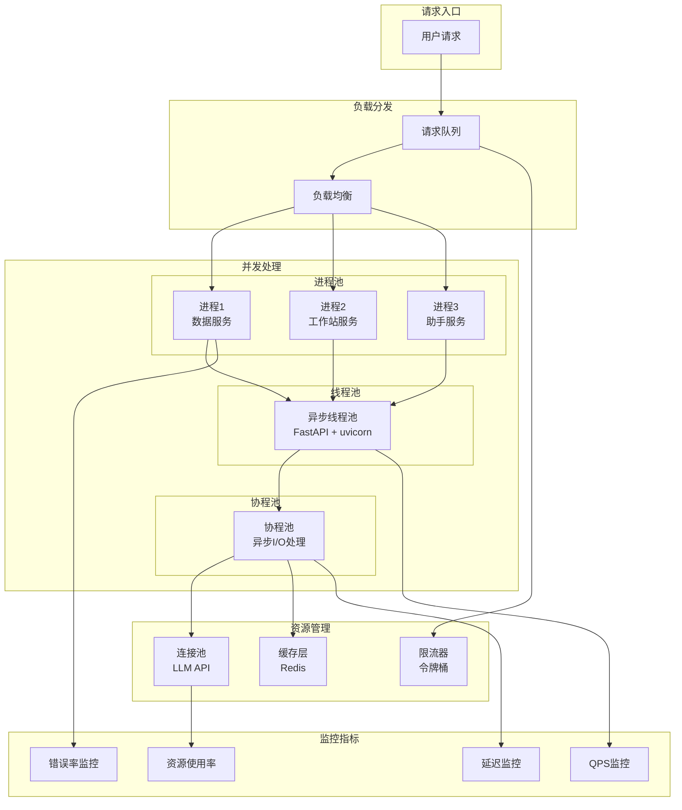
```mermaid
graph TB
    subgraph "请求入口"
        UserRequests[用户请求]
    end
    
    subgraph "负载分发"
        RequestQueue[请求队列]
        LoadBalancer[负载均衡]
    end
    
    subgraph "并发处理"
        subgraph "进程池"
            Process1[进程1<br/>数据服务]
            Process2[进程2<br/>工作站服务]
            Process3[进程3<br/>助手服务]
        end
        
        subgraph "线程池"
            ThreadPool[异步线程池<br/>FastAPI + uvicorn]
        end
        
        subgraph "协程池"
            AsyncPool[协程池<br/>异步I/O处理]
        end
    end
    
    subgraph "资源管理"
        ConnectionPool[连接池<br/>LLM API]
        CacheLayer[缓存层<br/>Redis]
        RateLimiter[限流器<br/>令牌桶]
    end
    
    subgraph "监控指标"
        QPS[QPS监控]
        Latency[延迟监控]
        ErrorRate[错误率监控]
        ResourceUsage[资源使用率]
    end
    
    %% 请求流转
    UserRequests --> RequestQueue
    RequestQueue --> LoadBalancer
    LoadBalancer --> Process1
    LoadBalancer --> Process2
    LoadBalancer --> Process3
    
    %% 并发处理
    Process1 --> ThreadPool
    Process2 --> ThreadPool
    Process3 --> ThreadPool
    ThreadPool --> AsyncPool
    
    %% 资源访问
    AsyncPool --> ConnectionPool
    AsyncPool --> CacheLayer
    RequestQueue --> RateLimiter
    
    %% 监控收集
    ThreadPool --> QPS
    AsyncPool --> Latency
    Process1 --> ErrorRate
    ConnectionPool --> ResourceUsage
```

### 6.2 缓存架构

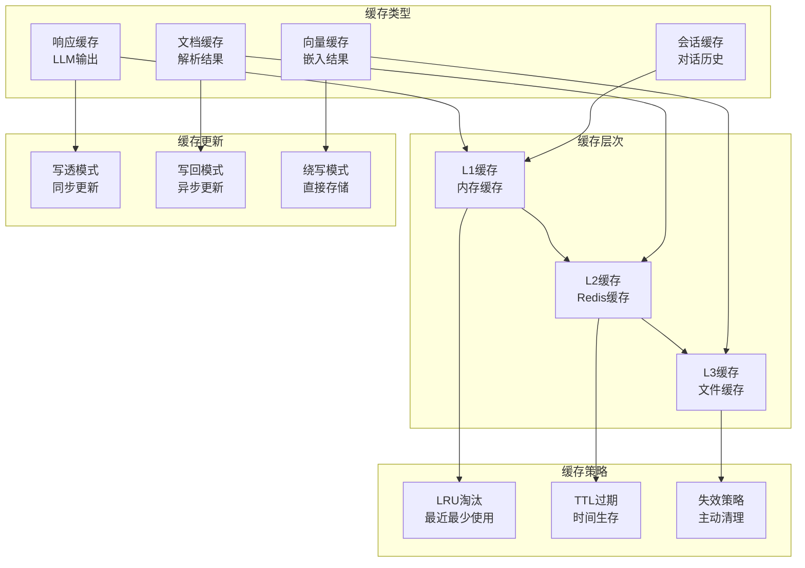
```mermaid
graph TB
    subgraph "缓存层次"
        L1Cache[L1缓存<br/>内存缓存]
        L2Cache[L2缓存<br/>Redis缓存]
        L3Cache[L3缓存<br/>文件缓存]
    end
    
    subgraph "缓存类型"
        ResponseCache[响应缓存<br/>LLM输出]
        DocumentCache[文档缓存<br/>解析结果]
        VectorCache[向量缓存<br/>嵌入结果]
        SessionCache[会话缓存<br/>对话历史]
    end
    
    subgraph "缓存策略"
        LRU[LRU淘汰<br/>最近最少使用]
        TTL[TTL过期<br/>时间生存]
        Invalidation[失效策略<br/>主动清理]
    end
    
    subgraph "缓存更新"
        WriteThrough[写透模式<br/>同步更新]
        WriteBack[写回模式<br/>异步更新]
        WriteAround[绕写模式<br/>直接存储]
    end
    
    %% 层次关系
    L1Cache --> L2Cache
    L2Cache --> L3Cache
    
    %% 类型分布
    ResponseCache --> L1Cache
    DocumentCache --> L2Cache
    VectorCache --> L3Cache
    SessionCache --> L1Cache
    
    %% 策略应用
    L1Cache --> LRU
    L2Cache --> TTL
    L3Cache --> Invalidation
    
    %% 更新机制
    ResponseCache --> WriteThrough
    DocumentCache --> WriteBack
    VectorCache --> WriteAround
```

这个架构分析提供了 Qwen-Agent 项目的完整技术视图，包括系统架构、模块交互、数据流转、部署方案和性能设计，为开发者和架构师提供了全面的技术参考。
        Jupyter[Jupyter 内核<br/>代码执行环境]
        FastAPI[FastAPI<br/>Web 框架]
        Gradio[Gradio<br/>UI 框架]
        Multiprocess[多进程管理<br/>并发处理]
    end
    
    %% 连接关系
    Web --> WebUI
    CLI --> PythonAPI
    Python --> PythonAPI
    Browser --> HttpAPI
    
    WebUI --> AssistantSrv
    WebUI --> WorkstationSrv
    HttpAPI --> DatabaseSrv
    PythonAPI --> Assistant
    
    AssistantSrv --> Assistant
    WorkstationSrv --> ReActChat
    WorkstationSrv --> ArticleAgent
    DatabaseSrv --> Memory
    
    Assistant --> DashScope
    ReActChat --> OpenAI
    ArticleAgent --> vLLM
    GroupChat --> Ollama
    
    Assistant --> CodeInterpreter
    ReActChat --> WebSearch
    ArticleAgent --> DocParser
    FnCallAgent --> ImageGen
    Assistant --> RAGTool
    
    CodeInterpreter --> Jupyter
    WebSearch --> FileSystem
    DocParser --> Cache
    RAGTool --> Memory
    
    AssistantSrv --> FastAPI
    WorkstationSrv --> Gradio
    DatabaseSrv --> Multiprocess
```

## 2. 核心用例时序图

### 2.1 用户聊天对话时序

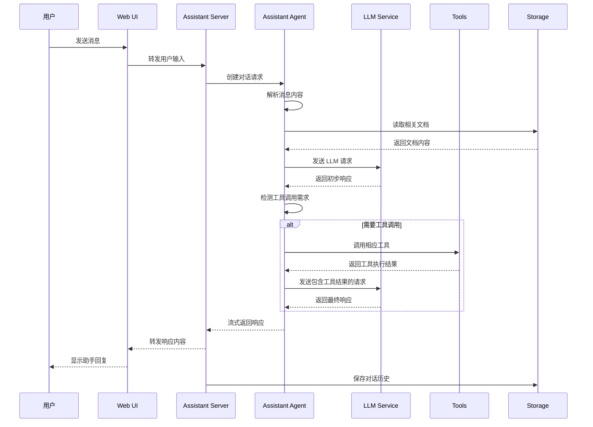
```mermaid
sequenceDiagram
    participant U as 用户
    participant W as Web UI
    participant A as Assistant Server
    participant AG as Assistant Agent
    participant L as LLM Service
    participant T as Tools
    participant S as Storage
    
    U->>W: 发送消息
    W->>A: 转发用户输入
    A->>AG: 创建对话请求
    
    AG->>AG: 解析消息内容
    AG->>S: 读取相关文档
    S-->>AG: 返回文档内容
    
    AG->>L: 发送 LLM 请求
    L-->>AG: 返回初步响应
    
    AG->>AG: 检测工具调用需求
    alt 需要工具调用
        AG->>T: 调用相应工具
        T-->>AG: 返回工具执行结果
        AG->>L: 发送包含工具结果的请求
        L-->>AG: 返回最终响应
    end
    
    AG-->>A: 流式返回响应
    A-->>W: 转发响应内容
    W-->>U: 显示助手回复
    
    A->>S: 保存对话历史
```

### 2.2 代码执行时序

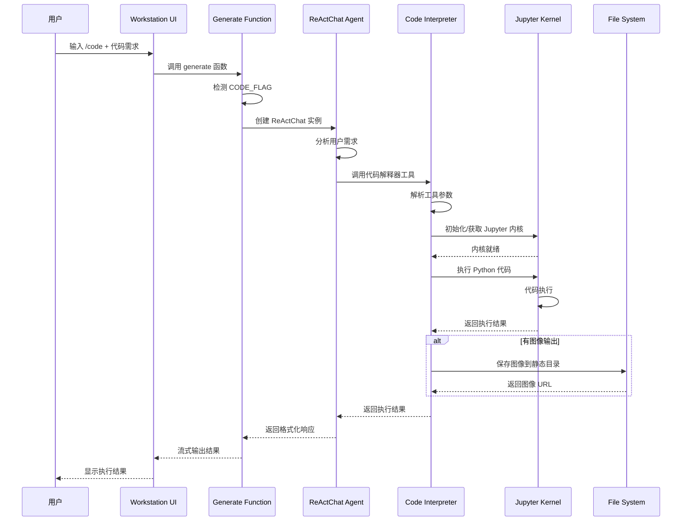
```mermaid
sequenceDiagram
    participant U as 用户
    participant W as Workstation UI
    participant G as Generate Function
    participant R as ReActChat Agent
    participant C as Code Interpreter
    participant J as Jupyter Kernel
    participant F as File System
    
    U->>W: 输入 /code + 代码需求
    W->>G: 调用 generate 函数
    G->>G: 检测 CODE_FLAG
    G->>R: 创建 ReActChat 实例
    
    R->>R: 分析用户需求
    R->>C: 调用代码解释器工具
    
    C->>C: 解析工具参数
    C->>J: 初始化/获取 Jupyter 内核
    J-->>C: 内核就绪
    
    C->>J: 执行 Python 代码
    J->>J: 代码执行
    J-->>C: 返回执行结果
    
    alt 有图像输出
        C->>F: 保存图像到静态目录
        F-->>C: 返回图像 URL
    end
    
    C-->>R: 返回执行结果
    R-->>G: 返回格式化响应
    G-->>W: 流式输出结果
    W-->>U: 显示执行结果
```

### 2.3 文档问答时序

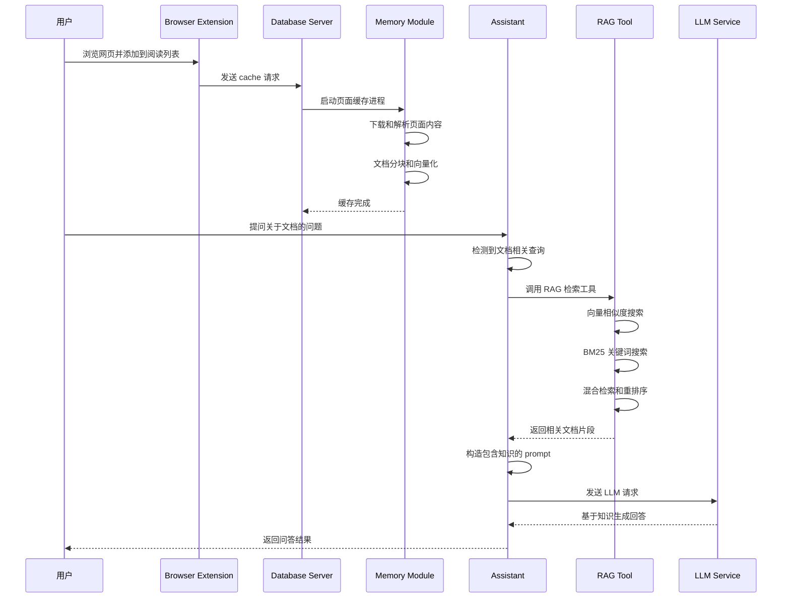
```mermaid
sequenceDiagram
    participant U as 用户
    participant B as Browser Extension
    participant D as Database Server
    participant M as Memory Module
    participant A as Assistant
    participant RAG as RAG Tool
    participant L as LLM Service
    
    U->>B: 浏览网页并添加到阅读列表
    B->>D: 发送 cache 请求
    D->>M: 启动页面缓存进程
    
    M->>M: 下载和解析页面内容
    M->>M: 文档分块和向量化
    M-->>D: 缓存完成
    
    U->>A: 提问关于文档的问题
    A->>A: 检测到文档相关查询
    A->>RAG: 调用 RAG 检索工具
    
    RAG->>RAG: 向量相似度搜索
    RAG->>RAG: BM25 关键词搜索
    RAG->>RAG: 混合检索和重排序
    RAG-->>A: 返回相关文档片段
    
    A->>A: 构造包含知识的 prompt
    A->>L: 发送 LLM 请求
    L-->>A: 基于知识生成回答
    A-->>U: 返回问答结果
```

## 3. 模块交互图

### 3.1 智能体模块交互

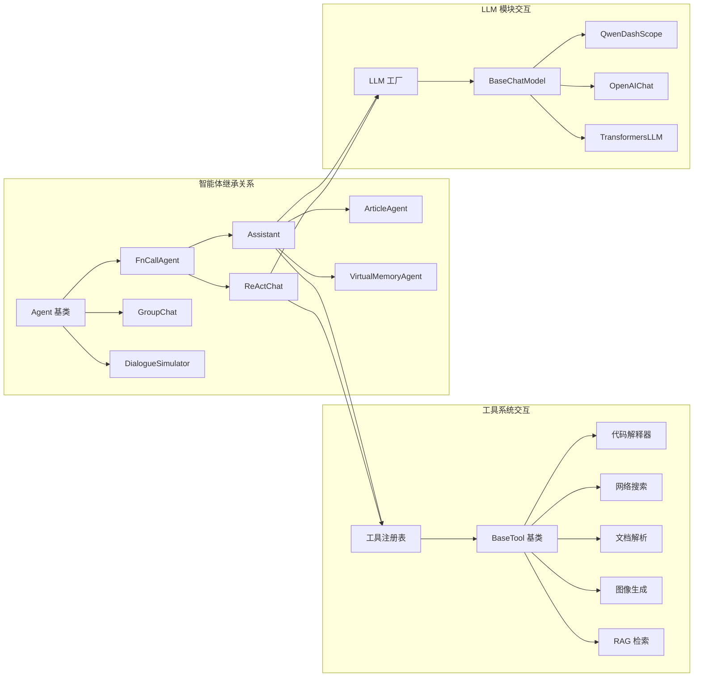
```mermaid
graph LR
    subgraph "智能体继承关系"
        Agent[Agent 基类] --> FnCallAgent[FnCallAgent]
        FnCallAgent --> Assistant[Assistant]
        FnCallAgent --> ReActChat[ReActChat]
        Assistant --> ArticleAgent[ArticleAgent]
        Assistant --> VirtualMemoryAgent[VirtualMemoryAgent]
        Agent --> GroupChat[GroupChat]
        Agent --> DialogueSimulator[DialogueSimulator]
    end
    
    subgraph "工具系统交互"
        ToolRegistry[工具注册表] --> BaseTool[BaseTool 基类]
        BaseTool --> CodeInterpreter[代码解释器]
        BaseTool --> WebSearch[网络搜索]
        BaseTool --> DocParser[文档解析]
        BaseTool --> ImageGen[图像生成]
        BaseTool --> RAGTool[RAG 检索]
    end
    
    subgraph "LLM 模块交互"
        LLMFactory[LLM 工厂] --> BaseChatModel[BaseChatModel]
        BaseChatModel --> QwenDashScope[QwenDashScope]
        BaseChatModel --> OpenAIChat[OpenAIChat]
        BaseChatModel --> TransformersLLM[TransformersLLM]
    end
    
    Assistant --> ToolRegistry
    ReActChat --> ToolRegistry
    Assistant --> LLMFactory
    ReActChat --> LLMFactory
```

### 3.2 服务器模块交互

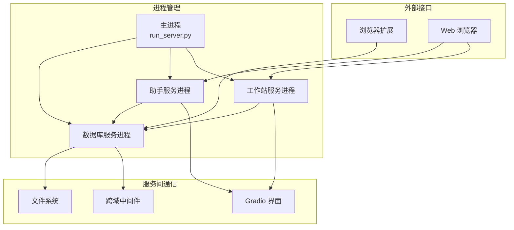
```mermaid
graph TB
    subgraph "进程管理"
        MainProcess[主进程<br/>run_server.py] --> DatabaseProcess[数据库服务进程]
        MainProcess --> AssistantProcess[助手服务进程]
        MainProcess --> WorkstationProcess[工作站服务进程]
    end
    
    subgraph "服务间通信"
        DatabaseProcess --> FileSystem[文件系统]
        AssistantProcess --> DatabaseProcess
        WorkstationProcess --> DatabaseProcess
        
        DatabaseProcess --> CORS[跨域中间件]
        AssistantProcess --> GradioUI[Gradio 界面]
        WorkstationProcess --> GradioUI
    end
    
    subgraph "外部接口"
        BrowserExt[浏览器扩展] --> DatabaseProcess
        WebBrowser[Web 浏览器] --> AssistantProcess
        WebBrowser --> WorkstationProcess
    end
```

## 4. 初始化与关闭流程

### 4.1 系统启动流程

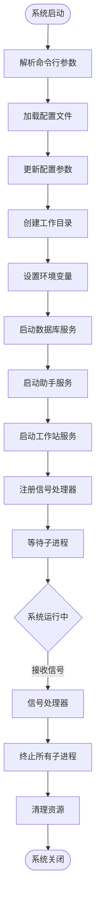
```mermaid
flowchart TD
    Start([系统启动]) --> ParseArgs[解析命令行参数]
    ParseArgs --> LoadConfig[加载配置文件]
    LoadConfig --> UpdateConfig[更新配置参数]
    UpdateConfig --> CreateDirs[创建工作目录]
    
    CreateDirs --> SetEnvVars[设置环境变量]
    SetEnvVars --> StartDatabase[启动数据库服务]
    StartDatabase --> StartAssistant[启动助手服务]
    StartAssistant --> StartWorkstation[启动工作站服务]
    
    StartWorkstation --> RegisterSignals[注册信号处理器]
    RegisterSignals --> WaitProcesses[等待子进程]
    
    WaitProcesses --> Running{系统运行中}
    Running -->|接收信号| SignalHandler[信号处理器]
    SignalHandler --> TerminateProcesses[终止所有子进程]
    TerminateProcesses --> CleanupResources[清理资源]
    CleanupResources --> End([系统关闭])
```

### 4.2 智能体初始化流程

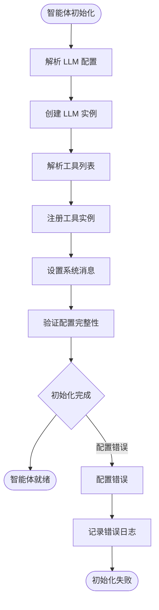
```mermaid
flowchart TD
    AgentInit([智能体初始化]) --> ParseLLMConfig[解析 LLM 配置]
    ParseLLMConfig --> CreateLLMInstance[创建 LLM 实例]
    CreateLLMInstance --> ParseTools[解析工具列表]
    
    ParseTools --> RegisterTools[注册工具实例]
    RegisterTools --> SetSystemMessage[设置系统消息]
    SetSystemMessage --> ValidateConfig[验证配置完整性]
    
    ValidateConfig --> Ready{初始化完成}
    Ready --> AgentReady([智能体就绪])
    
    Ready -->|配置错误| ConfigError[配置错误]
    ConfigError --> LogError[记录错误日志]
    LogError --> InitFailed([初始化失败])
```

### 4.3 工具初始化流程

```mermaid
flowchart TD
    ToolInit([工具初始化]) --> CheckToolType{工具类型检查}
    
    CheckToolType -->|字符串| LookupRegistry[从注册表查找]
    CheckToolType -->|字典| ParseConfig[解析工具配置]
    CheckToolType -->|对象| ValidateInstance[验证工具实例]
    
    LookupRegistry --> CreateInstance[创建工具实例]
    ParseConfig --> CreateInstance
    ValidateInstance --> SetupTool[设置工具参数]
    
    CreateInstance --> SetupTool
    SetupTool --> ValidateTool[验证工具功能]
    ValidateTool --> RegisterFunction[注册函数签名]
    
    RegisterFunction --> ToolReady([工具就绪])
    
    ValidateTool -->|验证失败| ToolError[工具错误]
    ToolError --> LogToolError[记录工具错误]
    LogToolError --> SkipTool[跳过该工具]
```

## 5. 数据流分析

### 5.1 消息流转

```mermaid
flowchart LR
    UserInput[用户输入] --> MessageParser[消息解析器]
    MessageParser --> MessageQueue[消息队列]
    MessageQueue --> AgentDispatcher[智能体分发器]
    
    AgentDispatcher --> Agent[智能体实例]
    Agent --> LLMCall[LLM 调用]
    Agent --> ToolCall[工具调用]
    
    LLMCall --> ResponseParser[响应解析器]
    ToolCall --> ToolResult[工具结果]
    ToolResult --> ResponseParser
    
    ResponseParser --> MessageFormatter[消息格式化]
    MessageFormatter --> StreamOutput[流式输出]
    StreamOutput --> UserInterface[用户界面]
```

### 5.2 文件处理流

```mermaid
flowchart TD
    FileUpload[文件上传] --> FileTypeDetect[文件类型检测]
    FileTypeDetect --> FileParser{解析器选择}
    
    FileParser -->|PDF| PDFParser[PDF 解析器]
    FileParser -->|Word| DocxParser[Word 解析器]
    FileParser -->|PPT| PPTParser[PPT 解析器]
    FileParser -->|Text| TextParser[文本解析器]
    FileParser -->|Web| WebExtractor[网页提取器]
    
    PDFParser --> TextExtraction[文本提取]
    DocxParser --> TextExtraction
    PPTParser --> TextExtraction
    TextParser --> TextExtraction
    WebExtractor --> TextExtraction
    
    TextExtraction --> TextChunking[文本分块]
    TextChunking --> VectorEmbedding[向量嵌入]
    VectorEmbedding --> IndexStorage[索引存储]
    IndexStorage --> RAGReady[RAG 就绪]
```

## 6. 并发与性能架构

### 6.1 并发模型

```mermaid
graph TD
    subgraph "进程级并发"
        MainProcess[主进程] --> DatabaseProcess[数据库服务进程]
        MainProcess --> AssistantProcess[助手服务进程]
        MainProcess --> WorkstationProcess[工作站服务进程]
    end
    
    subgraph "线程级并发"
        DatabaseProcess --> FastAPIThreads[FastAPI 线程池]
        AssistantProcess --> GradioThreads[Gradio 线程池]
        WorkstationProcess --> GradioThreads2[Gradio 线程池]
    end
    
    subgraph "异步处理"
        FastAPIThreads --> AsyncCache[异步缓存处理]
        GradioThreads --> StreamingResponse[流式响应处理]
        GradioThreads2 --> BackgroundTasks[后台任务处理]
    end
    
    subgraph "工具并发"
        AsyncCache --> JupyterKernel[Jupyter 内核]
        StreamingResponse --> LLMCalls[LLM 并发调用]
        BackgroundTasks --> ToolExecution[工具并发执行]
    end
```

### 6.2 性能优化策略

| 层级 | 优化策略 | 实现方式 | 预期效果 |
|------|----------|----------|----------|
| **网络层** | 连接复用 | HTTP Keep-Alive | 减少连接开销 |
| **应用层** | 流式处理 | Generator 模式 | 降低延迟感知 |
| **智能体层** | 上下文缓存 | LRU 缓存 | 减少重复计算 |
| **工具层** | 结果缓存 | 文件系统缓存 | 避免重复执行 |
| **存储层** | 分块存储 | 增量更新 | 提高 I/O 效率 |

## 7. 安全架构

### 7.1 安全边界

```mermaid
graph TB
    subgraph "外部边界"
        Internet[互联网] --> Firewall[防火墙]
        Firewall --> LoadBalancer[负载均衡器]
    end
    
    subgraph "应用边界"
        LoadBalancer --> CORS[CORS 中间件]
        CORS --> RateLimiter[速率限制器]
        RateLimiter --> AuthMiddleware[认证中间件]
    end
    
    subgraph "服务边界"
        AuthMiddleware --> ServiceMesh[服务网格]
        ServiceMesh --> ServiceAuth[服务间认证]
        ServiceAuth --> DataValidation[数据验证]
    end
    
    subgraph "执行边界"
        DataValidation --> SandboxEnv[沙箱环境]
        SandboxEnv --> ResourceLimiter[资源限制器]
        ResourceLimiter --> AuditLogger[审计日志]
    end
```

### 7.2 安全控制措施

| 安全域 | 威胁类型 | 控制措施 | 实现状态 |
|--------|----------|----------|----------|
| **网络安全** | DDoS 攻击 | 速率限制、CORS | ✅ 已实现 |
| **输入安全** | 注入攻击 | 参数验证、转义 | ✅ 已实现 |
| **执行安全** | 恶意代码 | Jupyter 沙箱 | ⚠️ 部分实现 |
| **数据安全** | 敏感信息泄露 | 访问控制、加密 | 🔄 待完善 |
| **API 安全** | 未授权访问 | 认证授权 | 🔄 待完善 |

## 8. 可扩展性架构

### 8.1 水平扩展

```mermaid
graph LR
    subgraph "负载均衡层"
        LB[负载均衡器] --> Instance1[实例 1]
        LB --> Instance2[实例 2]
        LB --> InstanceN[实例 N]
    end
    
    subgraph "服务发现"
        Registry[服务注册中心] --> Instance1
        Registry --> Instance2
        Registry --> InstanceN
    end
    
    subgraph "共享存储"
        Instance1 --> SharedFS[共享文件系统]
        Instance2 --> SharedFS
        InstanceN --> SharedFS
        
        Instance1 --> SharedCache[共享缓存]
        Instance2 --> SharedCache
        InstanceN --> SharedCache
    end
```

### 8.2 垂直扩展

```mermaid
graph TD
    subgraph "计算资源扩展"
        CPU[CPU 核心数] --> Performance[性能提升]
        Memory[内存容量] --> Concurrency[并发能力]
        GPU[GPU 加速] --> LLMSpeed[LLM 推理速度]
    end
    
    subgraph "存储资源扩展"
        DiskSpace[磁盘空间] --> FileCapacity[文件存储能力]
        DiskSpeed[磁盘速度] --> IOPerformance[I/O 性能]
        NetworkBW[网络带宽] --> DataTransfer[数据传输速度]
    end
```

## 验收清单

- [x] 全局架构图完整清晰
- [x] 核心用例时序图详细
- [x] 模块交互关系明确
- [x] 初始化和关闭流程完整
- [x] 数据流分析透彻
- [x] 并发与性能架构说明
- [x] 安全架构考虑周全
- [x] 可扩展性设计合理
