- [1. 项目概述](#1-项目概述)  
- [2. Ray框架使用示例](#2-ray框架使用示例)
- [3. 整体架构设计](#3-整体架构设计)
- [4. 核心API详解](#4-核心api详解)
- [5. 模块架构图](#5-模块架构图)
- [6. 时序图分析](#6-时序图分析)
- [7. 关键数据结构](#7-关键数据结构)

---

## 1. 项目概述

Ray是一个统一的分布式计算框架，专为扩展AI和Python应用程序而设计。它为机器学习、数据处理、强化学习等工作负载提供简单、通用的API。

### 1.1 Ray的核心价值
- **统一框架**: 从笔记本电脑到云集群的无缝扩展
- **简化分布式编程**: 提供Tasks、Actors、Objects等原语  
- **专业AI库**: 为常见ML工作负载提供可扩展的库
- **资源管理**: 自动处理调度、容错和自动扩缩容

### 1.2 三层架构体系

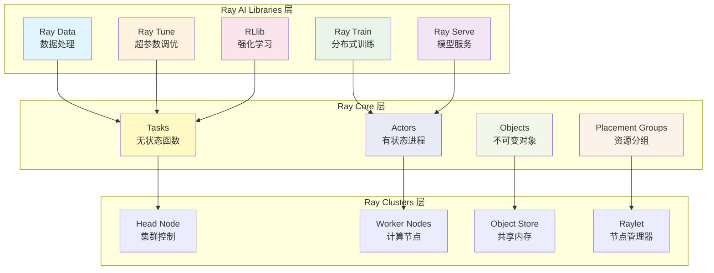

---

## 2. Ray框架使用示例

### 2.1 基本初始化和任务执行

```python
"""
Ray基础使用示例
功能：展示Ray的初始化、任务创建和执行流程
"""
import ray
import time
import numpy as np

# 初始化Ray - 自动检测或启动Ray集群
# ray.init() 函数会：
# 1. 检查是否存在现有Ray集群
# 2. 如果不存在，启动本地Ray实例  
# 3. 建立与集群的连接
ray.init()

@ray.remote
def compute_pi(n_samples: int) -> float:
    """
    使用蒙特卡洛方法计算π值
    
    参数:
        n_samples (int): 采样点数量
        
    返回:
        float: π的近似值
        
    功能说明:

        1. 生成随机点对(x,y)
        2. 计算落在单位圆内的点数
        3. 使用比例关系估算π值
    """
    count_inside = 0
    for _ in range(n_samples):
        x, y = np.random.random(2)
        if x*x + y*y <= 1:
            count_inside += 1
    return 4.0 * count_inside / n_samples

# 并行执行任务 - 创建多个远程任务
# .remote() 方法返回ObjectRef，代表异步计算结果
futures = [compute_pi.remote(1000000) for _ in range(4)]

# 等待所有任务完成并获取结果
# ray.get() 阻塞等待ObjectRef对应的计算完成
results = ray.get(futures)

# 计算平均值得到最终π估计
pi_estimate = sum(results) / len(results)
print(f"π的估计值: {pi_estimate}")

ray.shutdown()
```

### 2.2 Actor模式示例

```python
"""
Ray Actor使用示例
功能：演示有状态的分布式计算模式
"""
import ray

ray.init()

@ray.remote
class Counter:
    """
    分布式计数器Actor
    
    功能说明:
        Actor是有状态的远程对象，可以：

        1. 维护内部状态
        2. 处理并发方法调用
        3. 在集群中的特定节点上运行
    """
    
    def __init__(self):
        """
        初始化计数器状态
        注意：__init__方法在远程节点上执行
        """
        self.count = 0
        self.history = []
    
    def increment(self, delta: int = 1) -> int:
        """
        增加计数器值
        
        参数:
            delta (int): 增量值，默认为1
            
        返回:
            int: 更新后的计数值
            
        功能说明:
            每次调用都会修改Actor的内部状态
        """
        self.count += delta
        self.history.append(('increment', delta, self.count))
        return self.count
    
    def get_count(self) -> int:
        """
        获取当前计数值
        
        返回:
            int: 当前计数值
        """
        return self.count
    
    def get_history(self) -> list:
        """
        获取操作历史
        
        返回:
            list: 包含所有操作记录的列表
        """
        return self.history

# 创建Actor实例 - 在远程节点上启动
# .remote() 返回ActorHandle，用于与Actor交互
counter_actor = Counter.remote()

# 并行调用Actor方法
# 每个方法调用返回ObjectRef
increment_refs = [counter_actor.increment.remote(i) for i in range(1, 6)]

# 获取所有增量操作的结果
increment_results = ray.get(increment_refs)
print(f"增量操作结果: {increment_results}")

# 获取最终计数和历史记录
final_count = ray.get(counter_actor.get_count.remote())
history = ray.get(counter_actor.get_history.remote())

print(f"最终计数: {final_count}")
print(f"操作历史: {history}")

ray.shutdown()
```

### 2.3 对象存储示例

```python
"""
Ray对象存储使用示例
功能：演示大对象的高效存储和共享
"""
import ray
import numpy as np

ray.init()

def create_large_array(size: int) -> np.ndarray:
    """
    创建大型数组用于演示对象存储
    
    参数:
        size (int): 数组大小
        
    返回:
        np.ndarray: 随机数组
    """
    return np.random.random((size, size))

# 创建大型对象并放入对象存储
# ray.put() 将对象存储在共享内存中
large_array = create_large_array(1000)
array_ref = ray.put(large_array)

print(f"对象引用: {array_ref}")
print(f"数组形状: {large_array.shape}")
print(f"数组大小: {large_array.nbytes / 1024 / 1024:.2f} MB")

@ray.remote
def process_array_chunk(array_ref, start_row: int, end_row: int) -> float:
    """
    处理数组的一个chunk
    
    参数:
        array_ref: 数组的ObjectRef
        start_row (int): 起始行
        end_row (int): 结束行
        
    返回:
        float: chunk的平均值
        
    功能说明:
        通过ObjectRef访问共享内存中的对象，避免数据复制
    """
    # ray.get()从对象存储中获取数组
    # 由于在共享内存中，这是零拷贝操作
    array = ray.get(array_ref)
    chunk = array[start_row:end_row, :]
    return np.mean(chunk)

# 并行处理数组的不同部分
num_chunks = 4
chunk_size = 1000 // num_chunks

chunk_futures = []
for i in range(num_chunks):
    start = i * chunk_size
    end = start + chunk_size
    # 传递ObjectRef而不是实际数组，避免序列化开销
    future = process_array_chunk.remote(array_ref, start, end)
    chunk_futures.append(future)

# 获取所有chunk的处理结果
chunk_means = ray.get(chunk_futures)
overall_mean = sum(chunk_means) / len(chunk_means)

print(f"各chunk平均值: {chunk_means}")
print(f"整体平均值: {overall_mean}")

ray.shutdown()
```

---

## 3. 整体架构设计

### 3.1 核心组件架构图

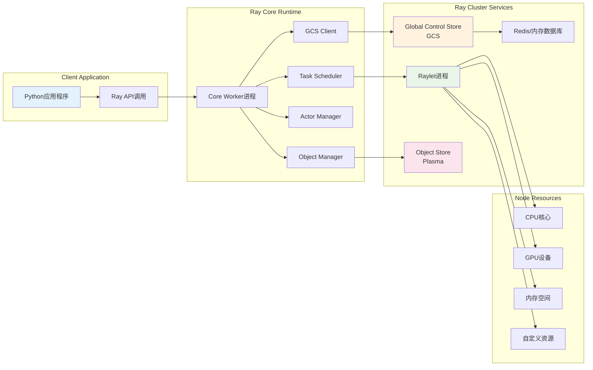

### 3.2 分布式系统组件交互

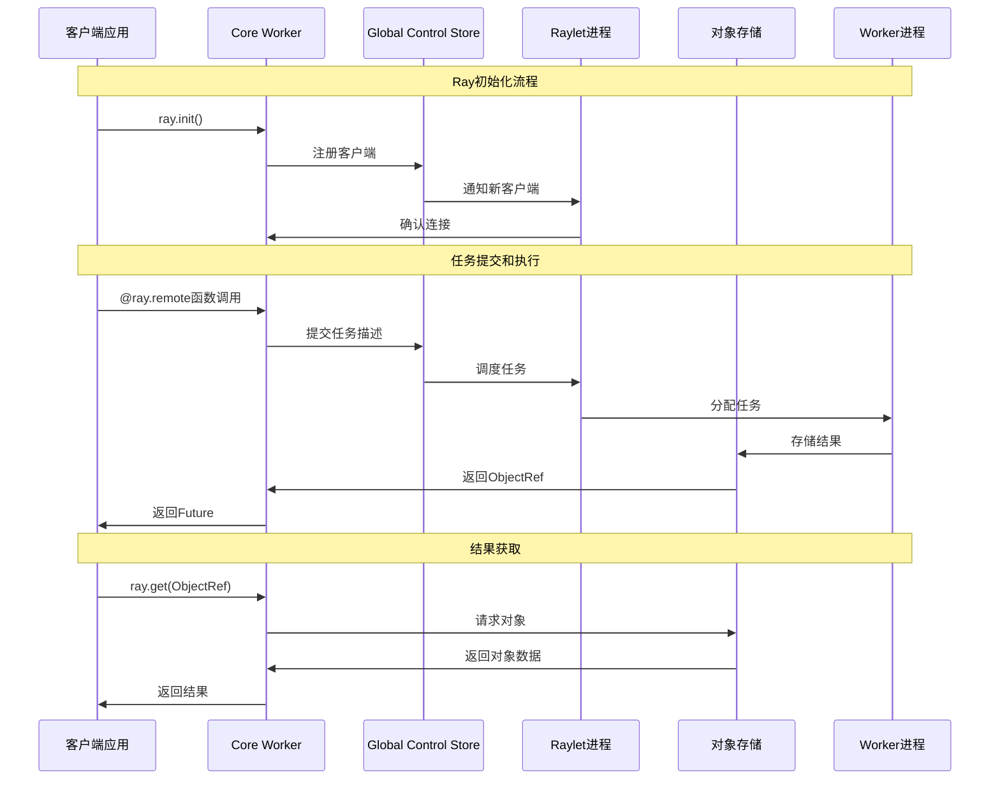

---

## 4. 核心API详解

### 4.1 ray.init() - 集群初始化

```python
# 位置: python/ray/_private/worker.py:1425-1622
@PublicAPI
@client_mode_hook
def init(
    address: Optional[str] = None,
    *,
    num_cpus: Optional[int] = None,
    num_gpus: Optional[int] = None,
    resources: Optional[Dict[str, float]] = None,
    # ... 其他参数
) -> BaseContext:
    """
    连接到现有Ray集群或启动新集群并连接
    
    核心功能：

    1. 集群发现和连接
    2. 资源配置和管理
    3. 运行时环境设置
    4. 日志和监控配置
    
    参数说明：
        address: Ray集群地址，支持多种格式
            - None: 自动检测或启动本地集群
            - "auto": 连接现有集群，不存在则报错
            - "local": 强制启动新的本地集群
            - "ray://host:port": 连接远程集群
            - "localhost:port": 连接本地集群
            
        num_cpus: 分配的CPU核心数，默认基于虚拟核心数
        num_gpus: 分配的GPU数量，默认基于检测到的GPU数
        resources: 自定义资源字典，映射资源名到数量
        
    返回值：
        BaseContext: 包含集群信息的上下文对象
            - ClientContext: 远程集群连接（ray://协议）
            - RayContext: 本地集群连接
    """

```

**初始化流程分析：**

```python
def init(address=None, **kwargs):
    """
    Ray初始化的核心逻辑分解：
    
    1. 参数验证和预处理
       - 检查重复初始化
       - 验证资源配置
       - 处理环境变量
    
    2. 集群连接逻辑
       - 地址解析和处理
       - 现有集群检测
       - 新集群启动决策
    
    3. 核心组件初始化
       - Core Worker启动
       - GCS客户端连接
       - 对象存储初始化
    
    4. 运行时环境配置
       - 日志系统设置
       - 序列化配置
       - 监控系统启动
    """
    
    # 1. 检查是否已经初始化
    if ray.is_initialized():
        if not ignore_reinit_error:
            raise RuntimeError("Ray已经初始化")
        return ray._private.worker.global_worker.get_context()
    
    # 2. 解析连接地址
    if address is None:
        # 检查环境变量RAY_ADDRESS
        address = os.environ.get("RAY_ADDRESS")
        if address is None:
            # 检查最近启动的集群
            address = _find_latest_cluster_address()
    
    # 3. 启动或连接集群
    if address and address.startswith("ray://"):
        # 远程集群连接
        return _init_client_mode(address, **kwargs)
    else:
        # 本地集群模式
        return _init_local_mode(address, **kwargs)

```

### 4.2 @ray.remote - 远程装饰器

```python
# 位置: python/ray/_private/worker.py:3552-3782
@PublicAPI
def remote(*args, **kwargs) -> Union[RemoteFunction, ActorClass]:
    """
    定义远程函数或Actor类的装饰器
    
    核心功能：

    1. 将普通Python函数/类转换为分布式版本
    2. 配置资源需求和执行策略
    3. 提供.remote()调用接口
    4. 管理序列化和反序列化
    
    使用模式：
        @ray.remote  # 无参数装饰器
        @ray.remote(num_cpus=2, num_gpus=1)  # 带参数装饰器
        remote_func = ray.remote(function)  # 函数调用形式
    """
    
    if len(args) == 1 and len(kwargs) == 0 and callable(args[0]):
        # 无参数装饰器形式: @ray.remote
        return _make_remote(args[0], {})
    
    # 带参数装饰器形式: @ray.remote(num_cpus=2)
    return functools.partial(_make_remote, options=kwargs)

def _make_remote(function_or_class, options):
    """
    创建远程对象的核心实现
    
    参数：
        function_or_class: 要转换的函数或类
        options: 配置选项字典
        
    返回：
        RemoteFunction或ActorClass实例
    """
    # 设置模块信息，用于序列化
    if not function_or_class.__module__:
        function_or_class.__module__ = "global"
    
    if inspect.isfunction(function_or_class) or is_cython(function_or_class):
        # 处理函数：创建RemoteFunction
        ray_option_utils.validate_task_options(options, in_options=False)
        return ray.remote_function.RemoteFunction(
            Language.PYTHON,
            function_or_class,
            None,  # function_descriptor
            options,
        )
    
    if inspect.isclass(function_or_class):
        # 处理类：创建ActorClass
        ray_option_utils.validate_actor_options(options, in_options=False)
        return ray.actor._make_actor(function_or_class, options)
    
    raise TypeError("@ray.remote装饰器只能应用于函数或类")
```

### 4.3 RemoteFunction - 远程函数实现

```python
# 位置: python/ray/remote_function.py:41-190
@PublicAPI
class RemoteFunction:
    """
    远程函数的封装类
    
    核心职责：

    1. 函数元信息管理
    2. 任务提交和调度
    3. 序列化和反序列化
    4. 资源需求管理
    
    属性：
        _language: 目标语言（Python/Java/C++）
        _function: 原始函数对象
        _function_descriptor: 函数描述符，用于序列化
        _default_options: 默认执行选项
        _runtime_env: 运行时环境配置
    """
    
    def __init__(self, language, function, function_descriptor, task_options):
        """
        初始化远程函数
        
        参数：
            language: 语言类型（Language.PYTHON）
            function: 原始Python函数
            function_descriptor: 函数描述符
            task_options: 任务配置选项
        """
        # 验证和设置任务选项
        ray_option_utils.validate_task_options(task_options, in_options=False)
        self._default_options = {}
        self._default_options.update(task_options)
        
        # 处理资源需求
        if "num_cpus" not in self._default_options:
            self._default_options["num_cpus"] = 1  # 默认1个CPU
        if "num_returns" not in self._default_options:
            self._default_options["num_returns"] = 1  # 默认返回1个值
        
        # 处理运行时环境
        self._runtime_env = self._default_options.get("runtime_env")
        if self._runtime_env:
            self._serialized_base_runtime_env_info = get_runtime_env_info(
                self._runtime_env,
                is_job_runtime_env=False,
                serialize=True,
            )
        
        # 设置函数属性
        self._language = language
        self._is_generator = inspect.isgeneratorfunction(function)
        self._function = function
        self._function_name = function.__module__ + "." + function.__name__
        self._function_descriptor = function_descriptor
        
        # 创建.remote()方法代理
        @wraps(function)
        def _remote_proxy(*args, **kwargs):
            return self._remote(
                serialized_runtime_env_info=self._serialized_base_runtime_env_info,
                args=args,
                kwargs=kwargs,
                **self._default_options,
            )
        
        self.remote = _remote_proxy
    
    def __call__(self, *args, **kwargs):
        """
        禁止直接调用远程函数
        必须使用.remote()方法
        """
        raise TypeError(
            "远程函数不能直接调用。"
            f"请使用 '{self._function_name}.remote()' 而不是 '{self._function_name}()'"
        )
    
    def _remote(self, args, kwargs, **task_options):
        """
        提交远程任务的核心实现
        
        参数：
            args: 位置参数
            kwargs: 关键字参数  
            task_options: 任务配置选项
            
        返回：
            ObjectRef: 任务结果的异步引用
        """
        # 1. 参数序列化和处理
        # 2. 资源需求计算
        # 3. 任务提交到调度器
        # 4. 返回ObjectRef
        pass
    
    def options(self, **task_options):
        """
        创建带有新选项的RemoteFunction副本
        
        功能：
            允许在运行时覆盖函数的默认选项
            
        用法：
            new_func = original_func.options(num_cpus=2, num_gpus=1)
            result = new_func.remote(args)
        """
        # 合并新选项和默认选项
        updated_options = self._default_options.copy()
        updated_options.update(task_options)
        
        # 返回新的RemoteFunction实例
        return RemoteFunction(
            self._language,
            self._function,
            self._function_descriptor,
            updated_options,
        )

```

---

## 5. 模块架构图

### 5.1 Ray Core模块架构

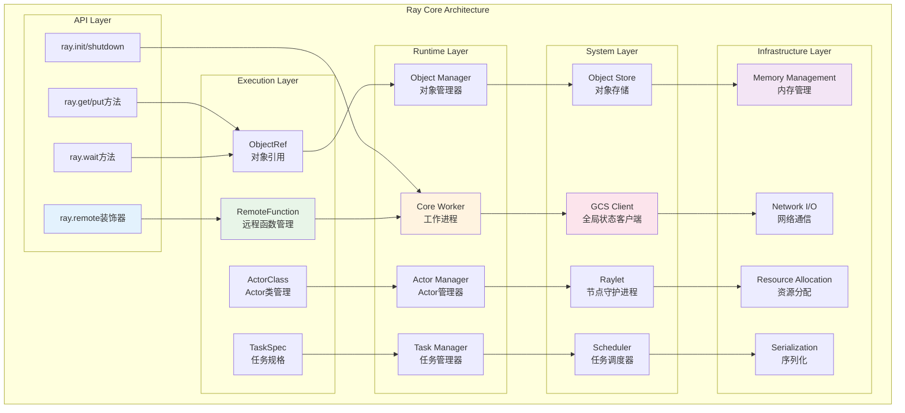

### 5.2 数据流架构图

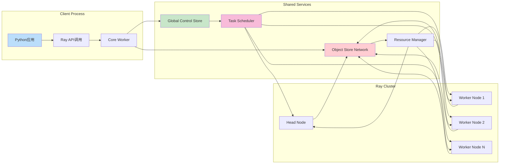

---

## 6. 时序图分析

### 6.1 Ray初始化时序图

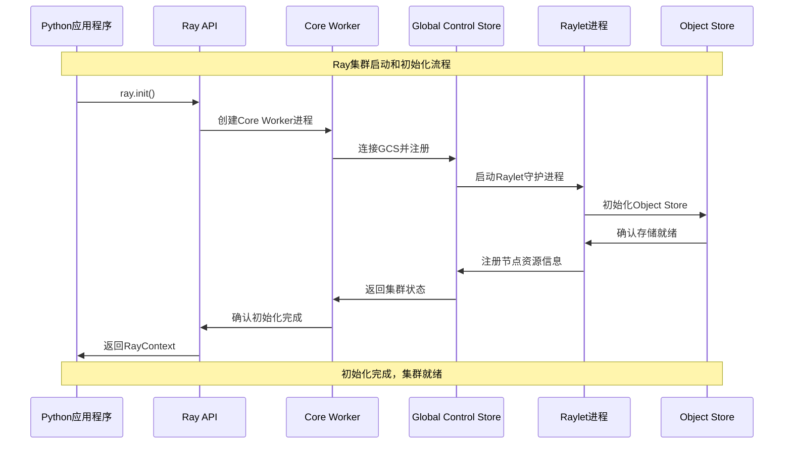

### 6.2 任务提交和执行时序图

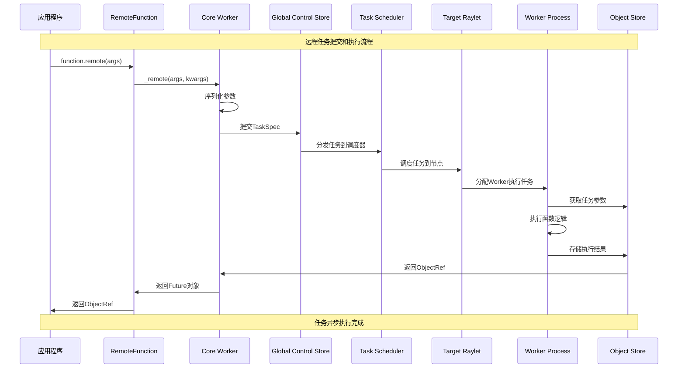

### 6.3 Actor创建和方法调用时序图

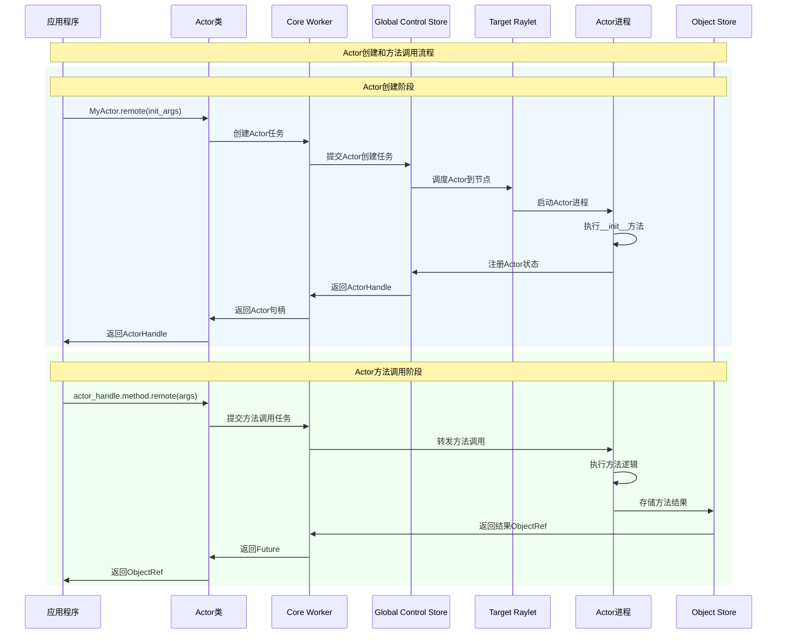

---

## 7. 关键数据结构

### 7.1 ObjectRef - 对象引用UML图

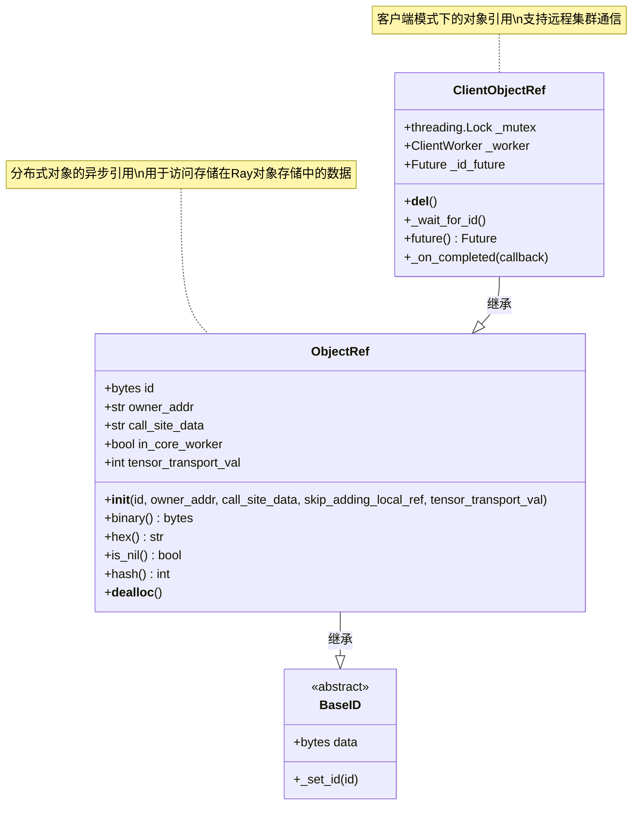

### 7.2 ActorHandle - Actor句柄UML图

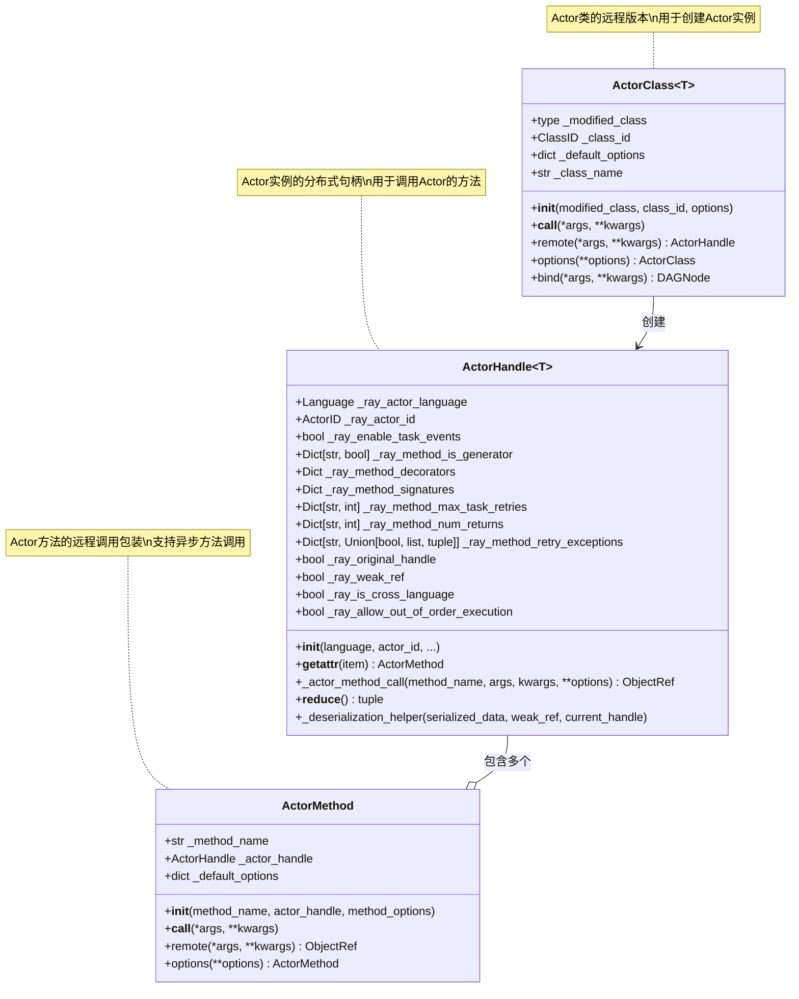

### 7.3 Task和TaskSpec数据结构

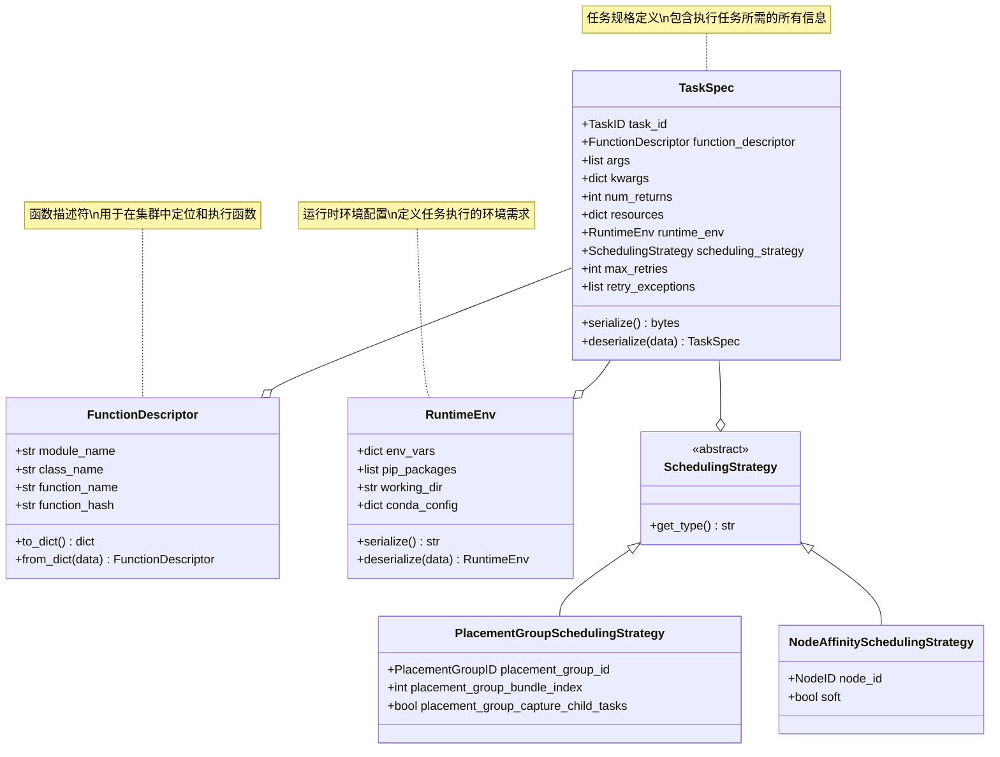

---

## 总结

Ray分布式计算框架通过三层架构设计，为Python开发者提供了简单而强大的分布式计算能力：

1. **Ray AI Libraries层**：提供专门的AI/ML库，如数据处理、训练、调优等
2. **Ray Core层**：提供基础的分布式计算原语（Tasks、Actors、Objects）
3. **Ray Clusters层**：管理底层的集群资源和服务

核心设计原则包括：

- **简单易用**：通过装饰器和简单API隐藏分布式复杂性
- **高性能**：零拷贝对象存储和高效任务调度
- **可扩展**：从单机到大规模集群的无缝扩展
- **容错性**：内建的故障检测和恢复机制
- **通用性**：支持各种计算模式和工作负载

下一步将深入分析各个具体模块的实现细节和架构设计。
